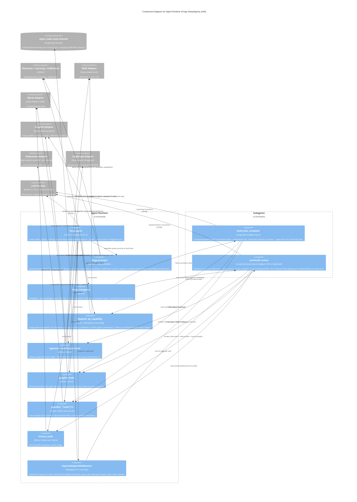

# C4 Level 3 — Agent Runtime (Component Diagram)

> **Generated:** 2026-04-23 via `/system-design`
> **Container:** `Agent Runtime` (from [container.md](../../architecture/container.md))
> **Components inside:** 9 (7 modules + supervisor state + subgraph reference)
> **Status:** Awaiting Rich's approval (C4 L3 review gate)

---

## Purpose

The Agent Runtime is Forge's DeepAgents shell — the reasoning loop, the tool layer, and the two sub-agents (`build_plan_composer` sync, `autobuild_runner` async). This diagram decomposes it into its internal components and shows how they cooperate at runtime.

Why this container warrants an L3 (ADR-ARCH-031 threshold): 7+ internal modules plus the AsyncSubAgent separate-graph pattern creates enough structural complexity that a single L2 node obscures more than it reveals.

---

## Diagram

---

## What to look for

- **`forge.agent` is the hub** — expected; it's the entry point that wires everything.
- **No direct module-to-module I/O** — every adapter call goes through a `@tool`, and every adapter is crossed via one explicit arrow.
- **Two distinct subagent patterns** — sync `build_plan_composer` sits inside the same graph; async `autobuild_runner` is its own graph linked via the `async_tasks` state channel (ADR-ARCH-031).
- **ApprovalRequestPayload path is wide but explicit** — `tools_approval` talks to NATS (publish), SQLite (mark paused), and LangGraph (rehydrate resume). Three collaborators for a single tool, all justified by the round-trip contract.
- **Tool-layer breadth** — 5 tool-module clusters. Could compress further but each group has a distinct semantic home (dispatch vs approval vs graphiti vs guardkit vs history).

Node count: 16 / 30 threshold.

---

## Module mapping

| Diagram component | Source module(s) |
|---|---|
| `forge.agent` | `src/forge/agent.py` |
| `forge.prompts` | `src/forge/prompts/__init__.py` + per-role templates |
| `forge.subagents` | `src/forge/subagents/__init__.py` (spec factories) |
| `dispatch_by_capability` | `src/forge/tools/dispatch.py` |
| `approval + notification tools` | `src/forge/tools/approval.py`, `notification.py` |
| `graphiti_tools` | `src/forge/tools/graphiti.py` |
| `guardkit_* tools` | `src/forge/tools/guardkit/*.py` (11 files) |
| `history_tools` | `src/forge/tools/history.py` |
| `AsyncSubAgentMiddleware` | DeepAgents `deepagents.middleware.async_subagent` |
| `build_plan_composer` | `src/forge/subagents/build_plan_composer.py` |
| `autobuild_runner` | `src/forge/subagents/autobuild_runner.py` (separate graph entry) |

---

## Related

- C4 L2: [container.md](../../architecture/container.md)
- ADRs: ADR-ARCH-001, ADR-ARCH-002, ADR-ARCH-020, ADR-ARCH-031
- Adjacent L3: [domain-core.md](domain-core.md)
- Subagent contract: [API-subagents.md](../contracts/API-subagents.md)
- Async state contract: [DDR-006](../decisions/DDR-006-async-subagent-state-channel-contract.md)
