# C4 Level 3 — Domain Core (Component Diagram)

> **Generated:** 2026-04-23 via `/system-design`
> **Container:** `Discovery + Learning + Calibration` (from [container.md](../../architecture/container.md))
> **Components inside:** 7 pure domain modules
> **Status:** Awaiting Rich's approval (C4 L3 review gate)

---

## Purpose

The Domain Core is the pure-reasoning layer of Forge: no I/O imports, every function is testable without a NATS / SQLite / Graphiti stand-up. It owns gating logic, state-machine transition rules, notification reasoning, learning-pattern detection, calibration normalisation, live capability resolution, and history labelling.

All I/O is delegated to adapters (NATS, SQLite, Graphiti, subprocess) — the Domain Core invokes them via injected interfaces, never imports them directly.

Why this container warrants an L3 (>3 components): 7 modules with non-trivial relationships between them (gating consumes calibration priors, learning observes gate decisions, discovery feeds capability lists into prompt assembly). A single L2 node hides the flows.

---

## Diagram

```mermaid
C4Component
    title Component diagram for Domain Core (pure, no I/O)

    Container_Boundary(core, "Domain Core") {
        Component(gating, "forge.gating", "Python (pure)", "evaluate_gate() — takes coach_score, priors, detections, constitutional rules; returns GateDecision. No static thresholds (ADR-ARCH-019); reasoning-driven.")
        Component(state_machine, "forge.state_machine", "Python (pure)", "Valid BuildStatus transitions. Validates writer intents before SQLite commit.")
        Component(notifications, "forge.notifications", "Python (pure)", "Decides whether to emit a NotificationPayload based on retrieved Rich-ack-behaviour priors. No static config (ADR-ARCH-019).")
        Component(learning, "forge.learning", "Python (pure)", "Detects override patterns across recent gate decisions. Produces OverridePatternObservation + proposed CalibrationAdjustment.")
        Component(calibration, "forge.calibration", "Python (pure)", "Normalises raw history events (response_raw → ResponseKind + accepted_default). Triggers incremental refresh cycle.")
        Component(discovery, "forge.discovery", "Python (pure-ish; holds in-memory cache)", "30s TTL cache of agent manifests. resolve(tool_name, intent_pattern) selects target agent per ADR-ARCH-015 algorithm.")
        Component(history_labels, "forge.history_labels", "Python (pure)", "Thin helper — formats reasoning-model-chosen stage_label for SQLite persistence + forge history rendering.")
    }

    Container_Ext(prompts, "forge.prompts", "Python", "System prompt templates — consumes output of discovery + calibration + learning to fill placeholders.")

    Container_Ext(nats_adapter, "NATS Adapter", "forge.adapters.nats", "Publishes, subscribes, watches KV, feeds discovery callbacks.")
    Container_Ext(sqlite_adapter, "SQLite Adapter", "forge.adapters.sqlite", "Only writes via transitions validated by state_machine.")
    Container_Ext(graphiti_adapter, "Graphiti Adapter", "forge.adapters.graphiti", "Persists GateDecision + CapabilityResolution + CalibrationAdjustment; retrieves priors.")
    Container_Ext(history_parser, "History Parser Adapter", "forge.adapters.history_parser", "Tokenises markdown → CalibrationEvent stream; calibration normalises output.")
    Container_Ext(tools_approval, "approval_tools", "Python @tool", "Calls gating.evaluate_gate; on FLAG/HARD_STOP/MANDATORY, invokes request_approval tool.")
    Container_Ext(tools_history, "history_tools", "Python @tool", "Uses state_machine.validate_transition before record_build_transition writes.")
    Container_Ext(tools_dispatch, "dispatch_by_capability", "Python @tool", "Resolution via discovery; publishes via NATS.")

    Rel(gating, calibration, "read CalibrationEvent priors (in-process structs; reads from graphiti_adapter)")
    Rel(gating, learning, "query approved CalibrationAdjustment list")
    Rel(gating, graphiti_adapter, "retrieve PriorReference evidence + OverrideEvent history", "injected")
    Rel(gating, tools_approval, "return GateDecision; tool turns it into interrupt() + NATS publish")

    Rel(state_machine, sqlite_adapter, "validate_transition() called before commit", "injected")
    Rel(state_machine, tools_history, "transition validation")

    Rel(notifications, graphiti_adapter, "retrieve Rich-ack-behaviour priors", "injected")
    Rel(notifications, tools_approval, "decide emit_notification vs skip")

    Rel(learning, graphiti_adapter, "read OverrideEvent stream + CalibrationAdjustment chain; write propose_adjustments", "injected")
    Rel(learning, gating, "observation output feeds future evaluate_gate runs via priors")

    Rel(calibration, history_parser, "consume parsed CalibrationEvent stream", "injected")
    Rel(calibration, graphiti_adapter, "bulk add_calibration_events", "injected")
    Rel(calibration, sqlite_adapter, "update HistoryFileSnapshot bookkeeping", "injected")

    Rel(discovery, nats_adapter, "watch_fleet callback + KV read", "injected")
    Rel(discovery, graphiti_adapter, "persist CapabilityResolution after each dispatch", "injected")
    Rel(discovery, tools_dispatch, "resolve(tool_name, intent_pattern) → agent_id")

    Rel(history_labels, tools_history, "format stage_label on record_stage write")

    Rel(prompts, discovery, "list_capabilities for {available_capabilities}")
    Rel(prompts, calibration, "retrieved CalibrationEvent priors for {calibration_priors}")
    Rel(prompts, learning, "approved CalibrationAdjustment list")
```

---

## What to look for

- **No domain → adapter direct imports** — every line from a Domain Core component into an adapter is marked `injected`. The modules take adapters as constructor arguments (Hexagonal ports-and-adapters), never reach for them directly.
- **`gating` is central** — expected; it's the reasoning pivot. Input from calibration + learning + graphiti (priors); output into approval_tools (gate decisions). Four collaborators, all justified.
- **`learning` ↔ `gating` is indirect** — learning writes adjustments to Graphiti; gating retrieves them as priors. No circular import. Clean read-write-read cycle through the graph store.
- **`state_machine` has one caller** — `tools_history` via validate_transition. Tight and easy to test.
- **`discovery` is the odd one out** — it holds an in-memory cache, so it's "pure-ish" rather than strictly stateless. The cache is a defensible exception because it's the performance-critical hot path during dispatch resolution.

Node count: 15 / 30 threshold.

---

## Module mapping

| Diagram component | Source module |
|---|---|
| `forge.gating` | `src/forge/gating.py` |
| `forge.state_machine` | `src/forge/state_machine.py` |
| `forge.notifications` | `src/forge/notifications.py` |
| `forge.learning` | `src/forge/learning.py` |
| `forge.calibration` | `src/forge/calibration.py` |
| `forge.discovery` | `src/forge/discovery.py` |
| `forge.history_labels` | `src/forge/history_labels.py` |

---

## Related

- C4 L2: [container.md](../../architecture/container.md)
- ADRs: ADR-ARCH-001 (hexagonal), ADR-ARCH-015 (capability dispatch), ADR-ARCH-016 (fleet catalogue), ADR-ARCH-019 (no static behavioural config)
- Adjacent L3: [agent-runtime.md](agent-runtime.md)
- Data models: [DM-gating.md](../models/DM-gating.md), [DM-calibration.md](../models/DM-calibration.md), [DM-discovery.md](../models/DM-discovery.md), [DM-build-lifecycle.md](../models/DM-build-lifecycle.md)
