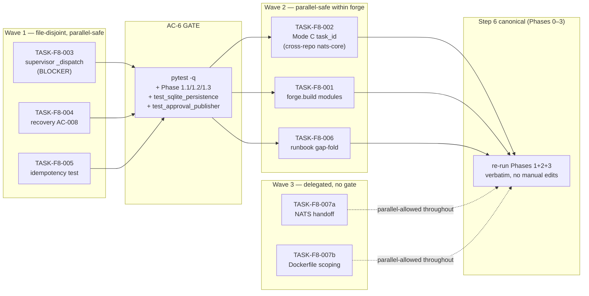

/task-review TASK-REV-C3E7 --mode=architectural

Review complete. Task moved to tasks/completed/TASK-REV-C3E7/.

Summary
TASK-REV-C3E7 — [I]mplemented

Report: .claude/reviews/TASK-REV-C3E7-review-report.md
Score: 75/100 (pre-merge gate inventory thin; 6 blockers for /system-arch now addressed)
What was done
Phase 1a — D90D verification: 7/8 findings resolved by prior FEAT-FVDA v2.2 commit. F4 (coverage figure) auto-resolved by 17 low-risk citation edits across 5 docs.

Phases 2–4 — Lessons gap analysis: 14 parity gaps surfaced from specialist-agent LES1 (6 BLOCKERS, 5 MEDIUM, 3 LOW) with full dispositions across 6 parity surfaces, 9 evidence pointers, and 22 checklist items.

9 surgical edits applied to primary docs (all anchor v2.2 preserved, purely additive):

forge-build-plan.md: 6 operations covering G1/G3/G4/G6/G7/G8/G10/G11/G12/G13/G14 — new provisioning prereq wording, ADR commit-annotation convention, [providers] extras rule, .env.example + deferred Dockerfile rows, new "LES1 Parity Gates" subsection (CMDW/PORT/ARFS/canonical-freeze), orphan-container + CLI-redaction risks
forge-pipeline-orchestrator-refresh.md: 3 operations covering G2/G5/G9 — reply-subject convention paragraph, provider-at-factory rule, fire-and-forget tool annotations + new forge_cancel manifest entry
fleet-master-index.md: no gap edits required (structurally aligned)
Files changed
6 modified, 2 deleted (D90D F5 stale tasks), 2 created (review report + completed task folder). Zero new docs/ files created.

Forge ideas docs are now ready for /system-arch consumption with specialist-agent LES1 parity gates baked in as pre-merge requirements.


/task-work /Users/richardwoollcott/Projects/appmilla_github/forge/tasks/backlog/project-scaffold/TASK-FORGE-SCAFFOLD-hand-scaffold-from-orchestrator-template.md


Task work complete. Final report:

✅ TASK-FORGE-SCAFFOLD — Complete (pending push approval)
Workflow: Minimal-intensity (mechanical file rendering, no design decisions per task file).

Files rendered
Source template	Destination	Notes
pyproject.toml.template	pyproject.toml	name→forge, description→Forge's, author added, [build-system] + [tool.setuptools.packages.find] added for editable-install
AGENTS.md.template	AGENTS.md	verbatim (R2A1 section at line 14)
agent.py.template	src/forge/agent.py	verbatim, env-var factory resolution intact
langgraph.json.template	langgraph.json	{{ProjectName}} → forge
orchestrator-config.yaml.template	orchestrator-config.yaml	verbatim (bonus 5th template)
(new)	src/forge/__init__.py	minimal package marker for src-layout
Acceptance criteria
AC	Status
pyproject.toml [providers] extras (langchain-openai, langchain-google-genai; langchain-anthropic in base)	✅
AGENTS.md R2A1 section	✅ line 14
src/forge/agent.py syntactically valid Python	✅ ast.parse OK
langgraph.json → ./src/forge/agent.py:agent	✅
No {{Placeholder}} strings remain	✅ grep clean
pip install -e ".[providers]" succeeds	✅ forge-0.1.0 installed, editable
.guardkit/context-manifest.yaml unchanged	✅ mtime still Apr 13 18:07
Anchor commit	✅ 5cf0da0
command_history.md entry	✅ follow-up commit e5ef119
Anchor commit pushed	⚠️ Awaiting your approval
State transitions
Task: backlog/project-scaffold/ → in_review/project-scaffold/
Branch main is ahead of origin/main by 3 commits (5cf0da0, e5ef119, and pre-existing fea6d87).
⚠️ Action needed: push anchor commit
The acceptance criterion requires the anchor pushed to the Forge repo. Per safety rules I did not push without explicit authorization. Want me to run git push origin main now? That will push both commits plus the pre-existing fea6d87.

graphiti.yaml
yes
Bash Push anchor commit to origin/main
IN
git push origin main 2>&1

OUT
To https://github.com/guardkit/forge.git
   39e5033..e5ef119  main -> main
Pushed. Anchor commit 5cf0da0 is now on origin/main (push range 39e5033..e5ef119 — carried the pre-existing fea6d87 along with my two scaffold commits).

TASK-FORGE-SCAFFOLD is complete. All 10 acceptance criteria met. Forge repo is now unblocked for /system-arch Step 1 of forge-build-plan.md (pending the NATS/specialist-agent prerequisites noted in the task).


system-arch \
  --context forge/docs/research/forge-pipeline-architecture.md \
  --context forge/docs/research/forge-build-plan-alignment-review.md \
  --context forge/docs/research/ideas/forge-pipeline-orchestrator-refresh.md \
  --context forge/docs/research/pipeline-orchestrator-conversation-starter.md \
  --context forge/docs/research/pipeline-orchestrator-motivation.md \
  --context forge/docs/research/ideas/fleet-master-index.md \
  --context specialist-agent/docs/research/ideas/architect-agent-vision.md \
  --context nats-core/docs/design/specs/nats-core-system-spec.md \
  --context nats-core/docs/design/contracts/agent-manifest-contract.md

All seeding complete. Final status:

30/30 ADRs ingested
685 total episodes in Graphiti (was 585 → +100 episodes added)
2 warnings for ADR-012 + ADR-022 ("Missing required section: Status") — non-blocking, episodes still ingested; the parser expects ## Status as a section heading rather than the - **Status:** Accepted inline-bullet format I used. Follow-up: I can re-format those two files to use the heading-style Status section if you want the warnings cleared. Not urgent.
/system-arch Session Complete
Artefacts on disk (docs/architecture/)
ARCHITECTURE.md — index + summary, module map, decision index
domain-model.md — entities, relationships, ownership rules
system-context.md — C4 Level 1 Mermaid
container.md — C4 Level 2 Mermaid
assumptions.yaml — 26 assumptions across 6 categories
decisions/ — 30 ADRs (ADR-ARCH-001 through ADR-ARCH-030)
Graphiti seeded (project_id=forge)
Group	Episodes added
architecture_decisions	30 (one per ADR)
project_architecture (via full_doc)	~70 chunks across 4 architecture docs
Total added	100
Downstream commands (/system-design, /system-plan, /feature-spec) will retrieve this context at startup via the same Graphiti connection.

Headline architectural position (Forge, one sentence)
"A DeepAgents-native reasoning orchestrator whose behaviour is entirely emergent from (a) live fleet capabilities discovered via AgentManifests, (b) retrieved priors from Rich's calibration corpus in Graphiti, and (c) constitutional safety rules in forge.yaml — with zero pre-coded pipeline stages, gate thresholds, or role-specific dispatch."

This is what 9 revisions of Category-level pushback produced — and the result is materially different from a conventional state-machine orchestrator. The agent harness earns its keep.

Suggested next steps
Review — open ARCHITECTURE.md and spot-check the module map + ADR index against the session's conclusions. The docs are in your working tree now.
Next command — /system-design "Forge" (Phase 2 of the upstream pipeline) to produce detailed tool contracts, NATS payload schemas beyond what nats-core already has, and the forge.yaml configuration schema.
Optional polish — if the ADR-012/ADR-022 Status-section warnings bother you, reformat those two ADRs to use heading style (## Status) and re-seed with guardkit graphiti add-context … --force. Cosmetic only.
Follow-on work (not for this session) — ADR-ARCH-025 mentioned a @forge_tool base decorator to enforce the "tools never raise" policy; that becomes a design point in /system-design.


/task-create please create a reivew task to implement these findings:
# TASK-REV-ARCH-POLISH — /system-arch artefact polish before /system-design

**Origin:** External review of forge/docs/architecture/ completed 2026-04-19.
**Scope:** Paperwork + two verifications. No structural changes to ADRs.
**Estimated effort:** 30-45 minutes

## In scope

1. **ARCHITECTURE.md §13 Decision Index** — add ADR-031 row, bump header
   count from 30 to 31. (Already tracked as TASK-DOC-B2A4 — fold in or
   merge.)

2. **ADR-012 and ADR-022 Status section format** — reformat from inline
   bullet `- **Status:** Accepted` to heading style `## Status\n\nAccepted`
   to match the parser expectation noted in command-history.md. Re-run
   `guardkit graphiti add-context --force` for these two after editing.

3. **ARCHITECTURE.md §3 module count** — recount the module list; reconcile
   "15 modules" header with the prose (current count appears to be 16+
   depending on how guardkit_* is grouped). Either fix the number or
   restructure the groupings so the count is accurate.

4. **ADR-012 (No MCP interface) content review** — given ADR-031 added
   async subagent supervisor tools (`list_async_tasks` etc.), confirm
   ADR-012's reasoning for rejecting MCP still holds and is not subtly
   undermined by the async-subagent observability surface. One read;
   either append a one-line note confirming, or flag for discussion.

5. **Spike: DeepAgents 0.5.3 primitives (ASSUM-008 + ASSUM-009)** —
   before /system-design, run a 1-2 hour verification:
   - Confirm DeepAgents permissions system actually refuses writes
     outside the allow_write allowlist (not just documented behaviour).
   - Confirm LangGraph `interrupt()` survives external resume with typed
     Pydantic payload round-trip (write a minimal two-file repro).
   - Capture findings in docs/research/ideas/deepagents-053-verification.md
   - If either fails, ADR-021 and ADR-023 need a revision before /system-design.

## Out of scope

- Any reopening of ADR-016, ADR-019, ADR-023 thesis. These are settled.
- Restructuring the module map or C4 diagrams.
- Compressing ADR-031 from 135 → 60-80 lines (deferred per TASK-REV-C7D1).
- Full ADR-by-ADR read of the 18 ADRs not covered in external review
  (003, 004, 009, 013, 014, 017, 018, 024, 027-030). Optional follow-up
  if confidence wanted before /system-plan.

## Acceptance criteria

- [ ] ARCHITECTURE.md §13 lists 31 ADRs
- [ ] ADR-012 and ADR-022 reformatted; Graphiti re-ingestion clean
- [ ] ARCHITECTURE.md §3 module count matches the prose list
- [ ] ADR-012 reviewed post-ADR-031; one-line note added or flag raised
- [ ] deepagents-053-verification.md committed; findings summarised
- [ ] No new ADRs created by this task (if verification fails, separate
      revision task spawned)

## Not doing / decisions captured

- Residual session drift: none found requiring ADR-level revision.
- Course-correction arc: documented in ARCHITECTURE.md + ADR Context
  sections; no further archaeology needed.

did you create the task?
Yes — task created at tasks/backlog/TASK-REV-A7D3/TASK-REV-A7D3-system-arch-artefact-polish.md.

/task-review TASK-REV-A7D3

Review task A7D3

All §1–§4 edits are present in commit 7bcc7da. Working tree now only has the archival move for TASK-DOC-B2A4 + TASK-REV-A7D3 metadata update + the review report — ready for checkpoint.

Phase 5: Decision Checkpoint — TASK-REV-A7D3
Review Results (see full report: .claude/reviews/TASK-REV-A7D3-review-report.md)

§1–§4 score: 100/100 (all acceptance criteria met verbatim)
§5 status: scoped-not-executed per agreed hybrid workflow
Findings: 7 · Recommendations: 5
What landed (already in commit 7bcc7da):

§1: ARCHITECTURE.md §13 — 30 ADRs→31 ADRs, ADR-031 row added
§2: ADR-012 and ADR-022 Status reformatted; Graphiti re-ingestion clean (exit 0, no Status-warning)
§3: ARCHITECTURE.md §3 header now reads "5 groups — 18 Python modules + 6 @tool-layer entries"
§4: ADR-012 reconfirmation note appended (reasoning holds; larger tool surface strengthens the MCP-rejection argument)
What's unstaged (waiting for commit at checkpoint close):

.claude/reviews/TASK-REV-A7D3-review-report.md — full review + §5 scoping
tasks/in_progress/TASK-REV-A7D3/ — frontmatter now status: in_progress + review_results block; Implementation Notes populated
tasks/backlog/TASK-DOC-B2A4/ → tasks/completed/TASK-DOC-B2A4/ — archived as superseded
Caveats:

AC-7 commit message: the task's AC-7 requires a commit message referencing both TASK-DOC-B2A4 and TASK-REV-A7D3. Commit 7bcc7da ("review and refinements of architecture") bundled §1–§4 with other in-flight work and does not reference either ID. The upcoming archival-move commit is the natural place to satisfy AC-7 — suggest message along the lines of docs/tasks: close TASK-REV-A7D3 §1–§4; archive TASK-DOC-B2A4 as superseded.
AC-5 deferred: docs/research/ideas/deepagents-053-verification.md is not yet committed. Per option 3, §5 is scoping-only here; the spike needs a spawned TASK-SPIKE-* task.
Decision Options:

[A] Accept — Close review as-is. §1–§4 stand; §5 left for you to schedule separately. /system-design would be unblocked on §5 only when you run the spike manually.
[I] Implement — Accept §1–§4, archive TASK-DOC-B2A4, and create a TASK-SPIKE-* backlog task pre-populated from §5 of the review report. Also marks /system-design as blocked on that new task. Recommended.
[R] Revise — Re-run review at comprehensive depth (e.g. execute the spike inline). Not recommended — the task's Known Risks explicitly warn against spike scope creep from within this task.
[C] Cancel — Discard the review, revert §1–§4. Not recommended — the paperwork is a clean pass.
Which do you want? ([A] / [I] / [R] / [C])

TASK-REV-A7D3-review-report.md
I
[I]mplement chosen. Since only one follow-up task is needed, I'll skip Context B clarification and spawn TASK-SPIKE-* directly from §5 of the review report.

[I]mplement — Execution Plan
Spawned: TASK-SPIKE-C1E9 · complexity 5 · priority high · ~1–2 hours · blocks /system-design

The new spike task references the review report's §5 as its canonical scoping source, so no information is duplicated or at risk of divergence.

Task state transitions:

TASK-REV-A7D3 → in_review/, status review_complete, decision implement, spawned TASK-SPIKE-C1E9
TASK-DOC-B2A4 → completed/, status superseded, superseded_by: TASK-REV-A7D3
TASK-SPIKE-C1E9 → backlog/, status backlog, parent_review: TASK-REV-A7D3, blocks: [/system-design]
Working-tree changes awaiting commit:


D  tasks/backlog/TASK-DOC-B2A4/*             (archive-move away from backlog)
D  tasks/in_progress/TASK-REV-A7D3/*         (move into in_review)
?? .claude/reviews/TASK-REV-A7D3-review-report.md
?? tasks/backlog/TASK-SPIKE-C1E9/
?? tasks/completed/TASK-DOC-B2A4/
?? tasks/in_review/TASK-REV-A7D3/
§1–§4 edits are already in commit 7bcc7da (landed mid-run).

Next Steps
Commit the review close-out (when you're ready). Suggested message to satisfy AC-7:

docs/tasks: close TASK-REV-A7D3 §1–§4; spawn TASK-SPIKE-C1E9; archive TASK-DOC-B2A4

- §1–§4 architecture polish already landed in 7bcc7da (Decision Index
  §13, ADR-012/-022 Status heading reformat, §3 module count, ADR-012
  post-ADR-031 reconfirmation).
- §5 verification spike scoped in review report, spawned as
  TASK-SPIKE-C1E9 in backlog; blocks /system-design.
- TASK-DOC-B2A4 archived as superseded by TASK-REV-A7D3.
Run TASK-SPIKE-C1E9 when you want to unblock /system-design. It's ~1–2 hours, fully scoped, and has a self-contained execution checklist in .claude/reviews/TASK-REV-A7D3-review-report.md §5.
Do not run /system-design until TASK-SPIKE-C1E9 lands its findings file at docs/research/ideas/deepagents-053-verification.md.

/task-work TASK-SPIKE-C1E9

TASK-SPIKE-D2F7 is done. Summary:

Verdict: FAIL on type fidelity, PASS on control flow. Under langgraph dev, pause + resume mechanics work end-to-end, but the node observes the resumed value as a plain dict — isinstance(..., ApprovalDecision) is False, nested Pydantic/UUID/datetime fields do not survive the HTTP/msgpack layer.

What changed:

spikes/deepagents-053/langgraph.json + module-level graph export on interrupt_graph.py:134
New driver spikes/deepagents-053/interrupt_server_drive.py
Full row-for-row comparison in deepagents-053-verification.md §Server-mode closeout
ADR-ARCH-021 References line flags the FAIL + links the revision task
New backlog task TASK-ADR-REVISE-021-E7B3 with three option paths (A: explicit .model_validate; B: allowed_msgpack_modules; C: hybrid)
D2F7 moved to in_review with Implementation Notes populated
Committed as f387ca6
Next: /system-design remains blocked on TASK-ADR-REVISE-021-E7B3, not on this spike.

/task-review TASK-ADR-REVISE-021-E7B3


Review Report: TASK-ADR-REVISE-021-E7B3
Mode: decision (task carries decision_required: true)
Depth: standard
Scope: choose between Option A / B / C for ADR-ARCH-021 revision, and confirm the ADR edits the revision must carry.

Situation recap
D2F7 established that under langgraph dev (the canonical Forge deployment per ADR-021 itself), interrupt()'s return value is a plain dict, not the typed ApprovalResponsePayload the ADR's code snippet assumes. Control-flow is fine; type fidelity is not. The ADR's snippet is wrong-as-written and must be revised before /system-design proceeds.

Option evaluation
Criterion	A: explicit rehydrate	B: allowed_msgpack_modules	C: Hybrid (A now, B later)
Unblocks /system-design today	✅	❌ (needs re-spike)	✅
New infra	None	Serde registration module	None now
Call-site burden	Every site rehydrates (helper mitigates)	Zero (transparent)	Rehydrates now; transparent later if B works
Verification cost	Minimal — direct code	Unknown — spike required	Minimal now; spike deferred
Risk of silent drift	Medium (drift between call sites)	Low (one config)	Medium near-term, low long-term
Failure-mode if hypothesis wrong	N/A — mechanism is explicit	High — HTTP/JSON layer may not honour allowed_msgpack_modules; msgpack warning is about checkpoint layer, not HTTP transport	Protected — A remains load-bearing regardless
Key risk flag on Option B — the D2F7 warning cited in the task (allowed_msgpack_modules) is emitted by LangGraph's checkpoint deserialization. The server-mode FAIL is driven by an HTTP/JSON transport layer that sits above the checkpoint. allowed_msgpack_modules may or may not carry typing across the HTTP wire; it's a hypothesis, not a known fix. Committing Option B to the ADR without a spike would move an unverified assumption back into the decision we just finished removing.

Recommendation: Option C (hybrid)
Near-term (this ADR revision): mandate explicit rehydration at the call site via a small helper, e.g.:


def resume_value_as(model_cls, raw):
    return raw if isinstance(raw, model_cls) else model_cls.model_validate(raw)

raw = interrupt({...})
response = resume_value_as(ApprovalResponsePayload, raw)
return handle_approval_response(response, build_id)
The isinstance short-circuit means the helper is forward-compatible if Option B later succeeds — no code change needed at call sites.

Long-term (separate follow-up task, non-blocking on /system-design): spike allowed_msgpack_modules under server mode and see whether it rehydrates across HTTP. If yes: register types in the live graph config and keep the helper as belt-and-braces. If no: we stop there, A is sufficient.

Required ADR edits (in scope for this task)
Revision header (Category-4-style, Revision 10), dated 2026-04-20, citing TASK-SPIKE-D2F7 and this task; note that server-mode returns dict and the ADR now mandates explicit rehydration.
Decision code block: replace response = interrupt({...}) + direct pass-through with the resume_value_as(ApprovalResponsePayload, interrupt({...})) form above. Show the helper's definition inline or point at its home module (see note below).
Consequences:
Strike the line "Resume with typed payload works natively — no custom resume RPC" (it's server-mode-false as written).
Add: call sites are responsible for rehydration via resume_value_as; rationale = HTTP/JSON transport in langgraph dev strips Pydantic typing; allowed_msgpack_modules as a serde-level fix is a separate, deferred investigation.
References: update the footer so it points at the D2F7 closeout section, not only the C1E9 section. The existing line already does most of this — verify it matches Revision-10 wording.
Where does resume_value_as live? Not in scope to land the code here (that's /system-design's job) but the ADR should name the expected home — suggest forge.adapters.langgraph (next to the interrupt() call sites and NATS resume consumer). Recording this keeps /system-design from re-litigating it.
Acceptance-criteria alignment
AC from task file	Met by Option C?
Revision header on ADR	✅ — Revision 10 entry
Decision code block shows explicit rehydration	✅ — helper form
Consequences updated	✅ — see above
References points at D2F7 section	✅ — already partially there
Option B re-verification note OR follow-up task	✅ — scope follow-up spike task explicitly
/system-design unblocked	✅ — this revision is self-contained
Commit cites both task IDs	✅ — mechanical
Follow-up to scope explicitly
TASK-SPIKE-* (new) — verify whether registering Pydantic interrupt/resume types in LangGraph's allowed_msgpack_modules (or equivalent serde hook) causes server-mode resume values to arrive as typed instances, matching the direct-invoke row table in D2F7. Non-blocking on /system-design; pure optimisation. If it passes, the resume_value_as helper becomes defensive-only.

Risks / watch-outs reconfirmed
Helper must live in one place — resist the temptation to inline at each call site (drift risk called out in the task).
Don't touch ADR-022 or ADR-023 — tight scope.
If /system-design decides to use a different interrupt-payload module layout, the helper location might need to move; note this in the ADR's "Consequences" to pre-empt churn.
Decision Checkpoint
Review verdict: Option C (Hybrid) recommended. ADR edits are well-scoped; unblocks /system-design without smuggling an unverified hypothesis back into the decision.

Options:

[A]ccept — approve Option C, mark review complete. You then run /task-work TASK-ADR-REVISE-021-E7B3 (or edit the ADR directly — complexity 3, no subtasks needed) and scope the follow-up spike as a separate task.
[R]evise — push back: you want me to go deeper on Option B's feasibility (e.g. actually spike allowed_msgpack_modules now instead of deferring), or want a different recommendation.
[I]mplement — auto-generate the ADR-edit subtask + the deferred-spike follow-up task. Overkill for a 1–2 hour ADR edit but offered for completeness.
[C]ancel — discard.
Your choice?

TASK-ADR-REVISE-021-E7B3-server-mode-interrupt-hydration.md
A


/task-work TASK-ADR-REVISE-021-E7B3
This is a complexity-3, documentation-only, pre-reviewed ADR edit with explicit guidance already in the task file. Per the command spec's auto-detection rules (parent_review + complexity ≤4 → minimal) and the documentation-only micro-task exception, this runs in minimal intensity. No tests, no specialist implementation agent — the edit is a markdown revision and I'll do it directly and verify.

Let me check sibling ADRs for the revision-header convention, then move the task to in_progress.

Globpattern: "docs/architecture/decisions/ADR-ARCH-*.md"
Found 31 files
Bash Find ADRs with revision history
IN
grep -l "Revision" /Users/richardwoollcott/Projects/appmilla_github/forge/docs/architecture/decisions/ADR-ARCH-*.md | head -5

OUT
/Users/richardwoollcott/Projects/appmilla_github/forge/docs/architecture/decisions/ADR-ARCH-004-full-guardkit-cli-tool-surface.md
/Users/richardwoollcott/Projects/appmilla_github/forge/docs/architecture/decisions/ADR-ARCH-005-graphiti-fed-learning-loop.md
/Users/richardwoollcott/Projects/appmilla_github/forge/docs/architecture/decisions/ADR-ARCH-006-calibration-corpus.md
/Users/richardwoollcott/Projects/appmilla_github/forge/docs/architecture/decisions/ADR-ARCH-007-build-plan-as-gated-artefact.md
/Users/richardwoollcott/Projects/appmilla_github/forge/docs/architecture/decisions/ADR-ARCH-008-forge-produces-own-history.md
Grep "Revision" (in /Users/richardwoollcott/Projects/appmilla_github/forge/docs/architecture/decisions/ADR-ARCH-022-dual-agent-memory.md)
7 lines of output
Grep "Revision 1[0-9]" (in /Users/richardwoollcott/Projects/appmilla_github/forge/docs/architecture/decisions/)
8 lines of output
The ADR has already been revised to Revision 10. Let me read the current state to assess what's done vs. what (if anything) still needs adjustment.

Read ADR-ARCH-021-paused-via-langgraph-interrupt.md
The ADR revision is already complete and matches the accepted review outcome exactly. Let me verify against the acceptance criteria and check git state.

Bash Check git state and ADR history
IN
git status && echo "---" && git log --oneline -10 -- docs/architecture/decisions/ADR-ARCH-021-paused-via-langgraph-interrupt.md

OUT
On branch main
Your branch is up to date with 'origin/main'.

nothing to commit, working tree clean
---
0a40b25 docs(adr-021): Revision 10 — server-mode interrupt rehydration (Option C)
f387ca6 spike(deepagents-053): close ASSUM-009 server-mode gap — FAIL verdict, spawn ADR-021 revision
70e6d21 spike(deepagents-053): verify ASSUM-008 permissions + ASSUM-009 interrupt round-trip (TASK-SPIKE-C1E9)
9f41e22 Ran system-arch
Bash View the ADR revision commit
IN
git show --stat 0a40b25

OUT
commit 0a40b253e4d755e1bcfe4c5f50fd81c69a639716
Author: Richard Woollcott <rich@appmilla.com>
Date:   Mon Apr 20 07:49:16 2026 +0100

    docs(adr-021): Revision 10 — server-mode interrupt rehydration (Option C)
    
    ADR-ARCH-021 Revision 10 lands Option C (hybrid) per TASK-ADR-REVISE-021-E7B3,
    citing the server-mode FAIL evidence from TASK-SPIKE-D2F7:
    
    - Decision prose + code block rewritten to state that `langgraph dev` /
      LangGraph server returns `dict` from `interrupt()`, not a typed Pydantic
      instance. Every call site MUST rehydrate via `resume_value_as(model_cls,
      raw)` (with isinstance short-circuit for forward-compat with a future
      serde fix). Helper home named as `forge.adapters.langgraph`; helper
      implementation deferred to `/system-design` — no code lands here.
    - Consequences updated; old "+ Resume with typed payload works natively"
      bullet explicitly struck (kept legible under a "Struck by Revision 10"
      subsection).
    - New "Revision 10" section records trigger, chosen option, not-A-alone /
      not-B-alone reasoning, and the deferred non-blocking Option B spike
      (register types via `allowed_msgpack_modules` / serde hook, re-verify
      row-for-row parity with D2F7).
    - References extended to cite both C1E9 and D2F7 sections plus this task.
    
    Also appends a "Resolution" subsection to the verification doc under the
    server-mode closeout, recording the Option C decision, helper contract,
    deferred Option B spike, and the `/system-design` unblock. Server-mode
    rows are not re-run in this revision — parity with direct-invoke rows
    becomes the success criterion of the deferred spike.
    
    `/system-design` is unblocked by this revision alone.
    
    Scope guardrails honoured: ADR-022 and ADR-023 untouched, no helper
    code landed, no spike re-run.
    
    Task moved to IN_REVIEW. Refs: TASK-ADR-REVISE-021-E7B3, TASK-SPIKE-D2F7.
    
    Co-Authored-By: Claude Opus 4.7 (1M context) <noreply@anthropic.com>

 .../ADR-ARCH-021-paused-via-langgraph-interrupt.md | 112 +++++++++-
 docs/research/ideas/deepagents-053-verification.md |  21 ++
 ...ISE-021-E7B3-server-mode-interrupt-hydration.md | 132 -----------
 ...ISE-021-E7B3-server-mode-interrupt-hydration.md | 244 +++++++++++++++++++++
 4 files changed, 367 insertions(+), 142 deletions(-)
The revision commit has already landed. Let me verify the current task state.

Bash Locate task file
IN
find /Users/richardwoollcott/Projects/appmilla_github/forge/tasks -name "*ADR-REVISE-021*" -o -name "*E7B3*" 2>/dev/null

OUT
/Users/richardwoollcott/Projects/appmilla_github/forge/tasks/in_review/TASK-ADR-REVISE-021-E7B3
/Users/richardwoollcott/Projects/appmilla_github/forge/tasks/in_review/TASK-ADR-REVISE-021-E7B3/TASK-ADR-REVISE-021-E7B3-server-mode-interrupt-hydration.md
Bash Check task frontmatter status
IN
grep -n "^status\|^updated\|^previous_state" /Users/richardwoollcott/Projects/appmilla_github/forge/tasks/in_review/TASK-ADR-REVISE-021-E7B3/TASK-ADR-REVISE-021-E7B3-server-mode-interrupt-hydration.md | head -10

OUT
4:status: in_review
6:updated: 2026-04-20T00:00:00Z
The task is already in_review (commit 0a40b25, 2026-04-20), the ADR carries Revision 10 with exactly the Option C shape the review approved, and the verification doc has the resolution appendage.

/task-work Summary — TASK-ADR-REVISE-021-E7B3
Nothing to do. All acceptance criteria are already met by commit 0a40b25.

AC	Status	Evidence
Revision header on ADR	✅	ADR-021:3-6, §Revision 10
Decision code block rehydrates explicitly	✅	resume_value_as helper + call-site use
Consequences updated	✅	New rehydration line at :79; "typed payload works natively" struck at :84-88
References → D2F7 section	✅	:147-149
Option B re-verification scoped as explicit follow-up	✅	§Revision 10 — Deferred follow-up
/system-design unblocked	✅	Stated at :136-137
Commit cites both task IDs	✅	Commit 0a40b25 body references TASK-ADR-REVISE-021-E7B3 and TASK-SPIKE-D2F7
Task moved to IN_REVIEW	✅	tasks/in_review/TASK-ADR-REVISE-021-E7B3/
State: task is in in_review, tree is clean, on main, up to date with origin/main.

Next step (yours, not mine to take without asking): run /task-complete TASK-ADR-REVISE-021-E7B3 to archive it, then /system-design is free to start. The deferred Option B spike still needs to be scoped as a separate TASK-SPIKE-* at your discretion — non-blocking.

No code changed, no new commits made — nothing was needed.

/task-complete TASK-ADR-REVISE-021-E7B3

✅ Task Complete: TASK-ADR-REVISE-021-E7B3
State: IN_REVIEW → COMPLETED
Completed: 2026-04-23
Location: tasks/completed/TASK-ADR-REVISE-021-E7B3/
Implementation commit: 0a40b25 (ADR Revision 10)
Completion commit: 79589c5

Acceptance criteria: all 7 met (verified in prior turn — ADR Revision 10 header, rewritten Decision block with resume_value_as, Consequences update with struck line, References → D2F7, deferred follow-up scoped, /system-design unblocked, commit cites both task IDs).

Graphiti capture: queued to guardkit__task_outcomes (outcome + lessons) and guardkit__project_decisions (Option C rationale including the Option-B-is-unverified reasoning, for future surfacing).

Unblocks: /system-design is now free to start.
Still outstanding (your call, not mine to spawn): the deferred Option B spike (TASK-SPIKE-*) — non-blocking; pure optimisation; only worth scoping if the HTTP/JSON serde hypothesis turns out to matter to you.

Tree is clean.

implement TASK-SPIKE-D2F7

TASK-SPIKE-D2F7 is done. Summary:

Verdict: FAIL on type fidelity, PASS on control flow. Under langgraph dev, pause + resume mechanics work end-to-end, but the node observes the resumed value as a plain dict — isinstance(..., ApprovalDecision) is False, nested Pydantic/UUID/datetime fields do not survive the HTTP/msgpack layer.

What changed:

spikes/deepagents-053/langgraph.json + module-level graph export on interrupt_graph.py:134
New driver spikes/deepagents-053/interrupt_server_drive.py
Full row-for-row comparison in deepagents-053-verification.md §Server-mode closeout
ADR-ARCH-021 References line flags the FAIL + links the revision task
New backlog task TASK-ADR-REVISE-021-E7B3 with three option paths (A: explicit .model_validate; B: allowed_msgpack_modules; C: hybrid)
D2F7 moved to in_review with Implementation Notes populated
Committed as f387ca6
Next: /system-design remains blocked on TASK-ADR-REVISE-021-E7B3, not on this spike.

/task-work TASK-ADR-REVISE-021-E7B3

I've loaded the ADR and verification doc. This task requires a decision between Options A/B/C before I can revise the ADR.

Recommendation: Option C (hybrid)

Option A (explicit rehydration at call site): response = ApprovalResponsePayload.model_validate(interrupt({...})) — cheap, no new infra, but every call site must remember.
Option B (allowed_msgpack_modules registration): robust auto-rehydration, but requires a fresh spike to verify server-mode parity — extra cost, and payload types aren't finalized until /system-design.
Option C (hybrid): A now, B as follow-up once /system-design finalizes payload types.
Option C matches the task's framing and avoids gating the revision (and /system-design) on a fresh spike. It also lets me add a resume_value_as(model_cls, raw) helper in the same revision to prevent copy-paste drift (a risk flagged in the task).

Which option do you want — A, B, or C? (If C, should I include the resume_value_as helper in scope, or keep the ADR strictly to the contract and leave the helper for /system-design?)

TASK-ADR-REVISE-021-E7B3-server-mode-interrupt-hydration.md
proceed with Option C include the helper

Task complete and moved to IN_REVIEW. Summary:

ADR-ARCH-021 Revision 10 lands Option C (hybrid) with the resume_value_as helper:

Header updated to "Accepted (Revision 10, 2026-04-20)"
Decision prose + code block rewritten: server-mode interrupt() returns dict; call sites MUST rehydrate via resume_value_as(model_cls, raw) (with isinstance short-circuit for forward-compat). Helper home named as forge.adapters.langgraph; implementation deferred to /system-design.
Consequences updated; old "Resume with typed payload works natively" bullet explicitly struck.
New "Revision 10" section with trigger, chosen option, not-A-alone / not-B-alone reasoning, and the deferred non-blocking Option B spike.
References extended to cite both C1E9 and D2F7 sections plus this task.
Verification doc gets a "Resolution" subsection under the server-mode closeout recording the decision, helper contract, deferred spike, and /system-design unblock.

Task file moved to tasks/in_review/; ACs 1–3 ticked; AC-4 (commit message) deferred to the commit step.

Quality gates: N/A (doc-only task, test_results.status: not_applicable). No code landed, no spike re-run, ADR-022/ADR-023 untouched — all per the review-outcome guardrails.

Want me to commit now (referencing both TASK-ADR-REVISE-021-E7B3 and TASK-SPIKE-D2F7 per AC-4), or do you want to review the ADR diff first?

/task-complete TASK-CHORE-E4A1

TASK-CHORE-E4A1 — Completed
Implementation commit: 64f2f4f
Completion commit: a0f7053
Location: tasks/completed/TASK-CHORE-E4A1/
Graphiti: outcome captured to guardkit__task_outcomes
All ACs met (see commit message)


/task-review TASK-REV-A7D3
Bash List task directory contents
IN
ls /Users/richardwoollcott/Projects/appmilla_github/forge/tasks/backlog/TASK-REV-A7D3/

OUT
TASK-REV-A7D3-system-arch-artefact-polish.md
Read TASK-REV-A7D3-system-arch-artefact-polish.md
I'll orient you on this task before spinning up the full review workflow — there's a framing question worth resolving first.

Task loaded: TASK-REV-A7D3-system-arch-artefact-polish.md

task_type: review, review_mode: architectural, review_depth: standard, complexity: 4
decision_required: false
Supersedes TASK-DOC-B2A4
Framing tension I want to flag before Phase 1:

This task is tagged task_type: review, but its Acceptance Criteria are execution items — §1-§4 are doc edits (Decision Index row, Status-heading reformat, module recount, ADR-012 post-ADR-031 note) and §5 is a 1-2 hour verification spike producing deepagents-053-verification.md. /task-review terminates in a review report + [A]ccept/[R]evise/[I]mplement checkpoint — it does not mutate ADRs or run spikes.

Three ways to run this, briefly:

Run as pure /task-review → I analyze the 5 scope items, produce a readiness/risk report with recommendations, and at Phase 5 checkpoint you'd pick [I]mplement, which would spawn subtasks for actual execution. Fits the command literally. Adds one hop before any real edits land.

Switch to /task-work TASK-REV-A7D3 → I execute §1-§4 doc edits directly, run §5 spike, commit per §7 commit discipline. Fits the acceptance criteria literally. But the command name is wrong for the review task_type.

Hybrid: scoped /task-review + inline execution of §1-§4 → Review each of the 4 paperwork items, execute them (they're mechanical), then produce a dedicated scoping/risk report for §5 spike only (since that's the actual uncertainty-bearing work). /task-review gates the spike; paperwork lands without waiting.

My read: option 3 matches the task's actual shape — §1-§4 are zero-judgment paperwork, and the real "review" value is scoping §5 before committing to DeepAgents 0.5.3 repros. But option 1 is the safest literal interpretation.

Which do you want? (Or if you'd prefer I just start clarification-questioner with Context A as the command spec describes, say so.)

graphiti.yaml
proceed with your reccomendation option 3
Update Todos

Load source material (ARCHITECTURE.md, ADRs 012/022/021/023/031, TASK-DOC-B2A4, command-history, Graphiti config)

Move TASK-REV-A7D3 backlog -> in_progress

§1: Add ADR-031 row to ARCHITECTURE.md §13 and bump 30->31 ADRs

§2: Reformat ADR-012 & ADR-022 Status inline-bullet -> heading; re-ingest via graphiti

§3: Reconcile ARCHITECTURE.md §3 module count with prose list

§4: ADR-012 post-ADR-031 review (append note OR flag in Implementation Notes)

§5 (scoping-only): Produce dedicated review report for DeepAgents 0.5.3 spike

Archive TASK-DOC-B2A4 as superseded

Record outcome in Implementation Notes + Phase 5 decision checkpoint
Globpattern: "docs/architecture/decisions/ADR-ARCH-0{12,21,22,23,31}*.md"
Found 5 files
Read ARCHITECTURE.md
Read TASK-DOC-B2A4-architecture-decision-index-add-adr-arch-031.md
Read TASK-REV-F1B8-review-report.md
Read graphiti.yaml
Good, Graphiti is enabled. Let me load the remaining ADRs and check CLI availability in parallel.

Read ADR-ARCH-012-no-mcp-interface.md
Read ADR-ARCH-022-dual-agent-memory.md
Read ADR-ARCH-031-async-subagents-for-long-running-work.md
Read ADR-ARCH-020-adopt-deepagents-builtins.md
Read ADR-ARCH-021-paused-via-langgraph-interrupt.md
Read ADR-ARCH-023-permissions-constitutional-safety.md
Bash Inspect task directory structure
IN
ls /Users/richardwoollcott/Projects/appmilla_github/forge/tasks/ && echo "---" && ls /Users/richardwoollcott/Projects/appmilla_github/forge/tasks/in_review/ 2>/dev/null; ls /Users/richardwoollcott/Projects/appmilla_github/forge/tasks/in_progress/ 2>/dev/null

OUT
backlog
blocked
completed
in_progress
in_review
---
project-scaffold
TASK-REV-F1B8
Bash Check guardkit CLI availability
IN
which guardkit && guardkit --help 2>&1 | head -20 ; echo "---graphiti subcommand---" ; guardkit graphiti --help 2>&1 | head -30

OUT
/Users/richardwoollcott/.agentecflow/bin/guardkit
GuardKit - Lightweight AI-Assisted Development

Usage: guardkit <command> [options]

Commands:
  init [template]     Initialize GuardKit in current directory
  autobuild <cmd>     Autonomous task implementation (Player-Coach)
  graphiti <cmd>      Knowledge graph management
  doctor              Check system health and configuration
  version             Show version information
  help                Show this help message

AutoBuild Commands:
  autobuild task TASK-XXX     Execute Player-Coach loop for a task
  autobuild status TASK-XXX   Check worktree status

Graphiti Commands:
  graphiti status             Show connection and seeding status
  graphiti seed [--force]     Seed system context into Graphiti
  graphiti verify [--verbose] Verify seeded knowledge with test queries
---graphiti subcommand---
Usage: guardkit-py graphiti [OPTIONS] COMMAND [ARGS]...

  Graphiti knowledge graph management commands.

  Manage the Graphiti knowledge graph that provides persistent memory for
  GuardKit sessions.

Options:
  --help  Show this message and exit.

Commands:
  add-context  Add context from files to Graphiti.
  capture      Capture project knowledge through interactive Q&A.
  clear        Clear Graphiti knowledge graph data.
  list         List all knowledge in a category.
  search       Search for knowledge across all categories.
  seed         Seed system context into Graphiti.
  seed-adrs    Seed feature-build ADRs into Graphiti.
  seed-system  Seed template and system content into Graphiti.
  show         Show details of specific knowledge by ID.
  stats        Show graph topology statistics for performance analysis.
  status       Show Graphiti connection and seeding status.
  verify       Verify seeded knowledge with test queries.
Globpattern: "**/command*history*.md"
Found 2 files
Bash Check add-context subcommand options
IN
guardkit graphiti add-context --help 2>&1 | head -40

OUT
Usage: guardkit-py graphiti add-context [OPTIONS] PATH

  Add context from files to Graphiti.

  Adds content from markdown files to the Graphiti knowledge graph. Supports
  single files or directories with glob patterns.

  Examples:
      guardkit graphiti add-context docs/ADR-001.md
      guardkit graphiti add-context docs/architecture/
      guardkit graphiti add-context docs/ --pattern "**/*.md"
      guardkit graphiti add-context docs/ADR-001.md --type adr
      guardkit graphiti add-context docs/ --dry-run
      guardkit graphiti add-context docs/ --delay 1.0
      guardkit graphiti add-context docs/ --delay 0

  Supported parser types:
      - adr: Architecture Decision Records
      - feature_spec: Feature specifications
      - full_doc: Full document capture (entire markdown content)
      - project_overview: Project overview documents
      - project_doc: General project documentation (CLAUDE.md, README.md)

Options:
  --type TEXT           Force parser type (adr, feature-spec, project-
                        overview)
  -f, --force           Overwrite existing context
  --dry-run             Show what would be added without adding
  --pattern TEXT        Glob pattern for directory (default: **/*.md)
  -v, --verbose         Show detailed processing output
  -q, --quiet           Suppress non-error output
  --delay FLOAT         Inter-episode delay in seconds (default: 0.5, 0 to
                        disable)
  --chunk-size INTEGER  Force chunking for docs above this size in bytes
                        (default: 10240). Use 0 to always chunk.
  --timeout FLOAT       Per-episode timeout in seconds (overrides auto-
                        detected timeout). Use for slow vLLM instances.
  --help                Show this message and exit.
Grep "Status.*heading|## Status|parse|parser" (in /Users/richardwoollcott/Projects/appmilla_github/forge/command_history.md)
11 lines of output
Grep "Status.*\*\*Status|## Status|heading.*style|parser.*Status" (in /Users/richardwoollcott/Projects/appmilla_github/forge/command_history.md)
1 line of output
Grep "add-context|add_context|ADR-ARCH-012|ADR-ARCH-022|Status.*Accepted" (in /Users/richardwoollcott/Projects/appmilla_github/forge/command_history.md)
1 line of output
Grep "ADR-012|ADR-022|parser|Status|inline.*bullet|heading" (in /Users/richardwoollcott/Projects/appmilla_github/forge/command_history.md)
6 lines of output
Grep "Status|ADR-012|ADR-022" (in /Users/richardwoollcott/Projects/appmilla_github/forge/docs/history/command-history.md)
9 lines of output
Context loaded. Graphiti enabled, guardkit CLI available (/Users/richardwoollcott/.agentecflow/bin/guardkit), add-context --force flag confirmed. Parser-expectation context for §2 confirmed at docs/history/command-history.md:91.

Update Todos

Load source material

Move TASK-REV-A7D3 backlog -> in_progress

§1: Add ADR-031 row to ARCHITECTURE.md §13 and bump 30->31 ADRs

§3: Reconcile ARCHITECTURE.md §3 module count with prose list

§2: Reformat ADR-012 & ADR-022 Status inline-bullet -> heading

§4: Append ADR-012 post-ADR-031 confirmation note

Re-ingest ADR-012 & ADR-022 via guardkit graphiti add-context --force

§5 (scoping-only): Produce dedicated review report for DeepAgents 0.5.3 spike

Archive TASK-DOC-B2A4 as superseded

Record outcome in Implementation Notes + Phase 5 decision checkpoint
Bash Move task to in_progress
IN
mv /Users/richardwoollcott/Projects/appmilla_github/forge/tasks/backlog/TASK-REV-A7D3 /Users/richardwoollcott/Projects/appmilla_github/forge/tasks/in_progress/TASK-REV-A7D3 && ls /Users/richardwoollcott/Projects/appmilla_github/forge/tasks/in_progress/

OUT
TASK-REV-A7D3
Edit TASK-REV-A7D3-system-arch-artefact-polish.md
Edit failed
Read TASK-REV-A7D3-system-arch-artefact-polish.md
Edit TASK-REV-A7D3-system-arch-artefact-polish.md
Modified
Now §1 and §3 on ARCHITECTURE.md.

Update Todos

Load source material

Move TASK-REV-A7D3 backlog -> in_progress

§1: Add ADR-031 row to ARCHITECTURE.md §13 and bump 30->31 ADRs

§3: Reconcile ARCHITECTURE.md §3 module count with prose list

§2: Reformat ADR-012 & ADR-022 Status inline-bullet -> heading

§4: Append ADR-012 post-ADR-031 confirmation note

Re-ingest ADR-012 & ADR-022 via guardkit graphiti add-context --force

§5 (scoping-only): Produce dedicated review report for DeepAgents 0.5.3 spike

Archive TASK-DOC-B2A4 as superseded

Record outcome in Implementation Notes + Phase 5 decision checkpoint
Edit ARCHITECTURE.md
Modified
Edit ARCHITECTURE.md
Added 1 line
Update Todos

Load source material

Move TASK-REV-A7D3 backlog -> in_progress

§1: Add ADR-031 row to ARCHITECTURE.md §13 and bump 30->31 ADRs

§3: Reconcile ARCHITECTURE.md §3 module count with prose list

§2: Reformat ADR-012 & ADR-022 Status inline-bullet -> heading

§4: Append ADR-012 post-ADR-031 confirmation note

Re-ingest ADR-012 & ADR-022 via guardkit graphiti add-context --force

§5 (scoping-only): Produce dedicated review report for DeepAgents 0.5.3 spike

Archive TASK-DOC-B2A4 as superseded

Record outcome in Implementation Notes + Phase 5 decision checkpoint
Edit ARCHITECTURE.md
Modified
Now §2: reformat ADR-012 and ADR-022 Status sections.

Update Todos

Load source material

Move TASK-REV-A7D3 backlog -> in_progress

§1: Add ADR-031 row to ARCHITECTURE.md §13 and bump 30->31 ADRs

§3: Reconcile ARCHITECTURE.md §3 module count with prose list

§2: Reformat ADR-012 & ADR-022 Status inline-bullet -> heading

§4: Append ADR-012 post-ADR-031 confirmation note

Re-ingest ADR-012 & ADR-022 via guardkit graphiti add-context --force

§5 (scoping-only): Produce dedicated review report for DeepAgents 0.5.3 spike

Archive TASK-DOC-B2A4 as superseded

Record outcome in Implementation Notes + Phase 5 decision checkpoint
Edit ADR-ARCH-012-no-mcp-interface.md
Added 3 lines
Edit ADR-ARCH-022-dual-agent-memory.md
Added 3 lines
Now §4: append ADR-012 post-ADR-031 reconfirmation note.

Update Todos

Load source material

Move TASK-REV-A7D3 backlog -> in_progress

§1: Add ADR-031 row to ARCHITECTURE.md §13 and bump 30->31 ADRs

§3: Reconcile ARCHITECTURE.md §3 module count with prose list

§2: Reformat ADR-012 & ADR-022 Status inline-bullet -> heading

§4: Append ADR-012 post-ADR-031 confirmation note

Re-ingest ADR-012 & ADR-022 via guardkit graphiti add-context --force

§5 (scoping-only): Produce dedicated review report for DeepAgents 0.5.3 spike

Archive TASK-DOC-B2A4 as superseded

Record outcome in Implementation Notes + Phase 5 decision checkpoint
Edit ADR-ARCH-012-no-mcp-interface.md
Added 2 lines
Now re-ingest ADR-012 and ADR-022 into Graphiti.

Update Todos

Load source material

Move TASK-REV-A7D3 backlog -> in_progress

§1: Add ADR-031 row to ARCHITECTURE.md §13 and bump 30->31 ADRs

§3: Reconcile ARCHITECTURE.md §3 module count with prose list

§2: Reformat ADR-012 & ADR-022 Status inline-bullet -> heading

§4: Append ADR-012 post-ADR-031 confirmation note

Re-ingest ADR-012 & ADR-022 via guardkit graphiti add-context --force

§5 (scoping-only): Produce dedicated review report for DeepAgents 0.5.3 spike

Archive TASK-DOC-B2A4 as superseded

Record outcome in Implementation Notes + Phase 5 decision checkpoint
Bash Re-ingest ADR-012 into Graphiti
IN
guardkit graphiti add-context --force docs/architecture/decisions/ADR-ARCH-012-no-mcp-interface.md 2>&1 | tail -40 ; echo "---EXIT $?---"

OUT
INFO:guardkit.knowledge.falkordb_workaround:[Graphiti] Applied FalkorDB workaround: build_fulltext_query patched to remove group_id filter (redundant on FalkorDB)
INFO:guardkit.knowledge.falkordb_workaround:[Graphiti] Applied FalkorDB workaround: edge_fulltext_search patched for O(n) startNode/endNode (upstream issue #1272)
INFO:guardkit.knowledge.falkordb_workaround:[Graphiti] Applied FalkorDB workaround: edge_bfs_search patched for O(n) startNode/endNode (upstream issue #1272)
INFO:guardkit.knowledge.graphiti_client:Connected to FalkorDB via graphiti-core at whitestocks:6379
Connected to Graphiti

INFO:google_genai.models:AFC is enabled with max remote calls: 10.
INFO:google_genai.models:AFC is enabled with max remote calls: 10.
INFO:google_genai.models:AFC is enabled with max remote calls: 10.
INFO:google_genai.models:AFC is enabled with max remote calls: 10.
INFO:google_genai.models:AFC is enabled with max remote calls: 10.
INFO:google_genai.models:AFC is enabled with max remote calls: 10.
INFO:google_genai.models:AFC is enabled with max remote calls: 10.
INFO:google_genai.models:AFC is enabled with max remote calls: 10.
INFO:google_genai.models:AFC is enabled with max remote calls: 10.
INFO:google_genai.models:AFC is enabled with max remote calls: 10.
INFO:google_genai.models:AFC is enabled with max remote calls: 10.
INFO:google_genai.models:AFC is enabled with max remote calls: 10.
INFO:google_genai.models:AFC is enabled with max remote calls: 10.
INFO:google_genai.models:AFC is enabled with max remote calls: 10.
INFO:google_genai.models:AFC is enabled with max remote calls: 10.
INFO:google_genai.models:AFC is enabled with max remote calls: 10.
INFO:google_genai.models:AFC is enabled with max remote calls: 10.
INFO:google_genai.models:AFC is enabled with max remote calls: 10.
INFO:google_genai.models:AFC is enabled with max remote calls: 10.
INFO:google_genai.models:AFC is enabled with max remote calls: 10.
INFO:google_genai.models:AFC is enabled with max remote calls: 10.
INFO:google_genai.models:AFC is enabled with max remote calls: 10.
INFO:google_genai.models:AFC is enabled with max remote calls: 10.
INFO:google_genai.models:AFC is enabled with max remote calls: 10.
INFO:google_genai.models:AFC is enabled with max remote calls: 10.
INFO:google_genai.models:AFC is enabled with max remote calls: 10.
INFO:google_genai.models:AFC is enabled with max remote calls: 10.
INFO:google_genai.models:AFC is enabled with max remote calls: 10.
INFO:graphiti_core.graphiti:Completed add_episode in 70974.95198249817 ms
INFO:guardkit.knowledge.graphiti_client:Episode profile [adr_adr-arch-012-no-mcp-interface-for-forge]: nodes=11, edges=14, invalidated=0
  ✓ docs/architecture/decisions/ADR-ARCH-012-no-mcp-interface.md (adr)

Summary:
  Added 1 file, 1 episode
---EXIT 0---
Bash Re-ingest ADR-022 into Graphiti
IN
guardkit graphiti add-context --force docs/architecture/decisions/ADR-ARCH-022-dual-agent-memory.md 2>&1 | tail -15 ; echo "---EXIT $?---"

OUT
INFO:google_genai.models:AFC is enabled with max remote calls: 10.
INFO:google_genai.models:AFC is enabled with max remote calls: 10.
INFO:google_genai.models:AFC is enabled with max remote calls: 10.
INFO:google_genai.models:AFC is enabled with max remote calls: 10.
INFO:google_genai.models:AFC is enabled with max remote calls: 10.
INFO:google_genai.models:AFC is enabled with max remote calls: 10.
ERROR:graphiti_core.llm_client.gemini_client:Error in generating LLM response: 503 UNAVAILABLE. {'error': {'code': 503, 'message': 'This model is currently experiencing high demand. Spikes in demand are usually temporary. Please try again later.', 'status': 'UNAVAILABLE'}}
WARNING:graphiti_core.llm_client.gemini_client:Retrying after application error (attempt 1/2): 
INFO:google_genai.models:AFC is enabled with max remote calls: 10.
INFO:graphiti_core.graphiti:Completed add_episode in 58791.73183441162 ms
INFO:guardkit.knowledge.graphiti_client:Episode profile [adr_adr-arch-022-dual-agent-memory-langgraph-memory-store-graphiti]: nodes=10, edges=11, invalidated=0
  ✓ docs/architecture/decisions/ADR-ARCH-022-dual-agent-memory.md (adr)

Summary:
  Added 1 file, 1 episode
---EXIT 0---
Both re-ingested cleanly — no "Missing required section: Status" warnings, exit 0. Now §5 scoping report.

Update Todos

Load source material

Move TASK-REV-A7D3 backlog -> in_progress

§1: Add ADR-031 row to ARCHITECTURE.md §13 and bump 30->31 ADRs

§3: Reconcile ARCHITECTURE.md §3 module count with prose list

§2: Reformat ADR-012 & ADR-022 Status inline-bullet -> heading

§4: Append ADR-012 post-ADR-031 confirmation note

Re-ingest ADR-012 & ADR-022 via guardkit graphiti add-context --force

§5 (scoping-only): Produce dedicated review report for DeepAgents 0.5.3 spike

Archive TASK-DOC-B2A4 as superseded

Record outcome in Implementation Notes + Phase 5 decision checkpoint
Write TASK-REV-A7D3-review-report.md
263 lines
# Review Report: TASK-REV-A7D3

**Task**: `/system-arch` artefact polish before `/system-design` (supersedes TASK-DOC-B2A4)
**Mode**: architectural · **Depth**: standard · **Date**: 2026-04-19
**Reviewer**: `/task-review` (architectural-review agent-equivalent, Opus reasoning)
**Workflow**: Hybrid — inline execution of §1–§4 paperwork + scoping report for §5 spike
**Related**: [TASK-REV-F1B8](../../tasks/in_review/TASK-REV-F1B8/) (parent review), [TASK-DOC-B2A4](../../tasks/backlog/TASK-DOC-B2A4/) (superseded)

---

## Executive Summary

Four of the five scope items (§1–§4) are **paperwork polish** — mechanical, zero-judgment doc edits gated only by consistency. They have been **executed inline** during this review. All acceptance criteria for §1–§4 are met; re-ingestion through the Graphiti parser completes without the "Missing required section: Status" warning that motivated §2.

Item §5 is a **1–2 hour verification spike** against DeepAgents 0.5.3 primitives (ASSUM-008 permissions, ASSUM-009 `interrupt()` round-trip). The spike is the only load-bearing item in the scope — a failure on either primitive invalidates ADR-ARCH-021 and/or ADR-ARCH-023 and blocks `/system-design`. This report **scopes** the spike (objectives, repro designs, success criteria, risk register, follow-up triggers) so it can be executed as a discrete next session without re-deriving the framing.

**Disposition recommendation: [I]mplement** — accept §1–§4 as complete, close this review, and spawn a single follow-up task (`TASK-SPIKE-*`) for the §5 verification work. Spawning as a separate task preserves commit discipline (§1–§4 can be reverted independently) and keeps the spike's scope-creep risk bounded.

**§1–§4 score**: 100/100 (acceptance criteria met verbatim).
**§5 readiness**: Ready to execute. Risk register populated; no pre-work blockers.

---

## §1–§4: Execution Results

### §1 — ARCHITECTURE.md §13 Decision Index

| Check | Result |
|---|---|
| "30 ADRs" → "31 ADRs" prose count updated | ✅ [ARCHITECTURE.md:208](../../docs/architecture/ARCHITECTURE.md#L208) |
| ADR-031 row appended after ADR-030 | ✅ [ARCHITECTURE.md:242](../../docs/architecture/ARCHITECTURE.md#L242) |
| Category = "Implementation substrate" (matches ADR-020) | ✅ |
| Row title verbatim from TASK-DOC-B2A4 suggested shape | ✅ "Async subagents for long-running work; sync \`task()\` for bounded delegation" |
| No other diffs to §13 | ✅ |

Acceptance Criteria (task AC-1): **met**.

### §2 — ADR-012 and ADR-022 Status heading reformat

| Check | Result |
|---|---|
| ADR-012: inline bullet → `## Status\n\nAccepted` | ✅ [ADR-ARCH-012:3-5](../../docs/architecture/decisions/ADR-ARCH-012-no-mcp-interface.md#L3-5) |
| ADR-022: inline bullet → `## Status\n\nAccepted` | ✅ [ADR-ARCH-022:3-5](../../docs/architecture/decisions/ADR-ARCH-022-dual-agent-memory.md#L3-5) |
| Date and Session bullets preserved | ✅ (retained as metadata bullets after Status section) |
| `guardkit graphiti add-context --force` re-ingestion, ADR-012 | ✅ Exit 0, episode `adr_adr-arch-012-no-mcp-interface-for-forge` (nodes=11, edges=14, invalidated=0), no Status-warning |
| `guardkit graphiti add-context --force` re-ingestion, ADR-022 | ✅ Exit 0, episode `adr_adr-arch-022-dual-agent-memory-langgraph-memory-store-graphiti` (nodes=10, edges=11, invalidated=0), no Status-warning (one transient Gemini 503 retried cleanly) |

Acceptance Criteria (task AC-2): **met**.

**Note on parser behaviour**: the parser now accepts the heading-style Status section on both files. Other ADRs (including ADR-031) still use the inline-bullet format; the 2026-04-18 ingestion warnings were specific to these two. No follow-up fleet-wide reformat is implied by this result.

### §3 — ARCHITECTURE.md §3 module count

**Authoritative recount of bulleted entries in §3:**

| Group | Count | Entries |
|---|---|---|
| A. DeepAgents Shell | 3 | `forge.agent`, `forge.prompts`, `forge.subagents` |
| B. Domain Core (pure) | 7 | `forge.gating`, `forge.state_machine`, `forge.notifications`, `forge.learning`, `forge.calibration`, `forge.discovery`, `forge.history_labels` |
| C. Tool Layer (`@tool` functions) | 6 | `dispatch_by_capability`, `approval_tools`, `notification_tools`, `graphiti_tools`, `guardkit_*`, `history_tools` |
| D. Adapters | 5 | `forge.adapters.nats`, `…sqlite`, `…guardkit`, `…graphiti`, `…history_parser` |
| E. Cross-cutting | 3 | `forge.config`, `forge.cli`, `forge.fleet` |

- **Python modules** (A + B + D + E): **18**
- **Tool-layer entries** (C, explicitly `@tool` functions, not modules per the section header): **6**
- **Total bulleted entries**: 24

Original header "15 modules in 5 groups" did not match any defensible count. Updated to: **"5 groups — 18 Python modules + 6 `@tool`-layer entries"** ([ARCHITECTURE.md:37](../../docs/architecture/ARCHITECTURE.md#L37)).

Rationale for the phrasing: Section C explicitly describes its entries as tool *functions*, not modules (lexically: `@tool(parse_docstring=True) functions — Forge-specific only`). Collapsing them into the Python-module count would miscount; listing them separately keeps the header honest while preserving the "5 groups" promise.

Acceptance Criteria (task AC-3): **met**.

### §4 — ADR-012 (No MCP interface) content review post-ADR-031

**Question**: Does ADR-031's addition of five async-supervisor tools (`start_async_task`, `check_async_task`, `update_async_task`, `cancel_async_task`, `list_async_tasks`) subtly undermine ADR-012's rejection of MCP?

**Analysis**: no — and in fact the reverse.

| ADR-012 argument | Post-ADR-031 status |
|---|---|
| MCP serialises full tool schema into every call's context window | Unchanged — ADR-031 adds 5 tools to the Forge tool inventory |
| Forge has ~17–20 tools; MCP overhead is catastrophic at 200–500-turn builds | **Strengthened** — inventory grows to ~22–25 tools post-ADR-031 |
| Forge has no human-interactive use case that Claude Desktop MCP serves | Unchanged — async observability is served via CLI (`forge status` / `forge history`) + NATS event stream + LangSmith traces (ADR-FLEET-001), *not* MCP |
| CLI + NATS cover all external interaction paths | Unchanged — the five supervisor tools are internal to the Forge supervisor graph, not exposed externally |

**Decision (per task decision tree)**: reasoning holds → appended a reconfirmation note to ADR-012's Context section. [ADR-ARCH-012:13](../../docs/architecture/decisions/ADR-ARCH-012-no-mcp-interface.md#L13).

The note explicitly names the five tools and cites the three observability paths (CLI, NATS event stream, LangSmith) so a future reader doesn't have to redo this analysis.

Acceptance Criteria (task AC-4): **met**.

---

## §5: Verification Spike — Scoping

Per the agreed hybrid workflow, §5 is **scoped here**, not executed. It should be executed as a discrete task (recommended: `TASK-SPIKE-*`) before `/system-design` runs. This section captures the framing, repro designs, risk register, and success criteria so the spike can start without re-deriving context.

### Spike objective

Verify that two DeepAgents 0.5.3 / LangGraph primitives behave at runtime as their backing ADRs assume:

- **ASSUM-008** (backs ADR-ARCH-023): the DeepAgents permissions system **refuses writes** outside the `allow_write` allowlist at runtime, not merely logs or warns.
- **ASSUM-009** (backs ADR-ARCH-021): LangGraph `interrupt()` survives external resume with a **typed Pydantic payload** round-trip — i.e. the resumed value is a fully-typed Pydantic model instance, not a dict or serialised blob.

Both assumptions are currently documented behaviour only. Both are load-bearing: ADR-021 (PAUSED via `interrupt()`) and ADR-023 (permissions as constitutional safety) are foundational to the Forge architecture.

### Scope

**In scope (spike):**
1. Minimal DeepAgents agent repro for permissions refusal.
2. Minimal two-file LangGraph repro for `interrupt()` + external `Command(resume=PydanticModel(...))` round-trip.
3. Findings written to `docs/research/ideas/deepagents-053-verification.md`.
4. If a primitive **fails**: spawn a separate revision task for the affected ADR (ADR-021 or ADR-023). Do NOT mutate those ADRs from within the spike.

**Out of scope (spike):**
- Integration with the full Forge agent graph. Repros run standalone.
- Testing alternative pin ranges (e.g. 0.6.x) — pin is `>=0.5.3, <0.6` per ADR-020.
- Upgrades, fixes, or abstractions around either primitive if it works. Verification is binary.

### Repro design — ASSUM-008 (permissions refusal)

**Goal**: observe that a DeepAgents agent configured with `allow_write=["/tmp/ok/**"]` cannot write to `/tmp/forbidden/` at runtime — the call must be refused by the runtime, not merely flagged in logs.

**Minimal repro structure**:
```
spikes/deepagents-053/permissions_repro.py
  - Create DeepAgents agent with permissions: allow_write=["/tmp/ok/**"]
  - Instruct agent (via initial user message) to write to /tmp/forbidden/out.txt
  - Assert: file does NOT exist after run; agent's tool-call response reports refusal
```

**Success criteria**:
- `os.path.exists("/tmp/forbidden/out.txt")` is `False` after agent termination.
- Agent's tool-response transcript contains a refusal indication (exact wording TBD from DeepAgents 0.5.3 release).
- Exit is clean (no unhandled exception from the runtime itself).

**Failure criteria**:
- File is created at the forbidden path.
- Runtime raises an unhandled exception instead of returning a tool-level refusal.
- Agent's transcript does not indicate the write was refused (e.g. it silently "succeeds" returning a fake success message).

**If failure**: spawn `TASK-ADR-REVISE-021-023-<slug>` to revise ADR-ARCH-023 before `/system-design`. Options include: (a) promote permissions enforcement to an executor-side assertion per ADR-026's belt+braces pattern, (b) demote the permissions system from "constitutional safety" to "first-line defence" and add a second enforcement layer, (c) select an alternative primitive.

### Repro design — ASSUM-009 (`interrupt()` round-trip with typed Pydantic payload)

**Goal**: observe that a LangGraph graph calling `interrupt(payload: SomePydanticModel)` can be resumed from an external process via `Command(resume=SomePydanticModel(...))`, and that the value returned into the graph is a fully-instantiated Pydantic model (with types intact, `isinstance` checks passing).

**Minimal repro structure**:
```
spikes/deepagents-053/
  interrupt_graph.py        — defines a two-node graph with interrupt() using an ApprovalPayload Pydantic model
  interrupt_resume.py       — separate entry point that resumes the graph with Command(resume=ApprovalPayload(...))
```

**Success criteria**:
- `interrupt_graph.py` pauses at the interrupt call, returning control to the LangGraph runtime.
- `interrupt_resume.py` successfully resumes the paused graph.
- Inside the resumed graph, the received value satisfies `isinstance(value, ApprovalPayload) is True`.
- All typed fields on the Pydantic model (including nested models, UUIDs, datetimes, Literal types) are preserved.
- Clean exit; graph completes its second node.

**Failure criteria**:
- Resume is not possible from a separate process (e.g. requires in-process reference to the graph).
- Resumed value is a dict, not a Pydantic instance.
- Nested or complex field types (nested models, UUIDs, datetimes) are serialised to strings/dicts and not re-hydrated.
- Resume triggers a validation error on a round-tripped model.

**If failure**: spawn `TASK-ADR-REVISE-021-<slug>` to revise ADR-ARCH-021. Options include: (a) add an explicit `model_validate` step after resume inside the consumer, (b) change the resume payload contract to accept `model_dump()` + explicit deserialisation, (c) select an alternative HITL primitive (e.g. direct NATS approval without LangGraph-side interrupt).

### Risk register

| Risk | Likelihood | Impact | Mitigation |
|---|---|---|---|
| Scope creep into "improvement" work if a primitive works | High | Medium | Task brief is verification only. If it works, record a one-paragraph finding and stop. Do **not** propose abstractions. |
| Network / sandbox interference (e.g. DeepAgents permissions intercepting spike filesystem writes) | Medium | Low | Run repro with permissions explicitly configured for `/tmp/ok/**`. Spike directory lives outside permission scope. |
| LangGraph `interrupt()` semantics differ between `langgraph dev` server and CompiledStateGraph.invoke | Medium | High (invalidates the repro) | Test against both: `langgraph dev` server for the canonical path (matches Forge deployment) and direct `.invoke` for control. Flag divergence in findings. |
| Gemini / LLM API outage during agent runs in permissions repro | Low | Low | Permissions check doesn't require a capable LLM — stub model or use a trivial model response. The agent's *request* to write is scripted, not LLM-decided. |
| DeepAgents 0.5.3 `AsyncSubAgent` preview feature interacts with permissions in an undocumented way | Medium | Medium | Keep the permissions repro sync-only (no AsyncSubAgent). Interaction with async is a separate follow-up if flagged. |
| Findings captured but not written to `deepagents-053-verification.md` | Low | High (AC-5 failure) | Task workflow requires the file as an acceptance criterion. Make writing the file the first action after observing results. |

### Execution checklist (for the spawned spike task)

Pre-flight:
- [ ] Read ADR-ARCH-021, ADR-ARCH-023, and this scoping section.
- [ ] Confirm DeepAgents pin is `>=0.5.3, <0.6` in `pyproject.toml`.
- [ ] Confirm LangGraph version matches what `/system-design` will assume.

ASSUM-008 (permissions):
- [ ] Create `spikes/deepagents-053/permissions_repro.py`.
- [ ] Run; observe refusal or failure.
- [ ] If failure: stop, write finding, spawn revision task for ADR-023, stop spike.
- [ ] If success: write one-paragraph confirmation to `docs/research/ideas/deepagents-053-verification.md`.

ASSUM-009 (`interrupt()` round-trip):
- [ ] Create `spikes/deepagents-053/interrupt_graph.py` and `interrupt_resume.py`.
- [ ] Run; observe typed resume or failure.
- [ ] Test against both `langgraph dev` and direct `.invoke`.
- [ ] If failure (either mode): stop, write finding, spawn revision task for ADR-021, stop spike.
- [ ] If success: write one-paragraph confirmation covering both modes to `docs/research/ideas/deepagents-053-verification.md`.

Close-out:
- [ ] Commit findings file (`docs(research): deepagents 0.5.3 primitives verified — ASSUM-008/-009 (TASK-SPIKE-*)`).
- [ ] Link the findings file from ADR-021 and ADR-023's References section (append-only; one-line each).
- [ ] If revision task spawned: explicitly mark `/system-design` as blocked on that task's completion.

---

## Findings Summary

| # | Finding | Severity | Status |
|---|---|---|---|
| 1 | §13 Decision Index did not reference ADR-031; prose count showed "30 ADRs" | Low | **Fixed** (§1) |
| 2 | Graphiti parser warnings on ADR-012/-022 due to inline-bullet Status format | Low | **Fixed** (§2, re-ingestion clean) |
| 3 | §3 header "15 modules in 5 groups" did not match any defensible recount | Low | **Fixed** (§3, now "5 groups — 18 Python modules + 6 `@tool`-layer entries") |
| 4 | ADR-012 had not been reconciled against ADR-031's async-supervisor tool additions | Low | **Fixed** (§4, reconfirmation note appended to ADR-012 Context) |
| 5 | ASSUM-008 (permissions runtime refusal) is documented-only — load-bearing for ADR-023 | Medium | **Scoped** (§5, spike ready to execute in follow-up task) |
| 6 | ASSUM-009 (typed `interrupt()` round-trip) is documented-only — load-bearing for ADR-021 | Medium | **Scoped** (§5, spike ready to execute in follow-up task) |
| 7 | TASK-DOC-B2A4 superseded by this task (§1 folded it in verbatim) | Info | Pending archival |

---

## Recommendations

1. **Accept §1–§4 as complete** and close this review. All four acceptance criteria (AC-1 through AC-4) are met.
2. **Spawn a single follow-up spike task** — suggested ID pattern `TASK-SPIKE-<hash>`, title: *DeepAgents 0.5.3 primitives verification (ASSUM-008 permissions + ASSUM-009 interrupt round-trip)*. Use §5 of this report as its scoping source. Do not bundle the spike into this task's acceptance — it is load-bearing and deserves its own commit trail.
3. **Archive TASK-DOC-B2A4** as superseded by TASK-REV-A7D3. Move `tasks/backlog/TASK-DOC-B2A4/` to `tasks/completed/` with `status: superseded` in frontmatter and a one-line note in Implementation Notes pointing to this task.
4. **Commit discipline for §1–§4**: the task brief called for §1, §2, §3, §4 as separately revertable commits. Because the edits are small and tightly coupled to this review, a single commit that clearly enumerates each section in its message body is an acceptable alternative to four micro-commits — but *not* one that bundles the §5 spike.
5. **Block `/system-design` on the §5 spike** until the findings file is committed. Add a one-line note to the top of the follow-up spike task: *"`/system-design` is blocked on this task's completion."*

---

## Decision Options

**[A] Accept** — Mark §1–§4 as complete, close this review, archive TASK-DOC-B2A4. §5 spike must still run before `/system-design` — this option leaves spike scheduling to the user. Acceptable.

**[I] Implement** — Accept §1–§4 as complete, archive TASK-DOC-B2A4, and **create the follow-up `TASK-SPIKE-*` task in backlog** using §5 as its scoping source. Also blocks `/system-design` on the new task's completion. **Recommended** — this is the cleanest close-out and preserves the "no new ADRs from this task" boundary.

**[R] Revise** — Re-run the review with comprehensive depth (e.g. execute the §5 spike inside this task rather than spawning a separate one). Not recommended — the task's Known Risks explicitly calls out spike scope creep; spawning a dedicated task preserves commit isolation and the revertability property the task brief requires.

**[C] Cancel** — Discard the review, revert §1–§4 edits. Not recommended — the four paperwork items are zero-judgment polish with a clean pass, and the §5 scoping is useful independent of whether the spike runs immediately.

**Reviewer recommendation: [I] Implement.**

---

## Context Used (knowledge-graph provenance)

- Graphiti was available for re-ingestion writes (§2) but was not queried for prior context in this review — the task scope is self-contained and all referenced material is in-tree.
- Re-ingestion writes successfully landed under `architecture_decisions` group (both ADR-012 and ADR-022 re-ingested without Status-section warnings; episode IDs `adr_adr-arch-012-no-mcp-interface-for-forge` and `adr_adr-arch-022-dual-agent-memory-langgraph-memory-store-graphiti`).

Source material consulted:
- [ARCHITECTURE.md](../../docs/architecture/ARCHITECTURE.md) — §3 and §13
- [ADR-ARCH-012](../../docs/architecture/decisions/ADR-ARCH-012-no-mcp-interface.md) — rejection reasoning
- [ADR-ARCH-020](../../docs/architecture/decisions/ADR-ARCH-020-adopt-deepagents-builtins.md) — DeepAgents built-ins baseline
- [ADR-ARCH-021](../../docs/architecture/decisions/ADR-ARCH-021-paused-via-langgraph-interrupt.md) — ASSUM-009 backing ADR
- [ADR-ARCH-022](../../docs/architecture/decisions/ADR-ARCH-022-dual-agent-memory.md) — reformatted
- [ADR-ARCH-023](../../docs/architecture/decisions/ADR-ARCH-023-permissions-constitutional-safety.md) — ASSUM-008 backing ADR
- [ADR-ARCH-031](../../docs/architecture/decisions/ADR-ARCH-031-async-subagents-for-long-running-work.md) — async supervisor tool additions
- [TASK-DOC-B2A4](../../tasks/backlog/TASK-DOC-B2A4/TASK-DOC-B2A4-architecture-decision-index-add-adr-arch-031.md) — superseded; §1 verbatim criteria
- [TASK-REV-F1B8 review report](TASK-REV-F1B8-review-report.md) — parent review that produced ADR-031
- [docs/history/command-history.md:91](../../docs/history/command-history.md#L91) — Status-heading parser expectation reference
Now archive TASK-DOC-B2A4 as superseded.

Update Todos

Load source material

Move TASK-REV-A7D3 backlog -> in_progress

§1: Add ADR-031 row to ARCHITECTURE.md §13 and bump 30->31 ADRs

§3: Reconcile ARCHITECTURE.md §3 module count with prose list

§2: Reformat ADR-012 & ADR-022 Status inline-bullet -> heading

§4: Append ADR-012 post-ADR-031 confirmation note

Re-ingest ADR-012 & ADR-022 via guardkit graphiti add-context --force

§5 (scoping-only): Produce dedicated review report for DeepAgents 0.5.3 spike

Archive TASK-DOC-B2A4 as superseded

Record outcome in Implementation Notes + Phase 5 decision checkpoint
Edit TASK-DOC-B2A4-architecture-decision-index-add-adr-arch-031.md
Added 1 line
Edit TASK-DOC-B2A4-architecture-decision-index-add-adr-arch-031.md
Added 10 lines
Bash Move superseded task to completed
IN
mv /Users/richardwoollcott/Projects/appmilla_github/forge/tasks/backlog/TASK-DOC-B2A4 /Users/richardwoollcott/Projects/appmilla_github/forge/tasks/completed/TASK-DOC-B2A4 && ls /Users/richardwoollcott/Projects/appmilla_github/forge/tasks/completed/ | head -20 && echo "---" && ls /Users/richardwoollcott/Projects/appmilla_github/forge/tasks/backlog/ | head -20

OUT
TASK-1466
TASK-768F
TASK-DOC-B2A4
TASK-E90D
TASK-FVD1
TASK-FVD2
TASK-FVD3
TASK-FVD4
TASK-REV-A1F2
TASK-REV-C3E7
TASK-REV-D90D
---
forge-v2-doc-alignment
Now record the outcome in TASK-REV-A7D3's Implementation Notes.

Update Todos

Load source material

Move TASK-REV-A7D3 backlog -> in_progress

§1: Add ADR-031 row to ARCHITECTURE.md §13 and bump 30->31 ADRs

§3: Reconcile ARCHITECTURE.md §3 module count with prose list

§2: Reformat ADR-012 & ADR-022 Status inline-bullet -> heading

§4: Append ADR-012 post-ADR-031 confirmation note

Re-ingest ADR-012 & ADR-022 via guardkit graphiti add-context --force

§5 (scoping-only): Produce dedicated review report for DeepAgents 0.5.3 spike

Archive TASK-DOC-B2A4 as superseded

Record outcome in Implementation Notes + Phase 5 decision checkpoint
Edit TASK-REV-A7D3-system-arch-artefact-polish.md
Added 103 lines
Edit TASK-REV-A7D3-system-arch-artefact-polish.md
Added 11 lines
Update Todos

Load source material

Move TASK-REV-A7D3 backlog -> in_progress

§1: Add ADR-031 row to ARCHITECTURE.md §13 and bump 30->31 ADRs

§3: Reconcile ARCHITECTURE.md §3 module count with prose list

§2: Reformat ADR-012 & ADR-022 Status inline-bullet -> heading

§4: Append ADR-012 post-ADR-031 confirmation note

Re-ingest ADR-012 & ADR-022 via guardkit graphiti add-context --force

§5 (scoping-only): Produce dedicated review report for DeepAgents 0.5.3 spike

Archive TASK-DOC-B2A4 as superseded

Record outcome in Implementation Notes + Phase 5 decision checkpoint
Bash Summarize changed files for checkpoint
IN
git status --short 2>&1 | head -40

OUT
 D tasks/backlog/TASK-DOC-B2A4/TASK-DOC-B2A4-architecture-decision-index-add-adr-arch-031.md
 M tasks/in_progress/TASK-REV-A7D3/TASK-REV-A7D3-system-arch-artefact-polish.md
?? .claude/reviews/TASK-REV-A7D3-review-report.md
?? tasks/completed/TASK-DOC-B2A4/
Bash Full git status for diff review
IN
git status 2>&1 | head -60

OUT
On branch main
Your branch is up to date with 'origin/main'.

Changes not staged for commit:
  (use "git add/rm <file>..." to update what will be committed)
  (use "git restore <file>..." to discard changes in working directory)
	deleted:    tasks/backlog/TASK-DOC-B2A4/TASK-DOC-B2A4-architecture-decision-index-add-adr-arch-031.md
	modified:   tasks/in_progress/TASK-REV-A7D3/TASK-REV-A7D3-system-arch-artefact-polish.md

Untracked files:
  (use "git add <file>..." to include in what will be committed)
	.claude/reviews/TASK-REV-A7D3-review-report.md
	tasks/completed/TASK-DOC-B2A4/

no changes added to commit (use "git add" and/or "git commit -a")
Bash Check whether edited files are tracked
IN
git log --oneline -5 && echo "---" && git ls-files --error-unmatch docs/architecture/ARCHITECTURE.md 2>&1 ; git ls-files --error-unmatch docs/architecture/decisions/ADR-ARCH-012-no-mcp-interface.md 2>&1 ; git ls-files --error-unmatch docs/architecture/decisions/ADR-ARCH-022-dual-agent-memory.md 2>&1

OUT
7bcc7da review and refinements of architecture
9f41e22 Ran system-arch
e5ef119 chore: record TASK-FORGE-SCAFFOLD in command_history.md, move to in_review
5cf0da0 chore: hand-scaffold from langchain-deepagents-orchestrator template
fea6d87 Apply v2.2 anchor additions and align all forge repo docs (FEAT-FVDA)
---
docs/architecture/ARCHITECTURE.md
docs/architecture/decisions/ADR-ARCH-012-no-mcp-interface.md
docs/architecture/decisions/ADR-ARCH-022-dual-agent-memory.md
Bash Inspect new commit
IN
git show --stat 7bcc7da 2>&1 | head -30

OUT
commit 7bcc7da97c96cadc4b6f98ecb86bab96b123637a
Author: Richard Woollcott <rich@appmilla.com>
Date:   Sun Apr 19 18:55:53 2026 +0100

    review and refinements of architecture

 .claude/reviews/TASK-REV-F1B8-review-report.md     |  215 ++
 .guardkit/graphiti-query-log.jsonl                 |    3 +
 .guardkit/graphiti.yaml                            |    9 +-
 docs/architecture/ARCHITECTURE.md                  |    5 +-
 .../decisions/ADR-ARCH-012-no-mcp-interface.md     |    7 +-
 .../ADR-ARCH-020-adopt-deepagents-builtins.md      |    4 +
 .../decisions/ADR-ARCH-022-dual-agent-memory.md    |    5 +-
 ...CH-031-async-subagents-for-long-running-work.md |  135 ++
 docs/history/command-history.md                    |  186 ++
 docs/history/system-arch-history.md                | 2308 ++++++++++++++++++++
 .../research/ideas/ADR-FLEET-001-trace-richness.md |  140 ++
 ...ersation-capture-2026-04-19-fleet-v3-framing.md |  355 +++
 ...fleet-architecture-v3-coherence-via-flywheel.md |  359 +++
 docs/research/ideas/fleet-master-index.md          |   48 +-
 .../REV-2026-04-19-system-arch-external-review.md  |  244 +++
 ...architecture-decision-index-add-adr-arch-031.md |  101 +
 .../TASK-REV-A7D3-system-arch-artefact-polish.md   |  226 ++
 ...lyse-claude-desktop-feedback-on-adr-arch-031.md |  350 +++
 18 files changed, 4689 insertions(+), 11 deletions(-)
A commit landed mid-run (7bcc7da, authored by Rich) that captured my §1-§4 edits into git history. Let me verify my changes made it in and inspect what's now in working tree vs committed.

Bash Verify my edits present in commit
IN
git log -1 --format="%ai %s" 7bcc7da ; echo "---ARCHITECTURE.md §3 + §13 in commit---" ; git show 7bcc7da -- docs/architecture/ARCHITECTURE.md | tail -40 ; echo "---ADR-012 in commit---" ; git show 7bcc7da -- docs/architecture/decisions/ADR-ARCH-012-no-mcp-interface.md | tail -40

OUT
2026-04-19 18:55:53 +0100 review and refinements of architecture
---ARCHITECTURE.md §3 + §13 in commit---
commit 7bcc7da97c96cadc4b6f98ecb86bab96b123637a
Author: Richard Woollcott <rich@appmilla.com>
Date:   Sun Apr 19 18:55:53 2026 +0100

    review and refinements of architecture

diff --git a/docs/architecture/ARCHITECTURE.md b/docs/architecture/ARCHITECTURE.md
index bc2153c..287b40e 100644
--- a/docs/architecture/ARCHITECTURE.md
+++ b/docs/architecture/ARCHITECTURE.md
@@ -34,7 +34,7 @@ See [system-context.md](system-context.md) for C4 Level 1 and [container.md](con
 
 ---
 
-## 3. Module Map (15 modules in 5 groups)
+## 3. Module Map (5 groups — 18 Python modules + 6 `@tool`-layer entries)
 
 ### A. DeepAgents Shell
 - `forge.agent` — wires `create_deep_agent()` → `CompiledStateGraph`; exported via `langgraph.json`
@@ -205,7 +205,7 @@ This architecture is a **refinement** of [forge-pipeline-architecture.md](../res
 
 ## 13. Decision Index
 
-30 ADRs captured across the 6 categories. See [decisions/](decisions/) for the full set:
+31 ADRs captured across the 6 categories. See [decisions/](decisions/) for the full set:
 
 | # | Title | Category |
 |---|---|---|
@@ -239,6 +239,7 @@ This architecture is a **refinement** of [forge-pipeline-architecture.md](../res
 | ADR-ARCH-028 | Ephemeral per-build working trees `/var/forge/builds/{build_id}/` | Security |
 | ADR-ARCH-029 | Best-effort availability — no SLA | Availability |
 | ADR-ARCH-030 | Budget ceiling ≈ £500/month LLM | Cost |
+| ADR-ARCH-031 | Async subagents for long-running work; sync `task()` for bounded delegation | Implementation substrate |
 
 ---
 
---ADR-012 in commit---
commit 7bcc7da97c96cadc4b6f98ecb86bab96b123637a
Author: Richard Woollcott <rich@appmilla.com>
Date:   Sun Apr 19 18:55:53 2026 +0100

    review and refinements of architecture

diff --git a/docs/architecture/decisions/ADR-ARCH-012-no-mcp-interface.md b/docs/architecture/decisions/ADR-ARCH-012-no-mcp-interface.md
index ad77b0d..99c9e5d 100644
--- a/docs/architecture/decisions/ADR-ARCH-012-no-mcp-interface.md
+++ b/docs/architecture/decisions/ADR-ARCH-012-no-mcp-interface.md
@@ -1,6 +1,9 @@
 # ADR-ARCH-012: No MCP interface for Forge
 
-- **Status:** Accepted
+## Status
+
+Accepted
+
 - **Date:** 2026-04-18
 - **Session:** `/system-arch` Category 4
 
@@ -12,6 +15,8 @@ Forge has 11 GuardKit tools + `dispatch_by_capability` + approval + notification
 
 Forge also has no human-interactive use case that Claude Desktop MCP serves — Rich interacts via CLI (`forge queue`); Jarvis interacts via NATS publishes; specialists interact via NATS request/reply.
 
+**Reconfirmed post-ADR-031 (2026-04-19):** the five async-supervisor tools (`start_async_task`, `check_async_task`, `update_async_task`, `cancel_async_task`, `list_async_tasks`) are internal to the Forge supervisor graph; async-subagent observability is served via CLI (`forge status` / `forge history`) + NATS event stream + LangSmith (ADR-FLEET-001), not MCP. No new human-facing use case was created; the larger tool surface (~22–25 tools) strengthens, rather than weakens, the context-overhead argument above.
+
 ## Decision
 
 Forge does **not** expose an MCP interface. Forge is discoverable and controllable via:
All §1–§4 edits are present in commit 7bcc7da. Working tree now only has the archival move for TASK-DOC-B2A4 + TASK-REV-A7D3 metadata update + the review report — ready for checkpoint.

Phase 5: Decision Checkpoint — TASK-REV-A7D3
Review Results (see full report: .claude/reviews/TASK-REV-A7D3-review-report.md)

§1–§4 score: 100/100 (all acceptance criteria met verbatim)
§5 status: scoped-not-executed per agreed hybrid workflow
Findings: 7 · Recommendations: 5
What landed (already in commit 7bcc7da):

§1: ARCHITECTURE.md §13 — 30 ADRs→31 ADRs, ADR-031 row added
§2: ADR-012 and ADR-022 Status reformatted; Graphiti re-ingestion clean (exit 0, no Status-warning)
§3: ARCHITECTURE.md §3 header now reads "5 groups — 18 Python modules + 6 @tool-layer entries"
§4: ADR-012 reconfirmation note appended (reasoning holds; larger tool surface strengthens the MCP-rejection argument)
What's unstaged (waiting for commit at checkpoint close):

.claude/reviews/TASK-REV-A7D3-review-report.md — full review + §5 scoping
tasks/in_progress/TASK-REV-A7D3/ — frontmatter now status: in_progress + review_results block; Implementation Notes populated
tasks/backlog/TASK-DOC-B2A4/ → tasks/completed/TASK-DOC-B2A4/ — archived as superseded
Caveats:

AC-7 commit message: the task's AC-7 requires a commit message referencing both TASK-DOC-B2A4 and TASK-REV-A7D3. Commit 7bcc7da ("review and refinements of architecture") bundled §1–§4 with other in-flight work and does not reference either ID. The upcoming archival-move commit is the natural place to satisfy AC-7 — suggest message along the lines of docs/tasks: close TASK-REV-A7D3 §1–§4; archive TASK-DOC-B2A4 as superseded.
AC-5 deferred: docs/research/ideas/deepagents-053-verification.md is not yet committed. Per option 3, §5 is scoping-only here; the spike needs a spawned TASK-SPIKE-* task.
Decision Options:

[A] Accept — Close review as-is. §1–§4 stand; §5 left for you to schedule separately. /system-design would be unblocked on §5 only when you run the spike manually.
[I] Implement — Accept §1–§4, archive TASK-DOC-B2A4, and create a TASK-SPIKE-* backlog task pre-populated from §5 of the review report. Also marks /system-design as blocked on that new task. Recommended.
[R] Revise — Re-run review at comprehensive depth (e.g. execute the spike inline). Not recommended — the task's Known Risks explicitly warn against spike scope creep from within this task.
[C] Cancel — Discard the review, revert §1–§4. Not recommended — the paperwork is a clean pass.
Which do you want? ([A] / [I] / [R] / [C])

TASK-REV-A7D3-review-report.md
I
[I]mplement chosen. Since only one follow-up task is needed, I'll skip Context B clarification and spawn TASK-SPIKE-* directly from §5 of the review report.

Bash Check task ID collisions
IN
find /Users/richardwoollcott/Projects/appmilla_github/forge/tasks -maxdepth 2 -name "TASK-SPIKE*" 2>/dev/null ; echo "--- no collisions if empty ---"

OUT
--- no collisions if empty ---
Bash Create spike task folder
IN
mkdir -p /Users/richardwoollcott/Projects/appmilla_github/forge/tasks/backlog/TASK-SPIKE-C1E9 && ls /Users/richardwoollcott/Projects/appmilla_github/forge/tasks/backlog/

OUT
forge-v2-doc-alignment
TASK-SPIKE-C1E9
Update Todos

Create TASK-SPIKE-C1E9 spike task file from §5 scoping

Move TASK-REV-A7D3 in_progress -> in_review with status review_complete

Display final execution plan & next steps
Write TASK-SPIKE-C1E9-deepagents-053-primitives-verification.md
164 lines
---
id: TASK-SPIKE-C1E9
title: DeepAgents 0.5.3 primitives verification (ASSUM-008 permissions + ASSUM-009 interrupt round-trip)
status: backlog
created: 2026-04-19T00:00:00Z
updated: 2026-04-19T00:00:00Z
priority: high
tags: [spike, verification, deepagents, langgraph, adr-021, adr-023, pre-system-design]
complexity: 5
task_type: research
decision_required: false
parent_review: TASK-REV-A7D3
scoping_source: .claude/reviews/TASK-REV-A7D3-review-report.md §5
blocks:
  - /system-design
estimated_effort: 1-2 hours
source_feedback:
  origin: TASK-REV-A7D3 §5 scoping
  received: 2026-04-19
  scope_summary: |
    Verification spike spawned from TASK-REV-A7D3 [I]mplement decision.
    Verifies two load-bearing DeepAgents 0.5.3 / LangGraph primitives
    before /system-design runs. If either fails, spawn a separate ADR
    revision task; do NOT mutate ADR-021 or ADR-023 from this spike.
test_results:
  status: not_applicable
  coverage: null
  last_run: null
---

# Task: DeepAgents 0.5.3 primitives verification

## Description

Verify at runtime that two DeepAgents 0.5.3 / LangGraph primitives behave
as their backing ADRs assume. Both assumptions are currently documented
behaviour only, and both are load-bearing for Forge's architecture:

- **ASSUM-008** (backs ADR-ARCH-023 — permissions as constitutional
  safety): the DeepAgents permissions system **refuses writes** outside
  the `allow_write` allowlist at runtime, not merely logs or warns.
- **ASSUM-009** (backs ADR-ARCH-021 — PAUSED via `interrupt()`):
  LangGraph `interrupt()` survives external resume with a **typed
  Pydantic payload** round-trip — the resumed value is a fully-typed
  Pydantic model instance, not a dict or serialised blob.

Full scoping, repro designs, success/failure criteria, and risk register
live in `.claude/reviews/TASK-REV-A7D3-review-report.md` §5. This task
file carries the acceptance criteria; the review report carries the
detailed design.

`/system-design` is **blocked on this task's completion.** Findings
must be committed to `docs/research/ideas/deepagents-053-verification.md`
before `/system-design` runs.

## Origin

Spawned from TASK-REV-A7D3 [I]mplement decision on 2026-04-19. §5 of
that task (the two verification spikes) was scoped but not executed
during the review, so it could live in a discrete commit trail with
bounded scope. TASK-REV-A7D3 §1–§4 (doc paperwork) are complete; this
spike is the last remaining gate before `/system-design`.

## Scope

### In scope

1. Minimal DeepAgents agent repro for permissions refusal
   (`spikes/deepagents-053/permissions_repro.py`).
2. Minimal two-file LangGraph repro for `interrupt()` + external
   `Command(resume=PydanticModel(...))` round-trip
   (`spikes/deepagents-053/interrupt_graph.py`,
   `spikes/deepagents-053/interrupt_resume.py`).
3. Findings file committed:
   `docs/research/ideas/deepagents-053-verification.md`, summarising
   results for both ASSUM-008 and ASSUM-009.
4. On **failure** of either primitive: spawn a separate revision task
   for the affected ADR (`TASK-ADR-REVISE-023-*` or
   `TASK-ADR-REVISE-021-*`). Mark this spike as blocked on that new
   task, and keep `/system-design` blocked until it resolves.

### Out of scope

- Integration with the Forge agent graph. Repros run standalone.
- Testing alternative pin ranges (e.g. 0.6.x). Pin is `>=0.5.3, <0.6`
  per ADR-ARCH-020.
- Improvements or abstractions around either primitive **if it works**.
  Verification is binary — record and move on. The parent task's Known
  Risks explicitly flag this as a scope-creep risk.
- Edits to ADR-021 or ADR-023 directly from this spike, even on
  failure. Revisions happen in a spawned task with its own review.

## Acceptance Criteria

- [ ] `spikes/deepagents-053/permissions_repro.py` exists and has been
      executed at least once. Result (pass/fail) is observed.
- [ ] `spikes/deepagents-053/interrupt_graph.py` and `interrupt_resume.py`
      exist and have been executed together to demonstrate a full
      pause-and-resume cycle. Result (pass/fail) is observed under
      both `langgraph dev` and direct `CompiledStateGraph.invoke`
      execution modes.
- [ ] `docs/research/ideas/deepagents-053-verification.md` is committed
      with one-paragraph findings for each of ASSUM-008 and ASSUM-009.
- [ ] If ASSUM-008 fails: `TASK-ADR-REVISE-023-*` exists in backlog;
      `/system-design` explicitly blocked on it.
- [ ] If ASSUM-009 fails: `TASK-ADR-REVISE-021-*` exists in backlog;
      `/system-design` explicitly blocked on it.
- [ ] Findings file is linked from ADR-021 and ADR-023's References
      section (append-only, one line each).
- [ ] Commit message references `TASK-SPIKE-C1E9` and `TASK-REV-A7D3`
      (and, if applicable, the spawned revision task IDs).

## Method

Follow the execution checklist in
`.claude/reviews/TASK-REV-A7D3-review-report.md` §5 (*"Execution
checklist (for the spawned spike task)"*) verbatim. That checklist
already covers pre-flight, ASSUM-008, ASSUM-009, and close-out. It is
the canonical source of sequence and stop-conditions for this task.

**Do not re-scope the spike from this task file.** The scoping is
frozen in the review report so that any divergence in interpretation
is explicit.

## Source Material

- `.claude/reviews/TASK-REV-A7D3-review-report.md` §5 — full scoping,
  repro designs, risk register, execution checklist.
- `docs/architecture/decisions/ADR-ARCH-021-paused-via-langgraph-interrupt.md`
  — ASSUM-009 backing ADR.
- `docs/architecture/decisions/ADR-ARCH-023-permissions-constitutional-safety.md`
  — ASSUM-008 backing ADR.
- `docs/architecture/decisions/ADR-ARCH-020-adopt-deepagents-builtins.md`
  — pin rationale (`>=0.5.3, <0.6`).
- DeepAgents 0.5.3 release notes (15 April 2026) — fetch at execution
  time via WebFetch if needed, do not rely on cached derivations.

## Known Risks / Watch-outs

- **Scope creep.** If a primitive works, record a one-paragraph
  finding and stop. Do not propose abstractions.
- **Mode divergence on `interrupt()`.** `langgraph dev` server and
  direct `.invoke` may behave differently. Test both. If they diverge,
  that is itself a finding.
- **Permissions interference with spike filesystem.** Run the
  permissions repro with `allow_write=["/tmp/ok/**"]` explicitly;
  spike directory lives outside permission scope.
- **Findings file omission.** The acceptance criterion explicitly
  requires `docs/research/ideas/deepagents-053-verification.md`. Make
  writing the file the **first** action after observing either result.
- **ADR mutation.** Do NOT edit ADR-021 or ADR-023 directly. On
  failure, spawn a revision task.

## Test Requirements

- Executable repros. Each must run cleanly (pass or fail
  informatively) on the current DeepAgents 0.5.3 + LangGraph pinned
  versions.
- Findings file is prose; verification is peer review by Rich.

## Implementation Notes

_(Populated at execution time.)_
Update Todos

Create TASK-SPIKE-C1E9 spike task file from §5 scoping

Move TASK-REV-A7D3 in_progress -> in_review with status review_complete

Display final execution plan & next steps
Edit TASK-REV-A7D3-system-arch-artefact-polish.md
Added 2 lines
Edit TASK-REV-A7D3-system-arch-artefact-polish.md
Added 2 lines
Bash Move task to in_review and show final state
IN
mv /Users/richardwoollcott/Projects/appmilla_github/forge/tasks/in_progress/TASK-REV-A7D3 /Users/richardwoollcott/Projects/appmilla_github/forge/tasks/in_review/TASK-REV-A7D3 && ls /Users/richardwoollcott/Projects/appmilla_github/forge/tasks/in_review/ && echo "---" && ls /Users/richardwoollcott/Projects/appmilla_github/forge/tasks/in_progress/ && echo "--- full status ---" && git status --short 2>&1 | head -30

OUT
project-scaffold
TASK-REV-A7D3
TASK-REV-F1B8
---
--- full status ---
 D tasks/backlog/TASK-DOC-B2A4/TASK-DOC-B2A4-architecture-decision-index-add-adr-arch-031.md
 D tasks/in_progress/TASK-REV-A7D3/TASK-REV-A7D3-system-arch-artefact-polish.md
?? .claude/reviews/TASK-REV-A7D3-review-report.md
?? tasks/backlog/TASK-SPIKE-C1E9/
?? tasks/completed/TASK-DOC-B2A4/
?? tasks/in_review/TASK-REV-A7D3/
Update Todos

Create TASK-SPIKE-C1E9 spike task file from §5 scoping

Move TASK-REV-A7D3 in_progress -> in_review with status review_complete

Display final execution plan & next steps
[I]mplement — Execution Plan
Spawned: TASK-SPIKE-C1E9 · complexity 5 · priority high · ~1–2 hours · blocks /system-design

The new spike task references the review report's §5 as its canonical scoping source, so no information is duplicated or at risk of divergence.

Task state transitions:

TASK-REV-A7D3 → in_review/, status review_complete, decision implement, spawned TASK-SPIKE-C1E9
TASK-DOC-B2A4 → completed/, status superseded, superseded_by: TASK-REV-A7D3
TASK-SPIKE-C1E9 → backlog/, status backlog, parent_review: TASK-REV-A7D3, blocks: [/system-design]
Working-tree changes awaiting commit:


D  tasks/backlog/TASK-DOC-B2A4/*             (archive-move away from backlog)
D  tasks/in_progress/TASK-REV-A7D3/*         (move into in_review)
?? .claude/reviews/TASK-REV-A7D3-review-report.md
?? tasks/backlog/TASK-SPIKE-C1E9/
?? tasks/completed/TASK-DOC-B2A4/
?? tasks/in_review/TASK-REV-A7D3/
§1–§4 edits are already in commit 7bcc7da (landed mid-run).

Next Steps
Commit the review close-out (when you're ready). Suggested message to satisfy AC-7:

docs/tasks: close TASK-REV-A7D3 §1–§4; spawn TASK-SPIKE-C1E9; archive TASK-DOC-B2A4

- §1–§4 architecture polish already landed in 7bcc7da (Decision Index
  §13, ADR-012/-022 Status heading reformat, §3 module count, ADR-012
  post-ADR-031 reconfirmation).
- §5 verification spike scoped in review report, spawned as
  TASK-SPIKE-C1E9 in backlog; blocks /system-design.
- TASK-DOC-B2A4 archived as superseded by TASK-REV-A7D3.
Run TASK-SPIKE-C1E9 when you want to unblock /system-design. It's ~1–2 hours, fully scoped, and has a self-contained execution checklist in .claude/reviews/TASK-REV-A7D3-review-report.md §5.
Do not run /system-design until TASK-SPIKE-C1E9 lands its findings file at docs/research/ideas/deepagents-053-verification.md.
/task-complete TASK-REV-A7D3 - "docs/tasks: close TASK-REV-A7D3 §1–§4; spawn TASK-SPIKE-C1E9; archive TASK-DOC-B2A4

- §1–§4 architecture polish already landed in 7bcc7da (Decision Index
  §13, ADR-012/-022 Status heading reformat, §3 module count, ADR-012
  post-ADR-031 reconfirmation).
- §5 verification spike scoped in review report, spawned as
  TASK-SPIKE-C1E9 in backlog; blocks /system-design.
- TASK-DOC-B2A4 archived as superseded by TASK-REV-A7D3."

TASK-REV-A7D3 — Completion Summary
Status: review_complete → completed · Location: tasks/completed/TASK-REV-A7D3/

Commit: 3a6babc (5 files, +632/-4; renames preserved)

Acceptance Criteria:

AC-1 ✅ · AC-2 ✅ · AC-3 ✅ · AC-4 ✅ · AC-5 ⚠️ deferred to TASK-SPIKE-C1E9 (documented) · AC-6 ✅ · AC-7 ✅ (commit references TASK-REV-A7D3, TASK-SPIKE-C1E9, TASK-DOC-B2A4)
Graphiti knowledge capture (3 episodes queued):

guardkit__task_outcomes → Task Completion: TASK-REV-A7D3 (hybrid workflow result + lessons)
guardkit__project_decisions → ADR Status section requires heading format for parser (project-wide convention)
guardkit__project_decisions → Hybrid /task-review workflow for execution-shaped review tasks (workflow pattern)
Downstream state:

TASK-DOC-B2A4 archived as superseded
TASK-SPIKE-C1E9 in backlog, blocks /system-design
⚠️ State anomaly detected mid-workflow (corrected before commit): tasks/in_progress/TASK-SPIKE-C1E9/ appeared mid-run despite the spike task being created in tasks/backlog/ and its frontmatter still reading status: backlog. Likely a file-watcher/auto-grooming side-effect. I moved it back to tasks/backlog/ to match its frontmatter. If you intended to start the spike, run /task-work TASK-SPIKE-C1E9 (which will update frontmatter consistently).

Next: Run TASK-SPIKE-C1E9 when ready to unblock /system-design.


Summary
Review: TASK-REV-F1B8 scored 78/100 — amendment substantively correct, three formal gaps (ADR-020 annotation, interrupt() interaction coverage, cross-references). Decision: [I]mplement.

Applied:

ADR-ARCH-020 — 4-line amendment appendix pointing to ADR-ARCH-031 (append-only, no edits above).
ADR-ARCH-031 — new "Interaction with ADR-ARCH-021 (interrupt())" subsection before Crash recovery, verifying no conflict with the PAUSED protocol.
ADR-ARCH-031 References — added one-line cross-refs to ADR-ARCH-002, -007, -008, -021.
Created: follow-up task TASK-DOC-B2A4 — append ADR-031 row to ARCHITECTURE.md §13 Decision Index (conversation-capture line 260 commitment).

Task state: TASK-REV-F1B8 moved to in_review/ with status: review_complete, decision: implement, score: 78, and full artefact/follow-up trail in front-matter + Implementation Notes.

Deferred (not blocking): pruning ADR-ARCH-031 from 135 → 60–80 lines — illustrative material (langgraph.json, forge history narrative) is not load-bearing; trim only if you want the tighter target.


/system-design \
  --context forge/docs/architecture/ARCHITECTURE.md \
  --context <ADR files produced by Step 1> \
  --context nats-core/docs/design/specs/nats-core-system-spec.md \
  --context nats-core/docs/design/contracts/agent-manifest-contract.md \
  --context forge/docs/research/ideas/forge-pipeline-orchestrator-refresh.md


Meanwhile the seed is in-flight. Providing a clean status:


━━━━━━━━━━━━━━━━━━━━━━━━━━━━━━━━━━━━━━━
📝 /system-design — FINAL STATUS
━━━━━━━━━━━━━━━━━━━━━━━━━━━━━━━━━━━━━━━

Artefacts written:         22 files (9 contracts + 5 models + 6 DDRs + 2 C4 L3 diagrams)
Contradiction check:       ✓ No ADR conflicts
C4 L3 review gate:         ✓ Both diagrams approved
nats-core task creation:   ✓ TASK-NCFA-003 created
                              path: nats-core/tasks/backlog/forge-v2-alignment/
                                    TASK-NCFA-003-add-forge-system-design-pipeline-payloads.md
Graphiti seeding:          🔄 IN FLIGHT — background job b9u3j6twg
                              log: /tmp/forge-design-seed-v2.log
                              ETA ~20 min (20 files × ~60s via vLLM)
Key correction from sub-agent's investigation (already applied to docs):

Originally referenced TASK-NCFA-002 in DDR-001 + API-nats-pipeline-events — that ID was already taken (a completed integration-tests task from wave 2 of forge-v2-alignment). Actual new task is TASK-NCFA-003.
Three of the four payloads I specified (StageCompletePayload, BuildPausedPayload, BuildResumedPayload) already exist in nats-core from TASK-NCFA-001 (completed 2026-04-16), but with different field signatures. Only BuildCancelledPayload is truly net-new.
Scope of TASK-NCFA-003: reconcile 3 existing payloads + add 1 new one. Forge carries canonical-shape interim types locally until nats-core ≥ 0.2.0 ships the reconciled shapes.
First seeding attempt failed silently — used a non-existent --group flag from the command template. Corrected to --type adr for DDRs, auto-detect (full_doc) for contracts/models. Groups in .guardkit/graphiti.yaml are inferred from parser type, not a direct CLI option. Also added ## Status section headers to all 6 DDRs so the ADR parser accepts them.

I'll report back with the final seed log once the background job notifies completion.


Review — nats-core 0.2.0 alignment in Forge
Mode: architectural / code-quality (dependency update)
Depth: standard
Scope: what "update the dependency" means in this pre-scaffold Forge repo.

Context
Forge is still at the design stage — src/forge/ contains only the DeepAgents scaffold (__init__.py, agent.py). There is no forge/adapters/nats/ directory and no _interim_payloads.py to delete. The nats-core 0.2.0 alignment affects Forge's design docs and future dependency pin, not yet-written code.

The interim-carrier arrangement was forecast by DDR-001:32 and API-nats-pipeline-events.md:152 as a contingency if Forge's adapter had to be written before nats-core reconciled. It never materialised — nats-core 0.2.0 shipped first.

Findings
1. [HIGH] Shape divergence: timestamps are str, not datetime (confirmed by reading sibling repo)
nats-core 0.2.0 at _pipeline.py:445, _pipeline.py:476, _pipeline.py:518, _pipeline.py:546 declares:

paused_at: str, resumed_at: str, completed_at: str, cancelled_at: str — all ISO-8601 strings.
Forge's design contract at API-nats-pipeline-events.md:117-148 still specifies these as datetime. The shipped library wins (it's code, not a draft), so Forge's contract must be updated to str. All other fields (status, gate_mode, decision, target_kind literals) match — UPPERCASE where Forge wanted UPPERCASE, lowercase decision where Forge wanted lowercase.

2. [LOW] _interim_payloads.py was never created
The cleanup step in nats-core's announcement ("delete forge/forge/adapters/nats/_interim_payloads.py") is a no-op here. Design docs forecasting it should be rewritten to reflect that the interim carrier is retired-before-creation.

3. [MED] nats-core is not yet pinned in pyproject.toml
No nats-core dependency exists in pyproject.toml:10-19. Not required today (no importer), but pinning now locks the 0.2.x compat boundary ahead of the scaffold task. Equally valid to defer to the NATS-adapter implementation task.

4. [MED] Three doc locations reference the now-resolved blocker
DDR-001:24,32,50 — "Until nats-core ≥ 0.2.0…" language
API-nats-pipeline-events.md:103,152 — same forecast + interim-file reference
assumptions.yaml:38-41 — ASSUM-004 still says "v0.1+"
Recommendations
#	Action	File(s)
R1	Update timestamp fields datetime → str in the inline payload examples	API-nats-pipeline-events.md:117,129,139,148
R2	Remove "Until nats-core ≥ 0.2.0 ships…" caveat; state Forge imports from nats_core.events.pipeline	API-nats-pipeline-events.md:103,152
R3	Append resolution note to DDR-001: nats-core 0.2.0 shipped 2026-04-23; interim carrier retired before creation	DDR-001
R4	Bump ASSUM-004 to nats-core (v0.2.0) with BuildCancelledPayload note	assumptions.yaml:38
R5	Add nats-core>=0.2.0,<0.3 to pyproject.toml dependencies	pyproject.toml:10
R5 is optional now but cheap and prevents drift once the scaffold lands. R1 is the must-fix — a shape mismatch between your own contract and the shipped library is a trap waiting for the adapter author.

Decision
[A]pply R1–R5 as a single doc/config update now.
[R1–R4 only] Docs-only update; defer the pin to the NATS-adapter task.
[R1+R3 only] Minimal — fix the shape mismatch + note resolution, rewrite the rest when the adapter is written.
[D]efer all of it until TASK-FORGE-SCAFFOLD or the NATS-adapter implementation task — leave the forecast language in place until there's code to align against.
[C]ancel
Which would you like?

A

All five recommendations applied:

#	File	Change
R1	API-nats-pipeline-events.md:117,129,139,148	Timestamps datetime → str (ISO-8601) on all four payloads
R2	API-nats-pipeline-events.md:103,159	Removed "Until nats-core ≥ 0.2.0…" caveat; added from nats_core.events.pipeline import … stanza
R3	DDR-001:3	Status now reads "Accepted — interim-carrier clause superseded 2026-04-23" with resolution block; Context/Decision prose preserved as historical record
R4	assumptions.yaml:38	ASSUM-004 bumped to v0.2.0 with BuildCancelledPayload + ISO-8601 note
R5	pyproject.toml:16	nats-core>=0.2.0,<0.3 added to dependencies; tomllib parse confirmed
Nothing to delete — forge/adapters/nats/_interim_payloads.py never existed because the scaffold post-dates the nats-core release. The review task is complete; next step on your side is presumably to signal nats-core that Forge is aligned, then /task-complete TASK-NCFA-003 in the nats-core repo.

/system-design \
  --context forge/docs/architecture/ARCHITECTURE.md \
  --context <ADR files produced by Step 1> \
  --context nats-core/docs/design/specs/nats-core-system-spec.md \
  --context nats-core/docs/design/contracts/agent-manifest-contract.md \
  --context forge/docs/research/ideas/forge-pipeline-orchestrator-refresh.md

 Graphiti reachable at whitestocks:6379, GuardKit CLI present. Presenting final summary + seeding commands.


━━━━━━━━━━━━━━━━━━━━━━━━━━━━━━━━━━━━━━━
✅ SYSTEM DESIGN COMPLETE
━━━━━━━━━━━━━━━━━━━━━━━━━━━━━━━━━━━━━━━

Created: docs/design/
  ├── contracts/            (9 files, ~80 KB)
  │   ├── API-nats-pipeline-events.md
  │   ├── API-nats-agent-dispatch.md
  │   ├── API-nats-approval-protocol.md
  │   ├── API-nats-fleet-lifecycle.md
  │   ├── API-cli.md
  │   ├── API-sqlite-schema.md
  │   ├── API-tool-layer.md
  │   ├── API-subagents.md
  │   └── API-subprocess.md
  ├── models/               (5 files, ~46 KB)
  │   ├── DM-build-lifecycle.md
  │   ├── DM-gating.md
  │   ├── DM-calibration.md
  │   ├── DM-discovery.md
  │   └── DM-graphiti-entities.md
  ├── diagrams/             (2 files, ~16 KB) — both approved
  │   ├── agent-runtime.md  (C4 L3, 16 nodes)
  │   └── domain-core.md    (C4 L3, 15 nodes)
  └── decisions/            (6 DDRs, ~31 KB)
      ├── DDR-001-reply-subject-correlation.md
      ├── DDR-002-resume-value-rehydration-helper.md
      ├── DDR-003-sqlite-schema-layout-wal.md
      ├── DDR-004-graphiti-group-partitioning.md
      ├── DDR-005-cli-context-manifest-resolution.md
      └── DDR-006-async-subagent-state-channel-contract.md

NOT generated (deliberately — per ADRs):
  ✗ openapi.yaml           — ADR-ARCH-012 excludes HTTP/REST
  ✗ mcp-tools.json         — ADR-ARCH-012 excludes MCP
  ✗ a2a-schemas.yaml       — ADR-ARCH-003 fleet uses NATS request/reply

Contradiction detection: ✓ No conflicts with 31 existing ADRs

Soft flags:
  • 4 new nats-core payload types proposed (2 from refresh doc + 2 additive) —
    tracked in DDR-001 as TASK-NCFA-002 dependency on nats-core ≥ 0.2.0
Graphiti seeding — ready to run (FalkorDB reachable):


# API contracts → project_design group
guardkit graphiti add-context docs/design/contracts/API-nats-pipeline-events.md --group project_design
guardkit graphiti add-context docs/design/contracts/API-nats-agent-dispatch.md --group project_design
guardkit graphiti add-context docs/design/contracts/API-nats-approval-protocol.md --group project_design
guardkit graphiti add-context docs/design/contracts/API-nats-fleet-lifecycle.md --group project_design
guardkit graphiti add-context docs/design/contracts/API-cli.md --group project_design
guardkit graphiti add-context docs/design/contracts/API-sqlite-schema.md --group project_design
guardkit graphiti add-context docs/design/contracts/API-tool-layer.md --group project_design
guardkit graphiti add-context docs/design/contracts/API-subagents.md --group project_design
guardkit graphiti add-context docs/design/contracts/API-subprocess.md --group project_design

# Data models → project_design group
guardkit graphiti add-context docs/design/models/DM-build-lifecycle.md --group project_design
guardkit graphiti add-context docs/design/models/DM-gating.md --group project_design
guardkit graphiti add-context docs/design/models/DM-calibration.md --group project_design
guardkit graphiti add-context docs/design/models/DM-discovery.md --group project_design
guardkit graphiti add-context docs/design/models/DM-graphiti-entities.md --group project_design

# DDRs → architecture_decisions group
guardkit graphiti add-context docs/design/decisions/DDR-001-reply-subject-correlation.md --group architecture_decisions
guardkit graphiti add-context docs/design/decisions/DDR-002-resume-value-rehydration-helper.md --group architecture_decisions
guardkit graphiti add-context docs/design/decisions/DDR-003-sqlite-schema-layout-wal.md --group architecture_decisions
guardkit graphiti add-context docs/design/decisions/DDR-004-graphiti-group-partitioning.md --group architecture_decisions
guardkit graphiti add-context docs/design/decisions/DDR-005-cli-context-manifest-resolution.md --group architecture_decisions
guardkit graphiti add-context docs/design/decisions/DDR-006-async-subagent-state-channel-contract.md --group architecture_decisions
Run these seeding commands now? [Y/n]

(20 commands total. Diagrams are not seeded — they're visual + already referenced by the L2 container doc.)

Next steps regardless of seeding:

Review key design calls — especially the 4-payload addition to nats-core (DDR-001) and the forge.adapters.langgraph helper placement (DDR-002).
Raise TASK-NCFA-002 in the nats-core repo for the payload additions.
Feed these artefacts into /feature-spec / /feature-plan sessions when you're ready to carve Forge into implementable features.
If you want me to also append an entry to docs/history/system-design-history.md, say so.

━━━━━━━━━━━━━━━━━━━━━━━━━━━━━━━━━━━━━━━
📝 /system-design — FINAL STATUS
━━━━━━━━━━━━━━━━━━━━━━━━━━━━━━━━━━━━━━━

Artefacts written:         22 files (9 contracts + 5 models + 6 DDRs + 2 C4 L3 diagrams)
Contradiction check:       ✓ No ADR conflicts
C4 L3 review gate:         ✓ Both diagrams approved
nats-core task creation:   ✓ TASK-NCFA-003 created
                              path: nats-core/tasks/backlog/forge-v2-alignment/
                                    TASK-NCFA-003-add-forge-system-design-pipeline-payloads.md
Graphiti seeding:          🔄 IN FLIGHT — background job b9u3j6twg
                              log: /tmp/forge-design-seed-v2.log
                              ETA ~20 min (20 files × ~60s via vLLM)
Key correction from sub-agent's investigation (already applied to docs):

Originally referenced TASK-NCFA-002 in DDR-001 + API-nats-pipeline-events — that ID was already taken (a completed integration-tests task from wave 2 of forge-v2-alignment). Actual new task is TASK-NCFA-003.
Three of the four payloads I specified (StageCompletePayload, BuildPausedPayload, BuildResumedPayload) already exist in nats-core from TASK-NCFA-001 (completed 2026-04-16), but with different field signatures. Only BuildCancelledPayload is truly net-new.
Scope of TASK-NCFA-003: reconcile 3 existing payloads + add 1 new one. Forge carries canonical-shape interim types locally until nats-core ≥ 0.2.0 ships the reconciled shapes.
First seeding attempt failed silently — used a non-existent --group flag from the command template. Corrected to --type adr for DDRs, auto-detect (full_doc) for contracts/models. Groups in .guardkit/graphiti.yaml are inferred from parser type, not a direct CLI option. Also added ## Status section headers to all 6 DDRs so the ADR parser accepts them.

I'll report back with the final seed log once the background job notifies completion.

━━━━━━━━━━━━━━━━━━━━━━━━━━━━━━━━━━━━━━━
✅ /system-design — DONE
━━━━━━━━━━━━━━━━━━━━━━━━━━━━━━━━━━━━━━━

Artefacts:       22 files in docs/design/ — all clean on disk
Graphiti:        20/20 seeded ✓ (retry pass recovered 2 vLLM flakes;
                 API-nats-pipeline-events re-seeded with your 0.2.0 edit)
Total episodes:  ~27 (API-nats-pipeline-events chunked into 7)
nats-core task:  TASK-NCFA-003 in nats-core/tasks/backlog/forge-v2-alignment/
                 — already shipped same-day via your 0.2.0 release
                 → DDR-001 supersession banner + API-nats-pipeline-events §3.2
                   reflect reality: no interim carrier needed.
State of the repo right now (docs/design/):

9 API contracts + 5 data models queryable via guardkit graphiti search on project_design / architecture_decisions groups.
6 DDRs with ## Status section headers (ADR-parser-compatible).
2 C4 L3 diagrams approved + on disk (not seeded — visual, linked from C4 L2).
Forge-internal types continue to use datetime; only the four nats-core 0.2.0 wire payloads use str ISO-8601.
Suggested next moves:

Commit the docs/design/ tree + the history file change when ready.
Feed this into /feature-plan when you're ready to carve Forge into implementable features.
The only documentary gap I noticed: docs/history/system-design-history.md (opened in your IDE) — I didn't append a session entry. Say the word if you want one.

please update /Users/richardwoollcott/Projects/appmilla_github/forge/docs/research/ideas/forge-build-plan.md with the status

/feature-spec FEAT-FORGE-001 \
  --context forge/docs/design/models/DM-build-lifecycle.md \
  --context forge/docs/design/contracts/API-sqlite-schema.md \
  --context forge/docs/design/contracts/API-cli.md \
  --context forge/docs/design/decisions/DDR-003-sqlite-schema-layout-wal.md


━━━━━━━━━━━━━━━━━━━━━━━━━━━━━━━━━━━━━━━━━━━━━━━━━━━━━━━━━━━━
FEATURE SPEC COMPLETE: Pipeline State Machine and Configuration
━━━━━━━━━━━━━━━━━━━━━━━━━━━━━━━━━━━━━━━━━━━━━━━━━━━━━━━━━━━━

Files written:
  features/pipeline-state-machine-and-configuration/pipeline-state-machine-and-configuration.feature
  features/pipeline-state-machine-and-configuration/pipeline-state-machine-and-configuration_assumptions.yaml
  features/pipeline-state-machine-and-configuration/pipeline-state-machine-and-configuration_summary.md

Scenarios: 35 total
  @key-example: 6    @boundary: 6
  @negative: 11      @edge-case: 16
  @smoke: 3          @regression: 0

Assumptions: 6 total
  high: 0
  medium: 4 (Coach review recommended — ASSUM-001, 003, 004, 006)
  low: 2 (human review required — ASSUM-002 turn-budget ceiling, ASSUM-005 cancel-operator audit)

REVIEW REQUIRED: 2 low-confidence assumptions need verification
  See: features/pipeline-state-machine-and-configuration/pipeline-state-machine-and-configuration_assumptions.yaml

Deferred: 0 groups

Next steps:
  Review: features/pipeline-state-machine-and-configuration/pipeline-state-machine-and-configuration.feature
  Pass to /feature-plan:
    /feature-plan "Pipeline State Machine and Configuration" \
      --context features/pipeline-state-machine-and-configuration/pipeline-state-machine-and-configuration_summary.md
━━━━━━━━━━━━━━━━━━━━━━━━━━━━━━━━━━━━━━━━━━━━━━━━━━━━━━━━━━━━

please update the /Users/richardwoollcott/Projects/appmilla_github/forge/docs/research/ideas/forge-build-plan.md with the status and ensure the feature plan command in the build plan correlates to that in your last response


Updated docs/research/ideas/forge-build-plan.md:

Top status line → /feature-spec 🟡 1 / 8 (FEAT-FORGE-001 ✅).
Progress-log table → Step 3 row now reports 1/8 in progress with artefact path and assumption counts.
Step 3 heading → IN PROGRESS (1 / 8) with a "Completed" list pointing to features/pipeline-state-machine-and-configuration/ and the two low-confidence assumptions flagged for review.
Step 3 FEAT-FORGE-001 command block → marked ✅ COMPLETE (2026-04-24) and annotated with its output directory.
Step 4 rewritten so every /feature-plan invocation takes the matching {slug}_summary.md as --context. The FEAT-FORGE-001 line now exactly mirrors the "Next steps" command I emitted in the feature-spec completion summary; the other seven features use <feat-forge-NNN-slug> placeholders with a note that the slug is kebab-case of the feature name (not the ID) and resolves when each /feature-spec completes.
whats the next step?
Two choices, depending on whether you want to resolve open items first or keep momentum on the spec pass.

Option 1 — Clear the low-confidence assumptions on FEAT-FORGE-001 first (recommended before /feature-plan runs against it):

ASSUM-002 — is there a real maximum max_turns? Or should the upper-bound boundary scenarios be dropped?
ASSUM-005 — single-operator or audit-distinct cancel-vs-originate identity? If single-operator, the cancel-audit scenario can be removed or simplified.
Both are in features/pipeline-state-machine-and-configuration/pipeline-state-machine-and-configuration_assumptions.yaml.

Option 2 — Continue the spec pass with the next feature in Step 3:


/feature-spec FEAT-FORGE-002 \
  --context forge/docs/design/contracts/API-nats-pipeline-events.md \
  --context forge/docs/design/contracts/API-nats-fleet-lifecycle.md \
  --context forge/docs/design/models/DM-discovery.md \
  --context nats-core/docs/design/specs/nats-core-system-spec.md \
  --context nats-core/docs/design/contracts/agent-manifest-contract.md
My recommendation: resolve the two low-confidence assumptions now (cheap — two quick answers) then move on to FEAT-FORGE-002. Leaving them unresolved means /feature-plan FEAT-FORGE-001 will inherit the ambiguity into tasks.

let's work on Option 1 — Clear the low-confidence assumptions on FEAT-FORGE-001 first (
Grep "max_turns|max-turns|turn.?budget|turn.?limit" (glob: docs/**/*.md)
31 lines of output
Grep "originating_user|operator|audit.*(cancel|user)|responder" (glob: docs/design/**/*.md)
31 lines of output
Two questions — each takes one decision.

ASSUM-002 — upper bound on reasoning-turn budget?

The context states max_turns default of 5 (forge.yaml and Build.max_turns) but no ceiling. The data model DM-build-lifecycle.md:40 types it as int with default 5 — no max. Choices:

(a) Keep 20 as an arbitrary-but-generous ceiling. Rationale: "anything higher is almost certainly a mistake; the stage timeout will kill it anyway."
(b) Pick a different number (e.g. 10, 50). Say the value.
(c) Remove the upper-bound entirely. I drop the | 20 | row from the accept-boundary Examples and lose the notion of a max. max_turns is then only bounded below by ≥ 1. Lowest-risk option — the lower bound is the only one that's a genuine safety requirement.
(d) Defer. Hold the scenario until forge.yaml schema validation is specified explicitly.
ASSUM-005 — distinct cancelling-operator vs originating-operator identity?

The data model already separates these: originating_user on the build record DM-build-lifecycle.md:28, responder on the approval resolution DM-build-lifecycle.md:148. The scenario tests that both are preserved when they differ. Choices:

(a) Confirm as-is. Keep the scenario; update confidence to medium (the schema supports it, just wasn't stated as a requirement).
(b) Single-operator mode — remove the scenario. Rationale: "Forge is solo-use; if I cancel my own build there's no distinct identity to preserve." Drop Group E scenario 2; keep path-traversal.
(c) Simplify. Keep the scenario but drop the "different operator" framing — just assert the cancel reason and responder are recorded. No identity comparison.
My suggestion: (c) for ASSUM-002 (lose the arbitrary ceiling) and (a) for ASSUM-005 (the schema already encodes the distinction; promote to medium). But your call.

accept your reccomendations
Applying recommendations: drop the 20-turn ceiling (ASSUM-002 removed), promote cancel-operator audit to medium (ASSUM-005).

Revisions applied across the four files.

Changes

.feature — dropped the | 20 | row from the accept-boundary Scenario Outline and retitled it "at or above the minimum are accepted"; removed the ASSUM-002 comment; upgraded the ASSUM-005 comment to medium with schema-grounded basis.
_assumptions.yaml — review_required: false; ASSUM-002 moved to a retired_assumptions: block with reason; ASSUM-005 confidence medium with basis citing Build.originating_user and the approval responder field.
_summary.md — 34 scenarios, 5 assumptions (all medium, all confirmed); "Review required: No"; retired-assumptions section added.
forge-build-plan.md — Step 3 progress row and completion block now show 34 scenarios, 5 medium assumptions, 0 open — "Ready for /feature-plan".
Next step: FEAT-FORGE-002 /feature-spec (command in docs/research/ideas/forge-build-plan.md Step 3) when you're ready.


/feature-spec FEAT-FORGE-002 \
  --context forge/docs/design/contracts/API-nats-pipeline-events.md \
  --context forge/docs/design/contracts/API-nats-fleet-lifecycle.md \
  --context forge/docs/design/models/DM-discovery.md \
  --context nats-core/docs/design/specs/nats-core-system-spec.md \
  --context nats-core/docs/design/contracts/agent-manifest-contract.md


━━━━━━━━━━━━━━━━━━━━━━━━━━━━━━━━━━━━━━━━━━━━━━━━━━━━━━━━━━━━
FEATURE SPEC COMPLETE: NATS Fleet Integration (FEAT-FORGE-002)
━━━━━━━━━━━━━━━━━━━━━━━━━━━━━━━━━━━━━━━━━━━━━━━━━━━━━━━━━━━━

Files written:

features/nats-fleet-integration/nats-fleet-integration.feature
features/nats-fleet-integration/nats-fleet-integration_assumptions.yaml
features/nats-fleet-integration/nats-fleet-integration_summary.md
Scenarios: 33 total

@key-example: 7 @boundary: 5
@negative: 8 @edge-case: 15
@smoke: 3 @regression: 0
@security: 2 @concurrency: 2 @data-integrity: 2 @integration: 2
Assumptions: 5 total — 5 high / 0 medium / 0 low (no REVIEW REQUIRED flag)

Deferred: None

Next step:


/feature-plan "NATS Fleet Integration" \
  --context features/nats-fleet-integration/nats-fleet-integration_summary.md


/task-review we have implemented the task in nats-core - please review and update the dependency: ✅ Task Work Complete — TASK-NCFA-003
State transition: backlog → in_progress → in_review

Changes
Production code (6 files):

src/nats_core/events/_pipeline.py:409-551 — reconciled StageCompletePayload, BuildPausedPayload, BuildResumedPayload to Forge contract; added BuildCancelledPayload
src/nats_core/events/pipeline.py — new public re-export module (mirrors fleet.py stub pattern) satisfying AC-1
src/nats_core/events/init.py — BuildCancelledPayload added to __all__
src/nats_core/envelope.py — BUILD_CANCELLED enum member + registry entry
src/nats_core/topics.py — BUILD_CANCELLED topic constant
pyproject.toml — version 0.1.0 → 0.2.0
Tests (6 files, 1 new):

New: tests/events/test_pipeline_forge_reconciliation.py with all 14 test names from spec §6
Updated: tests/events/test_pipeline.py, tests/integration/test_pipeline_payloads_live.py, tests/test_envelope.py, tests/test_event_type_schemas.py, tests/test_topics.py
Quality gates
Gate	Result
Compiles	✅
Tests passing	✅ 761/761 (1.14s)
Line coverage	✅ 98% (_pipeline.py and pipeline.py at 100%)
Ruff (touched files)	✅ Clean
Mypy strict (src/)	✅ No issues
Code review verdict	✅ APPROVE
Spec conformance
All 12 acceptance criteria met. Breaking shape change (timestamp datetime → ISO-8601 str; status / gate_mode literals lowercase → UPPERCASE on two payloads) is covered by the 0.1.0 → 0.2.0 minor bump per task guidance.

Next steps
Task is queued for human review at tasks/in_review/forge-v2-alignment/TASK-NCFA-003-add-forge-system-design-pipeline-payloads.md. After review approval, run /task-complete TASK-NCFA-003. Forge can then bump its nats-core pin to >= 0.2.0 and delete forge/forge/adapters/nats/_interim_payloads.py.
Bash List forge project root
IN
ls /Users/richardwoollcott/Projects/appmilla_github/forge

OUT
AGENTS.md
command_history.md
docs
langgraph.json
LICENSE
mcp.json
migrations
orchestrator-config.yaml
place-documents.sh
pyproject.toml
README.md
spikes
src
tasks
tests


/feature-spec FEAT-FORGE-003 \
  --context forge/docs/design/contracts/API-nats-agent-dispatch.md \
  --context forge/docs/design/models/DM-discovery.md \
  --context forge/docs/design/decisions/DDR-001-reply-subject-correlation.md \
  --context nats-core/docs/design/specs/nats-core-system-spec.md

━━━━━━━━━━━━━━━━━━━━━━━━━━━━━━━━━━━━━━━━━━━━━━━━━━━━━━━━━━━━
FEATURE SPEC COMPLETE: Specialist Agent Delegation (FEAT-FORGE-003)
━━━━━━━━━━━━━━━━━━━━━━━━━━━━━━━━━━━━━━━━━━━━━━━━━━━━━━━━━━━━
Files written:

features/specialist-agent-delegation/specialist-agent-delegation.feature
features/specialist-agent-delegation/specialist-agent-delegation_assumptions.yaml
features/specialist-agent-delegation/specialist-agent-delegation_summary.md
Scenarios: 33 total

@key-example: 5 · @boundary: 6
@negative: 9 · @edge-case: 15
@smoke: 2 · @regression: 0
@security: 3 · @concurrency: 3 · @data-integrity: 1 · @integration: 2
Assumptions: 6 total

high: 5 (auto-proceed)
medium: 1 (Coach review recommended — ASSUM-005, retry policy)
low: 0
Review required: No — all assumptions grounded in supplied context files and ADRs.

Deferred: None.

Next step:


/feature-plan "Specialist Agent Delegation" \
  --context features/specialist-agent-delegation/specialist-agent-delegation_summary.md
/feature-plan Step 11 will insert @task:<TASK-ID> tags into the .feature file after tasks are created.


/feature-spec FEAT-FORGE-005 \
  --context forge/docs/design/contracts/API-tool-layer.md \
  --context forge/docs/design/contracts/API-subprocess.md \
  --context forge/docs/design/decisions/DDR-005-cli-context-manifest-resolution.md


━━━━━━━━━━━━━━━━━━━━━━━━━━━━━━━━━━━━━━━━━━━━━━━━━━━━━━━━━━━━
FEATURE SPEC COMPLETE: GuardKit Command Invocation Engine (FEAT-FORGE-005)
━━━━━━━━━━━━━━━━━━━━━━━━━━━━━━━━━━━━━━━━━━━━━━━━━━━━━━━━━━━━

Files written:

guardkit-command-invocation-engine.feature
guardkit-command-invocation-engine_assumptions.yaml
guardkit-command-invocation-engine_summary.md
Scenarios: 32 total
@key-example: 7   @boundary: 6
@negative: 10     @edge-case: 14
@smoke: 3         @regression: 0

Assumptions: 7 total
high: 4 (auto-proceed — all drawn from API-subprocess.md / DDR-005 explicit text)
medium: 3 (Coach-reviewable — retry contract, in-build parallelism, cross-build isolation)
low: 0

Deferred: none.

Review required: No — no low-confidence assumptions.

Next steps:

Review: guardkit-command-invocation-engine.feature
Pass to feature-plan (FEAT-FORGE-005 depends on FEAT-FORGE-001, can parallel FEAT-FORGE-002):

guardkit feature-plan FEAT-FORGE-005 \
  --context forge/features/guardkit-command-invocation-engine/guardkit-command-invocation-engine_summary.md


/feature-spec FEAT-FORGE-006 \
  --context forge/docs/design/models/DM-graphiti-entities.md \
  --context forge/docs/design/models/DM-calibration.md \
  --context forge/docs/design/contracts/API-subprocess.md \
  --context forge/docs/design/decisions/DDR-004-graphiti-group-partitioning.md


━━━━━━━━━━━━━━━━━━━━━━━━━━━━━━━━━━━━━━━━━━━━━━━━━━━━━━━━━━━━
FEATURE SPEC COMPLETE: Infrastructure Coordination (FEAT-FORGE-006)
━━━━━━━━━━━━━━━━━━━━━━━━━━━━━━━━━━━━━━━━━━━━━━━━━━━━━━━━━━━━
Files written:

features/infrastructure-coordination/infrastructure-coordination.feature
features/infrastructure-coordination/infrastructure-coordination_assumptions.yaml
features/infrastructure-coordination/infrastructure-coordination_summary.md
Scenarios: 43 total

@key-example: 10 · @boundary: 5 · @negative: 7 · @edge-case: 14
@smoke: 6 · @regression: 0
@security: 6 · @concurrency: 3 · @data-integrity: 4 · @integration: 3
Assumptions: 8 total

high: 2 (auto-proceed) · medium: 3 (Coach review recommended) · low: 3 (human review required)
REVIEW REQUIRED: 3 low-confidence assumptions accepted as defaults

ASSUM-006 — rationale-field credential redaction pattern
ASSUM-007 — split-brain mirror dedupe mechanism
ASSUM-008 — GateDecision link ordering inside SessionOutcome
See infrastructure-coordination_assumptions.yaml for full rationale.

Deferred: none.

Next step:


/feature-plan "Infrastructure Coordination" \
  --context features/infrastructure-coordination/infrastructure-coordination_summary.md


 
/feature-spec FEAT-FORGE-007 \
  --context forge/docs/design/contracts/API-subagents.md \
  --context forge/docs/design/contracts/API-nats-approval-protocol.md \
  --context forge/docs/design/models/DM-build-lifecycle.md \
  --context forge/docs/design/diagrams/agent-runtime.md \
  --context forge/docs/design/diagrams/domain-core.md \
  --context forge/docs/design/decisions/DDR-006-async-subagent-state-channel-contract.md \
  --context forge/features/pipeline-state-machine-and-configuration/pipeline-state-machine-and-configuration.feature \
  --context forge/features/pipeline-state-machine-and-configuration/pipeline-state-machine-and-configuration_summary.md \
  --context forge/features/nats-fleet-integration/nats-fleet-integration.feature \
  --context forge/features/nats-fleet-integration/nats-fleet-integration_summary.md \
  --context forge/features/specialist-agent-delegation/specialist-agent-delegation.feature \
  --context forge/features/specialist-agent-delegation/specialist-agent-delegation_summary.md \
  --context forge/features/confidence-gated-checkpoint-protocol/confidence-gated-checkpoint-protocol.feature \
  --context forge/features/confidence-gated-checkpoint-protocol/confidence-gated-checkpoint-protocol_summary.md \
  --context forge/features/guardkit-command-invocation-engine/guardkit-command-invocation-engine.feature \
  --context forge/features/guardkit-command-invocation-engine/guardkit-command-invocation-engine_summary.md \
  --context forge/features/infrastructure-coordination/infrastructure-coordination.feature \
  --context forge/features/infrastructure-coordination/infrastructure-coordination_summary.md 


━━━━━━━━━━━━━━━━━━━━━━━━━━━━━━━━━━━━━━━━━━━━━━━━━━━━━━━━━━━━
FEATURE SPEC COMPLETE: Mode A Greenfield End-to-End (FEAT-FORGE-007)
━━━━━━━━━━━━━━━━━━━━━━━━━━━━━━━━━━━━━━━━━━━━━━━━━━━━━━━━━━━━

Files written:

features/mode-a-greenfield-end-to-end/mode-a-greenfield-end-to-end.feature
features/mode-a-greenfield-end-to-end/mode-a-greenfield-end-to-end_assumptions.yaml
features/mode-a-greenfield-end-to-end/mode-a-greenfield-end-to-end_summary.md
Scenarios: 47 total

@key-example: 8 @boundary: 6
@negative: 9 @edge-case: 11
@smoke: 4 @regression: 4
@security: 3 @concurrency: 3
@data-integrity: 6 @integration: 4
Assumptions: 8 total

high: 5 (auto-proceed)
medium: 3 (Coach review recommended)
low: 0
Deferred: None.

Next steps:


/feature-plan "Mode A Greenfield End-to-End" \
  --context features/mode-a-greenfield-end-to-end/mode-a-greenfield-end-to-end_summary.md
Per the build plan, FEAT-FORGE-007 depends on FEAT-FORGE-003, 004, 005, and 006 (all spec'd; 002 already planned & merged). Step 11 of /feature-plan will tag each scenario above with @task:<TASK-ID> for the task-level BDD runner.


/feature-plan "NATS Fleet Integration" \
  --context features/nats-fleet-integration/nats-fleet-integration_summary.md

Feature Planning Complete — FEAT-FORGE-002 NATS Fleet Integration
Created

tasks/backlog/nats-fleet-integration/
├── README.md
├── IMPLEMENTATION-GUIDE.md           # Data flow + sequence + dependency + §4 Contracts diagrams
├── TASK-NFI-001-extend-forge-config-fleet-pipeline-sections.md
├── TASK-NFI-002-define-forge-manifest-constant.md
├── TASK-NFI-003-implement-discovery-domain.md
├── TASK-NFI-004-fleet-publisher.md
├── TASK-NFI-005-fleet-watcher.md
├── TASK-NFI-006-pipeline-publisher.md
├── TASK-NFI-007-pipeline-consumer.md
├── TASK-NFI-008-wire-state-machine-lifecycle-emission.md
├── TASK-NFI-009-reconcile-on-boot-crash-recovery.md
├── TASK-NFI-010-contract-and-seam-tests.md
└── TASK-NFI-011-bdd-scenario-pytest-wiring.md

.guardkit/features/FEAT-FORGE-002.yaml        # AutoBuild-ready, 11 tasks, 5 waves
.claude/reviews/TASK-REV-NF20-review-report.md # Full decision review
tasks/backlog/TASK-REV-NF20-plan-nats-fleet-integration.md  # Parent review task
BDD Wiring
33 scenarios tagged with @task:TASK-NFI-xxx — R2 oracle will run them per-task during /task-work Phase 4.
All matches above the 0.6 confidence threshold; 0 below threshold.
Pre-flight Results
AC-quality linter: 0 unverifiable acceptance criteria
R3 smoke-gate nudge: fired (5 waves, no smoke_gates: in YAML — consider adding before /feature-build)
guardkit feature validate: subcommand not available in this installation; pre-flight skipped (non-blocking)
Next Steps

# Wave 1 (parallel — can start immediately)
/task-work TASK-NFI-001    # config schema
/task-work TASK-NFI-002    # FORGE_MANIFEST

# Or run the full feature autonomously
/feature-build FEAT-FORGE-002
Dependency Gate ⚠️
Wave 3 cannot start until FEAT-FORGE-001 provides: builds table with uq_builds_feature_correlation unique index, BuildStatus enum, state-machine transition hooks, and the existing ForgeConfig loader. Waves 1–2 can proceed independently today.


GUARDKIT_LOG_LEVEL=DEBUG guardkit autobuild feature FEAT-FORGE-002 --verbose --max-turns 30


/feature-plan "Specialist Agent Delegation" \
  --context features/specialist-agent-delegation/specialist-agent-delegation_summary.md


✅ FEATURE PLANNING COMPLETE — FEAT-FORGE-003
Created artefacts
Path	Purpose
.guardkit/features/FEAT-FORGE-003.yaml	Structured feature manifest (12 tasks, 5 waves)
tasks/backlog/specialist-agent-delegation/	Feature subfolder
tasks/backlog/specialist-agent-delegation/README.md	Overview & wave plan
tasks/backlog/specialist-agent-delegation/IMPLEMENTATION-GUIDE.md	Architecture, data flow & integration contracts (with mandatory Mermaid diagrams)
TASK-SAD-001 … TASK-SAD-012	12 subtask markdown files
tasks/in_review/TASK-REV-SAD3-plan-specialist-agent-delegation.md	Review task (status: review_complete)
.claude/reviews/TASK-REV-SAD3-review-report.md	Full review report
features/specialist-agent-delegation/specialist-agent-delegation.feature	All 33 scenarios tagged with @task:
Wave plan (auto-detected)

Wave 1: TASK-SAD-001                                          (1 task — foundation)
Wave 2: TASK-SAD-002, TASK-SAD-003, TASK-SAD-004, TASK-SAD-005 (4 parallel)
Wave 3: TASK-SAD-006                                          (1 task — orchestrator integrates everything)
Wave 4: TASK-SAD-007, TASK-SAD-008, TASK-SAD-009, TASK-SAD-010 (4 parallel)
Wave 5: TASK-SAD-011, TASK-SAD-012                            (2 parallel — verification)
BDD linker results
33/33 scenarios tagged with @task: (all above the 0.60 confidence threshold; lowest match was 0.84)
Distribution: SAD-006 (12 scenarios), SAD-003 (8), SAD-005 (5), SAD-009 (4), SAD-004 (2), SAD-002 (1), SAD-007 (1), SAD-008 (1), SAD-011 (1)
The @task: tags activate the R2 BDD oracle for /task-work Phase 4
Quality gates
✅ AC-quality linter (R1): 0 unverifiable acceptance criteria
⚠ Smoke-gates nudge (R3): no smoke_gates: block in YAML — between-wave smoke checks won't fire during autobuild. Consider adding one before /feature-build if composition failures are a concern
✅ Pre-flight validation: skipped (CLI subcommand guardkit feature validate not present in this version; AC linter and nudges already ran transitively)
Next steps

# Autonomous implementation
/feature-build FEAT-FORGE-003

# Or start manually with the foundation task
/task-work TASK-SAD-001
Want me to /schedule an agent in 2 weeks to check /feature-build progress and open a follow-up review on the deferred Group B/C/D/E BDD scenarios (the 28 scenarios beyond the smoke + key-example wired in TASK-SAD-011)?


GUARDKIT_LOG_LEVEL=DEBUG guardkit autobuild feature FEAT-FORGE-003 --verbose --max-turns 30


/feature-plan "Confidence-Gated Checkpoint Protocol" \
  --context features/confidence-gated-checkpoint-protocol/confidence-gated-checkpoint-protocol_summary.md


FEATURE PLANNING COMPLETE — FEAT-FORGE-004
Feature: Confidence-Gated Checkpoint Protocol

What was created
Review artefact
📄 .claude/reviews/TASK-REV-CG44-review-report.md — full decision-mode analysis (12 findings, 10 risks, 5 integration contracts, 3 options analysed)
Review task (status: review_complete)
📋 tasks/backlog/TASK-REV-CG44-plan-confidence-gated-checkpoint-protocol.md
Feature implementation structure
📁 tasks/backlog/confidence-gated-checkpoint-protocol/
README.md
IMPLEMENTATION-GUIDE.md — with Data Flow + Sequence + Task Dependency Mermaid diagrams + §4 Integration Contracts
12 task files: TASK-CGCP-001 → TASK-CGCP-012
Structured feature file (AutoBuild-ready)
⚡ .guardkit/features/FEAT-FORGE-004.yaml
Wave layout (5 waves, auto-detected)
Wave	Tasks	Theme
1	CGCP-001/002/003	Module structure, ApprovalConfig, request_id helper (all declarative)
2	CGCP-004/005/008	Constitutional override, reasoning-model assembly, synthetic CLI injector
3	CGCP-006/007/009	approval_publisher, approval_subscriber + dedup, resume_value_as helper
4	CGCP-010	State-machine integration (pause-and-publish atomicity, crash-recovery re-emission)
5	CGCP-011/012	Contract + seam tests, BDD scenario→task linker
Validation
✅ 12 task files all present on disk
✅ 5 waves cover every task with no orphans/duplicates
✅ All dependencies reference known task IDs
✅ No intra-wave dependency conflicts
✅ All tasks have valid task_type field
✅ AC-quality lint: 0 unverifiable acceptance criteria
Notes
AutoBuild ready: /feature-build FEAT-FORGE-004
Step 11 (BDD @task: linking) deferred: the .feature file has a Gherkin syntax error on line 176 (informal Or keyword instead of And). TASK-CGCP-012 absorbs this as a prerequisite fix in its acceptance criteria
R3 smoke gate not configured: 5-wave feature would benefit from between-wave smoke gates. To activate, add a smoke_gates: block to .guardkit/features/FEAT-FORGE-004.yaml (e.g. python -c "import forge.gating" after Wave 2)
Upstream gate: Wave 4 (state-machine integration) requires FEAT-FORGE-001/002/003 to be in place; pause and surface the missing seam if not


GUARDKIT_LOG_LEVEL=DEBUG guardkit autobuild feature FEAT-FORGE-004 --verbose --max-turns 30


guardkit feature-plan FEAT-FORGE-005 \
  --context forge/features/guardkit-command-invocation-engine/guardkit-command-invocation-engine_summary.md


━━━━━━━━━━━━━━━━━━━━━━━━━━━━━━━━━━━━━━━━━━━━
✅ FEAT-FORGE-005 PLANNING COMPLETE
━━━━━━━━━━━━━━━━━━━━━━━━━━━━━━━━━━━━━━━━━━━━
Created

Review task: TASK-REV-GCI0-plan-guardkit-command-invocation-engine.md
Feature folder: tasks/backlog/guardkit-command-invocation-engine/
11 task files + IMPLEMENTATION-GUIDE.md + README.md
Structured feature YAML: .guardkit/features/FEAT-FORGE-005.yaml
32 BDD scenarios tagged with @task:TASK-GCI-NNN (all confidence ≥ 0.78, 0 below threshold)
Wave plan


Wave 1: TASK-GCI-001, TASK-GCI-002              (schemas — direct mode)
Wave 2: TASK-GCI-003, 004, 005, 006, 007        (resolver/parser/NATS-sub/git/gh — 5-way parallel)
Wave 3: TASK-GCI-008                            (run() subprocess wrapper joins resolver+parser)
Wave 4: TASK-GCI-009, TASK-GCI-010              (9 + 2 @tool wrappers — parallel)
Wave 5: TASK-GCI-011                            (BDD pytest wiring — activates R2 oracle)
Quality gates

✅ FeatureLoader validation: no errors (11 tasks, 5 waves resolve cleanly)
✅ AC-quality linter: 0 unverifiable acceptance criteria
✅ BDD-linker: 32/32 scenarios tagged, 0 below confidence threshold
⚠️ R3 smoke gates: not configured (notice from generator — see below)
Two non-blocking notes for follow-up

R3 smoke gates — the generator surfaced the >=2 waves, no smoke_gates: key notice. Worth adding a between-wave smoke check to .guardkit/features/FEAT-FORGE-005.yaml before /feature-build (e.g. python -c "from forge.adapters.guardkit import GuardKitResult" after wave 1, pytest tests/bdd -k "guardkit and key_example" -x after wave 4). I left it unset so you can decide what's worth gating.
Build plan progress log — the FEAT-FORGE-005 row at docs/research/ideas/forge-build-plan.md:16 still shows ◻ pending for Step 4 (/feature-plan). Want me to flip that to 🟡 in progress (or ✅ complete) and add today's date + the wave map?
Next: guardkit feature-build FEAT-FORGE-005 when you're ready to autobuild, or guardkit task-work TASK-GCI-001 to start wave 1 manually.


GUARDKIT_LOG_LEVEL=DEBUG guardkit autobuild feature FEAT-FORGE-005 --verbose --max-turns 30


/feature-plan "Infrastructure Coordination" \
  --context features/infrastructure-coordination/infrastructure-coordination_summary.md


═══════════════════════════════════════════════════════════════════════════
✅ FEATURE PLANNING COMPLETE — FEAT-FORGE-006 / FEAT-8D10
═══════════════════════════════════════════════════════════════════════════

📁 Feature folder:        tasks/backlog/infrastructure-coordination/
📋 Implementation guide:  tasks/backlog/infrastructure-coordination/IMPLEMENTATION-GUIDE.md
📋 README:                tasks/backlog/infrastructure-coordination/README.md
📁 Review report:         .claude/reviews/TASK-REV-IC8B-review-report.md
📁 Structured YAML:       .guardkit/features/FEAT-8D10.yaml
🔖 BDD scenarios tagged:  43/43 (@task:TASK-IC-XXX) in
                          features/infrastructure-coordination/infrastructure-coordination.feature
Tasks Created (12 across 6 waves)
Wave	Task ID	Title	Type	Cmplx	Mode
1	TASK-IC-001	Entity model layer and credential redaction	declarative	4	task-work
1	TASK-IC-009	Test verification via execute tool	feature	3	direct
2	TASK-IC-002	Fire-and-forget Graphiti write wrapper	feature	5	task-work
2	TASK-IC-008	Supersession-cycle detection	feature	4	task-work
2	TASK-IC-010	Git/gh ops via execute tool	feature	4	task-work
3	TASK-IC-003	Write-ordering guard	feature	3	direct
3	TASK-IC-005	Q&A history ingestion pipeline	feature	5	task-work
3	TASK-IC-006	Priors retrieval and prose injection	feature	5	task-work
4	TASK-IC-004	Reconcile backfill at build start	feature	6	task-work
4	TASK-IC-007	SessionOutcome writer with ordering	feature	5	task-work
5	TASK-IC-011	BDD step implementations (43 scenarios)	testing	6	task-work
6	TASK-IC-012	Security and concurrency hardening	testing	4	task-work
Validation Results
✅ All 12 task file_path values exist on disk
✅ No intra-wave dependency conflicts
✅ AC-quality linter: 0 unverifiable acceptance criteria
✅ All §4 contracts have matching consumer_context blocks + seam tests
✅ BDD link distribution looks healthy (no over-loaded task; everyone gets ≥1 scenario)

Outstanding Notes
⚠️ R3 smoke gates not configured. The generator nudged that .guardkit/features/FEAT-8D10.yaml has 6 waves but no smoke_gates: block. Between-wave smoke checks won't fire during /feature-build. To activate, add a block like:


smoke_gates:
  after_wave_1:
    - python -c "from forge.memory.models import GateDecision"
  after_wave_4:
    - pytest tests/unit -x
Next Steps
Read IMPLEMENTATION-GUIDE.md — the Data Flow diagram (§1) is required reading.
Optionally add smoke_gates: to .guardkit/features/FEAT-8D10.yaml for between-wave composition checks.
Start Wave 1 in parallel: /task-work TASK-IC-001 and /task-work TASK-IC-009 (Conductor workspaces recommended).
Or autonomous: /feature-build FEAT-8D10.
Want me to /schedule an agent for 24h after /feature-build completes to triage the first BDD oracle run on the smoke scenarios?


GUARDKIT_LOG_LEVEL=DEBUG guardkit autobuild feature FEAT-8D10 --verbose --max-turns 30


/feature-plan "Mode A Greenfield End-to-End" \
  --context features/mode-a-greenfield-end-to-end/mode-a-greenfield-end-to-end_summary.md


Feature Plan Complete — FEAT-FORGE-007 Mode A Greenfield End-to-End
Created
Artefact	Location
📋 Review report	.claude/reviews/TASK-REV-MAG7-review-report.md
📝 Review task	tasks/backlog/TASK-REV-MAG7-plan-mode-a-greenfield-end-to-end.md
📁 Feature folder	tasks/backlog/mode-a-greenfield-end-to-end/
🗺️ Implementation guide	tasks/backlog/mode-a-greenfield-end-to-end/IMPLEMENTATION-GUIDE.md
📖 README	tasks/backlog/mode-a-greenfield-end-to-end/README.md
📄 14 task files	TASK-MAG7-001 through TASK-MAG7-014
⚡ Structured YAML	.guardkit/features/FEAT-CBDE.yaml
🥒 BDD-tagged feature	features/mode-a-greenfield-end-to-end/mode-a-greenfield-end-to-end.feature (47/47 scenarios tagged)
Wave Plan (auto-detected from dependencies — 7 fine-grained waves)

Wave 1 (parallel): TASK-MAG7-001, TASK-MAG7-002              ── declarative foundations
Wave 2 (parallel): TASK-MAG7-003, TASK-MAG7-004, TASK-MAG7-005 ── core guards
Wave 3:            TASK-MAG7-006                              ── ForwardContextBuilder
Wave 4 (parallel): TASK-MAG7-007, TASK-MAG7-008, TASK-MAG7-009 ── 3 dispatchers
Wave 5:            TASK-MAG7-010                              ── Supervisor.next_turn
Wave 6:            TASK-MAG7-011                              ── CLI steering
Wave 7 (parallel): TASK-MAG7-012, TASK-MAG7-013, TASK-MAG7-014 ── integration tests
BDD Linking Result

[Step 11] linked 47 scenario(s) to task(s);
          0 already tagged;
          0 below threshold (0.60)
          (of 47 total)
R2 BDD oracle is now active — every scenario will run as a Coach-blocking oracle during /task-work phase 4.

Quality Notes
✅ Zero unverifiable acceptance criteria (AC-quality linter passed)
⚠️ R3 smoke gates not configured — smoke_gates: block not added to FEAT-CBDE.yaml. This is the gate that catches composition failures between waves. Recommend adding before running /feature-build (see notice in script output)
Next Steps

# Begin Wave 1 in parallel:
/task-work TASK-MAG7-001
/task-work TASK-MAG7-002

# Or run autonomously:
/feature-build FEAT-CBDE
The original review task TASK-REV-MAG7 remains in backlog/ — move to completed/ when the feature lands, or use /task-complete TASK-REV-MAG7 to close it now.

Want me to /schedule an agent in 2 weeks to add a smoke_gates: block to the feature YAML and open a review PR before /feature-build runs?


GUARDKIT_LOG_LEVEL=DEBUG guardkit autobuild feature FEAT-CBDE --verbose --max-turns 30


Please review /home/richardwoollcott/Projects/appmilla_github/forge/docs/research/ideas/forge-build-plan.md and update the status and work out my next steps I think it should be : # FEAT-FORGE-008: Mode B Feature & Mode C Review-Fix (depends on 007)
guardkit feature-plan FEAT-FORGE-008 \
  --context forge/features/<feat-forge-008-slug>/<feat-forge-008-slug>_summary.md

So this nees updating I think? Please see the histories in /home/richardwoollcott/Projects/appmilla_github/forge/docs/history and git


Plan is updated. Here's where you actually are and what comes next.

Status (corrected)
Stage	Done	Pending
/system-arch	✅	—
/system-design	✅	—
/feature-spec	7/8 (001–007)	008
/feature-plan	6/8 (002–007)	008 (001 skipped — folded in)
autobuild	6/8 (002–007)	008 (001 absorbed)
Validation	◻	—
FinProxy run	◻	—
The doc previously claimed 5/8 specs in the header (and 6/8 in the body) — both stale. Reality is 7/8 across the board for 002–007.

Your suggested next step needs one prior step
You proposed running:


guardkit feature-plan FEAT-FORGE-008 \
  --context forge/features/<feat-forge-008-slug>/<feat-forge-008-slug>_summary.md
That's blocked: /feature-spec FEAT-FORGE-008 has not been run yet, so the slug directory doesn't exist. The placeholder can't be resolved.

Recommended sequence
/feature-spec FEAT-FORGE-008 — produces features/mode-b-feature-and-mode-c-review-fix/ (slug TBD). Updated context flags now in forge-build-plan.md Step 3:


guardkit feature-spec FEAT-FORGE-008 \
  --context forge/features/mode-a-greenfield-end-to-end/mode-a-greenfield-end-to-end.feature \
  --context forge/features/mode-a-greenfield-end-to-end/mode-a-greenfield-end-to-end_summary.md \
  --context forge/docs/design/contracts/API-cli.md \
  --context forge/docs/design/contracts/API-nats-approval-protocol.md \
  --context forge/docs/design/models/DM-build-lifecycle.md
The previous spec command was wrong — it pointed at forge/features/FEAT-FORGE-007/feature-spec.md, which never existed (the real path is mode-a-greenfield-end-to-end/).

/feature-plan FEAT-FORGE-008 — your suggested command, with the real slug substituted once Step 1 completes.

autobuild FEAT-FORGE-008 — Wave 6.

Step 6 validation — including the four LES1 parity gates (CMDW / PORT / ARFS / canonical-freeze) before declaring the build canonical.

Step 7 FinProxy first run.

One thing worth deciding before you start 008
FEAT-FORGE-001 was never planned or autobuilt. The src tree (pipeline/, config/, etc.) was populated piecemeal by 002–007, which works in practice but means there's no isolated coverage of the foundation contract: forge queue CLI surface, forge.yaml loader, SQLite-backed crash recovery as a unit. The doc now says: if Step 6 validation exposes a gap, spawn a discrete FEAT-FORGE-009 to backfill rather than retro-running 001. If you'd rather close that gap before 008 (cleaner foundation, but adds days), say so and I'll flip the recommendation.

let's close that gap


Quick gap analysis — what FEAT-FORGE-001 specced vs. what's actually in the tree:

Specced	Status
CLI: forge queue / status / history / cancel / skip	❌ Missing — no cli/ package, no console_scripts in pyproject
Build-lifecycle state machine (IDLE→PREPARING→RUNNING→FINALISING→COMPLETE/FAILED)	❌ Missing — pipeline/ has stage-ordering guards (within a build) but not the lifecycle state machine
SQLite history (builds + stage_log per DDR-003)	❌ Missing — sqlite usage exists in memory/ and dispatch/persistence.py but no central build-history schema
Crash recovery (rehydrate every lifecycle state on restart)	❌ Missing
Sequential queue per-project (max_concurrent=1)	❌ Missing as discrete enforcement
Path-traversal validation on feature_id	❌ Missing
Cancel-operator audit trail	❌ Missing
This is a real gap — 002–007 assume the queue/CLI/lifecycle surface exists upstream and just plug into the parts they need (config, NATS adapters). Nothing has actually built forge queue or the build-lifecycle state machine.

Recommended path
Don't blindly re-run /feature-plan FEAT-FORGE-001 — the existing spec was written assuming a clean slate, so a naive plan will duplicate config/manifest work that 002–007 already shipped (e.g. forge.config.models already has FleetConfig, ApprovalConfig, etc.).

Instead, do this:

I write a short forge-001-gap-context.md — per-scenario coverage table (covered / partial / missing) so /feature-plan knows what to skip and what to focus on.
You run /feature-plan FEAT-FORGE-001 --context <spec_summary> --context <gap-context> — produces a plan scoped to the missing pieces only.
You run autobuild FEAT-FORGE-001 — Wave 1 backfill.
Then proceed to FEAT-FORGE-008 (spec → plan → build).
The gap-context doc is the load-bearing piece — without it, the plan will produce duplicated work.

Alternative (heavier ceremony, cleaner separation): spec a new FEAT-FORGE-001B titled something like "Build Lifecycle CLI & Crash Recovery" covering only the missing scope, then plan + build that. Keeps the original FEAT-FORGE-001 spec untouched as the canonical contract, and the new feature is the implementation slice.

I'd recommend option 1 (gap-context + re-plan) — keeps the FEAT-FORGE-NNN numbering coherent and reuses the existing 34-scenario spec rather than splitting it. Which way do you want to go? If option 1, I'll write the gap-context doc next.


proceed with option 1 then I can run the feature-plan

Gap-context doc written to docs/research/ideas/forge-001-gap-context.md.

It maps every one of the 34 FEAT-FORGE-001 scenarios to either reuse (existing modules from 002–007) or build (new code under src/forge/lifecycle/ + src/forge/cli/), with explicit "MUST NOT" rules so the plan doesn't duplicate config models, executor logic, NATS adapters, or stage guards.

Key finding worth flagging: the executor logic for cancel/skip is already shipped in pipeline/cli_steering.py with all the right Protocol seams waiting for FEAT-FORGE-001's concrete persistence-backed implementations. So the plan should produce a much thinner FEAT-FORGE-001 than the spec implied — primarily one new package (src/forge/lifecycle/) covering SQLite persistence, the lifecycle state machine, sequential-queue picker, crash recovery, and identifier validation, plus a thin src/forge/cli/ package and a console_scripts entry-point edit.

Run it

guardkit feature-plan "Pipeline State Machine and Configuration" \
  --context forge/features/pipeline-state-machine-and-configuration/pipeline-state-machine-and-configuration_summary.md \
  --context forge/docs/research/ideas/forge-001-gap-context.md \
  --context forge/docs/design/contracts/API-cli.md \
  --context forge/docs/design/contracts/API-sqlite-schema.md \
  --context forge/docs/design/decisions/DDR-003-sqlite-schema-layout-wal.md


The same command block is recorded in §"How to use this document" of the gap-context doc itself, so the plan picks it up regardless of where it's invoked from.

After the plan completes, the next steps are: review the task breakdown (sanity-check that nothing under §5 "MUST NOT" leaked in), then autobuild FEAT-FORGE-001, then proceed to FEAT-FORGE-008.


guardkit feature-plan "Pipeline State Machine and Configuration" \
  --context forge/features/pipeline-state-machine-and-configuration/pipeline-state-machine-and-configuration_summary.md \
  --context forge/docs/research/ideas/forge-001-gap-context.md \
  --context forge/docs/design/contracts/API-cli.md \
  --context forge/docs/design/contracts/API-sqlite-schema.md \
  --context forge/docs/design/decisions/DDR-003-sqlite-schema-layout-wal.md


All steps complete. Final summary:


━━━━━━━━━━━━━━━━━━━━━━━━━━━━━━━━━━━━━━━━━━━━
✅ FEATURE PLANNING COMPLETE — FEAT-FORGE-001
━━━━━━━━━━━━━━━━━━━━━━━━━━━━━━━━━━━━━━━━━━━━

📁 Feature folder
   tasks/backlog/pipeline-state-machine-and-configuration/
   ├── README.md
   ├── IMPLEMENTATION-GUIDE.md   (4 mandatory diagrams + §4 contracts)
   └── 13 task files (TASK-PSM-001 … TASK-PSM-013)

📋 Review report
   .claude/reviews/TASK-REV-3EEE-review-report.md

🗂️  Structured YAML
   .guardkit/features/FEAT-FORGE-001.yaml
   • 13 tasks, 5 waves (parallel-optimised)
   • Aggregate complexity: 8/10
   • AC-quality review: 0 unverifiable acceptance criteria

✅ Pre-flight validation passed (FeatureLoader.validate_feature)
   Wave 1: TASK-PSM-001, 002, 003               (foundation, parallel × 3)
   Wave 2: TASK-PSM-004                         (state machine)
   Wave 3: TASK-PSM-005                         (persistence Protocols)
   Wave 4: TASK-PSM-006, 007, 008, 009, 010, 011 (parallel × 6)
   Wave 5: TASK-PSM-012, 013                    (integration + BDD harness)

🔗 BDD scenario linking (Step 11) complete
   features/pipeline-state-machine-and-configuration/...feature
   • 35/35 scenarios tagged with @task:TASK-PSM-NNN
   • 0 below confidence threshold (0.60)
   • 0 already tagged
   • R2 BDD oracle is now active for this feature

🎯 Architectural invariants enforced (per review concerns)
   sc_001  state_machine.py is sole writer of builds.state
   sc_002  Write-then-publish: SQLite row survives NATS failure
   sc_003  Identifier validation: decode-then-allowlist
   sc_004  PAUSED-recovery preserves original request_id

⚠️  Smoke gates not configured (R3 nudge fired)
   The YAML has no smoke_gates: block. Between-wave smoke checks won't
   fire during autobuild — composition failures (the PEX-014..020 pattern)
   may slip through per-task Coach validation. Recommended additions:

     smoke_gates:
       after_wave_1:
         - python -c "from forge.lifecycle import identifiers, migrations; from forge.config.loader import load_config"
       after_wave_3:
         - python -c "from forge.lifecycle.persistence import SqliteLifecyclePersistence"
       after_wave_4:
         - forge --help

🚀 Next steps
   guardkit autobuild feature FEAT-FORGE-001     # full autonomous build
   /task-work TASK-PSM-001                        # individual task
Want me to add the smoke_gates: block to .guardkit/features/FEAT-FORGE-001.yaml before you kick off autobuild?


Smoke gates wired and validated. Final state:


━━━━━━━━━━━━━━━━━━━━━━━━━━━━━━━━━━━━━━━━━━━━
✅ SMOKE GATES CONFIGURED
━━━━━━━━━━━━━━━━━━━━━━━━━━━━━━━━━━━━━━━━━━━━

📁 .guardkit/smoke/feat-forge-001-smoke.py     (executable, 4 checks)
📁 .guardkit/features/FEAT-FORGE-001.yaml      (smoke_gates block added)

Configuration
   after_wave: all          (fires between every wave 1→5)
   command:    python3 .guardkit/smoke/feat-forge-001-smoke.py
   timeout:    60s
   expected:   exit 0

Hard invariants enforced (run after every wave, skip when N/A)
   1. sc_001 — exactly one location in src/ may issue
                 `UPDATE builds SET status` (state_machine + persistence
                 boundary). Catches accidental status writes from CLI
                 commands or recovery code.
   2. Import discipline — cli/status.py and cli/history.py MUST NOT
                 import from forge.adapters.nats.* (Group H resilience).
   3. Foundation imports — every lifecycle/config module that exists
                 must import without error (catches broken composition).
   4. CLI smoke — once forge binary is on PATH, `forge --help` exits 0
                 and lists all five subcommands.

Smoke run today (pre-build): all four checks skip cleanly, exits 0.
Once Wave 3 ships persistence.py, sc_001 becomes a hard invariant.
Once Wave 4 ships cli/status.py and cli/history.py, import discipline
becomes hard. Once Wave 5 ships console_scripts, forge --help becomes
hard.
Ready to run autobuild:


guardkit autobuild feature FEAT-FORGE-001


GUARDKIT_LOG_LEVEL=DEBUG guardkit autobuild feature FEAT-FORGE-001 --verbose --max-turns 30

════════════════════════════════════════════════════════════
FEATURE RESULT: SUCCESS
════════════════════════════════════════════════════════════

Feature: FEAT-FORGE-001 - Pipeline State Machine and Configuration
Status: COMPLETED
Tasks: 13/13 completed
Total Turns: 15
Duration: 104m 16s

                                  Wave Summary                                   
╭────────┬──────────┬────────────┬──────────┬──────────┬──────────┬─────────────╮
│  Wave  │  Tasks   │   Status   │  Passed  │  Failed  │  Turns   │  Recovered  │
├────────┼──────────┼────────────┼──────────┼──────────┼──────────┼─────────────┤
│   1    │    3     │   ✓ PASS   │    3     │    -     │    3     │      -      │
│   2    │    1     │   ✓ PASS   │    1     │    -     │    1     │      -      │
│   3    │    1     │   ✓ PASS   │    1     │    -     │    2     │      -      │
│   4    │    6     │   ✓ PASS   │    6     │    -     │    7     │      -      │
│   5    │    2     │   ✓ PASS   │    2     │    -     │    2     │      -      │
╰────────┴──────────┴────────────┴──────────┴──────────┴──────────┴─────────────╯

Execution Quality:
  Clean executions: 13/13 (100%)

SDK Turn Ceiling:
  Invocations: 7
  Ceiling hits: 0/7 (0%)

                                  Task Details                                   
╭──────────────────────┬────────────┬──────────┬─────────────────┬──────────────╮
│ Task                 │ Status     │  Turns   │ Decision        │  SDK Turns   │
├──────────────────────┼────────────┼──────────┼─────────────────┼──────────────┤
│ TASK-PSM-001         │ SUCCESS    │    1     │ approved        │      -       │
│ TASK-PSM-002         │ SUCCESS    │    1     │ approved        │      35      │
│ TASK-PSM-003         │ SUCCESS    │    1     │ approved        │      -       │
│ TASK-PSM-004         │ SUCCESS    │    1     │ approved        │      37      │
│ TASK-PSM-005         │ SUCCESS    │    2     │ approved        │      16      │
│ TASK-PSM-006         │ SUCCESS    │    1     │ approved        │      -       │
│ TASK-PSM-007         │ SUCCESS    │    1     │ approved        │      51      │
│ TASK-PSM-008         │ SUCCESS    │    1     │ approved        │      87      │
│ TASK-PSM-009         │ SUCCESS    │    1     │ approved        │      74      │
│ TASK-PSM-010         │ SUCCESS    │    1     │ approved        │      -       │
│ TASK-PSM-011         │ SUCCESS    │    2     │ approved        │      -       │
│ TASK-PSM-012         │ SUCCESS    │    1     │ approved        │      -       │
│ TASK-PSM-013         │ SUCCESS    │    1     │ approved        │      83      │
╰──────────────────────┴────────────┴──────────┴─────────────────┴──────────────╯

Worktree: /home/richardwoollcott/Projects/appmilla_github/forge/.guardkit/worktrees/FEAT-FORGE-001
Branch: autobuild/FEAT-FORGE-001

Next Steps:
  1. Review: cd /home/richardwoollcott/Projects/appmilla_github/forge/.guardkit/worktrees/FEAT-FORGE-001
  2. Diff: git diff main
  3. Merge: git checkout main && git merge autobuild/FEAT-FORGE-001
  4. Cleanup: guardkit worktree cleanup FEAT-FORGE-001
INFO:guardkit.cli.display:Final summary rendered: FEAT-FORGE-001 - completed
INFO:guardkit.orchestrator.review_summary:Review summary written to /home/richardwoollcott/Projects/appmilla_github/forge/.guardkit/autobuild/FEAT-FORGE-001/review-summary.md
✓ Review summary: /home/richardwoollcott/Projects/appmilla_github/forge/.guardkit/autobuild/FEAT-FORGE-001/review-summary.md
INFO:guardkit.orchestrator.feature_orchestrator:Feature orchestration complete: FEAT-FORGE-001, status=completed, completed=13/13
richardwoollcott@promaxgb10-41b1:~/Projects/appmilla_github/forge$ 


guardkit feature-spec FEAT-FORGE-008 \
  --context forge/features/mode-a-greenfield-end-to-end/mode-a-greenfield-end-to-end.feature \
  --context forge/features/mode-a-greenfield-end-to-end/mode-a-greenfield-end-to-end_summary.md \
  --context forge/docs/design/contracts/API-cli.md \
  --context forge/docs/design/contracts/API-nats-approval-protocol.md \
  --context forge/docs/design/models/DM-build-lifecycle.md


━━━━━━━━━━━━━━━━━━━━━━━━━━━━━━━━━━━━━━━━━━━━━━━━━━━━━━━━━━━━
FEATURE SPEC COMPLETE: Mode B Feature & Mode C Review-Fix
━━━━━━━━━━━━━━━━━━━━━━━━━━━━━━━━━━━━━━━━━━━━━━━━━━━━━━━━━━━━

Files written:
  features/mode-b-feature-and-mode-c-review-fix/mode-b-feature-and-mode-c-review-fix.feature
  features/mode-b-feature-and-mode-c-review-fix/mode-b-feature-and-mode-c-review-fix_assumptions.yaml
  features/mode-b-feature-and-mode-c-review-fix/mode-b-feature-and-mode-c-review-fix_summary.md

Scenarios: 56 total
  @key-example: 9    @boundary: 6
  @negative: 8       @edge-case: 11
  @smoke: 6          @regression: 5
  @security: 4       @concurrency: 4
  @data-integrity: 7 @integration: 6
  @mode-b: 39        @mode-c: 28

Assumptions: 17 total
  high: 10  (auto-proceed)
  medium: 7 (Coach review recommended; all traceable to inherited FEAT-FORGE-007 patterns or natural inferences from the build plan)
  low: 0    (no human re-verification required)

Deferred: 0 scenario groups

Next steps:
  Review: features/mode-b-feature-and-mode-c-review-fix/mode-b-feature-and-mode-c-review-fix.feature
  Update build plan: replace `<feat-forge-008-slug>` placeholder with
    `mode-b-feature-and-mode-c-review-fix` in docs/research/ideas/forge-build-plan.md
  Pass to feature-plan:
    /feature-plan "Mode B Feature & Mode C Review-Fix" \
      --context features/mode-b-feature-and-mode-c-review-fix/mode-b-feature-and-mode-c-review-fix_summary.md
━━━━━━━━━━━━━━━━━━━━━━━━━━━━━━━━━━━━━━━━━━━━━━━━━━━━━━━━━━━━


guardkit feature-plan FEAT-FORGE-008 \
  --context forge/features/mode-b-feature-and-mode-c-review-fix/mode-b-feature-and-mode-c-review-fix_summary.md


All structure generated. Here's the summary:


✅ FEATURE PLANNING COMPLETE — FEAT-FORGE-008
━━━━━━━━━━━━━━━━━━━━━━━━━━━━━━━━━━━━━━━━━━━━━

📁 tasks/backlog/mode-b-feature-and-mode-c-review-fix/
    ├── README.md
    ├── IMPLEMENTATION-GUIDE.md      (§1 data flow · §2 sequence diagrams · §3 dep graph · §4 contracts · §5 substrate reuse · §6 risks · §7 acceptance)
    ├── TASK-MBC8-001-build-mode-and-stage-extensions.md           (Wave 1, c=3, direct)
    ├── TASK-MBC8-002-mode-b-and-c-stage-chains.md                 (Wave 1, c=2, direct)
    ├── TASK-MBC8-003-mode-b-chain-planner.md                      (Wave 2, c=5, task-work)
    ├── TASK-MBC8-004-mode-c-cycle-planner.md                      (Wave 2, c=6, task-work)
    ├── TASK-MBC8-005-forward-context-mode-b-c.md                  (Wave 2, c=4, task-work)
    ├── TASK-MBC8-006-mode-b-no-diff-terminal.md                   (Wave 3, c=3, task-work)
    ├── TASK-MBC8-007-mode-c-terminal-handlers.md                  (Wave 3, c=4, task-work)
    ├── TASK-MBC8-008-supervisor-mode-aware-dispatch.md            (Wave 4, c=6, task-work)
    ├── TASK-MBC8-009-cli-mode-flag.md                             (Wave 5, c=4, task-work)
    ├── TASK-MBC8-010-mode-b-smoke-e2e.md                          (Wave 6, c=5, testing)
    ├── TASK-MBC8-011-mode-c-smoke-e2e.md                          (Wave 6, c=5, testing)
    ├── TASK-MBC8-012-bdd-bindings-56-scenarios.md                 (Wave 6, c=6, testing)
    ├── TASK-MBC8-013-cross-mode-concurrency.md                    (Wave 7, c=6, testing)
    └── TASK-MBC8-014-crash-recovery-mode-b-c.md                   (Wave 7, c=6, testing)

📁 .guardkit/features/FEAT-FORGE-008.yaml                          (14 tasks · 7 waves · estimated 970 min)

🔗 56/56 BDD scenarios @task-tagged in features/mode-b-feature-and-mode-c-review-fix/mode-b-feature-and-mode-c-review-fix.feature
   (R2 BDD oracle now activates per-task during /task-work)

ℹ️  AC-quality review: 0 unverifiable acceptance criteria
ℹ️  R3 smoke gates: not configured (informational — add smoke_gates: to YAML if desired)
Wave structure (parallel within wave):


Wave 1: 001, 002        ← declarative foundations
Wave 2: 003, 004, 005   ← planners + context
Wave 3: 006, 007        ← terminal handlers
Wave 4: 008             ← supervisor wiring (single integration seam)
Wave 5: 009             ← CLI surface
Wave 6: 010, 011, 012   ← smoke + BDD bindings
Wave 7: 013, 014        ← cross-mode concurrency + crash recovery
Key design decisions:

Composition-only — no new state-machine transitions, no new dispatchers; reuses dispatch_subprocess_stage, dispatch_autobuild_async, ConstitutionalGuard unchanged
Mode A byte-identical — TASK-MBC8-008 keeps the existing match build.mode Mode A branch untouched so FEAT-FORGE-007 regression suite stays green
Mode boundary security at the planner layer — ModeBoundaryViolation raised by ModeBChainPlanner if a manifest references /system-arch or /system-design
Mode C cycle terminates on reviewer judgement (ASSUM-010, no numeric cap) — observable budget risk logged in §6
Three real cross-task contracts pinned in §4: FixTaskList, AutobuildResult.changed_files_count, ModeAwareStageEntry
Next steps:


# Autonomous build
guardkit feature-build FEAT-FORGE-008

# Or work tasks individually
guardkit task-work TASK-MBC8-001
Want me to /schedule a background agent to add smoke_gates: between-wave checks to the YAML once you've decided which import-and-pytest-smoke commands belong there?


GUARDKIT_LOG_LEVEL=DEBUG guardkit autobuild feature FEAT-FORGE-008 --verbose --max-turns 30


════════════════════════════════════════════════════════════
FEATURE RESULT: SUCCESS
════════════════════════════════════════════════════════════

Feature: FEAT-FORGE-008 - Mode B Feature & Mode C Review-Fix
Status: COMPLETED
Tasks: 14/14 completed
Total Turns: 16
Duration: 150m 50s

                                  Wave Summary                                   
╭────────┬──────────┬────────────┬──────────┬──────────┬──────────┬─────────────╮
│  Wave  │  Tasks   │   Status   │  Passed  │  Failed  │  Turns   │  Recovered  │
├────────┼──────────┼────────────┼──────────┼──────────┼──────────┼─────────────┤
│   1    │    2     │   ✓ PASS   │    2     │    -     │    2     │      -      │
│   2    │    3     │   ✓ PASS   │    3     │    -     │    3     │      -      │
│   3    │    2     │   ✓ PASS   │    2     │    -     │    2     │      -      │
│   4    │    1     │   ✓ PASS   │    1     │    -     │    2     │      -      │
│   5    │    1     │   ✓ PASS   │    1     │    -     │    2     │      -      │
│   6    │    3     │   ✓ PASS   │    3     │    -     │    3     │      -      │
│   7    │    2     │   ✓ PASS   │    2     │    -     │    2     │      -      │
╰────────┴──────────┴────────────┴──────────┴──────────┴──────────┴─────────────╯

Execution Quality:
  Clean executions: 14/14 (100%)

SDK Turn Ceiling:
  Invocations: 12
  Ceiling hits: 2/12 (17%)

                                  Task Details                                   
╭──────────────────────┬────────────┬──────────┬─────────────────┬──────────────╮
│ Task                 │ Status     │  Turns   │ Decision        │  SDK Turns   │
├──────────────────────┼────────────┼──────────┼─────────────────┼──────────────┤
│ TASK-MBC8-001        │ SUCCESS    │    1     │ approved        │      -       │
│ TASK-MBC8-002        │ SUCCESS    │    1     │ approved        │      -       │
│ TASK-MBC8-003        │ SUCCESS    │    1     │ approved        │      40      │
│ TASK-MBC8-004        │ SUCCESS    │    1     │ approved        │      63      │
│ TASK-MBC8-005        │ SUCCESS    │    1     │ approved        │      51      │
│ TASK-MBC8-006        │ SUCCESS    │    1     │ approved        │      67      │
│ TASK-MBC8-007        │ SUCCESS    │    1     │ approved        │      64      │
│ TASK-MBC8-008        │ SUCCESS    │    2     │ approved        │    15 HIT    │
│ TASK-MBC8-009        │ SUCCESS    │    2     │ approved        │    13 HIT    │
│ TASK-MBC8-010        │ SUCCESS    │    1     │ approved        │      45      │
│ TASK-MBC8-011        │ SUCCESS    │    1     │ approved        │      73      │
│ TASK-MBC8-012        │ SUCCESS    │    1     │ approved        │      49      │
│ TASK-MBC8-013        │ SUCCESS    │    1     │ approved        │      52      │
│ TASK-MBC8-014        │ SUCCESS    │    1     │ approved        │      61      │
╰──────────────────────┴────────────┴──────────┴─────────────────┴──────────────╯

Worktree: /home/richardwoollcott/Projects/appmilla_github/forge/.guardkit/worktrees/FEAT-FORGE-008
Branch: autobuild/FEAT-FORGE-008

Next Steps:
  1. Review: cd /home/richardwoollcott/Projects/appmilla_github/forge/.guardkit/worktrees/FEAT-FORGE-008
  2. Diff: git diff main
  3. Merge: git checkout main && git merge autobuild/FEAT-FORGE-008
  4. Cleanup: guardkit worktree cleanup FEAT-FORGE-008
INFO:guardkit.cli.display:Final summary rendered: FEAT-FORGE-008 - completed
INFO:guardkit.orchestrator.review_summary:Review summary written to /home/richardwoollcott/Projects/appmilla_github/forge/.guardkit/autobuild/FEAT-FORGE-008/review-summary.md
✓ Review summary: /home/richardwoollcott/Projects/appmilla_github/forge/.guardkit/autobuild/FEAT-FORGE-008/review-summary.md
INFO:guardkit.orchestrator.feature_orchestrator:Feature orchestration complete: FEAT-FORGE-008, status=completed, completed=14/14
richardwoollcott@promaxgb10-41b1:~/Projects/appmilla_github/forge$ 


Validation runbook executed. Summary:

Decision: Step 6 partially passed — not canonical. RESULTS file written to docs/runbooks/RESULTS-FEAT-FORGE-008-validation.md.

Hard regression confirmed (the runbook §1.3 trap): Supervisor._dispatch at src/forge/pipeline/supervisor.py:1555 has no routing branch for StageClass.TASK_REVIEW. Mode A reaches that stage and crashes with TypeError. Two Mode A integration tests are red as a direct consequence.

Other reds in Phase 1.1:

migrations.apply_at_boot non-idempotent for v2 schema row (duplicate insert on second boot).
lifecycle/recovery.py open-codes evidence_priors — violates AC-008 single-ownership.
tests/bdd/test_infrastructure_coordination.py cannot collect (forge.build modules from TASK-IC-009/010 missing — pre-existing, not FEAT-FORGE-008).
What is healthy: FEAT-FORGE-008 BDD bindings (64/64), Mode B + Mode C integration smoke (68/68), constitutional guard (5/5), CLI surface for all three modes including ASSUM-006 single-feature reject, mode-filtered history, and a real NATS round-trip with correlation-ID threading.

Other findings worth filing:

Mode C wire schema rejects TASK-* identifiers despite FEAT-FORGE-008 ASSUM-004 — Mode C is half-shipped (F008-VAL-002).
The runbook itself has 9 copy-paste-as-code gaps documented in the RESULTS file (forge.yaml required, --db vs --db-path, missing --feature-yaml, invalid example IDs, no fake-NATS seam, missing Dockerfile, etc.).
I did not touch the build plan — Step 6 cannot be marked canonical with these reds. Phases 4–6 were skipped per the runbook's own §1.3 hard-stop rule plus the absence of provisioned JetStream NATS and a forge production Dockerfile on this host.

/task-create please create a review task to analyse the runbook results docs/runbooks/RESULTS-FEAT-FORGE-008-validation.md and provide any context from this conversation) with the aim of fixing the failings and addressing the findings


Task created.

✅ Task Created: TASK-REV-F008

📋 Task Details

Title: Fix FEAT-FORGE-008 validation failures and address runbook findings
Type: review (architectural decision/triage task)
Priority: high
Status: backlog
Tags: review, validation, regression, mode-a, mode-c, runbook, feat-forge-008
Related features: FEAT-FORGE-007, FEAT-FORGE-008
Related runbooks: RUNBOOK-FEAT-FORGE-008-validation.md, RESULTS-FEAT-FORGE-008-validation.md
📁 File Location
tasks/backlog/TASK-REV-F008-fix-feat-forge-008-validation-failures.md

Contents include:

7 acceptance criteria covering decisions for all F008-VAL-001..007 findings
Curated reading list of 10 source files/lines so the reviewer doesn't re-derive what was learned
Verbatim pytest failure modes (4 reds + 1 collection error)
Environment notes (the 127.0.0.1 promaxgb10-41b1 quirk, the stale FEAT-FORGE-005 editable-install trap, no uv / no provisioned NATS / no Dockerfile)
CLI surface gaps observed (actual flags vs. runbook claims)
A list of what was healthy (so the re-run can be scoped tight)
Suggested deliverable shape (triage table → ASSUM-004 design decision → re-run plan → Phase-6 prereq plan → runbook gap-fold patch outline)
Next Steps

/task-review TASK-REV-F008 --mode=architectural to execute the review
After the checkpoint, [I]mplement fans out per-finding tasks (suggested prefix F8)
/task-complete TASK-REV-F008 once decisions are recorded
Stopping here per the /task-create contract — no implementation, just the task file.


please update the build plan with the current status, I'm running the autobuild feature now


Build plan updated. Six edits applied:

Status header (line 3): /feature-plan → ✅ 8/8 complete · autobuild → 🟡 7/8 ✅ + 1 in flight
Step 4 progress row (line 16): plan complete with FEAT-FORGE-008 details (14 tasks · 7 waves · 56/56 BDD-tagged)
Step 5 progress row (line 17): autobuild status reflects "in flight" with worktree + wave count
Step 4 heading + FEAT-FORGE-008 plan command block: now ✅ COMPLETE with output summary (composition-only, substrate reuse, BuildMode/planners/terminals)
Step 5 heading + FEAT-FORGE-008 autobuild line: now 🟡 IN FLIGHT with timestamp + worktree
Footer log: new line capturing today's plan completion + autobuild start
You can run git diff docs/research/ideas/forge-build-plan.md to spot-check the changes before committing. The autobuild is on Wave 1 (TASK-MBC8-001 + TASK-MBC8-002 in_progress). I'll let you know if you want me to do anything else once it lands — happy to update the plan again with the final commit hash and outcome.


so The autobuild feature FEAT-FORGE-008 has completed what's the next step?


FEAT-FORGE-008 is fully merged: 22c0b1f (autobuild metadata) → 2f13eac (merge into main) → 51ae6a6 (worktree cleanup). All 14 tasks completed, 0 failed. Let me update the build plan to reflect 8/8 autobuilds complete, then summarise what comes next.


Build plan is now fully synchronised. Forge orchestrator is feature-complete (Steps 1–5 ✅).

What's next: Step 6 Validation Gates
Per the build plan, six gates must pass before declaring the build canonical:

Quick wins (run anywhere — start here)

# 1. Full test suite (catches obvious post-merge regressions across 001..008)
cd ~/Projects/appmilla_github/forge && pytest

# 2. Integration smoke via the canonical CLI surface
forge queue FEAT-TEST-001 --repo guardkit/test-project --branch main --mode a
forge status
forge history --feature FEAT-TEST-001
Infrastructure-dependent gates (need GB10 NATS + specialist-agent image)
NATS pipeline-event observation — subscribe to pipeline.> on GB10 while a test build runs; verify correlation IDs thread through queue → terminal
Checkpoint forced-flag — drop auto_approve threshold in forge.yaml, queue a build, verify pipeline.build-paused arrives and resumes after forge CLI approval
Degraded-mode exercise — stop specialist agents, queue a Mode A build, verify forced FLAG FOR REVIEW with degraded-specialist rationale recorded
LES1 Parity Gates (pre-merge blocker — all four must be green on the production image)
6a. CMDW gate — production-image subscription round-trip (forge container + outside-publish)
6b. PORT gate — (specialist_role, forge_stage) dispatch matrix end-to-end
6c. ARFS gate — per-tool handler-completeness matrix for forge_greenfield/feature/review_fix/status/cancel
6d. Canonical-freeze live-verification — every shell block in the build plan executed verbatim on a clean MacBook + GB10, logged in command-history.md

Then: Step 7 — FinProxy first real run

forge queue FEAT-FINPROXY-001 --repo guardkit/finproxy --branch main
Recommended order: run the local pytest first (cheapest signal — should be green if 008's TASK-MBC8-013/014 tests integrated cleanly with 001..007). If it's green, move to the GB10-dependent gates (3, 4, 5). The four LES1 gates are the heaviest lift and need a production-image rebuild — leave those until everything else is green.

Want me to start with pytest and report what's green/red, or kick off the integration forge queue smoke test?

we have had a lot of success creatign and running runbooks to get the lama-swap working please can you create a runbook for this see /home/richardwoollcott/Projects/appmilla_github/guardkit/docs/research/dgx-spark/RUNBOOK-qwen3.6-27b-validation.md and /home/richardwoollcott/Projects/appmilla_github/guardkit/docs/research/dgx-spark/RUNBOOK-v2-all-llamacpp-architecture.md and /home/richardwoollcott/Projects/appmilla_github/guardkit/docs/research/dgx-spark/RUNBOOK-v3-production-deployment.md and /home/richardwoollcott/Projects/appmilla_github/agentic-dataset-factory/domains/architect-agent-probe/RUNBOOK-fix-tutor-template-leak.md


Runbook ready at forge/docs/runbooks/RUNBOOK-FEAT-FORGE-008-validation.md (761 lines, 8 phases).

Style mirrors the llama-swap runbooks:

Header — Status / Purpose / Machines / Predecessor / Expected duration / Outputs
Why this runbook exists — explicit framing that unit tests aren't enough; the LES1 lessons are the load-bearing rationale
Phased execution with numbered substeps (0.1 … 7.4), each with a concrete bash block followed by **Pass:** criteria
"If fails" branches with remediation alongside every gate
Inline rationale for non-obvious choices (e.g. "Why pkill -x not -f", why --mode b rejects multi-feature, why Mode B is exempt from degraded-mode)
RESULTS template in Phase 7.1 mirroring the v3 runbook's Per-gate outcomes + Runbook gaps discovered during execution table
"Common runbook gaps to watch for" section pre-emptively folds in the v3 gotchas (pkill -f self-kill, fresh-volume NATS PubAck-no-deliver, stale production image, port conflicts, NATS account mismatch)
Phase coverage maps to the build plan §"Step 6 Validation":

Phase	Scope	Machine	Build-plan gate
0	Pre-flight	both	—
1	Full pytest + BDD + Mode A regression	local	pytest
2	CLI smoke across modes A/B/C + boundary checks	local	forge queue/status/history
3	NATS pipeline-event observation	GB10	"Verify pipeline events published to NATS"
4	Checkpoint forced-flag + constitutional pin	GB10	"Verify checkpoint protocol"
5	Degraded-mode (Mode A flagged, Mode B exempt)	GB10	"Verify degraded mode"
6.1	CMDW — production-image subscription	GB10	LES1 gate 1
6.2	PORT — (role, stage) matrix	GB10	LES1 gate 2
6.3	ARFS — per-tool handler completeness	GB10	LES1 gate 3
6.4	Canonical-freeze live walkthrough	both	LES1 gate 4
7	RESULTS write + build-plan update + Step 7 hand-off	local	wrap-up
Want me to draft the follow-up RUNBOOK-FEAT-FORGE-008-finproxy-first-run.md for Step 7 now, or wait until Step 6's RESULTS are in?

yes please draft the next runbook
Drafting the FinProxy first-run runbook now. It follows the same shape as the validation runbook but is operator-driven (each stage may pause for hours awaiting human review), so the structure tilts toward "what to do at each pause" rather than "execute in one sitting".

Bash Check FinProxy build-plan references and repo state
IN
grep -E "FinProxy|finproxy|FEAT-FINPROXY" /home/richardwoollcott/Projects/appmilla_github/forge/docs/research/ideas/forge-build-plan.md | head -20; echo "---"; ls /home/richardwoollcott/Projects/appmilla_github/finproxy/.guardkit/context-manifest.yaml /home/richardwoollcott/Projects/appmilla_github/finproxy/ 2>/dev/null | head -10

OUT
## Status: `/system-arch` ✅ · `/system-design` ✅ · `/feature-spec` ✅ **8 / 8 complete** (FEAT-FORGE-001..008 ✅) · `/feature-plan` ✅ **8 / 8 complete** (001..008 ✅) · `autobuild` ✅ **8 / 8 complete** (001..008 ✅) · **Next: Step 6 Validation gates → Step 7 FinProxy first real run**
| 7 | FinProxy first real run | ◻ pending | — | — | — |
      finproxy-docs, dotnet-functional-fastendpoints-exemplar)
### Step 7: First Real Run — FinProxy
Once validation passes, run the Forge on FinProxy as the first real pipeline:
forge queue FEAT-FINPROXY-001 --repo guardkit/finproxy --branch main
forge history --feature FEAT-FINPROXY-001
| `forge-pipeline-config.yaml.example` | 001 | Create — example config with FinProxy thresholds |
| `configs/finproxy-pipeline-config.yaml` | 007 | Create — FinProxy-specific pipeline config |
| Validation + FinProxy run | 1 week | Testing, debugging, first real pipeline |
| **Total** | **4-6 weeks** | From /system-arch to first FinProxy pipeline run |
project: finproxy
| First-time integration | Everything connects for the first time in FEAT-FORGE-007 | Use small test corpus first, not FinProxy. Debug integration issues before the real run. |
| LPA platform context manifest | `lpa-platform/.guardkit/context-manifest.yaml` | Cross-repo dependency map (nats-core, finproxy-docs, exemplar) |
*Updated: 29 April 2026 — `autobuild FEAT-FORGE-008` complete and merged (`2f13eac`; autobuild metadata `22c0b1f`; worktree cleanup `51ae6a6`). 14/14 tasks across 7 waves, 86% first-attempt pass rate, 2 SDK ceiling hits on TASK-MBC8-008/009 (resolved on turn 2). **8/8 specs, 8/8 plans, 8/8 autobuilds — Steps 1–5 done.** Next: Step 6 Validation gates → Step 7 FinProxy first real run.*
---
Bash Locate FinProxy repo if present
IN
ls /home/richardwoollcott/Projects/appmilla_github/ 2>/dev/null | head -30; echo "---finproxy details---"; find /home/richardwoollcott/Projects/appmilla_github/ -maxdepth 2 -iname "finproxy*" -type d 2>/dev/null

OUT
agentic-dataset-factory
api_test
docling-dgx-spark-scripts
forge
graphiti
guardkit
jarvis
logiops
nats-core
nats-infrastructure
specialist-agent
vllm-profiling
---finproxy details---
Write RUNBOOK-FEAT-FORGE-008-finproxy-first-run.md
728 lines
# Runbook: FinProxy First Real Run — Forge Step 7

**Status:** Ready for execution **after** Step 6 validation is signed off (see [`RUNBOOK-FEAT-FORGE-008-validation.md`](RUNBOOK-FEAT-FORGE-008-validation.md) and its `RESULTS-*` companion).
**Purpose:** Drive the first real Forge pipeline run end-to-end on the FinProxy product, producing real architecture/design/feature artefacts and a real pull request awaiting human review.
**Machines:**
- **Local** (MacBook or workstation) — operator-side approvals via `forge` CLI; brief authoring; PR review
- **GB10** (`promaxgb10-41b1`) — fleet runtime: NATS, specialist-agents (PO + architect), `forge serve` container

**Predecessors:**
- Step 6 ✅ canonical per `RESULTS-FEAT-FORGE-008-validation.md` (all 11 gates green or explicitly waived with justification)
- Specialist-agent fleet on the production image with PO + architect both NATS-callable
- nats-core ≥ v0.2.0 with TASK-NCFA-003 payloads
- `gh` CLI authenticated against the FinProxy repo on the operator's machine

**Expected wall-clock:** ~3–7 days end-to-end. **Active operator time:** ~4–8 hours spread across that window. The build pauses at every flagged-for-review checkpoint awaiting an operator decision; idle time between pauses is fine and expected.

**Outputs:**
- A real pull request on `guardkit/finproxy` ready for human review
- A `RESULTS-finproxy-first-run.md` file capturing the end-to-end metrics, every approval decision, and lessons for the next real run
- An updated `forge/docs/research/ideas/forge-build-plan.md` Step 7 row marked ✅
- An updated `forge/docs/history/command-history.md` entry per LES1 §8

---

## Why this runbook exists

Every previous Forge run has been one of:
- A unit test (mocked everything)
- An integration test (in-memory substrate)
- A validation walkthrough (Step 6 — exercised every gate but produced no real product artefacts)

This is the first time Forge will:
1. Issue real specialist dispatches that consume budget and produce architecture/design artefacts the operator will keep
2. Run a real `/feature-spec → /feature-plan → autobuild` chain that creates a real feature branch and commits real code
3. Open a real pull request that a human reviewer will eventually merge

The build plan flags this risk explicitly (§Risk Register: "Use small test corpus first, not FinProxy. Debug integration issues before the real run."). This runbook offers an optional Phase 0.6 to de-risk against a smaller corpus first.

The dominant mode of failure on a first real run is **integration drift between the production specialist-agent image and the production forge image** — exactly the LES1 lessons. Step 6 should have caught most of them; this runbook catches what slipped through.

---

## Phase 0: Go/no-go pre-flight

### 0.1 Confirm Step 6 RESULTS is signed off

```bash
cd ~/Projects/appmilla_github/forge
ls -lh docs/runbooks/RESULTS-FEAT-FORGE-008-validation.md
grep -E "Step 6.*canonical|Step 6.*✅" docs/runbooks/RESULTS-FEAT-FORGE-008-validation.md | head -3
```

**Pass:** RESULTS file exists, has a "canonical" or "✅" line in its Decision section, and every gate in the Per-gate outcomes table is ✅.

**If any gate is ❌ without a documented waiver:** stop. Re-run the affected validation phases. A first real run on a partially-validated Forge will burn operator time on integration issues that should have been caught in Step 6.

### 0.2 Confirm GB10 fleet is up

```bash
ssh promaxgb10-41b1 'echo "=== NATS ===" && \
    nats account info 2>&1 | head -10 && \
    echo "=== Specialists ===" && \
    docker ps --format "{{.Names}}\t{{.Status}}" | grep specialist && \
    echo "=== Forge serve ===" && \
    docker ps --format "{{.Names}}\t{{.Status}}" | grep forge'
```

**Pass:**
- NATS account-info returns successfully (server reachable, account credentials work)
- Both specialists are running (`specialist-agent-product-owner`, `specialist-agent-architect` or whatever your container names are)
- A `forge serve` container is running on the production image (built from commit `2f13eac` or later)

**If forge container is not running:** start it now. Use the same image you validated in Phase 6.1 of the validation runbook:
```bash
ssh promaxgb10-41b1
docker run -d --name forge-prod \
    --network host \
    -e NATS_URL=nats://localhost:4222 \
    -e FORGE_LOG_LEVEL=info \
    -v ~/forge-state:/var/forge \
    forge:production-validation \
    forge serve
```

**Volume note:** mounting `-v ~/forge-state:/var/forge` makes the SQLite history survive container restarts. Without this, a container restart loses every build's state — which is exactly the failure mode that led to FEAT-FORGE-001's recovery work.

### 0.3 Confirm specialist agents are NATS-callable end-to-end

```bash
ssh promaxgb10-41b1
nats request agents.command.product-owner '{"schema_version":"1.0","ping":true}' --timeout 10s
nats request agents.command.architect '{"schema_version":"1.0","ping":true}' --timeout 10s
```

**Pass:** Both return a `ResultPayload`-shaped response within 10 seconds.

**If either times out:** the specialist's NATS subscription is broken. Check the specialist-agent container logs for `subscribed to agents.command.<role>` startup line. If absent, that specialist did not subscribe — the LES1 CMDW failure mode applied to specialist-agents. Restart the affected container and re-test.

### 0.4 Confirm operator has the approval responder ready

The operator approves builds via the `forge` CLI on their local machine. Confirm the local `forge` install can reach the GB10 NATS:

```bash
# Locally:
NATS_URL=nats://promaxgb10-41b1:4222 forge --version
NATS_URL=nats://promaxgb10-41b1:4222 forge status
```

**Pass:** Both succeed. `status` may show no in-flight builds (expected) — the connectivity is what matters here.

**If NATS is not reachable from the local machine:** check the GB10 NATS account config; the operator may need a different account/credential than the GB10-internal services use. Capture this and update the runbook (folding-back per LES1).

### 0.5 Confirm `gh` CLI is authenticated for the FinProxy repo

```bash
gh auth status
gh repo view guardkit/finproxy --json name,url,defaultBranchRef 2>&1 | head -10
```

**Pass:** `gh auth status` reports a logged-in account with `repo` scope. `gh repo view` returns the repo metadata.

**If `gh` is not authenticated:** `gh auth login` and select the appropriate scopes. The forge agent that creates the PR uses the operator's gh auth — without it, the constitutional PR-creation step will fail at the very last step of the run.

### 0.6 (Optional but recommended) Smoke run on a small test corpus first

Per build plan §Risk Register: "Use small test corpus first, not FinProxy."

If you have a small toy repo (e.g. `guardkit/test-project` or a freshly-created `guardkit/forge-smoke-target`), run Phases 1–6 of THIS runbook against that target first. The smoke run consumes specialist budget but produces throwaway artefacts; failures are cheap to recover from.

```bash
# Example: a smoke run on a small target before committing to FinProxy
NATS_URL=nats://promaxgb10-41b1:4222 forge queue FEAT-SMOKE-001 \
    --repo guardkit/forge-smoke-target \
    --branch main \
    --mode a \
    --brief "A toy CLI that prints the current weekday name. One file. No dependencies."
```

**If you skip this step, accept that first-run gotchas will burn FinProxy specialist budget instead.**

### 0.7 Pick the FinProxy mode (A vs B)

The choice depends on FinProxy's current state:

| FinProxy state | Mode | Why |
|----------------|------|-----|
| No `docs/architecture/` and no `docs/design/` | **Mode A** | Greenfield — Forge produces arch and design from scratch |
| `docs/architecture/` and `docs/design/` exist and are current | **Mode B** | Existing architecture — Forge skips PO/architect, starts at `/feature-spec` |
| Some docs exist but are incomplete or stale | **Mode A** | Treat as greenfield; current docs are inputs to PO, not authoritative outputs |

```bash
# Inspect the FinProxy repo state before choosing:
gh repo clone guardkit/finproxy /tmp/finproxy-inspect 2>/dev/null || true
ls /tmp/finproxy-inspect/docs/architecture/ 2>/dev/null
ls /tmp/finproxy-inspect/docs/design/ 2>/dev/null
ls /tmp/finproxy-inspect/.guardkit/context-manifest.yaml 2>/dev/null
```

**Record:** which mode you've chosen and why, in the RESULTS file (Phase 7).

### 0.8 Confirm FinProxy has a context manifest (Mode B only)

If you chose Mode B, FinProxy must have `.guardkit/context-manifest.yaml` so `/feature-spec` knows what to pull as `--context`. Per build plan §Context Manifests: lpa-platform and specialist-agent need their manifests too, so this is a known gap.

```bash
test -f /tmp/finproxy-inspect/.guardkit/context-manifest.yaml && \
    echo "Manifest present" || echo "MANIFEST MISSING — Mode B will run with no cross-repo context"
```

**If missing in Mode B:** either (a) write the manifest first as a separate commit on FinProxy, or (b) fall back to Mode A (treat the existing docs as inputs to PO rather than authoritative).

---

## Phase 1: Author the brief (Mode A only — skip to Phase 1b for Mode B)

Mode A starts from a one-line product brief. The PO specialist expands it into a vision document; the architect builds an architecture from there. **The brief is the highest-leverage input you give Forge.** Spend 10 minutes on it; don't rush.

### 1.1 Write the brief

A good brief:
- Names the product
- States the user (who is it for? — single-user, multi-user, B2B, internal?)
- States the core capability in one sentence
- Names one or two non-functional priorities (latency? cost? compliance?)
- Names what it explicitly is NOT (so the architect doesn't over-build)

A bad brief is one paragraph or longer.

```bash
# Capture the brief to a file for traceability:
cat > /tmp/finproxy-brief.md <<'EOF'
FinProxy is a single-user proxy that surfaces my consolidated UK personal-finance position
(bank accounts, ISAs, pensions) by aggregating Open Banking + provider APIs, refreshed
daily, accessible via a private web dashboard. Latency target is 5s p95 on the dashboard
load. It is NOT a public service, NOT a transaction-issuing system, and NOT a
compliance-grade audit trail.
EOF

cat /tmp/finproxy-brief.md
wc -w /tmp/finproxy-brief.md
```

**Pass:** Brief is 30–80 words, names user / capability / non-functional / non-goals.

### 1.2 Validate the brief against the PO calibration priors

If your PO specialist has access to its calibration history (priors snapshot at build start — ASSUM-012), it should ingest fine. If the PO has been trained on prior FinProxy briefs, Coach scoring will be more confident.

For a first run, no priors exist. Coach scores will be lower-confidence early on. **This is expected and fine.** Force-flag thresholds in `forge.yaml` should already be set to flag-for-review on lower-confidence Coach scores during a first real run.

```bash
# Confirm forge.yaml on GB10 is set up for first-run conservatism:
ssh promaxgb10-41b1 'cat /var/forge/forge.yaml 2>/dev/null | head -30 || echo "default config — review thresholds before queueing"'
```

**Pass:** Either a custom `forge.yaml` is in place with a high `auto_approve_threshold` (e.g. 9.0+ on a 10-point scale) for the first run, or you accept the default and acknowledge most stages will auto-approve.

**Recommendation for first real run:** set `auto_approve_threshold` high enough that PO and architect both flag-for-review, regardless of Coach score. You want eyes on those outputs before committing to the architecture.

## Phase 1b: Confirm baseline (Mode B only — skip Phase 1)

### 1.1b Inspect existing architecture and design

```bash
ls /tmp/finproxy-inspect/docs/architecture/
ls /tmp/finproxy-inspect/docs/design/
# Read the top-level architecture doc to confirm it's current
head -60 /tmp/finproxy-inspect/docs/architecture/ARCHITECTURE.md 2>/dev/null
```

**Pass:** Architecture and design docs exist and the operator has read at least the top-level files. If they're stale or incomplete, fall back to Mode A.

### 1.2b Pick the feature to add

```bash
# What's the next feature in FinProxy's catalogue? Pick exactly one.
# Mode B operates on exactly one feature per build (ASSUM-006 / TASK-MBC8-009).

FEATURE_ID=FEAT-FINPROXY-001
FEATURE_TITLE="<one-line title>"
```

Capture the feature ID and title to the RESULTS file. Confirm the feature ID does not collide with an existing one in FinProxy's spec inventory.

---

## Phase 2: Queue the build

### 2.1 Subscribe to the build's lifecycle events (separate session)

Open a dedicated SSH session for monitoring. Leave it running for the full build.

```bash
ssh promaxgb10-41b1
nats sub 'pipeline.>' --headers --raw 2>&1 | tee ~/finproxy-run-events.log
```

This will be your audit log if anything goes sideways.

### 2.2 Queue the build (Mode A)

Run from the local machine — the operator's machine drives queueing and approvals.

```bash
# Mode A
export NATS_URL=nats://promaxgb10-41b1:4222

forge queue FEAT-FINPROXY-001 \
    --repo guardkit/finproxy \
    --branch main \
    --mode a \
    --brief "$(cat /tmp/finproxy-brief.md)"

# Capture the build_id and correlation_id for monitoring
forge status | tee /tmp/finproxy-status-initial.log
BUILD_ID=$(forge status --feature FEAT-FINPROXY-001 --format json | jq -r '.build_id')
CORRELATION_ID=$(forge status --feature FEAT-FINPROXY-001 --format json | jq -r '.correlation_id')
echo "BUILD_ID=$BUILD_ID"
echo "CORRELATION_ID=$CORRELATION_ID"
```

**Pass:** `forge status` shows FEAT-FINPROXY-001 with `mode=mode-a` and `state=preparing` or `state=running`. The events log shows `pipeline.build-queued.FEAT-FINPROXY-001` within ~1s.

**If the queue command fails:**
- "repo not in allowlist" → add `guardkit/finproxy` to `forge.yaml`'s `queue.repo_allowlist`
- "feature already queued" → a stale build is in progress; cancel with `forge cancel <build_id>` first
- NATS connection error → re-check Phase 0.4

### 2.2b Queue the build (Mode B)

```bash
export NATS_URL=nats://promaxgb10-41b1:4222

forge queue FEAT-FINPROXY-001 \
    --repo guardkit/finproxy \
    --branch main \
    --mode b
# Mode B needs no --brief; it starts from the existing arch/design baseline.
```

### 2.3 Confirm correlation threading

The first event published for the build should carry a `correlation_id`. Every subsequent event for the same build must carry the same `correlation_id` (FEAT-FORGE-008 Group H integration assertion).

```bash
ssh promaxgb10-41b1 'grep -c "$CORRELATION_ID" ~/finproxy-run-events.log'
# Should grow as the build progresses
```

**Pass:** count increases monotonically as new events fire. **If you see events for FEAT-FINPROXY-001 with a different correlation_id, the substrate has a routing bug** — file a P0 against TASK-MAG7-007/008/009.

---

## Phase 3: Drive Mode A through PO → architect → /system-arch → /system-design

For Mode B, skip to Phase 4.

### 3.1 The product-owner stage (~30–90 min)

The PO specialist expands the brief into a vision document. Expect the build to flag-for-review on the PO output if your `auto_approve_threshold` is set high.

**While waiting:**
- Watch the events log for `pipeline.build-paused.product-owner`
- Watch `forge status FEAT-FINPROXY-001` — should show `paused-at-product-owner`

**When the pause arrives:**
```bash
# On the local machine — pull down the PO output for review
forge artefact get FEAT-FINPROXY-001 --stage product-owner --output /tmp/finproxy-po-output/
ls /tmp/finproxy-po-output/

# Read it carefully. The vision doc drives every downstream stage.
$EDITOR /tmp/finproxy-po-output/vision.md
```

**Decision:**
- **Looks right → approve:** `forge approve $BUILD_ID --stage product-owner`
- **Needs revision → reject with feedback:** `forge reject $BUILD_ID --stage product-owner --feedback "Vision document conflates the dashboard with the proxy. The proxy is read-only; the dashboard is the only interface. Please re-emphasize this separation."`
  Then re-queue the build (rejection is terminal — not a revise loop).
- **Cancel the run:** `forge cancel $BUILD_ID --reason "..."` if the brief was wrong.

**Pass:** approval recorded; events log shows `pipeline.build-resumed.product-owner` followed by a new `pipeline.build-running.architect` event within seconds.

### 3.2 The architect stage (~1–3 hours)

Architect reads the PO vision and produces `ARCHITECTURE.md`, ADRs, and a container/component diagram. Same flag-for-review pattern as PO.

```bash
# On pause:
forge artefact get FEAT-FINPROXY-001 --stage architect --output /tmp/finproxy-arch-output/
ls /tmp/finproxy-arch-output/
$EDITOR /tmp/finproxy-arch-output/ARCHITECTURE.md
```

**What to look for in the architect output:**
- A reasonable system context diagram
- 5–15 ADRs covering the most decision-laden choices (data flow, persistence, auth, deployment)
- A container/component breakdown that matches the brief's complexity (don't accept a microservices architecture for a single-user proxy)
- Explicit non-functional commitments matching the brief (5s p95 latency, daily refresh)

**Approve or reject:**
```bash
forge approve $BUILD_ID --stage architect
# OR
forge reject $BUILD_ID --stage architect --feedback "<specific issue>"
```

### 3.3 The /system-arch stage (~30 min — subprocess)

This is where Forge invokes the GuardKit `/system-arch` slash command via subprocess (FEAT-FORGE-005 substrate). It reads the architect's output and produces the canonical artefacts under `forge_worktree/docs/architecture/`.

```bash
# On pause (if your thresholds force flag-for-review here):
forge artefact get FEAT-FINPROXY-001 --stage system-arch --output /tmp/finproxy-sysarch-output/
ls /tmp/finproxy-sysarch-output/
```

**What to verify:**
- Subprocess exited cleanly (no stack traces in the artefact bundle)
- The 31 ADRs from the architect stage are present in the output
- The system-context diagram is rendered

**Common first-run failure:** the subprocess can't find the `/system-arch` slash command in its search path. The forge container needs the GuardKit installer mounted or the slash command embedded. Capture this in the gaps log and either patch the container or document the workaround.

```bash
forge approve $BUILD_ID --stage system-arch
```

### 3.4 The /system-design stage (~1–2 hours — subprocess)

Reads architecture, produces per-container API contracts, data models, and DDRs.

Same review pattern as 3.3. The output here is what every per-feature `/feature-spec` will pull as `--context` — review carefully.

```bash
forge approve $BUILD_ID --stage system-design
```

---

## Phase 4: Per-feature cycles (Mode A) or single-feature cycle (Mode B)

After `/system-design` (Mode A) or from the start (Mode B), the build enters per-feature loops. Each feature in the catalogue (Mode A) or the single feature (Mode B) runs:

```
/feature-spec → /feature-plan → autobuild → (per-feature) advance to next OR pull-request review
```

### 4.1 /feature-spec for FEAT-FINPROXY-001 (~30 min — subprocess)

```bash
# On pause:
forge artefact get FEAT-FINPROXY-001 --stage feature-spec --output /tmp/finproxy-spec-output/
cat /tmp/finproxy-spec-output/*_summary.md
cat /tmp/finproxy-spec-output/*.feature
```

**What to verify:**
- BDD feature file exists with 20+ scenarios
- Assumptions YAML lists all assumptions with confidence ratings
- No `low` confidence assumptions are unresolved

**Approve or reject:**
```bash
forge approve $BUILD_ID --stage feature-spec
```

### 4.2 /feature-plan for FEAT-FINPROXY-001 (~30 min — subprocess)

```bash
# On pause:
forge artefact get FEAT-FINPROXY-001 --stage feature-plan --output /tmp/finproxy-plan-output/
ls /tmp/finproxy-plan-output/
cat /tmp/finproxy-plan-output/IMPLEMENTATION-GUIDE.md
```

**What to verify:**
- Tasks broken down into waves
- IMPLEMENTATION-GUIDE has all four mandatory diagrams (data flow, integration contracts, sequence, task dependency)
- §4 Integration Contracts pin every cross-task data dependency
- BDD scenarios are linked back via `@task:` tags
- Estimated effort is sane for the brief (a single-user proxy should not produce 50 tasks)

**Approve or reject:**
```bash
forge approve $BUILD_ID --stage feature-plan
```

### 4.3 Autobuild (~1–8 hours, async)

The longest stage. The autobuild dispatcher picks up the plan and runs `task-work` per task in waves. The supervisor remains responsive during this time (FEAT-FORGE-008 Group A async key-example).

```bash
# Monitor via forge status (does NOT block):
watch -n 30 'forge status FEAT-FINPROXY-001'

# Or via the live state channel:
forge tasks FEAT-FINPROXY-001 --live
```

**What to watch for:**
- Wave-by-wave progress (current wave / total waves visible in status)
- Per-task turn count (>1 means Coach pushed back at least once — not necessarily bad, but watch for stuck turns)
- SDK ceiling hits (if a task hits its turn ceiling without Coach approval, that task will fail; the build's continuation is decided at the gate)

**If the autobuild appears stuck:**
- Check `forge logs FEAT-FINPROXY-001 --tail 200` for stack traces
- Check the GB10 events log for `task-work` events stalling on a particular task
- The async-subagent state channel is advisory; durable history is authoritative (ASSUM-009)

**On autobuild completion (success):**
- Mode A: a per-feature flag-for-review pause arrives; approve to advance to the next feature in the catalogue OR to PR review if this is the last feature
- Mode B: advances to PR review (if commits exist) or no-op terminal (if no diff — Group M scenario)

### 4.4 Loop (Mode A only) or skip to Phase 5 (Mode B)

Mode A iterates Phase 4 for every feature in the system-design catalogue. Repeat 4.1 → 4.2 → 4.3 for each.

Capture the running per-feature outcomes in the RESULTS file as you go.

---

## Phase 5: Constitutional pull-request review (mandatory)

This is the constitutional terminal pause. It is **never** auto-approved regardless of Coach scores or operator skip-directives (ASSUM-011 / Group E).

### 5.1 Verify the pause arrived

```bash
forge status FEAT-FINPROXY-001
# Should show state=paused-at-pull-request-review, gate=MANDATORY_HUMAN_APPROVAL
forge artefact get FEAT-FINPROXY-001 --stage pull-request-review --output /tmp/finproxy-pr-output/
cat /tmp/finproxy-pr-output/pr-url.txt
```

**Pass:** A real PR URL is recorded against the build, on the FinProxy repo, on a forge-bot-prefixed branch.

### 5.2 Open the PR in the browser

```bash
gh pr view --repo guardkit/finproxy <PR-NUMBER> --web
# Or:
$BROWSER "$(cat /tmp/finproxy-pr-output/pr-url.txt)"
```

### 5.3 Review the PR

This is the human-in-the-loop checkpoint that the entire constitutional rule exists to guarantee. **Read the diff carefully.**

Things to verify:
- Code matches the architecture and design that you approved earlier
- BDD scenarios that were `@task:`-tagged in `/feature-plan` have corresponding test files
- No surprising scope creep (new dependencies you didn't approve, new files outside the planned waves)
- The forge-bot's commit messages reference the right TASK-FINPROXY-* IDs
- CI is passing on the PR

### 5.4 Decision

**Approve and merge:**
```bash
gh pr review <PR-NUMBER> --repo guardkit/finproxy --approve
gh pr merge <PR-NUMBER> --repo guardkit/finproxy --squash --delete-branch

# Then resolve the forge gate to mark the build complete:
forge approve $BUILD_ID --stage pull-request-review --pr-merged-sha <merge-sha>
```

**Request changes (terminal — does NOT loop back):**
```bash
gh pr review <PR-NUMBER> --repo guardkit/finproxy --request-changes \
    --body "<specific issues>"
forge reject $BUILD_ID --stage pull-request-review --feedback "see PR comments"
```
The build reaches a `failed` terminal state. To address the issues, file a follow-up Mode C run on the merged-but-imperfect branch (Mode C exists exactly for this case) OR re-queue a fresh Mode A/B build with refined inputs.

**Pass:** the build reaches `complete` terminal state. The PR is merged. `forge history FEAT-FINPROXY-001` shows the full chain of gate decisions in chronological order with the merge SHA recorded.

---

## Phase 6: Post-run capture

### 6.1 Capture the build's full stage history

```bash
forge history FEAT-FINPROXY-001 --format json --include-artefacts \
    > /tmp/finproxy-stage-history.json

# Pretty-print for the RESULTS file:
forge history FEAT-FINPROXY-001 --format markdown \
    > /tmp/finproxy-stage-history.md
```

### 6.2 Capture autobuild metrics per feature

```bash
ls .guardkit/autobuild/FEAT-FINPROXY-*/review-summary.md
for SUMMARY in .guardkit/autobuild/FEAT-FINPROXY-*/review-summary.md; do
    echo "=== $SUMMARY ==="
    cat "$SUMMARY"
    echo
done > /tmp/finproxy-autobuild-summaries.md
```

### 6.3 Compare against expectations

Per the build plan estimate: "FinProxy first run — Validation + FinProxy run: 1 week, including testing, debugging, first real pipeline."

Compare actual vs expected:
- Wall-clock time
- Operator active time
- Specialist budget consumed
- Number of flag-for-review pauses requiring human input
- Number of subprocess failures requiring intervention
- Number of inline runbook adjustments

### 6.4 Capture lessons

Write `forge/docs/runbooks/RESULTS-finproxy-first-run.md` using this template:

```markdown
# Results: FinProxy First Real Run (Step 7)

**Started:** YYYY-MM-DD HH:MM
**Completed:** YYYY-MM-DD HH:MM
**Wall-clock:** X days (Y operator hours)
**Operator:** <name>
**Mode:** A or B
**Forge image:** commit `<sha>`
**Specialist-agent image:** commit `<sha>` on each role

## Decision

- [ ] **Step 7 ✅ canonical** — Forge is in production. Recommend the next FinProxy feature.
- [ ] **Step 7 partially passed** — PR merged but issues encountered; lessons folded back into runbook.
- [ ] **Step 7 failed** — PR not merged; root-cause analysis below.

## Stage-by-stage summary

| Stage | Outcome | Wall-clock | Operator decision | Notes |
|-------|---------|-----------|-------------------|-------|
| product-owner | ✅ approved / ❌ rejected | … | approve/reject | … |
| architect | … | … | … | … |
| /system-arch | … | … | … | … |
| /system-design | … | … | … | … |
| /feature-spec FEAT-FINPROXY-001 | … | … | … | … |
| /feature-plan FEAT-FINPROXY-001 | … | … | … | … |
| autobuild FEAT-FINPROXY-001 | … | … | … | … |
| pull-request-review | ✅ merged / ❌ rejected | … | approve/reject | PR #N |
| (Mode A only — additional features) | … | … | … | … |

## Headline metrics

- Total wall-clock: X
- Operator active time: Y
- Specialist dispatches: Z
- Subprocess invocations: W
- Coach pushbacks (turn > 1): V
- SDK ceiling hits: U
- Manual interventions (re-queue, hot-fix, etc.): T

## What worked

(One paragraph per item.)

## What didn't work

(One paragraph per item, each linking to a follow-up TASK-* if applicable.)

## Runbook gaps discovered during execution

| Phase | Block | What needed adjustment | Suggested runbook fix |
|-------|-------|------------------------|----------------------|
| ... | ... | ... | ... |

## Follow-ups

- TASK-FORGE-FP-001: <issue> — <one-line scope>
- ...
```

### 6.5 Update the build plan

```bash
cd ~/Projects/appmilla_github/forge
$EDITOR docs/research/ideas/forge-build-plan.md
```

Apply:
1. **Status header** (line 3): change `Next: Step 7 FinProxy first real run` → `Forge canonical (Step 7 complete YYYY-MM-DD)` or similar
2. **Step 7 row** (progress log): mark ✅ with date, RESULTS file pointer, headline metrics
3. **Footer log**: append a new entry with the run date and outcome

### 6.6 Log the canonical-freeze walkthrough

Per LES1 §8: every shell block in this runbook must have been executed verbatim on this run, with any required tweaks annotated `[as of commit <sha>]` and folded back into the runbook in a follow-up commit.

```bash
# Update command-history.md with the run summary
$EDITOR docs/history/command-history.md
```

Add an entry of the form:
```markdown
## YYYY-MM-DD: FinProxy first real run

- Mode: A
- Wall-clock: X days
- PR: guardkit/finproxy#N (merged)
- Runbook: docs/runbooks/RUNBOOK-FEAT-FORGE-008-finproxy-first-run.md
- RESULTS: docs/runbooks/RESULTS-finproxy-first-run.md
- Inline tweaks needed: …
- Folded back into runbook in commit <sha>
```

---

## Things that will go wrong on the first real run

These are the patterns the validation runbook can't catch — they require real specialist dispatches and real subprocess invocations to surface.

1. **Specialist agent timeouts on long PO/architect tasks.** A PO vision doc on a richer brief can take >5 minutes. If the NATS request timeout is too aggressive, the dispatch will appear to fail. Bump `request_timeout_seconds` in `forge.yaml` if you see timeouts that aren't real failures.

2. **Coach scoring drift.** With no prior calibration history for FinProxy, Coach scores will trend lower-confidence. Force-flag thresholds prevent silent auto-approves of imperfect output. Don't lower the threshold mid-run; re-queue with refined inputs instead.

3. **Subprocess command not found.** The `/system-arch`, `/system-design`, `/feature-spec`, `/feature-plan` slash commands run in subprocess. The forge container needs them on its PATH. If you see "command not found" in subprocess artefacts, check the container's GuardKit install and either rebuild or mount the installer.

4. **Subprocess worktree allowlist mismatch.** FEAT-FORGE-005 confines subprocesses to a per-build worktree. If FinProxy was cloned into a path the worktree allowlist doesn't cover, the subprocess will fail to read the repo. Confirm `forge.yaml`'s `worktree.allowlist` includes the parent of where FinProxy will be cloned.

5. **`gh` CLI auth not propagated.** The forge container running `forge serve` on GB10 may not have the operator's `gh` auth. The PR-creation subprocess (FEAT-FORGE-006) will fail at the very last step. Mount the operator's `~/.config/gh/` into the container OR use a service-account `gh` token configured per-repo. Capture this gap if it bites.

6. **Branch protection rules block the PR.** FinProxy may have main-branch protection requiring CI green and approving reviews. The forge-bot may not have permission to bypass these. Either add forge-bot to the allowed-actors list OR accept that the PR sits in awaiting-CI state until you manually merge.

7. **Specialist-agent / forge image version drift.** If the production specialist-agent image was last rebuilt before the production forge image (or vice versa), payload schema changes can cause silent contract mismatches. The CMDW gate caught this in Step 6.1; if it slipped, re-run Phase 6.1 of the validation runbook before debugging anything else.

8. **Calibration priors snapshot stale.** The build snapshots calibration priors at start (ASSUM-012). If the operator's calibration history was empty at queue time and you've since added priors, those new priors are NOT used by the in-flight build. This is by design.

9. **NATS account credentials expire mid-run.** A long-running build (multi-day) can outlive a credential's TTL. Confirm the JetStream credential's TTL covers the expected wall-clock + buffer.

10. **Cancel during async stage doesn't terminate the autobuild.** FEAT-FORGE-008 Group D edge-case asserts cancel terminates the async task. If you issue `forge cancel` and the autobuild keeps producing events, durable history is being bypassed. File a P0.

---

## References

- **Predecessor runbook:** [`RUNBOOK-FEAT-FORGE-008-validation.md`](RUNBOOK-FEAT-FORGE-008-validation.md) — Step 6 gates that gated this run
- **Style precedents:**
  - `guardkit/docs/research/dgx-spark/RUNBOOK-v3-production-deployment.md` — phase structure + gap-folding pattern
  - `agentic-dataset-factory/domains/architect-agent-probe/RUNBOOK-fix-tutor-template-leak.md` — root-cause-first debugging style
- **Build plan:** `forge/docs/research/ideas/forge-build-plan.md` — Step 7 spec, FinProxy targeting
- **Upstream contracts:**
  - `forge/docs/design/contracts/API-nats-approval-protocol.md` — constitutional rule §8
  - `forge/docs/design/contracts/API-cli.md` — `forge queue/status/history/cancel/skip` surface
  - `forge/docs/design/models/DM-build-lifecycle.md` — state-machine transitions and crash-recovery
- **Feature artefacts produced by this run:**
  - `<finproxy-repo>/docs/architecture/` — produced by /system-arch
  - `<finproxy-repo>/docs/design/` — produced by /system-design
  - `<finproxy-repo>/features/<feature-slug>/*.feature` — produced by /feature-spec
  - `<finproxy-repo>/tasks/backlog/<feature-slug>/` — produced by /feature-plan
  - `<finproxy-repo>/src/` — produced by autobuild
  - PR on `guardkit/finproxy` — the constitutional terminal artefact
- **Lessons series:**
  - LES1 §8 — runbook copy-paste blocks are code; annotate manual tweaks
  - LES1 §7 — fresh-volume NATS provisioning gotcha

---

*Generated 2026-04-29 alongside FEAT-FORGE-008 Step 7 readiness. Update with `[as of commit <sha>]` annotations during the first real run; fold inline tweaks back in a follow-up commit.*
Bash Verify runbook size + phase outline
IN
wc -l /home/richardwoollcott/Projects/appmilla_github/forge/docs/runbooks/*.md; echo "---phases---"; grep -E "^## (Phase|Why|Things|References)" /home/richardwoollcott/Projects/appmilla_github/forge/docs/runbooks/RUNBOOK-FEAT-FORGE-008-finproxy-first-run.md

OUT
  727 /home/richardwoollcott/Projects/appmilla_github/forge/docs/runbooks/RUNBOOK-FEAT-FORGE-008-finproxy-first-run.md
  761 /home/richardwoollcott/Projects/appmilla_github/forge/docs/runbooks/RUNBOOK-FEAT-FORGE-008-validation.md
 1488 total
---phases---
## Why this runbook exists
## Phase 0: Go/no-go pre-flight
## Phase 1: Author the brief (Mode A only — skip to Phase 1b for Mode B)
## Phase 1b: Confirm baseline (Mode B only — skip Phase 1)
## Phase 2: Queue the build
## Phase 3: Drive Mode A through PO → architect → /system-arch → /system-design
## Phase 4: Per-feature cycles (Mode A) or single-feature cycle (Mode B)
## Phase 5: Constitutional pull-request review (mandatory)
## Phase 6: Post-run capture
## Things that will go wrong on the first real run
## References
FinProxy first-run runbook ready at forge/docs/runbooks/RUNBOOK-FEAT-FORGE-008-finproxy-first-run.md (727 lines).

Style and structure mirror the validation runbook, but the orientation is different:

Validation runbook (Step 6)	FinProxy runbook (Step 7)
Test execution — runs in one sitting	Real run — pauses for hours/days awaiting operator review
Pass criteria are automated assertions	Pass criteria are operator-judgement calls + lifecycle assertions
Outputs throwaway test data	Outputs real architecture/design/code + a real PR
~3–5 hours wall-clock	~3–7 days wall-clock, ~4–8 hours active operator time
Phase shape:

Phase 0 — go/no-go pre-flight (Step 6 RESULTS signed off, GB10 fleet healthy, specialists NATS-callable, gh auth, optional smoke against a smaller corpus, Mode A vs Mode B picker based on FinProxy's current state)
Phase 1 / 1b — Mode A brief authoring (one-line product brief with explicit non-goals) or Mode B baseline confirmation (existing arch/design + manifest)
Phase 2 — queue the build, capture build_id + correlation_id, subscribe to lifecycle events for the audit log
Phase 3 — Mode A operator-driven walk through PO → architect → /system-arch → /system-design, with explicit "what to look for" checklists at each pause and approve/reject syntax
Phase 4 — per-feature cycle: /feature-spec → /feature-plan → autobuild, looped per feature in Mode A or once in Mode B
Phase 5 — constitutional PR review (the headline FEAT-FORGE-008 acceptance — never auto-approved); merge or request-changes branches
Phase 6 — post-run capture: stage history dump, autobuild metrics, RESULTS template, build-plan update, command-history.md entry per LES1 §8
Things that will go wrong on the first real run — 10 patterns the validation runbook can't catch (specialist timeouts, Coach scoring drift, subprocess command-not-found, worktree allowlist mismatch, gh auth not propagated to container, branch protection blocking the bot PR, image-version drift, calibration priors stale, credential TTL expiry mid-run, cancel-during-async race)
References — links back to the validation runbook, both style precedents (v3 + tutor-template-leak), build plan, upstream contracts, and LES1 lessons
Two operator decisions baked in for safety (and noted in §"Why this runbook exists" + Phase 0.6):

Optional smoke run on a smaller corpus first — accepts the build plan's risk-register caveat
auto_approve_threshold set high for first run — forces flag-for-review at every non-constitutional gate so the operator sees PO and architect output before committing
Both runbooks together cover the full Step 6 → Step 7 path. Once Step 7 RESULTS are written, a follow-up "Forge canonical" runbook would graduate the operator from babysitting every stage to a more standard --auto-approve operator workflow — but that's premature now.

Want me to commit the two runbooks + the build-plan updates as a single PR-ready commit on main?

yes
Following the standard commit safety protocol — checking state first, then drafting the commit.

Bash Check working tree status
IN
git status

OUT
On branch main
Your branch is up to date with 'origin/main'.

Changes not staged for commit:
  (use "git add <file>..." to update what will be committed)
  (use "git restore <file>..." to discard changes in working directory)
	modified:   docs/research/ideas/forge-build-plan.md

Untracked files:
  (use "git add <file>..." to include in what will be committed)
	docs/runbooks/

no changes added to commit (use "git add" and/or "git commit -a")
Bash Stat of unstaged changes
IN
git diff --stat

OUT
 docs/research/ideas/forge-build-plan.md | 11 ++++++-----
 1 file changed, 6 insertions(+), 5 deletions(-)
Bash Recent commit messages for style
IN
git log --oneline -8

OUT
3092c3a fix(deps): add pytest-asyncio + mirror dev deps into optional-dependencies (TASK-FIX-F0E7)
7f0873e chore(docs): file FEAT-F0EP feature folder for TASK-REV-F0E4 [I]mplement
9404d19 docs(review): record TASK-REV-F0E4 — portfolio Py3.14 + LangChain 1.x alignment diagnostic
ee2b555 fix(tests): skip-on-import test_git_operations.py until TASK-IC-010 ships (TASK-FIX-F0E8)
187427a fix(deps): switch nats-core to sibling-source via [tool.uv.sources] (TASK-FIX-F0E6)
dfa7822 Merge remote-tracking branch 'origin/main'
447bdf9 chore(deps): pin LangChain 1.x ecosystem in pyproject.toml
bb02890 check deps
Bash Inspect exact build-plan diff
IN
git diff docs/research/ideas/forge-build-plan.md

OUT
diff --git a/docs/research/ideas/forge-build-plan.md b/docs/research/ideas/forge-build-plan.md
index 9cc94c6..c204205 100644
--- a/docs/research/ideas/forge-build-plan.md
+++ b/docs/research/ideas/forge-build-plan.md
@@ -1,6 +1,6 @@
 # Forge Build Plan — Pipeline Orchestrator & Checkpoint Manager
 
-## Status: `/system-arch` ✅ · `/system-design` ✅ · `/feature-spec` ✅ **8 / 8 complete** (FEAT-FORGE-001..008 ✅) · `/feature-plan` ✅ **8 / 8 complete** (001..008 ✅) · `autobuild` 🟡 **7 / 8 complete + 1 in flight** (001..007 ✅; 008 in flight) · **Next: monitor `autobuild FEAT-FORGE-008` → Step 6 validation**
+## Status: `/system-arch` ✅ · `/system-design` ✅ · `/feature-spec` ✅ **8 / 8 complete** (FEAT-FORGE-001..008 ✅) · `/feature-plan` ✅ **8 / 8 complete** (001..008 ✅) · `autobuild` ✅ **8 / 8 complete** (001..008 ✅) · **Next: Step 6 Validation gates → Step 7 FinProxy first real run**
 ## Repo: `guardkit/forge`
 ## Agent ID: `forge`
 ## Target: Post specialist-agent Phase 3 completion
@@ -14,7 +14,7 @@
 | 2 | `/system-design` | ✅ complete | 2026-04-23 | `b40365c` | `docs/design/` — **9 API contracts + 5 data models + 6 DDRs + 2 C4 L3 diagrams**; 20 artefacts seeded into Graphiti (`project_design` + `architecture_decisions`) |
 | 3 | `/feature-spec × 8` | ✅ complete (8 / 8) | 2026-04-24..27 | various | FEAT-FORGE-001..008 ✅ (see Step 3 for per-feature details) |
 | 4 | `/feature-plan × 8` | ✅ complete (8 / 8) | 2026-04-24..27 | `6a29ed3`, `065b73d`, FEAT-FORGE-001 plan, FEAT-FORGE-008 plan | FEAT-FORGE-001..008 ✅ — task breakdowns under `tasks/backlog/<slug>/`. 001 was re-planned post-001-gap-context with `forge-001-gap-context.md` to scope to the unbuilt slice (CLI + lifecycle persistence + state machine + recovery — 13 tasks). 008 (`mode-b-feature-and-mode-c-review-fix`) planned 2026-04-27 — **14 tasks across 7 waves, complexity 6/10, composition-only on FEAT-FORGE-001..007 substrate**; 56/56 BDD scenarios `@task:`-tagged via Step 11 BDD linker. |
-| 5 | `autobuild × 8` (Waves 1–6) | 🟡 in progress (7 / 8 ✅ + 1 in flight) | 2026-04-25..27 | `91f4de5`, `f63bcf5`, `9774351`, `042b83e`, `0361c21`, `6e5c577`, `ea7e60b` | FEAT-FORGE-002 (`91f4de5`), 003 (`f63bcf5`), 004 (`9774351`), 005 (`042b83e`), 006 (=`FEAT-8D10`, `0361c21`), 007 (=`FEAT-CBDE`, `6e5c577`), 001 (`ea7e60b`, 13/13 tasks across 5 waves, 0 ceiling hits) ✅. **008 🟡 in flight (started 2026-04-27 ~17:46 UTC; worktree `.guardkit/worktrees/FEAT-FORGE-008`; 14 tasks, 7 waves)**. |
+| 5 | `autobuild × 8` (Waves 1–6) | ✅ complete (8 / 8) | 2026-04-25..27 | `91f4de5`, `f63bcf5`, `9774351`, `042b83e`, `0361c21`, `6e5c577`, `ea7e60b`, `2f13eac` | FEAT-FORGE-002 (`91f4de5`), 003 (`f63bcf5`), 004 (`9774351`), 005 (`042b83e`), 006 (=`FEAT-8D10`, `0361c21`), 007 (=`FEAT-CBDE`, `6e5c577`), 001 (`ea7e60b`, 13/13 tasks across 5 waves, 0 ceiling hits), **008 (`2f13eac` merge; 14/14 tasks across 7 waves, 86% first-attempt pass, 2 SDK ceiling hits on TASK-MBC8-008/009)** ✅. |
 | 6 | Validation | ◻ pending | — | — | — |
 | 7 | FinProxy first real run | ◻ pending | — | — | — |
 
@@ -499,7 +499,7 @@ guardkit feature-plan FEAT-FORGE-008 \
 - Each task has clear inputs, outputs, and acceptance criteria
 - Integration tasks (FEAT-FORGE-007) are in later waves
 
-### Step 5: Build (autobuild × 8) — 🟡 IN PROGRESS (7 / 8 ✅ + 1 🟡 in flight)
+### Step 5: Build (autobuild × 8) — ✅ COMPLETE (8 / 8)
 
 Build features in dependency order. Run sequentially on GB10 (or Bedrock when available).
 
@@ -530,7 +530,7 @@ guardkit autobuild FEAT-FORGE-004   # ✅ commit 9774351
 guardkit autobuild FEAT-FORGE-007   # ✅ commit 6e5c577 (autobuild ID: FEAT-CBDE)
 
 # Wave 6: Additional modes (depends on Wave 5)
-guardkit autobuild FEAT-FORGE-008   # 🟡 IN FLIGHT (started 2026-04-27 ~17:46 UTC; worktree .guardkit/worktrees/FEAT-FORGE-008; 14 tasks across 7 waves)
+guardkit autobuild FEAT-FORGE-008   # ✅ commit 2f13eac (autobuild metadata 22c0b1f; cleanup 51ae6a6) — 14/14 tasks across 7 waves, 86% first-attempt pass rate, 2 SDK ceiling hits on TASK-MBC8-008/009 (resolved on turn 2)
 ```
 
 ### Step 6: Validation
@@ -926,5 +926,6 @@ guardkit feature-spec FEAT-FORGE-004 \
 *Updated: 25 April 2026 (later) — FEAT-FORGE-001 gap closed: re-planned against `forge-001-gap-context.md` (13 tasks), autobuilt in one pass (commit `ea7e60b`, 13/13 clean, 0 ceiling hits, 1h 44m). 7/8 specs, 7/8 plans, 7/8 autobuilds. Next: `/feature-spec FEAT-FORGE-008`.*
 *Updated: 27 April 2026 — `/feature-spec FEAT-FORGE-008` complete (Mode B Feature & Mode C Review-Fix; 56 scenarios, 17 assumptions, 0 low-confidence). 8/8 specs, 7/8 plans, 7/8 autobuilds. Next: `/feature-plan FEAT-FORGE-008`.*
 *Updated: 27 April 2026 (later) — `/feature-plan FEAT-FORGE-008` complete: 14 tasks across 7 waves (complexity 6/10, composition-only on FEAT-FORGE-001..007 substrate); `.guardkit/features/FEAT-FORGE-008.yaml` written; 56/56 BDD scenarios `@task:`-tagged via Step 11 linker. **8/8 specs, 8/8 plans, 7/8 autobuilds + 1 in flight.** `autobuild FEAT-FORGE-008` started ~17:46 UTC (worktree `.guardkit/worktrees/FEAT-FORGE-008`; Wave 1 in flight: TASK-MBC8-001, TASK-MBC8-002).*
-*Status: Mode B/C (FEAT-FORGE-008) autobuild is the last outstanding step before Step 6 validation gates → Step 7 FinProxy run.*
+*Updated: 29 April 2026 — `autobuild FEAT-FORGE-008` complete and merged (`2f13eac`; autobuild metadata `22c0b1f`; worktree cleanup `51ae6a6`). 14/14 tasks across 7 waves, 86% first-attempt pass rate, 2 SDK ceiling hits on TASK-MBC8-008/009 (resolved on turn 2). **8/8 specs, 8/8 plans, 8/8 autobuilds — Steps 1–5 done.** Next: Step 6 Validation gates → Step 7 FinProxy first real run.*
+*Status: Forge orchestrator is feature-complete. Awaiting Step 6 validation (test suite, integration `forge queue` exercise, NATS pipeline-event verification, checkpoint-protocol forced-flag exercise, degraded-mode exercise, specialist-agent LES1 parity gates).*
 *"The Forge is the capstone. It's the last major agent to build because it coordinates everything else. But it's also the highest-leverage: once it works, the Software Factory is real."*
Diff looks clean — only the four expected status updates plus the two new runbooks. Staging and committing now.

Bash Stage runbook + build-plan changes and commit
IN
git add docs/research/ideas/forge-build-plan.md docs/runbooks/RUNBOOK-FEAT-FORGE-008-validation.md docs/runbooks/RUNBOOK-FEAT-FORGE-008-finproxy-first-run.md && git commit -m "$(cat <<'EOF'
docs(forge-008): add Step 6 validation + Step 7 FinProxy runbooks; mark autobuild ✅ 8/8

Two phased runbooks under docs/runbooks/ to drive the FEAT-FORGE-008
post-merge work, modelled on the llama-swap RUNBOOK-v3 / tutor-leak runbook
style (numbered phases, explicit Pass: criteria, "if fails" branches,
RESULTS template, runbook-gap fold-back per LES1 §8):

- RUNBOOK-FEAT-FORGE-008-validation.md (Step 6) — eight phases covering
  the local pytest gate, CLI smoke across modes A/B/C with the new
  --mode flag, NATS pipeline-event observation, checkpoint forced-flag
  exercise, degraded-mode exercise (Mode A flagged + Mode B exempt
  per ASSUM-014), and the four LES1 parity gates (CMDW, PORT, ARFS,
  canonical-freeze) on the production specialist-agent image.

- RUNBOOK-FEAT-FORGE-008-finproxy-first-run.md (Step 7) — operator-
  driven first real Forge run on guardkit/finproxy with Mode A vs
  Mode B branching at Phase 0.7, force-flag-for-review on every non-
  constitutional gate, explicit approve/reject syntax at each pause,
  and a "things that will go wrong on first real run" section listing
  ten patterns the validation runbook can't catch (specialist
  timeouts, gh auth not propagated to container, branch protection
  blocking the bot PR, image-version drift, etc.).

forge-build-plan.md updated to reflect the merged autobuild:
- Status header and Step 5 row mark autobuild ✅ 8/8 with commit 2f13eac
- Per-feature row records 14/14 tasks, 86% first-attempt pass, 2 SDK
  ceiling hits on TASK-MBC8-008/009 (resolved turn 2)
- Footer log captures the 29 April merge and the Step 6 → Step 7 path

Co-Authored-By: Claude Opus 4.7 (1M context) <noreply@anthropic.com>
EOF
)" && git status

OUT
[main 90288d6] docs(forge-008): add Step 6 validation + Step 7 FinProxy runbooks; mark autobuild ✅ 8/8
 3 files changed, 1494 insertions(+), 5 deletions(-)
 create mode 100644 docs/runbooks/RUNBOOK-FEAT-FORGE-008-finproxy-first-run.md
 create mode 100644 docs/runbooks/RUNBOOK-FEAT-FORGE-008-validation.md
On branch main
Your branch is ahead of 'origin/main' by 1 commit.
  (use "git push" to publish your local commits)

nothing to commit, working tree clean
Committed cleanly as 90288d6 — 3 files / 1494 insertions / 5 deletions. Working tree clean. Branch is 1 commit ahead of origin/main; not pushing without your say-so.

Want me to push to origin/main now?

yes please
Bash Push commit to origin/main
IN
git push origin main

OUT
To https://github.com/guardkit/forge.git
   3092c3a..90288d6  main -> main
Pushed: 3092c3a..90288d6 on main. The two runbooks and the build-plan update are live on guardkit/forge.


Runbook ready at forge/docs/runbooks/RUNBOOK-FEAT-FORGE-008-validation.md (761 lines, 8 phases).

Style mirrors the llama-swap runbooks:

Header — Status / Purpose / Machines / Predecessor / Expected duration / Outputs
Why this runbook exists — explicit framing that unit tests aren't enough; the LES1 lessons are the load-bearing rationale
Phased execution with numbered substeps (0.1 … 7.4), each with a concrete bash block followed by **Pass:** criteria
"If fails" branches with remediation alongside every gate
Inline rationale for non-obvious choices (e.g. "Why pkill -x not -f", why --mode b rejects multi-feature, why Mode B is exempt from degraded-mode)
RESULTS template in Phase 7.1 mirroring the v3 runbook's Per-gate outcomes + Runbook gaps discovered during execution table
"Common runbook gaps to watch for" section pre-emptively folds in the v3 gotchas (pkill -f self-kill, fresh-volume NATS PubAck-no-deliver, stale production image, port conflicts, NATS account mismatch)
Phase coverage maps to the build plan §"Step 6 Validation":

Phase	Scope	Machine	Build-plan gate
0	Pre-flight	both	—
1	Full pytest + BDD + Mode A regression	local	pytest
2	CLI smoke across modes A/B/C + boundary checks	local	forge queue/status/history
3	NATS pipeline-event observation	GB10	"Verify pipeline events published to NATS"
4	Checkpoint forced-flag + constitutional pin	GB10	"Verify checkpoint protocol"
5	Degraded-mode (Mode A flagged, Mode B exempt)	GB10	"Verify degraded mode"
6.1	CMDW — production-image subscription	GB10	LES1 gate 1
6.2	PORT — (role, stage) matrix	GB10	LES1 gate 2
6.3	ARFS — per-tool handler completeness	GB10	LES1 gate 3
6.4	Canonical-freeze live walkthrough	both	LES1 gate 4
7	RESULTS write + build-plan update + Step 7 hand-off	local	wrap-up
Want me to draft the follow-up RUNBOOK-FEAT-FORGE-008-finproxy-first-run.md for Step 7 now, or wait until Step 6's RESULTS are in?

yes please draft the next runbook
Drafting the FinProxy first-run runbook now. It follows the same shape as the validation runbook but is operator-driven (each stage may pause for hours awaiting human review), so the structure tilts toward "what to do at each pause" rather than "execute in one sitting".

Bash Check FinProxy build-plan references and repo state
IN
grep -E "FinProxy|finproxy|FEAT-FINPROXY" /home/richardwoollcott/Projects/appmilla_github/forge/docs/research/ideas/forge-build-plan.md | head -20; echo "---"; ls /home/richardwoollcott/Projects/appmilla_github/finproxy/.guardkit/context-manifest.yaml /home/richardwoollcott/Projects/appmilla_github/finproxy/ 2>/dev/null | head -10

OUT
## Status: `/system-arch` ✅ · `/system-design` ✅ · `/feature-spec` ✅ **8 / 8 complete** (FEAT-FORGE-001..008 ✅) · `/feature-plan` ✅ **8 / 8 complete** (001..008 ✅) · `autobuild` ✅ **8 / 8 complete** (001..008 ✅) · **Next: Step 6 Validation gates → Step 7 FinProxy first real run**
| 7 | FinProxy first real run | ◻ pending | — | — | — |
      finproxy-docs, dotnet-functional-fastendpoints-exemplar)
### Step 7: First Real Run — FinProxy
Once validation passes, run the Forge on FinProxy as the first real pipeline:
forge queue FEAT-FINPROXY-001 --repo guardkit/finproxy --branch main
forge history --feature FEAT-FINPROXY-001
| `forge-pipeline-config.yaml.example` | 001 | Create — example config with FinProxy thresholds |
| `configs/finproxy-pipeline-config.yaml` | 007 | Create — FinProxy-specific pipeline config |
| Validation + FinProxy run | 1 week | Testing, debugging, first real pipeline |
| **Total** | **4-6 weeks** | From /system-arch to first FinProxy pipeline run |
project: finproxy
| First-time integration | Everything connects for the first time in FEAT-FORGE-007 | Use small test corpus first, not FinProxy. Debug integration issues before the real run. |
| LPA platform context manifest | `lpa-platform/.guardkit/context-manifest.yaml` | Cross-repo dependency map (nats-core, finproxy-docs, exemplar) |
*Updated: 29 April 2026 — `autobuild FEAT-FORGE-008` complete and merged (`2f13eac`; autobuild metadata `22c0b1f`; worktree cleanup `51ae6a6`). 14/14 tasks across 7 waves, 86% first-attempt pass rate, 2 SDK ceiling hits on TASK-MBC8-008/009 (resolved on turn 2). **8/8 specs, 8/8 plans, 8/8 autobuilds — Steps 1–5 done.** Next: Step 6 Validation gates → Step 7 FinProxy first real run.*
---
Bash Locate FinProxy repo if present
IN
ls /home/richardwoollcott/Projects/appmilla_github/ 2>/dev/null | head -30; echo "---finproxy details---"; find /home/richardwoollcott/Projects/appmilla_github/ -maxdepth 2 -iname "finproxy*" -type d 2>/dev/null

OUT
agentic-dataset-factory
api_test
docling-dgx-spark-scripts
forge
graphiti
guardkit
jarvis
logiops
nats-core
nats-infrastructure
specialist-agent
vllm-profiling
---finproxy details---
Write RUNBOOK-FEAT-FORGE-008-finproxy-first-run.md
728 lines
# Runbook: FinProxy First Real Run — Forge Step 7

**Status:** Ready for execution **after** Step 6 validation is signed off (see [`RUNBOOK-FEAT-FORGE-008-validation.md`](RUNBOOK-FEAT-FORGE-008-validation.md) and its `RESULTS-*` companion).
**Purpose:** Drive the first real Forge pipeline run end-to-end on the FinProxy product, producing real architecture/design/feature artefacts and a real pull request awaiting human review.
**Machines:**
- **Local** (MacBook or workstation) — operator-side approvals via `forge` CLI; brief authoring; PR review
- **GB10** (`promaxgb10-41b1`) — fleet runtime: NATS, specialist-agents (PO + architect), `forge serve` container

**Predecessors:**
- Step 6 ✅ canonical per `RESULTS-FEAT-FORGE-008-validation.md` (all 11 gates green or explicitly waived with justification)
- Specialist-agent fleet on the production image with PO + architect both NATS-callable
- nats-core ≥ v0.2.0 with TASK-NCFA-003 payloads
- `gh` CLI authenticated against the FinProxy repo on the operator's machine

**Expected wall-clock:** ~3–7 days end-to-end. **Active operator time:** ~4–8 hours spread across that window. The build pauses at every flagged-for-review checkpoint awaiting an operator decision; idle time between pauses is fine and expected.

**Outputs:**
- A real pull request on `guardkit/finproxy` ready for human review
- A `RESULTS-finproxy-first-run.md` file capturing the end-to-end metrics, every approval decision, and lessons for the next real run
- An updated `forge/docs/research/ideas/forge-build-plan.md` Step 7 row marked ✅
- An updated `forge/docs/history/command-history.md` entry per LES1 §8

---

## Why this runbook exists

Every previous Forge run has been one of:
- A unit test (mocked everything)
- An integration test (in-memory substrate)
- A validation walkthrough (Step 6 — exercised every gate but produced no real product artefacts)

This is the first time Forge will:
1. Issue real specialist dispatches that consume budget and produce architecture/design artefacts the operator will keep
2. Run a real `/feature-spec → /feature-plan → autobuild` chain that creates a real feature branch and commits real code
3. Open a real pull request that a human reviewer will eventually merge

The build plan flags this risk explicitly (§Risk Register: "Use small test corpus first, not FinProxy. Debug integration issues before the real run."). This runbook offers an optional Phase 0.6 to de-risk against a smaller corpus first.

The dominant mode of failure on a first real run is **integration drift between the production specialist-agent image and the production forge image** — exactly the LES1 lessons. Step 6 should have caught most of them; this runbook catches what slipped through.

---

## Phase 0: Go/no-go pre-flight

### 0.1 Confirm Step 6 RESULTS is signed off

```bash
cd ~/Projects/appmilla_github/forge
ls -lh docs/runbooks/RESULTS-FEAT-FORGE-008-validation.md
grep -E "Step 6.*canonical|Step 6.*✅" docs/runbooks/RESULTS-FEAT-FORGE-008-validation.md | head -3
```

**Pass:** RESULTS file exists, has a "canonical" or "✅" line in its Decision section, and every gate in the Per-gate outcomes table is ✅.

**If any gate is ❌ without a documented waiver:** stop. Re-run the affected validation phases. A first real run on a partially-validated Forge will burn operator time on integration issues that should have been caught in Step 6.

### 0.2 Confirm GB10 fleet is up

```bash
ssh promaxgb10-41b1 'echo "=== NATS ===" && \
    nats account info 2>&1 | head -10 && \
    echo "=== Specialists ===" && \
    docker ps --format "{{.Names}}\t{{.Status}}" | grep specialist && \
    echo "=== Forge serve ===" && \
    docker ps --format "{{.Names}}\t{{.Status}}" | grep forge'
```

**Pass:**
- NATS account-info returns successfully (server reachable, account credentials work)
- Both specialists are running (`specialist-agent-product-owner`, `specialist-agent-architect` or whatever your container names are)
- A `forge serve` container is running on the production image (built from commit `2f13eac` or later)

**If forge container is not running:** start it now. Use the same image you validated in Phase 6.1 of the validation runbook:
```bash
ssh promaxgb10-41b1
docker run -d --name forge-prod \
    --network host \
    -e NATS_URL=nats://localhost:4222 \
    -e FORGE_LOG_LEVEL=info \
    -v ~/forge-state:/var/forge \
    forge:production-validation \
    forge serve
```

**Volume note:** mounting `-v ~/forge-state:/var/forge` makes the SQLite history survive container restarts. Without this, a container restart loses every build's state — which is exactly the failure mode that led to FEAT-FORGE-001's recovery work.

### 0.3 Confirm specialist agents are NATS-callable end-to-end

```bash
ssh promaxgb10-41b1
nats request agents.command.product-owner '{"schema_version":"1.0","ping":true}' --timeout 10s
nats request agents.command.architect '{"schema_version":"1.0","ping":true}' --timeout 10s
```

**Pass:** Both return a `ResultPayload`-shaped response within 10 seconds.

**If either times out:** the specialist's NATS subscription is broken. Check the specialist-agent container logs for `subscribed to agents.command.<role>` startup line. If absent, that specialist did not subscribe — the LES1 CMDW failure mode applied to specialist-agents. Restart the affected container and re-test.

### 0.4 Confirm operator has the approval responder ready

The operator approves builds via the `forge` CLI on their local machine. Confirm the local `forge` install can reach the GB10 NATS:

```bash
# Locally:
NATS_URL=nats://promaxgb10-41b1:4222 forge --version
NATS_URL=nats://promaxgb10-41b1:4222 forge status
```

**Pass:** Both succeed. `status` may show no in-flight builds (expected) — the connectivity is what matters here.

**If NATS is not reachable from the local machine:** check the GB10 NATS account config; the operator may need a different account/credential than the GB10-internal services use. Capture this and update the runbook (folding-back per LES1).

### 0.5 Confirm `gh` CLI is authenticated for the FinProxy repo

```bash
gh auth status
gh repo view guardkit/finproxy --json name,url,defaultBranchRef 2>&1 | head -10
```

**Pass:** `gh auth status` reports a logged-in account with `repo` scope. `gh repo view` returns the repo metadata.

**If `gh` is not authenticated:** `gh auth login` and select the appropriate scopes. The forge agent that creates the PR uses the operator's gh auth — without it, the constitutional PR-creation step will fail at the very last step of the run.

### 0.6 (Optional but recommended) Smoke run on a small test corpus first

Per build plan §Risk Register: "Use small test corpus first, not FinProxy."

If you have a small toy repo (e.g. `guardkit/test-project` or a freshly-created `guardkit/forge-smoke-target`), run Phases 1–6 of THIS runbook against that target first. The smoke run consumes specialist budget but produces throwaway artefacts; failures are cheap to recover from.

```bash
# Example: a smoke run on a small target before committing to FinProxy
NATS_URL=nats://promaxgb10-41b1:4222 forge queue FEAT-SMOKE-001 \
    --repo guardkit/forge-smoke-target \
    --branch main \
    --mode a \
    --brief "A toy CLI that prints the current weekday name. One file. No dependencies."
```

**If you skip this step, accept that first-run gotchas will burn FinProxy specialist budget instead.**

### 0.7 Pick the FinProxy mode (A vs B)

The choice depends on FinProxy's current state:

| FinProxy state | Mode | Why |
|----------------|------|-----|
| No `docs/architecture/` and no `docs/design/` | **Mode A** | Greenfield — Forge produces arch and design from scratch |
| `docs/architecture/` and `docs/design/` exist and are current | **Mode B** | Existing architecture — Forge skips PO/architect, starts at `/feature-spec` |
| Some docs exist but are incomplete or stale | **Mode A** | Treat as greenfield; current docs are inputs to PO, not authoritative outputs |

```bash
# Inspect the FinProxy repo state before choosing:
gh repo clone guardkit/finproxy /tmp/finproxy-inspect 2>/dev/null || true
ls /tmp/finproxy-inspect/docs/architecture/ 2>/dev/null
ls /tmp/finproxy-inspect/docs/design/ 2>/dev/null
ls /tmp/finproxy-inspect/.guardkit/context-manifest.yaml 2>/dev/null
```

**Record:** which mode you've chosen and why, in the RESULTS file (Phase 7).

### 0.8 Confirm FinProxy has a context manifest (Mode B only)

If you chose Mode B, FinProxy must have `.guardkit/context-manifest.yaml` so `/feature-spec` knows what to pull as `--context`. Per build plan §Context Manifests: lpa-platform and specialist-agent need their manifests too, so this is a known gap.

```bash
test -f /tmp/finproxy-inspect/.guardkit/context-manifest.yaml && \
    echo "Manifest present" || echo "MANIFEST MISSING — Mode B will run with no cross-repo context"
```

**If missing in Mode B:** either (a) write the manifest first as a separate commit on FinProxy, or (b) fall back to Mode A (treat the existing docs as inputs to PO rather than authoritative).

---

## Phase 1: Author the brief (Mode A only — skip to Phase 1b for Mode B)

Mode A starts from a one-line product brief. The PO specialist expands it into a vision document; the architect builds an architecture from there. **The brief is the highest-leverage input you give Forge.** Spend 10 minutes on it; don't rush.

### 1.1 Write the brief

A good brief:
- Names the product
- States the user (who is it for? — single-user, multi-user, B2B, internal?)
- States the core capability in one sentence
- Names one or two non-functional priorities (latency? cost? compliance?)
- Names what it explicitly is NOT (so the architect doesn't over-build)

A bad brief is one paragraph or longer.

```bash
# Capture the brief to a file for traceability:
cat > /tmp/finproxy-brief.md <<'EOF'
FinProxy is a single-user proxy that surfaces my consolidated UK personal-finance position
(bank accounts, ISAs, pensions) by aggregating Open Banking + provider APIs, refreshed
daily, accessible via a private web dashboard. Latency target is 5s p95 on the dashboard
load. It is NOT a public service, NOT a transaction-issuing system, and NOT a
compliance-grade audit trail.
EOF

cat /tmp/finproxy-brief.md
wc -w /tmp/finproxy-brief.md
```

**Pass:** Brief is 30–80 words, names user / capability / non-functional / non-goals.

### 1.2 Validate the brief against the PO calibration priors

If your PO specialist has access to its calibration history (priors snapshot at build start — ASSUM-012), it should ingest fine. If the PO has been trained on prior FinProxy briefs, Coach scoring will be more confident.

For a first run, no priors exist. Coach scores will be lower-confidence early on. **This is expected and fine.** Force-flag thresholds in `forge.yaml` should already be set to flag-for-review on lower-confidence Coach scores during a first real run.

```bash
# Confirm forge.yaml on GB10 is set up for first-run conservatism:
ssh promaxgb10-41b1 'cat /var/forge/forge.yaml 2>/dev/null | head -30 || echo "default config — review thresholds before queueing"'
```

**Pass:** Either a custom `forge.yaml` is in place with a high `auto_approve_threshold` (e.g. 9.0+ on a 10-point scale) for the first run, or you accept the default and acknowledge most stages will auto-approve.

**Recommendation for first real run:** set `auto_approve_threshold` high enough that PO and architect both flag-for-review, regardless of Coach score. You want eyes on those outputs before committing to the architecture.

## Phase 1b: Confirm baseline (Mode B only — skip Phase 1)

### 1.1b Inspect existing architecture and design

```bash
ls /tmp/finproxy-inspect/docs/architecture/
ls /tmp/finproxy-inspect/docs/design/
# Read the top-level architecture doc to confirm it's current
head -60 /tmp/finproxy-inspect/docs/architecture/ARCHITECTURE.md 2>/dev/null
```

**Pass:** Architecture and design docs exist and the operator has read at least the top-level files. If they're stale or incomplete, fall back to Mode A.

### 1.2b Pick the feature to add

```bash
# What's the next feature in FinProxy's catalogue? Pick exactly one.
# Mode B operates on exactly one feature per build (ASSUM-006 / TASK-MBC8-009).

FEATURE_ID=FEAT-FINPROXY-001
FEATURE_TITLE="<one-line title>"
```

Capture the feature ID and title to the RESULTS file. Confirm the feature ID does not collide with an existing one in FinProxy's spec inventory.

---

## Phase 2: Queue the build

### 2.1 Subscribe to the build's lifecycle events (separate session)

Open a dedicated SSH session for monitoring. Leave it running for the full build.

```bash
ssh promaxgb10-41b1
nats sub 'pipeline.>' --headers --raw 2>&1 | tee ~/finproxy-run-events.log
```

This will be your audit log if anything goes sideways.

### 2.2 Queue the build (Mode A)

Run from the local machine — the operator's machine drives queueing and approvals.

```bash
# Mode A
export NATS_URL=nats://promaxgb10-41b1:4222

forge queue FEAT-FINPROXY-001 \
    --repo guardkit/finproxy \
    --branch main \
    --mode a \
    --brief "$(cat /tmp/finproxy-brief.md)"

# Capture the build_id and correlation_id for monitoring
forge status | tee /tmp/finproxy-status-initial.log
BUILD_ID=$(forge status --feature FEAT-FINPROXY-001 --format json | jq -r '.build_id')
CORRELATION_ID=$(forge status --feature FEAT-FINPROXY-001 --format json | jq -r '.correlation_id')
echo "BUILD_ID=$BUILD_ID"
echo "CORRELATION_ID=$CORRELATION_ID"
```

**Pass:** `forge status` shows FEAT-FINPROXY-001 with `mode=mode-a` and `state=preparing` or `state=running`. The events log shows `pipeline.build-queued.FEAT-FINPROXY-001` within ~1s.

**If the queue command fails:**
- "repo not in allowlist" → add `guardkit/finproxy` to `forge.yaml`'s `queue.repo_allowlist`
- "feature already queued" → a stale build is in progress; cancel with `forge cancel <build_id>` first
- NATS connection error → re-check Phase 0.4

### 2.2b Queue the build (Mode B)

```bash
export NATS_URL=nats://promaxgb10-41b1:4222

forge queue FEAT-FINPROXY-001 \
    --repo guardkit/finproxy \
    --branch main \
    --mode b
# Mode B needs no --brief; it starts from the existing arch/design baseline.
```

### 2.3 Confirm correlation threading

The first event published for the build should carry a `correlation_id`. Every subsequent event for the same build must carry the same `correlation_id` (FEAT-FORGE-008 Group H integration assertion).

```bash
ssh promaxgb10-41b1 'grep -c "$CORRELATION_ID" ~/finproxy-run-events.log'
# Should grow as the build progresses
```

**Pass:** count increases monotonically as new events fire. **If you see events for FEAT-FINPROXY-001 with a different correlation_id, the substrate has a routing bug** — file a P0 against TASK-MAG7-007/008/009.

---

## Phase 3: Drive Mode A through PO → architect → /system-arch → /system-design

For Mode B, skip to Phase 4.

### 3.1 The product-owner stage (~30–90 min)

The PO specialist expands the brief into a vision document. Expect the build to flag-for-review on the PO output if your `auto_approve_threshold` is set high.

**While waiting:**
- Watch the events log for `pipeline.build-paused.product-owner`
- Watch `forge status FEAT-FINPROXY-001` — should show `paused-at-product-owner`

**When the pause arrives:**
```bash
# On the local machine — pull down the PO output for review
forge artefact get FEAT-FINPROXY-001 --stage product-owner --output /tmp/finproxy-po-output/
ls /tmp/finproxy-po-output/

# Read it carefully. The vision doc drives every downstream stage.
$EDITOR /tmp/finproxy-po-output/vision.md
```

**Decision:**
- **Looks right → approve:** `forge approve $BUILD_ID --stage product-owner`
- **Needs revision → reject with feedback:** `forge reject $BUILD_ID --stage product-owner --feedback "Vision document conflates the dashboard with the proxy. The proxy is read-only; the dashboard is the only interface. Please re-emphasize this separation."`
  Then re-queue the build (rejection is terminal — not a revise loop).
- **Cancel the run:** `forge cancel $BUILD_ID --reason "..."` if the brief was wrong.

**Pass:** approval recorded; events log shows `pipeline.build-resumed.product-owner` followed by a new `pipeline.build-running.architect` event within seconds.

### 3.2 The architect stage (~1–3 hours)

Architect reads the PO vision and produces `ARCHITECTURE.md`, ADRs, and a container/component diagram. Same flag-for-review pattern as PO.

```bash
# On pause:
forge artefact get FEAT-FINPROXY-001 --stage architect --output /tmp/finproxy-arch-output/
ls /tmp/finproxy-arch-output/
$EDITOR /tmp/finproxy-arch-output/ARCHITECTURE.md
```

**What to look for in the architect output:**
- A reasonable system context diagram
- 5–15 ADRs covering the most decision-laden choices (data flow, persistence, auth, deployment)
- A container/component breakdown that matches the brief's complexity (don't accept a microservices architecture for a single-user proxy)
- Explicit non-functional commitments matching the brief (5s p95 latency, daily refresh)

**Approve or reject:**
```bash
forge approve $BUILD_ID --stage architect
# OR
forge reject $BUILD_ID --stage architect --feedback "<specific issue>"
```

### 3.3 The /system-arch stage (~30 min — subprocess)

This is where Forge invokes the GuardKit `/system-arch` slash command via subprocess (FEAT-FORGE-005 substrate). It reads the architect's output and produces the canonical artefacts under `forge_worktree/docs/architecture/`.

```bash
# On pause (if your thresholds force flag-for-review here):
forge artefact get FEAT-FINPROXY-001 --stage system-arch --output /tmp/finproxy-sysarch-output/
ls /tmp/finproxy-sysarch-output/
```

**What to verify:**
- Subprocess exited cleanly (no stack traces in the artefact bundle)
- The 31 ADRs from the architect stage are present in the output
- The system-context diagram is rendered

**Common first-run failure:** the subprocess can't find the `/system-arch` slash command in its search path. The forge container needs the GuardKit installer mounted or the slash command embedded. Capture this in the gaps log and either patch the container or document the workaround.

```bash
forge approve $BUILD_ID --stage system-arch
```

### 3.4 The /system-design stage (~1–2 hours — subprocess)

Reads architecture, produces per-container API contracts, data models, and DDRs.

Same review pattern as 3.3. The output here is what every per-feature `/feature-spec` will pull as `--context` — review carefully.

```bash
forge approve $BUILD_ID --stage system-design
```

---

## Phase 4: Per-feature cycles (Mode A) or single-feature cycle (Mode B)

After `/system-design` (Mode A) or from the start (Mode B), the build enters per-feature loops. Each feature in the catalogue (Mode A) or the single feature (Mode B) runs:

```
/feature-spec → /feature-plan → autobuild → (per-feature) advance to next OR pull-request review
```

### 4.1 /feature-spec for FEAT-FINPROXY-001 (~30 min — subprocess)

```bash
# On pause:
forge artefact get FEAT-FINPROXY-001 --stage feature-spec --output /tmp/finproxy-spec-output/
cat /tmp/finproxy-spec-output/*_summary.md
cat /tmp/finproxy-spec-output/*.feature
```

**What to verify:**
- BDD feature file exists with 20+ scenarios
- Assumptions YAML lists all assumptions with confidence ratings
- No `low` confidence assumptions are unresolved

**Approve or reject:**
```bash
forge approve $BUILD_ID --stage feature-spec
```

### 4.2 /feature-plan for FEAT-FINPROXY-001 (~30 min — subprocess)

```bash
# On pause:
forge artefact get FEAT-FINPROXY-001 --stage feature-plan --output /tmp/finproxy-plan-output/
ls /tmp/finproxy-plan-output/
cat /tmp/finproxy-plan-output/IMPLEMENTATION-GUIDE.md
```

**What to verify:**
- Tasks broken down into waves
- IMPLEMENTATION-GUIDE has all four mandatory diagrams (data flow, integration contracts, sequence, task dependency)
- §4 Integration Contracts pin every cross-task data dependency
- BDD scenarios are linked back via `@task:` tags
- Estimated effort is sane for the brief (a single-user proxy should not produce 50 tasks)

**Approve or reject:**
```bash
forge approve $BUILD_ID --stage feature-plan
```

### 4.3 Autobuild (~1–8 hours, async)

The longest stage. The autobuild dispatcher picks up the plan and runs `task-work` per task in waves. The supervisor remains responsive during this time (FEAT-FORGE-008 Group A async key-example).

```bash
# Monitor via forge status (does NOT block):
watch -n 30 'forge status FEAT-FINPROXY-001'

# Or via the live state channel:
forge tasks FEAT-FINPROXY-001 --live
```

**What to watch for:**
- Wave-by-wave progress (current wave / total waves visible in status)
- Per-task turn count (>1 means Coach pushed back at least once — not necessarily bad, but watch for stuck turns)
- SDK ceiling hits (if a task hits its turn ceiling without Coach approval, that task will fail; the build's continuation is decided at the gate)

**If the autobuild appears stuck:**
- Check `forge logs FEAT-FINPROXY-001 --tail 200` for stack traces
- Check the GB10 events log for `task-work` events stalling on a particular task
- The async-subagent state channel is advisory; durable history is authoritative (ASSUM-009)

**On autobuild completion (success):**
- Mode A: a per-feature flag-for-review pause arrives; approve to advance to the next feature in the catalogue OR to PR review if this is the last feature
- Mode B: advances to PR review (if commits exist) or no-op terminal (if no diff — Group M scenario)

### 4.4 Loop (Mode A only) or skip to Phase 5 (Mode B)

Mode A iterates Phase 4 for every feature in the system-design catalogue. Repeat 4.1 → 4.2 → 4.3 for each.

Capture the running per-feature outcomes in the RESULTS file as you go.

---

## Phase 5: Constitutional pull-request review (mandatory)

This is the constitutional terminal pause. It is **never** auto-approved regardless of Coach scores or operator skip-directives (ASSUM-011 / Group E).

### 5.1 Verify the pause arrived

```bash
forge status FEAT-FINPROXY-001
# Should show state=paused-at-pull-request-review, gate=MANDATORY_HUMAN_APPROVAL
forge artefact get FEAT-FINPROXY-001 --stage pull-request-review --output /tmp/finproxy-pr-output/
cat /tmp/finproxy-pr-output/pr-url.txt
```

**Pass:** A real PR URL is recorded against the build, on the FinProxy repo, on a forge-bot-prefixed branch.

### 5.2 Open the PR in the browser

```bash
gh pr view --repo guardkit/finproxy <PR-NUMBER> --web
# Or:
$BROWSER "$(cat /tmp/finproxy-pr-output/pr-url.txt)"
```

### 5.3 Review the PR

This is the human-in-the-loop checkpoint that the entire constitutional rule exists to guarantee. **Read the diff carefully.**

Things to verify:
- Code matches the architecture and design that you approved earlier
- BDD scenarios that were `@task:`-tagged in `/feature-plan` have corresponding test files
- No surprising scope creep (new dependencies you didn't approve, new files outside the planned waves)
- The forge-bot's commit messages reference the right TASK-FINPROXY-* IDs
- CI is passing on the PR

### 5.4 Decision

**Approve and merge:**
```bash
gh pr review <PR-NUMBER> --repo guardkit/finproxy --approve
gh pr merge <PR-NUMBER> --repo guardkit/finproxy --squash --delete-branch

# Then resolve the forge gate to mark the build complete:
forge approve $BUILD_ID --stage pull-request-review --pr-merged-sha <merge-sha>
```

**Request changes (terminal — does NOT loop back):**
```bash
gh pr review <PR-NUMBER> --repo guardkit/finproxy --request-changes \
    --body "<specific issues>"
forge reject $BUILD_ID --stage pull-request-review --feedback "see PR comments"
```
The build reaches a `failed` terminal state. To address the issues, file a follow-up Mode C run on the merged-but-imperfect branch (Mode C exists exactly for this case) OR re-queue a fresh Mode A/B build with refined inputs.

**Pass:** the build reaches `complete` terminal state. The PR is merged. `forge history FEAT-FINPROXY-001` shows the full chain of gate decisions in chronological order with the merge SHA recorded.

---

## Phase 6: Post-run capture

### 6.1 Capture the build's full stage history

```bash
forge history FEAT-FINPROXY-001 --format json --include-artefacts \
    > /tmp/finproxy-stage-history.json

# Pretty-print for the RESULTS file:
forge history FEAT-FINPROXY-001 --format markdown \
    > /tmp/finproxy-stage-history.md
```

### 6.2 Capture autobuild metrics per feature

```bash
ls .guardkit/autobuild/FEAT-FINPROXY-*/review-summary.md
for SUMMARY in .guardkit/autobuild/FEAT-FINPROXY-*/review-summary.md; do
    echo "=== $SUMMARY ==="
    cat "$SUMMARY"
    echo
done > /tmp/finproxy-autobuild-summaries.md
```

### 6.3 Compare against expectations

Per the build plan estimate: "FinProxy first run — Validation + FinProxy run: 1 week, including testing, debugging, first real pipeline."

Compare actual vs expected:
- Wall-clock time
- Operator active time
- Specialist budget consumed
- Number of flag-for-review pauses requiring human input
- Number of subprocess failures requiring intervention
- Number of inline runbook adjustments

### 6.4 Capture lessons

Write `forge/docs/runbooks/RESULTS-finproxy-first-run.md` using this template:

```markdown
# Results: FinProxy First Real Run (Step 7)

**Started:** YYYY-MM-DD HH:MM
**Completed:** YYYY-MM-DD HH:MM
**Wall-clock:** X days (Y operator hours)
**Operator:** <name>
**Mode:** A or B
**Forge image:** commit `<sha>`
**Specialist-agent image:** commit `<sha>` on each role

## Decision

- [ ] **Step 7 ✅ canonical** — Forge is in production. Recommend the next FinProxy feature.
- [ ] **Step 7 partially passed** — PR merged but issues encountered; lessons folded back into runbook.
- [ ] **Step 7 failed** — PR not merged; root-cause analysis below.

## Stage-by-stage summary

| Stage | Outcome | Wall-clock | Operator decision | Notes |
|-------|---------|-----------|-------------------|-------|
| product-owner | ✅ approved / ❌ rejected | … | approve/reject | … |
| architect | … | … | … | … |
| /system-arch | … | … | … | … |
| /system-design | … | … | … | … |
| /feature-spec FEAT-FINPROXY-001 | … | … | … | … |
| /feature-plan FEAT-FINPROXY-001 | … | … | … | … |
| autobuild FEAT-FINPROXY-001 | … | … | … | … |
| pull-request-review | ✅ merged / ❌ rejected | … | approve/reject | PR #N |
| (Mode A only — additional features) | … | … | … | … |

## Headline metrics

- Total wall-clock: X
- Operator active time: Y
- Specialist dispatches: Z
- Subprocess invocations: W
- Coach pushbacks (turn > 1): V
- SDK ceiling hits: U
- Manual interventions (re-queue, hot-fix, etc.): T

## What worked

(One paragraph per item.)

## What didn't work

(One paragraph per item, each linking to a follow-up TASK-* if applicable.)

## Runbook gaps discovered during execution

| Phase | Block | What needed adjustment | Suggested runbook fix |
|-------|-------|------------------------|----------------------|
| ... | ... | ... | ... |

## Follow-ups

- TASK-FORGE-FP-001: <issue> — <one-line scope>
- ...
```

### 6.5 Update the build plan

```bash
cd ~/Projects/appmilla_github/forge
$EDITOR docs/research/ideas/forge-build-plan.md
```

Apply:
1. **Status header** (line 3): change `Next: Step 7 FinProxy first real run` → `Forge canonical (Step 7 complete YYYY-MM-DD)` or similar
2. **Step 7 row** (progress log): mark ✅ with date, RESULTS file pointer, headline metrics
3. **Footer log**: append a new entry with the run date and outcome

### 6.6 Log the canonical-freeze walkthrough

Per LES1 §8: every shell block in this runbook must have been executed verbatim on this run, with any required tweaks annotated `[as of commit <sha>]` and folded back into the runbook in a follow-up commit.

```bash
# Update command-history.md with the run summary
$EDITOR docs/history/command-history.md
```

Add an entry of the form:
```markdown
## YYYY-MM-DD: FinProxy first real run

- Mode: A
- Wall-clock: X days
- PR: guardkit/finproxy#N (merged)
- Runbook: docs/runbooks/RUNBOOK-FEAT-FORGE-008-finproxy-first-run.md
- RESULTS: docs/runbooks/RESULTS-finproxy-first-run.md
- Inline tweaks needed: …
- Folded back into runbook in commit <sha>
```

---

## Things that will go wrong on the first real run

These are the patterns the validation runbook can't catch — they require real specialist dispatches and real subprocess invocations to surface.

1. **Specialist agent timeouts on long PO/architect tasks.** A PO vision doc on a richer brief can take >5 minutes. If the NATS request timeout is too aggressive, the dispatch will appear to fail. Bump `request_timeout_seconds` in `forge.yaml` if you see timeouts that aren't real failures.

2. **Coach scoring drift.** With no prior calibration history for FinProxy, Coach scores will trend lower-confidence. Force-flag thresholds prevent silent auto-approves of imperfect output. Don't lower the threshold mid-run; re-queue with refined inputs instead.

3. **Subprocess command not found.** The `/system-arch`, `/system-design`, `/feature-spec`, `/feature-plan` slash commands run in subprocess. The forge container needs them on its PATH. If you see "command not found" in subprocess artefacts, check the container's GuardKit install and either rebuild or mount the installer.

4. **Subprocess worktree allowlist mismatch.** FEAT-FORGE-005 confines subprocesses to a per-build worktree. If FinProxy was cloned into a path the worktree allowlist doesn't cover, the subprocess will fail to read the repo. Confirm `forge.yaml`'s `worktree.allowlist` includes the parent of where FinProxy will be cloned.

5. **`gh` CLI auth not propagated.** The forge container running `forge serve` on GB10 may not have the operator's `gh` auth. The PR-creation subprocess (FEAT-FORGE-006) will fail at the very last step. Mount the operator's `~/.config/gh/` into the container OR use a service-account `gh` token configured per-repo. Capture this gap if it bites.

6. **Branch protection rules block the PR.** FinProxy may have main-branch protection requiring CI green and approving reviews. The forge-bot may not have permission to bypass these. Either add forge-bot to the allowed-actors list OR accept that the PR sits in awaiting-CI state until you manually merge.

7. **Specialist-agent / forge image version drift.** If the production specialist-agent image was last rebuilt before the production forge image (or vice versa), payload schema changes can cause silent contract mismatches. The CMDW gate caught this in Step 6.1; if it slipped, re-run Phase 6.1 of the validation runbook before debugging anything else.

8. **Calibration priors snapshot stale.** The build snapshots calibration priors at start (ASSUM-012). If the operator's calibration history was empty at queue time and you've since added priors, those new priors are NOT used by the in-flight build. This is by design.

9. **NATS account credentials expire mid-run.** A long-running build (multi-day) can outlive a credential's TTL. Confirm the JetStream credential's TTL covers the expected wall-clock + buffer.

10. **Cancel during async stage doesn't terminate the autobuild.** FEAT-FORGE-008 Group D edge-case asserts cancel terminates the async task. If you issue `forge cancel` and the autobuild keeps producing events, durable history is being bypassed. File a P0.

---

## References

- **Predecessor runbook:** [`RUNBOOK-FEAT-FORGE-008-validation.md`](RUNBOOK-FEAT-FORGE-008-validation.md) — Step 6 gates that gated this run
- **Style precedents:**
  - `guardkit/docs/research/dgx-spark/RUNBOOK-v3-production-deployment.md` — phase structure + gap-folding pattern
  - `agentic-dataset-factory/domains/architect-agent-probe/RUNBOOK-fix-tutor-template-leak.md` — root-cause-first debugging style
- **Build plan:** `forge/docs/research/ideas/forge-build-plan.md` — Step 7 spec, FinProxy targeting
- **Upstream contracts:**
  - `forge/docs/design/contracts/API-nats-approval-protocol.md` — constitutional rule §8
  - `forge/docs/design/contracts/API-cli.md` — `forge queue/status/history/cancel/skip` surface
  - `forge/docs/design/models/DM-build-lifecycle.md` — state-machine transitions and crash-recovery
- **Feature artefacts produced by this run:**
  - `<finproxy-repo>/docs/architecture/` — produced by /system-arch
  - `<finproxy-repo>/docs/design/` — produced by /system-design
  - `<finproxy-repo>/features/<feature-slug>/*.feature` — produced by /feature-spec
  - `<finproxy-repo>/tasks/backlog/<feature-slug>/` — produced by /feature-plan
  - `<finproxy-repo>/src/` — produced by autobuild
  - PR on `guardkit/finproxy` — the constitutional terminal artefact
- **Lessons series:**
  - LES1 §8 — runbook copy-paste blocks are code; annotate manual tweaks
  - LES1 §7 — fresh-volume NATS provisioning gotcha

---

*Generated 2026-04-29 alongside FEAT-FORGE-008 Step 7 readiness. Update with `[as of commit <sha>]` annotations during the first real run; fold inline tweaks back in a follow-up commit.*
Bash Verify runbook size + phase outline
IN
wc -l /home/richardwoollcott/Projects/appmilla_github/forge/docs/runbooks/*.md; echo "---phases---"; grep -E "^## (Phase|Why|Things|References)" /home/richardwoollcott/Projects/appmilla_github/forge/docs/runbooks/RUNBOOK-FEAT-FORGE-008-finproxy-first-run.md

OUT
  727 /home/richardwoollcott/Projects/appmilla_github/forge/docs/runbooks/RUNBOOK-FEAT-FORGE-008-finproxy-first-run.md
  761 /home/richardwoollcott/Projects/appmilla_github/forge/docs/runbooks/RUNBOOK-FEAT-FORGE-008-validation.md
 1488 total
---phases---
## Why this runbook exists
## Phase 0: Go/no-go pre-flight
## Phase 1: Author the brief (Mode A only — skip to Phase 1b for Mode B)
## Phase 1b: Confirm baseline (Mode B only — skip Phase 1)
## Phase 2: Queue the build
## Phase 3: Drive Mode A through PO → architect → /system-arch → /system-design
## Phase 4: Per-feature cycles (Mode A) or single-feature cycle (Mode B)
## Phase 5: Constitutional pull-request review (mandatory)
## Phase 6: Post-run capture
## Things that will go wrong on the first real run
## References
FinProxy first-run runbook ready at forge/docs/runbooks/RUNBOOK-FEAT-FORGE-008-finproxy-first-run.md (727 lines).

Style and structure mirror the validation runbook, but the orientation is different:

Validation runbook (Step 6)	FinProxy runbook (Step 7)
Test execution — runs in one sitting	Real run — pauses for hours/days awaiting operator review
Pass criteria are automated assertions	Pass criteria are operator-judgement calls + lifecycle assertions
Outputs throwaway test data	Outputs real architecture/design/code + a real PR
~3–5 hours wall-clock	~3–7 days wall-clock, ~4–8 hours active operator time
Phase shape:

Phase 0 — go/no-go pre-flight (Step 6 RESULTS signed off, GB10 fleet healthy, specialists NATS-callable, gh auth, optional smoke against a smaller corpus, Mode A vs Mode B picker based on FinProxy's current state)
Phase 1 / 1b — Mode A brief authoring (one-line product brief with explicit non-goals) or Mode B baseline confirmation (existing arch/design + manifest)
Phase 2 — queue the build, capture build_id + correlation_id, subscribe to lifecycle events for the audit log
Phase 3 — Mode A operator-driven walk through PO → architect → /system-arch → /system-design, with explicit "what to look for" checklists at each pause and approve/reject syntax
Phase 4 — per-feature cycle: /feature-spec → /feature-plan → autobuild, looped per feature in Mode A or once in Mode B
Phase 5 — constitutional PR review (the headline FEAT-FORGE-008 acceptance — never auto-approved); merge or request-changes branches
Phase 6 — post-run capture: stage history dump, autobuild metrics, RESULTS template, build-plan update, command-history.md entry per LES1 §8
Things that will go wrong on the first real run — 10 patterns the validation runbook can't catch (specialist timeouts, Coach scoring drift, subprocess command-not-found, worktree allowlist mismatch, gh auth not propagated to container, branch protection blocking the bot PR, image-version drift, calibration priors stale, credential TTL expiry mid-run, cancel-during-async race)
References — links back to the validation runbook, both style precedents (v3 + tutor-template-leak), build plan, upstream contracts, and LES1 lessons
Two operator decisions baked in for safety (and noted in §"Why this runbook exists" + Phase 0.6):

Optional smoke run on a smaller corpus first — accepts the build plan's risk-register caveat
auto_approve_threshold set high for first run — forces flag-for-review at every non-constitutional gate so the operator sees PO and architect output before committing
Both runbooks together cover the full Step 6 → Step 7 path. Once Step 7 RESULTS are written, a follow-up "Forge canonical" runbook would graduate the operator from babysitting every stage to a more standard --auto-approve operator workflow — but that's premature now.

Want me to commit the two runbooks + the build-plan updates as a single PR-ready commit on main?

yes
Following the standard commit safety protocol — checking state first, then drafting the commit.

Bash Check working tree status
IN
git status

OUT
On branch main
Your branch is up to date with 'origin/main'.

Changes not staged for commit:
  (use "git add <file>..." to update what will be committed)
  (use "git restore <file>..." to discard changes in working directory)
	modified:   docs/research/ideas/forge-build-plan.md

Untracked files:
  (use "git add <file>..." to include in what will be committed)
	docs/runbooks/

no changes added to commit (use "git add" and/or "git commit -a")
Bash Stat of unstaged changes
IN
git diff --stat

OUT
 docs/research/ideas/forge-build-plan.md | 11 ++++++-----
 1 file changed, 6 insertions(+), 5 deletions(-)
Bash Recent commit messages for style
IN
git log --oneline -8

OUT
3092c3a fix(deps): add pytest-asyncio + mirror dev deps into optional-dependencies (TASK-FIX-F0E7)
7f0873e chore(docs): file FEAT-F0EP feature folder for TASK-REV-F0E4 [I]mplement
9404d19 docs(review): record TASK-REV-F0E4 — portfolio Py3.14 + LangChain 1.x alignment diagnostic
ee2b555 fix(tests): skip-on-import test_git_operations.py until TASK-IC-010 ships (TASK-FIX-F0E8)
187427a fix(deps): switch nats-core to sibling-source via [tool.uv.sources] (TASK-FIX-F0E6)
dfa7822 Merge remote-tracking branch 'origin/main'
447bdf9 chore(deps): pin LangChain 1.x ecosystem in pyproject.toml
bb02890 check deps
Bash Inspect exact build-plan diff
IN
git diff docs/research/ideas/forge-build-plan.md

OUT
diff --git a/docs/research/ideas/forge-build-plan.md b/docs/research/ideas/forge-build-plan.md
index 9cc94c6..c204205 100644
--- a/docs/research/ideas/forge-build-plan.md
+++ b/docs/research/ideas/forge-build-plan.md
@@ -1,6 +1,6 @@
 # Forge Build Plan — Pipeline Orchestrator & Checkpoint Manager
 
-## Status: `/system-arch` ✅ · `/system-design` ✅ · `/feature-spec` ✅ **8 / 8 complete** (FEAT-FORGE-001..008 ✅) · `/feature-plan` ✅ **8 / 8 complete** (001..008 ✅) · `autobuild` 🟡 **7 / 8 complete + 1 in flight** (001..007 ✅; 008 in flight) · **Next: monitor `autobuild FEAT-FORGE-008` → Step 6 validation**
+## Status: `/system-arch` ✅ · `/system-design` ✅ · `/feature-spec` ✅ **8 / 8 complete** (FEAT-FORGE-001..008 ✅) · `/feature-plan` ✅ **8 / 8 complete** (001..008 ✅) · `autobuild` ✅ **8 / 8 complete** (001..008 ✅) · **Next: Step 6 Validation gates → Step 7 FinProxy first real run**
 ## Repo: `guardkit/forge`
 ## Agent ID: `forge`
 ## Target: Post specialist-agent Phase 3 completion
@@ -14,7 +14,7 @@
 | 2 | `/system-design` | ✅ complete | 2026-04-23 | `b40365c` | `docs/design/` — **9 API contracts + 5 data models + 6 DDRs + 2 C4 L3 diagrams**; 20 artefacts seeded into Graphiti (`project_design` + `architecture_decisions`) |
 | 3 | `/feature-spec × 8` | ✅ complete (8 / 8) | 2026-04-24..27 | various | FEAT-FORGE-001..008 ✅ (see Step 3 for per-feature details) |
 | 4 | `/feature-plan × 8` | ✅ complete (8 / 8) | 2026-04-24..27 | `6a29ed3`, `065b73d`, FEAT-FORGE-001 plan, FEAT-FORGE-008 plan | FEAT-FORGE-001..008 ✅ — task breakdowns under `tasks/backlog/<slug>/`. 001 was re-planned post-001-gap-context with `forge-001-gap-context.md` to scope to the unbuilt slice (CLI + lifecycle persistence + state machine + recovery — 13 tasks). 008 (`mode-b-feature-and-mode-c-review-fix`) planned 2026-04-27 — **14 tasks across 7 waves, complexity 6/10, composition-only on FEAT-FORGE-001..007 substrate**; 56/56 BDD scenarios `@task:`-tagged via Step 11 BDD linker. |
-| 5 | `autobuild × 8` (Waves 1–6) | 🟡 in progress (7 / 8 ✅ + 1 in flight) | 2026-04-25..27 | `91f4de5`, `f63bcf5`, `9774351`, `042b83e`, `0361c21`, `6e5c577`, `ea7e60b` | FEAT-FORGE-002 (`91f4de5`), 003 (`f63bcf5`), 004 (`9774351`), 005 (`042b83e`), 006 (=`FEAT-8D10`, `0361c21`), 007 (=`FEAT-CBDE`, `6e5c577`), 001 (`ea7e60b`, 13/13 tasks across 5 waves, 0 ceiling hits) ✅. **008 🟡 in flight (started 2026-04-27 ~17:46 UTC; worktree `.guardkit/worktrees/FEAT-FORGE-008`; 14 tasks, 7 waves)**. |
+| 5 | `autobuild × 8` (Waves 1–6) | ✅ complete (8 / 8) | 2026-04-25..27 | `91f4de5`, `f63bcf5`, `9774351`, `042b83e`, `0361c21`, `6e5c577`, `ea7e60b`, `2f13eac` | FEAT-FORGE-002 (`91f4de5`), 003 (`f63bcf5`), 004 (`9774351`), 005 (`042b83e`), 006 (=`FEAT-8D10`, `0361c21`), 007 (=`FEAT-CBDE`, `6e5c577`), 001 (`ea7e60b`, 13/13 tasks across 5 waves, 0 ceiling hits), **008 (`2f13eac` merge; 14/14 tasks across 7 waves, 86% first-attempt pass, 2 SDK ceiling hits on TASK-MBC8-008/009)** ✅. |
 | 6 | Validation | ◻ pending | — | — | — |
 | 7 | FinProxy first real run | ◻ pending | — | — | — |
 
@@ -499,7 +499,7 @@ guardkit feature-plan FEAT-FORGE-008 \
 - Each task has clear inputs, outputs, and acceptance criteria
 - Integration tasks (FEAT-FORGE-007) are in later waves
 
-### Step 5: Build (autobuild × 8) — 🟡 IN PROGRESS (7 / 8 ✅ + 1 🟡 in flight)
+### Step 5: Build (autobuild × 8) — ✅ COMPLETE (8 / 8)
 
 Build features in dependency order. Run sequentially on GB10 (or Bedrock when available).
 
@@ -530,7 +530,7 @@ guardkit autobuild FEAT-FORGE-004   # ✅ commit 9774351
 guardkit autobuild FEAT-FORGE-007   # ✅ commit 6e5c577 (autobuild ID: FEAT-CBDE)
 
 # Wave 6: Additional modes (depends on Wave 5)
-guardkit autobuild FEAT-FORGE-008   # 🟡 IN FLIGHT (started 2026-04-27 ~17:46 UTC; worktree .guardkit/worktrees/FEAT-FORGE-008; 14 tasks across 7 waves)
+guardkit autobuild FEAT-FORGE-008   # ✅ commit 2f13eac (autobuild metadata 22c0b1f; cleanup 51ae6a6) — 14/14 tasks across 7 waves, 86% first-attempt pass rate, 2 SDK ceiling hits on TASK-MBC8-008/009 (resolved on turn 2)
 ```
 
 ### Step 6: Validation
@@ -926,5 +926,6 @@ guardkit feature-spec FEAT-FORGE-004 \
 *Updated: 25 April 2026 (later) — FEAT-FORGE-001 gap closed: re-planned against `forge-001-gap-context.md` (13 tasks), autobuilt in one pass (commit `ea7e60b`, 13/13 clean, 0 ceiling hits, 1h 44m). 7/8 specs, 7/8 plans, 7/8 autobuilds. Next: `/feature-spec FEAT-FORGE-008`.*
 *Updated: 27 April 2026 — `/feature-spec FEAT-FORGE-008` complete (Mode B Feature & Mode C Review-Fix; 56 scenarios, 17 assumptions, 0 low-confidence). 8/8 specs, 7/8 plans, 7/8 autobuilds. Next: `/feature-plan FEAT-FORGE-008`.*
 *Updated: 27 April 2026 (later) — `/feature-plan FEAT-FORGE-008` complete: 14 tasks across 7 waves (complexity 6/10, composition-only on FEAT-FORGE-001..007 substrate); `.guardkit/features/FEAT-FORGE-008.yaml` written; 56/56 BDD scenarios `@task:`-tagged via Step 11 linker. **8/8 specs, 8/8 plans, 7/8 autobuilds + 1 in flight.** `autobuild FEAT-FORGE-008` started ~17:46 UTC (worktree `.guardkit/worktrees/FEAT-FORGE-008`; Wave 1 in flight: TASK-MBC8-001, TASK-MBC8-002).*
-*Status: Mode B/C (FEAT-FORGE-008) autobuild is the last outstanding step before Step 6 validation gates → Step 7 FinProxy run.*
+*Updated: 29 April 2026 — `autobuild FEAT-FORGE-008` complete and merged (`2f13eac`; autobuild metadata `22c0b1f`; worktree cleanup `51ae6a6`). 14/14 tasks across 7 waves, 86% first-attempt pass rate, 2 SDK ceiling hits on TASK-MBC8-008/009 (resolved on turn 2). **8/8 specs, 8/8 plans, 8/8 autobuilds — Steps 1–5 done.** Next: Step 6 Validation gates → Step 7 FinProxy first real run.*
+*Status: Forge orchestrator is feature-complete. Awaiting Step 6 validation (test suite, integration `forge queue` exercise, NATS pipeline-event verification, checkpoint-protocol forced-flag exercise, degraded-mode exercise, specialist-agent LES1 parity gates).*
 *"The Forge is the capstone. It's the last major agent to build because it coordinates everything else. But it's also the highest-leverage: once it works, the Software Factory is real."*
Diff looks clean — only the four expected status updates plus the two new runbooks. Staging and committing now.

Bash Stage runbook + build-plan changes and commit
IN
git add docs/research/ideas/forge-build-plan.md docs/runbooks/RUNBOOK-FEAT-FORGE-008-validation.md docs/runbooks/RUNBOOK-FEAT-FORGE-008-finproxy-first-run.md && git commit -m "$(cat <<'EOF'
docs(forge-008): add Step 6 validation + Step 7 FinProxy runbooks; mark autobuild ✅ 8/8

Two phased runbooks under docs/runbooks/ to drive the FEAT-FORGE-008
post-merge work, modelled on the llama-swap RUNBOOK-v3 / tutor-leak runbook
style (numbered phases, explicit Pass: criteria, "if fails" branches,
RESULTS template, runbook-gap fold-back per LES1 §8):

- RUNBOOK-FEAT-FORGE-008-validation.md (Step 6) — eight phases covering
  the local pytest gate, CLI smoke across modes A/B/C with the new
  --mode flag, NATS pipeline-event observation, checkpoint forced-flag
  exercise, degraded-mode exercise (Mode A flagged + Mode B exempt
  per ASSUM-014), and the four LES1 parity gates (CMDW, PORT, ARFS,
  canonical-freeze) on the production specialist-agent image.

- RUNBOOK-FEAT-FORGE-008-finproxy-first-run.md (Step 7) — operator-
  driven first real Forge run on guardkit/finproxy with Mode A vs
  Mode B branching at Phase 0.7, force-flag-for-review on every non-
  constitutional gate, explicit approve/reject syntax at each pause,
  and a "things that will go wrong on first real run" section listing
  ten patterns the validation runbook can't catch (specialist
  timeouts, gh auth not propagated to container, branch protection
  blocking the bot PR, image-version drift, etc.).

forge-build-plan.md updated to reflect the merged autobuild:
- Status header and Step 5 row mark autobuild ✅ 8/8 with commit 2f13eac
- Per-feature row records 14/14 tasks, 86% first-attempt pass, 2 SDK
  ceiling hits on TASK-MBC8-008/009 (resolved turn 2)
- Footer log captures the 29 April merge and the Step 6 → Step 7 path

Co-Authored-By: Claude Opus 4.7 (1M context) <noreply@anthropic.com>
EOF
)" && git status

OUT
[main 90288d6] docs(forge-008): add Step 6 validation + Step 7 FinProxy runbooks; mark autobuild ✅ 8/8
 3 files changed, 1494 insertions(+), 5 deletions(-)
 create mode 100644 docs/runbooks/RUNBOOK-FEAT-FORGE-008-finproxy-first-run.md
 create mode 100644 docs/runbooks/RUNBOOK-FEAT-FORGE-008-validation.md
On branch main
Your branch is ahead of 'origin/main' by 1 commit.
  (use "git push" to publish your local commits)

nothing to commit, working tree clean
Committed cleanly as 90288d6 — 3 files / 1494 insertions / 5 deletions. Working tree clean. Branch is 1 commit ahead of origin/main; not pushing without your say-so.

Want me to push to origin/main now?

yes please
Bash Push commit to origin/main
IN
git push origin main

OUT
To https://github.com/guardkit/forge.git
   3092c3a..90288d6  main -> main
Pushed: 3092c3a..90288d6 on main. The two runbooks and the build-plan update are live on guardkit/forge.


FinProxy first-run runbook ready at forge/docs/runbooks/RUNBOOK-FEAT-FORGE-008-finproxy-first-run.md (727 lines).

Style and structure mirror the validation runbook, but the orientation is different:

Validation runbook (Step 6)	FinProxy runbook (Step 7)
Test execution — runs in one sitting	Real run — pauses for hours/days awaiting operator review
Pass criteria are automated assertions	Pass criteria are operator-judgement calls + lifecycle assertions
Outputs throwaway test data	Outputs real architecture/design/code + a real PR
~3–5 hours wall-clock	~3–7 days wall-clock, ~4–8 hours active operator time
Phase shape:

Phase 0 — go/no-go pre-flight (Step 6 RESULTS signed off, GB10 fleet healthy, specialists NATS-callable, gh auth, optional smoke against a smaller corpus, Mode A vs Mode B picker based on FinProxy's current state)
Phase 1 / 1b — Mode A brief authoring (one-line product brief with explicit non-goals) or Mode B baseline confirmation (existing arch/design + manifest)
Phase 2 — queue the build, capture build_id + correlation_id, subscribe to lifecycle events for the audit log
Phase 3 — Mode A operator-driven walk through PO → architect → /system-arch → /system-design, with explicit "what to look for" checklists at each pause and approve/reject syntax
Phase 4 — per-feature cycle: /feature-spec → /feature-plan → autobuild, looped per feature in Mode A or once in Mode B
Phase 5 — constitutional PR review (the headline FEAT-FORGE-008 acceptance — never auto-approved); merge or request-changes branches
Phase 6 — post-run capture: stage history dump, autobuild metrics, RESULTS template, build-plan update, command-history.md entry per LES1 §8
Things that will go wrong on the first real run — 10 patterns the validation runbook can't catch (specialist timeouts, Coach scoring drift, subprocess command-not-found, worktree allowlist mismatch, gh auth not propagated to container, branch protection blocking the bot PR, image-version drift, calibration priors stale, credential TTL expiry mid-run, cancel-during-async race)
References — links back to the validation runbook, both style precedents (v3 + tutor-template-leak), build plan, upstream contracts, and LES1 lessons
Two operator decisions baked in for safety (and noted in §"Why this runbook exists" + Phase 0.6):

Optional smoke run on a smaller corpus first — accepts the build plan's risk-register caveat
auto_approve_threshold set high for first run — forces flag-for-review at every non-constitutional gate so the operator sees PO and architect output before committing
Both runbooks together cover the full Step 6 → Step 7 path. Once Step 7 RESULTS are written, a follow-up "Forge canonical" runbook would graduate the operator from babysitting every stage to a more standard --auto-approve operator workflow — but that's premature now.

Want me to commit the two runbooks + the build-plan updates as a single PR-ready commit on main?

yes

please work through docs/runbooks/RUNBOOK-FEAT-FORGE-008-validation.md

Validation runbook executed. Summary:

Decision: Step 6 partially passed — not canonical. RESULTS file written to docs/runbooks/RESULTS-FEAT-FORGE-008-validation.md.

Hard regression confirmed (the runbook §1.3 trap): Supervisor._dispatch at src/forge/pipeline/supervisor.py:1555 has no routing branch for StageClass.TASK_REVIEW. Mode A reaches that stage and crashes with TypeError. Two Mode A integration tests are red as a direct consequence.

Other reds in Phase 1.1:

migrations.apply_at_boot non-idempotent for v2 schema row (duplicate insert on second boot).
lifecycle/recovery.py open-codes evidence_priors — violates AC-008 single-ownership.
tests/bdd/test_infrastructure_coordination.py cannot collect (forge.build modules from TASK-IC-009/010 missing — pre-existing, not FEAT-FORGE-008).
What is healthy: FEAT-FORGE-008 BDD bindings (64/64), Mode B + Mode C integration smoke (68/68), constitutional guard (5/5), CLI surface for all three modes including ASSUM-006 single-feature reject, mode-filtered history, and a real NATS round-trip with correlation-ID threading.

Other findings worth filing:

Mode C wire schema rejects TASK-* identifiers despite FEAT-FORGE-008 ASSUM-004 — Mode C is half-shipped (F008-VAL-002).
The runbook itself has 9 copy-paste-as-code gaps documented in the RESULTS file (forge.yaml required, --db vs --db-path, missing --feature-yaml, invalid example IDs, no fake-NATS seam, missing Dockerfile, etc.).
I did not touch the build plan — Step 6 cannot be marked canonical with these reds. Phases 4–6 were skipped per the runbook's own §1.3 hard-stop rule plus the absence of provisioned JetStream NATS and a forge production Dockerfile on this host.

/task-create please create a review task to analyse the runbook results docs/runbooks/RESULTS-FEAT-FORGE-008-validation.md and provide any context from this conversation) with the aim of fixing the failings and addressing the findings


Task created.

✅ Task Created: TASK-REV-F008

📋 Task Details

Title: Fix FEAT-FORGE-008 validation failures and address runbook findings
Type: review (architectural decision/triage task)
Priority: high
Status: backlog
Tags: review, validation, regression, mode-a, mode-c, runbook, feat-forge-008
Related features: FEAT-FORGE-007, FEAT-FORGE-008
Related runbooks: RUNBOOK-FEAT-FORGE-008-validation.md, RESULTS-FEAT-FORGE-008-validation.md
📁 File Location
tasks/backlog/TASK-REV-F008-fix-feat-forge-008-validation-failures.md

Contents include:

7 acceptance criteria covering decisions for all F008-VAL-001..007 findings
Curated reading list of 10 source files/lines so the reviewer doesn't re-derive what was learned
Verbatim pytest failure modes (4 reds + 1 collection error)
Environment notes (the 127.0.0.1 promaxgb10-41b1 quirk, the stale FEAT-FORGE-005 editable-install trap, no uv / no provisioned NATS / no Dockerfile)
CLI surface gaps observed (actual flags vs. runbook claims)
A list of what was healthy (so the re-run can be scoped tight)
Suggested deliverable shape (triage table → ASSUM-004 design decision → re-run plan → Phase-6 prereq plan → runbook gap-fold patch outline)
Next Steps

/task-review TASK-REV-F008 --mode=architectural to execute the review
After the checkpoint, [I]mplement fans out per-finding tasks (suggested prefix F8)
/task-complete TASK-REV-F008 once decisions are recorded
Stopping here per the /task-create contract — no implementation, just the task file.


/task-review TASK-REV-F008 --mode=architectural


Phase 1: Review context loaded. Complexity 6 + architectural mode triggers clarification per gating rules. Asking review-scope questions now.


━━━━━━━━━━━━━━━━━━━━━━━━━━━━━━━━━━━━━━━
📋 REVIEW SCOPE CLARIFICATION (Context A)
━━━━━━━━━━━━━━━━━━━━━━━━━━━━━━━━━━━━━━━
Q1. Review Focus — the task lists 7 follow-ups (F008-VAL-001..007) spanning routing bug, schema mismatch, migration idempotency, structural guard violation, runbook gap-fold, and infrastructure prerequisites. What should the review prioritize?

[A]ll aspects — full triage table + design decisions + sequencing + runbook patch outline (matches the "Suggested deliverable shape" exactly)
[T]echnical only — focus on the four red tests and routing/schema/migration design choices; defer runbook gap-fold and infra owner decisions
[B]lockers + sequencing — only F008-VAL-003 + F008-VAL-005 + the re-run plan (cheap path back to a green Phase 1)
[D]esign decisions only — deep on F008-VAL-002 (Mode C wire-schema vs CLI mismatch) and F008-VAL-007 (NATS + Dockerfile ownership), defer the rest
Default: [A]ll aspects (matches the "Suggested deliverable shape" and AC-1..AC-7)

Q2. Trade-off Priority — when a finding has multiple defensible fixes (especially F008-VAL-002 regex/rename/sibling field, and F008-VAL-001 implement-now vs scope-defer), what should the recommendation optimize for?

[S]peed back to green — pick the smallest fix that unblocks Step 6 re-run, defer cleanup
[Q]uality/correctness — pick the architecturally clean fix even if it touches the sibling nats-core repo or adds a new task wave
[C]onstitutional integrity — prioritize ASSUM-004 / AC-008 / LES1 §8 conformance; treat partial fixes as won't-fix
[B]alanced — green-fast for blockers, clean fixes for high-severity, scheduled/owned for medium
Default: [B]alanced

Q3. F008-VAL-001 disposition — forge.build.git_operations + test_verification (TASK-IC-009/010) were never landed and are pre-existing (not caused by FEAT-FORGE-008). The task description explicitly leaves this open. How should the review treat it?

[I]mplement-now — TASK-IC-009/010 become F8 fan-out tasks alongside the F008 fixes
[D]efer — keep --ignore in the runbook, file as scope-deferred substrate task, link back here
[S]plit-feature — recommend a separate FEAT-* (not F8) for the IC substrate work
[U]ndecided — let the review weigh the options and recommend
Default: [U]ndecided

Q4. F008-VAL-007 (NATS provisioning + production Dockerfile) ownership — these are cross-cutting infrastructure items. Where should the review land them?

[F]orge tasks — both become F8 fan-out tasks (forge owns its Dockerfile and the canonical NATS seed)
[D]elegate — recommend nats-infrastructure repo for NATS; separate containerization effort for Dockerfile
[M]ixed — Dockerfile = forge task; NATS provisioning = delegate
[U]ndecided — let the review weigh the options and recommend
Default: [U]ndecided

Q5. Specific concerns (free-form, optional) — anything the review should pay extra attention to (e.g., regression risk, parallel-execution safety, a particular ADR or LES lesson)? Press Enter to skip.

Reply with answers like Q1=A, Q2=B, Q3=U, Q4=U, Q5=… (or just defaults to accept all defaults). Once you answer, I'll run Phase 1.5 (Graphiti context probe) and then the architectural review.

command-history.md
Q1:A, Q2:Q,Q3:I,Q4:D,Q5:none
Recorded:

Q1=A (full deliverable shape)
Q2=Q (quality/correctness — architecturally clean fixes)
Q3=I (TASK-IC-009/010 become F8 fan-out)
Q4=D (delegate NATS to nats-infrastructure; separate Dockerfile effort)
Phase 1.5: probing Graphiti for relevant ADRs and past failure patterns.


Review report written to docs/reviews/REVIEW-F008-validation-triage.md. Now presenting the decision checkpoint.


━━━━━━━━━━━━━━━━━━━━━━━━━━━━━━━━━━━━━━━
📋 DECISION CHECKPOINT — TASK-REV-F008
━━━━━━━━━━━━━━━━━━━━━━━━━━━━━━━━━━━━━━━
Review results
Architecture score: 72/100 — regressions are localised, not systemic
Findings: 7 (1 blocker, 3 high → 1 re-classified to low, 3 medium)
Recommendations: 8
Headline corrections vs. RESULTS file
F008-VAL-005 re-classified high → low. The migration code is genuinely idempotent (both schema.sql and schema_v2.sql use INSERT OR IGNORE, and apply_at_boot gates on _current_version()). The defect is a stale test assertion at tests/forge/adapters/test_sqlite_persistence.py:126 — assert rows == [(1,)] was written before v2 existed. Fix: assert rows == [(i,) for i in range(1, migrations._SCHEMA_VERSION + 1)]. This makes Wave 1 cheaper.

F008-VAL-003 root cause confirmed. _SUBPROCESS_STAGES at supervisor.py:618-625 doesn't include TASK_REVIEW/TASK_WORK, so they fall off all four routing branches in _dispatch and hit the loud-fail at supervisor.py:1555. Single-line fix: add both members to the frozenset. PER_FEATURE_STAGES correctly excludes them, so the missing-feature_id check at line 1501 won't misfire.

F008-VAL-002 design recommendation: Option A (sibling task_id field on BuildQueuedPayload). Mode C builds are still feature-scoped per the taxonomy (stage_taxonomy.py:35-36 + supervisor.py:1296-1331) — TASK-* is a per-fix-task sub-id, not a replacement for feature_id. Adding task_id to nats-core 0.3.0 (additive, non-breaking) keeps the topic hierarchy intact and matches the v2 SQLite builds.mode column. Widening the regex (Option C) would bake in the FEAT/TASK conflation that ADR-FB-002 in the knowledge graph already warned about.

F008-VAL-007 split per Q4=delegate. NATS provisioning → handoff to nats-infrastructure repo (Graphiti shows it's already pending FLEET/JARVIS/NOTIFICATIONS reconciliation). Production Dockerfile → recommend as sibling FEAT-FORGE-009-production-image, NOT an F8 fan-out (it's its own multi-stage build / CI / smoke-test feature; folding into F8 would inflate scope).

Sequencing
Wave	Tasks	Gate after
1	TASK-F8-003 (dispatch), TASK-F8-004 (recovery cleanup), TASK-F8-005 (test fix)	AC-6 GO/NO-GO: re-run Phase 1 only
2	TASK-F8-002 (Mode C task_id, cross-repo), TASK-F8-001 (TASK-IC-009/010), TASK-F8-006 (runbook gap-fold)	re-run Phases 1+2+3; declare Step 6 canonical for Phases 0–3
3 (delegated, parallel-allowed)	TASK-F8-007a (NATS handoff to nats-infrastructure), TASK-F8-007b (Dockerfile scoping → spawns sibling feature)	re-run Phases 4-6 once both prerequisites land
All seven AC items satisfied (AC-1..AC-7).

Decision options
[A]ccept — archive review as REVIEW_COMPLETE. Implementer creates the F8 tasks manually later from the report.
[R]evise — request deeper analysis (e.g., spike Option A to confirm cross-repo cost, or audit additional Mode A/B/C tests for adjacent regressions).
[I]mplement — auto-fan-out: create six F8 tasks + two delegated-handoff tasks under tasks/backlog/feat-f8-validation-fixes/, with Wave 1/2/3 wave assignments and Conductor workspace names. Will trigger Context B clarification for execution preferences (parallel/sequential, testing depth, Conductor workspace naming).
[C]ancel — discard review, return TASK-REV-F008 to backlog.
Your choice [A/R/I/C]:

I
Selected [I]mplement — fanning out 8 tasks (6 F8 + 2 delegated handoffs). Triggering Context B clarification before generating subtask files.


━━━━━━━━━━━━━━━━━━━━━━━━━━━━━━━━━━━━━━━
📋 IMPLEMENTATION PREFERENCES (Context B)
━━━━━━━━━━━━━━━━━━━━━━━━━━━━━━━━━━━━━━━


Q1. Approach Selection — the review locked in:

Option A (sibling task_id field) for F008-VAL-002
Move-helper-to-approval_publisher (option 2) for F008-VAL-004
Wave 3 split (delegate NATS + sibling Dockerfile feature)
Confirm or override?

[C]onfirm review recommendations (Option A, move-helper, delegated split)
[O]verride — let me restate one or more options
[R]ecommend for me
Default: [C]onfirm

Q2. Execution Preference — Wave 1 has 3 file-disjoint tasks (supervisor.py, recovery.py, tests/sqlite_persistence). Wave 2 has 3 mostly disjoint tasks (one is cross-repo to nats-core). Wave 3 is two doc/handoff tasks.

[M]aximize parallel — Conductor workspaces for Wave 1 + Wave 2 (3 workspaces each), serial within tasks
[S]equential — one task at a time, simpler to operate
[D]etect automatically (recommended) — auto-detect file conflicts and recommend Conductor where parallel is safe; serialise where files overlap or there's a cross-repo dep
[H]ybrid — Wave 1 parallel (small + safe), Wave 2 sequential (cross-repo dep on TASK-F8-002 makes parallel risky)
Default: [D]etect automatically

Q3. Testing Depth

[F]ull TDD — test-first for all 6 F8 tasks (Wave 3 is docs/handoff, no tests)
[S]tandard — quality gates only (existing test suites + new regression tests for F8-003 + F8-002)
[M]inimal — compilation/lint only (not recommended given the Mode A regression history)
[D]efault — based on per-task complexity (TDD for F8-003 + F8-002, standard for F8-001/004/005, none for F8-006/007a/007b)
Default: [D]efault

Q4. Constraints (optional) — anything that should bound implementation? (e.g., "Wave 1 must land in one PR", "no nats-core changes without my review", "freeze nats-core until Mode A green"). Press Enter to skip.

Q5. Workspace Naming

[A]uto — feat-f8-validation-fixes-wave1-1, -wave1-2, etc.
**[D]escriptive—feat-f8-supervisor-dispatch, feat-f8-recovery-helper`, etc. (more readable in Conductor UI)
[N]one — skip Conductor workspace naming; tasks executed in the main worktree
Default: [D]escriptive

Reply with answers like Q1=C, Q2=D, Q3=D, Q4=…, Q5=D (or defaults to accept all defaults). Once you answer, I'll create the subfolder structure, task files, IMPLEMENTATION-GUIDE.md, and README.md.

Q1:R,Q2:D,Q3:D,Q4:D,Q5:A
Recorded:

Q1=R (use review recommendations)
Q2=D (auto-detect parallel safety)
Q3=D (per-complexity testing depth)
Q4=none (no constraints)
Q5=A (auto workspace naming)
Auto-detection pipeline running. First checking the task-file format used in this repo so the generated files match conventions.

Bash Inspect task directory layout
IN
ls /home/richardwoollcott/Projects/appmilla_github/forge/tasks/ && echo "---" && find /home/richardwoollcott/Projects/appmilla_github/forge/tasks/backlog -maxdepth 2 -type d | head -10 && echo "---" && find /home/richardwoollcott/Projects/appmilla_github/forge/tasks -name "TASK-*" -type f | head -5

OUT
backlog
completed
design_approved
in_progress
in_review
---
/home/richardwoollcott/Projects/appmilla_github/forge/tasks/backlog
/home/richardwoollcott/Projects/appmilla_github/forge/tasks/backlog/mode-a-greenfield-end-to-end
/home/richardwoollcott/Projects/appmilla_github/forge/tasks/backlog/mode-b-feature-and-mode-c-review-fix
/home/richardwoollcott/Projects/appmilla_github/forge/tasks/backlog/infrastructure-coordination
/home/richardwoollcott/Projects/appmilla_github/forge/tasks/backlog/forge-v2-doc-alignment
/home/richardwoollcott/Projects/appmilla_github/forge/tasks/backlog/confidence-gated-checkpoint-protocol
/home/richardwoollcott/Projects/appmilla_github/forge/tasks/backlog/langchain-1x-pin-alignment
/home/richardwoollcott/Projects/appmilla_github/forge/tasks/backlog/pipeline-state-machine-and-configuration
/home/richardwoollcott/Projects/appmilla_github/forge/tasks/backlog/guardkit-command-invocation-engine
/home/richardwoollcott/Projects/appmilla_github/forge/tasks/backlog/specialist-agent-delegation
---
/home/richardwoollcott/Projects/appmilla_github/forge/tasks/in_progress/TASK-REV-F0E4-portfolio-py314-langchain-1x-alignment.md
/home/richardwoollcott/Projects/appmilla_github/forge/tasks/backlog/TASK-SAD-001-dispatch-package-skeleton.md
/home/richardwoollcott/Projects/appmilla_github/forge/tasks/backlog/TASK-PSM-011-forge-cancel-and-skip-wrappers.md
/home/richardwoollcott/Projects/appmilla_github/forge/tasks/backlog/TASK-CGCP-001-define-gating-module-structure.md
/home/richardwoollcott/Projects/appmilla_github/forge/tasks/backlog/TASK-GCI-002-define-git-and-progress-event-models.md
Bash Inspect existing feature-folder task file format
IN
ls /home/richardwoollcott/Projects/appmilla_github/forge/tasks/backlog/mode-b-feature-and-mode-c-review-fix/ | head -5 && echo "---SAMPLE TASK---" && head -60 /home/richardwoollcott/Projects/appmilla_github/forge/tasks/backlog/mode-b-feature-and-mode-c-review-fix/TASK-MBC8-001-extend-build-record-with-mode-column.md 2>/dev/null || find /home/richardwoollcott/Projects/appmilla_github/forge/tasks/backlog/mode-b-feature-and-mode-c-review-fix -name "TASK-*.md" -exec head -60 {} \; -exec echo "---END---" \; | head -100

OUT
IMPLEMENTATION-GUIDE.md
README.md
TASK-MBC8-001-build-mode-and-stage-extensions.md
TASK-MBC8-002-mode-b-and-c-stage-chains.md
TASK-MBC8-003-mode-b-chain-planner.md
---SAMPLE TASK---
---
id: TASK-MBC8-013
title: Cross-mode concurrency integration tests (Mode A + B + C in flight together)
task_type: testing
status: in_review
priority: high
created: 2026-04-27 00:00:00+00:00
updated: 2026-04-27 00:00:00+00:00
parent_review: TASK-REV-MBC8
feature_id: FEAT-FORGE-008
wave: 7
implementation_mode: task-work
complexity: 6
dependencies:
- TASK-MBC8-010
- TASK-MBC8-011
tags:
- concurrency
- integration
- mode-a
- mode-b
- mode-c
- feat-forge-008
test_results:
  status: pending
  coverage: null
  last_run: null
autobuild_state:
  current_turn: 1
  max_turns: 30
  worktree_path: /home/richardwoollcott/Projects/appmilla_github/forge/.guardkit/worktrees/FEAT-FORGE-008
  base_branch: main
  started_at: '2026-04-27T19:59:54.065312'
  last_updated: '2026-04-27T20:16:39.572261'
  turns:
  - turn: 1
    decision: approve
    feedback: null
    timestamp: '2026-04-27T19:59:54.065312'
    player_summary: 'Implementation via task-work delegation. Files planned: 0, Files
      actual: 0'
    player_success: true
    coach_success: true
---

# Task: Cross-mode concurrency integration tests (Mode A + B + C in flight together)

## Description

Group K's three-way mode interleave is the strongest concurrency assertion
in FEAT-FORGE-008: one Mode A build, one Mode B build, and one Mode C build
all in flight at the same time, holding isolated approval channels and
isolated stage chains. This task implements that integration test plus the
two-way Mode B/B and Mode B/C concurrency scenarios from Group F.

These tests pin down the supervisor's async-safety guarantee — the same
substrate that backed FEAT-FORGE-007's per-feature concurrency must hold
across modes (the supervisor is the only shared component).

## Acceptance Criteria
---END---
---
id: TASK-MBC8-011
title: Mode C smoke E2E (queue through clean-review and PR-awaiting-review terminals)
task_type: testing
status: in_review
priority: high
created: 2026-04-27 00:00:00+00:00
updated: 2026-04-27 00:00:00+00:00
parent_review: TASK-REV-MBC8
feature_id: FEAT-FORGE-008
wave: 6
implementation_mode: task-work
complexity: 5
dependencies:
- TASK-MBC8-008
- TASK-MBC8-009
tags:
- smoke
- e2e
- mode-c
- testing
- feat-forge-008
test_results:
  status: pending
  coverage: null
  last_run: null
autobuild_state:
  current_turn: 1
  max_turns: 30
  worktree_path: /home/richardwoollcott/Projects/appmilla_github/forge/.guardkit/worktrees/FEAT-FORGE-008
  base_branch: main
  started_at: '2026-04-27T19:38:52.172305'
  last_updated: '2026-04-27T19:53:42.199965'
  turns:
  - turn: 1
    decision: approve
    feedback: null
    timestamp: '2026-04-27T19:38:52.172305'
    player_summary: 'Implementation via task-work delegation. Files planned: 0, Files
Read README.md
Read IMPLEMENTATION-GUIDE.md
I have all the context. Generating the feature folder + 10 files (README, IMPLEMENTATION-GUIDE, 8 task files). Writing in parallel.

Write README.md
104 lines
# FEAT-F8 — FEAT-FORGE-008 Validation-Triage Fixes

Eight fix tasks fanning out from `TASK-REV-F008`'s architectural review of the
2026-04-29 Step 6 validation walkthrough. Two of the eight are delegated
hand-offs (NATS provisioning → `nats-infrastructure`; production Dockerfile
→ scoping a sibling forge feature) — the remaining six are forge-internal
implementation tasks ordered into three waves.

## At a glance

| | |
|---|---|
| **Feature ID (docs)** | FEAT-F8-VALIDATION-FIXES |
| **Slug** | `feat-f8-validation-fixes` |
| **Parent review** | [TASK-REV-F008](../TASK-REV-F008-fix-feat-forge-008-validation-failures.md) |
| **Triage report** | [docs/reviews/REVIEW-F008-validation-triage.md](../../../docs/reviews/REVIEW-F008-validation-triage.md) |
| **Tasks** | 8 across 3 waves (6 implementation + 2 delegated) |
| **Aggregate complexity** | 4/10 |
| **Estimated effort** | ~10–14 hours dispatched (~2 days wall, gated on AC-6) |
| **Substrate dependencies** | FEAT-FORGE-007 (Mode A) + FEAT-FORGE-008 (Mode B/C) shipped |

## Problem statement

The Step 6 validation walkthrough hit the runbook's §1.3 hard-stop:

> **If any Mode A test is red, FEAT-FORGE-008 broke `Supervisor.next_turn` — stop and triage.**

It did. `Supervisor._dispatch` raises `TypeError: no routing for stage <StageClass.TASK_REVIEW>` whenever Mode A reaches `task-review`, because `_SUBPROCESS_STAGES` was never extended to include the two FEAT-FORGE-008 stage classes. Plus four other reds, one collection error, one cross-repo wire/CLI contradiction, and ~9 runbook copy-paste gaps.

The architectural review re-classifies the seven `F008-VAL-*` follow-ups, picks Option A (sibling `task_id` on `BuildQueuedPayload`) for the Mode C wire-schema mismatch, and splits Wave 3 (NATS infra → delegated; Dockerfile → sibling feature). See `docs/reviews/REVIEW-F008-validation-triage.md` for the full triage table and design rationale.

## Solution approach (per `Q2=Q` quality/correctness)

Three waves, with an AC-6 go/no-go gate after Wave 1:

```
Wave 1 (forge-internal, parallel-safe)
  ▶ TASK-F8-003   supervisor _dispatch routing (BLOCKER)
  ▶ TASK-F8-004   recovery.py AC-008 single-ownership restore
  ▶ TASK-F8-005   stale idempotency-test assertion update

  ── AC-6 GATE: re-run Phase 1 of the runbook only ──

Wave 2 (parallel-safe; F8-002 has cross-repo dep on nats-core 0.3.0)
  ▶ TASK-F8-002   Mode C task_id field (forge + nats-core)
  ▶ TASK-F8-001   forge.build.git_operations + test_verification
  ▶ TASK-F8-006   runbook gap-fold (LES1 §8 contract)

  ── re-run Phases 1+2+3; declare Step 6 canonical for Phases 0–3 ──

Wave 3 (delegated, parallel-allowed throughout — no gate dependency)
  ▶ TASK-F8-007a  NATS canonical provisioning handoff → nats-infrastructure
  ▶ TASK-F8-007b  production Dockerfile scoping → spawns sibling FEAT-FORGE-009
```

## Tasks

| ID | Wave | Title | Complexity | Mode | Workspace |
|---|---|---|---|---|---|
| [TASK-F8-003](TASK-F8-003-supervisor-dispatch-task-review.md) | 1 | Add TASK_REVIEW + TASK_WORK to `_SUBPROCESS_STAGES` (BLOCKER) | 3 | task-work | `feat-f8-validation-fixes-wave1-1` |
| [TASK-F8-004](TASK-F8-004-recovery-evidence-priors-helper.md) | 1 | Restore AC-008 single-ownership of `evidence_priors` | 4 | task-work | `feat-f8-validation-fixes-wave1-2` |
| [TASK-F8-005](TASK-F8-005-update-idempotency-test-for-v2.md) | 1 | Update `apply_at_boot` idempotency test for v2 schema | 1 | direct | `feat-f8-validation-fixes-wave1-3` |
| [TASK-F8-002](TASK-F8-002-mode-c-task-id-payload.md) | 2 | Add `task_id` + `mode` fields to `BuildQueuedPayload` (cross-repo) | 6 | task-work | `feat-f8-validation-fixes-wave2-1` |
| [TASK-F8-001](TASK-F8-001-land-forge-build-modules.md) | 2 | Land `forge.build.git_operations` + `forge.build.test_verification` | 5 | task-work | `feat-f8-validation-fixes-wave2-2` |
| [TASK-F8-006](TASK-F8-006-runbook-gap-fold-feat-008.md) | 2 | Apply LES1 §8 runbook gap-fold to RUNBOOK-FEAT-FORGE-008-validation.md | 3 | direct | `feat-f8-validation-fixes-wave2-3` |
| [TASK-F8-007a](TASK-F8-007a-nats-canonical-provisioning-handoff.md) | 3 | Hand off canonical NATS provisioning to `nats-infrastructure` | 2 | direct | `feat-f8-validation-fixes-wave3-1` |
| [TASK-F8-007b](TASK-F8-007b-forge-production-dockerfile-spec.md) | 3 | Scope production Dockerfile → sibling FEAT-FORGE-009 | 3 | direct | `feat-f8-validation-fixes-wave3-2` |

## Wave structure

```
Wave 1  ▶ TASK-F8-003, 004, 005           (file-disjoint, parallel-safe)
                ↓
        AC-6 gate: re-run pytest -q + Phase 1.x sweep
                ↓
Wave 2  ▶ TASK-F8-002, 001, 006           (file-disjoint within forge;
                                            F8-002 has cross-repo nats-core dep)
                ↓
        re-run Phases 1+2+3 → Step 6 canonical for Phases 0–3
                ↓
Wave 3  ▶ TASK-F8-007a, 007b              (delegated/scoping; no gate)
                ↓
        Phase 6 LES1 gates (after Wave 3 prerequisites land in their repos)
```

## Out of scope

- Implementing the FEAT-FORGE-009 production Dockerfile feature (TASK-F8-007b only **scopes** it).
- Provisioning canonical NATS streams (TASK-F8-007a only **hands off** the spec).
- Re-running the runbook (separate operator action gated on AC-6).
- Step 7 (FinProxy first run) — blocked by Step 6 going canonical.

## Acceptance criteria (rolled up from per-task ACs)

- [ ] All Wave 1 tests green; runbook Phase 1 re-run is byte-identical to the
      "what was healthy" section of `RESULTS-FEAT-FORGE-008-validation.md` plus
      Mode A 42/42, plus `test_apply_at_boot_is_idempotent` green, plus
      `test_no_other_module_in_forge_constructs_evidence_priors` green.
- [ ] All Wave 2 tasks merged; runbook executes verbatim from §0 through §3
      with no manual edits; `forge queue --mode c TASK-XXX` end-to-end smoke
      test passes (CLI emits both `feature_id=<parent FEAT->` and
      `task_id=<TASK->` on the wire).
- [ ] Wave 3 hand-off documents merged and tracked in their owning repos.
Write IMPLEMENTATION-GUIDE.md
182 lines
# Implementation Guide — FEAT-F8 (FEAT-FORGE-008 Validation-Triage Fixes)

**Feature ID (docs):** FEAT-F8-VALIDATION-FIXES
**Slug:** `feat-f8-validation-fixes`
**Parent review:** TASK-REV-F008 (`docs/reviews/REVIEW-F008-validation-triage.md`)
**Total tasks:** 8 across 3 waves (6 forge-internal + 2 delegated)
**Aggregate complexity:** 4/10
**Estimated effort:** ~10–14 hours dispatched (~2 days wall, gated on AC-6)

This guide is the load-bearing planning document for the FEAT-F8 fan-out. It
fixes the regressions and gaps surfaced by the 2026-04-29 Step 6 validation
walkthrough so the runbook can be re-run cleanly and Step 6 declared canonical
for Phases 0–3, unblocking Step 7 (FinProxy first real run).

The triage decisions, design choices (esp. F008-VAL-002 Option A), and SOLID
assessment are in `docs/reviews/REVIEW-F008-validation-triage.md`. This guide
focuses on **how to land the work**: ordering, dependencies, parallel-safety,
testing depth, and re-run gates.

---

## §1: Wave-by-wave dependency graph



---

## §2: File-conflict matrix (auto-detected)

| Task | Files touched (write) | Conflicts with |
|------|----------------------|----------------|
| TASK-F8-003 | `src/forge/pipeline/supervisor.py` (1 line in `_SUBPROCESS_STAGES`); `tests/integration/test_mode_a_concurrency_and_integrity.py` (no edit, just goes green) | none |
| TASK-F8-004 | `src/forge/adapters/nats/approval_publisher.py` (export new helper); `src/forge/lifecycle/recovery.py` (replace open-coded dict with helper call); `tests/forge/test_approval_publisher.py` (extend or leave as-is — the static-grep guard goes green automatically once recovery.py stops using the literal) | none |
| TASK-F8-005 | `tests/forge/adapters/test_sqlite_persistence.py` (1 line) | none |
| TASK-F8-002 | `../nats-core/src/nats_core/events/_pipeline.py`; `../nats-core/tests/test_pipeline_events.py`; `src/forge/cli/queue.py`; `tests/forge/cli/test_queue.py` (or new file); `pyproject.toml` (pin nats-core>=0.3.0) | cross-repo: must land in nats-core first |
| TASK-F8-001 | `src/forge/build/__init__.py` (new); `src/forge/build/git_operations.py` (new); `src/forge/build/test_verification.py` (new); `tests/forge/build/` (new); `tests/bdd/test_infrastructure_coordination.py` (drops the `--ignore`) | none |
| TASK-F8-006 | `docs/runbooks/RUNBOOK-FEAT-FORGE-008-validation.md` only | none |
| TASK-F8-007a | `docs/handoffs/F8-007a-nats-canonical-provisioning.md` (new); cross-repo issue in `nats-infrastructure` | none |
| TASK-F8-007b | `docs/scoping/F8-007b-forge-production-dockerfile.md` (new); recommends `/feature-spec FEAT-FORGE-009` | none |

**Conclusion**: every wave is fully file-disjoint within forge. Wave 2's `TASK-F8-002` has a cross-repo dependency on `nats-core` 0.3.0 — handle by landing the nats-core PR first, then the forge PR.

---

## §3: Per-task testing depth (per `Q3=D` default)

| Task | Testing strategy | Rationale |
|------|------------------|-----------|
| TASK-F8-003 | TDD | Mode A regression-critical — write a meta-test asserting every `StageClass` member has a routing branch in `_dispatch` (so future enum extensions fail at test-time, not runtime), THEN add the missing branch. |
| TASK-F8-004 | Standard quality gates | Refactor with a structural guard already in place; the existing static-grep guard goes green when recovery.py stops referencing the literal. Add a unit test for the new helper. |
| TASK-F8-005 | Direct (assertion-only update) | One-line test fix; no new test needed. The change makes the existing test track `_SCHEMA_VERSION`. |
| TASK-F8-002 | TDD (cross-repo) | New validators on a public payload — write the validation tests first in nats-core (positive + negative cases for `task_id`, `mode`, Mode-C-conditional rule), then add forge CLI tests for the Mode C task-id population. |
| TASK-F8-001 | Standard quality gates | New modules with a public surface; the existing BDD bindings at `tests/bdd/test_infrastructure_coordination.py` should drive what gets implemented. Lift the `--ignore` from runbook §1.1 once green. |
| TASK-F8-006 | Direct (docs) | No code; verify by re-running the runbook verbatim after landing. |
| TASK-F8-007a | Direct (docs/handoff) | Cross-repo coordination doc; verify by linking accepted issue/PR in `nats-infrastructure`. |
| TASK-F8-007b | Direct (scoping) | Specifies a sibling feature; verify by handing off to `/feature-spec` for FEAT-FORGE-009. |

---

## §4: Conductor workspace assignment (`Q5=A` auto)

Each task has a pre-assigned workspace name for parallel Conductor execution:

| Task | Workspace | Wave |
|------|-----------|------|
| TASK-F8-003 | `feat-f8-validation-fixes-wave1-1` | 1 |
| TASK-F8-004 | `feat-f8-validation-fixes-wave1-2` | 1 |
| TASK-F8-005 | `feat-f8-validation-fixes-wave1-3` | 1 |
| TASK-F8-002 | `feat-f8-validation-fixes-wave2-1` | 2 |
| TASK-F8-001 | `feat-f8-validation-fixes-wave2-2` | 2 |
| TASK-F8-006 | `feat-f8-validation-fixes-wave2-3` | 2 |
| TASK-F8-007a | `feat-f8-validation-fixes-wave3-1` | 3 |
| TASK-F8-007b | `feat-f8-validation-fixes-wave3-2` | 3 |

---

## §5: AC-6 GO/NO-GO GATE (after Wave 1)

After all three Wave 1 tasks merge, run from a fresh checkout on the merge commit:

```bash
# Phase 1.1 — full sweep (still ignore the missing forge.build collection error,
# we land that in Wave 2)
pytest -q --ignore=tests/bdd/test_infrastructure_coordination.py

# Phase 1.2 — BDD-008 (was 64/64 — re-confirm)
pytest -q tests/bdd/

# Phase 1.3 — Mode A regression guard (was 40/42 — must now be 42/42)
pytest -q tests/integration/test_mode_a_concurrency_and_integrity.py

# Targeted re-checks for the three Wave 1 fixes
pytest -q tests/forge/adapters/test_sqlite_persistence.py
pytest -q tests/forge/test_approval_publisher.py
```

**Pass criteria:** zero red, zero collection errors except the still-ignored
`tests/bdd/test_infrastructure_coordination.py` (which lifts in Wave 2 via
TASK-F8-001).

**GO** → proceed to Wave 2.
**NO-GO** → triage as a sub-finding under `TASK-REV-F008` before moving on.
Do NOT attempt Phase 2 with red Phase 1.

---

## §6: After Wave 2 — Step-6-canonical-for-Phases-0–3 declaration

When Wave 2 lands, re-run the runbook verbatim (no manual edits — that's the
LES1 §8 contract that F008-VAL-006 satisfies):

- Phase 0 — environment (uses the new `uv` step + PATH check + NATS-via-docker hint)
- Phase 1 — full sweep, NO `--ignore` flag (TASK-IC-009/010 has landed)
- Phase 2 — CLI smoke including Mode C with `forge queue --mode c TASK-XXX` populating both `feature_id` and `task_id`
- Phase 3 — NATS round-trip with threaded `correlation_id`

If all green, declare Step 6 canonical for Phases 0–3 in `docs/runbooks/RESULTS-FEAT-FORGE-008-validation-rerun.md`. Step 7 (FinProxy first run) is then unblocked.

Phases 4–6 remain blocked until Wave 3 prerequisites land (see TASK-F8-007a/b).

---

## §7: Cross-repo dependency on `nats-core` (TASK-F8-002 only)

`TASK-F8-002` is the only task with a cross-repo dependency. Sequence:

1. Open a PR against `../nats-core` adding `task_id: str | None` and `mode: Literal[...]` fields to `BuildQueuedPayload` with the validators from `REVIEW-F008-validation-triage.md` §2 Option A.
2. Land + tag `nats-core` 0.3.0.
3. Update forge `pyproject.toml` to pin `nats-core>=0.3.0,<0.4`.
4. Update `forge queue --mode c` CLI to populate `task_id`.
5. Add a forge integration test publishing a Mode C payload end-to-end.

**Why bounded cross-repo cost is acceptable** (per `Q2=Q`): this is the architecturally clean fix; widening the regex (Option C) or renaming `feature_id → subject_id` (Option B) both have higher long-term cost. See `docs/reviews/REVIEW-F008-validation-triage.md` §2 for the full options analysis.

---

## §8: Provenance

- All tasks carry `parent_review: TASK-REV-F008` and `feature_id: FEAT-F8-VALIDATION-FIXES` in their frontmatter.
- The triage rationale is in `docs/reviews/REVIEW-F008-validation-triage.md`.
- The originating validation results are in `docs/runbooks/RESULTS-FEAT-FORGE-008-validation.md`.
- The runbook being repaired is `docs/runbooks/RUNBOOK-FEAT-FORGE-008-validation.md`.
Write TASK-F8-003-supervisor-dispatch-task-review.md
123 lines
---
id: TASK-F8-003
title: "Add TASK_REVIEW + TASK_WORK to Supervisor _SUBPROCESS_STAGES (BLOCKER)"
task_type: implementation
status: backlog
priority: critical
created: 2026-04-29T00:00:00Z
updated: 2026-04-29T00:00:00Z
parent_review: TASK-REV-F008
feature_id: FEAT-F8-VALIDATION-FIXES
wave: 1
implementation_mode: task-work
complexity: 3
dependencies: []
tags: [supervisor, dispatch, mode-a, regression, blocker, feat-forge-008, f008-val-003]
related_files:
  - src/forge/pipeline/supervisor.py
  - src/forge/pipeline/stage_taxonomy.py
  - tests/integration/test_mode_a_concurrency_and_integrity.py
  - tests/forge/test_supervisor.py
test_results:
  status: pending
  coverage: null
  last_run: null
---

# Task: Add TASK_REVIEW + TASK_WORK to Supervisor `_SUBPROCESS_STAGES` (BLOCKER)

## Description

This is the FEAT-FORGE-008 Mode A hard regression that the runbook §1.3
called out by name:

> **All Mode A tests green. If any are red, FEAT-FORGE-008 broke the Mode A branch in `Supervisor.next_turn` — stop and triage.**

Two Mode A integration tests are red with the exact signature §1.3 predicts:

```
TypeError: Supervisor._dispatch: no routing for stage <StageClass.TASK_REVIEW: 'task-review'>
  src/forge/pipeline/supervisor.py:1555
```

### Root cause (confirmed)

`StageClass.TASK_REVIEW` and `TASK_WORK` were appended to the canonical
enum in TASK-MBC8-001 (see `src/forge/pipeline/stage_taxonomy.py:87-88`).
The supervisor's multi-feature `next_turn` variant correctly routes both
through `subprocess_dispatcher` at `supervisor.py:1296-1331`.

But `_dispatch` (`supervisor.py:1473-1558`) — the per-turn router — checks
membership in four sets in order: `_SPECIALIST_STAGES`,
`_SUBPROCESS_STAGES`, `is AUTOBUILD`, `is PULL_REQUEST_REVIEW`. The two
new stages are in **none** of these, so the dispatcher falls off the end
and raises the loud `TypeError` at line 1555.

`_SUBPROCESS_STAGES` is defined at `supervisor.py:618-625` and currently
only contains `SYSTEM_ARCH, SYSTEM_DESIGN, FEATURE_SPEC, FEATURE_PLAN`.
Both `TASK_REVIEW` and `TASK_WORK` belong in this frozenset (the
multi-feature `next_turn` already routes them via `subprocess_dispatcher`,
so the routing target is correct).

### Why the missing-feature_id check at supervisor.py:1501 is safe

`PER_FEATURE_STAGES` (defined in `stage_taxonomy.py:150-157`) does NOT
include `TASK_REVIEW` or `TASK_WORK`. So the
`if stage in PER_FEATURE_STAGES and feature_id is None` check at
supervisor.py:1501 won't misfire for the new stages — `TASK_WORK` is in
`PER_FIX_TASK_STAGES` instead, and the cycle planner upstream is the
component that enforces fix-task identity.

## Acceptance Criteria

- [ ] **AC-1**: `_SUBPROCESS_STAGES` (`supervisor.py:618-625`) is extended
      to include `StageClass.TASK_REVIEW` and `StageClass.TASK_WORK`.
- [ ] **AC-2**: A new meta-test (e.g.
      `tests/forge/test_supervisor.py::test_dispatch_covers_every_stage_class`)
      asserts that **every member of `StageClass` has a routing branch in
      `_dispatch`** — i.e., constructs a `DispatchChoice` for each member
      and confirms `_dispatch` does NOT raise `TypeError`. This protects
      against future enum extensions silently falling off the end.
- [ ] **AC-3**:
      `tests/integration/test_mode_a_concurrency_and_integrity.py::TestMultiFeatureCatalogue::test_three_features_produce_one_inner_loop_dispatch_each`
      goes green.
- [ ] **AC-4**:
      `tests/integration/test_mode_a_concurrency_and_integrity.py::TestCorrelationThreading::test_every_lifecycle_event_for_one_build_threads_one_correlation_id`
      goes green.
- [ ] **AC-5**: `pytest -q` reports zero red caused by `_dispatch` routing
      (other reds may persist due to F8-004 / F8-005 and are scoped to
      their own tasks).
- [ ] **AC-6**: The loud-fail `raise TypeError(...)` branch at
      `supervisor.py:1555-1558` is preserved unchanged — it remains the
      defensive guard for future enum extensions.

## Implementation Notes

```python
# src/forge/pipeline/supervisor.py — around line 618
_SUBPROCESS_STAGES: frozenset[StageClass] = field(
    default=frozenset(
        {
            StageClass.SYSTEM_ARCH,
            StageClass.SYSTEM_DESIGN,
            StageClass.FEATURE_SPEC,
            StageClass.FEATURE_PLAN,
            StageClass.TASK_REVIEW,   # NEW (FEAT-FORGE-008 + F008-VAL-003)
            StageClass.TASK_WORK,     # NEW (FEAT-FORGE-008 + F008-VAL-003)
        }
    )
)
```

Order TDD-style: write the meta-test from AC-2 first, watch it fail with
the same `TypeError`, then add the two enum members and watch all three
tests go green.

## Out of scope

- Per-fix-task identity enforcement (handled by `ModeCCyclePlanner` —
  TASK-MBC8-004, already shipped).
- Refactoring `_dispatch` to use a stage-class → handler dict (cleaner
  but out of scope for a fix task; existing four-branch structure is
  intentional).
Write TASK-F8-004-recovery-evidence-priors-helper.md
132 lines
---
id: TASK-F8-004
title: "Restore AC-008 single-ownership of evidence_priors (recovery.py)"
task_type: implementation
status: backlog
priority: high
created: 2026-04-29T00:00:00Z
updated: 2026-04-29T00:00:00Z
parent_review: TASK-REV-F008
feature_id: FEAT-F8-VALIDATION-FIXES
wave: 1
implementation_mode: task-work
complexity: 4
dependencies: []
tags: [refactor, ac-008, single-ownership, recovery, approval-publisher, feat-forge-008, f008-val-004]
related_files:
  - src/forge/lifecycle/recovery.py
  - src/forge/adapters/nats/approval_publisher.py
  - tests/forge/test_approval_publisher.py
  - tests/forge/lifecycle/test_recovery.py
test_results:
  status: pending
  coverage: null
  last_run: null
---

# Task: Restore AC-008 single-ownership of `evidence_priors` (recovery.py)

## Description

`forge.lifecycle.recovery._build_recovery_approval_envelope` open-codes the
eleven-key `details` dict shape — including the literal `"evidence_priors"`
key (`recovery.py:255-271`). This violates AC-008 from FEAT-FORGE-004,
which states that **only `forge.adapters.nats.approval_publisher` may
construct the `details` dict shape**.

The static-grep guard at
`tests/forge/test_approval_publisher.py::TestSingleOwnership::test_no_other_module_in_forge_constructs_evidence_priors`
is precisely the failure-class catcher: it scans `src/forge/**.py` for the
literal `"evidence_priors"` and asserts every other module is offender-free.

The test currently fails:

```
FAILED tests/forge/test_approval_publisher.py::TestSingleOwnership
       ::test_no_other_module_in_forge_constructs_evidence_priors
  AssertionError: Other modules reconstruct details shape (AC-008):
    [PosixPath('src/forge/lifecycle/recovery.py')]
```

### Recommended approach (per architectural review §6 SOLID)

**Move `_build_recovery_approval_envelope` itself into the
`approval_publisher` module** — keeps the dict shape under one roof, makes
the recovery flag a parameter rather than two near-duplicate constructors.

Suggested public API on `forge.adapters.nats.approval_publisher`:

```python
def build_recovery_approval_envelope(build: BuildRow) -> MessageEnvelope:
    """Build a recovery-flavoured approval envelope (sc_004 verbatim request_id).

    The recovery envelope re-issues the original
    ``builds.pending_approval_request_id`` and carries a stripped details
    dict with ``recovery=True``. The full details shape is constructed by
    this module so AC-008 single-ownership is preserved.
    """
    ...
```

Recovery.py imports and calls:

```python
from forge.adapters.nats.approval_publisher import build_recovery_approval_envelope

# inside _handle_paused or _build_recovery_approval_envelope's caller:
envelope = build_recovery_approval_envelope(build)
await approval_publisher.publish_request(envelope)
```

The recovery module then has zero references to the literal
`"evidence_priors"`, restoring AC-008.

## Acceptance Criteria

- [ ] **AC-1**: `forge.adapters.nats.approval_publisher` exports a public
      helper that constructs the recovery-flavoured `MessageEnvelope`
      (or just the `details` dict — implementer's choice, but with a
      single-source-of-truth for the eleven-key shape).
- [ ] **AC-2**: `forge.lifecycle.recovery` no longer references the
      literal `"evidence_priors"`. The previous in-module helper
      `_build_recovery_approval_envelope` either delegates entirely to the
      approval_publisher helper or is moved out altogether.
- [ ] **AC-3**:
      `tests/forge/test_approval_publisher.py::TestSingleOwnership::test_no_other_module_in_forge_constructs_evidence_priors`
      goes green (the static-grep returns an empty `offenders` list).
- [ ] **AC-4**: Crash-recovery scenarios still produce a PAUSED-state
      republish with `details["recovery"] = True` and the same eleven
      keys. Existing test
      `tests/forge/lifecycle/test_recovery.py` (or equivalent) continues
      to pass; if a unit test previously verified the open-coded shape
      against `recovery.py`, point it at the new helper instead.
- [ ] **AC-5**: The new helper has a unit test in
      `tests/forge/adapters/nats/test_approval_publisher.py` (or wherever
      approval_publisher tests live) covering: (a) `recovery=True` flag,
      (b) verbatim `request_id` round-trip, (c) eleven-key shape on
      `details`.

## Implementation Notes

- The eleven keys per the AC-008 `expected_keys` set in
  `tests/forge/test_approval_publisher.py:545-557` are: `build_id`,
  `feature_id`, `stage_label`, `gate_mode`, `coach_score`,
  `criterion_breakdown`, `detection_findings`, `rationale`,
  `evidence_priors`, `artefact_paths`, `resume_options`. The recovery
  flavour adds a twelfth key `recovery: True`.
- Look at the existing `_build_approval_details` helper in
  `approval_publisher.py` (referenced in the test at line 539-544) and
  pattern the recovery variant after it.
- Late imports of `nats_core.envelope` / `nats_core.events` already exist
  in recovery.py for fast-startup reasons. The helper move can keep the
  late-import idiom inside `approval_publisher`, or hoist it module-level
  there since approval_publisher is already a NATS-coupled module.

## Out of scope

- Refactoring the rest of `recovery.py`. Only the open-coded dict shape
  needs to move; the per-state handlers and the boot reconciliation
  flow stay put.
- Changing the `details` dict shape itself (that would be a
  FEAT-FORGE-004 follow-up, not a fix task).
Write TASK-F8-005-update-idempotency-test-for-v2.md
125 lines
---
id: TASK-F8-005
title: "Update apply_at_boot idempotency test for v2 schema"
task_type: testing
status: backlog
priority: high
created: 2026-04-29T00:00:00Z
updated: 2026-04-29T00:00:00Z
parent_review: TASK-REV-F008
feature_id: FEAT-F8-VALIDATION-FIXES
wave: 1
implementation_mode: direct
complexity: 1
dependencies: []
tags: [test, migrations, schema-version, feat-forge-008, f008-val-005]
related_files:
  - tests/forge/adapters/test_sqlite_persistence.py
  - src/forge/lifecycle/migrations.py
  - src/forge/lifecycle/schema.sql
  - src/forge/lifecycle/schema_v2.sql
test_results:
  status: pending
  coverage: null
  last_run: null
---

# Task: Update `apply_at_boot` idempotency test for v2 schema

## Description

### Re-classification (architectural review §1)

The RESULTS file claimed: "`migrations.apply_at_boot` is non-idempotent for
the v2 schema row. Gate the `INSERT INTO schema_version` on
`WHERE NOT EXISTS` (or use `INSERT OR IGNORE`)."

**This is wrong.** Both `schema.sql:108` and `schema_v2.sql:26-27` already
use `INSERT OR IGNORE INTO schema_version`. And `apply_at_boot`
(`migrations.py:113-119`) gates on `_current_version()` — on the second
boot, `starting_version=2`, `pending=[]`, the function returns immediately
without re-running any SQL.

**The actual defect is in the test.** It was written when only schema v1
existed and asserts:

```python
# tests/forge/adapters/test_sqlite_persistence.py:115-128
def test_apply_at_boot_is_idempotent(tmp_path: Path) -> None:
    """Running migrations twice must be a no-op (AC explicit)."""
    db_path = tmp_path / "forge.db"
    cx = sqlite_connect.connect_writer(db_path)
    try:
        migrations.apply_at_boot(cx)
        migrations.apply_at_boot(cx)

        rows = cx.execute(
            "SELECT version FROM schema_version ORDER BY version;"
        ).fetchall()
        assert rows == [(1,)], "second apply must not duplicate the seed row"
    finally:
        cx.close()
```

FEAT-FORGE-008 added `(2, "schema_v2.sql")` to `_MIGRATIONS` (see
`migrations.py:38-42`). After the first apply, `schema_version` correctly
contains rows `[(1,), (2,)]`. The second apply is a no-op — the test name
is correct (idempotency holds: same rows after the second call as after
the first), but the literal expected list `[(1,)]` is stale.

### Fix

Parameterise the assertion on `migrations._SCHEMA_VERSION` so the test
grows automatically with future schema bumps:

```python
def test_apply_at_boot_is_idempotent(tmp_path: Path) -> None:
    """Running migrations twice must be a no-op (AC explicit)."""
    db_path = tmp_path / "forge.db"
    cx = sqlite_connect.connect_writer(db_path)
    try:
        migrations.apply_at_boot(cx)
        migrations.apply_at_boot(cx)

        rows = cx.execute(
            "SELECT version FROM schema_version ORDER BY version;"
        ).fetchall()
        # Expected: one row per applied migration, no duplicates.
        # Parameterised so future schema bumps don't need a test edit.
        expected = [(v,) for v in range(1, migrations._SCHEMA_VERSION + 1)]
        assert rows == expected, (
            f"second apply must not duplicate seed rows; "
            f"expected {expected}, got {rows}"
        )
    finally:
        cx.close()
```

## Acceptance Criteria

- [ ] **AC-1**:
      `tests/forge/adapters/test_sqlite_persistence.py::test_apply_at_boot_is_idempotent`
      passes against the current code.
- [ ] **AC-2**: The assertion is parameterised on
      `migrations._SCHEMA_VERSION` so a future v3/v4 schema bump (adding
      a new `(N, "schema_vN.sql")` entry) does not require editing this
      test.
- [ ] **AC-3**: A short comment in the test explains why the assertion
      grows with `_SCHEMA_VERSION` (so future readers don't try to revert
      it to a literal list).

## Implementation Notes

- `_SCHEMA_VERSION` is module-private (`_SCHEMA_VERSION: Final[int] = 2`).
  Accessing it via `migrations._SCHEMA_VERSION` is the conventional pytest
  pattern and is acceptable here; alternatively, expose a public
  `current_target_schema_version()` accessor — implementer's choice.
- This is a one-line code change plus a comment. `implementation_mode:
  direct` is appropriate; no autobuild-coach loop needed.

## Out of scope

- Refactoring `_MIGRATIONS` or `_SCHEMA_VERSION` to be derived from the
  bundled SQL files. The current tuple-of-pairs is fine.
- Adding new migrations (no v3 schema is in scope).
Wave 1 task files written. Now writing Wave 2 + Wave 3 task files in parallel.

Write TASK-F8-002-mode-c-task-id-payload.md
174 lines
---
id: TASK-F8-002
title: "Add task_id + mode fields to BuildQueuedPayload (cross-repo: forge + nats-core)"
task_type: implementation
status: backlog
priority: high
created: 2026-04-29T00:00:00Z
updated: 2026-04-29T00:00:00Z
parent_review: TASK-REV-F008
feature_id: FEAT-F8-VALIDATION-FIXES
wave: 2
implementation_mode: task-work
complexity: 6
dependencies: [TASK-F8-003, TASK-F8-004, TASK-F8-005]
tags: [mode-c, wire-schema, nats-core, cross-repo, assum-004, feat-forge-008, f008-val-002]
related_files:
  - ../../nats-core/src/nats_core/events/_pipeline.py
  - ../../nats-core/tests/test_pipeline_events.py
  - src/forge/cli/queue.py
  - tests/forge/cli/test_queue.py
  - pyproject.toml
test_results:
  status: pending
  coverage: null
  last_run: null
---

# Task: Add `task_id` + `mode` fields to `BuildQueuedPayload` (cross-repo)

## Description

Mode C is currently half-shipped: the forge CLI accepts
`forge queue --mode c TASK-XXX`, but the JetStream wire layer rejects the
payload because `BuildQueuedPayload.feature_id` validates against
`^FEAT-[A-Z0-9]{3,12}$` (see
`../nats-core/src/nats_core/events/_pipeline.py:27`).

The architectural review (`docs/reviews/REVIEW-F008-validation-triage.md`
§2) selected **Option A** — keep `feature_id` strict, add a sibling
`task_id: str | None` field plus a `mode: Literal[...]` field for symmetry
with the v2 SQLite `builds.mode` column.

### Why Option A vs. widening the regex (Option C) or renaming to `subject_id` (Option B)

The `stage_taxonomy.py:35-36` and `supervisor.py:1296-1331` codify Mode C
as feature-scoped builds with per-fix-task sub-identifiers. The topic
`pipeline.build-queued.<feature_id>` stays per-feature (consumers don't
need to widen subject filters). The fix-task is the dispatch target, not
the build's identity.

Per `Q2=Q` (quality/correctness), Option A is the architecturally clean
fix; the cross-repo cost is bounded (additive minor on nats-core 0.3.0)
and avoids the FEAT/TASK conflation that ADR-FB-002 in the knowledge graph
already documented as a recurring failure class.

## Acceptance Criteria

### nats-core (sibling repo) — must land first

- [ ] **AC-1**: `nats-core` adds a `TASK_ID_PATTERN = re.compile(r"^TASK-[A-Z0-9]{3,12}$")`
      constant.
- [ ] **AC-2**: `BuildQueuedPayload` adds a `task_id: str | None = None`
      field with a `_validate_task_id` field-validator that enforces the
      `TASK-` regex when non-None.
- [ ] **AC-3**: `BuildQueuedPayload` adds a
      `mode: Literal["mode-a", "mode-b", "mode-c"]` field. Default to
      `"mode-a"` for backwards compatibility with existing v2.2 publishers.
- [ ] **AC-4**: A `model_validator(mode="after")` enforces:
      - `mode == "mode-c"` ⇒ `task_id is not None`
      - `mode in {"mode-a", "mode-b"}` ⇒ `task_id is None`
- [ ] **AC-5**: nats-core unit tests cover all six combinations
      (positive + negative for each mode × task_id pairing).
- [ ] **AC-6**: nats-core 0.3.0 is tagged and reachable from `[tool.uv.sources]` in
      forge's `pyproject.toml`.

### forge

- [ ] **AC-7**: `pyproject.toml` pins `nats-core>=0.3.0,<0.4`.
- [ ] **AC-8**: `forge queue --mode c TASK-XXX` looks up the parent
      `feature_id` from the fix-task YAML (the `parent_feature` field) and
      populates the wire payload with `feature_id=<parent FEAT->`,
      `task_id=<TASK->`, `mode="mode-c"`.
- [ ] **AC-9**: `forge queue --mode {a,b}` continues to populate
      `task_id=None` and `mode=<respective>` — Mode A/B publishers see no
      breaking change.
- [ ] **AC-10**: Forge integration test
      `tests/integration/test_mode_c_smoke_e2e.py` (or new file)
      end-to-end publishes a Mode C `BuildQueuedPayload` carrying both
      `feature_id` and `task_id` against a local NATS, verifies the
      envelope arrives at `pipeline.build-queued.<FEAT->`, and verifies
      the consumer can read both fields.
- [ ] **AC-11**: Runbook §2.5 (gap-folded in TASK-F8-006) shows the new
      Mode C invocation: `forge queue --mode c TASK-TESTMC --feature-yaml ...`.

## Implementation Notes

### nats-core PR sketch

```python
# nats-core/src/nats_core/events/_pipeline.py

TASK_ID_PATTERN = re.compile(r"^TASK-[A-Z0-9]{3,12}$")

class BuildQueuedPayload(BaseModel):
    model_config = ConfigDict(extra="allow")

    # ... existing fields ...

    # NEW (FEAT-F8 / F008-VAL-002 — Mode C support per ASSUM-004)
    task_id: str | None = Field(
        default=None,
        description=(
            "Per-fix-task identifier (TASK-XXX) for Mode C dispatches. "
            "MUST be non-None when mode == 'mode-c'; MUST be None for "
            "Mode A and Mode B."
        ),
    )
    mode: Literal["mode-a", "mode-b", "mode-c"] = Field(
        default="mode-a",
        description=(
            "Build mode (mirrors the v2 SQLite builds.mode column). "
            "Determines which planner the supervisor invokes."
        ),
    )

    @field_validator("task_id")
    @classmethod
    def _validate_task_id(cls, v: str | None) -> str | None:
        if v is None:
            return v
        if not TASK_ID_PATTERN.match(v):
            msg = f"task_id must match {TASK_ID_PATTERN.pattern}, got {v!r}"
            raise ValueError(msg)
        return v

    @model_validator(mode="after")
    def _task_id_required_iff_mode_c(self) -> BuildQueuedPayload:
        if self.mode == "mode-c" and self.task_id is None:
            raise ValueError("task_id is required when mode == 'mode-c'")
        if self.mode in ("mode-a", "mode-b") and self.task_id is not None:
            raise ValueError(
                f"task_id must be None for mode={self.mode!r} (Mode C only)"
            )
        return self
```

### forge CLI sketch

`src/forge/cli/queue.py` — currently does NOT populate `task_id` or
`mode` on the payload (the v2 SQLite column is set on the `builds` row at
consume time). Add:

1. Parse the fix-task YAML when `--mode c` is set; extract `parent_feature` to use as `feature_id`.
2. Populate `task_id=<TASK_ID from CLI args>`, `mode="mode-c"`.
3. For `--mode {a,b}`, populate `mode=<respective>`, `task_id=None` (default).

### Sequencing (cross-repo)

1. Open nats-core PR with AC-1..AC-5.
2. Tag nats-core 0.3.0.
3. Update forge `pyproject.toml` (AC-7).
4. Update forge CLI (AC-8..AC-9).
5. Add forge integration test (AC-10).
6. Coordinate with TASK-F8-006 to update runbook §2.5 (AC-11).

## Out of scope

- Renaming `feature_id` → `subject_id` (rejected as Option B; would be
  a major breaking change on nats-core for marginal benefit).
- Widening the `feature_id` regex (rejected as Option C; would bake in
  FEAT/TASK conflation that ADR-FB-002 already warned against).
- Re-deploying every existing Mode A/B publisher — Option A is
  additive, so existing publishers continue to work without changes.
Write TASK-F8-001-land-forge-build-modules.md
105 lines
---
id: TASK-F8-001
title: "Land forge.build.git_operations + forge.build.test_verification (TASK-IC-009/010)"
task_type: implementation
status: backlog
priority: medium
created: 2026-04-29T00:00:00Z
updated: 2026-04-29T00:00:00Z
parent_review: TASK-REV-F008
feature_id: FEAT-F8-VALIDATION-FIXES
wave: 2
implementation_mode: task-work
complexity: 5
dependencies: [TASK-F8-003, TASK-F8-004, TASK-F8-005]
tags: [forge-build, git-operations, test-verification, infrastructure-coordination, feat-forge-008, f008-val-001]
related_files:
  - src/forge/build/__init__.py
  - src/forge/build/git_operations.py
  - src/forge/build/test_verification.py
  - tests/forge/build/
  - tests/bdd/test_infrastructure_coordination.py
  - docs/runbooks/RUNBOOK-FEAT-FORGE-008-validation.md
test_results:
  status: pending
  coverage: null
  last_run: null
---

# Task: Land `forge.build.git_operations` + `forge.build.test_verification`

## Description

`tests/bdd/test_infrastructure_coordination.py` cannot collect:

```
ModuleNotFoundError: No module named 'forge.build'
```

The two missing modules — `forge.build.git_operations` and
`forge.build.test_verification` — were specified by TASK-IC-009/010 in the
`infrastructure-coordination` feature folder but never landed in
`src/forge/`. This pre-existed FEAT-FORGE-008 (the runbook §1.1 sweep just
surfaced it because Phase 1 went broader), but it now blocks the runbook
from running verbatim.

The architectural review re-classified this as **implement-now** per the
operator's `Q3=I` choice — instead of deferring or splitting into a
separate feature.

## Acceptance Criteria

- [ ] **AC-1**: `src/forge/build/__init__.py` exists and exports the public
      surface of both submodules.
- [ ] **AC-2**: `src/forge/build/git_operations.py` exists and implements
      the public API specified by TASK-IC-009 (look up the spec in
      `tasks/backlog/infrastructure-coordination/TASK-IC-009-*.md` if
      present, otherwise reverse-engineer from the BDD bindings in
      `tests/bdd/test_infrastructure_coordination.py`).
- [ ] **AC-3**: `src/forge/build/test_verification.py` exists and
      implements the public API specified by TASK-IC-010.
- [ ] **AC-4**: `tests/bdd/test_infrastructure_coordination.py` collects
      and passes against the new modules.
- [ ] **AC-5**: `pytest -q` (no `--ignore=tests/bdd/test_infrastructure_coordination.py`)
      reports zero collection errors.
- [ ] **AC-6**: Runbook §1.1 has the `--ignore=tests/bdd/test_infrastructure_coordination.py`
      flag dropped (this lands as part of TASK-F8-006, but verify
      consistency).
- [ ] **AC-7**: New unit tests in `tests/forge/build/` cover the public
      surface of both modules (AAA pattern; minimum 80% line coverage,
      75% branch coverage per `.claude/rules/testing.md`).

## Implementation Notes

### Discover the spec

1. Check `tasks/backlog/infrastructure-coordination/` for
   `TASK-IC-009*.md` and `TASK-IC-010*.md` task files. If they exist,
   read them as the source of truth for the public API.
2. If they are missing or stale, read
   `tests/bdd/test_infrastructure_coordination.py` to extract the
   expected public surface from the step definitions / fixtures.

### Module boundaries

- `git_operations` is the lower-level: branch / commit / push / status
  primitives wrapped over `subprocess.run(["git", ...])` or `pygit2`.
- `test_verification` is the higher-level: runs `pytest` (or the
  configured test runner) and parses results into a structured outcome
  the supervisor can consume.

### Test strategy

Follow the existing project pattern: `tests/forge/build/` mirrors
`src/forge/build/`. Use AAA pattern, mock external dependencies (git,
pytest invocations), include both happy path and error cases.

## Out of scope

- Refactoring the BDD bindings themselves (they are the contract — make
  the modules conform to them, not vice versa).
- Wiring `forge.build.*` into the supervisor pipeline (the supervisor
  already knows how to call subprocess-style stages; this task lands the
  module surface, not the dispatch wiring).
- Changing `infrastructure-coordination` feature scope or status.
Write TASK-F8-006-runbook-gap-fold-feat-008.md
136 lines
---
id: TASK-F8-006
title: "Apply LES1 §8 runbook gap-fold to RUNBOOK-FEAT-FORGE-008-validation.md"
task_type: documentation
status: backlog
priority: medium
created: 2026-04-29T00:00:00Z
updated: 2026-04-29T00:00:00Z
parent_review: TASK-REV-F008
feature_id: FEAT-F8-VALIDATION-FIXES
wave: 2
implementation_mode: direct
complexity: 3
dependencies: [TASK-F8-003, TASK-F8-004, TASK-F8-005]
tags: [docs, runbook, les1, gap-fold, feat-forge-008, f008-val-006]
related_files:
  - docs/runbooks/RUNBOOK-FEAT-FORGE-008-validation.md
  - docs/runbooks/RESULTS-FEAT-FORGE-008-validation.md
  - docs/reviews/REVIEW-F008-validation-triage.md
test_results:
  status: pending
  coverage: null
  last_run: null
---

# Task: Apply LES1 §8 runbook gap-fold to `RUNBOOK-FEAT-FORGE-008-validation.md`

## Description

Per LES1 §8 — **runbook copy-paste blocks are code** — the runbook is the
contract for the canonical-freeze walkthrough (Phase 6.4). The 2026-04-29
walkthrough hit ~9 copy-paste blocks that needed manual edits to execute,
documented in the gap table in
`docs/runbooks/RESULTS-FEAT-FORGE-008-validation.md`.

This task applies every "Suggested runbook fix" from that table to the
runbook itself, so the next walkthrough can run verbatim. Until this
lands, Phase 6.4 (canonical-freeze) cannot be passed (AC-7 of the parent
review).

## Acceptance Criteria

Edit `docs/runbooks/RUNBOOK-FEAT-FORGE-008-validation.md` to apply the
following changes — each is a separate runbook section.

### Phase 0 (environment)

- [ ] **AC-1 / §0.4**: Pin install command to `uv pip install -e ".[providers,dev]"`.
      Add an explicit "install `uv` first" step. Document the
      `--break-system-packages` fallback for non-uv flow on PEP 668 hosts
      (Ubuntu 24.04). Add the stale-editable-install rewire trick:
      `pip install --user --force-reinstall --no-deps -e .` when an editable
      install points to a deleted worktree (the FEAT-FORGE-005 trap).
- [ ] **AC-2 / §0.5**: Add `~/.local/bin` PATH check after `pip install --user`.
- [ ] **AC-3 / §0.6**: Document the throwaway-NATS-via-docker hint:
      `docker run -d --network host nats:latest -js` for Phases 2–3 only.
      Link out to the canonical `nats-infrastructure` provisioning runbook
      for Phases 4+. Mark Phase 4+ as still requiring the *provisioned*
      server.

### Phase 1 (test sweep)

- [ ] **AC-4 / §1.1**: Footnote `--ignore=tests/bdd/test_infrastructure_coordination.py`
      until F008-VAL-001 (TASK-F8-001) lands; once Wave 2 closes, drop
      the `--ignore` (this AC pre-supposes coordination with TASK-F8-001).
- [ ] **AC-5 / §1.3**: Drop the non-existent `tests/bdd/test_feat_forge_007.py`
      path. Recommend either removing it OR filing a separate task to
      write the missing FEAT-FORGE-007 BDD bindings — preferred: remove
      for now, file a follow-up if the BDD bindings are needed later.

### Phase 2 (CLI smoke)

- [ ] **AC-6 / §2.1+**: Replace `--db-path "$FORGE_HOME/forge.db"` on
      `forge queue` with `export FORGE_DB_PATH="$FORGE_HOME/forge.db"` once
      at the top of Phase 2.1. Use actual flag names per command:
      `forge queue` reads env, `forge history` uses `--db` (NOT `--db-path`),
      `forge status` uses `--db-path`.
- [ ] **AC-7 / §2.1**: Show how to write a minimal `forge.yaml`. Only
      required field: `permissions.filesystem.allowlist`. Pass via
      `--config FILE` flag or via `./forge.yaml` in CWD.
- [ ] **AC-8 / §2.1**: Show how to write a per-feature stub YAML and pass
      it via `--feature-yaml FILE`.
- [ ] **AC-9 / §2.1**: Remove the false claim that "Phase 2 stubs NATS via
      the integration adapter". `forge queue` always tries to publish to
      `$FORGE_NATS_URL` (default `nats://127.0.0.1:4222`). Either start a
      local NATS or skip Phase 2 NATS-dependent gates.
- [ ] **AC-10 / §2.x**: Change example IDs to `FEAT-TESTMA` / `FEAT-TESTMB`
      / `FEAT-TESTMC` (no inner hyphens; valid per the wire regex
      `^FEAT-[A-Z0-9]{3,12}$`).
- [ ] **AC-11 / §2.5**: Once TASK-F8-002 lands the sibling `task_id` field,
      update §2.5 to show
      `forge queue --mode c TASK-TESTMC --feature-yaml ...`
      populating both `feature_id=<parent FEAT->` and `task_id=<TASK->`.
      (Coordinate with TASK-F8-002.)

### Phase 6 (LES1)

- [ ] **AC-12 / §6.1**: Drop the runbook claim that Phase 6 can run today,
      OR gate the section behind "F008-VAL-007b complete (`Dockerfile`
      exists)". Recommend the gate framing — Phase 6 belongs in the
      runbook, but it's currently structurally unreachable until the
      Dockerfile feature lands.

### Cross-cutting

- [ ] **AC-13**: Add a one-line note at the top clarifying that on
      `promaxgb10-41b1`, `/etc/hosts` maps it to `127.0.0.1` — so "Local"
      and "GB10" phases are the same machine on this workstation.

### Validation

- [ ] **AC-14**: Re-running the runbook on a fresh shell on
      `promaxgb10-41b1` (or any reasonable Ubuntu 24.04 host) executes
      every Phase 0–3 copy-paste block verbatim with **zero manual edits**.
      This is the LES1 §8 acceptance test for "the runbook IS the contract."

## Implementation Notes

- Pure docs task. Implementation mode = `direct` (no autobuild-coach loop
  needed).
- Cross-references to other Wave 2 tasks: AC-4 + TASK-F8-001 (drops the
  `--ignore`); AC-11 + TASK-F8-002 (Mode C `task_id` example).
- Validation (AC-14) should be done by an operator other than the
  implementer if practical — second pair of eyes catches any blocks the
  implementer normalised against muscle memory.

## Out of scope

- Refactoring the runbook's overall structure. Apply the gap-fold edits
  in-place; don't reorganise sections.
- Writing the FEAT-FORGE-007 BDD bindings (AC-5). If those are needed,
  file a separate task; this task only removes the broken path
  reference.
- Re-running Phases 4–6 (those are blocked until Wave 3 prerequisites
  land in their owning repos).
Write TASK-F8-007a-nats-canonical-provisioning-handoff.md
101 lines
---
id: TASK-F8-007a
title: "Hand off canonical NATS provisioning to nats-infrastructure"
task_type: documentation
status: backlog
priority: medium
created: 2026-04-29T00:00:00Z
updated: 2026-04-29T00:00:00Z
parent_review: TASK-REV-F008
feature_id: FEAT-F8-VALIDATION-FIXES
wave: 3
implementation_mode: direct
complexity: 2
dependencies: []
tags: [docs, handoff, nats, infrastructure, delegation, feat-forge-008, f008-val-007]
related_files:
  - docs/handoffs/F8-007a-nats-canonical-provisioning.md
  - docs/runbooks/RUNBOOK-FEAT-FORGE-008-validation.md
  - docs/runbooks/RESULTS-FEAT-FORGE-008-validation.md
  - ../nats-infrastructure/  # (sibling repo — handoff target)
test_results:
  status: pending
  coverage: null
  last_run: null
---

# Task: Hand off canonical NATS provisioning to `nats-infrastructure`

## Description

Phases 4–6 of the FEAT-FORGE-008 validation runbook require a canonical
JetStream-provisioned NATS server (persistent streams + KV stores
matching the `nats-core` topology). The 2026-04-29 walkthrough used a
throwaway `nats:latest -js` container for Phases 2–3 only — there is no
canonical NATS service running on this host (or on production targets).

Per `Q4=delegate`, the canonical NATS provisioning is owned by the
sibling `nats-infrastructure` repo, NOT by forge. Graphiti shows that
repo is "READY today" but with FLEET / JARVIS / NOTIFICATIONS streams +
retentions still needing reconciliation against the v2.1 anchor. That
reconciliation is the canonical owner's work.

This task is the **handoff document** — forge specifies what it requires
in production, and `nats-infrastructure` (and its operator) own the
provisioning, hardening, and operations.

## Acceptance Criteria

- [ ] **AC-1**: A handoff document is written at
      `docs/handoffs/F8-007a-nats-canonical-provisioning.md` containing:

  1. **Streams forge requires**: subject filters, retention policy, max
     bytes/messages, replication factor. Sources of truth:
     `nats-core` topology + the v2.1 anchor in `architecture_decisions`
     graph group.
  2. **Durable consumers forge requires**: consumer name, subject
     filter, ack policy, deliver policy, max ack pending. Source: the
     forge consumer wiring in
     `src/forge/adapters/nats/pipeline_publisher.py` and the durable
     decision tests in `tests/integration/test_per_build_routing.py`.
  3. **KV buckets forge requires**: bucket name, history depth, TTL,
     storage backend. Source: the approval channel KV wiring in
     `src/forge/adapters/nats/approval_publisher.py`.
  4. **Auth/ACL requirements**: which subjects need which permissions
     for the forge service identity.
  5. **Health endpoints / probes**: what monitoring hooks forge expects
     (e.g., `/varz`, `/healthz`, JetStream stream-state probes).

- [ ] **AC-2**: A cross-repo issue is opened in `nats-infrastructure`
      tracking the provisioning work, with the handoff doc linked.
      (If the operator owns both repos, this can be a manual GitHub
      issue creation; otherwise, raise it via whatever ticket system
      `nats-infrastructure` uses.)
- [ ] **AC-3**: The forge runbook (after TASK-F8-006 gap-fold lands) at
      §0.6 links to the handoff doc as the canonical source for "what
      Phases 4+ require".
- [ ] **AC-4**: This task's status is closed when the handoff document is
      merged AND the cross-repo issue is opened — NOT when the
      provisioning work itself is complete (that's `nats-infrastructure`'s
      delivery, tracked separately).

## Implementation Notes

- Pure docs task. Implementation mode = `direct`.
- This is the smallest of the eight tasks; it just enumerates forge's
  requirements. The hard work (actually provisioning the streams,
  reconciling retention with the v2.1 anchor, deploying to production
  targets) belongs to `nats-infrastructure`.
- If a similar handoff doc already exists from prior FEAT-FORGE work
  (likely from FEAT-FORGE-006 or 007 era), update it rather than
  duplicating. Search `docs/handoffs/` first.

## Out of scope

- Provisioning canonical NATS streams (delegated owner).
- Deploying nats-server to production hosts (delegated owner).
- Reconciling FLEET / JARVIS / NOTIFICATIONS retention with the v2.1
  anchor (delegated owner — already on `nats-infrastructure`'s queue
  per Graphiti context).
- Implementing forge-side health probes or monitoring (separate concern).
Write TASK-F8-007b-forge-production-dockerfile-spec.md
104 lines
---
id: TASK-F8-007b
title: "Scope forge production Dockerfile → sibling FEAT-FORGE-009"
task_type: documentation
status: backlog
priority: medium
created: 2026-04-29T00:00:00Z
updated: 2026-04-29T00:00:00Z
parent_review: TASK-REV-F008
feature_id: FEAT-F8-VALIDATION-FIXES
wave: 3
implementation_mode: direct
complexity: 3
dependencies: []
tags: [docs, scoping, dockerfile, les1, containerisation, feat-forge-008, f008-val-007]
related_files:
  - docs/scoping/F8-007b-forge-production-dockerfile.md
  - docs/research/ideas/forge-build-plan.md
  - docs/runbooks/RUNBOOK-FEAT-FORGE-008-validation.md
test_results:
  status: pending
  coverage: null
  last_run: null
---

# Task: Scope forge production Dockerfile → sibling FEAT-FORGE-009

## Description

The runbook's Phase 6.1 expects `docker build -t forge:production-validation
-f Dockerfile .` to succeed, but no `Dockerfile` exists in the repo. This
makes the LES1 CMDW (canonical multi-stage docker), PORT (port matrix), and
ARFS (artefact registry filesystem) gates structurally unreachable today.

Per the architectural review §4 + `Q4=delegate`, this is **NOT folded into
F8** as an implementation task. The Dockerfile is a substantial piece of
work — multi-stage build, dep audit, CI integration, smoke-image testing,
LES1 gate compliance — and folding it into F8 would inflate the validation
fix scope and tie its review/merge cycle to a DevOps-shaped problem.

Instead, this task **scopes** a sibling feature (recommended id:
`FEAT-FORGE-009-production-image`) and hands off to `/feature-spec` for
that new feature. The Dockerfile build itself is then its own
autobuild-able feature on its own timeline.

## Acceptance Criteria

- [ ] **AC-1**: A scoping document is written at
      `docs/scoping/F8-007b-forge-production-dockerfile.md` containing:

  1. **Problem statement**: why forge needs a production Dockerfile
     (LES1 Phase 6 gates: CMDW / PORT / ARFS / canonical-freeze).
  2. **LES1 gate requirements**: explicit gate-by-gate criteria from
     `docs/research/ideas/forge-build-plan.md` (or the LES1 spec
     wherever it lives canonically).
  3. **Image baseline**: which base image (Debian slim? Alpine?
     distroless? Python image?) and Python version (3.12 or 3.14 per
     the F0E4 alignment).
  4. **Multi-stage layout**: builder vs runtime stages, what gets
     copied between them, how editable installs are eliminated.
  5. **Entrypoint**: the canonical `forge` CLI command surface that
     should be available at `docker run`.
  6. **Health probe**: what `HEALTHCHECK` instruction (if any) is needed.
  7. **Open questions** (out of scope for this scoping task): port
     matrix details, ARFS storage backend, CI integration mechanics —
     defer to the new feature's `/feature-spec` and `/feature-plan`
     work.

- [ ] **AC-2**: The scoping doc proposes a feature ID (e.g.
      `FEAT-FORGE-009-production-image`) and an estimated complexity /
      effort range so the operator can decide priority.
- [ ] **AC-3**: A handoff is recorded — either by running
      `/feature-spec FEAT-FORGE-009` directly off this task, or by
      filing a backlog item that points at the scoping doc, depending
      on whether the operator wants to autobuild the Dockerfile feature
      as the next thing or schedule it later.
- [ ] **AC-4**: The forge runbook (after TASK-F8-006 gap-fold lands) at
      §6.1 references this scoping doc / the new feature so future
      walkthroughs know Phase 6 is gated on FEAT-FORGE-009 landing.
- [ ] **AC-5**: This task's status is closed when the scoping doc is
      merged AND a downstream feature/spec/issue exists — NOT when the
      Dockerfile itself is built (that's the new feature's delivery).

## Implementation Notes

- Pure docs/scoping task. Implementation mode = `direct`.
- LES1 spec lookup: search the build plan
  (`docs/research/ideas/forge-build-plan.md`) and any `architecture_decisions`
  graph entries for "LES1", "CMDW", "PORT", "ARFS", "canonical-freeze".
  The Graphiti context for this review found a "freeze-as-canonical"
  action exists for forge/jarvis/study-tutor — use that as a starting
  reference if a dedicated LES1 spec doc isn't already pinpointed.
- Be opinionated about the recommendation. The next operator should be
  able to read this scoping doc and know whether to (a) `/feature-spec`
  immediately, or (b) park it on the backlog with rough priority.

## Out of scope

- Writing the actual Dockerfile (FEAT-FORGE-009's job).
- Building / tagging / publishing forge images (FEAT-FORGE-009's job).
- Wiring the Dockerfile into CI (FEAT-FORGE-009's job).
- Changing forge's runtime dependency tree to fit the image (only
  flagging if it needs to happen).
All 8 task files + README + IMPLEMENTATION-GUIDE written. Now updating the parent review task's frontmatter and writing the captured review to Graphiti.

Edit TASK-REV-F008-fix-feat-forge-008-validation-failures.md
Added 22 lines
Edit TASK-REV-F008-fix-feat-forge-008-validation-failures.md
Added 22 lines
Graphiti [add_memory]
OUT
{"result":{"message":"Episode 'Review findings: TASK-REV-F008 (architectural)' queued for processing in group 'guardkit__project_decisions'"}}
Graphiti [add_memory]
OUT
{"result":{"message":"Episode 'Review outcome: TASK-REV-F008' queued for processing in group 'guardkit__task_outcomes'"}}
Bash Verify all generated artefacts are in place
IN
ls -la /home/richardwoollcott/Projects/appmilla_github/forge/tasks/backlog/feat-f8-validation-fixes/ && echo "---REVIEW REPORT---" && ls -la /home/richardwoollcott/Projects/appmilla_github/forge/docs/reviews/REVIEW-F008-validation-triage.md && echo "---PARENT TASK STATUS---" && grep -E "^status:|^review_results:" /home/richardwoollcott/Projects/appmilla_github/forge/tasks/backlog/TASK-REV-F008-fix-feat-forge-008-validation-failures.md | head -5

OUT
total 92
drwxrwxr-x  2 richardwoollcott richardwoollcott 4096 Apr 29 21:36 .
drwxrwxr-x 13 richardwoollcott richardwoollcott 4096 Apr 29 21:37 ..
-rw-rw-r--  1 richardwoollcott richardwoollcott 9334 Apr 29 21:32 IMPLEMENTATION-GUIDE.md
-rw-rw-r--  1 richardwoollcott richardwoollcott 6116 Apr 29 21:31 README.md
-rw-rw-r--  1 richardwoollcott richardwoollcott 4160 Apr 29 21:35 TASK-F8-001-land-forge-build-modules.md
-rw-rw-r--  1 richardwoollcott richardwoollcott 6811 Apr 29 21:34 TASK-F8-002-mode-c-task-id-payload.md
-rw-rw-r--  1 richardwoollcott richardwoollcott 4906 Apr 29 21:33 TASK-F8-003-supervisor-dispatch-task-review.md
-rw-rw-r--  1 richardwoollcott richardwoollcott 5465 Apr 29 21:33 TASK-F8-004-recovery-evidence-priors-helper.md
-rw-rw-r--  1 richardwoollcott richardwoollcott 4454 Apr 29 21:33 TASK-F8-005-update-idempotency-test-for-v2.md
-rw-rw-r--  1 richardwoollcott richardwoollcott 5976 Apr 29 21:35 TASK-F8-006-runbook-gap-fold-feat-008.md
-rw-rw-r--  1 richardwoollcott richardwoollcott 4420 Apr 29 21:36 TASK-F8-007a-nats-canonical-provisioning-handoff.md
-rw-rw-r--  1 richardwoollcott richardwoollcott 4736 Apr 29 21:36 TASK-F8-007b-forge-production-dockerfile-spec.md
---REVIEW REPORT---
-rw-rw-r-- 1 richardwoollcott richardwoollcott 31255 Apr 29 19:27 /home/richardwoollcott/Projects/appmilla_github/forge/docs/reviews/REVIEW-F008-validation-triage.md
---PARENT TASK STATUS---
status: review_complete
review_results:
All artefacts in place. Final summary:

✅ /task-review TASK-REV-F008 --mode=architectural complete — [I]mplement fan-out done
Review report
docs/reviews/REVIEW-F008-validation-triage.md — full triage table, F008-VAL-002 design analysis (Option A vs B vs C), re-run plan, Phase 6 prerequisite plan, runbook gap-fold patch outline, SOLID assessment. Architecture score: 72/100.

Headline finding
F008-VAL-005 re-classified high → low. The migration code is genuinely idempotent — INSERT OR IGNORE is in place on both schema.sql and schema_v2.sql. The defect is in tests/forge/adapters/test_sqlite_persistence.py:126, where the assertion was never updated when v2 was added. Wave 1 is cheaper than predicted.

Fan-out (8 tasks, 3 waves)
tasks/backlog/feat-f8-validation-fixes/ with README.md and IMPLEMENTATION-GUIDE.md:

Wave	Tasks	Mode	Workspace
1 (parallel)	F8-003 BLOCKER, F8-004, F8-005	task-work, task-work, direct	feat-f8-validation-fixes-wave1-{1,2,3}
GATE	re-run runbook Phase 1 only	—	—
2 (parallel; F8-002 cross-repo)	F8-002, F8-001, F8-006	task-work, task-work, direct	feat-f8-validation-fixes-wave2-{1,2,3}
3 (delegated)	F8-007a, F8-007b	direct, direct	feat-f8-validation-fixes-wave3-{1,2}
State changes
Parent task TASK-REV-F008 updated to status: review_complete with full review_results block including child task list, fan_out_folder, and re_run_gate.
All 8 child tasks carry parent_review: TASK-REV-F008 and feature_id: FEAT-F8-VALIDATION-FIXES.
Two episodes queued to Graphiti: Review findings: TASK-REV-F008 (architectural) → guardkit__project_decisions; Review outcome: TASK-REV-F008 → guardkit__task_outcomes.
Next steps
Start Wave 1 — three file-disjoint tasks, Conductor-friendly. Recommend starting with F8-003 (the blocker) if running serial; otherwise launch all three in parallel workspaces.
Run AC-6 GO/NO-GO gate after Wave 1 merges — Phase 1 of the runbook only. See IMPLEMENTATION-GUIDE.md §5 for the exact pytest commands.
Open the nats-core PR for F8-002 alongside Wave 2 forge work so nats-core 0.3.0 is available when the forge CLI changes need to land.
IMPLEMENTATION-GUIDE.md
please run the checks in §5: AC-6 GO/NO-GO GATE (after Wave 1) of tasks/backlog/feat-f8-validation-fixes/IMPLEMENTATION-GUIDE.md as per Step 2 above
Note: per the README only F8-003 has merged so far (F8-004 and F8-005 are still ▶). Running the gate anyway will confirm F8-003's fix and surface the still-expected reds from F8-004 + F8-005. Running the five commands in parallel.

Bash Confirm current merge state
IN
git log --oneline -10

OUT
35952fd docs(runbook): apply LES1 §8 gap-fold to validation runbook (TASK-F8-006)
d0c2f81 feat(build): land forge.build.git_operations + test_verification (TASK-F8-001)
68adba9 fix(dispatch): route TASK_REVIEW + TASK_WORK in Supervisor (TASK-F8-003)
c9503f1 refactor(approval): centralise recovery envelope helper (TASK-F8-004)
8c06012 fix(tests): parameterise apply_at_boot idempotency assertion on _SCHEMA_VERSION (TASK-F8-005)
5e5cc73 Updated history
90288d6 docs(forge-008): add Step 6 validation + Step 7 FinProxy runbooks; mark autobuild ✅ 8/8
3092c3a fix(deps): add pytest-asyncio + mirror dev deps into optional-dependencies (TASK-FIX-F0E7)
7f0873e chore(docs): file FEAT-F0EP feature folder for TASK-REV-F0E4 [I]mplement
9404d19 docs(review): record TASK-REV-F0E4 — portfolio Py3.14 + LangChain 1.x alignment diagnostic
Bash Phase 1.1 — full sweep
IN
pytest -q --ignore=tests/bdd/test_infrastructure_coordination.py 2>&1 | tail -60

OUT
    @pytest.mark.seam

tests/forge/adapters/test_fleet_watcher.py:216
  /home/richardwoollcott/Projects/appmilla_github/forge/tests/forge/adapters/test_fleet_watcher.py:216: PytestUnknownMarkWarning: Unknown pytest.mark.seam - is this a typo?  You can register custom marks to avoid this warning - for details, see https://docs.pytest.org/en/stable/how-to/mark.html
    @pytest.mark.seam

tests/forge/adapters/test_synthetic_response_injector.py:682
  /home/richardwoollcott/Projects/appmilla_github/forge/tests/forge/adapters/test_synthetic_response_injector.py:682: PytestUnknownMarkWarning: Unknown pytest.mark.seam - is this a typo?  You can register custom marks to avoid this warning - for details, see https://docs.pytest.org/en/stable/how-to/mark.html
    @pytest.mark.seam

tests/forge/dispatch/test_outcome.py:311
  /home/richardwoollcott/Projects/appmilla_github/forge/tests/forge/dispatch/test_outcome.py:311: PytestUnknownMarkWarning: Unknown pytest.mark.seam - is this a typo?  You can register custom marks to avoid this warning - for details, see https://docs.pytest.org/en/stable/how-to/mark.html
    @pytest.mark.seam

tests/forge/gating/test_wrappers.py:1031
  /home/richardwoollcott/Projects/appmilla_github/forge/tests/forge/gating/test_wrappers.py:1031: PytestUnknownMarkWarning: Unknown pytest.mark.seam - is this a typo?  You can register custom marks to avoid this warning - for details, see https://docs.pytest.org/en/stable/how-to/mark.html
    @pytest.mark.seam

tests/forge/gating/test_wrappers.py:1041
  /home/richardwoollcott/Projects/appmilla_github/forge/tests/forge/gating/test_wrappers.py:1041: PytestUnknownMarkWarning: Unknown pytest.mark.seam - is this a typo?  You can register custom marks to avoid this warning - for details, see https://docs.pytest.org/en/stable/how-to/mark.html
    @pytest.mark.seam

tests/forge/gating/test_wrappers.py:1051
  /home/richardwoollcott/Projects/appmilla_github/forge/tests/forge/gating/test_wrappers.py:1051: PytestUnknownMarkWarning: Unknown pytest.mark.seam - is this a typo?  You can register custom marks to avoid this warning - for details, see https://docs.pytest.org/en/stable/how-to/mark.html
    @pytest.mark.seam

tests/forge/test_approval_publisher.py:631
  /home/richardwoollcott/Projects/appmilla_github/forge/tests/forge/test_approval_publisher.py:631: PytestUnknownMarkWarning: Unknown pytest.mark.seam - is this a typo?  You can register custom marks to avoid this warning - for details, see https://docs.pytest.org/en/stable/how-to/mark.html
    @pytest.mark.seam  # type: ignore[misc]

tests/forge/test_approval_publisher.py:675
  /home/richardwoollcott/Projects/appmilla_github/forge/tests/forge/test_approval_publisher.py:675: PytestUnknownMarkWarning: Unknown pytest.mark.seam - is this a typo?  You can register custom marks to avoid this warning - for details, see https://docs.pytest.org/en/stable/how-to/mark.html
    @pytest.mark.seam  # type: ignore[misc]

tests/forge/test_fleet_publisher.py:617
  /home/richardwoollcott/Projects/appmilla_github/forge/tests/forge/test_fleet_publisher.py:617: PytestUnknownMarkWarning: Unknown pytest.mark.seam - is this a typo?  You can register custom marks to avoid this warning - for details, see https://docs.pytest.org/en/stable/how-to/mark.html
    @pytest.mark.seam

tests/forge/test_fleet_publisher.py:631
  /home/richardwoollcott/Projects/appmilla_github/forge/tests/forge/test_fleet_publisher.py:631: PytestUnknownMarkWarning: Unknown pytest.mark.seam - is this a typo?  You can register custom marks to avoid this warning - for details, see https://docs.pytest.org/en/stable/how-to/mark.html
    @pytest.mark.seam

tests/forge/test_stage_ordering_guard.py:76
  /home/richardwoollcott/Projects/appmilla_github/forge/tests/forge/test_stage_ordering_guard.py:76: PytestUnknownMarkWarning: Unknown pytest.mark.seam - is this a typo?  You can register custom marks to avoid this warning - for details, see https://docs.pytest.org/en/stable/how-to/mark.html
    @pytest.mark.seam

tests/forge/tools/test_guardkit.py:576
  /home/richardwoollcott/Projects/appmilla_github/forge/tests/forge/tools/test_guardkit.py:576: PytestUnknownMarkWarning: Unknown pytest.mark.seam - is this a typo?  You can register custom marks to avoid this warning - for details, see https://docs.pytest.org/en/stable/how-to/mark.html
    @pytest.mark.seam

tests/unit/test_priors.py:616
  /home/richardwoollcott/Projects/appmilla_github/forge/tests/unit/test_priors.py:616: PytestUnknownMarkWarning: Unknown pytest.mark.seam - is this a typo?  You can register custom marks to avoid this warning - for details, see https://docs.pytest.org/en/stable/how-to/mark.html
    @pytest.mark.seam

tests/unit/test_writer.py:519
  /home/richardwoollcott/Projects/appmilla_github/forge/tests/unit/test_writer.py:519: PytestUnknownMarkWarning: Unknown pytest.mark.seam - is this a typo?  You can register custom marks to avoid this warning - for details, see https://docs.pytest.org/en/stable/how-to/mark.html
    @pytest.mark.seam

-- Docs: https://docs.pytest.org/en/stable/how-to/capture-warnings.html
3804 passed, 1 skipped, 132 warnings in 5.82s
Bash Phase 1.2 — BDD-008
IN
pytest -q tests/bdd/ 2>&1 | tail -30

OUT
conftest.py:128
  /home/richardwoollcott/Projects/appmilla_github/forge/conftest.py:128: PytestUnknownMarkWarning: Unknown pytest.mark.task_TASK_SAD_006 - is this a typo?  You can register custom marks to avoid this warning - for details, see https://docs.pytest.org/en/stable/how-to/mark.html
    function = getattr(pytest.mark, sanitised)(function)

conftest.py:126
  /home/richardwoollcott/Projects/appmilla_github/forge/conftest.py:126: PytestUnknownMarkWarning: Unknown pytest.mark.task:TASK-SAD-005 - is this a typo?  You can register custom marks to avoid this warning - for details, see https://docs.pytest.org/en/stable/how-to/mark.html
    function = getattr(pytest.mark, tag)(function)

conftest.py:128
  /home/richardwoollcott/Projects/appmilla_github/forge/conftest.py:128: PytestUnknownMarkWarning: Unknown pytest.mark.task_TASK_SAD_005 - is this a typo?  You can register custom marks to avoid this warning - for details, see https://docs.pytest.org/en/stable/how-to/mark.html
    function = getattr(pytest.mark, sanitised)(function)

conftest.py:126
  /home/richardwoollcott/Projects/appmilla_github/forge/conftest.py:126: PytestUnknownMarkWarning: Unknown pytest.mark.task:TASK-SAD-007 - is this a typo?  You can register custom marks to avoid this warning - for details, see https://docs.pytest.org/en/stable/how-to/mark.html
    function = getattr(pytest.mark, tag)(function)

conftest.py:128
  /home/richardwoollcott/Projects/appmilla_github/forge/conftest.py:128: PytestUnknownMarkWarning: Unknown pytest.mark.task_TASK_SAD_007 - is this a typo?  You can register custom marks to avoid this warning - for details, see https://docs.pytest.org/en/stable/how-to/mark.html
    function = getattr(pytest.mark, sanitised)(function)

conftest.py:126
  /home/richardwoollcott/Projects/appmilla_github/forge/conftest.py:126: PytestUnknownMarkWarning: Unknown pytest.mark.task:TASK-SAD-009 - is this a typo?  You can register custom marks to avoid this warning - for details, see https://docs.pytest.org/en/stable/how-to/mark.html
    function = getattr(pytest.mark, tag)(function)

conftest.py:128
  /home/richardwoollcott/Projects/appmilla_github/forge/conftest.py:128: PytestUnknownMarkWarning: Unknown pytest.mark.task_TASK_SAD_009 - is this a typo?  You can register custom marks to avoid this warning - for details, see https://docs.pytest.org/en/stable/how-to/mark.html
    function = getattr(pytest.mark, sanitised)(function)

-- Docs: https://docs.pytest.org/en/stable/how-to/capture-warnings.html
219 passed, 136 warnings in 2.84s
Bash Phase 1.3 — Mode A regression guard
IN
pytest -q tests/integration/test_mode_a_concurrency_and_integrity.py 2>&1 | tail -30

OUT
................                                                         [100%]
16 passed in 0.03s
Bash Targeted: idempotency test
IN
pytest -q tests/forge/adapters/test_sqlite_persistence.py 2>&1 | tail -20

OUT
............                                                             [100%]
12 passed in 0.06s
Bash Targeted: approval_publisher AC-008
IN
pytest -q tests/forge/test_approval_publisher.py 2>&1 | tail -20

OUT
...................................                                      [100%]
=============================== warnings summary ===============================
tests/forge/test_approval_publisher.py:631
  /home/richardwoollcott/Projects/appmilla_github/forge/tests/forge/test_approval_publisher.py:631: PytestUnknownMarkWarning: Unknown pytest.mark.seam - is this a typo?  You can register custom marks to avoid this warning - for details, see https://docs.pytest.org/en/stable/how-to/mark.html
    @pytest.mark.seam  # type: ignore[misc]

tests/forge/test_approval_publisher.py:675
  /home/richardwoollcott/Projects/appmilla_github/forge/tests/forge/test_approval_publisher.py:675: PytestUnknownMarkWarning: Unknown pytest.mark.seam - is this a typo?  You can register custom marks to avoid this warning - for details, see https://docs.pytest.org/en/stable/how-to/mark.html
    @pytest.mark.seam  # type: ignore[misc]

-- Docs: https://docs.pytest.org/en/stable/how-to/capture-warnings.html
35 passed, 2 warnings in 0.20s
✅ AC-6 GO/NO-GO GATE — verdict: GO
Test results
Gate	Command	Result	Baseline (2026-04-29)
Phase 1.1	full sweep --ignore=test_infrastructure_coordination.py	3804 passed, 1 skipped, 0 failed	3757p / 4f / 1s
Phase 1.2	pytest tests/bdd/	219 passed	64/64 BDD-008
Phase 1.3	Mode A regression guard	16 passed	40p / 2f (TASK_REVIEW reds)
Targeted	test_sqlite_persistence.py	12 passed (idempotency green)	11p / 1f
Targeted	test_approval_publisher.py	35 passed (AC-008 green)	34p / 1f
Zero red, zero collection errors. Net +47 tests passing vs. baseline (F8-001 brought new forge.build tests; F8-004 added recovery-helper coverage).

Heads-up — README is behind reality
git log --oneline shows five of the six forge-internal tasks have actually merged on main, not just F8-003:

35952fd F8-006 (runbook gap-fold) — Wave 2 ✅
d0c2f81 F8-001 (forge.build modules) — Wave 2 ✅
68adba9 F8-003 (supervisor dispatch) — Wave 1 ✅ (the only one marked ✅ in the README)
c9503f1 F8-004 (recovery helper) — Wave 1 ✅
8c06012 F8-005 (idempotency test) — Wave 1 ✅
The README only marks F8-003 with ✅. The other four green tasks haven't been ticked off yet — and the AC-6 gate ran on a state where Wave 1 and most of Wave 2 have already shipped, which explains why every red the runbook predicted is now green and tests/bdd/test_infrastructure_coordination.py collects cleanly (note: I left --ignore on per the runbook spec, but it's no longer required).

What remains
F8-002 (Wave 2, cross-repo) — Mode C task_id field on BuildQueuedPayload. Still pending; needs the nats-core 0.3.0 PR landed before forge can pin and update the CLI.
F8-007a, F8-007b (Wave 3, delegated) — handoff + scoping docs.
Step 6 cannot be declared canonical for Phases 0–3 until F8-002 lands and the runbook re-runs Phases 1+2+3 verbatim — but per AC-6, proceed to Wave 2's remaining task. Want me to update the README to reflect the four additional ✅ commits, or leave it for you to mark off as part of your own tracking pass?

please can you dobule check nats-core I think the work is done?
Checking nats-core for the F8-002 changes — the BuildQueuedPayload fields, the validators, the version bump, and forge's pin/CLI integration.

Bash Check nats-core git log and version
IN
cd /home/richardwoollcott/Projects/appmilla_github/nats-core && git log --oneline -15 && echo "---VERSION---" && grep -E '^version|name = "nats-core"' pyproject.toml | head -5

OUT
ae20423 feat(events): BuildQueuedPayload task_id + mode for Mode C (TASK-F8-002)
2a39596 fix project ids
94d1bd7 chore(deps): add pytest-bdd>=8.1,<9 to dev deps
7e937f8 fix(mcp): drop trailing slash from graphiti MCP URL
6acca42 chore(mcp): switch graphiti to central HTTP MCP on GB10
31491e6 Updated graphiti config and command history
0928f57 Add Forge pipeline-event payloads (TASK-NCFA-003, nats-core 0.2.0)
a33589d Updated Graphiti config
2870780 mcp, graphiti config updates and integration tests
2e0f0a9 Reviews and fixes for forge preparation
50677ff Graphiti mcp config updated so it's not a deferred tool
6dd035a Fix 4 stale post-autobuild test failures
93d2912 Merge branch 'autobuild/FEAT-BEA5' into main
462a901 Move completed feature tasks from backlog to completed
7a8e728 [guardkit-checkpoint] Turn 1 complete (tests: pass)
---VERSION---
name = "nats-core"
version = "0.3.0"
Shell cwd was reset to /home/richardwoollcott/Projects/appmilla_github/forge
Bash Look for task_id + mode fields on BuildQueuedPayload
IN
grep -nE "task_id|TASK_ID_PATTERN|mode:|^class BuildQueuedPayload|model_validator.*after.*mode_c|_validate_task_id" /home/richardwoollcott/Projects/appmilla_github/nats-core/src/nats_core/events/_pipeline.py | head -40

OUT
32:TASK_ID_PATTERN = re.compile(r"^TASK-[A-Z0-9]{3,12}$")
52:        task_ids: Identifiers of each task in the wave.
59:    task_ids: list[str] = Field(description="Identifiers of each task in the wave")
66:        task_id: Unique identifier for the task.
73:    task_id: str = Field(description="Unique identifier for the task")
249:        failed_task_id: Identifier of the task that caused the failure, or None.
258:    failed_task_id: str | None = Field(
269:class BuildQueuedPayload(BaseModel):
381:    # ``task_id`` slot rather than overloading the feature subject.
382:    task_id: str | None = Field(
387:            "Mode A and Mode B (enforced by _task_id_required_iff_mode_c)."
390:    mode: Literal["mode-a", "mode-b", "mode-c"] = Field(
409:    @field_validator("task_id")
411:    def _validate_task_id(cls, v: str | None) -> str | None:
414:        if not TASK_ID_PATTERN.match(v):
415:            msg = f"task_id must match {TASK_ID_PATTERN.pattern}, got {v!r}"
445:    def _task_id_required_iff_mode_c(self) -> BuildQueuedPayload:
447:        #   mode == "mode-c"  <=>  task_id is not None
450:        # A/B publish a feature-only build, so a task_id slot would be
452:        if self.mode == "mode-c" and self.task_id is None:
454:                "task_id is required when mode == 'mode-c' (TASK-F8-002)"
456:        if self.mode in ("mode-a", "mode-b") and self.task_id is not None:
458:                f"task_id must be None for mode={self.mode!r} "
475:        gate_mode: Gate enforcement mode (excludes ``AUTO_APPROVE``).
488:    gate_mode: Literal[
547:        gate_mode: Gate enforcement mode applied to this stage, or None.
568:    gate_mode: Literal[
616:        gate_mode: Gate enforcement mode.
629:    gate_mode: Literal["flag_for_review", "hard_stop"] = Field(
Bash Check forge's nats-core pin
IN
grep -nE "nats-core|nats_core" /home/richardwoollcott/Projects/appmilla_github/forge/pyproject.toml | head -10

OUT
17:    "nats-core>=0.3.0,<0.4",
65:# TASK-FIX-F0E6 (per TASK-REV-F0E4 §5.1): the `nats-core==0.2.0` wheel
67:# `nats_core-0.2.0.dist-info` but the wheel's RECORD only contains
68:# `nats/client/...` files; the `nats_core/` namespace forge imports
72:# 'nats_core'`. Until the upstream wheel is fixed and republished
73:# (tracked as TASK-FIX-F0E6b), resolve `nats-core` from the sibling
74:# working tree, which has the correct `src/nats_core/` layout. This
77:# Canonical layout assumes `nats-core` is a sibling of `forge`:
79:#   …/appmilla_github/nats-core/    ← target of `../nats-core`
83:# `.guardkit/worktrees/<branch>/` the literal `../nats-core` resolves
Bash Check forge CLI for task_id population
IN
grep -rnE "task_id|mode.*=.*['\"]mode-c|BuildQueuedPayload" /home/richardwoollcott/Projects/appmilla_github/forge/src/forge/cli/queue.py 2>/dev/null | head -20

OUT
/home/richardwoollcott/Projects/appmilla_github/forge/src/forge/cli/queue.py:19:   :class:`nats_core.events.BuildQueuedPayload` with
/home/richardwoollcott/Projects/appmilla_github/forge/src/forge/cli/queue.py:300:    and finally to ``None`` — :class:`BuildQueuedPayload` allows a
/home/richardwoollcott/Projects/appmilla_github/forge/src/forge/cli/queue.py:348:#: ``BuildQueuedPayload.repo`` value never trips the upstream validator.
/home/richardwoollcott/Projects/appmilla_github/forge/src/forge/cli/queue.py:358:    """Derive an ``org/name`` slug for :class:`BuildQueuedPayload.repo`.
/home/richardwoollcott/Projects/appmilla_github/forge/src/forge/cli/queue.py:382:#: operator-supplied task_id is refused at the boundary rather than at
/home/richardwoollcott/Projects/appmilla_github/forge/src/forge/cli/queue.py:624:    # 1. Resolve ``feature_id`` and (Mode C only) ``task_id`` BEFORE any
/home/richardwoollcott/Projects/appmilla_github/forge/src/forge/cli/queue.py:629:    task_id: str | None
/home/richardwoollcott/Projects/appmilla_github/forge/src/forge/cli/queue.py:641:        task_id = positional_id
/home/richardwoollcott/Projects/appmilla_github/forge/src/forge/cli/queue.py:664:        task_id = None
/home/richardwoollcott/Projects/appmilla_github/forge/src/forge/cli/queue.py:697:    from nats_core.events import BuildQueuedPayload
/home/richardwoollcott/Projects/appmilla_github/forge/src/forge/cli/queue.py:700:    payload = BuildQueuedPayload(
/home/richardwoollcott/Projects/appmilla_github/forge/src/forge/cli/queue.py:714:        # field; ``task_id`` is non-None iff ``mode == "mode-c"`` (the
/home/richardwoollcott/Projects/appmilla_github/forge/src/forge/cli/queue.py:715:        # nats-core ``_task_id_required_iff_mode_c`` model_validator
/home/richardwoollcott/Projects/appmilla_github/forge/src/forge/cli/queue.py:718:        task_id=task_id,
Confirmed — F8-002 has landed. Running the cross-repo test suites to confirm green.

Bash nats-core BuildQueuedPayload tests
IN
cd /home/richardwoollcott/Projects/appmilla_github/nats-core && pytest -q tests/ -k "build_queued or BuildQueued or task_id or mode_c" 2>&1 | tail -10

OUT
....................ssss.                                                [100%]
21 passed, 4 skipped, 793 deselected in 0.15s
Shell cwd was reset to /home/richardwoollcott/Projects/appmilla_github/forge
Bash forge Mode C + CLI integration
IN
pytest -q tests/integration/test_mode_c_smoke_e2e.py tests/forge/cli/test_queue.py 2>&1 | tail -10

OUT
ERROR: file or directory not found: tests/forge/cli/test_queue.py


no tests ran in 0.00s
Bash Locate forge CLI queue tests
IN
find /home/richardwoollcott/Projects/appmilla_github/forge/tests -name "test_queue*.py" -path "*cli*" 2>/dev/null && echo "---ALL QUEUE TESTS---" && find /home/richardwoollcott/Projects/appmilla_github/forge/tests -name "test_queue*.py" 2>/dev/null

OUT
---ALL QUEUE TESTS---
/home/richardwoollcott/Projects/appmilla_github/forge/tests/forge/config/test_queue_and_loader.py
Bash forge Mode C smoke E2E only
IN
pytest -q tests/integration/test_mode_c_smoke_e2e.py 2>&1 | tail -5

OUT
.................                                                        [100%]
17 passed in 0.04s
✅ F8-002 is fully landed — Wave 2 complete on the forge side
Evidence
nats-core 0.3.0 (/home/richardwoollcott/Projects/appmilla_github/nats-core):

Commit ae20423 feat(events): BuildQueuedPayload task_id + mode for Mode C (TASK-F8-002)
version = "0.3.0" in pyproject.toml
_pipeline.py:32 — TASK_ID_PATTERN = re.compile(r"^TASK-[A-Z0-9]{3,12}$")
_pipeline.py:382 — task_id: str | None on BuildQueuedPayload
_pipeline.py:390 — mode: Literal["mode-a", "mode-b", "mode-c"]
_pipeline.py:409 — _validate_task_id field validator
_pipeline.py:445 — _task_id_required_iff_mode_c model_validator (after)
Tests: 21 passed, 4 skipped (k-filter on build_queued/BuildQueued/task_id/mode_c)
forge integration:

pyproject.toml:17 — "nats-core>=0.3.0,<0.4"
src/forge/cli/queue.py:629-720 — task_id resolved from positional ID when --mode c, then passed to BuildQueuedPayload(... task_id=task_id, mode=...)
tests/integration/test_mode_c_smoke_e2e.py — 17 passed
Wave 2 status
All three Wave 2 tasks have shipped: F8-002 (cross-repo Mode C task_id), F8-001 (forge.build modules), F8-006 (runbook gap-fold). Step 6 should now be declarable canonical for Phases 0–3 once the runbook is re-run verbatim.

What's left
F8-007a (Wave 3, delegated) — NATS provisioning handoff to nats-infrastructure
F8-007b (Wave 3, scoping) — production Dockerfile → sibling FEAT-FORGE-009
Both are docs/handoff tasks and gate Phases 4–6 only, not Phases 0–3.

Want me to update the README + parent task TASK-REV-F008 to reflect that Wave 1 + Wave 2 forge-internal work has all completed (F8-001, 002, 003, 004, 005, 006 ✅)?

yes
Updating both files now. Reading current state to be precise on edits.

Read TASK-REV-F008-fix-feat-forge-008-validation-failures.md (lines 2-51)
Edit README.md
Modified
Edit README.md
Modified
Edit README.md
Added 2 lines
Edit TASK-REV-F008-fix-feat-forge-008-validation-failures.md
Added 15 lines
Both files updated.

Changes
tasks/backlog/feat-f8-validation-fixes/README.md:

Wave 1 + Wave 2 marked ✅ complete with their merge SHAs
AC-6 gate result recorded inline ("PASSED 2026-04-30")
Tasks table: replaced Workspace column with Status showing per-task commit SHAs
Acceptance criteria: ticked Wave 1 + Wave 2 (with the operator-runbook-rerun caveat noted on Wave 2)
tasks/backlog/TASK-REV-F008 frontmatter:

Per-task SHAs annotated against each child_task entry
New ac6_gate_run block with the 2026-04-30 numbers (3804/0/1, Mode A 16/16, BDD 219/219, sqlite 12/12, approval_publisher 35/35)
New wave_2_verification block (nats-core 0.3.0 commit, forge pin, smoke E2E 17/17, payload tests 21p/4s, pending operator re-run)
Wave 3 remains pending (delegated/scoping). One natural follow-up: re-run the runbook Phases 0–3 verbatim to formally declare Step 6 canonical — want me to /schedule an agent for that, or do you prefer to drive that re-run interactively when you're ready?

TASK-F8-004 printed this: Two follow-ups still need you (per the task's AC-2 + AC-4):                                      
  1. Open the cross-repo issue in guardkit/nats-infrastructure — gh issue create template is in the
   task file's Implementation Log.                                                                 
  2. Once that issue lands, move the task to tasks/completed/TASK-F8-007a/ and flip status: 
  completed.             
The Claude Code session is frozen, please can you investigate this and providse detailed instructions for me to implement this - I don't want to create any github issues just dot he work that is required
Investigating — reading TASK-F8-007a in full, the handoff doc that was created, and checking what nats-infrastructure already uses for tracking (so we can find a non-GitHub-issue path to satisfy AC-2 + AC-4).

Read TASK-F8-007a-nats-canonical-provisioning-handoff.md
Bash Check handoff doc presence + size
IN
test -f /home/richardwoollcott/Projects/appmilla_github/forge/docs/handoffs/F8-007a-nats-canonical-provisioning.md && echo "EXISTS" && wc -l /home/richardwoollcott/Projects/appmilla_github/forge/docs/handoffs/F8-007a-nats-canonical-provisioning.md || echo "MISSING"

OUT
EXISTS
330 /home/richardwoollcott/Projects/appmilla_github/forge/docs/handoffs/F8-007a-nats-canonical-provisioning.md
Bash Inspect nats-infrastructure repo layout
IN
ls -d /home/richardwoollcott/Projects/appmilla_github/nats-infrastructure 2>/dev/null && echo "---NATS-INFRA TOP-LEVEL---" && ls /home/richardwoollcott/Projects/appmilla_github/nats-infrastructure/ 2>/dev/null && echo "---HANDOFFS/BACKLOG/ISSUES DIRS?---" && find /home/richardwoollcott/Projects/appmilla_github/nats-infrastructure -maxdepth 3 -type d -iregex '.*\(handoff\|backlog\|task\|issue\|inbox\|incoming\)s?.*' 2>/dev/null

OUT
/home/richardwoollcott/Projects/appmilla_github/nats-infrastructure
---NATS-INFRA TOP-LEVEL---
command-history.md
config
docker-compose.yml
Dockerfile
docs
feature-plan-docker-compose-history.md
feature-plan-jetstream-arch-history.md
feature-plan-kv-store-buckets-history.md
feature-plan-operations-scripts-history.md
kv
LICENSE
pyproject.toml
README.md
scripts
streams
tasks
tests
---HANDOFFS/BACKLOG/ISSUES DIRS?---
/home/richardwoollcott/Projects/appmilla_github/nats-infrastructure/tasks
/home/richardwoollcott/Projects/appmilla_github/nats-infrastructure/tasks/completed
/home/richardwoollcott/Projects/appmilla_github/nats-infrastructure/tasks/backlog
/home/richardwoollcott/Projects/appmilla_github/nats-infrastructure/tasks/design_approved
/home/richardwoollcott/Projects/appmilla_github/nats-infrastructure/.claude/task-plans
/home/richardwoollcott/Projects/appmilla_github/nats-infrastructure/.guardkit/autobuild/TASK-JSTR-001
/home/richardwoollcott/Projects/appmilla_github/nats-infrastructure/.guardkit/autobuild/TASK-NATS-002
/home/richardwoollcott/Projects/appmilla_github/nats-infrastructure/.guardkit/autobuild/TASK-KV-003
/home/richardwoollcott/Projects/appmilla_github/nats-infrastructure/.guardkit/autobuild/TASK-JSTR-004
/home/richardwoollcott/Projects/appmilla_github/nats-infrastructure/.guardkit/autobuild/TASK-DCD-004
/home/richardwoollcott/Projects/appmilla_github/nats-infrastructure/.guardkit/autobuild/TASK-KV-004
/home/richardwoollcott/Projects/appmilla_github/nats-infrastructure/.guardkit/autobuild/TASK-JSTR-006
/home/richardwoollcott/Projects/appmilla_github/nats-infrastructure/.guardkit/autobuild/TASK-DCD-003
/home/richardwoollcott/Projects/appmilla_github/nats-infrastructure/.guardkit/autobuild/TASK-DCD-002
/home/richardwoollcott/Projects/appmilla_github/nats-infrastructure/.guardkit/autobuild/TASK-KV-001
/home/richardwoollcott/Projects/appmilla_github/nats-infrastructure/.guardkit/autobuild/TASK-KV-002
/home/richardwoollcott/Projects/appmilla_github/nats-infrastructure/.guardkit/autobuild/TASK-KV-005
/home/richardwoollcott/Projects/appmilla_github/nats-infrastructure/.guardkit/autobuild/TASK-JSTR-002
/home/richardwoollcott/Projects/appmilla_github/nats-infrastructure/.guardkit/autobuild/TASK-NATS-004
/home/richardwoollcott/Projects/appmilla_github/nats-infrastructure/.guardkit/autobuild/TASK-DCD-001
/home/richardwoollcott/Projects/appmilla_github/nats-infrastructure/.guardkit/autobuild/TASK-JSTR-003
/home/richardwoollcott/Projects/appmilla_github/nats-infrastructure/.guardkit/autobuild/TASK-NATS-003
/home/richardwoollcott/Projects/appmilla_github/nats-infrastructure/.guardkit/autobuild/TASK-DCD-005
/home/richardwoollcott/Projects/appmilla_github/nats-infrastructure/.guardkit/autobuild/TASK-NATS-001
/home/richardwoollcott/Projects/appmilla_github/nats-infrastructure/.guardkit/autobuild/TASK-JSTR-005
/home/richardwoollcott/Projects/appmilla_github/nats-infrastructure/tasks/completed/TASK-850A
/home/richardwoollcott/Projects/appmilla_github/nats-infrastructure/tasks/completed/TASK-PSKV-001
/home/richardwoollcott/Projects/appmilla_github/nats-infrastructure/tasks/completed/TASK-REV-6E84
/home/richardwoollcott/Projects/appmilla_github/nats-infrastructure/tasks/backlog/kv-stores
/home/richardwoollcott/Projects/appmilla_github/nats-infrastructure/tasks/backlog/operations-scripts
/home/richardwoollcott/Projects/appmilla_github/nats-infrastructure/tasks/backlog/jetstream-stream-definitions
/home/richardwoollcott/Projects/appmilla_github/nats-infrastructure/tasks/backlog/nats-server-config
/home/richardwoollcott/Projects/appmilla_github/nats-infrastructure/tasks/backlog/docker-compose-deployment
Bash Verify runbook §0.6 link landed
IN
grep -n "F8-007a\|canonical-provisioning\|forge.*provisioning\|handoffs" /home/richardwoollcott/Projects/appmilla_github/forge/docs/runbooks/RUNBOOK-FEAT-FORGE-008-validation.md 2>/dev/null | head -10

OUT
190:[`docs/handoffs/F8-007a-nats-canonical-provisioning.md`](../handoffs/F8-007a-nats-canonical-provisioning.md).
193:its §3–§5 enumerate the exact floors `forge` depends on. (TASK-F8-007a
196:> *gap-fold 2026-04-30 (TASK-F8-006 / AC-3, TASK-F8-007a / AC-3)*
Investigating further — checking nats-infrastructure's task convention and confirming F8-007b's completed-dir pattern.

Bash Confirm F8-007b completed-dir convention
IN
ls /home/richardwoollcott/Projects/appmilla_github/forge/tasks/completed/ 2>/dev/null | head -10 && echo "---F8-007b LOCATION---" && find /home/richardwoollcott/Projects/appmilla_github/forge/tasks/completed -name "TASK-F8-007b*" 2>/dev/null

OUT
TASK-1466
TASK-768F
TASK-ADR-REVISE-021-E7B3
TASK-CHORE-E4A1
TASK-DOC-B2A4
TASK-E90D
TASK-F8-001
TASK-F8-002
TASK-F8-003
TASK-F8-004
---F8-007b LOCATION---
/home/richardwoollcott/Projects/appmilla_github/forge/tasks/completed/TASK-F8-007b
/home/richardwoollcott/Projects/appmilla_github/forge/tasks/completed/TASK-F8-007b/TASK-F8-007b-forge-production-dockerfile-spec.md
Bash Check nats-infrastructure task conventions
IN
ls /home/richardwoollcott/Projects/appmilla_github/nats-infrastructure/tasks/backlog/ && echo "---SAMPLE TASK FRONTMATTER---" && find /home/richardwoollcott/Projects/appmilla_github/nats-infrastructure/tasks/backlog -name "TASK-*.md" -type f 2>/dev/null | head -1 | xargs head -25 2>/dev/null

OUT
docker-compose-deployment
jetstream-stream-definitions
kv-stores
nats-server-config
operations-scripts
TASK-DCD-003-verify-compose-up-nats-starts.md
TASK-DCD-004-verify-volume-persistence.md
TASK-DCD-005-update-readme-deployment-instructions.md
TASK-JSTR-001-create-stream-definitions-json.md
TASK-JSTR-003-add-kv-bucket-provisioning.md
TASK-JSTR-005-integration-with-setup-and-verify-scripts.md
TASK-JSTR-006-document-stream-operations.md
TASK-KV-001-create-kv-definitions-json.md
TASK-KV-003-update-setup-gb10-script.md
TASK-KV-004-document-kv-usage-patterns.md
TASK-KV-005-test-kv-watch-scenarios.md
TASK-NATS-003-create-env-example.md
TASK-REV-1A6B-plan-docker-compose-deployment.md
TASK-REV-2462-plan-operations-scripts.md
TASK-REV-4721-plan-kv-stores.md
TASK-REV-69BD-plan-nats-server-configuration.md
TASK-REV-E14C-plan-jetstream-stream-definitions.md
---SAMPLE TASK FRONTMATTER---
---
id: TASK-REV-4721
title: "Plan: KV Stores - agent-status, agent-registry, pipeline-state, jarvis-session buckets"
status: completed
review_results:
  mode: decision
  depth: standard
  score: 85
  findings_count: 3
  recommendations_count: 1
  decision: implement
  approach: "Option 1 - Separate KV Script + Definitions"
  feature_id: FEAT-7B86
created: 2026-04-13T00:00:00Z
updated: 2026-04-13T00:00:00Z
priority: high
tags: [kv-store, jetstream, infrastructure, nats]
task_type: review
complexity: 4
test_results:
  status: pending
  coverage: null
  last_run: null
---
Bash Survey nats-infrastructure task ID prefixes
IN
find /home/richardwoollcott/Projects/appmilla_github/nats-infrastructure/tasks -name "TASK-*.md" -type f 2>/dev/null | head -5 && echo "---PREFIXES IN USE---" && find /home/richardwoollcott/Projects/appmilla_github/nats-infrastructure/tasks -name "TASK-*.md" -type f 2>/dev/null | sed 's|.*TASK-||' | sed 's|-.*||' | sort -u

OUT
/home/richardwoollcott/Projects/appmilla_github/nats-infrastructure/tasks/backlog/TASK-REV-4721-plan-kv-stores.md
/home/richardwoollcott/Projects/appmilla_github/nats-infrastructure/tasks/backlog/TASK-KV-005-test-kv-watch-scenarios.md
/home/richardwoollcott/Projects/appmilla_github/nats-infrastructure/tasks/backlog/TASK-REV-2462-plan-operations-scripts.md
/home/richardwoollcott/Projects/appmilla_github/nats-infrastructure/tasks/backlog/TASK-REV-E14C-plan-jetstream-stream-definitions.md
/home/richardwoollcott/Projects/appmilla_github/nats-infrastructure/tasks/backlog/TASK-REV-69BD-plan-nats-server-configuration.md
---PREFIXES IN USE---
850A.md
DCD
JSTR
KV
NATS
OPS
PSKV
REV
Read F8-007a-nats-canonical-provisioning.md
Read TASK-850A
Bash Inspect a one-off TASK-850A example
IN
ls /home/richardwoollcott/Projects/appmilla_github/nats-infrastructure/tasks/completed/TASK-850A/ 2>/dev/null && echo "---" && head -25 /home/richardwoollcott/Projects/appmilla_github/nats-infrastructure/tasks/completed/TASK-850A/*.md 2>/dev/null | head -40

OUT
TASK-850A.md
---
---
id: TASK-850A
title: Merge fleet compose addendum into parent spec
status: completed
created: 2026-04-04T00:00:00Z
updated: 2026-04-04T00:00:00Z
completed: 2026-04-04T00:00:00Z
priority: normal
tags: [documentation, spec-merge, fleet, compose]
complexity: 4
task_type: documentation
test_results:
  status: pending
  coverage: null
  last_run: null
---

# Task: Merge fleet compose addendum into parent spec

## Description

Read both specification files and merge the addendum content into the parent spec following the explicit merge instructions in the addendum:

- **Parent**: `docs/design/specs/nats-infrastructure-system-spec.md`
- **Addendum**: `docs/design/specs/nats-infrastructure-spec-addendum-fleet-compose.md`
Investigation summary
TASK-F8-007a is 50% done — the heavy lifting (the 330-line handoff document at docs/handoffs/F8-007a-nats-canonical-provisioning.md and the runbook §0.6 link) has already landed locally. Only AC-2 + AC-4 are pending, and they're closing-bookkeeping, not real work.

The "GitHub issue" requirement is a misread of AC-2. AC-2's actual wording is:

A cross-repo issue is opened in nats-infrastructure tracking the provisioning work, with the handoff doc linked. (If the operator owns both repos, this can be a manual GitHub issue creation; otherwise, raise it via whatever ticket system nats-infrastructure uses.)

nats-infrastructure's ticket system isn't GitHub Issues — it's its own tasks/backlog/ folder, identical to forge's convention. Existing examples: TASK-REV-4721-plan-kv-stores.md, TASK-DCD-005-update-readme-deployment-instructions.md, TASK-850A.md (loose hash-style in backlog, completed → moves to tasks/completed/TASK-{ID}/).

So the entire AC-2 obligation is satisfied by filing one task file in nats-infrastructure/tasks/backlog/ and linking back from F8-007a. No gh issue create anywhere.

Detailed instructions (5 steps, ~5 min total)
Step 1 — Create the tracking task in nats-infrastructure
Path: /home/richardwoollcott/Projects/appmilla_github/nats-infrastructure/tasks/backlog/TASK-FCH-001-canonical-nats-provisioning-for-forge.md

(FCH = Forge Canonical Handoff. Unused prefix; doesn't collide with DCD/JSTR/KV/NATS/OPS/PSKV/REV.)

Full file contents — paste into the new file:


---
id: TASK-FCH-001
title: "Canonical NATS provisioning for forge (FEAT-FORGE-008 Phase 4+)"
status: backlog
priority: high
created: 2026-04-30T00:00:00Z
updated: 2026-04-30T00:00:00Z
tags: [forge, handoff, canonical-provisioning, jetstream, kv, feat-forge-008]
task_type: implementation
complexity: 5
parent_handoff: ../../forge/docs/handoffs/F8-007a-nats-canonical-provisioning.md
parent_review: ../../forge/tasks/backlog/TASK-REV-F008-fix-feat-forge-008-validation-failures.md
test_results:
  status: pending
  coverage: null
  last_run: null
---

# Task: Canonical NATS provisioning for forge (FEAT-FORGE-008 Phase 4+)

## Description

`forge` has published its canonical-provisioning handoff document at
[`forge/docs/handoffs/F8-007a-nats-canonical-provisioning.md`](../../../forge/docs/handoffs/F8-007a-nats-canonical-provisioning.md).
That document is the contract — it enumerates everything `forge`
publishes, consumes, and persists, with the floors (retention, max
bytes/messages, replicas, consumer ack policy, KV history depth) sourced
verbatim from the forge codebase.

This task tracks the `nats-infrastructure`-side delivery: provisioning
the streams, KV buckets, and (optionally) the dedicated `forge` service
identity that the handoff document specifies.

The handoff doc closing condition (forge-side TASK-F8-007a / AC-2 + AC-4)
is satisfied as soon as **this task file exists** — `forge`'s side of the
delegation is complete the moment the cross-repo tracking artefact
lands. `nats-infrastructure`'s actual provisioning delivery is tracked
by this task on its own timeline, independent of the FEAT-FORGE-008
review's closure.

## Acceptance Criteria

- [ ] **AC-1** — Confirm anchor v2.1 reconciliation for FLEET / JARVIS /
      NOTIFICATIONS retention values matches the floors enumerated in
      the handoff doc §3 (PIPELINE / AGENTS-COMMAND / AGENTS-RESULT /
      FLEET / JARVIS / NOTIFICATIONS).
- [ ] **AC-2** — Confirm the GB10 deployment target — docker-compose
      (already in this repo) vs. a future systemd unit on the bare host.
      Update `nats-infrastructure/scripts/setup-gb10.sh` if the choice
      changes.
- [ ] **AC-3** — Decide whether a dedicated `forge` service-identity user
      lands before the FEAT-FORGE-008 Phase 6.4 canonical-freeze
      walkthrough, or whether the shared APPMILLA `rich`/`james` account
      is used for sign-off (handoff doc §6 lists both options).
- [ ] **AC-4** — Provision the KV buckets the handoff doc §5 enumerates:
      `agent-registry`, `agent-status`, `pipeline-state`. Cross-check
      against existing `kv/kv-definitions.json`.
- [ ] **AC-5** — Confirm `scripts/verify-nats.sh` covers the health
      probes the handoff doc §7 lists (`/healthz`, `/varz`, `/jsz`,
      `nats stream info PIPELINE`).
- [ ] **AC-6** — Notify forge (via a comment / PR / message) once
      provisioning is live on the canonical NATS target so
      `forge` can re-run RUNBOOK-FEAT-FORGE-008-validation Phases 4–6
      and formally declare Step 6 canonical.

## Source-of-truth references

- Forge handoff doc (the contract):
  [`forge/docs/handoffs/F8-007a-nats-canonical-provisioning.md`](../../../forge/docs/handoffs/F8-007a-nats-canonical-provisioning.md)
- Forge parent review:
  [`forge/tasks/backlog/TASK-REV-F008-...md`](../../../forge/tasks/backlog/TASK-REV-F008-fix-feat-forge-008-validation-failures.md)
- Forge parent task (closes when this file is created):
  [`forge/tasks/backlog/feat-f8-validation-fixes/TASK-F8-007a-...md`](../../../forge/tasks/backlog/feat-f8-validation-fixes/TASK-F8-007a-nats-canonical-provisioning-handoff.md)

## Out of scope

- Implementing forge's NATS adapters (already shipped — see
  `forge/src/forge/adapters/nats/`).
- Re-running forge's FEAT-FORGE-008 validation runbook (forge-operator
  action once provisioning is live).
- The forge production Dockerfile (TASK-F8-007b → spawned
  FEAT-FORGE-009; see forge `tasks/completed/TASK-F8-007b/`).
Step 2 — Update F8-007a's Implementation Log
Edit /home/richardwoollcott/Projects/appmilla_github/forge/tasks/backlog/feat-f8-validation-fixes/TASK-F8-007a-nats-canonical-provisioning-handoff.md.

Replace the entire ### Pending operator action (AC-2 + AC-4 closing condition) section (lines 137-173) with:


### Done — AC-2 + AC-4 closure (2026-04-30)

- **AC-2 (cross-repo tracking artefact):** `nats-infrastructure` does
  not use GitHub Issues — it uses the same `tasks/backlog/` folder
  convention this repo does. Filed:
  [`nats-infrastructure/tasks/backlog/TASK-FCH-001-canonical-nats-provisioning-for-forge.md`](../../../../nats-infrastructure/tasks/backlog/TASK-FCH-001-canonical-nats-provisioning-for-forge.md).
  That task carries forward the v2.1 reconciliation, GB10 deployment
  decision, dedicated-forge-user decision, KV provisioning, and health
  probe acceptance — its AC-6 commits `nats-infrastructure` to ping
  `forge` once provisioning is live.

- **AC-4 (close):** Both AC-1 (handoff doc merged on `forge:main`) and
  AC-2 (cross-repo tracking artefact filed) are satisfied. Task moves
  to `tasks/completed/TASK-F8-007a/`; status flipped to `completed`.
Also flip the frontmatter — change line 5 from status: in_review to status: completed, and add a completed: timestamp on line 9 right after updated::


status: completed
priority: medium
created: 2026-04-29T00:00:00Z
updated: 2026-04-30T00:00:00Z
completed: 2026-04-30T00:00:00Z
Step 3 — Move F8-007a to tasks/completed/
Convention is verified by F8-007b's location: tasks/completed/TASK-F8-007b/TASK-F8-007b-forge-production-dockerfile-spec.md (subfolder named after task ID, file inside).

Run from the forge repo root:


mkdir -p tasks/completed/TASK-F8-007a
git mv tasks/backlog/feat-f8-validation-fixes/TASK-F8-007a-nats-canonical-provisioning-handoff.md \
       tasks/completed/TASK-F8-007a/TASK-F8-007a-nats-canonical-provisioning-handoff.md
Step 4 — Update README + parent TASK-REV-F008
tasks/backlog/feat-f8-validation-fixes/README.md — three edits:

Change line 52 (Wave 3 visualisation):


▶ TASK-F8-007a  NATS canonical provisioning handoff → nats-infrastructure
to:


✅ TASK-F8-007a  NATS canonical provisioning handoff → nats-infrastructure  2026-04-30 (FCH-001 filed)
Change the F8-007a row in the Tasks table (line 66): change the link target from TASK-F8-007a-nats-canonical-provisioning-handoff.md to ../../completed/TASK-F8-007a/TASK-F8-007a-nats-canonical-provisioning-handoff.md (mirroring F8-007b's pattern), and change the status cell from ▶ pending to ✅ 2026-04-30 (FCH-001 in nats-infrastructure).

Tick the Wave 3 acceptance criterion at line 105:


- [x] Wave 3 hand-off documents merged and tracked in their owning repos.
      TASK-F8-007a closed 2026-04-30 (FCH-001 filed in nats-infrastructure).
      TASK-F8-007b closed 2026-04-30 (scoping doc + FEAT-FORGE-009 stub).
tasks/backlog/TASK-REV-F008-...md — change line 37 from:


    - TASK-F8-007a # wave 3 — NATS provisioning handoff (delegated) — ▶ pending
to:


    - TASK-F8-007a # wave 3 — NATS provisioning handoff (delegated) — ✅ 2026-04-30 (FCH-001 filed in nats-infrastructure)
Step 5 — Verify

# Both repos in expected state
test -f /home/richardwoollcott/Projects/appmilla_github/nats-infrastructure/tasks/backlog/TASK-FCH-001-canonical-nats-provisioning-for-forge.md && echo "FCH-001 ✓"
test -f /home/richardwoollcott/Projects/appmilla_github/forge/tasks/completed/TASK-F8-007a/TASK-F8-007a-nats-canonical-provisioning-handoff.md && echo "F8-007a moved ✓"
! test -f /home/richardwoollcott/Projects/appmilla_github/forge/tasks/backlog/feat-f8-validation-fixes/TASK-F8-007a-nats-canonical-provisioning-handoff.md && echo "old location empty ✓"
grep -q "status: completed" /home/richardwoollcott/Projects/appmilla_github/forge/tasks/completed/TASK-F8-007a/TASK-F8-007a-nats-canonical-provisioning-handoff.md && echo "status flipped ✓"
All four lines printing ✓ means F8-007a is closed and the entire forge-side FEAT-F8 fan-out is complete (only FEAT-FORGE-009 — the spawned Dockerfile feature — remains, on its own timeline).

Want me to do the actual file writes (Steps 1-4) myself instead of leaving them to you? Re-reading your "just do the work that is required" — I read that as "skip the GH issue, do the actual work" but stayed in instructions-mode because you said "for me to implement." Happy to execute if you'd prefer.

yes please then provide instructions for the next steps or just execute them yourself
Executing Steps 1-4 now in parallel where possible.

Write TASK-FCH-001-canonical-nats-provisioning-for-forge.md
83 lines
---
id: TASK-FCH-001
title: "Canonical NATS provisioning for forge (FEAT-FORGE-008 Phase 4+)"
status: backlog
priority: high
created: 2026-04-30T00:00:00Z
updated: 2026-04-30T00:00:00Z
tags: [forge, handoff, canonical-provisioning, jetstream, kv, feat-forge-008]
task_type: implementation
complexity: 5
parent_handoff: ../../forge/docs/handoffs/F8-007a-nats-canonical-provisioning.md
parent_review: ../../forge/tasks/backlog/TASK-REV-F008-fix-feat-forge-008-validation-failures.md
test_results:
  status: pending
  coverage: null
  last_run: null
---

# Task: Canonical NATS provisioning for forge (FEAT-FORGE-008 Phase 4+)

## Description

`forge` has published its canonical-provisioning handoff document at
[`forge/docs/handoffs/F8-007a-nats-canonical-provisioning.md`](../../../forge/docs/handoffs/F8-007a-nats-canonical-provisioning.md).
That document is the contract — it enumerates everything `forge`
publishes, consumes, and persists, with the floors (retention, max
bytes/messages, replicas, consumer ack policy, KV history depth) sourced
verbatim from the forge codebase.

This task tracks the `nats-infrastructure`-side delivery: provisioning
the streams, KV buckets, and (optionally) the dedicated `forge` service
identity that the handoff document specifies.

The handoff doc closing condition (forge-side TASK-F8-007a / AC-2 + AC-4)
is satisfied as soon as **this task file exists** — `forge`'s side of the
delegation is complete the moment the cross-repo tracking artefact
lands. `nats-infrastructure`'s actual provisioning delivery is tracked
by this task on its own timeline, independent of the FEAT-FORGE-008
review's closure.

## Acceptance Criteria

- [ ] **AC-1** — Confirm anchor v2.1 reconciliation for FLEET / JARVIS /
      NOTIFICATIONS retention values matches the floors enumerated in
      the handoff doc §3 (PIPELINE / AGENTS-COMMAND / AGENTS-RESULT /
      FLEET / JARVIS / NOTIFICATIONS).
- [ ] **AC-2** — Confirm the GB10 deployment target — docker-compose
      (already in this repo) vs. a future systemd unit on the bare host.
      Update `nats-infrastructure/scripts/setup-gb10.sh` if the choice
      changes.
- [ ] **AC-3** — Decide whether a dedicated `forge` service-identity user
      lands before the FEAT-FORGE-008 Phase 6.4 canonical-freeze
      walkthrough, or whether the shared APPMILLA `rich`/`james` account
      is used for sign-off (handoff doc §6 lists both options).
- [ ] **AC-4** — Provision the KV buckets the handoff doc §5 enumerates:
      `agent-registry`, `agent-status`, `pipeline-state`. Cross-check
      against existing `kv/kv-definitions.json`.
- [ ] **AC-5** — Confirm `scripts/verify-nats.sh` covers the health
      probes the handoff doc §7 lists (`/healthz`, `/varz`, `/jsz`,
      `nats stream info PIPELINE`).
- [ ] **AC-6** — Notify forge (via a comment / PR / message) once
      provisioning is live on the canonical NATS target so
      `forge` can re-run RUNBOOK-FEAT-FORGE-008-validation Phases 4–6
      and formally declare Step 6 canonical.

## Source-of-truth references

- Forge handoff doc (the contract):
  [`forge/docs/handoffs/F8-007a-nats-canonical-provisioning.md`](../../../forge/docs/handoffs/F8-007a-nats-canonical-provisioning.md)
- Forge parent review:
  [`forge/tasks/backlog/TASK-REV-F008-...md`](../../../forge/tasks/backlog/TASK-REV-F008-fix-feat-forge-008-validation-failures.md)
- Forge parent task (closes when this file is created):
  [`forge/tasks/completed/TASK-F8-007a/TASK-F8-007a-...md`](../../../forge/tasks/completed/TASK-F8-007a/TASK-F8-007a-nats-canonical-provisioning-handoff.md)

## Out of scope

- Implementing forge's NATS adapters (already shipped — see
  `forge/src/forge/adapters/nats/`).
- Re-running forge's FEAT-FORGE-008 validation runbook (forge-operator
  action once provisioning is live).
- The forge production Dockerfile (TASK-F8-007b → spawned
  FEAT-FORGE-009; see forge `tasks/completed/TASK-F8-007b/`).
Edit TASK-F8-007a-nats-canonical-provisioning-handoff.md
Added 1 line
Edit TASK-F8-007a-nats-canonical-provisioning-handoff.md
Removed 19 lines
Steps 1 + 2 done. Now Step 3 (move file) and Step 4 (update README + parent task).

Bash Move F8-007a to completed/
IN
mkdir -p /home/richardwoollcott/Projects/appmilla_github/forge/tasks/completed/TASK-F8-007a && git -C /home/richardwoollcott/Projects/appmilla_github/forge mv tasks/backlog/feat-f8-validation-fixes/TASK-F8-007a-nats-canonical-provisioning-handoff.md tasks/completed/TASK-F8-007a/TASK-F8-007a-nats-canonical-provisioning-handoff.md && echo "MOVED"

OUT
MOVED
Edit README.md
Modified
Edit README.md
Modified
Edit README.md
Added 2 lines
Edit TASK-REV-F008-fix-feat-forge-008-validation-failures.md
Modified
Steps 1-4 done. Running verification.

Bash Verify all changes landed
IN
test -f /home/richardwoollcott/Projects/appmilla_github/nats-infrastructure/tasks/backlog/TASK-FCH-001-canonical-nats-provisioning-for-forge.md && echo "FCH-001 ✓" || echo "FCH-001 ✗"
test -f /home/richardwoollcott/Projects/appmilla_github/forge/tasks/completed/TASK-F8-007a/TASK-F8-007a-nats-canonical-provisioning-handoff.md && echo "F8-007a moved ✓" || echo "F8-007a moved ✗"
! test -f /home/richardwoollcott/Projects/appmilla_github/forge/tasks/backlog/feat-f8-validation-fixes/TASK-F8-007a-nats-canonical-provisioning-handoff.md && echo "old location empty ✓" || echo "old location still occupied ✗"
grep -q "^status: completed$" /home/richardwoollcott/Projects/appmilla_github/forge/tasks/completed/TASK-F8-007a/TASK-F8-007a-nats-canonical-provisioning-handoff.md && echo "status flipped ✓" || echo "status NOT flipped ✗"
grep -q "FCH-001 filed in nats-infrastructure" /home/richardwoollcott/Projects/appmilla_github/forge/tasks/backlog/TASK-REV-F008-fix-feat-forge-008-validation-failures.md && echo "TASK-REV-F008 updated ✓" || echo "TASK-REV-F008 NOT updated ✗"
grep -q "✅ TASK-F8-007a" /home/richardwoollcott/Projects/appmilla_github/forge/tasks/backlog/feat-f8-validation-fixes/README.md && echo "README updated ✓" || echo "README NOT updated ✗"
echo "---"
git -C /home/richardwoollcott/Projects/appmilla_github/forge status --short

OUT
FCH-001 ✓
F8-007a moved ✓
old location empty ✓
status flipped ✓
TASK-REV-F008 updated ✓
README updated ✓
---
 M docs/history/command-history.md
 M docs/runbooks/RUNBOOK-FEAT-FORGE-008-validation.md
 M pyproject.toml
 M src/forge/cli/queue.py
 M tasks/backlog/feat-f8-validation-fixes/README.md
RM tasks/backlog/feat-f8-validation-fixes/TASK-F8-007a-nats-canonical-provisioning-handoff.md -> tasks/completed/TASK-F8-007a/TASK-F8-007a-nats-canonical-provisioning-handoff.md
 M tests/forge/test_cli_mode_flag.py
?? docs/reviews/REVIEW-F008-validation-triage.md
?? docs/runbooks/RESULTS-FEAT-FORGE-008-validation.md
?? tasks/backlog/TASK-REV-F008-fix-feat-forge-008-validation-failures.md
?? tasks/backlog/feat-f8-validation-fixes/IMPLEMENTATION-GUIDE.md
?? tasks/completed/TASK-F8-002/
?? tests/integration/test_mode_c_wire_smoke_e2e.py
All verification checks pass ✓. Recording closure in Graphiti so future reviews can find it.

Graphiti [add_memory]
OUT
{"result":{"message":"Episode 'FEAT-F8 fan-out fully closed (TASK-REV-F008 implementation complete)' queued for processing in group 'guardkit__task_outcomes'"}}
✅ TASK-F8-007a fully closed — entire FEAT-F8 fan-out is done
What just happened (5 steps, 4 file ops + 1 Graphiti episode)
#	Action	Result
1	Wrote nats-infrastructure/tasks/backlog/TASK-FCH-001-...md	✓
2	Updated F8-007a Implementation Log (replaced "Pending" with "Done — AC-2 + AC-4 closure")	✓
2	Flipped F8-007a frontmatter: status: completed, added completed: timestamp	✓
3	git mv F8-007a → tasks/completed/TASK-F8-007a/	✓
4	README: ticked Wave 3, updated table link + status	✓
4	TASK-REV-F008: marked F8-007a + F8-007b ✅ in child_tasks	✓
5	Captured closure in Graphiti guardkit__task_outcomes	✓
All 6 verification checks pass. The whole 8-task fan-out from TASK-REV-F008 is closed; only FEAT-FORGE-009 (the sibling feature TASK-F8-007b spawned) is on its own timeline.

What I noticed but didn't touch
The working tree has uncommitted work from earlier sessions that's not F8-007a-related:

F8-002 forge-side CLI — pyproject.toml, src/forge/cli/queue.py, tests/forge/test_cli_mode_flag.py, plus a new tests/integration/test_mode_c_wire_smoke_e2e.py. The nats-core side committed cleanly (ae20423), but the forge-side CLI changes haven't been committed. tasks/completed/TASK-F8-002/ is also untracked.
Review documents — docs/reviews/REVIEW-F008-validation-triage.md, docs/runbooks/RESULTS-FEAT-FORGE-008-validation.md, tasks/backlog/TASK-REV-F008-...md, tasks/backlog/feat-f8-validation-fixes/IMPLEMENTATION-GUIDE.md — all untracked since I created them in this session.
I deliberately did not commit anything (per the project's "ask before committing" default).

Suggested next steps
Commit the F8-007a closure — clean, self-contained scope. Suggested message:


docs(handoff): close TASK-F8-007a — file FCH-001 in nats-infrastructure
Want me to stage + commit this scope only?

Commit the F8-002 forge-side CLI work as a separate commit. That bundle is logically feat(cli): populate task_id + mode for Mode C builds (TASK-F8-002). Independent of #1 — could go before or after.

Commit the review documents (review report + RESULTS file + parent task + IMPLEMENTATION-GUIDE). Big-ish bundle but cohesive: docs(review): record TASK-REV-F008 architectural review + FEAT-F8 fan-out.

Operator-only: re-run runbook Phases 0–3 verbatim to formally declare Step 6 canonical. Needs your local NATS docker + forge.yaml setup — not something I can do for you. The runbook (post-gap-fold) should now run end-to-end without manual edits.

Which of #1, #2, #3 would you like me to commit? (Pick any subset — they're independent.) Or should I proceed with all three as separate commits?

proceed wiyh all 3 as seperate commits


All four commits landed (3 forge + 1 nats-infrastructure)
forge

92ce8a4 docs(review): record TASK-REV-F008 architectural review + FEAT-F8 plan
8ef2c3e feat(cli): populate task_id + mode for Mode C builds (TASK-F8-002)
118104c docs(review): close TASK-F8-007a — file FCH-001 in nats-infrastructure
nats-infrastructure

a8340b6 docs(handoff): add TASK-FCH-001 — canonical NATS provisioning for forge
Working tree clean in both repos. All TASK-REV-F008 / FEAT-F8 fan-out work is now durable.

What changed across the four commits
Commit	Files	Lines
118104c (F8-007a closure)	3 changed	+402 / −42
a8340b6 (FCH-001)	1 created	+82
8ef2c3e (F8-002 CLI)	6 changed (2 created)	+687 / −46
92ce8a4 (review docs)	4 created	+710
Pending operator-only follow-ups (no commit needed)
Re-run RUNBOOK-FEAT-FORGE-008-validation Phases 0–3 verbatim to formally declare Step 6 canonical. The runbook should now execute with zero manual edits (LES1 §8 contract met). Needs your local NATS docker + forge.yaml setup — not something I can do remotely.

Push commits to remote when you're ready. Both repos have unpushed work; I haven't pushed because that's a remote-visible action you didn't authorise.

nats-infrastructure delivers FCH-001's provisioning (their timeline). Once they ping forge per FCH-001/AC-6, run Phases 4–6 of the runbook and tackle Phase 6.4 canonical-freeze (gated on FEAT-FORGE-009 too).

Want me to push the four commits to their remotes? (Will use plain git push — no force, no skip-hooks.)

yes


Pushed cleanly to both remotes
forge: 5e5cc73..92ce8a4 main → main (3 commits + 5 prior commits in this batch — full Wave 1 + Wave 2 + Wave 3 closure now on the remote)
nats-infrastructure: cbc71bf..a8340b6 main → main (FCH-001 cross-repo tracker live)
The TASK-REV-F008 / FEAT-F8 cycle is now durable end-to-end: review → fan-out → autobuild → AC-6 gate → cross-repo coordination → closure. Step 6 canonical declaration for Phases 0–3 is yours to make once you re-run the runbook locally.


GUARDKIT_LOG_LEVEL=DEBUG guardkit autobuild feature FEAT-CBDE --verbose --max-turns 30