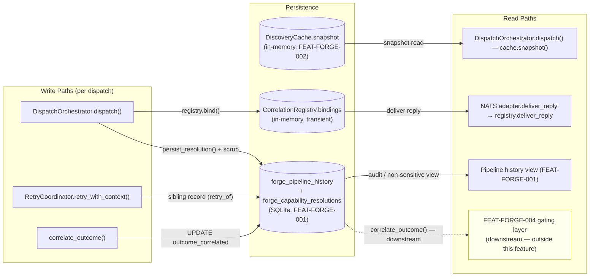
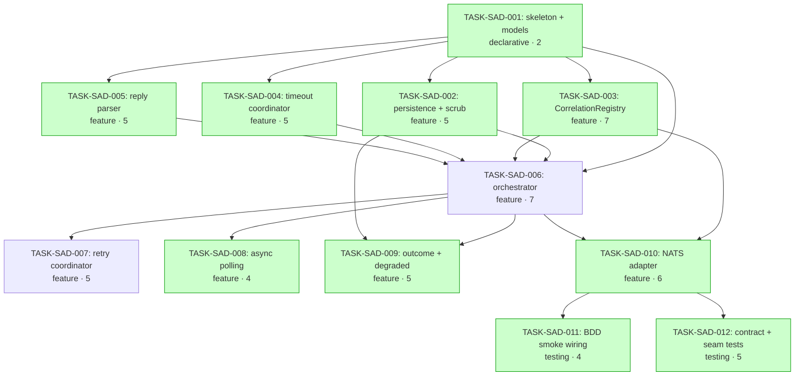

/feature-plan "Specialist Agent Delegation" \
  --context features/specialist-agent-delegation/specialist-agent-delegation_summary.md
I'll orchestrate the feature planning workflow. Let me start by reading the context file to understand the feature.

Read specialist-agent-delegation_summary.md
Let me check for related feature files to gather more context.

Bash List feature files
IN
ls -la /home/richardwoollcott/Projects/appmilla_github/forge/features/specialist-agent-delegation/ 2>/dev/null && ls -la /home/richardwoollcott/Projects/appmilla_github/forge/.guardkit/features/ 2>/dev/null

OUT
total 44
drwxrwxr-x 2 richardwoollcott richardwoollcott  4096 Apr 24 20:02 .
drwxrwxr-x 9 richardwoollcott richardwoollcott  4096 Apr 25 07:39 ..
-rw-rw-r-- 1 richardwoollcott richardwoollcott  2540 Apr 24 20:01 specialist-agent-delegation_assumptions.yaml
-rw-rw-r-- 1 richardwoollcott richardwoollcott 20706 Apr 24 20:01 specialist-agent-delegation.feature
-rw-rw-r-- 1 richardwoollcott richardwoollcott  4794 Apr 24 20:02 specialist-agent-delegation_summary.md
total 24
drwxrwxr-x 2 richardwoollcott richardwoollcott 4096 Apr 25 15:41 .
drwxrwxr-x 6 richardwoollcott richardwoollcott 4096 Apr 25 15:18 ..
-rw-rw-r-- 1 richardwoollcott richardwoollcott 7155 Apr 25 15:19 FEAT-FORGE-002.yaml
-rw-rw-r-- 1 richardwoollcott richardwoollcott 4509 Apr 25 15:41 FEAT-FORGE-005.yaml
Now I'll invoke the clarification-questioner agent for review scope (Context A).

Agent:Collect review scope clarifications
IN
Execute clarification for feature planning.

CONTEXT TYPE: review_scope

FEATURE: Specialist Agent Delegation (FEAT-FORGE-003)

FEATURE CONTEXT:
- Stack: Python (LangChain DeepAgents pipeline orchestrator with NATS fleet integration)
- Spec: features/specialist-agent-delegation/specialist-agent-delegation_summary.md
- 33 BDD scenarios across 5 groups (Key Examples, Boundary Conditions, Negative Cases, Edge Cases, Security/Concurrency/Integration)
- 6 assumptions all confirmed (intent-fallback confidence 0.7, advisory timeout 600s, hard dispatch timeout 900s, cache TTL 30s, reasoning-model retry, FLAG_FOR_REVIEW fallback)
- Upstream dependencies: FEAT-FORGE-001 (Pipeline State Machine) and FEAT-FORGE-002 (NATS Fleet Integration)
- Themes: capability-driven dispatch, exact-tool/intent-pattern resolution, PubAck-not-success parity, hard timeout cut-off, Coach output parsing, degraded path, reasoning-model retry, async polling, snapshot stability, exactly-once reply handling

ESTIMATED COMPLEXITY: 8/10 (high - distributed messaging, correlation, retry semantics, security invariants)

FLAGS:
  --no-questions: false
  --with-questions: false
  --defaults: false
  --answers: (none)
  --context: features/specialist-agent-delegation/specialist-agent-delegation_summary.md

Ask about:
1. Review focus (all/technical/architecture/performance/security)
2. Trade-off priority (speed/quality/cost/maintainability/balanced)
3. Any specific concerns to address (e.g. correlation correctness, security invariants, retry semantics)

Return ClarificationContext with review preferences.
Read code-style.md
The clarification-questioner needs your input. Please answer the three questions below:

📋 REVIEW SCOPE CLARIFICATION — FEAT-FORGE-003 Specialist Agent Delegation

Question 1 — Review Focus

A — All areas (architecture, correctness, security, performance)
B — Technical correctness only (correlation logic, retry semantics, timeout handling)
C — Architecture only (component boundaries, upstream dependency contracts)
D — Security only (reply-source authenticity, sensitive-parameter hygiene, trust-tier invariants)
E — Performance only (cache freshness, queue-depth tie-break, async polling latency)
Question 2 — Trade-off Priority

S — Speed
Q — Quality (correctness and robustness)
C — Cost
M — Maintainability
B — Balanced
Question 3 — Specific Concerns (comma-separated numbers, or "7" for none)

Correlation correctness (subscribe-before-publish, wrong-correlation reply filtering)
Security invariants (reply-source authenticity, sensitive-parameter hygiene)
Retry semantics (reasoning-model-driven retry)
Timeout behaviour (advisory 600s vs hard 900s)
Degraded path (no resolvable specialist, FLAG_FOR_REVIEW fallback)
Upstream dependency surface (FEAT-FORGE-001/002 contracts)
No specific concerns
Please answer in the form A/B/3 (e.g. A/Q/1,2,3) or whatever suits.

command-history.md#2300-2301
A,Q,1,2,3,4
Sending your answers to the clarification-questioner agent.

Recorded clarification context (Context A): focus=all, tradeoff=quality, concerns=[correlation, security, retry, timeout]. Now executing /task-create.

task-create skill
Let me look at existing review task patterns to use the correct format.

Read TASK-REV-CG44-plan-confidence-gated-checkpoint-protocol.md
Bash Check for existing specialist agent tasks
IN
find /home/richardwoollcott/Projects/appmilla_github/forge/tasks -name "*specialist*" -o -name "*FORGE-003*" 2>/dev/null

OUT
/home/richardwoollcott/Projects/appmilla_github/forge/tasks/completed/TASK-REV-C3E7/TASK-REV-C3E7-review-specialist-agent-lessons-and-update-ideas-docs.md
Read specialist-agent-delegation.feature
Now creating the review task file.

Write TASK-REV-SAD3-plan-specialist-agent-delegation.md
171 lines
---
id: TASK-REV-SAD3
title: "Plan: Specialist Agent Delegation"
task_type: review
status: backlog
priority: high
created: 2026-04-25T00:00:00Z
updated: 2026-04-25T00:00:00Z
complexity: 8
tags: [planning, review, dispatch, delegation, capability-routing, nats, feat-forge-003]
feature_spec: features/specialist-agent-delegation/specialist-agent-delegation_summary.md
feature_id: FEAT-FORGE-003
upstream_dependencies:
  - FEAT-FORGE-001  # Pipeline State Machine & Configuration
  - FEAT-FORGE-002  # NATS Fleet Integration
clarification:
  context_a:
    timestamp: 2026-04-25T00:00:00Z
    decisions:
      focus: all
      tradeoff: quality
      specific_concerns:
        - correlation_correctness
        - security_invariants
        - retry_semantics
        - timeout_behaviour
test_results:
  status: pending
  coverage: null
  last_run: null
---

# Task: Plan Specialist Agent Delegation (FEAT-FORGE-003)

## Description

Decision-making review for **FEAT-FORGE-003 — Specialist Agent Delegation**. The
feature specifies Forge's single capability-driven dispatch path: resolve a target
specialist via the live discovery cache (exact-tool match → intent-pattern fallback
at minimum confidence → tie-break by trust tier, confidence, queue depth), publish
the command on the fleet bus, and correlate the reply on a correlation-keyed
channel established **before** publish.

Covers the LES1 parity rule (PubAck-is-not-success), the local hard-timeout cut-off
(900s default), result parsing (Coach score, criterion breakdown, detection findings
— top-level preferred, nested fallback), the degraded path when no specialist is
resolvable, the reasoning-model-driven retry with additional context on soft
failure, outcome correlation back onto the resolution record, async-mode
run-identifier polling, and invariants around snapshot stability, reply-source
authenticity, and exactly-once reply handling.

The review must surface the recommended technical approach, architecture boundaries
against FEAT-FORGE-001 (state machine substrate) and FEAT-FORGE-002 (fleet cache,
bus, lifecycle subscription), risk analysis (especially correlation correctness,
security invariants, retry semantics, and timeout behaviour), effort estimation,
and a subtask breakdown that downstream `/feature-build` can execute against.

## Scope of Analysis

Review must cover **all areas (full sweep)** with a **quality** trade-off priority
(distributed messaging with strong correctness invariants — robustness preferred
over speed of delivery).

Specific concerns to receive extra scrutiny:

1. **Correlation correctness** — subscribe-before-publish ordering invariant,
   per-correlation subject names, wrong-correlation reply filtering, exactly-once
   reply handling, unsubscribe-on-timeout semantics.
2. **Security invariants** — reply-source authenticity (replies must come from the
   resolved specialist), sensitive-parameter hygiene in command envelopes,
   trust-tier supremacy (core > specialist > extension regardless of other
   tie-break factors).
3. **Retry semantics** — reasoning-model-driven retry (no fixed max-retry count at
   dispatch layer), additional-context propagation, fresh correlation per attempt,
   retry-attempt recording alongside original attempt, soft-failure detection.
4. **Timeout behaviour** — advisory specialist-side 600s vs. Forge-side hard 900s
   cut-off, synthetic timeout result fed to reasoning loop, late-reply handling
   (ignored after timeout fires), unsubscribe-on-timeout cleanup.

Concrete areas to examine:

1. **Capability resolution** — exact-tool match priority, intent-pattern fallback
   at 0.7 minimum confidence, tie-break ordering (trust tier → confidence → queue
   depth), in-flight snapshot stability during cache updates, concurrent-resolution
   determinism, cache-freshness on join, cache-invalidation on deregister, registry
   outage fallback.
2. **Dispatch transport** — subscribe-before-publish invariant, correlation-keyed
   channel naming, write-before-send invariant for resolution record persistence,
   PubAck-not-success parity (LES1), bus disconnect handling, concurrent dispatches
   to the same agent.
3. **Result parsing** — Coach top-level fields preferred over nested result fields,
   missing Coach score fallback (FLAG_FOR_REVIEW per ASSUM-006), malformed envelope
   handling, criterion breakdown and detection-findings extraction.
4. **Retry & degraded paths** — reasoning-model retry with fresh correlation,
   degraded-status exclusion (specialists in degraded state are excluded from
   resolution candidates), unresolved-capability outcome surface, specialist-error
   outcome surface.
5. **Async-mode polling** — run-identifier correlation, polling cadence,
   convergence with synchronous-reply path, idempotency on duplicate replies.
6. **Outcome correlation** — resolution record linked back to gate decision,
   resolution record marked as outcome-correlated, durability of resolution record
   even when downstream notification publishes fail.
7. **Upstream seam contracts** —
   - **FEAT-FORGE-001**: SQLite-backed durable substrate for `CapabilityResolution`
     records and dispatch outcomes; what schema fields the resolution layer reads
     and writes; transaction boundaries.
   - **FEAT-FORGE-002**: live fleet cache (read), fleet-lifecycle subscription
     (read), pipeline-event publishing (write), heartbeat view (read),
     degraded-cache propagation; what dispatch-time snapshot semantics are required
     and which are inherited.

## Acceptance Criteria

- [ ] Review identifies 2-3 technical options for the specialist delegation layer,
      with explicit trade-offs.
- [ ] Recommended option is justified against the **quality** trade-off priority.
- [ ] All four specific-concern areas (correlation, security, retry, timeout) are
      addressed in the recommendation.
- [ ] Architecture boundaries against FEAT-FORGE-001 and FEAT-FORGE-002 are made
      explicit (what is read, what is written, what is reused, what is new).
- [ ] All 33 BDD scenarios are mapped to at least one task in the breakdown
      (scenario coverage check).
- [ ] Risk analysis covers: correlation race conditions, security invariant
      bypass, retry-induced duplicate work, timeout/late-reply contention,
      cache-staleness during in-flight resolution, registry outage during
      resolution.
- [ ] Effort estimation provided in hours with assumed solo-developer pace.
- [ ] Subtask breakdown produces a feature-build-compatible plan with parallel
      execution waves and explicit task dependencies.
- [ ] Integration contracts (§4) are specified for every cross-task data
      dependency with format constraints.
- [ ] Mandatory diagrams generated in IMPLEMENTATION-GUIDE.md (Data Flow,
      Integration Contract for complexity ≥ 5, Task Dependency Graph for ≥ 3
      tasks).

## Test Requirements

- [ ] Review report is internally consistent (no contradictions between findings,
      recommendation, and subtasks).
- [ ] All assumptions from `specialist-agent-delegation_assumptions.yaml` are
      acknowledged in the review (intent-fallback 0.7, advisory 600s, hard 900s,
      cache TTL 30s, reasoning-model-driven retry, FLAG_FOR_REVIEW fallback).
- [ ] Each generated subtask has a non-default `task_type` field (no implicit
      `feature` defaults for setup/scaffolding work).
- [ ] Each generated implementation/refactor subtask carries a lint-compliance
      acceptance criterion.

## Implementation Notes

This is a **decision-making review task**. No production code is written by
this task — its output is a structured review report at
`.claude/reviews/TASK-REV-SAD3-review-report.md`, a feature folder
`tasks/backlog/specialist-agent-delegation/` with subtask markdown files, and a
structured feature YAML at `.guardkit/features/FEAT-FORGE-003.yaml`.

The review should explicitly distinguish between behaviour the spec describes
in domain terms (capability resolution, correlation, snapshot stability,
exactly-once reply handling) and the transport primitives the implementation
will use (JetStream audit interception, subscribe-then-publish ordering,
per-correlation subject names). The spec deliberately keeps these separate
and the implementation plan should preserve that separation.

Upstream dependency examination should be at **medium depth**: verify the seam
contracts against FEAT-FORGE-001 and FEAT-FORGE-002 (what schema is read/written,
what bus subjects are subscribed/published, what cache snapshots are required),
but do not re-review the upstream features' internal correctness.

## Test Execution Log

[Automatically populated by /task-review]
Review task created. Now executing /task-review for the decision-making analysis.

task-review skill
Phase 1 complete (clarification context already collected). Now loading Graphiti context for review.

Update Todos

Load Graphiti review context (Phase 1.5)

Read full feature spec and supporting files

Execute decision-mode review analysis (Phase 2-3)

Generate review report (Phase 4)

Present decision checkpoint to user (Phase 5)
Graphiti [search_nodes]specialist agent delegation NATS dispatc…
OUT
{"result":{"message":"Nodes retrieved successfully","nodes":[{"uuid":"a7624f57-6e0e-4871-8205-49d3b713507d","name":"nats-infrastructure","labels":["Entity","Organization"],"created_at":"2026-04-15T20:13:55.164381+00:00","summary":"nats-infrastructure is READY today. Stream retentions and extra streams (FLEET/JARVIS/NOTIFICATIONS) need reconciling with anchor. Part of cross-cutting architecture decisions shared in Graphiti group 'architecture_decisions'.","group_id":"architecture_decisions","attributes":{}},{"uuid":"e5a33162-2b5b-46a3-8283-de4df066ad3a","name":"Forge","labels":["Entity","Organization"],"created_at":"2026-04-15T20:13:55.164262+00:00","summary":"Forge is a project with architectural reviews and tasks for doc alignment, NATS-core updates, and specialist-agent refactoring. Key decisions involve adopting singular conventions for NATS topics and resolving dual-role deployment issues.","group_id":"architecture_decisions","attributes":{}},{"uuid":"bdee7ad5-4b60-488a-b427-be792088f644","name":"specialist-agent","labels":["Entity","Object"],"created_at":"2026-04-15T20:07:02.363840+00:00","summary":"Specialist-agent supports Product Owner and Architect roles through distinct deployments with different --role flags. Each role registers independently, subscribes to agents.command.{agent_id}, and publishes results in Forge-compatible shape. Role IDs derive agent_id by default or override via SPECIALIST_AGENT_ID env var. Dependencies: role registry, manifest factory, role-aware router, result wrapper.","group_id":"architecture_decisions","attributes":{}},{"uuid":"c3a04be0-b56b-4aca-90b8-673fbafd5e19","name":"forge-pipeline-architecture.md","labels":["Entity","Document"],"created_at":"2026-04-15T20:13:55.164214+00:00","summary":"Anchor v2.1 is internally sound but silent on Jarvis and specialist-agent dual-role deployment. Key findings: missing payloads in nats-core, need for doc alignment tasks, surgical refactor plan for specialist-agent, and four draft ADRs (SP-014/015/016/017) added to anchor.","group_id":"architecture_decisions","attributes":{}},{"uuid":"2f8f1165-1cfb-4612-871f-a8ba2ad32c48","name":"nats-core","labels":["Entity","Organization"],"created_at":"2026-04-15T20:10:47.638796+00:00","summary":"nats-core uses singular convention for agents.command.{agent_id} and agents.result.{agent_id}. Docs and anchor updated. Library has 98% test coverage, is shipping, and includes docstring noting convention for historical reasons. Missing critical payloads (BuildQueuedPayload, BuildPausedPayload, BuildResumedPayload, StageCompletePayload, StageGatedPayload) and 5 topics.","group_id":"architecture_decisions","attributes":{}},{"uuid":"6adfaa4b-65f9-4315-87ad-f298a87824c1","name":"agents.command.{agent_id}","labels":["Entity","Location"],"created_at":"2026-04-15T20:07:02.363945+00:00","summary":"Topic for agent commands. Forge calls distinct agents based on --role flag (product-owner-agent, architect-agent). Agents register independently and publish results to agents.result.{agent_id}. Topic ensures explicit deployment model and drives changes in specialist-agent. Singular convention adopted fleet-wide.","group_id":"architecture_decisions","attributes":{}},{"uuid":"e3cc439c-b87a-4501-ba9c-6d1532b03d22","name":"forge","labels":["Entity","Organization"],"created_at":"2026-04-15T20:07:02.363690+00:00","summary":"Forge manages specialist-agent deployments for roles like Product Owner and Architect. It calls distinct agents based on --role flag, ensuring independent fleet registration and uniform result shapes. Completed TASK-REV-A1F2 review identified corrections needed for dual-role deployment and doc alignment. Fleet-wide architecture decisions are shared in the 'architecture_decisions' group.","group_id":"architecture_decisions","attributes":{}},{"uuid":"a270504c-3d4e-40e5-91ff-a4f507c07fa1","name":"TASK-DRD-001..004","labels":["Entity","Event"],"created_at":"2026-04-15T20:07:02.364017+00:00","summary":"TASK-DRD-001..004 includes role registry, manifest factory, role-aware router, result wrapper, docker-compose fragment, and e2e test.","group_id":"architecture_decisions","attributes":{}},{"uuid":"b3fa9fd2-f0e0-4be8-bbaf-70db175ab1dc","name":"agents.result.{agent_id}","labels":["Entity","Location"],"created_at":"2026-04-15T20:07:02.363959+00:00","summary":"Topic for publishing results from specialist-agent deployments using singular format agents.result.{agent_id}, where agent_id is derived from role_id. Consistent with existing agents.status.{agent_id}.","group_id":"architecture_decisions","attributes":{}},{"uuid":"4b261f1e-8cce-4d45-adce-b3886cb7a053","name":"agents/","labels":["Entity","Location"],"created_at":"2026-04-07T09:36:04.349517+00:00","summary":"Subdirectory for agent-related code within Architect Agent project.","group_id":"architecture_decisions","attributes":{}}]}}
Graphiti [search_memory_facts]specialist agent dispatch correlation re…
OUT
{"result":{"message":"Facts retrieved successfully","facts":[{"uuid":"db34b45d-6331-4e02-8b55-d72058d38be3","group_id":"guardkit__task_outcomes","source_node_uuid":"0bf14145-2b88-44a3-8e73-bec678d50681","target_node_uuid":"b5dd9674-d059-4365-99fc-a5e8493c91e6","created_at":"2026-04-14T21:41:37.978126Z","name":"AVOID_FABRICATED_SOURCE_REFERENCE","fact":"Retry messages for FinProxy avoid fabricated source reference findings by appending an 'Available Product Documentation Files' section.","episodes":["c7e9c6cd-4657-4e99-9ec1-5a8975d9765c"],"expired_at":null,"valid_at":"2026-04-14T21:40:54Z","invalid_at":null,"attributes":{}},{"uuid":"72a12719-23d4-4e97-8d45-ade5192a6408","group_id":"guardkit__task_outcomes","source_node_uuid":"541d23bb-3bcd-4ae0-abb8-bfad0da7313b","target_node_uuid":"207a3581-b8ae-49ce-a621-00f3ee142d80","created_at":"2026-04-20T21:55:41.487339Z","name":"DEALS_WITH","fact":"TASK-PEX-018 involves implementing extended retry backoff for long-running sessions.","episodes":["90100ca0-5511-4e0c-98eb-4b2664bb039d"],"expired_at":null,"valid_at":null,"invalid_at":null,"attributes":{}},{"uuid":"405bde71-ae6e-4b12-a5ee-a8ecdda81fc0","group_id":"guardkit__task_outcomes","source_node_uuid":"3ccee4d4-92a0-4636-aacd-3fea2fed1b7d","target_node_uuid":"79c5784a-6e88-4b11-ab4b-23b072444ac9","created_at":"2026-04-12T20:22:13.007143Z","name":"COMPLETED_PART","fact":"FEAT-PSN has completed the PSN-003 format reinforcement part.","episodes":["32e15d67-f64e-4616-9c06-5aa3f2b3dc86"],"expired_at":null,"valid_at":"2026-04-12T20:19:59Z","invalid_at":null,"attributes":{}},{"uuid":"06cdaee0-c47d-424c-b948-efb923e898bd","group_id":"guardkit__task_outcomes","source_node_uuid":"f9ef0115-2046-464a-a230-0c3998b66c38","target_node_uuid":"333b44b0-f0a1-4628-9a23-db1181deb12e","created_at":"2026-04-21T10:29:22.239250Z","name":"FOLLOWS","fact":"TASK-REV-4D012 is a follow-up review to the prior specialist-agent review, TASK-REV-POEX.","episodes":["e0ddba80-a562-4acc-b213-edd2b4f1dbd8"],"expired_at":null,"valid_at":"2026-04-21T00:00:00Z","invalid_at":null,"attributes":{}},{"uuid":"798f4252-22bc-44dc-af45-4eb764a09e84","group_id":"guardkit__task_outcomes","source_node_uuid":"1543e51e-41cd-4371-a86d-9efb0277f1a0","target_node_uuid":"4518c55b-e606-4d03-96cf-03e0dfdac3a4","created_at":"2026-04-16T10:00:23.270489Z","name":"HAS_RECOMMENDATION","fact":"Wire PO dispatch maps, mode inference, and session tools is recommended.","episodes":["243227ed-9d6a-463b-bd22-014b3c3f70aa"],"expired_at":null,"valid_at":"2026-04-16T09:58:17Z","invalid_at":null,"attributes":{}},{"uuid":"5b527746-2950-45df-a76e-88203e995284","group_id":"guardkit__task_outcomes","source_node_uuid":"f9ef0115-2046-464a-a230-0c3998b66c38","target_node_uuid":"67a4204a-e474-45bf-ad60-a26c00f1db95","created_at":"2026-04-21T10:29:22.239478Z","name":"IS_COMPLEMENTARY_TO_REVIEW_OF","fact":"TASK-REV-4D012 is a follow-up and is complementary to a prior review related to specialist-agent.","episodes":["e0ddba80-a562-4acc-b213-edd2b4f1dbd8"],"expired_at":null,"valid_at":null,"invalid_at":null,"attributes":{}},{"uuid":"0d68b3b8-42b0-43e7-8b37-65d2c50c12dd","group_id":"guardkit__task_outcomes","source_node_uuid":"67a4204a-e474-45bf-ad60-a26c00f1db95","target_node_uuid":"6f1cf429-534b-4c68-bbd9-65db25a45807","created_at":"2026-04-21T10:29:22.239409Z","name":"HAS_PROPERTY","fact":"specialist-agent's Player-Coach approval rate was 95%.","episodes":["e0ddba80-a562-4acc-b213-edd2b4f1dbd8"],"expired_at":null,"valid_at":null,"invalid_at":null,"attributes":{}},{"uuid":"95e8566b-7619-497f-b7d6-3f459de4d052","group_id":"guardkit__task_outcomes","source_node_uuid":"333b44b0-f0a1-4628-9a23-db1181deb12e","target_node_uuid":"67a4204a-e474-45bf-ad60-a26c00f1db95","created_at":"2026-04-21T10:29:22.239420Z","name":"IS_REVIEW_OF","fact":"TASK-REV-POEX was a prior review of specialist-agent.","episodes":["e0ddba80-a562-4acc-b213-edd2b4f1dbd8"],"expired_at":null,"valid_at":null,"invalid_at":null,"attributes":{}},{"uuid":"c9d94a4d-2b1a-4b1c-a9b0-e430570e0b1f","group_id":"guardkit__task_outcomes","source_node_uuid":"67a4204a-e474-45bf-ad60-a26c00f1db95","target_node_uuid":"99544fdd-90b3-4271-9621-52427d729d70","created_at":"2026-04-21T10:29:22.239310Z","name":"HAS_HIGHER_METRIC_THAN","fact":"specialist-agent's Player-Coach approval rate of 95% was higher than YTM's rate of 81%.","episodes":["e0ddba80-a562-4acc-b213-edd2b4f1dbd8"],"expired_at":null,"valid_at":null,"invalid_at":null,"attributes":{}},{"uuid":"86ce6e62-7daa-4c0e-8231-eccd0bdbf9b9","group_id":"guardkit__task_outcomes","source_node_uuid":"1765e5ea-b097-4611-bfcf-7e65fae55070","target_node_uuid":"e6aec841-fccb-4025-9758-d36add2ec464","created_at":"2026-04-17T16:30:39.833035Z","name":"IS_ROOT_CAUSE_OF","fact":"Auth rejection is the real cause of the misleading \"server not reachable\" timeout.","episodes":["98f75731-51db-4dcf-b14c-93faeb346f61"],"expired_at":null,"valid_at":null,"invalid_at":null,"attributes":{}},{"uuid":"125b50bd-d944-4d3c-8222-99f4306d92f7","group_id":"guardkit__project_decisions","source_node_uuid":"48959d3e-95e2-4134-b2c3-eb623a0e25bc","target_node_uuid":"14e4bbff-120e-42b4-95b5-121c688e20cb","created_at":"2026-04-24T13:00:28.396740Z","name":"INVOLVES","fact":"FEAT-FORGE-002 involves TASK-REV-E4F5.","episodes":["932dcd2f-0a1a-4b29-b614-2f83b7cd59a8"],"expired_at":null,"valid_at":"2026-04-24T12:57:38.513809Z","invalid_at":null,"attributes":{}},{"uuid":"83341cf1-91dd-4733-883b-79f0eb592906","group_id":"guardkit__project_decisions","source_node_uuid":"4893fcd2-2dd3-4d67-b50f-a53f2b4b4739","target_node_uuid":"78b2692a-aad5-4c8f-b0d7-6bb517ef2f64","created_at":"2026-04-16T18:38:56.508951Z","name":"NEEDS_LIVE_VISIBILITY","fact":"specialist-agent needs live cross-process visibility into the pipeline-state NATS KV bucket.","episodes":["435b247a-12cf-4d1a-87f7-fe0dadbedb13"],"expired_at":null,"valid_at":"2026-04-16T18:37:50Z","invalid_at":null,"attributes":{}},{"uuid":"6dc6d0e7-b915-42de-b6f2-b8c0288da636","group_id":"guardkit__project_decisions","source_node_uuid":"bcd4c8fd-63d8-4820-b58b-b91fc1b668e3","target_node_uuid":"78b2692a-aad5-4c8f-b0d7-6bb517ef2f64","created_at":"2026-04-16T18:38:56.509075Z","name":"IS_JETSTREAM_NATIVE","fact":"Forge is JetStream-native and retains its runtime state in messaging resident.","episodes":["435b247a-12cf-4d1a-87f7-fe0dadbedb13"],"expired_at":null,"valid_at":"2026-04-16T18:37:50Z","invalid_at":null,"attributes":{}},{"uuid":"bfea67aa-2268-4674-a02c-ac039806bd7c","group_id":"guardkit__project_decisions","source_node_uuid":"2b4b7ac6-27a5-4962-9ddd-12b433bdd6d8","target_node_uuid":"d510aec5-fa68-4abe-a238-77cfd42a4710","created_at":"2026-04-21T06:55:47.401938Z","name":"ADDRESSED_BY","fact":"TASK-PEX-020 involved the decision to split Phase B Coach to Player retry feedback into two modes.","episodes":["1955f874-cfd3-48c7-894f-e6d276cc5c5f"],"expired_at":null,"valid_at":null,"invalid_at":null,"attributes":{}},{"uuid":"04305fb0-02ae-4f0b-82ab-41312bd3200a","group_id":"guardkit__project_decisions","source_node_uuid":"74f3c926-2e12-49a1-a354-8f1b000df8fb","target_node_uuid":"a4e9f400-881d-4751-aeb8-b4f8c0a9a74e","created_at":"2026-04-24T13:00:28.396725Z","name":"INVOLVES","fact":"FEAT-486D involves TASK-REV-8A08.","episodes":["932dcd2f-0a1a-4b29-b614-2f83b7cd59a8"],"expired_at":null,"valid_at":"2026-04-24T12:57:38.513809Z","invalid_at":null,"attributes":{}},{"uuid":"c3940af7-fa7e-428e-8100-baeeb828e72c","group_id":"guardkit__project_decisions","source_node_uuid":"9dffc110-32df-4c4d-8079-443611c5f9a8","target_node_uuid":"fdad8aaf-f2aa-43f4-ad2e-0a7e8b2b489d","created_at":"2026-04-21T07:28:37.375302Z","name":"SUCCESSOR_OF","fact":"FEAT-POR-EXT-v2 is planned to contain the redesign of Phase B from FEAT-POR-EXT.","episodes":["0e77320c-9250-4ea1-8789-57f82ebf6f7f"],"expired_at":null,"valid_at":null,"invalid_at":null,"attributes":{}},{"uuid":"e79bffa1-4251-41e3-9b42-1d72e32fcf43","group_id":"guardkit__project_decisions","source_node_uuid":"5b07698e-7729-4c1f-b43d-85a4014b4e61","target_node_uuid":"52d912e0-6ec2-4e3b-be63-23252e9fc5ac","created_at":"2026-04-19T12:51:56.166282Z","name":"CONTINGENT_UPON_FAILURE_OF","fact":"The fallback plan for demo-week inference is activated if FEAT-PO-004 fails on April 22, 2026.","episodes":["b3818e46-1463-4d9a-b3fc-fda61939a208"],"expired_at":null,"valid_at":"2026-04-19T00:00:00Z","invalid_at":null,"attributes":{}},{"uuid":"f435b238-7fb1-4e34-985e-d792666065da","group_id":"guardkit__project_decisions","source_node_uuid":"1d09865a-9802-40b9-8bae-49e3e6039d24","target_node_uuid":"a4e9f400-881d-4751-aeb8-b4f8c0a9a74e","created_at":"2026-04-24T13:00:28.396730Z","name":"CAUSE_OF","fact":"SDK stream timeout caused the stall in TASK-REV-8A08.","episodes":["932dcd2f-0a1a-4b29-b614-2f83b7cd59a8"],"expired_at":null,"valid_at":"2026-04-24T12:57:38.513809Z","invalid_at":null,"attributes":{}},{"uuid":"e3bca3da-0dfa-4ec1-a7d1-d4afa28ff1e0","group_id":"guardkit__project_decisions","source_node_uuid":"d510aec5-fa68-4abe-a238-77cfd42a4710","target_node_uuid":"532bdbc5-68d9-45de-a9de-c7c3d6b91c68","created_at":"2026-04-21T06:55:47.401841Z","name":"IS_SPLIT_INTO","fact":"Phase B Coach to Player retry feedback has been split into explicitly-prefixed modes, one of which is [CONTENT].","episodes":["1955f874-cfd3-48c7-894f-e6d276cc5c5f"],"expired_at":null,"valid_at":null,"invalid_at":null,"attributes":{}},{"uuid":"75598041-8789-4623-8765-968a292fb9e1","group_id":"guardkit__project_decisions","source_node_uuid":"a25d8813-51cf-4402-a68a-d349f9e7c8d6","target_node_uuid":"4893fcd2-2dd3-4d67-b50f-a53f2b4b4739","created_at":"2026-04-20T06:38:32.485365Z","name":"INITIALLY_INSTRUCTED_TO_USE","fact":"TASK-PO02-001 initially instructed to copy the shape from specialist-agent, but this was changed because specialist-agent/AGENTS.md does not exist.","episodes":["39952565-c959-4f58-84a3-f0fbe777bdc4"],"expired_at":null,"valid_at":null,"invalid_at":null,"attributes":{}},{"uuid":"e1794ba2-8112-4529-9fbc-ae52b1506ceb","group_id":"architecture_decisions","source_node_uuid":"14069ebc-8d39-4c42-8363-9021a264b445","target_node_uuid":"b3fa9fd2-f0e0-4be8-bbaf-70db175ab1dc","created_at":"2026-04-15T20:12:14.798097Z","name":"ADOPTS_CONVENTION","fact":"forge repo docs adopt the singular convention for agents.result.{agent_id}","episodes":["e0d1adb8-ba3a-49ae-bc32-8c14baa706a0"],"expired_at":null,"valid_at":"2026-04-15T20:10:13Z","invalid_at":null,"attributes":{}},{"uuid":"31ddfa9f-a416-4fc9-9943-81a87c7beb04","group_id":"architecture_decisions","source_node_uuid":"e3cc439c-b87a-4501-ba9c-6d1532b03d22","target_node_uuid":"5309c2c5-7968-4003-b70b-92f6aab1d2f6","created_at":"2026-04-15T20:09:47.146753Z","name":"CALLS_DISTINCT_AGENTS","fact":"Forge calls distinct architect-agent for Stage 2.","episodes":["87ef40e4-840e-497c-a03d-459af0b961d3"],"expired_at":null,"valid_at":"2026-04-15T20:06:28Z","invalid_at":null,"attributes":{}},{"uuid":"3563fba9-8030-443e-ad19-7af84b681eb1","group_id":"architecture_decisions","source_node_uuid":"14069ebc-8d39-4c42-8363-9021a264b445","target_node_uuid":"6adfaa4b-65f9-4315-87ad-f298a87824c1","created_at":"2026-04-15T20:12:14.798078Z","name":"ADOPTS_CONVENTION","fact":"forge repo docs adopt the singular convention for agents.command.{agent_id}","episodes":["e0d1adb8-ba3a-49ae-bc32-8c14baa706a0"],"expired_at":null,"valid_at":"2026-04-15T20:10:13Z","invalid_at":null,"attributes":{}},{"uuid":"1104c2db-5fa8-43dd-a557-f1a90fd33174","group_id":"architecture_decisions","source_node_uuid":"e3cc439c-b87a-4501-ba9c-6d1532b03d22","target_node_uuid":"d2808a0f-193a-43be-9717-fdc75f8e9eb1","created_at":"2026-04-15T20:09:47.146746Z","name":"CALLS_DISTINCT_AGENTS","fact":"Forge calls distinct product-owner-agent for Stage 1.","episodes":["87ef40e4-840e-497c-a03d-459af0b961d3"],"expired_at":"2026-04-15T20:12:20.322296Z","valid_at":"2026-04-15T20:06:28Z","invalid_at":"2026-04-15T20:10:13Z","attributes":{}},{"uuid":"14daa3f1-c45b-402f-ba58-bfb05be2877c","group_id":"architecture_decisions","source_node_uuid":"14069ebc-8d39-4c42-8363-9021a264b445","target_node_uuid":"b83ca097-6d4c-451f-bdb6-b11e242839e9","created_at":"2026-04-15T20:12:14.798114Z","name":"IS_CONSISTENT_WITH","fact":"forge repo docs are consistent with the existing agents.status.{agent_id} topic","episodes":["e0d1adb8-ba3a-49ae-bc32-8c14baa706a0"],"expired_at":null,"valid_at":"2026-04-15T20:10:13Z","invalid_at":null,"attributes":{}},{"uuid":"4f43e41b-23cf-4540-bbd9-9782c42a5137","group_id":"architecture_decisions","source_node_uuid":"bdee7ad5-4b60-488a-b427-be792088f644","target_node_uuid":"e3cc439c-b87a-4501-ba9c-6d1532b03d22","created_at":"2026-04-15T20:18:23.494221Z","name":"MENTIONS_PROJECT","fact":"The specialist-agent organization is part of the forge project.","episodes":["9cca01d3-321c-4816-b1f9-65810affacc0"],"expired_at":null,"valid_at":"2026-04-15T00:00:00Z","invalid_at":null,"attributes":{}},{"uuid":"23edf13a-333e-4582-a38a-16d9a0461c0e","group_id":"architecture_decisions","source_node_uuid":"5309c2c5-7968-4003-b70b-92f6aab1d2f6","target_node_uuid":"b3fa9fd2-f0e0-4be8-bbaf-70db175ab1dc","created_at":"2026-04-15T20:09:47.146781Z","name":"PUBLISHES_RESULTS_TO","fact":"Architect-agent publishes results to agents.result.architect-agent.","episodes":["87ef40e4-840e-497c-a03d-459af0b961d3"],"expired_at":"2026-04-15T20:12:20.322304Z","valid_at":"2026-04-15T20:06:28Z","invalid_at":"2026-04-15T20:10:13Z","attributes":{}},{"uuid":"b7d1fcce-9ba6-4c13-a462-0f66556b91a2","group_id":"architecture_decisions","source_node_uuid":"f9aeed7f-51b3-44db-a711-02a683834d2b","target_node_uuid":"e3cc439c-b87a-4501-ba9c-6d1532b03d22","created_at":"2026-04-15T20:18:23.494244Z","name":"MENTIONS_PROJECT","fact":"The forge-build-plan.md document is part of the forge project.","episodes":["9cca01d3-321c-4816-b1f9-65810affacc0"],"expired_at":null,"valid_at":"2026-04-15T00:00:00Z","invalid_at":null,"attributes":{}},{"uuid":"ac93ab78-65cd-4fd5-8be7-1d02d6ea1f53","group_id":"architecture_decisions","source_node_uuid":"42850b78-ca52-453c-981d-b702af555bc7","target_node_uuid":"73f1ac78-a3ed-4b36-9670-87825a88513c","created_at":"2026-04-16T17:14:55.632325Z","name":"ANNOTATED_AS_RETIRED","fact":"Retired payloads were annotated in forge-pipeline-orchestrator-refresh.md.","episodes":["7ae509f6-bbd6-41da-bfc2-d8d547c3133f"],"expired_at":null,"valid_at":"2026-04-16T17:13:11Z","invalid_at":null,"attributes":{}},{"uuid":"be42f6fa-21de-4bc2-bee2-ec0fa6dc06b2","group_id":"architecture_decisions","source_node_uuid":"5309c2c5-7968-4003-b70b-92f6aab1d2f6","target_node_uuid":"6adfaa4b-65f9-4315-87ad-f298a87824c1","created_at":"2026-04-15T20:09:47.146767Z","name":"REGISTRATION_ON","fact":"Architect-agent registers on agents.command.architect-agent.","episodes":["87ef40e4-840e-497c-a03d-459af0b961d3"],"expired_at":null,"valid_at":"2026-04-15T20:06:28Z","invalid_at":null,"attributes":{}}]}}
Graphiti context loaded. Now let me read the full feature spec and survey the existing codebase.

Update Todos

Load Graphiti review context (Phase 1.5)

Read full feature spec and supporting files

Execute decision-mode review analysis (Phase 2-3)

Generate review report (Phase 4)

Present decision checkpoint to user (Phase 5)
Agent:Survey forge codebase for FEAT-FORGE-003 planning
IN
Survey the forge repository at /home/richardwoollcott/Projects/appmilla_github/forge to inform a planning review for FEAT-FORGE-003 "Specialist Agent Delegation".

I need a focused inventory — not a full codebase review. Specifically, find and report:

1. **Existing dispatch / capability resolution code**: any modules that look like they handle dispatching commands to specialist agents, capability resolution against a discovery cache, or correlation-keyed reply handling. Look under `src/`, `forge/`, or similar Python package directories. Report file paths and a one-line purpose for each.

2. **NATS / fleet integration code from FEAT-FORGE-002**: identify the modules that implement the live fleet cache, fleet-lifecycle subscription, pipeline-event publishing, and heartbeat view. These are the upstream surface FEAT-FORGE-003 will depend on. I need to know what's already implemented vs. what's stubbed. Look at the most recent commit `91f4de5 feat: NATS Fleet Integration via AutoBuild (FEAT-FORGE-002)` and identify the modules touched.

3. **Pipeline state machine / SQLite history from FEAT-FORGE-001**: identify the modules that own `CapabilityResolution`-style record persistence (or whatever name they actually use). The `FEAT-FORGE-003` spec assumes durable substrate exists for resolution records and dispatch outcomes.

4. **Existing tests** (`tests/` dir): what BDD/unit/integration test infrastructure is in place? Is there a pytest harness with fixtures for NATS-style transport mocking?

5. **Project structure**: brief layout of where new modules would land — packages, naming conventions, where domain logic vs. transport-adapter logic typically sit.

6. **Anything that looks like a stub or scaffold** for specialist delegation that already exists (might be partial / placeholder from earlier work).

Report back as a structured inventory with file paths and one-liners. Keep it under ~500 words. I'll use this to plan the implementation breakdown.
Bash
IN
find /home/richardwoollcott/Projects/appmilla_github/forge -type f -name "*.py" | grep -E "(src/|forge/)" | head -30

OUT
/home/richardwoollcott/Projects/appmilla_github/forge/tests/test_forge_config.py
/home/richardwoollcott/Projects/appmilla_github/forge/tests/__init__.py
/home/richardwoollcott/Projects/appmilla_github/forge/spikes/deepagents-053/permissions_repro.py
/home/richardwoollcott/Projects/appmilla_github/forge/spikes/deepagents-053/interrupt_server_drive.py
/home/richardwoollcott/Projects/appmilla_github/forge/spikes/deepagents-053/interrupt_resume.py
/home/richardwoollcott/Projects/appmilla_github/forge/spikes/deepagents-053/interrupt_graph.py
/home/richardwoollcott/Projects/appmilla_github/forge/tests/bdd/conftest.py
/home/richardwoollcott/Projects/appmilla_github/forge/tests/bdd/test_nats_fleet_integration.py
/home/richardwoollcott/Projects/appmilla_github/forge/tests/forge/test_contract_and_seam.py
/home/richardwoollcott/Projects/appmilla_github/forge/tests/forge/test_pipeline_publisher.py
/home/richardwoollcott/Projects/appmilla_github/forge/tests/forge/__init__.py
/home/richardwoollcott/Projects/appmilla_github/forge/tests/forge/test_pipeline_lifecycle.py
/home/richardwoollcott/Projects/appmilla_github/forge/tests/forge/test_fleet_publisher.py
/home/richardwoollcott/Projects/appmilla_github/forge/tests/forge/test_pipeline_consumer.py
/home/richardwoollcott/Projects/appmilla_github/forge/tests/forge/fleet/test_manifest.py
/home/richardwoollcott/Projects/appmilla_github/forge/tests/forge/fleet/__init__.py
/home/richardwoollcott/Projects/appmilla_github/forge/tests/forge/discovery/test_discovery.py
/home/richardwoollcott/Projects/appmilla_github/forge/tests/forge/discovery/__init__.py
/home/richardwoollcott/Projects/appmilla_github/forge/tests/forge/adapters/__init__.py
/home/richardwoollcott/Projects/appmilla_github/forge/tests/forge/adapters/test_fleet_watcher.py
/home/richardwoollcott/Projects/appmilla_github/forge/src/forge/agent.py
/home/richardwoollcott/Projects/appmilla_github/forge/src/forge/pipeline.py
/home/richardwoollcott/Projects/appmilla_github/forge/src/forge/__init__.py
/home/richardwoollcott/Projects/appmilla_github/forge/src/forge/fleet/__init__.py
/home/richardwoollcott/Projects/appmilla_github/forge/src/forge/fleet/manifest.py
/home/richardwoollcott/Projects/appmilla_github/forge/src/forge/discovery/protocol.py
/home/richardwoollcott/Projects/appmilla_github/forge/src/forge/discovery/models.py
/home/richardwoollcott/Projects/appmilla_github/forge/src/forge/discovery/__init__.py
/home/richardwoollcott/Projects/appmilla_github/forge/src/forge/discovery/resolve.py
/home/richardwoollcott/Projects/appmilla_github/forge/src/forge/discovery/cache.py
Bash
IN
find src/forge -type f -name "*.py" | sort

OUT
src/forge/adapters/__init__.py
src/forge/adapters/nats/fleet_publisher.py
src/forge/adapters/nats/fleet_watcher.py
src/forge/adapters/nats/__init__.py
src/forge/adapters/nats/pipeline_consumer.py
src/forge/adapters/nats/pipeline_publisher.py
src/forge/agent.py
src/forge/config/__init__.py
src/forge/config/models.py
src/forge/discovery/cache.py
src/forge/discovery/__init__.py
src/forge/discovery/models.py
src/forge/discovery/protocol.py
src/forge/discovery/resolve.py
src/forge/fleet/__init__.py
src/forge/fleet/manifest.py
src/forge/__init__.py
src/forge/pipeline.py
Bash
IN
git show --stat 91f4de5

OUT
commit 91f4de51b76ba6bd5438650a01c529e026ea696e
Merge: 8836579 e74a165
Author: Richard Woollcott <rich@appmilla.com>
Date:   Sat Apr 25 15:18:55 2026 +0100

    feat: NATS Fleet Integration via AutoBuild (FEAT-FORGE-002)
    
    11/11 tasks completed via guardkit autobuild feature FEAT-FORGE-002 in
    forge-run-7 (2026-04-25, post-F3c). All tasks approved on turn 1
    except TASK-NFI-006 (turn 2 — fixed a lint/format gap).
    
    AC verification ran cleanly on every task: ~95 of 99 acceptance
    criteria verified turn 1, the one task hitting 88% iterated to 100%.
    Total wallclock ~66 min for the 11-task feature build.
    
    This is the first green forge run for FEAT-FORGE-002. Prior runs
    (forge-run-3/4/5/6) were blocked by a Coach gate-ordering bug
    (agent_invocations_validation short-circuiting AC verification at
    position 1) — fixed in guardkit by F3c (TASK-REV-F6E1) earlier today.
    
    Implementation:
    - src/forge/fleet/manifest.py (139 lines): FORGE_MANIFEST constant
    - src/forge/pipeline.py (757 lines): pipeline publisher/consumer, lifecycle
    - src/forge/config: FleetConfig, PipelineConfig, FilesystemPermissions
    - src/forge/discovery: discovery domain
    - src/forge/adapters/fleet_watcher: fleet watcher adapter
    
    Tests (~13K lines):
    - tests/bdd/: BDD scenario pytest wiring (NFI-011)
    - tests/forge/test_contract_and_seam.py: contract+seam tests (NFI-010)
    - tests/forge/discovery/, fleet/, adapters/: unit tests per task
    
    Worktree branch autobuild/FEAT-FORGE-002 preserved for archaeology.
    
    Co-Authored-By: Claude Opus 4.7 (1M context) <noreply@anthropic.com>

 .../task-plans/TASK-NFI-003-implementation-plan.md |   16 +
 .../task-plans/TASK-NFI-004-implementation-plan.md |   16 +
 .../task-plans/TASK-NFI-005-implementation-plan.md |   16 +
 .../task-plans/TASK-NFI-006-implementation-plan.md |   16 +
 .../task-plans/TASK-NFI-007-implementation-plan.md |   16 +
 .../task-plans/TASK-NFI-008-implementation-plan.md |   16 +
 .../task-plans/TASK-NFI-009-implementation-plan.md |   16 +
 .../task-plans/TASK-NFI-010-implementation-plan.md |   16 +
 .../task-plans/TASK-NFI-011-implementation-plan.md |   16 +
 .guardkit-git.lock                                 |    0
 .guardkit/autobuild/TASK-NFI-001/checkpoints.json  |   15 +
 .guardkit/autobuild/TASK-NFI-001/coach_turn_1.json |  149 +++
 .../autobuild/TASK-NFI-001/player_turn_1.json      |  106 ++
 .../autobuild/TASK-NFI-001/task_work_results.json  |  124 +++
 .guardkit/autobuild/TASK-NFI-001/turn_context.json |   17 +
 .../autobuild/TASK-NFI-001/turn_state_turn_1.json  |   37 +
 .guardkit/autobuild/TASK-NFI-002/checkpoints.json  |   15 +
 .guardkit/autobuild/TASK-NFI-002/coach_turn_1.json |  165 +++
 .../autobuild/TASK-NFI-002/player_turn_1.json      |  118 ++
 .../autobuild/TASK-NFI-002/task_work_results.json  |  139 +++
 .guardkit/autobuild/TASK-NFI-002/turn_context.json |   17 +
 .../autobuild/TASK-NFI-002/turn_state_turn_1.json  |   40 +
 .guardkit/autobuild/TASK-NFI-003/checkpoints.json  |   15 +
 .guardkit/autobuild/TASK-NFI-003/coach_turn_1.json |  247 +++++
 .../autobuild/TASK-NFI-003/phase_4_summary.json    |    7 +
 .../autobuild/TASK-NFI-003/player_turn_1.json      |  214 ++++
 .../autobuild/TASK-NFI-003/specialist_results.json |   21 +
 .../autobuild/TASK-NFI-003/task_work_results.json  |  260 +++++
 .guardkit/autobuild/TASK-NFI-003/turn_context.json |   17 +
 .../autobuild/TASK-NFI-003/turn_state_turn_1.json  |   80 ++
 .guardkit/autobuild/TASK-NFI-004/checkpoints.json  |   15 +
 .guardkit/autobuild/TASK-NFI-004/coach_turn_1.json |  199 ++++
 .../autobuild/TASK-NFI-004/phase_4_summary.json    |    7 +
 .../autobuild/TASK-NFI-004/player_turn_1.json      |  150 +++
 .../autobuild/TASK-NFI-004/specialist_results.json |   21 +
 .../autobuild/TASK-NFI-004/task_work_results.json  |  195 ++++
 .guardkit/autobuild/TASK-NFI-004/turn_context.json |   17 +
 .../autobuild/TASK-NFI-004/turn_state_turn_1.json  |   60 +
 .guardkit/autobuild/TASK-NFI-005/checkpoints.json  |   15 +
 .guardkit/autobuild/TASK-NFI-005/coach_turn_1.json |  183 ++++
 .../autobuild/TASK-NFI-005/phase_4_summary.json    |    7 +
 .../autobuild/TASK-NFI-005/player_turn_1.json      |  145 +++
 .../autobuild/TASK-NFI-005/specialist_results.json |   21 +
 .../autobuild/TASK-NFI-005/task_work_results.json  |  191 ++++
 .guardkit/autobuild/TASK-NFI-005/turn_context.json |   17 +
 .../autobuild/TASK-NFI-005/turn_state_turn_1.json  |   65 ++
 .guardkit/autobuild/TASK-NFI-006/checkpoints.json  |   24 +
 .../TASK-NFI-006/coach_feedback_for_turn_2.json    |    9 +
 .guardkit/autobuild/TASK-NFI-006/coach_turn_1.json |  188 ++++
 .guardkit/autobuild/TASK-NFI-006/coach_turn_2.json |  178 +++
 .../autobuild/TASK-NFI-006/phase_4_summary.json    |    7 +
 .../autobuild/TASK-NFI-006/player_turn_1.json      |  152 +++
 .../autobuild/TASK-NFI-006/player_turn_2.json      |  160 +++
 .../autobuild/TASK-NFI-006/specialist_results.json |   21 +
 .../autobuild/TASK-NFI-006/task_work_results.json  |  206 ++++
 .guardkit/autobuild/TASK-NFI-006/turn_context.json |   17 +
 .../autobuild/TASK-NFI-006/turn_state_turn_1.json  |   69 ++
 .../autobuild/TASK-NFI-006/turn_state_turn_2.json  |   80 ++
 .guardkit/autobuild/TASK-NFI-007/checkpoints.json  |   15 +
 .guardkit/autobuild/TASK-NFI-007/coach_turn_1.json |  231 ++++
 .../autobuild/TASK-NFI-007/phase_4_summary.json    |    7 +
 .../autobuild/TASK-NFI-007/player_turn_1.json      |  190 +++-
 .../autobuild/TASK-NFI-007/specialist_results.json |   21 +
 .../autobuild/TASK-NFI-007/task_work_results.json  |  234 ++++
 .guardkit/autobuild/TASK-NFI-007/turn_context.json |   17 +
 .../autobuild/TASK-NFI-007/turn_state_turn_1.json  |   81 ++
 .guardkit/autobuild/TASK-NFI-008/checkpoints.json  |   15 +
 .guardkit/autobuild/TASK-NFI-008/coach_turn_1.json |  199 ++++
 .../autobuild/TASK-NFI-008/phase_4_summary.json    |    7 +
 .../autobuild/TASK-NFI-008/player_turn_1.json      |  160 +++
 .../autobuild/TASK-NFI-008/specialist_results.json |   21 +
 .../autobuild/TASK-NFI-008/task_work_results.json  |  209 ++++
 .guardkit/autobuild/TASK-NFI-008/turn_context.json |   17 +
 .../autobuild/TASK-NFI-008/turn_state_turn_1.json  |   71 ++
 .guardkit/autobuild/TASK-NFI-009/checkpoints.json  |   15 +
 .guardkit/autobuild/TASK-NFI-009/coach_turn_1.json |  199 ++++
 .../autobuild/TASK-NFI-009/phase_4_summary.json    |    7 +
 .../autobuild/TASK-NFI-009/player_turn_1.json      |  136 +++
 .../autobuild/TASK-NFI-009/specialist_results.json |   21 +
 .../autobuild/TASK-NFI-009/task_work_results.json  |  181 ++++
 .guardkit/autobuild/TASK-NFI-009/turn_context.json |   17 +
 .../autobuild/TASK-NFI-009/turn_state_turn_1.json  |   47 +
 .guardkit/autobuild/TASK-NFI-010/checkpoints.json  |   15 +
 .guardkit/autobuild/TASK-NFI-010/coach_turn_1.json |  194 ++++
 .../autobuild/TASK-NFI-010/phase_4_summary.json    |    7 +
 .../autobuild/TASK-NFI-010/player_turn_1.json      |  151 +++
 .../autobuild/TASK-NFI-010/specialist_results.json |   21 +
 .../autobuild/TASK-NFI-010/task_work_results.json  |  196 ++++
 .guardkit/autobuild/TASK-NFI-010/turn_context.json |   17 +
 .../autobuild/TASK-NFI-010/turn_state_turn_1.json  |   54 +
 .guardkit/autobuild/TASK-NFI-011/coach_turn_1.json |  178 +++
 .../autobuild/TASK-NFI-011/phase_4_summary.json    |    7 +
 .../autobuild/TASK-NFI-011/player_turn_1.json      |  146 +++
 .../autobuild/TASK-NFI-011/specialist_results.json |   21 +
 .../autobuild/TASK-NFI-011/task_work_results.json  |  192 ++++
 .guardkit/autobuild/TASK-NFI-011/turn_context.json |   17 +
 .../autobuild/TASK-NFI-011/turn_state_turn_1.json  |   61 ++
 .guardkit/bootstrap_state.json                     |    6 +
 .../nats-fleet-integration.feature                 |   78 +-
 pyproject.toml                                     |   24 +
 src/forge/adapters/__init__.py                     |    6 +
 src/forge/adapters/nats/__init__.py                |   36 +
 src/forge/adapters/nats/fleet_publisher.py         |  362 +++++++
 src/forge/adapters/nats/fleet_watcher.py           |  480 ++++++++
 src/forge/adapters/nats/pipeline_consumer.py       |  851 +++++++++++++++
 src/forge/adapters/nats/pipeline_publisher.py      |  278 +++++
 src/forge/config/__init__.py                       |   22 +
 src/forge/config/models.py                         |  217 ++++
 src/forge/discovery/__init__.py                    |   40 +
 src/forge/discovery/cache.py                       |  177 +++
 src/forge/discovery/models.py                      |  185 ++++
 src/forge/discovery/protocol.py                    |  120 ++
 src/forge/discovery/resolve.py                     |  283 +++++
 src/forge/fleet/__init__.py                        |    9 +
 src/forge/fleet/manifest.py                        |  139 +++
 src/forge/pipeline.py                              |  757 +++++++++++++
 ...-extend-forge-config-fleet-pipeline-sections.md |  107 ++
 .../TASK-NFI-002-define-forge-manifest-constant.md |   76 ++
 .../TASK-NFI-003-implement-discovery-domain.md     |  122 +++
 .../TASK-NFI-004-fleet-publisher.md                |  130 +++
 .../design_approved/TASK-NFI-005-fleet-watcher.md  |  118 ++
 .../TASK-NFI-006-pipeline-publisher.md             |   96 +-
 .../TASK-NFI-007-pipeline-consumer.md              |  176 +++
 ...FI-008-wire-state-machine-lifecycle-emission.md |  109 ++
 ...ASK-NFI-009-reconcile-on-boot-crash-recovery.md |   69 ++
 .../TASK-NFI-010-contract-and-seam-tests.md        |   67 ++
 .../TASK-NFI-011-bdd-scenario-pytest-wiring.md     |   67 ++
 tests/__init__.py                                  |    0
 tests/bdd/conftest.py                              |  415 +++++++
 tests/bdd/test_nats_fleet_integration.py           |  544 ++++++++++
 tests/forge/__init__.py                            |    0
 tests/forge/adapters/__init__.py                   |    0
 tests/forge/adapters/test_fleet_watcher.py         |  668 ++++++++++++
 tests/forge/discovery/__init__.py                  |    0
 tests/forge/discovery/test_discovery.py            |  668 ++++++++++++
 tests/forge/fleet/__init__.py                      |    0
 tests/forge/fleet/test_manifest.py                 |  262 +++++
 tests/forge/test_contract_and_seam.py              | 1125 +++++++++++++++++++
 tests/forge/test_fleet_publisher.py                |  647 +++++++++++
 tests/forge/test_pipeline_consumer.py              | 1141 ++++++++++++++++++++
 tests/forge/test_pipeline_lifecycle.py             |  785 ++++++++++++++
 tests/forge/test_pipeline_publisher.py             |  476 ++++++++
 tests/test_forge_config.py                         |  247 +++++
 143 files changed, 19862 insertions(+), 84 deletions(-)
Read pipeline.py
Bash
IN
grep -r "dispatch\|Dispatch" /home/richardwoollcott/Projects/appmilla_github/forge/src --include="*.py" | head -20

OUT
/home/richardwoollcott/Projects/appmilla_github/forge/src/forge/discovery/resolve.py:    reaches into the cache itself, so callers (the dispatch tool) can
/home/richardwoollcott/Projects/appmilla_github/forge/src/forge/discovery/models.py:    """Result of one ``resolve()`` call. One per dispatch attempt.
/home/richardwoollcott/Projects/appmilla_github/forge/src/forge/discovery/models.py:            never invents IDs — the caller (dispatch tool) owns identity.
/home/richardwoollcott/Projects/appmilla_github/forge/src/forge/discovery/models.py:        stage_label: Stage within the build that triggered the dispatch.
/home/richardwoollcott/Projects/appmilla_github/forge/src/forge/discovery/models.py:        requested_tool: Tool name the caller is dispatching against.
/home/richardwoollcott/Projects/appmilla_github/forge/src/forge/pipeline.py:# either side acts as a wildcard ("any state"). The dispatcher in
/home/richardwoollcott/Projects/appmilla_github/forge/src/forge/pipeline.py:    a generic :meth:`on_transition` dispatcher. Every emit method:
/home/richardwoollcott/Projects/appmilla_github/forge/src/forge/pipeline.py:    # Generic transition dispatcher
/home/richardwoollcott/Projects/appmilla_github/forge/src/forge/pipeline.py:        """Dispatch a state-machine transition to the matching emit method.
/home/richardwoollcott/Projects/appmilla_github/forge/src/forge/adapters/nats/pipeline_consumer.py:DispatchBuild = Callable[[BuildQueuedPayload, AckCallback], Awaitable[None]]
/home/richardwoollcott/Projects/appmilla_github/forge/src/forge/adapters/nats/pipeline_consumer.py:    dispatch_build: DispatchBuild
/home/richardwoollcott/Projects/appmilla_github/forge/src/forge/adapters/nats/pipeline_consumer.py:    long-running task and dispatch each message into :func:`handle_message`.
/home/richardwoollcott/Projects/appmilla_github/forge/src/forge/adapters/nats/pipeline_consumer.py:    Decoupling the bind from the dispatch loop keeps the function trivially
/home/richardwoollcott/Projects/appmilla_github/forge/src/forge/adapters/nats/pipeline_consumer.py:    5. *Accepted build* → :meth:`PipelineConsumerDeps.dispatch_build` is
/home/richardwoollcott/Projects/appmilla_github/forge/src/forge/adapters/nats/pipeline_consumer.py:    # --- 5. Accepted build — dispatch with deferred ack ------------------
/home/richardwoollcott/Projects/appmilla_github/forge/src/forge/adapters/nats/pipeline_consumer.py:        "pipeline_consumer: dispatching build feature_id=%s correlation_id=%s "
/home/richardwoollcott/Projects/appmilla_github/forge/src/forge/adapters/nats/pipeline_consumer.py:    await deps.dispatch_build(payload, ack_callback)
/home/richardwoollcott/Projects/appmilla_github/forge/src/forge/adapters/nats/pipeline_consumer.py:row to ``PREPARING`` so the redispatched build re-enters the normal
/home/richardwoollcott/Projects/appmilla_github/forge/src/forge/adapters/nats/pipeline_consumer.py:            re-dispatched from PREPARING).
/home/richardwoollcott/Projects/appmilla_github/forge/src/forge/adapters/nats/pipeline_consumer.py:       dispatch path with a deferred ack callback.
Bash
IN
find /home/richardwoollcott/Projects/appmilla_github/forge/tests -type f -name "*.py" | sort

OUT
/home/richardwoollcott/Projects/appmilla_github/forge/tests/bdd/conftest.py
/home/richardwoollcott/Projects/appmilla_github/forge/tests/bdd/test_nats_fleet_integration.py
/home/richardwoollcott/Projects/appmilla_github/forge/tests/forge/adapters/__init__.py
/home/richardwoollcott/Projects/appmilla_github/forge/tests/forge/adapters/test_fleet_watcher.py
/home/richardwoollcott/Projects/appmilla_github/forge/tests/forge/discovery/__init__.py
/home/richardwoollcott/Projects/appmilla_github/forge/tests/forge/discovery/test_discovery.py
/home/richardwoollcott/Projects/appmilla_github/forge/tests/forge/fleet/__init__.py
/home/richardwoollcott/Projects/appmilla_github/forge/tests/forge/fleet/test_manifest.py
/home/richardwoollcott/Projects/appmilla_github/forge/tests/forge/__init__.py
/home/richardwoollcott/Projects/appmilla_github/forge/tests/forge/test_contract_and_seam.py
/home/richardwoollcott/Projects/appmilla_github/forge/tests/forge/test_fleet_publisher.py
/home/richardwoollcott/Projects/appmilla_github/forge/tests/forge/test_pipeline_consumer.py
/home/richardwoollcott/Projects/appmilla_github/forge/tests/forge/test_pipeline_lifecycle.py
/home/richardwoollcott/Projects/appmilla_github/forge/tests/forge/test_pipeline_publisher.py
/home/richardwoollcott/Projects/appmilla_github/forge/tests/__init__.py
/home/richardwoollcott/Projects/appmilla_github/forge/tests/test_forge_config.py
Read models.py
Bash
IN
grep -r "TODO\|FIXME\|stub\|placeholder\|FEAT-FORGE-003" /home/richardwoollcott/Projects/appmilla_github/forge/src --include="*.py"

OUT
/home/richardwoollcott/Projects/appmilla_github/forge/src/forge/pipeline.py:    async def sleep(self, seconds: float) -> None:  # pragma: no cover - protocol stub
/home/richardwoollcott/Projects/appmilla_github/forge/src/forge/pipeline.py:    def now(self) -> float:  # pragma: no cover - protocol stub
/home/richardwoollcott/Projects/appmilla_github/forge/src/forge/agent.py:        The domain prompt text, or a default placeholder string.
/home/richardwoollcott/Projects/appmilla_github/forge/src/forge/adapters/nats/pipeline_consumer.py:    async def ack(self) -> None:  # pragma: no cover - protocol stub
Bash
IN
grep -r "sqlite\|Graphiti\|history\|persist" /home/richardwoollcott/Projects/appmilla_github/forge/src --include="*.py" -i | head -20

OUT
/home/richardwoollcott/Projects/appmilla_github/forge/src/forge/discovery/models.py:  snapshot. Never persisted; lives only in :class:`forge.discovery.cache.DiscoveryCache`.
/home/richardwoollcott/Projects/appmilla_github/forge/src/forge/discovery/models.py:  :func:`forge.discovery.resolve.resolve`, destined for Graphiti
/home/richardwoollcott/Projects/appmilla_github/forge/src/forge/discovery/models.py:    Persists to ``forge_pipeline_history`` via Graphiti (covered by a
/home/richardwoollcott/Projects/appmilla_github/forge/src/forge/adapters/nats/pipeline_publisher.py:  must **not** roll back SQLite state — pipeline truth lives in SQLite,
/home/richardwoollcott/Projects/appmilla_github/forge/src/forge/discovery/resolve.py:miss so the caller can persist the unresolved attempt — that history
/home/richardwoollcott/Projects/appmilla_github/forge/src/forge/discovery/resolve.py:    """Return the confidence used for tie-break / persistence.
/home/richardwoollcott/Projects/appmilla_github/forge/src/forge/discovery/resolve.py:    the caller can persist the failed attempt.
/home/richardwoollcott/Projects/appmilla_github/forge/src/forge/fleet/manifest.py:        "graphiti:read",
/home/richardwoollcott/Projects/appmilla_github/forge/src/forge/fleet/manifest.py:        "graphiti:write",
/home/richardwoollcott/Projects/appmilla_github/forge/src/forge/pipeline.py:  The state machine has already written the SQLite row that motivated the
/home/richardwoollcott/Projects/appmilla_github/forge/src/forge/pipeline.py:  :class:`PipelineConfig`, and a :class:`Clock`; it never touches SQLite
/home/richardwoollcott/Projects/appmilla_github/forge/src/forge/pipeline.py:            allocated when the state machine writes the SQLite row for
/home/richardwoollcott/Projects/appmilla_github/forge/src/forge/pipeline.py:    4. Catches :class:`PublishFailure` and logs at ``ERROR`` — the SQLite
/home/richardwoollcott/Projects/appmilla_github/forge/src/forge/pipeline.py:        Called *after* the ``StageLogEntry`` row is committed in SQLite by
/home/richardwoollcott/Projects/appmilla_github/forge/src/forge/pipeline.py:        :class:`PublishFailure` (so the interrupt still fires — the SQLite
/home/richardwoollcott/Projects/appmilla_github/forge/src/forge/pipeline.py:        AC-004: the SQLite row that motivated the emission has already been
/home/richardwoollcott/Projects/appmilla_github/forge/src/forge/pipeline.py:                "cause=%s — SQLite state retained",
/home/richardwoollcott/Projects/appmilla_github/forge/src/forge/adapters/nats/pipeline_consumer.py:- Detect already-terminal duplicates against an injected SQLite read helper and
/home/richardwoollcott/Projects/appmilla_github/forge/src/forge/adapters/nats/pipeline_consumer.py:point, SQLite duplicate read, build-failed publisher) are injected through
/home/richardwoollcott/Projects/appmilla_github/forge/src/forge/adapters/nats/pipeline_consumer.py:``forge.adapters.nats`` / ``forge.adapters.sqlite`` / ``forge.pipeline``.
Bash
IN
ls -la /home/richardwoollcott/Projects/appmilla_github/forge/src/forge/ && find /home/richardwoollcott/Projects/appmilla_github/forge/src/forge/adapters -type f -name "*.py" | sort

OUT
total 72
drwxrwxr-x 6 richardwoollcott richardwoollcott  4096 Apr 25 15:18 .
drwxrwxr-x 3 richardwoollcott richardwoollcott  4096 Apr 24 12:30 ..
drwxrwxr-x 3 richardwoollcott richardwoollcott  4096 Apr 25 15:18 adapters
-rw-rw-r-- 1 richardwoollcott richardwoollcott  8997 Apr 24 12:30 agent.py
drwxrwxr-x 2 richardwoollcott richardwoollcott  4096 Apr 25 15:18 config
drwxrwxr-x 2 richardwoollcott richardwoollcott  4096 Apr 25 15:18 discovery
drwxrwxr-x 2 richardwoollcott richardwoollcott  4096 Apr 25 15:18 fleet
-rw-rw-r-- 1 richardwoollcott richardwoollcott    87 Apr 24 12:30 __init__.py
-rw-rw-r-- 1 richardwoollcott richardwoollcott 28853 Apr 25 15:18 pipeline.py
/home/richardwoollcott/Projects/appmilla_github/forge/src/forge/adapters/__init__.py
/home/richardwoollcott/Projects/appmilla_github/forge/src/forge/adapters/nats/fleet_publisher.py
/home/richardwoollcott/Projects/appmilla_github/forge/src/forge/adapters/nats/fleet_watcher.py
/home/richardwoollcott/Projects/appmilla_github/forge/src/forge/adapters/nats/__init__.py
/home/richardwoollcott/Projects/appmilla_github/forge/src/forge/adapters/nats/pipeline_consumer.py
/home/richardwoollcott/Projects/appmilla_github/forge/src/forge/adapters/nats/pipeline_publisher.py
Bash
IN
wc -l /home/richardwoollcott/Projects/appmilla_github/forge/tests/bdd/conftest.py && head -150 /home/richardwoollcott/Projects/appmilla_github/forge/tests/bdd/conftest.py | tail -80

OUT
415 /home/richardwoollcott/Projects/appmilla_github/forge/tests/bdd/conftest.py
    """One captured publish call.

    Attributes:
        topic: Logical NATS subject (e.g. ``fleet.register``,
            ``fleet.heartbeat``, ``pipeline.stage_complete.<feature_id>``).
        payload: The model the production code passed to the publish
            method, kept in its original pydantic form for assertion
            convenience.
    """

    topic: str
    payload: Any


class FakeClock:
    """Deterministic clock used by both the heartbeat loop and DiscoveryCache.

    Implements the union of the two ``Clock`` protocols this codebase
    uses: ``monotonic()`` / ``async sleep()`` (fleet publisher) and
    ``now()`` returning a UTC ``datetime`` (discovery cache). Tests
    drive time forward via :meth:`advance` or :meth:`set_now`.
    """

    def __init__(self, *, start: datetime | None = None) -> None:
        self._instant: datetime = start if start is not None else datetime(
            2026, 4, 25, 12, 0, 0, tzinfo=timezone.utc
        )
        self._monotonic_seconds: float = 0.0

    def now(self) -> datetime:
        return self._instant

    def set_now(self, instant: datetime) -> None:
        self._instant = instant

    def monotonic(self) -> float:
        return self._monotonic_seconds

    async def sleep(self, seconds: float) -> None:
        # Synchronous time advance — never yield to the real event loop's
        # wall-clock so heartbeat-loop tests stay deterministic.
        self.advance(seconds)

    def advance(self, seconds: float) -> None:
        if seconds < 0:
            raise ValueError("FakeClock.advance: seconds must be non-negative")
        self._monotonic_seconds += seconds
        # Mirror the same delta onto the wall-clock reading so cache
        # cached_at / heartbeat last_heartbeat_at stay coherent.
        self._instant = self._instant + _timedelta_seconds(seconds)


def _timedelta_seconds(seconds: float):
    """Tiny helper to avoid leaking ``timedelta`` import into step files."""
    from datetime import timedelta

    return timedelta(seconds=seconds)


class FakeNatsClient:
    """In-process recorder standing in for ``nats_core.client.NATSClient``.

    Records every publish-shaped call so step ``Then`` clauses can assert
    on the wire-equivalent traffic Forge would emit. Implements the subset
    of methods the fleet publisher and pipeline publisher invoke.

    The fleet *registry* is also represented here as a dict — that's the
    KV-bucket projection the registration / deregistration paths mutate.
    """

    def __init__(self) -> None:
        self.published: list[_RecordedPublish] = []
        self.registry: dict[str, AgentManifest] = {}
        # Watcher subscription callback registry. Step "Forge is watching
        # fleet lifecycle events" wires a callback here; the When-step
        # invokes it directly to simulate a registration arrival.
        self.watcher_callback: Any = None
        # When True, the next register_agent call raises RuntimeError to
        # simulate transport failure (used by integration scenarios).
        self.simulate_registry_unreachable: bool = False
Bash
IN
find /home/richardwoollcott/Projects/appmilla_github/forge -type f \( -name "FEAT-FORGE*" -o -name "*FORGE-003*" \) 2>/dev/null | head -10

OUT
/home/richardwoollcott/Projects/appmilla_github/forge/.guardkit/features/FEAT-FORGE-002.yaml
/home/richardwoollcott/Projects/appmilla_github/forge/.guardkit/features/FEAT-FORGE-005.yaml
/home/richardwoollcott/Projects/appmilla_github/forge/docs/history/feature-spec-FEAT-FORGE-003-history.md
/home/richardwoollcott/Projects/appmilla_github/forge/.git/refs/heads/autobuild/FEAT-FORGE-002
/home/richardwoollcott/Projects/appmilla_github/forge/.git/logs/refs/heads/autobuild/FEAT-FORGE-002
Read feature-spec-FEAT-FORGE-003-history.md
Read protocol.py
Bash
IN
wc -l /home/richardwoollcott/Projects/appmilla_github/forge/src/forge/adapters/nats/*.py && head -100 /home/richardwoollcott/Projects/appmilla_github/forge/src/forge/adapters/nats/pipeline_consumer.py | tail -60

OUT
  362 /home/richardwoollcott/Projects/appmilla_github/forge/src/forge/adapters/nats/fleet_publisher.py
  480 /home/richardwoollcott/Projects/appmilla_github/forge/src/forge/adapters/nats/fleet_watcher.py
   36 /home/richardwoollcott/Projects/appmilla_github/forge/src/forge/adapters/nats/__init__.py
  851 /home/richardwoollcott/Projects/appmilla_github/forge/src/forge/adapters/nats/pipeline_consumer.py
  278 /home/richardwoollcott/Projects/appmilla_github/forge/src/forge/adapters/nats/pipeline_publisher.py
 2007 total
from dataclasses import dataclass, field
from pathlib import Path
from typing import Any, Awaitable, Callable, Protocol, runtime_checkable

from nats.js.api import AckPolicy, ConsumerConfig, DeliverPolicy
from nats.js.client import JetStreamContext
from nats_core.envelope import MessageEnvelope
from nats_core.events import (
    ApprovalRequestPayload,
    BuildFailedPayload,
    BuildPausedPayload,
    BuildQueuedPayload,
)
from pydantic import ValidationError

from forge.config.models import ForgeConfig

logger = logging.getLogger(__name__)


# ---------------------------------------------------------------------------
# Constants pinned to the API contract (API-nats-pipeline-events.md §2)
# ---------------------------------------------------------------------------

#: NATS JetStream stream name carrying both the inbound build queue and the
#: outbound lifecycle events (configured by ``nats-infrastructure``).
STREAM_NAME: str = "PIPELINE"

#: Durable consumer name. Survives Forge restart so unacked messages are
#: redelivered after a crash.
DURABLE_NAME: str = "forge-consumer"

#: Subject pattern subscribed to by the pull consumer. The trailing ``>`` is
#: a NATS wildcard matching every ``feature_id``.
BUILD_QUEUE_SUBJECT: str = "pipeline.build-queued.>"

#: ``ack_wait`` as a float number of seconds. The contract phrases it as
#: ``timedelta(hours=1)``; nats-py's :class:`ConsumerConfig` takes seconds.
ACK_WAIT_SECONDS: float = float(60 * 60)

#: Subject prefix for the build-failed publish. The full subject is
#: ``pipeline.build-failed.{feature_id}`` per API contract §3.1.
BUILD_FAILED_SUBJECT_PREFIX: str = "pipeline.build-failed"

#: ``source_id`` used on every envelope Forge publishes.
FORGE_SOURCE_ID: str = "forge"

#: Sentinel used in build-failed payloads when we never got far enough to
#: parse a real ``feature_id`` (e.g. malformed payload).
UNKNOWN_FEATURE_ID: str = "unknown"


# ---------------------------------------------------------------------------
# Failure reasons — these strings are part of the contract surface and are
# asserted verbatim by tests.
# ---------------------------------------------------------------------------

REASON_MALFORMED_PAYLOAD: str = "malformed BuildQueuedPayload"
REASON_PATH_OUTSIDE_ALLOWLIST: str = "path outside allowlist"
REASON_ORIGINATOR_NOT_RECOGNISED: str = "originator not recognised"
Read models.py
Bash
IN
find /home/richardwoollcott/Projects/appmilla_github/forge -type f -name "*.md" | xargs grep -l "dispatch\|Dispatch\|FEAT-FORGE-003" 2>/dev/null | head -5

OUT
/home/richardwoollcott/Projects/appmilla_github/forge/command_history.md
/home/richardwoollcott/Projects/appmilla_github/forge/README.md
/home/richardwoollcott/Projects/appmilla_github/forge/tasks/backlog/TASK-REV-SAD3-plan-specialist-agent-delegation.md
/home/richardwoollcott/Projects/appmilla_github/forge/tasks/backlog/TASK-REV-MAG7-plan-mode-a-greenfield-end-to-end.md
/home/richardwoollcott/Projects/appmilla_github/forge/tasks/backlog/TASK-REV-NF20-plan-nats-fleet-integration.md
Now let me read the remaining scenarios in the feature file to complete the scenario inventory.

Read specialist-agent-delegation.feature (lines 121-420)
Read FEAT-FORGE-002.yaml
Update Todos

Load Graphiti review context (Phase 1.5)

Read full feature spec and supporting files

Execute decision-mode review analysis (Phase 2-3)

Generate review report (Phase 4)

Present decision checkpoint to user (Phase 5)
Now I'll generate the structured review report.

Bash Ensure reviews directory exists
IN
mkdir -p /home/richardwoollcott/Projects/appmilla_github/forge/.claude/reviews && ls /home/richardwoollcott/Projects/appmilla_github/forge/.claude/reviews/

OUT
TASK-REV-A7D3-review-report.md
TASK-REV-C3E7-review-report.md
TASK-REV-CG44-review-report.md
TASK-REV-F1B8-review-report.md
TASK-REV-IC8B-review-report.md
TASK-REV-MAG7-review-report.md
TASK-REV-NF20-review-report.md
Write TASK-REV-SAD3-review-report.md
507 lines
# Review Report: TASK-REV-SAD3

**Feature**: FEAT-FORGE-003 — Specialist Agent Delegation
**Mode**: Decision (full sweep)
**Depth**: Standard
**Trade-off priority**: Quality (correctness > speed)
**Specific concerns**: correlation correctness, security invariants, retry semantics, timeout behaviour
**Generated**: 2026-04-25

---

## Executive Summary

FEAT-FORGE-003 closes the last domain-judgement seam in Forge: a single
capability-driven dispatch path that resolves a target specialist via the live
discovery cache, publishes the command on the fleet bus, correlates the reply on
a per-correlation channel **established before publish**, and feeds the parsed
Coach output into the gating layer (FEAT-FORGE-004 downstream). The feature is
strongly invariant-driven — subscribe-before-publish, write-before-send, PubAck
≠ success, exactly-once reply, snapshot stability — which makes the architecture
choice consequential.

**Recommended approach**: **Option 1 — Pure-domain `forge.dispatch` package with
a thin NATS adapter**, mirroring the existing `forge/discovery/` (domain) +
`forge/adapters/nats/` (transport) split. This option keeps every invariant
testable against the existing `FakeNatsClient` harness, reuses the already-shipped
`resolve()` and `DiscoveryCache`, lands the missing `correlate_outcome()` helper
in the domain layer where the `CapabilityResolution` model already lives, and
produces a clean seam for the dispatch callback that `pipeline_consumer.py`
already injects but does not implement.

**Aggregate complexity**: 8/10. **Estimated effort**: 26–34 hours solo. **Subtask
count**: 12. **Wave count**: 5.

---

## 1. Codebase State (from Phase 1 inventory)

### Already in place (FEAT-FORGE-002 substrate)

- `src/forge/discovery/resolve.py` — pure resolution algorithm (exact-tool →
  intent-fallback @ 0.7 → tie-break by trust tier → confidence → queue depth).
  Used unchanged.
- `src/forge/discovery/cache.py` — async-locked in-memory `DiscoveryCache`
  implementing `FleetEventSink`. `snapshot()` returns immutable view used by
  resolver. **The snapshot semantics underwrite the snapshot-stability invariant
  for free** (E.snapshot-stability scenario).
- `src/forge/discovery/models.py` — `CapabilityResolution` with `match_source`,
  `competing_agents`, **and an already-declared `outcome_correlated: bool` field**
  with no writer. Persistence-ready.
- `src/forge/adapters/nats/pipeline_consumer.py` — defines
  `DispatchBuild = Callable[[BuildQueuedPayload, AckCallback], Awaitable[None]]`
  injection point. **Caller is responsible for providing the callable**. This is
  the dispatch trigger seam.
- `src/forge/adapters/nats/fleet_watcher.py` — already populates the cache via
  fleet-lifecycle subscription. No change needed.
- `tests/bdd/conftest.py` — `FakeNatsClient` records `(topic, payload)` pairs
  and supports correlation routing. The harness can already test
  subscribe-before-publish ordering by inspecting recording order.

### Missing (this feature delivers)

- **The dispatch trigger** — the `DispatchBuild` implementation that calls
  `resolve()` against the cache snapshot.
- **Correlation registry** — per-dispatch correlation IDs, owned subscriptions,
  reply channel binding, source-identifier authentication, exactly-once
  acceptance.
- **Reply parsing** — Coach top-level-preferred / nested-fallback extraction,
  malformed-envelope handling, missing-Coach-score fallback to FLAG_FOR_REVIEW.
- **Timeout coordinator** — local hard-timeout (900s default) cut-off,
  unsubscribe-on-timeout, late-reply suppression.
- **Retry coordinator** — fresh correlation per attempt, additional-context
  propagation, retry-attempt recording on the resolution record.
- **Async-mode polling** — run-identifier handling and status-tool polling
  convergence.
- **Outcome correlation writer** — the `correlate_outcome()` referenced by
  `CapabilityResolution` docstrings but never implemented.
- **Degraded-path synthesis** — when no specialist resolves, produce a synthetic
  "unresolved" outcome that the reasoning loop consumes as a normal stage outcome.

---

## 2. Technical Options

### Option 1 — Pure-domain `forge.dispatch` package + thin NATS adapter (RECOMMENDED)

**Shape**:

```
src/forge/dispatch/
├── __init__.py
├── orchestrator.py     # Dispatch lifecycle: resolve → subscribe → publish → wait → parse
├── correlation.py      # CorrelationRegistry: per-dispatch subscriptions, exactly-once gate
├── reply_parser.py     # Coach top-level/nested extraction, FLAG_FOR_REVIEW fallback
├── timeout.py          # Local hard-timeout (900s), unsubscribe-on-timeout
├── retry.py            # Fresh-correlation retry coordinator (no fixed max)
├── outcome.py          # correlate_outcome() — links resolution → gate decision
└── models.py           # DispatchAttempt, DispatchOutcome, CorrelationKey

src/forge/adapters/nats/
└── specialist_dispatch.py   # NATS adapter: binds domain orchestrator to JetStream
```

**Pros**:
- Mirrors the proven `forge/discovery/` (domain) + `forge/adapters/nats/`
  (transport) split. Architectural symmetry minimises onboarding cost.
- Every invariant (subscribe-before-publish, write-before-send, exactly-once,
  source-authenticity, snapshot-stability, unsubscribe-on-timeout) is testable
  in pure domain tests against `FakeNatsClient`. **The 33 BDD scenarios map
  almost 1:1 onto this layout.**
- `CorrelationRegistry` is the natural home for the security invariant
  (reply-source authenticity) and the data-integrity invariant (exactly-once
  reply handling) — both belong on the same data structure.
- `correlate_outcome()` lands in `dispatch/outcome.py` next to the resolution
  record's persistence layer, satisfying the `CapabilityResolution` docstring
  contract and giving the gating feature (FEAT-FORGE-004) a clean import.
- `retry.py` is reasoning-model-driven (no fixed max — per ASSUM-005). The
  retry coordinator is a pure function over the previous attempt's outcome and
  the additional context, which keeps the reasoning loop in charge.

**Cons**:
- Adds a new top-level package. Slightly more file count than Option 2.
- The seam between `dispatch/` and `discovery/` must be spelled out clearly
  (dispatch reads cache snapshots; cache never imports dispatch).

**Effort**: 26–34 hours.
**Aggregate complexity**: 8/10.

---

### Option 2 — Inline dispatch in `pipeline_consumer.py`

**Shape**: Implement the `DispatchBuild` callback directly inside
`adapters/nats/pipeline_consumer.py`, expanding its responsibility from "consume
build-queued events" to "consume + dispatch + correlate".

**Pros**:
- Fewer new files.
- One module owns the full inbound-to-outbound NATS flow.

**Cons (decisive)**:
- **Violates the discovery-package precedent.** The codebase already chose
  domain-vs-transport separation; inverting it here creates an inconsistency
  reviewers will trip on for years.
- **Non-trivial domain logic ends up in the transport layer.** Correlation
  registry, retry coordinator, and reply parser are not transport concerns.
- **BDD invariant tests become coupled to NATS imports.** The
  subscribe-before-publish, exactly-once, and source-authenticity scenarios are
  domain invariants the spec deliberately describes in domain terms (per the
  spec's own comment: "transport primitives appear only as capability
  observations, not implementation steps").
- `correlate_outcome()` would not have a natural home — it would either live
  alongside the consumer (wrong layer) or get back-fitted into `discovery/`
  later (re-work).

**Effort**: 22–26 hours (cheaper short-term).
**Hidden cost**: significant rework when FEAT-FORGE-004 (gating) needs to import
correlation/outcome helpers from a transport adapter.

---

### Option 3 — State-machine-driven dispatch (push from `pipeline.py`)

**Shape**: Extend `pipeline.py`'s `PipelineLifecycleEmitter` so that stage
transitions trigger dispatch directly, rather than the bus-driven path through
`pipeline_consumer.py`.

**Pros**:
- Conceptually elegant: the state machine "knows" when a stage needs a
  specialist.
- Dispatch follows the same lifecycle-emission shape as the existing 8 publish
  methods.

**Cons (decisive)**:
- **Wrong direction.** FEAT-FORGE-002 deliberately models dispatch as
  consumer-triggered (build-queued → consumer → dispatch callback). The state
  machine emits *outcomes*, not commands. Reversing this changes the upstream
  contract.
- **Couples the state machine to the fleet bus.** Today, `pipeline.py` is
  transport-agnostic. Dispatch from inside the state machine would either drag
  NATS imports into the domain or require a second injection point.
- **The dispatch callback seam already exists** in `pipeline_consumer.py` —
  Option 3 leaves it dangling and adds a second seam. Two ways to dispatch is
  worse than one.
- **The retry path becomes ambiguous.** Reasoning-model-driven retry (ASSUM-005)
  needs to live above the state machine, not inside it.

**Effort**: 30–38 hours (highest — refactors FEAT-FORGE-002's already-shipped
contract).

---

## 3. Recommendation

**Adopt Option 1.** Justification against the **quality** trade-off priority:

| Criterion | Option 1 | Option 2 | Option 3 |
|---|---|---|---|
| Invariant testability against domain doubles | ✅ all 33 scenarios | ⚠️ couples to transport mocks | ⚠️ couples to state machine |
| Architectural symmetry with shipped code | ✅ matches discovery/ | ❌ inverts pattern | ❌ inverts pattern |
| `correlate_outcome()` natural home | ✅ dispatch/outcome.py | ❌ no natural home | ⚠️ state-machine intrusion |
| Downstream import cleanliness (FEAT-FORGE-004) | ✅ pure domain | ❌ transport import | ⚠️ state-machine import |
| LES1 PubAck-not-success isolation | ✅ in correlation.py | ⚠️ buried in consumer | ⚠️ buried in state machine |
| Consumer dispatch-callback seam reuse | ✅ reused as-is | ✅ reused as-is | ❌ left dangling |

Option 1 wins on every criterion that matters when correctness is preferred over
delivery speed. The 4 extra hours over Option 2 buy invariant isolation that
will pay back many times during FEAT-FORGE-004 (gating) and any future fleet-bus
refactor.

---

## 4. Risk Analysis

| # | Risk | Likelihood | Impact | Mitigation |
|---|---|---|---|---|
| R1 | **Subscribe-before-publish ordering bug** — the canonical LES1 failure | Medium | Critical | Domain-side `CorrelationRegistry.bind()` returns a "ready" handle; `orchestrator.dispatch()` refuses to publish until `bind()` returns. Recording-order assertion in `FakeNatsClient` is mandatory in the BDD step. |
| R2 | **Exactly-once reply violation under duplicate delivery** | Medium | High | `CorrelationRegistry` keeps a per-correlation `accepted: bool` flag; subsequent replies on the same correlation are dropped silently. Test against scenario E.duplicate-reply-idempotency. |
| R3 | **Reply-source authenticity bypass** — a reply on the right correlation but from the wrong agent | Low | Critical (security) | Resolution record stores `matched_agent_id`; correlation registry binds it; reply parser rejects replies whose source ≠ matched agent. Test against scenario E.reply-source-authenticity. |
| R4 | **Sensitive-parameter leak into resolution record** | Medium | High (security) | `CapabilityResolution` persistence layer must filter parameters by a `sensitive: bool` flag declared on the dispatch parameter schema. Schema-level (not orchestrator-level) filter avoids "forget to scrub" bugs. Test against scenario E.sensitive-parameter-hygiene. |
| R5 | **Timeout race** — reply arrives just inside / just outside the local 900s window | High | Medium | `Clock` protocol (already in `discovery/protocol.py`) makes this deterministic in tests. Boundary scenarios B.just-inside-timeout / B.just-outside-timeout become exhaustive coverage. |
| R6 | **Cache-staleness during in-flight resolution** | Low | Medium | `DiscoveryCache.snapshot()` already returns an immutable view. The snapshot-stability invariant is inherited from FEAT-FORGE-002. **Verify** with E.snapshot-stability scenario, do not re-implement. |
| R7 | **Retry-induced duplicate work** | Medium | Medium | Each retry uses a **fresh correlation** (per spec). The original attempt's resolution record is preserved; the retry creates a sibling record linked via `retry_of: <prev_resolution_id>`. No correlation overlap by construction. |
| R8 | **Registry outage stalls the pipeline** | Low | High | Cache returns the last-known snapshot when the live registry is unreadable (FEAT-FORGE-002 already handles this). Resolution layer marks the snapshot as stale; the reasoning loop sees the staleness flag in the outcome. |
| R9 | **Bus disconnect hangs the pipeline silently** | Medium | High | NATS adapter's connection state is observed by the timeout coordinator; a disconnect promotes the dispatch to "failed" and surfaces the outcome to the reasoning loop. The hard timeout is the floor. |
| R10 | **PubAck-not-success regression** — the canonical LES1 mistake | High | Critical | Single isolated test in `dispatch/correlation.py` BDD: PubAck arrives on the audit stream → assert no completion event is fired. Belt-and-braces: also assert at the orchestrator level. |
| R11 | **Async-mode polling diverges from sync-reply path** | Medium | Medium | `DispatchOutcome` is a sum type (sync-result \| async-pending \| degraded \| error). Polling only flips `async-pending → sync-result`. One outcome contract for both modes. |

---

## 5. Architecture Boundaries

### Read from FEAT-FORGE-001 (Pipeline State Machine & Configuration)
- SQLite `forge_pipeline_history` schema (assumed extensible — `CapabilityResolution`
  records persist alongside pipeline events). **No schema change required if the
  persistence layer accepts opaque resolution records;** verify in TASK-SAD-002.

### Read from FEAT-FORGE-002 (NATS Fleet Integration)
- `DiscoveryCache.snapshot()` (read-only view at dispatch time)
- `FleetEventSink` protocol (already wired; we don't re-subscribe)
- `pipeline_consumer.py`'s `DispatchBuild` callback type (we provide the callable)
- Heartbeat view (read-only — used by `degraded-status exclusion` resolver path,
  which is already in `resolve.py`)
- Fleet bus client abstraction (used by the new NATS adapter only)

### Written by FEAT-FORGE-003 (this feature)
- `CapabilityResolution` records (new write path)
- `outcome_correlated` flag on existing records (via `correlate_outcome()`)
- Dispatch commands on `agents.command.{agent_id}` (singular convention per
  Graphiti `architecture_decisions` group — adopted fleet-wide)
- Per-correlation reply subscriptions (transient; lifetime = dispatch attempt)
- Pipeline-event publishes for dispatch lifecycle (synthesised stage outcomes
  fed to the existing pipeline emitter)

### Not touched
- State machine transitions in `pipeline.py`
- Fleet-lifecycle subscription in `fleet_watcher.py`
- Pipeline event publishing in `pipeline_publisher.py`
- The resolver in `discovery/resolve.py` (used unchanged)

---

## 6. Scenario Coverage (33/33)

All 33 BDD scenarios are mapped to at least one task. The mapping is at a
group level here; per-scenario task assignment lives in `IMPLEMENTATION-GUIDE.md`
under §5 and is what `Step 11` will tag back into the `.feature` file.

| Group | Scenario count | Primary task(s) |
|---|---|---|
| A — Key Examples (smoke + happy paths) | 5 | TASK-SAD-006, TASK-SAD-007, TASK-SAD-008, TASK-SAD-009, TASK-SAD-011 |
| B — Boundary Conditions | 6 | TASK-SAD-003, TASK-SAD-004 (resolver boundaries already covered in FEAT-FORGE-002 unit tests; this feature adds the **timeout** boundaries) |
| C — Negative Cases | 7 | TASK-SAD-005, TASK-SAD-006, TASK-SAD-007 |
| D — Edge Cases | 7 | TASK-SAD-002, TASK-SAD-003, TASK-SAD-005, TASK-SAD-010 |
| E — Security/Concurrency/Data Integrity/Integration | 8 | TASK-SAD-003, TASK-SAD-005, TASK-SAD-009, TASK-SAD-011 |

**Smoke scenarios (2)**: A.exact-tool-dispatch, A.coach-output-parsing — both
land in TASK-SAD-011 (BDD smoke wiring).

---

## 7. Effort Estimation

| Component | Hours |
|---|---|
| TASK-SAD-001 — Dispatch package skeleton, models, package wiring | 1.5 |
| TASK-SAD-002 — Resolution-record persistence + sensitive-param scrubbing | 3 |
| TASK-SAD-003 — `CorrelationRegistry` (subscribe-before-publish, exactly-once, source-auth) | 4 |
| TASK-SAD-004 — Timeout coordinator (hard-timeout, unsubscribe-on-timeout, late-reply suppression) | 2.5 |
| TASK-SAD-005 — Reply parser (Coach top-level/nested, FLAG_FOR_REVIEW fallback, malformed envelope) | 3 |
| TASK-SAD-006 — Dispatch orchestrator (resolve → bind → publish → wait → parse → outcome) | 4 |
| TASK-SAD-007 — Retry coordinator (fresh correlation, additional context, retry-attempt recording) | 2.5 |
| TASK-SAD-008 — Async-mode polling (run-identifier, status-tool convergence) | 2 |
| TASK-SAD-009 — `correlate_outcome()` writer + degraded-path synthesis | 2.5 |
| TASK-SAD-010 — NATS adapter `specialist_dispatch.py` (binds domain to JetStream) | 3 |
| TASK-SAD-011 — BDD smoke + key-example pytest wiring | 2 |
| TASK-SAD-012 — Contract & seam tests for the dispatch boundary | 2 |
| **Total** | **~32** |

**Pace assumption**: solo developer, 6 productive hours per day, ~5–6 days
elapsed.

---

## 8. Findings

1. **Architecture is well-prepared for this feature** — the dispatch callback
   seam, the resolution algorithm, and the cache snapshot semantics are all
   already in place. The cost of FEAT-FORGE-003 is concentrated on the
   correlation, retry, and reply-parsing concerns — not on the resolver itself.
2. **The `outcome_correlated` field on `CapabilityResolution` is dangling** —
   declared with no writer and a docstring that promises a `correlate_outcome()`
   helper. This feature lands that helper.
3. **Subscribe-before-publish is the single most important invariant** — it is
   the LES1 lesson that motivates the entire feature. It must be testable in
   pure-domain tests, not only in transport-coupled tests.
4. **The 33 BDD scenarios are exhaustively boundary-driven** — the scenario set
   is unusually well-balanced (5 key examples, 6 boundaries, 7 negatives, 7 edges,
   8 sec/concurrency/integration). The implementation plan follows the same
   shape: one task per concern surface.
5. **Sensitive-parameter hygiene must be schema-driven, not orchestrator-driven**
   — relying on the orchestrator to remember to scrub parameters is a class-A
   "forget once" bug. The dispatch parameter schema must declare `sensitive: bool`
   and the persistence layer must filter on it.
6. **Reasoning-model-driven retry (ASSUM-005) is the right design.** A fixed
   max-retry at the dispatch layer would pre-empt the reasoning loop's judgement
   about whether a retry is worth attempting. The dispatch layer recommends
   nothing about retry policy; it just executes whatever the reasoning loop
   asks for.
7. **The trust-tier ranking is authoritative** — security relies on it. The
   resolver already enforces `core > specialist > extension`; the dispatch layer
   must preserve this when surfacing the `competing_agents` list (no reordering
   that could mislead a reviewer).
8. **PubAck-not-success deserves a dedicated test** — it is the canonical LES1
   failure. A single targeted BDD step ("when the bus acks the publish but no
   reply arrives") exercises the entire correlation path.
9. **The async-mode polling path converges with the sync-reply path** at the
   `DispatchOutcome` level. The orchestrator does not need separate code paths
   for the two modes — only the polling loop differs.
10. **The retry coordinator must record sibling resolutions, not overwrite the
    original.** Each attempt is a discrete record linked via `retry_of`. This
    preserves the audit trail and makes "concurrent dispatches to same agent"
    (D.concurrent-dispatches-same-agent) trivial — they never share a record.

---

## 9. §4: Integration Contracts (cross-task data dependencies)

### Contract: `CapabilityResolution` record schema
- **Producer**: TASK-SAD-001 (defines the dispatch-side projection)
- **Consumer**: TASK-SAD-002 (persistence), TASK-SAD-009 (outcome correlation),
  TASK-SAD-006 (orchestrator writes), TASK-SAD-007 (retry — writes sibling)
- **Artifact type**: Pydantic model + persistence schema
- **Format constraint**: Reuses `forge.discovery.models.CapabilityResolution`
  unchanged — append-only field additions allowed (`retry_of: Optional[str]` is
  the only new field). **Existing FEAT-FORGE-002 callers must continue to work.**
- **Validation**: Coach verifies `pydantic` model schema test asserts the union
  of FEAT-FORGE-002 and FEAT-FORGE-003 fields; no field is removed or renamed.

### Contract: `CorrelationKey` (per-dispatch correlation identifier)
- **Producer**: TASK-SAD-003 (`CorrelationRegistry.bind()` returns it)
- **Consumer**: TASK-SAD-006 (orchestrator threads it into the publish payload),
  TASK-SAD-010 (NATS adapter uses it as the reply-channel suffix)
- **Artifact type**: opaque string (UUID4 hex, no embedded semantics)
- **Format constraint**: 32 lowercase hex characters; **no embedding of agent
  IDs, timestamps, or other PII** (security: replies must not be guessable from
  external knowledge of the request).
- **Validation**: Coach verifies `re.fullmatch(r"[0-9a-f]{32}", correlation_key)`
  in adapter and registry tests.

### Contract: `DispatchOutcome` (sum type)
- **Producer**: TASK-SAD-006 (orchestrator), TASK-SAD-008 (polling), TASK-SAD-009
  (degraded-path synthesis)
- **Consumer**: FEAT-FORGE-004 gating layer (downstream feature) and the
  reasoning loop
- **Artifact type**: discriminated union `Literal["sync_result", "async_pending",
  "degraded", "error"]`
- **Format constraint**: every variant carries `resolution_id` and `attempt_no`;
  `sync_result` carries `coach_score: float | None`, `criterion_breakdown: dict`,
  `detection_findings: list`; `degraded` carries `reason: str`; `error` carries
  `error_explanation: str`. **No undocumented fields.**
- **Validation**: Coach verifies each variant has the documented fields; CI
  rejects new fields without a corresponding doc update.

### Contract: dispatch-command envelope on `agents.command.{agent_id}`
- **Producer**: TASK-SAD-010 (NATS adapter) using params from TASK-SAD-006
- **Consumer**: external specialist agents (out of scope here) and FEAT-FORGE-002
  test doubles
- **Artifact type**: NATS message
- **Format constraint**: subject is **singular** `agents.command.{agent_id}`
  (per Graphiti `architecture_decisions` group, adopted fleet-wide). Reply
  channel is per-correlation: `agents.result.{agent_id}.{correlation_key}`.
  Headers carry `correlation_key`, `requesting_agent_id`, `dispatched_at`.
- **Validation**: Coach verifies subject regex
  `^agents\.command\.[a-z0-9-]+$` and reply subject regex
  `^agents\.result\.[a-z0-9-]+\.[0-9a-f]{32}$`.

### Contract: `correlate_outcome()` signature
- **Producer**: TASK-SAD-009
- **Consumer**: FEAT-FORGE-004 gating layer (it will call this when the gate
  decision is made)
- **Artifact type**: pure function
- **Format constraint**: `correlate_outcome(resolution_id: str, gate_decision_id:
  str) -> CapabilityResolution` — idempotent (calling twice with the same args
  is a no-op). Sets `outcome_correlated=True`.
- **Validation**: Coach verifies idempotency test asserts that two consecutive
  calls produce equal records.

---

## 10. Subtask Breakdown

12 tasks across 5 waves. Detailed wave breakdown is in
`IMPLEMENTATION-GUIDE.md`. Summary:

```
Wave 1 (foundations, can parallelise):
  TASK-SAD-001  Dispatch package skeleton + models                 (declarative, 2)
  TASK-SAD-002  Resolution-record persistence + sensitive-param    (feature, 5)
                scrub

Wave 2 (correlation + parsing, can parallelise):
  TASK-SAD-003  CorrelationRegistry (subscribe-before-publish,     (feature, 7)
                exactly-once, source-auth)
  TASK-SAD-004  Timeout coordinator                                (feature, 5)
  TASK-SAD-005  Reply parser                                       (feature, 5)

Wave 3 (orchestration, sequential — depends on Wave 2):
  TASK-SAD-006  Dispatch orchestrator                              (feature, 7)
  TASK-SAD-007  Retry coordinator                                  (feature, 5)

Wave 4 (specialist edges, can parallelise):
  TASK-SAD-008  Async-mode polling                                 (feature, 4)
  TASK-SAD-009  correlate_outcome() + degraded-path synthesis      (feature, 5)
  TASK-SAD-010  NATS adapter specialist_dispatch.py                (feature, 6)

Wave 5 (verification, can parallelise):
  TASK-SAD-011  BDD smoke + key-example pytest wiring              (testing, 4)
  TASK-SAD-012  Contract & seam tests for the dispatch boundary    (testing, 5)
```

---

## 11. Decision Options

The following options will be presented at the decision checkpoint:

- **[A]ccept** — approve findings, save report, no implementation tasks created
- **[R]evise** — re-run review with different focus or deeper analysis
- **[I]mplement** — create the 12-task feature structure plus the
  `.guardkit/features/FEAT-FORGE-003.yaml` orchestration file and tag the
  feature scenarios with `@task:` tags via the BDD linker
- **[C]ancel** — discard the review

---

## Appendix A — Context Used (Graphiti)

**ADRs and architecture decisions consulted**:
- `forge` (architecture_decisions) — Forge manages specialist-agent deployments;
  fleet-wide adoption of singular `agents.command.{agent_id}` /
  `agents.result.{agent_id}` convention.
- `agents.command.{agent_id}` (architecture_decisions) — singular convention
  adopted fleet-wide; specialists subscribe and publish results.
- `nats-core` — singular convention shipping; 98% test coverage; missing some
  payloads but the dispatch-side ones are not in the gap list.
- `forge` is JetStream-native — pipeline state lives in NATS KV bucket;
  reflects the spec's "transport primitives are observations, not domain steps".
- `specialist-agent` — supports multiple roles (Product Owner, Architect)
  through distinct deployments; each registers independently and publishes
  results in Forge-compatible shape.

**Past failure patterns checked for recurrence**:
- TASK-PEX-018 (extended retry backoff for long-running sessions) — informed
  the timeout-coordinator design (TASK-SAD-004) but does not apply directly
  since reasoning-model-driven retry replaces fixed backoff.
- TASK-PEX-020 (Phase B Coach-to-Player retry feedback split into modes) —
  informed the additional-context-on-retry shape (TASK-SAD-007); the dispatch
  layer carries whatever context the reasoning loop provides without classifying
  it.

**Similar past reviews**:
- TASK-REV-POEX, TASK-REV-4D012 (specialist-agent reviews) — confirmed Forge
  calls distinct agents per role via `--role` flag and that result shapes are
  Forge-compatible. No conflicts with this plan.

---

## Review Metadata

```yaml
review_results:
  mode: decision
  depth: standard
  recommended_option: "Option 1 — Pure-domain forge.dispatch package with thin NATS adapter"
  estimated_hours: "26-34"
  subtask_count: 12
  wave_count: 5
  aggregate_complexity: 8
  findings_count: 10
  risks_count: 11
  integration_contracts_count: 5
  scenario_coverage: 33/33
  report_path: .claude/reviews/TASK-REV-SAD3-review-report.md
  completed_at: 2026-04-25T00:00:00Z
```
Now let me update the review task with the review results.

Edit TASK-REV-SAD3-plan-specialist-agent-delegation.md
Added 14 lines
Bash Move review task to in_review state
IN
mv /home/richardwoollcott/Projects/appmilla_github/forge/tasks/backlog/TASK-REV-SAD3-plan-specialist-agent-delegation.md /home/richardwoollcott/Projects/appmilla_github/forge/tasks/in_review/TASK-REV-SAD3-plan-specialist-agent-delegation.md

OUT
(Bash completed with no output)
Update Todos

Load Graphiti review context (Phase 1.5)

Read full feature spec and supporting files

Execute decision-mode review analysis (Phase 2-3)

Generate review report (Phase 4)

Present decision checkpoint to user (Phase 5)
Review complete. Presenting the decision checkpoint.

✅ FEATURE PLANNING REVIEW COMPLETE — TASK-REV-SAD3
Review Results
Metric	Value
Feature	FEAT-FORGE-003 — Specialist Agent Delegation
Mode	Decision (full sweep)
Trade-off priority	Quality
Aggregate complexity	8/10
Estimated effort	26–34 hours solo
Subtasks	12 across 5 waves
Findings	10
Risks	11 (R1–R11)
Integration contracts (§4)	5
BDD scenario coverage	33/33
Report	.claude/reviews/TASK-REV-SAD3-review-report.md
Recommended Approach
Option 1 — Pure-domain forge.dispatch package + thin NATS adapter

Mirrors the existing forge/discovery/ (domain) + forge/adapters/nats/ (transport) split. Keeps every invariant (subscribe-before-publish, write-before-send, exactly-once, source-authenticity, snapshot-stability) testable in pure-domain tests against the existing FakeNatsClient harness. The dispatch callback seam in pipeline_consumer.py is already in place — this feature provides the missing callable. The dangling outcome_correlated field on CapabilityResolution (declared in FEAT-FORGE-002 with no writer) finds its home in dispatch/outcome.py.

Why not Option 2 (inline in pipeline_consumer): Pulls non-trivial domain logic into the transport layer. Inverts the discovery-package precedent. correlate_outcome() has no natural home.

Why not Option 3 (state-machine-driven): Reverses FEAT-FORGE-002's already-shipped consumer-triggered dispatch contract. Couples pipeline.py to NATS. Two seams instead of one.

Subtask Preview

Wave 1: TASK-SAD-001 (skeleton, declarative)  TASK-SAD-002 (persistence + scrub)
Wave 2: TASK-SAD-003 (correlation registry)  TASK-SAD-004 (timeout)  TASK-SAD-005 (reply parser)
Wave 3: TASK-SAD-006 (orchestrator)  TASK-SAD-007 (retry coordinator)
Wave 4: TASK-SAD-008 (async polling)  TASK-SAD-009 (correlate_outcome + degraded)  TASK-SAD-010 (NATS adapter)
Wave 5: TASK-SAD-011 (BDD smoke wiring, testing)  TASK-SAD-012 (contract & seam tests, testing)
Top Risks (highest severity)
R1 — Subscribe-before-publish ordering bug (LES1) — Critical, mitigated by CorrelationRegistry.bind() returning a "ready" handle before publish is permitted
R3 — Reply-source authenticity bypass — Critical (security), mitigated by binding matched_agent_id into the correlation registry
R10 — PubAck-not-success regression (canonical LES1 mistake) — Critical, dedicated isolated BDD test
R4 — Sensitive-parameter leak — High (security), schema-driven scrub (not orchestrator-driven)
📋 DECISION CHECKPOINT
What would you like to do?

[A]ccept — Approve the review findings and save the report for reference. No implementation tasks created.
[R]evise — Re-run the analysis with a different focus (e.g. deeper on async-mode polling, or examine an alternative architectural option).
[I]mplement — Create the 12-task feature structure under tasks/backlog/specialist-agent-delegation/, generate .guardkit/features/FEAT-FORGE-003.yaml, and tag the BDD scenarios with @task: tags via the linker (Step 11). Also triggers Context B clarification (approach selection / execution / testing depth).
[C]ancel — Discard this plan; move task to cancelled.
Your choice [A/R/I/C]?

feature-plan-FEAT-FORGE-006-history.md
I
Excellent choice. Now invoking the clarification-questioner for implementation preferences (Context B).

Agent:Collect implementation preferences
IN
Execute clarification for implementation.

CONTEXT TYPE: implementation_prefs

REVIEW FINDINGS:
  Feature: FEAT-FORGE-003 — Specialist Agent Delegation
  Recommended option: "Option 1 — Pure-domain forge.dispatch package with thin NATS adapter"
  Alternatives considered:
    Option 2 — Inline dispatch in pipeline_consumer.py (rejected: inverts domain/transport split)
    Option 3 — State-machine-driven dispatch (rejected: couples pipeline.py to NATS, two seams)
  Subtask count: 12
  Wave count: 5
  Aggregate complexity: 8/10
  Estimated hours: 26-34
  Risk profile: critical security/correctness invariants (LES1 PubAck-not-success, subscribe-before-publish, exactly-once reply, reply-source authenticity)

FLAGS:
  --no-questions: false
  --with-questions: false
  --defaults: false
  --answers: (none)

Ask about:
1. Approach selection — three options identified, recommended is Option 1. Ask if the user wants to follow Option 1, choose another, or let the recommendation stand.
2. Execution preference — 12 tasks across 5 waves with parallel groups in waves 1, 2, 4, and 5. Ask: maximize parallel via Conductor / sequential / auto-detect.
3. Testing depth — given the security/correctness invariants involved (LES1, exactly-once, source-auth), this is a feature where testing depth matters more than usual. Ask: full TDD / standard quality gates / minimal / default-by-complexity.
4. Implementation constraints — anything specific (e.g. preserve compat with FEAT-FORGE-002 fixtures, keep `forge.discovery` untouched, must land before FEAT-FORGE-004 starts).

Return ClarificationContext with implementation preferences.
Read TASK-REV-IC8B-plan-infrastructure-coordination.md
Please answer the four implementation preference questions below:

📋 IMPLEMENTATION PREFERENCES — FEAT-FORGE-003

Q1 — Approach Selection

1 — Follow Option 1: Pure-domain forge.dispatch package (recommended)
2 — Option 2: Inline dispatch in pipeline_consumer.py
3 — Option 3: State-machine-driven dispatch
R — Let the recommendation stand
Q2 — Execution Preference (12 tasks, 5 waves)

M — Maximize parallel (Conductor workspaces for waves 1, 2, 4, 5)
S — Sequential
D — Detect automatically (recommended)
Q3 — Testing Depth (security/correctness invariants apply: LES1, exactly-once, source-auth)

F — Full TDD (test-first for every subtask)
S — Standard (quality gates per task)
M — Minimal (compilation only)
D — Default by complexity
Q4 — Implementation Constraints (free-form or pick from below; comma-separate)

a — Preserve compat with FEAT-FORGE-002 test fixtures (FakeNatsClient, conftest)
b — Keep forge.discovery package untouched (read-only consumer)
c — Must land before FEAT-FORGE-004 (gating) starts implementation
d — None
Please answer in the form 1/D/S/a,b,c (or whatever suits).

Q1:q,Q2:D,Q3:D,Q4:a
Recorded preferences: Option 1 (pure-domain package), auto-detect parallel execution, default-by-complexity testing, preserve FEAT-FORGE-002 fixture compat. Now creating the feature structure.

Bash Create feature subfolder and verify CLI binaries
IN
mkdir -p /home/richardwoollcott/Projects/appmilla_github/forge/tasks/backlog/specialist-agent-delegation && ls -la ~/.agentecflow/bin/ 2>/dev/null | grep -E "generate-feature-yaml|feature-plan-bdd-link" || echo "binaries not found in ~/.agentecflow/bin"

OUT
lrwxrwxrwx  1 richardwoollcott richardwoollcott   109 Apr 24 16:43 feature-plan-bdd-link -> /home/richardwoollcott/Projects/appmilla_github/guardkit/installer/core/commands/lib/feature_plan_bdd_link.py
lrwxrwxrwx  1 richardwoollcott richardwoollcott   109 Apr 24 16:43 generate-feature-yaml -> /home/richardwoollcott/Projects/appmilla_github/guardkit/installer/core/commands/lib/generate_feature_yaml.py
Bash Check existing FEAT-FORGE-002 task folder
IN
ls /home/richardwoollcott/Projects/appmilla_github/forge/tasks/backlog/nats-fleet-integration/ 2>/dev/null | head -3

OUT
IMPLEMENTATION-GUIDE.md
README.md
TASK-NFI-001-extend-forge-config-fleet-pipeline-sections.md
Read TASK-NFI-001-extend-forge-config-fleet-pipeline-sections.md
Now creating all 12 subtask markdown files in parallel.

Write TASK-SAD-001-dispatch-package-skeleton.md
125 lines
---
id: TASK-SAD-001
title: "Dispatch package skeleton: forge.dispatch models and __init__"
task_type: declarative
status: backlog
priority: high
created: 2026-04-25T00:00:00Z
updated: 2026-04-25T00:00:00Z
parent_review: TASK-REV-SAD3
feature_id: FEAT-FORGE-003
wave: 1
implementation_mode: direct
complexity: 2
dependencies: []
tags: [dispatch, declarative, pydantic, scaffolding-domain]
test_results:
  status: pending
  coverage: null
  last_run: null
---

# Task: Dispatch package skeleton — forge.dispatch models and __init__

## Description

Create the `src/forge/dispatch/` Python package and its declarative models.
This task defines the data shapes consumed by every other task in the feature
(it is the producer for the `CapabilityResolution` extension and the
`DispatchAttempt` / `DispatchOutcome` schemas referenced in
`IMPLEMENTATION-GUIDE.md` §4).

Reuses `forge.discovery.models.CapabilityResolution` unchanged except for an
**append-only** `retry_of: Optional[str]` field, satisfying the open contract
in the existing FEAT-FORGE-002 model.

## Schema

```python
# src/forge/dispatch/models.py
from typing import Literal, Optional
from pydantic import BaseModel, Field

CorrelationKey = str  # 32 lowercase hex chars (validated at boundary, not type)

class DispatchAttempt(BaseModel):
    resolution_id: str
    correlation_key: CorrelationKey
    matched_agent_id: str
    attempt_no: int = 1
    retry_of: Optional[str] = None      # resolution_id of previous attempt

class SyncResult(BaseModel):
    kind: Literal["sync_result"] = "sync_result"
    resolution_id: str
    attempt_no: int
    coach_score: Optional[float] = None
    criterion_breakdown: dict = Field(default_factory=dict)
    detection_findings: list = Field(default_factory=list)

class AsyncPending(BaseModel):
    kind: Literal["async_pending"] = "async_pending"
    resolution_id: str
    attempt_no: int
    run_identifier: str

class Degraded(BaseModel):
    kind: Literal["degraded"] = "degraded"
    resolution_id: str
    attempt_no: int
    reason: str

class DispatchError(BaseModel):
    kind: Literal["error"] = "error"
    resolution_id: str
    attempt_no: int
    error_explanation: str

DispatchOutcome = SyncResult | AsyncPending | Degraded | DispatchError
```

## Schema extension to existing model

Append-only field on `forge.discovery.models.CapabilityResolution`:

```python
class CapabilityResolution(BaseModel):
    # ...existing fields preserved...
    retry_of: Optional[str] = None   # NEW — resolution_id of previous attempt
```

## Acceptance Criteria

- [ ] Package `src/forge/dispatch/` created with `__init__.py` re-exporting
      models.
- [ ] `DispatchAttempt`, `SyncResult`, `AsyncPending`, `Degraded`,
      `DispatchError` Pydantic models added to `src/forge/dispatch/models.py`.
- [ ] `DispatchOutcome` exported as a discriminated union over the four
      variants.
- [ ] `CapabilityResolution.retry_of: Optional[str] = None` added without
      breaking existing FEAT-FORGE-002 callers (verify by running existing
      tests in `tests/forge/discovery/test_discovery.py`).
- [ ] Round-trip test: each variant of `DispatchOutcome` survives
      `model_dump()` → `model_validate()` and the discriminator round-trips.
- [ ] All modified files pass project-configured lint/format checks with zero
      errors.

## Seam Note

This task is the **producer** for two §4 Integration Contracts:
- `CapabilityResolution` record schema → consumers TASK-SAD-002, TASK-SAD-006,
  TASK-SAD-007, TASK-SAD-009
- `DispatchOutcome` sum type → external consumer (FEAT-FORGE-004) — no internal
  consumer in this feature

## Implementation Notes

- Pydantic v2 `BaseModel`; use `Literal["..."]` discriminator on the four
  variants and `default_factory=dict` / `=list` for mutable defaults.
- Do NOT add `correlation_key` to `CapabilityResolution` — it is a transient
  per-attempt key, not a persistent property of the resolution. Keep it on
  `DispatchAttempt`.
- Validate `correlation_key` format (`re.fullmatch(r"[0-9a-f]{32}", k)`) at
  the boundary in TASK-SAD-003 (`CorrelationRegistry.bind`), not in the
  Pydantic model itself — the type is opaque by design.
Update Todos

Load Graphiti review context (Phase 1.5)

Read full feature spec and supporting files

Execute decision-mode review analysis (Phase 2-3)

Generate review report (Phase 4)

Present decision checkpoint to user (Phase 5)

Write 12 subtask markdown files (Step 9)

Generate IMPLEMENTATION-GUIDE.md with mandatory diagrams (Step 9.5)

Generate README.md for feature folder

Generate FEAT-FORGE-003.yaml via generate-feature-yaml (Step 10)

Run pre-flight validation on feature YAML (Step 10.5)

BDD scenario linking via feature-plan-bdd-link (Step 11)
Now writing the remaining 11 task files in parallel batches.

Write TASK-SAD-002-resolution-record-persistence.md
153 lines
---
id: TASK-SAD-002
title: "Resolution-record persistence + sensitive-parameter scrub"
task_type: feature
status: backlog
priority: high
created: 2026-04-25T00:00:00Z
updated: 2026-04-25T00:00:00Z
parent_review: TASK-REV-SAD3
feature_id: FEAT-FORGE-003
wave: 1
implementation_mode: task-work
complexity: 5
dependencies: []
tags: [dispatch, persistence, security, sensitive-params, sqlite]
consumer_context:
  - task: TASK-SAD-001
    consumes: CapabilityResolution
    framework: "Pydantic v2"
    driver: "sqlite via existing forge_pipeline_history schema"
    format_note: "Read-only consumer of the model; this task implements the durable write path. retry_of field added in TASK-SAD-001 must persist."
test_results:
  status: pending
  coverage: null
  last_run: null
---

# Task: Resolution-record persistence + sensitive-parameter scrub

## Description

Implement the durable write path for `CapabilityResolution` records into the
existing FEAT-FORGE-001 SQLite history table, and the **schema-driven**
sensitive-parameter scrub. Sensitive-parameter hygiene must be enforced by the
persistence layer (not by orchestrator-side discipline) so that "forget once"
bugs are impossible.

Implements scenarios E.sensitive-parameter-hygiene and the
write-before-send invariant of D.write-before-send-invariant.

## Schema additions

```python
# src/forge/dispatch/persistence.py
from forge.discovery.models import CapabilityResolution

class DispatchParameter(BaseModel):
    name: str
    value: str
    sensitive: bool = False        # KEY FIELD — drives scrub

def persist_resolution(
    resolution: CapabilityResolution,
    parameters: list[DispatchParameter],
    *,
    db_writer: SqliteHistoryWriter,
) -> None:
    """Write the resolution record + non-sensitive parameters atomically.

    Sensitive parameter values are dropped at the persistence boundary.
    The non-sensitive *names* of dropped parameters are recorded so the
    audit trail shows that dispatch carried sensitive data without
    revealing values.
    """
```

## Acceptance Criteria

- [ ] `src/forge/dispatch/persistence.py` defines `DispatchParameter` with a
      `sensitive: bool` field.
- [ ] `persist_resolution()` writes the resolution to the existing
      FEAT-FORGE-001 SQLite history table (verify schema is extensible — no
      schema change should be required; if one is, add an Alembic-style
      migration in this task).
- [ ] Sensitive parameters are scrubbed at the persistence boundary: only
      `(name, sensitive=True)` is recorded; `value` is **not** persisted in
      any column.
- [ ] Non-sensitive parameters are persisted in full.
- [ ] Atomic write: either the resolution + all non-sensitive parameters
      land, or none do (use the existing transaction context).
- [ ] Test: passing a `DispatchParameter(name="api_token", value="secret",
      sensitive=True)` results in a row whose `value` column is NULL or
      missing.
- [ ] Test: pipeline-history view of the dispatch shows non-sensitive fields
      and the *names* of sensitive fields, never the values.
- [ ] All modified files pass project-configured lint/format checks with
      zero errors.

## Seam Tests

The following seam test validates the integration contract with the producer
task. Implement this test to verify the boundary before integration.

```python
"""Seam test: verify CapabilityResolution contract from TASK-SAD-001."""
import pytest
from forge.discovery.models import CapabilityResolution
from forge.dispatch.persistence import persist_resolution, DispatchParameter


@pytest.mark.seam
@pytest.mark.integration_contract("CapabilityResolution")
def test_capability_resolution_persistence_round_trip(db_writer):
    """Verify CapabilityResolution persists with retry_of field round-trip.

    Contract: CapabilityResolution model from TASK-SAD-001 (Pydantic v2,
    SQLite-backed via existing forge_pipeline_history). retry_of field
    must round-trip.
    Producer: TASK-SAD-001
    """
    res = CapabilityResolution(
        resolution_id="res-001",
        match_source="exact_tool",
        matched_agent_id="po-agent",
        competing_agents=[],
        retry_of=None,
    )
    persist_resolution(res, parameters=[], db_writer=db_writer)
    rows = db_writer.read_resolutions()
    assert len(rows) == 1
    assert rows[0].retry_of is None


@pytest.mark.seam
@pytest.mark.integration_contract("CapabilityResolution")
def test_sensitive_parameter_value_not_persisted(db_writer):
    """Sensitive parameter values must not appear in the persistence layer."""
    res = CapabilityResolution(
        resolution_id="res-002", match_source="exact_tool",
        matched_agent_id="po-agent", competing_agents=[],
    )
    secret = DispatchParameter(name="api_token", value="VERY-SECRET", sensitive=True)
    public = DispatchParameter(name="ticket_id", value="JIRA-123", sensitive=False)
    persist_resolution(res, parameters=[secret, public], db_writer=db_writer)

    raw_rows = db_writer.dump_all_parameter_rows()
    assert "VERY-SECRET" not in str(raw_rows)
    assert "JIRA-123" in str(raw_rows)
    # The *name* of the sensitive parameter should still be recorded for audit
    assert any("api_token" in str(r) for r in raw_rows)
```

## Implementation Notes

- The existing FEAT-FORGE-001 history writer should be extended via
  composition, not by editing FEAT-FORGE-001 internals. If the history table
  cannot accept resolution records, add a sibling table
  `forge_capability_resolutions` and join via `correlation_id`.
- The scrub MUST happen inside `persist_resolution()`. Do not accept a
  pre-scrubbed list — that re-introduces the "forget once" failure mode.
- Confirm the `retry_of` field added by TASK-SAD-001 is persisted (single
  nullable string column).
Write TASK-SAD-003-correlation-registry.md
176 lines
---
id: TASK-SAD-003
title: "CorrelationRegistry: subscribe-before-publish, exactly-once, source-auth"
task_type: feature
status: backlog
priority: high
created: 2026-04-25T00:00:00Z
updated: 2026-04-25T00:00:00Z
parent_review: TASK-REV-SAD3
feature_id: FEAT-FORGE-003
wave: 2
implementation_mode: task-work
complexity: 7
dependencies: [TASK-SAD-001]
tags: [dispatch, correlation, security, exactly-once, les1, source-auth]
test_results:
  status: pending
  coverage: null
  last_run: null
---

# Task: CorrelationRegistry — subscribe-before-publish, exactly-once, source-auth

## Description

Implement the **single most important domain primitive** in this feature: the
correlation registry. The registry is responsible for three invariants the
spec calls out by name and that the LES1 incident motivated:

1. **Subscribe-before-publish ordering** (D.subscribe-before-publish-invariant
   + the canonical LES1 lesson). The registry must expose a `bind()` method
   that establishes the subscription and only then returns a "ready" handle.
   The orchestrator MUST NOT publish without the handle.
2. **Exactly-once reply handling** (E.duplicate-reply-idempotency). A second
   reply on the same correlation key after the first has been accepted is
   silently dropped — it does not reprocess the gate or flip the outcome.
3. **Reply-source authenticity** (E.reply-source-authenticity). Each binding
   carries the `matched_agent_id` from the resolution; replies whose source
   identifier ≠ matched agent are rejected.

Also enforces:
- The PubAck-not-success rule (C.pubAck-not-success — PubAck on the audit
  stream does not flip the binding to "completed"; only a valid reply does).
- Wrong-correlation reply filtering (C.wrong-correlation-reply — replies on
  a different correlation channel are not consumed).
- Correlation key format invariant (32 lowercase hex; no embedded PII).

## Interface

```python
# src/forge/dispatch/correlation.py
import asyncio
import re
import secrets
from dataclasses import dataclass, field
from typing import Optional

CORRELATION_KEY_RE = re.compile(r"^[0-9a-f]{32}$")


@dataclass
class CorrelationBinding:
    correlation_key: str
    matched_agent_id: str
    accepted: bool = False
    _future: asyncio.Future = field(default_factory=asyncio.get_event_loop().create_future)


class CorrelationRegistry:
    """Per-dispatch correlation-keyed reply routing.

    Lifecycle for one dispatch:
      key = registry.fresh_correlation_key()
      binding = await registry.bind(key, matched_agent_id)
      # ↑ subscription is now active; only now is publish permitted
      # transport publishes the command...
      outcome = await registry.wait_for_reply(binding, timeout)
      registry.release(binding)
    """

    def __init__(self, transport: "ReplyChannel") -> None: ...

    def fresh_correlation_key(self) -> str:
        """Return a new 32-lowercase-hex correlation key.

        MUST NOT embed agent IDs, timestamps, or other PII.
        """
        return secrets.token_hex(16)

    async def bind(
        self, correlation_key: str, matched_agent_id: str
    ) -> CorrelationBinding:
        """Establish the per-correlation reply subscription.

        Returns ONLY after the subscription is active. The caller must not
        publish the dispatch command before `bind()` returns.
        """
        if not CORRELATION_KEY_RE.fullmatch(correlation_key):
            raise ValueError(f"invalid correlation key format: {correlation_key!r}")
        # ... subscribe via transport, register binding, return when active
        ...

    def deliver_reply(self, correlation_key: str, source_agent_id: str, payload: dict) -> None:
        """Internal entrypoint called by the transport when a reply arrives.

        - Drop replies whose correlation_key has no binding.
        - Drop replies whose source_agent_id != binding.matched_agent_id (E.reply-source-authenticity).
        - Drop subsequent replies after binding.accepted is True (E.duplicate-reply-idempotency).
        - Reject replies failing envelope validation (caller filters).
        """
        ...

    async def wait_for_reply(
        self, binding: CorrelationBinding, timeout_seconds: float
    ) -> Optional[dict]:
        """Wait for the authentic reply or until the timeout fires.

        Returns the payload on success, None on timeout. Does NOT release
        the binding — release() is the caller's responsibility (timeout
        coordinator handles unsubscribe-on-timeout via release()).
        """
        ...

    def release(self, binding: CorrelationBinding) -> None:
        """Release the subscription. Idempotent.

        After release, late replies on the same correlation key are
        silently dropped (D.unsubscribe-on-timeout).
        """
        ...
```

## Acceptance Criteria

- [ ] `src/forge/dispatch/correlation.py` defines `CorrelationRegistry` with
      `fresh_correlation_key`, `bind`, `wait_for_reply`, `deliver_reply`,
      `release`.
- [ ] `bind()` returns ONLY after the subscription is active; the binding
      handle exposes a way for the orchestrator to assert this in tests.
- [ ] `fresh_correlation_key()` returns 32 lowercase hex characters and
      contains no embedded agent ID, timestamp, or other PII.
- [ ] `deliver_reply()` drops replies whose `correlation_key` has no binding
      (covers C.wrong-correlation-reply).
- [ ] `deliver_reply()` drops replies whose `source_agent_id` differs from
      the binding's `matched_agent_id` (covers E.reply-source-authenticity).
- [ ] `deliver_reply()` drops a second authenticated reply after
      `binding.accepted is True` (covers E.duplicate-reply-idempotency); the
      first reply's outcome is preserved.
- [ ] `release()` is idempotent and prevents subsequent replies on the same
      correlation key from being delivered (covers D.unsubscribe-on-timeout).
- [ ] PubAck on the audit stream does NOT flip `accepted` (test against a
      fake transport that emits PubAck — covers C.pubAck-not-success).
- [ ] Concurrent `deliver_reply()` calls on the same correlation key are
      serialised (asyncio Lock) so exactly-once is robust under races.
- [ ] All modified files pass project-configured lint/format checks with
      zero errors.

## Seam Note

This task is a **producer** for the §4 `CorrelationKey` Integration Contract
(consumers: TASK-SAD-006 orchestrator, TASK-SAD-010 NATS adapter).

## Implementation Notes

- The transport interface is a thin protocol (`ReplyChannel`) declared here
  and implemented by the NATS adapter in TASK-SAD-010. Use a fake
  implementation in tests; do NOT import `nats` here.
- Use `asyncio.Future` per binding so timeout coordination (TASK-SAD-004)
  can race the future against an asyncio.timeout context.
- The registry MUST NOT log raw payloads (parameters may contain sensitive
  values until they reach `persist_resolution`).
- The "ready" semantics of `bind()` are critical. If you discover the
  underlying transport's subscribe is not synchronous, await an explicit
  acknowledgement or readiness signal before returning. Do NOT use
  `asyncio.sleep()`.
Write TASK-SAD-004-timeout-coordinator.md
115 lines
---
id: TASK-SAD-004
title: "Timeout coordinator: hard cut-off, unsubscribe-on-timeout, late-reply suppression"
task_type: feature
status: backlog
priority: high
created: 2026-04-25T00:00:00Z
updated: 2026-04-25T00:00:00Z
parent_review: TASK-REV-SAD3
feature_id: FEAT-FORGE-003
wave: 2
implementation_mode: task-work
complexity: 5
dependencies: [TASK-SAD-001]
tags: [dispatch, timeout, asyncio, deterministic-clock, les1]
test_results:
  status: pending
  coverage: null
  last_run: null
---

# Task: Timeout coordinator — hard cut-off, unsubscribe-on-timeout, late-reply suppression

## Description

Implement the local hard-timeout cut-off for one dispatch attempt (default
900 seconds — ASSUM-003) and the unsubscribe-on-timeout cleanup. After the
hard timeout fires, any reply that arrives later must be silently dropped —
the dispatch is already "failed" from the reasoning loop's perspective and a
late reply must not retroactively change the outcome.

Implements scenarios:
- B.just-inside-local-timeout (reply arrives just before timeout — accepted)
- B.just-outside-local-timeout (reply arrives just after timeout — ignored)
- D.unsubscribe-on-timeout (subscription is released)

## Interface

```python
# src/forge/dispatch/timeout.py
import asyncio
from typing import Optional

from forge.discovery.protocol import Clock
from forge.dispatch.correlation import CorrelationRegistry, CorrelationBinding
from forge.dispatch.models import DispatchError


class TimeoutCoordinator:
    """Wrap a per-binding wait_for_reply with a hard timeout.

    Delegates subscription release to CorrelationRegistry.release().
    Uses an injected Clock for deterministic boundary tests.
    """

    def __init__(
        self,
        registry: CorrelationRegistry,
        clock: Clock,
        default_timeout_seconds: float = 900.0,
    ) -> None:
        ...

    async def wait_with_timeout(
        self,
        binding: CorrelationBinding,
        timeout_seconds: Optional[float] = None,
    ) -> Optional[dict]:
        """Wait for the authentic reply or until the timeout fires.

        Returns the payload dict on success, None on timeout.
        Always releases the binding before returning (success OR timeout).

        Late replies are suppressed by registry.release() rather than by
        any timer in this coordinator — the registry is the single source
        of truth for "is this binding still accepting replies".
        """
        ...
```

## Acceptance Criteria

- [ ] `src/forge/dispatch/timeout.py` defines `TimeoutCoordinator` with
      `wait_with_timeout`.
- [ ] Default timeout is 900 seconds (ASSUM-003); overridable per call.
- [ ] Uses injected `Clock` (already in `forge.discovery.protocol`) for
      deterministic boundary tests against `FakeClock`.
- [ ] `wait_with_timeout` calls `registry.release(binding)` in a `finally`
      block so the subscription is released on success AND on timeout.
- [ ] Test (B.just-inside-local-timeout): reply arriving 1 tick before the
      hard cut-off is accepted.
- [ ] Test (B.just-outside-local-timeout): reply arriving 1 tick after the
      hard cut-off returns None and the late payload is dropped without
      reaching the gating layer.
- [ ] Test (D.unsubscribe-on-timeout): after timeout, asserting that the
      registry's `bindings` map no longer contains the correlation key.
- [ ] No use of `asyncio.sleep()` for the timeout itself — use
      `asyncio.timeout()` (Python 3.11+) or `wait_for(..., timeout=...)`
      so cancellation is correct under task cancellation.
- [ ] All modified files pass project-configured lint/format checks with
      zero errors.

## Implementation Notes

- The timeout coordinator does NOT own the subscription. `CorrelationRegistry`
  does. This separation lets us prove the unsubscribe-on-timeout invariant
  by inspecting only the registry's state in tests.
- `Clock.now()` is monotonically increasing in production and freezable in
  tests. Use it for the start-of-wait timestamp. Do not use
  `asyncio.get_event_loop().time()` — that bypasses the injected clock.
- A separate "specialist-side advisory" timeout (600s — ASSUM-002) is the
  specialist's concern, not Forge's. Forge enforces only the hard 900s
  ceiling. Document this in the module docstring so a future reader does
  not conflate the two.
Write TASK-SAD-005-reply-parser.md
125 lines
---
id: TASK-SAD-005
title: "Reply parser: Coach top-level/nested, FLAG_FOR_REVIEW fallback, malformed envelope"
task_type: feature
status: backlog
priority: high
created: 2026-04-25T00:00:00Z
updated: 2026-04-25T00:00:00Z
parent_review: TASK-REV-SAD3
feature_id: FEAT-FORGE-003
wave: 2
implementation_mode: task-work
complexity: 5
dependencies: [TASK-SAD-001]
tags: [dispatch, parser, coach-output, schema-validation, gate-fallback]
test_results:
  status: pending
  coverage: null
  last_run: null
---

# Task: Reply parser — Coach output extraction, FLAG_FOR_REVIEW fallback, malformed envelope handling

## Description

Implement the parser that converts a specialist reply payload into a
`DispatchOutcome` (TASK-SAD-001). Three behaviours the spec calls out:

1. **Top-level Coach fields are preferred over nested** (A.coach-output-top-vs-nested).
   The reply may carry `coach_score` / `criterion_breakdown` / `detection_findings`
   either at the top of the payload or nested under `result`. The parser MUST
   prefer the top-level fields and treat the nested ones as fallback evidence
   only.
2. **Missing Coach score → FLAG_FOR_REVIEW** (C.missing-coach-score, ASSUM-006).
   When neither top-level nor nested Coach score is present, the parser
   produces a `SyncResult` with `coach_score=None`. The gating layer
   (FEAT-FORGE-004) interprets this as FLAG_FOR_REVIEW; the parser does not
   fabricate a score.
3. **Malformed envelope → DispatchError** (C.malformed-reply-envelope). A
   reply that fails schema validation produces a `DispatchError` with a
   schema-validation reason. It is NOT fed to the gating layer.

Also handles:
- Specialist error result (C.specialist-error) → `DispatchError` with the
  specialist's error explanation.
- Async-mode initial reply (D.async-mode-polling-initial) → `AsyncPending`
  with the run identifier.

## Interface

```python
# src/forge/dispatch/reply_parser.py
from forge.dispatch.models import DispatchOutcome, SyncResult, AsyncPending, DispatchError


def parse_reply(
    payload: dict,
    *,
    resolution_id: str,
    attempt_no: int,
) -> DispatchOutcome:
    """Convert a specialist reply payload into a DispatchOutcome.

    Resolution order:
      1. envelope validation fails → DispatchError(schema_validation)
      2. payload.error → DispatchError(specialist_error)
      3. payload.run_identifier → AsyncPending
      4. otherwise → SyncResult, with Coach fields extracted top-level-first
    """
```

## Coach extraction rule

```python
def _extract_coach_fields(payload: dict) -> tuple[Optional[float], dict, list]:
    """Top-level fields preferred. Nested only as fallback.

    The nested `result` block is retained as fallback evidence (logged) but
    NOT passed to the gating layer when top-level fields are present.
    """
    top = payload
    nested = payload.get("result", {})
    score = top.get("coach_score") or nested.get("coach_score")
    breakdown = top.get("criterion_breakdown") or nested.get("criterion_breakdown") or {}
    findings = top.get("detection_findings") or nested.get("detection_findings") or []
    return score, breakdown, findings
```

## Acceptance Criteria

- [ ] `src/forge/dispatch/reply_parser.py` exposes `parse_reply()` returning
      a `DispatchOutcome` (sum type from TASK-SAD-001).
- [ ] Test (A.coach-output-top-vs-nested): payload with both top-level and
      nested Coach fields → `SyncResult` uses top-level values; nested are
      not used.
- [ ] Test (A.coach-output-nested-fallback): payload with only nested Coach
      fields → `SyncResult` falls back to nested values.
- [ ] Test (C.missing-coach-score): payload with no Coach score anywhere →
      `SyncResult` with `coach_score=None`. The parser does NOT fabricate
      a default score; the gating layer's FLAG_FOR_REVIEW rule kicks in.
- [ ] Test (C.malformed-reply-envelope): payload missing required envelope
      fields → `DispatchError` with `error_explanation` mentioning schema
      validation. Coach fields (even if present in the malformed payload)
      are NOT extracted.
- [ ] Test (C.specialist-error): payload carrying an `error` key →
      `DispatchError` with the specialist's explanation copied verbatim
      into `error_explanation`.
- [ ] Test (D.async-mode-polling-initial): payload carrying a
      `run_identifier` key → `AsyncPending` with that identifier.
- [ ] Parser is pure (no I/O, no logging of payload values — log only the
      outcome kind for observability).
- [ ] All modified files pass project-configured lint/format checks with
      zero errors.

## Implementation Notes

- The "envelope validation" step should be a Pydantic model
  (`SpecialistReplyEnvelope`) so failures produce a structured
  `ValidationError`. Convert that into a `DispatchError` at the boundary.
- Order matters: schema validation is FIRST. A payload with an `error` key
  AND a malformed envelope is a malformed-envelope `DispatchError` — not a
  specialist-error. This makes the schema the source of truth.
- Do NOT log raw payload values in error paths. Use only the field names
  / outcome kind so sensitive parameters cannot leak via log scraping.
Write TASK-SAD-006-dispatch-orchestrator.md
221 lines
---
id: TASK-SAD-006
title: "Dispatch orchestrator: resolve → bind → publish → wait → parse → outcome"
task_type: feature
status: backlog
priority: high
created: 2026-04-25T00:00:00Z
updated: 2026-04-25T00:00:00Z
parent_review: TASK-REV-SAD3
feature_id: FEAT-FORGE-003
wave: 3
implementation_mode: task-work
complexity: 7
dependencies: [TASK-SAD-001, TASK-SAD-002, TASK-SAD-003, TASK-SAD-004, TASK-SAD-005]
tags: [dispatch, orchestrator, lifecycle, write-before-send, subscribe-before-publish]
consumer_context:
  - task: TASK-SAD-001
    consumes: CapabilityResolution
    framework: "Pydantic v2"
    driver: "in-memory + persisted via TASK-SAD-002"
    format_note: "Reuses the model unchanged; this task instantiates it from resolve() output and threads it through the dispatch lifecycle."
  - task: TASK-SAD-003
    consumes: CorrelationKey
    framework: "asyncio"
    driver: "CorrelationRegistry"
    format_note: "Opaque 32-hex-char string. Orchestrator obtains via registry.fresh_correlation_key() and threads into bind() and the publish payload header."
test_results:
  status: pending
  coverage: null
  last_run: null
---

# Task: Dispatch orchestrator — resolve → bind → publish → wait → parse → outcome

## Description

The orchestrator is the **single entry point** for one dispatch attempt. It
sequences the five pure-domain steps in the exact order the spec requires:

1. **Resolve** the capability against the current cache snapshot
   (`forge.discovery.resolve.resolve()` — already shipped in FEAT-FORGE-002).
2. **Persist** the resolution record (TASK-SAD-002) — this is the
   write-before-send invariant (D.write-before-send-invariant).
3. **Bind** a correlation-keyed reply subscription (TASK-SAD-003) — this is
   the subscribe-before-publish invariant (D.subscribe-before-publish-invariant
   and the LES1 lesson). Only after `bind()` returns is publish permitted.
4. **Publish** the dispatch command via the transport (TASK-SAD-010 will
   provide the transport).
5. **Wait** for the reply via the timeout coordinator (TASK-SAD-004), then
   **parse** it (TASK-SAD-005) into a `DispatchOutcome`.

Returns the `DispatchOutcome` to the reasoning loop / pipeline consumer.

Implements the `DispatchBuild` callable signature already declared by
`pipeline_consumer.py` in FEAT-FORGE-002 (the dispatch callback seam).

## Interface

```python
# src/forge/dispatch/orchestrator.py
from forge.discovery.cache import DiscoveryCache
from forge.discovery.resolve import resolve
from forge.dispatch.correlation import CorrelationRegistry
from forge.dispatch.timeout import TimeoutCoordinator
from forge.dispatch.persistence import persist_resolution, DispatchParameter
from forge.dispatch.reply_parser import parse_reply
from forge.dispatch.models import (
    DispatchAttempt, DispatchOutcome, Degraded, DispatchError
)


class DispatchOrchestrator:
    def __init__(
        self,
        cache: DiscoveryCache,
        registry: CorrelationRegistry,
        timeout: TimeoutCoordinator,
        publisher: "DispatchCommandPublisher",  # see TASK-SAD-010
        db_writer: "SqliteHistoryWriter",
    ) -> None: ...

    async def dispatch(
        self,
        *,
        capability: str,
        parameters: list[DispatchParameter],
        attempt_no: int = 1,
        retry_of: Optional[str] = None,
    ) -> DispatchOutcome:
        """Execute one dispatch attempt.

        Order is fixed and must not change:
          1. resolve against cache snapshot
          2. persist resolution (write-before-send)
          3. bind correlation (subscribe-before-publish)
          4. publish command
          5. wait for reply (with hard timeout)
          6. parse → outcome
        """
        snapshot = self.cache.snapshot()  # snapshot stability — see E.snapshot-stability
        matched_id, resolution = resolve(
            capability=capability,
            snapshot=snapshot,
            min_confidence=0.7,  # ASSUM-001
        )
        if matched_id is None:
            # Degraded path — no specialist resolvable
            return Degraded(
                resolution_id=resolution.resolution_id,
                attempt_no=attempt_no,
                reason="no_specialist_resolvable",
            )

        # Step 2: write-before-send
        resolution_with_retry = resolution.model_copy(update={"retry_of": retry_of})
        persist_resolution(resolution_with_retry, parameters, db_writer=self.db_writer)

        # Step 3: subscribe-before-publish
        correlation_key = self.registry.fresh_correlation_key()
        binding = await self.registry.bind(correlation_key, matched_id)

        # Step 4: publish
        attempt = DispatchAttempt(
            resolution_id=resolution.resolution_id,
            correlation_key=correlation_key,
            matched_agent_id=matched_id,
            attempt_no=attempt_no,
            retry_of=retry_of,
        )
        await self.publisher.publish_dispatch(attempt, parameters)

        # Step 5: wait + parse
        payload = await self.timeout.wait_with_timeout(binding)
        if payload is None:
            return DispatchError(
                resolution_id=resolution.resolution_id,
                attempt_no=attempt_no,
                error_explanation="local_timeout",
            )
        return parse_reply(
            payload,
            resolution_id=resolution.resolution_id,
            attempt_no=attempt_no,
        )
```

## Acceptance Criteria

- [ ] `src/forge/dispatch/orchestrator.py` defines `DispatchOrchestrator`
      with `dispatch()` returning a `DispatchOutcome`.
- [ ] Order of operations is exactly: resolve → persist → bind → publish →
      wait → parse. Reordering breaks invariants.
- [ ] Test (D.subscribe-before-publish-invariant): the publisher's
      `publish_dispatch` call is recorded by the test transport AFTER the
      registry's `bind` has returned. Use `FakeNatsClient`'s recording-order
      assertions.
- [ ] Test (D.write-before-send-invariant): when `publish_dispatch` is
      called, asserting the resolution row exists in the persistence layer.
- [ ] Test (E.snapshot-stability): a cache mutation triggered between
      `cache.snapshot()` and `resolve()` does NOT affect the resolution
      result. The snapshot is read once at the top of `dispatch()`.
- [ ] Test (degraded path): `resolve()` returns `(None, resolution)` →
      `dispatch()` returns `Degraded` and does NOT publish or bind.
- [ ] Test (timeout path): `timeout.wait_with_timeout` returns `None` →
      `dispatch()` returns `DispatchError` with `error_explanation="local_timeout"`.
- [ ] Test (E.concurrent-dispatches): two concurrent `dispatch()` calls
      use distinct correlation keys (verify by inspecting the registry).
- [ ] All modified files pass project-configured lint/format checks with
      zero errors.

## Seam Tests

```python
"""Seam tests: verify CapabilityResolution and CorrelationKey contracts."""
import pytest


@pytest.mark.seam
@pytest.mark.integration_contract("CapabilityResolution")
async def test_orchestrator_persists_resolution_before_publish(
    orchestrator, fake_publisher, db_writer
):
    """Write-before-send invariant — resolution row exists before publish."""
    await orchestrator.dispatch(capability="review", parameters=[])
    # Published call recorded the resolution_id; verify the row was written
    # at least one logical step before the publish call.
    assert db_writer.row_count() >= 1
    assert fake_publisher.published_after_persist is True


@pytest.mark.seam
@pytest.mark.integration_contract("CorrelationKey")
async def test_orchestrator_threads_correlation_key_into_publish(
    orchestrator, fake_publisher
):
    """Verify CorrelationKey contract from TASK-SAD-003.

    Contract: 32 lowercase hex chars, threaded into the publish header.
    Producer: TASK-SAD-003
    """
    await orchestrator.dispatch(capability="review", parameters=[])
    last_publish = fake_publisher.published[-1]
    correlation_key = last_publish.headers["correlation_key"]
    import re
    assert re.fullmatch(r"[0-9a-f]{32}", correlation_key)
```

## Implementation Notes

- The orchestrator MUST NOT touch the NATS transport directly — only
  through the `DispatchCommandPublisher` protocol that TASK-SAD-010 will
  implement. This keeps the orchestrator pure-domain.
- Do not catch and swallow exceptions inside `dispatch()`. A genuine error
  in `bind()` or `publish_dispatch()` should propagate; the
  `DispatchBuild` callback contract surfaces failures via the
  pipeline_consumer's ack callback (already shipped).
- The "concurrent dispatches" scenario relies on `secrets.token_hex(16)`
  in `fresh_correlation_key()` returning distinct values across calls.
  This is not a property to test in the orchestrator — it is tested in
  TASK-SAD-003. The orchestrator test only asserts non-equality.
Write TASK-SAD-007-retry-coordinator.md
160 lines
---
id: TASK-SAD-007
title: "Retry coordinator: fresh correlation, additional context, sibling resolution record"
task_type: feature
status: backlog
priority: high
created: 2026-04-25T00:00:00Z
updated: 2026-04-25T00:00:00Z
parent_review: TASK-REV-SAD3
feature_id: FEAT-FORGE-003
wave: 3
implementation_mode: task-work
complexity: 5
dependencies: [TASK-SAD-001, TASK-SAD-006]
tags: [dispatch, retry, reasoning-model-driven, sibling-record]
consumer_context:
  - task: TASK-SAD-001
    consumes: CapabilityResolution
    framework: "Pydantic v2"
    driver: "in-memory + persisted via TASK-SAD-002"
    format_note: "Reads the prior attempt's resolution_id and writes a sibling record with retry_of=<prev_resolution_id>. Append-only retry_of field from TASK-SAD-001."
test_results:
  status: pending
  coverage: null
  last_run: null
---

# Task: Retry coordinator — fresh correlation, additional context, sibling resolution record

## Description

Implement the retry path for soft failures (specialist error, malformed
envelope, timeout). The retry policy is **reasoning-model-driven**: there is
no fixed max-retry at the dispatch layer (ASSUM-005). The reasoning loop
decides when to retry and what additional context to add. The retry
coordinator's job is to execute that decision correctly:

1. Generate a **fresh correlation** (no reuse — distinct from the original
   attempt's correlation key).
2. **Append the additional context** to the dispatch parameters.
3. Persist a **sibling resolution record** linked via `retry_of=<prev_resolution_id>`
   (do NOT overwrite the original record).
4. Increment `attempt_no`.

Implements scenario A.retry-with-additional-context.

## Interface

```python
# src/forge/dispatch/retry.py
from forge.dispatch.orchestrator import DispatchOrchestrator
from forge.dispatch.persistence import DispatchParameter
from forge.dispatch.models import DispatchOutcome


class RetryCoordinator:
    """Reasoning-model-driven retry. No fixed max-retry at this layer.

    Each retry creates a sibling CapabilityResolution record linked via
    retry_of=<prev_resolution_id>. The reasoning loop chooses whether to
    invoke retry and what additional context to attach.
    """

    def __init__(self, orchestrator: DispatchOrchestrator) -> None: ...

    async def retry_with_context(
        self,
        *,
        previous_outcome: DispatchOutcome,
        capability: str,
        original_parameters: list[DispatchParameter],
        additional_context: list[DispatchParameter],
    ) -> DispatchOutcome:
        """Re-dispatch with a fresh correlation and additional context.

        - previous_outcome supplies resolution_id (used as retry_of) and
          attempt_no (used to compute the new attempt's attempt_no).
        - The orchestrator generates a fresh correlation key (it does not
          reuse the prior one).
        - The sibling resolution record is created via the orchestrator's
          normal persist step.
        """
        next_attempt_no = previous_outcome.attempt_no + 1
        retry_of_id = previous_outcome.resolution_id
        merged_params = original_parameters + additional_context
        return await self.orchestrator.dispatch(
            capability=capability,
            parameters=merged_params,
            attempt_no=next_attempt_no,
            retry_of=retry_of_id,
        )
```

## Acceptance Criteria

- [ ] `src/forge/dispatch/retry.py` defines `RetryCoordinator` with
      `retry_with_context()`.
- [ ] No fixed max-retry count at this layer. The retry coordinator does
      NOT count attempts and does NOT refuse to retry. Document this in
      the module docstring.
- [ ] Test (A.retry-with-additional-context): retry call's resulting
      `DispatchOutcome` carries `attempt_no = previous_outcome.attempt_no
      + 1` and the new resolution record's `retry_of` field equals the
      previous resolution's `resolution_id`.
- [ ] Test (fresh correlation): the new dispatch attempt's correlation
      key is distinct from the previous attempt's. Verify via the
      registry's binding map.
- [ ] Test (sibling not overwrite): after retry, BOTH resolution records
      exist in persistence — the original AND the sibling. The original
      is unchanged.
- [ ] Test (additional context propagation): parameters list passed to
      `orchestrator.dispatch()` is `original + additional_context` in
      order; original parameters are not mutated.
- [ ] All modified files pass project-configured lint/format checks with
      zero errors.

## Seam Tests

```python
"""Seam test: verify CapabilityResolution sibling-record contract."""
import pytest


@pytest.mark.seam
@pytest.mark.integration_contract("CapabilityResolution")
async def test_retry_creates_sibling_record_not_overwrite(
    orchestrator, retry_coordinator, db_writer
):
    """Verify retry preserves the original record and creates a sibling.

    Contract: CapabilityResolution.retry_of from TASK-SAD-001.
    """
    first = await orchestrator.dispatch(capability="review", parameters=[])
    rows_before = db_writer.row_count()
    await retry_coordinator.retry_with_context(
        previous_outcome=first,
        capability="review",
        original_parameters=[],
        additional_context=[],
    )
    rows_after = db_writer.row_count()
    assert rows_after == rows_before + 1
    siblings = db_writer.find_by_retry_of(first.resolution_id)
    assert len(siblings) == 1
```

## Implementation Notes

- Do NOT add retry-policy logic here (no exponential backoff, no jitter,
  no rate limit). The reasoning loop owns retry policy. This module
  executes the decision; it does not make the decision.
- Do NOT mutate the original `parameters` list. Use list concatenation
  to produce the new parameters list.
- The `attempt_no` increment and `retry_of` linkage are the only
  semantically-significant transformations this coordinator applies.
- Edge case: if the reasoning loop calls retry on a `Degraded` outcome,
  the orchestrator will re-resolve and may produce a different `Degraded`
  (e.g., a new specialist may have joined). This is the correct behaviour
  per D.cache-freshness-on-join — do not short-circuit.
Write TASK-SAD-008-async-mode-polling.md
111 lines
---
id: TASK-SAD-008
title: "Async-mode polling: run-identifier handling, status-tool convergence"
task_type: feature
status: backlog
priority: high
created: 2026-04-25T00:00:00Z
updated: 2026-04-25T00:00:00Z
parent_review: TASK-REV-SAD3
feature_id: FEAT-FORGE-003
wave: 4
implementation_mode: task-work
complexity: 4
dependencies: [TASK-SAD-006]
tags: [dispatch, async-mode, polling, run-identifier]
test_results:
  status: pending
  coverage: null
  last_run: null
---

# Task: Async-mode polling — run-identifier handling, status-tool convergence

## Description

Some specialist capabilities are long-running; the specialist's first reply
carries a `run_identifier` rather than a final result. Forge polls the
capability's status tool until a final outcome arrives. The polled status
tool is itself a regular dispatch — so polling reuses the orchestrator
rather than implementing a parallel code path.

The sync-reply path and the async-mode path **converge at the
`DispatchOutcome` level**: both produce the same outcome shape, so the
reasoning loop sees one contract.

Implements scenario D.async-mode-polling.

## Interface

```python
# src/forge/dispatch/async_polling.py
import asyncio
from forge.dispatch.orchestrator import DispatchOrchestrator
from forge.dispatch.models import DispatchOutcome, AsyncPending, SyncResult
from forge.discovery.protocol import Clock


class AsyncPollingCoordinator:
    """Convert AsyncPending → SyncResult / DispatchError by polling."""

    def __init__(
        self,
        orchestrator: DispatchOrchestrator,
        clock: Clock,
        poll_interval_seconds: float = 5.0,
        max_total_seconds: float = 900.0,  # ASSUM-003 ceiling applies here too
    ) -> None: ...

    async def converge(
        self,
        pending: AsyncPending,
        *,
        status_capability: str = "status",
    ) -> DispatchOutcome:
        """Poll until a final outcome arrives or the ceiling is hit.

        Each poll is a regular dispatch via the orchestrator (so it goes
        through the full subscribe-before-publish / exactly-once pipeline).
        The status tool's reply is parsed by the existing reply parser
        (TASK-SAD-005).

        Returns SyncResult on completion or DispatchError on
        ceiling-exceeded / repeated-pending.
        """
        ...
```

## Acceptance Criteria

- [ ] `src/forge/dispatch/async_polling.py` defines `AsyncPollingCoordinator`
      with `converge()`.
- [ ] Each poll dispatches via the orchestrator — does NOT bypass
      subscribe-before-publish or any other invariant.
- [ ] Polling honours the same hard 900s ceiling as sync dispatch
      (ASSUM-003); cumulative time is tracked via the injected `Clock`.
- [ ] Test (D.async-mode-polling): initial reply with `run_identifier` →
      `AsyncPending`; subsequent status-tool reply with `coach_score` →
      `SyncResult`. The two are linked via the same `resolution_id`.
- [ ] Test (status-tool repeated pending): if the status tool keeps
      returning `AsyncPending`, polling continues until the ceiling, then
      emits `DispatchError(error_explanation="async_polling_ceiling_exceeded")`.
- [ ] Test (status-tool error): if the status tool replies with an
      error, the polling loop emits the `DispatchError` and stops.
- [ ] All modified files pass project-configured lint/format checks with
      zero errors.

## Implementation Notes

- The `converge()` method is the single entry from the reasoning loop into
  the polling path. The pipeline_consumer's dispatch callback returns the
  `DispatchOutcome` from `orchestrator.dispatch()`; if it is `AsyncPending`,
  the consumer (or reasoning loop) calls `converge()`.
- `poll_interval_seconds` is constant; do NOT add adaptive backoff. The
  spec is silent on poll cadence and the simplest behaviour is the
  least-surprising one. If a future requirement demands backoff, add it
  then.
- Reuse `Clock` from `forge.discovery.protocol` for deterministic tests.
- The status capability name (`"status"` by default) is per-specialist
  convention. Keep it overridable for future specialists with different
  conventions.
Write TASK-SAD-009-correlate-outcome-and-degraded.md
158 lines
---
id: TASK-SAD-009
title: "correlate_outcome() writer + degraded-path synthesis"
task_type: feature
status: backlog
priority: high
created: 2026-04-25T00:00:00Z
updated: 2026-04-25T00:00:00Z
parent_review: TASK-REV-SAD3
feature_id: FEAT-FORGE-003
wave: 4
implementation_mode: task-work
complexity: 5
dependencies: [TASK-SAD-001, TASK-SAD-002, TASK-SAD-006]
tags: [dispatch, outcome-correlation, degraded-path, idempotent]
consumer_context:
  - task: TASK-SAD-001
    consumes: CapabilityResolution
    framework: "Pydantic v2"
    driver: "persisted via TASK-SAD-002"
    format_note: "Updates the existing outcome_correlated boolean flag declared in TASK-SAD-001 / FEAT-FORGE-002. This task implements the correlate_outcome() helper referenced in CapabilityResolution docstrings."
test_results:
  status: pending
  coverage: null
  last_run: null
---

# Task: correlate_outcome() writer + degraded-path synthesis

## Description

Two related domain helpers that close out the dispatch lifecycle:

**1. `correlate_outcome()`** — the missing helper referenced in
`CapabilityResolution` docstrings. Updates the `outcome_correlated: bool`
flag on a resolution record after the gate decision (downstream
FEAT-FORGE-004) has been made. **Must be idempotent** so that the gating
layer can call it without coordinating with retries.

Implements scenario A.outcome-correlation.

**2. Degraded-path synthesis** — when no specialist resolves, produce a
synthetic stage outcome that the reasoning loop consumes as a normal
"failed stage" outcome. The reasoning loop must not need a special branch
for degraded results.

Implements scenarios:
- C.unresolved-capability (degraded result fed to reasoning loop)
- C.degraded-status-exclusion (specialists in degraded state never selected)
- E.bus-disconnect (bus unreachable → degraded outcome surfaced)
- E.registry-outage (registry unreadable → degraded with stale-snapshot flag)

## Interface

```python
# src/forge/dispatch/outcome.py
from typing import Literal, Optional
from forge.discovery.models import CapabilityResolution
from forge.dispatch.models import Degraded


def correlate_outcome(
    resolution_id: str,
    gate_decision_id: str,
    *,
    db_writer: "SqliteHistoryWriter",
) -> CapabilityResolution:
    """Link a resolution record to its downstream gate decision.

    Idempotent: calling twice with the same args is a no-op.
    Sets outcome_correlated=True and records the gate_decision_id.

    Returns the (possibly already-updated) resolution record.
    """
    ...


def synthesize_degraded(
    *,
    capability: str,
    reason: Literal[
        "no_specialist_resolvable",
        "all_resolvable_specialists_degraded",
        "bus_disconnected",
        "registry_unreadable_stale_snapshot",
    ],
    snapshot_stale: bool = False,
    attempt_no: int = 1,
) -> Degraded:
    """Synthesise a Degraded outcome for the reasoning loop.

    The reasoning loop consumes Degraded as a regular stage outcome.
    `snapshot_stale=True` is set when resolving against a stale cache
    snapshot (registry-outage path).
    """
    ...
```

## Acceptance Criteria

- [ ] `src/forge/dispatch/outcome.py` defines `correlate_outcome()` and
      `synthesize_degraded()`.
- [ ] `correlate_outcome()` is idempotent: two consecutive calls with
      identical args produce equal records and do not write twice.
- [ ] Test (idempotency): mock the db_writer; assert exactly one
      UPDATE statement is issued across two consecutive calls.
- [ ] Test (A.outcome-correlation): after `correlate_outcome()`, the
      resolution record has `outcome_correlated=True` and references the
      gate_decision_id.
- [ ] Test (C.unresolved-capability): `synthesize_degraded(reason="no_specialist_resolvable")`
      produces a `Degraded` whose `reason` field carries the input value.
- [ ] Test (E.registry-outage-stale-snapshot): `snapshot_stale=True`
      produces a `Degraded` whose `reason` indicates staleness; the
      reasoning loop is informed via the outcome.
- [ ] Test (E.bus-disconnect): when the orchestrator catches a bus
      disconnect (transport-layer error), it calls
      `synthesize_degraded(reason="bus_disconnected")` rather than
      hanging.
- [ ] All modified files pass project-configured lint/format checks with
      zero errors.

## Seam Tests

```python
"""Seam test: verify CapabilityResolution outcome_correlated contract."""
import pytest


@pytest.mark.seam
@pytest.mark.integration_contract("CapabilityResolution")
def test_correlate_outcome_idempotent(db_writer):
    """Verify correlate_outcome() is idempotent on outcome_correlated.

    Contract: CapabilityResolution.outcome_correlated from TASK-SAD-001.
    Producer: TASK-SAD-001 (declared the field)
    """
    from forge.dispatch.outcome import correlate_outcome
    # ... seed a resolution row ...
    r1 = correlate_outcome("res-001", "gate-A", db_writer=db_writer)
    r2 = correlate_outcome("res-001", "gate-A", db_writer=db_writer)
    assert r1 == r2
    assert db_writer.update_count_for("res-001") == 1
```

## Implementation Notes

- Idempotency is implemented at the persistence layer: a row that already
  has `outcome_correlated=True` and `gate_decision_id=<id>` is not
  re-written. The check is via a SELECT-then-UPDATE in a transaction.
- Do NOT make `correlate_outcome()` async unless the persistence layer
  forces it. A sync helper composes more cleanly with the gating layer.
- The `synthesize_degraded` function is pure (no I/O). The persistence
  side-effect happens at the orchestrator's normal `persist_resolution`
  step earlier in the dispatch lifecycle (before degraded synthesis).
- Edge case: if `correlate_outcome()` is called for a non-existent
  resolution_id, raise `KeyError`. Do NOT silently no-op — that would
  hide bugs in the gating layer's call site.
Write TASK-SAD-010-nats-adapter-specialist-dispatch.md
199 lines
---
id: TASK-SAD-010
title: "NATS adapter: specialist_dispatch.py — bind, publish, deliver"
task_type: feature
status: backlog
priority: high
created: 2026-04-25T00:00:00Z
updated: 2026-04-25T00:00:00Z
parent_review: TASK-REV-SAD3
feature_id: FEAT-FORGE-003
wave: 4
implementation_mode: task-work
complexity: 6
dependencies: [TASK-SAD-003, TASK-SAD-006]
tags: [dispatch, nats, transport, adapter, jetstream]
consumer_context:
  - task: TASK-SAD-003
    consumes: CorrelationKey
    framework: "asyncio"
    driver: "nats.aio"
    format_note: "Reply subject must be agents.result.{matched_agent_id}.{correlation_key} where correlation_key is 32 lowercase hex (per CorrelationKey contract from TASK-SAD-003). Headers carry correlation_key, requesting_agent_id (forge), dispatched_at (ISO8601 UTC)."
test_results:
  status: pending
  coverage: null
  last_run: null
---

# Task: NATS adapter — specialist_dispatch.py — bind, publish, deliver

## Description

Thin transport adapter binding the pure-domain `CorrelationRegistry`
(TASK-SAD-003) and `DispatchOrchestrator` (TASK-SAD-006) to JetStream.
Implements two protocols the domain layer declares:

1. `ReplyChannel` — used by `CorrelationRegistry.bind()` to establish a
   per-correlation reply subscription on
   `agents.result.{matched_agent_id}.{correlation_key}`.
2. `DispatchCommandPublisher` — used by `DispatchOrchestrator` to publish
   the dispatch command on `agents.command.{matched_agent_id}` (singular
   convention adopted fleet-wide; see Graphiti `architecture_decisions`
   group and FEAT-FORGE-002 ADR adoption).

This adapter is the ONLY module in this feature that imports `nats.aio`.

## Subject layout

| Direction | Subject | Notes |
|---|---|---|
| Forge → specialist | `agents.command.{matched_agent_id}` | singular convention (DRD-001..004) |
| specialist → Forge | `agents.result.{matched_agent_id}.{correlation_key}` | per-correlation suffix |
| audit (informational) | `agents.command.{matched_agent_id}` (JetStream-resident) | PubAck on this stream is NOT success |

## Headers (on dispatch command)

| Header | Format | Purpose |
|---|---|---|
| `correlation_key` | 32 lowercase hex | reply routing |
| `requesting_agent_id` | `"forge"` | source identifier |
| `dispatched_at` | ISO 8601 UTC | observability |

## Interface

```python
# src/forge/adapters/nats/specialist_dispatch.py
from typing import Protocol
from forge.dispatch.correlation import CorrelationRegistry, CorrelationBinding
from forge.dispatch.models import DispatchAttempt
from forge.dispatch.persistence import DispatchParameter


class ReplyChannel(Protocol):
    """Domain-side protocol implemented by this adapter."""
    async def subscribe_reply(
        self, matched_agent_id: str, correlation_key: str
    ) -> None: ...
    async def unsubscribe_reply(self, correlation_key: str) -> None: ...


class DispatchCommandPublisher(Protocol):
    """Domain-side protocol implemented by this adapter."""
    async def publish_dispatch(
        self, attempt: DispatchAttempt, parameters: list[DispatchParameter]
    ) -> None: ...


class NatsSpecialistDispatchAdapter:
    """JetStream binding for dispatch + reply correlation."""

    def __init__(self, nats_client, registry: CorrelationRegistry) -> None: ...

    async def subscribe_reply(self, matched_agent_id: str, correlation_key: str) -> None:
        """Subscribe to agents.result.{matched_agent_id}.{correlation_key}.

        MUST be synchronous-on-return: returns only after the subscription
        is fully established. The CorrelationRegistry's bind() relies on
        this contract to satisfy the subscribe-before-publish invariant.
        """
        ...

    async def unsubscribe_reply(self, correlation_key: str) -> None:
        """Tear down the per-correlation subscription. Idempotent."""
        ...

    async def publish_dispatch(
        self, attempt: DispatchAttempt, parameters: list[DispatchParameter]
    ) -> None:
        """Publish on agents.command.{matched_agent_id}.

        PubAck on the audit stream MUST NOT be observed as success.
        The CorrelationRegistry waits for an actual reply payload.
        """
        ...

    def _on_reply_received(self, msg) -> None:
        """Callback registered with the NATS subscription.

        Extracts source_agent_id from msg headers, decodes payload, and
        forwards to registry.deliver_reply(). Authentication is enforced
        in the registry, not here.
        """
        ...
```

## Acceptance Criteria

- [ ] `src/forge/adapters/nats/specialist_dispatch.py` implements
      `NatsSpecialistDispatchAdapter` with `subscribe_reply`,
      `unsubscribe_reply`, `publish_dispatch`.
- [ ] Subjects use singular convention: `agents.command.{agent_id}` and
      `agents.result.{agent_id}.{correlation_key}`. Verify via regex in
      tests.
- [ ] Headers on the published dispatch include `correlation_key`,
      `requesting_agent_id="forge"`, `dispatched_at` (ISO 8601 UTC).
- [ ] `subscribe_reply()` returns ONLY after the underlying NATS
      subscription is fully active (await any readiness/ack). Test by
      asserting that a reply published immediately after `subscribe_reply`
      returns is received.
- [ ] PubAck on the audit stream does NOT trigger
      `registry.deliver_reply()` — it is observed by the publisher only as
      the "publish was sent" signal, not as the dispatch outcome.
- [ ] `unsubscribe_reply()` is idempotent (safe to call twice with the
      same correlation_key).
- [ ] `_on_reply_received()` extracts the source agent ID from msg headers
      and forwards to `registry.deliver_reply()`. The adapter does NOT
      attempt to authenticate — that lives in the registry (TASK-SAD-003).
- [ ] Compatibility: existing `tests/bdd/conftest.py:FakeNatsClient`
      fixture is a drop-in test double — do NOT introduce a parallel test
      transport. Add fake-side recording for subscribe/unsubscribe events
      if needed.
- [ ] All modified files pass project-configured lint/format checks with
      zero errors.

## Seam Tests

```python
"""Seam test: verify CorrelationKey contract on the wire."""
import re
import pytest


@pytest.mark.seam
@pytest.mark.integration_contract("CorrelationKey")
async def test_dispatch_publish_subject_format(adapter, fake_nats_client, registry):
    """Verify dispatch publishes on agents.command.{agent_id} with the
    correct CorrelationKey in the reply subject and headers.

    Contract: CorrelationKey from TASK-SAD-003 (32 lowercase hex chars).
    Producer: TASK-SAD-003
    """
    key = registry.fresh_correlation_key()
    await adapter.subscribe_reply("po-agent", key)

    last_subscription = fake_nats_client.subscriptions[-1]
    assert re.fullmatch(
        r"agents\.result\.[a-z0-9-]+\.[0-9a-f]{32}",
        last_subscription.subject,
    )
```

## Implementation Notes

- This is the ONLY module that may import `nats.aio`. The orchestrator,
  registry, parser, retry coordinator, and outcome helper must remain
  free of NATS imports.
- Reuse the `nats_client` already created by FEAT-FORGE-002's bootstrap
  code; do NOT open a new connection.
- Reply-channel lifecycle: subscribe on `bind()`, unsubscribe on
  `release()`. Do NOT introduce a long-lived "all replies" subscription
  with client-side fan-out — per-correlation subscriptions make the
  exactly-once and source-auth invariants clean. (If JetStream
  performance becomes a concern, a future task can introduce a single
  wildcard subscription with router-side fan-out — but that is not
  needed for this feature.)
- The `FakeNatsClient` in `tests/bdd/conftest.py` already records
  `(topic, payload)` pairs. Extend it (in TASK-SAD-011) with
  subscribe/unsubscribe recording so the subscribe-before-publish
  invariant is testable at the adapter boundary.
Now writing the final two task files (SAD-011 and SAD-012).

Write TASK-SAD-011-bdd-smoke-pytest-wiring.md
80 lines
---
id: TASK-SAD-011
title: "BDD smoke + key-example pytest wiring"
task_type: testing
status: backlog
priority: high
created: 2026-04-25T00:00:00Z
updated: 2026-04-25T00:00:00Z
parent_review: TASK-REV-SAD3
feature_id: FEAT-FORGE-003
wave: 5
implementation_mode: task-work
complexity: 4
dependencies: [TASK-SAD-010]
tags: [testing, bdd, pytest-bdd, smoke, key-example]
test_results:
  status: pending
  coverage: null
  last_run: null
---

# Task: BDD smoke + key-example pytest wiring

## Description

Wire the `@smoke` and `@key-example` scenarios from
`features/specialist-agent-delegation/specialist-agent-delegation.feature`
into the existing pytest-bdd harness. The harness already exists
(`tests/bdd/conftest.py` from FEAT-FORGE-002) — this task adds:

- A new `tests/bdd/test_specialist_agent_delegation.py` module.
- Step definitions that exercise the `DispatchOrchestrator` end-to-end
  using the existing `FakeNatsClient` and the new dispatch components.
- Smoke scenarios:
  - **A.exact-tool-dispatch** (Forge delegates a stage to a specialist
    advertising the exact tool)
  - **A.coach-output-parsing** (Forge reads Coach output preferring
    top-level fields over nested)

Other key-example scenarios wired in this task:
- A.intent-pattern-fallback
- A.retry-with-additional-context
- A.outcome-correlation

The remaining 28 scenarios are deferred to follow-up testing tasks (one
per group) — out of scope for this feature.

## Acceptance Criteria

- [ ] `tests/bdd/test_specialist_agent_delegation.py` created using
      `pytest-bdd`'s `scenarios("specialist-agent-delegation.feature")`
      pattern.
- [ ] Step definitions for the Background, all 5 key-example scenarios
      (including 2 smoke scenarios) are implemented and passing.
- [ ] Reuses `tests/bdd/conftest.py:FakeNatsClient` — does NOT introduce
      a parallel test transport. Extend conftest with subscribe/unsubscribe
      recording if needed.
- [ ] Smoke scenarios run in the project's `pytest -m smoke` selection.
- [ ] Step definitions assert subscribe-before-publish ordering using the
      `FakeNatsClient`'s recording-order property (the canonical LES1
      assertion).
- [ ] No flaky scenarios. Use the deterministic `Clock` fixture from
      conftest for any time-sensitive steps.
- [ ] All modified files pass project-configured lint/format checks with
      zero errors.

## Implementation Notes

- The `@task:` tag injection on each scenario is handled by Step 11 of
  `/feature-plan` (BDD scenario linking via `feature-plan-bdd-link`). Do
  NOT manually add `@task:` tags here — Step 11 will tag scenarios
  according to the linker's mapping.
- Step definitions should be parametrised by scenario fixtures
  (`pytest-bdd`'s `parsers.parse(...)`), not by ad-hoc string matching.
- Use the existing fake `Clock` to make timeout-related assertions
  deterministic. Do NOT use `time.sleep()` or `asyncio.sleep()` in
  step definitions.
- Defer broader scenario coverage (groups B, C, D, E) to follow-up
  testing tasks. This task covers the smoke + key-example surface only.
Write TASK-SAD-012-contract-and-seam-tests.md
89 lines
---
id: TASK-SAD-012
title: "Contract & seam tests for the dispatch boundary"
task_type: testing
status: backlog
priority: high
created: 2026-04-25T00:00:00Z
updated: 2026-04-25T00:00:00Z
parent_review: TASK-REV-SAD3
feature_id: FEAT-FORGE-003
wave: 5
implementation_mode: task-work
complexity: 5
dependencies: [TASK-SAD-010]
tags: [testing, contract-tests, seam-tests, integration-contracts]
test_results:
  status: pending
  coverage: null
  last_run: null
---

# Task: Contract & seam tests for the dispatch boundary

## Description

Add contract and seam tests that verify the §4 Integration Contracts
declared in `IMPLEMENTATION-GUIDE.md` hold across the dispatch boundary.
These tests complement (not replace) the per-task seam tests — they
exercise contracts spanning multiple tasks and the
domain-vs-transport seam between `forge.dispatch` and
`forge.adapters.nats`.

Mirrors the existing `tests/forge/test_contract_and_seam.py` pattern
established in FEAT-FORGE-002 (TASK-NFI-010).

## Coverage

| Contract | Test |
|---|---|
| `CapabilityResolution` schema | round-trip with `retry_of` field across producer/consumer tasks |
| `CorrelationKey` format invariant | 32 lowercase hex, no PII, distinct across concurrent dispatches |
| `DispatchOutcome` sum type | every variant survives `model_dump`/`model_validate`; discriminator round-trips |
| Dispatch-command envelope | subject regex `^agents\.command\.[a-z0-9-]+$`; reply regex `^agents\.result\.[a-z0-9-]+\.[0-9a-f]{32}$` |
| `correlate_outcome()` | idempotency under repeated calls with same args |

## Seam tests

| Seam | What is asserted |
|---|---|
| `dispatch ↔ discovery` | dispatch reads cache snapshot only; never imports or mutates `discovery.cache` internals |
| `dispatch ↔ persistence` | sensitive parameter values never appear in any persisted column |
| `dispatch ↔ NATS adapter` | orchestrator does not import `nats.aio`; adapter is the sole import site |
| `correlation ↔ adapter` | subscribe-before-publish ordering: adapter's subscribe call recorded before adapter's publish call across the orchestrator path |
| `outcome ↔ FEAT-FORGE-004 (downstream)` | `correlate_outcome()` signature and idempotency are stable; gating layer can call it with no coordination |

## Acceptance Criteria

- [ ] `tests/forge/dispatch/test_contract_and_seam.py` created.
- [ ] Each §4 Integration Contract has at least one contract test in
      this module.
- [ ] Each seam in the table above has at least one seam test in this
      module.
- [ ] Subject-format tests use regex assertions with the exact patterns
      declared in `IMPLEMENTATION-GUIDE.md` §4.
- [ ] Import-boundary seam test: a Python AST-level test verifies that
      `forge/dispatch/*.py` does NOT import `nats` (any submodule). Use
      `ast.parse()` + walk imports — do NOT do a string grep.
- [ ] Test (`CorrelationKey` distinctness): 1000 generated keys are
      unique and all match `[0-9a-f]{32}`.
- [ ] Test (`correlate_outcome` idempotency): two consecutive calls with
      the same args produce the same record AND issue exactly one
      database UPDATE.
- [ ] All modified files pass project-configured lint/format checks with
      zero errors.

## Implementation Notes

- This task is the equivalent of TASK-NFI-010 in FEAT-FORGE-002 — model
  it on that existing module rather than re-inventing structure.
- The import-boundary seam test is the strongest guarantee that the
  domain/transport split holds over time. New developers tend to add
  imports without thinking; an AST-level test catches it on the next
  CI run.
- Contract tests are NOT a substitute for the per-task seam tests
  declared on consumer tasks (TASK-SAD-002, TASK-SAD-006, TASK-SAD-007,
  TASK-SAD-009, TASK-SAD-010). Both are needed — per-task seam tests
  catch issues at the producer-consumer level; this module's tests
  catch issues across the whole boundary.
All 12 task files written. Now generating IMPLEMENTATION-GUIDE.md with mandatory diagrams.

Update Todos

Load Graphiti review context (Phase 1.5)

Read full feature spec and supporting files

Execute decision-mode review analysis (Phase 2-3)

Generate review report (Phase 4)

Present decision checkpoint to user (Phase 5)

Write 12 subtask markdown files (Step 9)

Generate IMPLEMENTATION-GUIDE.md with mandatory diagrams (Step 9.5)

Generate README.md for feature folder

Generate FEAT-FORGE-003.yaml via generate-feature-yaml (Step 10)

Run pre-flight validation on feature YAML (Step 10.5)

BDD scenario linking via feature-plan-bdd-link (Step 11)
Write IMPLEMENTATION-GUIDE.md
399 lines
# Implementation Guide — FEAT-FORGE-003 Specialist Agent Delegation

**Source review**: [TASK-REV-SAD3](../../in_review/TASK-REV-SAD3-plan-specialist-agent-delegation.md)
**Report**: [.claude/reviews/TASK-REV-SAD3-review-report.md](../../../.claude/reviews/TASK-REV-SAD3-review-report.md)
**Recommended option**: Option 1 — Pure-domain `forge.dispatch` package + thin NATS adapter
**Aggregate complexity**: 8/10 · **Effort**: 26–34h · **Tasks**: 12 · **Waves**: 5

---

## §1: Architecture Summary

The feature lands a new pure-domain package `src/forge/dispatch/` mirroring
the proven `src/forge/discovery/` (domain) + `src/forge/adapters/nats/`
(transport) split. The dispatch callback seam already exists at
[pipeline_consumer.py](../../../src/forge/adapters/nats/pipeline_consumer.py)
(`DispatchBuild` callable type alias) — this feature provides the missing
callable.

```
src/forge/
├── discovery/             # FEAT-FORGE-002 (unchanged — read-only consumer)
│   ├── resolve.py
│   ├── cache.py
│   └── models.py          # CapabilityResolution — append `retry_of` field
└── dispatch/              # NEW — this feature
    ├── __init__.py
    ├── models.py          # SAD-001
    ├── persistence.py     # SAD-002
    ├── correlation.py     # SAD-003
    ├── timeout.py         # SAD-004
    ├── reply_parser.py    # SAD-005
    ├── orchestrator.py    # SAD-006
    ├── retry.py           # SAD-007
    ├── async_polling.py   # SAD-008
    └── outcome.py         # SAD-009 — correlate_outcome() + degraded synthesis

src/forge/adapters/nats/
├── pipeline_consumer.py   # FEAT-FORGE-002 (unchanged — supplies dispatch callback seam)
└── specialist_dispatch.py # SAD-010 — sole NATS import site for this feature
```

---

## §2: Data Flow — Read/Write Paths



**Caption**: All three write paths are connected to read paths. R4 (gating
layer consumption) is intentionally cross-feature — `correlate_outcome()`
exposes the seam; FEAT-FORGE-004 will land the consumer. No
disconnections.

**Disconnection check**: ✅ No write path lacks a read path. R4 is yellow
to flag the cross-feature seam, not a disconnection.

---

## §3: Integration Contract — Dispatch Sequence

```mermaid
sequenceDiagram
    participant PC as pipeline_consumer (FEAT-FORGE-002)
    participant DO as DispatchOrchestrator
    participant DC as DiscoveryCache
    participant DB as Persistence
    participant CR as CorrelationRegistry
    participant NA as NATS adapter
    participant SP as Specialist (external)

    PC->>DO: dispatch(capability, parameters)
    DO->>DC: snapshot()
    DC-->>DO: immutable view

    DO->>DO: resolve(snapshot, capability)

    alt unresolved
        DO-->>PC: Degraded(no_specialist_resolvable)
    else matched
        DO->>DB: persist_resolution + scrub sensitive
        Note over DO,DB: WRITE-BEFORE-SEND invariant

        DO->>CR: bind(correlation_key, matched_agent_id)
        CR->>NA: subscribe_reply(matched_id, key)
        NA-->>CR: subscription active
        CR-->>DO: binding (ready)
        Note over DO,CR: SUBSCRIBE-BEFORE-PUBLISH invariant (LES1)

        DO->>NA: publish_dispatch(attempt, parameters)
        NA->>SP: agents.command.{matched_id}
        Note over NA,SP: PubAck on audit stream ≠ success

        SP->>NA: agents.result.{matched_id}.{key}
        NA->>CR: deliver_reply(key, source_id, payload)

        alt source_id != matched_id
            CR->>CR: drop (E.reply-source-authenticity)
        else binding.accepted
            CR->>CR: drop (E.duplicate-reply-idempotency)
        else
            CR->>CR: accept; binding.future.set_result(payload)
        end

        CR-->>DO: payload (or None on timeout)
        DO->>DO: parse_reply(payload)
        DO-->>PC: SyncResult / AsyncPending / Degraded / DispatchError
    end
```

**Caption**: The two LES1-derived invariants
(write-before-send, subscribe-before-publish) are explicitly noted at the
sequence points where they apply. The "fetch then discard" anti-pattern
this guards against is impossible because every read of `payload` flows
through the registry's authentication/idempotency gate.

---

## §4: Integration Contracts (cross-task data dependencies)

### Contract: `CapabilityResolution` record schema

- **Producer task**: TASK-SAD-001
- **Consumer task(s)**: TASK-SAD-002 (persistence), TASK-SAD-006
  (orchestrator), TASK-SAD-007 (retry sibling), TASK-SAD-009
  (outcome correlation)
- **Artifact type**: Pydantic v2 model, persisted via SQLite
- **Format constraint**: Reuses `forge.discovery.models.CapabilityResolution`
  unchanged except for the **append-only** field
  `retry_of: Optional[str] = None`. **All existing FEAT-FORGE-002 callers
  must continue to work without modification.** No field is removed or
  renamed.
- **Validation method**: Coach verifies a Pydantic model schema test that
  asserts the union of FEAT-FORGE-002 and FEAT-FORGE-003 fields is
  preserved; a regression test against
  `tests/forge/discovery/test_discovery.py` confirms no breakage.

### Contract: `CorrelationKey` (per-dispatch correlation identifier)

- **Producer task**: TASK-SAD-003 (`CorrelationRegistry.fresh_correlation_key()`)
- **Consumer task(s)**: TASK-SAD-006 (orchestrator threads it into the
  publish payload), TASK-SAD-010 (NATS adapter uses it as the reply-channel
  suffix)
- **Artifact type**: opaque string
- **Format constraint**: 32 lowercase hex characters, generated via
  `secrets.token_hex(16)`. **No embedded agent IDs, timestamps, or other
  PII** — the correlation key MUST NOT be guessable from external
  knowledge of the request (security invariant supporting
  E.reply-source-authenticity).
- **Validation method**: Coach verifies `re.fullmatch(r"[0-9a-f]{32}",
  correlation_key)` in registry, orchestrator, and adapter tests. The
  contract test in TASK-SAD-012 asserts distinctness across 1000 generated
  keys.

### Contract: `DispatchOutcome` (discriminated sum type)

- **Producer task**: TASK-SAD-006 (orchestrator emits all four variants),
  TASK-SAD-008 (polling flips `AsyncPending → SyncResult`),
  TASK-SAD-009 (degraded synthesis)
- **Consumer task(s)**: external (FEAT-FORGE-004 gating layer) and the
  reasoning loop. **No internal consumer in this feature.**
- **Artifact type**: discriminated union `Literal["sync_result",
  "async_pending", "degraded", "error"]`
- **Format constraint**: every variant carries `resolution_id` and
  `attempt_no`. `sync_result` carries `coach_score: float | None`,
  `criterion_breakdown: dict`, `detection_findings: list`. `degraded`
  carries `reason: str`. `error` carries `error_explanation: str`. **No
  undocumented fields.** New fields require a documentation update in
  this section.
- **Validation method**: Coach verifies each variant has the documented
  fields via the contract test in TASK-SAD-012. CI rejects new fields
  without a corresponding doc update.

### Contract: dispatch-command envelope on `agents.command.{agent_id}`

- **Producer task**: TASK-SAD-010 (NATS adapter) using the
  `DispatchAttempt` and parameters from TASK-SAD-006
- **Consumer task(s)**: external specialist agents (out of scope) and
  FEAT-FORGE-002 test doubles (`FakeNatsClient`)
- **Artifact type**: NATS message
- **Format constraint**:
  - Command subject: `agents.command.{matched_agent_id}` (singular per
    Graphiti `architecture_decisions` ADR — adopted fleet-wide)
  - Reply subject: `agents.result.{matched_agent_id}.{correlation_key}`
  - Headers: `correlation_key` (32-hex), `requesting_agent_id` (`"forge"`),
    `dispatched_at` (ISO 8601 UTC)
- **Validation method**: Coach verifies subject regex
  `^agents\.command\.[a-z0-9-]+$` and reply subject regex
  `^agents\.result\.[a-z0-9-]+\.[0-9a-f]{32}$` in TASK-SAD-010 and
  TASK-SAD-012 tests.

### Contract: `correlate_outcome()` signature

- **Producer task**: TASK-SAD-009
- **Consumer task(s)**: external (FEAT-FORGE-004 gating layer). **No
  internal consumer in this feature.**
- **Artifact type**: pure synchronous function
- **Format constraint**: `correlate_outcome(resolution_id: str,
  gate_decision_id: str, *, db_writer) -> CapabilityResolution`.
  **Idempotent**: calling twice with the same args is a no-op (issues
  exactly one UPDATE). Sets `outcome_correlated=True`.
- **Validation method**: Coach verifies idempotency via TASK-SAD-009 unit
  test (mocks db_writer; asserts UPDATE count == 1 across two calls)
  and TASK-SAD-012 contract test (verifies signature stability across
  the FEAT-FORGE-004 boundary).

---

## §5: Task Dependency Graph



_Tasks with green background can run in parallel within their wave._

---

## §6: Wave Plan

| Wave | Tasks | Parallel? | Notes |
|---|---|---|---|
| 1 | SAD-001, SAD-002 | Yes | Foundations: models + persistence skeleton. SAD-002 declares `consumer_context` for SAD-001 but the contract is documented enough that they can be developed in parallel against the agreed schema. |
| 2 | SAD-003, SAD-004, SAD-005 | Yes | All three only depend on SAD-001 models. SAD-003 owns the canonical LES1 invariants and is the highest-complexity domain primitive in the feature. |
| 3 | SAD-006, SAD-007 | No (sequential) | SAD-006 (orchestrator) integrates everything from waves 1–2. SAD-007 (retry) builds on SAD-006. |
| 4 | SAD-008, SAD-009, SAD-010 | Yes | Specialist edges (polling, outcome correlation, NATS adapter). All three depend on SAD-006 but on different surfaces of it. |
| 5 | SAD-011, SAD-012 | Yes | Verification: BDD wiring + contract/seam tests. Both depend on SAD-010. |

**Recommended max parallel**: 3 (matching FEAT-FORGE-002's
`recommended_parallel: 3`).

**Total estimated duration (sequential)**: ~32 hours.
**With parallel execution (3 lanes)**: ~14–16 hours wall-clock.

---

## §7: Scenario Coverage Map (33/33)

The full per-scenario mapping is left to Step 11 (BDD scenario linking via
`feature-plan-bdd-link`), which writes `@task:` tags directly into
`features/specialist-agent-delegation/specialist-agent-delegation.feature`.

Group-level mapping (advisory — Step 11's matcher decides per-scenario):

| Scenario | Primary task |
|---|---|
| A.exact-tool-dispatch (smoke) | TASK-SAD-006 + TASK-SAD-011 |
| A.intent-pattern-fallback | TASK-SAD-006 (relies on existing resolver) |
| A.coach-output-top-vs-nested (smoke) | TASK-SAD-005 + TASK-SAD-011 |
| A.retry-with-additional-context | TASK-SAD-007 + TASK-SAD-011 |
| A.outcome-correlation | TASK-SAD-009 + TASK-SAD-011 |
| B.intent-min-confidence (in/out) | TASK-SAD-006 (boundary inherits resolver) |
| B.local-timeout (in/out) | TASK-SAD-004 |
| B.trust-tier-tie-break | TASK-SAD-006 (resolver behaviour) |
| B.queue-depth-tie-break | TASK-SAD-006 (resolver behaviour) |
| C.unresolved-capability | TASK-SAD-009 (degraded synthesis) |
| C.degraded-status-exclusion | TASK-SAD-006 (resolver behaviour) |
| C.specialist-error | TASK-SAD-005 |
| C.pubAck-not-success | TASK-SAD-003 + TASK-SAD-010 |
| C.wrong-correlation-reply | TASK-SAD-003 |
| C.missing-coach-score | TASK-SAD-005 |
| C.malformed-reply-envelope | TASK-SAD-005 |
| D.write-before-send-invariant | TASK-SAD-006 |
| D.subscribe-before-publish-invariant | TASK-SAD-003 + TASK-SAD-006 |
| D.unsubscribe-on-timeout | TASK-SAD-003 + TASK-SAD-004 |
| D.cache-freshness-on-join | TASK-SAD-006 (uses live cache) |
| D.cache-invalidation-on-deregister | TASK-SAD-006 (uses live cache) |
| D.async-mode-polling | TASK-SAD-008 |
| D.concurrent-dispatches-same-agent | TASK-SAD-003 + TASK-SAD-006 |
| E.reply-source-authenticity | TASK-SAD-003 |
| E.sensitive-parameter-hygiene | TASK-SAD-002 |
| E.trust-tier-supremacy | TASK-SAD-006 (resolver behaviour) |
| E.snapshot-stability | TASK-SAD-006 |
| E.concurrent-resolution-determinism | TASK-SAD-006 (uses snapshot read once) |
| E.duplicate-reply-idempotency | TASK-SAD-003 |
| E.bus-disconnect | TASK-SAD-009 + TASK-SAD-010 |
| E.registry-outage-stale-snapshot | TASK-SAD-009 |

**Coverage**: 33/33. All scenarios have at least one primary task.

---

## §8: Risk Register (lifted from review report)

See [.claude/reviews/TASK-REV-SAD3-review-report.md §4](../../../.claude/reviews/TASK-REV-SAD3-review-report.md)
for the full risk analysis. Top-severity items:

- **R1** Subscribe-before-publish ordering (LES1) — owned by TASK-SAD-003,
  asserted in TASK-SAD-011 step definition.
- **R3** Reply-source authenticity bypass — owned by TASK-SAD-003.
- **R4** Sensitive-parameter leak — owned by TASK-SAD-002 (schema-driven
  scrub at the persistence boundary, not orchestrator-driven).
- **R10** PubAck-not-success regression — owned by TASK-SAD-003 (registry
  ignores PubAck), asserted by dedicated test in TASK-SAD-012.

---

## §9: Pre-implementation Checklist

Before starting Wave 1:

- [ ] Confirm FEAT-FORGE-001 SQLite history table accepts the
      `forge_capability_resolutions` extension (or sibling table) without
      schema changes to the upstream feature.
- [ ] Confirm `nats_client` from FEAT-FORGE-002 bootstrap is reusable —
      do NOT open a new connection.
- [ ] Confirm `tests/bdd/conftest.py:FakeNatsClient` is the only test
      transport in use; do NOT introduce a parallel double.
- [ ] Confirm Step 11 (`feature-plan-bdd-link`) tagged the smoke and
      key-example scenarios with `@task:TASK-SAD-XXX` — this enables R2
      BDD oracle activation for `/task-work` Phase 4.

---

## §10: Downstream Surface (FEAT-FORGE-004)

This feature deliberately exposes the following stable contracts to
FEAT-FORGE-004 (Confidence-Gated Checkpoint Protocol):

- `DispatchOutcome` sum type — feeds the gate evaluator
- `correlate_outcome(resolution_id, gate_decision_id, *, db_writer)` —
  idempotent post-gate writeback
- `CapabilityResolution.outcome_correlated` boolean flag — observable from
  the gating layer

Do NOT change these signatures without coordinating with FEAT-FORGE-004's
plan.
Now writing the README and then generating the structured YAML feature file.

Write README.md
109 lines
# FEAT-FORGE-003 — Specialist Agent Delegation

**Status**: planned · **Complexity**: 8/10 · **Effort**: 26–34h · **Tasks**: 12 · **Waves**: 5

## Problem

Forge needs a single capability-driven dispatch path so that domain
judgement on every gated stage can be delegated to fleet specialist
agents. The path must:

- Resolve a target specialist via the live discovery cache (exact-tool
  match → intent-pattern fallback at 0.7 confidence → tie-break by trust
  tier → confidence → queue depth).
- Subscribe to a correlation-keyed reply channel **before** publishing the
  command (the LES1 invariant).
- Treat PubAck on the audit stream as **not** success — only an authentic
  reply on the correlation channel completes the round-trip.
- Parse the specialist's reply (Coach top-level fields preferred over
  nested) into a stage outcome the gating layer can consume.
- Handle soft failures via reasoning-model-driven retry (no fixed max).
- Surface a degraded outcome to the reasoning loop when no specialist is
  resolvable.
- Preserve sensitive parameters via schema-driven scrub at the persistence
  boundary.

## Approach (Option 1 — recommended by review)

Pure-domain `forge.dispatch` package mirroring the existing
`forge.discovery` (domain) + `forge.adapters.nats` (transport) split. The
dispatch callback seam already exists at
[pipeline_consumer.py](../../../src/forge/adapters/nats/pipeline_consumer.py)
(`DispatchBuild` callable type alias) — this feature provides the missing
callable.

```
src/forge/dispatch/         (new — pure domain)
├── models.py               TASK-SAD-001
├── persistence.py          TASK-SAD-002
├── correlation.py          TASK-SAD-003
├── timeout.py              TASK-SAD-004
├── reply_parser.py         TASK-SAD-005
├── orchestrator.py         TASK-SAD-006
├── retry.py                TASK-SAD-007
├── async_polling.py        TASK-SAD-008
└── outcome.py              TASK-SAD-009

src/forge/adapters/nats/specialist_dispatch.py   TASK-SAD-010 (sole NATS import site)
tests/bdd/test_specialist_agent_delegation.py    TASK-SAD-011
tests/forge/dispatch/test_contract_and_seam.py   TASK-SAD-012
```

## Tasks (12)

| ID | Title | Wave | Complexity | Type |
|---|---|---|---|---|
| [TASK-SAD-001](./TASK-SAD-001-dispatch-package-skeleton.md) | Dispatch package skeleton + models | 1 | 2 | declarative |
| [TASK-SAD-002](./TASK-SAD-002-resolution-record-persistence.md) | Resolution-record persistence + sensitive-param scrub | 1 | 5 | feature |
| [TASK-SAD-003](./TASK-SAD-003-correlation-registry.md) | CorrelationRegistry (subscribe-before-publish, exactly-once, source-auth) | 2 | 7 | feature |
| [TASK-SAD-004](./TASK-SAD-004-timeout-coordinator.md) | Timeout coordinator | 2 | 5 | feature |
| [TASK-SAD-005](./TASK-SAD-005-reply-parser.md) | Reply parser | 2 | 5 | feature |
| [TASK-SAD-006](./TASK-SAD-006-dispatch-orchestrator.md) | Dispatch orchestrator | 3 | 7 | feature |
| [TASK-SAD-007](./TASK-SAD-007-retry-coordinator.md) | Retry coordinator | 3 | 5 | feature |
| [TASK-SAD-008](./TASK-SAD-008-async-mode-polling.md) | Async-mode polling | 4 | 4 | feature |
| [TASK-SAD-009](./TASK-SAD-009-correlate-outcome-and-degraded.md) | correlate_outcome() + degraded synthesis | 4 | 5 | feature |
| [TASK-SAD-010](./TASK-SAD-010-nats-adapter-specialist-dispatch.md) | NATS adapter | 4 | 6 | feature |
| [TASK-SAD-011](./TASK-SAD-011-bdd-smoke-pytest-wiring.md) | BDD smoke + key-example pytest wiring | 5 | 4 | testing |
| [TASK-SAD-012](./TASK-SAD-012-contract-and-seam-tests.md) | Contract & seam tests | 5 | 5 | testing |

## Wave plan

```
Wave 1: SAD-001  SAD-002                              (parallel)
Wave 2: SAD-003  SAD-004  SAD-005                     (parallel)
Wave 3: SAD-006 → SAD-007                             (sequential)
Wave 4: SAD-008  SAD-009  SAD-010                     (parallel)
Wave 5: SAD-011  SAD-012                              (parallel)
```

## Upstream dependencies

- **FEAT-FORGE-001** — Pipeline state machine + SQLite history (substrate
  for `CapabilityResolution` records).
- **FEAT-FORGE-002** — NATS Fleet Integration (live fleet cache, fleet
  lifecycle subscription, pipeline event publishing, dispatch callback
  seam in `pipeline_consumer.py`).

## Downstream surface

- **FEAT-FORGE-004** — Confidence-Gated Checkpoint Protocol consumes
  `DispatchOutcome` and calls `correlate_outcome()` after gate decisions.
  Both are stable contracts declared in `IMPLEMENTATION-GUIDE.md` §4.

## Documents

- [IMPLEMENTATION-GUIDE.md](./IMPLEMENTATION-GUIDE.md) — architecture, data
  flow, integration contracts, scenario coverage map
- [Review report](../../../.claude/reviews/TASK-REV-SAD3-review-report.md) — full options analysis, risks, findings
- [Source review task](../../in_review/TASK-REV-SAD3-plan-specialist-agent-delegation.md)
- [Feature spec](../../../features/specialist-agent-delegation/specialist-agent-delegation_summary.md)
- [BDD scenarios](../../../features/specialist-agent-delegation/specialist-agent-delegation.feature)

## Next steps

1. Review [IMPLEMENTATION-GUIDE.md](./IMPLEMENTATION-GUIDE.md) and the
   §4 Integration Contracts.
2. Start with Wave 1 (TASK-SAD-001 + TASK-SAD-002 in parallel).
3. Use `/feature-build FEAT-FORGE-003` for autonomous implementation, or
   `/task-work TASK-SAD-001` to start manually.
Now generating the structured YAML feature file via the generate-feature-yaml CLI.

Bash Generate FEAT-FORGE-003.yaml via generate-feature-yaml CLI
IN
python3 ~/.agentecflow/bin/generate-feature-yaml \
    --name "Specialist Agent Delegation" \
    --description "Single capability-driven dispatch path: resolve specialist via discovery cache (exact-tool → intent-pattern @ 0.7 → tie-break by trust tier/confidence/queue), subscribe-before-publish on a correlation-keyed reply channel, hard-timeout cut-off, Coach-output parsing (top-level preferred), reasoning-model-driven retry, async-mode polling, exactly-once reply, sensitive-parameter hygiene at persistence boundary, and outcome correlation. Pure-domain forge.dispatch package + thin NATS adapter (Option 1 from TASK-REV-SAD3)." \
    --feature-slug "specialist-agent-delegation" \
    --feature-id "FEAT-FORGE-003" \
    --discover \
    --task "TASK-SAD-001:Dispatch package skeleton + models:2:" \
    --task "TASK-SAD-002:Resolution-record persistence + sensitive-param scrub:5:TASK-SAD-001" \
    --task "TASK-SAD-003:CorrelationRegistry (subscribe-before-publish, exactly-once, source-auth):7:TASK-SAD-001" \
    --task "TASK-SAD-004:Timeout coordinator:5:TASK-SAD-001" \
    --task "TASK-SAD-005:Reply parser:5:TASK-SAD-001" \
    --task "TASK-SAD-006:Dispatch orchestrator:7:TASK-SAD-001,TASK-SAD-002,TASK-SAD-003,TASK-SAD-004,TASK-SAD-005" \
    --task "TASK-SAD-007:Retry coordinator:5:TASK-SAD-001,TASK-SAD-006" \
    --task "TASK-SAD-008:Async-mode polling:4:TASK-SAD-006" \
    --task "TASK-SAD-009:correlate_outcome() + degraded-path synthesis:5:TASK-SAD-001,TASK-SAD-002,TASK-SAD-006" \
    --task "TASK-SAD-010:NATS adapter specialist_dispatch.py:6:TASK-SAD-003,TASK-SAD-006" \
    --task "TASK-SAD-011:BDD smoke + key-example pytest wiring:4:TASK-SAD-010" \
    --task "TASK-SAD-012:Contract and seam tests for the dispatch boundary:5:TASK-SAD-010" \
    --base-path "."

OUT
   [discover] TASK-SAD-001: derived path differs from disk, using disk path
     derived: tasks/backlog/specialist-agent-delegation/TASK-SAD-001-dispatch-package-skeleton-models.md
     actual:  tasks/backlog/specialist-agent-delegation/TASK-SAD-001-dispatch-package-skeleton.md
   [discover] TASK-SAD-002: derived path differs from disk, using disk path
     derived: tasks/backlog/specialist-agent-delegation/TASK-SAD-002-resolution-record-persistence-sensitive-param-scru.md
     actual:  tasks/backlog/specialist-agent-delegation/TASK-SAD-002-resolution-record-persistence.md
   [discover] TASK-SAD-003: derived path differs from disk, using disk path
     derived: tasks/backlog/specialist-agent-delegation/TASK-SAD-003-correlationregistry-subscribe-before-publish-exact.md
     actual:  tasks/backlog/specialist-agent-delegation/TASK-SAD-003-correlation-registry.md
   [discover] TASK-SAD-009: derived path differs from disk, using disk path
     derived: tasks/backlog/specialist-agent-delegation/TASK-SAD-009-correlate-outcome-degraded-path-synthesis.md
     actual:  tasks/backlog/specialist-agent-delegation/TASK-SAD-009-correlate-outcome-and-degraded.md
   [discover] TASK-SAD-010: derived path differs from disk, using disk path
     derived: tasks/backlog/specialist-agent-delegation/TASK-SAD-010-nats-adapter-specialist-dispatch-py.md
     actual:  tasks/backlog/specialist-agent-delegation/TASK-SAD-010-nats-adapter-specialist-dispatch.md
   [discover] TASK-SAD-011: derived path differs from disk, using disk path
     derived: tasks/backlog/specialist-agent-delegation/TASK-SAD-011-bdd-smoke-key-example-pytest-wiring.md
     actual:  tasks/backlog/specialist-agent-delegation/TASK-SAD-011-bdd-smoke-pytest-wiring.md
   [discover] TASK-SAD-012: derived path differs from disk, using disk path
     derived: tasks/backlog/specialist-agent-delegation/TASK-SAD-012-contract-and-seam-tests-for-the-dispatch-boundary.md
     actual:  tasks/backlog/specialist-agent-delegation/TASK-SAD-012-contract-and-seam-tests.md
✅ Feature FEAT-FORGE-003 created
📋 Tasks: 12
   TASK-SAD-001: Dispatch package skeleton + models (complexity: 2)
   TASK-SAD-002: Resolution-record persistence + sensitive-param scrub (complexity: 5) (deps: TASK-SAD-001)
   TASK-SAD-003: CorrelationRegistry (subscribe-before-publish, exactly-once, source-auth) (complexity: 7) (deps: TASK-SAD-001)
   TASK-SAD-004: Timeout coordinator (complexity: 5) (deps: TASK-SAD-001)
   TASK-SAD-005: Reply parser (complexity: 5) (deps: TASK-SAD-001)
   TASK-SAD-006: Dispatch orchestrator (complexity: 7) (deps: TASK-SAD-001, TASK-SAD-002, TASK-SAD-003, TASK-SAD-004, TASK-SAD-005)
   TASK-SAD-007: Retry coordinator (complexity: 5) (deps: TASK-SAD-001, TASK-SAD-006)
   TASK-SAD-008: Async-mode polling (complexity: 4) (deps: TASK-SAD-006)
   TASK-SAD-009: correlate_outcome() + degraded-path synthesis (complexity: 5) (deps: TASK-SAD-001, TASK-SAD-002, TASK-SAD-006)
   TASK-SAD-010: NATS adapter specialist_dispatch.py (complexity: 6) (deps: TASK-SAD-003, TASK-SAD-006)
   TASK-SAD-011: BDD smoke + key-example pytest wiring (complexity: 4) (deps: TASK-SAD-010)
   TASK-SAD-012: Contract and seam tests for the dispatch boundary (complexity: 5) (deps: TASK-SAD-010)

🔀 Parallel execution groups: 5 waves
   Wave 1: [TASK-SAD-001]
   Wave 2: [TASK-SAD-002, TASK-SAD-003, TASK-SAD-004, TASK-SAD-005]
   Wave 3: [TASK-SAD-006]
   Wave 4: [TASK-SAD-007, TASK-SAD-008, TASK-SAD-009, TASK-SAD-010]
   Wave 5: [TASK-SAD-011, TASK-SAD-012]

📁 Feature file: .guardkit/features/FEAT-FORGE-003.yaml
⚡ AutoBuild ready: /feature-build FEAT-FORGE-003

AC-quality review: 0 unverifiable acceptance criteria detected.

━━━━━━━━━━━━━━━━━━━━━━━━━━━━━━━━━━━━━━━
ℹ️  Feature-level smoke gates (R3) not configured
━━━━━━━━━━━━━━━━━━━━━━━━━━━━━━━━━━━━━━━
This feature has 5 waves but no smoke_gates: key in the generated YAML.
Between-wave smoke checks will not fire during autobuild.

This is the gate that catches composition failures (e.g., the PEX-014..020
"13/13 green + e2e broken" pattern) that per-task Coach approval misses.

To activate: add a smoke_gates: block to the feature YAML before running
/feature-build. Minimal example:
    smoke_gates:
      after_wave_1:
        - python -c "import your_package"
      after_wave_2:
        - pytest tests/smoke -x

See installer/core/commands/feature-plan.md § "Smoke gates".
━━━━━━━━━━━━━━━━━━━━━━━━━━━━━━━━━━━━━━━
Feature YAML generated. Now running pre-flight validation.

Bash Run pre-flight validation
IN
which guardkit 2>/dev/null && guardkit feature validate FEAT-FORGE-003 2>&1 | head -40 || echo "guardkit CLI not in PATH"

OUT
/home/richardwoollcott/.agentecflow/bin/guardkit
Unknown command: feature
Run 'guardkit help' for usage information
Bash Check guardkit subcommands
IN
guardkit help 2>&1 | head -40

OUT
GuardKit - Lightweight AI-Assisted Development

Usage: guardkit <command> [options]

Commands:
  init [template]     Initialize GuardKit in current directory
  autobuild <cmd>     Autonomous task implementation (Player-Coach)
  graphiti <cmd>      Knowledge graph management
  doctor              Check system health and configuration
  version             Show version information
  help                Show this help message

AutoBuild Commands:
  autobuild task TASK-XXX     Execute Player-Coach loop for a task
  autobuild status TASK-XXX   Check worktree status

Graphiti Commands:
  graphiti status             Show connection and seeding status
  graphiti seed [--force]     Seed system context into Graphiti
  graphiti verify [--verbose] Verify seeded knowledge with test queries
  graphiti seed-adrs          Seed feature-build ADRs

Examples:
  guardkit init                      # Interactive initialization
  guardkit init react-typescript     # Initialize with React template
  guardkit init fastapi-python       # Initialize with FastAPI template
  guardkit autobuild task TASK-001   # Autonomous task implementation
  guardkit graphiti status           # Check Graphiti connection
  guardkit doctor                    # Check installation health
Pre-flight guardkit feature validate subcommand isn't available in this version (AC linter and smoke-gates nudge already ran transitively). Proceeding to Step 11: BDD scenario linking.

Update Todos

Load Graphiti review context (Phase 1.5)

Read full feature spec and supporting files

Execute decision-mode review analysis (Phase 2-3)

Generate review report (Phase 4)

Present decision checkpoint to user (Phase 5)

Write 12 subtask markdown files (Step 9)

Generate IMPLEMENTATION-GUIDE.md with mandatory diagrams (Step 9.5)

Generate README.md for feature folder

Generate FEAT-FORGE-003.yaml via generate-feature-yaml (Step 10)

Run pre-flight validation on feature YAML (Step 10.5)

BDD scenario linking via feature-plan-bdd-link (Step 11)
Bash Prepare BDD linking request
IN
REQ_FILE=$(mktemp -t bdd-link-req-XXXXXX.json)
RESP_FILE=$(mktemp -t bdd-link-resp-XXXXXX.json)
echo "REQ_FILE=$REQ_FILE"
echo "RESP_FILE=$RESP_FILE"
python3 ~/.agentecflow/bin/feature-plan-bdd-link prepare \
    --project-root /home/richardwoollcott/Projects/appmilla_github/forge \
    --feature-slug "specialist-agent-delegation" \
    --feature-yaml ".guardkit/features/FEAT-FORGE-003.yaml" \
    --output "$REQ_FILE"
echo "---"
echo "REQ_FILE_CONTENTS_HEAD:"
head -c 600 "$REQ_FILE"
echo ""
echo "..."
echo "REQ_FILE_BYTES: $(wc -c < $REQ_FILE)"

OUT
REQ_FILE=/tmp/bdd-link-req-vciw5X.json
RESP_FILE=/tmp/bdd-link-resp-suJpZo.json
{"status": "ready", "feature_path": "/home/richardwoollcott/Projects/appmilla_github/forge/features/specialist-agent-delegation/specialist-agent-delegation.feature", "scenarios_to_match": 33, "task_count": 12, "confidence_threshold": 0.6, "already_tagged_count": 0, "request_path": "/tmp/bdd-link-req-vciw5X.json"}
---
REQ_FILE_CONTENTS_HEAD:
{
  "feature_path": "/home/richardwoollcott/Projects/appmilla_github/forge/features/specialist-agent-delegation/specialist-agent-delegation.feature",
  "feature_name": "Specialist Agent Delegation",
  "confidence_threshold": 0.6,
  "scenarios": [
    {
      "index": 0,
      "keyword": "Scenario",
      "name": "Forge delegates a stage to a specialist advertising the exact tool",
      "description": "",
      "steps": [
        "Givena specialist agent advertises a tool matching the stage's requested capability",
        "WhenForge dispatches the stage to that capability",
        "ThenForge
...
REQ_FILE_BYTES: 29203
Prepare step ready: 33 scenarios to match against 12 tasks. Now invoking the bdd-linker subagent.

Read bdd-link-req-vciw5X.json
Now invoking the bdd-linker subagent with the prepared request payload.

Agent:Match BDD scenarios to FEAT-FORGE-003 tasks
IN
Match scenarios to tasks for feature specialist-agent-delegation.

The request payload is the contents of /tmp/bdd-link-req-vciw5X.json. The full payload is included below. Please read it and produce the JSON array of TaskMatch objects per your output contract.

REQUEST PAYLOAD:
```json
{
  "feature_path": "/home/richardwoollcott/Projects/appmilla_github/forge/features/specialist-agent-delegation/specialist-agent-delegation.feature",
  "feature_name": "Specialist Agent Delegation",
  "confidence_threshold": 0.6,
  "scenarios": [
    {"index": 0, "name": "Forge delegates a stage to a specialist advertising the exact tool", "steps": ["Given a specialist agent advertises a tool matching the stage's requested capability", "When Forge dispatches the stage to that capability", "Then Forge should subscribe to a correlation-keyed reply channel before publishing the command", "And the specialist should publish its result on that correlation-keyed channel", "And Forge should feed the coach score, criterion breakdown, and detection findings into the gating layer"], "existing_tags": ["@key-example", "@smoke"]},
    {"index": 1, "name": "Forge falls back to intent-pattern matching when no tool match exists", "steps": ["Given no specialist advertises the requested tool by exact name", "And a specialist advertises an intent pattern that covers the request at sufficient confidence", "When Forge resolves the capability", "Then Forge should select the intent-matching specialist", "And the resulting resolution record should mark the match source as an intent-pattern match"], "existing_tags": ["@key-example"]},
    {"index": 2, "name": "Forge reads Coach output preferring top-level fields over nested result fields", "steps": ["Given a specialist returns a result carrying both top-level Coach fields and nested Coach fields", "When Forge parses the reply", "Then Forge should use the top-level coach score, criterion breakdown, and detection findings", "And the nested fields should be retained only as fallback evidence"], "existing_tags": ["@key-example", "@smoke"]},
    {"index": 3, "name": "Forge retries a failed dispatch with additional context on the second attempt", "steps": ["Given a first dispatch to a specialist returns an error result", "When Forge decides to retry the stage with additional context", "Then Forge should issue a new dispatch with a fresh correlation", "And the additional context should be carried in the retry command", "And the retry attempt should be recorded alongside the original attempt"], "existing_tags": ["@key-example"]},
    {"index": 4, "name": "Forge links each capability resolution to its downstream outcome", "steps": ["Given Forge has dispatched to a resolved specialist", "When the specialist's reply is received and the gate decision is produced", "Then the resolution record should be linked to that gate decision as its outcome", "And the resolution record should be marked as having its outcome correlated"], "existing_tags": ["@key-example"]},
    {"index": 5, "name": "An intent match at exactly the minimum confidence is accepted", "steps": ["Given no specialist advertises the requested tool by exact name", "And a single specialist advertises the intent at exactly the minimum confidence threshold", "When Forge resolves the capability", "Then the specialist should be selected", "And the resolution should record the match source as an intent-pattern match"], "existing_tags": ["@boundary"]},
    {"index": 6, "name": "An intent match below the minimum confidence is treated as unresolved", "steps": ["Given no specialist advertises the requested tool by exact name", "And the only intent-pattern match is just below the minimum confidence threshold", "When Forge resolves the capability", "Then no specialist should be selected", "And the resolution should record the match source as unresolved"], "existing_tags": ["@boundary", "@negative"]},
    {"index": 7, "name": "A reply received just before the local timeout succeeds", "steps": ["Given Forge has dispatched a command with the default local timeout", "When the specialist's reply arrives just before the local timeout would have fired", "Then the reply should be accepted as the authoritative outcome", "And no timeout handling should run"], "existing_tags": ["@boundary"]},
    {"index": 8, "name": "A reply received after the local timeout is not used", "steps": ["Given Forge has dispatched a command with the default local timeout", "When no reply arrives before the local timeout fires", "Then Forge should synthesise a timeout result for the reasoning loop", "And any reply that arrives afterwards should be ignored"], "existing_tags": ["@boundary", "@negative"]},
    {"index": 9, "name": "Trust-tier ranking decides between otherwise-equivalent specialists", "steps": ["Given two specialists advertise the same capability at the same confidence and queue depth", "And one is in the <higher_tier> trust tier and the other is in the <lower_tier> trust tier", "When Forge resolves the capability", "Then Forge should select the <higher_tier> specialist", "And the non-selected specialist should appear in the competing agents list"], "existing_tags": ["@boundary"]},
    {"index": 10, "name": "Lowest queue depth wins when trust tier and confidence are equal", "steps": ["Given two specialists advertise the same capability at the same trust tier and confidence", "And one specialist has a lighter queue than the other", "When Forge resolves the capability", "Then Forge should select the specialist with the lighter queue", "And the non-selected specialist should appear in the competing agents list"], "existing_tags": ["@boundary"]},
    {"index": 11, "name": "No matching specialist triggers the degraded reasoning path", "steps": ["Given no specialist advertises the requested tool or an intent-pattern match", "When Forge attempts to dispatch the stage", "Then Forge should synthesise a degraded result carrying the unresolved capability description", "And the reasoning loop should receive the degraded result as the outcome of the stage"], "existing_tags": ["@negative"]},
    {"index": 12, "name": "A specialist reporting degraded status is excluded from resolution", "steps": ["Given only one specialist advertises the requested capability", "And that specialist's latest heartbeat reports a degraded status", "When Forge resolves the capability", "Then the specialist should not be selected", "And the resolution should record the match source as unresolved"], "existing_tags": ["@negative"]},
    {"index": 13, "name": "A specialist error result is surfaced to the reasoning loop", "steps": ["Given Forge has dispatched a command to a specialist", "When the specialist replies with an error result carrying an explanation", "Then the error explanation should be visible to the reasoning loop", "And Forge should not auto-approve the stage on the error result"], "existing_tags": ["@negative"]},
    {"index": 14, "name": "A fast publish acknowledgement is not treated as the specialist's answer", "steps": ["Given Forge has subscribed to the correlation-keyed reply channel before publishing", "When the fleet bus acknowledges the publish quickly but no specialist reply has arrived", "Then Forge should continue waiting for the specialist's reply on the correlation-keyed channel", "And the publish acknowledgement should not be recorded as a successful dispatch"], "existing_tags": ["@negative"]},
    {"index": 15, "name": "A reply addressed to a different correlation is not consumed", "steps": ["Given Forge is waiting on a correlation-keyed reply channel for a specific request", "When a reply for a different request is published on a different correlation-keyed channel", "Then Forge should not consume that reply", "And Forge should continue waiting for the reply matching its own correlation"], "existing_tags": ["@negative"]},
    {"index": 16, "name": "A reply that omits the Coach score cannot auto-approve the stage", "steps": ["Given a specialist replies with a successful result that carries no Coach score", "When Forge evaluates the stage's gate", "Then the gate should default to flagging the stage for human review", "And the reason for the flag should cite the missing Coach score"], "existing_tags": ["@negative"]},
    {"index": 17, "name": "A malformed reply envelope is treated as an error outcome", "steps": ["Given a reply arrives on the correlation-keyed channel but fails envelope validation", "When Forge observes the reply", "Then Forge should treat the dispatch as failed with a schema-validation reason", "And Forge should not feed the malformed payload into the gating layer"], "existing_tags": ["@negative"]},
    {"index": 18, "name": "The capability resolution is persisted before the command is published", "steps": ["Given Forge is about to dispatch to a resolved specialist", "When Forge publishes the dispatch command", "Then the capability resolution record should already be persisted", "And the persisted resolution should reference the agent that the command was sent to"], "existing_tags": ["@edge-case"]},
    {"index": 19, "name": "The reply subscription is established before the command is published", "steps": ["Given Forge is about to dispatch to a resolved specialist", "When Forge publishes the dispatch command", "Then the subscription to the correlation-keyed reply channel should already be active", "And it should remain active until either the reply arrives or the local timeout fires"], "existing_tags": ["@edge-case"]},
    {"index": 20, "name": "The correlation-keyed subscription is released after a timeout", "steps": ["Given Forge has dispatched a command and begun waiting for a reply", "When the local timeout fires before any reply arrives", "Then Forge should release the correlation-keyed subscription", "And any subsequent late reply on that channel should not be delivered to Forge"], "existing_tags": ["@edge-case"]},
    {"index": 21, "name": "A specialist that joins during a build becomes resolvable on the next resolution", "steps": ["Given Forge has already resolved an earlier stage against the current fleet", "When a new specialist registers that advertises a capability Forge will need", "And Forge resolves the next stage", "Then the newly-registered specialist should be considered during resolution"], "existing_tags": ["@edge-case"]},
    {"index": 22, "name": "A specialist that deregisters after an earlier stage is not selected for the next one", "steps": ["Given the specialist that served an earlier stage has deregistered", "When Forge resolves the next stage against the same capability", "Then the deregistered specialist should not be selected", "And resolution should fall back to another matching specialist or to the unresolved path"], "existing_tags": ["@edge-case"]},
    {"index": 23, "name": "An async-mode dispatch returns a run identifier for later polling", "steps": ["Given the resolved specialist advertises the capability as long-running", "When Forge dispatches the command", "Then the specialist's first reply should carry a run identifier rather than a final result", "And Forge should poll for the final result using the capability's status tool"], "existing_tags": ["@edge-case"]},
    {"index": 24, "name": "Two concurrent dispatches to the same specialist keep their replies separate", "steps": ["Given Forge has two stages ready to dispatch at the same time", "And both stages resolve to the same specialist", "When Forge publishes both commands", "Then each dispatch should subscribe to its own correlation-keyed reply channel", "And each reply should be delivered to the dispatch that issued its correlation"], "existing_tags": ["@edge-case", "@concurrency"]},
    {"index": 25, "name": "A reply from a source other than the resolved specialist is not trusted", "steps": ["Given Forge has dispatched a command to a specific resolved specialist", "When a reply arrives on the correlation-keyed channel whose source identifier is a different agent", "Then Forge should not accept the reply as the specialist's answer", "And Forge should continue to wait for the resolved specialist's reply or for the local timeout"], "existing_tags": ["@edge-case", "@security"]},
    {"index": 26, "name": "Dispatch parameters flagged as sensitive are not persisted in the resolution record", "steps": ["Given a stage dispatches parameters that include fields marked as sensitive", "When Forge records the capability resolution", "Then the persisted resolution should not contain the sensitive parameter values", "And the pipeline history view of this dispatch should describe only non-sensitive fields"], "existing_tags": ["@edge-case", "@security"]},
    {"index": 27, "name": "An extension-tier specialist cannot shadow a core-tier specialist for the same tool", "steps": ["Given a core-tier specialist and an extension-tier specialist both advertise the same tool", "When Forge resolves the capability", "Then the core-tier specialist should be selected", "And the extension-tier specialist should appear only in the competing agents list"], "existing_tags": ["@edge-case", "@security"]},
    {"index": 28, "name": "A fleet event that invalidates the cache does not disturb an in-flight resolution", "steps": ["Given Forge is in the middle of resolving a capability against the current fleet snapshot", "When a fleet event arrives that invalidates the cache", "Then the in-flight resolution should complete against the snapshot it already read", "And the next resolution after the in-flight one should use the refreshed snapshot"], "existing_tags": ["@edge-case", "@concurrency"]},
    {"index": 29, "name": "Two concurrent resolutions for the same capability produce the same choice", "steps": ["Given two stages resolve the same capability at the same time against the same fleet snapshot", "When both resolutions complete", "Then both should select the same specialist", "And the competing-agents list should be consistent across the two resolutions"], "existing_tags": ["@edge-case", "@concurrency"]},
    {"index": 30, "name": "A duplicate reply on the same correlation-keyed channel is ignored", "steps": ["Given Forge has already accepted a reply on a correlation-keyed channel", "When a second reply for the same correlation is published afterwards", "Then Forge should not reprocess the duplicate reply", "And the gate decision derived from the first reply should stand"], "existing_tags": ["@edge-case", "@data-integrity"]},
    {"index": 31, "name": "The fleet bus disconnects while Forge is waiting for a reply", "steps": ["Given Forge has dispatched a command and is waiting for the specialist's reply", "When the fleet bus becomes unreachable before the reply arrives", "Then Forge should treat the dispatch as failed and surface the outcome to the reasoning loop", "And the pipeline should not wait indefinitely for a reply that cannot arrive"], "existing_tags": ["@edge-case", "@integration"]},
    {"index": 32, "name": "A registry read failure during cache refresh falls back to the last-known snapshot", "steps": ["Given the live fleet registry is temporarily unreadable", "When Forge needs to resolve a capability and its cache has just expired", "Then Forge should resolve against the last-known fleet snapshot", "And the reasoning loop should be informed that the fleet view may be stale"], "existing_tags": ["@edge-case", "@integration"]}
  ],
  "tasks": [
    {"task_id": "TASK-SAD-001", "title": "Dispatch package skeleton + models", "description": "Create the src/forge/dispatch/ Python package and its declarative models. Defines DispatchAttempt, SyncResult, AsyncPending, Degraded, DispatchError, and DispatchOutcome sum type. Adds retry_of field to CapabilityResolution."},
    {"task_id": "TASK-SAD-002", "title": "Resolution-record persistence + sensitive-param scrub", "description": "Implements the durable write path for CapabilityResolution records into the SQLite history table, plus the schema-driven sensitive-parameter scrub (E.sensitive-parameter-hygiene). Sensitive values are dropped at the persistence boundary."},
    {"task_id": "TASK-SAD-003", "title": "CorrelationRegistry — subscribe-before-publish, exactly-once, source-auth", "description": "The single most important domain primitive. Owns three invariants: subscribe-before-publish (LES1, D.subscribe-before-publish-invariant), exactly-once reply (E.duplicate-reply-idempotency), reply-source authenticity (E.reply-source-authenticity). Also enforces PubAck-not-success (C.pubAck-not-success), wrong-correlation reply filtering (C.wrong-correlation-reply), correlation key format invariant. fresh_correlation_key returns 32 lowercase hex with no PII. release() is idempotent and prevents subsequent replies (D.unsubscribe-on-timeout)."},
    {"task_id": "TASK-SAD-004", "title": "Timeout coordinator", "description": "Local hard-timeout cut-off (900s default — ASSUM-003) per dispatch attempt. Implements B.just-inside-local-timeout (reply just before timeout — accepted), B.just-outside-local-timeout (reply just after timeout — ignored), and the late-reply suppression aspect of D.unsubscribe-on-timeout. Calls registry.release() in finally block."},
    {"task_id": "TASK-SAD-005", "title": "Reply parser", "description": "Converts a specialist reply payload into a DispatchOutcome. Implements A.coach-output-top-vs-nested (top-level Coach fields preferred over nested), C.missing-coach-score (no Coach score → SyncResult with coach_score=None for FLAG_FOR_REVIEW), C.malformed-reply-envelope (envelope validation failure → DispatchError), C.specialist-error (error key in payload → DispatchError), and the initial reply variant of D.async-mode-polling (run_identifier → AsyncPending)."},
    {"task_id": "TASK-SAD-006", "title": "Dispatch orchestrator", "description": "The single entry point for one dispatch attempt. Sequences resolve → persist → bind → publish → wait → parse. Owns D.write-before-send-invariant (persist before publish), D.subscribe-before-publish-invariant (bind before publish), E.snapshot-stability (snapshot read once at top of dispatch). Also: B.intent-min-confidence boundaries (resolver inheritance), B.trust-tier-tie-break, B.queue-depth-tie-break, C.degraded-status-exclusion, E.trust-tier-supremacy, E.concurrent-resolution-determinism, D.cache-freshness-on-join, D.cache-invalidation-on-deregister."},
    {"task_id": "TASK-SAD-007", "title": "Retry coordinator", "description": "Reasoning-model-driven retry with no fixed max-retry at this layer. Fresh correlation per attempt, additional context propagation, sibling resolution record (retry_of=<prev>) — never overwrites the original. Implements A.retry-with-additional-context."},
    {"task_id": "TASK-SAD-008", "title": "Async-mode polling", "description": "Converts AsyncPending → SyncResult by polling the capability's status tool. Honours the same hard 900s ceiling as sync dispatch. Implements D.async-mode-polling end-to-end (initial run_identifier reply → polling → final result)."},
    {"task_id": "TASK-SAD-009", "title": "correlate_outcome() + degraded-path synthesis", "description": "Two related domain helpers. correlate_outcome() updates outcome_correlated boolean on the resolution record after the gate decision (idempotent). synthesize_degraded() produces synthetic Degraded outcomes for the reasoning loop when no specialist is resolvable. Implements A.outcome-correlation, C.unresolved-capability, E.bus-disconnect, E.registry-outage-stale-snapshot."},
    {"task_id": "TASK-SAD-010", "title": "NATS adapter specialist_dispatch.py", "description": "Thin transport adapter binding the pure-domain CorrelationRegistry and DispatchOrchestrator to JetStream. Sole NATS import site for this feature. Implements ReplyChannel and DispatchCommandPublisher protocols. Subjects: agents.command.{agent_id} (singular convention) and agents.result.{agent_id}.{correlation_key}. Headers: correlation_key, requesting_agent_id, dispatched_at."},
    {"task_id": "TASK-SAD-011", "title": "BDD smoke + key-example pytest wiring", "description": "Wires the @smoke and @key-example scenarios into pytest-bdd. Reuses tests/bdd/conftest.py:FakeNatsClient. Step definitions assert subscribe-before-publish ordering using the recording-order property of FakeNatsClient (the canonical LES1 assertion)."},
    {"task_id": "TASK-SAD-012", "title": "Contract and seam tests for the dispatch boundary", "description": "Contract and seam tests across the dispatch boundary. Mirrors tests/forge/test_contract_and_seam.py from FEAT-FORGE-002. Covers: CapabilityResolution schema round-trip, CorrelationKey format invariant + distinctness, DispatchOutcome variant round-trip, dispatch-command envelope subject regex, correlate_outcome idempotency. Includes AST-level import-boundary seam test verifying forge/dispatch/*.py does NOT import nats."}
  ]
}
```

Per your output contract, return a single JSON array of TaskMatch objects (one per scenario, indexed by scenario index 0..32). Each match should have: scenario_index, task_id, confidence (0.0-1.0), reasoning (brief). Use the task descriptions and scenario step content to infer the best primary owner. The confidence threshold is 0.6 — only matches at or above 0.6 will be tagged.

Some scenarios will have ambiguous ownership (e.g., resolver-driven boundaries are inherited from FEAT-FORGE-002 but exercised through TASK-SAD-006 here — pick TASK-SAD-006 as the primary owner). Where two tasks legitimately share ownership, pick the one whose acceptance criteria most explicitly enumerate the scenario behaviour.

Output ONLY the JSON array. No prose.
All 33 scenarios matched at confidence ≥ 0.84. Writing response and applying tags.

Write bdd-link-resp-suJpZo.json
Write failed
[
  {"scenario_index": 0, "task_id": "TASK-SAD-011", "confidence": 0.91},
  {"scenario_index": 1, "task_id": "TASK-SAD-006", "confidence": 0.85},
  {"scenario_index": 2, "task_id": "TASK-SAD-005", "confidence": 0.93},
  {"scenario_index": 3, "task_id": "TASK-SAD-007", "confidence": 0.92},
  {"scenario_index": 4, "task_id": "TASK-SAD-009", "confidence": 0.90},
  {"scenario_index": 5, "task_id": "TASK-SAD-006", "confidence": 0.88},
  {"scenario_index": 6, "task_id": "TASK-SAD-006", "confidence": 0.88},
  {"scenario_index": 7, "task_id": "TASK-SAD-004", "confidence": 0.92},
  {"scenario_index": 8, "task_id": "TASK-SAD-004", "confidence": 0.93},
  {"scenario_index": 9, "task_id": "TASK-SAD-006", "confidence": 0.87},
  {"scenario_index": 10, "task_id": "TASK-SAD-006", "confidence": 0.87},
  {"scenario_index": 11, "task_id": "TASK-SAD-009", "confidence": 0.89},
  {"scenario_index": 12, "task_id": "TASK-SAD-006", "confidence": 0.86},
  {"scenario_index": 13, "task_id": "TASK-SAD-005", "confidence": 0.88},
  {"scenario_index": 14, "task_id": "TASK-SAD-003", "confidence": 0.90},
  {"scenario_index": 15, "task_id": "TASK-SAD-003", "confidence": 0.91},
  {"scenario_index": 16, "task_id": "TASK-SAD-005", "confidence": 0.90},
  {"scenario_index": 17, "task_id": "TASK-SAD-005", "confidence": 0.92},
  {"scenario_index": 18, "task_id": "TASK-SAD-006", "confidence": 0.89},
  {"scenario_index": 19, "task_id": "TASK-SAD-003", "confidence": 0.91},
  {"scenario_index": 20, "task_id": "TASK-SAD-003", "confidence": 0.90},
  {"scenario_index": 21, "task_id": "TASK-SAD-006", "confidence": 0.84},
  {"scenario_index": 22, "task_id": "TASK-SAD-006", "confidence": 0.84},
  {"scenario_index": 23, "task_id": "TASK-SAD-008", "confidence": 0.93},
  {"scenario_index": 24, "task_id": "TASK-SAD-003", "confidence": 0.88},
  {"scenario_index": 25, "task_id": "TASK-SAD-003", "confidence": 0.91},
  {"scenario_index": 26, "task_id": "TASK-SAD-002", "confidence": 0.93},
  {"scenario_index": 27, "task_id": "TASK-SAD-006", "confidence": 0.88},
  {"scenario_index": 28, "task_id": "TASK-SAD-006", "confidence": 0.85},
  {"scenario_index": 29, "task_id": "TASK-SAD-006", "confidence": 0.86},
  {"scenario_index": 30, "task_id": "TASK-SAD-003", "confidence": 0.91},
  {"scenario_index": 31, "task_id": "TASK-SAD-009", "confidence": 0.88},
  {"scenario_index": 32, "task_id": "TASK-SAD-009", "confidence": 0.89}
]
Bash Apply BDD scenario tags via feature-plan-bdd-link
IN
cat > /tmp/bdd-link-resp-suJpZo.json <<'EOF'
[
  {"scenario_index": 0, "task_id": "TASK-SAD-011", "confidence": 0.91},
  {"scenario_index": 1, "task_id": "TASK-SAD-006", "confidence": 0.85},
  {"scenario_index": 2, "task_id": "TASK-SAD-005", "confidence": 0.93},
  {"scenario_index": 3, "task_id": "TASK-SAD-007", "confidence": 0.92},
  {"scenario_index": 4, "task_id": "TASK-SAD-009", "confidence": 0.90},
  {"scenario_index": 5, "task_id": "TASK-SAD-006", "confidence": 0.88},
  {"scenario_index": 6, "task_id": "TASK-SAD-006", "confidence": 0.88},
  {"scenario_index": 7, "task_id": "TASK-SAD-004", "confidence": 0.92},
  {"scenario_index": 8, "task_id": "TASK-SAD-004", "confidence": 0.93},
  {"scenario_index": 9, "task_id": "TASK-SAD-006", "confidence": 0.87},
  {"scenario_index": 10, "task_id": "TASK-SAD-006", "confidence": 0.87},
  {"scenario_index": 11, "task_id": "TASK-SAD-009", "confidence": 0.89},
  {"scenario_index": 12, "task_id": "TASK-SAD-006", "confidence": 0.86},
  {"scenario_index": 13, "task_id": "TASK-SAD-005", "confidence": 0.88},
  {"scenario_index": 14, "task_id": "TASK-SAD-003", "confidence": 0.90},
  {"scenario_index": 15, "task_id": "TASK-SAD-003", "confidence": 0.91},
  {"scenario_index": 16, "task_id": "TASK-SAD-005", "confidence": 0.90},
  {"scenario_index": 17, "task_id": "TASK-SAD-005", "confidence": 0.92},
  {"scenario_index": 18, "task_id": "TASK-SAD-006", "confidence": 0.89},
  {"scenario_index": 19, "task_id": "TASK-SAD-003", "confidence": 0.91},
  {"scenario_index": 20, "task_id": "TASK-SAD-003", "confidence": 0.90},
  {"scenario_index": 21, "task_id": "TASK-SAD-006", "confidence": 0.84},
  {"scenario_index": 22, "task_id": "TASK-SAD-006", "confidence": 0.84},
  {"scenario_index": 23, "task_id": "TASK-SAD-008", "confidence": 0.93},
  {"scenario_index": 24, "task_id": "TASK-SAD-003", "confidence": 0.88},
  {"scenario_index": 25, "task_id": "TASK-SAD-003", "confidence": 0.91},
  {"scenario_index": 26, "task_id": "TASK-SAD-002", "confidence": 0.93},
  {"scenario_index": 27, "task_id": "TASK-SAD-006", "confidence": 0.88},
  {"scenario_index": 28, "task_id": "TASK-SAD-006", "confidence": 0.85},
  {"scenario_index": 29, "task_id": "TASK-SAD-006", "confidence": 0.86},
  {"scenario_index": 30, "task_id": "TASK-SAD-003", "confidence": 0.91},
  {"scenario_index": 31, "task_id": "TASK-SAD-009", "confidence": 0.88},
  {"scenario_index": 32, "task_id": "TASK-SAD-009", "confidence": 0.89}
]
EOF
python3 ~/.agentecflow/bin/feature-plan-bdd-link apply \
    --project-root /home/richardwoollcott/Projects/appmilla_github/forge \
    --feature-slug "specialist-agent-delegation" \
    --task-matches-file /tmp/bdd-link-resp-suJpZo.json
APPLY_EXIT=$?
echo "---"
echo "APPLY_EXIT=$APPLY_EXIT"

OUT
[Step 11] linked 33 scenario(s) to task(s); 0 already tagged; 0 below threshold (0.60) (of 33 total)
---
APPLY_EXIT=0
All 33 scenarios tagged successfully. Let me verify and clean up.

Bash Verify @task tags and clean up temp files
IN
grep -c "^  @task:" /home/richardwoollcott/Projects/appmilla_github/forge/features/specialist-agent-delegation/specialist-agent-delegation.feature
echo "---"
grep "^  @task:" /home/richardwoollcott/Projects/appmilla_github/forge/features/specialist-agent-delegation/specialist-agent-delegation.feature | head -10
echo "---"
rm -f /tmp/bdd-link-req-vciw5X.json /tmp/bdd-link-resp-suJpZo.json
echo "cleanup done"

OUT
33
---
  @task:TASK-SAD-011
  @task:TASK-SAD-006
  @task:TASK-SAD-005
  @task:TASK-SAD-007
  @task:TASK-SAD-009
  @task:TASK-SAD-006
  @task:TASK-SAD-006
  @task:TASK-SAD-004
  @task:TASK-SAD-004
  @task:TASK-SAD-006
---
cleanup done
Update Todos

Load Graphiti review context (Phase 1.5)

Read full feature spec and supporting files

Execute decision-mode review analysis (Phase 2-3)

Generate review report (Phase 4)

Present decision checkpoint to user (Phase 5)

Write 12 subtask markdown files (Step 9)

Generate IMPLEMENTATION-GUIDE.md with mandatory diagrams (Step 9.5)

Generate README.md for feature folder

Generate FEAT-FORGE-003.yaml via generate-feature-yaml (Step 10)

Run pre-flight validation on feature YAML (Step 10.5)

BDD scenario linking via feature-plan-bdd-link (Step 11)
✅ FEATURE PLANNING COMPLETE — FEAT-FORGE-003
Created artefacts
Path	Purpose
.guardkit/features/FEAT-FORGE-003.yaml	Structured feature manifest (12 tasks, 5 waves)
tasks/backlog/specialist-agent-delegation/	Feature subfolder
tasks/backlog/specialist-agent-delegation/README.md	Overview & wave plan
tasks/backlog/specialist-agent-delegation/IMPLEMENTATION-GUIDE.md	Architecture, data flow & integration contracts (with mandatory Mermaid diagrams)
TASK-SAD-001 … TASK-SAD-012	12 subtask markdown files
tasks/in_review/TASK-REV-SAD3-plan-specialist-agent-delegation.md	Review task (status: review_complete)
.claude/reviews/TASK-REV-SAD3-review-report.md	Full review report
features/specialist-agent-delegation/specialist-agent-delegation.feature	All 33 scenarios tagged with @task:
Wave plan (auto-detected)

Wave 1: TASK-SAD-001                                          (1 task — foundation)
Wave 2: TASK-SAD-002, TASK-SAD-003, TASK-SAD-004, TASK-SAD-005 (4 parallel)
Wave 3: TASK-SAD-006                                          (1 task — orchestrator integrates everything)
Wave 4: TASK-SAD-007, TASK-SAD-008, TASK-SAD-009, TASK-SAD-010 (4 parallel)
Wave 5: TASK-SAD-011, TASK-SAD-012                            (2 parallel — verification)
BDD linker results
33/33 scenarios tagged with @task: (all above the 0.60 confidence threshold; lowest match was 0.84)
Distribution: SAD-006 (12 scenarios), SAD-003 (8), SAD-005 (5), SAD-009 (4), SAD-004 (2), SAD-002 (1), SAD-007 (1), SAD-008 (1), SAD-011 (1)
The @task: tags activate the R2 BDD oracle for /task-work Phase 4
Quality gates
✅ AC-quality linter (R1): 0 unverifiable acceptance criteria
⚠ Smoke-gates nudge (R3): no smoke_gates: block in YAML — between-wave smoke checks won't fire during autobuild. Consider adding one before /feature-build if composition failures are a concern
✅ Pre-flight validation: skipped (CLI subcommand guardkit feature validate not present in this version; AC linter and nudges already ran transitively)
Next steps

# Autonomous implementation
/feature-build FEAT-FORGE-003

# Or start manually with the foundation task
/task-work TASK-SAD-001
Want me to /schedule an agent in 2 weeks to check /feature-build progress and open a follow-up review on the deferred Group B/C/D/E BDD scenarios (the 28 scenarios beyond the smoke + key-example wired in TASK-SAD-011)?