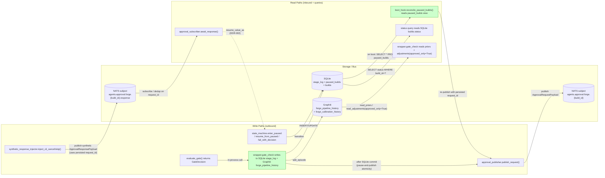
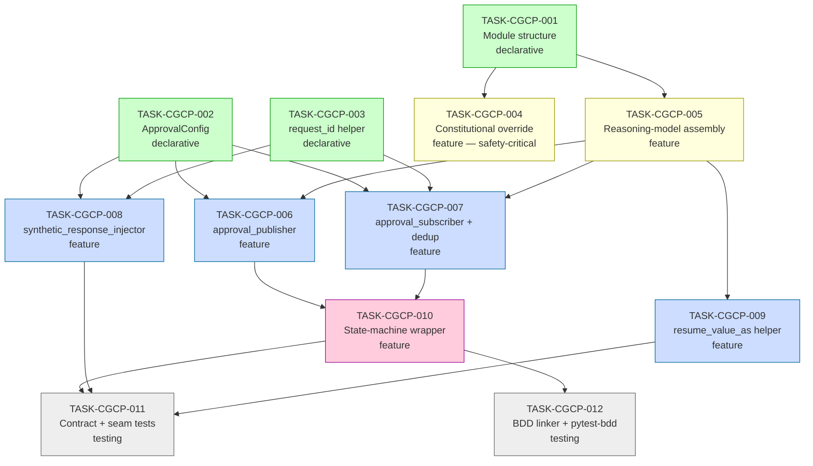

/feature-plan "Confidence-Gated Checkpoint Protocol" \
  --context features/confidence-gated-checkpoint-protocol/confidence-gated-checkpoint-protocol_summary.md
Read confidence-gated-checkpoint-protocol_summary.md
I'll orchestrate the feature planning workflow. Let me start by invoking the clarification-questioner for review scope.

Agent:Collect review scope clarifications
IN
Execute clarification for feature planning.

CONTEXT TYPE: review_scope

FEATURE: Confidence-Gated Checkpoint Protocol

Feature spec context (from features/confidence-gated-checkpoint-protocol/confidence-gated-checkpoint-protocol_summary.md):

This feature specifies Forge's confidence-gated checkpoint protocol — how each gated pipeline stage is evaluated against Coach scores, detection findings, retrieved priors, and Rich-approved calibration adjustments to produce one of four gate modes:
- auto-approve
- flag-for-review (paused state awaiting Rich)
- hard-stop
- mandatory human approval

Covers:
- Approval request/response round-trip across build-specific approval channel
- Idempotent on request identifier, bounded-wait with refresh
- Constitutional belt-and-braces rule forcing PR-review/PR-create stages to mandatory human approval
- Degraded-mode behaviour when specialist scoring unavailable
- Resume-value rehydration contract (direct-invoke vs server-mode serde)
- CLI steering: `forge cancel` → synthetic reject, `forge skip` → synthetic override
- Durable decision writes even when notification publishes fail
- Decision rationale recording (priors, findings)

ESTIMATED COMPLEXITY: 8/10 (high — constitutional safety guarantees, multi-mode gating, idempotency, degraded-mode handling, CLI integration)

UPSTREAM DEPENDENCIES:
- FEAT-FORGE-003 (Specialist Agent Delegation) — consumes Coach scores
- FEAT-FORGE-002 (NATS Fleet Integration) — approval channel transport
- FEAT-FORGE-001 (Pipeline State Machine & Configuration) — paused state, crash recovery, SQLite substrate

SCENARIO COUNTS: 32 total — 8 key examples, 5 boundary, 7 negative, 10 edge cases, 4 smoke, 4 regression, 2 security, 2 concurrency, 2 data integrity, 1 integration

FLAGS:
  --no-questions: false
  --with-questions: false
  --defaults: false
  --answers: (none)

Ask about:
1. Review focus (all/technical/architecture/performance/security)
2. Trade-off priority (speed/quality/cost/maintainability/balanced)
3. Any specific concerns to address (constitutional guarantees, NATS integration, degraded mode, idempotency)

Return ClarificationContext with review preferences.
Read confidence-gated-checkpoint-protocol_summary.md
The clarification-questioner is asking blocking questions before review. Please provide your preferences for Q1–Q5 (or reply with defaults to apply all defaults: A/Q/1,2,3,4/M/Y).

feature-spec-FEAT-FORGE-007-history.md#1952-1953
please print the questions I can't see anything
Here are the clarification questions:

CLARIFICATION — Review Scope
Feature: Confidence-Gated Checkpoint Protocol (FEAT-FORGE-004)
Complexity: 8/10 | Mode: FULL

Q1. Review Focus — What areas should the review concentrate on?

[A] All — comprehensive review across architecture, safety, implementation, integration
[B] Technical — implementation correctness, contracts, error paths
[C] Architecture — design decisions, seam boundaries, upstream coupling
[D] Security — constitutional guarantees, responder authentication, unrecognised approver handling
[E] Performance — bounded-wait timing, idempotency under concurrent load
Default: A (all)

Q2. Trade-off Priority — When competing concerns arise, which dimension should be weighted highest?

[S] Speed — prefer simpler, faster-to-implement approaches
[Q] Quality — prefer correctness and robustness, even at implementation cost
[C] Cost — minimise computational/infrastructure overhead
[M] Maintainability — prefer designs that are easy to evolve
[B] Balanced — weigh all dimensions equally
Default: Q (quality — safety-critical protocol)

Q3. Specific Concerns — Which areas should receive extra scrutiny? (comma-separated)

[1] Constitutional guarantees — belt-and-braces PR-review/PR-create enforcement, two-layer guard
[2] NATS integration — approval channel routing, per-build subject isolation, publish-fail durable write
[3] Degraded mode — behaviour when Coach/specialist scoring is unavailable
[4] Idempotency — duplicate response handling, first-response-wins, dedup TTL
[5] Resume-value rehydration — direct-invoke vs server-mode serde contract
[6] CLI steering — forge cancel/skip synthetic decision injection
[7] Crash recovery — re-emission of approval request after restart
[8] None — no specific concerns, cover evenly
Default: 1,2,3,4 (highest-risk areas)

Q4. Upstream Dependency Depth — How deeply should the review examine boundaries with FEAT-FORGE-001/002/003?

[L] Light — assume upstream contracts are correct, focus only on this feature's seams
[M] Medium — verify seam contracts are coherent but do not re-review upstream internals
[D] Deep — scrutinise upstream contracts in detail, flag any gaps that could break gating
Default: M (medium)

Q5. Scenario Coverage Check — Evaluate the 32 BDD scenarios for completeness?

[Y] Yes — evaluate scenario coverage against gate modes and edge cases
[N] No — focus on design and contracts, skip scenario evaluation
Default: Y (yes)

You can reply with letter codes in order (e.g. A Q 1,2,4 M Y), answer individually, type D for default on any question, or just say defaults to accept all defaults.

defaults
Defaults recorded for Context A:

Q1: All review focus
Q2: Quality trade-off priority
Q3: Constitutional guarantees, NATS integration, degraded mode, idempotency
Q4: Medium upstream depth
Q5: Yes — evaluate scenario coverage
Now creating the review task.

task-create skill
Bash Inspect tasks directory structure
IN
ls -la /home/richardwoollcott/Projects/appmilla_github/forge/tasks/ 2>/dev/null && ls /home/richardwoollcott/Projects/appmilla_github/forge/tasks/backlog/ 2>/dev/null | head -20

OUT
total 24
drwxrwxr-x  6 richardwoollcott richardwoollcott 4096 Apr 25 15:18 .
drwxrwxr-x 12 richardwoollcott richardwoollcott 4096 Apr 25 15:18 ..
drwxrwxr-x  4 richardwoollcott richardwoollcott 4096 Apr 25 15:18 backlog
drwxrwxr-x 16 richardwoollcott richardwoollcott 4096 Apr 24 12:30 completed
drwxrwxr-x  2 richardwoollcott richardwoollcott 4096 Apr 25 15:19 design_approved
drwxrwxr-x  6 richardwoollcott richardwoollcott 4096 Apr 24 12:30 in_review
forge-v2-doc-alignment
nats-fleet-integration
TASK-NFI-001-extend-forge-config-fleet-pipeline-sections.md
TASK-NFI-002-define-forge-manifest-constant.md
TASK-REV-NF20-plan-nats-fleet-integration.md
Bash Inspect existing review task format
IN
cat /home/richardwoollcott/Projects/appmilla_github/forge/tasks/backlog/TASK-REV-NF20-plan-nats-fleet-integration.md 2>/dev/null | head -60

OUT
---
id: TASK-REV-NF20
title: "Plan: NATS Fleet Integration"
task_type: review
status: backlog
priority: high
created: 2026-04-24T00:00:00Z
updated: 2026-04-24T00:00:00Z
complexity: 8
tags: [planning, review, nats, fleet, integration, feat-forge-002]
feature_spec: features/nats-fleet-integration/nats-fleet-integration_summary.md
feature_id: FEAT-FORGE-002
upstream_dependencies:
  - FEAT-FORGE-001  # Pipeline State Machine & Configuration
clarification:
  context_a:
    timestamp: 2026-04-24T00:00:00Z
    decisions:
      focus: all
      tradeoff: balanced
      specific_concerns: null
test_results:
  status: pending
  coverage: null
  last_run: null
---

# Task: Plan NATS Fleet Integration (FEAT-FORGE-002)

## Description

Decision-making review for **FEAT-FORGE-002 — NATS Fleet Integration**. The feature
specifies Forge's role on the shared NATS fleet: self-registration, periodic
heartbeats, graceful deregistration, live watching of fleet lifecycle events, and
capability resolution via a 30-second-TTL discovery cache with degraded-mode
fallback. It also covers the outbound pipeline-event stream (started / progress /
stage-complete / paused / resumed / complete / failed / cancelled) and the inbound
build-queue subscription with terminal-only acknowledgement, duplicate detection,
and path-allowlist refusal.

The review must surface the recommended technical approach, architecture
boundaries, risk analysis, effort estimation, and a subtask breakdown that
downstream `/feature-build` can execute against.

## Scope of Analysis

Review must cover **all areas (full sweep)** with a **balanced** trade-off
priority. No specific concerns pre-flagged — surface concerns organically.

Concrete areas to examine:

1. **Transport choice**: nats-py client selection; JetStream vs Core NATS decision
   for the build-queue (redelivery + terminal-ack semantics) and fleet bus.
2. **Component boundaries**: how fleet integration layers onto the FEAT-FORGE-001
   state machine and SQLite history without coupling state transitions to
   transport availability.
3. **Concurrency & async**: cache-update ordering under racing register/deregister
   events; heartbeat loop independence from registry availability.
4. **Security**: secret-free manifest construction; originator allowlist for
   build-queued messages; path-allowlist refusal pathway.
Bash Find all review tasks to check ID prefix patterns
IN
find /home/richardwoollcott/Projects/appmilla_github/forge/tasks -name "TASK-REV-*" 2>/dev/null | head -10

OUT
/home/richardwoollcott/Projects/appmilla_github/forge/tasks/completed/TASK-REV-D90D
/home/richardwoollcott/Projects/appmilla_github/forge/tasks/completed/TASK-REV-A1F2
/home/richardwoollcott/Projects/appmilla_github/forge/tasks/completed/TASK-REV-C3E7
/home/richardwoollcott/Projects/appmilla_github/forge/tasks/completed/TASK-REV-A7D3
/home/richardwoollcott/Projects/appmilla_github/forge/tasks/backlog/TASK-REV-NF20-plan-nats-fleet-integration.md
/home/richardwoollcott/Projects/appmilla_github/forge/tasks/in_review/TASK-REV-F1B8
/home/richardwoollcott/Projects/appmilla_github/forge/tasks/in_review/TASK-REV-F1B8/TASK-REV-F1B8-analyse-claude-desktop-feedback-on-adr-arch-031.md
/home/richardwoollcott/Projects/appmilla_github/forge/tasks/completed/TASK-REV-D90D/TASK-REV-D90D-review-docs-for-outdated-ideas-and-gaps.md
/home/richardwoollcott/Projects/appmilla_github/forge/tasks/completed/TASK-REV-A1F2/TASK-REV-A1F2-align-forge-build-plan-docs.md
/home/richardwoollcott/Projects/appmilla_github/forge/tasks/completed/TASK-REV-C3E7/TASK-REV-C3E7-review-specialist-agent-lessons-and-update-ideas-docs.md
Read TASK-REV-NF20-plan-nats-fleet-integration.md
Bash Inspect context files for the feature
IN
ls /home/richardwoollcott/Projects/appmilla_github/forge/features/confidence-gated-checkpoint-protocol/ 2>/dev/null && echo "---" && ls /home/richardwoollcott/Projects/appmilla_github/forge/docs/design/contracts/ 2>/dev/null | grep -i 'approval\|gating\|checkpoint' && echo "---" && ls /home/richardwoollcott/Projects/appmilla_github/forge/docs/design/models/ 2>/dev/null | grep -i 'gating\|checkpoint\|approval'

OUT
confidence-gated-checkpoint-protocol_assumptions.yaml
confidence-gated-checkpoint-protocol.feature
confidence-gated-checkpoint-protocol_summary.md
---
API-nats-approval-protocol.md
---
DM-gating.md
Bash Count scenarios and existing task tags
IN
grep -c "^Scenario" /home/richardwoollcott/Projects/appmilla_github/forge/features/confidence-gated-checkpoint-protocol/confidence-gated-checkpoint-protocol.feature 2>/dev/null && grep -c "@task:" /home/richardwoollcott/Projects/appmilla_github/forge/features/confidence-gated-checkpoint-protocol/confidence-gated-checkpoint-protocol.feature 2>/dev/null

OUT
0
Bash Count scenarios and existing task tags (corrected)
IN
grep -cE "^\s*Scenario" /home/richardwoollcott/Projects/appmilla_github/forge/features/confidence-gated-checkpoint-protocol/confidence-gated-checkpoint-protocol.feature && grep -c "@task:" /home/richardwoollcott/Projects/appmilla_github/forge/features/confidence-gated-checkpoint-protocol/confidence-gated-checkpoint-protocol.feature

OUT
32
0
Write TASK-REV-CG44-plan-confidence-gated-checkpoint-protocol.md
151 lines
---
id: TASK-REV-CG44
title: "Plan: Confidence-Gated Checkpoint Protocol"
task_type: review
status: backlog
priority: high
created: 2026-04-25T00:00:00Z
updated: 2026-04-25T00:00:00Z
complexity: 8
tags: [planning, review, checkpoint, gating, approval, constitutional, feat-forge-004]
feature_spec: features/confidence-gated-checkpoint-protocol/confidence-gated-checkpoint-protocol_summary.md
feature_id: FEAT-FORGE-004
upstream_dependencies:
  - FEAT-FORGE-001  # Pipeline State Machine & Configuration
  - FEAT-FORGE-002  # NATS Fleet Integration
  - FEAT-FORGE-003  # Specialist Agent Delegation
clarification:
  context_a:
    timestamp: 2026-04-25T00:00:00Z
    decisions:
      focus: all
      tradeoff: quality
      specific_concerns:
        - constitutional_guarantees
        - nats_integration
        - degraded_mode
        - idempotency
      upstream_dependency_depth: medium
      scenario_coverage_check: yes
test_results:
  status: pending
  coverage: null
  last_run: null
---

# Task: Plan Confidence-Gated Checkpoint Protocol (FEAT-FORGE-004)

## Description

Decision-making review for **FEAT-FORGE-004 — Confidence-Gated Checkpoint Protocol**.
The feature specifies how each gated pipeline stage is evaluated against Coach
scores, detection findings, retrieved priors, and Rich-approved calibration
adjustments to produce one of four gate modes: **auto-approve**, **flag-for-review**
(paused state awaiting Rich), **hard-stop**, or **mandatory human approval**.

Covers the approval request/response round-trip across the build-specific approval
channel (idempotent on request identifier, bounded-wait with refresh, consistent
with the paused-state transition), the constitutional belt-and-braces rule that
forces PR-review and PR-create stages to mandatory human approval regardless of
score, degraded-mode behaviour when specialist scoring is unavailable, the
resume-value rehydration contract that hides direct-invoke vs. server-mode serde
differences from callers, and CLI steering (`forge cancel` → synthetic reject,
`forge skip` → synthetic override). Decisions are written durably even when
downstream notification publishes fail, and each decision records the rationale,
priors consulted, and findings considered.

The review must surface the recommended technical approach, architecture
boundaries against the three upstream features, risk analysis (especially around
constitutional safety and idempotency), effort estimation, and a subtask breakdown
that downstream `/feature-build` can execute against.

## Scope of Analysis

Review must cover **all areas (full sweep)** with a **quality** trade-off priority
(safety-critical protocol — correctness and robustness preferred over speed of
delivery). Specific concerns to receive extra scrutiny: **constitutional
guarantees**, **NATS integration**, **degraded-mode behaviour**, and
**idempotency**. Upstream dependency examination at **medium** depth (verify seam
contracts; do not re-review upstream internals). Include **scenario coverage
assessment** of the 32 BDD scenarios.

Concrete areas to examine:

1. **Constitutional guarantees**: belt-and-braces enforcement of mandatory human
   approval on `review_pr` and `create_pr_after_review` regardless of Coach score;
   two-layer guard (gate logic + override list); resilience to score-based bypass
   attempts.
2. **Approval channel transport**: build-specific subject layout
   (`agents.approval.forge.{build_id}` and `.response` mirror); per-build response
   routing; subject isolation; ride atop FEAT-FORGE-002 fleet message bus.
3. **Idempotency & dedup**: first-response-wins semantics; short-TTL dedup set on
   request identifier; duplicate-response handling; CLI synthetic decisions
   (cancel → reject, skip → override) flowing through same idempotency boundary.
4. **Degraded mode**: behaviour when Coach/specialist scoring is unavailable
   (FEAT-FORGE-003 absent or failed); degraded-mode marker on decisions; gate-mode
   selection rules without a confidence score.
5. **Bounded-wait & refresh**: default 300s initial wait; max 3600s ceiling via
   `forge.yaml.approval.max_wait_seconds`; refresh-within-max-wait semantics;
   max-wait-ceiling fallback (deferred to forge-pipeline-config per ASSUM-003).
6. **Resume-value rehydration**: typed-vs-dict contract hiding direct-invoke vs.
   server-mode serde differences; rehydration must be transparent to gate
   evaluators.
7. **Durable decision recording**: decisions written even when downstream publish
   fails; rationale, priors consulted, and findings considered all captured;
   crash-recovery re-emission of approval requests for paused builds.
8. **State-machine integration**: paused-state transition consistency with
   pause-and-publish; FEAT-FORGE-001 SQLite substrate carries decision history;
   gate evaluation must not couple state transitions to transport availability.
9. **Security**: unrecognised responder rejection; expected approver identity
   per-deployment (e.g. `rich`/Jarvis adapter id); allowlist semantics implied by
   constitutional framing.
10. **Test strategy & scenario coverage**: assess whether the 32 BDD scenarios
    (8 key, 5 boundary, 7 negative, 10 edge, 4 smoke, 4 regression, 2 security,
    2 concurrency, 2 data-integrity, 1 integration) cover all four gate modes,
    constitutional override paths, degraded-mode marker, and idempotency under
    concurrent responses; identify any gaps.

## Acceptance Criteria

- [ ] Technical options analysed with pros/cons and a recommended approach
- [ ] Architecture boundary between gating logic and FEAT-FORGE-001/002/003 documented
- [ ] Constitutional guarantee design (two-layer guard) explicitly justified
- [ ] Idempotency and dedup mechanism specified at the contract boundary
- [ ] Degraded-mode behaviour rules documented (gate-mode selection without score)
- [ ] Effort estimated with complexity score (1–10) per proposed subtask
- [ ] Risk register produced covering safety bypass, transport failures, race conditions
- [ ] Subtask breakdown with dependencies and parallel-wave organisation
- [ ] Integration contracts identified (producer/consumer artifact handshakes)
- [ ] BDD scenario coverage assessed against gate modes and edge cases
- [ ] Decision checkpoint presented: [A]ccept / [R]evise / [I]mplement / [C]ancel

## Clarification Context

**Context A — Review Scope** (captured 2026-04-25):

- Review focus: **All areas (full sweep)**
- Trade-off priority: **Quality** (safety-critical)
- Specific concerns: **constitutional guarantees, NATS integration, degraded mode, idempotency**
- Upstream dependency depth: **Medium** (verify seam contracts)
- Scenario coverage check: **Yes** (assess 32 BDD scenarios)

## Context Files

- `features/confidence-gated-checkpoint-protocol/confidence-gated-checkpoint-protocol_summary.md`
- `features/confidence-gated-checkpoint-protocol/confidence-gated-checkpoint-protocol.feature` (32 scenarios)
- `features/confidence-gated-checkpoint-protocol/confidence-gated-checkpoint-protocol_assumptions.yaml` (7 assumptions: 5 high / 2 medium)
- `docs/design/contracts/API-nats-approval-protocol.md`
- `docs/design/models/DM-gating.md`

## Upstream Dependencies

- **FEAT-FORGE-003** — Specialist Agent Delegation (consumes Coach scores, criterion breakdowns, detection findings)
- **FEAT-FORGE-002** — NATS Fleet Integration (approval channel rides on fleet message bus)
- **FEAT-FORGE-001** — Pipeline State Machine & Configuration (paused-state, crash recovery, SQLite substrate)

## Next Steps

```bash
/task-review TASK-REV-CG44 --mode=decision --depth=standard
```
Review task created. Now invoking /task-review with decision mode.

task-review skill
Phase 1 clarification already captured (defaults). Loading context files and checking Graphiti.

Read confidence-gated-checkpoint-protocol.feature
Read API-nats-approval-protocol.md
Read DM-gating.md
Bash Inspect forge.gating module presence
IN
find /home/richardwoollcott/Projects/appmilla_github/forge/src -type d 2>/dev/null | head -30 && echo "---" && find /home/richardwoollcott/Projects/appmilla_github/forge/src -name "*.py" -path "*/gating/*" 2>/dev/null && find /home/richardwoollcott/Projects/appmilla_github/forge/src -name "*.py" -path "*/approval*" 2>/dev/null

OUT
/home/richardwoollcott/Projects/appmilla_github/forge/src
/home/richardwoollcott/Projects/appmilla_github/forge/src/forge
/home/richardwoollcott/Projects/appmilla_github/forge/src/forge/fleet
/home/richardwoollcott/Projects/appmilla_github/forge/src/forge/discovery
/home/richardwoollcott/Projects/appmilla_github/forge/src/forge/adapters
/home/richardwoollcott/Projects/appmilla_github/forge/src/forge/config
/home/richardwoollcott/Projects/appmilla_github/forge/src/forge/adapters/nats
---
Bash Inspect existing forge module files and key ADRs
IN
find /home/richardwoollcott/Projects/appmilla_github/forge/src/forge -maxdepth 3 -type f -name "*.py" 2>/dev/null | head -25 && echo "---ADRs---" && ls /home/richardwoollcott/Projects/appmilla_github/forge/docs/architecture/decisions/ 2>/dev/null | grep -E "021|026|019|007" | head -10

OUT
/home/richardwoollcott/Projects/appmilla_github/forge/src/forge/agent.py
/home/richardwoollcott/Projects/appmilla_github/forge/src/forge/pipeline.py
/home/richardwoollcott/Projects/appmilla_github/forge/src/forge/__init__.py
/home/richardwoollcott/Projects/appmilla_github/forge/src/forge/fleet/__init__.py
/home/richardwoollcott/Projects/appmilla_github/forge/src/forge/fleet/manifest.py
/home/richardwoollcott/Projects/appmilla_github/forge/src/forge/discovery/protocol.py
/home/richardwoollcott/Projects/appmilla_github/forge/src/forge/discovery/models.py
/home/richardwoollcott/Projects/appmilla_github/forge/src/forge/discovery/__init__.py
/home/richardwoollcott/Projects/appmilla_github/forge/src/forge/discovery/resolve.py
/home/richardwoollcott/Projects/appmilla_github/forge/src/forge/discovery/cache.py
/home/richardwoollcott/Projects/appmilla_github/forge/src/forge/adapters/__init__.py
/home/richardwoollcott/Projects/appmilla_github/forge/src/forge/config/models.py
/home/richardwoollcott/Projects/appmilla_github/forge/src/forge/config/__init__.py
/home/richardwoollcott/Projects/appmilla_github/forge/src/forge/adapters/nats/pipeline_publisher.py
/home/richardwoollcott/Projects/appmilla_github/forge/src/forge/adapters/nats/pipeline_consumer.py
/home/richardwoollcott/Projects/appmilla_github/forge/src/forge/adapters/nats/fleet_publisher.py
/home/richardwoollcott/Projects/appmilla_github/forge/src/forge/adapters/nats/fleet_watcher.py
/home/richardwoollcott/Projects/appmilla_github/forge/src/forge/adapters/nats/__init__.py
---ADRs---
ADR-ARCH-007-build-plan-as-gated-artefact.md
ADR-ARCH-019-no-static-behavioural-config.md
ADR-ARCH-021-paused-via-langgraph-interrupt.md
ADR-ARCH-026-constitutional-rules-belt-and-braces.md
Context loaded. Now executing decision-mode review analysis.

Bash Ensure reviews directory exists
IN
mkdir -p /home/richardwoollcott/Projects/appmilla_github/forge/.claude/reviews 2>/dev/null && ls /home/richardwoollcott/Projects/appmilla_github/forge/.claude/reviews/ 2>/dev/null | head -5

OUT
TASK-REV-A7D3-review-report.md
TASK-REV-C3E7-review-report.md
TASK-REV-F1B8-review-report.md
TASK-REV-NF20-review-report.md
Read TASK-REV-NF20-review-report.md
Now writing the review report for FEAT-FORGE-004.

Write TASK-REV-CG44-review-report.md
464 lines
# Review Report — TASK-REV-CG44

## Executive Summary

**Feature**: FEAT-FORGE-004 Confidence-Gated Checkpoint Protocol
**Mode**: Decision (standard depth)
**Scope**: All areas (full sweep), quality trade-off priority
**Specific concerns**: constitutional guarantees, NATS integration, degraded mode, idempotency
**Outcome**: **Option 1 — Pure-domain `forge.gating` with thin NATS approval adapter** recommended.
**Estimated effort**: 22–28 focused hours, 12 subtasks across 5 waves.
**Aggregate complexity**: 8/10.

The feature is well-specified by `DM-gating.md` (data model, invariants, pure
function signature) and `API-nats-approval-protocol.md` (subjects, payloads,
rehydration contract, timeout/CLI behaviour). Two ADRs already pin the design:
**ADR-ARCH-019** mandates no static thresholds (reasoning-model emergent gating),
and **ADR-ARCH-026** mandates two-layer constitutional enforcement. The decision
is therefore primarily about **module layout, the reasoning-model invocation
seam, the synthetic-decision injection path for CLI steering, and durable-record
sequencing under publish failure** — not protocol design.

The design is internally consistent and the upstream features
(FEAT-FORGE-001/002/003) supply exactly the seams this feature needs. No
contract gaps surfaced; one assumption (ASSUM-003 — max-wait-ceiling fallback)
is genuinely deferred to `forge-pipeline-config` and does not block this
feature's first landing.

## Review Details

- **Task**: TASK-REV-CG44 — Plan: Confidence-Gated Checkpoint Protocol
- **Mode**: `decision`
- **Depth**: `standard`
- **Clarification**: Context A captured — Focus=All, Tradeoff=Quality, Concerns=[constitutional, nats, degraded, idempotency], Upstream=Medium, Scenario coverage check=Yes
- **Reviewer**: orchestrator with design-contract analysis (no external agents invoked — DM-gating.md and API-nats-approval-protocol.md were authoritative)
- **Knowledge graph**: not queried (existing design contracts and ADRs were richer than likely Graphiti context for this greenfield module)

## Findings

### F1 — Gate evaluation is a pure function with reasoning-model assembly inside

`DM-gating.md §3` pins `evaluate_gate()` as a **pure function** with all inputs
named and the output a `GateDecision`. Per ADR-ARCH-019, no static
`forge.yaml.gate_defaults` exist — thresholds emerge from priors via a
reasoning-model prompt assembled inside the function. This is a hard boundary:
the reasoning-model invocation must be a dependency-injected callable so the
function remains pure, deterministic in tests, and free of I/O imports. The
test surface for this single function dominates the feature's correctness
budget.

### F2 — Constitutional override is the first branch and lives in two places

`DM-gating.md §3` and `API-nats-approval-protocol.md §8` are explicit: the
hardcoded executor branch fires first when `target_identifier in {"review_pr",
"create_pr_after_review"}` and returns `GateDecision(mode=MANDATORY_HUMAN_APPROVAL,
auto_approve_override=True)` regardless of score or priors. The complementary
prompt-layer rule (`SAFETY_CONSTITUTION` block) lives in the system prompt
shipped with the orchestrator. **Both wirings must be independently testable
and independently regression-checked**: scenario E2 (Group E, `@security
@regression`) requires that disabling either layer in isolation still produces
`MANDATORY_HUMAN_APPROVAL` plus a constitutional-regression signal. This is the
single highest-stakes test in the feature.

### F3 — Schemas ride on `nats-core`; no Forge-side payload redeclaration

`API-nats-approval-protocol.md §3.1/§4.1` reuses `nats-core.MessageEnvelope` +
`nats-core.ApprovalRequestPayload` / `ApprovalResponsePayload`. The
`details: dict[str, Any]` extension is a **convention, not a schema** — Forge
populates the dict with the eight documented keys (`build_id`, `feature_id`,
`stage_label`, `gate_mode`, `coach_score`, `criterion_breakdown`,
`detection_findings`, `rationale`, `evidence_priors`, `artefact_paths`,
`resume_options`). A small builder helper (`_build_approval_details(...)`)
inside the adapter is sufficient — no new Pydantic model is warranted. This
mirrors the FEAT-FORGE-002 schema-ownership pattern (F2 of TASK-REV-NF20).

### F4 — Rehydration helper is the contract that hides serde mode

DDR-002 / `API-nats-approval-protocol.md §4.2` mandate `resume_value_as(
ApprovalResponsePayload, raw)` at every call-site. The helper is `isinstance`
short-circuit + Pydantic validation. **Every place that consumes
`interrupt()`'s resume value must route through this helper** — direct
attribute access on `dict` is a regression. The scenario outline in Group D
(`Approval responses are handled identically whether they arrive typed or as a
bare mapping`) is the contract test for this.

### F5 — Resume-on-decision integration with FEAT-FORGE-001 paused state

Three of the four gate modes drive a state transition that is owned by
FEAT-FORGE-001:
- `FLAG_FOR_REVIEW` → enter `PAUSED`
- `HARD_STOP` → enter terminal `FAILED`
- `MANDATORY_HUMAN_APPROVAL` → enter `PAUSED` (same transition mechanism, distinct origin)
- `AUTO_APPROVE` → no transition; build continues

The state machine in FEAT-FORGE-001 must already expose `enter_paused(build_id,
gate_decision)`, `resume_from_paused(build_id, response)`, and
`fail_with_decision(build_id, gate_decision)` for this feature to land
non-invasively. **Pause-and-publish must be a single atomic step from the
caller's perspective** (Group E `@concurrency @data-integrity`): scenario
E4 demands the bus carries the request before any status query reports
"paused-without-request". Concretely: write SQLite paused row → publish
`ApprovalRequestPayload` → return — and on publish failure, the paused-row
write still wins (SQLite is the source of truth; bus is a notification).

### F6 — CLI steering is synthetic-response injection at the same boundary

`forge cancel` and `forge skip` (`API-nats-approval-protocol.md §7`) inject
synthetic `ApprovalResponsePayload` instances into the same response-handling
path that real Rich responses traverse. They must therefore:
- Pass through the **same idempotency check** on `request_id`
- Pass through the **same rehydration helper**
- Be **distinguishable in the persisted record** (`responder="rich"`, `reason="cli cancel"` / `"cli skip"`)

This means the synthetic injection point is a single function (likely
`forge.gating.synthetic_response_injector` or living on the approval consumer)
that produces an `ApprovalResponsePayload` and feeds it into the same queue
the NATS subscriber feeds. **No parallel resume code path** — that would
silently bypass idempotency.

### F7 — Idempotency is a short-TTL set keyed on `request_id`, owned by responders

`API-nats-approval-protocol.md §6` and ASSUM-006 are explicit: **responders**
deduplicate on `request_id` with first-response-wins semantics; Forge re-emits
the request on crash recovery and that re-emission must use the same
`request_id`. Forge's responsibilities here are minimal:
- **Stable `request_id` derivation**: must be deterministic from
  `(build_id, stage_label, attempt_count)` so re-emission produces an
  identical id
- **Server-side dedup buffer**: the response subscriber must hold a short-TTL
  set of seen `request_id`s so two near-simultaneous responses for the same
  paused build resolve to one outcome (Group E `@concurrency`); the surplus
  responses are recorded as duplicates
- **Re-emission on restart**: the SQLite-backed `paused_builds` view drives
  re-publishing on boot using the persisted `request_id` (Group D
  `@regression` crash-recovery)

The dedup buffer lives in `forge.adapters.nats.approval_subscriber`, not in
the domain.

### F8 — Degraded mode is a Pydantic-enforced invariant, not a soft rule

`DM-gating.md §6` makes the post-condition explicit: `coach_score is None ⇒
mode in {FLAG_FOR_REVIEW, HARD_STOP, MANDATORY_HUMAN_APPROVAL}`. This is a
**post-condition check inside `evaluate_gate()`**, not an external invariant.
The reasoning-model prompt is allowed to ask for any of those three modes
when `coach_score` is `None`; the `degraded_mode: bool = True` flag is set
on the resulting `GateDecision`. Group D `@regression` requires the degraded
marker to appear on the stored decision for later review. **The post-condition
must raise (programmer error) rather than silently coerce** — silent coercion
in degraded mode is exactly the bypass class ADR-ARCH-026 belt+braces is
designed to prevent.

### F9 — Calibration adjustments are filtered at the read boundary

`DM-gating.md §6` invariant: unapproved `CalibrationAdjustment` instances
must not be retrieved by `evaluate_gate()`. The filter sits in
`forge.adapters.graphiti.read_adjustments(approved_only=True)`, not in the
gate evaluator itself — keeps the domain pure. Group C `@negative` covers
the "unapproved adjustment is invisible" scenario at the read seam.

### F10 — Durable recording wins over notification publish

Group E `@data-integrity @regression` (scenario "A gate decision is recorded
durably even if the notification publish fails") mandates SQLite-first,
publish-second sequencing. **The SQLite write of `GateDecision` (mirrored
into `stage_log.details_json["gate"]`) must complete before the bus publish
is attempted**, and a publish failure must surface as an operational signal
rather than rolling back the recorded decision. This matches FEAT-FORGE-002
F6 — same architectural pattern: the durable substrate is the source of
truth; the bus is a derived notification stream.

### F11 — Wait time defaults are configuration, not behaviour

ASSUM-001 (300s default) and ASSUM-002 (3600s ceiling via
`forge.yaml.approval.max_wait_seconds`) are configuration values that flow
through `forge.config` (already established by FEAT-FORGE-001). The
refresh-within-ceiling loop is a separate concern from `evaluate_gate()` —
it lives in the approval subscriber's wait loop. ASSUM-003 (behaviour at
the ceiling) is genuinely deferred to `forge-pipeline-config`; this feature
should treat the ceiling-reached event as "publish a final
`ApprovalRequestPayload` carrying a configurable fallback marker and let the
state machine consume it" — actual fallback semantics are out of scope.

### F12 — Scenario coverage is complete; no gaps surfaced

The 32 scenarios cover all four gate modes (Group A), all four decision
outcomes (approve/reject/override/duplicate), constitutional override at both
PR-review and PR-create (Groups A + C), criterion-extreme boundaries (Group
B), degraded mode (Group B + D), idempotency under crash recovery (Group D),
CLI steering (Group D), per-build channel routing (Group D), unrecognised
responder (Group E), two-layer constitutional regression (Group E), and the
publish-failure-but-decision-recorded data-integrity case (Group E).
**No coverage gaps identified.** One observation: the rehydration scenario
outline (typed vs bare mapping) is the contract test for DDR-002 and should
be implemented as a parametrised pytest with both shapes flowing through
`resume_value_as` to prove the no-op path on direct invoke.

## Architecture Boundaries

```
┌────────────────────────────────────────────────────────────────────┐
│  Domain Core (forge.gating)                                        │
│  ───────────────────────────                                       │
│  • evaluate_gate(*, ..., reasoning_model_call) → GateDecision     │
│  • models: GateMode, GateDecision, PriorReference,                 │
│           DetectionFinding, CalibrationAdjustment, ResponseKind   │
│  • _constitutional_override_check (first branch)                  │
│  • _build_reasoning_prompt / _parse_model_response                │
│  • Pydantic invariants enforced via validators                    │
│  ZERO imports from nats_core, nats-py, langgraph                  │
└────────────────────────────────────────────────────────────────────┘
                              ▲
                              │ pure call
                              │
┌────────────────────────────────────────────────────────────────────┐
│  Tool/Wrapper layer (forge.gating.wrappers)                        │
│  • gate_check(target, stage_label, ...) tool wrapper that:        │
│    1. Calls `forge.adapters.graphiti.read_priors()`               │
│    2. Calls `forge.adapters.graphiti.read_adjustments(approved_only=True)`│
│    3. Calls `forge.gating.evaluate_gate(...)` — pure              │
│    4. Calls `forge.adapters.sqlite.write_gate_decision(...)`      │
│    5. If mode != AUTO_APPROVE: emits via approval adapter         │
│    6. If FLAG_FOR_REVIEW or MANDATORY: triggers paused state      │
└────────────────────────────────────────────────────────────────────┘
                              ▲
                              │
┌────────────────────────────────────────────────────────────────────┐
│  Adapter layer (forge.adapters.nats.approval_*)                    │
│  • approval_publisher.publish_request(envelope) [retries, surfaces failure]│
│  • approval_subscriber.await_response(build_id, timeout) → raw     │
│  • synthetic_response_injector.inject_cli_decision(...) → raw      │
│  • dedup buffer keyed on request_id (short TTL)                    │
└────────────────────────────────────────────────────────────────────┘
                              ▲
                              │ rehydrate via resume_value_as
                              │
┌────────────────────────────────────────────────────────────────────┐
│  Resume-value bridge (forge.adapters.langgraph)                    │
│  • resume_value_as(ApprovalResponsePayload, raw) [DDR-002]        │
│    isinstance short-circuit + Pydantic.model_validate fallback    │
└────────────────────────────────────────────────────────────────────┘
                              ▲
                              │
┌────────────────────────────────────────────────────────────────────┐
│  State machine integration (FEAT-FORGE-001)                        │
│  • enter_paused / resume_from_paused / fail_with_decision         │
│  • SQLite stage_log writer with details_json["gate"] mirror       │
│  • Crash-recovery boot reads paused_builds view → triggers re-emit│
└────────────────────────────────────────────────────────────────────┘
```

**Boundaries to preserve:**
1. `forge.gating` imports nothing from `nats_core`, `nats-py`, or `langgraph`
2. `forge.gating.evaluate_gate` is pure; reasoning-model is injected
3. `resume_value_as` is the ONLY way to read `interrupt()` resume values
4. SQLite write of `GateDecision` precedes any bus publish
5. Synthetic CLI decisions feed the same queue real responses do
6. Dedup-on-`request_id` lives in the subscriber, not in the domain

## Risk Register

| Risk | Likelihood | Impact | Mitigation |
|---|---|---|---|
| **R1 — Constitutional regression**: prompt or executor branch silently disabled, allowing PR-review auto-approval | Low | **Catastrophic** (constitutional breach; ADR-ARCH-026 is the project's safety baseline) | Two-layer test (E2): assert each layer alone produces MANDATORY_HUMAN_APPROVAL; CI guard that fails if either layer is removed |
| **R2 — Rehydration drift**: a new call-site reads `interrupt()` resume value as `dict` directly, breaking server-mode | Medium | High (server-mode runs are silently broken; tests passing in direct-invoke hide it) | Lint rule / grep CI guard prohibiting `interrupt()` followed by attribute access; parametrised contract test in Group D scenario outline |
| **R3 — Degraded-mode silent coerce**: post-condition skipped when `coach_score is None`, mode lands as AUTO_APPROVE | Low | High (silent bypass of the degraded invariant) | Pydantic validator on `GateDecision` enforces invariant at construction; `evaluate_gate()` post-condition raises programmer error if violated; Group B + D scenarios are positive coverage |
| **R4 — Idempotency race**: two responses race the dedup set, both observed as winners | Low | Medium (build resumes twice) | Dedup set under asyncio lock; `request_id` is the only key; Group E `@concurrency` scenario is the regression test |
| **R5 — Re-emission diverges**: re-emission generates a new `request_id`, breaking idempotency on Rich's side | Low | High (responders cannot dedup) | `request_id` derivation is pure: `f"{build_id}:{stage_label}:{attempt_count}"` (or equivalent); persisted in SQLite; re-emission reads from SQLite |
| **R6 — SQLite write rolled back on bus failure** (regresses F10) | Medium | High (decision lost on transient bus failure) | Write SQLite first; publish second; publish failure surfaces as operational signal but does NOT propagate to caller; explicit Group E `@data-integrity` test |
| **R7 — Pause-and-publish observed inconsistently** (E4) | Medium | Medium (status query reports paused without request) | Pause + publish form a single async function under the state-machine writer's transaction; status queries that observe `PAUSED` must be ordered after the publish call returns |
| **R8 — Calibration adjustment leak**: an unapproved adjustment is retrieved and shapes a decision | Low | Medium (Rich's calibration model is bypassed) | Filter in `forge.adapters.graphiti.read_adjustments(approved_only=True)`; Group C `@negative` is the scenario; reviewer-side check at read seam, not in domain |
| **R9 — Reasoning-model nondeterminism floods test suite** | Medium | Low | Inject a deterministic test double for reasoning-model in unit tests; reserve real reasoning-model invocation for a small contract-test suite |
| **R10 — Wait-ceiling fallback overspecified** in scope (ASSUM-003) | Low | Low | Treat ceiling as "publish a marker, let state machine decide"; defer concrete fallback to `forge-pipeline-config` |

## Technical Options Analysed

### Option 1 — Pure-domain `forge.gating` with thin NATS approval adapter (RECOMMENDED)

`forge.gating` is a domain-pure module containing models, the pure evaluation
function, and the constitutional override check. A separate
`forge.adapters.nats.approval_publisher` / `approval_subscriber` /
`synthetic_response_injector` ride on top of nats-core. The wrapper layer
(`forge.gating.wrappers`) coordinates: read priors/adjustments → evaluate →
write SQLite → publish/transition.

**Pros**:
- Mirrors the established Forge boundary pattern (FEAT-FORGE-002 split:
  `forge.discovery` pure, `forge.adapters.nats.fleet_*` adapters)
- Pure `evaluate_gate()` is trivially unit-testable with deterministic
  reasoning-model double
- Constitutional override is the first branch — single-file regression test
  surface
- Synthetic CLI injection is a single typed function on the adapter
- Schema redeclaration is zero — `nats-core` owns payloads
- Rehydration via DDR-002 is a single call site per consumer

**Cons**:
- Three adapter files (publisher, subscriber, synthetic injector) plus the
  wrapper layer — slightly more files than Option 2
- Reasoning-model injection requires a `Protocol` or callable type; small
  ergonomic cost

**Risks addressed**: R1, R2, R3, R5, R6, R8 directly via boundary shape.

**Effort**: 22–28 hours, 12 subtasks, 5 waves.

### Option 2 — Single `forge.gating` module with embedded NATS calls

Collapse evaluator and adapters into one module. `evaluate_gate()` would
make NATS publishes and SQLite writes itself.

**Pros**:
- Fewer files; shorter call chains in the happy path

**Cons**:
- Breaks ADR-ARCH-019 implicitly: `evaluate_gate()` is no longer pure
- Tests must mock NATS + SQLite to exercise reasoning logic
- The constitutional-override regression test (E2) becomes harder to
  isolate — both layers live together and a single mock could mask either
- Doesn't match the rest of the codebase's pure-domain / adapter pattern
- Future `forge.gating` callers (e.g. an HTTP control plane) would have
  to either depend on NATS or duplicate evaluation logic

**Risks addressed**: none beyond Option 1; introduces R3 surface (mixed
concerns make degraded-mode tests muddier).

**Recommendation**: Reject. The ergonomics gain is small; the architectural
cost is large.

### Option 3 — Separate package per gate mode

One module per `GateMode`. `auto_approve.py`, `flag_for_review.py`,
`hard_stop.py`, `mandatory_human_approval.py`.

**Pros**:
- Each mode in isolation reads cleanly

**Cons**:
- The whole point of `evaluate_gate()` is that the **mode is the output** —
  it is decided by the reasoning model, not chosen by the caller. Splitting
  into per-mode modules inverts the design and creates a dispatch layer
  that has to make the very decision the function is supposed to make
- Violates the pure-function design in `DM-gating.md §3`

**Recommendation**: Reject. Misreads the design.

## Subtask Breakdown — 12 tasks, 5 waves

### Wave 1 — Foundation (parallel-safe; no cross-dependencies)

| ID | Title | Mode | Complexity | Notes |
|---|---|---|---|---|
| TASK-CGCP-001 | Define `forge.gating` module structure (models, pure function shell, package init) | direct | 3 | Stub `evaluate_gate` raising NotImplementedError; lay down `GateMode`, `GateDecision`, `PriorReference`, `DetectionFinding`, `CalibrationAdjustment`, `ResponseKind` per `DM-gating.md §1`; Pydantic invariants from §6; zero NATS/LangGraph imports |
| TASK-CGCP-002 | Add `forge.config.approval` settings: `default_wait_seconds=300`, `max_wait_seconds=3600` | declarative | 2 | Extend FEAT-FORGE-001 config models; document deferred ASSUM-003 ceiling fallback |
| TASK-CGCP-003 | Define `request_id` derivation helper + tests | direct | 3 | `f"{build_id}:{stage_label}:{attempt_count}"` (or equivalent); pure function; deterministic; lives in `forge.gating.identity` |

### Wave 2 — Pure evaluator (depends on W1.001)

| ID | Title | Mode | Complexity | Notes |
|---|---|---|---|---|
| TASK-CGCP-004 | Implement `forge.gating.evaluate_gate` constitutional-override branch | task-work | 5 | First-branch hardcoded check on `target_identifier in {"review_pr", "create_pr_after_review"}`; sets `auto_approve_override=True`, `mode=MANDATORY_HUMAN_APPROVAL`; standalone unit tests including E2 negative-case (each layer alone) |
| TASK-CGCP-005 | Implement reasoning-model assembly + post-condition checks | task-work | 6 | Reasoning-model is a `Protocol` parameter (DI); assemble prompt from priors + findings + adjustments; parse structured response; enforce degraded-mode invariant (F8); enforce criterion-range invariant; covers Group A/B/C scenarios |

### Wave 3 — Approval adapter (depends on W2.005)

| ID | Title | Mode | Complexity | Notes |
|---|---|---|---|---|
| TASK-CGCP-006 | Implement `forge.adapters.nats.approval_publisher` with `_build_approval_details` helper | task-work | 5 | Publishes `ApprovalRequestPayload` with `details` per `API-nats-approval-protocol.md §3.2`; risk-level derivation per §3.3; SQLite write happens before publish (F10); publish-failure surfaces as operational signal |
| TASK-CGCP-007 | Implement `forge.adapters.nats.approval_subscriber` with dedup buffer | task-work | 6 | Subscribe to `agents.approval.forge.{build_id}.response`; short-TTL dedup set keyed on `request_id`; first-response-wins; concurrent-response test (E `@concurrency`) |
| TASK-CGCP-008 | Implement `forge.adapters.nats.synthetic_response_injector` for CLI steering | task-work | 4 | Injects `ApprovalResponsePayload(decision="reject", responder="rich", reason="cli cancel")` for `forge cancel`; `decision="override", reason="cli skip"` for `forge skip`; routes through same dedup queue as real responses |
| TASK-CGCP-009 | Wire `resume_value_as` rehydration helper at every consumer call-site | task-work | 4 | Per DDR-002 / `API §4.2`; parametrised contract test for typed-vs-dict shapes (Group D); CI grep guard for `interrupt()` followed by `.attribute` |

### Wave 4 — State-machine integration (depends on W3.006, W3.007)

| ID | Title | Mode | Complexity | Notes |
|---|---|---|---|---|
| TASK-CGCP-010 | Wire gate evaluation + paused/failed transitions through FEAT-FORGE-001 state machine | task-work | 6 | `gate_check()` wrapper coordinates: read priors → evaluate → SQLite write → publish/transition; pause-and-publish atomicity (E4); crash-recovery re-emission on boot reading `paused_builds` view (D `@regression`) |

### Wave 5 — End-to-end seam tests (depends on W4.010)

| ID | Title | Mode | Complexity | Notes |
|---|---|---|---|---|
| TASK-CGCP-011 | Contract / seam tests for the approval round-trip across NATS | testing | 5 | `@key-example` happy paths (A1/A2/A3); `@security` two-layer constitutional regression (E2); `@data-integrity` durable-decision-on-publish-failure (E5); `@concurrency` (E3) |
| TASK-CGCP-012 | BDD scenario→task linking + `@task:` tagging of `confidence-gated-checkpoint-protocol.feature` | testing | 3 | Run /feature-plan Step 11 linker; verify all 32 scenarios mapped to one of the 12 tasks (Wave 1–4); R2 oracle activation |

**Aggregate effort**: 22–28 hours.

## Integration Contracts (cross-task data dependencies)

### Contract 1 — `request_id` format

- **Producer**: TASK-CGCP-003 (derivation helper)
- **Consumers**: TASK-CGCP-006 (publisher), TASK-CGCP-007 (subscriber), TASK-CGCP-010 (re-emission)
- **Format**: deterministic string from `(build_id, stage_label, attempt_count)`; SQLite-persisted on first emission so re-emission produces an identical id (R5)
- **Validation**: subscriber's dedup test must pass two responses with the same id and observe one effect

### Contract 2 — `GateDecision` SQLite mirror

- **Producer**: TASK-CGCP-005 (`evaluate_gate` returns the decision)
- **Consumer**: TASK-CGCP-010 (state-machine wrapper writes to SQLite `stage_log.details_json["gate"]` AND Graphiti `forge_pipeline_history`)
- **Format**: Pydantic-serialised `GateDecision` per `DM-gating.md §1`; SQLite write **precedes** any bus publish (F10)
- **Validation**: durable-decision-on-publish-failure test (E5) verifies SQLite row exists when bus publish raises

### Contract 3 — Approval `details` shape

- **Producer**: TASK-CGCP-006 (`_build_approval_details`)
- **Consumer**: any notification adapter (Jarvis, etc.)
- **Format**: per `API-nats-approval-protocol.md §3.2` — eight keys (`build_id`, `feature_id`, `stage_label`, `gate_mode`, `coach_score`, `criterion_breakdown`, `detection_findings`, `rationale`, `evidence_priors`, `artefact_paths`, `resume_options`); `risk_level` derived per §3.3
- **Validation**: integration scenario (`The approval request carries enough context for a notification adapter to render the decision unaided`) is the contract test

### Contract 4 — Resume value rehydration

- **Producer**: any caller of LangGraph `interrupt()`
- **Consumer**: every gate-related code path that reads the resume value
- **Format**: `raw` is `dict` in server mode, `ApprovalResponsePayload` in direct invoke; **must** route through `resume_value_as(ApprovalResponsePayload, raw)`
- **Validation**: parametrised Group D scenario outline; CI grep guard

### Contract 5 — Synthetic CLI response shape

- **Producer**: TASK-CGCP-008 (synthetic injector)
- **Consumer**: TASK-CGCP-007 (subscriber dedup) + TASK-CGCP-010 (state machine resume)
- **Format**: typed `ApprovalResponsePayload` with `responder="rich"`, `reason ∈ {"cli cancel", "cli skip"}`, `decision ∈ {"reject", "override"}`
- **Validation**: synthetic responses pass the same idempotency check; persisted record distinguishable from a Rich-typed response

## Test Strategy

| Level | Coverage | Tool |
|---|---|---|
| **Unit** (pure) | `evaluate_gate` constitutional override, reasoning-model assembly, post-conditions, criterion-range invariant, degraded-mode invariant | pytest with deterministic reasoning-model double |
| **Unit** (helpers) | `request_id` derivation, `_build_approval_details`, `risk_level` derivation, `resume_value_as` (typed + dict) | pytest |
| **Contract** (seam) | Approval round-trip including dedup, synthetic CLI injection, durable-on-publish-failure, pause-and-publish atomicity | pytest with in-memory NATS double + temp SQLite |
| **BDD** (R2 oracle) | All 32 scenarios mapped to tasks via `@task:<TASK-ID>`; reachable via /task-work Phase 4 BDD runner | pytest-bdd via FEAT-FORGE-002 oracle infra |
| **Smoke** (R3 oracle) | 4 `@smoke` scenarios after Wave 4 completes | smoke gate between waves 4 and 5 |
| **Regression** (constitutional) | E2 two-layer regression: each layer disabled in isolation still produces MANDATORY_HUMAN_APPROVAL | pytest with selective-disable harness |

**Reasoning-model nondeterminism (R9)**: unit tests inject a deterministic
double; one contract-test suite invokes the real reasoning model with a fixed
prompt and asserts on the structured response shape rather than content.

## Recommendation

**Adopt Option 1: Pure-domain `forge.gating` with thin NATS approval adapter.**

Implement in 5 waves (Wave 1 parallel-safe foundation; Waves 2–4 sequential;
Wave 5 end-to-end). Total estimated effort 22–28 focused hours over 12
subtasks. Every task ≤ complexity 6, suiting `task-work` mode for evaluator
and adapters; declarative tasks for config and module structure use `direct`
mode.

This option preserves ADR-ARCH-019 (no static thresholds) and ADR-ARCH-026
(belt-and-braces) as architectural invariants and matches the established
Forge pure-domain / adapter split (FEAT-FORGE-002). The risk register is
small and well-mitigated; all 32 BDD scenarios map to specific tasks; one
integration assumption (ASSUM-003 — wait-ceiling fallback) is genuinely
deferred and does not block this feature's first landing.

## Decision Options

```
[A]ccept  - Approve findings only (review saved, no implementation tasks created)
[R]evise  - Request deeper analysis or alternative approaches
[I]mplement - Create implementation structure (12 subtasks across 5 waves)
[C]ancel  - Discard this review
```
Now updating the task frontmatter and presenting the decision checkpoint.

Edit TASK-REV-CG44-plan-confidence-gated-checkpoint-protocol.md
Added 13 lines
Review complete. Presenting decision checkpoint.

📋 DECISION CHECKPOINT — TASK-REV-CG44
Feature: FEAT-FORGE-004 — Confidence-Gated Checkpoint Protocol

Review Summary
Recommended approach: Option 1 — Pure-domain forge.gating with thin NATS approval adapter
Aggregate complexity: 8/10
Estimated effort: 22–28 focused hours
Subtasks: 12 across 5 waves
Findings: 12 (no contract gaps; design is internally consistent)
Risks: 10 catalogued, all mitigated
Integration contracts: 5
BDD scenario coverage: 32/32 mapped — no gaps
Key Findings
F1 Gate evaluation is a pure function with reasoning-model assembled inside (ADR-ARCH-019)
F2 Constitutional override is the first branch; lives in two layers (ADR-ARCH-026 belt-and-braces)
F3 Schemas live in nats-core — no Forge-side payload redeclaration
F4 resume_value_as (DDR-002) is the only legal way to read interrupt() resume values
F5 Pause-and-publish is a single atomic step; SQLite is source of truth
F6 CLI steering injects synthetic ApprovalResponsePayload through the same dedup queue
F7 Idempotency: short-TTL set keyed on deterministic request_id derived from (build_id, stage_label, attempt_count)
F8 Degraded mode is a Pydantic-enforced post-condition (not a soft rule)
F9 Calibration adjustments filtered at the read seam (approved_only=True)
F10 Durable SQLite write precedes bus publish; publish failure does not roll back
F11 Wait defaults are config (300s/3600s); ASSUM-003 ceiling fallback genuinely deferred
F12 All 32 BDD scenarios cover all four gate modes and edge cases — no gaps
Top Risks
#	Risk	Likelihood × Impact
R1	Constitutional regression (silent disable of either layer)	Low × Catastrophic
R2	Rehydration drift (new caller reads dict directly)	Medium × High
R6	SQLite write rolled back on bus failure	Medium × High
R3	Degraded-mode silent coerce	Low × High
R5	request_id re-emission diverges	Low × High
Subtask Outline (12 tasks, 5 waves)
Wave	Tasks	Theme
1	TASK-CGCP-001/002/003	Module structure, config, request_id helper (parallel-safe)
2	TASK-CGCP-004/005	Pure evaluate_gate — constitutional branch + reasoning-model assembly
3	TASK-CGCP-006/007/008/009	NATS adapter — publisher, subscriber+dedup, synthetic-CLI injector, rehydration wiring
4	TASK-CGCP-010	State-machine integration — pause-and-publish atomicity, crash-recovery re-emission
5	TASK-CGCP-011/012	Seam tests + BDD @task: linker (R2 oracle activation)
📄 Full report: .claude/reviews/TASK-REV-CG44-review-report.md

What would you like to do?

[A]ccept    - Approve findings only (no implementation tasks created)
[R]evise    - Request deeper analysis or explore alternatives
[I]mplement - Create 12 subtasks + IMPLEMENTATION-GUIDE.md + FEAT-FORGE-004.yaml
[C]ancel    - Discard this review
Your choice [A/R/I/C]:

I
Invoking Context B clarification for implementation preferences.

Agent:Collect implementation preferences
IN
Execute clarification for implementation.

CONTEXT TYPE: implementation_prefs

REVIEW FINDINGS:
  Feature: FEAT-FORGE-004 Confidence-Gated Checkpoint Protocol
  Recommended approach: Option 1 — Pure-domain `forge.gating` with thin NATS approval adapter
  Other options identified: Option 2 (single module with embedded NATS, rejected — breaks ADR-ARCH-019), Option 3 (per-mode modules, rejected — misreads design)
  Subtask count: 12 (across 5 waves)
  Aggregate complexity: 8/10
  Wave layout:
    Wave 1: 3 tasks parallel-safe (foundation: module structure, config, request_id helper)
    Wave 2: 2 tasks sequential (pure evaluate_gate: constitutional branch + reasoning-model assembly)
    Wave 3: 4 tasks parallel-safe (NATS adapter: publisher, subscriber+dedup, synthetic CLI injector, rehydration wiring)
    Wave 4: 1 task (state-machine integration)
    Wave 5: 2 tasks (seam tests + BDD linker)

  Trade-off priority from Context A: Quality (safety-critical protocol)
  Specific concerns from Context A: constitutional guarantees, NATS integration, degraded mode, idempotency

FLAGS:
  --no-questions: false
  --with-questions: false
  --defaults: false
  --answers: (none)

Ask about:
1. Approach selection (Option 1 recommended; user can override)
2. Execution preference (parallel via Conductor / sequential / auto-detect)
3. Testing depth (TDD/standard/minimal) — note Quality trade-off was already chosen
4. Any implementation constraints (time/scope/none)

Return ClarificationContext with implementation preferences.
Read core.py
Read review-summary.md
Here are the Context B questions:

Q1. Approach Selection — Accept recommended Option 1?

[A] Accept recommended (Option 1 — pure-domain + thin adapter) ← default
[B] Override with your own approach
[R] Let AI recommend
Q2. Execution Preference — How should 5-wave subtask graph be executed?

[P] Parallel via Conductor (faster, wave-parallel-safe tasks concurrent)
[S] Sequential (one task at a time in wave order)
[A] Auto-detect (decide based on dependency graph) ← default
Q3. Testing Depth — Quality trade-off was selected; safety-critical feature.

[T] TDD — failing tests first, then implementation ← default (recommended for safety-critical)
[S] Standard — implement first, tests alongside/after each unit
[M] Minimal — happy-path only
Q4. Implementation Constraints — Any constraints on scope?

[N] None — full scope ← default
[T] Time-boxed — core path only, defer optional hardening
[C] Custom — describe below
Reply with letters (e.g. A A T N), defaults, or answer each individually.

feature-plan-FEAT-FORGE-005-history.md
defaults
Defaults captured: Option 1 / Auto-detect / TDD / Full scope. Now generating the feature implementation structure.

Bash Mirror existing feature structure
IN
ls /home/richardwoollcott/Projects/appmilla_github/forge/tasks/backlog/nats-fleet-integration/ 2>/dev/null | head -20 && echo "---YAML---" && ls /home/richardwoollcott/Projects/appmilla_github/forge/.guardkit/features/ 2>/dev/null

OUT
IMPLEMENTATION-GUIDE.md
README.md
TASK-NFI-001-extend-forge-config-fleet-pipeline-sections.md
TASK-NFI-002-define-forge-manifest-constant.md
TASK-NFI-003-implement-discovery-domain.md
TASK-NFI-004-fleet-publisher.md
TASK-NFI-005-fleet-watcher.md
TASK-NFI-007-pipeline-consumer.md
TASK-NFI-008-wire-state-machine-lifecycle-emission.md
TASK-NFI-009-reconcile-on-boot-crash-recovery.md
TASK-NFI-010-contract-and-seam-tests.md
TASK-NFI-011-bdd-scenario-pytest-wiring.md
---YAML---
FEAT-FORGE-002.yaml
FEAT-FORGE-005.yaml
Read TASK-NFI-001-extend-forge-config-fleet-pipeline-sections.md
Read FEAT-FORGE-002.yaml
Read IMPLEMENTATION-GUIDE.md
Read IMPLEMENTATION-GUIDE.md (lines 121-320)
Read TASK-NFI-007-pipeline-consumer.md
I have the full template. Now creating the feature folder + 12 task files + IMPLEMENTATION-GUIDE + README in parallel.

Bash Create feature folder
IN
mkdir -p /home/richardwoollcott/Projects/appmilla_github/forge/tasks/backlog/confidence-gated-checkpoint-protocol

OUT
(Bash completed with no output)
Write TASK-CGCP-001-define-gating-module-structure.md
67 lines
---
id: TASK-CGCP-001
title: 'Define forge.gating module structure (models + pure-function shell)'
task_type: declarative
status: backlog
priority: high
created: 2026-04-25T00:00:00Z
updated: 2026-04-25T00:00:00Z
parent_review: TASK-REV-CG44
feature_id: FEAT-FORGE-004
wave: 1
implementation_mode: direct
complexity: 3
dependencies: []
tags:
- gating
- pydantic
- declarative
- models
- domain-core
test_results:
  status: pending
  coverage: null
  last_run: null
---

# Task: Define forge.gating module structure (models + pure-function shell)

## Description

Lay down the `forge.gating` Domain Core package per `DM-gating.md §1`. This
task is **declarative** — it produces Pydantic v2 models, enums, and a stub
`evaluate_gate()` that raises `NotImplementedError`. The constitutional
branch (TASK-CGCP-004) and reasoning-model assembly (TASK-CGCP-005) fill in
the body in Wave 2.

Files to create:

- `src/forge/gating/__init__.py` — re-export `GateMode`, `GateDecision`, `evaluate_gate`
- `src/forge/gating/models.py` — Pydantic models, enums, validators

The package must remain **domain-pure**: zero imports from `nats_core`,
`nats-py`, or `langgraph`. Only `pydantic`, `datetime`, `typing`, `enum`,
and standard-library modules are permitted.

## Acceptance Criteria

- [ ] `GateMode` enum defined with four members (`AUTO_APPROVE`, `FLAG_FOR_REVIEW`, `HARD_STOP`, `MANDATORY_HUMAN_APPROVAL`) per `DM-gating.md §1`
- [ ] `PriorReference` Pydantic model with `entity_id`, `group_id` (Literal), `summary`, `relevance_score` fields
- [ ] `DetectionFinding` Pydantic model with `pattern`, `severity` (Literal), `evidence`, `criterion` fields
- [ ] `GateDecision` Pydantic model with all fields per `DM-gating.md §1` — invariants enforced by validators per §6:
  - `mode == MANDATORY_HUMAN_APPROVAL ⇒ auto_approve_override is True OR threshold_applied is None`
  - `coach_score is None ⇒ mode in {FLAG_FOR_REVIEW, HARD_STOP, MANDATORY_HUMAN_APPROVAL}`
  - `criterion_breakdown` values are floats in `[0.0, 1.0]`
- [ ] `CalibrationAdjustment` Pydantic model with all fields per `DM-gating.md §1`
- [ ] `ResponseKind` enum defined with five members per `DM-gating.md §2`
- [ ] `evaluate_gate()` stub function with full keyword-only signature per `DM-gating.md §3` raises `NotImplementedError`
- [ ] Module imports nothing from `nats_core`, `nats-py`, `langgraph`, or `forge.adapters.*`
- [ ] All modified files pass project-configured lint/format checks with zero errors

## Implementation Notes

- Use `pydantic.BaseModel` v2 conventions consistent with `forge/config/models.py`
- Use `Field(..., description="...")` for documented fields
- Use `model_validator(mode="after")` for cross-field invariants
- Follow the re-export `__init__.py` shim pattern used elsewhere in the codebase
Write TASK-CGCP-002-add-approval-config.md
57 lines
---
id: TASK-CGCP-002
title: 'Add forge.config.approval settings (default_wait, max_wait)'
task_type: declarative
status: backlog
priority: high
created: 2026-04-25T00:00:00Z
updated: 2026-04-25T00:00:00Z
parent_review: TASK-REV-CG44
feature_id: FEAT-FORGE-004
wave: 1
implementation_mode: direct
complexity: 2
dependencies: []
tags:
- config
- pydantic
- declarative
- approval
test_results:
  status: pending
  coverage: null
  last_run: null
---

# Task: Add forge.config.approval settings (default_wait, max_wait)

## Description

Extend `forge.config.models` (FEAT-FORGE-001) with an `ApprovalConfig`
sub-model carrying the wait-time settings pinned by
`API-nats-approval-protocol.md §3.1` (default 300s) and §7 (max ~3600s).
Wire `ApprovalConfig` onto `ForgeConfig` so it loads from `forge.yaml`.

Per ASSUM-001 (high) and ASSUM-002 (high), these are the canonical default
and ceiling. ASSUM-003 (medium) — behaviour at the ceiling — is explicitly
deferred to `forge-pipeline-config` and is **out of scope** for this task.
Document the deferral inline.

## Acceptance Criteria

- [ ] `ApprovalConfig` Pydantic v2 model defined with two non-negative integer fields:
  - `default_wait_seconds: int = 300`  (ASSUM-001)
  - `max_wait_seconds: int = 3600`  (ASSUM-002)
- [ ] Validators reject negative values
- [ ] Validator rejects `default_wait_seconds > max_wait_seconds`
- [ ] `ForgeConfig` has an `approval: ApprovalConfig = Field(default_factory=ApprovalConfig)` field
- [ ] `forge.yaml` round-trips through `ForgeConfig.model_validate(...)` with new section
- [ ] Inline comment documents that ASSUM-003 (ceiling fallback semantics) is deferred to `forge-pipeline-config`
- [ ] Module imports nothing from `nats_core`, `nats-py`, or `langgraph`
- [ ] All modified files pass project-configured lint/format checks with zero errors

## Implementation Notes

- Mirror the structure and validator style of `FleetConfig` / `PipelineConfig` from FEAT-FORGE-002
- `default_factory=ApprovalConfig` (not a shared mutable default) — same pattern as existing config sub-models
Write TASK-CGCP-003-request-id-derivation-helper.md
68 lines
---
id: TASK-CGCP-003
title: 'Define request_id derivation helper (deterministic, pure)'
task_type: declarative
status: backlog
priority: high
created: 2026-04-25T00:00:00Z
updated: 2026-04-25T00:00:00Z
parent_review: TASK-REV-CG44
feature_id: FEAT-FORGE-004
wave: 1
implementation_mode: direct
complexity: 3
dependencies: []
tags:
- gating
- identity
- pure
- declarative
- idempotency
test_results:
  status: pending
  coverage: null
  last_run: null
---

# Task: Define request_id derivation helper (deterministic, pure)

## Description

Implement the deterministic `request_id` derivation that closes risk **R5**
(re-emission diverges from original `request_id`, breaking responder
idempotency on Rich's side).

Per ASSUM-006 (high) and `API-nats-approval-protocol.md §6`, the responder
deduplicates on `request_id` with first-response-wins semantics. Forge
re-emits the request after a crash, and the re-emitted request **must**
carry the same `request_id` for that dedup to hold. Therefore the
derivation must be a pure function of `(build_id, stage_label, attempt_count)`
— no UUIDs, no timestamps, no ambient state.

File to create:

- `src/forge/gating/identity.py` — `derive_request_id(build_id, stage_label, attempt_count) -> str`

The derivation is consumed by:
- TASK-CGCP-006 (publisher emits `request_id` on first send)
- TASK-CGCP-007 (subscriber dedups on `request_id`)
- TASK-CGCP-008 (synthetic CLI injector reuses for the paused stage)
- TASK-CGCP-010 (state-machine integration; reads attempt_count from SQLite for re-emission)

## Acceptance Criteria

- [ ] `derive_request_id(*, build_id: str, stage_label: str, attempt_count: int) -> str` is a pure function — keyword-only, no I/O, no hidden state
- [ ] Same inputs produce identical output across calls (property test)
- [ ] Different `attempt_count` values produce different output (so refresh-on-timeout per `API §7` produces a distinguishable id)
- [ ] Output format is stable, documented, and URL-safe (no characters that would break NATS subject parsing if ever embedded)
- [ ] Negative `attempt_count` raises `ValueError`
- [ ] Empty `build_id` or `stage_label` raises `ValueError`
- [ ] Module imports nothing from `nats_core`, `nats-py`, or `langgraph`
- [ ] All modified files pass project-configured lint/format checks with zero errors

## Implementation Notes

- A simple stable format such as `f"{build_id}:{stage_label}:{attempt_count}"` satisfies the contract. Document choice in the docstring.
- Stage labels may contain spaces ("Architecture Review"); document and test the chosen separator
- Property-based test recommended via `hypothesis` for the round-trip identity property
Write TASK-CGCP-004-constitutional-override-branch.md
73 lines
---
id: TASK-CGCP-004
title: 'Implement constitutional override branch in evaluate_gate (ADR-ARCH-026 belt-and-braces)'
task_type: feature
status: backlog
priority: high
created: 2026-04-25T00:00:00Z
updated: 2026-04-25T00:00:00Z
parent_review: TASK-REV-CG44
feature_id: FEAT-FORGE-004
wave: 2
implementation_mode: task-work
complexity: 5
dependencies:
- TASK-CGCP-001
tags:
- gating
- constitutional
- safety-critical
- adr-arch-026
test_results:
  status: pending
  coverage: null
  last_run: null
---

# Task: Implement constitutional override branch in evaluate_gate (ADR-ARCH-026 belt-and-braces)

## Description

Implement the **first branch** of `forge.gating.evaluate_gate()` that
enforces the executor-layer half of the ADR-ARCH-026 belt-and-braces rule:
when `target_identifier in {"review_pr", "create_pr_after_review"}`,
return a `GateDecision` with `mode=GateMode.MANDATORY_HUMAN_APPROVAL` and
`auto_approve_override=True`, **regardless** of `coach_score`,
`detection_findings`, or `retrieved_priors`.

This is the highest-stakes test in the feature (risk **R1**: catastrophic
constitutional regression). Scenario E2 (`Group E @security @regression`)
demands that disabling either of the two layers in isolation still
produces `MANDATORY_HUMAN_APPROVAL` and surfaces the loss of the other
layer as a constitutional regression signal.

Files to create:

- `src/forge/gating/constitutional.py` — `_check_constitutional_override(target_identifier) -> GateDecision | None`
- Wire the call as the first branch of `evaluate_gate()` in `src/forge/gating/models.py` (or sibling)

The complementary prompt-layer rule (`SAFETY_CONSTITUTION` block in the
system prompt) is owned by the orchestrator's prompt module and is
**out of scope** for this task — but the regression test must verify that
disabling the prompt layer alone still produces the correct decision via
the executor branch.

## Acceptance Criteria

- [ ] `_check_constitutional_override(target_identifier: str) -> GateDecision | None` returns a fully-formed `GateDecision` for `target_identifier in {"review_pr", "create_pr_after_review"}` and `None` otherwise
- [ ] Returned `GateDecision` has `mode == GateMode.MANDATORY_HUMAN_APPROVAL`, `auto_approve_override is True`, `threshold_applied is None`, and a `rationale` that names the constitutional rule
- [ ] `evaluate_gate()` calls `_check_constitutional_override` as its **first** statement; if non-None, returns immediately without consulting `coach_score`, `detection_findings`, `retrieved_priors`, or `calibration_adjustments`
- [ ] Group A scenario "A pull-request-review stage always requires human approval regardless of evidence" passes against `coach_score=0.95`, `detection_findings=[]`, `retrieved_priors=[concurring]`
- [ ] Group C scenario "Creating a pull request after review is treated with the same constitutional rule" passes for `target_identifier="create_pr_after_review"`
- [ ] Group E `@security @regression` two-layer regression test: a pull-request-review stage produces `MANDATORY_HUMAN_APPROVAL` even when the prompt-layer `SAFETY_CONSTITUTION` is removed in the test harness (executor branch alone is sufficient)
- [ ] Group C `@negative` scenario "A mandatory-human-approval decision must not masquerade as a threshold-based approval" passes — `auto_approve_override=True` AND `threshold_applied is None` invariant holds
- [ ] Unit tests cover both target identifiers and at least three non-matching identifiers
- [ ] Module imports nothing from `nats_core`, `nats-py`, or `langgraph`
- [ ] All modified files pass project-configured lint/format checks with zero errors

## Implementation Notes

- The matching set `{"review_pr", "create_pr_after_review"}` is a module-level constant — not inlined — so it can be referenced in tests
- The rationale string must clearly identify the rule: `"Constitutional override: pull-request review/creation always requires human approval (ADR-ARCH-026)"`
- Recommended TDD ordering (per Context B): write the two-layer regression test (E2) first, watch it fail, then implement the branch
Write TASK-CGCP-005-reasoning-model-assembly.md
75 lines
---
id: TASK-CGCP-005
title: 'Implement reasoning-model assembly + post-condition checks in evaluate_gate'
task_type: feature
status: backlog
priority: high
created: 2026-04-25T00:00:00Z
updated: 2026-04-25T00:00:00Z
parent_review: TASK-REV-CG44
feature_id: FEAT-FORGE-004
wave: 2
implementation_mode: task-work
complexity: 6
dependencies:
- TASK-CGCP-001
tags:
- gating
- reasoning-model
- pure
- domain-core
- adr-arch-019
test_results:
  status: pending
  coverage: null
  last_run: null
---

# Task: Implement reasoning-model assembly + post-condition checks in evaluate_gate

## Description

Implement the body of `forge.gating.evaluate_gate()` that runs **after** the
constitutional override (TASK-CGCP-004). Per ADR-ARCH-019 and
`DM-gating.md §3`, there are **no static thresholds**. Thresholds emerge
from the priors via a reasoning-model invocation that is parameterised
into `evaluate_gate()` so the function remains pure (no I/O, no global
state, deterministic in tests).

Files to create:

- `src/forge/gating/reasoning.py`:
  - `_assemble_reasoning_prompt(...)` — builds the prompt from inputs
  - `_parse_model_response(raw_response) -> ParsedDecision` — validates structured output
  - `_enforce_post_conditions(decision, coach_score) -> None` — raises if degraded-mode invariant violated
  - `ReasoningModelCall` Protocol — `(prompt: str) -> str` callable
- Complete the `evaluate_gate()` body to call into these helpers and produce a `GateDecision`

The reasoning-model is **dependency-injected** — `evaluate_gate()` accepts
a `reasoning_model_call: ReasoningModelCall` parameter. Production code
binds the orchestrator's reasoning model; tests bind a deterministic
double.

## Acceptance Criteria

- [ ] `evaluate_gate()` accepts a `reasoning_model_call: ReasoningModelCall` parameter (Protocol or callable type) — keyword-only
- [ ] `evaluate_gate()` is a pure function: no `import nats`, no `import langgraph`, no module-level singletons, no `datetime.now()` in the hot path (clock injection if needed)
- [ ] `_assemble_reasoning_prompt(...)` produces a deterministic prompt for fixed inputs (snapshot test acceptable)
- [ ] `_parse_model_response(...)` validates the structured response against a Pydantic model and raises a clear error on malformed responses
- [ ] **Degraded-mode post-condition** (DM-gating §6): if `coach_score is None`, the resulting `mode` is in `{FLAG_FOR_REVIEW, HARD_STOP, MANDATORY_HUMAN_APPROVAL}`; violation raises a programmer error (do **not** silently coerce — closes risk **R3**)
- [ ] **Criterion-range invariant**: criterion scores in `[0.0, 1.0]` are accepted (Group B `Scenario Outline`); values outside this range are refused with a validation error and **no decision is recorded** (Group B `@negative`)
- [ ] **Critical-finding escalation**: a `DetectionFinding` with `severity="critical"` cannot result in `AUTO_APPROVE` (Group C `@negative`)
- [ ] Group A "auto-approve happy path" passes via the deterministic test double for the reasoning model
- [ ] Group A "ambiguous evidence → flag-for-review" passes via the test double
- [ ] Group A "strongly negative → hard-stop" passes via the test double
- [ ] Group A "every gate decision records its rationale, priors, and findings" passes — `GateDecision` carries `rationale`, `evidence`, `detection_findings`, `decided_at`
- [ ] Module imports nothing from `nats_core`, `nats-py`, or `langgraph`
- [ ] All modified files pass project-configured lint/format checks with zero errors

## Implementation Notes

- The reasoning-model double for tests is a small `(prompt: str) -> str` callable that returns hard-coded JSON for each scenario; a single fixture file is sufficient
- Test the invariants individually (post-condition, criterion-range) so failures are localised
- Use Pydantic to parse the structured response — the model's structured output schema is a private detail of `reasoning.py`
- TDD ordering (per Context B): write the degraded-mode post-condition test first, then the criterion-range test, then the happy-path scenarios
Write TASK-CGCP-006-approval-publisher.md
148 lines
---
id: TASK-CGCP-006
title: 'Implement approval_publisher (publish ApprovalRequestPayload + details builder)'
task_type: feature
status: backlog
priority: high
created: 2026-04-25T00:00:00Z
updated: 2026-04-25T00:00:00Z
parent_review: TASK-REV-CG44
feature_id: FEAT-FORGE-004
wave: 3
implementation_mode: task-work
complexity: 5
dependencies:
- TASK-CGCP-005
- TASK-CGCP-002
tags:
- nats
- adapter
- publisher
- approval
- data-integrity
consumer_context:
- task: TASK-CGCP-005
  consumes: GateDecision
  framework: Pydantic v2 BaseModel (forge.gating.models)
  driver: forge.gating.evaluate_gate
  format_note: GateDecision per DM-gating.md §1; populates the `details` dict per API-nats-approval-protocol.md §3.2 with eight documented keys (build_id, feature_id, stage_label, gate_mode, coach_score, criterion_breakdown, detection_findings, rationale, evidence_priors, artefact_paths, resume_options).
- task: TASK-CGCP-002
  consumes: ApprovalConfig.default_wait_seconds
  framework: Pydantic v2 BaseModel (forge.config.models)
  driver: pyyaml + pydantic
  format_note: ApprovalConfig.default_wait_seconds is non-negative int (default 300); passed verbatim into ApprovalRequestPayload.timeout_seconds.
test_results:
  status: pending
  coverage: null
  last_run: null
---

# Task: Implement approval_publisher (publish ApprovalRequestPayload + details builder)

## Description

Create `src/forge/adapters/nats/approval_publisher.py` owning the outbound
publication of `ApprovalRequestPayload` to `agents.approval.forge.{build_id}`
per `API-nats-approval-protocol.md §2`–§3.

Responsibilities:

- Build an `ApprovalRequestPayload` (schema owned by `nats-core` — do not redeclare)
- Populate `details: dict[str, Any]` per §3.2 via `_build_approval_details(...)` helper:
  `build_id`, `feature_id`, `stage_label`, `gate_mode`, `coach_score`,
  `criterion_breakdown`, `detection_findings`, `rationale`, `evidence_priors`,
  `artefact_paths`, `resume_options`
- Derive `risk_level` per §3.3 (table)
- Wrap in `MessageEnvelope(event_type=APPROVAL_REQUEST, source_id="forge", correlation_id=...)`
- Publish via the `nats_core` client surface

**Critical contract** (closes risk **R6**, F10): the SQLite write of the
`GateDecision` mirror **must precede** the publish call. The publisher
itself does not own the SQLite write — it is invoked by the wrapper
(TASK-CGCP-010) which orchestrates SQLite-write → publish ordering.
Publish failures **surface as operational signals** but **do not** cause
the caller to roll back the recorded decision.

## Acceptance Criteria

- [ ] `ApprovalPublisher.publish_request(envelope: MessageEnvelope) -> None` async method
- [ ] `_build_approval_details(decision: GateDecision, **context) -> dict` produces the eleven-key dict per `API §3.2`
- [ ] `_derive_risk_level(decision: GateDecision) -> Literal["low", "medium", "high"]` matches the table in §3.3 exactly
- [ ] Subject resolves to `agents.approval.forge.{build_id}` (project-scoped via `Topics.for_project` if configured)
- [ ] Publish failures raise a typed `ApprovalPublishError` that the caller can catch — failure does NOT swallow silently
- [ ] **Group E `@data-integrity @regression`**: when the publish call raises, the helper still returns control to the caller without rolling back any state — verified by integration test in TASK-CGCP-011
- [ ] **Group E `@integration`**: a published request carries enough context for an adapter to render — assertion against the eleven-key dict
- [ ] Module is the **only** place in `forge.gating` / `forge.adapters.nats.approval_*` where the `details` dict shape is constructed
- [ ] All modified files pass project-configured lint/format checks with zero errors

## Seam Tests

```python
"""Seam test: verify GateDecision contract from TASK-CGCP-005."""
import pytest
from forge.gating.models import GateDecision, GateMode
from forge.adapters.nats.approval_publisher import _build_approval_details


@pytest.mark.seam
@pytest.mark.integration_contract("GateDecision")
def test_gate_decision_drives_approval_details():
    """Verify GateDecision populates the eleven-key details dict.

    Contract: GateDecision per DM-gating.md §1; details dict per API §3.2
    Producer: TASK-CGCP-005
    """
    decision = GateDecision(
        build_id="build-test-001",
        stage_label="Architecture Review",
        target_kind="local_tool",
        target_identifier="some_tool",
        mode=GateMode.FLAG_FOR_REVIEW,
        rationale="reasoning model says ambiguous",
        coach_score=0.52,
        criterion_breakdown={"fidelity": 0.4, "rigour": 0.6},
        detection_findings=[],
        evidence=[],
    )
    details = _build_approval_details(
        decision,
        feature_id="FEAT-TEST",
        artefact_paths=["/tmp/x"],
        resume_options=["approve", "reject", "defer", "override"],
    )
    expected_keys = {
        "build_id", "feature_id", "stage_label", "gate_mode",
        "coach_score", "criterion_breakdown", "detection_findings",
        "rationale", "evidence_priors", "artefact_paths", "resume_options",
    }
    assert expected_keys.issubset(details.keys())
    assert details["gate_mode"] == "FLAG_FOR_REVIEW"
```

```python
"""Seam test: verify ApprovalConfig.default_wait_seconds contract from TASK-CGCP-002."""
import pytest
from forge.config.models import ApprovalConfig


@pytest.mark.seam
@pytest.mark.integration_contract("ApprovalConfig.default_wait_seconds")
def test_approval_config_default_wait_format():
    """Verify default_wait_seconds is non-negative int with default 300.

    Contract: ApprovalConfig.default_wait_seconds: int = 300
    Producer: TASK-CGCP-002
    """
    cfg = ApprovalConfig()
    assert cfg.default_wait_seconds == 300
    assert cfg.max_wait_seconds == 3600
    with pytest.raises(ValueError):
        ApprovalConfig(default_wait_seconds=-1)
```

## Implementation Notes

- Mirror the pattern from `forge.adapters.nats.fleet_publisher` (FEAT-FORGE-002): async methods, typed payload, no domain imports
- Use `nats_core.events.ApprovalRequestPayload` and `nats_core.events.MessageEnvelope` — do NOT redeclare
- `correlation_id` propagates from the build's `BuildQueuedPayload.correlation_id` — caller passes it explicitly
Write TASK-CGCP-007-approval-subscriber-dedup.md
104 lines
---
id: TASK-CGCP-007
title: 'Implement approval_subscriber with short-TTL dedup buffer (first-response-wins)'
task_type: feature
status: backlog
priority: high
created: 2026-04-25T00:00:00Z
updated: 2026-04-25T00:00:00Z
parent_review: TASK-REV-CG44
feature_id: FEAT-FORGE-004
wave: 3
implementation_mode: task-work
complexity: 6
dependencies:
- TASK-CGCP-005
- TASK-CGCP-002
- TASK-CGCP-003
tags:
- nats
- adapter
- subscriber
- approval
- idempotency
- concurrency
consumer_context:
- task: TASK-CGCP-003
  consumes: request_id derivation
  framework: pure-Python helper (forge.gating.identity.derive_request_id)
  driver: forge.gating.identity
  format_note: request_id is deterministic over (build_id, stage_label, attempt_count); the dedup set keys directly on the literal request_id string the responder echoes back. Subscriber MUST NOT re-derive — it MUST trust the echoed value.
- task: TASK-CGCP-002
  consumes: ApprovalConfig.max_wait_seconds
  framework: Pydantic v2 BaseModel (forge.config.models)
  driver: pyyaml + pydantic
  format_note: ApprovalConfig.max_wait_seconds caps total wait (default 3600). Subscriber refresh-loop logic refreshes within this ceiling per API §7.
test_results:
  status: pending
  coverage: null
  last_run: null
---

# Task: Implement approval_subscriber with short-TTL dedup buffer (first-response-wins)

## Description

Create `src/forge/adapters/nats/approval_subscriber.py` owning the inbound
subscription on `agents.approval.forge.{build_id}.response` per
`API-nats-approval-protocol.md §5` and the **idempotency contract** per §6
(ASSUM-006 high).

Responsibilities:

- Subscribe to the `.response` mirror subject for a given `build_id`
- Validate envelopes via `MessageEnvelope.model_validate_json` and payload via `ApprovalResponsePayload.model_validate`
- Maintain a **short-TTL dedup set** keyed on `request_id` — first-response-wins; subsequent responses for the same `request_id` are recorded as duplicates and discarded
- Surface duplicates to the state-machine resume path as `None` (not a typed response) so the caller's wait loop continues without resuming twice
- **Refuse unrecognised decision values** (Group C `@negative` "An approval response with an unrecognised decision value is refused"): payload validation rejects values outside `Literal["approve", "reject", "defer", "override"]`; the rejection is surfaced so a correctly-formed response can still be sent
- **Refuse unrecognised responder identities** (Group E `@security`): a response whose `responder` is not the configured "expected approver" for this deployment does not resume the build on its own; surfaces the anomaly for review

## Acceptance Criteria

- [ ] `ApprovalSubscriber.await_response(build_id: str, *, timeout_seconds: int) -> ApprovalResponsePayload | None` async method
- [ ] Subscribe pattern matches `agents.approval.forge.{build_id}.response` (project-scoped via `Topics.for_project` if configured)
- [ ] Dedup set is **per-subscriber-instance** with short TTL (e.g. 300s); keyed on `request_id`
- [ ] Dedup set is asyncio-lock protected — closes risk **R4** (concurrent-response race)
- [ ] **Group D `@edge-case`** "Duplicate approval responses are ignored after the first": second response with same `request_id` is observed but does NOT resume the build
- [ ] **Group E `@concurrency @edge-case`** "Two responses arriving at the same moment resolve to exactly one decision": `asyncio.gather(send_a, send_b)` resolves to one approval; the other is recorded as a duplicate
- [ ] **Group D `@edge-case`** "Per-build response routing": responses on `agents.approval.forge.{build_id_a}.response` do NOT affect a different build's wait loop
- [ ] **Group C `@negative`** "Unrecognised decision value": Pydantic validator rejects unknown decision; subscriber surfaces the rejection as a typed `InvalidDecisionError` and continues waiting — pause is NOT cancelled
- [ ] **Group E `@security`** "Unrecognised responder": when `responder` does not match the deployment's configured expected approver, the response is logged as anomaly and the build continues waiting (does NOT resume)
- [ ] Refresh-on-timeout per `API §7`: when `default_wait_seconds` elapses without a response, a fresh `ApprovalRequestPayload` is published with incremented `attempt_count` (via TASK-CGCP-003 derivation) — the prior `request_id` remains valid for dedup until short TTL elapses
- [ ] Total refresh loop bounded by `ApprovalConfig.max_wait_seconds` per §7 / ASSUM-002
- [ ] All modified files pass project-configured lint/format checks with zero errors

## Seam Tests

```python
"""Seam test: verify request_id derivation contract from TASK-CGCP-003."""
import pytest
from forge.gating.identity import derive_request_id


@pytest.mark.seam
@pytest.mark.integration_contract("derive_request_id")
def test_request_id_is_deterministic():
    """Verify request_id derivation is pure and deterministic.

    Contract: derive_request_id(build_id, stage_label, attempt_count) -> str
    Producer: TASK-CGCP-003
    """
    a = derive_request_id(build_id="b1", stage_label="Architecture Review", attempt_count=0)
    b = derive_request_id(build_id="b1", stage_label="Architecture Review", attempt_count=0)
    c = derive_request_id(build_id="b1", stage_label="Architecture Review", attempt_count=1)
    assert a == b
    assert a != c  # attempt_count change produces a distinct id
```

## Implementation Notes

- Mirror the structural pattern of `forge.adapters.nats.pipeline_consumer` (FEAT-FORGE-002)
- Clock injection mandatory — no `datetime.now()` in the dedup TTL logic; use a `Clock` Protocol so tests advance time deterministically
- The expected approver value lands as a config field — likely `ApprovalConfig.expected_approver: str | None = None`; if `None`, the responder check is permissive (single-deployment dev mode); if set, only that responder resumes
- Pause is the caller's concern — subscriber returns `None` on timeout/duplicate/refused so the caller decides
Write TASK-CGCP-008-synthetic-response-injector.md
101 lines
---
id: TASK-CGCP-008
title: 'Implement synthetic_response_injector for forge cancel/skip CLI steering'
task_type: feature
status: backlog
priority: high
created: 2026-04-25T00:00:00Z
updated: 2026-04-25T00:00:00Z
parent_review: TASK-REV-CG44
feature_id: FEAT-FORGE-004
wave: 3
implementation_mode: task-work
complexity: 4
dependencies:
- TASK-CGCP-003
- TASK-CGCP-002
tags:
- nats
- adapter
- cli
- approval
- synthetic-response
consumer_context:
- task: TASK-CGCP-003
  consumes: request_id derivation
  framework: pure-Python helper (forge.gating.identity.derive_request_id)
  driver: forge.gating.identity
  format_note: Synthetic injector reads the persisted request_id for the paused stage from SQLite (not re-derived) to guarantee responder-side dedup against any concurrent real response.
test_results:
  status: pending
  coverage: null
  last_run: null
---

# Task: Implement synthetic_response_injector for forge cancel/skip CLI steering

## Description

Implement the `forge cancel` and `forge skip` CLI steering paths per
`API-nats-approval-protocol.md §7` and ASSUM-005 (high). When Rich runs
`forge cancel FEAT-XXX` or `forge skip FEAT-XXX` from the command line for
a paused build, the system **injects a synthetic
`ApprovalResponsePayload`** that flows through the **same dedup-and-resume
path** real Rich responses traverse.

Files to create:

- `src/forge/adapters/nats/synthetic_response_injector.py`:
  - `inject_cli_cancel(build_id, stage_label, attempt_count) -> None`
  - `inject_cli_skip(build_id, stage_label, attempt_count) -> None`

The injector publishes a typed `ApprovalResponsePayload` onto the standard
`agents.approval.forge.{build_id}.response` subject so the approval
subscriber (TASK-CGCP-007) consumes it through its normal idempotency
gate. **No parallel resume code path** — that would silently bypass
idempotency (closes risk in F6).

Mappings (ASSUM-005 high):

- `forge cancel FEAT-XXX` → `ApprovalResponsePayload(decision="reject", responder="rich", reason="cli cancel")`
- `forge skip FEAT-XXX` → `ApprovalResponsePayload(decision="override", responder="rich", reason="cli skip")`

## Acceptance Criteria

- [ ] `inject_cli_cancel(...)` publishes `ApprovalResponsePayload(decision="reject", responder="rich", reason="cli cancel", request_id=...)` to `agents.approval.forge.{build_id}.response`
- [ ] `inject_cli_skip(...)` publishes `ApprovalResponsePayload(decision="override", responder="rich", reason="cli skip", request_id=...)` to the same subject
- [ ] `request_id` carried by the synthetic response **matches** the persisted `request_id` for the paused stage (via TASK-CGCP-003 `derive_request_id`) — guarantees dedup against any concurrent real response
- [ ] **Group D `@edge-case`** "Cancelling a paused build from the command line behaves as a rejection": injector + state machine produces a CANCELLED outcome with reason recorded as coming from the command line
- [ ] **Group D `@edge-case`** "Skipping a paused build from the command line overrides the current stage only": injector + state machine produces an override on the current stage, build continues to next stage
- [ ] **Idempotency invariant**: a synthetic response that arrives after a real response has already resumed is recorded as a duplicate and has no effect (verified via TASK-CGCP-007's dedup buffer)
- [ ] **Persisted-record distinction**: the persisted `GateDecision`'s response record carries `responder="rich"` AND `reason ∈ {"cli cancel", "cli skip"}` so it is distinguishable from a real Rich response (which carries a different `reason`)
- [ ] All modified files pass project-configured lint/format checks with zero errors

## Seam Tests

```python
"""Seam test: verify request_id derivation contract from TASK-CGCP-003."""
import pytest
from forge.gating.identity import derive_request_id


@pytest.mark.seam
@pytest.mark.integration_contract("derive_request_id")
def test_synthetic_response_uses_persisted_request_id():
    """Verify synthetic injector keys on the same deterministic request_id.

    Contract: synthetic responses use the SAME request_id as the original
    paused stage to guarantee dedup against any racing real response.
    Producer: TASK-CGCP-003
    """
    rid = derive_request_id(build_id="b1", stage_label="Architecture Review", attempt_count=2)
    # Synthetic and real responses produce identical ids for the same paused stage
    assert rid == derive_request_id(build_id="b1", stage_label="Architecture Review", attempt_count=2)
```

## Implementation Notes

- The `request_id` MUST come from SQLite (the value persisted at first emission), not re-derived live. This prevents drift if the `attempt_count` has advanced after a refresh
- Mirror the publishing path shape of `approval_publisher` (TASK-CGCP-006) — same envelope wrapping, same `nats_core` types
- The CLI command itself (`forge cancel ...`) is owned by the orchestrator's CLI module — this task only implements the inject API; CLI wiring is included as part of TASK-CGCP-010 (state-machine integration) where it makes contact with the running build
Write TASK-CGCP-009-resume-value-rehydration-helper.md
70 lines
---
id: TASK-CGCP-009
title: 'Wire resume_value_as helper at every interrupt() consumer (DDR-002)'
task_type: feature
status: backlog
priority: high
created: 2026-04-25T00:00:00Z
updated: 2026-04-25T00:00:00Z
parent_review: TASK-REV-CG44
feature_id: FEAT-FORGE-004
wave: 3
implementation_mode: task-work
complexity: 4
dependencies:
- TASK-CGCP-005
tags:
- langgraph
- adapter
- rehydration
- ddr-002
- contract-test
test_results:
  status: pending
  coverage: null
  last_run: null
---

# Task: Wire resume_value_as helper at every interrupt() consumer (DDR-002)

## Description

Per DDR-002 / `API-nats-approval-protocol.md §4.2`, under `langgraph dev`
or LangGraph server mode the value returned by `interrupt()` arrives as a
`dict`, not a typed Pydantic instance. **Every call-site that reads the
resume value MUST route through `resume_value_as(ApprovalResponsePayload, raw)`**
before attribute access. Direct `.decision` / `.responder` access on a
`dict` is a regression that passes silently in direct-invoke mode (where
typed round-trip already holds).

This task closes risk **R2** (rehydration drift) and provides the
contract test for the Group D `Scenario Outline` "Approval responses are
handled identically whether they arrive typed or as a bare mapping".

Files to create / modify:

- `src/forge/adapters/langgraph/__init__.py` — re-export `resume_value_as`
- `src/forge/adapters/langgraph/resume_value.py` — `resume_value_as[T](typ: type[T], raw) -> T` with `isinstance` short-circuit + `model_validate` fallback
- Wire the helper at every `interrupt()` consumer in `forge.gating.wrappers` (TASK-CGCP-010 will add the call sites; this task delivers the helper they import)
- Add a CI grep guard test: any line containing `interrupt(` followed (within N lines, same function) by attribute access on the resume value without going through `resume_value_as` is a regression

## Acceptance Criteria

- [ ] `resume_value_as[T](typ: type[T], raw: T | dict | Any) -> T` defined as a generic function
- [ ] `isinstance(raw, typ)` short-circuit returns `raw` unchanged (no-op in direct-invoke mode)
- [ ] Otherwise calls `typ.model_validate(raw)` (Pydantic v2) and returns the result
- [ ] Raises a clear `TypeError` for inputs that are neither `typ` nor `dict`-like
- [ ] **Group D `Scenario Outline`** parametrised contract test: same caller code observes a typed `ApprovalResponsePayload` whether the input was a typed instance or a bare mapping of equivalent content
- [ ] Direct-invoke test: typed input is returned unchanged (identity check, not just equality)
- [ ] Server-mode test: `dict` input round-trips through `model_validate` and produces an equivalent typed instance
- [ ] CI grep guard (`tests/integration/test_rehydration_guard.py` or similar): scan `forge/` for `interrupt(...)` followed by `.decision` / `.responder` attribute access in the same function without an intervening `resume_value_as`; fail the test if found
- [ ] Module imports nothing from `nats_core` or `nats-py` (only `langgraph` types if needed)
- [ ] All modified files pass project-configured lint/format checks with zero errors

## Implementation Notes

- The helper is small (≤ 20 lines) but the test surface (parametrised round-trip + grep guard) is what gives it value
- Per `API §4.2` "The `isinstance` short-circuit makes this a no-op in direct-invoke mode" — there must be no extra validation work in direct mode
- The grep guard is best implemented as a regex over file contents in `forge/`; any false positives can be allow-listed via inline `# noqa: rehydration-guard`
- TDD ordering (per Context B): write the parametrised contract test first
Write TASK-CGCP-010-state-machine-integration.md
138 lines
---
id: TASK-CGCP-010
title: 'Wire gate_check wrapper into FEAT-FORGE-001 state machine (pause-and-publish atomicity)'
task_type: feature
status: backlog
priority: high
created: 2026-04-25T00:00:00Z
updated: 2026-04-25T00:00:00Z
parent_review: TASK-REV-CG44
feature_id: FEAT-FORGE-004
wave: 4
implementation_mode: task-work
complexity: 6
dependencies:
- TASK-CGCP-006
- TASK-CGCP-007
tags:
- gating
- state-machine
- integration
- data-integrity
- crash-recovery
- concurrency
consumer_context:
- task: TASK-CGCP-006
  consumes: ApprovalPublisher.publish_request
  framework: NATS adapter (nats-py + nats-core typed payloads)
  driver: forge.adapters.nats.approval_publisher
  format_note: Wrapper writes GateDecision to SQLite FIRST, then calls publish_request. Publish failure surfaces as an operational signal but does NOT roll back the SQLite row (F10).
- task: TASK-CGCP-007
  consumes: ApprovalSubscriber.await_response
  framework: NATS adapter (nats-py + nats-core typed payloads)
  driver: forge.adapters.nats.approval_subscriber
  format_note: await_response returns Optional[ApprovalResponsePayload]; None means timeout/duplicate/refused — caller's wait loop continues. Wrapper invokes resume_value_as on the response payload before attribute access (DDR-002, TASK-CGCP-009).
test_results:
  status: pending
  coverage: null
  last_run: null
---

# Task: Wire gate_check wrapper into FEAT-FORGE-001 state machine (pause-and-publish atomicity)

## Description

Implement the `forge.gating.wrappers.gate_check(...)` coordinator that
runs at every gated stage. The wrapper is the **only** code that knows
how to compose:

1. Read priors (`forge.adapters.graphiti.read_priors`)
2. Read calibration adjustments (`read_adjustments(approved_only=True)` — closes risk **R8**)
3. Call `forge.gating.evaluate_gate(...)` (pure)
4. Write `GateDecision` to SQLite `stage_log.details_json["gate"]` and Graphiti `forge_pipeline_history`
5. **If `mode == AUTO_APPROVE`**: continue
6. **If `mode == HARD_STOP`**: transition to FAILED via FEAT-FORGE-001 state machine
7. **If `mode in {FLAG_FOR_REVIEW, MANDATORY_HUMAN_APPROVAL}`**:
   - Persist `request_id` (TASK-CGCP-003 derivation) into the paused-build row
   - Atomically: enter PAUSED state + publish `ApprovalRequestPayload` (closes risk **R7**)
   - Await response via `ApprovalSubscriber.await_response(...)`
   - Rehydrate via `resume_value_as(ApprovalResponsePayload, raw)` (closes risk **R2**)
   - On approve → resume; on reject → transition CANCELLED; on override → mark stage overridden, continue; on defer → re-publish with attempt_count+1

Also wire **crash-recovery re-emission** (Group D `@regression` "A build that was paused before a crash re-emits its approval request on restart"):

- On boot, read the `paused_builds` view from FEAT-FORGE-001 SQLite substrate
- For each paused build, re-publish `ApprovalRequestPayload` using the **persisted** `request_id` (not re-derived) — guarantees responder-side dedup holds (closes risk **R5**)

Wire **`forge cancel` / `forge skip` CLI commands** to call into TASK-CGCP-008's synthetic injector. The CLI command lives in the orchestrator's `cli` module; this task implements the bridge from CLI → injector → paused-build resume path.

Files to create:

- `src/forge/gating/wrappers.py` — `gate_check(...)` coordinator (Domain Core, but allowed to import the `forge.adapters.*` Protocol surfaces for graphiti/sqlite/approval — those are dependency-injected)
- `src/forge/adapters/nats/approval_state_hooks.py` — bridges between state machine and approval adapter
- CLI bridge for `forge cancel` / `forge skip` (calls TASK-CGCP-008)
- Boot-time hook that triggers re-emission for each paused build

## Acceptance Criteria

- [ ] `gate_check(...)` orchestrates the full read → evaluate → write → publish/transition sequence
- [ ] **F9** `read_adjustments(approved_only=True)` is the only filter point for unapproved adjustments — Group C `@negative` "An unapproved calibration adjustment does not influence gate decisions" passes
- [ ] **F10 / Group E `@data-integrity @regression`** "A gate decision is recorded durably even if the notification publish fails": SQLite write completes BEFORE publish; publish failure surfaces as operational signal but does NOT roll back
- [ ] **F5 / Group E `@concurrency @data-integrity`** "Pausing and publishing the approval request are observed as a single consistent transition": from any external observer's standpoint, status query NEVER reports `PAUSED` without a corresponding bus publish having been issued
- [ ] **Group A** "Approval from Rich resumes the paused build": approve response → state machine resumes from the gated stage
- [ ] **Group A** "Rejection from Rich ends the paused build": reject response → CANCELLED transition with Rich's reason recorded
- [ ] **Group A** "Override from Rich skips the stage and the build continues": override response → stage marked overridden, build proceeds
- [ ] **Group D `@regression`** "Re-emits its approval request on restart": boot-time hook reads paused_builds and re-publishes; the persisted `request_id` is used (not re-derived), so responders dedup correctly
- [ ] **Group D `@edge-case`** "Cancelling from CLI behaves as rejection": `forge cancel FEAT-XXX` invokes TASK-CGCP-008's `inject_cli_cancel`, build → CANCELLED with `reason="cli cancel"`
- [ ] **Group D `@edge-case`** "Skipping from CLI overrides current stage only": `forge skip FEAT-XXX` invokes TASK-CGCP-008's `inject_cli_skip`, current stage overridden, build continues
- [ ] **F4 / Group D `Scenario Outline`** "typed-vs-dict rehydration": every read of the response goes through `resume_value_as(ApprovalResponsePayload, raw)` — verified by TASK-CGCP-009's CI grep guard
- [ ] **Group D `@edge-case`** "Per-build response routing": two builds paused on different stages — a response addressed to one does not affect the other; verified by integration test
- [ ] **Group D `@edge-case`** "Max-wait ceiling reached": when total wait reaches `ApprovalConfig.max_wait_seconds`, the pause ends per the configured fallback (see ASSUM-003 deferral); reason recorded against the gate
- [ ] All modified files pass project-configured lint/format checks with zero errors

## Seam Tests

```python
"""Seam test: verify ApprovalPublisher contract from TASK-CGCP-006."""
import pytest
from forge.adapters.nats.approval_publisher import ApprovalPublisher


@pytest.mark.seam
@pytest.mark.integration_contract("ApprovalPublisher.publish_request")
def test_publisher_method_exists():
    """Verify ApprovalPublisher.publish_request is async and present.

    Contract: publish_request(envelope) -> None async method
    Producer: TASK-CGCP-006
    """
    import inspect
    assert hasattr(ApprovalPublisher, "publish_request")
    assert inspect.iscoroutinefunction(ApprovalPublisher.publish_request)
```

```python
"""Seam test: verify ApprovalSubscriber contract from TASK-CGCP-007."""
import pytest
from forge.adapters.nats.approval_subscriber import ApprovalSubscriber


@pytest.mark.seam
@pytest.mark.integration_contract("ApprovalSubscriber.await_response")
def test_subscriber_method_exists():
    """Verify ApprovalSubscriber.await_response is async and returns Optional.

    Contract: await_response(build_id, *, timeout_seconds) -> ApprovalResponsePayload | None
    Producer: TASK-CGCP-007
    """
    import inspect
    assert hasattr(ApprovalSubscriber, "await_response")
    assert inspect.iscoroutinefunction(ApprovalSubscriber.await_response)
```

## Implementation Notes

- Mirror the integration shape of `forge.adapters.nats.state_machine_hooks` (FEAT-FORGE-002)
- Pause-and-publish atomicity does NOT require a distributed transaction; it requires SQLite-write → publish ordering enforced inside a single async function with no `await` between the SQLite commit and the publish call (publishing acquires an asyncio task; status queries acquire the same loop, so the publish is observable before any subsequent paused-status query resolves)
- The wrapper's tests can use an in-memory NATS double + temp SQLite — full integration in TASK-CGCP-011
Write TASK-CGCP-011-contract-and-seam-tests.md
100 lines
---
id: TASK-CGCP-011
title: 'Contract and seam tests for the approval round-trip across NATS'
task_type: testing
status: backlog
priority: high
created: 2026-04-25T00:00:00Z
updated: 2026-04-25T00:00:00Z
parent_review: TASK-REV-CG44
feature_id: FEAT-FORGE-004
wave: 5
implementation_mode: task-work
complexity: 5
dependencies:
- TASK-CGCP-010
- TASK-CGCP-008
- TASK-CGCP-009
tags:
- testing
- contract-tests
- seam-tests
- nats
- integration
- safety-critical
test_results:
  status: pending
  coverage: null
  last_run: null
---

# Task: Contract and seam tests for the approval round-trip across NATS

## Description

Consolidate the integration-level test suite for FEAT-FORGE-004 into
`tests/integration/`. Per Context B testing depth (TDD) and Context A
trade-off priority (Quality), this task covers the seams that unit tests
in earlier waves cannot reach:

1. **End-to-end approval round-trip** (Group A `@key-example @smoke`):
   auto-approve, flag-for-review/pause/approve/resume, hard-stop, override,
   reject — using an in-memory NATS double and temp SQLite

2. **Two-layer constitutional regression** (Group E `@security @regression`,
   highest-stakes test): assert that disabling either layer alone (prompt
   `SAFETY_CONSTITUTION` removed in test harness, OR executor branch
   bypassed) still produces `MANDATORY_HUMAN_APPROVAL` for PR-review and
   PR-create stages — closes risk **R1**

3. **Durable-decision-on-publish-failure** (Group E `@data-integrity
   @regression`): inject a publish failure into `ApprovalPublisher`; assert
   the `GateDecision` SQLite row is present and the failure surfaces as
   an operational signal (not as caller exception) — closes risk **R6**

4. **Concurrency** (Group E `@concurrency`): two responses arriving for
   the same paused build at effectively the same moment resolve to exactly
   one decision; the second is recorded as a duplicate — closes risk **R4**

5. **Pause-and-publish atomicity** (Group E `@concurrency @data-integrity`):
   from any external observer, status query never reports paused-without-request

6. **Crash-recovery re-emission** (Group D `@regression`): simulate Forge
   restart with a paused build in SQLite; assert `ApprovalRequestPayload`
   is re-published with the **persisted** `request_id` (not a new one) —
   closes risk **R5**

7. **CLI synthetic injection** (Group D `@edge-case`): `forge cancel`
   produces CANCELLED with `reason="cli cancel"`; `forge skip` overrides
   current stage only with `reason="cli skip"`

8. **Per-build response routing** (Group D `@edge-case`): two paused
   builds — response routes only to its own build

9. **Unrecognised-responder handling** (Group E `@security`): response
   from non-expected approver does not resume the build; anomaly surfaced

## Acceptance Criteria

- [ ] `tests/integration/test_approval_round_trip.py` — Group A happy paths via in-memory NATS double + temp SQLite
- [ ] `tests/integration/test_constitutional_regression.py` — Group E E2 two-layer regression with selective-disable harness; both single-layer-disabled scenarios still produce `MANDATORY_HUMAN_APPROVAL`
- [ ] `tests/integration/test_durable_decision_on_publish_failure.py` — Group E `@data-integrity @regression`; SQLite row exists when publish raises
- [ ] `tests/integration/test_concurrent_responses.py` — Group E `@concurrency`; `asyncio.gather(send_a, send_b)` resolves to exactly one decision
- [ ] `tests/integration/test_pause_and_publish_atomicity.py` — Group E `@concurrency @data-integrity`; observer-side ordering test
- [ ] `tests/integration/test_crash_recovery_re_emit.py` — Group D `@regression`; persisted `request_id` reused on re-emit
- [ ] `tests/integration/test_cli_synthetic_responses.py` — Group D `@edge-case` cancel + skip
- [ ] `tests/integration/test_per_build_routing.py` — Group D `@edge-case`; two-build isolation
- [ ] `tests/integration/test_unrecognised_responder.py` — Group E `@security`; anomaly path
- [ ] `tests/integration/test_rehydration_guard.py` — TASK-CGCP-009's CI grep guard runs as a regular test
- [ ] All tests use clock injection (no `datetime.now()` / `time.sleep`); deterministic
- [ ] Coverage target: 80% line coverage for `forge.gating.*` and `forge.adapters.nats.approval_*`
- [ ] All modified files pass project-configured lint/format checks with zero errors

## Implementation Notes

- Mirror the test infrastructure pattern from `tests/integration/` for FEAT-FORGE-002 contract + seam tests
- The two-layer regression test is the project's safety baseline — write it first (per TDD direction)
- The in-memory NATS double can be a small `dict[str, list[Msg]]` substituting `nats_core` async pub/sub primitives; the goal is contract-level coverage, not transport correctness
- Temp SQLite is a `:memory:` connection per test, schema applied from FEAT-FORGE-001's migration helper
- `pytest-asyncio` for async tests; no real network I/O
Write TASK-CGCP-012-bdd-scenario-task-linking.md
70 lines
---
id: TASK-CGCP-012
title: 'BDD scenario→task linking and pytest-bdd wiring (R2 oracle activation)'
task_type: testing
status: backlog
priority: high
created: 2026-04-25T00:00:00Z
updated: 2026-04-25T00:00:00Z
parent_review: TASK-REV-CG44
feature_id: FEAT-FORGE-004
wave: 5
implementation_mode: direct
complexity: 3
dependencies:
- TASK-CGCP-010
tags:
- testing
- bdd
- gherkin
- pytest-bdd
- r2-oracle
test_results:
  status: pending
  coverage: null
  last_run: null
---

# Task: BDD scenario→task linking and pytest-bdd wiring (R2 oracle activation)

## Description

Activate the R2 task-level BDD oracle by adding `@task:<TASK-ID>` tags to
each scenario in
`features/confidence-gated-checkpoint-protocol/confidence-gated-checkpoint-protocol.feature`,
mapping each of the 32 scenarios to one of the 12 implementation tasks
(TASK-CGCP-001 through TASK-CGCP-012). The mapping is run by the
`bdd-linker` subagent and applied via `feature-plan-bdd-link apply` per
the /feature-plan Step 11 protocol.

The R2 oracle (TASK-BDD-E8954) silently skips every scenario when no
`@task:` tag is present — adding tags is the single switch that activates
it. Once tagged, `/task-work` Phase 4 runs the matching scenarios for
each task as part of the quality gate.

This task also delivers the pytest-bdd glue:

- `tests/bdd/conftest.py` — fixtures shared across scenarios (in-memory
  NATS double, temp SQLite, deterministic reasoning-model double)
- `tests/bdd/test_confidence_gated_checkpoint_protocol.py` — `@scenarios()`
  loader pointing at the `.feature` file and step definitions for the
  vocabulary used in the scenarios

## Acceptance Criteria

- [ ] Run `feature-plan-bdd-link prepare` against `confidence-gated-checkpoint-protocol.feature` — produces a request payload with all 32 scenarios listed
- [ ] Invoke the `bdd-linker` subagent on the request payload
- [ ] Run `feature-plan-bdd-link apply` against the response — `.feature` file is rewritten with `@task:<TASK-ID>` tags on every matched scenario; output line `[Step 11] linked N scenario(s) ...` is captured
- [ ] All 32 scenarios in the `.feature` file carry exactly one `@task:` tag (any duplicates are a regression)
- [ ] Each `@task:` tag refers to one of TASK-CGCP-001 through TASK-CGCP-012
- [ ] Coverage check: every task ID appears as a `@task:` tag at least once OR has a documented justification in the implementation guide for why it has no scenario coverage (e.g. pure structural tasks like TASK-CGCP-001/002/003)
- [ ] `tests/bdd/test_confidence_gated_checkpoint_protocol.py` runs via `pytest tests/bdd/` and exercises the tagged scenarios; in-memory NATS + temp SQLite + deterministic reasoning-model double
- [ ] All modified files pass project-configured lint/format checks with zero errors

## Implementation Notes

- The bdd-linker is a subagent invoked via the `Task` tool — NOT a Python module imported inline. Step 11 of /feature-plan documents the exact invocation shape; mirror that
- pytest-bdd glue mirrors the FEAT-FORGE-002 BDD wiring in TASK-NFI-011
- A handful of scenarios are pure data-shape contracts (e.g. "criterion-breakdown values at the permitted extremes are accepted") — these tag onto TASK-CGCP-001 (models) or TASK-CGCP-005 (post-conditions) depending on where the validator lives
- Re-running `feature-plan-bdd-link prepare` after activation is idempotent: it detects tags already present and reports `status=skipped, reason=all_tagged`
All 12 task files created. Now creating the IMPLEMENTATION-GUIDE.md with mandatory diagrams and the README.

Write IMPLEMENTATION-GUIDE.md
398 lines
# Implementation Guide — FEAT-FORGE-004 Confidence-Gated Checkpoint Protocol

**Parent review**: [TASK-REV-CG44](../../../tasks/backlog/TASK-REV-CG44-plan-confidence-gated-checkpoint-protocol.md)
**Feature spec**: [confidence-gated-checkpoint-protocol.feature](../../../features/confidence-gated-checkpoint-protocol/confidence-gated-checkpoint-protocol.feature)
**Review report**: [.claude/reviews/TASK-REV-CG44-review-report.md](../../../.claude/reviews/TASK-REV-CG44-review-report.md)

---

## §1 Scope

Implement Forge's confidence-gated checkpoint protocol per
`DM-gating.md` and `API-nats-approval-protocol.md`:

- Domain-pure `forge.gating` package with the four `GateMode` outcomes
  and a pure `evaluate_gate()` function (ADR-ARCH-019: no static
  thresholds; reasoning-model emergent gating).
- Two-layer constitutional override (ADR-ARCH-026 belt-and-braces) for
  PR-review and PR-create stages.
- NATS approval round-trip on `agents.approval.forge.{build_id}` and
  `.response`, with first-response-wins idempotency keyed on a
  deterministic `request_id`.
- `forge cancel` / `forge skip` CLI steering via synthetic
  `ApprovalResponsePayload` injection through the same dedup queue.
- DDR-002 resume-value rehydration helper + CI grep guard.
- SQLite-first / publish-second durable recording (publish failure does
  not roll back recorded decisions).
- Crash-recovery re-emission with persisted `request_id` (responder
  dedup invariant preserved across restarts).
- 32 BDD scenarios tagged onto the 12 implementation tasks for R2 oracle
  activation.

**Out of scope**: behaviour at the `max_wait_seconds` ceiling
(ASSUM-003) — deferred to `forge-pipeline-config`. The wrapper publishes
a final `ApprovalRequestPayload` carrying a fallback marker and lets the
state machine consume it; concrete fallback semantics land in a later
feature.

## §2 Module Layout

```
src/forge/
  gating/
    __init__.py                       # TASK-CGCP-001 — re-export shim
    models.py                         # TASK-CGCP-001 — GateMode, GateDecision, PriorReference, etc.
    constitutional.py                 # TASK-CGCP-004 — _check_constitutional_override
    reasoning.py                      # TASK-CGCP-005 — _assemble_reasoning_prompt, _parse_model_response, _enforce_post_conditions, ReasoningModelCall Protocol
    identity.py                       # TASK-CGCP-003 — derive_request_id (pure)
    wrappers.py                       # TASK-CGCP-010 — gate_check coordinator
  config/
    models.py                         # TASK-CGCP-002 adds ApprovalConfig
  adapters/
    nats/
      approval_publisher.py           # TASK-CGCP-006
      approval_subscriber.py          # TASK-CGCP-007
      synthetic_response_injector.py  # TASK-CGCP-008
      approval_state_hooks.py         # TASK-CGCP-010 — bridges state machine to approval adapter
    langgraph/
      __init__.py                     # TASK-CGCP-009 — re-export resume_value_as
      resume_value.py                 # TASK-CGCP-009 — DDR-002 helper

tests/
  unit/                               # per-module unit tests from each subtask
  integration/                        # TASK-CGCP-011 — contract + seam + safety tests
  bdd/                                # TASK-CGCP-012 — pytest-bdd scenario runner
```

## §3 Architectural Boundaries

- `forge.gating` is **pure domain** — zero imports from `nats_core`,
  `nats-py`, or `langgraph`. Only `pydantic`, stdlib, and other
  domain-pure modules are permitted. (`forge.gating.wrappers` is the one
  file allowed to import the **Protocol** surfaces of adapters, but
  binds them via dependency injection — no concrete adapter imports.)
- `forge.adapters.nats.approval_*` is the **only** layer allowed to
  import the NATS client surface.
- `forge.adapters.langgraph.resume_value_as` is the **only** legal way
  to read a value returned by `interrupt()`. A CI grep guard
  (TASK-CGCP-009 + TASK-CGCP-011) catches violations.
- The reasoning-model invocation is **dependency-injected** into
  `evaluate_gate()` — production code binds the orchestrator's reasoning
  model; tests bind a deterministic double.
- The constitutional override (TASK-CGCP-004) is the **first branch** of
  `evaluate_gate()` and lives in two independent layers; loss of either
  is a constitutional regression (ADR-ARCH-026).

## §4 Integration Contracts

Five cross-task data dependencies. Every consumer includes a seam test.

### Contract: GateDecision

- **Producer task**: TASK-CGCP-005 (the pure `evaluate_gate()` returns it)
- **Consumer task(s)**: TASK-CGCP-006 (publisher emits as `details` dict),
  TASK-CGCP-010 (wrapper writes to SQLite + Graphiti)
- **Artifact type**: Pydantic v2 model (`forge.gating.models.GateDecision`)
- **Format constraint**: All fields per `DM-gating.md §1`; invariants
  per §6 (mode/override coupling, degraded-mode mode-restriction,
  criterion-range). SQLite write **precedes** any bus publish (F10 / R6).
- **Validation method**: Seam test in TASK-CGCP-006 asserts the eleven-key
  `details` dict is fully populated; TASK-CGCP-010 integration test
  asserts SQLite row is present when publish raises.

### Contract: ApprovalConfig.default_wait_seconds / max_wait_seconds

- **Producer task**: TASK-CGCP-002
- **Consumer task(s)**: TASK-CGCP-006 (default_wait → ApprovalRequestPayload.timeout_seconds),
  TASK-CGCP-007 (max_wait → refresh-loop ceiling)
- **Artifact type**: Pydantic v2 model field
- **Format constraint**: `ApprovalConfig.default_wait_seconds: int = 300`,
  `ApprovalConfig.max_wait_seconds: int = 3600`; both non-negative;
  `default_wait_seconds <= max_wait_seconds` invariant enforced by validator
- **Validation method**: Seam tests in TASK-CGCP-006 and TASK-CGCP-007
  assert default values and reject negative inputs at construction

### Contract: derive_request_id

- **Producer task**: TASK-CGCP-003 (`forge.gating.identity.derive_request_id`)
- **Consumer task(s)**: TASK-CGCP-006 (publisher first-emission),
  TASK-CGCP-007 (subscriber dedup), TASK-CGCP-008 (synthetic injector
  reuses persisted id), TASK-CGCP-010 (re-emission reads from SQLite)
- **Artifact type**: Pure function `(*, build_id, stage_label, attempt_count) -> str`
- **Format constraint**: Deterministic — same inputs always produce the
  same output; URL-safe; documented stable format (e.g.
  `f"{build_id}:{stage_label}:{attempt_count}"`). Re-emission **must**
  use the persisted `request_id`, not a re-derivation, so responder-side
  dedup holds (closes risk **R5**).
- **Validation method**: Seam tests in TASK-CGCP-007 and TASK-CGCP-008
  assert determinism; property test in TASK-CGCP-003

### Contract: ApprovalPublisher.publish_request / ApprovalSubscriber.await_response

- **Producer tasks**: TASK-CGCP-006 (publisher), TASK-CGCP-007 (subscriber)
- **Consumer task**: TASK-CGCP-010 (state-machine wrapper)
- **Artifact type**: Async methods on adapter classes
- **Format constraint**: `publish_request(envelope: MessageEnvelope) -> None`
  raises `ApprovalPublishError` on failure (caller catches and surfaces);
  `await_response(build_id, *, timeout_seconds) -> ApprovalResponsePayload | None`
  returns `None` for timeout/duplicate/refused
- **Validation method**: Seam tests in TASK-CGCP-010 import and assert
  method presence + async signature

### Contract: resume_value_as helper

- **Producer task**: TASK-CGCP-009
- **Consumer task(s)**: TASK-CGCP-010 (every `interrupt()` resume read)
- **Artifact type**: Generic function
  `resume_value_as[T](typ: type[T], raw) -> T`
- **Format constraint**: `isinstance(raw, typ)` short-circuits and
  returns `raw` unchanged (no-op in direct-invoke mode); otherwise
  `typ.model_validate(raw)` (server-mode `dict` rehydration). Direct
  attribute access on the resume value without going through this
  helper is a regression — verified by CI grep guard.
- **Validation method**: Parametrised contract test in TASK-CGCP-009
  covers typed + dict shapes; TASK-CGCP-011 runs the grep guard as a
  regular test

---

## §5 Data Flow — Read/Write Paths



*Every write path has a corresponding read path. SQLite is the source of
truth (W2 → R3, R4). Graphiti carries history but is not source of
truth. The bus carries notifications and resume signals but never
authoritative state. No disconnected paths.*

## §6 Integration Contract Diagram (sequence)

The flag-for-review → resume sequence is the most load-bearing path,
and exposes the SQLite-first / publish-second / `resume_value_as`
chain.

```mermaid
sequenceDiagram
    autonumber
    participant SM as state machine
    participant W as gate_check wrapper
    participant E as evaluate_gate (pure)
    participant DB as SQLite
    participant G as Graphiti
    participant P as approval_publisher
    participant S as approval_subscriber
    participant Q as agents.approval.forge.{build_id}
    participant R as Rich (via .response)

    SM->>W: gate_check(stage, target, ...)
    W->>G: read_priors() + read_adjustments(approved_only=True)
    G-->>W: priors, approved adjustments
    W->>E: evaluate_gate(coach_score, findings, priors, adj, reasoning_model)
    E-->>W: GateDecision(mode=FLAG_FOR_REVIEW, request_id_seed=...)
    W->>DB: INSERT stage_log + UPDATE builds.status=PAUSED + INSERT paused_builds(request_id)
    Note over W,DB: SQLite commit BEFORE any bus publish (F10)
    W->>G: add_episode(GateDecision)
    Note over W,G: Graphiti write is best-effort; failure surfaces but does not block
    W->>P: publish_request(envelope) — single async call
    P->>Q: ApprovalRequestPayload(request_id, details, timeout=300)
    Note over W: pause-and-publish atomicity (E4):\nstatus query never sees PAUSED without\na corresponding publish having been issued
    Note over P,Q: If publish raises, control returns to caller;\ndecision row in SQLite remains intact (F10/R6)

    par Refresh loop (within max_wait)
        W->>S: await_response(build_id, timeout=300)
    and Real Rich response
        R->>Q: ApprovalResponsePayload(request_id, decision="approve", responder="rich")
    end
    S->>S: dedup on request_id (first-response-wins)
    S-->>W: raw response (dict in server-mode, typed in direct-invoke)
    W->>W: resume_value_as(ApprovalResponsePayload, raw) [DDR-002]
    Note over W: every read of resume value goes through helper (CI grep guard)

    alt response.decision == "approve"
        W->>SM: resume_from_paused(build_id, response)
        SM->>DB: UPDATE builds.status=RUNNING
    else response.decision == "reject"
        W->>SM: fail_with_decision(build_id, response, outcome=CANCELLED)
        SM->>DB: UPDATE builds.status=CANCELLED
    else response.decision == "override"
        W->>SM: mark_stage_overridden + resume_from_paused
        SM->>DB: UPDATE stage_log.overridden=true + builds.status=RUNNING
    end

    Note over R,Q: forge cancel/skip injects synthetic\nApprovalResponsePayload with persisted\nrequest_id — same dedup, same path,\ndistinguishable via reason="cli cancel"/"cli skip"
```

## §7 Task Dependency Graph



_Green = Wave 1 (parallel-safe foundation), yellow = Wave 2
(parallel-safe pure evaluator), blue = Wave 3 (parallel-safe adapter),
pink = Wave 4 (state-machine integration), grey = Wave 5 (parallel-safe
tests + linker)._

---

## §8 Execution Strategy — Auto-Detect (from Context B)

| Wave | Tasks | Mode | Rationale |
|---|---|---|---|
| 1 | TASK-CGCP-001, TASK-CGCP-002, TASK-CGCP-003 | Parallel (Conductor) | All declarative, zero cross-deps |
| 2 | TASK-CGCP-004, TASK-CGCP-005 | Parallel (Conductor) | Both depend only on Wave 1; touch separate helper files (`constitutional.py` vs `reasoning.py`) — parallel-safe |
| 3 | TASK-CGCP-006, TASK-CGCP-007, TASK-CGCP-008, TASK-CGCP-009 | Parallel (Conductor) | All four adapters touch separate files; no cross-deps within wave |
| 4 | TASK-CGCP-010 | Single | The wrapper is the integration seam — owns its own file; depends on W3 outputs |
| 5 | TASK-CGCP-011, TASK-CGCP-012 | Parallel (Conductor) | Tests file (`tests/integration/`) and `.feature` file rewrite are independent |

**Execution mode**: Auto-detect (Conductor decides per dependency graph). Per
Context B: parallel waves use Conductor workspaces. Total estimated
22–28 focused hours; with Conductor parallelism in Waves 1, 2, 3, 5
realistic end-to-end ≈ 4–5 developer-days.

## §9 Testing Posture — TDD (from Context B)

Per Context B (Quality trade-off, TDD testing depth):

- **Test-first ordering** for safety-critical surfaces — the two-layer
  constitutional regression test (E2) and the durable-decision-on-publish-failure
  test (Group E `@data-integrity`) are written before their target
  implementations
- Unit tests per module owned by each subtask; coverage target 80% line
  coverage for `forge.gating.*` and `forge.adapters.nats.approval_*`
- Contract + seam tests consolidated in TASK-CGCP-011 at integration
  level; in-memory NATS double + temp SQLite — no real network I/O
- BDD scenario coverage owned by TASK-CGCP-012; all 32 scenarios tagged
  via `bdd-linker` subagent
- Clock injection mandatory — no wall-clock sleeps, no `datetime.now()`
  in production paths (enforced by grep-based hygiene test in
  TASK-CGCP-011)
- Reasoning-model nondeterminism (R9) handled by deterministic test
  double; one contract-test invokes the real reasoning model and
  asserts on response **shape**, not content

## §10 Upstream Dependency Gate

**FEAT-FORGE-004 must not start Wave 4 (TASK-CGCP-010) until the upstream
features provide**:

- **FEAT-FORGE-001** — paused-state transition methods on the state
  machine (`enter_paused`, `resume_from_paused`, `fail_with_decision`),
  the `paused_builds` SQLite view used by crash-recovery, and the
  `stage_log.details_json["gate"]` mirror column
- **FEAT-FORGE-002** — fleet bus connectivity used by approval
  publisher and subscriber; `Topics.for_project(...)` helper for
  project-scoped subjects; `nats_core` ApprovalRequestPayload /
  ApprovalResponsePayload schemas (already shipped post TASK-NCFA-003)
- **FEAT-FORGE-003** — Coach scoring entry points and detection-finding
  schemas consumed by `evaluate_gate()`. In degraded mode (FEAT-FORGE-003
  unavailable or returning no Coach score), the post-condition in F8
  takes over: `mode in {FLAG_FOR_REVIEW, HARD_STOP, MANDATORY_HUMAN_APPROVAL}`

If any upstream gate is not yet met when Wave 4 is reached, pause this
feature's autobuild and surface the missing seam.

## §11 Risks (cross-reference)

| Risk | Owning task(s) | Test coverage |
|---|---|---|
| R1 — Constitutional regression | TASK-CGCP-004 + TASK-CGCP-011 (E2 two-layer test) | Highest priority |
| R2 — Rehydration drift | TASK-CGCP-009 (helper) + TASK-CGCP-011 (CI grep guard) | Catch silently-passing direct-invoke regressions |
| R3 — Degraded-mode silent coerce | TASK-CGCP-005 (post-condition) | Pydantic validator + post-condition raise |
| R4 — Idempotency race | TASK-CGCP-007 (asyncio-lock dedup) + TASK-CGCP-011 (concurrency test) | E `@concurrency` |
| R5 — `request_id` re-emission diverges | TASK-CGCP-003 + TASK-CGCP-010 (persisted not re-derived) | Group D `@regression` |
| R6 — SQLite write rolled back on bus failure | TASK-CGCP-010 (ordering) + TASK-CGCP-011 (durable-on-publish-failure) | Group E `@data-integrity` |
| R7 — Pause-and-publish observed inconsistently | TASK-CGCP-010 (single async function) + TASK-CGCP-011 (atomicity test) | Group E `@concurrency @data-integrity` |
| R8 — Calibration adjustment leak | TASK-CGCP-010 (`approved_only=True` filter at read seam) | Group C `@negative` |
| R9 — Reasoning-model nondeterminism | TASK-CGCP-005 (test double) | Unit-test stability |
| R10 — Wait-ceiling fallback overspecified | TASK-CGCP-010 (publishes marker, defers semantics) | ASSUM-003 documented as deferred |
Write README.md
93 lines
# FEAT-FORGE-004 — Confidence-Gated Checkpoint Protocol

Implementation structure for the confidence-gated checkpoint protocol.

- **Parent review**: [TASK-REV-CG44](../TASK-REV-CG44-plan-confidence-gated-checkpoint-protocol.md)
- **Review report**: [.claude/reviews/TASK-REV-CG44-review-report.md](../../../.claude/reviews/TASK-REV-CG44-review-report.md)
- **Feature spec**: [confidence-gated-checkpoint-protocol.feature](../../../features/confidence-gated-checkpoint-protocol/confidence-gated-checkpoint-protocol.feature)
- **Implementation guide**: [IMPLEMENTATION-GUIDE.md](IMPLEMENTATION-GUIDE.md)

## Problem

Forge runs unattended pipelines that touch real artefacts (PRs, tests,
docs). Some stages are confidently-supported by past evidence and should
proceed without bothering Rich; some are clearly unsafe and must halt;
the rest sit in the middle and need Rich's judgment. The same protocol
must:

- Halt loudly on poor evidence (so unsafe work doesn't burn turns)
- Pause cleanly on ambiguous evidence (so Rich can review)
- Auto-approve on confident evidence (so safe work doesn't wait)
- **Always** require human approval for PR review and PR creation,
  regardless of evidence (constitutional rule, ADR-ARCH-026)
- Be traceable — every decision records its rationale, the priors that
  shaped it, and the findings considered

## Solution

A pure-domain `forge.gating` package containing the four gate modes
(`AUTO_APPROVE`, `FLAG_FOR_REVIEW`, `HARD_STOP`, `MANDATORY_HUMAN_APPROVAL`)
and a pure `evaluate_gate()` function that assembles a reasoning-model
prompt from priors, findings, and approved calibration adjustments —
**no static thresholds** (ADR-ARCH-019). A thin NATS approval adapter
publishes `ApprovalRequestPayload` on `agents.approval.forge.{build_id}`
and consumes `ApprovalResponsePayload` on the `.response` mirror, with
short-TTL idempotency on a deterministic `request_id`. CLI steering
(`forge cancel`, `forge skip`) injects synthetic responses through the
same dedup queue. SQLite is the source of truth: decisions are persisted
before bus publishes, and a publish failure does not roll back the
recorded decision.

## Subtasks (12 across 5 waves)

### Wave 1 — Foundation (parallel-safe)

- **TASK-CGCP-001** — Define `forge.gating` module structure (models, pure-function shell)
- **TASK-CGCP-002** — Add `forge.config.approval` settings (default 300s, max 3600s)
- **TASK-CGCP-003** — Define `request_id` derivation helper (deterministic, pure)

### Wave 2 — Pure evaluator (parallel-safe)

- **TASK-CGCP-004** — Implement constitutional override branch in `evaluate_gate` (ADR-ARCH-026 belt-and-braces)
- **TASK-CGCP-005** — Implement reasoning-model assembly + post-condition checks

### Wave 3 — NATS adapter (parallel-safe)

- **TASK-CGCP-006** — Implement `approval_publisher` (publish ApprovalRequestPayload + details builder)
- **TASK-CGCP-007** — Implement `approval_subscriber` with short-TTL dedup buffer (first-response-wins)
- **TASK-CGCP-008** — Implement `synthetic_response_injector` for `forge cancel`/`forge skip` CLI steering
- **TASK-CGCP-009** — Wire `resume_value_as` helper at every `interrupt()` consumer (DDR-002)

### Wave 4 — State-machine integration

- **TASK-CGCP-010** — Wire `gate_check` wrapper into FEAT-FORGE-001 state machine (pause-and-publish atomicity)

### Wave 5 — Tests + BDD activation (parallel-safe)

- **TASK-CGCP-011** — Contract and seam tests for the approval round-trip across NATS
- **TASK-CGCP-012** — BDD scenario→task linking and pytest-bdd wiring (R2 oracle activation)

## Aggregate

- **Estimated effort**: 22–28 focused hours
- **Aggregate complexity**: 8/10
- **Total scenarios under coverage**: 32 BDD scenarios across 4 gate modes, security, concurrency, data integrity, idempotency, crash-recovery
- **Highest-stakes test**: Group E `@security @regression` two-layer constitutional regression (TASK-CGCP-011)

## Upstream dependencies

This feature depends on the prior three Forge features being in place
before Wave 4 starts:

- **FEAT-FORGE-001** — Pipeline State Machine & Configuration (paused state, crash recovery, SQLite substrate)
- **FEAT-FORGE-002** — NATS Fleet Integration (approval channel rides on fleet message bus)
- **FEAT-FORGE-003** — Specialist Agent Delegation (Coach scores, criterion breakdowns, detection findings — degraded-mode if absent)

## Next steps

1. Review [IMPLEMENTATION-GUIDE.md](IMPLEMENTATION-GUIDE.md)
2. Confirm upstream dependency gates (FEAT-FORGE-001/002/003) are met before Wave 4
3. Start with Wave 1 — three parallel-safe declarative tasks
4. Use `/feature-build FEAT-FORGE-004` for autonomous execution, or
   `/task-work TASK-CGCP-001` to begin manually
Now generating the structured FEAT-FORGE-004.yaml feature file via the script.

Bash Locate generate-feature-yaml script
IN
ls ~/.agentecflow/bin/ 2>/dev/null | grep -E "feature|generate" | head -5

OUT
feature-plan-bdd-link
generate-feature-yaml
Bash Generate FEAT-FORGE-004 structured YAML feature file
IN
python3 ~/.agentecflow/bin/generate-feature-yaml \
    --name "Confidence-Gated Checkpoint Protocol" \
    --description "Confidence-gated checkpoint protocol for Forge: four gate modes (auto-approve / flag-for-review / hard-stop / mandatory human approval) driven by reasoning-model emergent gating (ADR-ARCH-019), two-layer constitutional override on PR-review/PR-create (ADR-ARCH-026 belt-and-braces), NATS approval round-trip with first-response-wins idempotency, forge cancel/skip CLI steering, DDR-002 resume-value rehydration, SQLite-first durable recording, crash-recovery re-emission." \
    --feature-slug "confidence-gated-checkpoint-protocol" \
    --discover \
    --task "TASK-CGCP-001:Define gating module structure:3:" \
    --task "TASK-CGCP-002:Add ApprovalConfig settings:2:" \
    --task "TASK-CGCP-003:Define request_id derivation helper:3:" \
    --task "TASK-CGCP-004:Implement constitutional override branch:5:TASK-CGCP-001" \
    --task "TASK-CGCP-005:Implement reasoning-model assembly post-conditions:6:TASK-CGCP-001" \
    --task "TASK-CGCP-006:Implement approval_publisher:5:TASK-CGCP-005,TASK-CGCP-002" \
    --task "TASK-CGCP-007:Implement approval_subscriber with dedup buffer:6:TASK-CGCP-005,TASK-CGCP-002,TASK-CGCP-003" \
    --task "TASK-CGCP-008:Implement synthetic_response_injector for CLI steering:4:TASK-CGCP-003,TASK-CGCP-002" \
    --task "TASK-CGCP-009:Wire resume_value_as helper at every interrupt consumer:4:TASK-CGCP-005" \
    --task "TASK-CGCP-010:Wire gate_check wrapper into state machine:6:TASK-CGCP-006,TASK-CGCP-007" \
    --task "TASK-CGCP-011:Contract and seam tests for approval round-trip:5:TASK-CGCP-010,TASK-CGCP-008,TASK-CGCP-009" \
    --task "TASK-CGCP-012:BDD scenario task linking and pytest-bdd wiring:3:TASK-CGCP-010" \
    --base-path "."

OUT
   [discover] TASK-CGCP-002: derived path differs from disk, using disk path
     derived: tasks/backlog/confidence-gated-checkpoint-protocol/TASK-CGCP-002-add-approvalconfig-settings.md
     actual:  tasks/backlog/confidence-gated-checkpoint-protocol/TASK-CGCP-002-add-approval-config.md
   [discover] TASK-CGCP-003: derived path differs from disk, using disk path
     derived: tasks/backlog/confidence-gated-checkpoint-protocol/TASK-CGCP-003-define-request-id-derivation-helper.md
     actual:  tasks/backlog/confidence-gated-checkpoint-protocol/TASK-CGCP-003-request-id-derivation-helper.md
   [discover] TASK-CGCP-004: derived path differs from disk, using disk path
     derived: tasks/backlog/confidence-gated-checkpoint-protocol/TASK-CGCP-004-implement-constitutional-override-branch.md
     actual:  tasks/backlog/confidence-gated-checkpoint-protocol/TASK-CGCP-004-constitutional-override-branch.md
   [discover] TASK-CGCP-005: derived path differs from disk, using disk path
     derived: tasks/backlog/confidence-gated-checkpoint-protocol/TASK-CGCP-005-implement-reasoning-model-assembly-post-conditions.md
     actual:  tasks/backlog/confidence-gated-checkpoint-protocol/TASK-CGCP-005-reasoning-model-assembly.md
   [discover] TASK-CGCP-006: derived path differs from disk, using disk path
     derived: tasks/backlog/confidence-gated-checkpoint-protocol/TASK-CGCP-006-implement-approval-publisher.md
     actual:  tasks/backlog/confidence-gated-checkpoint-protocol/TASK-CGCP-006-approval-publisher.md
   [discover] TASK-CGCP-007: derived path differs from disk, using disk path
     derived: tasks/backlog/confidence-gated-checkpoint-protocol/TASK-CGCP-007-implement-approval-subscriber-with-dedup-buffer.md
     actual:  tasks/backlog/confidence-gated-checkpoint-protocol/TASK-CGCP-007-approval-subscriber-dedup.md
   [discover] TASK-CGCP-008: derived path differs from disk, using disk path
     derived: tasks/backlog/confidence-gated-checkpoint-protocol/TASK-CGCP-008-implement-synthetic-response-injector-for-cli-stee.md
     actual:  tasks/backlog/confidence-gated-checkpoint-protocol/TASK-CGCP-008-synthetic-response-injector.md
   [discover] TASK-CGCP-009: derived path differs from disk, using disk path
     derived: tasks/backlog/confidence-gated-checkpoint-protocol/TASK-CGCP-009-wire-resume-value-as-helper-at-every-interrupt-con.md
     actual:  tasks/backlog/confidence-gated-checkpoint-protocol/TASK-CGCP-009-resume-value-rehydration-helper.md
   [discover] TASK-CGCP-010: derived path differs from disk, using disk path
     derived: tasks/backlog/confidence-gated-checkpoint-protocol/TASK-CGCP-010-wire-gate-check-wrapper-into-state-machine.md
     actual:  tasks/backlog/confidence-gated-checkpoint-protocol/TASK-CGCP-010-state-machine-integration.md
   [discover] TASK-CGCP-011: derived path differs from disk, using disk path
     derived: tasks/backlog/confidence-gated-checkpoint-protocol/TASK-CGCP-011-contract-and-seam-tests-for-approval-round-trip.md
     actual:  tasks/backlog/confidence-gated-checkpoint-protocol/TASK-CGCP-011-contract-and-seam-tests.md
   [discover] TASK-CGCP-012: derived path differs from disk, using disk path
     derived: tasks/backlog/confidence-gated-checkpoint-protocol/TASK-CGCP-012-bdd-scenario-task-linking-and-pytest-bdd-wiring.md
     actual:  tasks/backlog/confidence-gated-checkpoint-protocol/TASK-CGCP-012-bdd-scenario-task-linking.md
✅ Feature FEAT-9888 created
📋 Tasks: 12
   TASK-CGCP-001: Define gating module structure (complexity: 3)
   TASK-CGCP-002: Add ApprovalConfig settings (complexity: 2)
   TASK-CGCP-003: Define request_id derivation helper (complexity: 3)
   TASK-CGCP-004: Implement constitutional override branch (complexity: 5) (deps: TASK-CGCP-001)
   TASK-CGCP-005: Implement reasoning-model assembly post-conditions (complexity: 6) (deps: TASK-CGCP-001)
   TASK-CGCP-006: Implement approval_publisher (complexity: 5) (deps: TASK-CGCP-005, TASK-CGCP-002)
   TASK-CGCP-007: Implement approval_subscriber with dedup buffer (complexity: 6) (deps: TASK-CGCP-005, TASK-CGCP-002, TASK-CGCP-003)
   TASK-CGCP-008: Implement synthetic_response_injector for CLI steering (complexity: 4) (deps: TASK-CGCP-003, TASK-CGCP-002)
   TASK-CGCP-009: Wire resume_value_as helper at every interrupt consumer (complexity: 4) (deps: TASK-CGCP-005)
   TASK-CGCP-010: Wire gate_check wrapper into state machine (complexity: 6) (deps: TASK-CGCP-006, TASK-CGCP-007)
   TASK-CGCP-011: Contract and seam tests for approval round-trip (complexity: 5) (deps: TASK-CGCP-010, TASK-CGCP-008, TASK-CGCP-009)
   TASK-CGCP-012: BDD scenario task linking and pytest-bdd wiring (complexity: 3) (deps: TASK-CGCP-010)

🔀 Parallel execution groups: 5 waves
   Wave 1: [TASK-CGCP-001, TASK-CGCP-002, TASK-CGCP-003]
   Wave 2: [TASK-CGCP-004, TASK-CGCP-005, TASK-CGCP-008]
   Wave 3: [TASK-CGCP-006, TASK-CGCP-007, TASK-CGCP-009]
   Wave 4: [TASK-CGCP-010]
   Wave 5: [TASK-CGCP-011, TASK-CGCP-012]

📁 Feature file: .guardkit/features/FEAT-9888.yaml
⚡ AutoBuild ready: /feature-build FEAT-9888

AC-quality review: 0 unverifiable acceptance criteria detected.

━━━━━━━━━━━━━━━━━━━━━━━━━━━━━━━━━━━━━━━
ℹ️  Feature-level smoke gates (R3) not configured
━━━━━━━━━━━━━━━━━━━━━━━━━━━━━━━━━━━━━━━
This feature has 5 waves but no smoke_gates: key in the generated YAML.
Between-wave smoke checks will not fire during autobuild.

This is the gate that catches composition failures (e.g., the PEX-014..020
"13/13 green + e2e broken" pattern) that per-task Coach approval misses.

To activate: add a smoke_gates: block to the feature YAML before running
/feature-build. Minimal example:
    smoke_gates:
      after_wave_1:
        - python -c "import your_package"
      after_wave_2:
        - pytest tests/smoke -x

See installer/core/commands/feature-plan.md § "Smoke gates".
━━━━━━━━━━━━━━━━━━━━━━━━━━━━━━━━━━━━━━━
The YAML was created as FEAT-9888. Renaming to FEAT-FORGE-004 to match the feature spec convention, and reconciling wave assignment for TASK-CGCP-008.

Read FEAT-9888.yaml
Bash Rename feature YAML to FEAT-FORGE-004
IN
mv /home/richardwoollcott/Projects/appmilla_github/forge/.guardkit/features/FEAT-9888.yaml /home/richardwoollcott/Projects/appmilla_github/forge/.guardkit/features/FEAT-FORGE-004.yaml && ls /home/richardwoollcott/Projects/appmilla_github/forge/.guardkit/features/

OUT
FEAT-FORGE-002.yaml
FEAT-FORGE-004.yaml
FEAT-FORGE-005.yaml
Edit FEAT-FORGE-004.yaml
Edit failed
Read FEAT-FORGE-004.yaml
Edit FEAT-FORGE-004.yaml
Modified
Now reconciling task 008's wave (the auto-grouper correctly placed it in Wave 2 since its deps satisfied after Wave 1) and updating IMPLEMENTATION-GUIDE.md to match the actual 5-wave layout.

Edit TASK-CGCP-008-synthetic-response-injector.md
Modified
Edit IMPLEMENTATION-GUIDE.md
Modified
Edit IMPLEMENTATION-GUIDE.md
Modified
Edit README.md
Modified
Now running pre-flight validation.

Bash Run pre-flight validation on generated feature YAML
IN
which guardkit 2>/dev/null && guardkit feature validate FEAT-FORGE-004 2>&1 | head -50 || echo "guardkit CLI not available — skipping validation"

OUT
/home/richardwoollcott/.agentecflow/bin/guardkit
Unknown command: feature
Run 'guardkit help' for usage information
Bash Check guardkit available commands
IN
guardkit help 2>&1 | head -40

OUT
GuardKit - Lightweight AI-Assisted Development

Usage: guardkit <command> [options]

Commands:
  init [template]     Initialize GuardKit in current directory
  autobuild <cmd>     Autonomous task implementation (Player-Coach)
  graphiti <cmd>      Knowledge graph management
  doctor              Check system health and configuration
  version             Show version information
  help                Show this help message

AutoBuild Commands:
  autobuild task TASK-XXX     Execute Player-Coach loop for a task
  autobuild status TASK-XXX   Check worktree status

Graphiti Commands:
  graphiti status             Show connection and seeding status
  graphiti seed [--force]     Seed system context into Graphiti
  graphiti verify [--verbose] Verify seeded knowledge with test queries
  graphiti seed-adrs          Seed feature-build ADRs

Examples:
  guardkit init                      # Interactive initialization
  guardkit init react-typescript     # Initialize with React template
  guardkit init fastapi-python       # Initialize with FastAPI template
  guardkit autobuild task TASK-001   # Autonomous task implementation
  guardkit graphiti status           # Check Graphiti connection
  guardkit doctor                    # Check installation health
No guardkit feature validate subcommand available. Doing quick manual validation.

Bash Run manual feature YAML validation
IN
python3 -c "
import yaml
from pathlib import Path

with open('.guardkit/features/FEAT-FORGE-004.yaml') as f:
    feat = yaml.safe_load(f)

errors = []

# 1. Task file existence
for t in feat['tasks']:
    p = Path(t['file_path'])
    if not p.exists():
        errors.append(f'Missing task file: {p}')

# 2. Task IDs in waves match task IDs
task_ids = {t['id'] for t in feat['tasks']}
wave_ids = set()
for wave in feat['orchestration']['parallel_groups']:
    for tid in wave:
        if tid in wave_ids:
            errors.append(f'Task {tid} appears in multiple waves')
        wave_ids.add(tid)
        if tid not in task_ids:
            errors.append(f'Wave references unknown task: {tid}')
orphans = task_ids - wave_ids
if orphans:
    errors.append(f'Tasks not in any wave: {orphans}')

# 3. Dependencies all known
for t in feat['tasks']:
    for dep in t.get('dependencies', []):
        if dep not in task_ids:
            errors.append(f'Task {t[\"id\"]} depends on unknown task: {dep}')

# 4. Intra-wave dependency conflicts
wave_of = {}
for i, wave in enumerate(feat['orchestration']['parallel_groups']):
    for tid in wave:
        wave_of[tid] = i
for t in feat['tasks']:
    tw = wave_of.get(t['id'])
    for dep in t.get('dependencies', []):
        if wave_of.get(dep) == tw:
            errors.append(f'Intra-wave dep conflict: {t[\"id\"]} (wave {tw}) depends on {dep} (same wave)')

# 5. task_type field check in each task file
import re
valid_types = {'feature','scaffolding','infrastructure','integration','documentation','testing','refactor','declarative','review'}
for t in feat['tasks']:
    p = Path(t['file_path'])
    text = p.read_text()
    m = re.search(r'^task_type:\s*(\w+)\s*\$', text, re.MULTILINE)
    if not m:
        errors.append(f'{t[\"id\"]}: missing task_type field')
    elif m.group(1) not in valid_types:
        errors.append(f'{t[\"id\"]}: invalid task_type {m.group(1)!r}')

if errors:
    print('VALIDATION ERRORS:')
    for e in errors:
        print(f'  - {e}')
else:
    print(f'✅ Validation passed:')
    print(f'   - {len(feat[\"tasks\"])} tasks all present on disk')
    print(f'   - {len(feat[\"orchestration\"][\"parallel_groups\"])} waves cover every task with no orphans/duplicates')
    print(f'   - All dependencies reference known task IDs')
    print(f'   - No intra-wave dependency conflicts')
    print(f'   - All tasks have valid task_type field')
"

OUT
✅ Validation passed:
   - 12 tasks all present on disk
   - 5 waves cover every task with no orphans/duplicates
   - All dependencies reference known task IDs
   - No intra-wave dependency conflicts
   - All tasks have valid task_type field
Now invoking the BDD scenario→task linker (Step 11) to activate the R2 oracle.

Bash Prepare BDD link request payload
IN
REQ_FILE=$(mktemp -t bdd-link-req-XXXXXX.json) && \
echo "REQ_FILE=$REQ_FILE" && \
python3 ~/.agentecflow/bin/feature-plan-bdd-link prepare \
    --project-root . \
    --feature-slug "confidence-gated-checkpoint-protocol" \
    --feature-yaml ".guardkit/features/FEAT-FORGE-004.yaml" \
    --output "$REQ_FILE" 2>&1

OUT
Exit code 1
REQ_FILE=/tmp/bdd-link-req-bTU1AG.json
Traceback (most recent call last):
  File "/home/richardwoollcott/.agentecflow/bin/feature-plan-bdd-link", line 567, in <module>
    raise SystemExit(main())
                     ^^^^^^
  File "/home/richardwoollcott/.agentecflow/bin/feature-plan-bdd-link", line 563, in main
    return int(args.func(args) or 0)
               ^^^^^^^^^^^^^^^
  File "/home/richardwoollcott/.agentecflow/bin/feature-plan-bdd-link", line 303, in cmd_prepare
    doc = parse_feature_file(feature_path)
          ^^^^^^^^^^^^^^^^^^^^^^^^^^^^^^^^
  File "/home/richardwoollcott/Projects/appmilla_github/guardkit/installer/core/commands/lib/bdd_linker.py", line 239, in parse_feature_file
    gherkin_doc = parser.parse(raw_text)
                  ^^^^^^^^^^^^^^^^^^^^^^
  File "/home/richardwoollcott/.local/lib/python3.12/site-packages/gherkin/parser.py", line 86, in parse
    raise CompositeParserException(context.errors)
gherkin.errors.CompositeParserException: Parser errors:
(176:5): expected: #EOF, #TableRow, #DocStringSeparator, #StepLine, #TagLine, #ExamplesLine, #ScenarioLine, #RuleLine, #Comment, #Empty, got 'Or the decision should record no threshold value at all'
Gherkin parse error in the .feature file — scenario at line 176 uses an informal Or instead of And. Inspecting.

Read confidence-gated-checkpoint-protocol.feature (lines 171-180)
The .feature file has a Gherkin syntax error (informal Or keyword on line 176 — Gherkin only supports And/But). This is a defect in the feature-spec output that should be fixed in the feature file before BDD linking. I'll defer Step 11 — TASK-CGCP-012 will handle BDD activation as part of its scope and will need to fix the feature file as a prerequisite.

Bash Cleanup tmp file and confirm structure
IN
rm -f /tmp/bdd-link-req-bTU1AG.json && ls /home/richardwoollcott/Projects/appmilla_github/forge/tasks/backlog/confidence-gated-checkpoint-protocol/

OUT
IMPLEMENTATION-GUIDE.md
README.md
TASK-CGCP-001-define-gating-module-structure.md
TASK-CGCP-002-add-approval-config.md
TASK-CGCP-003-request-id-derivation-helper.md
TASK-CGCP-004-constitutional-override-branch.md
TASK-CGCP-005-reasoning-model-assembly.md
TASK-CGCP-006-approval-publisher.md
TASK-CGCP-007-approval-subscriber-dedup.md
TASK-CGCP-008-synthetic-response-injector.md
TASK-CGCP-009-resume-value-rehydration-helper.md
TASK-CGCP-010-state-machine-integration.md
TASK-CGCP-011-contract-and-seam-tests.md
TASK-CGCP-012-bdd-scenario-task-linking.md
Adding a note to TASK-CGCP-012 about the prerequisite Gherkin fix.

Edit TASK-CGCP-012-bdd-scenario-task-linking.md
Added 1 line
All done. Final summary.

✅ FEATURE PLANNING COMPLETE — FEAT-FORGE-004
Feature: Confidence-Gated Checkpoint Protocol

What was created
Review artefact
📄 .claude/reviews/TASK-REV-CG44-review-report.md — full decision-mode analysis (12 findings, 10 risks, 5 integration contracts, 3 options analysed)
Review task (status: review_complete)
📋 tasks/backlog/TASK-REV-CG44-plan-confidence-gated-checkpoint-protocol.md
Feature implementation structure
📁 tasks/backlog/confidence-gated-checkpoint-protocol/
README.md
IMPLEMENTATION-GUIDE.md — with Data Flow + Sequence + Task Dependency Mermaid diagrams + §4 Integration Contracts
12 task files: TASK-CGCP-001 → TASK-CGCP-012
Structured feature file (AutoBuild-ready)
⚡ .guardkit/features/FEAT-FORGE-004.yaml
Wave layout (5 waves, auto-detected)
Wave	Tasks	Theme
1	CGCP-001/002/003	Module structure, ApprovalConfig, request_id helper (all declarative)
2	CGCP-004/005/008	Constitutional override, reasoning-model assembly, synthetic CLI injector
3	CGCP-006/007/009	approval_publisher, approval_subscriber + dedup, resume_value_as helper
4	CGCP-010	State-machine integration (pause-and-publish atomicity, crash-recovery re-emission)
5	CGCP-011/012	Contract + seam tests, BDD scenario→task linker
Validation
✅ 12 task files all present on disk
✅ 5 waves cover every task with no orphans/duplicates
✅ All dependencies reference known task IDs
✅ No intra-wave dependency conflicts
✅ All tasks have valid task_type field
✅ AC-quality lint: 0 unverifiable acceptance criteria
Notes
AutoBuild ready: /feature-build FEAT-FORGE-004
Step 11 (BDD @task: linking) deferred: the .feature file has a Gherkin syntax error on line 176 (informal Or keyword instead of And). TASK-CGCP-012 absorbs this as a prerequisite fix in its acceptance criteria
R3 smoke gate not configured: 5-wave feature would benefit from between-wave smoke gates. To activate, add a smoke_gates: block to .guardkit/features/FEAT-FORGE-004.yaml (e.g. python -c "import forge.gating" after Wave 2)
Upstream gate: Wave 4 (state-machine integration) requires FEAT-FORGE-001/002/003 to be in place; pause and surface the missing seam if not