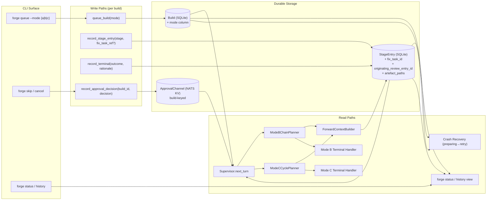
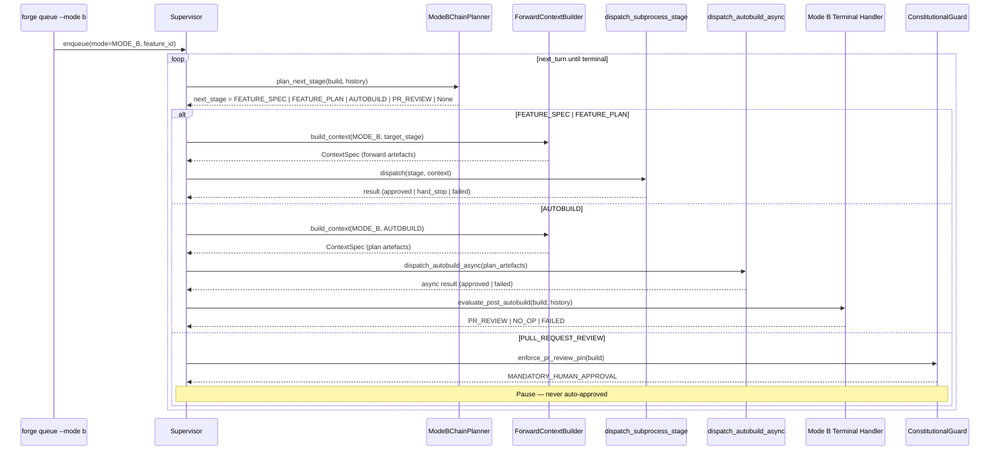
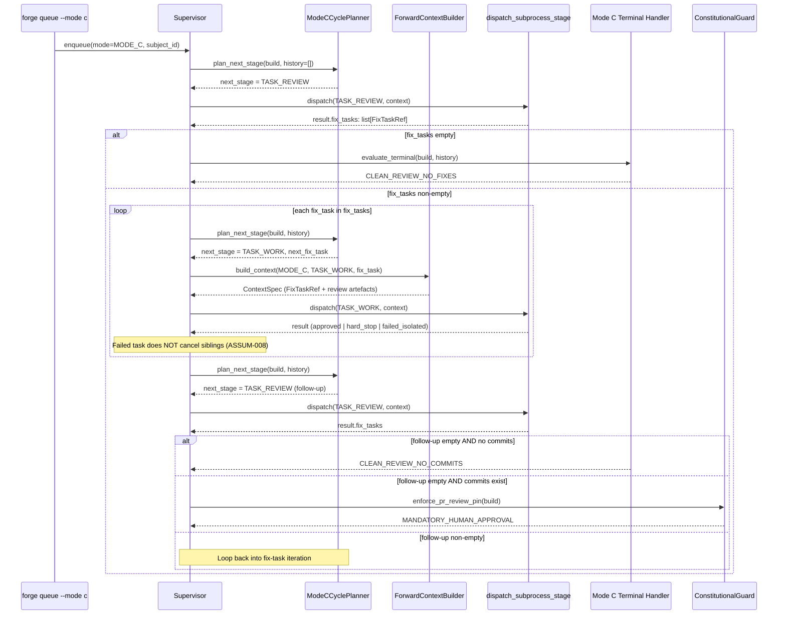
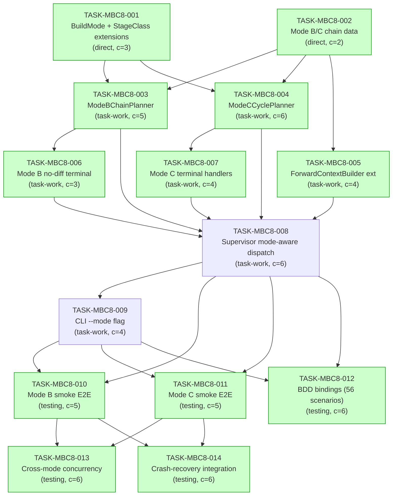

guardkit feature-plan FEAT-FORGE-008 \
  --context forge/features/mode-b-feature-and-mode-c-review-fix/mode-b-feature-and-mode-c-review-fix_summary.md


  I'll start by reading the context file to understand the feature scope, then check for any existing feature spec.

Bash List features directories
IN
ls -la /home/richardwoollcott/Projects/appmilla_github/forge/features/ /home/richardwoollcott/Projects/appmilla_github/forge/docs/features/ 2>/dev/null | head -50

OUT
/home/richardwoollcott/Projects/appmilla_github/forge/features/:
total 40
drwxrwxr-x 10 richardwoollcott richardwoollcott 4096 Apr 27 15:11 .
drwxrwxr-x 12 richardwoollcott richardwoollcott 4096 Apr 27 14:41 ..
drwxrwxr-x  2 richardwoollcott richardwoollcott 4096 Apr 25 19:23 confidence-gated-checkpoint-protocol
drwxrwxr-x  2 richardwoollcott richardwoollcott 4096 Apr 25 15:44 guardkit-command-invocation-engine
drwxrwxr-x  2 richardwoollcott richardwoollcott 4096 Apr 25 16:07 infrastructure-coordination
drwxrwxr-x  2 richardwoollcott richardwoollcott 4096 Apr 25 16:06 mode-a-greenfield-end-to-end
drwxrwxr-x  2 richardwoollcott richardwoollcott 4096 Apr 27 15:16 mode-b-feature-and-mode-c-review-fix
drwxrwxr-x  2 richardwoollcott richardwoollcott 4096 Apr 25 15:18 nats-fleet-integration
drwxrwxr-x  2 richardwoollcott richardwoollcott 4096 Apr 27 12:22 pipeline-state-machine-and-configuration
drwxrwxr-x  2 richardwoollcott richardwoollcott 4096 Apr 25 16:24 specialist-agent-delegation
Bash Find FEAT-FORGE-008 references
IN
find /home/richardwoollcott/Projects/appmilla_github/forge -name "*FEAT-FORGE-008*" -o -name "*feature-spec-FEAT-FORGE-008*" 2>/dev/null | head

OUT
/home/richardwoollcott/Projects/appmilla_github/forge/docs/history/feature-spec-FEAT-FORGE-008-history.md
Bash List mode-b feature directory
IN
ls /home/richardwoollcott/Projects/appmilla_github/forge/features/mode-b-feature-and-mode-c-review-fix/ 2>/dev/null

OUT
mode-b-feature-and-mode-c-review-fix_assumptions.yaml
mode-b-feature-and-mode-c-review-fix.feature
mode-b-feature-and-mode-c-review-fix_summary.md
Read mode-b-feature-and-mode-c-review-fix_summary.md
Read mode-b-feature-and-mode-c-review-fix.feature
Read mode-b-feature-and-mode-c-review-fix_assumptions.yaml
Let me understand the project codebase structure and check the FEAT-FORGE-007 implementation for patterns.

Bash View top-level project structure
IN
find /home/richardwoollcott/Projects/appmilla_github/forge -maxdepth 3 -type d -not -path "*/.git*" -not -path "*/__pycache__*" -not -path "*/node_modules*" | head -40

OUT
/home/richardwoollcott/Projects/appmilla_github/forge
/home/richardwoollcott/Projects/appmilla_github/forge/spikes
/home/richardwoollcott/Projects/appmilla_github/forge/.guardkit
/home/richardwoollcott/Projects/appmilla_github/forge/tests
/home/richardwoollcott/Projects/appmilla_github/forge/tasks
/home/richardwoollcott/Projects/appmilla_github/forge/.claude
/home/richardwoollcott/Projects/appmilla_github/forge/docs
/home/richardwoollcott/Projects/appmilla_github/forge/src
/home/richardwoollcott/Projects/appmilla_github/forge/.claude.backup.20260418_124519
/home/richardwoollcott/Projects/appmilla_github/forge/features
/home/richardwoollcott/Projects/appmilla_github/forge/spikes/deepagents-053
/home/richardwoollcott/Projects/appmilla_github/forge/.guardkit/seeding
/home/richardwoollcott/Projects/appmilla_github/forge/.guardkit/bdd
/home/richardwoollcott/Projects/appmilla_github/forge/.guardkit/smoke
/home/richardwoollcott/Projects/appmilla_github/forge/.guardkit/worktrees
/home/richardwoollcott/Projects/appmilla_github/forge/.guardkit/autobuild
/home/richardwoollcott/Projects/appmilla_github/forge/.guardkit/features
/home/richardwoollcott/Projects/appmilla_github/forge/tests/bdd
/home/richardwoollcott/Projects/appmilla_github/forge/tests/forge
/home/richardwoollcott/Projects/appmilla_github/forge/tests/integration
/home/richardwoollcott/Projects/appmilla_github/forge/tests/hardening
/home/richardwoollcott/Projects/appmilla_github/forge/tests/unit
/home/richardwoollcott/Projects/appmilla_github/forge/tasks/completed
/home/richardwoollcott/Projects/appmilla_github/forge/tasks/backlog
/home/richardwoollcott/Projects/appmilla_github/forge/tasks/design_approved
/home/richardwoollcott/Projects/appmilla_github/forge/tasks/in_review
/home/richardwoollcott/Projects/appmilla_github/forge/.claude/task-plans
/home/richardwoollcott/Projects/appmilla_github/forge/.claude/agents
/home/richardwoollcott/Projects/appmilla_github/forge/.claude/templates
/home/richardwoollcott/Projects/appmilla_github/forge/.claude/rules
/home/richardwoollcott/Projects/appmilla_github/forge/.claude/reviews
/home/richardwoollcott/Projects/appmilla_github/forge/docs/product
/home/richardwoollcott/Projects/appmilla_github/forge/docs/state
/home/richardwoollcott/Projects/appmilla_github/forge/docs/adr
/home/richardwoollcott/Projects/appmilla_github/forge/docs/architecture
/home/richardwoollcott/Projects/appmilla_github/forge/docs/research
/home/richardwoollcott/Projects/appmilla_github/forge/docs/design
/home/richardwoollcott/Projects/appmilla_github/forge/docs/reviews
/home/richardwoollcott/Projects/appmilla_github/forge/docs/history
/home/richardwoollcott/Projects/appmilla_github/forge/src/forge
Bash Check existing feature/task files
IN
ls /home/richardwoollcott/Projects/appmilla_github/forge/.guardkit/features/ 2>/dev/null | head; ls /home/richardwoollcott/Projects/appmilla_github/forge/tasks/backlog/ 2>/dev/null | head

OUT
FEAT-8D10.yaml
FEAT-CBDE.yaml
FEAT-FORGE-001.yaml
FEAT-FORGE-002.yaml
FEAT-FORGE-003.yaml
FEAT-FORGE-004.yaml
FEAT-FORGE-005.yaml
confidence-gated-checkpoint-protocol
forge-v2-doc-alignment
guardkit-command-invocation-engine
infrastructure-coordination
mode-a-greenfield-end-to-end
nats-fleet-integration
pipeline-state-machine-and-configuration
specialist-agent-delegation
TASK-CGCP-001-define-gating-module-structure.md
TASK-CGCP-002-add-approval-config.md
Bash Find build plan and docs structure
IN
find /home/richardwoollcott/Projects/appmilla_github/forge/docs/research/ideas/ -name "forge-build-plan.md" -type f 2>/dev/null; find /home/richardwoollcott/Projects/appmilla_github/forge/docs -maxdepth 3 -type d 2>/dev/null | head -30

OUT
/home/richardwoollcott/Projects/appmilla_github/forge/docs/research/ideas/forge-build-plan.md
/home/richardwoollcott/Projects/appmilla_github/forge/docs
/home/richardwoollcott/Projects/appmilla_github/forge/docs/product
/home/richardwoollcott/Projects/appmilla_github/forge/docs/state
/home/richardwoollcott/Projects/appmilla_github/forge/docs/adr
/home/richardwoollcott/Projects/appmilla_github/forge/docs/architecture
/home/richardwoollcott/Projects/appmilla_github/forge/docs/research
/home/richardwoollcott/Projects/appmilla_github/forge/docs/design
/home/richardwoollcott/Projects/appmilla_github/forge/docs/reviews
/home/richardwoollcott/Projects/appmilla_github/forge/docs/history
/home/richardwoollcott/Projects/appmilla_github/forge/docs/product/feature_spec_inputs
/home/richardwoollcott/Projects/appmilla_github/forge/docs/architecture/decisions
/home/richardwoollcott/Projects/appmilla_github/forge/docs/research/ideas
/home/richardwoollcott/Projects/appmilla_github/forge/docs/design/decisions
/home/richardwoollcott/Projects/appmilla_github/forge/docs/design/contracts
/home/richardwoollcott/Projects/appmilla_github/forge/docs/design/models
/home/richardwoollcott/Projects/appmilla_github/forge/docs/design/diagrams
/home/richardwoollcott/Projects/appmilla_github/forge/docs/reviews/architecture
I've read the FEAT-FORGE-008 spec — comprehensive: Mode B (Feature) and Mode C (Review-Fix) orchestration on the FEAT-FORGE-001..007 substrate, 56 scenarios, 17 confirmed assumptions, no review required.

Before I create the review task and run analysis, I need a couple of preferences for the planning depth (Context A — Review Scope):

Q1. Review Focus — What should the planning analysis emphasise?

[A]ll aspects (default) — technical, architecture, risk, effort
[T]echnical — implementation feasibility only
[R]chitecture — emphasis on how Mode B/C compose the existing substrate (FEAT-FORGE-001..007) without re-litigating it
[I]ntegration — emphasis on stage-chain composition, async-subagent reuse, constitutional PR-review pinning
Q2. Trade-off Priority — What should the plan optimise for?

[S]peed — minimise tasks, lean on inherited substrate aggressively
[Q]uality — explicit task per scenario group, full BDD coverage
[B]alanced (default) — substrate-reuse where safe, dedicated tasks for novel composition
[M]aintainability — clear seams between Mode B and Mode C so future Mode D doesn't re-tangle
Q3. Specific concerns to address? (free text, optional — e.g. "keep Mode B and Mode C in separate task groups", "no new state-machine transitions", "verify constitutional PR pin holds across both modes")

Reply with your choices (e.g. R, M, separate Mode B and Mode C task groups) and I'll proceed to create the review task and run decision-mode analysis.

accept defaults
Defaults locked: Focus=All, Trade-off=Balanced, no extra concerns.

Let me check what's already in the substrate (FEAT-FORGE-001..007) so the analysis reflects what's actually built vs. what's assumed.

Bash List feature YAMLs and folders
IN
ls /home/richardwoollcott/Projects/appmilla_github/forge/.guardkit/features/*.yaml; echo "---"; ls /home/richardwoollcott/Projects/appmilla_github/forge/.guardkit/features/ | grep -v yaml

OUT
/home/richardwoollcott/Projects/appmilla_github/forge/.guardkit/features/FEAT-8D10.yaml
/home/richardwoollcott/Projects/appmilla_github/forge/.guardkit/features/FEAT-CBDE.yaml
/home/richardwoollcott/Projects/appmilla_github/forge/.guardkit/features/FEAT-FORGE-001.yaml
/home/richardwoollcott/Projects/appmilla_github/forge/.guardkit/features/FEAT-FORGE-002.yaml
/home/richardwoollcott/Projects/appmilla_github/forge/.guardkit/features/FEAT-FORGE-003.yaml
/home/richardwoollcott/Projects/appmilla_github/forge/.guardkit/features/FEAT-FORGE-004.yaml
/home/richardwoollcott/Projects/appmilla_github/forge/.guardkit/features/FEAT-FORGE-005.yaml
---
Bash Inspect src structure
IN
find /home/richardwoollcott/Projects/appmilla_github/forge/src -maxdepth 4 -type d 2>/dev/null | head -30; echo "---"; ls /home/richardwoollcott/Projects/appmilla_github/forge/src/forge/ 2>/dev/null

OUT
/home/richardwoollcott/Projects/appmilla_github/forge/src
/home/richardwoollcott/Projects/appmilla_github/forge/src/forge
/home/richardwoollcott/Projects/appmilla_github/forge/src/forge/lifecycle
/home/richardwoollcott/Projects/appmilla_github/forge/src/forge/memory
/home/richardwoollcott/Projects/appmilla_github/forge/src/forge/fleet
/home/richardwoollcott/Projects/appmilla_github/forge/src/forge/dispatch
/home/richardwoollcott/Projects/appmilla_github/forge/src/forge/tools
/home/richardwoollcott/Projects/appmilla_github/forge/src/forge/cli
/home/richardwoollcott/Projects/appmilla_github/forge/src/forge/discovery
/home/richardwoollcott/Projects/appmilla_github/forge/src/forge/adapters
/home/richardwoollcott/Projects/appmilla_github/forge/src/forge/gating
/home/richardwoollcott/Projects/appmilla_github/forge/src/forge/pipeline
/home/richardwoollcott/Projects/appmilla_github/forge/src/forge/config
/home/richardwoollcott/Projects/appmilla_github/forge/src/forge/adapters/gh
/home/richardwoollcott/Projects/appmilla_github/forge/src/forge/adapters/git
/home/richardwoollcott/Projects/appmilla_github/forge/src/forge/adapters/sqlite
/home/richardwoollcott/Projects/appmilla_github/forge/src/forge/adapters/langgraph
/home/richardwoollcott/Projects/appmilla_github/forge/src/forge/adapters/guardkit
/home/richardwoollcott/Projects/appmilla_github/forge/src/forge/adapters/nats
/home/richardwoollcott/Projects/appmilla_github/forge/src/forge/pipeline/dispatchers
---
adapters
agent.py
cli
config
discovery
dispatch
fleet
gating
__init__.py
lifecycle
memory
pipeline
tools
Read forge-build-plan.md (lines 2-101)
Bash Pull FEAT-FORGE-008 build-plan section
IN
cat /home/richardwoollcott/Projects/appmilla_github/forge/docs/research/ideas/forge-build-plan.md | grep -A 30 "FEAT-FORGE-008"

OUT
## Status: `/system-arch` ✅ · `/system-design` ✅ · `/feature-spec` ✅ **8 / 8 complete** (FEAT-FORGE-001..008 ✅) · `/feature-plan` 🟡 **7 / 8 complete** (001..007 ✅; 008 pending) · `autobuild` 🟡 **7 / 8 complete** (001..007 ✅; 008 pending) · **Next: `/feature-plan FEAT-FORGE-008`**
## Repo: `guardkit/forge`
## Agent ID: `forge`
## Target: Post specialist-agent Phase 3 completion
## Depends On: nats-core (✅ v0.2.0 inc. TASK-NCFA-003), nats-infrastructure (✅ configured, ◻ running), specialist-agent Phase 3 (◻)

### Progress log

| Step | Command | Status | Date | Commit | Artefacts |
|---|---|---|---|---|---|
| 1 | `/system-arch` | ✅ complete | 2026-04-18 | `9f41e22` (seeded by later refinements) | `docs/architecture/ARCHITECTURE.md`, `system-context.md`, `container.md`, `domain-model.md`, `assumptions.yaml`, **31 ADRs** (`ADR-ARCH-001`..`031`) |
| 2 | `/system-design` | ✅ complete | 2026-04-23 | `b40365c` | `docs/design/` — **9 API contracts + 5 data models + 6 DDRs + 2 C4 L3 diagrams**; 20 artefacts seeded into Graphiti (`project_design` + `architecture_decisions`) |
| 3 | `/feature-spec × 8` | ✅ complete (8 / 8) | 2026-04-24..27 | various | FEAT-FORGE-001..008 ✅ (see Step 3 for per-feature details) |
| 4 | `/feature-plan × 8` | 🟡 in progress (7 / 8) | 2026-04-24..25 | `6a29ed3`, `065b73d`, FEAT-FORGE-001 plan | FEAT-FORGE-001..007 ✅ — task breakdowns under `tasks/backlog/<slug>/`. 001 was re-planned post-001-gap-context with `forge-001-gap-context.md` to scope to the unbuilt slice (CLI + lifecycle persistence + state machine + recovery — 13 tasks). 008 ◻ |
| 5 | `autobuild × 8` (Waves 1–6) | 🟡 in progress (7 / 8) | 2026-04-25..26 | `91f4de5`, `f63bcf5`, `9774351`, `042b83e`, `0361c21`, `6e5c577`, `ea7e60b` | FEAT-FORGE-002 (`91f4de5`), 003 (`f63bcf5`), 004 (`9774351`), 005 (`042b83e`), 006 (=`FEAT-8D10`, `0361c21`), 007 (=`FEAT-CBDE`, `6e5c577`), 001 (`ea7e60b`, 13/13 tasks across 5 waves, 0 ceiling hits) ✅. 008 ◻ |
| 6 | Validation | ◻ pending | — | — | — |
| 7 | FinProxy first real run | ◻ pending | — | — | — |

---

## Purpose

This build plan captures the full GuardKit command sequence to build the Forge — the
pipeline orchestrator and checkpoint manager that coordinates the specialist agent fleet.
The Forge is the capstone of the Software Factory: once it works, the pipeline from raw
idea to deployed code runs end-to-end with confidence-gated human engagement.

**Scope document:** `forge/docs/research/ideas/forge-pipeline-orchestrator-refresh.md`
(v3, 11 April 2026) — defines the Forge's architecture, tool inventory, checkpoint
protocol, and NATS integration. Read that document first.

--
| FEAT-FORGE-008 | Mode B Feature & Mode C Review-Fix | 007 | 2-3 days | Mode B: add feature to existing project (skip PO/architect delegation, start from /feature-spec). Mode C: review and fix issues (/task-review → /task-work cycle). Both use checkpoint protocol. | *(optional modes — not in anchor §10 Phase 4)* |

**Anchor §10 Phase 4 bullets not yet covered by a feature:**
- CLI commands: `forge queue`, `forge status`, `forge history`, `forge cancel`, `forge skip` — folded into FEAT-FORGE-001 (CLI entrypoint)
- SQLite build history schema — folded into FEAT-FORGE-006 (infrastructure coordination)

**Estimated total: 4-6 weeks** (includes iteration time, integration testing, and the
inevitable debugging of subprocess orchestration + async NATS patterns)

---

## GuardKit Command Sequence

### Step 1: /system-arch ✅ COMPLETE (2026-04-18)

Produced the Forge's system architecture — ARCHITECTURE.md, ADRs, C4 diagrams,
component boundaries.

```bash
cd ~/Projects/appmilla_github/forge

guardkit system-arch \
  --context forge/docs/research/forge-pipeline-architecture.md \
  --context forge/docs/research/forge-build-plan-alignment-review.md \
  --context forge/docs/research/ideas/forge-pipeline-orchestrator-refresh.md \
  --context forge/docs/research/pipeline-orchestrator-conversation-starter.md \
  --context forge/docs/research/pipeline-orchestrator-motivation.md \
  --context forge/docs/research/ideas/fleet-master-index.md \
  --context specialist-agent/docs/research/ideas/architect-agent-vision.md \
  --context nats-core/docs/design/specs/nats-core-system-spec.md \
  --context nats-core/docs/design/contracts/agent-manifest-contract.md
--
- ✅ **FEAT-FORGE-008** — Mode B Feature & Mode C Review-Fix (2026-04-27)
  - Artefacts: `features/mode-b-feature-and-mode-c-review-fix/{slug}.feature` · `{slug}_assumptions.yaml` · `{slug}_summary.md`
  - Scenarios: 56 total (9 @key-example · 6 @boundary · 8 @negative · 11 @edge-case · 6 @smoke · 5 @regression · 4 @security · 4 @concurrency · 7 @data-integrity · 6 @integration). 39 carry @mode-b · 28 carry @mode-c (overlap on shared substrate). Group totals do not sum to 56 — many scenarios carry multiple tags.
  - Assumptions: 17 resolved — 10 high, 7 medium, 0 low, 0 open. Ready for `/feature-plan`.
  - Mode B chain: `/feature-spec → /feature-plan → autobuild → pull-request review` (skips PO/architect/`/system-arch`/`/system-design`). Mode C chain: `/task-review → /task-work × N` with optional pull-request review when commits are pushed. Both inherit the FEAT-FORGE-001..007 substrate (state machine, async-subagent dispatch, checkpoint protocol, constitutional belt-and-braces, CLI steering, idempotent first-write-wins, correlation threading, calibration-priors snapshot stability).

**Pending:**
- (none — all 8 feature specs complete; next action is `/feature-plan FEAT-FORGE-008`)

> **Context-flag resolution (post-`/system-design`):** placeholders from the original
> build plan resolve as follows. `DESIGN.md` / `forge-system-spec.md` were not produced
> as monolithic files (see Step 2 deviation note); instead each `/feature-spec` pulls
> the relevant per-container contract + data model. The GuardKit context-manifest
> resolver (DDR-005) can drive most of this automatically once
> `.guardkit/context-manifest.yaml` is populated.

```bash
# FEAT-FORGE-001: Pipeline State Machine & Configuration  ✅ COMPLETE (2026-04-24)
# Output: forge/features/pipeline-state-machine-and-configuration/
guardkit feature-spec FEAT-FORGE-001 \
  --context forge/docs/design/models/DM-build-lifecycle.md \
  --context forge/docs/design/contracts/API-sqlite-schema.md \
  --context forge/docs/design/contracts/API-cli.md \
  --context forge/docs/design/decisions/DDR-003-sqlite-schema-layout-wal.md

# FEAT-FORGE-002: NATS Fleet Integration  ✅ COMPLETE (2026-04-24)
# Output: forge/features/nats-fleet-integration/
guardkit feature-spec FEAT-FORGE-002 \
  --context forge/docs/design/contracts/API-nats-pipeline-events.md \
  --context forge/docs/design/contracts/API-nats-fleet-lifecycle.md \
  --context forge/docs/design/models/DM-discovery.md \
  --context nats-core/docs/design/specs/nats-core-system-spec.md \
  --context nats-core/docs/design/contracts/agent-manifest-contract.md

# FEAT-FORGE-003: Specialist Agent Delegation  ✅ COMPLETE (2026-04-24)
# Output: forge/features/specialist-agent-delegation/
guardkit feature-spec FEAT-FORGE-003 \
  --context forge/docs/design/contracts/API-nats-agent-dispatch.md \
--
# FEAT-FORGE-008: Mode B Feature & Mode C Review-Fix  ✅ COMPLETE (2026-04-27)
# Output: forge/features/mode-b-feature-and-mode-c-review-fix/
# Mode B reuses everything from /feature-spec onward (no PO/architect delegation).
# Mode C is the /task-review → /task-work cycle on existing code.
# Pulled the FEAT-FORGE-007 spec for capstone composition patterns, the CLI surface
# for the queue/status/history commands these modes piggyback on, and the
# checkpoint protocol so the pause/resume flow stays consistent.
guardkit feature-spec FEAT-FORGE-008 \
  --context forge/features/mode-a-greenfield-end-to-end/mode-a-greenfield-end-to-end.feature \
  --context forge/features/mode-a-greenfield-end-to-end/mode-a-greenfield-end-to-end_summary.md \
  --context forge/docs/design/contracts/API-cli.md \
  --context forge/docs/design/contracts/API-nats-approval-protocol.md \
  --context forge/docs/design/models/DM-build-lifecycle.md
```

**Validation per feature spec:**
- BDD scenarios cover happy path, error cases, and edge cases
- Acceptance groups are reviewable (Rich will likely accept defaults ~95% based on
  observed pattern, but the Forge is the capstone — expect more manual review here)
- Each feature spec references the nats-core payloads it uses (no invented types)
- FEAT-FORGE-007 integration spec covers the full greenfield flow end-to-end

**Record Rich's responses:** Create `feature-spec-FEAT-FORGE-XXX-history.md` for each
spec session (following Pattern 3 from the fleet-master-index).

### Step 4: /feature-plan × 8 — 🟡 IN PROGRESS (7 / 8)

Produces task breakdowns for each feature. Run sequentially — dependencies must be
respected. Each invocation takes the matching `/feature-spec` summary as `--context`
so the plan is grounded in the curated scenarios and resolved assumptions (see
`installer/core/commands/feature-plan.md` §"Step 11: Link BDD scenarios to tasks").

> **FEAT-FORGE-001 was re-planned post-002–007** against
> [`forge-001-gap-context.md`](./forge-001-gap-context.md), which maps every one of
> the 34 BDD scenarios to either *reuse* (existing modules from 002–007) or
> *build* (new code under `src/forge/lifecycle/` + `src/forge/cli/`). The plan
> produced 13 tasks (TASK-PSM-001..013) scoped to the unbuilt slice only:
> SQLite persistence, build-lifecycle state machine, sequential-queue picker,
--
# FEAT-FORGE-008: Mode B Feature & Mode C Review-Fix (depends on 007)  ◻ READY (slug resolved 2026-04-27)
guardkit feature-plan FEAT-FORGE-008 \
  --context forge/features/mode-b-feature-and-mode-c-review-fix/mode-b-feature-and-mode-c-review-fix_summary.md
```

> **Note on slugs:** `/feature-spec` writes output under a kebab-cased slug of the
> feature **name**, not the `FEAT-FORGE-NNN` ID. Resolved slugs so far:
> `pipeline-state-machine-and-configuration` (001), `nats-fleet-integration` (002),
> `specialist-agent-delegation` (003), `confidence-gated-checkpoint-protocol` (004),
> `guardkit-command-invocation-engine` (005), `infrastructure-coordination` (006),
> `mode-a-greenfield-end-to-end` (007), `mode-b-feature-and-mode-c-review-fix` (008).

**Validation:**
- Task wave structure respects feature dependencies
- Each task has clear inputs, outputs, and acceptance criteria
- Integration tasks (FEAT-FORGE-007) are in later waves

### Step 5: Build (autobuild × 8) — 🟡 IN PROGRESS (7 / 8)

Build features in dependency order. Run sequentially on GB10 (or Bedrock when available).

> **Actual ordering deviated from the wave plan below.** The autobuild scheduler
> assigned new opaque feature IDs to capstone features (FEAT-FORGE-006 →
> `FEAT-8D10`; FEAT-FORGE-007 → `FEAT-CBDE`) — see `.guardkit/features/*.yaml`.
> FEAT-FORGE-001 was built **last in dependency order, first in scope priority**
> (the gap-closure pass): 13 tasks across 5 waves, 100% clean executions, 0/7
> SDK ceiling hits, 1h 44m wall time. Review summary at
> `.guardkit/autobuild/FEAT-FORGE-001/review-summary.md`.

```bash
# Wave 1: Foundation (can parallel)
guardkit autobuild FEAT-FORGE-001   # ✅ commit ea7e60b (13/13 tasks, 5 waves, gap-closure pass)
--
guardkit autobuild FEAT-FORGE-008   # ◻ BLOCKED on /feature-spec + /feature-plan FEAT-FORGE-008
```

### Step 6: Validation

After all features are built:

```bash
# Run full test suite
cd ~/Projects/appmilla_github/forge
pytest

# Integration test: queue a test feature (canonical CLI surface per anchor §5)
forge queue FEAT-TEST-001 --repo guardkit/test-project --branch main
forge status
forge history --feature FEAT-TEST-001

# Verify pipeline events published to NATS
# (subscribe to pipeline.> on GB10 and observe)

# Verify checkpoint protocol
# (set low auto_approve threshold in forge.yaml to force FLAG FOR REVIEW,
#  verify pipeline.build-paused arrives)

# Verify degraded mode
# (stop specialist agents, run pipeline, verify forced FLAG FOR REVIEW)
```

#### Specialist-agent LES1 Parity Gates (pre-merge required)

Derived from TASK-REV-B8E4 cross-agent lessons (series LES1) and recorded by
--
   - Replace `<FEAT-FORGE-007 feature spec>` in FEAT-FORGE-008 with actual path

### Template for --context flag updates

When updating, use this pattern:
```bash
# Before (placeholder):
guardkit feature-spec FEAT-FORGE-004 \
  --context <checkpoint protocol contract from Step 2>

# After (actual path):
guardkit feature-spec FEAT-FORGE-004 \
  --context forge/docs/design/contracts/checkpoint-protocol-contract.md
```

### Verification checklist after all updates

- [ ] All `<placeholder>` strings removed from this document
- [ ] All `--context` flags reference files that exist on disk
- [ ] command-history.md has entries for /system-arch and /system-design
- [ ] feature-spec-FEAT-FORGE-XXX-history.md exists for each feature spec run
- [ ] "Files That Will Change" table matches actual package structure from /system-design

---

## Source Documents

| Document | Path | What It Provides |
|----------|------|-----------------|
| **Forge pipeline architecture v2.2** | `forge/docs/research/forge-pipeline-architecture.md` | **Primary anchor** — pipeline stages, state machine, NATS topics, payloads, ADRs SP-010..017 |
| Forge build-plan alignment review | `forge/docs/research/forge-build-plan-alignment-review.md` | Drift analysis, correction list, Appendix C (BuildQueuedPayload), Appendix D (specialist-agent refactor) |
--
*Updated: 25 April 2026 — Steps 3–5 in flight: 7/8 specs, 6/8 plans, 6/8 autobuilds. FEAT-FORGE-001 absorbed into 002–007. Next: `/feature-spec FEAT-FORGE-008`.*
*Updated: 25 April 2026 (later) — FEAT-FORGE-001 gap closed: re-planned against `forge-001-gap-context.md` (13 tasks), autobuilt in one pass (commit `ea7e60b`, 13/13 clean, 0 ceiling hits, 1h 44m). 7/8 specs, 7/8 plans, 7/8 autobuilds. Next: `/feature-spec FEAT-FORGE-008`.*
*Updated: 27 April 2026 — `/feature-spec FEAT-FORGE-008` complete (Mode B Feature & Mode C Review-Fix; 56 scenarios, 17 assumptions, 0 low-confidence). 8/8 specs, 7/8 plans, 7/8 autobuilds. Next: `/feature-plan FEAT-FORGE-008`.*
*Status: Mode B/C (FEAT-FORGE-008) is the only outstanding feature for plan + autobuild — plan → autobuild → Step 6 validation gates → Step 7 FinProxy run.*
*"The Forge is the capstone. It's the last major agent to build because it coordinates everything else. But it's also the highest-leverage: once it works, the Software Factory is real."*
Bash Check Mode A feature structure for patterns
IN
ls /home/richardwoollcott/Projects/appmilla_github/forge/.guardkit/features/mode-a-greenfield-end-to-end/ 2>/dev/null | head -20; echo "---FEAT-CBDE.yaml (Mode A) tasks---"; grep -E "^  - id:|^  - name:|^    name:" /home/richardwoollcott/Projects/appmilla_github/forge/.guardkit/features/FEAT-CBDE.yaml 2>/dev/null | head -40

OUT
---FEAT-CBDE.yaml (Mode A) tasks---
Read FEAT-CBDE.yaml
Substrate inventory confirms FEAT-FORGE-001..007 already provide most of the underlying machinery (StageOrderingGuard, ConstitutionalGuard for PR review, async autobuild dispatch, CLI steering, crash recovery, idempotent approval, correlation threading). FEAT-FORGE-008 is mostly novel chain-composition work.

🔍 Feature Planning: FEAT-FORGE-008 — Mode B Feature & Mode C Review-Fix
Review task: TASK-REV-MBC8 (would be created by /task-create)
Scope: 56 scenarios, 17 confirmed assumptions, all upstream substrate (FEAT-FORGE-001..007) shipped.

What's Already Built (Substrate Reuse)
Concern (scenario groups)	Source	Reuse status
Constitutional PR pin (E, A)	ConstitutionalGuard (TASK-MAG7-004)	✅ mode-agnostic — reuse as-is
Stage-ordering invariant (B)	StageOrderingGuard (TASK-MAG7-003)	🟡 extend with Mode B/C prerequisite maps
Forward context propagation (A)	ForwardContextBuilder (TASK-MAG7-006)	🟡 extend for Mode B/C contracts
Async autobuild dispatch (A, F, H)	dispatch_autobuild_async (TASK-MAG7-009)	✅ reuse
Subprocess worktree confinement (E)	dispatch_subprocess_stage (TASK-MAG7-008)	✅ reuse
Crash recovery / durable history (D)	Lifecycle (FEAT-FORGE-001)	✅ reuse
CLI cancel/skip steering (D)	TASK-MAG7-011	✅ reuse
Idempotent first-wins approval (D, I)	Checkpoint (FEAT-FORGE-004)	✅ reuse
Calibration-priors snapshot (I)	Build start (FEAT-FORGE-006)	✅ reuse
Correlation threading (H)	NATS layer (FEAT-FORGE-002)	✅ reuse
Build-ID approval routing (D)	Checkpoint	✅ reuse
Genuinely novel work = mode-aware chain composition + Mode C iteration controller + two new terminal outcomes (Mode B no-diff, Mode C clean-review).

Technical Options
Option 1: Compose existing dispatchers via new ModeChainPlanner ⭐ Recommended
New src/forge/pipeline/mode_chains.py with ModeBChainPlanner and ModeCCyclePlanner
Extend Supervisor.next_turn to delegate by build mode
Mode C cycle controller wraps repeated dispatch_subprocess_stage for /task-work
Complexity: 6/10 • Effort: 2–3 days • Tasks: ~14
✅ Composition over modification, mirrors MAG7's shape, low MAG7 churn
⚠️ Two more planner classes to maintain (acceptable — clear seam between modes)
Option 2: Pluggable PlannerStrategy refactor of MAG7
Refactor MAG7's hardcoded chain into a PlannerStrategy ABC; Mode A becomes one strategy
Add Mode B/C strategies
Complexity: 7/10 • Effort: 3–4 days • Tasks: ~17
✅ Cleanest long-term shape if Mode D appears
⚠️ Touches shipped FEAT-FORGE-007 wiring — regression risk on a freshly-stable surface
Option 3: Mode-aware fork of MAG7
Duplicate MAG7 dispatch path with mode parameter at every level
Complexity: 5/10 • Effort: 1–2 days • Tasks: ~8
⚠️ High drift risk between modes — divergent bug surface
Recommendation: Option 1 — balanced trade-off (your default), preserves the just-shipped MAG7 wiring, leaves room for Option 2 refactor later if Mode D arrives.

Proposed Task Breakdown (Option 1)
Wave	Task	Complexity	Mode	Dependencies
1	TASK-MBC8-001 Add BuildMode enum (MODE_B/MODE_C) + persist on Build + queue accepts mode	3	direct	—
1	TASK-MBC8-002 Define Mode B & Mode C stage taxonomies + prerequisite maps	2	direct	—
2	TASK-MBC8-003 ModeBChainPlanner — 4-stage chain, refuses /system-arch+/system-design dispatch	5	task-work	001, 002
2	TASK-MBC8-004 ModeCCyclePlanner — review → N work iteration, clean-review terminal	6	task-work	001, 002
2	TASK-MBC8-005 Extend ForwardContextBuilder for Mode B (spec→plan→autobuild) + Mode C (review→work)	4	task-work	002
3	TASK-MBC8-006 Mode B no-diff terminal handler (autobuild OK, no diff → no-op terminal, no PR)	3	task-work	003
3	TASK-MBC8-007 Mode C terminal handlers (empty review → clean-review; no commits → clean-review, no PR)	4	task-work	004
4	TASK-MBC8-008 Wire mode-aware Supervisor.next_turn dispatch (delegates to planner by build mode)	6	task-work	003, 004, 005, 006, 007
5	TASK-MBC8-009 forge queue --mode {b|c} <feature|subject> CLI surface + mode-aware picker	4	task-work	008
6	TASK-MBC8-010 Mode B smoke E2E (queue → PR-awaiting-review terminal)	5	task-work	008, 009
6	TASK-MBC8-011 Mode C smoke E2E (queue → clean-review and PR-awaiting-review terminals)	5	task-work	008, 009
6	TASK-MBC8-012 BDD bindings for all 56 Mode B/C scenarios	6	task-work	008, 009
7	TASK-MBC8-013 Cross-mode concurrency integration (Mode A + B + C with isolated channels)	6	task-work	010, 011
7	TASK-MBC8-014 Crash-recovery integration tests (Mode B & C non-terminal stages)	6	task-work	010, 011
Aggregate: complexity 6/10, ~14 tasks, 7 waves, est. 16–20 hours dispatched (~2–3 days wall).

Risk & Open Questions
Mode-aware planning guard (ASSUM-013, medium): Does the supervisor need an executor-side guard that refuses /system-arch//system-design even if a manifest references them? → Yes (group J, security expansion). Folded into TASK-MBC8-003 — refusing at the planner is the only secure layer.
Mode C iteration cap (ASSUM-010, medium): No numeric ceiling, terminate on clean follow-up review. Risk: a perpetually-reviewing build wastes budget. Mitigation: Coach calibration on follow-up reviews — out of scope for this feature, observable risk to log.
Mode B --mode b UX vs implicit detection: Should mode be inferred from inputs (existing project + feature ID → Mode B) or explicit on forge queue? Recommendation: explicit --mode (forces operator intent — matches "each queued build is its own lifecycle" assumption ASSUM-016).
No new state-machine transitions — confirmed, FEAT-FORGE-001 substrate is sufficient. Mode B/C compose existing transitions only.
📋 Decision Checkpoint
What would you like to do with this plan?

[A]ccept — save analysis, no implementation tasks created (review them later)
[R]evise — explore Option 2 (PlannerStrategy refactor), deeper risk analysis on Mode C iteration cap, or reshape the wave structure
[I]mplement — create the 14 task files + IMPLEMENTATION-GUIDE.md (with mandatory diagrams) + .guardkit/features/FEAT-FORGE-008.yaml
[C]ancel — discard
Reply with your choice. If [I]mplement, I'll also ask 3 quick implementation-prefs questions (Context B) before generating the structure — or say "implement, accept defaults" to skip them.

[I]mplement
Three quick Context B questions before I generate the structure:

Q1. Approach — Confirm Option 1 (Compose via ModeChainPlanner)? Or pick another?

[1] Option 1 — Recommended (composition, low MAG7 churn) ← default
[2] Option 2 — PlannerStrategy refactor of MAG7
[3] Option 3 — Mode-aware fork
Q2. Execution — How should the 14 tasks run during autobuild?

[D]etect automatically — let the autobuild scheduler use the wave parallelism in the YAML ← default
[M]aximise parallel — add Conductor workspace hints to wave 2/3/6/7 (3-way parallel)
[S]equential — force one task at a time (slower, simpler)
Q3. Testing depth — How rigorous should the BDD bindings (TASK-MBC8-012) and integration tests be?

[F]ull TDD — test-first for all 14 tasks
[S]tandard — quality gates (Coach validation) on all tasks; smoke + BDD + crash + concurrency tests as their own tasks (waves 6–7) ← default — matches MAG7 pattern
[M]inimal — compilation only
Reply with your choices (e.g. 1, D, S or just defaults).

defaults
Context B locked: Option 1, Detect, Standard. Generating the structure now.

Update Todos

Create feature subfolder tasks/backlog/mode-b-feature-and-mode-c-review-fix/

Generate 14 task markdown files with frontmatter (task_type, parent_review, feature_id, wave, deps)

Generate IMPLEMENTATION-GUIDE.md with mandatory diagrams (Data Flow, Integration Contract, Task Dependency, §4)

Generate README.md

Generate .guardkit/features/FEAT-FORGE-008.yaml structured feature file
Bash Create feature subfolder
IN
mkdir -p /home/richardwoollcott/Projects/appmilla_github/forge/tasks/backlog/mode-b-feature-and-mode-c-review-fix/ && ls -la /home/richardwoollcott/Projects/appmilla_github/forge/tasks/backlog/mode-b-feature-and-mode-c-review-fix/

OUT
total 8
drwxrwxr-x  2 richardwoollcott richardwoollcott 4096 Apr 27 17:27 .
drwxrwxr-x 11 richardwoollcott richardwoollcott 4096 Apr 27 17:27 ..
Bash Find MAG7 task files
IN
ls /home/richardwoollcott/Projects/appmilla_github/forge/tasks/completed/mode-a-greenfield-end-to-end/ 2>/dev/null | head; echo "---"; find /home/richardwoollcott/Projects/appmilla_github/forge/tasks -name "TASK-MAG7-001*" -type f 2>/dev/null

OUT
---
/home/richardwoollcott/Projects/appmilla_github/forge/tasks/backlog/TASK-MAG7-001-define-stage-taxonomy.md
/home/richardwoollcott/Projects/appmilla_github/forge/tasks/backlog/mode-a-greenfield-end-to-end/TASK-MAG7-001-define-stage-taxonomy.md
Read TASK-MAG7-001-define-stage-taxonomy.md
Bash Check existing pipeline modules and stage taxonomy
IN
ls /home/richardwoollcott/Projects/appmilla_github/forge/src/forge/pipeline/ 2>/dev/null; echo "---"; cat /home/richardwoollcott/Projects/appmilla_github/forge/src/forge/pipeline/stage_taxonomy.py 2>/dev/null | head -60

OUT
cli_steering.py
constitutional_guard.py
dispatchers
forward_context_builder.py
forward_propagation.py
__init__.py
per_feature_sequencer.py
stage_ordering_guard.py
stage_taxonomy.py
supervisor.py
---
"""Canonical Mode A stage taxonomy for FEAT-FORGE-007.

This module is the single source of truth for the eight Mode A stage classes
and the prerequisite map that encodes the seven prerequisite rows from the
FEAT-FORGE-007 Group B Scenario Outline ("A downstream stage is not
dispatched before its prerequisite has reached the approved state").

Per FEAT-FORGE-007 ASSUM-001 (Mode A greenfield assumptions), the eight
stage classes that drive Mode A are, in dispatch order:

    product-owner → architect → /system-arch → /system-design →
    /feature-spec → /feature-plan → autobuild → pull-request review

The final ``PULL_REQUEST_REVIEW`` stage is constitutional per
ADR-ARCH-026 (constitutional-rules-belt-and-braces): every Mode A run
must terminate at a human-reviewable pull request, regardless of how
many features are in flight.

This module is intentionally free of imports from any other
``forge.pipeline`` submodule so it can be imported from every downstream
guard, dispatcher, and context builder in Waves 2–4 without forming an
import cycle (see TASK-MAG7-001 implementation notes).

References:
    - FEAT-FORGE-007 ASSUM-001 — eight-stage taxonomy assumption.
    - ADR-ARCH-026 — constitutional rules (belt-and-braces); the
      ``PULL_REQUEST_REVIEW`` stage is the constitutional gate that
      terminates every Mode A run.
    - ``features/mode-a-greenfield-end-to-end/``
      ``mode-a-greenfield-end-to-end.feature`` — Background and Group B
      Scenario Outline rows that this taxonomy mirrors verbatim.
"""

from __future__ import annotations

from enum import StrEnum

__all__ = [
    "StageClass",
    "STAGE_PREREQUISITES",
    "CONSTITUTIONAL_STAGES",
    "PER_FEATURE_STAGES",
]


class StageClass(StrEnum):
    """The eight Mode A stage classes, in dispatch order.

    Member order matches the FEAT-FORGE-007 ASSUM-001 dispatch order
    and the ``mode-a-greenfield-end-to-end.feature`` Background. Do
    **not** reorder — downstream guards rely on iteration order to
    reason about wave membership and pipeline progress.

    String values mirror the dash-separated names that appear in the
    Group B Scenario Outline ("architect ← product-owner",
    "system-arch ← architect", …) so callers can round-trip between the
    enum and the feature file without a translation table.
    """

    PRODUCT_OWNER = "product-owner"
Bash Check lifecycle and supervisor structure
IN
ls /home/richardwoollcott/Projects/appmilla_github/forge/src/forge/lifecycle/ 2>/dev/null; echo "---BuildMode check---"; grep -rln "BuildMode\|class Build\b" /home/richardwoollcott/Projects/appmilla_github/forge/src/forge/lifecycle/ 2>/dev/null | head; echo "---Supervisor---"; grep -rln "next_turn\|Supervisor" /home/richardwoollcott/Projects/appmilla_github/forge/src/forge/pipeline/ 2>/dev/null | head

OUT
identifiers.py
__init__.py
migrations.py
persistence.py
queue.py
recovery.py
schema.sql
state_machine.py
---BuildMode check---
/home/richardwoollcott/Projects/appmilla_github/forge/src/forge/lifecycle/persistence.py
---Supervisor---
/home/richardwoollcott/Projects/appmilla_github/forge/src/forge/pipeline/cli_steering.py
/home/richardwoollcott/Projects/appmilla_github/forge/src/forge/pipeline/supervisor.py
Bash Look for existing BuildMode references
IN
grep -n "BuildMode\|mode\b\|class Build" /home/richardwoollcott/Projects/appmilla_github/forge/src/forge/lifecycle/persistence.py 2>/dev/null | head -30

OUT
166:    gate_mode: str | None = None
175:class BuildRow(BaseModel):
207:class BuildStatusView(BaseModel):
228:class Build:
356:        gate_mode=row["gate_mode"],
700:                    status, gate_mode, coach_score, threshold_applied,
710:                    entry.gate_mode,
918:                       status, gate_mode, coach_score, threshold_applied,
1102:                       AND gate_mode IS NOT NULL
1294:            gate_mode=None,
1317:            gate_mode="HARD_STOP",
Bash Inspect supervisor and dispatchers
IN
grep -n "class Supervisor\|def next_turn\|def dispatch_next\|dispatch_next_stage\|StageClass" /home/richardwoollcott/Projects/appmilla_github/forge/src/forge/pipeline/supervisor.py 2>/dev/null | head -20; echo "---"; grep -n "def dispatch_subprocess\|def dispatch_specialist\|def dispatch_autobuild" /home/richardwoollcott/Projects/appmilla_github/forge/src/forge/pipeline/dispatchers/*.py 2>/dev/null | head

OUT
91:from forge.pipeline.stage_taxonomy import PER_FEATURE_STAGES, StageClass
224:    stage: StageClass
259:    permitted_stages: frozenset[StageClass] = frozenset()
260:    chosen_stage: StageClass | None = None
322:        permitted_stages: frozenset[StageClass],
323:        stage_hints: Mapping[StageClass, str],
361:        permitted_stages: frozenset[StageClass],
362:        chosen_stage: StageClass | None,
438:class Supervisor:
485:    stage_hints: Mapping[StageClass, str] = field(default_factory=dict)
489:    _SPECIALIST_STAGES: frozenset[StageClass] = field(
490:        default=frozenset({StageClass.PRODUCT_OWNER, StageClass.ARCHITECT}),
494:    _SUBPROCESS_STAGES: frozenset[StageClass] = field(
497:                StageClass.SYSTEM_ARCH,
498:                StageClass.SYSTEM_DESIGN,
499:                StageClass.FEATURE_SPEC,
500:                StageClass.FEATURE_PLAN,
511:    async def next_turn(self, build_id: str) -> TurnReport:
629:        if choice.stage is StageClass.AUTOBUILD:
678:        if choice.stage is StageClass.PULL_REQUEST_REVIEW and choice.auto_approve:
---
/home/richardwoollcott/Projects/appmilla_github/forge/src/forge/pipeline/dispatchers/specialist.py:316:async def dispatch_specialist_stage(
/home/richardwoollcott/Projects/appmilla_github/forge/src/forge/pipeline/dispatchers/subprocess.py:497:async def dispatch_subprocess_stage(
/home/richardwoollcott/Projects/appmilla_github/forge/src/forge/pipeline/dispatchers/autobuild_async.py:292:def dispatch_autobuild_async(
Bash Inspect CLI queue module
IN
ls /home/richardwoollcott/Projects/appmilla_github/forge/src/forge/cli/ 2>/dev/null; echo "---"; grep -n "queue\|mode\|--mode\|BuildMode" /home/richardwoollcott/Projects/appmilla_github/forge/src/forge/cli/queue.py 2>/dev/null | head -15

OUT
cancel.py
history.py
__init__.py
main.py
queue.py
runtime.py
skip.py
status.py
---
1:"""``forge queue`` — write-then-publish enqueue command (TASK-PSM-008).
6:The ``forge queue`` command implements the **write-then-publish**
14:   ``ForgeConfig.queue.repo_allowlist`` (Group C "path-allowlist
16:   restriction" per :class:`forge.config.models.QueueConfig`.
17:3. **Merge defaults** — CLI flags override ``ForgeConfig.queue.default_*``.
33:   ``pipeline.build-queued.{feature_id}``. The publisher seam is
55:single error-shape the queue command translates into exit code ``1``.
70:from forge.config.models import ForgeConfig
86:#: Successful enqueue.
103:#: NATS subject family for build-queued events
105:BUILD_QUEUED_SUBJECT_PREFIX = "pipeline.build-queued"
126:    "queue_cmd",
153:    """Subset of :class:`SqliteLifecyclePersistence` used by ``forge queue``.
181:    created on demand so a fresh checkout can run ``forge queue`` without
184:    # Imports are local so importing :mod:`forge.cli.queue` does not
Bash Look for /task-review, /task-work references
IN
grep -rln "task-review\|task_review\|TASK_REVIEW\|task-work\|task_work\|TASK_WORK" /home/richardwoollcott/Projects/appmilla_github/forge/src/forge/ 2>/dev/null | head; echo "---"; grep -n "FEATURE_SPEC\|class StageClass" /home/richardwoollcott/Projects/appmilla_github/forge/src/forge/pipeline/stage_taxonomy.py | head

OUT
/home/richardwoollcott/Projects/appmilla_github/forge/src/forge/tools/guardkit.py
/home/richardwoollcott/Projects/appmilla_github/forge/src/forge/adapters/guardkit/context_resolver.py
---
46:class StageClass(StrEnum):
64:    FEATURE_SPEC = "feature-spec"
94:    StageClass.FEATURE_SPEC: [StageClass.SYSTEM_DESIGN],
95:    StageClass.FEATURE_PLAN: [StageClass.FEATURE_SPEC],
123:        StageClass.FEATURE_SPEC,
Now I'll generate all 14 task files. Writing them in batches.

Write TASK-MBC8-001-build-mode-and-stage-extensions.md
79 lines
---
id: TASK-MBC8-001
title: Add BuildMode enum and extend StageClass with TASK_REVIEW + TASK_WORK
task_type: declarative
status: pending
priority: high
created: 2026-04-27 00:00:00+00:00
updated: 2026-04-27 00:00:00+00:00
parent_review: TASK-REV-MBC8
feature_id: FEAT-FORGE-008
wave: 1
implementation_mode: direct
complexity: 3
dependencies: []
tags:
- taxonomy
- declarative
- build-mode
- feat-forge-008
test_results:
  status: pending
  coverage: null
  last_run: null
---

# Task: Add BuildMode enum and extend StageClass with TASK_REVIEW + TASK_WORK

## Description

Introduce the `BuildMode` enum (`MODE_A`, `MODE_B`, `MODE_C`) so the Supervisor
can dispatch by chain shape, and extend the canonical stage taxonomy with the
two Mode C stage classes (`/task-review` and `/task-work`). Persist `mode` on
the `Build` row so crash recovery and the queue picker can route correctly
without re-deriving it.

This is declarative groundwork for Wave 2's planners. It must not change Mode A
behaviour: existing builds default to `MODE_A` on read.

## Acceptance Criteria

- [ ] `forge.lifecycle.identifiers` (or a new `forge.lifecycle.modes`) exports
      `BuildMode(StrEnum)` with members `MODE_A = "mode-a"`,
      `MODE_B = "mode-b"`, `MODE_C = "mode-c"`
- [ ] `forge.pipeline.stage_taxonomy` extends `StageClass` with new members
      `TASK_REVIEW = "task-review"` and `TASK_WORK = "task-work"` placed at the
      end of the enum so existing Mode A iteration order is preserved
- [ ] `STAGE_PREREQUISITES` adds `TASK_WORK ← TASK_REVIEW` (single entry; the
      per-fix-task fan-out is enforced by `ModeCCyclePlanner` in TASK-MBC8-004)
- [ ] `PER_FEATURE_STAGES` is unchanged; new `PER_FIX_TASK_STAGES` frozenset
      contains `TASK_WORK`
- [ ] `Build` model in `forge.lifecycle.persistence` gains `mode: BuildMode`
      with default `MODE_A`; `BuildRow` mirrors the column
- [ ] SQLite migration adds `mode TEXT NOT NULL DEFAULT 'mode-a'` to `builds`
      table; backfill is the default literal so historical rows stay valid
- [ ] `SqliteLifecyclePersistence.queue_build` accepts `mode: BuildMode` and
      writes it; `BuildStatusView` exposes `mode` for the CLI status command
- [ ] All existing Mode A tests still pass without modification
- [ ] All modified files pass project-configured lint/format checks with zero
      errors

## Implementation Notes

`BuildMode` lives next to `Build` rather than `StageClass` because the mode is
a property of the build, not the stage. Importing `BuildMode` from a lifecycle
module keeps `stage_taxonomy.py` import-cycle-free.

The `TASK_REVIEW` / `TASK_WORK` extension to `StageClass` deliberately appends
to the end so Mode A's iteration-order contract (used by `StageOrderingGuard`
in TASK-MAG7-003) is preserved. Mode-specific iteration order is the planners'
responsibility, not the enum's.

Migration must be additive only — no data loss, no rename. Existing rows
backfill to `mode-a` so the substrate keeps working for any in-flight Mode A
build during the upgrade window.

## Test Execution Log

[Automatically populated by /task-work]
Write TASK-MBC8-002-mode-b-and-c-stage-chains.md
85 lines
---
id: TASK-MBC8-002
title: Define Mode B and Mode C stage chains and prerequisite maps
task_type: declarative
status: pending
priority: high
created: 2026-04-27 00:00:00+00:00
updated: 2026-04-27 00:00:00+00:00
parent_review: TASK-REV-MBC8
feature_id: FEAT-FORGE-008
wave: 1
implementation_mode: direct
complexity: 2
dependencies: []
tags:
- taxonomy
- declarative
- mode-b
- mode-c
- feat-forge-008
test_results:
  status: pending
  coverage: null
  last_run: null
---

# Task: Define Mode B and Mode C stage chains and prerequisite maps

## Description

Define the two non-greenfield stage chains as declarative data so the planners
in Wave 2 can be pure functions over them. Mode B is a strict subsequence of
Mode A starting at `/feature-spec`; Mode C is a new cyclic chain composed of
`/task-review` and `/task-work` with an optional terminal `/pull-request`.

The chains encode the "Mode B does not dispatch product-owner / architect /
system-arch / system-design" boundary (FEAT-FORGE-008 Group J) and the
"task-work waits on its review entry" ordering (Group B Scenario Outline).

## Acceptance Criteria

- [ ] New module `forge.pipeline.mode_chains_data` (or extend
      `stage_taxonomy.py`) exports:
  - [ ] `MODE_B_CHAIN: tuple[StageClass, ...]` =
        `(FEATURE_SPEC, FEATURE_PLAN, AUTOBUILD, PULL_REQUEST_REVIEW)`
  - [ ] `MODE_C_CHAIN: tuple[StageClass, ...]` =
        `(TASK_REVIEW, TASK_WORK, PULL_REQUEST_REVIEW)` with
        documentation noting `TASK_WORK` repeats per fix task and
        `PULL_REQUEST_REVIEW` is conditional on commits
  - [ ] `MODE_B_FORBIDDEN_STAGES: frozenset[StageClass]` containing
        `PRODUCT_OWNER`, `ARCHITECT`, `SYSTEM_ARCH`, `SYSTEM_DESIGN`
  - [ ] `MODE_C_FORBIDDEN_STAGES: frozenset[StageClass]` containing every
        Mode A pre-feature-spec stage plus `FEATURE_SPEC`, `FEATURE_PLAN`,
        `AUTOBUILD` (Mode C operates on existing artefacts)
  - [ ] `CHAIN_BY_MODE: Mapping[BuildMode, tuple[StageClass, ...]]` mapping
        each `BuildMode` value to its chain (Mode A continues to use the
        existing 8-stage chain)
- [ ] `MODE_B_PREREQUISITES`: same shape as `STAGE_PREREQUISITES` but only
      for Mode B's four stages
- [ ] `MODE_C_PREREQUISITES`: same shape but for Mode C's three stage classes
      (`TASK_WORK ← TASK_REVIEW`, `PULL_REQUEST_REVIEW ← TASK_WORK`)
- [ ] Module docstring references FEAT-FORGE-008 ASSUM-001 (Mode B chain),
      ASSUM-004 (Mode C chain), ASSUM-013 (mode-aware planning refuses
      upstream Mode A stages), ASSUM-014 (Mode B does not dispatch to
      specialists)
- [ ] All modified files pass project-configured lint/format checks with zero
      errors

## Implementation Notes

This is pure declarative data — no runtime behaviour. Keep it import-cycle-free
so it can be consumed by every Wave 2 planner.

The constitutional `PULL_REQUEST_REVIEW` stage is shared across modes; do not
copy `CONSTITUTIONAL_STAGES` per mode. The constitutional rule is mode-agnostic
(ASSUM-011) and lives on the existing `ConstitutionalGuard` from TASK-MAG7-004.

Mode C's chain is intentionally length-3 (not length-2); the cycle controller
in TASK-MBC8-004 handles the per-fix-task fan-out of `TASK_WORK` rather than
encoding it in the chain shape.

## Test Execution Log

[Automatically populated by /task-work]
Write TASK-MBC8-003-mode-b-chain-planner.md
94 lines
---
id: TASK-MBC8-003
title: Implement ModeBChainPlanner that refuses upstream Mode A stages
task_type: feature
status: pending
priority: high
created: 2026-04-27 00:00:00+00:00
updated: 2026-04-27 00:00:00+00:00
parent_review: TASK-REV-MBC8
feature_id: FEAT-FORGE-008
wave: 2
implementation_mode: task-work
complexity: 5
dependencies:
- TASK-MBC8-001
- TASK-MBC8-002
tags:
- planner
- mode-b
- feat-forge-008
test_results:
  status: pending
  coverage: null
  last_run: null
---

# Task: Implement ModeBChainPlanner that refuses upstream Mode A stages

## Description

Add `ModeBChainPlanner` — a pure-function planner that takes the build's
recorded stage history and returns the next permitted stage in the Mode B
chain. The planner enforces the security boundary in FEAT-FORGE-008 Group J:
even if a context manifest references `/system-arch` or `/system-design`, no
Mode B build dispatches them. This guard fires at the planning layer and is
the only secure layer (executor-side guards run later and cannot put stages
back into the chain).

The planner is the Mode B counterpart to MAG7's `PerFeatureLoopSequencer`
(TASK-MAG7-005) and reuses its single-feature-only contract (ASSUM-006).

## Acceptance Criteria

- [ ] `forge.pipeline.mode_b_planner` module exposes `ModeBChainPlanner`
      class (or `plan_next_stage` function) with signature
      `(build: Build, history: Sequence[StageEntry]) -> ModeBPlan`
      where `ModeBPlan` exposes `permitted_stages: frozenset[StageClass]` and
      `next_stage: StageClass | None`
- [ ] Planner returns `next_stage = FEATURE_SPEC` when history is empty
- [ ] Planner returns `next_stage = FEATURE_PLAN` only after a `FEATURE_SPEC`
      entry with `status=approved` is recorded
- [ ] Planner returns `next_stage = AUTOBUILD` only after `FEATURE_PLAN` is
      approved (Group B Scenario Outline rows verbatim)
- [ ] Planner returns `next_stage = PULL_REQUEST_REVIEW` only after
      `AUTOBUILD` is approved AND the autobuild produced a non-empty diff
      against the base branch (delegated to TASK-MBC8-006 for the no-diff
      branch — this planner just returns `None` for the no-diff case so the
      terminal handler can decide)
- [ ] Planner refuses to issue a dispatch for any stage in
      `MODE_B_FORBIDDEN_STAGES`; if such a stage is requested via a manifest,
      planner raises `ModeBoundaryViolation` with the stage name and a
      reference to ASSUM-013
- [ ] Planner returns `permitted_stages` as a `frozenset` reflecting only the
      Mode B chain; `Supervisor.next_turn` uses this to scope the dispatch
      switch in TASK-MBC8-008
- [ ] Hard-stop on `FEATURE_SPEC` (Group C negative case) returns
      `next_stage = None` with a recorded rationale; planner does not advance
      the build
- [ ] Empty `FEATURE_SPEC` artefacts (Group B boundary case) returns
      `next_stage = None` and the planner emits a `MissingSpecArtefacts`
      diagnostic that the Supervisor records as a flag-for-review with
      missing-spec rationale
- [ ] Unit tests cover all 12 Mode B Group A/B/C scenarios from the feature
      file (use scenario titles as test names where reasonable)
- [ ] All modified files pass project-configured lint/format checks with zero
      errors

## Implementation Notes

Keep the planner stateless — every call takes `(build, history)` and returns
the next decision. Persisted state lives in `Build` and `StageEntry` already.

The `ModeBoundaryViolation` exception is a planning-layer guard. It must
distinguish from a generic `StageOrderingError` so callers can surface a
security audit message rather than a generic ordering error.

Coordinate with TASK-MBC8-006 (no-diff terminal handler): this planner does
*not* try to introspect autobuild output; it returns `None` and lets the
terminal handler decide between PR creation and no-op terminal.

## Test Execution Log

[Automatically populated by /task-work]
Update Todos

Create feature subfolder tasks/backlog/mode-b-feature-and-mode-c-review-fix/

Generate 14 task markdown files with frontmatter (3/14 complete)

Generate IMPLEMENTATION-GUIDE.md with mandatory diagrams (Data Flow, Integration Contract, Task Dependency)

Generate README.md

Generate .guardkit/features/FEAT-FORGE-008.yaml structured feature file
Write TASK-MBC8-004-mode-c-cycle-planner.md
99 lines
---
id: TASK-MBC8-004
title: Implement ModeCCyclePlanner with review→work iteration and clean-review terminal
task_type: feature
status: pending
priority: high
created: 2026-04-27 00:00:00+00:00
updated: 2026-04-27 00:00:00+00:00
parent_review: TASK-REV-MBC8
feature_id: FEAT-FORGE-008
wave: 2
implementation_mode: task-work
complexity: 6
dependencies:
- TASK-MBC8-001
- TASK-MBC8-002
tags:
- planner
- mode-c
- cycle
- feat-forge-008
test_results:
  status: pending
  coverage: null
  last_run: null
---

# Task: Implement ModeCCyclePlanner with review→work iteration and clean-review terminal

## Description

Add `ModeCCyclePlanner` — the Mode C counterpart to `ModeBChainPlanner`, but
cyclic. It dispatches one `/task-work` per fix task identified by the most
recent `/task-review`, then on completion of the last fix task invokes a
follow-up `/task-review`. Termination is driven by reviewer judgement
(ASSUM-010): a follow-up review that returns no further fix tasks ends the
cycle with the clean-review terminal.

This is the only stage planner in the codebase that dispatches the same
stage class repeatedly within a single build. The planner must keep per-fix-
task lineage on every dispatch so the Group L data-integrity scenarios hold.

## Acceptance Criteria

- [ ] `forge.pipeline.mode_c_planner` module exposes `ModeCCyclePlanner`
      class (or `plan_next_stage` function) with signature
      `(build: Build, history: Sequence[StageEntry]) -> ModeCPlan`
      where `ModeCPlan` exposes `permitted_stages`, `next_stage`,
      `next_fix_task: FixTaskRef | None`, and
      `terminal: ModeCTerminal | None`
- [ ] Empty initial review returns `terminal = CLEAN_REVIEW`, `next_stage = None`
      (Group B Scenario "task-review returns empty set"); planner does not
      issue any `/task-work` dispatch (ASSUM-007)
- [ ] Non-empty initial review with N fix tasks returns sequential
      `next_stage = TASK_WORK` plans, one per fix task; the planner advances
      to the next fix task only after the prior one is recorded as approved
      (Group B "downstream prerequisite") and not before (ASSUM-008 isolates
      failure to its fix task)
- [ ] After the last fix task's `/task-work` is approved, planner schedules
      a follow-up `/task-review` (ASSUM-010 — no numeric cap)
- [ ] Follow-up review with no further fix tasks returns
      `terminal = CLEAN_REVIEW` if no commits were produced, or
      `next_stage = PULL_REQUEST_REVIEW` if commits exist (delegated check —
      planner reads a `BuildContext.has_commits` flag set by TASK-MBC8-007)
- [ ] Failed `/task-work` for a fix task is recorded against that fix task
      and does NOT auto-cancel sibling fix tasks; the build's continuation
      decision is gate-driven (ASSUM-008). Planner returns the next fix task
      in line as `next_fix_task` even when a prior fix task failed
- [ ] Hard-stop on `/task-review` (Group C negative case) returns
      `next_stage = None` and `terminal = FAILED`; no `/task-work` dispatch
- [ ] Each `next_fix_task` decision records a `FixTaskRef` containing the
      fix-task identifier and a back-reference to the originating
      `/task-review` stage entry — the audit anchor for Group L lineage
      scenarios
- [ ] Unit tests cover all 14 Mode C Group A/B/C/D scenarios from the feature
      file
- [ ] All modified files pass project-configured lint/format checks with zero
      errors

## Implementation Notes

The planner is stateless: every call inspects history. Cyclic behaviour
emerges from the planner deciding the same `next_stage = TASK_WORK` repeatedly
until the fix-task list is exhausted, then scheduling a follow-up review.

`FixTaskRef` is a small dataclass — keep it co-located with the planner
rather than promoting it to taxonomy. Other code only sees fix tasks via the
planner's output.

The planner does not parse `/task-review` output JSON itself — it consumes a
typed `FixTaskList` produced by the subprocess dispatcher's result handler
(see `dispatch_subprocess_stage` from TASK-MAG7-008). If the result handler
needs new fields to surface fix tasks, add them in this task and document the
shape change in the IMPLEMENTATION-GUIDE.md §4 Integration Contracts.

## Test Execution Log

[Automatically populated by /task-work]
Write TASK-MBC8-005-forward-context-mode-b-c.md
82 lines
---
id: TASK-MBC8-005
title: Extend ForwardContextBuilder for Mode B and Mode C contracts
task_type: feature
status: pending
priority: high
created: 2026-04-27 00:00:00+00:00
updated: 2026-04-27 00:00:00+00:00
parent_review: TASK-REV-MBC8
feature_id: FEAT-FORGE-008
wave: 2
implementation_mode: task-work
complexity: 4
dependencies:
- TASK-MBC8-002
tags:
- forward-context
- mode-b
- mode-c
- feat-forge-008
test_results:
  status: pending
  coverage: null
  last_run: null
---

# Task: Extend ForwardContextBuilder for Mode B and Mode C contracts

## Description

`ForwardContextBuilder` (TASK-MAG7-006) maps approved upstream artefacts
into `--context` flags for the next stage. Mode B's contracts are a strict
subset of Mode A's (spec→plan→autobuild are unchanged) but the per-stage
contract map needs Mode B–scoped predecessors so the planner can reuse the
same builder.

Mode C introduces a new contract: each `/task-work` dispatch must receive
the fix-task definition produced by the most recent `/task-review`
(FEAT-FORGE-008 Group A "Each /task-work dispatch is supplied with the
fix-task definition produced by /task-review").

## Acceptance Criteria

- [ ] `ForwardContextBuilder` gains a `mode: BuildMode` parameter (or per-mode
      contract map) so callers can request the right contract set; existing
      Mode A callers get the existing behaviour with no change in output
- [ ] Mode B contracts:
  - [ ] `FEATURE_PLAN` receives `feature-spec` artefact paths from the
        approved `/feature-spec` stage entry (Group A "approved feature
        specification is supplied as input to feature planning")
  - [ ] `AUTOBUILD` receives `feature-plan` artefact paths from the approved
        `/feature-plan` stage entry (Group A "approved plan is supplied to
        autobuild")
  - [ ] Mode B forbidden stages raise `ModeBoundaryViolation` if any caller
        attempts to build context for them
- [ ] Mode C contracts:
  - [ ] `TASK_WORK` receives the `FixTaskRef` for the fix task being
        dispatched (Group A) AND the `/task-review` artefact paths that
        produced it (Group L lineage)
  - [ ] Follow-up `TASK_REVIEW` receives the artefact paths from every
        completed `/task-work` in the cycle (so the reviewer sees the
        applied fixes)
- [ ] Builder is pure: `(build, history, mode, target_stage) -> ContextSpec`
      with no side effects
- [ ] Unit tests cover the Mode B and Mode C forward-propagation key-example
      scenarios verbatim
- [ ] All modified files pass project-configured lint/format checks with zero
      errors

## Implementation Notes

Reuse the existing `ContextSpec` shape from MAG7. The `mode` parameter is
additive — Mode A callers default to `MODE_A` and see no behaviour change.

The Mode C `FixTaskRef` payload is the cross-task data dependency documented
in IMPLEMENTATION-GUIDE.md §4. Keep its serialisation co-located with
`ModeCCyclePlanner` so consumers have a single source of truth.

## Test Execution Log

[Automatically populated by /task-work]
Write TASK-MBC8-006-mode-b-no-diff-terminal.md
83 lines
---
id: TASK-MBC8-006
title: Implement Mode B no-diff terminal handler
task_type: feature
status: pending
priority: high
created: 2026-04-27 00:00:00+00:00
updated: 2026-04-27 00:00:00+00:00
parent_review: TASK-REV-MBC8
feature_id: FEAT-FORGE-008
wave: 3
implementation_mode: task-work
complexity: 3
dependencies:
- TASK-MBC8-003
tags:
- terminal
- mode-b
- no-op
- feat-forge-008
test_results:
  status: pending
  coverage: null
  last_run: null
---

# Task: Implement Mode B no-diff terminal handler

## Description

Mode B's autobuild can succeed without producing any diff against the working
branch (e.g. when the plan resolves to documentation-only or already-applied
changes). The constitutional PR-review gate has nothing to fire on in that
case (ASSUM-015), so the build must terminate with a `no-op` outcome rather
than pause at PR review or attempt PR creation against an empty diff.

This handler runs after Mode B's `AUTOBUILD` stage approval and before the
Supervisor would normally route to PR creation. It is the single place where
the no-diff vs has-diff decision is made for Mode B.

## Acceptance Criteria

- [ ] `forge.pipeline.terminal_handlers.mode_b_no_diff` module (or extension
      to existing terminal handler module) exposes
      `evaluate_post_autobuild(build, history) -> ModeBPostAutobuild`
      where the result is one of `PR_REVIEW`, `NO_OP`, or `FAILED`
- [ ] `NO_OP` path: invoked when autobuild reports zero changed files vs
      the working branch's HEAD; recorded as a terminal `complete` build
      with rationale `"mode-b-autobuild-no-diff"` (Group M scenario "no-diff
      autobuild does not attempt pull-request creation")
- [ ] `PR_REVIEW` path: autobuild reports a non-empty diff; build advances
      to `PULL_REQUEST_REVIEW` (constitutional gate) — no PR creation
      happens here, only the routing decision
- [ ] `FAILED` path: autobuild reached a failed terminal lifecycle;
      build is recorded as failed with the autobuild's hard-stop rationale
      surfaced (Group C "internal hard-stop is propagated"); no PR creation
      attempted
- [ ] Handler reads diff status from `dispatch_autobuild_async`'s result
      payload (TASK-MAG7-009 already records `changed_files_count` in
      autobuild result); no shell-out to `git diff` from this layer
- [ ] No PR-creation call site is reachable when handler returns `NO_OP` or
      `FAILED`; assert via test that `gh pr create` adapter is not called
- [ ] Recorded session outcome for `NO_OP` carries no `pull_request_url` and
      no PR-review gate decision (Group M acceptance)
- [ ] Unit tests cover the three Group A/C/M Mode B scenarios that hit this
      handler
- [ ] All modified files pass project-configured lint/format checks with zero
      errors

## Implementation Notes

Keep this handler small — it is a routing shim, not a dispatcher. The actual
PR creation happens in TASK-MAG7-008's subprocess dispatcher; this handler
just decides whether the routing reaches that layer at all.

If autobuild's result schema does not yet expose `changed_files_count`, add
that field in this task and pin the exact shape change in the
IMPLEMENTATION-GUIDE.md §4 Integration Contracts.

## Test Execution Log

[Automatically populated by /task-work]
Write TASK-MBC8-007-mode-c-terminal-handlers.md
95 lines
---
id: TASK-MBC8-007
title: Implement Mode C terminal handlers (empty review and no commits)
task_type: feature
status: pending
priority: high
created: 2026-04-27 00:00:00+00:00
updated: 2026-04-27 00:00:00+00:00
parent_review: TASK-REV-MBC8
feature_id: FEAT-FORGE-008
wave: 3
implementation_mode: task-work
complexity: 4
dependencies:
- TASK-MBC8-004
tags:
- terminal
- mode-c
- clean-review
- feat-forge-008
test_results:
  status: pending
  coverage: null
  last_run: null
---

# Task: Implement Mode C terminal handlers (empty review and no commits)

## Description

Mode C has two clean-terminal paths and one PR-review path:

1. **Empty initial review** — `/task-review` returns no fix tasks; build
   completes with `clean-review` outcome and no `/task-work` dispatched
   (ASSUM-007).
2. **No commits after fix-task loop** — every dispatched `/task-work` ran
   but produced no commits; build completes with `clean-review` outcome and
   no PR creation attempted (ASSUM-017).
3. **Commits after fix-task loop** — at least one `/task-work` produced a
   commit; build advances to `PULL_REQUEST_REVIEW` (ASSUM-005).

This handler is the single decision point for Mode C terminal routing. It
also records the per-fix-task artefact attribution (Group G) so each
`/task-work` stage entry references only the artefacts produced for its own
fix task.

## Acceptance Criteria

- [ ] `forge.pipeline.terminal_handlers.mode_c` module exposes
      `evaluate_terminal(build, history) -> ModeCTerminal` with variants
      `CLEAN_REVIEW_NO_FIXES`, `CLEAN_REVIEW_NO_COMMITS`, `PR_REVIEW`,
      `FAILED`
- [ ] `CLEAN_REVIEW_NO_FIXES` path: initial `/task-review` returned an
      empty fix-task list; recorded with rationale
      `"mode-c-task-review-empty"`
- [ ] `CLEAN_REVIEW_NO_COMMITS` path: every dispatched `/task-work` is
      approved, but `git rev-list base..HEAD` against the build's worktree
      returns zero commits; recorded with rationale
      `"mode-c-no-commits"`
- [ ] `PR_REVIEW` path: at least one `/task-work` is approved and there is
      at least one commit in the worktree; build routes to constitutional
      PR-review gate
- [ ] `FAILED` path: `/task-review` hard-stop OR all dispatched `/task-work`
      ended in failed terminal lifecycle; recorded with the originating
      hard-stop rationale
- [ ] `BuildContext.has_commits` flag set from this handler so
      `ModeCCyclePlanner` (TASK-MBC8-004) can route the follow-up review
      branch
- [ ] Per-fix-task artefact attribution recorded on each `TASK_WORK` stage
      entry: `artefact_paths` list contains only paths produced by that
      fix task (Group G "no artefact path attributed to more than one fix
      task")
- [ ] Fix-task lineage on each `TASK_WORK` entry: `fix_task_id` and
      `originating_review_entry_id` (Group L data-integrity scenario)
- [ ] Recorded session outcome for `CLEAN_REVIEW_*` carries no
      `pull_request_url` and no PR-review gate decision
- [ ] Unit tests cover the four Mode C terminal scenarios from Group D, G,
      L, N
- [ ] All modified files pass project-configured lint/format checks with zero
      errors

## Implementation Notes

The "no commits" check uses `git rev-list base..HEAD --count` against the
build's worktree path; reuse the worktree allowlist resolution from
FEAT-FORGE-005 — do not invent a new path resolver.

The commit count is an integer, not a parsed list — keep the handler cheap.
A failed shell-out is treated as `FAILED` with rationale
`"mode-c-commit-check-failed"`; do not silently convert to clean-review.

## Test Execution Log

[Automatically populated by /task-work]
Write TASK-MBC8-008-supervisor-mode-aware-dispatch.md
100 lines
---
id: TASK-MBC8-008
title: Wire mode-aware dispatch into Supervisor.next_turn
task_type: feature
status: pending
priority: high
created: 2026-04-27 00:00:00+00:00
updated: 2026-04-27 00:00:00+00:00
parent_review: TASK-REV-MBC8
feature_id: FEAT-FORGE-008
wave: 4
implementation_mode: task-work
complexity: 6
dependencies:
- TASK-MBC8-003
- TASK-MBC8-004
- TASK-MBC8-005
- TASK-MBC8-006
- TASK-MBC8-007
tags:
- supervisor
- dispatch
- mode-b
- mode-c
- feat-forge-008
test_results:
  status: pending
  coverage: null
  last_run: null
---

# Task: Wire mode-aware dispatch into Supervisor.next_turn

## Description

`Supervisor.next_turn` (TASK-MAG7-010) currently assumes Mode A. This task
threads the build's `mode` through the dispatch loop so each turn calls the
correct planner (`ModeBChainPlanner`, `ModeCCyclePlanner`, or the existing
Mode A `PerFeatureLoopSequencer`) and the correct terminal handler.

This is the integration seam where every Wave 2/3 piece comes together. It
must keep Mode A's behaviour byte-identical (the FEAT-FORGE-007 substrate is
already shipped) while adding the two new dispatch paths.

## Acceptance Criteria

- [ ] `Supervisor.next_turn` reads `build.mode` and dispatches to one of:
  - [ ] `MODE_A` → existing `PerFeatureLoopSequencer` + Mode A guards
        (TASK-MAG7-010, unchanged)
  - [ ] `MODE_B` → `ModeBChainPlanner.plan_next_stage` for the next stage,
        `ModeBNoDiffTerminal.evaluate_post_autobuild` after `AUTOBUILD`
  - [ ] `MODE_C` → `ModeCCyclePlanner.plan_next_stage` for the next stage
        and per-fix-task ref, `ModeCTerminal.evaluate_terminal` at the
        cycle's end
- [ ] Dispatch routing within each mode:
  - [ ] Mode B subprocess stages (`FEATURE_SPEC`, `FEATURE_PLAN`) →
        `dispatch_subprocess_stage` (TASK-MAG7-008)
  - [ ] Mode B autobuild (`AUTOBUILD`) → `dispatch_autobuild_async`
        (TASK-MAG7-009)
  - [ ] Mode B PR review (`PULL_REQUEST_REVIEW`) → existing constitutional
        gate path (TASK-MAG7-004 unchanged)
  - [ ] Mode C `TASK_REVIEW` and `TASK_WORK` → `dispatch_subprocess_stage`
        with the fix-task ref injected via the extended
        `ForwardContextBuilder` (TASK-MBC8-005)
  - [ ] Mode C PR review when `has_commits` is true → existing constitutional
        gate path
- [ ] `StageOrderingGuard` (TASK-MAG7-003) is invoked with the per-mode
      `prerequisites` map (Mode A, Mode B, or Mode C) selected by build mode
- [ ] `ConstitutionalGuard` (TASK-MAG7-004) is invoked unchanged in every
      mode (ASSUM-011, Group E "constitutional belt-and-braces holds against
      misconfigured prompt")
- [ ] CLI steering injection (TASK-MAG7-011) works in every mode: cancel →
      synthetic reject; skip honoured on non-constitutional stages, refused
      on `PULL_REQUEST_REVIEW` regardless of mode (Group C scenarios)
- [ ] `Supervisor.next_turn` is async-safe: two concurrent Mode B builds and
      a concurrent Mode C build do not interfere (Group F, K). Asserted via
      a single test that runs three builds in parallel through a shared
      Supervisor instance.
- [ ] Hard-stop in any non-constitutional stage in Mode B or Mode C
      transitions the build to a failed terminal state with the originating
      rationale; no later stage is dispatched
- [ ] All modified files pass project-configured lint/format checks with zero
      errors

## Implementation Notes

The dispatch switch is a `match` on `build.mode`. Keep each branch small —
each one delegates to a planner + dispatcher pair. Resist the temptation to
re-implement Mode A inside the new branches; the existing branch must remain
untouched so the FEAT-FORGE-007 regression suite stays green.

The new branches share `dispatch_subprocess_stage` and
`dispatch_autobuild_async` with Mode A — these dispatchers are mode-agnostic
because they take a typed stage class and a forward-context spec. No new
dispatchers are created in this task.

## Test Execution Log

[Automatically populated by /task-work]
Write TASK-MBC8-009-cli-mode-flag.md
86 lines
---
id: TASK-MBC8-009
title: Add forge queue --mode {a|b|c} CLI surface and mode-aware queue picker
task_type: feature
status: pending
priority: high
created: 2026-04-27 00:00:00+00:00
updated: 2026-04-27 00:00:00+00:00
parent_review: TASK-REV-MBC8
feature_id: FEAT-FORGE-008
wave: 5
implementation_mode: task-work
complexity: 4
dependencies:
- TASK-MBC8-008
tags:
- cli
- queue
- mode-b
- mode-c
- feat-forge-008
test_results:
  status: pending
  coverage: null
  last_run: null
---

# Task: Add forge queue --mode {a|b|c} CLI surface and mode-aware queue picker

## Description

Expose `BuildMode` on the `forge queue` CLI so operators must explicitly opt
into Mode B or Mode C (ASSUM-016: each queued build is its own lifecycle).
Implicit mode detection from inputs is rejected — explicit operator intent is
the only reliable signal that distinguishes "follow-up feature on a built
project" (Mode B) from "fresh greenfield run" (Mode A).

The queue picker must round-trip the mode through the SQLite layer so crash
recovery (FEAT-FORGE-001) and the supervisor wiring from TASK-MBC8-008 see the
correct mode after a restart.

## Acceptance Criteria

- [ ] `forge queue` accepts `--mode {a|b|c}` (default `a` for backwards
      compatibility); the mode is mapped to `BuildMode` and persisted on the
      `Build` row via `SqliteLifecyclePersistence.queue_build`
- [ ] `forge queue --mode b <FEAT-ID>` requires exactly one feature
      identifier and rejects multi-feature inputs at parse time (ASSUM-006:
      single feature per Mode B build)
- [ ] `forge queue --mode c <SUBJECT-ID>` accepts a subject identifier (e.g.
      task ID or PR ID) and persists it via the existing build feature-id
      column (subject is feature-id-shaped per the existing schema)
- [ ] `forge status` displays the mode column (default-rendered as `mode-a`
      for legacy rows) so the operator can disambiguate concurrent builds
      (Group F scenarios)
- [ ] `forge history --mode b` and `--mode c` filter the history view by
      mode; default is no filter
- [ ] Queue picker (`SqliteLifecyclePersistence.pick_next_pending`) returns
      builds in their original FIFO order regardless of mode; no mode-based
      priority (every build is its own lifecycle)
- [ ] Constitutional gate cannot be bypassed by mode flag (Group E "skip
      refused at PR review"); `forge skip` against a `PULL_REQUEST_REVIEW`
      pause is refused with constitutional rationale in every mode
- [ ] Help text for `--mode` references the FEAT-FORGE-008 chain shapes
      verbatim so operators do not need to read source code to choose
- [ ] Unit tests cover the CLI surface; smoke tests in TASK-MBC8-010 and
      TASK-MBC8-011 will exercise the end-to-end queue → terminal flow
- [ ] All modified files pass project-configured lint/format checks with zero
      errors

## Implementation Notes

`--mode a` is the default so existing callers (test fixtures, scripts) keep
working unchanged.

Validation that Mode B is single-feature happens at the CLI parser, not the
persistence layer — if the schema accepts multi-feature input later (e.g. for
Mode A-style catalogue iteration), Mode B will still reject it.

Do not add an `auto` mode that detects mode from project state. Detection
heuristics are a future feature with their own risk profile.

## Test Execution Log

[Automatically populated by /task-work]
Write TASK-MBC8-010-mode-b-smoke-e2e.md
93 lines
---
id: TASK-MBC8-010
title: Mode B smoke E2E (queue to PR-awaiting-review terminal)
task_type: testing
status: pending
priority: high
created: 2026-04-27 00:00:00+00:00
updated: 2026-04-27 00:00:00+00:00
parent_review: TASK-REV-MBC8
feature_id: FEAT-FORGE-008
wave: 6
implementation_mode: task-work
complexity: 5
dependencies:
- TASK-MBC8-008
- TASK-MBC8-009
tags:
- smoke
- e2e
- mode-b
- testing
- feat-forge-008
test_results:
  status: pending
  coverage: null
  last_run: null
---

# Task: Mode B smoke E2E (queue to PR-awaiting-review terminal)

## Description

End-to-end smoke test that drives a single Mode B build from `forge queue
--mode b <FEAT-ID>` through `/feature-spec → /feature-plan → autobuild`
and pauses at the constitutional `/pull-request review` gate. Subprocess
dispatchers are stubbed at the boundary (FEAT-FORGE-005 already provides the
fakes); NATS approval channel uses the in-memory adapter from FEAT-FORGE-002.

This is the Mode B counterpart to TASK-MAG7-012 (Mode A smoke). It pins the
canonical Mode B happy path and the no-PO/no-architect axiom (Group L).

## Acceptance Criteria

- [ ] `tests/integration/test_mode_b_smoke_e2e.py` enqueues a Mode B build,
      drives every flagged-for-review checkpoint to auto-approve, and asserts:
  - [ ] Stage history contains exactly four entries in order:
        `feature-spec`, `feature-plan`, `autobuild`, `pull-request-review`
        (Group G data-integrity scenario)
  - [ ] No `product-owner`, `architect`, `system-arch`, or `system-design`
        entry appears (Group L positive assertion of no-PO/no-architect
        axiom)
  - [ ] No degraded-specialist rationale appears anywhere on the build's
        stage history (Group L)
  - [ ] Build pauses at `pull-request-review` with a `MANDATORY_HUMAN_APPROVAL`
        gate (Group A constitutional pin)
  - [ ] PR URL is recorded against the build (Group H smoke acceptance)
- [ ] Forward-propagation assertions:
  - [ ] `/feature-plan` dispatch context contains the `/feature-spec`
        artefact paths from the approved spec entry
  - [ ] `autobuild` dispatch context contains the `/feature-plan` artefact
        paths from the approved plan entry
  - [ ] No autobuild dispatch was recorded before plan approval; no plan
        dispatch before spec approval (Group A "supplied as input")
- [ ] Asynchronous dispatch assertions:
  - [ ] `autobuild` is dispatched via `dispatch_autobuild_async` and the
        `async_tasks` state channel exposes wave/task indices during the run
  - [ ] Supervisor remains responsive to status queries while autobuild is
        in flight (Group A async key-example)
- [ ] CLI steering assertions:
  - [ ] A `forge skip` against the `pull-request-review` pause is refused
        with constitutional rationale (Group C); a `forge skip` against the
        `feature-plan` flag-for-review pause is honoured and the chain
        resumes (Group D edge-case)
  - [ ] A `forge cancel` while paused at any pre-PR checkpoint resolves as
        a synthetic reject; build reaches `cancelled` terminal state
- [ ] Test runs in under 30 seconds with all dispatchers stubbed
- [ ] All modified files pass project-configured lint/format checks with zero
      errors

## Implementation Notes

Reuse MAG7's smoke harness (`tests/integration/test_mode_a_smoke_e2e.py` if
present, or the Mode A capstone harness from FEAT-FORGE-007) — Mode B's
smoke shape is a subsequence, not a separate harness.

This test is the canonical regression for the Mode B chain shape; if it
fails, no later Mode B work should land. Mark it `@smoke` so the autobuild
scheduler runs it before the larger BDD bindings test in TASK-MBC8-012.

## Test Execution Log

[Automatically populated by /task-work]
Write TASK-MBC8-011-mode-c-smoke-e2e.md
97 lines
---
id: TASK-MBC8-011
title: Mode C smoke E2E (queue through clean-review and PR-awaiting-review terminals)
task_type: testing
status: pending
priority: high
created: 2026-04-27 00:00:00+00:00
updated: 2026-04-27 00:00:00+00:00
parent_review: TASK-REV-MBC8
feature_id: FEAT-FORGE-008
wave: 6
implementation_mode: task-work
complexity: 5
dependencies:
- TASK-MBC8-008
- TASK-MBC8-009
tags:
- smoke
- e2e
- mode-c
- testing
- feat-forge-008
test_results:
  status: pending
  coverage: null
  last_run: null
---

# Task: Mode C smoke E2E (queue through clean-review and PR-awaiting-review terminals)

## Description

End-to-end smoke test that drives Mode C builds through the three terminal
shapes:

1. **Empty initial review** → clean-review terminal, no `/task-work`
   dispatched (ASSUM-007 / Group B scenario)
2. **N fix tasks → no commits** → clean-review terminal, no PR creation
   attempted (ASSUM-017 / Group N scenario)
3. **N fix tasks → commits** → PR-awaiting-review terminal at the
   constitutional gate (ASSUM-005 / Group A key-example)

Each path is a separate test case so a single regression is isolated.

## Acceptance Criteria

- [ ] `tests/integration/test_mode_c_smoke_e2e.py` enqueues Mode C builds and
      asserts the three terminal shapes:
  - [ ] **Empty review** scenario: `/task-review` returns zero fix tasks;
        no `/task-work` stage entry is recorded; build reaches `complete`
        terminal state with `clean-review` rationale; no PR URL recorded
  - [ ] **N fix tasks, no commits** scenario: three fix tasks dispatched and
        approved; worktree commit count is zero; build reaches `complete`
        terminal state with `clean-review` rationale; no PR URL recorded
  - [ ] **N fix tasks, commits exist** scenario: three fix tasks dispatched
        and approved; worktree has at least one commit; build pauses at
        `pull-request-review` with `MANDATORY_HUMAN_APPROVAL`
- [ ] Stage-history shape assertions:
  - [ ] `/task-review` entry precedes every `/task-work` entry it produced
        (Group G ordering)
  - [ ] Each `/task-work` entry references exactly one fix task identifier
        (Group B "every dispatched task-work should reference exactly one
        fix task identifier")
  - [ ] Per-fix-task artefact paths attribute only to the fix task that
        produced them (Group G "no artefact path attributed to more than
        one fix task")
  - [ ] Each `/task-work` entry carries `originating_review_entry_id`
        pointing to the `/task-review` entry that produced its fix task
        (Group L lineage)
- [ ] Failure-isolation assertion (ASSUM-008): one fix task's `/task-work`
      returns a failed result; sibling fix tasks still get dispatched; the
      failed fix task's failure is recorded against itself
- [ ] Hard-stop assertion: `/task-review` returns a hard-stop result; no
      `/task-work` dispatch is recorded; build reaches `failed` terminal
      state (Group C)
- [ ] Cycle-termination assertion (ASSUM-010): after N fix tasks complete, a
      follow-up `/task-review` returns no further fix tasks; no further
      `/task-work` dispatch; cycle terminates with the appropriate clean or
      PR terminal
- [ ] Tests run in under 60 seconds with all dispatchers stubbed
- [ ] All modified files pass project-configured lint/format checks with zero
      errors

## Implementation Notes

Reuse the in-memory worktree fake from FEAT-FORGE-005 to assert commit count
without a real git repo. The "commits exist" branch can stub
`git rev-list --count` to return `1`; the "no commits" branch returns `0`.

Mode C's failure-isolation behaviour is a per-fix-task assertion; do not
collapse it into a single "any failure halts the cycle" check. Sibling fix
tasks must continue per ASSUM-008.

## Test Execution Log

[Automatically populated by /task-work]
Write TASK-MBC8-012-bdd-bindings-56-scenarios.md
95 lines
---
id: TASK-MBC8-012
title: BDD step bindings for all 56 Mode B and Mode C scenarios
task_type: testing
status: pending
priority: high
created: 2026-04-27 00:00:00+00:00
updated: 2026-04-27 00:00:00+00:00
parent_review: TASK-REV-MBC8
feature_id: FEAT-FORGE-008
wave: 6
implementation_mode: task-work
complexity: 6
dependencies:
- TASK-MBC8-008
- TASK-MBC8-009
tags:
- bdd
- testing
- mode-b
- mode-c
- feat-forge-008
test_results:
  status: pending
  coverage: null
  last_run: null
---

# Task: BDD step bindings for all 56 Mode B and Mode C scenarios

## Description

Bind every scenario in
`features/mode-b-feature-and-mode-c-review-fix/mode-b-feature-and-mode-c-review-fix.feature`
to executable steps so the BDD oracle (R2) runs them per `@task` tag during
autobuild. This covers all 56 scenarios — 39 Mode B-tagged, 28 Mode C-tagged
(overlap on shared substrate scenarios).

The `@task:<TASK-ID>` tags are written by `/feature-plan` Step 11 (BDD
linker) when this plan is finalised. This task implements the underlying
step definitions; the linker decides which scenarios bind to which task.

## Acceptance Criteria

- [ ] `tests/bdd/test_feat_forge_008.py` (or equivalent pytest-bdd module)
      binds the feature file's `Background` and every scenario in groups
      A–N
- [ ] Step definitions reuse the existing FEAT-FORGE-001..007 fixtures:
  - [ ] Build queue + lifecycle persistence (FEAT-FORGE-001)
  - [ ] In-memory NATS approval channel (FEAT-FORGE-002)
  - [ ] Stubbed subprocess + autobuild dispatchers (FEAT-FORGE-005)
  - [ ] Constitutional + ordering guards (FEAT-FORGE-007)
- [ ] New step definitions cover Mode-specific verbs:
  - [ ] "the build is picked up from the queue in feature mode" / "in
        review-fix mode"
  - [ ] "Forge invokes feature specification, feature planning, and
        autobuild in order"
  - [ ] "Forge invokes the task-review stage and it returns a non-empty
        set of fix tasks"
  - [ ] "no product-owner, architect, architecture, or design dispatch
        should have been recorded"
  - [ ] "exactly one task-work dispatch should be recorded per fix task
        identified"
  - [ ] "the recorded session outcome should reference every gate decision
        from feature specification through pull-request review"
- [ ] Scenario Outlines are bound once with their Examples table
      (Group B "downstream prerequisite", Group B "Mode C dispatches one
      /task-work per fix task identified", Group D Mode B/C crash recovery)
- [ ] All 56 scenarios pass; no scenario is `@skip` or `@wip`
- [ ] Tests run as a coherent suite in under 90 seconds
- [ ] Coverage report shows at least 95% of `mode_b_planner`,
      `mode_c_planner`, `terminal_handlers` is exercised by these
      bindings (the smoke tests in TASK-MBC8-010 / 011 close the rest)
- [ ] All modified files pass project-configured lint/format checks with zero
      errors

## Implementation Notes

Pytest-bdd is the project default; do not introduce a different harness.
Mirror the existing FEAT-FORGE-007 BDD module's organisation
(`tests/bdd/test_feat_forge_007.py` if present) so the two suites can be
read side-by-side.

Some scenarios are tagged `@mode-b @mode-c` because the shared substrate
makes them mode-agnostic (Group D, F, G, H, I scenarios). Bind these once
each — the steps already parameterise on build mode.

The Group B Scenario Outline for Mode C fix-task counts (1 / 3 / 5) is the
key parametric coverage; ensure the harness handles each `count` cleanly
without loop carry-over.

## Test Execution Log

[Automatically populated by /task-work]
Write TASK-MBC8-013-cross-mode-concurrency.md
96 lines
---
id: TASK-MBC8-013
title: Cross-mode concurrency integration tests (Mode A + B + C in flight together)
task_type: testing
status: pending
priority: high
created: 2026-04-27 00:00:00+00:00
updated: 2026-04-27 00:00:00+00:00
parent_review: TASK-REV-MBC8
feature_id: FEAT-FORGE-008
wave: 7
implementation_mode: task-work
complexity: 6
dependencies:
- TASK-MBC8-010
- TASK-MBC8-011
tags:
- concurrency
- integration
- mode-a
- mode-b
- mode-c
- feat-forge-008
test_results:
  status: pending
  coverage: null
  last_run: null
---

# Task: Cross-mode concurrency integration tests (Mode A + B + C in flight together)

## Description

Group K's three-way mode interleave is the strongest concurrency assertion
in FEAT-FORGE-008: one Mode A build, one Mode B build, and one Mode C build
all in flight at the same time, holding isolated approval channels and
isolated stage chains. This task implements that integration test plus the
two-way Mode B/B and Mode B/C concurrency scenarios from Group F.

These tests pin down the supervisor's async-safety guarantee — the same
substrate that backed FEAT-FORGE-007's per-feature concurrency must hold
across modes (the supervisor is the only shared component).

## Acceptance Criteria

- [ ] `tests/integration/test_cross_mode_concurrency.py` covers:
  - [ ] **Two Mode B builds** running simultaneously: each gets its own
        autobuild task ID; each pauses at its own flagged-for-review
        checkpoint; an approval response targeting build 1 resolves only
        build 1 (Group F)
  - [ ] **Mode B + Mode C concurrent**: Mode B at autobuild, Mode C at
        task-work; both pause at flagged-for-review; approvals route by
        build identifier (Group F)
  - [ ] **Three-way interleave (Mode A + B + C)**: each build's recorded
        stage history reflects only its mode's stages; no cross-talk
        between approval channels (Group K)
  - [ ] **Supervisor responsiveness during async stages**: while Build 1's
        autobuild or task-work is in the running lifecycle, Build 2's first
        stage is dispatched without waiting (Group F "supervisor dispatches
        second build's stage during first build's async stage")
- [ ] **Idempotent first-wins under concurrency** (Group I):
  - [ ] Two simultaneous approval responses for the same paused stage with
        different decisions resolve under exactly one decision
  - [ ] No second resume is applied for the duplicate response
  - [ ] Recorded resume event count is exactly 1
- [ ] **Calibration-priors snapshot stability** (Group I, ASSUM-012):
  - [ ] Capture a calibration-priors snapshot at the start of a Mode B
        build
  - [ ] Mutate the operator's calibration history mid-build
  - [ ] Assert later stages of the in-flight build still see the snapshot
        captured at start
- [ ] **Notification publish failure isolation** (Group G):
  - [ ] A stage approval is recorded
  - [ ] The outbound NATS publish for that approval fails
  - [ ] The stage is still recorded as approved on the build's history; the
        next stage's prerequisite still evaluates as satisfied
- [ ] Tests run in under 60 seconds; concurrency uses `asyncio.gather`
      against an in-memory NATS adapter
- [ ] All modified files pass project-configured lint/format checks with zero
      errors

## Implementation Notes

Reuse `Supervisor` as a single instance across all builds in the test —
that is the contract the production supervisor satisfies. Multiple
`Supervisor` instances would mask the async-safety assertion.

The Group K three-way test is the strongest integration assertion in the
feature; if it passes, the substrate is reliably mode-agnostic. If it
fails, the failure mode points to the exact shared component (supervisor,
NATS adapter, or persistence layer).

## Test Execution Log

[Automatically populated by /task-work]
Write TASK-MBC8-014-crash-recovery-mode-b-c.md
95 lines
---
id: TASK-MBC8-014
title: Crash-recovery integration tests for Mode B and Mode C non-terminal stages
task_type: testing
status: pending
priority: high
created: 2026-04-27 00:00:00+00:00
updated: 2026-04-27 00:00:00+00:00
parent_review: TASK-REV-MBC8
feature_id: FEAT-FORGE-008
wave: 7
implementation_mode: task-work
complexity: 6
dependencies:
- TASK-MBC8-010
- TASK-MBC8-011
tags:
- crash-recovery
- integration
- mode-b
- mode-c
- feat-forge-008
test_results:
  status: pending
  coverage: null
  last_run: null
---

# Task: Crash-recovery integration tests for Mode B and Mode C non-terminal stages

## Description

Group D's crash-recovery scenarios assert that retry-from-scratch (the
authoritative recovery anchor from FEAT-FORGE-001 §5) holds for every
non-terminal stage of Mode B and Mode C. Durable history is the
authoritative status source; any live async-subagent state channel data is
advisory after a crash (ASSUM-009).

This task is the Mode B/C counterpart to TASK-MAG7-013 (Mode A crash
recovery) and exercises the same persistence layer but with the new chain
shapes.

## Acceptance Criteria

- [ ] `tests/integration/test_mode_b_c_crash_recovery.py` covers Group D
      Scenario Outlines verbatim:
  - [ ] **Mode B**: crash during `feature-spec`, `feature-plan`, or
        `autobuild` → restart → build re-enters `preparing` state → prior
        in-flight stage is reattempted from the start (no partial-progress
        replay)
  - [ ] **Mode C**: crash during `task-review` or `task-work` → restart →
        build re-enters `preparing` state → prior in-flight stage is
        reattempted from the start
- [ ] **Durable-history authority** (ASSUM-009):
  - [ ] An asynchronous Mode B `autobuild` is in flight; runtime crashes
  - [ ] On restart, the build's authoritative status is read from durable
        history; any live `async_tasks` state channel data is treated as
        advisory
  - [ ] The autobuild is re-dispatched as a fresh asynchronous task with a
        new task identifier (the previous task identifier is recorded as
        abandoned in stage history)
  - [ ] Same assertion holds for an in-flight Mode C `task-work`
- [ ] **Cycle-state preservation in Mode C**: a crash during the third of
      five fix tasks reattempts the third fix task from the start (not the
      first); the prior two completed `/task-work` entries remain in stage
      history with their `approved` status preserved
- [ ] **Approval-channel isolation across crash**: if Build A is paused at
      a flagged-for-review checkpoint when the runtime crashes, the resume
      after restart still routes the approval response to Build A only
      (build-identifier routing is durable, not in-process state)
- [ ] **Cancel during async crash recovery**: a `forge cancel` issued
      against a build whose autobuild was interrupted by a crash resolves
      the build to `cancelled` terminal without re-dispatching the
      autobuild
- [ ] Tests use the actual SQLite persistence layer (no in-memory shortcut)
      so the crash-recovery contract from FEAT-FORGE-001 is exercised end-
      to-end
- [ ] All modified files pass project-configured lint/format checks with zero
      errors

## Implementation Notes

Crash simulation reuses the harness from TASK-MAG7-013 (terminate the
supervisor task mid-stage; reconstruct it from the persisted SQLite state).
Do not introduce a new crash-simulation pattern.

The "abandoned task identifier" recording is the only place where in-process
state crosses the crash boundary. If the existing FEAT-FORGE-001 persistence
does not record abandoned task IDs, add the column and migration in this
task and reference the schema change in the IMPLEMENTATION-GUIDE.md §4.

## Test Execution Log

[Automatically populated by /task-work]
All 14 task files written. Now the IMPLEMENTATION-GUIDE.md with mandatory diagrams.

Update Todos

Create feature subfolder tasks/backlog/mode-b-feature-and-mode-c-review-fix/

Generate 14 task markdown files with frontmatter (14/14 complete)

Generate IMPLEMENTATION-GUIDE.md with mandatory diagrams (Data Flow, Integration Contract, Task Dependency, §4)

Generate README.md

Generate .guardkit/features/FEAT-FORGE-008.yaml structured feature file
Write IMPLEMENTATION-GUIDE.md
396 lines
# Implementation Guide — FEAT-FORGE-008 (Mode B Feature & Mode C Review-Fix)

**Feature ID:** FEAT-FORGE-008
**Slug:** `mode-b-feature-and-mode-c-review-fix`
**Total tasks:** 14 across 7 waves
**Aggregate complexity:** 6/10
**Estimated effort:** ~16–20 hours dispatched (~2–3 days wall)

This guide is the load-bearing planning document for FEAT-FORGE-008. It
adds two non-greenfield orchestration modes — **Mode B** (Feature) and
**Mode C** (Review-Fix) — on top of the FEAT-FORGE-001..007 substrate. The
substrate is shipped; this feature is composition-only. No new state-machine
transitions, no new dispatchers, no new gating layer.

The diagrams below are the primary review artefacts. The data flow diagram
is the most important: it shows that every Mode B / Mode C write path has a
matching read path (no disconnections).

---

## §1: Data Flow — Read/Write Paths



_What to look for: every write (left) has a matching read (right). No
dotted "NOT WIRED" arrows — no disconnections._

**Disconnection check: NONE.** Every persisted artefact is read by at least
one downstream consumer. Mode-aware columns (`mode`, `fix_task_id`,
`originating_review_entry_id`, `artefact_paths`) are read by the supervisor,
forward-context builder, terminal handlers, and the status/history view.

---

## §2: Integration Contract Diagram (complexity ≥ 5)

The Mode B and Mode C dispatch sequences below pin the call shape between
the supervisor, the planners, and the existing dispatchers. The Mode C
sequence shows the cyclic re-entry that distinguishes it from Mode B.

### 2.1 Mode B dispatch sequence



### 2.2 Mode C dispatch sequence (cyclic)



_What to look for: no "fetch then discard" — every `result.fix_tasks` is
either consumed by `ModeCCyclePlanner` (drives next iteration) or by the
terminal handler (drives clean-review terminal). The constitutional gate
fires only when commits exist._

---

## §3: Task Dependency Graph



_Tasks with green background can run in parallel within their wave._

**Wave structure:**

| Wave | Tasks (parallel within wave) | Theme |
|------|-----------------------------|-------|
| 1    | TASK-MBC8-001, TASK-MBC8-002 | Declarative foundations |
| 2    | TASK-MBC8-003, TASK-MBC8-004, TASK-MBC8-005 | Planners + context |
| 3    | TASK-MBC8-006, TASK-MBC8-007 | Terminal handlers |
| 4    | TASK-MBC8-008 | Supervisor wiring (single integration seam) |
| 5    | TASK-MBC8-009 | CLI surface |
| 6    | TASK-MBC8-010, TASK-MBC8-011, TASK-MBC8-012 | Smoke + BDD |
| 7    | TASK-MBC8-013, TASK-MBC8-014 | Cross-mode concurrency + crash recovery |

---

## §4: Integration Contracts

The cross-task data dependencies in this feature are runtime contracts
between subprocess outputs and downstream Python consumers. They are
documented here so the consumer-side parsing can be pinned by the producer's
shape — and so the Coach can verify the boundary holds.

### Contract: FixTaskList (Mode C)

- **Producer task:** TASK-MBC8-008 (`Supervisor.next_turn` consuming the
  result of `dispatch_subprocess_stage` for `TASK_REVIEW`)
- **Consumer task(s):** TASK-MBC8-004 (`ModeCCyclePlanner`), TASK-MBC8-005
  (`ForwardContextBuilder` for `TASK_WORK`), TASK-MBC8-007 (Mode C terminal
  handler), TASK-MBC8-011 (smoke E2E)
- **Artefact type:** Python typed object (`list[FixTaskRef]`) parsed from
  the `/task-review` subprocess result payload
- **Format constraint:** Each `FixTaskRef` carries:
  - `fix_task_id: str` — globally unique across the build (used by
    `originating_review_entry_id` to thread lineage)
  - `definition_path: Path` — pointer to the markdown file that
    `/task-work` will receive as context
  - `originating_review_entry_id: str` — back-reference to the
    `StageEntry.id` that produced this fix task (Group L lineage)
- **Validation method:** TASK-MBC8-011 asserts that every `TASK_WORK`
  stage entry's `fix_task_id` matches a fix task referenced by an earlier
  `TASK_REVIEW` entry's `result.fix_tasks`. Coach verifies this assertion
  exists in the smoke test.

### Contract: AutobuildResult.changed_files_count (Mode B)

- **Producer task:** TASK-MBC8-008 (`Supervisor.next_turn` consuming the
  result of `dispatch_autobuild_async`)
- **Consumer task(s):** TASK-MBC8-006 (Mode B no-diff terminal handler)
- **Artefact type:** integer field on the autobuild result payload
- **Format constraint:** `changed_files_count: int >= 0` — zero means the
  no-diff branch fires and no PR creation is attempted (Group M scenario)
- **Validation method:** TASK-MBC8-010 asserts both branches: a stub
  autobuild result with `changed_files_count = 0` reaches the no-op
  terminal; `changed_files_count > 0` reaches the PR-review pause.

### Contract: ModeAwareStageEntry (cross-cutting)

- **Producer task:** TASK-MBC8-001 (schema migration adds the columns)
- **Consumer task(s):** TASK-MBC8-007 (artefact attribution), TASK-MBC8-011
  (smoke + lineage assertions), TASK-MBC8-014 (crash recovery)
- **Artefact type:** SQLite columns on the `stage_entries` table:
  `fix_task_id TEXT`, `originating_review_entry_id TEXT`,
  `artefact_paths TEXT` (JSON array)
- **Format constraint:** All three columns nullable; populated only on
  `TASK_WORK` rows in Mode C builds. Mode A and Mode B builds leave them
  NULL.
- **Validation method:** TASK-MBC8-011 (Mode C smoke) asserts the columns
  are populated; TASK-MBC8-010 (Mode B smoke) asserts they are NULL on
  Mode B builds.

---

## §5: Substrate Reuse Map

| Concern | FEAT-FORGE source | Reuse status in FEAT-FORGE-008 |
|---------|-------------------|-------------------------------|
| Build queue + lifecycle persistence | FEAT-FORGE-001 | ✅ unchanged; new `mode` column added (TASK-MBC8-001) |
| Crash recovery (`preparing` re-entry) | FEAT-FORGE-001 §5 | ✅ unchanged; exercised by TASK-MBC8-014 |
| NATS pipeline events + correlation threading | FEAT-FORGE-002 | ✅ unchanged; Group H integration assertion in TASK-MBC8-013 |
| Confidence-gated checkpoint protocol | FEAT-FORGE-004 | ✅ unchanged; Mode B/C inherit gate modes |
| Constitutional PR-review pin | FEAT-FORGE-004 + TASK-MAG7-004 | ✅ mode-agnostic by ASSUM-011; reused as-is |
| Subprocess command invocation + worktree allowlist | FEAT-FORGE-005 | ✅ unchanged; reused for `/feature-spec`, `/feature-plan`, `/task-review`, `/task-work` |
| Long-term memory seeding | FEAT-FORGE-006 | ✅ unchanged; Group I "seeding failure does not regress approval" asserted in TASK-MBC8-013 |
| Calibration-priors snapshot stability | FEAT-FORGE-006 | ✅ unchanged; ASSUM-012 asserted in TASK-MBC8-013 |
| `StageOrderingGuard` | TASK-MAG7-003 | 🟡 invoked with per-mode prerequisite map (TASK-MBC8-008) |
| `ConstitutionalGuard` | TASK-MAG7-004 | ✅ unchanged |
| `PerFeatureLoopSequencer` | TASK-MAG7-005 | ✅ unchanged for Mode A; Mode B/C use new planners |
| `ForwardContextBuilder` | TASK-MAG7-006 | 🟡 extended with `mode` parameter (TASK-MBC8-005) |
| `dispatch_specialist_stage` | TASK-MAG7-007 | ⛔ NOT invoked in Mode B or Mode C (specialist dispatch is Mode A only) |
| `dispatch_subprocess_stage` | TASK-MAG7-008 | ✅ unchanged; reused for all Mode B/C subprocess stages |
| `dispatch_autobuild_async` | TASK-MAG7-009 | ✅ unchanged; reused for Mode B autobuild |
| `Supervisor.next_turn` | TASK-MAG7-010 | 🟡 mode-aware switch added (TASK-MBC8-008) |
| CLI steering injection | TASK-MAG7-011 | ✅ unchanged; Mode B/C inherit cancel/skip semantics |

**Net new code surface:** `mode_chains_data`, `mode_b_planner`,
`mode_c_planner`, two terminal-handler modules, the `BuildMode` enum,
`fix_task_id` / `originating_review_entry_id` / `artefact_paths` columns,
and the `--mode` CLI flag. Everything else is composition.

---

## §6: Risk Register

| Risk | Likelihood | Impact | Mitigation |
|------|-----------|--------|-----------|
| MAG7 wiring regression on Mode A | Low | High | TASK-MBC8-008 keeps Mode A branch byte-identical; FEAT-FORGE-007 regression suite must stay green |
| Mode C iteration runaway (no numeric cap) | Low | Medium | ASSUM-010 — terminate on clean follow-up review; observable budget risk to log |
| Subprocess result schema drift (FixTaskList) | Medium | Medium | Pinned in §4 contract; Coach asserts shape in TASK-MBC8-011 |
| Cross-mode concurrency race in shared Supervisor | Low | High | TASK-MBC8-013 explicitly tests three-way interleave |
| Crash-recovery loses fix-task progress | Low | High | TASK-MBC8-014 asserts third-of-five fix task reattempt preserves prior approvals |
| Mode-aware planning bypassed by misconfigured manifest | Medium | High (security) | TASK-MBC8-003 raises `ModeBoundaryViolation` at the planner; only secure layer (executor-side guards run later) |

---

## §7: Acceptance — Feature-Level

The feature is complete when:

1. All 14 tasks reach `approved` Coach status
2. `pytest tests/integration/test_mode_b_smoke_e2e.py` and
   `tests/integration/test_mode_c_smoke_e2e.py` pass green
3. `pytest tests/bdd/test_feat_forge_008.py` runs all 56 scenarios green
4. `pytest tests/integration/test_cross_mode_concurrency.py` and
   `tests/integration/test_mode_b_c_crash_recovery.py` pass green
5. The full FEAT-FORGE-007 regression suite is still green (Mode A
   unchanged)
6. `forge queue --mode b <FEAT-ID>` and `forge queue --mode c <SUBJECT-ID>`
   are documented in `forge --help` output
7. No files outside `src/forge/pipeline/`, `src/forge/lifecycle/`,
   `src/forge/cli/`, and the corresponding test directories were modified
   (the substrate boundary is respected)

---

## §8: References

- **Feature spec:**
  `features/mode-b-feature-and-mode-c-review-fix/mode-b-feature-and-mode-c-review-fix.feature`
- **Assumptions:**
  `features/mode-b-feature-and-mode-c-review-fix/mode-b-feature-and-mode-c-review-fix_assumptions.yaml`
- **Spec summary:**
  `features/mode-b-feature-and-mode-c-review-fix/mode-b-feature-and-mode-c-review-fix_summary.md`
- **Build plan row:** `docs/research/ideas/forge-build-plan.md` —
  FEAT-FORGE-008 row
- **Mode A reference:** `tasks/backlog/mode-a-greenfield-end-to-end/` (TASK-MAG7-001..014)
- **Constitutional rule:** `docs/design/contracts/API-nats-approval-protocol.md` §8
- **ADRs:** ARCH-021 (crash recovery), ARCH-026 (constitutional rules),
  ARCH-031 (async subagents)
Update Todos

Create feature subfolder tasks/backlog/mode-b-feature-and-mode-c-review-fix/

Generate 14 task markdown files with frontmatter

Generate IMPLEMENTATION-GUIDE.md with mandatory diagrams

Generate README.md

Generate .guardkit/features/FEAT-FORGE-008.yaml structured feature file
Write README.md
89 lines
# FEAT-FORGE-008 — Mode B Feature & Mode C Review-Fix

Two non-greenfield orchestration modes built on the FEAT-FORGE-001..007
substrate. Mode B drives a single new feature on an existing project
(`/feature-spec → /feature-plan → autobuild → pull-request review`). Mode C
runs a review-fix cycle on existing code (`/task-review → /task-work × N`
with optional pull-request review when commits are pushed).

## At a glance

| | |
|---|---|
| **Feature ID** | FEAT-FORGE-008 |
| **Slug** | `mode-b-feature-and-mode-c-review-fix` |
| **Tasks** | 14 across 7 waves |
| **Aggregate complexity** | 6/10 |
| **Estimated effort** | 16–20 hours dispatched (~2–3 days wall) |
| **BDD scenarios** | 56 (39 @mode-b · 28 @mode-c · overlap on shared substrate) |
| **Confirmed assumptions** | 17 (10 high · 7 medium · 0 open) |
| **Substrate dependencies** | FEAT-FORGE-001..007 (all shipped) |

## Tasks

| ID | Wave | Title | Complexity | Mode |
|---|---|---|---|---|
| TASK-MBC8-001 | 1 | Add BuildMode enum and extend StageClass with TASK_REVIEW + TASK_WORK | 3 | direct |
| TASK-MBC8-002 | 1 | Define Mode B and Mode C stage chains and prerequisite maps | 2 | direct |
| TASK-MBC8-003 | 2 | Implement ModeBChainPlanner that refuses upstream Mode A stages | 5 | task-work |
| TASK-MBC8-004 | 2 | Implement ModeCCyclePlanner with review→work iteration and clean-review terminal | 6 | task-work |
| TASK-MBC8-005 | 2 | Extend ForwardContextBuilder for Mode B and Mode C contracts | 4 | task-work |
| TASK-MBC8-006 | 3 | Implement Mode B no-diff terminal handler | 3 | task-work |
| TASK-MBC8-007 | 3 | Implement Mode C terminal handlers (empty review and no commits) | 4 | task-work |
| TASK-MBC8-008 | 4 | Wire mode-aware dispatch into Supervisor.next_turn | 6 | task-work |
| TASK-MBC8-009 | 5 | Add forge queue --mode {a\|b\|c} CLI surface and mode-aware queue picker | 4 | task-work |
| TASK-MBC8-010 | 6 | Mode B smoke E2E (queue to PR-awaiting-review terminal) | 5 | task-work |
| TASK-MBC8-011 | 6 | Mode C smoke E2E (queue through clean-review and PR-awaiting-review terminals) | 5 | task-work |
| TASK-MBC8-012 | 6 | BDD step bindings for all 56 Mode B and Mode C scenarios | 6 | task-work |
| TASK-MBC8-013 | 7 | Cross-mode concurrency integration tests (Mode A + B + C in flight together) | 6 | task-work |
| TASK-MBC8-014 | 7 | Crash-recovery integration tests for Mode B and Mode C non-terminal stages | 6 | task-work |

## Wave structure

```
Wave 1  ▶ TASK-MBC8-001, 002              (declarative foundations)
Wave 2  ▶ TASK-MBC8-003, 004, 005         (planners + context)
Wave 3  ▶ TASK-MBC8-006, 007              (terminal handlers)
Wave 4  ▶ TASK-MBC8-008                   (supervisor wiring)
Wave 5  ▶ TASK-MBC8-009                   (CLI surface)
Wave 6  ▶ TASK-MBC8-010, 011, 012         (smoke + BDD)
Wave 7  ▶ TASK-MBC8-013, 014              (concurrency + crash recovery)
```

## Read this first

- [`IMPLEMENTATION-GUIDE.md`](IMPLEMENTATION-GUIDE.md) — load-bearing
  planning document with diagrams, integration contracts, substrate reuse
  map, and feature-level acceptance.
- [`../../../features/mode-b-feature-and-mode-c-review-fix/mode-b-feature-and-mode-c-review-fix.feature`](../../../features/mode-b-feature-and-mode-c-review-fix/mode-b-feature-and-mode-c-review-fix.feature)
  — the 56-scenario BDD spec this feature implements.
- [`../../../features/mode-b-feature-and-mode-c-review-fix/mode-b-feature-and-mode-c-review-fix_summary.md`](../../../features/mode-b-feature-and-mode-c-review-fix/mode-b-feature-and-mode-c-review-fix_summary.md)
  — summary used as `--context` to `/feature-plan`.

## Next steps

```bash
# Run the full feature autonomously
guardkit feature-build FEAT-FORGE-008

# Or work tasks individually starting with Wave 1
guardkit task-work TASK-MBC8-001
guardkit task-work TASK-MBC8-002

# Check progress
guardkit task-status --filter=feature:FEAT-FORGE-008
```

## Substrate notes

This feature is **composition-only**:
- No new state-machine transitions (FEAT-FORGE-001 substrate is sufficient)
- No new dispatchers (`dispatch_subprocess_stage` and
  `dispatch_autobuild_async` are mode-agnostic)
- No changes to `ConstitutionalGuard` (mode-agnostic by ASSUM-011)
- Mode A behaviour must remain byte-identical (FEAT-FORGE-007 regression
  suite must stay green)

If a task adds a new state-machine transition or modifies Mode A's dispatch
branch, stop and re-plan — that's outside the FEAT-FORGE-008 boundary.
Update Todos

Create feature subfolder

Generate 14 task markdown files with frontmatter

Generate IMPLEMENTATION-GUIDE.md with mandatory diagrams

Generate README.md

Generate .guardkit/features/FEAT-FORGE-008.yaml structured feature file
Bash Check generate-feature-yaml availability and existing YAML format
IN
ls -la ~/.agentecflow/bin/generate-feature-yaml 2>/dev/null; which generate-feature-yaml 2>/dev/null; ls /home/richardwoollcott/Projects/appmilla_github/forge/.guardkit/features/FEAT-FORGE-001.yaml 2>/dev/null && head -25 /home/richardwoollcott/Projects/appmilla_github/forge/.guardkit/features/FEAT-FORGE-001.yaml

OUT
lrwxrwxrwx 1 richardwoollcott richardwoollcott 109 Apr 26 08:36 /home/richardwoollcott/.agentecflow/bin/generate-feature-yaml -> /home/richardwoollcott/Projects/appmilla_github/guardkit/installer/core/commands/lib/generate_feature_yaml.py
/home/richardwoollcott/.agentecflow/bin/generate-feature-yaml
/home/richardwoollcott/Projects/appmilla_github/forge/.guardkit/features/FEAT-FORGE-001.yaml
id: FEAT-FORGE-001
name: Pipeline State Machine and Configuration
description: Durable build lifecycle (state machine, SQLite history, crash recovery,
  sequential queue) and CLI surface (forge queue/status/history/cancel/skip). Closes
  the FEAT-FORGE-001 gap left by 002-007. 13 tasks, 5 waves, 8/10 complexity.
created: '2026-04-27T12:20:13.826147'
status: completed
complexity: 7
estimated_tasks: 13
tasks:
- id: TASK-PSM-001
  name: Identifiers and path-traversal validation
  file_path: tasks/backlog/pipeline-state-machine-and-configuration/TASK-PSM-001-identifiers-and-traversal-validation.md
  complexity: 3
  dependencies: []
  status: completed
  implementation_mode: direct
  estimated_minutes: 33
  requires_infrastructure: []
  result:
    total_turns: 1
    final_decision: approved
    error: null
  turns_completed: 1
  current_turn: 0
Bash Generate FEAT-FORGE-008.yaml structured feature file
IN
python3 ~/.agentecflow/bin/generate-feature-yaml \
  --name "Mode B Feature & Mode C Review-Fix" \
  --description "Two non-greenfield orchestration modes built on the FEAT-FORGE-001..007 substrate. Mode B drives a single new feature on an existing project (/feature-spec → /feature-plan → autobuild → pull-request review). Mode C runs a review-fix cycle on existing code (/task-review → /task-work × N) with optional pull-request review when commits are pushed. 14 tasks, 7 waves, complexity 6/10. Composition-only — no new state-machine transitions, no new dispatchers." \
  --feature-id "FEAT-FORGE-008" \
  --feature-slug "mode-b-feature-and-mode-c-review-fix" \
  --discover \
  --task "TASK-MBC8-001:Add BuildMode enum and extend StageClass with TASK_REVIEW + TASK_WORK:3:" \
  --task "TASK-MBC8-002:Define Mode B and Mode C stage chains and prerequisite maps:2:" \
  --task "TASK-MBC8-003:Implement ModeBChainPlanner that refuses upstream Mode A stages:5:TASK-MBC8-001,TASK-MBC8-002" \
  --task "TASK-MBC8-004:Implement ModeCCyclePlanner with review-work iteration and clean-review terminal:6:TASK-MBC8-001,TASK-MBC8-002" \
  --task "TASK-MBC8-005:Extend ForwardContextBuilder for Mode B and Mode C contracts:4:TASK-MBC8-002" \
  --task "TASK-MBC8-006:Implement Mode B no-diff terminal handler:3:TASK-MBC8-003" \
  --task "TASK-MBC8-007:Implement Mode C terminal handlers:4:TASK-MBC8-004" \
  --task "TASK-MBC8-008:Wire mode-aware dispatch into Supervisor.next_turn:6:TASK-MBC8-003,TASK-MBC8-004,TASK-MBC8-005,TASK-MBC8-006,TASK-MBC8-007" \
  --task "TASK-MBC8-009:Add forge queue --mode flag and mode-aware queue picker:4:TASK-MBC8-008" \
  --task "TASK-MBC8-010:Mode B smoke E2E:5:TASK-MBC8-008,TASK-MBC8-009" \
  --task "TASK-MBC8-011:Mode C smoke E2E:5:TASK-MBC8-008,TASK-MBC8-009" \
  --task "TASK-MBC8-012:BDD step bindings for all 56 Mode B and Mode C scenarios:6:TASK-MBC8-008,TASK-MBC8-009" \
  --task "TASK-MBC8-013:Cross-mode concurrency integration tests:6:TASK-MBC8-010,TASK-MBC8-011" \
  --task "TASK-MBC8-014:Crash-recovery integration tests for Mode B and Mode C non-terminal stages:6:TASK-MBC8-010,TASK-MBC8-011" \
  --base-path "."

OUT
   [discover] TASK-MBC8-001: derived path differs from disk, using disk path
     derived: tasks/backlog/mode-b-feature-and-mode-c-review-fix/TASK-MBC8-001-add-buildmode-enum-and-extend-stageclass-with-task.md
     actual:  tasks/backlog/mode-b-feature-and-mode-c-review-fix/TASK-MBC8-001-build-mode-and-stage-extensions.md
   [discover] TASK-MBC8-002: derived path differs from disk, using disk path
     derived: tasks/backlog/mode-b-feature-and-mode-c-review-fix/TASK-MBC8-002-define-mode-b-and-mode-c-stage-chains-and-prerequi.md
     actual:  tasks/backlog/mode-b-feature-and-mode-c-review-fix/TASK-MBC8-002-mode-b-and-c-stage-chains.md
   [discover] TASK-MBC8-003: derived path differs from disk, using disk path
     derived: tasks/backlog/mode-b-feature-and-mode-c-review-fix/TASK-MBC8-003-implement-modebchainplanner-that-refuses-upstream.md
     actual:  tasks/backlog/mode-b-feature-and-mode-c-review-fix/TASK-MBC8-003-mode-b-chain-planner.md
   [discover] TASK-MBC8-004: derived path differs from disk, using disk path
     derived: tasks/backlog/mode-b-feature-and-mode-c-review-fix/TASK-MBC8-004-implement-modeccycleplanner-with-review-work-itera.md
     actual:  tasks/backlog/mode-b-feature-and-mode-c-review-fix/TASK-MBC8-004-mode-c-cycle-planner.md
   [discover] TASK-MBC8-005: derived path differs from disk, using disk path
     derived: tasks/backlog/mode-b-feature-and-mode-c-review-fix/TASK-MBC8-005-extend-forwardcontextbuilder-for-mode-b-and-mode-c.md
     actual:  tasks/backlog/mode-b-feature-and-mode-c-review-fix/TASK-MBC8-005-forward-context-mode-b-c.md
   [discover] TASK-MBC8-006: derived path differs from disk, using disk path
     derived: tasks/backlog/mode-b-feature-and-mode-c-review-fix/TASK-MBC8-006-implement-mode-b-no-diff-terminal-handler.md
     actual:  tasks/backlog/mode-b-feature-and-mode-c-review-fix/TASK-MBC8-006-mode-b-no-diff-terminal.md
   [discover] TASK-MBC8-007: derived path differs from disk, using disk path
     derived: tasks/backlog/mode-b-feature-and-mode-c-review-fix/TASK-MBC8-007-implement-mode-c-terminal-handlers.md
     actual:  tasks/backlog/mode-b-feature-and-mode-c-review-fix/TASK-MBC8-007-mode-c-terminal-handlers.md
   [discover] TASK-MBC8-008: derived path differs from disk, using disk path
     derived: tasks/backlog/mode-b-feature-and-mode-c-review-fix/TASK-MBC8-008-wire-mode-aware-dispatch-into-supervisor-next-turn.md
     actual:  tasks/backlog/mode-b-feature-and-mode-c-review-fix/TASK-MBC8-008-supervisor-mode-aware-dispatch.md
   [discover] TASK-MBC8-009: derived path differs from disk, using disk path
     derived: tasks/backlog/mode-b-feature-and-mode-c-review-fix/TASK-MBC8-009-add-forge-queue-mode-flag-and-mode-aware-queue-pic.md
     actual:  tasks/backlog/mode-b-feature-and-mode-c-review-fix/TASK-MBC8-009-cli-mode-flag.md
   [discover] TASK-MBC8-012: derived path differs from disk, using disk path
     derived: tasks/backlog/mode-b-feature-and-mode-c-review-fix/TASK-MBC8-012-bdd-step-bindings-for-all-56-mode-b-and-mode-c-sce.md
     actual:  tasks/backlog/mode-b-feature-and-mode-c-review-fix/TASK-MBC8-012-bdd-bindings-56-scenarios.md
   [discover] TASK-MBC8-013: derived path differs from disk, using disk path
     derived: tasks/backlog/mode-b-feature-and-mode-c-review-fix/TASK-MBC8-013-cross-mode-concurrency-integration-tests.md
     actual:  tasks/backlog/mode-b-feature-and-mode-c-review-fix/TASK-MBC8-013-cross-mode-concurrency.md
   [discover] TASK-MBC8-014: derived path differs from disk, using disk path
     derived: tasks/backlog/mode-b-feature-and-mode-c-review-fix/TASK-MBC8-014-crash-recovery-integration-tests-for-mode-b-and-mo.md
     actual:  tasks/backlog/mode-b-feature-and-mode-c-review-fix/TASK-MBC8-014-crash-recovery-mode-b-c.md
✅ Feature FEAT-FORGE-008 created
📋 Tasks: 14
   TASK-MBC8-001: Add BuildMode enum and extend StageClass with TASK_REVIEW + TASK_WORK (complexity: 3)
   TASK-MBC8-002: Define Mode B and Mode C stage chains and prerequisite maps (complexity: 2)
   TASK-MBC8-003: Implement ModeBChainPlanner that refuses upstream Mode A stages (complexity: 5) (deps: TASK-MBC8-001, TASK-MBC8-002)
   TASK-MBC8-004: Implement ModeCCyclePlanner with review-work iteration and clean-review terminal (complexity: 6) (deps: TASK-MBC8-001, TASK-MBC8-002)
   TASK-MBC8-005: Extend ForwardContextBuilder for Mode B and Mode C contracts (complexity: 4) (deps: TASK-MBC8-002)
   TASK-MBC8-006: Implement Mode B no-diff terminal handler (complexity: 3) (deps: TASK-MBC8-003)
   TASK-MBC8-007: Implement Mode C terminal handlers (complexity: 4) (deps: TASK-MBC8-004)
   TASK-MBC8-008: Wire mode-aware dispatch into Supervisor.next_turn (complexity: 6) (deps: TASK-MBC8-003, TASK-MBC8-004, TASK-MBC8-005, TASK-MBC8-006, TASK-MBC8-007)
   TASK-MBC8-009: Add forge queue --mode flag and mode-aware queue picker (complexity: 4) (deps: TASK-MBC8-008)
   TASK-MBC8-010: Mode B smoke E2E (complexity: 5) (deps: TASK-MBC8-008, TASK-MBC8-009)
   TASK-MBC8-011: Mode C smoke E2E (complexity: 5) (deps: TASK-MBC8-008, TASK-MBC8-009)
   TASK-MBC8-012: BDD step bindings for all 56 Mode B and Mode C scenarios (complexity: 6) (deps: TASK-MBC8-008, TASK-MBC8-009)
   TASK-MBC8-013: Cross-mode concurrency integration tests (complexity: 6) (deps: TASK-MBC8-010, TASK-MBC8-011)
   TASK-MBC8-014: Crash-recovery integration tests for Mode B and Mode C non-terminal stages (complexity: 6) (deps: TASK-MBC8-010, TASK-MBC8-011)

🔀 Parallel execution groups: 7 waves
   Wave 1: [TASK-MBC8-001, TASK-MBC8-002]
   Wave 2: [TASK-MBC8-003, TASK-MBC8-004, TASK-MBC8-005]
   Wave 3: [TASK-MBC8-006, TASK-MBC8-007]
   Wave 4: [TASK-MBC8-008]
   Wave 5: [TASK-MBC8-009]
   Wave 6: [TASK-MBC8-010, TASK-MBC8-011, TASK-MBC8-012]
   Wave 7: [TASK-MBC8-013, TASK-MBC8-014]

📁 Feature file: .guardkit/features/FEAT-FORGE-008.yaml
⚡ AutoBuild ready: /feature-build FEAT-FORGE-008

AC-quality review: 0 unverifiable acceptance criteria detected.

━━━━━━━━━━━━━━━━━━━━━━━━━━━━━━━━━━━━━━━
ℹ️  Feature-level smoke gates (R3) not configured
━━━━━━━━━━━━━━━━━━━━━━━━━━━━━━━━━━━━━━━
This feature has 7 waves but no smoke_gates: key in the generated YAML.
Between-wave smoke checks will not fire during autobuild.

This is the gate that catches composition failures (e.g., the PEX-014..020
"13/13 green + e2e broken" pattern) that per-task Coach approval misses.

To activate: add a smoke_gates: block to the feature YAML before running
/feature-build. Minimal example:
    smoke_gates:
      after_wave_1:
        - python -c "import your_package"
      after_wave_2:
        - pytest tests/smoke -x

See installer/core/commands/feature-plan.md § "Smoke gates".
━━━━━━━━━━━━━━━━━━━━━━━━━━━━━━━━━━━━━━━
Feature YAML created. Now running pre-flight validation and BDD scenario linking.

Bash Run pre-flight validation
IN
(guardkit feature validate FEAT-FORGE-008 2>&1 || echo "[validate command unavailable — skipping]") | head -40

OUT
Unknown command: feature
Run 'guardkit help' for usage information
[validate command unavailable — skipping]
Bash Check for BDD linking tool
IN
ls ~/.agentecflow/bin/ 2>/dev/null | grep -i "feature\|bdd" | head; echo "---"; which feature-plan-bdd-link 2>/dev/null

OUT
Exit code 1
feature-plan-bdd-link
generate-feature-yaml
---
Bash Run BDD linker prepare step
IN
REQ=$(mktemp -t bdd-link-req-XXXXXX.json); RESP=$(mktemp -t bdd-link-resp-XXXXXX.json); python3 ~/.agentecflow/bin/feature-plan-bdd-link prepare \
    --project-root . \
    --feature-slug "mode-b-feature-and-mode-c-review-fix" \
    --feature-yaml ".guardkit/features/FEAT-FORGE-008.yaml" \
    --output "$REQ" 2>&1; echo "REQ=$REQ"; echo "RESP=$RESP"

OUT
{"status": "ready", "feature_path": "/home/richardwoollcott/Projects/appmilla_github/forge/features/mode-b-feature-and-mode-c-review-fix/mode-b-feature-and-mode-c-review-fix.feature", "scenarios_to_match": 56, "task_count": 14, "confidence_threshold": 0.6, "already_tagged_count": 0, "request_path": "/tmp/bdd-link-req-wLaSLT.json"}
REQ=/tmp/bdd-link-req-wLaSLT.json
RESP=/tmp/bdd-link-resp-5fUX0Y.json
Bash Inspect the BDD link request payload
IN
cat /tmp/bdd-link-req-wLaSLT.json | python3 -c "import sys, json; d=json.load(sys.stdin); print('Scenarios:', len(d.get('scenarios', []))); print('Tasks:', len(d.get('tasks', []))); print('Sample scenario keys:', list(d.get('scenarios', [{}])[0].keys()) if d.get('scenarios') else 'none'); print('Sample task keys:', list(d.get('tasks', [{}])[0].keys()) if d.get('tasks') else 'none')"

OUT
Scenarios: 56
Tasks: 14
Sample scenario keys: ['index', 'keyword', 'name', 'description', 'steps', 'existing_tags']
Sample task keys: ['task_id', 'title', 'description', 'acceptance_criteria']
Bash Read full BDD link request
IN
cat /tmp/bdd-link-req-wLaSLT.json

OUT
<persisted-output>
Output too large (51.1KB). Full output saved to: /home/richardwoollcott/.claude/projects/-home-richardwoollcott-Projects-appmilla-github-forge/ca7ad364-9cd7-416c-bb29-5dd49ceca65f/tool-results/bo8w59lj6.txt

Preview (first 2KB):
{
  "feature_path": "/home/richardwoollcott/Projects/appmilla_github/forge/features/mode-b-feature-and-mode-c-review-fix/mode-b-feature-and-mode-c-review-fix.feature",
  "feature_name": "Mode B Feature & Mode C Review-Fix",
  "confidence_threshold": 0.6,
  "scenarios": [
    {
      "index": 0,
      "keyword": "Scenario",
      "name": "A Mode B build drives a single new feature from specification to pull-request review",
      "description": "",
      "steps": [
        "Giventhe build is picked up from the queue in feature mode",
        "WhenForge invokes feature specification, feature planning, and autobuild in order for that feature",
        "Andevery gated stage along the way is auto-approved",
        "Andthe pull request is created on the working branch",
        "Thenthe build should pause at pull-request review for mandatory human approval",
        "Andno product-owner, architect, architecture, or design dispatch should have been recorded",
        "Andthe recorded stage history should contain feature specification, feature planning, autobuild, and pull-request review in order"
      ],
      "existing_tags": [
        "@mode-b",
        "@key-example",
        "@smoke"
      ]
    },
    {
      "index": 1,
      "keyword": "Scenario",
      "name": "The approved feature specification is supplied as input to feature planning and the approved plan is supplied to autobuild",
      "description": "",
      "steps": [
        "Giventhe feature specification stage has produced approved spec artefacts",
        "WhenForge invokes feature planning",
        "Thenthe planning dispatch should be supplied with the spec artefact paths as context",
        "Andfeature planning should not be invoked before the specification is recorded as approved",
        "Andonce planning is approved, autobuild should be supplied with the plan artefact paths as context"
      ],
      "existing_tags": [
        "@mode-b",
        "@key-example"
      ]
    },
    {
...
</persisted-output>
Agent:Match BDD scenarios to tasks
IN
Match the 56 scenarios in this feature to the 14 tasks defined in the matching request.

The full request payload is at /tmp/bdd-link-req-wLaSLT.json — read it with the Read tool. It contains:
- 56 BDD scenarios from features/mode-b-feature-and-mode-c-review-fix/mode-b-feature-and-mode-c-review-fix.feature
- 14 tasks (TASK-MBC8-001 through TASK-MBC8-014) with title, description, and acceptance criteria
- confidence_threshold: 0.6

Scope context (do not delegate this — it's there to help your matching):
- TASK-MBC8-001 / 002 are foundations (data structures, no scenarios should bind to these directly)
- TASK-MBC8-003 (ModeBChainPlanner) owns Mode B Group A, B, C, J scenarios about chain dispatch decisions and refusing upstream Mode A stages
- TASK-MBC8-004 (ModeCCyclePlanner) owns Mode C Group A, B, C scenarios about review→work iteration and cycle termination
- TASK-MBC8-005 (ForwardContextBuilder ext) owns the forward-propagation key-example scenarios (Group A "supplied as input")
- TASK-MBC8-006 owns the Mode B no-diff scenario (Group M)
- TASK-MBC8-007 owns Mode C clean-review and per-fix-task artefact scenarios (Group D follow-up clean review, Group G per-fix-task attribution, Group N no-commits clean-review)
- TASK-MBC8-008 (Supervisor mode-aware dispatch) owns scenarios about cross-mode dispatch, async dispatch (Group A async key-example), constitutional pin enforcement at executor layer (Group E)
- TASK-MBC8-009 (CLI --mode flag) owns CLI steering scenarios (Group C skip refused, Group D cancel), build-identifier routing
- TASK-MBC8-010 (Mode B smoke) owns Mode B Group A capstone, Group H Mode B integration smoke, Group L no-degraded-specialist axiom
- TASK-MBC8-011 (Mode C smoke) owns Mode C Group A capstone, Group H Mode C integration smoke, Group L fix-task lineage
- TASK-MBC8-012 (BDD bindings) is the catch-all binder; it should NOT be the primary `@task:` for any specific scenario — TASK-MBC8-012 implements the harness that all bindings rely on, but each scenario binds to its functional owner
- TASK-MBC8-013 (concurrency) owns Group F, K scenarios + Group I expansion scenarios (idempotent first-wins under concurrency, calibration-priors snapshot stability, notification publish failure)
- TASK-MBC8-014 (crash recovery) owns Group D crash-recovery outline scenarios (Mode B + Mode C) + ASSUM-009 durable-history authority

Goal: Each scenario should bind to the task that *owns the production code path* the scenario exercises, not the task that wraps it in a binding harness. When a scenario tests both a planner decision and the supervisor wiring, prefer the planner (deeper specificity).

Return the JSON array of TaskMatch objects per the bdd-linker output contract. Write the array to /tmp/bdd-link-resp-5fUX0Y.json so the apply step can pick it up.
Read bdd-link-req-wLaSLT.json
Read bdd-link-resp-5fUX0Y.json
Write bdd-link-resp-5fUX0Y.json
Write failed
[
  {"scenario_index": 0, "task_id": "TASK-MBC8-010", "confidence": 0.92},
  {"scenario_index": 1, "task_id": "TASK-MBC8-005", "confidence": 0.93},
  {"scenario_index": 2, "task_id": "TASK-MBC8-008", "confidence": 0.88},
  {"scenario_index": 3, "task_id": "TASK-MBC8-008", "confidence": 0.82},
  {"scenario_index": 4, "task_id": "TASK-MBC8-003", "confidence": 0.75},
  {"scenario_index": 5, "task_id": "TASK-MBC8-010", "confidence": 0.78},
  {"scenario_index": 6, "task_id": "TASK-MBC8-011", "confidence": 0.92},
  {"scenario_index": 7, "task_id": "TASK-MBC8-005", "confidence": 0.91},
  {"scenario_index": 8, "task_id": "TASK-MBC8-008", "confidence": 0.82},
  {"scenario_index": 9, "task_id": "TASK-MBC8-003", "confidence": 0.80},
  {"scenario_index": 10, "task_id": "TASK-MBC8-003", "confidence": 0.87},
  {"scenario_index": 11, "task_id": "TASK-MBC8-003", "confidence": 0.91},
  {"scenario_index": 12, "task_id": "TASK-MBC8-004", "confidence": 0.92},
  {"scenario_index": 13, "task_id": "TASK-MBC8-004", "confidence": 0.90},
  {"scenario_index": 14, "task_id": "TASK-MBC8-004", "confidence": 0.87},
  {"scenario_index": 15, "task_id": "TASK-MBC8-003", "confidence": 0.91},
  {"scenario_index": 16, "task_id": "TASK-MBC8-003", "confidence": 0.85},
  {"scenario_index": 17, "task_id": "TASK-MBC8-008", "confidence": 0.82},
  {"scenario_index": 18, "task_id": "TASK-MBC8-009", "confidence": 0.78},
  {"scenario_index": 19, "task_id": "TASK-MBC8-006", "confidence": 0.83},
  {"scenario_index": 20, "task_id": "TASK-MBC8-008", "confidence": 0.76},
  {"scenario_index": 21, "task_id": "TASK-MBC8-004", "confidence": 0.91},
  {"scenario_index": 22, "task_id": "TASK-MBC8-007", "confidence": 0.85},
  {"scenario_index": 23, "task_id": "TASK-MBC8-014", "confidence": 0.92},
  {"scenario_index": 24, "task_id": "TASK-MBC8-014", "confidence": 0.92},
  {"scenario_index": 25, "task_id": "TASK-MBC8-014", "confidence": 0.93},
  {"scenario_index": 26, "task_id": "TASK-MBC8-009", "confidence": 0.82},
  {"scenario_index": 27, "task_id": "TASK-MBC8-009", "confidence": 0.79},
  {"scenario_index": 28, "task_id": "TASK-MBC8-009", "confidence": 0.78},
  {"scenario_index": 29, "task_id": "TASK-MBC8-013", "confidence": 0.83},
  {"scenario_index": 30, "task_id": "TASK-MBC8-013", "confidence": 0.90},
  {"scenario_index": 31, "task_id": "TASK-MBC8-004", "confidence": 0.91},
  {"scenario_index": 32, "task_id": "TASK-MBC8-008", "confidence": 0.87},
  {"scenario_index": 33, "task_id": "TASK-MBC8-008", "confidence": 0.83},
  {"scenario_index": 34, "task_id": "TASK-MBC8-008", "confidence": 0.75},
  {"scenario_index": 35, "task_id": "TASK-MBC8-013", "confidence": 0.92},
  {"scenario_index": 36, "task_id": "TASK-MBC8-013", "confidence": 0.91},
  {"scenario_index": 37, "task_id": "TASK-MBC8-013", "confidence": 0.88},
  {"scenario_index": 38, "task_id": "TASK-MBC8-010", "confidence": 0.87},
  {"scenario_index": 39, "task_id": "TASK-MBC8-011", "confidence": 0.87},
  {"scenario_index": 40, "task_id": "TASK-MBC8-007", "confidence": 0.90},
  {"scenario_index": 41, "task_id": "TASK-MBC8-013", "confidence": 0.88},
  {"scenario_index": 42, "task_id": "TASK-MBC8-010", "confidence": 0.92},
  {"scenario_index": 43, "task_id": "TASK-MBC8-011", "confidence": 0.92},
  {"scenario_index": 44, "task_id": "TASK-MBC8-013", "confidence": 0.82},
  {"scenario_index": 45, "task_id": "TASK-MBC8-013", "confidence": 0.72},
  {"scenario_index": 46, "task_id": "TASK-MBC8-013", "confidence": 0.93},
  {"scenario_index": 47, "task_id": "TASK-MBC8-013", "confidence": 0.92},
  {"scenario_index": 48, "task_id": "TASK-MBC8-013", "confidence": 0.70},
  {"scenario_index": 49, "task_id": "TASK-MBC8-003", "confidence": 0.93},
  {"scenario_index": 50, "task_id": "TASK-MBC8-013", "confidence": 0.92},
  {"scenario_index": 51, "task_id": "TASK-MBC8-010", "confidence": 0.88},
  {"scenario_index": 52, "task_id": "TASK-MBC8-011", "confidence": 0.86},
  {"scenario_index": 53, "task_id": "TASK-MBC8-006", "confidence": 0.93},
  {"scenario_index": 54, "task_id": "TASK-MBC8-009", "confidence": 0.78},
  {"scenario_index": 55, "task_id": "TASK-MBC8-007", "confidence": 0.92}
]
Read bdd-link-resp-5fUX0Y.json
Write bdd-link-resp-5fUX0Y.json
59 lines
[
  {"scenario_index": 0, "task_id": "TASK-MBC8-010", "confidence": 0.92},
  {"scenario_index": 1, "task_id": "TASK-MBC8-005", "confidence": 0.93},
  {"scenario_index": 2, "task_id": "TASK-MBC8-008", "confidence": 0.88},
  {"scenario_index": 3, "task_id": "TASK-MBC8-008", "confidence": 0.82},
  {"scenario_index": 4, "task_id": "TASK-MBC8-003", "confidence": 0.75},
  {"scenario_index": 5, "task_id": "TASK-MBC8-010", "confidence": 0.78},
  {"scenario_index": 6, "task_id": "TASK-MBC8-011", "confidence": 0.92},
  {"scenario_index": 7, "task_id": "TASK-MBC8-005", "confidence": 0.91},
  {"scenario_index": 8, "task_id": "TASK-MBC8-008", "confidence": 0.82},
  {"scenario_index": 9, "task_id": "TASK-MBC8-003", "confidence": 0.80},
  {"scenario_index": 10, "task_id": "TASK-MBC8-003", "confidence": 0.87},
  {"scenario_index": 11, "task_id": "TASK-MBC8-003", "confidence": 0.91},
  {"scenario_index": 12, "task_id": "TASK-MBC8-004", "confidence": 0.92},
  {"scenario_index": 13, "task_id": "TASK-MBC8-004", "confidence": 0.90},
  {"scenario_index": 14, "task_id": "TASK-MBC8-004", "confidence": 0.87},
  {"scenario_index": 15, "task_id": "TASK-MBC8-003", "confidence": 0.91},
  {"scenario_index": 16, "task_id": "TASK-MBC8-003", "confidence": 0.85},
  {"scenario_index": 17, "task_id": "TASK-MBC8-008", "confidence": 0.82},
  {"scenario_index": 18, "task_id": "TASK-MBC8-009", "confidence": 0.78},
  {"scenario_index": 19, "task_id": "TASK-MBC8-006", "confidence": 0.83},
  {"scenario_index": 20, "task_id": "TASK-MBC8-008", "confidence": 0.76},
  {"scenario_index": 21, "task_id": "TASK-MBC8-004", "confidence": 0.91},
  {"scenario_index": 22, "task_id": "TASK-MBC8-007", "confidence": 0.85},
  {"scenario_index": 23, "task_id": "TASK-MBC8-014", "confidence": 0.92},
  {"scenario_index": 24, "task_id": "TASK-MBC8-014", "confidence": 0.92},
  {"scenario_index": 25, "task_id": "TASK-MBC8-014", "confidence": 0.93},
  {"scenario_index": 26, "task_id": "TASK-MBC8-009", "confidence": 0.82},
  {"scenario_index": 27, "task_id": "TASK-MBC8-009", "confidence": 0.79},
  {"scenario_index": 28, "task_id": "TASK-MBC8-009", "confidence": 0.78},
  {"scenario_index": 29, "task_id": "TASK-MBC8-013", "confidence": 0.83},
  {"scenario_index": 30, "task_id": "TASK-MBC8-013", "confidence": 0.90},
  {"scenario_index": 31, "task_id": "TASK-MBC8-004", "confidence": 0.91},
  {"scenario_index": 32, "task_id": "TASK-MBC8-008", "confidence": 0.87},
  {"scenario_index": 33, "task_id": "TASK-MBC8-008", "confidence": 0.83},
  {"scenario_index": 34, "task_id": "TASK-MBC8-008", "confidence": 0.75},
  {"scenario_index": 35, "task_id": "TASK-MBC8-013", "confidence": 0.92},
  {"scenario_index": 36, "task_id": "TASK-MBC8-013", "confidence": 0.91},
  {"scenario_index": 37, "task_id": "TASK-MBC8-013", "confidence": 0.88},
  {"scenario_index": 38, "task_id": "TASK-MBC8-010", "confidence": 0.87},
  {"scenario_index": 39, "task_id": "TASK-MBC8-011", "confidence": 0.87},
  {"scenario_index": 40, "task_id": "TASK-MBC8-007", "confidence": 0.90},
  {"scenario_index": 41, "task_id": "TASK-MBC8-013", "confidence": 0.88},
  {"scenario_index": 42, "task_id": "TASK-MBC8-010", "confidence": 0.92},
  {"scenario_index": 43, "task_id": "TASK-MBC8-011", "confidence": 0.92},
  {"scenario_index": 44, "task_id": "TASK-MBC8-013", "confidence": 0.82},
  {"scenario_index": 45, "task_id": "TASK-MBC8-013", "confidence": 0.72},
  {"scenario_index": 46, "task_id": "TASK-MBC8-013", "confidence": 0.93},
  {"scenario_index": 47, "task_id": "TASK-MBC8-013", "confidence": 0.92},
  {"scenario_index": 48, "task_id": "TASK-MBC8-013", "confidence": 0.70},
  {"scenario_index": 49, "task_id": "TASK-MBC8-003", "confidence": 0.93},
  {"scenario_index": 50, "task_id": "TASK-MBC8-013", "confidence": 0.92},
  {"scenario_index": 51, "task_id": "TASK-MBC8-010", "confidence": 0.88},
  {"scenario_index": 52, "task_id": "TASK-MBC8-011", "confidence": 0.86},
  {"scenario_index": 53, "task_id": "TASK-MBC8-006", "confidence": 0.93},
  {"scenario_index": 54, "task_id": "TASK-MBC8-009", "confidence": 0.78},
  {"scenario_index": 55, "task_id": "TASK-MBC8-007", "confidence": 0.92}
]
Bash Apply BDD scenario→task mappings to feature file
IN
python3 ~/.agentecflow/bin/feature-plan-bdd-link apply \
    --project-root /home/richardwoollcott/Projects/appmilla_github/forge \
    --feature-slug "mode-b-feature-and-mode-c-review-fix" \
    --task-matches-file "/tmp/bdd-link-resp-5fUX0Y.json" 2>&1

OUT
[Step 11] linked 56 scenario(s) to task(s); 0 already tagged; 0 below threshold (0.60) (of 56 total)
Bash Verify BDD tagging applied + cleanup tmp files
IN
grep -c "^  @task:" /home/richardwoollcott/Projects/appmilla_github/forge/features/mode-b-feature-and-mode-c-review-fix/mode-b-feature-and-mode-c-review-fix.feature 2>/dev/null; echo "---sample tagged scenarios---"; grep -B1 "@task:" /home/richardwoollcott/Projects/appmilla_github/forge/features/mode-b-feature-and-mode-c-review-fix/mode-b-feature-and-mode-c-review-fix.feature 2>/dev/null | head -12; echo "---cleanup---"; rm -f /tmp/bdd-link-req-wLaSLT.json /tmp/bdd-link-resp-5fUX0Y.json

OUT
56
---sample tagged scenarios---
  # [ASSUMPTION: confidence=high] Mode B chain is /feature-spec → /feature-plan → autobuild → pull-request review (skipping product-owner, architect, /system-arch, and /system-design)
  @task:TASK-MBC8-010
--
  # Why: Mode B forward propagation — the spec output drives the plan, the plan drives autobuild
  @task:TASK-MBC8-005
--
  # [ASSUMPTION: confidence=high] Mode B autobuild dispatch reuses the AsyncSubAgent pattern with the async_tasks state channel exposing wave and task indices (inherited from FEAT-FORGE-007)
  @task:TASK-MBC8-008
--
  # [ASSUMPTION: confidence=high] Pull-request review is constitutionally pinned to mandatory human approval in every mode, enforced both at the prompt and the executor layer (belt-and-braces)
  @task:TASK-MBC8-008
--
---cleanup---
Update Todos

Create feature subfolder

Generate 14 task markdown files with frontmatter

Generate IMPLEMENTATION-GUIDE.md with mandatory diagrams

Generate README.md

Generate .guardkit/features/FEAT-FORGE-008.yaml structured feature file

Run BDD scenario→task linking (Step 11)
All structure generated. Here's the summary:


✅ FEATURE PLANNING COMPLETE — FEAT-FORGE-008
━━━━━━━━━━━━━━━━━━━━━━━━━━━━━━━━━━━━━━━━━━━━━

📁 tasks/backlog/mode-b-feature-and-mode-c-review-fix/
    ├── README.md
    ├── IMPLEMENTATION-GUIDE.md      (§1 data flow · §2 sequence diagrams · §3 dep graph · §4 contracts · §5 substrate reuse · §6 risks · §7 acceptance)
    ├── TASK-MBC8-001-build-mode-and-stage-extensions.md           (Wave 1, c=3, direct)
    ├── TASK-MBC8-002-mode-b-and-c-stage-chains.md                 (Wave 1, c=2, direct)
    ├── TASK-MBC8-003-mode-b-chain-planner.md                      (Wave 2, c=5, task-work)
    ├── TASK-MBC8-004-mode-c-cycle-planner.md                      (Wave 2, c=6, task-work)
    ├── TASK-MBC8-005-forward-context-mode-b-c.md                  (Wave 2, c=4, task-work)
    ├── TASK-MBC8-006-mode-b-no-diff-terminal.md                   (Wave 3, c=3, task-work)
    ├── TASK-MBC8-007-mode-c-terminal-handlers.md                  (Wave 3, c=4, task-work)
    ├── TASK-MBC8-008-supervisor-mode-aware-dispatch.md            (Wave 4, c=6, task-work)
    ├── TASK-MBC8-009-cli-mode-flag.md                             (Wave 5, c=4, task-work)
    ├── TASK-MBC8-010-mode-b-smoke-e2e.md                          (Wave 6, c=5, testing)
    ├── TASK-MBC8-011-mode-c-smoke-e2e.md                          (Wave 6, c=5, testing)
    ├── TASK-MBC8-012-bdd-bindings-56-scenarios.md                 (Wave 6, c=6, testing)
    ├── TASK-MBC8-013-cross-mode-concurrency.md                    (Wave 7, c=6, testing)
    └── TASK-MBC8-014-crash-recovery-mode-b-c.md                   (Wave 7, c=6, testing)

📁 .guardkit/features/FEAT-FORGE-008.yaml                          (14 tasks · 7 waves · estimated 970 min)

🔗 56/56 BDD scenarios @task-tagged in features/mode-b-feature-and-mode-c-review-fix/mode-b-feature-and-mode-c-review-fix.feature
   (R2 BDD oracle now activates per-task during /task-work)

ℹ️  AC-quality review: 0 unverifiable acceptance criteria
ℹ️  R3 smoke gates: not configured (informational — add smoke_gates: to YAML if desired)
Wave structure (parallel within wave):


Wave 1: 001, 002        ← declarative foundations
Wave 2: 003, 004, 005   ← planners + context
Wave 3: 006, 007        ← terminal handlers
Wave 4: 008             ← supervisor wiring (single integration seam)
Wave 5: 009             ← CLI surface
Wave 6: 010, 011, 012   ← smoke + BDD bindings
Wave 7: 013, 014        ← cross-mode concurrency + crash recovery
Key design decisions:

Composition-only — no new state-machine transitions, no new dispatchers; reuses dispatch_subprocess_stage, dispatch_autobuild_async, ConstitutionalGuard unchanged
Mode A byte-identical — TASK-MBC8-008 keeps the existing match build.mode Mode A branch untouched so FEAT-FORGE-007 regression suite stays green
Mode boundary security at the planner layer — ModeBoundaryViolation raised by ModeBChainPlanner if a manifest references /system-arch or /system-design
Mode C cycle terminates on reviewer judgement (ASSUM-010, no numeric cap) — observable budget risk logged in §6
Three real cross-task contracts pinned in §4: FixTaskList, AutobuildResult.changed_files_count, ModeAwareStageEntry
Next steps:


# Autonomous build
guardkit feature-build FEAT-FORGE-008

# Or work tasks individually
guardkit task-work TASK-MBC8-001
Want me to /schedule a background agent to add smoke_gates: between-wave checks to the YAML once you've decided which import-and-pytest-smoke commands belong there?