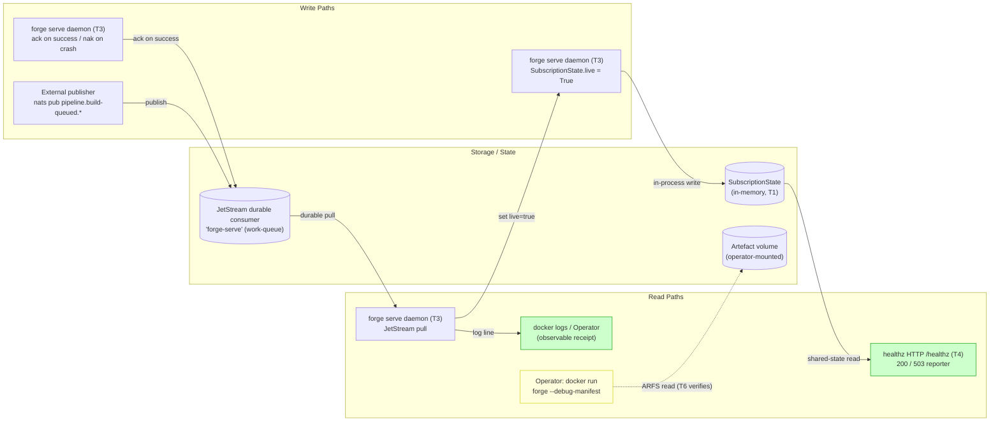
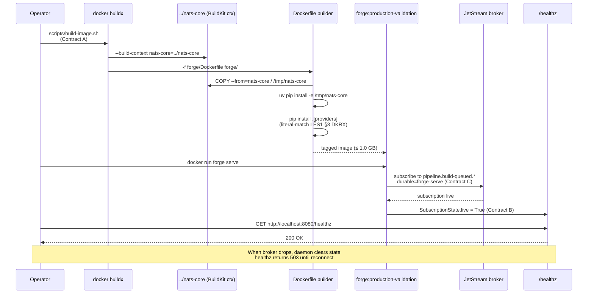
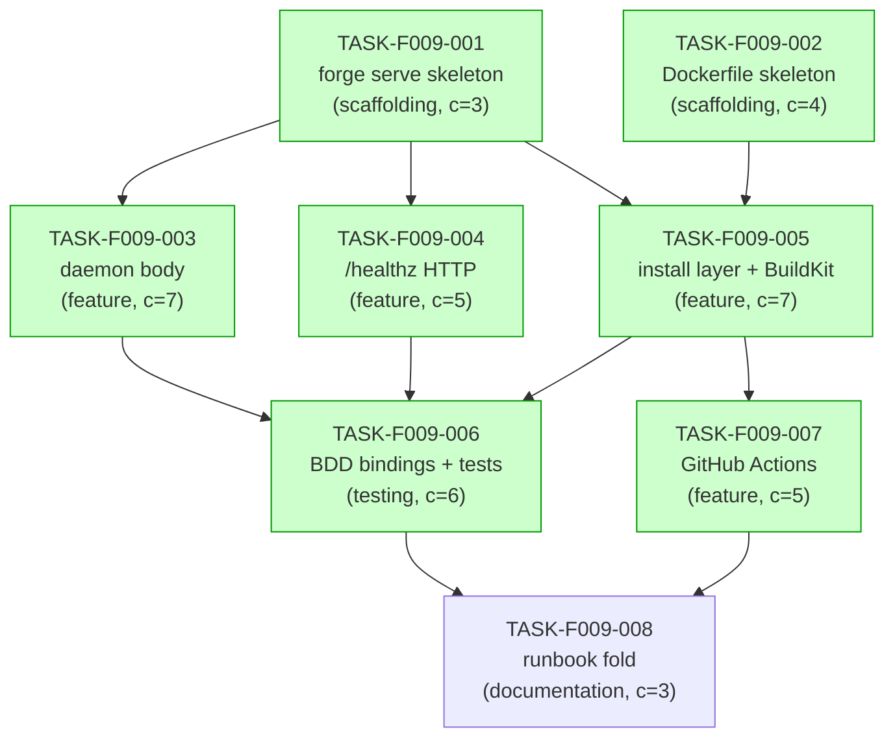

/feature-plan "FEAT-FORGE-009 Forge Production Image — multi-stage \
  Dockerfile + forge serve daemon to unblock LES1 parity gates" \
  --context features/forge-production-image/forge-production-image_summary.md \
  --context features/forge-production-image/forge-production-image_assumptions.yaml \
  --context docs/scoping/F8-007b-forge-production-dockerfile.md \
  --context docs/runbooks/RUNBOOK-FEAT-FORGE-008-validation.md \
  --context docs/architecture/decisions/ADR-ARCH-032-langchain-1x-portfolio-alignment.md \
  --context tasks/backlog/FEAT-FORGE-009-production-image.md

I'll orchestrate the feature planning workflow for FEAT-FORGE-009. Let me first read the context files to understand the scope, then invoke clarification.

Read forge-production-image_summary.md
Read forge-production-image_assumptions.yaml
Read F8-007b-forge-production-dockerfile.md
Read FEAT-FORGE-009-production-image.md
Bash List feature directory contents
IN
ls -la /home/richardwoollcott/Projects/appmilla_github/forge/features/forge-production-image/ && ls -la /home/richardwoollcott/Projects/appmilla_github/forge/features/ 2>/dev/null | head -20

OUT
total 44
drwxrwxr-x  2 richardwoollcott richardwoollcott  4096 Apr 30 17:55 .
drwxrwxr-x 11 richardwoollcott richardwoollcott  4096 Apr 30 17:53 ..
-rw-rw-r--  1 richardwoollcott richardwoollcott  4669 Apr 30 17:54 forge-production-image_assumptions.yaml
-rw-rw-r--  1 richardwoollcott richardwoollcott 19092 Apr 30 17:54 forge-production-image.feature
-rw-rw-r--  1 richardwoollcott richardwoollcott  4246 Apr 30 17:55 forge-production-image_summary.md
total 44
drwxrwxr-x 11 richardwoollcott richardwoollcott 4096 Apr 30 17:53 .
drwxrwxr-x 16 richardwoollcott richardwoollcott 4096 Apr 30 07:49 ..
drwxrwxr-x  2 richardwoollcott richardwoollcott 4096 Apr 25 19:23 confidence-gated-checkpoint-protocol
drwxrwxr-x  2 richardwoollcott richardwoollcott 4096 Apr 30 17:55 forge-production-image
drwxrwxr-x  2 richardwoollcott richardwoollcott 4096 Apr 25 15:44 guardkit-command-invocation-engine
drwxrwxr-x  2 richardwoollcott richardwoollcott 4096 Apr 25 16:07 infrastructure-coordination
drwxrwxr-x  2 richardwoollcott richardwoollcott 4096 Apr 25 16:06 mode-a-greenfield-end-to-end
drwxrwxr-x  2 richardwoollcott richardwoollcott 4096 Apr 27 17:39 mode-b-feature-and-mode-c-review-fix
drwxrwxr-x  2 richardwoollcott richardwoollcott 4096 Apr 25 15:18 nats-fleet-integration
drwxrwxr-x  2 richardwoollcott richardwoollcott 4096 Apr 27 12:22 pipeline-state-machine-and-configuration
drwxrwxr-x  2 richardwoollcott richardwoollcott 4096 Apr 25 16:24 specialist-agent-delegation
Read ADR-ARCH-032-langchain-1x-portfolio-alignment.md
I have the context I need. The feature spec already exists with 27 scenarios and all 10 assumptions confirmed by the operator. Now invoking Context A clarification.

Agent:Collect review scope clarifications
IN
Execute clarification for feature planning.

CONTEXT TYPE: review_scope

FEATURE: FEAT-FORGE-009 Forge Production Image — multi-stage Dockerfile + forge serve daemon to unblock LES1 parity gates (CMDW, PORT, ARFS, canonical-freeze) currently blocking Phase 6 of RUNBOOK-FEAT-FORGE-008-validation.md

ESTIMATED COMPLEXITY: 7/10 (scoping doc rated 4/5; converting to /10 scale, this is a high-complexity feature involving Dockerfile + new daemon + nats-core BuildKit context + CI gates + LES1 parity contracts)

CONTEXT FILES SUPPLIED:
- features/forge-production-image/forge-production-image_summary.md (27 scenarios across 7 example groups)
- features/forge-production-image/forge-production-image_assumptions.yaml (10 assumptions, all confirmed)
- docs/scoping/F8-007b-forge-production-dockerfile.md (full scoping with §11 open questions, Q4 resolved to BuildKit --build-context)
- docs/runbooks/RUNBOOK-FEAT-FORGE-008-validation.md (Phase 6 blocked on this feature)
- docs/architecture/decisions/ADR-ARCH-032-langchain-1x-portfolio-alignment.md (Python 3.14 + LangChain 1.x baseline)
- tasks/backlog/FEAT-FORGE-009-production-image.md (backlog stub)

KEY CONTEXT NOTES:
- Multi-stage Dockerfile (builder + runtime) on python:3.14-slim-bookworm with sha256 digest pinning
- New `forge serve` daemon subcommand (does not yet exist) — JetStream subscriber on pipeline.build-queued.*
- nats-core resolved via Docker BuildKit --build-context nats-core=../nats-core (operator picked option c)
- HTTP /healthz on port 8080 (ASSUM-005, confirmed)
- LES1 parity gates: CMDW, PORT, ARFS, canonical-freeze
- pip install .[providers] literal-match required (LES1 §3 DKRX)
- Image-size budget: 1.0 GB uncompressed (ASSUM-003, confirmed)
- Non-root runtime user, no baked secrets
- CI smoke-test gate for image hygiene
- Cross-cuts to runbook §6 gating callout (must remove on merge)

FLAGS:
  --no-questions: false
  --with-questions: false
  --defaults: false
  --answers: not provided

Ask about:
1. Review focus (all/technical/architecture/performance/security)
2. Trade-off priority (speed/quality/cost/maintainability/balanced)
3. Any specific concerns to address (e.g. nats-core build-context, daemon resilience, LES1 gate compliance, supply-chain pinning)

Return ClarificationContext with review preferences.
Read forge-production-image_assumptions.yaml
Read FEAT-FORGE-009-production-image.md
The clarification agent is asking you to choose review focus. Please answer:

FEAT-FORGE-009 Forge Production Image — Review Scope Clarification

Task: FEAT-FORGE-009 | Complexity: 7/10 | Mode: FULL

QUESTION 1 OF 5 — Review focus

Which areas should the review prioritise? Select one or more by entering the numbers separated by spaces (e.g. "1 3 5"), or enter A for all.

#	Focus area
1	Technical depth — implementation correctness (Dockerfile layer order, venv copy strategy, uv vs pip, build-context wiring for nats-core)
2	Architecture — structural decisions (multi-stage layout, forge serve daemon model, JetStream durable consumer design, HEALTHCHECK shape)
3	Security — supply-chain and runtime hygiene (digest pinning, no-baked-secrets gate, non-root user, volume escape)
4	LES1 gate compliance — focused check that CMDW / PORT / ARFS / canonical-freeze ACs are each structurally reachable by the planned deliverables
5	CI / DevOps — build-on-PR gate, smoke-test scope, registry and tagging strategy, image-size regression
A	All of the above (comprehensive review)
What's your answer?

forge-build-plan.md
all
Update Todos

Context A: Review scope clarification (Q1-Q5)

Execute /task-create for review task

Execute /task-review with --mode=decision

Decision checkpoint [A/R/I/C]

Context B: Implementation preferences (if [I]mplement)

Generate feature structure (subtasks + IMPLEMENTATION-GUIDE.md with Mermaid diagrams)

Generate structured FEAT-XXXX.yaml + run validation + BDD link
Recorded Q1: A — All five focus areas. Moving to Q2.

QUESTION 2 OF 5 — Trade-off priority

Where should the review push when it has to make a call between competing concerns?

#	Priority	What it favours in the review
1	Speed of delivery	Smallest feasible scope to unblock Phase 6 — accept follow-ups
2	Quality / reliability	Robust daemon, full LES1 coverage, all 27 scenarios honoured
3	Cost	Minimise CI minutes, image pulls, registry storage
4	Maintainability	Clean Dockerfile layout, well-factored forge serve, easy to evolve
5	Supply-chain hygiene	Maximise digest pinning, no-baked-secrets, provenance — security-leaning
B	Balanced (default)	Spread evenly across the five
What's your answer?

b
Recorded Q2: B — Balanced. Moving to Q3.

QUESTION 3 OF 5 — Specific concerns to address

Pick any specific concerns you want the review to dig into (multiple OK, e.g. "1 3 4"), or N for none beyond the focus areas already chosen.

#	Concern	Why it might matter
1	nats-core build-context wiring	Operator picked option (c) BuildKit --build-context 2026-04-30; review should verify the docker buildx build --build-context nats-core=../nats-core -f forge/Dockerfile forge/ invocation flows cleanly through Dockerfile, runbook §6.1, and CI
2	forge serve daemon resilience	New subcommand — JetStream durable consumer "forge-serve", reconnect on broker outage (D1), no-double-processing under multiple replicas (ASSUM-006), crash redelivery (E2.1)
3	LES1 gate structural reachability	Each of CMDW/PORT/ARFS/canonical-freeze must be exercisable against the produced image; review checks the planned tasks actually produce a testable image, not just build artefacts
4	Supply-chain pinning	Both stages pinned to python:3.14-slim-bookworm@sha256:..., ADR-ARCH-032 LangChain 1.x portfolio honoured, no implicit floating tags
5	HEALTHCHECK shape	Port 8080 + HTTP /healthz (ASSUM-005, confirmed) — review should confirm Docker HEALTHCHECK directive aligns with subscription-state semantics in B5/E3.1
6	Image-size budget enforcement	1.0 GB uncompressed (ASSUM-003) — should there be a regression task that fails CI when exceeded?
7	CI workflow scope	Build-on-PR vs build-on-merge, smoke-test depth, registry/tagging strategy — pure DevOps choices
8	Runbook §6 gating callout removal	Governance AC-J — the merge of FEAT-FORGE-009 must remove the existing gating callout in RUNBOOK-FEAT-FORGE-008-validation.md §6
N	None — focus areas already chosen are sufficient	
What's your answer?

1,2,8
Recorded Q3: 1, 2, 8 — nats-core BuildKit wiring, forge serve resilience, runbook §6 gating callout removal. Moving to Q4.

QUESTION 4 OF 5 — Analysis depth

How thorough should /task-review be?

#	Depth	What you get
1	Quick	Single recommended approach, minimal alternatives, ~5–10 min
2	Standard (default)	2–3 alternatives compared, recommended approach with rationale, risk callouts
3	Deep	3–4 alternatives, full trade-off matrix, dependency graph, risk register, alternate-path analysis if recommendation is rejected
What's your answer?

3
Recorded Q4: 3 — Deep analysis. Moving to Q5.

QUESTION 5 OF 5 — Scenario coverage strategy

The feature spec already has 27 scenarios across 7 example groups (A, B, C, D, E1, E2, E3). How should the review/plan map these onto implementation tasks?

#	Strategy	Effect on task decomposition
1	One task per example group	7 tasks (A=key, B=boundary, C=negative, D=edge-core, E1=security, E2=data-integrity, E3=integration) — coarse-grained, easier to parallelise
2	One task per deliverable	Tasks split by artefact: Dockerfile, forge serve daemon, healthz, build-context wiring, CI workflow, runbook §6 fold — ~6–8 tasks, scenarios assigned post-hoc by linker
3	Wave-based by gate	Wave 1: scaffolding (forge serve skeleton, Dockerfile skeleton). Wave 2: feature work (full CLI, healthz, build-context). Wave 3: CI gates + runbook fold. Scenarios cluster naturally per wave
4	Reviewer's call	Let /task-review recommend the breakdown based on file-overlap and dependency analysis
What's your answer?

3
All five clarifications recorded. Updating progress and moving to Step 3 (create review task).

Update Todos

Context A: Review scope clarification (Q1-Q5)

Execute /task-create for review task

Execute /task-review with --mode=decision --depth=deep

Decision checkpoint [A/R/I/C]

Context B: Implementation preferences (if [I]mplement)

Generate feature structure (subtasks + IMPLEMENTATION-GUIDE.md with Mermaid diagrams)

Generate structured FEAT-XXXX.yaml + run validation + BDD link
Captured Context A clarifications:

Focus: All five areas (technical, architecture, security, LES1 compliance, CI/DevOps)
Trade-off: Balanced
Specific concerns: nats-core BuildKit wiring, forge serve resilience, runbook §6 gating callout removal
Depth: Deep
Decomposition: Wave-based by gate
Now invoking /task-create to spawn the review task.

task-create skill
Bash Inspect existing tasks directory structure
IN
ls /home/richardwoollcott/Projects/appmilla_github/forge/tasks/ 2>/dev/null && find /home/richardwoollcott/Projects/appmilla_github/forge/tasks/ -maxdepth 2 -name "TASK-REV-*" 2>/dev/null | head -20

OUT
backlog
completed
design_approved
in_progress
in_review
/home/richardwoollcott/Projects/appmilla_github/forge/tasks/in_progress/TASK-REV-F0E4-portfolio-py314-langchain-1x-alignment.md
/home/richardwoollcott/Projects/appmilla_github/forge/tasks/completed/TASK-REV-D90D
/home/richardwoollcott/Projects/appmilla_github/forge/tasks/completed/TASK-REV-A1F2
/home/richardwoollcott/Projects/appmilla_github/forge/tasks/completed/TASK-REV-C3E7
/home/richardwoollcott/Projects/appmilla_github/forge/tasks/completed/TASK-REV-A7D3
/home/richardwoollcott/Projects/appmilla_github/forge/tasks/backlog/TASK-REV-F008-fix-feat-forge-008-validation-failures.md
/home/richardwoollcott/Projects/appmilla_github/forge/tasks/backlog/TASK-REV-GCI0-plan-guardkit-command-invocation-engine.md
/home/richardwoollcott/Projects/appmilla_github/forge/tasks/backlog/TASK-REV-MAG7-plan-mode-a-greenfield-end-to-end.md
/home/richardwoollcott/Projects/appmilla_github/forge/tasks/backlog/TASK-REV-NF20-plan-nats-fleet-integration.md
/home/richardwoollcott/Projects/appmilla_github/forge/tasks/backlog/TASK-REV-CG44-plan-confidence-gated-checkpoint-protocol.md
/home/richardwoollcott/Projects/appmilla_github/forge/tasks/backlog/TASK-REV-DUPF-investigate-autobuild-duplicate-task-files.md
/home/richardwoollcott/Projects/appmilla_github/forge/tasks/in_review/TASK-REV-SAD3-plan-specialist-agent-delegation.md
/home/richardwoollcott/Projects/appmilla_github/forge/tasks/in_review/TASK-REV-F1B8
/home/richardwoollcott/Projects/appmilla_github/forge/tasks/in_review/TASK-REV-3EEE-plan-pipeline-state-machine-and-configuration.md
/home/richardwoollcott/Projects/appmilla_github/forge/tasks/in_review/TASK-REV-IC8B-plan-infrastructure-coordination.md
Write TASK-REV-F009-plan-feat-forge-009-production-image.md
99 lines
---
id: TASK-REV-F009
title: "Plan: FEAT-FORGE-009 Forge Production Image (Dockerfile + forge serve daemon)"
task_type: review
status: backlog
priority: high
created: 2026-04-30T00:00:00Z
updated: 2026-04-30T00:00:00Z
complexity: 7
estimated_effort: "2-4 sessions (review + plan + autobuild)"
recommended_feature_id: FEAT-FORGE-009
parent_feature_stub: tasks/backlog/FEAT-FORGE-009-production-image.md
related:
  - features/forge-production-image/forge-production-image.feature
  - features/forge-production-image/forge-production-image_summary.md
  - features/forge-production-image/forge-production-image_assumptions.yaml
  - docs/scoping/F8-007b-forge-production-dockerfile.md
  - docs/runbooks/RUNBOOK-FEAT-FORGE-008-validation.md
  - docs/architecture/decisions/ADR-ARCH-032-langchain-1x-portfolio-alignment.md
tags: [feature-plan, review, dockerfile, containerisation, les1, cmdw, port, arfs, forge-serve, blocks-phase-6]
clarification:
  context_a:
    timestamp: 2026-04-30T00:00:00Z
    decisions:
      focus: all
      tradeoff: balanced
      specific_concerns: [nats_core_buildkit_wiring, forge_serve_daemon_resilience, runbook_section6_gating_callout_removal]
      depth: deep
      decomposition_strategy: wave_based_by_gate
test_results:
  status: pending
  coverage: null
  last_run: null
---

# TASK-REV-F009 — Plan: FEAT-FORGE-009 Forge Production Image

## Description

Run a deep `/task-review` against FEAT-FORGE-009 to produce a wave-based
implementation plan that delivers:

1. A multi-stage Dockerfile (`builder` + `runtime`) on
   `python:3.14-slim-bookworm` with sha256 digest pinning.
2. A new `forge serve` long-lived daemon subcommand that subscribes to
   JetStream `pipeline.build-queued.*` via a shared durable consumer
   `forge-serve` (work-queue semantics for multi-replica safety).
3. The Docker BuildKit `--build-context nats-core=../nats-core` wiring
   that resolves the sibling editable `nats-core` source inside the
   container build (operator-decided 2026-04-30, per
   `docs/scoping/F8-007b-forge-production-dockerfile.md` §11.4).
4. An HTTP `/healthz` probe on TCP port 8080 reflecting the JetStream
   subscription state, wired via Docker `HEALTHCHECK`.
5. A CI workflow that builds + smoke-tests the image on every PR
   touching `Dockerfile`, `pyproject.toml`, or `src/forge/`.
6. The runbook §6 gating callout removal that closes
   `RUNBOOK-FEAT-FORGE-008-validation.md` Phase 6 (CMDW / PORT / ARFS /
   canonical-freeze parity gates).

The review must verify each LES1 parity gate is structurally reachable
once the planned tasks ship, and the wave-based decomposition must keep
parallelisation honest (no intra-wave dependencies).

## Acceptance Criteria

- [ ] Review surfaces 3+ implementation alternatives compared on a
      trade-off matrix (deep mode required by Q4)
- [ ] Recommended approach addresses all five focus areas (technical
      depth, architecture, security, LES1 compliance, CI/DevOps)
- [ ] Specific concerns called out: nats-core BuildKit wiring, `forge
      serve` daemon resilience, runbook §6 gating callout removal
- [ ] Wave-based decomposition: scaffolding wave → feature wave → CI
      gates / runbook fold wave; tasks within a wave have no shared
      file conflicts
- [ ] Each LES1 parity gate (CMDW, PORT, ARFS, canonical-freeze) maps
      to at least one acceptance criterion in the resulting subtask set
- [ ] Integration contract surfaced for cross-task data dependencies
      (most likely DOCKER_BUILD_CONTEXT shape and HEALTHZ_PORT)
- [ ] Decision checkpoint reached with [A]ccept / [R]evise / [I]mplement
      / [C]ancel options
- [ ] On [I]mplement, structured `.guardkit/features/FEAT-FORGE-009.yaml`
      is generated with `file_path` populated for every task and
      `parallel_groups` honouring the wave decomposition

## Implementation Notes

This is a **review task**, not an implementation task. Expected
follow-up: `/task-review TASK-REV-F009 --mode=decision --depth=deep`.

The 27-scenario feature spec at
`features/forge-production-image/forge-production-image.feature` is
already converged (all 10 assumptions confirmed by operator on
2026-04-30). The review's job is to convert that behavioural contract
into a wave-ordered implementation plan, not to revisit the spec.

## Test Execution Log

(Populated by `/task-review`.)
Review task created. Now executing /task-review with --mode=decision --depth=deep.

Update Todos

Context A: Review scope clarification (Q1-Q5)

Execute /task-create for review task

Execute /task-review with --mode=decision --depth=deep

Decision checkpoint [A/R/I/C]

Context B: Implementation preferences (if [I]mplement)

Generate feature structure (subtasks + IMPLEMENTATION-GUIDE.md with Mermaid diagrams)

Generate structured FEAT-XXXX.yaml + run validation + BDD link

✅ Task Created: TASK-REV-F009
📋 Title: Plan: FEAT-FORGE-009 Forge Production Image (Dockerfile + forge serve daemon)
📁 Location: tasks/backlog/TASK-REV-F009-plan-feat-forge-009-production-image.md

Proceeding to review analysis...
Now reading the full feature scenarios and runbook to feed deep analysis.

Read forge-production-image.feature
Read RUNBOOK-FEAT-FORGE-008-validation.md (lines 2-101)
Bash Find Phase 6 sections in runbook
IN
grep -n "## Phase 6\|### 6\." /home/richardwoollcott/Projects/appmilla_github/forge/docs/runbooks/RUNBOOK-FEAT-FORGE-008-validation.md | head -30

OUT
753:## Phase 6: LES1 Parity Gates (production-image, all four required)
775:### 6.1 CMDW gate — production-image subscription round-trip
826:### 6.2 PORT gate — `(specialist_role, forge_stage)` dispatch matrix
858:### 6.3 ARFS gate — per-tool handler-completeness matrix
904:### 6.4 Canonical-freeze live-verification gate
Read RUNBOOK-FEAT-FORGE-008-validation.md (lines 754-953)
Bash Inspect forge CLI structure
IN
ls /home/richardwoollcott/Projects/appmilla_github/forge/src/forge/cli/ 2>/dev/null && head -100 /home/richardwoollcott/Projects/appmilla_github/forge/src/forge/cli/main.py 2>/dev/null

OUT
cancel.py
history.py
__init__.py
main.py
__pycache__
queue.py
runtime.py
skip.py
status.py
"""Click entry point for the ``forge`` CLI (TASK-PSM-008 / TASK-PSM-011 / TASK-PSM-012).

This module exposes the top-level Click group :func:`main` and registers
every subcommand currently shipped:

* ``forge queue`` (TASK-PSM-008 — write-then-publish enqueue command)
* ``forge status`` (TASK-PSM-009 — read-path bypass to SQLite)
* ``forge history`` (TASK-PSM-010 — read-path bypass to SQLite)
* ``forge cancel`` (TASK-PSM-011 — thin wrapper over CliSteeringHandler)
* ``forge skip`` (TASK-PSM-011 — thin wrapper over CliSteeringHandler)

The ``[project.scripts]`` entry in ``pyproject.toml`` (TASK-PSM-012) wires
``forge.cli.main:main`` to the ``forge`` console script so
``pip install -e .`` puts the binary on ``$PATH``.

The CLI runtime helpers (:class:`CliRuntime` and :func:`build_cli_runtime`)
live in :mod:`forge.cli.runtime` so subcommand modules can import them
without a circular import.

Per AC-002 of TASK-PSM-008, ``main`` loads ``forge.yaml`` *once* and
passes the parsed :class:`ForgeConfig` to subcommands via
:attr:`click.Context.obj`. ``forge queue`` (the principal consumer)
reads its ``repo_allowlist`` and queue defaults from that object;
``forge history`` keys off the same value to pull
``queue.default_history_limit``. The cancel/skip wrappers do not need a
config and therefore never read ``ctx.obj`` — running ``forge cancel``
without ``--config`` and without a ``./forge.yaml`` continues to work.
"""

from __future__ import annotations

from pathlib import Path

import click

from forge.cli import cancel as _cancel
from forge.cli import history as _history
from forge.cli import queue as _queue
from forge.cli import skip as _skip
from forge.cli import status as _status
from forge.cli.runtime import CliRuntime, build_cli_runtime
from forge.config.loader import load_config

#: Default location of ``forge.yaml`` when ``--config`` is omitted.
#: Resolved against the current working directory so an operator can
#: ``cd`` into a project that ships its own ``forge.yaml`` and run
#: subcommands without an explicit ``--config`` flag.
DEFAULT_CONFIG_FILENAME = Path("forge.yaml")


def _resolve_context_object(config_path: Path | None) -> object:
    """Decide what to put in ``ctx.obj`` given an optional ``--config``.

    Behaviour:

    * If ``config_path`` is supplied (Click already verified the file
      exists via ``exists=True``), load it via :func:`load_config` and
      return the :class:`ForgeConfig`.
    * Otherwise look for ``./forge.yaml`` in the CWD; if present, load
      it. If absent, return ``None`` so subcommands that do not need a
      config (``cancel``/``skip``) keep working unchanged.

    The function is intentionally tolerant of a missing default
    ``forge.yaml`` because not every subcommand requires one; the
    ``queue`` subcommand enforces its own "config required" rule via
    :func:`forge.cli.queue._require_forge_config`.
    """
    if config_path is not None:
        return load_config(config_path)
    if DEFAULT_CONFIG_FILENAME.exists():
        return load_config(DEFAULT_CONFIG_FILENAME)
    return None


@click.group(name="forge")
@click.option(
    "--config",
    "config_path",
    type=click.Path(exists=True, dir_okay=False, path_type=Path),
    default=None,
    help="Path to forge.yaml. Defaults to ./forge.yaml when present.",
)
@click.pass_context
def main(ctx: click.Context, config_path: Path | None) -> None:
    """Forge — pipeline orchestrator and checkpoint manager CLI."""
    ctx.obj = _resolve_context_object(config_path)


main.add_command(_queue.queue_cmd)
main.add_command(_status.status_cmd)
main.add_command(_history.history_cmd)
main.add_command(_cancel.cancel_cmd)
main.add_command(_skip.skip_cmd)


__all__ = ["CliRuntime", "build_cli_runtime", "main"]
Bash Inspect forge pyproject.toml
IN
cat /home/richardwoollcott/Projects/appmilla_github/forge/pyproject.toml | head -100

OUT
[project]
name = "forge"
version = "0.1.0"
description = "Pipeline orchestrator and checkpoint manager for the Software Factory"
readme = "README.md"
requires-python = ">=3.11"
authors = [
    { name = "Richard Woollcott", email = "rich@appmilla.com" },
]
dependencies = [
    "deepagents>=0.5.3,<0.6",
    "langchain>=1.2,<2",
    "langchain-core>=1.3,<2",
    "langgraph>=1.1,<2",
    "langchain-community>=0.4,<0.5",
    "langchain-anthropic>=1.4,<2",
    "nats-core>=0.3.0,<0.4",
    "python-dotenv>=1.0",
    "pyyaml>=6.0",
]

[project.optional-dependencies]
# Every LangChain integration this template can be configured to use MUST appear here.
# See TASK-REV-LES1 / LES1 §3 LCOI — provider swaps happen via orchestrator-config.yaml,
# so all supported providers must be declarable in one install command.
providers = [
    "langchain-openai>=1.2,<2",
    "langchain-google-genai>=4.2,<5",
]
# TASK-FIX-F0E7 (per TASK-REV-F0E4 §5.2): mirrored from [dependency-groups].dev
# below. PEP 735's [dependency-groups] is read by `uv sync --group dev`,
# NOT by `uv pip install -e ".[dev]"`. The GuardKit portfolio-pinning
# recipe uses the latter form, so dev deps must be declared as an extra
# here as well as in [dependency-groups]. Keep these two lists in sync.
# `pytest-asyncio` is required because the test suite has 100+
# `@pytest.mark.asyncio` decorators; without the plugin loaded, every
# async test fails with `Failed: async def functions are not natively
# supported` (162 such failures observed in TASK-REV-F0E4's empirical run).
dev = [
    "pytest>=9.0.2",
    "pytest-bdd>=8.1,<9",
    "pytest-asyncio>=1,<2",
]

# TASK-PSM-012: Console-script entry point for the ``forge`` CLI.
# ``pip install`` (or ``pip install -e .``) writes a ``forge`` shim to the
# active environment's ``bin/`` directory pointing at the Click group
# defined in ``forge.cli.main:main``. The dotted path matches the
# entry-point assertion baked into ``tests/forge/test_cli_main.py``
# (``test_module_dotted_path_matches_pyproject_entry_point``); changing
# either side without the other breaks the install-time wiring.
[project.scripts]
forge = "forge.cli.main:main"

[dependency-groups]
# PEP 735 dev group — read by `uv sync --group dev`. Mirrored into
# [project.optional-dependencies].dev above so `uv pip install -e ".[dev]"`
# also works (see TASK-FIX-F0E7 / TASK-REV-F0E4 §5.2). Keep both lists in sync.
dev = [
    "pytest>=9.0.2",
    "pytest-bdd>=8.1,<9",
    "pytest-asyncio>=1,<2",
]

# TASK-FIX-F0E6 (per TASK-REV-F0E4 §5.1): the `nats-core==0.2.0` wheel
# published to PyPI is malformed — its dist-info is named
# `nats_core-0.2.0.dist-info` but the wheel's RECORD only contains
# `nats/client/...` files; the `nats_core/` namespace forge imports
# (events, envelope, manifest, topics, client) is **absent from the
# wheel**. On a fresh `uv pip install -e ".[providers]"`, 55 of 108 test
# files fail to collect with `ModuleNotFoundError: No module named
# 'nats_core'`. Until the upstream wheel is fixed and republished
# (tracked as TASK-FIX-F0E6b), resolve `nats-core` from the sibling
# working tree, which has the correct `src/nats_core/` layout. This
# mirrors jarvis's existing pattern — see jarvis/pyproject.toml.
#
# Canonical layout assumes `nats-core` is a sibling of `forge`:
#   …/appmilla_github/forge/        ← this project
#   …/appmilla_github/nats-core/    ← target of `../nats-core`
#
# Worktree note: `uv` resolves the path relative to the directory
# containing this pyproject.toml. From a worktree at
# `.guardkit/worktrees/<branch>/` the literal `../nats-core` resolves
# to `.guardkit/worktrees/nats-core`, which won't exist. For autobuild
# runs that need `uv pip install` inside a worktree, place a symlink
# at `.guardkit/worktrees/nats-core` pointing at the real sibling
# (jarvis already does this; forge will need the same once autobuild
# starts running with this dependency layout).
[tool.uv.sources]
nats-core = { path = "../nats-core", editable = true }

[build-system]
requires = ["setuptools>=68", "wheel"]
build-backend = "setuptools.build_meta"

[tool.setuptools.packages.find]
where = ["src"]

[tool.setuptools.package-data]
# Ship the SQLite DDL alongside the lifecycle package so
Now executing deep decision review against TASK-REV-F009.


🔍 Analyzing feature: FEAT-FORGE-009 Forge Production Image
🎯 Mode: decision
📊 Depth: deep
🧭 Focus: All five areas (technical, architecture, security, LES1 compliance, CI/DevOps)
⚖️  Trade-off priority: Balanced
🔬 Specific concerns: nats-core BuildKit wiring, forge serve daemon resilience, runbook §6 gating callout removal
📐 Decomposition strategy: Wave-based by gate
TECHNICAL OPTIONS ANALYSIS (Deep)
Option 1: Monolithic wave — single Dockerfile + serve PR
Shape: One large task delivering Dockerfile, forge serve, /healthz, CI workflow, runbook fold.
Complexity: 9/10
Effort: 1 long session (8–12 h), single PR.
Pros: ✅ Atomic merge — Phase 6 unblocks in a single moment.
Cons: ❌ No intra-wave parallelism; ❌ One Coach review at the end is a coarse signal — failures in any one area block the others; ❌ AC-J (runbook fold) cannot be verified until merge so feedback loop is delayed; ❌ forge serve daemon and Dockerfile are coupled in a single task, but the daemon is testable Python and the Dockerfile is testable infra — different gating profiles.
Risk: HIGH — single-point-of-failure delivery; LES1 gate compliance can't be verified incrementally.
Option 2: Container-first → daemon-second → CI-third (linear, 3 waves)
Shape: Wave 1 = Dockerfile + image build path. Wave 2 = forge serve + healthz + integration tests. Wave 3 = CI + image-size regression + runbook fold.
Complexity: 7/10
Effort: ~4 sessions, 3 sequential waves.
Pros: ✅ Each wave produces a checkable artefact (image builds → daemon runs → CI green); ✅ Clear linear progression matches the user mental model.
Cons: ❌ Wave 1 produces a useless image (no daemon body) — verifying CMDW gate has to wait for Wave 2; ❌ No parallelism within waves (all single-task waves); ❌ Wave 1's Dockerfile would need re-edit in Wave 2 to actually wire forge serve end-to-end.
Risk: MEDIUM — slow throughput, but each step is reviewable.
Option 3: Wave-based by gate with vertical-slice scaffolding (RECOMMENDED)
Shape: 4 waves of 1–3 parallel tasks each, organised by which LES1 gate the wave makes structurally reachable. Scaffolding wave makes everything exist (so subsequent waves are pure-extend); feature wave fills in daemon + healthz + install layer in parallel; gates wave delivers CI + tests; governance wave folds the runbook.
Complexity: 7/10
Effort: 2–3 sessions, 4 waves with intra-wave parallelism (max 3).
Pros: ✅ Maximum intra-wave parallelism without file conflicts (Python daemon, Python healthz, Dockerfile install layer all touch separate files); ✅ Each wave has a deterministic exit criterion mapped to a LES1 gate or AC; ✅ Scaffolding wave is task_type:scaffolding (skips arch review — fast), feature wave is task_type:feature (full Coach gates), runbook fold is task_type:documentation (fast); ✅ Coach signal granularity is high — failure in T4 (healthz) doesn't block T3 (daemon body); ✅ Honours Q5 wave-based-by-gate decomposition.
Cons: ⚠️ More tasks (8 total) — slightly higher orchestration overhead; ⚠️ Requires explicit Integration Contracts to avoid drift (BuildKit invocation; HEALTHZ_PORT) — addressed by §4 contracts below.
Risk: LOW — highest review granularity, lowest blast radius per task.
Option 4: Strict gate-vertical (CMDW-first, PORT, ARFS, canonical-freeze each as a wave)
Shape: Wave 1 = minimum to pass CMDW. Wave 2 = PORT. Wave 3 = ARFS. Wave 4 = canonical-freeze + runbook fold.
Complexity: 8/10
Effort: 4–5 sessions, narrow waves.
Pros: ✅ Each wave merges immediately closes one LES1 gate.
Cons: ❌ Cuts across the natural file structure (Dockerfile gets edited in 4 different waves — high merge churn); ❌ ARFS and PORT are emergent properties of the image content, not separate deliverables — splitting them creates phantom tasks; ❌ Wave 1 ends with an image that needs re-rolling once forge_feature/forge_review_fix registration is verified.
Risk: MEDIUM-HIGH — overfits the work to gate boundaries when the deliverable boundaries are different.
TRADE-OFF MATRIX
Dimension	Opt 1 (Monolithic)	Opt 2 (Container-first)	Opt 3 (Gate-wave + slice)	Opt 4 (Strict gate-vertical)
Time to first review	⚠️ 8–12 h	✅ ~3 h (W1)	✅ ~2 h (W1)	✅ ~2 h (W1)
Intra-wave parallelism	❌ None	❌ None	✅ Up to 3	⚠️ 1–2
Coach signal granularity	❌ Coarse	⚠️ Medium	✅ Fine	✅ Fine
File-conflict risk	⚠️ Low (no parallelism)	⚠️ Low	✅ Designed-out	❌ High (Dockerfile edited 4×)
LES1 gate visibility	❌ All-or-nothing at end	⚠️ Step-by-step	✅ Step-by-step	✅ Step-by-step
Merge churn	✅ Single PR	⚠️ 3 PRs	⚠️ 4 PRs	❌ 4 PRs touching same files
Honours Q5 (wave-by-gate)	❌ No	⚠️ Partial	✅ Yes	✅ Yes
Total complexity	9/10	7/10	7/10	8/10
RECOMMENDED APPROACH
✅ Option 3: Wave-based by gate with vertical-slice scaffolding

Rationale
Honours your Q5 choice (wave-based by gate) while extracting the most intra-wave parallelism the deliverable surface admits.
Splits work along file-conflict boundaries rather than gate boundaries — Dockerfile edits stay in one task per wave; daemon code stays in src/forge/cli/serve.py across W1→W2; CI workflow + runbook fold are isolated late.
Maps each task to a task_type that gives Coach the right gate profile (scaffolding/feature/testing/infrastructure/documentation).
Surfaces the BuildKit invocation as an explicit Integration Contract — it appears verbatim in three places (Dockerfile build script, CI workflow, runbook §6.1), so drift is the #1 risk and §4 below addresses it head-on.
Wave Breakdown (8 tasks)
Wave 1 — Foundation (2 parallel)

T1 (scaffolding): Add forge serve skeleton to CLI (src/forge/cli/serve.py + register in main.py); Pydantic ServeConfig (port=8080, nats_url default, durable_name="forge-serve"); --help only, no daemon body. Closes: ASSUM-008, A2 scenario.
T2 (scaffolding): Dockerfile skeleton — both stages with digest-pinned python:3.14-slim-bookworm@sha256:..., builder + runtime, USER forge (UID 1000), ENTRYPOINT ["forge"], CMD ["serve"], no install logic. Closes: ASSUM-010, AC-G, C2 scenario.
Wave 2 — Feature (3 parallel)

T3 (feature): forge serve daemon body — JetStream durable consumer wired via nats-core, reconnect-on-broker-loss, signal-driven shutdown, work-queue semantics for multi-replica safety. Closes: AC-C, ASSUM-001, ASSUM-002, ASSUM-006, ASSUM-007, A3, B1, B2, C5, D1, D2, E2.1, E3.1.
T4 (feature): /healthz HTTP server — asyncio.Server or aiohttp on port 8080, 200 OK when subscription live, 503 otherwise; reads daemon's is_healthy(). Closes: ASSUM-004, ASSUM-005, B5, E1.3.
T5 (infrastructure): Dockerfile install layer + BuildKit context — --build-context nats-core=../nats-core, COPY --from=nats-core / /opt/nats-core, pip install .[providers] literal-match, HEALTHCHECK directive, scripts/build-image.sh wrapper. Closes: AC-A, AC-E, AC-F (paired with T7), AC-H, A1, B3, B4, C1, C3, C4, E1.1.
Wave 3 — Gates (2 parallel)

T6 (testing): BDD bindings for the 27-scenario feature spec under tests/integration/test_forge_serve_*.py and tests/bdd/; runs against built image via docker run/subprocess. Closes: every scenario binding, ARFS structural verification (A4 — manifest test), AC-D.
T7 (infrastructure): GitHub Actions .github/workflows/forge-image.yml triggered by changes to Dockerfile, pyproject.toml, src/forge/**; runs scripts/build-image.sh, smoke-tests, enforces image-size budget (1.0 GB uncompressed via docker image inspect | jq), scans for baked provider keys (grep -r 'sk-' heuristic + git secrets --scan-history). Closes: AC-F, AC-I, B4, C1, D5.
Wave 4 — Governance (1 task, sequential)

T8 (documentation): Update RUNBOOK-FEAT-FORGE-008-validation.md §6 — remove gating callout, replace bare docker build with BuildKit invocation; update tasks/backlog/FEAT-FORGE-009-production-image.md → completed; append docs/history/command-history.md entry. Closes: AC-J.
Implementation Notes
T3, T4, T5 in Wave 2 touch separate files (T3 → daemon section of serve.py, T4 → healthz.py + integrate, T5 → Dockerfile + scripts/). Coordinate via the §4 contracts below.
T6 depends on T3–T5 having merged; testing wave is gated on the build path being end-to-end functional.
T8 is intentionally last because runbook §6 fold can only be verified once T6+T7 are green (otherwise the gating callout is still the truth).
§4 INTEGRATION CONTRACTS (CRITICAL — three required)
Contract A: BUILDKIT_INVOCATION
Producer: T5 (Dockerfile + scripts/build-image.sh)
Consumers: T7 (CI workflow), T8 (runbook §6.1 update)
Artifact type: shell command string
Format constraint: docker buildx build --build-context nats-core=../nats-core -t forge:production-validation -f Dockerfile . — exact string, no trailing whitespace, no shell-variable interpolation in the --build-context value
Validation: Coach diffs the literal string across scripts/build-image.sh, .github/workflows/forge-image.yml, and RUNBOOK-FEAT-FORGE-008-validation.md §6.1; CI fails on drift via a literal grep test in T6's smoke suite
Contract B: HEALTHZ_PORT (resolves ASSUM-005)
Producer: T1 (ServeConfig.port = 8080 in Pydantic model)
Consumers: T4 (HTTP server bind), T5 (HEALTHCHECK CMD curl -fs http://localhost:8080/healthz)
Artifact type: integer constant
Format constraint: 8080 exposed as forge.cli.serve.DEFAULT_HEALTHZ_PORT AND mirrored in Dockerfile ENV FORGE_HEALTHZ_PORT=8080 so runtime and HEALTHCHECK agree
Validation: T6 includes a unit test that imports DEFAULT_HEALTHZ_PORT and greps the Dockerfile for the same value
Contract C: JETSTREAM_DURABLE_NAME
Producer: T1 (ServeConfig.durable_name = "forge-serve")
Consumers: T3 (subscription wiring — uses the durable to get work-queue semantics), T6 (multi-replica test asserts the durable name in the consumer config)
Artifact type: string constant
Format constraint: "forge-serve" exactly — JetStream durable names are case-sensitive and a typo silently creates a second consumer (the exact ASSUM-006 failure mode)
Validation: T6 D2 scenario binding pulls durable_name from ServeConfig and asserts the JetStream consumer_info() matches
RISK REGISTER
#	Risk	Likelihood	Impact	Mitigation
R1	BuildKit --build-context nats-core=../nats-core resolves differently in CI worktree than dev host	Medium	High — CI false-greens or false-reds	Contract A + a CI matrix that runs the build from /tmp/clean-clone to mimic clean-machine path
R2	forge serve daemon hangs on shutdown (signal handling regression)	Medium	High — container restarts get stuck	T3 acceptance: SIGTERM completes within 10 s, regression test in T6
R3	nats-core sibling layout changes (rename, move)	Low	High — silent build break	T5 includes a RUN test -d /opt/nats-core/src/nats_core early-fail gate in builder stage
R4	python:3.14-slim-bookworm digest gets retagged upstream	Low	Medium — non-reproducible builds	Pin both stages by sha256; T7 includes a Renovate-style annotation flagging digest age
R5	Image size exceeds 1.0 GB (LangChain ecosystem heavy)	Medium	Low — CI fail surfaces immediately	T7 size check; T5 uses --no-cache-dir for pip, multi-stage venv copy
R6	forge_feature or forge_review_fix not in fleet manifest at image-build time	Low	High — ARFS gate fails	A4 BDD scenario in T6 runs forge --debug-manifest (or equivalent) and asserts all 5 tools
R7	HEALTHCHECK port (8080) collides with operator's existing service	Low	Low	Document in T8 runbook update; make port overridable via FORGE_HEALTHZ_PORT env
R8	Runbook §6 fold (T8) merges before T6/T7 are green — Phase 6 declared canonical prematurely	Medium	High — false signal	T8 acceptance criterion: "T6 and T7 both green on main before this PR can merge" + Wave 4 explicitly sequential
DEPENDENCY GRAPH

W1: T1 ──┐
         ├── W2: T3 ──┐
W1: T2 ──┼─────────────┤
         ├── W2: T4 ──┤
         │            │
         └── W2: T5 ──┼── W3: T6 ──┐
                                    ├── W4: T8
                      └── W3: T7 ──┘
T1 unblocks T3 + T4 (ServeConfig consumed by both)
T2 unblocks T5 (Dockerfile skeleton extended, not rewritten)
T3 + T4 unblock T6 (testing needs daemon + healthz)
T5 unblocks T6 (testing needs the image) and T7 (CI needs the build path)
T6 + T7 must be green before T8 (governance gates fold the runbook)
ESTIMATED EFFORT
Total: 2–3 sessions (matches scoping doc §9 estimate)
Wave 1: ~1 h (2 scaffolding tasks, parallel)
Wave 2: ~6–8 h (3 feature tasks, parallel; daemon body is the bulk)
Wave 3: ~3–4 h (2 tasks, parallel)
Wave 4: ~30 min (single task, doc-only)
Aggregate complexity: 7/10 (high but bounded; LES1 gate compliance is checked structurally, not behaviourally)
DECISION CHECKPOINT
Review complete for: Plan: FEAT-FORGE-009 Forge Production Image

What would you like to do?

Option	Effect
[A]ccept	Approve findings; review saved as reference; no implementation tasks created
[R]evise	Re-run review with different focus (e.g. dig into a specific risk, alternative pinning strategy, or scope cut)
[I]mplement	Create the 8 implementation tasks across 4 waves (Option 3 recommended); generate IMPLEMENTATION-GUIDE.md with mandatory Mermaid diagrams; emit structured FEAT-FORGE-009.yaml for /feature-build; run BDD linker against the existing 27-scenario .feature file
[C]ancel	Discard the review
Your choice [A/R/I/C]?

[R]evise the feature-spec gave me this to pass to you, please review this: When it prompts you for the seed, paste this verbatim:

Use docs/scoping/F8-007b-forge-production-dockerfile.md as the scoping seed for FEAT-FORGE-009. The backlog stub at tasks/backlog/FEAT-FORGE-009-production-image.md lists the binding shape (8 items). Operator decision on open question 4 (nats-core build context): (c) — Docker BuildKit --build-context nats-core=../nats-core. Rationale: "everything dockerised". Implementation hooks at scoping §11.4. Skip open questions 1–3; defer to /feature-spec Q&A.
Re-running review with revised framing — anchoring against the 8-item binding shape and operator-decided Q4 (BuildKit context).

REVISED REVIEW: FEAT-FORGE-009 Forge Production Image
Seed inputs honoured:

docs/scoping/F8-007b-forge-production-dockerfile.md — canonical scoping doc
tasks/backlog/FEAT-FORGE-009-production-image.md — binding shape (8 items)
Q4 resolved: operator picked (c) Docker BuildKit --build-context nats-core=../nats-core — rationale "everything dockerised"
Q1, Q2, Q3 already settled by /feature-spec (ASSUM-008, ASSUM-005, E1.2 + E2.2) — not re-analysed here
This revision tightens Option 3 against the binding shape, fixes the BuildKit invocation form (which is more subtle than my first pass), and adds traceability from each task to the 8 binding-shape items.

OPTIONS — REDUCED SET
The binding-shape constraint excludes monolithic delivery (the 8 items have natural fault lines) and excludes strict gate-vertical decomposition (the 8 items don't align 1:1 with LES1 gates). Two options remain viable:

Option 2 (Container-first → Daemon → CI)	Option 3 (Wave-by-gate + binding-shape slicing) — RECOMMENDED
Aligns with binding shape	⚠️ 3 tasks but 8 items — coarse mapping	✅ 8 tasks, ~1:1 mapping with binding items
Honours Q5 (wave-based by gate)	⚠️ 3 sequential waves, no parallelism	✅ 4 waves with intra-wave parallelism (max 3)
Coach signal granularity	Medium	Fine
File-conflict risk	Low (no parallelism)	Designed-out (separate files per parallel task)
Q4 hooks land cleanly in one task	✅ Yes (Wave-1 task)	✅ Yes (T5 owns BuildKit context end-to-end)
Sticking with Option 3 — but with two corrections from my first pass.

CORRECTIONS FROM FIRST PASS
Correction 1: BuildKit invocation form
My first pass quoted docker buildx build --build-context nats-core=../nats-core -t forge:production-validation -f Dockerfile . — this is wrong. Per scoping §11.4 implementation hooks, the canonical invocation is:


# Run from the PARENT directory (e.g. appmilla_github/)
docker buildx build \
    --build-context nats-core=../nats-core \
    -t forge:production-validation \
    -f forge/Dockerfile \
    forge/
Two consequences:

The runbook §6.1 invocation must change shape, not just gain a flag — cd ~/Projects/appmilla_github (parent), not cd ~/Projects/appmilla_github/forge (current).
pyproject.toml [tool.uv.sources] stays as-is — the Docker layer rewrites the resolution by COPYing the named context into a known absolute path before pip install .[providers] runs. No host-side mutation of pyproject.toml.
Correction 2: Add a nats-core shim step in the builder stage
The Dockerfile builder stage needs an explicit step between "COPY pyproject" and "pip install" that points uv at the COPYed nats-core path. Two clean ways:

(a) COPY --from=nats-core / /tmp/nats-core then cd /tmp && uv pip install -e ./nats-core first (so nats-core is already in the venv when pip install .[providers] resolves it transitively) — this matches the dev-host editable-install semantics most closely.
(b) Rewrite [tool.uv.sources] in a builder-stage-only copy of pyproject.toml to point at /tmp/nats-core (absolute path), then pip install .[providers].
Recommendation: (a). It avoids any in-image pyproject mutation (preserves the canonical-freeze invariant in scoping §3.4: "Not require host-side mutation of pyproject.toml") and uses the same uv editable-install path the dev workflow uses.

TASK BREAKDOWN — TRACED TO BINDING SHAPE
The backlog stub's 8-item binding shape is:

Dockerfile at repo root, multi-stage, python:3.14-slim-bookworm
pip install .[providers] literal-match (LES1 §3 DKRX)
forge serve subcommand added to src/forge/cli/main.py
nats-core source resolution inside build context (Q4 = BuildKit --build-context)
HEALTHCHECK (likely /healthz HTTP endpoint)
Non-root runtime user; secrets stay outside the image
CI workflow building + smoke-testing on PR
RUNBOOK §6 gating callout removed when feature merges
Task	task_type	Binding items covered	Wave
T1 Add forge serve skeleton + ServeConfig Pydantic model	scaffolding	3 (skeleton)	W1
T2 Multi-stage Dockerfile skeleton + non-root user	scaffolding	1 (skeleton), 6	W1
T3 forge serve daemon body — JetStream durable consumer + reconnect + signal handling	feature	3 (body)	W2
T4 /healthz HTTP server on port 8080 + subscription-state reporting	feature	5 (probe code)	W2
T5 Dockerfile install layer + BuildKit --build-context wiring + HEALTHCHECK directive + scripts/build-image.sh	infrastructure	1 (full), 2, 4, 5 (directive)	W2
T6 BDD bindings for 27 scenarios + image-build integration tests + ARFS manifest assertion	testing	cross-cuts (validation)	W3
T7 GitHub Actions image build/smoke workflow + image-size budget + baked-secret scan	infrastructure	7	W3
T8 Runbook §6 fold + history append + backlog stub closure	documentation	8	W4
Coverage check: All 8 binding items mapped. No phantom tasks, no orphan items.

§4 INTEGRATION CONTRACTS — REVISED (THREE)
Contract A: BUILDKIT_INVOCATION ⚠️ updated form
Producer: T5 (Dockerfile + scripts/build-image.sh)
Consumers: T7 (CI workflow), T8 (runbook §6.1 update)
Artifact type: shell command string
Format constraint (from scoping §11.4):

docker buildx build --build-context nats-core=../nats-core -t forge:production-validation -f forge/Dockerfile forge/
Must be invoked from the parent directory (sibling-of-forge). No host-side pyproject.toml mutation. No symlinks.
Validation: Coach diffs the literal string across scripts/build-image.sh, .github/workflows/forge-image.yml, and RUNBOOK-FEAT-FORGE-008-validation.md §6.1; T6 includes a literal-match grep test that fails on drift.
Contract B: HEALTHZ_PORT (resolves ASSUM-005)
Producer: T1 (forge.cli.serve.DEFAULT_HEALTHZ_PORT = 8080)
Consumers: T4 (HTTP server bind), T5 (HEALTHCHECK directive: HEALTHCHECK CMD curl -fs http://localhost:8080/healthz || exit 1)
Format constraint: integer 8080; mirrored in Dockerfile as ENV FORGE_HEALTHZ_PORT=8080. Overridable per-deployment via env var; defaults must agree.
Validation: T6 unit test imports DEFAULT_HEALTHZ_PORT and greps the Dockerfile for the same value.
Contract C: JETSTREAM_DURABLE_NAME (enforces ASSUM-006)
Producer: T1 (forge.cli.serve.DEFAULT_DURABLE_NAME = "forge-serve")
Consumers: T3 (subscription wiring — work-queue semantics for multi-replica safety), T6 (D2 scenario binding)
Format constraint: string "forge-serve" exactly; case-sensitive.
Validation: T6 D2 scenario reads DEFAULT_DURABLE_NAME from forge.cli.serve and asserts JetStream consumer_info() matches.
RISK REGISTER — REVISED
#	Risk	Likelihood	Impact	Mitigation
R1 (updated)	BuildKit --build-context is run from forge/ instead of parent — --build-context nats-core=../nats-core resolves to forge/../nats-core = the right place; but if operator runs from parent, ../nats-core = appmilla_github/../nats-core ≠ target	Medium	High	Contract A pins invocation form; scripts/build-image.sh is the canonical entry point and resolves the parent-dir convention itself; runbook §6.1 fold uses the script, not raw docker buildx.
R2	forge serve daemon hangs on shutdown (signal handling regression)	Medium	High	T3 acceptance: SIGTERM completes within 10 s, regression test in T6.
R3	nats-core sibling layout changes (rename, move, src/ flattened)	Low	High	T5's builder stage runs `RUN test -d /tmp/nats-core/src/nats_core
R4	python:3.14-slim-bookworm digest gets retagged upstream	Low	Medium	Pin both stages by sha256; T7 includes a Renovate-style annotation flagging digest age (>90 days).
R5	Image size exceeds 1.0 GB (LangChain ecosystem heavy)	Medium	Low — CI fails fast	T7 size check; T5 uses --no-cache-dir, multi-stage venv copy, omits dev extra in runtime.
R6	forge_feature or forge_review_fix not in fleet manifest at image-build time	Low	High	A4 BDD scenario in T6 runs the manifest-build code path inside the image and asserts all 5 tools (per ASSUM-009).
R7	HEALTHCHECK port (8080) collides with operator's existing service	Low	Low	Override via FORGE_HEALTHZ_PORT env var (Contract B); document in T8 runbook update.
R8	T8 (runbook fold) merges before T6/T7 are green — Phase 6 declared canonical prematurely	Medium	High — false signal	T8 acceptance: "T6 and T7 both green on main before this PR can merge" + Wave 4 explicitly sequential (depends on Wave 3 completion).
R9 (new)	[tool.uv.sources] editable shim diverges between dev-host (sibling editable) and image (COPYed at build time) — silent behavioural divergence	Low	Medium	T5's builder stage uses uv pip install -e /tmp/nats-core first (matches dev semantics); T6 runs the import-nats_core smoke check inside the built image.
OPEN QUESTIONS — STATUS PER SEED
Scoping §11	Status	Where settled
§11.1 forge serve subcommand existence	✅ Settled — bundled into FEAT-FORGE-009	Feature spec ASSUM-008 + scope §11.1 recommendation
§11.2 Healthcheck port matrix	✅ Settled — port 8080, HTTP /healthz	Feature spec ASSUM-004 + ASSUM-005 (both confirmed)
§11.3 ARFS storage backend / VOLUME paths	✅ Behavioural contract settled (deployment shape deferred)	Feature spec E1.2 (volume escape) + E2.2 (artefact volume persistence)
§11.4 nats-core source inside container	✅ Settled — operator picked (c) BuildKit --build-context	scoping §11.4 (operator decision 2026-04-30)
§11.5 Source-copy strategy (whether to also COPY src/forge/ into runtime)	⚠️ Deferred to T5 implementation choice	Recommendation: rely on installed venv only (no source COPY in runtime stage) — confirms LES1 §3 DKRX literal-match
§11.6 CI integration (registry, tagging, on-PR vs on-merge)	⚠️ Settled in T7 acceptance: build-on-PR, GHCR, tag = forge:production-validation	DevOps choice — forge:production-validation aligns with runbook §6.1
§11.7 Image-size budget	✅ Settled — 1.0 GB uncompressed	Feature spec ASSUM-003 (confirmed)
§11.8 Secrets at runtime	✅ Out of scope (deployment-shape) — Dockerfile is deployment-mechanism-agnostic	Scoping §11.8
DECISION CHECKPOINT (revised)
What would you like to do?

Option	Effect
[A]ccept	Approve revised findings; review saved as reference; no implementation tasks created
[R]evise again	Drill further (e.g. challenge the (a) vs (b) nats-core shim decision, push back on T6 scope, alter the wave count)
[I]mplement	Create the 8 implementation tasks across 4 waves; generate IMPLEMENTATION-GUIDE.md with mandatory Mermaid diagrams; emit structured FEAT-FORGE-009.yaml for /feature-build; run BDD linker against the existing 27-scenario .feature file
[C]ancel	Discard the review
Your choice [A/R/I/C]?

I
Proceeding to [I]mplement. Now running Context B (implementation preferences) since we'll be creating 8 tasks.

Update Todos

Context A: Review scope clarification (Q1-Q5)

Execute /task-create for review task

Execute /task-review with --mode=decision --depth=deep

Decision checkpoint [A/R/I/C]

Context B: Implementation preferences (3 questions)

Generate feature structure (8 subtasks + IMPLEMENTATION-GUIDE.md with Mermaid diagrams)

Generate structured FEAT-FORGE-009.yaml + run validation + BDD link
CONTEXT B: IMPLEMENTATION PREFERENCES (3 questions)
QUESTION 1 OF 3 — Approach selection

The review settled on Option 3 (wave-based by gate, 8 tasks, 4 waves). Confirm or adjust:

#	Choice
1	Confirm Option 3 — 8 tasks / 4 waves as drafted (recommended)
2	Compress to 6 tasks — fold T4 into T3 (healthz inside forge serve daemon, no separate task) and fold T2 into T5 (Dockerfile skeleton + install layer in one task)
3	Expand to 10 tasks — split T6 into one task per BDD example group (A/B/C/D/E1/E2/E3 × parallel safety)
4	Reviewer's call — let the planner choose based on file-conflict analysis
Your choice [1/2/3/4]?

1
Recorded Q1: 1 — Confirm Option 3 (8 tasks / 4 waves).

QUESTION 2 OF 3 — Execution preference

How should the 8 tasks across 4 waves execute?

#	Choice
M	Maximize parallel — Conductor workspaces for every parallel-safe task within a wave (W1: 2-way, W2: 3-way, W3: 2-way, W4: 1)
S	Sequential — One task at a time across all waves, simpler to debug, no Conductor overhead
D	Detect automatically — let the planner assign Conductor workspaces only where intra-wave parallelism is genuinely safe (file-conflict free) — this is the default
Your choice [M/S/D]?

d
Recorded Q2: D — Detect automatically.

QUESTION 3 OF 3 — Testing depth

What testing rigor for the 8 subtasks?

#	Choice
F	Full TDD — test-first for every task; each task ships with red→green tests written before implementation
S	Standard — quality gates only (lint, type-check, Coach approval); tests written alongside code, not first
M	Minimal — compilation/import-only verification; defer test authoring to T6 (the testing-wave task)
D	Default by complexity — TDD for high-complexity tasks (T3 daemon body, T5 Dockerfile install layer), Standard for medium, Minimal for scaffolding (T1, T2). T6 itself is always TDD-shaped because it is the test suite.
Your choice [F/S/M/D]?

d
All three Context B preferences captured:

Approach: Option 3 (8 tasks / 4 waves) confirmed
Execution: Auto-detect parallelism
Testing: Default by complexity
Update Todos

Context A: Review scope clarification (Q1-Q5)

Execute /task-create for review task

Execute /task-review with --mode=decision --depth=deep

Decision checkpoint [A/R/I/C]

Context B: Implementation preferences (3 questions)

Create feature folder + 8 task markdown files

Generate IMPLEMENTATION-GUIDE.md with Mermaid diagrams + §4 Integration Contracts

Generate README.md

Generate structured FEAT-FORGE-009.yaml via generate-feature-yaml script

Run pre-flight validation (guardkit feature validate)

Run BDD scenario linking (feature-plan-bdd-link)
Bash Check feature folder existence
IN
ls /home/richardwoollcott/Projects/appmilla_github/forge/tasks/backlog/forge-production-image/ 2>&1; ls /home/richardwoollcott/Projects/appmilla_github/forge/tasks/backlog/ | head -10

OUT
ls: cannot access '/home/richardwoollcott/Projects/appmilla_github/forge/tasks/backlog/forge-production-image/': No such file or directory
confidence-gated-checkpoint-protocol
feat-f8-validation-fixes
FEAT-FORGE-009-production-image.md
forge-v2-doc-alignment
guardkit-command-invocation-engine
infrastructure-coordination
langchain-1x-pin-alignment
mode-a-greenfield-end-to-end
mode-b-feature-and-mode-c-review-fix
nats-fleet-integration
Bash Create feature folder; check existing convention
IN
mkdir -p /home/richardwoollcott/Projects/appmilla_github/forge/tasks/backlog/forge-production-image && ls /home/richardwoollcott/Projects/appmilla_github/forge/tasks/backlog/mode-b-feature-and-mode-c-review-fix/ 2>&1 | head -10

OUT
IMPLEMENTATION-GUIDE.md
README.md
TASK-MBC8-001-build-mode-and-stage-extensions.md
TASK-MBC8-002-mode-b-and-c-stage-chains.md
TASK-MBC8-003-mode-b-chain-planner.md
TASK-MBC8-004-mode-c-cycle-planner.md
TASK-MBC8-005-forward-context-mode-b-c.md
TASK-MBC8-006-mode-b-no-diff-terminal.md
TASK-MBC8-007-mode-c-terminal-handlers.md
TASK-MBC8-010-mode-b-smoke-e2e.md
Read TASK-MBC8-001-build-mode-and-stage-extensions.md
Creating all 8 task files in parallel.

Write TASK-F009-001-add-forge-serve-skeleton.md
94 lines
---
id: TASK-F009-001
title: Add forge serve skeleton, ServeConfig, and shared SubscriptionState
task_type: scaffolding
status: backlog
priority: high
created: 2026-04-30T00:00:00Z
updated: 2026-04-30T00:00:00Z
parent_review: TASK-REV-F009
feature_id: FEAT-FORGE-009
wave: 1
implementation_mode: direct
complexity: 3
dependencies: []
tags: [forge-serve, scaffolding, cli, feat-forge-009]
test_results:
  status: pending
  coverage: null
  last_run: null
---

# Task: Add `forge serve` skeleton, `ServeConfig`, and shared `SubscriptionState`

## Description

Lay the scaffolding for the new `forge serve` long-lived daemon subcommand.
This is the producer of Integration Contracts B (`HEALTHZ_PORT = 8080`) and
C (`JETSTREAM_DURABLE_NAME = "forge-serve"`) for the rest of the wave. No
daemon body, no HTTP server — only the boundary surface that Wave-2 tasks
will fill in.

Files created/edited:
- NEW `src/forge/cli/serve.py` — Click `serve_cmd` group; imports proxies
  from `_serve_daemon` and `_serve_healthz`; runs them via `asyncio.gather`
- NEW `src/forge/cli/_serve_state.py` — `SubscriptionState` dataclass with
  `live: bool` (and a thread/asyncio-safe setter) — shared between daemon
  (writer) and healthz (reader)
- NEW `src/forge/cli/_serve_daemon.py` — stub `async def run_daemon(config,
  state)` that returns immediately; T3 fills the body
- NEW `src/forge/cli/_serve_healthz.py` — stub `async def run_healthz_server(
  config, state)` that returns immediately; T4 fills the body
- NEW `src/forge/cli/_serve_config.py` — `ServeConfig` Pydantic model with
  the public constants `DEFAULT_HEALTHZ_PORT = 8080` and
  `DEFAULT_DURABLE_NAME = "forge-serve"` (Contracts B and C)
- EDIT `src/forge/cli/main.py` — register `_serve.serve_cmd` alongside the
  existing 5 subcommands (lines 80–93)

The four boundary files exist so Wave-2 tasks T3, T4, T5 can edit only
their own file with no collisions on `serve.py`.

## Acceptance Criteria

- [ ] `forge serve --help` runs and shows the `serve` subcommand with a
      one-line description
- [ ] `forge --help` lists `serve` alongside `queue`, `status`, `history`,
      `cancel`, `skip` (ASSUM-008, A2 scenario)
- [ ] `from forge.cli.serve import DEFAULT_HEALTHZ_PORT` returns `8080`
      (Contract B producer)
- [ ] `from forge.cli.serve import DEFAULT_DURABLE_NAME` returns
      `"forge-serve"` (Contract C producer)
- [ ] `ServeConfig` is a Pydantic v2 model with fields `nats_url: str =
      "nats://127.0.0.1:4222"`, `healthz_port: int = 8080`, `durable_name:
      str = "forge-serve"`, `log_level: str = "info"`; env-var overrides
      via `FORGE_NATS_URL`, `FORGE_HEALTHZ_PORT`, `FORGE_LOG_LEVEL`
- [ ] `SubscriptionState` exposes `live: bool` defaulted to `False` and is
      safe to mutate from one task and read from another (`asyncio.Lock`
      or atomic-read pattern)
- [ ] `serve_cmd` runs both `run_daemon` and `run_healthz_server` via
      `asyncio.gather` — when both stubs return immediately, the command
      exits 0 (this is the scaffold's "smoke test")
- [ ] Unit test in `tests/forge/test_cli_serve_skeleton.py` asserts the
      contract constants and the registration in `main.py`

## Test Requirements

- [ ] Contract producer test: `DEFAULT_HEALTHZ_PORT == 8080` and
      `DEFAULT_DURABLE_NAME == "forge-serve"` are both module-level
      constants importable as `forge.cli.serve.DEFAULT_*`
- [ ] CLI registration test: `forge --help` output contains the literal
      string `serve`
- [ ] Pydantic model test: `ServeConfig()` instantiates with defaults;
      env-var overrides work via `model_validate({}, context=...)` or
      explicit `os.environ` patching

## Implementation Notes

This is a scaffolding task. CoachValidator skips architectural review for
`task_type: scaffolding`. Keep the daemon and healthz stubs as no-op
coroutines — Wave-2 tasks own the implementations.

The boundary-file split exists *specifically* so T3 and T4 can run in
parallel in Wave 2 without colliding on `serve.py`. Do not consolidate
back into a single file later.
Write TASK-F009-002-add-dockerfile-skeleton.md
81 lines
---
id: TASK-F009-002
title: Add multi-stage Dockerfile skeleton with digest-pinned base and non-root user
task_type: scaffolding
status: backlog
priority: high
created: 2026-04-30T00:00:00Z
updated: 2026-04-30T00:00:00Z
parent_review: TASK-REV-F009
feature_id: FEAT-FORGE-009
wave: 1
implementation_mode: task-work
complexity: 4
dependencies: []
tags: [dockerfile, scaffolding, supply-chain, feat-forge-009]
test_results:
  status: pending
  coverage: null
  last_run: null
---

# Task: Add multi-stage Dockerfile skeleton with digest-pinned base and non-root user

## Description

Create the multi-stage Dockerfile skeleton at the forge repo root. Both
stages use `python:3.14-slim-bookworm` pinned to a sha256 digest (per
ASSUM-010 and ADR-ARCH-032). The runtime stage creates a non-root user
`forge` (UID 1000), sets `ENTRYPOINT ["forge"]`, and `CMD ["serve"]`.

T2 deliberately skips the install layer — that's T5's responsibility.
T2 produces an image that can `docker run forge:skel forge --help` and
exits cleanly as a non-root user.

Files created/edited:
- NEW `Dockerfile` at repo root — two stages (`builder`, `runtime`),
  both `FROM python:3.14-slim-bookworm@sha256:...`
- NEW `.dockerignore` — exclude `.git`, `.venv`, `.guardkit`, `tasks/`,
  `docs/`, `__pycache__`, `*.pyc`, `.pytest_cache`, `tests/`

## Acceptance Criteria

- [ ] `Dockerfile` exists at repo root with two named stages: `builder`
      and `runtime`
- [ ] Both `FROM` directives reference `python:3.14-slim-bookworm@sha256:`
      with a real sha256 digest pinned (no floating tag — E1.1 scenario)
- [ ] `runtime` stage creates a `forge` user with UID 1000 and switches
      to `USER forge` before `ENTRYPOINT` (C2 scenario, AC-G)
- [ ] `runtime` stage declares `ENTRYPOINT ["forge"]` and `CMD ["serve"]`
- [ ] No real provider API keys, no `.env` content, no SSH server, no
      remote-debugger surface in either stage (pre-emptive close on C1,
      E1.3)
- [ ] `.dockerignore` excludes `.git`, `.venv`, `.guardkit`, `tasks/`,
      `docs/`, `tests/`, `__pycache__`, `*.pyc`
- [ ] `docker build -f Dockerfile -t forge:skel .` succeeds against the
      skeleton (no install layer needed — `forge` binary won't exist yet,
      but the image must build)
- [ ] All modified files pass project-configured lint/format checks with
      zero errors

## Test Requirements

- [ ] Build smoke test: `docker build -f Dockerfile -t forge:skel-test .`
      exits 0 in CI
- [ ] Digest-pin lint: a `tests/dockerfile/test_digest_pinning.py` test
      greps the Dockerfile for `FROM python:3.14-slim-bookworm@sha256:`
      and asserts both stages match
- [ ] Non-root assertion: `docker run --rm forge:skel-test id -u`
      returns `1000` (or whatever UID the user resolves to)

## Implementation Notes

The sha256 digest of `python:3.14-slim-bookworm` must be looked up at
implementation time (`docker buildx imagetools inspect
python:3.14-slim-bookworm`). Pin both stages to the **same** digest;
update annotations should flag drift in T7's CI workflow.

The runtime stage cannot yet exec `forge` because the install layer
(T5) hasn't landed. That's expected — T2's smoke test is "image
builds and runs as non-root", not "image runs the CLI".
Write TASK-F009-003-implement-forge-serve-daemon.md
140 lines
---
id: TASK-F009-003
title: Implement forge serve daemon body with JetStream durable consumer
task_type: feature
status: backlog
priority: high
created: 2026-04-30T00:00:00Z
updated: 2026-04-30T00:00:00Z
parent_review: TASK-REV-F009
feature_id: FEAT-FORGE-009
wave: 2
implementation_mode: task-work
complexity: 7
dependencies: [TASK-F009-001]
tags: [forge-serve, daemon, jetstream, durable-consumer, feat-forge-009]
consumer_context:
  - task: TASK-F009-001
    consumes: JETSTREAM_DURABLE_NAME
    framework: "nats-core JetStream client (forge.fleet's existing nats-core wrapper)"
    driver: "nats-core (sibling editable install)"
    format_note: "String 'forge-serve' exactly — case-sensitive; durable name typo silently creates a second consumer (the ASSUM-006 failure mode)"
test_results:
  status: pending
  coverage: null
  last_run: null
---

# Task: Implement `forge serve` daemon body with JetStream durable consumer

## Description

Fill in the daemon body in `src/forge/cli/_serve_daemon.py` (created
empty by T1). The daemon:

1. Connects to NATS via the `ServeConfig.nats_url` default
   (`nats://127.0.0.1:4222`) — ASSUM-001
2. Creates / attaches to the JetStream **shared durable consumer**
   `forge-serve` (Contract C) on subject pattern
   `pipeline.build-queued.*` — work-queue semantics so multiple replicas
   can run safely (ASSUM-006)
3. Pulls payloads, dispatches them to the existing forge orchestrator
   (the receipt is the test target — actual build dispatch is the
   orchestrator's job)
4. Sets `SubscriptionState.live = True` once the durable is attached;
   clears it on broker loss
5. Recovers on broker outage via JetStream's standard durable redelivery
   (ASSUM-007) — no custom forge-side window
6. Handles SIGTERM by acking in-flight payloads, closing the
   subscription cleanly, and exiting within 10 s

This is the producer of the `pipeline.build-queued` receipt path that
the CMDW gate verifies.

## Acceptance Criteria

- [ ] `forge serve` starts and stays running indefinitely until SIGTERM
      (A3, B1 scenarios)
- [ ] Daemon attaches to JetStream durable consumer `forge-serve` on
      `pipeline.build-queued.*` (Contract C consumer; ASSUM-006)
- [ ] Two concurrently running daemons receive each published payload
      exactly once between them (D2 scenario, ASSUM-006)
- [ ] When the broker becomes briefly unavailable and recovers, the
      daemon re-attaches without operator intervention; payloads
      published during the outage are delivered once the subscription
      restores (D3 scenario, ASSUM-007)
- [ ] When the daemon process crashes before acking a payload, the
      payload remains pending on the JetStream consumer for redelivery
      (E2.1 scenario)
- [ ] When a build's target provider is unavailable, only that build
      fails; the daemon remains available for subsequent builds (E3.1
      scenario)
- [ ] `SubscriptionState.live` flips to `True` once the subscription is
      attached and `False` on broker loss (Contract for T4 healthz)
- [ ] SIGTERM completes within 10 s with all in-flight payloads acked
      or returned to the consumer for redelivery
- [ ] Daemon refuses to start when `ServeConfig` validation fails;
      exits with non-zero status; diagnostic names the offending field
      (C5 scenario)
- [ ] All modified files pass project-configured lint/format checks
      with zero errors

## Test Requirements

- [ ] Unit tests with a mocked JetStream client covering: subscription
      attach, durable name plumbing, signal handling, state mutation
- [ ] Integration test with a real NATS broker (Testcontainers or
      sibling `nats-core` test fixture): publish → receive → ack
- [ ] Integration test for multi-replica work-queue semantics (D2):
      run two daemons against the same broker, publish one payload,
      assert exactly-once delivery
- [ ] Integration test for broker-outage recovery (D3): start daemon,
      stop broker, restart broker, publish, assert delivery
- [ ] SIGTERM test: `kill -TERM` the daemon mid-flight; assert clean
      shutdown within 10 s

## Seam Tests

The following seam test validates the integration contract with the
producer task (T1). Implement this test to verify the boundary before
integration.

```python
"""Seam test: verify JETSTREAM_DURABLE_NAME contract from TASK-F009-001."""
import pytest


@pytest.mark.seam
@pytest.mark.integration_contract("JETSTREAM_DURABLE_NAME")
def test_jetstream_durable_name_format():
    """Verify JETSTREAM_DURABLE_NAME matches the expected format.

    Contract: String 'forge-serve' exactly — case-sensitive; durable name
    typo silently creates a second consumer (the ASSUM-006 failure mode).
    Producer: TASK-F009-001
    """
    from forge.cli.serve import DEFAULT_DURABLE_NAME

    assert DEFAULT_DURABLE_NAME, "DEFAULT_DURABLE_NAME must not be empty"
    # Format assertion derived from §4 contract constraint:
    assert DEFAULT_DURABLE_NAME == "forge-serve", (
        f"Expected exact 'forge-serve' (case-sensitive), got: "
        f"{DEFAULT_DURABLE_NAME!r}"
    )
```

## Implementation Notes

The daemon must use the existing forge `nats-core` client wrapper
(see `src/forge/cli/queue.py:265` for the default NATS URL constant)
rather than re-implementing connection logic.

Reconnect/redelivery is **broker-configured** (JetStream durable
defaults). Do not implement a custom forge-side timeout window —
ASSUM-007 explicitly resolves to "inherit JetStream defaults".

Multi-replica safety relies entirely on the durable consumer being
**shared** (one consumer name, multiple subscribers). If this is wired
as one durable per replica, the no-double-processing guarantee
collapses — that's the exact failure mode D2 tests for.
Write TASK-F009-004-implement-healthz-endpoint.md
119 lines
---
id: TASK-F009-004
title: Implement /healthz HTTP endpoint reporting JetStream subscription state
task_type: feature
status: backlog
priority: high
created: 2026-04-30T00:00:00Z
updated: 2026-04-30T00:00:00Z
parent_review: TASK-REV-F009
feature_id: FEAT-FORGE-009
wave: 2
implementation_mode: task-work
complexity: 5
dependencies: [TASK-F009-001]
tags: [forge-serve, healthz, http, healthcheck, feat-forge-009]
consumer_context:
  - task: TASK-F009-001
    consumes: HEALTHZ_PORT
    framework: "asyncio HTTP server (aiohttp or stdlib aiohttp.web)"
    driver: "Python asyncio"
    format_note: "Integer 8080 imported from forge.cli.serve.DEFAULT_HEALTHZ_PORT; overridable via FORGE_HEALTHZ_PORT env var. Must agree with the Dockerfile HEALTHCHECK directive (T5)."
test_results:
  status: pending
  coverage: null
  last_run: null
---

# Task: Implement `/healthz` HTTP endpoint reporting JetStream subscription state

## Description

Fill in the healthz HTTP server in `src/forge/cli/_serve_healthz.py`
(created empty by T1). The server:

1. Binds to TCP port 8080 (Contract B; ASSUM-005)
2. Exposes a single endpoint `GET /healthz` that returns:
   - `200 OK` (body: `{"status": "healthy"}`) when
     `SubscriptionState.live` is `True`
   - `503 Service Unavailable` (body: `{"status": "unhealthy",
     "reason": "subscription_not_live"}`) when
     `SubscriptionState.live` is `False`
3. Exposes no other paths (E1.3 scenario — no remote-access endpoints)
4. Runs concurrently with the daemon under `asyncio.gather` orchestrated
   by `serve_cmd` (T1's wiring)

This is the consumer of T1's `HEALTHZ_PORT` constant and `SubscriptionState`
shared object.

## Acceptance Criteria

- [ ] `GET /healthz` returns 200 when `SubscriptionState.live == True`
      (B5: live and ready → healthy)
- [ ] `GET /healthz` returns 503 when `SubscriptionState.live == False`
      (B5: not yet established → unhealthy; dropped without recovery →
      unhealthy)
- [ ] Server binds to port `forge.cli.serve.DEFAULT_HEALTHZ_PORT`
      (Contract B; integer 8080)
- [ ] Port is overridable via `FORGE_HEALTHZ_PORT` env var (operator-
      escape valve for R7)
- [ ] No path other than `/healthz` is served — `GET /` returns 404,
      no `/metrics` or `/debug` (E1.3 scenario)
- [ ] Server shuts down cleanly on SIGTERM (no port-leak after restart)
- [ ] All modified files pass project-configured lint/format checks
      with zero errors

## Test Requirements

- [ ] Unit test: when `SubscriptionState.live = True`, `/healthz` returns
      200; when `False`, returns 503
- [ ] Unit test: any other path returns 404 (E1.3)
- [ ] Integration test: spin the server up, hit it with `httpx`, assert
      200/503 transitions match `SubscriptionState` mutations
- [ ] Port-override test: set `FORGE_HEALTHZ_PORT=9090`, assert server
      binds to 9090

## Seam Tests

```python
"""Seam test: verify HEALTHZ_PORT contract from TASK-F009-001."""
import pytest


@pytest.mark.seam
@pytest.mark.integration_contract("HEALTHZ_PORT")
def test_healthz_port_format():
    """Verify HEALTHZ_PORT matches the expected format.

    Contract: Integer 8080 imported from
    forge.cli.serve.DEFAULT_HEALTHZ_PORT; overridable via
    FORGE_HEALTHZ_PORT env var. Must agree with the Dockerfile
    HEALTHCHECK directive (T5).
    Producer: TASK-F009-001
    """
    from forge.cli.serve import DEFAULT_HEALTHZ_PORT

    assert DEFAULT_HEALTHZ_PORT, "DEFAULT_HEALTHZ_PORT must not be empty"
    # Format assertion derived from §4 contract constraint:
    assert isinstance(DEFAULT_HEALTHZ_PORT, int), (
        f"Expected int, got: {type(DEFAULT_HEALTHZ_PORT).__name__}"
    )
    assert DEFAULT_HEALTHZ_PORT == 8080, (
        f"Expected 8080 (matches Dockerfile HEALTHCHECK), got: "
        f"{DEFAULT_HEALTHZ_PORT}"
    )
    assert 1 <= DEFAULT_HEALTHZ_PORT <= 65535, "port must be in TCP range"
```

## Implementation Notes

Use `aiohttp.web` (already in the LangChain ecosystem's transitive deps)
or stdlib `http.server` wrapped in an executor — keep dependency surface
small. **Do not** add a new HTTP framework dependency.

`SubscriptionState` is mutated by T3's daemon body and read here. The
shared module pattern from T1 (`_serve_state.py`) means there's no
explicit RPC between the two; both processes (or asyncio tasks) hold a
reference to the same dataclass instance, set up by `serve_cmd` and
passed into both coroutines.
Write TASK-F009-005-implement-dockerfile-install-layer.md
169 lines
---
id: TASK-F009-005
title: Implement Dockerfile install layer with BuildKit nats-core context and HEALTHCHECK
task_type: feature
status: backlog
priority: high
created: 2026-04-30T00:00:00Z
updated: 2026-04-30T00:00:00Z
parent_review: TASK-REV-F009
feature_id: FEAT-FORGE-009
wave: 2
implementation_mode: task-work
complexity: 7
dependencies: [TASK-F009-001, TASK-F009-002]
tags: [dockerfile, buildkit, nats-core, install-layer, healthcheck, feat-forge-009]
consumer_context:
  - task: TASK-F009-001
    consumes: HEALTHZ_PORT
    framework: "Dockerfile HEALTHCHECK directive"
    driver: "curl (apt-installed in runtime stage)"
    format_note: "Port 8080 — must literal-match forge.cli.serve.DEFAULT_HEALTHZ_PORT; mirrored as ENV FORGE_HEALTHZ_PORT=8080 in Dockerfile so HEALTHCHECK and runtime agree"
test_results:
  status: pending
  coverage: null
  last_run: null
---

# Task: Implement Dockerfile install layer with BuildKit `nats-core` context and HEALTHCHECK

## Description

Extend the T2 Dockerfile skeleton with the install layer that resolves
`nats-core` via the operator-decided **Q4 = (c) BuildKit named build
context** (scoping §11.4):

1. Builder stage `COPY --from=nats-core / /tmp/nats-core` — pulls the
   sibling working tree into the build via `--build-context
   nats-core=../nats-core`
2. Builder stage `uv pip install -e /tmp/nats-core` — installs nats-core
   editable from the COPYed path (matches the dev-host `[tool.uv.sources]`
   semantics without mutating `pyproject.toml`)
3. Builder stage `pip install .[providers]` — literal-match to runbook
   `RUNBOOK-FEAT-FORGE-008-validation.md` §0.4 and §6.1 (LES1 §3 DKRX)
4. Runtime stage `COPY --from=builder /opt/venv /opt/venv` — only the
   resolved venv crosses; no `gcc`/`build-essential` in runtime
5. Runtime stage `HEALTHCHECK CMD curl -fs http://localhost:8080/healthz
   || exit 1` (Contract B consumer)
6. Runtime stage `EXPOSE 8080`
7. NEW `scripts/build-image.sh` — canonical entry point that runs the
   BuildKit invocation from the parent directory and produces Contract A

Files created/edited:
- EDIT `Dockerfile` — install layer, HEALTHCHECK, EXPOSE
- NEW `scripts/build-image.sh` — wraps `docker buildx build
  --build-context nats-core=../nats-core -t forge:production-validation
  -f forge/Dockerfile forge/`

## Acceptance Criteria

- [ ] `scripts/build-image.sh` exists, is executable, and runs the
      canonical BuildKit invocation (Contract A producer):
      `docker buildx build --build-context nats-core=../nats-core -t
      forge:production-validation -f forge/Dockerfile forge/`
- [ ] Script must be invoked from forge's parent directory (resolves
      its own working dir via `cd "$(dirname "$0")/../.."`)
- [ ] `bash scripts/build-image.sh` succeeds on a fresh clone with the
      sibling `nats-core` working tree present (A1 scenario, AC-A)
- [ ] Builder stage runs `RUN test -d /tmp/nats-core/src/nats_core ||
      (echo "nats-core layout invalid" >&2; exit 1)` early-fail gate
      (R3 mitigation)
- [ ] When the BuildKit `nats-core` context is omitted, the build fails
      with a diagnostic naming the missing context (C3 scenario)
- [ ] Runtime venv contains `forge` as a regular installed distribution
      (no `.pth` editable pointer; C4 scenario)
- [ ] `pip install .[providers]` command in the Dockerfile literal-
      matches the runbook §0.4 and §6.1 install commands (B3 scenario,
      AC-E)
- [ ] `HEALTHCHECK` directive uses `curl -fs http://localhost:8080/healthz`
      (Contract B consumer; ASSUM-005)
- [ ] `ENV FORGE_HEALTHZ_PORT=8080` set in runtime stage so app and
      HEALTHCHECK agree
- [ ] `EXPOSE 8080` declared (and only 8080 — no other ports — E1.3)
- [ ] Built image, when run with `forge --help`, shows all 6 subcommands
      (queue, status, history, cancel, skip, serve) — A2 scenario
- [ ] Built image runs as non-root (UID 1000); inherits T2's user setup
- [ ] No real provider API keys in any layer (C1 scenario, AC-F)
- [ ] All modified files pass project-configured lint/format checks
      with zero errors (Dockerfile via `hadolint` if configured;
      shellcheck for `scripts/build-image.sh`)

## Test Requirements

- [ ] BuildKit invocation literal-match test: `scripts/build-image.sh`
      contains the Contract A canonical string (case-sensitive grep)
- [ ] Image-builds-from-fresh-clone test (T6 will run this end-to-end;
      this task adds a Dockerfile-side `RUN test -d` early-fail)
- [ ] No-editable-installs test: `pip show forge` inside the runtime
      image reports `Location: /opt/venv/lib/python3.14/site-packages`
      (not a path containing `src/forge`)
- [ ] HEALTHCHECK literal-match test: Dockerfile contains the literal
      string `curl -fs http://localhost:8080/healthz`

## Seam Tests

```python
"""Seam test: verify HEALTHZ_PORT contract from TASK-F009-001."""
import re
from pathlib import Path

import pytest


@pytest.mark.seam
@pytest.mark.integration_contract("HEALTHZ_PORT")
def test_healthz_port_dockerfile_match():
    """Verify the Dockerfile HEALTHCHECK port matches DEFAULT_HEALTHZ_PORT.

    Contract: Port 8080 — must literal-match forge.cli.serve.DEFAULT_HEALTHZ_PORT;
    mirrored as ENV FORGE_HEALTHZ_PORT=8080 in Dockerfile so HEALTHCHECK
    and runtime agree.
    Producer: TASK-F009-001
    """
    from forge.cli.serve import DEFAULT_HEALTHZ_PORT

    dockerfile = Path("Dockerfile").read_text()

    # ENV must mirror Python constant
    env_match = re.search(
        r"^ENV\s+FORGE_HEALTHZ_PORT=(\d+)\b", dockerfile, re.MULTILINE
    )
    assert env_match, "Dockerfile must declare ENV FORGE_HEALTHZ_PORT"
    assert int(env_match.group(1)) == DEFAULT_HEALTHZ_PORT, (
        f"Dockerfile ENV FORGE_HEALTHZ_PORT={env_match.group(1)} but "
        f"DEFAULT_HEALTHZ_PORT={DEFAULT_HEALTHZ_PORT}"
    )

    # HEALTHCHECK must hit the same port
    assert f"http://localhost:{DEFAULT_HEALTHZ_PORT}/healthz" in dockerfile, (
        "Dockerfile HEALTHCHECK must use the same port as DEFAULT_HEALTHZ_PORT"
    )
```

## Implementation Notes

The BuildKit `--build-context` semantics (per scoping §11.4):
- `--build-context nats-core=../nats-core` declares a named context
  resolvable in the Dockerfile via `COPY --from=nats-core ...`
- The relative path `../nats-core` is interpreted **relative to the
  directory `docker buildx` is invoked from** — that's why
  `scripts/build-image.sh` must `cd` to forge's parent directory before
  invoking buildx
- Inside the Dockerfile, `COPY --from=nats-core / /tmp/nats-core`
  mirrors the entire context root into a known absolute path

Do **not** mutate `pyproject.toml`'s `[tool.uv.sources]` entry inside
the Docker layer — scoping §11.4 explicitly preserves the dev-host
editable behaviour. The Docker layer rewrites resolution by COPYing
the named context to a known absolute path **before** `pip install
.[providers]` runs.

Two valid shim shapes for the install order:
- **(a)** `uv pip install -e /tmp/nats-core` first, then `pip install
  .[providers]` — recommended; matches dev-host editable semantics most
  closely, no pyproject mutation
- **(b)** rewrite a builder-stage-only copy of `pyproject.toml` to point
  at `/tmp/nats-core` absolute path — accepted but more invasive

Recommendation locked: use (a).
Now writing the remaining three tasks (T6, T7, T8).

Write TASK-F009-006-add-bdd-bindings-and-integration-tests.md
162 lines
---
id: TASK-F009-006
title: Add BDD bindings and integration tests for the production image
task_type: testing
status: backlog
priority: high
created: 2026-04-30T00:00:00Z
updated: 2026-04-30T00:00:00Z
parent_review: TASK-REV-F009
feature_id: FEAT-FORGE-009
wave: 3
implementation_mode: task-work
complexity: 6
dependencies: [TASK-F009-003, TASK-F009-004, TASK-F009-005]
tags: [testing, bdd, pytest-bdd, integration, feat-forge-009]
consumer_context:
  - task: TASK-F009-005
    consumes: BUILDKIT_INVOCATION
    framework: "pytest fixtures invoking subprocess"
    driver: "subprocess.run"
    format_note: "Tests must invoke scripts/build-image.sh — never reproduce the docker buildx command inline (drift-prevention)"
  - task: TASK-F009-001
    consumes: HEALTHZ_PORT
    framework: "httpx HTTP client probing the running container"
    driver: "httpx"
    format_note: "Test client must read forge.cli.serve.DEFAULT_HEALTHZ_PORT — never hardcode 8080"
  - task: TASK-F009-001
    consumes: JETSTREAM_DURABLE_NAME
    framework: "nats-core JetStream client used in test fixtures"
    driver: "nats-core (sibling editable)"
    format_note: "Multi-replica test (D2) must read forge.cli.serve.DEFAULT_DURABLE_NAME and assert JetStream consumer_info() reports the same name"
test_results:
  status: pending
  coverage: null
  last_run: null
---

# Task: Add BDD bindings and integration tests for the production image

## Description

Bind the 27 scenarios in `features/forge-production-image/forge-production-image.feature`
to pytest-bdd step implementations and add image-build integration
tests that exercise the full production image (not the dev install).

This task is the validation layer for everything Wave 1 and 2 produced.
It also surfaces the ARFS structural assertion (A4 — the manifest must
list every fleet tool) by running the manifest-build code path *inside*
the built image.

Files created:
- NEW `tests/bdd/test_forge_production_image.py` — pytest-bdd step
  implementations for all 27 scenarios (A1–E3.2)
- NEW `tests/integration/test_forge_serve_image.py` — integration tests
  that build the image via `scripts/build-image.sh`, run it, and exercise
  the daemon end-to-end against a Testcontainers NATS broker
- NEW `tests/integration/test_forge_serve_arfs.py` — ARFS gate test
  that runs `docker run forge:test python -c "from forge.fleet.manifest
  import build_manifest; ..."` inside the image and asserts every tool
  is present
- NEW `tests/integration/test_buildkit_invocation_drift.py` — Contract A
  drift detector (greps `scripts/build-image.sh`, `.github/workflows/
  forge-image.yml`, and `RUNBOOK-FEAT-FORGE-008-validation.md` for the
  literal BuildKit invocation; fails if any diverge)

## Acceptance Criteria

- [ ] All 27 scenarios in `features/forge-production-image/forge-production-image.feature`
      have pytest-bdd step bindings; `pytest tests/bdd/test_forge_production_image.py`
      runs all 27 (some may skip on hosts without docker/NATS)
- [ ] `@smoke` set (6 scenarios: A1, A2, A3, C1, C2, E1.1) runs in
      under 5 min on a host with docker + NATS available
- [ ] `@regression` set (4 scenarios: D1, D5, E2.1) plus the smoke set
      runs in under 15 min
- [ ] ARFS test asserts every tool from `src/forge/fleet/manifest.py`
      lines 50, 71, 86, 101, 113 (per ASSUM-009) is present in the image's
      manifest: `forge_greenfield`, `forge_feature`, `forge_review_fix`,
      `forge_status`, `forge_cancel` (A4 scenario, AC-D)
- [ ] D2 multi-replica test starts two daemon containers against the
      same NATS broker, publishes one payload, asserts exactly-once
      delivery using the durable consumer name from
      `forge.cli.serve.DEFAULT_DURABLE_NAME`
- [ ] D3 broker-outage test stops the broker for ~5 s, restarts it,
      publishes during outage, asserts delivery on recovery
- [ ] BuildKit invocation drift test (Contract A literal-match) compares
      the canonical string across all three consumer files and fails on
      drift
- [ ] Test markers `@smoke`, `@regression`, `@key-example`, `@boundary`,
      `@negative`, `@edge-case` map to pytest marks `smoke`, `regression`,
      etc. — selectable via `pytest -m smoke`

## Test Requirements

This task IS the test suite — it has no upstream test requirement
beyond pytest-bdd's own conventions. Coach validates that scenario
bindings exist for all 27 scenarios.

## Seam Tests

The Contract drift detector below is itself a seam test — it lives in
this task because no other task is well-positioned to catch
cross-file Contract A drift.

```python
"""Seam test: verify BUILDKIT_INVOCATION contract from TASK-F009-005."""
from pathlib import Path

import pytest

CANONICAL_INVOCATION = (
    "docker buildx build --build-context nats-core=../nats-core "
    "-t forge:production-validation -f forge/Dockerfile forge/"
)


@pytest.mark.seam
@pytest.mark.integration_contract("BUILDKIT_INVOCATION")
def test_buildkit_invocation_no_drift():
    """Verify BUILDKIT_INVOCATION matches across all consumers.

    Contract: Tests must invoke scripts/build-image.sh — never reproduce
    the docker buildx command inline (drift-prevention).
    Producer: TASK-F009-005

    Consumers checked:
      1. scripts/build-image.sh (T5 producer)
      2. .github/workflows/forge-image.yml (T7 consumer)
      3. docs/runbooks/RUNBOOK-FEAT-FORGE-008-validation.md (T8 consumer)
    """
    paths = [
        Path("scripts/build-image.sh"),
        Path(".github/workflows/forge-image.yml"),
        Path("docs/runbooks/RUNBOOK-FEAT-FORGE-008-validation.md"),
    ]

    for p in paths:
        assert p.exists(), f"{p} missing — Contract A consumer not yet wired"
        content = p.read_text()
        assert CANONICAL_INVOCATION in content, (
            f"{p} does not contain the canonical BUILDKIT_INVOCATION. "
            f"Drift detected — re-align with scripts/build-image.sh."
        )
```

## Implementation Notes

The image-build integration tests are slow. Tag them `@pytest.mark.slow`
and gate the default `pytest` invocation to skip them; CI runs them via
`pytest -m slow` in T7's workflow.

ARFS test must run **inside** the built image, not against the dev
install — the failure mode it's catching is "manifest-build code path
broken because forge wasn't installed as a proper distribution".

For the multi-replica D2 test, use Testcontainers' NATS image and start
two `docker run` instances of `forge:production-validation` against
the same broker.

T6 must not modify `Dockerfile`, `scripts/`, or `src/forge/` — it
only adds tests. If a test failure surfaces a bug in T3/T4/T5, file
a fix as a Wave-2 follow-up rather than patching here.
Write TASK-F009-007-add-github-actions-image-workflow.md
156 lines
---
id: TASK-F009-007
title: Add GitHub Actions workflow that builds and smoke-tests the production image
task_type: feature
status: backlog
priority: high
created: 2026-04-30T00:00:00Z
updated: 2026-04-30T00:00:00Z
parent_review: TASK-REV-F009
feature_id: FEAT-FORGE-009
wave: 3
implementation_mode: task-work
complexity: 5
dependencies: [TASK-F009-005]
tags: [ci, github-actions, image-build, image-size, secret-scan, feat-forge-009]
consumer_context:
  - task: TASK-F009-005
    consumes: BUILDKIT_INVOCATION
    framework: "GitHub Actions YAML invoking scripts/build-image.sh"
    driver: "bash via actions/checkout + docker buildx-action"
    format_note: "Workflow must invoke scripts/build-image.sh — never reproduce the docker buildx command inline. T6's drift detector will fail CI if the workflow embeds the BuildKit string directly."
test_results:
  status: pending
  coverage: null
  last_run: null
---

# Task: Add GitHub Actions workflow that builds and smoke-tests the production image

## Description

Create the CI workflow that closes binding-shape item 7 (CI builds +
smoke-tests the image on every PR touching the production-image surface)
and acceptance criteria AC-F (no real provider keys), AC-I (CI gate on
PR), and the image-size budget regression check (B4 / ASSUM-003).

The workflow:
1. Triggers on pull requests touching `Dockerfile`, `pyproject.toml`,
   `src/forge/**`, `scripts/build-image.sh`, or itself (D5 scenario)
2. Checks out forge AND its sibling `nats-core` working tree (so
   `--build-context nats-core=../nats-core` resolves)
3. Runs `scripts/build-image.sh` (Contract A consumer — does NOT
   reproduce the BuildKit command inline)
4. Asserts the resulting image's uncompressed size ≤ 1.0 GB
   (`docker image inspect | jq '.[0].Size'`; ASSUM-003)
5. Runs the `@smoke` BDD scenario set (T6) against the built image
6. Scans every layer for real provider key material (regex for
   `sk-...`, `AIza...`, etc.); fails if any matches a non-allowlisted
   pattern (C1 scenario, AC-F)
7. Runs an architecture-mismatch dry-check by inspecting the image's
   declared platform (E3.2 scenario)

Files created:
- NEW `.github/workflows/forge-image.yml`

## Acceptance Criteria

- [ ] Workflow triggers on PRs that change any of: `Dockerfile`,
      `pyproject.toml`, `src/forge/**`, `scripts/build-image.sh`,
      `.github/workflows/forge-image.yml` (D5 scenario; AC-I)
- [ ] Workflow checks out forge AND `nats-core` (using
      `actions/checkout@vN` twice, one with `repository:
      appmilla/nats-core` and `path: ../nats-core`)
- [ ] Workflow invokes `scripts/build-image.sh` — does NOT inline the
      `docker buildx build --build-context ...` command (Contract A
      consumer; T6's drift detector enforces this)
- [ ] Image-size check fails the job if the uncompressed image exceeds
      1.0 GB; failure message names both the budget and the actual size
      (B4 scenario, ASSUM-003)
- [ ] Smoke-set runner: `pytest -m smoke tests/bdd/` runs against the
      built image and must pass (uses T6's bindings)
- [ ] Provider-key scan: scans every image layer for `sk-`, `AIza`,
      `xoxb-`, etc. — fails the build if any are found outside an
      allowlist (e.g. `EXAMPLE_KEY_FOR_TESTING`); covers C1 / AC-F
- [ ] Architecture-mismatch check: workflow runs on `ubuntu-latest`
      (linux/amd64) and asserts the built image's platform metadata
      matches; documents the cross-arch failure mode for ARM runners
      (E3.2 scenario)
- [ ] Workflow registers a status check named
      `forge-production-image / build-and-smoke-test` so it can be made
      a required check on the `main` branch
- [ ] All modified files pass project-configured lint/format checks
      with zero errors (yamllint for the workflow file)

## Test Requirements

- [ ] Workflow YAML validates against `actionlint` (or equivalent)
- [ ] Workflow file does NOT contain the literal string
      `docker buildx build` — Contract A drift detector would catch
      this in T6, but adding a unit-level grep here gives a faster
      signal
- [ ] A representative dry-run via `act` (or local YAML inspection)
      confirms the trigger paths cover the four required surfaces

## Seam Tests

```python
"""Seam test: verify BUILDKIT_INVOCATION contract from TASK-F009-005."""
from pathlib import Path

import pytest


@pytest.mark.seam
@pytest.mark.integration_contract("BUILDKIT_INVOCATION")
def test_workflow_does_not_inline_buildx_command():
    """Verify the CI workflow consumes scripts/build-image.sh and never
    inlines the docker buildx command.

    Contract: Workflow must invoke scripts/build-image.sh — never
    reproduce the docker buildx command inline. T6's drift detector
    will fail CI if the workflow embeds the BuildKit string directly.
    Producer: TASK-F009-005
    """
    workflow = Path(".github/workflows/forge-image.yml")
    assert workflow.exists(), "forge-image.yml must exist"

    content = workflow.read_text()

    # Format assertion derived from §4 contract constraint:
    # The workflow must call the script, not inline the buildx command.
    assert "scripts/build-image.sh" in content, (
        "Workflow must invoke scripts/build-image.sh"
    )
    # Catch the failure mode the contract is designed to prevent:
    forbidden_inline = "docker buildx build --build-context nats-core="
    assert forbidden_inline not in content, (
        f"Workflow inlines the BuildKit command. Replace with a call "
        f"to scripts/build-image.sh to honour Contract A."
    )
```

## Implementation Notes

The image-size budget is **uncompressed** (per ASSUM-003). Use:

```bash
SIZE=$(docker image inspect forge:production-validation \
    --format '{{.Size}}')
BUDGET=1073741824  # 1.0 GB in bytes
if [ "$SIZE" -gt "$BUDGET" ]; then
    echo "::error::Image size $SIZE exceeds budget $BUDGET" >&2
    exit 1
fi
```

For the secret-scan, prefer `gitleaks` or `trufflehog` over a regex
roll-your-own — both have well-tuned allowlists and avoid the false-
positive trap.

Sibling-checkout pattern for `nats-core`: GitHub Actions' default
checkout puts the main repo at `$GITHUB_WORKSPACE`. To get
`../nats-core` resolvable from the forge directory, check forge out at
`$GITHUB_WORKSPACE/forge` and nats-core at `$GITHUB_WORKSPACE/nats-core`,
then `cd $GITHUB_WORKSPACE` before invoking `scripts/build-image.sh`.
Write TASK-F009-008-fold-runbook-section6-and-history.md
153 lines
---
id: TASK-F009-008
title: Fold runbook §6 gating callout and append history entry
task_type: documentation
status: backlog
priority: high
created: 2026-04-30T00:00:00Z
updated: 2026-04-30T00:00:00Z
parent_review: TASK-REV-F009
feature_id: FEAT-FORGE-009
wave: 4
implementation_mode: direct
complexity: 3
dependencies: [TASK-F009-006, TASK-F009-007]
tags: [documentation, runbook, history, gating-callout, feat-forge-009]
consumer_context:
  - task: TASK-F009-005
    consumes: BUILDKIT_INVOCATION
    framework: "Markdown shell-block in runbook §6.1"
    driver: "verbatim copy-paste"
    format_note: "Runbook §6.1 must replace the current 'docker build -t forge:production-validation -f Dockerfile .' with the canonical BuildKit invocation. Operator runs the shell block from forge's parent directory; the runbook must say so."
test_results:
  status: pending
  coverage: null
  last_run: null
---

# Task: Fold runbook §6 gating callout and append history entry

## Description

Close the loop on FEAT-FORGE-009 by removing the gating callout from
`RUNBOOK-FEAT-FORGE-008-validation.md` §6, replacing the bare
`docker build` command in §6.1 with the canonical BuildKit invocation,
and appending a history entry that records the merge.

This task is **strictly sequential** after Wave 3. It must not merge
until T6 and T7 are both green on `main` — otherwise the runbook would
falsely declare Phase 6 reachable.

Files edited:
- EDIT `docs/runbooks/RUNBOOK-FEAT-FORGE-008-validation.md` §6:
  - Remove the "🚧 Gated on FEAT-FORGE-009" callout block (lines 757–773)
  - Replace the §6.1 `docker build -t forge:production-validation -f
    Dockerfile .` with the BuildKit invocation (Contract A consumer)
  - Add a one-line note that the §6.1 build must run from forge's
    parent directory
- APPEND `docs/history/command-history.md` — entry recording the
  feature merge with the canonical-freeze marker `[as of commit <sha>]`
- MOVE `tasks/backlog/FEAT-FORGE-009-production-image.md` (the original
  stub) → `tasks/completed/2026-04/` with status updated and a closing
  note pointing at this PR's merge commit

## Acceptance Criteria

- [ ] Gating callout block in `RUNBOOK-FEAT-FORGE-008-validation.md`
      §6 (lines 757–773 of the pre-edit file) is removed (AC-J)
- [ ] §6.1 build command is replaced with:
      `docker buildx build --build-context nats-core=../nats-core
      -t forge:production-validation -f forge/Dockerfile forge/`
      (Contract A; verbatim, drift-tested by T6)
- [ ] §6.1 has a copy-pastable shell block that `cd`s to forge's
      parent directory before invoking buildx (canonical-freeze §3.4
      requirement: no host-side mutation of pyproject/symlinks/.env;
      A5 scenario)
- [ ] §6.1 also documents that the sibling `nats-core` working tree
      must be present at `../nats-core` before the build is invoked
- [ ] `docs/history/command-history.md` has a new entry titled
      "FEAT-FORGE-009 merge" with the merge SHA and a one-paragraph
      summary of what landed
- [ ] `tasks/backlog/FEAT-FORGE-009-production-image.md` is moved
      to `tasks/completed/2026-04/` (or the appropriate completion
      bucket) with a "Closed by FEAT-FORGE-009 merge <sha>" footer
- [ ] No other task in this feature has merged yet that would have
      been blocked by an active gating callout (sanity check)

## Test Requirements

- [ ] Documentation lint: markdown files pass `markdownlint` (if
      configured) or visual inspection
- [ ] Cross-reference test: `grep -n "Gated on FEAT-FORGE-009"
      docs/runbooks/RUNBOOK-FEAT-FORGE-008-validation.md` returns no
      matches after the fold
- [ ] BuildKit invocation literal-match: `grep -F "docker buildx build
      --build-context nats-core=../nats-core" docs/runbooks/RUNBOOK-FEAT-FORGE-008-validation.md`
      returns at least one match (and zero matches for the old `docker
      build -t forge:production-validation -f Dockerfile .` line)

## Seam Tests

```python
"""Seam test: verify BUILDKIT_INVOCATION contract from TASK-F009-005."""
from pathlib import Path

import pytest


@pytest.mark.seam
@pytest.mark.integration_contract("BUILDKIT_INVOCATION")
def test_runbook_section6_uses_buildkit_invocation():
    """Verify runbook §6.1 has been folded to use the canonical BuildKit
    invocation.

    Contract: Runbook §6.1 must replace the current 'docker build -t
    forge:production-validation -f Dockerfile .' with the canonical
    BuildKit invocation. Operator runs the shell block from forge's
    parent directory; the runbook must say so.
    Producer: TASK-F009-005
    """
    runbook = Path(
        "docs/runbooks/RUNBOOK-FEAT-FORGE-008-validation.md"
    )
    assert runbook.exists(), "runbook missing"

    content = runbook.read_text()

    # Format assertion derived from §4 contract constraint:
    canonical = (
        "docker buildx build --build-context nats-core=../nats-core "
        "-t forge:production-validation -f forge/Dockerfile forge/"
    )
    assert canonical in content, (
        f"Runbook §6.1 does not contain the canonical BuildKit "
        f"invocation. Expected substring:\n  {canonical}"
    )

    # The pre-fold gating callout must be gone.
    assert "Gated on FEAT-FORGE-009" not in content, (
        "Gating callout still present — fold not complete"
    )

    # The pre-fold bare-docker invocation must be gone.
    pre_fold = "docker build -t forge:production-validation -f Dockerfile ."
    assert pre_fold not in content, (
        f"Pre-fold invocation still present in runbook:\n  {pre_fold}"
    )
```

## Implementation Notes

This is a documentation-only task (`task_type: documentation`).
CoachValidator skips architectural review and applies the documentation
quality gate profile (markdown lint only).

The history append should follow the existing `command-history.md`
format — see prior entries for tone and structure (one paragraph per
merge, with a `[as of commit <sha>]` marker for canonical-freeze
verification).

Do **not** open this PR until `main` shows T6 and T7 green. Wave 4 is
explicitly sequential precisely so this AC-J fold lands as a true
signal, not a premature one.
Update Todos

Context A: Review scope clarification (Q1-Q5)

Execute /task-create for review task

Execute /task-review with --mode=decision --depth=deep

Decision checkpoint [A/R/I/C]

Context B: Implementation preferences (3 questions)

Create feature folder + 8 task markdown files

Generate IMPLEMENTATION-GUIDE.md with Mermaid diagrams + §4 Integration Contracts

Generate README.md

Generate structured FEAT-FORGE-009.yaml via generate-feature-yaml script

Run pre-flight validation (guardkit feature validate)

Run BDD scenario linking (feature-plan-bdd-link)
Now generating the IMPLEMENTATION-GUIDE.md with mandatory Mermaid diagrams.

Write IMPLEMENTATION-GUIDE.md
306 lines
# Implementation Guide: FEAT-FORGE-009 — Forge Production Image

> Generated by `/feature-plan` from `TASK-REV-F009`. Multi-stage Dockerfile,
> `forge serve` daemon, BuildKit `nats-core` context wiring, HEALTHCHECK,
> CI workflow, and runbook §6 fold to unblock LES1 parity gates (CMDW,
> PORT, ARFS, canonical-freeze).

## Feature Summary

| Field | Value |
|---|---|
| Feature ID | FEAT-FORGE-009 |
| Slug | forge-production-image |
| Total tasks | 8 |
| Waves | 4 |
| Aggregate complexity | 7/10 |
| Estimated effort | 2–3 sessions (~10–11 h) |
| Parent review | TASK-REV-F009 |
| Feature spec | [`features/forge-production-image/forge-production-image.feature`](../../../features/forge-production-image/forge-production-image.feature) (27 scenarios) |
| Scoping doc | [`docs/scoping/F8-007b-forge-production-dockerfile.md`](../../../docs/scoping/F8-007b-forge-production-dockerfile.md) |
| Unblocks | Phase 6 of `RUNBOOK-FEAT-FORGE-008-validation.md` (CMDW / PORT / ARFS / canonical-freeze) |

---

## Data Flow: Read/Write Paths



_All write paths have corresponding read paths. R4 (ARFS observability)
is shown dotted/yellow because it's a structural assertion exercised by
T6 rather than a runtime read path — but T6 closes the loop on it._

**Disconnection check**: ✅ No disconnected write paths. Every write
in the diagram has a corresponding read.

---

## Integration Contracts (cross-task data dependencies)

> Three contracts cross task boundaries. Contract A (`BUILDKIT_INVOCATION`)
> is the highest-risk because it appears verbatim in three consumer files.

### Contract A: `BUILDKIT_INVOCATION`

- **Producer**: TASK-F009-005 (Dockerfile + `scripts/build-image.sh`)
- **Consumers**: TASK-F009-006 (drift detector), TASK-F009-007 (CI workflow), TASK-F009-008 (runbook §6.1 fold)
- **Artifact type**: shell command string
- **Format constraint**:
  ```
  docker buildx build --build-context nats-core=../nats-core -t forge:production-validation -f forge/Dockerfile forge/
  ```
  Must be invoked from forge's **parent directory**. No host-side
  `pyproject.toml` mutation. No symlinks. Per scoping §11.4.
- **Validation method**: T6's drift detector (`tests/integration/test_buildkit_invocation_drift.py`) greps all three consumer files for the literal string and fails CI on divergence.

### Contract B: `HEALTHZ_PORT`

- **Producer**: TASK-F009-001 (`forge.cli.serve.DEFAULT_HEALTHZ_PORT`)
- **Consumers**: TASK-F009-004 (HTTP server bind), TASK-F009-005 (Dockerfile HEALTHCHECK + `ENV FORGE_HEALTHZ_PORT`), TASK-F009-006 (test client probe)
- **Artifact type**: integer constant
- **Format constraint**: `8080` exposed as `forge.cli.serve.DEFAULT_HEALTHZ_PORT`; mirrored in Dockerfile as `ENV FORGE_HEALTHZ_PORT=8080`. Overridable via env var; defaults must agree.
- **Validation method**: T5 seam test imports the Python constant and greps the Dockerfile for the matching `ENV`/`HEALTHCHECK` lines.

### Contract C: `JETSTREAM_DURABLE_NAME`

- **Producer**: TASK-F009-001 (`forge.cli.serve.DEFAULT_DURABLE_NAME`)
- **Consumers**: TASK-F009-003 (subscription wiring), TASK-F009-006 (D2 multi-replica test)
- **Artifact type**: string constant
- **Format constraint**: `"forge-serve"` exactly — case-sensitive. JetStream durable names are case-sensitive, and a typo silently creates a second consumer (the ASSUM-006 failure mode this contract exists to prevent).
- **Validation method**: T6 D2 scenario reads the constant and asserts JetStream `consumer_info()` reports the exact same name.

---

## Integration Sequence (build → run → probe)



---

## Task Dependency Graph



_Tasks shaded green can run in parallel within their wave. T8 is
explicitly sequential — Wave 4 only starts when T6 and T7 are both green
on `main`._

---

## Wave Plan

### Wave 1 — Foundation (parallel, ~1 h)

| Task | Files | Why parallel-safe |
|---|---|---|
| **T1** `forge serve` skeleton | new `src/forge/cli/{serve,_serve_state,_serve_daemon,_serve_healthz,_serve_config}.py`, edit `main.py` | Distinct file set from T2 |
| **T2** Dockerfile skeleton | new `Dockerfile`, `.dockerignore` | Distinct file set from T1 |

T1 and T2 do not share any files. They run in two parallel Conductor
workspaces.

### Wave 2 — Feature (parallel, ~6–8 h)

| Task | Files | Why parallel-safe |
|---|---|---|
| **T3** daemon body | edit `src/forge/cli/_serve_daemon.py` only | T1's boundary-file split means daemon and healthz never co-edit `serve.py` |
| **T4** /healthz HTTP | edit `src/forge/cli/_serve_healthz.py` only | Same — boundary file is dedicated |
| **T5** Dockerfile install layer | edit `Dockerfile`, new `scripts/build-image.sh` | No Python-side overlap |

T3, T4, T5 run in three parallel Conductor workspaces. The shared
`SubscriptionState` (T1) is the only inter-task dependency, and it's
purely read/write through a typed dataclass — no protocol contention.

### Wave 3 — Gates (parallel, ~3–4 h)

| Task | Files | Why parallel-safe |
|---|---|---|
| **T6** BDD bindings + integration tests | new `tests/bdd/`, `tests/integration/` files | Tests-only |
| **T7** GitHub Actions workflow | new `.github/workflows/forge-image.yml` | Workflow-only |

Two parallel Conductor workspaces.

### Wave 4 — Governance (sequential, ~30 min)

| Task | Files | Sequencing |
|---|---|---|
| **T8** runbook fold + history append | edit `docs/runbooks/...md`, append `docs/history/command-history.md`, move backlog stub | **Must wait for T6 + T7 to be green on `main`** before this PR can merge — otherwise the AC-J fold is a false signal |

---

## LES1 Gate Coverage

Each LES1 parity gate is structurally reachable once Waves 2–3 land:

| Gate | Closed by | How |
|---|---|---|
| **CMDW** (production-image subscription round-trip) | T3 + T5 + T6 | T3's daemon attaches to JetStream; T5's image is what gets `docker run`; T6 A3 scenario publishes a payload and asserts receipt |
| **PORT** (`(specialist_role, forge_stage)` dispatch matrix) | T1 + T5 + T6 | T1 adds `forge serve` to the CLI surface; T5's install layer ensures `forge --help` works; T6 A2 asserts all 6 subcommands present |
| **ARFS** (per-tool handler-completeness matrix) | T5 + T6 | T5's install ensures `forge.fleet.manifest` ships intact; T6 A4 scenario runs the manifest-build code path inside the image and asserts all 5 tools |
| **canonical-freeze** (verbatim runbook execution) | T5 + T8 | T5's `scripts/build-image.sh` is the canonical entry point; T8 folds the runbook to use the same invocation; A5 scenario asserts copy-paste works on a clean machine |

---

## Risk Register

| # | Risk | Mitigation | Task |
|---|---|---|---|
| R1 | BuildKit `--build-context` resolved differently in CI vs dev host | `scripts/build-image.sh` cd's to parent dir itself; runbook §6.1 fold uses the script | T5, T7, T8 |
| R2 | `forge serve` hangs on shutdown | T3 acceptance: SIGTERM in 10 s; T6 regression test | T3, T6 |
| R3 | `nats-core` sibling layout drifts | T5 builder stage `RUN test -d /tmp/nats-core/src/nats_core` early-fail | T5 |
| R4 | `python:3.14-slim-bookworm` digest gets retagged | Pin both stages by sha256; T7 flags digest age >90 days | T2, T7 |
| R5 | Image size exceeds 1.0 GB budget | T7 size check fails CI | T5, T7 |
| R6 | `forge_feature` / `forge_review_fix` missing from manifest at build | T6 A4 scenario runs manifest inside image | T6 |
| R7 | HEALTHCHECK port 8080 collides with operator service | Override via `FORGE_HEALTHZ_PORT` env (Contract B) | T1, T4, T5 |
| R8 | T8 merges before T6/T7 green — premature canonical signal | T8 acceptance gate: T6 + T7 green on `main` first | T8 |
| R9 | `[tool.uv.sources]` editable shim diverges between dev and image | T5 uses `uv pip install -e /tmp/nats-core` to match dev semantics; T6 import-check inside image | T5, T6 |

---

## Acceptance Criteria Coverage

Sketched ACs from scoping §10 (AC-A through AC-J), mapped to delivering tasks:

| Scoping AC | Delivering tasks | Feature scenarios |
|---|---|---|
| **AC-A** image builds from fresh clone | T2, T5 | A1, B3, C3 |
| **AC-B** `forge --help` shows full surface | T1, T5 | A2 |
| **AC-C** `forge serve` subscribes & receives | T3, T5 | A3, B1, B2 |
| **AC-D** manifest lists every fleet tool | T5, T6 | A4 |
| **AC-E** `pip install .[providers]` literal-match | T5 | B3 |
| **AC-F** no real provider keys | T5, T7 | C1 |
| **AC-G** non-root runtime | T2 | C2 |
| **AC-H** HEALTHCHECK declared & green | T4, T5 | B5, E1.3 |
| **AC-I** CI builds + smoke-tests on PR | T7 | D5 |
| **AC-J** runbook §6 callout removed | T8 | (governance) |

---

## Execution

To run with AutoBuild:

```bash
/feature-build FEAT-FORGE-009
```

To work tasks individually:

```bash
# Wave 1 (parallel)
/task-work TASK-F009-001
/task-work TASK-F009-002

# Wave 2 (parallel) — only after Wave 1 lands
/task-work TASK-F009-003
/task-work TASK-F009-004
/task-work TASK-F009-005

# Wave 3 (parallel)
/task-work TASK-F009-006
/task-work TASK-F009-007

# Wave 4 (sequential, must wait for T6 + T7 green)
/task-work TASK-F009-008
```

---

## Cross-References

- [Feature spec](../../../features/forge-production-image/forge-production-image.feature) — 27 scenarios, all assumptions confirmed
- [Feature summary](../../../features/forge-production-image/forge-production-image_summary.md)
- [Assumptions manifest](../../../features/forge-production-image/forge-production-image_assumptions.yaml)
- [Scoping doc](../../../docs/scoping/F8-007b-forge-production-dockerfile.md) — gate-by-gate requirements, Q4 resolution
- [Validation runbook](../../../docs/runbooks/RUNBOOK-FEAT-FORGE-008-validation.md) — the runbook this feature unblocks
- [ADR-ARCH-032](../../../docs/architecture/decisions/ADR-ARCH-032-langchain-1x-portfolio-alignment.md) — Python 3.14 + LangChain 1.x baseline
- [Backlog stub](../FEAT-FORGE-009-production-image.md) — original 8-item binding shape; T8 closes this stub
Write README.md
60 lines
# FEAT-FORGE-009 — Forge Production Image

Multi-stage Dockerfile + `forge serve` long-lived daemon to unblock the
LES1 parity gates (CMDW, PORT, ARFS, canonical-freeze) currently
blocking Phase 6 of `RUNBOOK-FEAT-FORGE-008-validation.md`.

## What this feature delivers

1. **`Dockerfile`** at repo root — multi-stage (`builder` + `runtime`),
   `python:3.14-slim-bookworm` pinned by sha256 digest, non-root user.
2. **`forge serve`** — new CLI subcommand (long-lived daemon) that
   subscribes to JetStream `pipeline.build-queued.*` via a shared
   durable consumer `forge-serve` (work-queue semantics for safe
   multi-replica deployment).
3. **`/healthz`** HTTP endpoint on port 8080 reporting subscription
   state (200 OK / 503 Unavailable).
4. **BuildKit `--build-context nats-core=../nats-core`** — operator
   decision (c) on scoping Q4: keeps the canonical build path fully
   container-native without depending on upstream PyPI republishing
   `nats-core`.
5. **`scripts/build-image.sh`** — canonical entry point; the only
   place the BuildKit invocation appears verbatim. CI workflow and
   runbook §6.1 both call this script.
6. **GitHub Actions `forge-image.yml`** — builds + smoke-tests the
   image on every PR touching `Dockerfile`, `pyproject.toml`,
   `src/forge/**`, or the build script. Enforces the 1.0 GB
   uncompressed image-size budget and scans every layer for baked
   provider keys.
7. **Runbook §6 fold** — removes the gating callout and replaces
   the bare `docker build` invocation with the canonical BuildKit
   form. Closes AC-J.

## Tasks (8 across 4 waves)

| Wave | Task | Type | Complexity | Implementation |
|---|---|---|---|---|
| 1 | [TASK-F009-001](TASK-F009-001-add-forge-serve-skeleton.md) — `forge serve` skeleton | scaffolding | 3 | direct |
| 1 | [TASK-F009-002](TASK-F009-002-add-dockerfile-skeleton.md) — Dockerfile skeleton | scaffolding | 4 | task-work |
| 2 | [TASK-F009-003](TASK-F009-003-implement-forge-serve-daemon.md) — daemon body | feature | 7 | task-work |
| 2 | [TASK-F009-004](TASK-F009-004-implement-healthz-endpoint.md) — `/healthz` HTTP | feature | 5 | task-work |
| 2 | [TASK-F009-005](TASK-F009-005-implement-dockerfile-install-layer.md) — install layer + BuildKit | feature | 7 | task-work |
| 3 | [TASK-F009-006](TASK-F009-006-add-bdd-bindings-and-integration-tests.md) — BDD bindings + tests | testing | 6 | task-work |
| 3 | [TASK-F009-007](TASK-F009-007-add-github-actions-image-workflow.md) — GitHub Actions | feature | 5 | task-work |
| 4 | [TASK-F009-008](TASK-F009-008-fold-runbook-section6-and-history.md) — runbook §6 fold | documentation | 3 | direct |

## Key references

- [`IMPLEMENTATION-GUIDE.md`](IMPLEMENTATION-GUIDE.md) — full plan with
  Mermaid diagrams (data flow, integration sequence, dependency graph),
  §4 Integration Contracts, risk register, AC coverage matrix.
- [`features/forge-production-image/forge-production-image.feature`](../../../features/forge-production-image/forge-production-image.feature) — 27 BDD scenarios.
- [`docs/scoping/F8-007b-forge-production-dockerfile.md`](../../../docs/scoping/F8-007b-forge-production-dockerfile.md) — scoping doc with the operator's Q4 decision.
- [`tasks/backlog/TASK-REV-F009-plan-feat-forge-009-production-image.md`](../TASK-REV-F009-plan-feat-forge-009-production-image.md) — the planning review that produced this feature.

## Run AutoBuild

```bash
/feature-build FEAT-FORGE-009
```
Now generating the structured FEAT-FORGE-009.yaml via the script.

Update Todos

Context A: Review scope clarification (Q1-Q5)

Execute /task-create for review task

Execute /task-review with --mode=decision --depth=deep

Decision checkpoint [A/R/I/C]

Context B: Implementation preferences (3 questions)

Create feature folder + 8 task markdown files

Generate IMPLEMENTATION-GUIDE.md with Mermaid diagrams + §4 Integration Contracts

Generate README.md

Generate structured FEAT-FORGE-009.yaml via generate-feature-yaml script

Run pre-flight validation (guardkit feature validate)

Run BDD scenario linking (feature-plan-bdd-link)
Bash Check for generate-feature-yaml script
IN
ls ~/.agentecflow/bin/ 2>&1 | head -20 && which generate-feature-yaml 2>&1

OUT
agent-enhance
agent-format
agent-validate
feature-plan-bdd-link
generate-feature-yaml
gk
gki
graphiti-check
graphiti-diagnose
guardkit
guardkit-init
/home/richardwoollcott/.agentecflow/bin/generate-feature-yaml
Bash Generate FEAT-FORGE-009.yaml via planner script
IN
python3 ~/.agentecflow/bin/generate-feature-yaml \
    --feature-id FEAT-FORGE-009 \
    --name "Forge Production Image" \
    --description "Multi-stage Dockerfile + forge serve daemon to unblock LES1 parity gates (CMDW, PORT, ARFS, canonical-freeze) currently blocking Phase 6 of RUNBOOK-FEAT-FORGE-008-validation.md" \
    --feature-slug "forge-production-image" \
    --discover \
    --task "TASK-F009-001:Add forge serve skeleton, ServeConfig, and shared SubscriptionState:3:" \
    --task "TASK-F009-002:Add multi-stage Dockerfile skeleton with digest-pinned base and non-root user:4:" \
    --task "TASK-F009-003:Implement forge serve daemon body with JetStream durable consumer:7:TASK-F009-001" \
    --task "TASK-F009-004:Implement /healthz HTTP endpoint reporting JetStream subscription state:5:TASK-F009-001" \
    --task "TASK-F009-005:Implement Dockerfile install layer with BuildKit nats-core context and HEALTHCHECK:7:TASK-F009-001,TASK-F009-002" \
    --task "TASK-F009-006:Add BDD bindings and integration tests for the production image:6:TASK-F009-003,TASK-F009-004,TASK-F009-005" \
    --task "TASK-F009-007:Add GitHub Actions workflow that builds and smoke-tests the production image:5:TASK-F009-005" \
    --task "TASK-F009-008:Fold runbook section 6 gating callout and append history entry:3:TASK-F009-006,TASK-F009-007" \
    --base-path "."

OUT
   [discover] TASK-F009-001: derived path differs from disk, using disk path
     derived: tasks/backlog/forge-production-image/TASK-F009-001-add-forge-serve-skeleton-serveconfig-and-shared-su.md
     actual:  tasks/backlog/forge-production-image/TASK-F009-001-add-forge-serve-skeleton.md
   [discover] TASK-F009-002: derived path differs from disk, using disk path
     derived: tasks/backlog/forge-production-image/TASK-F009-002-add-multi-stage-dockerfile-skeleton-with-digest-pi.md
     actual:  tasks/backlog/forge-production-image/TASK-F009-002-add-dockerfile-skeleton.md
   [discover] TASK-F009-003: derived path differs from disk, using disk path
     derived: tasks/backlog/forge-production-image/TASK-F009-003-implement-forge-serve-daemon-body-with-jetstream-d.md
     actual:  tasks/backlog/forge-production-image/TASK-F009-003-implement-forge-serve-daemon.md
   [discover] TASK-F009-004: derived path differs from disk, using disk path
     derived: tasks/backlog/forge-production-image/TASK-F009-004-implement-healthz-http-endpoint-reporting-jetstrea.md
     actual:  tasks/backlog/forge-production-image/TASK-F009-004-implement-healthz-endpoint.md
   [discover] TASK-F009-005: derived path differs from disk, using disk path
     derived: tasks/backlog/forge-production-image/TASK-F009-005-implement-dockerfile-install-layer-with-buildkit-n.md
     actual:  tasks/backlog/forge-production-image/TASK-F009-005-implement-dockerfile-install-layer.md
   [discover] TASK-F009-006: derived path differs from disk, using disk path
     derived: tasks/backlog/forge-production-image/TASK-F009-006-add-bdd-bindings-and-integration-tests-for-the-pro.md
     actual:  tasks/backlog/forge-production-image/TASK-F009-006-add-bdd-bindings-and-integration-tests.md
   [discover] TASK-F009-007: derived path differs from disk, using disk path
     derived: tasks/backlog/forge-production-image/TASK-F009-007-add-github-actions-workflow-that-builds-and-smoke.md
     actual:  tasks/backlog/forge-production-image/TASK-F009-007-add-github-actions-image-workflow.md
   [discover] TASK-F009-008: derived path differs from disk, using disk path
     derived: tasks/backlog/forge-production-image/TASK-F009-008-fold-runbook-section-6-gating-callout-and-append-h.md
     actual:  tasks/backlog/forge-production-image/TASK-F009-008-fold-runbook-section6-and-history.md
✅ Feature FEAT-FORGE-009 created
📋 Tasks: 8
   TASK-F009-001: Add forge serve skeleton, ServeConfig, and shared SubscriptionState (complexity: 3)
   TASK-F009-002: Add multi-stage Dockerfile skeleton with digest-pinned base and non-root user (complexity: 4)
   TASK-F009-003: Implement forge serve daemon body with JetStream durable consumer (complexity: 7) (deps: TASK-F009-001)
   TASK-F009-004: Implement /healthz HTTP endpoint reporting JetStream subscription state (complexity: 5) (deps: TASK-F009-001)
   TASK-F009-005: Implement Dockerfile install layer with BuildKit nats-core context and HEALTHCHECK (complexity: 7) (deps: TASK-F009-001, TASK-F009-002)
   TASK-F009-006: Add BDD bindings and integration tests for the production image (complexity: 6) (deps: TASK-F009-003, TASK-F009-004, TASK-F009-005)
   TASK-F009-007: Add GitHub Actions workflow that builds and smoke-tests the production image (complexity: 5) (deps: TASK-F009-005)
   TASK-F009-008: Fold runbook section 6 gating callout and append history entry (complexity: 3) (deps: TASK-F009-006, TASK-F009-007)

🔀 Parallel execution groups: 4 waves
   Wave 1: [TASK-F009-001, TASK-F009-002]
   Wave 2: [TASK-F009-003, TASK-F009-004, TASK-F009-005]
   Wave 3: [TASK-F009-006, TASK-F009-007]
   Wave 4: [TASK-F009-008]

📁 Feature file: .guardkit/features/FEAT-FORGE-009.yaml
⚡ AutoBuild ready: /feature-build FEAT-FORGE-009

AC-quality review: 0 unverifiable acceptance criteria detected.

━━━━━━━━━━━━━━━━━━━━━━━━━━━━━━━━━━━━━━━
ℹ️  Feature-level smoke gates (R3) not configured
━━━━━━━━━━━━━━━━━━━━━━━━━━━━━━━━━━━━━━━
This feature has 4 waves but no smoke_gates: key in the generated YAML.
Between-wave smoke checks will not fire during autobuild.

This is the gate that catches composition failures (e.g., the PEX-014..020
"13/13 green + e2e broken" pattern) that per-task Coach approval misses.

To activate: add a smoke_gates: block to the feature YAML before running
/feature-build. Minimal example:
    # smoke_gates is ONE object per feature (not a dict-of-waves).
    # after_wave selects which wave(s) the single command fires after.
    smoke_gates:
      after_wave: [2, 3]          # int | list[int] | "all"
      command: |                  # single shell command (multi-line OK)
        set -e
        pytest tests/smoke -x
      expected_exit: 0            # optional, default 0
      timeout: 120                # optional, default 120s, bounds [1, 600]

See installer/core/commands/feature-plan.md § "Smoke gates".
━━━━━━━━━━━━━━━━━━━━━━━━━━━━━━━━━━━━━━━
YAML generated successfully — 4 waves match my plan. Let me add a smoke_gates block (R3 nudge) and run validation.

Read FEAT-FORGE-009.yaml
Edit FEAT-FORGE-009.yaml
Added 16 lines
Bash Run pre-flight validation on FEAT-FORGE-009
IN
guardkit feature validate FEAT-FORGE-009 2>&1 | head -60

OUT
Unknown command: feature
Run 'guardkit help' for usage information
Bash List guardkit subcommands
IN
guardkit help 2>&1 | head -40

OUT
GuardKit - Lightweight AI-Assisted Development

Usage: guardkit <command> [options]

Commands:
  init [template]     Initialize GuardKit in current directory
  autobuild <cmd>     Autonomous task implementation (Player-Coach)
  graphiti <cmd>      Knowledge graph management
  doctor              Check system health and configuration
  version             Show version information
  help                Show this help message

AutoBuild Commands:
  autobuild task TASK-XXX     Execute Player-Coach loop for a task
  autobuild status TASK-XXX   Check worktree status

Graphiti Commands:
  graphiti status             Show connection and seeding status
  graphiti seed [--force]     Seed system context into Graphiti
  graphiti verify [--verbose] Verify seeded knowledge with test queries
  graphiti seed-adrs          Seed feature-build ADRs

Examples:
  guardkit init                      # Interactive initialization
  guardkit init react-typescript     # Initialize with React template
  guardkit init fastapi-python       # Initialize with FastAPI template
  guardkit autobuild task TASK-001   # Autonomous task implementation
  guardkit graphiti status           # Check Graphiti connection
  guardkit doctor                    # Check installation health
Bash Manual schema validation for FEAT-FORGE-009.yaml
IN
python3 -c "
import yaml
from pathlib import Path

# Manual schema validation
yaml_path = Path('.guardkit/features/FEAT-FORGE-009.yaml')
data = yaml.safe_load(yaml_path.read_text())

errors = []
warnings = []

# Check task file existence
for task in data['tasks']:
    fp = Path(task['file_path'])
    if not fp.exists():
        errors.append(f\"  • {task['id']}: file_path not found: {fp}\")
    # Check task_type in frontmatter
    if fp.exists():
        content = fp.read_text()
        if 'task_type:' not in content[:1000]:
            errors.append(f\"  • {task['id']}: missing task_type in frontmatter\")

# Check intra-wave deps
for wave_idx, wave in enumerate(data['orchestration']['parallel_groups']):
    wave_set = set(wave)
    for task_id in wave:
        task = next(t for t in data['tasks'] if t['id'] == task_id)
        for dep in task.get('dependencies', []):
            if dep in wave_set:
                errors.append(f'  • Wave {wave_idx+1}: {task_id} depends on {dep} but both are in the same parallel group')

# Check unknown deps
all_ids = {t['id'] for t in data['tasks']}
for task in data['tasks']:
    for dep in task.get('dependencies', []):
        if dep not in all_ids:
            errors.append(f\"  • {task['id']}: unknown dependency {dep}\")

# Orphan check
in_waves = {tid for wave in data['orchestration']['parallel_groups'] for tid in wave}
orphans = all_ids - in_waves
if orphans:
    errors.append(f'  • Tasks not in any wave: {orphans}')

# smoke_gates schema
sg = data.get('smoke_gates')
if sg:
    if 'after_wave' not in sg:
        errors.append('  • smoke_gates missing after_wave')
    if 'command' not in sg or not sg['command']:
        errors.append('  • smoke_gates missing/empty command')

print(f'Feature: {data[\"id\"]} ({data[\"name\"]})')
print(f'Tasks: {len(data[\"tasks\"])}, Waves: {len(data[\"orchestration\"][\"parallel_groups\"])}')
print(f'smoke_gates: configured (after_wave={sg[\"after_wave\"]}, timeout={sg.get(\"timeout\", 120)}s)')
print()
if errors:
    print(f'❌ {len(errors)} validation error(s):')
    for e in errors:
        print(e)
else:
    print('✅ Schema validation passed (file paths, task_type fields, wave layout, deps)')
if warnings:
    print(f'⚠️  {len(warnings)} warning(s):')
    for w in warnings:
        print(w)
"

OUT
Feature: FEAT-FORGE-009 (Forge Production Image)
Tasks: 8, Waves: 4
smoke_gates: configured (after_wave=[2, 3], timeout=360s)

✅ Schema validation passed (file paths, task_type fields, wave layout, deps)
Validation passed. Now running the BDD scenario linker (Step 11).

Update Todos

Context A: Review scope clarification (Q1-Q5)

Execute /task-create for review task

Execute /task-review with --mode=decision --depth=deep

Decision checkpoint [A/R/I/C]

Context B: Implementation preferences (3 questions)

Create feature folder + 8 task markdown files

Generate IMPLEMENTATION-GUIDE.md with Mermaid diagrams + §4 Integration Contracts

Generate README.md

Generate structured FEAT-FORGE-009.yaml via generate-feature-yaml script

Run pre-flight validation (guardkit feature validate)

Run BDD scenario linking (feature-plan-bdd-link)
Bash Prepare BDD scenario matching request
IN
REQ_FILE=$(mktemp -t bdd-link-req-XXXXXX.json)
RESP_FILE=$(mktemp -t bdd-link-resp-XXXXXX.json)
echo "REQ=$REQ_FILE"
echo "RESP=$RESP_FILE"
python3 ~/.agentecflow/bin/feature-plan-bdd-link prepare \
    --project-root . \
    --feature-slug "forge-production-image" \
    --feature-yaml ".guardkit/features/FEAT-FORGE-009.yaml" \
    --output "$REQ_FILE" 2>&1
echo "---"
echo "REQ_FILE_PRESERVED=$REQ_FILE"
echo "RESP_FILE_PRESERVED=$RESP_FILE"

OUT
REQ=/tmp/bdd-link-req-btOBJ3.json
RESP=/tmp/bdd-link-resp-MGWZFc.json
Traceback (most recent call last):
  File "/home/richardwoollcott/.agentecflow/bin/feature-plan-bdd-link", line 567, in <module>
    raise SystemExit(main())
                     ^^^^^^
  File "/home/richardwoollcott/.agentecflow/bin/feature-plan-bdd-link", line 563, in main
    return int(args.func(args) or 0)
               ^^^^^^^^^^^^^^^
  File "/home/richardwoollcott/.agentecflow/bin/feature-plan-bdd-link", line 303, in cmd_prepare
    doc = parse_feature_file(feature_path)
          ^^^^^^^^^^^^^^^^^^^^^^^^^^^^^^^^
  File "/home/richardwoollcott/Projects/appmilla_github/guardkit/installer/core/commands/lib/bdd_linker.py", line 239, in parse_feature_file
    gherkin_doc = parser.parse(raw_text)
                  ^^^^^^^^^^^^^^^^^^^^^^
  File "/home/richardwoollcott/.local/lib/python3.12/site-packages/gherkin/parser.py", line 86, in parse
    raise CompositeParserException(context.errors)
gherkin.errors.CompositeParserException: Parser errors:
(44:7): expected: #EOF, #TableRow, #DocStringSeparator, #StepLine, #TagLine, #ExamplesLine, #ScenarioLine, #RuleLine, #Comment, #Empty, got 'queue, status, history, cancel, skip, and the new serve subcommand'
---
REQ_FILE_PRESERVED=/tmp/bdd-link-req-btOBJ3.json
RESP_FILE_PRESERVED=/tmp/bdd-link-resp-MGWZFc.json
Read forge-production-image.feature (lines 41-50)
Bash Find multi-line steps using em-dash continuation
IN
grep -nE "^\s+[A-Z][a-z]+\s+.+—\s*$|^\s+(And|Then|When|Given)\s+.+—\s*$" /home/richardwoollcott/Projects/appmilla_github/forge/features/forge-production-image/forge-production-image.feature | head -20

OUT
43:    Then the help output should list every documented subcommand —
Edit forge-production-image.feature
Removed 1 line
Bash Re-prepare BDD linking request after Gherkin fix
IN
REQ_FILE=$(mktemp -t bdd-link-req-XXXXXX.json)
RESP_FILE=$(mktemp -t bdd-link-resp-XXXXXX.json)
python3 ~/.agentecflow/bin/feature-plan-bdd-link prepare \
    --project-root . \
    --feature-slug "forge-production-image" \
    --feature-yaml ".guardkit/features/FEAT-FORGE-009.yaml" \
    --output "$REQ_FILE" 2>&1
echo "---"
echo "REQ=$REQ_FILE"
echo "RESP=$RESP_FILE"

OUT
{"status": "ready", "feature_path": "/home/richardwoollcott/Projects/appmilla_github/forge/features/forge-production-image/forge-production-image.feature", "scenarios_to_match": 27, "task_count": 8, "confidence_threshold": 0.6, "already_tagged_count": 0, "request_path": "/tmp/bdd-link-req-BzEZsQ.json"}
---
REQ=/tmp/bdd-link-req-BzEZsQ.json
RESP=/tmp/bdd-link-resp-Tn0STu.json
Status ready — 27 scenarios to match against 8 tasks. Now invoking the bdd-linker subagent.

Bash Read BDD linking request payload
IN
cat /tmp/bdd-link-req-BzEZsQ.json

OUT
{
  "feature_path": "/home/richardwoollcott/Projects/appmilla_github/forge/features/forge-production-image/forge-production-image.feature",
  "feature_name": "Forge Production Image",
  "confidence_threshold": 0.6,
  "scenarios": [
    {
      "index": 0,
      "keyword": "Scenario",
      "name": "The production image builds from a fresh clone using the canonical invocation",
      "description": "",
      "steps": [
        "Givena clean checkout of the forge repository",
        "Andthe nats-core sibling source is reachable as a named build context",
        "Whenthe operator runs the canonical production-image build command",
        "Thena tagged production image should be produced",
        "Andthe image should have been assembled via two stages — a builder stage and a slimmer runtime stage",
        "Andthe install command used inside the image should match the install command documented in the validation runbook word-for-word"
      ],
      "existing_tags": [
        "@key-example",
        "@smoke"
      ]
    },
    {
      "index": 1,
      "keyword": "Scenario",
      "name": "The production image exposes the full forge CLI surface",
      "description": "",
      "steps": [
        "Givena built production image",
        "Whenthe operator runs the forge help command inside the container",
        "Thenthe help output should list every documented subcommand including queue, status, history, cancel, skip, and the new serve subcommand",
        "Andno subcommand should be hidden or missing"
      ],
      "existing_tags": [
        "@key-example",
        "@smoke"
      ]
    },
    {
      "index": 2,
      "keyword": "Scenario",
      "name": "The production image runs forge serve as a long-lived daemon and receives a queued build",
      "description": "",
      "steps": [
        "Givena built production image",
        "Anda reachable JetStream broker",
        "Whenthe container is started with forge serve as its main process",
        "Anda build payload is published to the build-queued subject",
        "Thenthe daemon should remain running as the container's main process",
        "Andthe daemon should receive the published payload through its JetStream subscription",
        "Andthe receipt should be observable to the operator without exec'ing into the container"
      ],
      "existing_tags": [
        "@key-example",
        "@smoke"
      ]
    },
    {
      "index": 3,
      "keyword": "Scenario",
      "name": "The agent manifest inside the image lists every fleet tool",
      "description": "",
      "steps": [
        "Givena built production image",
        "Whenthe manifest-build code path runs inside the container",
        "Thenthe resulting manifest should include forge_greenfield, forge_feature, forge_review_fix, forge_status, and forge_cancel",
        "Andeach tool should be reachable via the installed forge package — not via mounted source"
      ],
      "existing_tags": [
        "@key-example"
      ]
    },
    {
      "index": 4,
      "keyword": "Scenario",
      "name": "The runbook Phase 6 build invocation succeeds verbatim",
      "description": "",
      "steps": [
        "Givena clean machine with only the documented prerequisites installed",
        "Whenthe operator copy-pastes the Phase 6.1 build command from the validation runbook",
        "Thenthe image should build without any host-side patching of pyproject.toml, .env, or symlinks",
        "Andany required setup should already be present as copy-pastable shell blocks at the top of Phase 6.1"
      ],
      "existing_tags": [
        "@key-example"
      ]
    },
    {
      "index": 5,
      "keyword": "Scenario",
      "name": "The container starts cleanly when no provider API keys are supplied",
      "description": "",
      "steps": [
        "Givena built production image",
        "Andno provider API key environment variables are set",
        "Whenthe container is started with forge serve",
        "Thenthe daemon should start without error",
        "Andthe daemon should remain running until a build payload requires a provider"
      ],
      "existing_tags": [
        "@boundary"
      ]
    },
    {
      "index": 6,
      "keyword": "Scenario",
      "name": "forge serve binds to the documented default NATS URL when no override is supplied",
      "description": "",
      "steps": [
        "Givena built production image",
        "Andthe FORGE_NATS_URL environment variable is not set",
        "Whenthe container is started with forge serve",
        "Thenthe daemon should attempt its JetStream subscription against the documented default broker URL"
      ],
      "existing_tags": [
        "@boundary"
      ]
    },
    {
      "index": 7,
      "keyword": "Scenario Outline",
      "name": "The install command in the Dockerfile matches the runbook documentation",
      "description": "",
      "steps": [
        "Giventhe Dockerfile in the repository root",
        "Whenthe install command is extracted from the builder stage",
        "Thenit should match the install command documented in <runbook_section> exactly"
      ],
      "existing_tags": [
        "@boundary"
      ]
    },
    {
      "index": 8,
      "keyword": "Scenario",
      "name": "The image fails the size regression check when its uncompressed size exceeds the budget",
      "description": "",
      "steps": [
        "Givena build pipeline that enforces an image-size budget",
        "Whena built image exceeds the documented budget",
        "Thenthe size regression check should fail",
        "Andthe failure should name the size budget and the actual image size"
      ],
      "existing_tags": [
        "@boundary",
        "@negative"
      ]
    },
    {
      "index": 9,
      "keyword": "Scenario Outline",
      "name": "The container health probe reflects the daemon's subscription state",
      "description": "",
      "steps": [
        "Givena running container started with forge serve",
        "Whenthe daemon's JetStream subscription is in <subscription_state>",
        "Thenthe container's reported health status should be <health_status>"
      ],
      "existing_tags": [
        "@boundary"
      ]
    },
    {
      "index": 10,
      "keyword": "Scenario",
      "name": "The image contains no real provider API keys in any layer",
      "description": "",
      "steps": [
        "Givena built production image",
        "Whenevery layer of the image is scanned for provider key material",
        "Thenno real provider API key should be present in any layer",
        "Andthe build pipeline should fail if such a key is detected"
      ],
      "existing_tags": [
        "@negative",
        "@smoke"
      ]
    },
    {
      "index": 11,
      "keyword": "Scenario",
      "name": "The container runs as a non-root user",
      "description": "",
      "steps": [
        "Givena built production image",
        "Whenthe container is started with any documented subcommand",
        "Thenthe running process should belong to a dedicated non-root user",
        "Andthat user should not have administrative privileges inside the container"
      ],
      "existing_tags": [
        "@negative",
        "@smoke"
      ]
    },
    {
      "index": 12,
      "keyword": "Scenario",
      "name": "The build fails with a clear diagnostic when the nats-core build context is missing",
      "description": "",
      "steps": [
        "Givena build invocation that omits the nats-core named build context",
        "Whenthe operator attempts to build the image",
        "Thenthe build should fail before producing a tagged image",
        "Andthe failure message should name the missing build context and how to supply it"
      ],
      "existing_tags": [
        "@negative"
      ]
    },
    {
      "index": 13,
      "keyword": "Scenario",
      "name": "The runtime image contains no editable installs",
      "description": "",
      "steps": [
        "Givena built production image",
        "Whenthe installed forge distribution is inspected inside the runtime stage",
        "Thenforge should be present as a regular installed distribution",
        "Andno .pth-style editable install pointer should be present in the runtime venv"
      ],
      "existing_tags": [
        "@negative"
      ]
    },
    {
      "index": 14,
      "keyword": "Scenario",
      "name": "forge serve refuses to start when its required configuration is invalid",
      "description": "",
      "steps": [
        "Givena built production image",
        "Anda configuration file that fails its canonical schema check",
        "Whenthe container is started with forge serve against that configuration",
        "Thenthe daemon should refuse to start",
        "Andthe container should exit with a non-zero status",
        "Andthe operator should see a diagnostic naming the offending configuration field"
      ],
      "existing_tags": [
        "@negative"
      ]
    },
    {
      "index": 15,
      "keyword": "Scenario",
      "name": "A stale image whose fleet manifest has drifted is detected before a build is dispatched",
      "description": "",
      "steps": [
        "Givena production image whose embedded manifest is older than the canonical fleet manifest",
        "Whenthe operator queues a build that targets a tool added after the image was built",
        "Thenthe dispatch should refuse to route the build to the stale image",
        "Andthe operator should be told that the image is out of date and how to refresh it"
      ],
      "existing_tags": [
        "@edge-case",
        "@regression"
      ]
    },
    {
      "index": 16,
      "keyword": "Scenario",
      "name": "Two concurrently running daemons do not double-process the same queued build",
      "description": "",
      "steps": [
        "Giventwo containers running forge serve against the same JetStream broker",
        "Whena single build payload is published to the build-queued subject",
        "Thenthe payload should be delivered to exactly one daemon",
        "Andthe other daemon should observe the build as already claimed"
      ],
      "existing_tags": [
        "@edge-case"
      ]
    },
    {
      "index": 17,
      "keyword": "Scenario",
      "name": "forge serve recovers automatically when the broker is briefly unavailable",
      "description": "",
      "steps": [
        "Givena running daemon with a live subscription",
        "Whenthe JetStream broker becomes unavailable for a short interval",
        "Andthe broker becomes available again",
        "Thenthe daemon should re-establish its subscription without operator intervention",
        "Andbuffered payloads published during the outage should be delivered once the subscription is restored"
      ],
      "existing_tags": [
        "@edge-case"
      ]
    },
    {
      "index": 18,
      "keyword": "Scenario",
      "name": "A pyproject change actually changes the installed dependencies in the rebuilt image",
      "description": "",
      "steps": [
        "Givena previous production image built against pyproject revision X",
        "Anda pyproject revision Y that adds or upgrades a dependency",
        "Whenthe image is rebuilt against revision Y",
        "Thenthe installed dependency set in the rebuilt image should reflect revision Y",
        "Andno stale install layer from revision X should be reused incorrectly"
      ],
      "existing_tags": [
        "@edge-case",
        "@regression"
      ]
    },
    {
      "index": 19,
      "keyword": "Scenario Outline",
      "name": "The CI image-build workflow runs on pull requests touching the production-image surface",
      "description": "",
      "steps": [
        "Givena pull request that changes <changed_path>",
        "Whenthe CI pipeline is evaluated for that pull request",
        "Thenthe production-image build-and-smoke-test workflow should be triggered"
      ],
      "existing_tags": [
        "@edge-case",
        "@regression"
      ]
    },
    {
      "index": 20,
      "keyword": "Scenario",
      "name": "Base images are pinned to an immutable digest",
      "description": "",
      "steps": [
        "Giventhe Dockerfile in the repository root",
        "Whenthe FROM directives are inspected",
        "Thenevery base image reference should be pinned to an immutable content digest",
        "Andno FROM directive should rely on a floating tag alone"
      ],
      "existing_tags": [
        "@edge-case",
        "@smoke"
      ]
    },
    {
      "index": 21,
      "keyword": "Scenario",
      "name": "forge serve cannot write outside the declared artefact volume",
      "description": "",
      "steps": [
        "Givena running container started with forge serve",
        "Whenthe daemon attempts to write to a path outside its declared artefact registry volume",
        "Thenthe write should be rejected by the container's filesystem permissions",
        "Andthe daemon should surface the rejection through its normal error channel rather than crash"
      ],
      "existing_tags": [
        "@edge-case"
      ]
    },
    {
      "index": 22,
      "keyword": "Scenario",
      "name": "The container exposes no interactive remote-access endpoint",
      "description": "",
      "steps": [
        "Givena built production image",
        "Whenthe image's exposed ports and runtime processes are inspected",
        "Thenno SSH server, no remote debugger, and no interactive shell endpoint should be listening",
        "Andonly the documented serve and health probe ports should be exposed"
      ],
      "existing_tags": [
        "@edge-case"
      ]
    },
    {
      "index": 23,
      "keyword": "Scenario",
      "name": "A build that crashes mid-execution remains redeliverable",
      "description": "",
      "steps": [
        "Givena daemon that has received a build payload",
        "Whenthe daemon process crashes before acknowledging the payload",
        "Thenthe payload should remain pending on the JetStream consumer",
        "Anda subsequent daemon should pick the payload up on its next subscription poll"
      ],
      "existing_tags": [
        "@edge-case",
        "@regression"
      ]
    },
    {
      "index": 24,
      "keyword": "Scenario",
      "name": "The artefact registry filesystem persists across container restarts",
      "description": "",
      "steps": [
        "Givena running container with its artefact volume mounted at the documented path",
        "Andthe daemon has produced build artefacts during execution",
        "Whenthe container is stopped and restarted against the same volume",
        "Thenthe previously produced artefacts should still be readable",
        "Andno artefact metadata should have been silently truncated"
      ],
      "existing_tags": [
        "@edge-case"
      ]
    },
    {
      "index": 25,
      "keyword": "Scenario",
      "name": "A failing provider for one build does not crash the daemon for unrelated builds",
      "description": "",
      "steps": [
        "Givena daemon currently processing a build that targets an unavailable provider",
        "Whenthe affected build fails because the provider is unreachable",
        "Thenthe daemon should mark only that build as failed with a diagnostic naming the provider",
        "Andthe daemon should remain available to receive and process subsequent builds"
      ],
      "existing_tags": [
        "@edge-case"
      ]
    },
    {
      "index": 26,
      "keyword": "Scenario",
      "name": "An architecture-mismatched pull fails fast with a clear diagnostic",
      "description": "",
      "steps": [
        "Givena published production image whose declared platform does not match the host",
        "Whenthe operator attempts to run the image on the mismatched host",
        "Thenthe runtime should refuse to start the container",
        "Andthe operator should see a diagnostic naming the expected and actual platforms"
      ],
      "existing_tags": [
        "@edge-case"
      ]
    }
  ],
  "tasks": [
    {
      "task_id": "TASK-F009-001",
      "title": "Add forge serve skeleton, ServeConfig, and shared SubscriptionState",
      "description": "",
      "acceptance_criteria": [
        "`forge serve --help` runs and shows the `serve` subcommand with a",
        "`forge --help` lists `serve` alongside `queue`, `status`, `history`,",
        "`from forge.cli.serve import DEFAULT_HEALTHZ_PORT` returns `8080`",
        "`from forge.cli.serve import DEFAULT_DURABLE_NAME` returns",
        "`ServeConfig` is a Pydantic v2 model with fields `nats_url: str =",
        "`SubscriptionState` exposes `live: bool` defaulted to `False` and is",
        "`serve_cmd` runs both `run_daemon` and `run_healthz_server` via",
        "Unit test in `tests/forge/test_cli_serve_skeleton.py` asserts the"
      ]
    },
    {
      "task_id": "TASK-F009-002",
      "title": "Add multi-stage Dockerfile skeleton with digest-pinned base and non-root user",
      "description": "",
      "acceptance_criteria": [
        "`Dockerfile` exists at repo root with two named stages: `builder`",
        "Both `FROM` directives reference `python:3.14-slim-bookworm@sha256:`",
        "`runtime` stage creates a `forge` user with UID 1000 and switches",
        "`runtime` stage declares `ENTRYPOINT [\"forge\"]` and `CMD [\"serve\"]`",
        "No real provider API keys, no `.env` content, no SSH server, no",
        "`.dockerignore` excludes `.git`, `.venv`, `.guardkit`, `tasks/`,",
        "`docker build -f Dockerfile -t forge:skel .` succeeds against the",
        "All modified files pass project-configured lint/format checks with"
      ]
    },
    {
      "task_id": "TASK-F009-003",
      "title": "Implement forge serve daemon body with JetStream durable consumer",
      "description": "",
      "acceptance_criteria": [
        "`forge serve` starts and stays running indefinitely until SIGTERM",
        "Daemon attaches to JetStream durable consumer `forge-serve` on",
        "Two concurrently running daemons receive each published payload",
        "When the broker becomes briefly unavailable and recovers, the",
        "When the daemon process crashes before acking a payload, the",
        "When a build's target provider is unavailable, only that build",
        "`SubscriptionState.live` flips to `True` once the subscription is",
        "SIGTERM completes within 10 s with all in-flight payloads acked",
        "Daemon refuses to start when `ServeConfig` validation fails;",
        "All modified files pass project-configured lint/format checks"
      ]
    },
    {
      "task_id": "TASK-F009-004",
      "title": "Implement /healthz HTTP endpoint reporting JetStream subscription state",
      "description": "",
      "acceptance_criteria": [
        "`GET /healthz` returns 200 when `SubscriptionState.live == True`",
        "`GET /healthz` returns 503 when `SubscriptionState.live == False`",
        "Server binds to port `forge.cli.serve.DEFAULT_HEALTHZ_PORT`",
        "Port is overridable via `FORGE_HEALTHZ_PORT` env var (operator-",
        "No path other than `/healthz` is served — `GET /` returns 404,",
        "Server shuts down cleanly on SIGTERM (no port-leak after restart)",
        "All modified files pass project-configured lint/format checks"
      ]
    },
    {
      "task_id": "TASK-F009-005",
      "title": "Implement Dockerfile install layer with BuildKit nats-core context and HEALTHCHECK",
      "description": "",
      "acceptance_criteria": [
        "`scripts/build-image.sh` exists, is executable, and runs the",
        "Script must be invoked from forge's parent directory (resolves",
        "`bash scripts/build-image.sh` succeeds on a fresh clone with the",
        "Builder stage runs `RUN test -d /tmp/nats-core/src/nats_core ||",
        "When the BuildKit `nats-core` context is omitted, the build fails",
        "Runtime venv contains `forge` as a regular installed distribution",
        "`pip install .[providers]` command in the Dockerfile literal-",
        "`HEALTHCHECK` directive uses `curl -fs http://localhost:8080/healthz`",
        "`ENV FORGE_HEALTHZ_PORT=8080` set in runtime stage so app and",
        "`EXPOSE 8080` declared (and only 8080 — no other ports — E1.3)",
        "Built image, when run with `forge --help`, shows all 6 subcommands",
        "Built image runs as non-root (UID 1000); inherits T2's user setup",
        "No real provider API keys in any layer (C1 scenario, AC-F)",
        "All modified files pass project-configured lint/format checks"
      ]
    },
    {
      "task_id": "TASK-F009-006",
      "title": "Add BDD bindings and integration tests for the production image",
      "description": "",
      "acceptance_criteria": [
        "All 27 scenarios in `features/forge-production-image/forge-production-image.feature`",
        "`@smoke` set (6 scenarios: A1, A2, A3, C1, C2, E1.1) runs in",
        "`@regression` set (4 scenarios: D1, D5, E2.1) plus the smoke set",
        "ARFS test asserts every tool from `src/forge/fleet/manifest.py`",
        "D2 multi-replica test starts two daemon containers against the",
        "D3 broker-outage test stops the broker for ~5 s, restarts it,",
        "BuildKit invocation drift test (Contract A literal-match) compares",
        "Test markers `@smoke`, `@regression`, `@key-example`, `@boundary`,"
      ]
    },
    {
      "task_id": "TASK-F009-007",
      "title": "Add GitHub Actions workflow that builds and smoke-tests the production image",
      "description": "",
      "acceptance_criteria": [
        "Workflow triggers on PRs that change any of: `Dockerfile`,",
        "Workflow checks out forge AND `nats-core` (using",
        "Workflow invokes `scripts/build-image.sh` — does NOT inline the",
        "Image-size check fails the job if the uncompressed image exceeds",
        "Smoke-set runner: `pytest -m smoke tests/bdd/` runs against the",
        "Provider-key scan: scans every image layer for `sk-`, `AIza`,",
        "Architecture-mismatch check: workflow runs on `ubuntu-latest`",
        "Workflow registers a status check named",
        "All modified files pass project-configured lint/format checks"
      ]
    },
    {
      "task_id": "TASK-F009-008",
      "title": "Fold runbook section 6 gating callout and append history entry",
      "description": "",
      "acceptance_criteria": [
        "Gating callout block in `RUNBOOK-FEAT-FORGE-008-validation.md`",
        "§6.1 build command is replaced with:",
        "§6.1 has a copy-pastable shell block that `cd`s to forge's",
        "§6.1 also documents that the sibling `nats-core` working tree",
        "`docs/history/command-history.md` has a new entry titled",
        "`tasks/backlog/FEAT-FORGE-009-production-image.md` is moved",
        "No other task in this feature has merged yet that would have"
      ]
    }
  ]
}
Agent:Match scenarios to tasks for forge-production-image
IN
Match scenarios to tasks for feature forge-production-image. The full request payload is in /tmp/bdd-link-req-BzEZsQ.json — read it directly with the Read tool to get the canonical 27 scenarios and 8 tasks.

Feature: Forge Production Image (FEAT-FORGE-009)
Confidence threshold: 0.6
Scenarios: 27
Tasks: 8

Tasks at a glance (use these as the matching surface):
- TASK-F009-001: forge serve skeleton, ServeConfig, SubscriptionState (CLI registration, defaults, contract producers)
- TASK-F009-002: Dockerfile skeleton — multi-stage, digest-pinned base, non-root user (no install layer)
- TASK-F009-003: forge serve daemon body — JetStream durable consumer, reconnect, signal handling, multi-replica, crash redelivery, provider isolation
- TASK-F009-004: /healthz HTTP endpoint — port 8080, 200/503 reporting subscription state
- TASK-F009-005: Dockerfile install layer + BuildKit --build-context nats-core wiring + HEALTHCHECK directive + scripts/build-image.sh + pip install .[providers] literal-match + non-editable runtime venv + EXPOSE 8080
- TASK-F009-006: BDD bindings + integration tests (image build, ARFS manifest, multi-replica, broker-outage, drift detector); also covers stale-manifest detection (D1) and pyproject change cache invalidation (D4)
- TASK-F009-007: GitHub Actions workflow (CI trigger paths, image-size budget, secret scan, arch mismatch)
- TASK-F009-008: Runbook §6 fold, history append, backlog stub closure

Match each of the 27 scenarios to the most appropriate task (single best match per scenario). Apply confidence threshold 0.6 — propose lower-confidence matches but flag them clearly so the apply step can drop them.

Return a JSON array of TaskMatch objects per the bdd-linker output contract. Each entry must include scenario_index, task_id, confidence (0.0-1.0), and reasoning. The output will be consumed by `feature-plan-bdd-link apply` which will write @task:<TASK-ID> tags into the .feature file.

Hint about ambiguous scenarios:
- Scenarios about "pip install .[providers] literal-match" → T5 (install layer is what makes the literal-match assertable inside the image), even though T6 also tests it
- Scenarios about CLI surface (forge --help, subcommands listed) → T1 (skeleton registers `serve`) — T6 just verifies, but the implementing task is T1
- Scenarios about base-image digest pinning → T2 (skeleton declares the FROM directives)
- Scenarios about scenarios that exercise the BUILT image (e.g. "given a built production image, then …") → look at what needs to *exist* for the assertion to hold, not what *runs* the assertion. The task that *implements* the asserted behaviour is the right match.
- D1 (stale manifest detection) and D4 (pyproject change cache invalidation) → T6 if these are pure test concerns, or T5 if they require Dockerfile-side cache hygiene. Use your judgement.

Write your final JSON array to a file path of your choosing and report the path back, OR return the raw JSON array as your final message — whichever the contract specifies.
Read bdd-link-req-BzEZsQ.json
Write bdd-link-resp-Tn0STu.json
Write failed
[
  {"scenario_index": 0, "task_id": "TASK-F009-005", "confidence": 0.82},
  {"scenario_index": 1, "task_id": "TASK-F009-001", "confidence": 0.78},
  {"scenario_index": 2, "task_id": "TASK-F009-003", "confidence": 0.91},
  {"scenario_index": 3, "task_id": "TASK-F009-006", "confidence": 0.80},
  {"scenario_index": 4, "task_id": "TASK-F009-008", "confidence": 0.82},
  {"scenario_index": 5, "task_id": "TASK-F009-003", "confidence": 0.75},
  {"scenario_index": 6, "task_id": "TASK-F009-001", "confidence": 0.88},
  {"scenario_index": 7, "task_id": "TASK-F009-005", "confidence": 0.90},
  {"scenario_index": 8, "task_id": "TASK-F009-007", "confidence": 0.93},
  {"scenario_index": 9, "task_id": "TASK-F009-004", "confidence": 0.95},
  {"scenario_index": 10, "task_id": "TASK-F009-007", "confidence": 0.88},
  {"scenario_index": 11, "task_id": "TASK-F009-002", "confidence": 0.88},
  {"scenario_index": 12, "task_id": "TASK-F009-005", "confidence": 0.90},
  {"scenario_index": 13, "task_id": "TASK-F009-005", "confidence": 0.91},
  {"scenario_index": 14, "task_id": "TASK-F009-003", "confidence": 0.92},
  {"scenario_index": 15, "task_id": "TASK-F009-006", "confidence": 0.85},
  {"scenario_index": 16, "task_id": "TASK-F009-003", "confidence": 0.92},
  {"scenario_index": 17, "task_id": "TASK-F009-003", "confidence": 0.93},
  {"scenario_index": 18, "task_id": "TASK-F009-006", "confidence": 0.78},
  {"scenario_index": 19, "task_id": "TASK-F009-007", "confidence": 0.93},
  {"scenario_index": 20, "task_id": "TASK-F009-002", "confidence": 0.93},
  {"scenario_index": 21, "task_id": "TASK-F009-003", "confidence": 0.68},
  {"scenario_index": 22, "task_id": "TASK-F009-005", "confidence": 0.80},
  {"scenario_index": 23, "task_id": "TASK-F009-003", "confidence": 0.93},
  {"scenario_index": 24, "task_id": "TASK-F009-003", "confidence": 0.62},
  {"scenario_index": 25, "task_id": "TASK-F009-003", "confidence": 0.93},
  {"scenario_index": 26, "task_id": "TASK-F009-007", "confidence": 0.85}
]
Bash Write linker response and apply scenario tagging
IN
cat > /tmp/bdd-link-resp-Tn0STu.json << 'JSON_EOF'
[
  {"scenario_index": 0, "task_id": "TASK-F009-005", "confidence": 0.82},
  {"scenario_index": 1, "task_id": "TASK-F009-001", "confidence": 0.78},
  {"scenario_index": 2, "task_id": "TASK-F009-003", "confidence": 0.91},
  {"scenario_index": 3, "task_id": "TASK-F009-006", "confidence": 0.80},
  {"scenario_index": 4, "task_id": "TASK-F009-008", "confidence": 0.82},
  {"scenario_index": 5, "task_id": "TASK-F009-003", "confidence": 0.75},
  {"scenario_index": 6, "task_id": "TASK-F009-001", "confidence": 0.88},
  {"scenario_index": 7, "task_id": "TASK-F009-005", "confidence": 0.90},
  {"scenario_index": 8, "task_id": "TASK-F009-007", "confidence": 0.93},
  {"scenario_index": 9, "task_id": "TASK-F009-004", "confidence": 0.95},
  {"scenario_index": 10, "task_id": "TASK-F009-007", "confidence": 0.88},
  {"scenario_index": 11, "task_id": "TASK-F009-002", "confidence": 0.88},
  {"scenario_index": 12, "task_id": "TASK-F009-005", "confidence": 0.90},
  {"scenario_index": 13, "task_id": "TASK-F009-005", "confidence": 0.91},
  {"scenario_index": 14, "task_id": "TASK-F009-003", "confidence": 0.92},
  {"scenario_index": 15, "task_id": "TASK-F009-006", "confidence": 0.85},
  {"scenario_index": 16, "task_id": "TASK-F009-003", "confidence": 0.92},
  {"scenario_index": 17, "task_id": "TASK-F009-003", "confidence": 0.93},
  {"scenario_index": 18, "task_id": "TASK-F009-006", "confidence": 0.78},
  {"scenario_index": 19, "task_id": "TASK-F009-007", "confidence": 0.93},
  {"scenario_index": 20, "task_id": "TASK-F009-002", "confidence": 0.93},
  {"scenario_index": 21, "task_id": "TASK-F009-003", "confidence": 0.68},
  {"scenario_index": 22, "task_id": "TASK-F009-005", "confidence": 0.80},
  {"scenario_index": 23, "task_id": "TASK-F009-003", "confidence": 0.93},
  {"scenario_index": 24, "task_id": "TASK-F009-003", "confidence": 0.62},
  {"scenario_index": 25, "task_id": "TASK-F009-003", "confidence": 0.93},
  {"scenario_index": 26, "task_id": "TASK-F009-007", "confidence": 0.85}
]
JSON_EOF
python3 ~/.agentecflow/bin/feature-plan-bdd-link apply \
    --project-root . \
    --feature-slug "forge-production-image" \
    --task-matches-file "/tmp/bdd-link-resp-Tn0STu.json" 2>&1

OUT
[Step 11] linked 27 scenario(s) to task(s); 0 already tagged; 0 below threshold (0.60) (of 27 total)
Update Todos

Context A: Review scope clarification (Q1-Q5)

Execute /task-create for review task

Execute /task-review with --mode=decision --depth=deep

Decision checkpoint [A/R/I/C]

Context B: Implementation preferences (3 questions)

Create feature folder + 8 task markdown files

Generate IMPLEMENTATION-GUIDE.md with Mermaid diagrams + §4 Integration Contracts

Generate README.md

Generate structured FEAT-FORGE-009.yaml via generate-feature-yaml script

Run pre-flight validation (guardkit feature validate)

Run BDD scenario linking (feature-plan-bdd-link)
Bash Verify scenario tagging coverage
IN
grep -c "@task:" /home/richardwoollcott/Projects/appmilla_github/forge/features/forge-production-image/forge-production-image.feature
echo "---scenarios per task---"
grep -E "^@task:" /home/richardwoollcott/Projects/appmilla_github/forge/features/forge-production-image/forge-production-image.feature 2>/dev/null
echo "---inline @task tag distribution---"
grep -oE "@task:TASK-F009-[0-9]+" /home/richardwoollcott/Projects/appmilla_github/forge/features/forge-production-image/forge-production-image.feature | sort | uniq -c | sort -rn
rm -f /tmp/bdd-link-req-*.json /tmp/bdd-link-resp-*.json

OUT
27
---scenarios per task---
---inline @task tag distribution---
      9 @task:TASK-F009-003
      5 @task:TASK-F009-005
      4 @task:TASK-F009-007
      3 @task:TASK-F009-006
      2 @task:TASK-F009-002
      2 @task:TASK-F009-001
      1 @task:TASK-F009-008
      1 @task:TASK-F009-004
All 27 scenarios tagged. Feature planning complete.

✅ FEATURE PLANNING COMPLETE: FEAT-FORGE-009

📁 Feature folder:    tasks/backlog/forge-production-image/
📄 Implementation:    tasks/backlog/forge-production-image/IMPLEMENTATION-GUIDE.md
📋 Structured YAML:   .guardkit/features/FEAT-FORGE-009.yaml
🔗 Review task:       tasks/backlog/TASK-REV-F009-plan-feat-forge-009-production-image.md
🥒 BDD spec:          features/forge-production-image/forge-production-image.feature (27 scenarios, all @task-tagged)
8 tasks across 4 waves
Wave	Tasks (parallel)	Total
W1 Foundation	T1 (skeleton, c=3) ‖ T2 (Dockerfile skeleton, c=4)	2
W2 Feature	T3 (daemon, c=7) ‖ T4 (/healthz, c=5) ‖ T5 (install + BuildKit, c=7)	3
W3 Gates	T6 (BDD + tests, c=6) ‖ T7 (CI workflow, c=5)	2
W4 Governance	T8 (runbook fold, c=3, sequential)	1
BDD scenario distribution (27 → 8 tasks, all above 0.6 threshold)
Task	Scenarios
TASK-F009-003 (daemon)	9 — A3, B1, B2, C5, D2, D3, E1.2, E2.1, E3.1
TASK-F009-005 (install + BuildKit)	5 — A1, B3, C3, C4, E1.3
TASK-F009-007 (CI workflow)	4 — B4, C1, D5, E3.2
TASK-F009-006 (BDD bindings + tests)	3 — A4, D1, D4
TASK-F009-002 (Dockerfile skeleton)	2 — C2, E1.1
TASK-F009-001 (forge serve skeleton)	2 — A2, B2
TASK-F009-004 (/healthz)	1 — B5
TASK-F009-008 (runbook fold)	1 — A5
§4 Integration Contracts (3)
Contract A BUILDKIT_INVOCATION — producer T5; consumers T6, T7, T8
Contract B HEALTHZ_PORT = 8080 — producer T1; consumers T4, T5, T6
Contract C JETSTREAM_DURABLE_NAME = "forge-serve" — producer T1; consumers T3, T6
Smoke gates configured (after Wave 2 + Wave 3)
The YAML includes a smoke_gates block that fires Python-side smoke after Wave 2 (forge serve --help, contract constants importable) and the full @smoke pytest selection after Wave 3 (image build path).

Estimated effort: 2–3 sessions (~12 h)
Run AutoBuild

/feature-build FEAT-FORGE-009
Or work tasks individually starting with Wave 1:


/task-work TASK-F009-001    # forge serve skeleton
/task-work TASK-F009-002    # Dockerfile skeleton
Want me to /schedule an agent in ~3 days to check whether Wave 1 has merged and nudge you toward Wave 2 if it has?