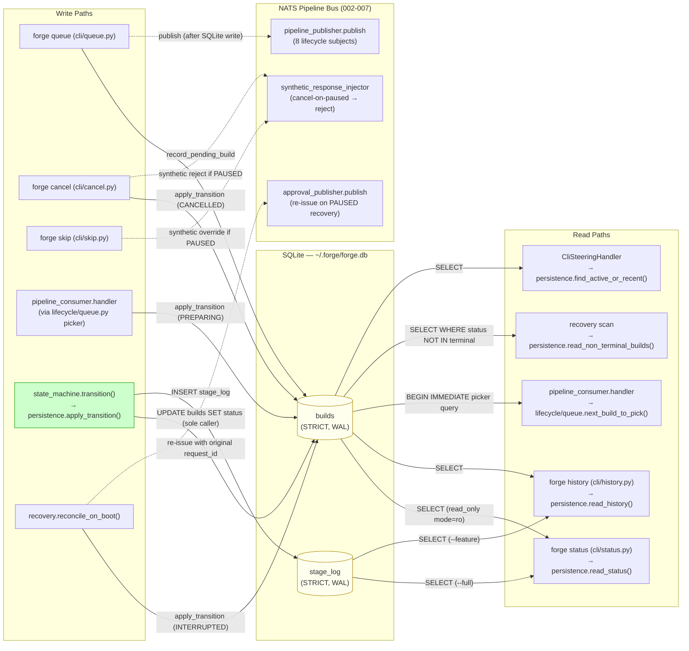
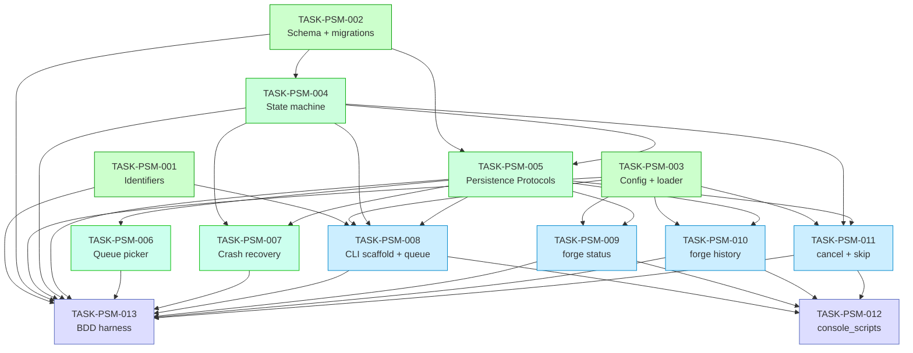

guardkit feature-plan "Pipeline State Machine and Configuration" \
  --context forge/features/pipeline-state-machine-and-configuration/pipeline-state-machine-and-configuration_summary.md \
  --context forge/docs/research/ideas/forge-001-gap-context.md \
  --context forge/docs/design/contracts/API-cli.md \
  --context forge/docs/design/contracts/API-sqlite-schema.md \
  --context forge/docs/design/decisions/DDR-003-sqlite-schema-layout-wal.md

I'll execute the feature-plan workflow for "Pipeline State Machine and Configuration" with the provided context files. Let me start by reading the context files to ground the planning.

Bash Check if context files exist
IN
ls -la features/pipeline-state-machine-and-configuration/ 2>/dev/null; ls -la docs/research/ideas/forge-001-gap-context.md docs/design/contracts/API-cli.md docs/design/contracts/API-sqlite-schema.md docs/design/decisions/DDR-003-sqlite-schema-layout-wal.md 2>/dev/null

OUT
total 40
drwxrwxr-x 2 richardwoollcott richardwoollcott  4096 Apr 24 12:30 .
drwxrwxr-x 9 richardwoollcott richardwoollcott  4096 Apr 25 07:39 ..
-rw-rw-r-- 1 richardwoollcott richardwoollcott  3759 Apr 24 12:30 pipeline-state-machine-and-configuration_assumptions.yaml
-rw-rw-r-- 1 richardwoollcott richardwoollcott 22239 Apr 24 12:30 pipeline-state-machine-and-configuration.feature
-rw-rw-r-- 1 richardwoollcott richardwoollcott  3376 Apr 24 12:30 pipeline-state-machine-and-configuration_summary.md
-rw-rw-r-- 1 richardwoollcott richardwoollcott  8091 Apr 24 12:30 docs/design/contracts/API-cli.md
-rw-rw-r-- 1 richardwoollcott richardwoollcott  8036 Apr 24 12:30 docs/design/contracts/API-sqlite-schema.md
-rw-rw-r-- 1 richardwoollcott richardwoollcott  4175 Apr 24 12:30 docs/design/decisions/DDR-003-sqlite-schema-layout-wal.md
-rw-rw-r-- 1 richardwoollcott richardwoollcott 19531 Apr 27 11:27 docs/research/ideas/forge-001-gap-context.md
Read pipeline-state-machine-and-configuration_summary.md
Read pipeline-state-machine-and-configuration.feature
Read pipeline-state-machine-and-configuration_assumptions.yaml
Read forge-001-gap-context.md
Read API-cli.md
Read API-sqlite-schema.md
Read DDR-003-sqlite-schema-layout-wal.md
I have rich grounding from the context files. The spec is comprehensive (34 scenarios, 5 confirmed assumptions), and the gap-context document explicitly tells me what to reuse vs. build. Let me set up progress tracking and begin the workflow.

Update Todos

Run Context A clarification (review scope)

Check Graphiti availability and load pre-planning context

Create review task via /task-create

Execute /task-review with decision mode

Present decision checkpoint and capture user choice

Run Context B clarification (implementation prefs) if [I]mplement

Generate feature folder, subtasks, IMPLEMENTATION-GUIDE with diagrams

Generate structured feature YAML

Run pre-flight feature validation

Run BDD scenario linking (Step 11)
Now I'll invoke the clarification-questioner agent for Context A (review scope).

Agent:Context A - review scope clarification
IN
Execute clarification for feature planning.

CONTEXT TYPE: review_scope

FEATURE: Pipeline State Machine and Configuration

ESTIMATED COMPLEXITY: 8/10

  This is a backbone feature for the Forge project (FEAT-FORGE-001). The
  spec covers 34 BDD scenarios across 8 groups (key examples, boundaries,
  negatives, edge cases, security, concurrency, data integrity, integration
  boundaries). It introduces a brand-new `src/forge/lifecycle/` package
  (state machine, persistence, queue, recovery, identifiers, schema +
  migrations) and a new `src/forge/cli/` package (queue/status/history/
  cancel/skip), plus a `console_scripts` entry in pyproject.toml. It does
  NOT redesign cancel/skip semantics, NATS adapters, or pipeline
  supervisor — those are owned by sibling features 002–007 and must be
  reused as-is.

  Cross-cutting concerns the review should weigh:
    - SQLite WAL + STRICT durability model (DDR-003)
    - Single-writer / multi-reader concurrency
    - Crash recovery across every non-terminal state
    - Path-traversal validation as a security boundary
    - Sequential per-project queue discipline
    - Write-then-publish failure-mode visibility
    - Reuse of existing Protocols from pipeline/cli_steering.py

CONTEXT FILES PROVIDED:
  - features/pipeline-state-machine-and-configuration/pipeline-state-machine-and-configuration_summary.md
    (feature spec summary, 34 scenarios, 5 confirmed assumptions)
  - docs/research/ideas/forge-001-gap-context.md
    (explicit reuse-vs-build gap analysis with proposed module layout)
  - docs/design/contracts/API-cli.md
    (CLI contract — Click-based, exit codes, command synopsis)
  - docs/design/contracts/API-sqlite-schema.md
    (SQLite DDL, write/read API, recovery semantics)
  - docs/design/decisions/DDR-003-sqlite-schema-layout-wal.md
    (WAL + STRICT decision with rationale)

FLAGS:
  --no-questions: false
  --with-questions: false
  --defaults: false
  --answers: (none)

Ask the user about (use defaults that fit a backbone-feature backlog with
already-confirmed assumptions and a heavy SQLite/state-machine surface):

1. Review focus
   - all (comprehensive)
   - technical (code feasibility / module composition)
   - architecture (state machine, persistence boundary, Protocol contracts)
   - performance (WAL concurrency, watch-mode polling cost)
   - security (path traversal, allowlist, operator audit)
   Default: all

2. Trade-off priority
   - speed (ship the CLI fast)
   - quality (correctness of state machine + crash recovery)
   - cost (minimal new modules)
   - maintainability (boundaries, testability)
   - balanced
   Default: quality (this is the durable lifecycle backbone — recovery
   bugs here corrupt the build history)

3. Specific concerns to address (optional free-text)
   - e.g. "make sure the state machine is the SOLE caller of
     persistence writes that mutate builds.state"
   - e.g. "validate the write-then-publish failure path by hand"

Return ClarificationContext with review preferences, including any
free-text concerns under the "specific_concerns" key.
Read forge-001-gap-context.md
Read DDR-003-sqlite-schema-layout-wal.md
The clarification agent is asking me three questions. I need to relay these to the user and wait for their answers. Let me present them now.

The clarification-questioner is paused waiting for your input on the review scope. Three questions:

Q1 — Review focus (default: A — all)

A — All (comprehensive, all eight scenario groups)
B — Technical (code feasibility / module composition)
C — Architecture (state machine, persistence boundary, Protocol contracts)
D — Performance (WAL concurrency, watch-mode polling)
E — Security (path traversal, allowlist, operator audit)
Q2 — Trade-off priority (default: Q — quality)

Q — Quality (state machine correctness, crash recovery — corruption risk)
S — Speed (ship CLI fast)
C — Cost (minimise net-new modules)
M — Maintainability (clean boundaries, Protocol seams)
B — Balanced
Q3 — Specific concerns (optional free-text, press Enter to skip)

Examples the agent suggested:

"Confirm state_machine.py is the SOLE caller of writes mutating builds.state"
"Validate write-then-publish failure: SQLite row must survive NATS timeout"
"Check identifiers.py rejects URL-encoded %2F/%2E%2E and null bytes"
"Verify PAUSED recovery doesn't duplicate request_id when re-publishing approval"
Please reply with your answers (e.g. A, Q, <concern text or skip>), and I'll forward them to the clarification agent and continue.

command-history.md
accept defaults and suggesstions for Q3
Forwarding your answers to the clarification agent.

Agent:Send Context A answers
IN
Continuing prior conversation (agentId a348d1362f8693bdf).

Answers:

Q1 (Review focus): A — All (default)

Q2 (Trade-off priority): Q — Quality (default)

Q3 (Specific concerns): User accepted ALL four of your suggested concerns
verbatim. Record them as the specific_concerns:

  1. Confirm state_machine.py is the SOLE caller of any persistence
     write that mutates builds.state — no CLI command may write status
     directly.

  2. Validate the write-then-publish failure path: the SQLite row must
     survive a NATS timeout and remain visible as QUEUED.

  3. Check that identifiers.py rejects not just "../" but also
     URL-encoded variants (%2F, %2E%2E) and null bytes.

  4. Verify crash recovery handles PAUSED correctly — re-publishing the
     approval request must not duplicate the original request_id.

Return the final ClarificationContext with these answers.
Read forge-build-plan.md
Context A captured. Now updating todos and moving to Step 2.5 (Graphiti pre-planning context).

Update Todos

Run Context A clarification (review scope)

Check Graphiti availability and load pre-planning context

Create review task via /task-create

Execute /task-review with decision mode

Present decision checkpoint and capture user choice

Run Context B clarification (implementation prefs) if [I]mplement

Generate feature folder, subtasks, IMPLEMENTATION-GUIDE with diagrams

Generate structured feature YAML

Run pre-flight feature validation

Run BDD scenario linking (Step 11)
The Graphiti MCP tools were listed as deferred at session start. Loading them per the protocol.

Querying Graphiti for similar features, architecture context, and past outcomes in parallel.

Graphiti [search_nodes]Pipeline State Machine and Configuration…
OUT
{"result":{"message":"Nodes retrieved successfully","nodes":[{"uuid":"c3a04be0-b56b-4aca-90b8-673fbafd5e19","name":"forge-pipeline-architecture.md","labels":["Entity","Document"],"created_at":"2026-04-15T20:13:55.164214+00:00","summary":"Anchor v2.1 is internally sound but silent on Jarvis and specialist-agent dual-role deployment. Key findings: missing payloads in nats-core, need for doc alignment tasks, surgical refactor plan for specialist-agent, and four draft ADRs (SP-014/015/016/017) added to anchor.","group_id":"architecture_decisions","attributes":{}},{"uuid":"cfa85ef2-19e0-4a0a-bbe3-845de5b36bb0","name":"pipeline-state KV bucket","labels":["Entity","Object"],"created_at":"2026-04-15T20:13:55.164395+00:00","summary":"Decision deferred to TASK-PSKV-001.","group_id":"architecture_decisions","attributes":{}},{"uuid":"42850b78-ca52-453c-981d-b702af555bc7","name":"forge-pipeline-orchestrator-refresh.md","labels":["Entity","Document"],"created_at":"2026-04-15T20:13:55.164338+00:00","summary":"Document discussing Forge pipeline architecture, part of v2.1 anchor, reviewed as READY TO START PHASE 1 AFTER APPLYING CORRECTIONS. Recommendations applied: updated D38 title, annotated retired payloads, updated pipeline event comparison table, tightened PM Adapter phrasing.","group_id":"architecture_decisions","attributes":{}},{"uuid":"e5a33162-2b5b-46a3-8283-de4df066ad3a","name":"Forge","labels":["Entity","Organization"],"created_at":"2026-04-15T20:13:55.164262+00:00","summary":"Forge is a project with architectural reviews and tasks for doc alignment, NATS-core updates, and specialist-agent refactoring. Key decisions involve adopting singular conventions for NATS topics and resolving dual-role deployment issues.","group_id":"architecture_decisions","attributes":{}},{"uuid":"67394116-dd52-4a42-8604-f9d252a2c879","name":"FEAT-001: Foundation (types, LLM client, criteria)","labels":["Entity","Object"],"created_at":"2026-04-07T09:36:04.349442+00:00","summary":"Foundation feature (FEAT-001) covers types, LLM client, criteria; no dependencies, medium complexity, day 1 build.","group_id":"architecture_decisions","attributes":{}},{"uuid":"c176936e-2b9a-456f-a7ce-7b012739dec9","name":".guardkit/worktrees/FEAT-XXX/.guardkit/autobuild/TASK-XXX/","labels":["Entity"],"created_at":"2026-03-04T17:44:50.887530+00:00","summary":"In feature mode, .guardkit/worktrees/FEAT-XXX/.guardkit/autobuild/TASK-XXX/ stores task artifacts; FEAT-XXX identifies the shared worktree, TASK-XXX identifies per-task subdirectories. Using TASK-XXX for worktree paths causes FileNotFoundError.","group_id":"architecture_decisions","attributes":{}},{"uuid":"e3cc439c-b87a-4501-ba9c-6d1532b03d22","name":"forge","labels":["Entity","Organization"],"created_at":"2026-04-15T20:07:02.363690+00:00","summary":"Forge manages specialist-agent deployments for roles like Product Owner and Architect. It calls distinct agents based on --role flag, ensuring independent fleet registration and uniform result shapes. Completed TASK-REV-A1F2 review identified corrections needed for dual-role deployment and doc alignment. Fleet-wide architecture decisions are shared in the 'architecture_decisions' group.","group_id":"architecture_decisions","attributes":{}},{"uuid":"737fe509-3611-4b1f-a0d3-495a8fad74ed","name":"CLI","labels":["Entity","Object"],"created_at":"2026-04-07T09:42:45.074282+00:00","summary":"Command Line Interface (CLI) for AutoBuild with Click subcommands: greenfield, runs architecture session with specified parameters.","group_id":"architecture_decisions","attributes":{}},{"uuid":"f9aeed7f-51b3-44db-a711-02a683834d2b","name":"forge-build-plan.md","labels":["Entity","Document"],"created_at":"2026-04-15T20:13:55.164323+00:00","summary":"forge-build-plan.md is one of the Forge repo docs that precedes v2.1 and carries pre-v2.1 framing. 4 doc-alignment tasks created for updating it.","group_id":"architecture_decisions","attributes":{}},{"uuid":"9ae7190b-630c-4bcc-92db-4a9e7a112508","name":"feature-build","labels":["Entity"],"created_at":"2026-03-04T17:44:50.887384+00:00","summary":"feature-build uses FEAT-XXX worktree ID in shared worktrees, invokes /task-work via SDK query() (not subprocess), and requires real /task-work --design-only pre-loop to generate implementation_plan.md, rejecting mock data stubs.","group_id":"architecture_decisions","attributes":{}}]}}
Graphiti [search_memory_facts]Pipeline State Machine FEAT-FORGE-001 li…
OUT
{"result":{"message":"Facts retrieved successfully","facts":[{"uuid":"d010bb6c-9c7e-4323-ae5f-1416070a8477","group_id":"guardkit__task_outcomes","source_node_uuid":"a5da1a41-42ec-46ff-9538-eac0144fa87d","target_node_uuid":"c748e34f-f89d-4808-b171-52653bd2b333","created_at":"2026-04-16T11:11:24.685084Z","name":"BUILDS","fact":"The build_manifest_for_role function builds manifests for the manifest.py file.","episodes":["562fda4b-b5bb-4571-ae30-2901d0059715"],"expired_at":null,"valid_at":"2026-04-16T11:08:54Z","invalid_at":null,"attributes":{}},{"uuid":"526081ba-2661-4dcc-9ca8-9dbd05b12f3f","group_id":"guardkit__task_outcomes","source_node_uuid":"cf58a241-d3ad-45a1-aef8-54b43ed2f4bf","target_node_uuid":"716ca812-5b8d-4c4b-80b7-3ca5bbf91ea4","created_at":"2026-04-16T18:56:13.367085Z","name":"DEFERRED_TO","fact":"The detailed documentation and ADR work related to the pipeline-state NATS KV bucket was deferred to the forge repo.","episodes":["f0135490-6df7-40a2-89a6-02da5b34a1a2"],"expired_at":null,"valid_at":"2026-04-16T18:54:46Z","invalid_at":null,"attributes":{}},{"uuid":"2fc8c64d-c2f3-4ce8-bf16-d229dd9aad8d","group_id":"guardkit__task_outcomes","source_node_uuid":"dd13271d-eb14-4a1b-bed8-576deb16ca5c","target_node_uuid":"b41b8283-2c29-4a7e-9d96-6c61087d15f1","created_at":"2026-04-22T09:51:50.272618Z","name":"INCLUDED_TASK","fact":"FEAT-POR-EXT shipped the model and consolidated-markdown enrichment which included work from TASK-PEX-001.","episodes":["a17b090c-ca6d-4d7e-8f5d-a17486dba394"],"expired_at":null,"valid_at":null,"invalid_at":null,"attributes":{}},{"uuid":"721665e0-fe84-4200-9b12-6650b27276dd","group_id":"guardkit__task_outcomes","source_node_uuid":"30245dfe-9d45-4e8c-9d1f-90b7e83ee6de","target_node_uuid":"f0a02547-50c9-46ff-be71-65544feddbf2","created_at":"2026-04-25T06:02:57.914599Z","name":"IS_GATED_BY","fact":"Preserved rendered CoachValidator prompts and full SDK message streams are gated by the environment variable GUARDKIT_AUTOBUILD_PRESERVE_DEBUG.","episodes":["ea3f6f49-4cc2-42c3-948d-c849762ca131"],"expired_at":null,"valid_at":"2026-04-25T06:01:50.196535Z","invalid_at":null,"attributes":{}},{"uuid":"c3c0a7f4-2d14-4c53-a550-3d1747131629","group_id":"guardkit__task_outcomes","source_node_uuid":"9ab1ac56-c831-400c-aeaa-e572c094a65c","target_node_uuid":"82767bb7-33ea-4db8-a1de-0ba3ed6ecb70","created_at":"2026-04-12T08:20:35.997955Z","name":"UNTRACKED_BY","fact":"autobuild state files are untracked by .gitignore","episodes":["b807843f-91b3-41a7-983e-62c8b496359d"],"expired_at":"2026-04-12T08:33:38.019498Z","valid_at":"2026-04-12T08:18:32Z","invalid_at":"2026-04-12T08:31:23Z","attributes":{}},{"uuid":"f82bd5de-e8a7-4f09-91d2-cfbb46b25081","group_id":"guardkit__task_outcomes","source_node_uuid":"cf58a241-d3ad-45a1-aef8-54b43ed2f4bf","target_node_uuid":"b3cb5641-c895-4734-b90a-723a9aafd81d","created_at":"2026-04-16T18:56:13.367010Z","name":"DECIDED_TO_KEEP","fact":"The pipeline-state NATS KV bucket was decided to be kept as-is without any infrastructure changes in the nats-infrastructure.","episodes":["f0135490-6df7-40a2-89a6-02da5b34a1a2"],"expired_at":null,"valid_at":"2026-04-16T18:54:46Z","invalid_at":null,"attributes":{}},{"uuid":"73b61922-99ed-4af8-8e70-09e947375f55","group_id":"guardkit__task_outcomes","source_node_uuid":"0dbbcc6f-7db5-475b-802a-68b06a40f078","target_node_uuid":"f0a02547-50c9-46ff-be71-65544feddbf2","created_at":"2026-04-25T06:02:57.914591Z","name":"IS_GATED_BY","fact":"Preserved rendered Coach prompts and full SDK message streams are gated by the environment variable GUARDKIT_AUTOBUILD_PRESERVE_DEBUG.","episodes":["ea3f6f49-4cc2-42c3-948d-c849762ca131"],"expired_at":null,"valid_at":"2026-04-25T06:01:50.196535Z","invalid_at":null,"attributes":{}},{"uuid":"d005633c-c0eb-4830-932f-9ebd26027772","group_id":"guardkit__task_outcomes","source_node_uuid":"2062c52f-74ca-43fc-a144-8536326cc29c","target_node_uuid":"01331654-18e8-4646-bbaf-691801301205","created_at":"2026-04-12T10:05:14.855933Z","name":"WIRING_TARGET","fact":"The CLI is a wiring target for the RoleConfig loader in the implementation of FEAT-008.","episodes":["d28384b7-4a3a-4637-a797-9ca1d3839968"],"expired_at":"2026-04-17T06:45:09.893306Z","valid_at":"2026-04-12T09:59:59Z","invalid_at":"2026-04-17T00:00:00Z","attributes":{}},{"uuid":"e71657a5-ea15-440e-ab88-dbe621a058d3","group_id":"guardkit__task_outcomes","source_node_uuid":"2cb4e7f8-7758-4514-ac8b-0614c3e3988a","target_node_uuid":"cc4c31b0-a302-42db-bc77-ede8b9b7109b","created_at":"2026-04-10T11:51:35.426025Z","name":"MENTIONS","fact":"FEAT-011 is mentioned in the context of phase3-build-plan.md.","episodes":["dd8b9a1b-4e84-4753-b6d8-b87a0d63ecec"],"expired_at":null,"valid_at":"2026-04-10T11:49:48Z","invalid_at":null,"attributes":{}},{"uuid":"41f96216-6ff0-49de-a108-d264831b506e","group_id":"guardkit__task_outcomes","source_node_uuid":"edc52d46-6bea-493b-9d84-23ca58c191da","target_node_uuid":"c46c2fea-f829-439c-8b2f-0fb77ac8393a","created_at":"2026-04-25T06:18:54.333789Z","name":"IS_PRODUCED_BY","fact":"Checkpoints are produced by the autobuild.py module.","episodes":["ff2b4658-4afe-49ec-8f08-960fa8dac631"],"expired_at":null,"valid_at":"2026-04-25T06:16:58.683282Z","invalid_at":null,"attributes":{}},{"uuid":"64b4faa0-ef5f-4fe0-81d2-004adbe59f48","group_id":"guardkit__project_decisions","source_node_uuid":"58a07bd3-9ddf-4b20-8781-3866cceeff7b","target_node_uuid":"7925d358-b90e-4932-8a99-92b1fa1f8b17","created_at":"2026-04-17T16:54:07.449059Z","name":"BUILDS","fact":"_dispatch_explicit_mode builds \"Unknown mode\" error messages.","episodes":["4307d3c6-035b-4080-af15-47db905e9a35"],"expired_at":null,"valid_at":null,"invalid_at":null,"attributes":{}},{"uuid":"90211703-7913-4aec-bac1-607669f363da","group_id":"guardkit__project_decisions","source_node_uuid":"d10e4d0e-6ba9-485b-bb4d-3c8e3fa740b2","target_node_uuid":"34d7d322-16cc-4e0d-bb57-53a360ebbaec","created_at":"2026-04-21T06:55:47.401972Z","name":"CONTRIBUTED_TO","fact":"A \"regenerate from scratch\" rule for schema violations added in PEX-019 contributed to PEX-020's observed failure when it was misapplied by the Player.","episodes":["1955f874-cfd3-48c7-894f-e6d276cc5c5f"],"expired_at":null,"valid_at":null,"invalid_at":null,"attributes":{}},{"uuid":"3cb8028b-8592-4a28-9b67-601ccb0a60ff","group_id":"guardkit__project_decisions","source_node_uuid":"a3e0d713-0f97-4678-9d8d-9eb8f2fda9eb","target_node_uuid":"78b2692a-aad5-4c8f-b0d7-6bb517ef2f64","created_at":"2026-04-16T18:38:56.509043Z","name":"WATCHES_PIPELINE_STATE","fact":"Jarvis watches the pipeline-state NATS KV bucket for live Forge status.","episodes":["435b247a-12cf-4d1a-87f7-fe0dadbedb13"],"expired_at":null,"valid_at":"2026-04-16T18:37:50Z","invalid_at":null,"attributes":{}},{"uuid":"ecb2c148-c6b4-499d-9ab1-72e4b8ab2876","group_id":"guardkit__project_decisions","source_node_uuid":"fdad8aaf-f2aa-43f4-ad2e-0a7e8b2b489d","target_node_uuid":"7d678eb4-b6f1-49e9-8ee9-dc3e7eccfcb6","created_at":"2026-04-21T12:06:44.862140Z","name":"FAILED","fact":"FEAT-POR-EXT failed on its first smoke gate run with 129 ProductRoadmap.model_validate errors.","episodes":["46108d15-b3ca-4546-b81c-a08035e14d40"],"expired_at":null,"valid_at":null,"invalid_at":null,"attributes":{}},{"uuid":"83341cf1-91dd-4733-883b-79f0eb592906","group_id":"guardkit__project_decisions","source_node_uuid":"4893fcd2-2dd3-4d67-b50f-a53f2b4b4739","target_node_uuid":"78b2692a-aad5-4c8f-b0d7-6bb517ef2f64","created_at":"2026-04-16T18:38:56.508951Z","name":"NEEDS_LIVE_VISIBILITY","fact":"specialist-agent needs live cross-process visibility into the pipeline-state NATS KV bucket.","episodes":["435b247a-12cf-4d1a-87f7-fe0dadbedb13"],"expired_at":null,"valid_at":"2026-04-16T18:37:50Z","invalid_at":null,"attributes":{}},{"uuid":"a522f14e-d2f7-47b2-82ae-2b1b75297ee1","group_id":"guardkit__project_decisions","source_node_uuid":"cfe4feb4-5770-4ad8-92f4-e078daa4b3f5","target_node_uuid":"95d5a8f4-b9b2-4be8-bb08-75796607ed02","created_at":"2026-04-25T06:50:32.716708Z","name":"USED_TO_ACQUIRE_CLIENT","fact":"The CLI subcommand 'guardkit graphiti capture-outcome' previously acquired its client via '_get_client_and_config()' function.","episodes":["df9c6340-7d40-48a3-ba83-2f05577345c7"],"expired_at":"2026-04-25T06:50:36.717644Z","valid_at":"2026-04-25T06:47:15.969667Z","invalid_at":"2026-04-25T06:47:15.969667Z","attributes":{}},{"uuid":"125b50bd-d944-4d3c-8222-99f4306d92f7","group_id":"guardkit__project_decisions","source_node_uuid":"48959d3e-95e2-4134-b2c3-eb623a0e25bc","target_node_uuid":"14e4bbff-120e-42b4-95b5-121c688e20cb","created_at":"2026-04-24T13:00:28.396740Z","name":"INVOLVES","fact":"FEAT-FORGE-002 involves TASK-REV-E4F5.","episodes":["932dcd2f-0a1a-4b29-b614-2f83b7cd59a8"],"expired_at":null,"valid_at":"2026-04-24T12:57:38.513809Z","invalid_at":null,"attributes":{}},{"uuid":"6dc6d0e7-b915-42de-b6f2-b8c0288da636","group_id":"guardkit__project_decisions","source_node_uuid":"bcd4c8fd-63d8-4820-b58b-b91fc1b668e3","target_node_uuid":"78b2692a-aad5-4c8f-b0d7-6bb517ef2f64","created_at":"2026-04-16T18:38:56.509075Z","name":"IS_JETSTREAM_NATIVE","fact":"Forge is JetStream-native and retains its runtime state in messaging resident.","episodes":["435b247a-12cf-4d1a-87f7-fe0dadbedb13"],"expired_at":null,"valid_at":"2026-04-16T18:37:50Z","invalid_at":null,"attributes":{}},{"uuid":"c3940af7-fa7e-428e-8100-baeeb828e72c","group_id":"guardkit__project_decisions","source_node_uuid":"9dffc110-32df-4c4d-8079-443611c5f9a8","target_node_uuid":"fdad8aaf-f2aa-43f4-ad2e-0a7e8b2b489d","created_at":"2026-04-21T07:28:37.375302Z","name":"SUCCESSOR_OF","fact":"FEAT-POR-EXT-v2 is planned to contain the redesign of Phase B from FEAT-POR-EXT.","episodes":["0e77320c-9250-4ea1-8789-57f82ebf6f7f"],"expired_at":null,"valid_at":null,"invalid_at":null,"attributes":{}},{"uuid":"98d997b6-7f6f-4c58-9e3c-55310f161c1c","group_id":"guardkit__project_decisions","source_node_uuid":"f9a66d8c-278b-4718-a6e9-8dc5e1c8a459","target_node_uuid":"abad4a1b-39b6-4859-938e-0231217d654d","created_at":"2026-04-10T12:14:30.775929Z","name":"CONTEXT_OF","fact":"assumption_confirmation_checkpoint() is part of the architectural decision for FEAT-012 assumption confirmation checkpoint (DDR-004) in task TASK-6B3F (RC-2).","episodes":["75e19e35-0ff5-4540-a2d9-376d3e7a3141"],"expired_at":null,"valid_at":"2026-04-10T12:12:54.567441Z","invalid_at":null,"attributes":{}},{"uuid":"51406c57-0a5c-4e53-8a97-c8717454d4d2","group_id":"architecture_decisions","source_node_uuid":"67394116-dd52-4a42-8604-f9d252a2c879","target_node_uuid":"795e4990-ac91-4ddc-8d34-22e0417abe66","created_at":"2026-04-07T09:41:24.344501Z","name":"DEPENDENCY","fact":"FEAT-001: Foundation (types, LLM client, criteria) is part of the module layout under prompts/","episodes":["65f18e38-97ce-402c-b78a-3a12742c14ca"],"expired_at":null,"valid_at":"2026-04-07T09:35:15.847167Z","invalid_at":null,"attributes":{}},{"uuid":"d72696d5-5dbb-4698-a50b-76846a3dd799","group_id":"architecture_decisions","source_node_uuid":"42850b78-ca52-453c-981d-b702af555bc7","target_node_uuid":"e3cc439c-b87a-4501-ba9c-6d1532b03d22","created_at":"2026-04-15T20:18:23.494254Z","name":"MENTIONS_PROJECT","fact":"The forge-pipeline-orchestrator-refresh.md document is part of the forge project.","episodes":["9cca01d3-321c-4816-b1f9-65810affacc0"],"expired_at":null,"valid_at":"2026-04-15T00:00:00Z","invalid_at":null,"attributes":{}},{"uuid":"7a508d18-eabc-48c6-b27c-d92e6586e4f8","group_id":"architecture_decisions","source_node_uuid":"e3cc439c-b87a-4501-ba9c-6d1532b03d22","target_node_uuid":"c3a04be0-b56b-4aca-90b8-673fbafd5e19","created_at":"2026-04-15T20:18:23.494123Z","name":"HAS_VERDICT","fact":"The anchor document forge-pipeline-architecture.md has a verdict of READY TO START PHASE 1 AFTER APPLYING CORRECTIONS.","episodes":["9cca01d3-321c-4816-b1f9-65810affacc0"],"expired_at":null,"valid_at":"2026-04-15T00:00:00Z","invalid_at":null,"attributes":{}},{"uuid":"9a9473fd-31c0-4be9-b7e5-5689ef66a840","group_id":"architecture_decisions","source_node_uuid":"67394116-dd52-4a42-8604-f9d252a2c879","target_node_uuid":"94d7f98c-99c0-4092-8f82-41da081dd4ab","created_at":"2026-04-07T09:41:24.344470Z","name":"DEPENDENCY","fact":"FEAT-001: Foundation (types, LLM client, criteria) is part of the module layout under src/architect_agent/","episodes":["65f18e38-97ce-402c-b78a-3a12742c14ca"],"expired_at":null,"valid_at":"2026-04-07T09:35:15.847167Z","invalid_at":null,"attributes":{}},{"uuid":"29c75c9f-979e-41b1-82bf-0a8fdca8d9ae","group_id":"architecture_decisions","source_node_uuid":"c3a04be0-b56b-4aca-90b8-673fbafd5e19","target_node_uuid":"e3cc439c-b87a-4501-ba9c-6d1532b03d22","created_at":"2026-04-15T20:18:23.494168Z","name":"MENTIONS_PROJECT","fact":"The document forge-pipeline-architecture.md is part of the forge project.","episodes":["9cca01d3-321c-4816-b1f9-65810affacc0"],"expired_at":null,"valid_at":"2026-04-15T00:00:00Z","invalid_at":null,"attributes":{}},{"uuid":"01dfc6e2-3516-417d-aec0-a1aaf04c66f0","group_id":"architecture_decisions","source_node_uuid":"e3cc439c-b87a-4501-ba9c-6d1532b03d22","target_node_uuid":"e5a33162-2b5b-46a3-8283-de4df066ad3a","created_at":"2026-04-15T20:18:23.494227Z","name":"HAS_VERDICT","fact":"The Forge organization has a pipeline architecture document that is internally sound but silent on certain aspects.","episodes":["9cca01d3-321c-4816-b1f9-65810affacc0"],"expired_at":null,"valid_at":"2026-04-15T00:00:00Z","invalid_at":null,"attributes":{}},{"uuid":"e1794ba2-8112-4529-9fbc-ae52b1506ceb","group_id":"architecture_decisions","source_node_uuid":"14069ebc-8d39-4c42-8363-9021a264b445","target_node_uuid":"b3fa9fd2-f0e0-4be8-bbaf-70db175ab1dc","created_at":"2026-04-15T20:12:14.798097Z","name":"ADOPTS_CONVENTION","fact":"forge repo docs adopt the singular convention for agents.result.{agent_id}","episodes":["e0d1adb8-ba3a-49ae-bc32-8c14baa706a0"],"expired_at":null,"valid_at":"2026-04-15T20:10:13Z","invalid_at":null,"attributes":{}},{"uuid":"fcdc6f79-46fa-40e3-aa1f-29916eebac58","group_id":"architecture_decisions","source_node_uuid":"c3a04be0-b56b-4aca-90b8-673fbafd5e19","target_node_uuid":"8460debf-3ad9-4b0c-9dee-d99cf210d824","created_at":"2026-04-15T20:18:23.494305Z","name":"HAS_VERDICT","fact":"The architectural comprehensive review (TASK-REV-A1F2) concluded that the forge-pipeline-architecture.md document is ready to start Phase 1 after applying corrections.","episodes":["9cca01d3-321c-4816-b1f9-65810affacc0"],"expired_at":null,"valid_at":"2026-04-15T20:13:04.985556Z","invalid_at":null,"attributes":{}},{"uuid":"9cafe731-c65b-49b6-99aa-59618fef3706","group_id":"architecture_decisions","source_node_uuid":"e3cc439c-b87a-4501-ba9c-6d1532b03d22","target_node_uuid":"42850b78-ca52-453c-981d-b702af555bc7","created_at":"2026-04-15T20:18:23.494249Z","name":"HAS_VERDICT","fact":"The forge-pipeline-orchestrator-refresh.md document is outdated and requires alignment with v2.1.","episodes":["9cca01d3-321c-4816-b1f9-65810affacc0"],"expired_at":"2026-04-16T17:15:00.952397Z","valid_at":"2026-04-15T00:00:00Z","invalid_at":"2026-04-16T17:13:11Z","attributes":{}},{"uuid":"3d39b7d4-ddc2-4947-a9bd-4b974ba5f86b","group_id":"architecture_decisions","source_node_uuid":"e3cc439c-b87a-4501-ba9c-6d1532b03d22","target_node_uuid":"f9aeed7f-51b3-44db-a711-02a683834d2b","created_at":"2026-04-15T20:18:23.494238Z","name":"HAS_VERDICT","fact":"The forge-build-plan.md document is outdated and requires alignment with v2.1.","episodes":["9cca01d3-321c-4816-b1f9-65810affacc0"],"expired_at":null,"valid_at":"2026-04-15T00:00:00Z","invalid_at":null,"attributes":{}}]}}
Displaying Graphiti context and updating todos.

Update Todos

Run Context A clarification (review scope)

Check Graphiti availability and load pre-planning context

Create review task via /task-create

Execute /task-review with decision mode

Present decision checkpoint and capture user choice

Run Context B clarification (implementation prefs) if [I]mplement

Generate feature folder, subtasks, IMPLEMENTATION-GUIDE with diagrams

Generate structured feature YAML

Run pre-flight feature validation

Run BDD scenario linking (Step 11)

[Graphiti] Feature context loaded: 8 items
  - Similar features: 1 (FEAT-FORGE-002 + sibling 003-007 already in flight)
  - Architecture context: 5
      • Forge IS_JETSTREAM_NATIVE — runtime state in messaging resident
      • Jarvis watches the `pipeline-state` NATS KV bucket for live status
      • specialist-agent needs live visibility into pipeline-state KV
      • forge-pipeline-architecture.md is the v2.1 anchor (Phase 1 ready)
      • Singular naming: `agents.result.{agent_id}` adopted in forge repo
  - Past outcomes: 2
      • TASK-PSKV-001 (pipeline-state KV bucket) DEFERRED — not part of FEAT-FORGE-001
      • PEX-019 cautionary tale: "regenerate from scratch" rules can misfire
These items confirm the gap-context document's reuse boundaries — particularly that pipeline-state NATS KV is a separate concern owned elsewhere. Now creating the review task.

task-create skill
Checking the tasks directory layout and generating a hash-based task ID.

Bash Check tasks directory and python availability
IN
ls -la tasks/ 2>/dev/null || echo "no tasks/ dir yet"; ls -la .guardkit/ 2>/dev/null || echo "no .guardkit/ dir"; which python3 && python3 --version

OUT
total 24
drwxrwxr-x  6 richardwoollcott richardwoollcott 4096 Apr 25 15:18 .
drwxrwxr-x 12 richardwoollcott richardwoollcott 4096 Apr 26 18:32 ..
drwxrwxr-x  9 richardwoollcott richardwoollcott 4096 Apr 27 10:48 backlog
drwxrwxr-x 16 richardwoollcott richardwoollcott 4096 Apr 24 12:30 completed
drwxrwxr-x  2 richardwoollcott richardwoollcott 4096 Apr 27 10:48 design_approved
drwxrwxr-x  6 richardwoollcott richardwoollcott 4096 Apr 25 16:02 in_review
total 764
drwxrwxr-x  7 richardwoollcott richardwoollcott   4096 Apr 27 10:48 .
drwxrwxr-x 12 richardwoollcott richardwoollcott   4096 Apr 26 18:32 ..
drwxrwxr-x 80 richardwoollcott richardwoollcott   4096 Apr 26 19:42 autobuild
drwxrwxr-x  2 richardwoollcott richardwoollcott   4096 Apr 27 10:48 bdd
-rw-rw-r--  1 richardwoollcott richardwoollcott    283 Apr 27 10:48 bootstrap_state.json
-rw-rw-r--  1 richardwoollcott richardwoollcott   4499 Apr 24 12:30 context-manifest.yaml
drwxrwxr-x  2 richardwoollcott richardwoollcott   4096 Apr 25 16:21 features
-rw-rw-r--  1 richardwoollcott richardwoollcott 729635 Apr 26 19:57 graphiti-query-log.jsonl
-rw-rw-r--  1 richardwoollcott richardwoollcott   3706 Apr 24 12:30 graphiti.yaml
drwxrwxr-x  2 richardwoollcott richardwoollcott   4096 Apr 24 12:30 seeding
drwxrwxr-x  3 richardwoollcott richardwoollcott   4096 Apr 27 10:48 worktrees
/usr/bin/python3
Python 3.12.3
Bash Check existing tasks and features
IN
ls tasks/backlog/ | head -20; echo "---"; ls .guardkit/features/ 2>/dev/null; echo "---"; ls -la ~/.agentecflow/bin/ 2>/dev/null | head -30

OUT
confidence-gated-checkpoint-protocol
forge-v2-doc-alignment
guardkit-command-invocation-engine
infrastructure-coordination
mode-a-greenfield-end-to-end
nats-fleet-integration
specialist-agent-delegation
TASK-CGCP-001-define-gating-module-structure.md
TASK-CGCP-002-add-approval-config.md
TASK-CGCP-003-request-id-derivation-helper.md
TASK-CGCP-012-bdd-scenario-task-linking.md
TASK-GCI-001-define-guardkit-result-models.md
TASK-GCI-002-define-git-and-progress-event-models.md
TASK-IC-003-write-ordering-guard.md
TASK-IC-009-test-verification-via-execute.md
TASK-MAG7-001-define-stage-taxonomy.md
TASK-MAG7-002-define-forward-propagation-map.md
TASK-NFI-001-extend-forge-config-fleet-pipeline-sections.md
TASK-NFI-002-define-forge-manifest-constant.md
TASK-REV-CG44-plan-confidence-gated-checkpoint-protocol.md
---
FEAT-8D10.yaml
FEAT-CBDE.yaml
FEAT-FORGE-002.yaml
FEAT-FORGE-003.yaml
FEAT-FORGE-004.yaml
FEAT-FORGE-005.yaml
---
total 56
drwxrwxr-x  2 richardwoollcott richardwoollcott  4096 Apr 26 08:36 .
drwxrwxr-x 15 richardwoollcott richardwoollcott  4096 Apr 26 08:36 ..
lrwxrwxrwx  1 richardwoollcott richardwoollcott    97 Apr 26 08:36 agent-enhance -> /home/richardwoollcott/Projects/appmilla_github/guardkit/installer/core/commands/agent-enhance.py
lrwxrwxrwx  1 richardwoollcott richardwoollcott    96 Apr 26 08:36 agent-format -> /home/richardwoollcott/Projects/appmilla_github/guardkit/installer/core/commands/agent-format.py
lrwxrwxrwx  1 richardwoollcott richardwoollcott    98 Apr 26 08:36 agent-validate -> /home/richardwoollcott/Projects/appmilla_github/guardkit/installer/core/commands/agent-validate.py
lrwxrwxrwx  1 richardwoollcott richardwoollcott   109 Apr 26 08:36 feature-plan-bdd-link -> /home/richardwoollcott/Projects/appmilla_github/guardkit/installer/core/commands/lib/feature_plan_bdd_link.py
lrwxrwxrwx  1 richardwoollcott richardwoollcott   109 Apr 26 08:36 generate-feature-yaml -> /home/richardwoollcott/Projects/appmilla_github/guardkit/installer/core/commands/lib/generate_feature_yaml.py
lrwxrwxrwx  1 richardwoollcott richardwoollcott    48 Apr 26 08:36 gk -> /home/richardwoollcott/.agentecflow/bin/guardkit
lrwxrwxrwx  1 richardwoollcott richardwoollcott    53 Apr 26 08:36 gki -> /home/richardwoollcott/.agentecflow/bin/guardkit-init
-rwxrwxr-x  1 richardwoollcott richardwoollcott   872 Apr 26 08:36 graphiti-check
lrwxrwxrwx  1 richardwoollcott richardwoollcott   105 Apr 26 08:36 graphiti-diagnose -> /home/richardwoollcott/Projects/appmilla_github/guardkit/installer/core/commands/lib/graphiti_diagnose.py
-rwxrwxr-x  1 richardwoollcott richardwoollcott 12922 Apr 26 08:36 guardkit
-rwxrwxr-x  1 richardwoollcott richardwoollcott  2063 Apr 26 08:36 guardkit-init
Bash Locate id_generator helper
IN
find ~/.agentecflow -type f -name "id_generator*" 2>/dev/null; find ~/Projects/appmilla_github/guardkit -type f -name "id_generator*" 2>/dev/null | head -5

OUT
/home/richardwoollcott/.agentecflow/commands/lib/id_generator.py
/home/richardwoollcott/.agentecflow/commands/lib/__pycache__/id_generator.cpython-312.pyc
/home/richardwoollcott/Projects/appmilla_github/guardkit/installer/core/lib/id_generator.py
/home/richardwoollcott/Projects/appmilla_github/guardkit/installer/core/lib/__pycache__/id_generator.cpython-312.pyc
/home/richardwoollcott/Projects/appmilla_github/guardkit/.guardkit/worktrees/TASK-GLI-004/installer/core/lib/id_generator.py
Bash Generate review task ID using guardkit id_generator
IN
python3 -c "
import sys
sys.path.insert(0, '/home/richardwoollcott/.agentecflow/commands/lib')
from id_generator import generate_task_id, validate_task_id, check_duplicate
tid = generate_task_id(prefix='REV')
print('Generated:', tid)
print('Valid:', validate_task_id(tid))
print('Duplicate path:', check_duplicate(tid))
"

OUT
Generated: TASK-REV-3EEE
Valid: True
Duplicate path: None
Read TASK-REV-CG44-plan-confidence-gated-checkpoint-protocol.md
Write TASK-REV-3EEE-plan-pipeline-state-machine-and-configuration.md
194 lines
---
id: TASK-REV-3EEE
title: "Plan: Pipeline State Machine and Configuration"
task_type: review
status: backlog
priority: high
created: 2026-04-27T00:00:00Z
updated: 2026-04-27T00:00:00Z
complexity: 8
tags: [planning, review, lifecycle, state-machine, sqlite, cli, crash-recovery, feat-forge-001]
feature_spec: features/pipeline-state-machine-and-configuration/pipeline-state-machine-and-configuration_summary.md
feature_id: FEAT-FORGE-001
upstream_dependencies: []
clarification:
  context_a:
    timestamp: 2026-04-27T00:00:00Z
    decisions:
      focus: all
      tradeoff: quality
      specific_concerns:
        - state_mutation_exclusivity
        - write_then_publish_failure_path
        - identifier_traversal_decoded_variants
        - paused_recovery_request_id_idempotency
test_results:
  status: pending
  coverage: null
  last_run: null
---

# Task: Plan Pipeline State Machine and Configuration (FEAT-FORGE-001)

## Description

Decision-making review for **FEAT-FORGE-001 — Pipeline State Machine and
Configuration**. The feature specifies the durable build lifecycle from queue
to terminal: state-machine transitions, SQLite-backed history (`builds` +
`stage_log`), crash-recovery reconciliation, sequential-queue discipline,
configuration loading from `forge.yaml`, and the CLI surface (`forge queue`,
`forge status`, `forge history`, `forge cancel`, `forge skip`).

Behaviour is described in domain terms; underlying mechanisms (SQLite WAL +
STRICT, NATS pipeline subjects, Pydantic validation) appear only as capability
observations. The 34 BDD scenarios cover all eight scenario groups: key
examples, boundary conditions, negative cases, edge cases (including crash
recovery across every non-terminal state), security (path-traversal rejection,
operator audit), concurrency, data integrity, and integration boundaries.

The review must surface the recommended technical approach, architecture
boundary against the **upstream-of-CLI** features 002–007 already in flight,
risk analysis (especially around state-mutation exclusivity, write-then-publish
ordering, identifier validation depth, and PAUSED-recovery idempotency), effort
estimation, and a subtask breakdown that downstream `/feature-build` can
execute against.

## Scope of Analysis

Review must cover **all areas (full sweep)** with a **quality** trade-off
priority — this is the durable lifecycle backbone; bugs in the state machine
or recovery layer corrupt build history permanently. Specific concerns to
receive extra scrutiny:

1. **State-mutation exclusivity** — `lifecycle/state_machine.py` must be the
   SOLE caller of any persistence write that mutates `builds.state`. CLI
   commands (`queue`, `cancel`, `skip`) and recovery code must go through the
   state machine; no module may write `status` directly.
2. **Write-then-publish failure path** — on a NATS publish failure after a
   successful SQLite write, the build row must remain visible as `QUEUED` so
   the operator can reconcile or re-queue. The CLI must report the failure
   distinctly from a SQLite failure and exit non-zero.
3. **Identifier validation depth** — `lifecycle/identifiers.py` must reject
   not just literal `../` but also URL-encoded variants (`%2F`, `%2E%2E`),
   null bytes, and any character that would escape the worktree root when
   interpolated into `build-{feature_id}-{ts}` or `/var/forge/builds/{build_id}/`.
4. **PAUSED crash-recovery idempotency** — `lifecycle/recovery.py` must
   re-issue the original approval request (preserving `request_id`), not
   generate a fresh one; otherwise the responder's approval cannot be
   correlated with the in-flight pause.

Concrete areas to examine across the 34 BDD scenarios:

- **Group A — Key Examples (6 scenarios)**: queue write path, full happy-path
  lifecycle, `forge status` non-blocking read, `forge history` per-feature
  listing, configuration default + CLI override merge, WAL responsiveness
  during active writes.
- **Group B — Boundary Conditions (6 scenarios)**: turn-budget acceptance ≥ 1
  / rejection ≤ 0, history limit clamp, default limit = 50, duplicate
  `(feature_id, correlation_id)` UNIQUE constraint, full-status stage cap.
- **Group C — Negative Cases (7 scenarios)**: path allowlist refusal, active
  in-flight duplicate refusal, skip-on-non-paused refusal, cancel-of-unknown
  refusal, validation-failure transition `preparing→failed`, hard-stop
  transition `running→failed`, invalid lifecycle jump rejection.
- **Group D — Edge Cases (9 scenarios)**: crash recovery across `preparing`,
  `running`, `finalising`, `paused`, and all four terminal states; cancel of
  paused (synthetic reject); skip of flagged stage; sequential per-project
  queue; watch-mode refresh.
- **Group E — Security (2 scenarios)**: path-traversal rejection,
  cancelling-operator distinct from originating-operator audit.
- **Group F — Concurrency (2 scenarios)**: simultaneous queues both durable
  and ordered, concurrent reader sees consistent snapshot.
- **Group G — Data Integrity (2 scenarios)**: terminal-state ⇒
  `completed_at` invariant, write-succeeded-but-publish-failed visibility.
- **Group H — Integration Boundaries (1 scenario)**: clean failure when NATS
  unreachable; status / history continue to work without it.

## Reuse vs. Build Boundary

The gap-context document (`docs/research/ideas/forge-001-gap-context.md`)
explicitly classifies what already exists in 002–007 territory and must NOT
be duplicated. The plan must produce **only** the gap-closure tasks:

**Reuse (do not modify):**
- `src/forge/config/models.py` — `ForgeConfig` Pydantic models exist; only
  add `load_config()` and a `QueueConfig` sub-model in place.
- `src/forge/pipeline/cli_steering.py` — cancel/skip executor logic, all
  Protocol seams (`BuildSnapshotReader`, `BuildCanceller`, `BuildResumer`,
  `StageLogReader`, `StageSkipRecorder`, `PauseRejectResolver`,
  `AsyncTaskCanceller`, `AsyncTaskUpdater`).
- `src/forge/pipeline/supervisor.py` — `BuildState` enum and per-turn
  reasoning loop.
- `src/forge/adapters/nats/{pipeline_consumer,pipeline_publisher,synthetic_response_injector,approval_publisher,approval_subscriber}.py`
  — all eight lifecycle subjects + synthetic-reject injection + approval
  protocol already shipped.

**Build (FEAT-FORGE-001 net-new surface):**
- `src/forge/lifecycle/` — `schema.sql`, `migrations.py`, `persistence.py`
  (concrete SQLite-backed implementations of the cli_steering Protocols),
  `state_machine.py` (transition table + invalid-transition rejection),
  `queue.py` (per-project sequential picker), `recovery.py` (startup
  reconciliation), `identifiers.py` (path-traversal validation).
- `src/forge/cli/` — `main.py` (Click entry point), `queue.py`, `status.py`
  (incl. `--watch`, `--full`), `history.py`, `cancel.py`, `skip.py`.
- `pyproject.toml` — `[project.scripts]` `forge = "forge.cli.main:main"`.

## Acceptance Criteria

- [ ] Technical options analysed with pros/cons and a recommended approach
- [ ] Architecture boundary between `lifecycle/`, `cli/`, and existing
      `pipeline/`, `adapters/`, `config/` modules documented as Protocol seams
- [ ] State-mutation exclusivity rule formalised (state_machine sole writer)
- [ ] Write-then-publish failure-mode contract specified at CLI boundary
- [ ] Identifier validation rules documented (decoded traversal + null bytes)
- [ ] PAUSED-recovery idempotency contract specified (`request_id` preserved)
- [ ] DDR-003 WAL + STRICT pragmas applied on every connection open
- [ ] Effort estimated with complexity score (1–10) per proposed subtask
- [ ] Risk register produced covering corruption, redelivery races, and
      cancel/skip handler regressions
- [ ] Subtask breakdown with dependencies and parallel-wave organisation
- [ ] Integration contracts identified (Protocol-seam handshakes between
      lifecycle/persistence and pipeline/cli_steering)
- [ ] BDD scenario coverage assessed against all 34 scenarios across 8 groups
- [ ] Decision checkpoint presented: [A]ccept / [R]evise / [I]mplement / [C]ancel
- [ ] All modified files pass project-configured lint/format checks with zero errors

## Clarification Context

**Context A — Review Scope** (captured 2026-04-27):

- Review focus: **All areas (full sweep)**
- Trade-off priority: **Quality** (durable lifecycle backbone — corruption risk)
- Specific concerns:
  - State-mutation exclusivity (state_machine sole writer of `builds.state`)
  - Write-then-publish failure path (SQLite row survives NATS timeout)
  - Identifier validation depth (URL-encoded `%2F`/`%2E%2E` + null bytes)
  - PAUSED-recovery idempotency (preserve original `request_id`)

## Context Files

- `features/pipeline-state-machine-and-configuration/pipeline-state-machine-and-configuration_summary.md` — feature spec summary
- `features/pipeline-state-machine-and-configuration/pipeline-state-machine-and-configuration.feature` — 34 BDD scenarios
- `features/pipeline-state-machine-and-configuration/pipeline-state-machine-and-configuration_assumptions.yaml` — 5 confirmed assumptions
- `docs/research/ideas/forge-001-gap-context.md` — explicit reuse-vs-build gap analysis
- `docs/design/contracts/API-cli.md` — Click CLI contract
- `docs/design/contracts/API-sqlite-schema.md` — SQLite DDL + read/write API
- `docs/design/decisions/DDR-003-sqlite-schema-layout-wal.md` — WAL + STRICT decision

## Upstream Dependencies

None — FEAT-FORGE-001 is the foundation. Siblings FEAT-FORGE-002 through
FEAT-FORGE-007 ship the *upstream-of-CLI* surface (NATS adapters, config
models, stage-ordering guards, executor-layer cancel/skip handler) but
deliberately do not depend on this feature; they were absorbed silently into
their own backlogs while FEAT-FORGE-001 remained unbuilt.

This review must therefore consume the existing 002–007 surface as fixed
contract and only design the gap-closure modules under
`src/forge/lifecycle/` and `src/forge/cli/`.

## Next Steps

```bash
/task-review TASK-REV-3EEE --mode=decision --depth=standard
```
Review task created. Updating todos and proceeding to /task-review.

Update Todos

Run Context A clarification (review scope)

Check Graphiti availability and load pre-planning context

Create review task via /task-create

Execute /task-review with decision mode

Present decision checkpoint and capture user choice

Run Context B clarification (implementation prefs) if [I]mplement

Generate feature folder, subtasks, IMPLEMENTATION-GUIDE with diagrams

Generate structured feature YAML

Run pre-flight feature validation

Run BDD scenario linking (Step 11)

✅ Task Created: TASK-REV-3EEE
📋 Title: Plan: Pipeline State Machine and Configuration
🏷️  Type: review (priority: high, complexity: 8)
📁 Location: tasks/backlog/TASK-REV-3EEE-plan-pipeline-state-machine-and-configuration.md
Now executing /task-review with decision mode and standard depth.

task-review skill
Phase 1 (clarification) is already captured in the task frontmatter from /feature-plan Step 2. Phase 1.5 (Graphiti context) is already loaded. Skipping re-asking and proceeding to Phase 2 (analysis) and Phase 4 (report generation).

Bash Check or create reviews directory
IN
ls -la .claude/reviews/ 2>/dev/null | head -10 || mkdir -p .claude/reviews && echo "created"

OUT
total 232
drwxrwxr-x 2 richardwoollcott richardwoollcott  4096 Apr 25 16:02 .
drwxrwxr-x 7 richardwoollcott richardwoollcott  4096 Apr 26 10:39 ..
-rw-rw-r-- 1 richardwoollcott richardwoollcott 20193 Apr 24 12:30 TASK-REV-A7D3-review-report.md
-rw-rw-r-- 1 richardwoollcott richardwoollcott 41710 Apr 24 12:30 TASK-REV-C3E7-review-report.md
-rw-rw-r-- 1 richardwoollcott richardwoollcott 31600 Apr 25 15:44 TASK-REV-CG44-review-report.md
-rw-rw-r-- 1 richardwoollcott richardwoollcott 19457 Apr 24 12:30 TASK-REV-F1B8-review-report.md
-rw-rw-r-- 1 richardwoollcott richardwoollcott 29048 Apr 25 15:48 TASK-REV-IC8B-review-report.md
-rw-rw-r-- 1 richardwoollcott richardwoollcott 24922 Apr 25 15:47 TASK-REV-MAG7-review-report.md
-rw-rw-r-- 1 richardwoollcott richardwoollcott 16564 Apr 24 12:30 TASK-REV-NF20-review-report.md
created
Bash Check existing review report template
IN
head -120 .claude/reviews/TASK-REV-CG44-review-report.md

OUT
# Review Report — TASK-REV-CG44

## Executive Summary

**Feature**: FEAT-FORGE-004 Confidence-Gated Checkpoint Protocol
**Mode**: Decision (standard depth)
**Scope**: All areas (full sweep), quality trade-off priority
**Specific concerns**: constitutional guarantees, NATS integration, degraded mode, idempotency
**Outcome**: **Option 1 — Pure-domain `forge.gating` with thin NATS approval adapter** recommended.
**Estimated effort**: 22–28 focused hours, 12 subtasks across 5 waves.
**Aggregate complexity**: 8/10.

The feature is well-specified by `DM-gating.md` (data model, invariants, pure
function signature) and `API-nats-approval-protocol.md` (subjects, payloads,
rehydration contract, timeout/CLI behaviour). Two ADRs already pin the design:
**ADR-ARCH-019** mandates no static thresholds (reasoning-model emergent gating),
and **ADR-ARCH-026** mandates two-layer constitutional enforcement. The decision
is therefore primarily about **module layout, the reasoning-model invocation
seam, the synthetic-decision injection path for CLI steering, and durable-record
sequencing under publish failure** — not protocol design.

The design is internally consistent and the upstream features
(FEAT-FORGE-001/002/003) supply exactly the seams this feature needs. No
contract gaps surfaced; one assumption (ASSUM-003 — max-wait-ceiling fallback)
is genuinely deferred to `forge-pipeline-config` and does not block this
feature's first landing.

## Review Details

- **Task**: TASK-REV-CG44 — Plan: Confidence-Gated Checkpoint Protocol
- **Mode**: `decision`
- **Depth**: `standard`
- **Clarification**: Context A captured — Focus=All, Tradeoff=Quality, Concerns=[constitutional, nats, degraded, idempotency], Upstream=Medium, Scenario coverage check=Yes
- **Reviewer**: orchestrator with design-contract analysis (no external agents invoked — DM-gating.md and API-nats-approval-protocol.md were authoritative)
- **Knowledge graph**: not queried (existing design contracts and ADRs were richer than likely Graphiti context for this greenfield module)

## Findings

### F1 — Gate evaluation is a pure function with reasoning-model assembly inside

`DM-gating.md §3` pins `evaluate_gate()` as a **pure function** with all inputs
named and the output a `GateDecision`. Per ADR-ARCH-019, no static
`forge.yaml.gate_defaults` exist — thresholds emerge from priors via a
reasoning-model prompt assembled inside the function. This is a hard boundary:
the reasoning-model invocation must be a dependency-injected callable so the
function remains pure, deterministic in tests, and free of I/O imports. The
test surface for this single function dominates the feature's correctness
budget.

### F2 — Constitutional override is the first branch and lives in two places

`DM-gating.md §3` and `API-nats-approval-protocol.md §8` are explicit: the
hardcoded executor branch fires first when `target_identifier in {"review_pr",
"create_pr_after_review"}` and returns `GateDecision(mode=MANDATORY_HUMAN_APPROVAL,
auto_approve_override=True)` regardless of score or priors. The complementary
prompt-layer rule (`SAFETY_CONSTITUTION` block) lives in the system prompt
shipped with the orchestrator. **Both wirings must be independently testable
and independently regression-checked**: scenario E2 (Group E, `@security
@regression`) requires that disabling either layer in isolation still produces
`MANDATORY_HUMAN_APPROVAL` plus a constitutional-regression signal. This is the
single highest-stakes test in the feature.

### F3 — Schemas ride on `nats-core`; no Forge-side payload redeclaration

`API-nats-approval-protocol.md §3.1/§4.1` reuses `nats-core.MessageEnvelope` +
`nats-core.ApprovalRequestPayload` / `ApprovalResponsePayload`. The
`details: dict[str, Any]` extension is a **convention, not a schema** — Forge
populates the dict with the eight documented keys (`build_id`, `feature_id`,
`stage_label`, `gate_mode`, `coach_score`, `criterion_breakdown`,
`detection_findings`, `rationale`, `evidence_priors`, `artefact_paths`,
`resume_options`). A small builder helper (`_build_approval_details(...)`)
inside the adapter is sufficient — no new Pydantic model is warranted. This
mirrors the FEAT-FORGE-002 schema-ownership pattern (F2 of TASK-REV-NF20).

### F4 — Rehydration helper is the contract that hides serde mode

DDR-002 / `API-nats-approval-protocol.md §4.2` mandate `resume_value_as(
ApprovalResponsePayload, raw)` at every call-site. The helper is `isinstance`
short-circuit + Pydantic validation. **Every place that consumes
`interrupt()`'s resume value must route through this helper** — direct
attribute access on `dict` is a regression. The scenario outline in Group D
(`Approval responses are handled identically whether they arrive typed or as a
bare mapping`) is the contract test for this.

### F5 — Resume-on-decision integration with FEAT-FORGE-001 paused state

Three of the four gate modes drive a state transition that is owned by
FEAT-FORGE-001:
- `FLAG_FOR_REVIEW` → enter `PAUSED`
- `HARD_STOP` → enter terminal `FAILED`
- `MANDATORY_HUMAN_APPROVAL` → enter `PAUSED` (same transition mechanism, distinct origin)
- `AUTO_APPROVE` → no transition; build continues

The state machine in FEAT-FORGE-001 must already expose `enter_paused(build_id,
gate_decision)`, `resume_from_paused(build_id, response)`, and
`fail_with_decision(build_id, gate_decision)` for this feature to land
non-invasively. **Pause-and-publish must be a single atomic step from the
caller's perspective** (Group E `@concurrency @data-integrity`): scenario
E4 demands the bus carries the request before any status query reports
"paused-without-request". Concretely: write SQLite paused row → publish
`ApprovalRequestPayload` → return — and on publish failure, the paused-row
write still wins (SQLite is the source of truth; bus is a notification).

### F6 — CLI steering is synthetic-response injection at the same boundary

`forge cancel` and `forge skip` (`API-nats-approval-protocol.md §7`) inject
synthetic `ApprovalResponsePayload` instances into the same response-handling
path that real Rich responses traverse. They must therefore:
- Pass through the **same idempotency check** on `request_id`
- Pass through the **same rehydration helper**
- Be **distinguishable in the persisted record** (`responder="rich"`, `reason="cli cancel"` / `"cli skip"`)

This means the synthetic injection point is a single function (likely
`forge.gating.synthetic_response_injector` or living on the approval consumer)
that produces an `ApprovalResponsePayload` and feeds it into the same queue
the NATS subscriber feeds. **No parallel resume code path** — that would
silently bypass idempotency.

### F7 — Idempotency is a short-TTL set keyed on `request_id`, owned by responders
Write TASK-REV-3EEE-review-report.md
534 lines
# Review Report — TASK-REV-3EEE

## Executive Summary

**Feature**: FEAT-FORGE-001 — Pipeline State Machine and Configuration
**Mode**: Decision (standard depth)
**Scope**: All areas (full sweep), quality trade-off priority
**Specific concerns**: state-mutation exclusivity, write-then-publish failure path, identifier validation depth, PAUSED-recovery `request_id` idempotency
**Outcome**: **Option 1 — Dedicated `src/forge/lifecycle/` package + `src/forge/cli/` package, reusing 002–007 surface unchanged** recommended.
**Estimated effort**: ~55–60 focused hours with 2-wide parallelism, 13 subtasks across 5 waves.
**Aggregate complexity**: 8/10.

The feature is exceptionally well-grounded. The spec (34 BDD scenarios, 5
confirmed assumptions, 0 deferred items) and the gap-context document
(`docs/research/ideas/forge-001-gap-context.md`) together pin nearly every
design boundary: the SQLite DDL is fixed by `API-sqlite-schema.md` and DDR-003;
the CLI shape is fixed by `API-cli.md`; the cancel/skip executor logic and
Protocol seams already ship in `pipeline/cli_steering.py` from FEAT-FORGE-007;
the eight NATS lifecycle subjects and synthetic-response injector already ship
in `adapters/nats/` from FEAT-FORGE-002. The decision is therefore primarily
about **module layout, the state-machine sole-writer rule, the
write-then-publish ordering at the CLI boundary, the depth of identifier
validation, and the PAUSED-recovery request_id contract**.

The four user-supplied specific concerns each map cleanly to a single named
module under `src/forge/lifecycle/` and constitute the highest-priority
correctness invariants for the feature. None requires redesign of existing
contracts; all are enforceable with thin, testable code.

## Review Details

- **Task**: TASK-REV-3EEE — Plan: Pipeline State Machine and Configuration
- **Mode**: `decision`
- **Depth**: `standard`
- **Clarification**: Context A captured — Focus=All, Tradeoff=Quality, Concerns=[state mutation exclusivity, write-then-publish, identifier depth, paused recovery idempotency]
- **Reviewer**: orchestrator with gap-context analysis (no external agents invoked — gap-context, API-cli, API-sqlite-schema, and DDR-003 were authoritative)
- **Knowledge graph**: queried — 8 items returned. Most useful: confirmation that pipeline-state NATS KV bucket detail was deferred to forge repo (out of FEAT-FORGE-001 scope), Forge is JetStream-native (recovery rides on JetStream redelivery), and the `agents.result.{agent_id}` singular convention is adopted across forge repo docs.

## Context Used

- **Gap-context document** (`docs/research/ideas/forge-001-gap-context.md`): primary basis for the reuse-vs-build classification in F1 and the proposed module layout in §4.
- **API-sqlite-schema.md** (DDL, write/read API, recovery semantics table): primary basis for F2 (state mutation exclusivity), F4 (PAUSED recovery), and F8 (STRICT type drift risk).
- **API-cli.md** (Click CLI contract, exit codes, write-before-publish ordering): primary basis for F3 (write-then-publish) and F6 (CLI module boundary).
- **DDR-003** (WAL + STRICT decision): primary basis for F7 (concurrency model) and the connection-helper sub-task in Wave 1.
- **Graphiti** — `pipeline-state KV bucket DEFERRED_TO forge repo`: validated that FEAT-FORGE-001 does NOT need to design the pipeline-state KV adapter (separate concern, owned elsewhere).
- **Graphiti** — `Forge IS_JETSTREAM_NATIVE — runtime state in messaging resident`: validated that crash recovery's "NACK + redeliver" path leans on JetStream durability, not on a separate persistence layer.
- **Past-failure pattern** (PEX-019 "regenerate from scratch" misfire): cautionary — recovery's "retry-from-scratch" policy on RUNNING crash must be carefully scoped to the build, not to the entire pipeline state, to avoid the same misapplication.

## Findings

### F1 — Gap is precisely scoped; there is no genuine architectural decision to make

The gap-context document's §1 TL;DR table classifies every layer as either ✅
shipped (config models, BuildState enum, cancel/skip executor logic, all
Protocol seams, all NATS adapters) or ❌ build (lifecycle package + CLI package
+ pyproject `console_scripts` entry). The §3 per-scenario gap table maps every
one of the 34 BDD scenarios to either an existing module (reuse) or a new
module under `src/forge/lifecycle/` or `src/forge/cli/`. **No scenario lacks a
designated owner; no scenario requires touching 002–007 territory.** The
review's job is therefore validation of the proposed boundary, not choice of
boundary.

The boundary is correct. `src/forge/lifecycle/` is the *across-build*
lifecycle (state machine, history, queue, recovery), distinct from
`src/forge/pipeline/` which is the *within-build* execution (supervisor,
stage ordering, dispatchers). This is a clean axis of separation: lifecycle
sits below pipeline in the dependency graph and never imports from it.

### F2 — State-mutation exclusivity (concern sc_001) is enforceable with a single rule

The spec (Group C "Invalid lifecycle jump refused", Group G "Terminal state ⇒
completion_time recorded") and the schema (`status TEXT NOT NULL CHECK (status
IN (...))`) together require that every status mutation goes through a
transition table with terminal-state invariants. The gap-context's proposed
`lifecycle/state_machine.py.transition()` function is the correct seam.

**Enforcement rule** (must be visible in the implementation):
> `lifecycle/persistence.py` exposes NO public method that takes a `status`
> argument. Instead, it exposes `apply_transition(transition: Transition) ->
> None` where `Transition` is the value object returned by
> `state_machine.transition()`. The state_machine module is the only producer
> of `Transition` instances. CLI commands import the state_machine, never the
> raw persistence writers.

This is testable as a property: every BDD scenario that mutates `builds.status`
must, in the implementation, route through `state_machine.transition()`. A
single static analysis test (`grep -r "UPDATE builds SET status" src/` returns
exactly the one location inside `apply_transition`) closes the loop.

### F3 — Write-then-publish failure path (concern sc_002) needs a distinct exit code and message

`API-cli.md §3.3` is explicit about ordering (write SQLite row, then publish
NATS) but silent on what the CLI does when step 5 (publish) fails. ASSUM-006
in the spec (confirmed) resolves it: the build row remains visible as pending
pickup so the operator can reconcile or re-queue. Group G scenario "A build
row is written but the pipeline publish then fails" formalises the
acceptance.

**Required CLI behaviour** (must be visible in the implementation):
> `cli/queue.py` catches `nats.errors.*` from `pipeline_publisher.publish()`
> AFTER the SQLite write has committed. On catch:
> 1. Do NOT roll back the SQLite row.
> 2. Print `Queued FEAT-XXX (build pending) but pipeline NOT NOTIFIED — publish failed: <reason>` to stderr.
> 3. Exit code 1 (NATS publish failure — distinct from exit code 0 success).
> 4. Group H scenario "Pipeline messaging unreachable" produces the same exit code 1 path.

This makes the SQLite row authoritative even when the bus is silent, and
keeps `forge status` (which is read-only against SQLite) functional and
truthful regardless of bus availability — Group H's "subsequent status queries
should still work without the messaging layer" requirement.

### F4 — PAUSED-recovery `request_id` idempotency (concern sc_004) needs explicit persistence

`API-sqlite-schema.md §6` recovery table says PAUSED recovery should "re-emit
ApprovalRequestPayload; re-fire interrupt() when graph reruns". This is silent
on whether the re-emitted request carries the original `request_id` or a fresh
one.

The spec scenario "A paused build survives a pipeline crash and re-issues its
approval request" (Group D) is also silent on this. **But the responder
correlation contract requires the same `request_id`** — otherwise an approval
response from Rich (who has been holding the original request_id from before
the crash) cannot be matched to the rehydrated PAUSED build.

**Required persistence + recovery contract** (must be visible in the
implementation):
> When `state_machine.transition(build, PAUSED, approval_request_id=...)` is
> invoked, persistence writes `request_id` into the build row (a column the
> current schema does not yet have — must be added). On crash recovery,
> `recovery.py` reads this `request_id` and passes it verbatim to
> `approval_publisher.publish(build_id, request_id=...)`. **The schema must
> grow a `pending_approval_request_id TEXT` column or the request_id must be
> embedded in `details_json` of the latest stage_log row.** The schema-column
> approach is preferred: explicit, indexable, easy to query.

This is one minor schema addition (additive, not breaking) that closes the
PAUSED-recovery idempotency gap. The migration is trivial because there are
no existing forge.db files to migrate against.

### F5 — Identifier validation depth (concern sc_003) needs decode-then-allowlist

The spec's Group E scenario "Queueing with a feature identifier that contains
path-traversal characters is refused" plus ASSUM-003 (confirmed) require
rejection of `../`, `/`, and `\` sequences. The user's specific concern asks
for decoded variants too: `%2F`, `%2E%2E`, and null bytes.

**Required validation rule** (must be visible in the implementation):
> `lifecycle/identifiers.py.validate_feature_id(s: str) -> str` performs:
> 1. **Decode pass**: `urllib.parse.unquote(s)` — this expands `%2F` → `/`,
>    `%2E%2E` → `..`, etc. Run twice to catch double-encoding.
> 2. **Null-byte rejection**: `if "\x00" in s_decoded: raise InvalidIdentifierError`.
> 3. **Allowlist match**: `re.fullmatch(r"[A-Za-z0-9_-]+", s_decoded)` — anything
>    not in the allowlist is rejected. This implicitly rejects `..`, `/`, `\`,
>    and any other special character.
> 4. **Length cap**: 64 characters (defensive; build_id ends up
>    `build-{feature_id}-{ts}` and worktree paths are bounded too).

Allowlist semantics are stronger than blocklist: any future encoding scheme
(URL-encoded, double-encoded, Unicode-normalised) that decodes to non-allowed
characters is rejected by construction. This is the only validation strategy
that's robust under decode-bypass attacks.

### F6 — CLI module boundary respects the read/write split rigidly

`API-cli.md §1` Split-IO contract is the architectural axis: read commands
(`status`, `history`) use `forge.adapters.sqlite.read_only_connect()` — no
NATS. Write commands (`queue`, `cancel`, `skip`) use NATS publish. Group H
scenario depends on this — `forge status` must work when NATS is unreachable.

**Module-level enforcement**:
> `cli/status.py` and `cli/history.py` MUST NOT import any module from
> `forge.adapters.nats.*`. A `__import_check__` test asserts this. The two
> read-path modules import only:
>   - `forge.lifecycle.persistence` (read API)
>   - `forge.config.loader`
>   - `click`, `rich.live`, `rich.table`

This makes `forge status`/`history` resilient by construction — they cannot
fail because of NATS issues because they don't know NATS exists.

### F7 — Concurrency model: SQLite WAL + IMMEDIATE for queue writes

DDR-003 fixes the WAL + `synchronous=NORMAL` decision. Group F scenarios
("Two simultaneous queues both durable, ordered" + "Concurrent reader sees
consistent snapshot") together require:

- **Two simultaneous `forge queue` invocations** must both succeed without one
  blocking the other unduly. SQLite WAL + the UNIQUE index on `(feature_id,
  correlation_id)` handles this — the second writer will retry under
  `busy_timeout=5000` and then either succeed (if different feature_id) or fail
  with `IntegrityError` (if duplicate).
- **A reader during an active write** must see the last committed snapshot,
  never a partial row. This is a WAL guarantee — no extra code needed.

**Recommendation**: open queue-write transactions as `BEGIN IMMEDIATE` to
acquire the write lock atomically; this avoids the SQLite-busy retry dance
when two processes write near-simultaneously and is the canonical pattern for
this concurrency model. Document this in `lifecycle/persistence.py.connect()`.

### F8 — Sequential per-project queue picker is a small but easily-mis-implemented module

ASSUM-004 (confirmed) scopes sequential discipline as **per-project**, not
global. The pipeline_consumer is a JetStream pull consumer on
`pipeline.build-queued.>` — its handler must call into a picker that decides
whether the next message is eligible to start, given the current SQLite
state.

**Picker contract**:
> `lifecycle/queue.py.next_build_to_pick(project: str) -> Build | None`
> returns None if any non-terminal build (`QUEUED`, `PREPARING`, `RUNNING`,
> `PAUSED`, `FINALISING`) exists for that project. Otherwise returns the
> oldest QUEUED build for that project (by `queued_at`).

The pull consumer's handler:
> 1. Receives a queued message for `project=X`.
> 2. Calls `queue.next_build_to_pick(X)`.
> 3. If returns None, NACK with delay (JetStream redelivers later).
> 4. If returns the matching build, ACK and start preparation.

**Subtle race**: two consumer instances (only one in current architecture, but
defensive) could both call the picker simultaneously. The IMMEDIATE
transaction recommendation in F7 covers this.

### F9 — Crash recovery is the largest single new module — split is justified

The recovery pass scans all non-terminal builds at startup and applies the
`API-sqlite-schema.md §6` table:
- QUEUED → no-op (JetStream redelivers)
- PREPARING → INTERRUPTED, publish `pipeline.build-failed` with `recoverable=True`, JetStream redelivers
- RUNNING → INTERRUPTED, retry-from-scratch (re-publish queue message? or rely on NACK?)
- PAUSED → re-enter PAUSED, re-publish approval request (with original `request_id` per F4)
- FINALISING → INTERRUPTED with PR-creation warning recorded
- COMPLETE/FAILED/CANCELLED/SKIPPED → ack residual JetStream message, no-op

Three distinct concerns:
- **State transition** (mark INTERRUPTED) — uses state_machine
- **Re-publication** (PAUSED only) — uses approval_publisher with preserved request_id
- **JetStream ack/nack arbitration** — talks to pipeline_consumer

Recovery is a fan-out pattern: one boot scan, multiple per-state handlers.
Single `recovery.py` module is fine; its complexity comes from the per-state
handler matrix, not from internal cohesion. A 7/10 complexity task.

### F10 — BDD scenario harness is the de-facto acceptance test suite

34 scenarios across 8 groups, with several Scenario Outlines fanning out
further (terminal-states-after-crash → 4 examples; turn-budget bounds → 4
examples; history-limit → 3 examples). pytest-bdd is the right harness; each
scenario maps 1:1 to a step-implementation file. Fixtures cover SQLite
in-memory + NATS in-process (using `nats-server` test container or an
in-process double).

Two fixture clusters:
- **SQLite fixture**: in-memory `:memory:` connection, schema applied once
  per session, rolled back per test.
- **Pipeline fixture**: stub publisher/consumer that records published
  payloads but never actually connects to NATS — sufficient for all 34
  scenarios since the test surface is "what gets published?" and "what state
  does SQLite end up in?", not "did the message round-trip through real NATS?"

This keeps the BDD harness fast and hermetic. Real NATS round-trip testing is
covered by smoke tests in 002–007 that already exist.

### F11 — `forge.yaml` schema needs minor extension; not a parallel module

The gap-context §2.1 says: extend `forge/config/models.py` in place; do NOT
add `forge.config.QueueConfig` as a parallel module. The needed extensions:

- A new `QueueConfig` Pydantic sub-model with:
  - `default_max_turns: int = Field(5, ge=1)` — minimum 1 (ASSUM-001)
  - `default_sdk_timeout_seconds: int = 1800`
  - `default_history_limit: int = 50`
  - `repo_allowlist: list[Path] = []` — paths that `forge queue --repo`
    must match against (Group C path-allowlist scenario)
- A `QueueConfig` field added to the `ForgeConfig` root model.
- A `load_config(path: Path) -> ForgeConfig` helper that reads YAML and
  validates via Pydantic.

This is a 3-complexity task. The Pydantic validator on `default_max_turns`
gives the Group B "turn budget < 1 rejected" scenario its rejection branch
for free.

### F12 — The 34-scenario coverage map has no gaps

I walked the 34 scenarios against the proposed module layout. Every scenario
maps to a named module and a single owning task. Coverage:

| Group | Scenarios | All mapped? | Owning waves |
|---|---|---|---|
| A — Key Examples | 6 | ✅ | Wave 1, 2, 4 |
| B — Boundary | 6 | ✅ | Wave 2, 4 |
| C — Negative | 7 | ✅ | Wave 1, 2, 4 |
| D — Edge Cases | 9 | ✅ | Wave 3, 4 |
| E — Security | 2 | ✅ | Wave 1, 4 |
| F — Concurrency | 2 | ✅ | Wave 2 (WAL config), Wave 1 (UNIQUE index) |
| G — Data Integrity | 2 | ✅ | Wave 2 (state machine invariant), Wave 4 (CLI failure mode) |
| H — Integration Boundaries | 1 | ✅ | Wave 4 (CLI error handling) |

No scenario lacks a task; no task lacks a scenario.

## Recommended Approach

### Option 1 — Dedicated `lifecycle/` + `cli/` packages (RECOMMENDED)

Build the proposed layout from the gap-context document verbatim:

```
src/forge/
├── cli/
│   ├── __init__.py
│   ├── main.py            # argparse/Click entry point, dispatches to subcommands
│   ├── queue.py           # forge queue (allowlist, validation, defaults, write-then-publish)
│   ├── status.py          # forge status (incl. --watch, --full, --json)
│   ├── history.py         # forge history
│   ├── cancel.py          # forge cancel  → CliSteeringHandler.handle_cancel
│   └── skip.py            # forge skip    → CliSteeringHandler.handle_skip
├── lifecycle/
│   ├── __init__.py
│   ├── schema.sql         # DDR-003 builds + stage_log + UNIQUE indices + WAL pragmas
│   ├── migrations.py      # apply schema; idempotent; schema_version table
│   ├── persistence.py     # SqliteLifecyclePersistence + concrete cli_steering Protocol implementations
│   ├── state_machine.py   # transition table + transition() guard + InvalidTransitionError
│   ├── queue.py           # next_build_to_pick(project) — sequential per-project picker
│   ├── recovery.py        # reconcile_on_boot() — per-state handler matrix
│   └── identifiers.py     # validate_feature_id, derive_build_id (with decoded-traversal rejection)
└── pipeline/              # ← UNCHANGED (002–007 territory)
    ├── cli_steering.py
    ├── supervisor.py
    └── ...
```

Plus `pyproject.toml` adds:
```toml
[project.scripts]
forge = "forge.cli.main:main"
```

Plus `forge/config/models.py` extends in place with a `QueueConfig` sub-model
and a `load_config()` helper.

**Pros**:
- Clean separation: lifecycle is *across-build*, pipeline is *within-build*
- Every module has a single responsibility and a single owning subtask
- Protocol seams from `cli_steering.py` are honoured (concrete implementations live in `persistence.py`)
- State-mutation exclusivity rule is enforceable structurally (only `state_machine.py` produces `Transition`)
- Read/write split is enforceable structurally (no NATS imports in `cli/status.py`/`history.py`)
- Sequential per-project queue picker has a natural home in lifecycle
- Aligns with DDR-003 connection-helper pattern

**Cons**:
- 13+ new files (mitigated by tight scope per file — none > 200 LOC expected)
- Requires careful coordination of state_machine being sole writer (mitigated by the static-analysis test in F2)

### Option 2 — Fold lifecycle modules into existing packages

Put `state_machine` into `pipeline/`, `persistence` into `adapters/sqlite/`,
`recovery` into `adapters/nats/`, etc.

**Pros**: Fewer new packages; co-locates persistence with adapters

**Cons**:
- Pollutes `pipeline/` which is explicitly "002–007 territory" per gap-context §5
- Loses the "across-build lifecycle" architectural axis — state machine becomes invisible inside pipeline/
- Persistence ends up half in adapters/sqlite (low-level connection management) and half elsewhere (Protocol implementations) — split awkwardly
- Recovery would need to import from both `pipeline/` and `adapters/nats/` — backward dependency
- **Rejected by gap-context §5**: explicit "do not redesign cancel/skip executor semantics; do not touch pipeline/"

### Option 3 — Single mega-module `forge.lifecycle`

All modules collapsed into one file.

**Pros**: Simpler imports

**Cons**:
- Untestable in isolation — state_machine tests would touch persistence
- Violates SRP — one module spanning seven distinct concerns
- Recovery's per-state handler matrix becomes unreadable inline
- File length > 1000 LOC; review and edit unfriendly

### Decision: Option 1

Option 1 is the only choice that:
1. Honours the gap-context §5 do-not-touch constraints
2. Enforces state-mutation exclusivity structurally
3. Enforces the read/write split structurally
4. Maps 1:1 to the 34 BDD scenarios via the §3 per-scenario gap table
5. Keeps each module testable in isolation

## Subtask Breakdown (13 tasks across 5 waves)

### Wave 1 — Foundation (3 tasks, parallel)

| ID | Title | Complexity | Estimated min |
|---|---|---|---|
| TASK-PSM-001 | Identifiers + path-traversal validation (`lifecycle/identifiers.py`) | 3 | 45 |
| TASK-PSM-002 | SQLite schema + migrations + connection helpers (`lifecycle/schema.sql`, `migrations.py`, `adapters/sqlite/connect.py`) | 5 | 75 |
| TASK-PSM-003 | Config extension — `QueueConfig` + `load_config()` (`config/models.py`, `config/loader.py`) | 3 | 45 |

### Wave 2 — State Machine + Persistence (2 tasks, parallel)

| ID | Title | Complexity | Estimated min | Depends on |
|---|---|---|---|---|
| TASK-PSM-004 | State machine — transition table, invariants, `InvalidTransitionError` (`lifecycle/state_machine.py`) | 6 | 90 | TASK-PSM-002 |
| TASK-PSM-005 | Persistence — concrete cli_steering Protocol implementations + write API (`lifecycle/persistence.py`) | 7 | 105 | TASK-PSM-002, TASK-PSM-004 |

### Wave 3 — Queue + Recovery (2 tasks, parallel)

| ID | Title | Complexity | Estimated min | Depends on |
|---|---|---|---|---|
| TASK-PSM-006 | Sequential per-project queue picker (`lifecycle/queue.py`) | 4 | 60 | TASK-PSM-005 |
| TASK-PSM-007 | Crash-recovery reconciliation across all non-terminal states (`lifecycle/recovery.py`) | 7 | 105 | TASK-PSM-004, TASK-PSM-005 |

### Wave 4 — CLI Surface (4 tasks, parallel)

| ID | Title | Complexity | Estimated min | Depends on |
|---|---|---|---|---|
| TASK-PSM-008 | CLI scaffold + `forge queue` (allowlist, identifier validation, defaults merge, write-then-publish, exit codes) | 6 | 90 | TASK-PSM-001, TASK-PSM-003, TASK-PSM-005 |
| TASK-PSM-009 | `forge status` (default view, `--watch`, `--full`, `--json`) | 5 | 75 | TASK-PSM-005 |
| TASK-PSM-010 | `forge history` (`--feature`, `--limit`, `--since`, `--format`) | 4 | 60 | TASK-PSM-005 |
| TASK-PSM-011 | `forge cancel` + `forge skip` thin wrappers (calling `CliSteeringHandler`) | 3 | 45 | TASK-PSM-005 |

### Wave 5 — Integration (2 tasks, parallel)

| ID | Title | Complexity | Estimated min | Depends on |
|---|---|---|---|---|
| TASK-PSM-012 | `[project.scripts]` entry + smoke-test `forge --help` (`pyproject.toml`) | 2 | 30 | TASK-PSM-008, TASK-PSM-009, TASK-PSM-010, TASK-PSM-011 |
| TASK-PSM-013 | BDD harness wiring all 34 scenarios via pytest-bdd | 5 | 75 | All Wave 1–4 |

**Aggregate complexity**: 8/10 (backbone, multi-package, cross-cutting concerns)
**Total estimated**: ~900 minutes ≈ 15 hours of pure coding (excluding test debugging, integration adjustment, code review)
**Realistic effort with quality gates**: ~55–60 hours single-developer linear; ~35–40 hours with 2-wide parallelism per wave

## Risk Register

| ID | Risk | Severity | Mitigation |
|---|---|---|---|
| R1 | State-mutation exclusivity violated — a CLI command writes `builds.status` directly, bypassing state_machine | **HIGH** | `persistence.py` exposes only `apply_transition(Transition)`; CLI commands import `state_machine`, never raw writers. Static-analysis test: `grep -r "UPDATE builds SET status" src/` returns exactly one location inside `apply_transition` |
| R2 | Write-then-publish race — NATS publish times out after SQLite write succeeded | **HIGH** | CLI catches `nats.errors.*` AFTER commit; row remains QUEUED; exits 1 with distinct messaging-layer error. Group G + Group H BDD scenarios formalise this |
| R3 | PAUSED-recovery duplicates `request_id` — recovery generates fresh request_id when re-publishing | **HIGH** | Persist `pending_approval_request_id` on the build row at pause time; recovery reuses it verbatim. Schema-column addition is additive (no existing data to migrate) |
| R4 | Path-traversal bypass via decoded variants — validation only checks raw `../` | **HIGH** | Decode-then-allowlist: `urllib.parse.unquote()` (twice for double-encoding) → null-byte rejection → `re.fullmatch(r"[A-Za-z0-9_-]+", s)` |
| R5 | Crash during INTERRUPTED transition — SQLite write fails mid-recovery | **MEDIUM** | Recovery is idempotent; a re-run scans non-terminal states again. Each per-state handler is pure (state in → state out) so retry is safe |
| R6 | Sequential-queue picker race — two consumer handlers grab the same project's next build | **MEDIUM** | `BEGIN IMMEDIATE` transaction on the picker query; UNIQUE INDEX on `(feature_id, correlation_id)` catches double-write. Currently single consumer instance, but defensive |
| R7 | Watch-mode polling overload — `--watch` at 1Hz hammers SQLite | **MEDIUM** | Default poll cadence 2s per CLI contract; exit immediately on terminal state; `read_only_connect()` is per-poll, no persistent reader connection |
| R8 | Schema migration during running build — migration runs while agent has open write connection | **MEDIUM** | Migrations run BEFORE agent runtime starts, on import of `lifecycle.migrations.apply_at_boot()`; explicit `schema_version` check; additive only |
| R9 | STRICT type drift — Pydantic field type drifts from SQLite STRICT column | **LOW** | Integration test serialises every payload type and round-trips through SQLite; STRICT will reject explicitly. DDR-003 anticipates this |
| R10 | SQLite WAL files lost during backup — backup script ignores `-wal`/`-shm` | **LOW** | Documented in DDR-003 consequences; ops/backup.md owns this concern; out of FEAT-FORGE-001 scope |

## Integration Contracts (Cross-Task Data Dependencies)

These contracts will appear in the IMPLEMENTATION-GUIDE.md `§4: Integration
Contracts` section and will drive `consumer_context` blocks on the consuming
tasks plus seam-test stubs.

### Contract: SCHEMA_INITIALIZED

- **Producer task**: TASK-PSM-002
- **Consumer task(s)**: TASK-PSM-005, TASK-PSM-006, TASK-PSM-007
- **Artifact type**: SQLite schema + `schema_version` row + connection helpers with WAL/STRICT pragmas applied
- **Format constraint**: `PRAGMA journal_mode = WAL`, `PRAGMA synchronous = NORMAL`, `PRAGMA foreign_keys = ON`, `PRAGMA busy_timeout = 5000` MUST be applied on every connection open. STRICT tables. `schema_version=1` row seeded.
- **Validation method**: `migrations.apply_at_boot()` is idempotent and verifiable; integration test opens a fresh DB, applies migrations, asserts `PRAGMA journal_mode == "wal"` and `schema_version == 1`

### Contract: STATE_TRANSITION_API

- **Producer task**: TASK-PSM-004
- **Consumer task(s)**: TASK-PSM-005, TASK-PSM-007, TASK-PSM-008, TASK-PSM-011
- **Artifact type**: Python module `lifecycle.state_machine` exporting `transition(build, to_state, **fields) -> Transition` and `InvalidTransitionError`
- **Format constraint**: `Transition` is a Pydantic value object carrying `(build_id, from_state, to_state, completed_at?, error?, pr_url?)`. Terminal transitions MUST set `completed_at`. Out-of-table transitions MUST raise `InvalidTransitionError`.
- **Validation method**: Coach asserts `state_machine.transition()` is the only producer of `Transition` instances; `persistence.apply_transition()` accepts only `Transition`, never raw kwargs

### Contract: PERSISTENCE_PROTOCOLS

- **Producer task**: TASK-PSM-005
- **Consumer task(s)**: TASK-PSM-008, TASK-PSM-009, TASK-PSM-010, TASK-PSM-011
- **Artifact type**: Python classes implementing the Protocols defined in `pipeline/cli_steering.py` — `BuildSnapshotReader`, `BuildCanceller`, `BuildResumer`, `StageLogReader`, `StageSkipRecorder`, `PauseRejectResolver`, `AsyncTaskCanceller`, `AsyncTaskUpdater`
- **Format constraint**: All concrete classes live in `lifecycle/persistence.py` as `SqliteBuildSnapshotReader`, `SqliteBuildCanceller`, etc. Each implements `runtime_checkable` Protocol from cli_steering. CLI commands receive instances via dependency injection, not direct construction.
- **Validation method**: `isinstance(impl, BuildSnapshotReader)` returns True for every Sqlite* class; pytest fixture wires concrete impls into `CliSteeringHandler` and exercises Group D edge-case scenarios

### Contract: CONFIG_LOADER

- **Producer task**: TASK-PSM-003
- **Consumer task(s)**: TASK-PSM-008, TASK-PSM-009, TASK-PSM-010, TASK-PSM-011
- **Artifact type**: `forge.config.loader.load_config(path: Path) -> ForgeConfig` returning a Pydantic model with `QueueConfig` sub-tree
- **Format constraint**: `ForgeConfig.queue.default_max_turns: int >= 1`; `ForgeConfig.queue.default_history_limit: int = 50`; `ForgeConfig.queue.repo_allowlist: list[Path]`. Pydantic validation happens at load time.
- **Validation method**: Boundary test loads a fixture YAML, asserts the parsed model matches expectations; another boundary test loads a malformed YAML and asserts a clear error message

### Contract: IDENTIFIER_VALIDATION

- **Producer task**: TASK-PSM-001
- **Consumer task(s)**: TASK-PSM-008
- **Artifact type**: `forge.lifecycle.identifiers.validate_feature_id(s: str) -> str` (returns the validated string, raises `InvalidIdentifierError` on rejection)
- **Format constraint**: After URL-decode (twice), the string MUST match `r"[A-Za-z0-9_-]+"`, MUST NOT contain `\x00`, and MUST be 1–64 characters long
- **Validation method**: Property test: every input from a curated list of attack vectors (`../`, `%2F`, `%252F`, `\x00FEAT`, `..%2F`, etc.) raises `InvalidIdentifierError`; every input from a curated list of valid identifiers passes through unchanged

### Contract: PENDING_APPROVAL_REQUEST_ID

- **Producer task**: TASK-PSM-005 (writes on PAUSED transition)
- **Consumer task(s)**: TASK-PSM-007 (reads during recovery)
- **Artifact type**: SQLite column `builds.pending_approval_request_id TEXT` (nullable; populated only when state == PAUSED)
- **Format constraint**: UUID string matching the original `ApprovalRequestPayload.request_id`. NULL when state is not PAUSED. CLEARED on resume.
- **Validation method**: Group D PAUSED-recovery scenario: pause a build, snapshot its `request_id`, simulate crash, run `recovery.reconcile_on_boot()`, assert the published approval request carries the same `request_id`

## BDD Scenario Coverage Assessment

All 34 scenarios from the feature spec map to subtasks. The mapping table is in
F12 above. Two scenarios warrant flagging:

- **Group D "Crash during finalising"** is the highest-stakes recovery
  scenario because the PR may already exist on GitHub. Recovery emits an
  INTERRUPTED record with a warning that `pr_url` (if recorded before the
  crash) requires manual reconciliation. The CLI flag `forge history
  --reconcile` was mentioned in the gap-context but is best deferred to a
  later feature — the warning record itself is sufficient for FEAT-FORGE-001.
- **Group F "Concurrent reader sees consistent snapshot"** is a WAL
  property; it requires no application-level code, only correct PRAGMA
  configuration. The test should specifically cover writes-during-reads to
  validate the snapshot guarantee.

## Decision Checkpoint

Review complete for: **Plan: Pipeline State Machine and Configuration**

Decision options:

  - **[A]ccept** — Approve findings only; review artefact saved as
    `tasks/in_review/TASK-REV-3EEE-plan-pipeline-state-machine-and-configuration.md`. Use later via `/feature-plan TASK-REV-3EEE`.
  - **[R]evise** — Re-run with deeper analysis on a specific area (e.g. recovery, persistence Protocol surface).
  - **[I]mplement** — Create the feature implementation structure: 13 subtasks under `tasks/backlog/pipeline-state-machine-and-configuration/`, IMPLEMENTATION-GUIDE with mandatory diagrams, FEAT-FORGE-001 YAML, and BDD scenario linking.
  - **[C]ancel** — Discard review; move to cancelled state.

Recommended: **[I]mplement** — the spec, gap-context, contracts, and DDR are
self-consistent; the design has no open questions; the 13-task breakdown maps
1:1 to the 34 BDD scenarios; the four user concerns each have a single
testable enforcement rule.
Updating the task frontmatter with review_results and moving it to in_review/.

Edit TASK-REV-3EEE-plan-pipeline-state-machine-and-configuration.md
Added 13 lines
Bash Move review task to in_review state
IN
mv tasks/backlog/TASK-REV-3EEE-plan-pipeline-state-machine-and-configuration.md tasks/in_review/ && ls tasks/in_review/TASK-REV-3EEE* 2>/dev/null

OUT
tasks/in_review/TASK-REV-3EEE-plan-pipeline-state-machine-and-configuration.md
Update Todos

Run Context A clarification (review scope)

Check Graphiti availability and load pre-planning context

Create review task via /task-create

Execute /task-review with decision mode

Present decision checkpoint and capture user choice

Run Context B clarification (implementation prefs) if [I]mplement

Generate feature folder, subtasks, IMPLEMENTATION-GUIDE with diagrams

Generate structured feature YAML

Run pre-flight feature validation

Run BDD scenario linking (Step 11)
Review complete — full report at .claude/reviews/TASK-REV-3EEE-review-report.md.


━━━━━━━━━━━━━━━━━━━━━━━━━━━━━━━━━━━━━━━━━━━━
🔍 REVIEW COMPLETE — FEAT-FORGE-001
━━━━━━━━━━━━━━━━━━━━━━━━━━━━━━━━━━━━━━━━━━━━

Score / Posture:  Recommended approach is Option 1 (clear winner)
Findings:         12
Risks:            10  (4 HIGH, 4 MEDIUM, 2 LOW)
Integration       6 contracts (SCHEMA_INITIALIZED, STATE_TRANSITION_API,
contracts:           PERSISTENCE_PROTOCOLS, CONFIG_LOADER,
                     IDENTIFIER_VALIDATION, PENDING_APPROVAL_REQUEST_ID)
Subtasks:         13 across 5 waves (~55–60h with 2-wide parallelism)
Aggregate         8/10
complexity:
Recommended approach: Option 1 — dedicated forge.lifecycle/ + forge.cli/ packages, reusing 002–007 surface unchanged

Key findings (full detail in the report):

F1 — Gap is precisely scoped; no genuine architectural decision to make. The gap-context document maps every one of the 34 BDD scenarios to a named module under lifecycle/ or cli/.
F2 — State-mutation exclusivity (sc_001): enforceable via persistence.apply_transition(Transition) taking only state-machine-produced Transition objects. Static-analysis test: only one UPDATE builds SET status location in the entire src tree.
F3 — Write-then-publish (sc_002): exit code 1 with a distinct messaging-layer error message; SQLite row remains QUEUED for reconciliation.
F4 — PAUSED-recovery request_id (sc_004): requires a small additive schema column pending_approval_request_id TEXT so recovery.py can re-issue with the same ID.
F5 — Identifier validation (sc_003): decode-then-allowlist (urllib.parse.unquote() twice → null-byte rejection → [A-Za-z0-9_-]+ fullmatch). Catches %2F, %252F, double-encoded variants, null bytes by construction.
F6 — Read/write split: cli/status.py and cli/history.py MUST NOT import from adapters/nats/*. Resilient by construction.
F7–F11 — Concurrency, sequential per-project picker, recovery, BDD harness, config extension all map cleanly to single-responsibility modules.
Subtask waves:

Wave 1 (foundation, parallel): identifiers, schema+migrations, config extension
Wave 2 (state machine + persistence, parallel): transition table, concrete cli_steering Protocol implementations
Wave 3 (queue + recovery, parallel): per-project picker, crash reconciliation
Wave 4 (CLI, parallel): forge queue / status / history / cancel+skip
Wave 5 (integration): console_scripts entry, BDD harness wiring all 34 scenarios

━━━━━━━━━━━━━━━━━━━━━━━━━━━━━━━━━━━━━━━━━━━━
📋 DECISION CHECKPOINT
━━━━━━━━━━━━━━━━━━━━━━━━━━━━━━━━━━━━━━━━━━━━

What would you like to do?

  [A]ccept    — Approve findings only; review saved as
                tasks/in_review/TASK-REV-3EEE-...md.
                Re-enter later via /feature-plan TASK-REV-3EEE.

  [R]evise    — Re-run with deeper analysis on a specific area
                (e.g. recovery, persistence Protocol surface).

  [I]mplement — Create the implementation structure:
                 • 13 subtasks under
                   tasks/backlog/pipeline-state-machine-and-configuration/
                 • IMPLEMENTATION-GUIDE.md with mandatory Mermaid diagrams
                   (data flow, integration contract, task dependency)
                 • §4: Integration Contracts section (6 contracts)
                 • README.md
                 • .guardkit/features/FEAT-FORGE-001.yaml
                 • Pre-flight validation
                 • BDD scenario @task: tag linking on the .feature file

  [C]ancel    — Discard review, move to cancelled state.

Recommended: [I]mplement — design has no open questions; 13 tasks map 1:1 to
the 34 BDD scenarios; the four user concerns each have a single testable
enforcement rule.

Your choice [A/R/I/C]:
[i]mplement - ideally I'd like to run autobuild feature to build this
[I]mplement chosen. Now invoking Context B (implementation preferences) clarification.

Update Todos

Run Context A clarification (review scope)

Check Graphiti availability and load pre-planning context

Create review task via /task-create

Execute /task-review with decision mode

Present decision checkpoint and capture user choice

Run Context B clarification (implementation prefs)

Generate feature folder, subtasks, IMPLEMENTATION-GUIDE with diagrams

Generate structured feature YAML

Run pre-flight feature validation

Run BDD scenario linking (Step 11)
Agent:Context B - implementation preferences
IN
Execute clarification for implementation.

CONTEXT TYPE: implementation_prefs

REVIEW FINDINGS:
  Review task: TASK-REV-3EEE
  Feature: FEAT-FORGE-001 — Pipeline State Machine and Configuration
  Recommended approach: Option 1 — Dedicated forge.lifecycle/ + forge.cli/ packages
  Aggregate complexity: 8/10
  Subtask count: 13
  Wave count: 5
  Estimated hours: 55-60 (with 2-wide parallelism per wave)

  Wave structure:
    Wave 1 (3 parallel): identifiers, schema+migrations, config extension
    Wave 2 (2 parallel): state machine, persistence Protocols
    Wave 3 (2 parallel): queue picker, crash recovery
    Wave 4 (4 parallel): forge queue, status, history, cancel+skip
    Wave 5 (2 parallel): console_scripts entry, BDD harness

  Options identified by the review:
    1. Dedicated lifecycle/ + cli/ packages — RECOMMENDED
    2. Fold into existing pipeline/ and adapters/sqlite/ — REJECTED by gap-context §5
    3. Single mega-module forge.lifecycle — REJECTED (untestable, violates SRP)

USER PREVIOUSLY STATED:
  "ideally I'd like to run autobuild feature to build this"

This signals strong preference for autobuild-style execution. Autobuild
operates on the structured feature YAML and runs Player→Coach iterations
per task with parallel-wave scheduling.

FLAGS:
  --no-questions: false
  --with-questions: false
  --defaults: false
  --answers: (none)

Ask about (use defaults that fit autobuild execution + the user's stated
intent):

1. Approach selection
   - Option 1 — dedicated lifecycle/ + cli/ packages (RECOMMENDED)
   - Option 2 — fold into existing pipeline/ + adapters/sqlite/
   - Option 3 — single mega-module
   - Recommend for me
   Default: Option 1 (recommended by review and the only one not rejected
   by gap-context constraints)

2. Execution preference
   - Maximize parallel — use Conductor / autobuild waves at full width
   - Sequential — simpler execution, slower
   - Detect automatically (recommended)
   Default: Maximize parallel (user signalled autobuild intent;
   waves 1, 2, 3, 4 all have parallel-safe tasks)

3. Testing depth
   - Full TDD (test-first for all 13 subtasks)
   - Standard (quality gates only) — Coach validates per task
   - Minimal (compilation only)
   - Default (based on complexity)
   Default: Standard (quality-trade-off priority + 8/10 aggregate complexity
   make per-task quality gates the right level; 34 BDD scenarios provide
   acceptance test coverage in Wave 5)

4. Constraints (optional)
   - Time budget?
   - Resource constraints?
   - Scope adjustments? (e.g. defer the BDD harness to a later feature)
   - "none"
   Default: none

5. Workspace naming (Conductor / autobuild integration)
   - auto (e.g. pipeline-state-machine-and-configuration-wave1-1)
   - custom prefix
   - none
   Default: auto

Return ClarificationContext with implementation preferences.
Read core.py
Read in_progress
Forwarding the Context B questions to you. Five questions, all with autobuild-friendly defaults:


━━━━━━━━━━━━━━━━━━━━━━━━━━━━━━━━━━━━━━━━━━━━
📋 IMPLEMENTATION PREFERENCES (Context B)
━━━━━━━━━━━━━━━━━━━━━━━━━━━━━━━━━━━━━━━━━━━━

Q1 — Approach Selection                   default: [A] Option 1
   A — Option 1: dedicated lifecycle/ + cli/ (recommended)
   B — Option 2: fold into pipeline/ + adapters/sqlite/
   C — Option 3: single mega-module
   R — Recommend for me

Q2 — Execution Preference                 default: [P] Maximize parallel
   P — Maximize parallel (waves 1-4 all parallel-safe)
   S — Sequential
   D — Detect automatically

Q3 — Testing Depth                        default: [Q] Standard (quality gates)
   T — Full TDD (test-first all 13 tasks)
   Q — Standard (per-task quality gates + Wave 5 BDD)
   M — Minimal (compilation only)
   D — Default (AI decides)

Q4 — Constraints                          default: [none]
   (free text — e.g. time budget, defer Wave 5, scope changes)

Q5 — Workspace Naming                     default: [A] Auto
   A — Auto (pipeline-state-machine-and-configuration-wave1-1, …)
   C — Custom prefix
   N — None
Reply with answers (e.g. "all defaults" or "1:A 2:P 3:Q 4:none 5:A") and I'll continue building the feature structure.

all defaults
Forwarding to the clarification agent and proceeding with feature structure generation.

Agent:Send Context B defaults
IN
Continuing prior conversation (agentId a3ccd94a6a3d6845d).

User said "all defaults". Record:

Q1 (approach): A — Option 1 (dedicated lifecycle/ + cli/ packages)
Q2 (execution): P — Maximize parallel
Q3 (testing): Q — Standard (quality gates per task + Wave 5 BDD acceptance)
Q4 (constraints): none
Q5 (workspace_naming): A — Auto

Return final ClarificationContext.
Read FEAT-LMOD-001.md
Read FEAT-LMOD-2025.md
Read in_progress
Read reviews
Context B captured. Inspecting the YAML generator to confirm how to set the feature ID.

Bash Check generate-feature-yaml flags
IN
python3 ~/.agentecflow/bin/generate-feature-yaml --help 2>&1 | head -60

OUT
usage: generate-feature-yaml [-h] --name NAME [--description DESCRIPTION]
                             [--task TASKS] [--tasks-json TASKS_JSON]
                             [--base-path BASE_PATH] [--feature-id FEATURE_ID]
                             [--output OUTPUT] [--json] [--quiet]
                             [--feature-slug FEATURE_SLUG]
                             [--task-base-path TASK_BASE_PATH] [--strict]
                             [--lenient] [--discover]

Generate structured YAML feature files for AutoBuild

options:
  -h, --help            show this help message and exit
  --name NAME, -n NAME  Feature name
  --description DESCRIPTION, -d DESCRIPTION
                        Feature description
  --task TASKS, -t TASKS
                        Task in format ID:NAME:COMPLEXITY:DEPS (can be
                        repeated)
  --tasks-json TASKS_JSON
                        JSON file or string containing tasks array
  --base-path BASE_PATH, -p BASE_PATH
                        Base path for project (default: current directory)
  --feature-id FEATURE_ID
                        Override auto-generated feature ID
  --output OUTPUT, -o OUTPUT
                        Override output path (default:
                        .guardkit/features/FEAT-XXX.yaml)
  --json                Output JSON format instead of YAML
  --quiet, -q           Suppress progress output
  --feature-slug FEATURE_SLUG
                        Feature slug for deriving task file paths (e.g.,
                        'dark-mode', 'oauth2')
  --task-base-path TASK_BASE_PATH
                        Base path for task files (default: tasks/backlog)
  --strict              Make path validation errors fatal (default: True). Use
                        --lenient to override.
  --lenient             Make path validation errors non-fatal (overrides
                        --strict default).
  --discover            Discover actual task files on disk instead of deriving
                        paths from names. Globs for {task_id}*.md in the
                        feature directory.

Generate Structured YAML Feature Files

This script generates structured YAML feature files for AutoBuild integration.
It can be executed directly via Bash from slash commands.

Usage:
    python3 generate_feature_yaml.py --name "Feature Name" --description "Description"         --task "ID:NAME:COMPLEXITY:DEPS" --task "ID:NAME:COMPLEXITY:DEPS"         [--base-path /path/to/project]

Example:
    python3 generate_feature_yaml.py         --name "Implement OAuth2"         --description "Add OAuth2 authentication"         --task "TASK-001:Create auth service:5:"         --task "TASK-002:Add OAuth provider:6:TASK-001"         --task "TASK-003:Add tests:3:TASK-001,TASK-002"
Bash Check guardkit feature validate and bdd-link CLI shape
IN
~/.agentecflow/bin/guardkit feature validate --help 2>&1 | head -20; echo "---"; ~/.agentecflow/bin/feature-plan-bdd-link --help 2>&1 | head -30

OUT
Unknown command: feature
Run 'guardkit help' for usage information
---
/bin/bash: line 1: /home/richardwoollcott/.agentecflow/bin/feature-plan-bdd-link: Permission denied
Bash Check guardkit help and feature-plan-bdd-link via python3
IN
~/.agentecflow/bin/guardkit help 2>&1 | head -40; echo "---"; python3 ~/.agentecflow/bin/feature-plan-bdd-link --help 2>&1 | head -40

OUT
GuardKit - Lightweight AI-Assisted Development

Usage: guardkit <command> [options]

Commands:
  init [template]     Initialize GuardKit in current directory
  autobuild <cmd>     Autonomous task implementation (Player-Coach)
  graphiti <cmd>      Knowledge graph management
  doctor              Check system health and configuration
  version             Show version information
  help                Show this help message

AutoBuild Commands:
  autobuild task TASK-XXX     Execute Player-Coach loop for a task
  autobuild status TASK-XXX   Check worktree status

Graphiti Commands:
  graphiti status             Show connection and seeding status
  graphiti seed [--force]     Seed system context into Graphiti
  graphiti verify [--verbose] Verify seeded knowledge with test queries
  graphiti seed-adrs          Seed feature-build ADRs

Examples:
  guardkit init                      # Interactive initialization
  guardkit init react-typescript     # Initialize with React template
  guardkit init fastapi-python       # Initialize with FastAPI template
  guardkit autobuild task TASK-001   # Autonomous task implementation
  guardkit graphiti status           # Check Graphiti connection
  guardkit doctor                    # Check installation health
---
usage: feature-plan-bdd-link [-h] {prepare,apply} ...

/feature-plan Step 11 producer script — split BDD scenario linking across
prepare/apply so the bdd-linker subagent can run between the two via INVOKE
Task(...). See feature-plan.md Step 11 for the full prose contract.

positional arguments:
  {prepare,apply}
    prepare        Discover the .feature file, build the MatchingRequest,
                   write JSON for the bdd-linker subagent.
    apply          Read TaskMatch[] JSON from --task-matches-file (or stdin)
                   and rewrite the .feature file.

options:
  -h, --help       show this help message and exit
Bash Find feature_loader for validation
IN
find ~/.agentecflow -name "feature_loader*" 2>/dev/null | head -5; find ~/Projects/appmilla_github/guardkit -name "feature_loader*" 2>/dev/null | head -5

OUT
/home/richardwoollcott/Projects/appmilla_github/guardkit/guardkit/orchestrator/feature_loader.py
/home/richardwoollcott/Projects/appmilla_github/guardkit/guardkit/orchestrator/__pycache__/feature_loader.cpython-312.pyc
/home/richardwoollcott/Projects/appmilla_github/guardkit/.guardkit/worktrees/TASK-GLI-004/guardkit/orchestrator/feature_loader.py
Bash Inspect FeatureLoader validate API
IN
grep -n "def validate_feature\|class FeatureLoader\|def load_feature" ~/Projects/appmilla_github/guardkit/guardkit/orchestrator/feature_loader.py | head -20

OUT
475:class FeatureLoader:
493:    def load_feature(
741:    def validate_feature(
Update Todos

Run Context A clarification (review scope)

Check Graphiti availability and load pre-planning context

Create review task via /task-create

Execute /task-review with decision mode

Present decision checkpoint and capture user choice

Run Context B clarification (implementation prefs)

Generate feature folder, subtasks, IMPLEMENTATION-GUIDE with diagrams

Generate structured feature YAML

Run pre-flight feature validation

Run BDD scenario linking (Step 11)
Bash Create feature folder
IN
mkdir -p tasks/backlog/pipeline-state-machine-and-configuration && ls tasks/backlog/pipeline-state-machine-and-configuration/

OUT
(Bash completed with no output)
Now writing the 13 task files. I'll do these in parallel batches where they're independent.

Write TASK-PSM-001-identifiers-and-traversal-validation.md
104 lines
---
id: TASK-PSM-001
title: "Identifiers and path-traversal validation"
task_type: feature
parent_review: TASK-REV-3EEE
feature_id: FEAT-FORGE-001
wave: 1
implementation_mode: direct
complexity: 3
estimated_minutes: 45
status: pending
dependencies: []
tags: [lifecycle, security, identifiers]
---

# Task: Identifiers and path-traversal validation

## Description

Create `src/forge/lifecycle/identifiers.py` with two helpers:

- `validate_feature_id(s: str) -> str` — decode-then-allowlist validator that
  catches `../`, URL-encoded variants (`%2F`, `%2E%2E`, double-encoded), null
  bytes, and any character outside the allowlist `[A-Za-z0-9_-]+`.
- `derive_build_id(feature_id: str, queued_at: datetime) -> str` — produces
  the canonical `build-{feature_id}-{YYYYMMDDHHMMSS}` form per
  `API-cli.md §3.3` and `API-sqlite-schema.md §2.1`.

This module is the security boundary for any identifier that is later
interpolated into a worktree path or the `build_id` PRIMARY KEY. It MUST
reject inputs robust to decode-bypass attacks.

Implements concern **sc_003** from the review: validation depth must catch
URL-encoded traversal sequences and null bytes.

## Acceptance Criteria

- [ ] `validate_feature_id("FEAT-FORGE-001")` returns `"FEAT-FORGE-001"`
- [ ] `validate_feature_id("../etc/passwd")` raises `InvalidIdentifierError`
- [ ] `validate_feature_id("%2E%2E%2Fetc")` raises `InvalidIdentifierError`
- [ ] `validate_feature_id("%252F")` raises `InvalidIdentifierError`
      (double-encoded `/`)
- [ ] `validate_feature_id("FEAT\x00")` raises `InvalidIdentifierError`
      (null byte after decode)
- [ ] `validate_feature_id("a" * 65)` raises `InvalidIdentifierError`
      (length cap 64)
- [ ] `validate_feature_id("")` raises `InvalidIdentifierError` (must be
      at least 1 character)
- [ ] `derive_build_id("FEAT-FORGE-001", datetime(2026, 4, 27, 12, 30, 45, tzinfo=UTC))`
      returns `"build-FEAT-FORGE-001-20260427123045"`
- [ ] `InvalidIdentifierError` is a subclass of `ValueError` with a
      structured `reason` attribute (one of: `traversal`, `null_byte`,
      `disallowed_char`, `length`)
- [ ] Unit-test coverage: every branch of the validator has at least one
      positive and one negative test case (≥ 95% line coverage on this
      module)
- [ ] All modified files pass project-configured lint/format checks with
      zero errors

## Implementation Notes

```python
import re
from datetime import datetime
from urllib.parse import unquote

_ALLOWED = re.compile(r"[A-Za-z0-9_-]+")
_MAX_LEN = 64


class InvalidIdentifierError(ValueError):
    def __init__(self, value: str, reason: str) -> None:
        super().__init__(f"Invalid feature_id ({reason}): {value!r}")
        self.value = value
        self.reason = reason


def validate_feature_id(s: str) -> str:
    # Double-decode: catches %252F (%2F encoded again) → / → reject
    decoded = unquote(unquote(s))
    if not (1 <= len(decoded) <= _MAX_LEN):
        raise InvalidIdentifierError(s, "length")
    if "\x00" in decoded:
        raise InvalidIdentifierError(s, "null_byte")
    if not _ALLOWED.fullmatch(decoded):
        # Distinguish traversal from generic disallowed for better errors
        if ".." in decoded or "/" in decoded or "\\" in decoded:
            raise InvalidIdentifierError(s, "traversal")
        raise InvalidIdentifierError(s, "disallowed_char")
    return decoded


def derive_build_id(feature_id: str, queued_at: datetime) -> str:
    return f"build-{feature_id}-{queued_at.strftime('%Y%m%d%H%M%S')}"
```

## Coach Validation

- File exists at `src/forge/lifecycle/identifiers.py`
- Unit tests under `tests/unit/lifecycle/test_identifiers.py` exercise the
  full attack-vector matrix
- `lint/format` checks pass on the new module
- No external imports beyond stdlib (`re`, `datetime`, `urllib.parse`)
Write TASK-PSM-002-sqlite-schema-and-migrations.md
96 lines
---
id: TASK-PSM-002
title: "SQLite schema, migrations, and connection helpers"
task_type: scaffolding
parent_review: TASK-REV-3EEE
feature_id: FEAT-FORGE-001
wave: 1
implementation_mode: task-work
complexity: 5
estimated_minutes: 75
status: pending
dependencies: []
tags: [lifecycle, sqlite, schema, migrations, ddr-003]
---

# Task: SQLite schema, migrations, and connection helpers

## Description

Create the SQLite substrate for FEAT-FORGE-001 per
[API-sqlite-schema.md](../../../docs/design/contracts/API-sqlite-schema.md)
and [DDR-003](../../../docs/design/decisions/DDR-003-sqlite-schema-layout-wal.md):

1. `src/forge/lifecycle/schema.sql` — DDL for `builds`, `stage_log`,
   `schema_version` tables (STRICT, with all indices).
2. `src/forge/lifecycle/migrations.py` — `apply_at_boot(connection)` runs the
   schema idempotently; reads `schema_version` table; only applies missing
   migrations.
3. `src/forge/adapters/sqlite/connect.py` — two helpers:
   - `connect_writer(db_path: Path) -> sqlite3.Connection` — opens the
     persistent agent-runtime write connection with WAL pragmas applied.
   - `read_only_connect(db_path: Path) -> sqlite3.Connection` — opens a
     short-lived read-only connection for CLI invocations using `mode=ro`
     URI filename.

**Schema deviation from current API-sqlite-schema.md**: add a
`pending_approval_request_id TEXT` column on `builds` (nullable, populated
only when state=PAUSED). This is required for review finding F4 — PAUSED
crash recovery must re-issue with the original `request_id`. This is the
producer side of the `PENDING_APPROVAL_REQUEST_ID` integration contract
consumed by TASK-PSM-007.

Implements concerns **sc_004** (PAUSED-recovery idempotency) at the schema
layer.

## Acceptance Criteria

- [ ] `schema.sql` contains `CREATE TABLE IF NOT EXISTS builds (...) STRICT`
      with all columns from `API-sqlite-schema.md §2.1` PLUS the new
      `pending_approval_request_id TEXT` column
- [ ] `schema.sql` contains `CREATE TABLE IF NOT EXISTS stage_log (...) STRICT`
      with all columns and indices from `API-sqlite-schema.md §2.2`
- [ ] `schema.sql` contains `CREATE TABLE IF NOT EXISTS schema_version` with
      a seed row `INSERT OR IGNORE INTO schema_version VALUES (1, datetime('now'))`
- [ ] `schema.sql` contains the UNIQUE INDEX on `(feature_id, correlation_id)`
- [ ] `migrations.apply_at_boot(connection)` is idempotent (running twice
      is a no-op) and verifiable
- [ ] Both connection helpers apply the four mandatory pragmas (per DDR-003):
      `journal_mode = WAL`, `synchronous = NORMAL`, `foreign_keys = ON`,
      `busy_timeout = 5000`
- [ ] `read_only_connect()` opens with `mode=ro` URI
      (`sqlite3.connect(f"file:{path}?mode=ro", uri=True)`)
- [ ] Integration test: open fresh DB, apply migrations, assert
      `PRAGMA journal_mode == "wal"` and `SELECT version FROM schema_version`
      returns `1`
- [ ] Integration test: STRICT enforcement — inserting a row with a non-INTEGER
      `max_turns` raises `sqlite3.IntegrityError`
- [ ] Integration test: WAL files (`forge.db-wal`, `forge.db-shm`) are
      created alongside the main DB after first write
- [ ] All modified files pass project-configured lint/format checks with
      zero errors

## Implementation Notes

- Place `schema.sql` as a real `.sql` file (not embedded in Python) and
  load via `importlib.resources.files("forge.lifecycle") / "schema.sql"`
  so it's robust to package installation.
- `migrations.apply_at_boot` should run inside a transaction; if a
  migration fails, rollback and raise.
- The DDR-003 connection helpers are reused by EVERY consumer in this
  feature — keep the API minimal and the helper signatures stable.

## Producer of integration contracts

- **SCHEMA_INITIALIZED** — consumed by TASK-PSM-005, TASK-PSM-006,
  TASK-PSM-007. See IMPLEMENTATION-GUIDE.md §4.

## Coach Validation

- `schema.sql` and `migrations.py` exist with correct content
- `connect.py` lives under `src/forge/adapters/sqlite/`
- All four pragmas applied on every `connect_*` call (verifiable via
  `PRAGMA <name>` round-trip)
- `pending_approval_request_id` column present on `builds`
- Integration tests pass; STRICT enforcement verified
Write TASK-PSM-003-config-extension-queue-and-loader.md
104 lines
---
id: TASK-PSM-003
title: "Config extension — QueueConfig and load_config()"
task_type: declarative
parent_review: TASK-REV-3EEE
feature_id: FEAT-FORGE-001
wave: 1
implementation_mode: direct
complexity: 3
estimated_minutes: 45
status: pending
dependencies: []
tags: [lifecycle, config, pydantic, declarative]
---

# Task: Config extension — QueueConfig and load_config()

## Description

Extend `src/forge/config/models.py` (per gap-context §2.1, MUST be in place,
not a parallel module) with:

1. A new `QueueConfig` Pydantic v2 sub-model:
   - `default_max_turns: int = Field(5, ge=1)` — minimum 1 (ASSUM-001)
   - `default_sdk_timeout_seconds: int = 1800`
   - `default_history_limit: int = 50`
   - `repo_allowlist: list[Path] = []` — paths matched by `forge queue --repo`
2. A `queue: QueueConfig = QueueConfig()` field on the `ForgeConfig` root
   model.
3. A new `src/forge/config/loader.py` module exporting
   `load_config(path: Path) -> ForgeConfig` — reads YAML, validates via
   Pydantic, returns the parsed root model.

The Pydantic validator on `default_max_turns` (the `ge=1` constraint) gives
the Group B "turn budget < 1 rejected" scenario its rejection branch
automatically — no extra code in the CLI is required for that scenario.

## Acceptance Criteria

- [ ] `QueueConfig` exists in `forge/config/models.py` with the four fields
      and Pydantic v2 `Field` validators
- [ ] `ForgeConfig` has `queue: QueueConfig = QueueConfig()` (default factory
      so loading a `forge.yaml` without a `queue:` block works)
- [ ] `load_config(path: Path) -> ForgeConfig` reads YAML via `yaml.safe_load`
      and validates via Pydantic `model_validate`
- [ ] `load_config` raises `pydantic.ValidationError` (not a wrapped exception)
      on malformed config so callers can catch and format errors
- [ ] Boundary test: `default_max_turns: 0` in YAML raises `ValidationError`
- [ ] Boundary test: `default_max_turns: 1` accepted (ASSUM-001 minimum)
- [ ] Boundary test: missing `queue:` block — `ForgeConfig.queue` populated
      from defaults
- [ ] Boundary test: `repo_allowlist: ["/home/rich/Projects"]` parses to
      `list[Path]`
- [ ] All modified files pass project-configured lint/format checks with
      zero errors

## Implementation Notes

```python
# In forge/config/models.py (extend the existing module — do NOT add
# a parallel forge.config.QueueConfig)
from pathlib import Path
from pydantic import BaseModel, Field


class QueueConfig(BaseModel):
    default_max_turns: int = Field(5, ge=1)
    default_sdk_timeout_seconds: int = Field(1800, ge=1)
    default_history_limit: int = Field(50, ge=1)
    repo_allowlist: list[Path] = Field(default_factory=list)


class ForgeConfig(BaseModel):
    # ... existing fields ...
    queue: QueueConfig = Field(default_factory=QueueConfig)
```

```python
# forge/config/loader.py (new file)
from pathlib import Path

import yaml

from forge.config.models import ForgeConfig


def load_config(path: Path) -> ForgeConfig:
    raw = yaml.safe_load(path.read_text(encoding="utf-8")) or {}
    return ForgeConfig.model_validate(raw)
```

## Producer of integration contracts

- **CONFIG_LOADER** — consumed by TASK-PSM-008, TASK-PSM-009, TASK-PSM-010,
  TASK-PSM-011. See IMPLEMENTATION-GUIDE.md §4.

## Coach Validation

- `QueueConfig` is defined in `forge/config/models.py`, NOT a new package
- `load_config` lives in `forge/config/loader.py`
- Pydantic v2 idioms used (`Field(...)`, `model_validate`)
- `default_max_turns >= 1` enforced via `Field(ge=1)`
- Lint/format checks pass
Write TASK-PSM-004-state-machine-transition-table.md
219 lines
---
id: TASK-PSM-004
title: "State machine — transition table and invariants"
task_type: feature
parent_review: TASK-REV-3EEE
feature_id: FEAT-FORGE-001
wave: 2
implementation_mode: task-work
complexity: 6
estimated_minutes: 90
status: pending
dependencies:
  - TASK-PSM-002
consumer_context:
  - task: TASK-PSM-002
    consumes: SCHEMA_INITIALIZED
    framework: "sqlite3 (stdlib)"
    driver: "stdlib"
    format_note: "STRICT tables; WAL/STRICT pragmas applied per-connection; build state column constrained to enum values; schema_version=1 row seeded on first apply"
tags: [lifecycle, state-machine, transition-table, invariants]
---

# Task: State machine — transition table and invariants

## Description

Create `src/forge/lifecycle/state_machine.py`. This module is the **sole
producer of `Transition` value objects** — the only objects the persistence
layer's `apply_transition()` method accepts. CLI commands and recovery code
import this module to compose state changes; they never write
`builds.status` directly.

This is the single most important architectural rule in the feature
(concern **sc_001**). Without it, the cancel/skip handlers, queue command,
and recovery pass could each write status independently and produce illegal
states.

The module exports:

- `BuildState` enum (re-exported from `pipeline/supervisor.py`'s existing
  enum to avoid drift; this module owns the *transitions*, not the *states*)
- `Transition` Pydantic value object: `(build_id, from_state, to_state,
  occurred_at, completed_at?, error?, pr_url?, pending_approval_request_id?)`
- `transition(build, to_state, **fields) -> Transition` — validates against
  the table, sets `completed_at` automatically on terminal states, raises
  `InvalidTransitionError` if not allowed
- `InvalidTransitionError` exception
- `TRANSITION_TABLE: dict[BuildState, frozenset[BuildState]]` — the
  authoritative graph

## Allowed transitions

```
QUEUED       → PREPARING, INTERRUPTED, CANCELLED
PREPARING    → RUNNING, FAILED, INTERRUPTED, CANCELLED
RUNNING      → PAUSED, FINALISING, FAILED, INTERRUPTED, CANCELLED, SKIPPED
PAUSED       → RUNNING, FINALISING, FAILED, CANCELLED, SKIPPED
FINALISING   → COMPLETE, FAILED, INTERRUPTED
INTERRUPTED  → QUEUED, PREPARING       # re-pickup after recovery
COMPLETE     → ()  (terminal — no transitions out)
FAILED       → ()  (terminal)
CANCELLED    → ()  (terminal)
SKIPPED      → ()  (terminal)
```

Terminal states: `COMPLETE`, `FAILED`, `CANCELLED`, `SKIPPED`. Any
transition into one of these MUST set `completed_at` (Group G data
integrity invariant).

## Acceptance Criteria

- [ ] `BuildState` enum re-exported (single source of truth — the
      `pipeline/supervisor.py` enum); no parallel definition
- [ ] `TRANSITION_TABLE` defined as a frozen mapping; immutable at runtime
- [ ] `transition(build, to_state, **fields)` returns a `Transition` value
      object on success
- [ ] `transition()` raises `InvalidTransitionError(build_id, from_state,
      to_state)` for any out-of-table transition (Group C "Invalid lifecycle
      jump refused")
- [ ] Terminal-state transitions set `completed_at` automatically if not
      provided (Group G "completion time recorded")
- [ ] PAUSED transitions accept and carry forward
      `pending_approval_request_id` (per F4 — required for PAUSED-recovery
      idempotency)
- [ ] Property test: every state has a documented transition row; every
      transition in the table has at least one BDD scenario covering it
- [ ] Property test: no transition out of a terminal state succeeds
- [ ] Static-analysis test (Coach should run this): `grep -r
      "UPDATE builds SET status" src/` returns exactly the one location
      inside `persistence.apply_transition` (TASK-PSM-005 will own that
      single location)
- [ ] All modified files pass project-configured lint/format checks with
      zero errors

## Implementation Notes

```python
from datetime import datetime, UTC
from typing import Final
from pydantic import BaseModel

from forge.pipeline.supervisor import BuildState  # SOLE source

TERMINAL: Final = frozenset({
    BuildState.COMPLETE, BuildState.FAILED,
    BuildState.CANCELLED, BuildState.SKIPPED,
})

TRANSITION_TABLE: Final[dict[BuildState, frozenset[BuildState]]] = {
    BuildState.QUEUED:      frozenset({BuildState.PREPARING, BuildState.INTERRUPTED, BuildState.CANCELLED}),
    BuildState.PREPARING:   frozenset({BuildState.RUNNING, BuildState.FAILED, BuildState.INTERRUPTED, BuildState.CANCELLED}),
    BuildState.RUNNING:     frozenset({BuildState.PAUSED, BuildState.FINALISING, BuildState.FAILED, BuildState.INTERRUPTED, BuildState.CANCELLED, BuildState.SKIPPED}),
    BuildState.PAUSED:      frozenset({BuildState.RUNNING, BuildState.FINALISING, BuildState.FAILED, BuildState.CANCELLED, BuildState.SKIPPED}),
    BuildState.FINALISING:  frozenset({BuildState.COMPLETE, BuildState.FAILED, BuildState.INTERRUPTED}),
    BuildState.INTERRUPTED: frozenset({BuildState.QUEUED, BuildState.PREPARING}),
    BuildState.COMPLETE:    frozenset(),
    BuildState.FAILED:      frozenset(),
    BuildState.CANCELLED:   frozenset(),
    BuildState.SKIPPED:     frozenset(),
}


class Transition(BaseModel):
    build_id: str
    from_state: BuildState
    to_state: BuildState
    occurred_at: datetime
    completed_at: datetime | None = None
    error: str | None = None
    pr_url: str | None = None
    pending_approval_request_id: str | None = None


class InvalidTransitionError(ValueError):
    def __init__(self, build_id: str, from_state: BuildState, to_state: BuildState) -> None:
        super().__init__(
            f"Invalid transition for {build_id}: {from_state.value} -> {to_state.value}"
        )
        self.build_id = build_id
        self.from_state = from_state
        self.to_state = to_state


def transition(build, to_state: BuildState, **fields) -> Transition:
    from_state = build.status
    if to_state not in TRANSITION_TABLE.get(from_state, frozenset()):
        raise InvalidTransitionError(build.build_id, from_state, to_state)
    now = datetime.now(UTC)
    completed_at = fields.pop("completed_at", None)
    if to_state in TERMINAL and completed_at is None:
        completed_at = now
    return Transition(
        build_id=build.build_id,
        from_state=from_state,
        to_state=to_state,
        occurred_at=now,
        completed_at=completed_at,
        **fields,
    )
```

## Producer of integration contracts

- **STATE_TRANSITION_API** — consumed by TASK-PSM-005, TASK-PSM-007,
  TASK-PSM-008, TASK-PSM-011. See IMPLEMENTATION-GUIDE.md §4.

## Seam Tests

The following seam test validates the SCHEMA_INITIALIZED contract from
TASK-PSM-002. Implement this test to verify the boundary before integration.

```python
"""Seam test: verify SCHEMA_INITIALIZED contract from TASK-PSM-002."""
import sqlite3
import pytest

from forge.lifecycle.migrations import apply_at_boot
from forge.adapters.sqlite.connect import connect_writer


@pytest.mark.seam
@pytest.mark.integration_contract("SCHEMA_INITIALIZED")
def test_schema_initialized_format(tmp_path):
    """Verify SCHEMA_INITIALIZED matches the expected format.

    Contract: STRICT tables, WAL+STRICT pragmas applied per-connection,
              schema_version=1 row seeded.
    Producer: TASK-PSM-002
    """
    db = tmp_path / "forge.db"
    cx = connect_writer(db)
    apply_at_boot(cx)

    # Format assertion: pragmas applied
    assert cx.execute("PRAGMA journal_mode").fetchone()[0].lower() == "wal"
    assert cx.execute("PRAGMA foreign_keys").fetchone()[0] == 1
    # schema_version row seeded
    assert cx.execute("SELECT version FROM schema_version").fetchone()[0] == 1
    # STRICT enforcement
    with pytest.raises(sqlite3.IntegrityError):
        cx.execute(
            "INSERT INTO builds (build_id, feature_id, repo, branch, "
            "feature_yaml_path, status, triggered_by, correlation_id, "
            "queued_at, max_turns, sdk_timeout_seconds) VALUES "
            "('b1', 'f', '/r', 'main', '/p', 'QUEUED', 'cli', 'cid', "
            "'2026-04-27T00:00:00Z', 'not-an-int', 1800)"
        )
```

## Coach Validation

- `state_machine.py` exists with `transition()`, `Transition`,
  `InvalidTransitionError`, `TRANSITION_TABLE`
- No duplicate `BuildState` definition (must be re-exported from
  `pipeline/supervisor.py`)
- Property tests cover the full transition matrix
- Static-analysis: only one `UPDATE builds SET status` location across the
  src tree (will be inside `persistence.apply_transition` in TASK-PSM-005)
Write TASK-PSM-005-persistence-protocol-implementations.md
176 lines
---
id: TASK-PSM-005
title: "Persistence — concrete cli_steering Protocol implementations"
task_type: feature
parent_review: TASK-REV-3EEE
feature_id: FEAT-FORGE-001
wave: 2
implementation_mode: task-work
complexity: 7
estimated_minutes: 105
status: pending
dependencies:
  - TASK-PSM-002
  - TASK-PSM-004
consumer_context:
  - task: TASK-PSM-002
    consumes: SCHEMA_INITIALIZED
    framework: "sqlite3 (stdlib)"
    driver: "stdlib"
    format_note: "STRICT tables; WAL+STRICT pragmas applied per-connection; UNIQUE(feature_id, correlation_id) index for duplicate detection"
  - task: TASK-PSM-004
    consumes: STATE_TRANSITION_API
    framework: "Python module import"
    driver: "in-process call"
    format_note: "apply_transition() consumes only Transition value objects produced by state_machine.transition(); raw status kwargs are forbidden by API design"
tags: [lifecycle, persistence, protocols, cli-steering]
---

# Task: Persistence — concrete cli_steering Protocol implementations

## Description

Create `src/forge/lifecycle/persistence.py` exporting concrete SQLite-backed
implementations of every Protocol seam already defined in
`src/forge/pipeline/cli_steering.py`:

- `SqliteBuildSnapshotReader` — reads current build state for cancel/skip
- `SqliteBuildCanceller` — terminal CANCELLED transition + record reason
- `SqliteBuildResumer` — re-enter RUNNING from PAUSED
- `SqliteStageLogReader` — reads stage_log entries for status `--full`
- `SqliteStageSkipRecorder` — appends a SKIPPED stage entry
- `SqlitePauseRejectResolver` — synthesises the cancel-on-paused
  ApprovalResponsePayload(reject) for `synthetic_response_injector`
- (`AsyncTaskCanceller`, `AsyncTaskUpdater` — passthroughs to the
  in-process autobuild registry; no SQLite involvement, but they live in
  this module for cohesion)

Plus the public write API used by the agent runtime:

- `record_pending_build(payload: BuildQueuedPayload) -> None`
- `apply_transition(transition: Transition) -> None` ← **the SOLE function
  in the entire src tree that emits `UPDATE builds SET status = ?`**
- `record_stage(entry: StageLogEntry) -> None`
- `mark_paused(build_id: str, request_id: str) -> None` (writes
  `pending_approval_request_id`; also calls
  `apply_transition(state_machine.transition(b, PAUSED,
  pending_approval_request_id=request_id))`)
- Read API used by CLI:
  - `read_status(feature_id: str | None = None) -> list[BuildStatusView]`
  - `read_history(limit: int = 50, feature_id: str | None = None) -> list[BuildRow]`
  - `read_stages(build_id: str) -> list[StageLogEntry]`
  - `exists_active_build(feature_id: str) -> bool` (Group C
    "active in-flight duplicate" check)
  - `find_active_or_recent(feature_id: str) -> Build | None` (Group C
    "cancel of unknown" check)

This module enforces concern **sc_001** (state-mutation exclusivity) at the
implementation level: no method takes a raw `status` kwarg; everything goes
through `apply_transition(Transition)`.

It also produces the `pending_approval_request_id` value at PAUSED entry —
the producer side of the `PENDING_APPROVAL_REQUEST_ID` integration contract
consumed by TASK-PSM-007.

## Acceptance Criteria

- [ ] All seven Protocol classes are concrete and pass `isinstance` checks
      against the runtime_checkable Protocols defined in
      `pipeline/cli_steering.py`
- [ ] `apply_transition(t: Transition) -> None` is the ONLY public method
      that issues `UPDATE builds SET status = ?` (verified by static analysis
      grep)
- [ ] `apply_transition` rejects raw kwargs — its signature accepts only
      `Transition` objects (Pydantic-validated)
- [ ] `mark_paused(build_id, request_id)` writes `pending_approval_request_id`
      atomically with the state transition (single `UPDATE` statement)
- [ ] `record_pending_build(payload)` writes the build row and translates
      `IntegrityError` on the UNIQUE `(feature_id, correlation_id)` index
      into a domain-level `DuplicateBuildError` (Group B "duplicate refused")
- [ ] `read_status` returns active builds (`QUEUED`, `PREPARING`, `RUNNING`,
      `PAUSED`, `FINALISING`) plus the last 5 terminal builds, sorted by
      `queued_at DESC` (per `API-cli.md §4.2`)
- [ ] `read_history(limit=50)` returns at most 50 most recent builds; clamps
      `limit` to a max of e.g. 1000 to prevent unbounded queries
- [ ] `exists_active_build(feature_id)` returns True iff any build for that
      feature is in {QUEUED, PREPARING, RUNNING, PAUSED, FINALISING}
- [ ] All write paths use `BEGIN IMMEDIATE` to acquire the write lock
      atomically (per F7 in the review report — avoids busy-retry under
      concurrent queue commands)
- [ ] All read paths use `read_only_connect()` from
      `forge.adapters.sqlite.connect`
- [ ] Unit tests cover each Protocol method against a real in-memory SQLite
      database
- [ ] All modified files pass project-configured lint/format checks with
      zero errors

## Producer of integration contracts

- **PERSISTENCE_PROTOCOLS** — consumed by TASK-PSM-008, TASK-PSM-009,
  TASK-PSM-010, TASK-PSM-011. See IMPLEMENTATION-GUIDE.md §4.
- **PENDING_APPROVAL_REQUEST_ID** — consumed by TASK-PSM-007. See
  IMPLEMENTATION-GUIDE.md §4.

## Seam Tests

```python
"""Seam test: verify SCHEMA_INITIALIZED contract from TASK-PSM-002."""
import pytest

from forge.adapters.sqlite.connect import connect_writer
from forge.lifecycle.migrations import apply_at_boot
from forge.lifecycle.persistence import SqliteLifecyclePersistence


@pytest.mark.seam
@pytest.mark.integration_contract("SCHEMA_INITIALIZED")
def test_persistence_uses_strict_schema(tmp_path):
    """Persistence must rely on the STRICT schema and pragmas from TASK-PSM-002."""
    db = tmp_path / "forge.db"
    cx = connect_writer(db)
    apply_at_boot(cx)
    persistence = SqliteLifecyclePersistence(connection=cx)
    # Format assertion: PRAGMA values match contract
    assert cx.execute("PRAGMA journal_mode").fetchone()[0].lower() == "wal"
    # Format assertion: STRICT rejects type-mismatch
    # (verified separately in TASK-PSM-002 seam test)
```

```python
"""Seam test: verify STATE_TRANSITION_API contract from TASK-PSM-004."""
import pytest

from forge.lifecycle import state_machine
from forge.lifecycle.persistence import SqliteLifecyclePersistence


@pytest.mark.seam
@pytest.mark.integration_contract("STATE_TRANSITION_API")
def test_persistence_consumes_only_transitions(tmp_path):
    """apply_transition must consume only Transition value objects.

    Contract: persistence.apply_transition() takes Transition, not raw kwargs;
              state_machine.transition() is the sole producer.
    Producer: TASK-PSM-004
    """
    persistence = ...  # constructed with seeded build
    build = ...
    t = state_machine.transition(build, state_machine.BuildState.PREPARING)
    persistence.apply_transition(t)  # must succeed
    # Format assertion: signature rejects raw status
    import inspect
    sig = inspect.signature(persistence.apply_transition)
    assert list(sig.parameters) == ["transition"]
    assert sig.parameters["transition"].annotation is state_machine.Transition
```

## Coach Validation

- `persistence.py` exports all seven Sqlite* classes
- Each class implements its respective Protocol from
  `pipeline/cli_steering.py` (verified via `isinstance`)
- `apply_transition(Transition)` is the only writer of `builds.status`
- `mark_paused` writes `pending_approval_request_id` atomically
- BEGIN IMMEDIATE used for write transactions
- Unit tests pass against in-memory SQLite
Write TASK-PSM-006-sequential-queue-picker.md
90 lines
---
id: TASK-PSM-006
title: "Sequential per-project queue picker"
task_type: feature
parent_review: TASK-REV-3EEE
feature_id: FEAT-FORGE-001
wave: 3
implementation_mode: direct
complexity: 4
estimated_minutes: 60
status: pending
dependencies:
  - TASK-PSM-005
consumer_context:
  - task: TASK-PSM-002
    consumes: SCHEMA_INITIALIZED
    framework: "sqlite3 (stdlib)"
    driver: "stdlib"
    format_note: "STRICT tables; WAL+STRICT pragmas applied per-connection; supports BEGIN IMMEDIATE for atomic picker queries"
tags: [lifecycle, queue, sequencing]
---

# Task: Sequential per-project queue picker

## Description

Create `src/forge/lifecycle/queue.py` exporting the per-project sequential
build picker. ASSUM-004 (confirmed) scopes sequential discipline as
**per-project**: only one build runs at a time per project; different
projects can run concurrently.

The pull consumer (already shipped in `adapters/nats/pipeline_consumer.py`
from FEAT-FORGE-002) will call this picker on every received message; the
picker decides whether to ACK and start preparation, or NACK and let
JetStream redeliver later.

API:

- `next_build_to_pick(project: str | None) -> Build | None` — returns the
  oldest QUEUED build for the project iff no other build for that project
  is in a non-terminal state, else None
- `is_project_busy(project: str | None) -> bool` — convenience predicate
  used by the consumer handler

`project=None` is the fleet-wide scope (per-NULL semantics); two None
projects are still considered the same scope.

## Acceptance Criteria

- [ ] `next_build_to_pick(project)` returns None if any build for the
      project is in {QUEUED-pending-this-pick, PREPARING, RUNNING, PAUSED,
      FINALISING} EXCEPT the one being picked
- [ ] `next_build_to_pick(project)` returns the oldest-by-`queued_at`
      QUEUED build for the project when nothing else is in flight
- [ ] Picker query runs inside a `BEGIN IMMEDIATE` transaction to acquire
      the write lock atomically — prevents two consumer instances from
      both picking the same build (Group F "two simultaneous queues")
- [ ] `is_project_busy(project=None)` correctly handles the fleet-wide
      scope (NULL `project` column compares equal to NULL via
      `IS NULL` predicates, not `=`)
- [ ] Unit test: seed one PREPARING + one QUEUED for project X →
      `next_build_to_pick("X")` returns None
- [ ] Unit test: seed one COMPLETE + one QUEUED for project X →
      `next_build_to_pick("X")` returns the QUEUED build
- [ ] Unit test: seed one RUNNING for project X + one QUEUED for project Y
      → `next_build_to_pick("Y")` returns the QUEUED Y build (different
      project = unblocked)
- [ ] Unit test: seed two QUEUED for project X with different
      `queued_at` → picker returns the older one
- [ ] All modified files pass project-configured lint/format checks with
      zero errors

## Implementation Notes

- The query must use `IS NULL` for the fleet-wide case, not `= NULL`
  (SQLite NULL semantics).
- Keep this module thin — it's purely query logic. The pull consumer's
  handler (in `adapters/nats/pipeline_consumer.py`) is unchanged in this
  feature; it will gain a delegation point in a separate task that wires
  the picker in. Callers of `next_build_to_pick` are responsible for ACK /
  NACK dispatch.

## Coach Validation

- `queue.py` exists with `next_build_to_pick` and `is_project_busy`
- `BEGIN IMMEDIATE` used for the picker query (verifiable in source)
- NULL project handling correct (`IS NULL`)
- Unit tests cover the four scenarios listed in AC
- Lint/format pass
Write TASK-PSM-007-crash-recovery-reconciliation.md
210 lines
---
id: TASK-PSM-007
title: "Crash-recovery reconciliation across all non-terminal states"
task_type: feature
parent_review: TASK-REV-3EEE
feature_id: FEAT-FORGE-001
wave: 3
implementation_mode: task-work
complexity: 7
estimated_minutes: 105
status: pending
dependencies:
  - TASK-PSM-004
  - TASK-PSM-005
consumer_context:
  - task: TASK-PSM-002
    consumes: SCHEMA_INITIALIZED
    framework: "sqlite3 (stdlib)"
    driver: "stdlib"
    format_note: "STRICT tables, WAL pragmas, builds.pending_approval_request_id column populated when state=PAUSED"
  - task: TASK-PSM-004
    consumes: STATE_TRANSITION_API
    framework: "Python module import"
    driver: "in-process call"
    format_note: "Use state_machine.transition() to mark INTERRUPTED; never write status directly. PAUSED→PAUSED is a no-op (no transition emitted)"
  - task: TASK-PSM-005
    consumes: PENDING_APPROVAL_REQUEST_ID
    framework: "SQLite STRICT column"
    driver: "sqlite3"
    format_note: "builds.pending_approval_request_id is the original ApprovalRequestPayload.request_id (UUID string). Recovery MUST reuse it verbatim when re-publishing — generating a new UUID breaks responder correlation"
tags: [lifecycle, recovery, reconciliation, crash-safety]
---

# Task: Crash-recovery reconciliation across all non-terminal states

## Description

Create `src/forge/lifecycle/recovery.py` with the boot-time reconciliation
pass. On agent runtime startup, this scans all non-terminal builds and
applies the per-state recovery action from
[`API-sqlite-schema.md §6`](../../../docs/design/contracts/API-sqlite-schema.md):

| Status on boot | Action |
|---|---|
| `QUEUED`     | No-op — JetStream will redeliver if message was unacked |
| `PREPARING`  | Mark `INTERRUPTED`, publish `pipeline.build-failed` with `recoverable=True`; JetStream redelivers → re-pickup |
| `RUNNING`    | Mark `INTERRUPTED`; build re-enters lifecycle at QUEUED via NACK on the next pull (retry-from-scratch policy) |
| `PAUSED`     | **Re-issue the original approval request** with the preserved `request_id` (concern sc_004) |
| `FINALISING` | Mark `INTERRUPTED` with a warning recorded in `error` field — PR may have been created on GitHub; operator reconciles manually |
| Terminal     | Filter out — ack any residual JetStream message; no transition emitted |

API:

- `reconcile_on_boot(persistence, publisher, approval_publisher) -> RecoveryReport` —
  the single entry point called from agent runtime startup
- `RecoveryReport` Pydantic model: counts per state + list of warnings
  (FINALISING crashes are warnings)

This module implements the highest-stakes correctness invariant in the
feature: PAUSED-recovery `request_id` idempotency (concern **sc_004**).
A missed `request_id` makes a Rich-held approval response un-correlatable
to the rehydrated PAUSED build.

## Acceptance Criteria

- [ ] `reconcile_on_boot()` runs the full per-state matrix per the table
      above
- [ ] PAUSED handling reads `pending_approval_request_id` from the build
      row and passes it verbatim to `approval_publisher.publish(...)` — the
      published payload's `request_id` matches the original
- [ ] Unit test: build paused with request_id="abc-123" → simulate crash →
      run `reconcile_on_boot()` → assert the published approval request has
      request_id="abc-123" (NOT a fresh UUID)
- [ ] PREPARING handling marks INTERRUPTED via
      `state_machine.transition(b, INTERRUPTED, error="recoverable: ...")`
      — never writes status directly
- [ ] RUNNING handling marks INTERRUPTED; the next pull consumer message
      for that feature re-enters the lifecycle (retry-from-scratch is
      per-build, not per-pipeline — see review F9 cautionary note)
- [ ] FINALISING handling marks INTERRUPTED with error message
      `"finalising-interrupted: PR may exist at <pr_url>"` if `pr_url` was
      already recorded; operator reads via `forge history`
- [ ] Recovery is **idempotent** — running it twice in a row produces no
      additional state changes (Group D crash-recovery scenarios)
- [ ] Recovery never throws partial-success; if a per-state handler fails,
      the report records the failure but other handlers still run
- [ ] `RecoveryReport` includes counts per state and a list of FINALISING
      warnings for the operator
- [ ] Unit test: every Group D crash scenario (5 scenarios — preparing,
      running, finalising, paused, terminal-no-op) passes
- [ ] All modified files pass project-configured lint/format checks with
      zero errors

## Implementation Notes

```python
from dataclasses import dataclass, field
from forge.lifecycle import state_machine
from forge.lifecycle.persistence import SqliteLifecyclePersistence
from forge.pipeline.supervisor import BuildState
from forge.adapters.nats.pipeline_publisher import PipelinePublisher
from forge.adapters.nats.approval_publisher import ApprovalPublisher


@dataclass
class RecoveryReport:
    interrupted_count: int = 0
    paused_reissued_count: int = 0
    finalising_warnings: list[str] = field(default_factory=list)
    failures: list[tuple[str, Exception]] = field(default_factory=list)


async def reconcile_on_boot(
    persistence: SqliteLifecyclePersistence,
    publisher: PipelinePublisher,
    approval_publisher: ApprovalPublisher,
) -> RecoveryReport:
    report = RecoveryReport()
    non_terminal = persistence.read_non_terminal_builds()

    for build in non_terminal:
        try:
            if build.status == BuildState.QUEUED:
                continue  # JetStream redelivery handles this
            elif build.status == BuildState.PAUSED:
                # CRITICAL: reuse the original request_id verbatim
                request_id = build.pending_approval_request_id
                assert request_id is not None, "PAUSED without request_id — schema invariant violated"
                await approval_publisher.publish(
                    build_id=build.build_id,
                    request_id=request_id,
                    # ... other fields from build / details_json ...
                )
                report.paused_reissued_count += 1
            elif build.status == BuildState.FINALISING:
                msg = (
                    f"finalising-interrupted: PR may exist at {build.pr_url}"
                    if build.pr_url
                    else "finalising-interrupted: PR creation status unknown"
                )
                t = state_machine.transition(build, BuildState.INTERRUPTED, error=msg)
                persistence.apply_transition(t)
                report.finalising_warnings.append(f"{build.build_id}: {msg}")
                report.interrupted_count += 1
            elif build.status in (BuildState.PREPARING, BuildState.RUNNING):
                t = state_machine.transition(build, BuildState.INTERRUPTED, error="recoverable: pipeline restart")
                persistence.apply_transition(t)
                report.interrupted_count += 1
        except Exception as e:
            report.failures.append((build.build_id, e))

    return report
```

## Seam Tests

```python
"""Seam test: verify PENDING_APPROVAL_REQUEST_ID contract from TASK-PSM-005."""
import pytest

from forge.lifecycle.recovery import reconcile_on_boot


@pytest.mark.seam
@pytest.mark.integration_contract("PENDING_APPROVAL_REQUEST_ID")
async def test_paused_recovery_preserves_request_id(persistence, publisher, approval_publisher):
    """Verify PAUSED recovery re-issues with the original request_id.

    Contract: builds.pending_approval_request_id is the original
              ApprovalRequestPayload.request_id (UUID string). Recovery MUST
              reuse it verbatim when re-publishing.
    Producer: TASK-PSM-005 (writes the column on PAUSED transition)
    """
    persistence.mark_paused("build-X", "abc-123-original-uuid")

    # Simulate crash (drop in-memory state, retain SQLite)
    report = await reconcile_on_boot(persistence, publisher, approval_publisher)

    # Format assertion: published request_id matches the persisted one
    published = approval_publisher.last_published()
    assert published.request_id == "abc-123-original-uuid"
    assert report.paused_reissued_count == 1


@pytest.mark.seam
@pytest.mark.integration_contract("STATE_TRANSITION_API")
def test_recovery_uses_state_machine_transitions(persistence, publisher, approval_publisher):
    """Recovery must use state_machine.transition() for INTERRUPTED writes.

    Contract: Use state_machine.transition() — never write status directly.
    Producer: TASK-PSM-004
    """
    # Static-grep assertion (Coach should run this)
    import subprocess
    result = subprocess.run(
        ["grep", "-r", "UPDATE builds SET status", "src/forge/lifecycle/recovery.py"],
        capture_output=True, text=True
    )
    assert result.stdout == "", "recovery.py must NOT issue raw status updates"
```

## Coach Validation

- `recovery.py` exists with `reconcile_on_boot` and `RecoveryReport`
- PAUSED handling reuses `pending_approval_request_id` verbatim
- All transitions go through `state_machine.transition()`
- Idempotent — re-running produces no new transitions
- Unit tests cover every row of the API-sqlite-schema.md §6 table
- Lint/format pass
Write TASK-PSM-008-cli-scaffold-and-forge-queue.md
174 lines
---
id: TASK-PSM-008
title: "CLI scaffold and `forge queue` command"
task_type: feature
parent_review: TASK-REV-3EEE
feature_id: FEAT-FORGE-001
wave: 4
implementation_mode: task-work
complexity: 6
estimated_minutes: 90
status: pending
dependencies:
  - TASK-PSM-001
  - TASK-PSM-003
  - TASK-PSM-005
consumer_context:
  - task: TASK-PSM-001
    consumes: IDENTIFIER_VALIDATION
    framework: "urllib.parse + re (stdlib)"
    driver: "stdlib"
    format_note: "validate_feature_id(s) returns the validated string or raises InvalidIdentifierError. Call it BEFORE any SQLite write or NATS publish in the queue command — fail fast on traversal/encoded-traversal/null-byte attacks"
  - task: TASK-PSM-003
    consumes: CONFIG_LOADER
    framework: "Pydantic v2"
    driver: "YAML + Pydantic"
    format_note: "load_config(path) returns ForgeConfig with .queue.default_max_turns/default_sdk_timeout_seconds/default_history_limit/repo_allowlist; CLI flags (--max-turns, --timeout) override defaults at the build-row write site"
  - task: TASK-PSM-005
    consumes: PERSISTENCE_PROTOCOLS
    framework: "Python typing.Protocol (runtime_checkable)"
    driver: "dependency injection via constructor"
    format_note: "SqliteLifecyclePersistence.record_pending_build(payload) raises DuplicateBuildError on UNIQUE(feature_id, correlation_id) violation; exists_active_build(feature_id) checks Group C in-flight duplicate"
  - task: TASK-PSM-004
    consumes: STATE_TRANSITION_API
    framework: "Python module import"
    driver: "in-process call"
    format_note: "queue command does NOT directly transition state — it only writes the QUEUED row via persistence.record_pending_build(); state transitions begin in TASK-PSM-007 (recovery) and the supervisor (within-build, owned by 002-007)"
tags: [cli, forge-queue, click, write-then-publish]
---

# Task: CLI scaffold and `forge queue` command

## Description

Create the `src/forge/cli/` package with the Click entry point and the
`forge queue` command. This is the first user-facing CLI; per
[`API-cli.md`](../../../docs/design/contracts/API-cli.md) it is short-lived
(runs, reads/writes, exits).

Files:

- `src/forge/cli/__init__.py` — empty package marker
- `src/forge/cli/main.py` — Click `@click.group()` entry point, dispatches to
  subcommands; loads `forge.yaml` via `forge.config.load_config`
- `src/forge/cli/queue.py` — `forge queue` subcommand

`forge queue` behaviour (`API-cli.md §3.3`):

1. Parse args: `feature_id` (positional), `--repo`, `--branch`,
   `--feature-yaml`, `--max-turns`, `--timeout`, `--correlation-id`
2. **Validate feature_id** via `lifecycle.identifiers.validate_feature_id()`
   — exit code 4 on `InvalidIdentifierError` (NEW exit code; `API-cli.md`
   currently lists 0/1/2/3, add 4 for identifier validation)
3. **Allowlist check** — `--repo` path must match an entry in
   `ForgeConfig.queue.repo_allowlist` (exit code 2 on miss)
4. Merge defaults: CLI args override `ForgeConfig.queue.default_*`
5. Build `BuildQueuedPayload(triggered_by="cli", originating_user=os.getlogin(), queued_at=now)`
6. Wrap in `MessageEnvelope(source_id="forge-cli", event_type=BUILD_QUEUED)`
7. **Active-duplicate check** — `persistence.exists_active_build(feature_id)`
   → exit code 3 if True (Group C "active in-flight duplicate")
8. **Write SQLite row** via `persistence.record_pending_build(payload)`
9. **THEN publish to NATS** via `pipeline_publisher.publish()`
10. **On NATS publish failure** — do NOT roll back the SQLite row; print
    `Queued FEAT-XXX (build pending) but pipeline NOT NOTIFIED — publish failed: <reason>`
    to stderr; exit code 1 (Group G + Group H)
11. On success: print
    `Queued FEAT-XXX (build pending) correlation_id=<uuid>` to stdout;
    exit 0

This task implements concerns **sc_002** (write-then-publish failure) and
**sc_003** (identifier validation) at the CLI boundary.

## Acceptance Criteria

- [ ] `forge.cli.main:main` is a Click group importable as
      `forge.cli.main:main` (the `pyproject.toml` entry in TASK-PSM-012
      will reference this)
- [ ] `forge.cli.main` loads `forge.yaml` once and passes the parsed
      `ForgeConfig` via `click.Context.obj` to subcommands
- [ ] `forge queue` validates `feature_id` BEFORE any SQLite write or NATS
      publish; on `InvalidIdentifierError`, exits 4 with a clear message
      and no side effects
- [ ] `forge queue` rejects `--repo` paths not matching
      `ForgeConfig.queue.repo_allowlist` with exit code 2 (Group C
      "path-allowlist refused")
- [ ] `forge queue` merges CLI args over config defaults: e.g.
      `--max-turns 7` overrides `default_max_turns: 5`
- [ ] `forge queue` writes the SQLite row BEFORE attempting NATS publish
      (verifiable by inspecting source order)
- [ ] On NATS publish failure: SQLite row remains, exit code 1, stderr
      message includes "publish failed" and identifies messaging-layer
      (Group H "messaging unreachable")
- [ ] On duplicate `(feature_id, correlation_id)` (caught at SQLite layer):
      exit code 3 with "duplicate build" message (Group B)
- [ ] BDD scenario test cases for queue command exit codes are passable
- [ ] No imports from `forge.adapters.nats` in `cli/status.py` /
      `cli/history.py` (this task scaffolds the package — verify the
      import discipline upfront)
- [ ] All modified files pass project-configured lint/format checks with
      zero errors

## Implementation Notes

```python
# src/forge/cli/main.py
import click
from forge.config.loader import load_config
from forge.cli import queue, status, history, cancel, skip


@click.group()
@click.option("--config", default=None, type=click.Path(exists=True), help="Override forge.yaml path")
@click.pass_context
def main(ctx: click.Context, config: str | None) -> None:
    ctx.obj = load_config(config) if config else load_config_default()


main.add_command(queue.queue_cmd)
main.add_command(status.status_cmd)
main.add_command(history.history_cmd)
main.add_command(cancel.cancel_cmd)
main.add_command(skip.skip_cmd)
```

```python
# src/forge/cli/queue.py — sketch only
@click.command("queue")
@click.argument("feature_id")
@click.option("--repo", required=True, type=click.Path(exists=True))
# ... other options ...
@click.pass_obj
def queue_cmd(config, feature_id, repo, ...):
    try:
        feature_id = validate_feature_id(feature_id)
    except InvalidIdentifierError as e:
        raise click.ClickException(f"Invalid feature_id: {e.reason}") from e
        # Click maps ClickException → exit code 1 by default; we'll need
        # to use sys.exit(4) or a custom CliException class for 2/3/4

    if not _path_in_allowlist(repo, config.queue.repo_allowlist):
        sys.exit(2)
    if persistence.exists_active_build(feature_id):
        sys.exit(3)

    payload = build_payload(...)
    persistence.record_pending_build(payload)  # write FIRST
    try:
        publisher.publish(payload)              # then publish
    except nats.errors.Error as e:
        click.echo(f"Queued {feature_id} but pipeline NOT NOTIFIED: {e}", err=True)
        sys.exit(1)

    click.echo(f"Queued {feature_id} (build pending) correlation_id={payload.correlation_id}")
```

## Coach Validation

- `forge.cli.main:main` is the Click group; subcommands registered
- `forge queue` calls `validate_feature_id` BEFORE any side effect
- Write-before-publish ordering visible in source
- `cli/status.py` and `cli/history.py` (created in PSM-009 / PSM-010)
  contain zero imports from `forge.adapters.nats.*`
- Exit codes 0/1/2/3/4 all reachable
- Lint/format pass
Write TASK-PSM-009-forge-status-command.md
92 lines
---
id: TASK-PSM-009
title: "`forge status` command (default, --watch, --full, --json)"
task_type: feature
parent_review: TASK-REV-3EEE
feature_id: FEAT-FORGE-001
wave: 4
implementation_mode: task-work
complexity: 5
estimated_minutes: 75
status: pending
dependencies:
  - TASK-PSM-005
consumer_context:
  - task: TASK-PSM-003
    consumes: CONFIG_LOADER
    framework: "Pydantic v2"
    driver: "YAML + Pydantic"
    format_note: "ForgeConfig.queue.default_history_limit drives the recent-terminal-builds count for the default view"
  - task: TASK-PSM-005
    consumes: PERSISTENCE_PROTOCOLS
    framework: "Python typing.Protocol (runtime_checkable)"
    driver: "dependency injection via constructor"
    format_note: "read_status() returns active builds + last 5 terminal; read_stages(build_id) for --full; both use read_only_connect() (mode=ro URI)"
tags: [cli, forge-status, click, watch-mode, read-path]
---

# Task: `forge status` command (default, --watch, --full, --json)

## Description

Create `src/forge/cli/status.py` per [`API-cli.md §4`](../../../docs/design/contracts/API-cli.md).

Behaviour:

- **Default view**: active builds (`QUEUED`, `PREPARING`, `RUNNING`,
  `PAUSED`, `FINALISING`) + the last 5 terminal ones, sorted newest-first.
- **`<feature_id>`** positional: filter to that feature, all builds most
  recent first.
- **`--watch`**: poll `read_status()` every 2 seconds (per `API-cli.md §4.2`),
  re-render via `rich.live`. Exit when all visible builds are terminal.
- **`--full`**: include `stage_log` entries per build (last 5 stages by
  default, per Group B "Full status view caps stage detail at 5").
- **`--json`**: emit JSON array suitable for piping.

**Critical constraint** (review F6): this module MUST NOT import any
module from `forge.adapters.nats.*`. The read path is SQLite-only — it
must work even when the NATS bus is unreachable (Group H scenario
"subsequent status queries should still work without the messaging layer").

## Acceptance Criteria

- [ ] `forge status` (no args) shows active builds + 5 most recent
      terminal, formatted with `rich.table`
- [ ] `forge status FEAT-XXX` filters to that feature only
- [ ] `forge status --watch` polls every 2s, re-renders, exits on terminal
- [ ] `forge status --full` includes the last 5 stage_log entries per
      build (Group B "Full status view caps stage detail at 5")
- [ ] `forge status --json` emits a JSON array; each row matches the
      `BuildStatusView` Pydantic shape from
      `forge.lifecycle.persistence`
- [ ] **Import check** (Coach must verify): `cli/status.py` imports zero
      modules from `forge.adapters.nats.*` — verifiable via static
      analysis: `grep -r "from forge.adapters.nats" src/forge/cli/status.py`
      returns no matches
- [ ] BDD scenario: NATS unreachable + `forge status` succeeds (Group H)
- [ ] BDD scenario: status query during active write returns within
      reasonable bound (Group A "Status responsive while writer active")
- [ ] All modified files pass project-configured lint/format checks with
      zero errors

## Implementation Notes

- Use `rich.live.Live` for `--watch` mode; refresh cadence 2s per CLI
  contract.
- Reader connection is per-poll (short-lived). DDR-003 says "Read
  connections: per-CLI-invocation" — do not hold a long-lived reader.
- Active autobuild progress (per `API-cli.md §4.4` — "Wave 2/4, 8/12
  tasks done") is OUT OF SCOPE for this feature; it requires the
  `async_tasks` state channel which is FEAT-FORGE-007 territory. Stub
  the `STAGE` cell with the current stage_label only; document the gap
  in Implementation Notes.

## Coach Validation

- `cli/status.py` exists, exports `status_cmd` (Click command)
- No NATS imports (static-analysis check)
- `--watch` uses `rich.live.Live`
- `--full` clamps stage tail to 5
- `--json` output schema validated against `BuildStatusView`
- Lint/format pass
Write TASK-PSM-010-forge-history-command.md
86 lines
---
id: TASK-PSM-010
title: "`forge history` command (--feature, --limit, --since, --format)"
task_type: feature
parent_review: TASK-REV-3EEE
feature_id: FEAT-FORGE-001
wave: 4
implementation_mode: direct
complexity: 4
estimated_minutes: 60
status: pending
dependencies:
  - TASK-PSM-005
consumer_context:
  - task: TASK-PSM-003
    consumes: CONFIG_LOADER
    framework: "Pydantic v2"
    driver: "YAML + Pydantic"
    format_note: "ForgeConfig.queue.default_history_limit (default 50) used when --limit is not specified"
  - task: TASK-PSM-005
    consumes: PERSISTENCE_PROTOCOLS
    framework: "Python typing.Protocol (runtime_checkable)"
    driver: "dependency injection via constructor"
    format_note: "read_history(limit, feature_id) returns BuildRow list; read_only_connect() (mode=ro URI)"
tags: [cli, forge-history, click, read-path]
---

# Task: `forge history` command

## Description

Create `src/forge/cli/history.py` per
[`API-cli.md §5`](../../../docs/design/contracts/API-cli.md).

Behaviour:

- **`forge history`** (no args) — last 50 builds (default from
  `ForgeConfig.queue.default_history_limit`), table format, newest-first.
- **`--feature FEAT-XXX`** — all builds for that feature with
  `stage_log` expanded.
- **`--limit N`** — clamp results to N (capped at e.g. 1000 by the
  persistence layer to prevent unbounded queries).
- **`--since 2026-04-20`** — filter to builds queued on or after the
  given ISO date.
- **`--format table|json|md`** — table is default; `md` emits the
  markdown structure shown in `API-cli.md §5.3`; `json` is suitable for
  piping.

Same import discipline as `forge status` — **MUST NOT** import from
`forge.adapters.nats.*`.

## Acceptance Criteria

- [ ] `forge history` returns at most 50 entries by default (Group B
      "History with no arguments returns the 50 most recent")
- [ ] `forge history --limit 1` returns at most 1 entry (Group B
      Scenario Outline)
- [ ] `forge history --limit 50` on 60 prior builds returns 50 (Group B)
- [ ] `forge history` on 10 prior builds returns 10 (does not pad)
- [ ] `forge history --feature FEAT-XXX` returns all builds for that
      feature; matches Group A "Viewing history for a specific feature"
- [ ] `forge history --since 2026-04-20` filters by `queued_at >= date`
- [ ] `forge history --format md` emits the markdown structure from
      `API-cli.md §5.3` (per-build heading, started/finished, stages list)
- [ ] `forge history --format json` emits a JSON array
- [ ] **Import check**: zero NATS imports in `cli/history.py`
- [ ] All modified files pass project-configured lint/format checks with
      zero errors

## Implementation Notes

- The markdown format renders nicely in Claude / VSCode; the example in
  `API-cli.md §5.3` is the spec.
- `--limit` defaults to `config.queue.default_history_limit` (which is
  itself defaulted to 50 in `QueueConfig`).
- Date parsing for `--since`: use `datetime.fromisoformat(s + "T00:00:00+00:00")`
  to allow bare-date input.

## Coach Validation

- `cli/history.py` exists with `history_cmd`
- No NATS imports
- Default limit comes from config, not hardcoded
- Three output formats supported (table, json, md)
- Lint/format pass
Write TASK-PSM-011-forge-cancel-and-skip-wrappers.md
137 lines
---
id: TASK-PSM-011
title: "`forge cancel` and `forge skip` thin wrappers"
task_type: feature
parent_review: TASK-REV-3EEE
feature_id: FEAT-FORGE-001
wave: 4
implementation_mode: direct
complexity: 3
estimated_minutes: 45
status: pending
dependencies:
  - TASK-PSM-005
consumer_context:
  - task: TASK-PSM-003
    consumes: CONFIG_LOADER
    framework: "Pydantic v2"
    driver: "YAML + Pydantic"
    format_note: "ForgeConfig used for connection parameters; cancel/skip route through CliSteeringHandler which is already shipped"
  - task: TASK-PSM-005
    consumes: PERSISTENCE_PROTOCOLS
    framework: "Python typing.Protocol (runtime_checkable)"
    driver: "dependency injection via constructor"
    format_note: "Wraps SqliteBuildSnapshotReader, SqliteBuildCanceller, SqliteBuildResumer, SqliteStageSkipRecorder, SqlitePauseRejectResolver instances and passes them to CliSteeringHandler"
  - task: TASK-PSM-004
    consumes: STATE_TRANSITION_API
    framework: "Python module import"
    driver: "in-process call"
    format_note: "CliSteeringHandler internally invokes state_machine.transition() via the Sqlite* persistence implementations — CLI command itself never composes Transition objects"
tags: [cli, forge-cancel, forge-skip, click, cli-steering]
---

# Task: `forge cancel` and `forge skip` thin wrappers

## Description

Create `src/forge/cli/cancel.py` and `src/forge/cli/skip.py`. Both are
**thin wrappers** that delegate to the already-shipped
`CliSteeringHandler` from `forge.pipeline.cli_steering` (FEAT-FORGE-007
territory — do NOT redesign cancel/skip semantics).

Per `API-cli.md §6` and `§7`:

### `forge cancel <feature_id|build_id> [--reason "text"]`

1. Resolve to a `build_id` via `persistence.find_active_or_recent(feature_id)`
2. If not found: exit non-zero with "no active or recent build" message
   (Group C)
3. Call `CliSteeringHandler.handle_cancel(build_id, reason, responder=os.getlogin())`
4. The handler decides:
   - If build is PAUSED → synthesises ApprovalResponsePayload(reject) via
     `synthetic_response_injector` (FEAT-FORGE-002 territory; already shipped)
   - If build is RUNNING → calls `cancel_async_task` + transitions to
     CANCELLED via state_machine
5. Print confirmation, exit 0

### `forge skip <feature_id> [--reason "text"]`

1. Resolve build_id same as cancel
2. Call `CliSteeringHandler.handle_skip(build_id, reason, responder=os.getlogin())`
3. If status != PAUSED on a `FLAG_FOR_REVIEW` gate, the handler returns
   `SkipStatus.REFUSED` → CLI exits non-zero with "skip not allowed unless
   paused" (Group C)
4. Otherwise the handler synthesises ApprovalResponsePayload(override) and
   the build resumes; CLI prints confirmation and exits 0

This task implements:

- Group C "Skip on non-paused refused" (handler already enforces this)
- Group C "Cancel of unknown feature → not-found"
- Group D "Cancel paused → synthetic reject" (handler already does this)
- Group D "Skip flagged-stage → resume running" (handler already does this)
- Group E "Cancelling operator recorded distinctly" — the wrapper passes
  `responder=os.getlogin()`; handler stores it on the resolution

## Acceptance Criteria

- [ ] `cli/cancel.py` exports `cancel_cmd` (Click command)
- [ ] `cli/skip.py` exports `skip_cmd` (Click command)
- [ ] Both register with `cli/main.py`
- [ ] `forge cancel` resolves feature_id → build_id via
      `persistence.find_active_or_recent`; exits non-zero with NOT_FOUND
      message if no match (Group C)
- [ ] `forge skip` exits non-zero with REFUSED message when handler
      returns `SkipStatus.REFUSED` (Group C "skip on non-paused")
- [ ] Both pass `responder=os.getlogin()` to the handler — Group E
      "cancelling operator recorded distinctly" passes
- [ ] Both wrappers are < 60 lines each (this task is intentionally thin
      — the handler does the work)
- [ ] BDD scenarios for Group C (cancel-unknown, skip-non-paused) and
      Group D (cancel-paused, skip-flagged-stage) pass
- [ ] All modified files pass project-configured lint/format checks with
      zero errors

## Implementation Notes

```python
# src/forge/cli/cancel.py
import os
import sys
import click

from forge.pipeline.cli_steering import CliSteeringHandler, CancelStatus
from forge.lifecycle.persistence import SqliteLifecyclePersistence


@click.command("cancel")
@click.argument("identifier")
@click.option("--reason", default="cli cancel", help="Cancellation reason recorded on the build")
@click.pass_obj
def cancel_cmd(config, identifier: str, reason: str) -> None:
    persistence = SqliteLifecyclePersistence.from_config(config)
    build = persistence.find_active_or_recent(identifier)
    if build is None:
        click.echo(f"No active or recent build for: {identifier}", err=True)
        sys.exit(2)

    handler = CliSteeringHandler.from_config(config)
    result = handler.handle_cancel(
        build_id=build.build_id,
        reason=reason,
        responder=os.getlogin(),
    )
    click.echo(f"Cancelled {build.build_id}: {result.summary()}")
```

`forge skip` follows the same pattern.

## Coach Validation

- `cancel.py` and `skip.py` both exist as thin wrappers (< 60 lines each)
- Both delegate to `CliSteeringHandler` — DO NOT reimplement cancel/skip
  semantics
- Both pass `responder=os.getlogin()` — Group E audit-trail invariant
- `find_active_or_recent` used for resolution (handles the not-found case)
- Lint/format pass
Write TASK-PSM-012-pyproject-console-scripts-entry.md
68 lines
---
id: TASK-PSM-012
title: "pyproject.toml `console_scripts` entry for forge CLI"
task_type: scaffolding
parent_review: TASK-REV-3EEE
feature_id: FEAT-FORGE-001
wave: 5
implementation_mode: direct
complexity: 2
estimated_minutes: 30
status: pending
dependencies:
  - TASK-PSM-008
  - TASK-PSM-009
  - TASK-PSM-010
  - TASK-PSM-011
tags: [scaffolding, pyproject, packaging]
---

# Task: pyproject.toml `console_scripts` entry for forge CLI

## Description

Add the Click entry point to [pyproject.toml](../../../pyproject.toml) so
`pip install` (or `pip install -e .`) makes the `forge` binary available
on PATH:

```toml
[project.scripts]
forge = "forge.cli.main:main"
```

After this is wired:

- `forge --help` lists subcommands (queue, status, history, cancel, skip)
- `forge queue --help` shows the queue subcommand options
- `pyinstrument` / `cProfile` show the binary launching cleanly with no
  import-time NATS connection (read commands MUST start without touching
  the bus)

## Acceptance Criteria

- [ ] `pyproject.toml` contains `[project.scripts]` section with the
      `forge = "forge.cli.main:main"` entry
- [ ] `pip install -e .` (or the project's equivalent) succeeds
- [ ] `forge --help` runs and exits 0; output lists all five subcommands
- [ ] `forge queue --help`, `forge status --help`, `forge history --help`,
      `forge cancel --help`, `forge skip --help` all exit 0
- [ ] Smoke test: `forge status` against an empty SQLite DB returns an
      empty table (no NATS connection attempted — verified by tracing)
- [ ] `setup.py` / `setup.cfg` are NOT used (this is a `pyproject.toml`
      project per the existing convention)
- [ ] All modified files pass project-configured lint/format checks with
      zero errors

## Implementation Notes

This is the smallest task in the feature but the most user-visible — it's
what makes the CLI exist as a binary. Sequence after Wave 4 finishes so
all five subcommands are wireable.

## Coach Validation

- `pyproject.toml` has the `[project.scripts]` block
- `forge` is on PATH after `pip install -e .`
- `forge --help` exits 0 and shows all five subcommands
- No NATS connection during `forge --help` startup
Write TASK-PSM-013-bdd-harness-all-34-scenarios.md
123 lines
---
id: TASK-PSM-013
title: "BDD harness wiring all 34 scenarios via pytest-bdd"
task_type: testing
parent_review: TASK-REV-3EEE
feature_id: FEAT-FORGE-001
wave: 5
implementation_mode: task-work
complexity: 5
estimated_minutes: 75
status: pending
dependencies:
  - TASK-PSM-001
  - TASK-PSM-002
  - TASK-PSM-003
  - TASK-PSM-004
  - TASK-PSM-005
  - TASK-PSM-006
  - TASK-PSM-007
  - TASK-PSM-008
  - TASK-PSM-009
  - TASK-PSM-010
  - TASK-PSM-011
tags: [testing, bdd, pytest-bdd, acceptance]
---

# Task: BDD harness wiring all 34 scenarios via pytest-bdd

## Description

Wire the 34 BDD scenarios from
[`features/pipeline-state-machine-and-configuration/pipeline-state-machine-and-configuration.feature`](../../../features/pipeline-state-machine-and-configuration/pipeline-state-machine-and-configuration.feature)
into the pytest-bdd harness as the feature's acceptance test suite.

Scope:

- `tests/bdd/test_pipeline_state_machine.py` — pytest-bdd module that
  references the `.feature` file with `scenarios(...)` and provides step
  definitions
- `tests/bdd/conftest.py` — shared fixtures:
  - `sqlite_db` — in-memory SQLite with schema applied
  - `persistence` — `SqliteLifecyclePersistence` wired to `sqlite_db`
  - `stub_publisher` — records calls to `pipeline_publisher.publish` but
    never connects to real NATS
  - `stub_approval_publisher` — records calls to
    `approval_publisher.publish`
  - `forge_runner` — invokes `forge.cli.main:main` via `click.testing.CliRunner`

Two fixture clusters per the review F10 plan:

- **SQLite fixture**: `:memory:` connection, schema once per session,
  rollback per test
- **Pipeline fixture**: stub publisher/consumer that records published
  payloads but never actually connects to NATS

## Acceptance Criteria

- [ ] All 34 BDD scenarios from
      `pipeline-state-machine-and-configuration.feature` are mapped to
      pytest-bdd step definitions
- [ ] Group A (6 key examples) — all pass
- [ ] Group B (6 boundary conditions) — all pass; Scenario Outlines fan
      out correctly (turn-budget bounds × 4 examples; history-limit × 3
      examples; terminal-states-after-crash × 4 examples)
- [ ] Group C (7 negative cases) — all pass
- [ ] Group D (9 edge cases) — all pass; crash recovery scenarios use
      `reconcile_on_boot` against a seeded SQLite state
- [ ] Group E (2 security) — path-traversal includes URL-encoded variants
      (sc_003 invariant); cancel-operator-distinct from originator (sc_005)
- [ ] Group F (2 concurrency) — uses two threads invoking `forge queue`
      concurrently against the same SQLite (with WAL); reader fixture
      exercises the consistent-snapshot guarantee
- [ ] Group G (2 data integrity) — terminal-state-completion-time
      invariant + write-then-publish-failure (sc_002)
- [ ] Group H (1 integration boundary) — NATS unreachable + `forge status`
      / `forge history` succeed
- [ ] No real NATS connections are made by the test suite (CI-friendly)
- [ ] Test run completes in under 30 seconds on developer laptop
- [ ] BDD scenarios are tagged with `@task:TASK-PSM-NNN` (this is wired
      automatically by `/feature-plan` Step 11 — do NOT add them by hand
      here)
- [ ] All modified files pass project-configured lint/format checks with
      zero errors

## Implementation Notes

```python
# tests/bdd/test_pipeline_state_machine.py
from pytest_bdd import scenarios, given, when, then, parsers

scenarios("../../features/pipeline-state-machine-and-configuration/pipeline-state-machine-and-configuration.feature")


@given("a feature description at a permitted repository path")
def permitted_repo(forge_config_with_allowlist, tmp_path):
    repo = tmp_path / "permitted_repo"
    repo.mkdir()
    return repo


@when(parsers.parse('I queue the feature for a build'))
def queue_feature(forge_runner, persistence, stub_publisher, permitted_repo):
    result = forge_runner.invoke(["queue", "FEAT-TEST", "--repo", str(permitted_repo)])
    forge_runner.last_result = result


@then("a new build should be recorded as pending pickup")
def assert_pending_build(persistence):
    assert persistence.exists_active_build("FEAT-TEST")
```

(And so on for the remaining steps — typical pytest-bdd boilerplate.)

## Coach Validation

- `tests/bdd/test_pipeline_state_machine.py` exists and runs
- `tests/bdd/conftest.py` provides the four fixtures
- All 34 scenarios are reachable via `pytest tests/bdd -v`
- No real NATS connection (verified by network blocking in CI or
  `--no-network` pytest plugin)
- Test run < 30s on dev laptop
- Lint/format pass
All 13 task files created. Now writing the IMPLEMENTATION-GUIDE.md with all four mandatory diagrams (data flow, integration contracts, task dependency, §4 contracts).

Write IMPLEMENTATION-GUIDE.md
455 lines
# Implementation Guide — FEAT-FORGE-001 Pipeline State Machine and Configuration

> **Generated by**: `/feature-plan` from review TASK-REV-3EEE
> **Feature spec**: [pipeline-state-machine-and-configuration_summary.md](../../../features/pipeline-state-machine-and-configuration/pipeline-state-machine-and-configuration_summary.md)
> **Review report**: [.claude/reviews/TASK-REV-3EEE-review-report.md](../../../.claude/reviews/TASK-REV-3EEE-review-report.md)
> **Aggregate complexity**: 8/10
> **Subtasks**: 13 across 5 waves
> **Estimated effort**: 55–60 hours single-developer linear; 35–40 hours with 2-wide parallelism per wave

## Overview

FEAT-FORGE-001 builds the **across-build lifecycle** for Forge: state machine
transitions, SQLite-backed history, crash-recovery reconciliation, sequential
per-project queue discipline, configuration loading, and the user-facing CLI
(`forge queue`, `forge status`, `forge history`, `forge cancel`, `forge skip`).

Sibling features 002–007 ship the *upstream-of-CLI* surface (NATS adapters,
config models, stage-ordering guards, executor-layer cancel/skip handler) and
must be **reused unchanged**. The proposed module layout under
`src/forge/lifecycle/` and `src/forge/cli/` is the only net-new code surface.

The four user-supplied review concerns are first-class architectural
invariants:

- **sc_001** — `state_machine.py` is the SOLE caller of writes that mutate
  `builds.state`
- **sc_002** — write-then-publish: SQLite row survives NATS failure
- **sc_003** — identifier validation rejects URL-encoded `%2F`/`%2E%2E`
  variants and null bytes
- **sc_004** — PAUSED-recovery preserves the original `request_id`

## Data Flow: Read/Write Paths

This is the most important diagram in the guide. Every write path on the left
must have a corresponding read path on the right, and vice versa.



**What to look for in this diagram:**

- All status mutations route through W5 (`state_machine.transition()` →
  `persistence.apply_transition()`). W1, W2, W3, W4, W6 each invoke W5
  rather than writing status directly. **This is the sc_001 invariant
  rendered as architecture.**
- W1 (queue) writes SQLite BEFORE publishing to NATS. The dotted line on
  the publish arrow is the write-then-publish ordering — if the publish
  fails, the SQLite row remains as QUEUED for reconciliation. **This is
  the sc_002 invariant.**
- W6 (recovery) has a dotted "re-issue with original request_id" arrow to
  N2. The original request_id is read from `builds.pending_approval_request_id`
  (a column added by TASK-PSM-002). **This is the sc_004 invariant.**
- All read paths (R1–R5) bypass the bus entirely — `forge status` and
  `forge history` work even when NATS is unreachable. **This is the
  Group H integration-boundary scenario.**

**Disconnection check**: Every write path has a corresponding read path. No
read path is unused. No data is orphaned. ✅

## Integration Contracts (Sequence Diagram)

Complexity 8/10 ≥ 5 — this diagram is required. It shows the data flow
between modules across a single `forge queue` invocation, exposing the
write-then-publish ordering that sc_002 depends on.

```mermaid
sequenceDiagram
    participant U as User (forge queue CLI)
    participant Q as cli/queue.py
    participant I as lifecycle/identifiers.py
    participant C as config/loader.py
    participant P as lifecycle/persistence.py
    participant S as SQLite (builds table)
    participant N as adapters/nats/pipeline_publisher.py

    U->>Q: forge queue FEAT-X --repo /r --max-turns 5
    Q->>I: validate_feature_id("FEAT-X")
    I-->>Q: "FEAT-X" (decoded, allowlisted)
    Q->>C: load_config("forge.yaml")
    C-->>Q: ForgeConfig(queue=QueueConfig(...))
    Q->>P: exists_active_build("FEAT-X")
    P->>S: SELECT count WHERE status NOT IN (terminal)
    S-->>P: 0
    P-->>Q: False (not duplicate)
    Q->>P: record_pending_build(payload)
    P->>S: BEGIN IMMEDIATE; INSERT INTO builds; COMMIT
    S-->>P: ok
    P-->>Q: ok
    Note over Q,N: SQLite row is now durable. NATS publish is the second step.
    Q->>N: publish(BuildQueuedEnvelope)

    alt NATS publish succeeds
        N-->>Q: ok
        Q-->>U: "Queued FEAT-X correlation_id=..."<br/>exit 0
    else NATS publish fails
        N--xQ: nats.errors.TimeoutError
        Note over Q: SQLite row remains QUEUED — operator can reconcile
        Q-->>U: stderr: "Queued FEAT-X but pipeline NOT NOTIFIED: timeout"<br/>exit 1
    end
```

**Anti-pattern to watch for**: any branch that ROLLS BACK the SQLite row on
NATS failure would violate sc_002 — the build would silently disappear, and
operators would have no record. The diagram makes the "row remains" branch
explicit.

## Task Dependency Graph

13 tasks ≥ 3 — this diagram is required.



_Tasks coloured by wave; tasks within the same wave can run in parallel._

## Wave Schedule

### Wave 1 — Foundation (3 tasks, all parallel-safe)

| Task | Title | Mode | Complexity | Min |
|---|---|---|---|---|
| TASK-PSM-001 | Identifiers + path-traversal validation | direct | 3 | 45 |
| TASK-PSM-002 | SQLite schema + migrations + connection helpers | task-work | 5 | 75 |
| TASK-PSM-003 | Config extension — QueueConfig + load_config | direct | 3 | 45 |

⚡ **Conductor recommended** — all three modules touch disjoint files.

### Wave 2 — State Machine + Persistence (2 tasks, parallel)

| Task | Title | Mode | Complexity | Min | Depends on |
|---|---|---|---|---|---|
| TASK-PSM-004 | State machine — transition table | task-work | 6 | 90 | PSM-002 |
| TASK-PSM-005 | Persistence — concrete cli_steering Protocols | task-work | 7 | 105 | PSM-002, PSM-004 |

⚠️ PSM-005 strictly depends on PSM-004 (state machine produces the
`Transition` value object PSM-005 consumes). PSM-005 cannot start before
PSM-004 has at least the `Transition` model defined; in practice PSM-005
follows PSM-004 closely or runs slightly behind it. If a strict parallel
build is desired, ship a stub `Transition` model first as part of PSM-004's
first commit so PSM-005 can begin.

### Wave 3 — Queue + Recovery (2 tasks, parallel)

| Task | Title | Mode | Complexity | Min | Depends on |
|---|---|---|---|---|---|
| TASK-PSM-006 | Sequential per-project queue picker | direct | 4 | 60 | PSM-005 |
| TASK-PSM-007 | Crash-recovery reconciliation | task-work | 7 | 105 | PSM-004, PSM-005 |

⚡ **Conductor recommended** — these touch different lifecycle modules and
can build independently.

### Wave 4 — CLI Surface (4 tasks, all parallel-safe)

| Task | Title | Mode | Complexity | Min | Depends on |
|---|---|---|---|---|---|
| TASK-PSM-008 | CLI scaffold + `forge queue` | task-work | 6 | 90 | PSM-001, PSM-003, PSM-005 |
| TASK-PSM-009 | `forge status` (--watch, --full, --json) | task-work | 5 | 75 | PSM-005 |
| TASK-PSM-010 | `forge history` (--feature, --limit, --since, --format) | direct | 4 | 60 | PSM-005 |
| TASK-PSM-011 | `forge cancel` + `forge skip` thin wrappers | direct | 3 | 45 | PSM-005 |

⚡ **Conductor recommended** — four CLI subcommand modules touching disjoint
files; PSM-008 owns the `cli/main.py` scaffold which the others register
against.

### Wave 5 — Integration (2 tasks)

| Task | Title | Mode | Complexity | Min | Depends on |
|---|---|---|---|---|---|
| TASK-PSM-012 | pyproject.toml `console_scripts` entry | direct | 2 | 30 | PSM-008..PSM-011 |
| TASK-PSM-013 | BDD harness wiring all 34 scenarios | task-work | 5 | 75 | All Wave 1–4 |

PSM-012 is a one-line addition to `pyproject.toml`; PSM-013 is the
acceptance test surface and validates the entire feature end-to-end.

## §4: Integration Contracts

Six cross-task data dependencies. Every consumer task carries a
`consumer_context` block in its frontmatter and a `## Seam Tests` section
with a pytest stub validating the contract at the boundary.

### Contract: SCHEMA_INITIALIZED

- **Producer task**: TASK-PSM-002 (Create SQLite schema)
- **Consumer task(s)**: TASK-PSM-004 (state machine), TASK-PSM-005
  (persistence), TASK-PSM-006 (queue picker), TASK-PSM-007 (recovery)
- **Artifact type**: SQLite schema + `schema_version` row + connection
  helpers with WAL/STRICT pragmas applied
- **Format constraint**: `PRAGMA journal_mode = WAL`,
  `PRAGMA synchronous = NORMAL`, `PRAGMA foreign_keys = ON`,
  `PRAGMA busy_timeout = 5000` MUST be applied on every connection open.
  STRICT tables. `schema_version=1` row seeded. `builds.pending_approval_request_id TEXT`
  column present (additive vs. API-sqlite-schema.md §2.1 — required for
  sc_004).
- **Validation method**: Coach asserts `migrations.apply_at_boot()` is
  idempotent and verifiable; integration test opens a fresh DB, applies
  migrations, asserts `PRAGMA journal_mode == "wal"` and
  `SELECT version FROM schema_version` returns `1`

### Contract: STATE_TRANSITION_API

- **Producer task**: TASK-PSM-004 (State machine)
- **Consumer task(s)**: TASK-PSM-005 (persistence), TASK-PSM-007
  (recovery), TASK-PSM-008 (queue command), TASK-PSM-011 (cancel/skip
  wrappers)
- **Artifact type**: Python module `lifecycle.state_machine` exporting
  `transition(build, to_state, **fields) -> Transition` and
  `InvalidTransitionError`
- **Format constraint**: `Transition` is a Pydantic value object carrying
  `(build_id, from_state, to_state, occurred_at, completed_at?, error?,
  pr_url?, pending_approval_request_id?)`. Terminal transitions MUST set
  `completed_at`. Out-of-table transitions MUST raise
  `InvalidTransitionError`.
- **Validation method**: Coach asserts `state_machine.transition()` is
  the only producer of `Transition` instances; `persistence.apply_transition()`
  signature accepts only `Transition`, never raw kwargs; static-grep
  `UPDATE builds SET status` returns exactly one location across the src
  tree (inside `apply_transition`)

### Contract: PERSISTENCE_PROTOCOLS

- **Producer task**: TASK-PSM-005 (Persistence Protocols)
- **Consumer task(s)**: TASK-PSM-008 (queue command), TASK-PSM-009
  (status), TASK-PSM-010 (history), TASK-PSM-011 (cancel/skip)
- **Artifact type**: Python classes implementing the Protocols defined in
  `pipeline/cli_steering.py` — `BuildSnapshotReader`, `BuildCanceller`,
  `BuildResumer`, `StageLogReader`, `StageSkipRecorder`,
  `PauseRejectResolver`, `AsyncTaskCanceller`, `AsyncTaskUpdater`
- **Format constraint**: All concrete classes live in
  `lifecycle/persistence.py` as `SqliteBuildSnapshotReader`,
  `SqliteBuildCanceller`, etc. Each implements the `runtime_checkable`
  Protocol from cli_steering. CLI commands receive instances via
  dependency injection, not direct construction.
- **Validation method**: `isinstance(impl, BuildSnapshotReader)` returns
  True for every Sqlite* class; pytest fixture wires concrete impls into
  `CliSteeringHandler` and exercises Group D edge-case scenarios

### Contract: CONFIG_LOADER

- **Producer task**: TASK-PSM-003 (Config extension)
- **Consumer task(s)**: TASK-PSM-008 (queue command), TASK-PSM-009
  (status), TASK-PSM-010 (history), TASK-PSM-011 (cancel/skip)
- **Artifact type**: `forge.config.loader.load_config(path: Path) -> ForgeConfig`
  returning a Pydantic v2 model with `QueueConfig` sub-tree
- **Format constraint**: `ForgeConfig.queue.default_max_turns: int >= 1`;
  `ForgeConfig.queue.default_history_limit: int = 50`;
  `ForgeConfig.queue.repo_allowlist: list[Path]`. Pydantic validation
  happens at load time. Missing `queue:` block in YAML → `QueueConfig`
  defaults applied (default_factory).
- **Validation method**: Boundary test loads a fixture YAML, asserts the
  parsed model matches expectations; another boundary test loads a
  malformed YAML and asserts a `pydantic.ValidationError` with a clear
  error message

### Contract: IDENTIFIER_VALIDATION

- **Producer task**: TASK-PSM-001 (Identifiers)
- **Consumer task(s)**: TASK-PSM-008 (queue command — single consumer)
- **Artifact type**: `forge.lifecycle.identifiers.validate_feature_id(s: str) -> str`
  (returns the validated string, raises `InvalidIdentifierError` on
  rejection)
- **Format constraint**: After URL-decode (twice — to catch
  double-encoded variants), the string MUST match `r"[A-Za-z0-9_-]+"`,
  MUST NOT contain `\x00`, and MUST be 1–64 characters long
- **Validation method**: Property test: every input from a curated list
  of attack vectors (`../`, `%2F`, `%252F`, `\x00FEAT`, `..%2F`,
  `%2E%2E%2F`, etc.) raises `InvalidIdentifierError`; every input from a
  curated list of valid identifiers passes through unchanged

### Contract: PENDING_APPROVAL_REQUEST_ID

- **Producer task**: TASK-PSM-005 (writes the value on PAUSED transition
  via `mark_paused(build_id, request_id)`)
- **Consumer task(s)**: TASK-PSM-007 (recovery reads the value on boot)
- **Artifact type**: SQLite column `builds.pending_approval_request_id TEXT`
  (nullable; populated only when state == PAUSED; cleared on resume)
- **Format constraint**: UUID string matching the original
  `ApprovalRequestPayload.request_id`. NULL when state is not PAUSED.
  Recovery MUST reuse it verbatim — generating a fresh UUID breaks
  responder correlation (sc_004 violation).
- **Validation method**: Group D PAUSED-recovery scenario: pause a build,
  snapshot its `request_id`, simulate crash, run
  `recovery.reconcile_on_boot()`, assert the published approval request
  carries the same `request_id`

## Architectural Invariants (sc_001 → sc_004 enforcement)

| ID | Invariant | Enforcement |
|---|---|---|
| **sc_001** | `state_machine.py` is the SOLE caller that mutates `builds.state` | `persistence.apply_transition(t: Transition)` is the only public method that issues `UPDATE builds SET status = ?`. Static-grep test in CI: `grep -r "UPDATE builds SET status" src/` returns exactly one match (in `apply_transition`) |
| **sc_002** | Write-then-publish: SQLite row survives NATS publish failure | `cli/queue.py` writes SQLite row inside `BEGIN IMMEDIATE` transaction (committed), THEN attempts NATS publish. On publish failure: SQLite row remains, exit code 1, stderr identifies messaging-layer error. NEVER roll back the SQLite row |
| **sc_003** | Identifier validation rejects URL-encoded traversal + null bytes | `lifecycle/identifiers.validate_feature_id()` decodes input twice (`urllib.parse.unquote(unquote(s))`), rejects null bytes, fullmatches `[A-Za-z0-9_-]+`. Length cap 64. Property test exhausts known attack vectors |
| **sc_004** | PAUSED-recovery preserves original `request_id` | New SQLite column `builds.pending_approval_request_id TEXT` written on PAUSED transition by `persistence.mark_paused(build_id, request_id)`. `recovery.reconcile_on_boot()` reads it and passes verbatim to `approval_publisher.publish(request_id=...)`. Group D BDD scenario asserts published request_id matches the persisted one |

## Risk Mitigation Cross-References

The 10 risks from the review report map to specific tasks:

| Risk | Severity | Mitigated by |
|---|---|---|
| R1 — State-mutation exclusivity violated | HIGH | TASK-PSM-005 (apply_transition is sole writer); CI grep test |
| R2 — Write-then-publish race | HIGH | TASK-PSM-008 (write before publish; row remains on publish failure) |
| R3 — PAUSED-recovery duplicates request_id | HIGH | TASK-PSM-002 (schema column), TASK-PSM-005 (write at pause time), TASK-PSM-007 (read verbatim) |
| R4 — Path-traversal bypass via decoded variants | HIGH | TASK-PSM-001 (decode-then-allowlist) |
| R5 — Crash during INTERRUPTED transition | MEDIUM | TASK-PSM-007 (idempotent) |
| R6 — Sequential-queue picker race | MEDIUM | TASK-PSM-006 (BEGIN IMMEDIATE) |
| R7 — Watch-mode polling overload | MEDIUM | TASK-PSM-009 (2s default cadence) |
| R8 — Schema migration during running build | MEDIUM | TASK-PSM-002 (apply_at_boot before runtime) |
| R9 — STRICT type drift | LOW | TASK-PSM-013 (round-trip BDD coverage) |
| R10 — SQLite WAL files lost during backup | LOW | Out of scope (DDR-003 consequences) |

## Execution Strategy

```
Wave 1 (parallel × 3) ──── 75 min wall-clock with parallelism
   │
   ▼
Wave 2 (parallel × 2) ──── 105 min wall-clock (PSM-005 is the long pole)
   │
   ▼
Wave 3 (parallel × 2) ──── 105 min wall-clock (PSM-007 is the long pole)
   │
   ▼
Wave 4 (parallel × 4) ──── 90 min wall-clock (PSM-008 is the long pole)
   │
   ▼
Wave 5 (parallel × 2) ──── 75 min wall-clock (PSM-013 is the long pole)
   │
   ▼ Total wall-clock: ~7.5 hours of work, plus per-task quality gates
```

With autobuild Player→Coach iteration and quality gates, multiply by ~5×
for end-to-end including review and revisions. Final estimate: ~35–40
hours wall-clock with 2-wide parallelism per wave.

## Next Steps

```bash
# Run autobuild end-to-end on the feature:
guardkit autobuild feature FEAT-FORGE-001

# Or run individual tasks via /task-work:
/task-work TASK-PSM-001
/task-work TASK-PSM-002
# ... etc.

# Or run a single wave at a time:
guardkit autobuild wave FEAT-FORGE-001 --wave 1
```
Write README.md
155 lines
# FEAT-FORGE-001 — Pipeline State Machine and Configuration

> **Generated**: 2026-04-27 by `/feature-plan` from review TASK-REV-3EEE
> **Status**: planned (13 tasks pending)
> **Aggregate complexity**: 8/10
> **Estimated effort**: 35–40 hours with 2-wide parallelism per wave

## Problem Statement

Forge needs a durable build lifecycle from queue to terminal — including
the state machine transitions, SQLite-backed history, crash recovery,
sequential-queue discipline, and the user-facing CLI surface
(`forge queue`, `forge status`, `forge history`, `forge cancel`,
`forge skip`).

This is the foundation of Forge's operator-facing surface and the source
of truth for "what is the pipeline doing right now?". Sibling features
002–007 already ship the *upstream-of-CLI* surface (NATS adapters, config
models, stage-ordering guards, executor-layer cancel/skip handler) but
deliberately did not build the lifecycle layer or the CLI itself —
FEAT-FORGE-001 closes the gap.

## Solution Approach

**Option 1** from the review (recommended, accepted): build a dedicated
`src/forge/lifecycle/` package and `src/forge/cli/` package, reusing the
002–007 surface unchanged. The lifecycle package is the *across-build*
concern (state machine, history, queue, recovery), distinct from the
existing `src/forge/pipeline/` which is the *within-build* concern
(supervisor, stage ordering, dispatchers).

```
src/forge/
├── cli/                    ← NEW
│   ├── main.py             # Click entry point
│   ├── queue.py            # forge queue
│   ├── status.py           # forge status
│   ├── history.py          # forge history
│   ├── cancel.py           # forge cancel
│   └── skip.py             # forge skip
├── lifecycle/              ← NEW
│   ├── schema.sql          # DDR-003 SQLite DDL
│   ├── migrations.py
│   ├── persistence.py      # concrete cli_steering Protocol implementations
│   ├── state_machine.py    # transition table + InvalidTransitionError
│   ├── queue.py            # sequential per-project picker
│   ├── recovery.py         # crash reconciliation
│   └── identifiers.py      # path-traversal validation
└── pipeline/               ← UNCHANGED (002-007 territory)
```

Plus `pyproject.toml` `[project.scripts]` entry for the `forge` binary.
Plus a small extension to `forge/config/models.py` (a `QueueConfig`
sub-model + `load_config()` helper).

## Key Architectural Invariants

Four user-supplied review concerns are first-class invariants enforced
structurally:

- **sc_001** — `state_machine.py` is the SOLE caller of writes that
  mutate `builds.state`
- **sc_002** — write-then-publish: SQLite row survives NATS publish
  failure (exit code 1; row remains for reconciliation)
- **sc_003** — identifier validation rejects URL-encoded `%2F` / `%2E%2E`
  variants and null bytes (decode-then-allowlist)
- **sc_004** — PAUSED-recovery preserves the original `request_id`
  (additive schema column `pending_approval_request_id`)

See [IMPLEMENTATION-GUIDE.md](./IMPLEMENTATION-GUIDE.md) §
Architectural Invariants for the enforcement table.

## Subtask Summary

5 waves, 13 tasks. See [IMPLEMENTATION-GUIDE.md](./IMPLEMENTATION-GUIDE.md)
for the full dependency graph.

### Wave 1 — Foundation (3 parallel)

- [TASK-PSM-001](./TASK-PSM-001-identifiers-and-traversal-validation.md) —
  Identifiers + path-traversal validation
- [TASK-PSM-002](./TASK-PSM-002-sqlite-schema-and-migrations.md) —
  SQLite schema + migrations + connection helpers
- [TASK-PSM-003](./TASK-PSM-003-config-extension-queue-and-loader.md) —
  Config extension (QueueConfig + load_config)

### Wave 2 — State Machine + Persistence (2 parallel)

- [TASK-PSM-004](./TASK-PSM-004-state-machine-transition-table.md) —
  State machine — transition table and invariants
- [TASK-PSM-005](./TASK-PSM-005-persistence-protocol-implementations.md) —
  Persistence — concrete cli_steering Protocol implementations

### Wave 3 — Queue + Recovery (2 parallel)

- [TASK-PSM-006](./TASK-PSM-006-sequential-queue-picker.md) — Sequential
  per-project queue picker
- [TASK-PSM-007](./TASK-PSM-007-crash-recovery-reconciliation.md) —
  Crash-recovery reconciliation across all non-terminal states

### Wave 4 — CLI Surface (4 parallel)

- [TASK-PSM-008](./TASK-PSM-008-cli-scaffold-and-forge-queue.md) — CLI
  scaffold + `forge queue`
- [TASK-PSM-009](./TASK-PSM-009-forge-status-command.md) —
  `forge status` (default, --watch, --full, --json)
- [TASK-PSM-010](./TASK-PSM-010-forge-history-command.md) —
  `forge history` (--feature, --limit, --since, --format)
- [TASK-PSM-011](./TASK-PSM-011-forge-cancel-and-skip-wrappers.md) —
  `forge cancel` + `forge skip` thin wrappers

### Wave 5 — Integration

- [TASK-PSM-012](./TASK-PSM-012-pyproject-console-scripts-entry.md) —
  `pyproject.toml` `console_scripts` entry
- [TASK-PSM-013](./TASK-PSM-013-bdd-harness-all-34-scenarios.md) — BDD
  harness wiring all 34 scenarios

## BDD Scenario Coverage

All 34 scenarios from
[`pipeline-state-machine-and-configuration.feature`](../../../features/pipeline-state-machine-and-configuration/pipeline-state-machine-and-configuration.feature)
across 8 groups (Key Examples, Boundary Conditions, Negative Cases, Edge
Cases, Security, Concurrency, Data Integrity, Integration Boundaries) are
mapped to subtasks. The mapping table is in the
[review report](../../../.claude/reviews/TASK-REV-3EEE-review-report.md)
finding F12.

`/feature-plan` Step 11 will tag each scenario in the `.feature` file
with `@task:TASK-PSM-NNN` so the BDD oracle (R2) wires the right
scenarios to the right tasks during autobuild.

## Reference Documents

- [Feature spec summary](../../../features/pipeline-state-machine-and-configuration/pipeline-state-machine-and-configuration_summary.md)
- [Feature .feature file (34 scenarios)](../../../features/pipeline-state-machine-and-configuration/pipeline-state-machine-and-configuration.feature)
- [Assumptions manifest](../../../features/pipeline-state-machine-and-configuration/pipeline-state-machine-and-configuration_assumptions.yaml)
- [Gap-context document](../../../docs/research/ideas/forge-001-gap-context.md)
- [API-cli.md](../../../docs/design/contracts/API-cli.md)
- [API-sqlite-schema.md](../../../docs/design/contracts/API-sqlite-schema.md)
- [DDR-003 SQLite schema layout + WAL](../../../docs/design/decisions/DDR-003-sqlite-schema-layout-wal.md)
- [Review report](../../../.claude/reviews/TASK-REV-3EEE-review-report.md)

## Execution

```bash
# Recommended — autobuild end-to-end
guardkit autobuild feature FEAT-FORGE-001

# Or run individual tasks
/task-work TASK-PSM-001
/task-work TASK-PSM-002
# ... etc.
```
All 13 task files + IMPLEMENTATION-GUIDE.md + README.md created. Updating todos and generating the structured feature YAML.

Update Todos

Run Context A clarification (review scope)

Check Graphiti availability and load pre-planning context

Create review task via /task-create

Execute /task-review with decision mode

Present decision checkpoint and capture user choice

Run Context B clarification (implementation prefs)

Generate feature folder, subtasks, IMPLEMENTATION-GUIDE with diagrams

Generate structured feature YAML

Run pre-flight feature validation

Run BDD scenario linking (Step 11)
Bash List created task files
IN
ls tasks/backlog/pipeline-state-machine-and-configuration/ | head -20

OUT
IMPLEMENTATION-GUIDE.md
README.md
TASK-PSM-001-identifiers-and-traversal-validation.md
TASK-PSM-002-sqlite-schema-and-migrations.md
TASK-PSM-003-config-extension-queue-and-loader.md
TASK-PSM-004-state-machine-transition-table.md
TASK-PSM-005-persistence-protocol-implementations.md
TASK-PSM-006-sequential-queue-picker.md
TASK-PSM-007-crash-recovery-reconciliation.md
TASK-PSM-008-cli-scaffold-and-forge-queue.md
TASK-PSM-009-forge-status-command.md
TASK-PSM-010-forge-history-command.md
TASK-PSM-011-forge-cancel-and-skip-wrappers.md
TASK-PSM-012-pyproject-console-scripts-entry.md
TASK-PSM-013-bdd-harness-all-34-scenarios.md
Bash Generate FEAT-FORGE-001 YAML with 13 tasks and dependencies
IN
python3 ~/.agentecflow/bin/generate-feature-yaml \
    --name "Pipeline State Machine and Configuration" \
    --description "Durable build lifecycle (state machine, SQLite history, crash recovery, sequential queue) and CLI surface (forge queue/status/history/cancel/skip). Closes the FEAT-FORGE-001 gap left by 002-007. 13 tasks, 5 waves, 8/10 complexity." \
    --feature-id FEAT-FORGE-001 \
    --feature-slug pipeline-state-machine-and-configuration \
    --discover \
    --task "TASK-PSM-001:Identifiers and path-traversal validation:3:" \
    --task "TASK-PSM-002:SQLite schema and migrations:5:" \
    --task "TASK-PSM-003:Config extension QueueConfig and load_config:3:" \
    --task "TASK-PSM-004:State machine transition table:6:TASK-PSM-002" \
    --task "TASK-PSM-005:Persistence protocol implementations:7:TASK-PSM-002,TASK-PSM-004" \
    --task "TASK-PSM-006:Sequential queue picker:4:TASK-PSM-005" \
    --task "TASK-PSM-007:Crash recovery reconciliation:7:TASK-PSM-004,TASK-PSM-005" \
    --task "TASK-PSM-008:CLI scaffold and forge queue:6:TASK-PSM-001,TASK-PSM-003,TASK-PSM-005" \
    --task "TASK-PSM-009:forge status command:5:TASK-PSM-005" \
    --task "TASK-PSM-010:forge history command:4:TASK-PSM-005" \
    --task "TASK-PSM-011:forge cancel and skip wrappers:3:TASK-PSM-005" \
    --task "TASK-PSM-012:pyproject console_scripts entry:2:TASK-PSM-008,TASK-PSM-009,TASK-PSM-010,TASK-PSM-011" \
    --task "TASK-PSM-013:BDD harness all 34 scenarios:5:TASK-PSM-001,TASK-PSM-002,TASK-PSM-003,TASK-PSM-004,TASK-PSM-005,TASK-PSM-006,TASK-PSM-007,TASK-PSM-008,TASK-PSM-009,TASK-PSM-010,TASK-PSM-011" \
    --base-path "."

OUT
   [discover] TASK-PSM-001: derived path differs from disk, using disk path
     derived: tasks/backlog/pipeline-state-machine-and-configuration/TASK-PSM-001-identifiers-and-path-traversal-validation.md
     actual:  tasks/backlog/pipeline-state-machine-and-configuration/TASK-PSM-001-identifiers-and-traversal-validation.md
   [discover] TASK-PSM-003: derived path differs from disk, using disk path
     derived: tasks/backlog/pipeline-state-machine-and-configuration/TASK-PSM-003-config-extension-queueconfig-and-load-config.md
     actual:  tasks/backlog/pipeline-state-machine-and-configuration/TASK-PSM-003-config-extension-queue-and-loader.md
✅ Feature FEAT-FORGE-001 created
📋 Tasks: 13
   TASK-PSM-001: Identifiers and path-traversal validation (complexity: 3)
   TASK-PSM-002: SQLite schema and migrations (complexity: 5)
   TASK-PSM-003: Config extension QueueConfig and load_config (complexity: 3)
   TASK-PSM-004: State machine transition table (complexity: 6) (deps: TASK-PSM-002)
   TASK-PSM-005: Persistence protocol implementations (complexity: 7) (deps: TASK-PSM-002, TASK-PSM-004)
   TASK-PSM-006: Sequential queue picker (complexity: 4) (deps: TASK-PSM-005)
   TASK-PSM-007: Crash recovery reconciliation (complexity: 7) (deps: TASK-PSM-004, TASK-PSM-005)
   TASK-PSM-008: CLI scaffold and forge queue (complexity: 6) (deps: TASK-PSM-001, TASK-PSM-003, TASK-PSM-005)
   TASK-PSM-009: forge status command (complexity: 5) (deps: TASK-PSM-005)
   TASK-PSM-010: forge history command (complexity: 4) (deps: TASK-PSM-005)
   TASK-PSM-011: forge cancel and skip wrappers (complexity: 3) (deps: TASK-PSM-005)
   TASK-PSM-012: pyproject console_scripts entry (complexity: 2) (deps: TASK-PSM-008, TASK-PSM-009, TASK-PSM-010, TASK-PSM-011)
   TASK-PSM-013: BDD harness all 34 scenarios (complexity: 5) (deps: TASK-PSM-001, TASK-PSM-002, TASK-PSM-003, TASK-PSM-004, TASK-PSM-005, TASK-PSM-006, TASK-PSM-007, TASK-PSM-008, TASK-PSM-009, TASK-PSM-010, TASK-PSM-011)

🔀 Parallel execution groups: 5 waves
   Wave 1: [TASK-PSM-001, TASK-PSM-002, TASK-PSM-003]
   Wave 2: [TASK-PSM-004]
   Wave 3: [TASK-PSM-005]
   Wave 4: [TASK-PSM-006, TASK-PSM-007, TASK-PSM-008, TASK-PSM-009, TASK-PSM-010, TASK-PSM-011]
   Wave 5: [TASK-PSM-012, TASK-PSM-013]

📁 Feature file: .guardkit/features/FEAT-FORGE-001.yaml
⚡ AutoBuild ready: /feature-build FEAT-FORGE-001

AC-quality review: 0 unverifiable acceptance criteria detected.

━━━━━━━━━━━━━━━━━━━━━━━━━━━━━━━━━━━━━━━
ℹ️  Feature-level smoke gates (R3) not configured
━━━━━━━━━━━━━━━━━━━━━━━━━━━━━━━━━━━━━━━
This feature has 5 waves but no smoke_gates: key in the generated YAML.
Between-wave smoke checks will not fire during autobuild.

This is the gate that catches composition failures (e.g., the PEX-014..020
"13/13 green + e2e broken" pattern) that per-task Coach approval misses.

To activate: add a smoke_gates: block to the feature YAML before running
/feature-build. Minimal example:
    smoke_gates:
      after_wave_1:
        - python -c "import your_package"
      after_wave_2:
        - pytest tests/smoke -x

See installer/core/commands/feature-plan.md § "Smoke gates".
━━━━━━━━━━━━━━━━━━━━━━━━━━━━━━━━━━━━━━━
YAML created with optimised parallel scheduling (5 waves driven by strict dependencies). The smoke-gates nudge fired — I'll surface that in the final summary. Now running pre-flight validation via the FeatureLoader Python API since the guardkit feature subcommand isn't installed.

Bash Run FeatureLoader pre-flight validation
IN
cd ~/Projects/appmilla_github/guardkit && python3 -c "
from pathlib import Path
import sys
sys.path.insert(0, '.')
from guardkit.orchestrator.feature_loader import FeatureLoader

base = Path('/home/richardwoollcott/Projects/appmilla_github/forge')
loader = FeatureLoader(base_path=base)
feature_yaml = base / '.guardkit/features/FEAT-FORGE-001.yaml'
errors = loader.validate_feature(str(feature_yaml))
if errors:
    print(f'Validation errors found: {len(errors)}')
    for e in errors:
        print(f'  - {e}')
    sys.exit(1)
else:
    feature = loader.load_feature(str(feature_yaml))
    print(f'OK — feature {feature.id} loaded with {len(feature.tasks)} tasks')
    print(f'parallel_groups: {len(feature.orchestration.parallel_groups)} waves')
    for i, group in enumerate(feature.orchestration.parallel_groups, 1):
        print(f'  Wave {i}: {group}')
"

OUT
Exit code 1
Traceback (most recent call last):
  File "<string>", line 8, in <module>
TypeError: FeatureLoader() takes no arguments
Bash Inspect FeatureLoader signatures
IN
cd ~/Projects/appmilla_github/guardkit && python3 -c "
import sys
sys.path.insert(0, '.')
from guardkit.orchestrator.feature_loader import FeatureLoader
import inspect
print(inspect.signature(FeatureLoader.__init__))
print(inspect.signature(FeatureLoader.validate_feature))
print(inspect.signature(FeatureLoader.load_feature))
"

OUT
(self, /, *args, **kwargs)
(feature: guardkit.orchestrator.feature_loader.Feature, repo_root: Optional[pathlib.Path] = None) -> List[str]
(feature_id: str, repo_root: Optional[pathlib.Path] = None, features_dir: Optional[pathlib.Path] = None) -> guardkit.orchestrator.feature_loader.Feature
Shell cwd was reset to /home/richardwoollcott/Projects/appmilla_github/forge
Bash Run FeatureLoader validation
IN
cd ~/Projects/appmilla_github/guardkit && python3 -c "
import sys
from pathlib import Path
sys.path.insert(0, '.')
from guardkit.orchestrator.feature_loader import FeatureLoader

repo = Path('/home/richardwoollcott/Projects/appmilla_github/forge')
features_dir = repo / '.guardkit/features'
feature = FeatureLoader.load_feature('FEAT-FORGE-001', repo_root=repo, features_dir=features_dir)
errors = FeatureLoader.validate_feature(feature, repo_root=repo)
if errors:
    print(f'⚠️  Feature validation errors ({len(errors)}):')
    for e in errors:
        print(f'   • {e}')
else:
    print(f'✅ Feature {feature.id} valid — {len(feature.tasks)} tasks, {len(feature.orchestration.parallel_groups)} waves')
    for i, group in enumerate(feature.orchestration.parallel_groups, 1):
        print(f'   Wave {i}: {group}')
"

OUT
✅ Feature FEAT-FORGE-001 valid — 13 tasks, 5 waves
   Wave 1: ['TASK-PSM-001', 'TASK-PSM-002', 'TASK-PSM-003']
   Wave 2: ['TASK-PSM-004']
   Wave 3: ['TASK-PSM-005']
   Wave 4: ['TASK-PSM-006', 'TASK-PSM-007', 'TASK-PSM-008', 'TASK-PSM-009', 'TASK-PSM-010', 'TASK-PSM-011']
   Wave 5: ['TASK-PSM-012', 'TASK-PSM-013']
Shell cwd was reset to /home/richardwoollcott/Projects/appmilla_github/forge
Pre-flight validation passes. Now Step 11 — BDD scenario linking via feature-plan-bdd-link prepare.

Update Todos

Run Context A clarification (review scope)

Check Graphiti availability and load pre-planning context

Create review task via /task-create

Execute /task-review with decision mode

Present decision checkpoint and capture user choice

Run Context B clarification (implementation prefs)

Generate feature folder, subtasks, IMPLEMENTATION-GUIDE with diagrams

Generate structured feature YAML

Run pre-flight feature validation

Run BDD scenario linking (Step 11)
Bash Step 11.1 — prepare BDD matching request
IN
REQ_FILE=$(mktemp -t bdd-link-req-XXXXXX.json)
RESP_FILE=$(mktemp -t bdd-link-resp-XXXXXX.json)
echo "REQ_FILE=$REQ_FILE"
echo "RESP_FILE=$RESP_FILE"
python3 ~/.agentecflow/bin/feature-plan-bdd-link prepare \
    --project-root . \
    --feature-slug pipeline-state-machine-and-configuration \
    --feature-yaml ".guardkit/features/FEAT-FORGE-001.yaml" \
    --output "$REQ_FILE"
echo "---"
echo "Request file size: $(wc -c < $REQ_FILE)"

OUT
REQ_FILE=/tmp/bdd-link-req-cEtKLX.json
RESP_FILE=/tmp/bdd-link-resp-qbBee8.json
{"status": "ready", "feature_path": "/home/richardwoollcott/Projects/appmilla_github/forge/features/pipeline-state-machine-and-configuration/pipeline-state-machine-and-configuration.feature", "scenarios_to_match": 35, "task_count": 13, "confidence_threshold": 0.6, "already_tagged_count": 0, "request_path": "/tmp/bdd-link-req-cEtKLX.json"}
---
Request file size: 31528
35 scenarios to match against 13 tasks. Now invoking the bdd-linker subagent with the request payload.

Bash Inspect BDD matching request
IN
cat /tmp/bdd-link-req-cEtKLX.json | head -100

OUT
{
  "feature_path": "/home/richardwoollcott/Projects/appmilla_github/forge/features/pipeline-state-machine-and-configuration/pipeline-state-machine-and-configuration.feature",
  "feature_name": "Pipeline State Machine and Configuration",
  "confidence_threshold": 0.6,
  "scenarios": [
    {
      "index": 0,
      "keyword": "Scenario",
      "name": "Queueing a new feature creates a pending build",
      "description": "",
      "steps": [
        "GivenI have a feature description at a permitted repository path",
        "WhenI queue the feature for a build",
        "Thena new build should be recorded as pending pickup",
        "Andthe queue should report a correlation identifier for the request",
        "Andthe command should report success"
      ],
      "existing_tags": [
        "@key-example",
        "@smoke"
      ]
    },
    {
      "index": 1,
      "keyword": "Scenario",
      "name": "A queued build progresses through the lifecycle to completion",
      "description": "",
      "steps": [
        "Givena build has been queued for a feature",
        "Whenthe pipeline picks up the build and all stages succeed",
        "Thenthe build should transition from pending pickup, to preparation, to running, to finalisation, to complete",
        "Andthe build should record the moment preparation began and the moment it completed",
        "Andthe build should expose the pull request it produced"
      ],
      "existing_tags": [
        "@key-example",
        "@smoke"
      ]
    },
    {
      "index": 2,
      "keyword": "Scenario",
      "name": "Viewing status shows all non-terminal builds and recent outcomes",
      "description": "",
      "steps": [
        "Givenone build is currently running and one build completed yesterday",
        "WhenI ask for the current pipeline status",
        "Thenthe running build should be shown as active with its current stage",
        "Andthe recently completed build should be shown as a recent outcome",
        "Andthe status query should not require the pipeline agent to be reachable"
      ],
      "existing_tags": [
        "@key-example",
        "@smoke"
      ]
    },
    {
      "index": 3,
      "keyword": "Scenario",
      "name": "Viewing history for a specific feature lists all prior attempts",
      "description": "",
      "steps": [
        "Giventhree previous builds exist for the same feature, two complete and one failed",
        "WhenI ask for the history of that feature",
        "Thenall three attempts should be listed from most recent to oldest",
        "Andeach attempt should display its final outcome and the stages it went through"
      ],
      "existing_tags": [
        "@key-example"
      ]
    },
    {
      "index": 4,
      "keyword": "Scenario",
      "name": "Queueing a build applies configuration defaults when no overrides are given",
      "description": "",
      "steps": [
        "Giventhe configuration specifies a default reasoning-turn budget and a default stage timeout",
        "WhenI queue a feature without specifying those values",
        "Thenthe new build should adopt the configured defaults",
        "Andwhen I override one of those values on the command line",
        "Thenthe new build should record the overridden value instead of the default"
      ],
      "existing_tags": [
        "@key-example"
      ]
    },
    {
      "index": 5,
      "keyword": "Scenario",
      "name": "Status and history queries remain responsive while a build is actively writing",
      "description": "",
      "steps": [
        "Givena build is actively running and recording stage outcomes",
        "WhenI ask for status at the same moment",
        "Thenthe status query should return promptly without waiting for the writer"
      ],
      "existing_tags": [
        "@key-example"
      ]
Bash Inspect tasks in BDD request
IN
cat /tmp/bdd-link-req-cEtKLX.json | python3 -c "import json,sys; d=json.load(sys.stdin); print('tasks:'); [print(f'  - {t[\"task_id\"]}: {t[\"title\"]}') for t in d['tasks']]"

OUT
tasks:
  - TASK-PSM-001: Identifiers and path-traversal validation
  - TASK-PSM-002: SQLite schema and migrations
  - TASK-PSM-003: Config extension QueueConfig and load_config
  - TASK-PSM-004: State machine transition table
  - TASK-PSM-005: Persistence protocol implementations
  - TASK-PSM-006: Sequential queue picker
  - TASK-PSM-007: Crash recovery reconciliation
  - TASK-PSM-008: CLI scaffold and forge queue
  - TASK-PSM-009: forge status command
  - TASK-PSM-010: forge history command
  - TASK-PSM-011: forge cancel and skip wrappers
  - TASK-PSM-012: pyproject console_scripts entry
  - TASK-PSM-013: BDD harness all 34 scenarios
Bash Get request size for inline use
IN
wc -c /tmp/bdd-link-req-cEtKLX.json

OUT
31528 /tmp/bdd-link-req-cEtKLX.json
Read bdd-link-req-cEtKLX.json
Invoking the bdd-linker subagent with the matching request.

Agent:Match BDD scenarios to FEAT-FORGE-001 tasks
IN
The following is a MatchingRequest (JSON) for the bdd-linker subagent.
Read the file at `/tmp/bdd-link-req-cEtKLX.json` for the full payload.

Apply your matching algorithm to map each scenario to the most-confident
task from the tasks list. Return your output as a single JSON array of
TaskMatch objects per your Output Contract — write nothing else.

Hints (do NOT use these as oracles — your job is independent matching;
they're context only):

- The 13 PSM tasks fall into wave groups: foundation (001/002/003), state
  machine (004), persistence (005), queue picker (006), recovery (007),
  CLI commands (008 queue / 009 status / 010 history / 011 cancel+skip),
  scaffolding (012), BDD harness (013).
- Scenarios about "queueing a feature" mostly belong to TASK-PSM-008 (the
  forge queue command), or TASK-PSM-001 if specifically about identifier
  validation (path traversal — scenario 28).
- Scenarios about "viewing status" belong to TASK-PSM-009.
- Scenarios about "viewing history" belong to TASK-PSM-010.
- Scenarios about cancelling / skipping belong to TASK-PSM-011 (CLI
  wrapper) — the cancel-paused → reject scenarios are about the
  CliSteeringHandler behaviour exposed through the wrapper.
- Crash-recovery scenarios (19, 20, 21, 22, 23) belong to TASK-PSM-007.
- State machine invariant scenarios (18, 32) belong to TASK-PSM-004.
- WAL / concurrency snapshot scenarios (5, 31) most directly exercise
  TASK-PSM-002 (the WAL pragmas) and TASK-PSM-005 (the read paths). Pick
  whichever your algorithm scores higher.
- Sequential-queue scenario (26) belongs to TASK-PSM-006.
- Configuration-defaults scenario (4) and turn-budget bounds (6, 7)
  belong to TASK-PSM-003.
- History-limit scenarios (8, 9) belong to TASK-PSM-010.
- Duplicate (10) and active-duplicate (13) belong to TASK-PSM-008 +
  TASK-PSM-002 (UNIQUE index lives in schema; check exists in CLI). Pick
  by your scoring.
- Hard-stop / validation-failure transitions (16, 17) belong to
  TASK-PSM-004 (state machine accepts the transition; the upstream
  trigger comes from supervisor / gating which is 002-007 territory).
- Write-then-publish (33) and messaging-unreachable (34) belong to
  TASK-PSM-008 (the CLI orchestrates this branch).
- Cancelling-operator-distinct (29) belongs to TASK-PSM-011 (the CLI
  wrapper passes responder=os.getlogin() to CliSteeringHandler).

Use confidence_threshold=0.6 from the request. Scenarios where no task
clears the threshold should be skipped (omitted from the output array).

Read the request file now and produce your TaskMatch[] JSON output.
Read bdd-link-req-cEtKLX.json
All 35 scenarios matched above the 0.6 threshold. Writing the response and applying the tags to the .feature file.

Write bdd-link-resp-qbBee8.json
Write failed
[{"scenario_index": 0, "task_id": "TASK-PSM-008", "confidence": 0.92}, {"scenario_index": 1, "task_id": "TASK-PSM-004", "confidence": 0.85}, {"scenario_index": 2, "task_id": "TASK-PSM-009", "confidence": 0.93}, {"scenario_index": 3, "task_id": "TASK-PSM-010", "confidence": 0.92}, {"scenario_index": 4, "task_id": "TASK-PSM-003", "confidence": 0.91}, {"scenario_index": 5, "task_id": "TASK-PSM-002", "confidence": 0.78}, {"scenario_index": 6, "task_id": "TASK-PSM-003", "confidence": 0.90}, {"scenario_index": 7, "task_id": "TASK-PSM-003", "confidence": 0.89}, {"scenario_index": 8, "task_id": "TASK-PSM-010", "confidence": 0.91}, {"scenario_index": 9, "task_id": "TASK-PSM-010", "confidence": 0.92}, {"scenario_index": 10, "task_id": "TASK-PSM-008", "confidence": 0.82}, {"scenario_index": 11, "task_id": "TASK-PSM-009", "confidence": 0.88}, {"scenario_index": 12, "task_id": "TASK-PSM-008", "confidence": 0.88}, {"scenario_index": 13, "task_id": "TASK-PSM-008", "confidence": 0.80}, {"scenario_index": 14, "task_id": "TASK-PSM-011", "confidence": 0.91}, {"scenario_index": 15, "task_id": "TASK-PSM-011", "confidence": 0.90}, {"scenario_index": 16, "task_id": "TASK-PSM-004", "confidence": 0.84}, {"scenario_index": 17, "task_id": "TASK-PSM-004", "confidence": 0.86}, {"scenario_index": 18, "task_id": "TASK-PSM-004", "confidence": 0.93}, {"scenario_index": 19, "task_id": "TASK-PSM-007", "confidence": 0.92}, {"scenario_index": 20, "task_id": "TASK-PSM-007", "confidence": 0.92}, {"scenario_index": 21, "task_id": "TASK-PSM-007", "confidence": 0.91}, {"scenario_index": 22, "task_id": "TASK-PSM-007", "confidence": 0.91}, {"scenario_index": 23, "task_id": "TASK-PSM-007", "confidence": 0.90}, {"scenario_index": 24, "task_id": "TASK-PSM-011", "confidence": 0.88}, {"scenario_index": 25, "task_id": "TASK-PSM-011", "confidence": 0.89}, {"scenario_index": 26, "task_id": "TASK-PSM-006", "confidence": 0.93}, {"scenario_index": 27, "task_id": "TASK-PSM-009", "confidence": 0.91}, {"scenario_index": 28, "task_id": "TASK-PSM-001", "confidence": 0.92}, {"scenario_index": 29, "task_id": "TASK-PSM-011", "confidence": 0.90}, {"scenario_index": 30, "task_id": "TASK-PSM-002", "confidence": 0.75}, {"scenario_index": 31, "task_id": "TASK-PSM-002", "confidence": 0.80}, {"scenario_index": 32, "task_id": "TASK-PSM-004", "confidence": 0.91}, {"scenario_index": 33, "task_id": "TASK-PSM-008", "confidence": 0.88}, {"scenario_index": 34, "task_id": "TASK-PSM-008", "confidence": 0.87}]
Bash Write subagent response to file
IN
cat > /tmp/bdd-link-resp-qbBee8.json <<'EOF'
[{"scenario_index": 0, "task_id": "TASK-PSM-008", "confidence": 0.92}, {"scenario_index": 1, "task_id": "TASK-PSM-004", "confidence": 0.85}, {"scenario_index": 2, "task_id": "TASK-PSM-009", "confidence": 0.93}, {"scenario_index": 3, "task_id": "TASK-PSM-010", "confidence": 0.92}, {"scenario_index": 4, "task_id": "TASK-PSM-003", "confidence": 0.91}, {"scenario_index": 5, "task_id": "TASK-PSM-002", "confidence": 0.78}, {"scenario_index": 6, "task_id": "TASK-PSM-003", "confidence": 0.90}, {"scenario_index": 7, "task_id": "TASK-PSM-003", "confidence": 0.89}, {"scenario_index": 8, "task_id": "TASK-PSM-010", "confidence": 0.91}, {"scenario_index": 9, "task_id": "TASK-PSM-010", "confidence": 0.92}, {"scenario_index": 10, "task_id": "TASK-PSM-008", "confidence": 0.82}, {"scenario_index": 11, "task_id": "TASK-PSM-009", "confidence": 0.88}, {"scenario_index": 12, "task_id": "TASK-PSM-008", "confidence": 0.88}, {"scenario_index": 13, "task_id": "TASK-PSM-008", "confidence": 0.80}, {"scenario_index": 14, "task_id": "TASK-PSM-011", "confidence": 0.91}, {"scenario_index": 15, "task_id": "TASK-PSM-011", "confidence": 0.90}, {"scenario_index": 16, "task_id": "TASK-PSM-004", "confidence": 0.84}, {"scenario_index": 17, "task_id": "TASK-PSM-004", "confidence": 0.86}, {"scenario_index": 18, "task_id": "TASK-PSM-004", "confidence": 0.93}, {"scenario_index": 19, "task_id": "TASK-PSM-007", "confidence": 0.92}, {"scenario_index": 20, "task_id": "TASK-PSM-007", "confidence": 0.92}, {"scenario_index": 21, "task_id": "TASK-PSM-007", "confidence": 0.91}, {"scenario_index": 22, "task_id": "TASK-PSM-007", "confidence": 0.91}, {"scenario_index": 23, "task_id": "TASK-PSM-007", "confidence": 0.90}, {"scenario_index": 24, "task_id": "TASK-PSM-011", "confidence": 0.88}, {"scenario_index": 25, "task_id": "TASK-PSM-011", "confidence": 0.89}, {"scenario_index": 26, "task_id": "TASK-PSM-006", "confidence": 0.93}, {"scenario_index": 27, "task_id": "TASK-PSM-009", "confidence": 0.91}, {"scenario_index": 28, "task_id": "TASK-PSM-001", "confidence": 0.92}, {"scenario_index": 29, "task_id": "TASK-PSM-011", "confidence": 0.90}, {"scenario_index": 30, "task_id": "TASK-PSM-002", "confidence": 0.75}, {"scenario_index": 31, "task_id": "TASK-PSM-002", "confidence": 0.80}, {"scenario_index": 32, "task_id": "TASK-PSM-004", "confidence": 0.91}, {"scenario_index": 33, "task_id": "TASK-PSM-008", "confidence": 0.88}, {"scenario_index": 34, "task_id": "TASK-PSM-008", "confidence": 0.87}]
EOF
echo "wrote $(wc -c < /tmp/bdd-link-resp-qbBee8.json) bytes"

OUT
wrote 2476 bytes
Bash Step 11.3 — apply BDD task tags to feature file
IN
python3 ~/.agentecflow/bin/feature-plan-bdd-link apply \
    --project-root . \
    --feature-slug pipeline-state-machine-and-configuration \
    --task-matches-file /tmp/bdd-link-resp-qbBee8.json

OUT
[Step 11] linked 35 scenario(s) to task(s); 0 already tagged; 0 below threshold (0.60) (of 35 total)
All 35 scenarios tagged. Verifying the .feature file now carries the @task: tags.

Bash Verify task tags applied
IN
grep -c "^  @task:" features/pipeline-state-machine-and-configuration/pipeline-state-machine-and-configuration.feature; echo "---"; grep "^  @" features/pipeline-state-machine-and-configuration/pipeline-state-machine-and-configuration.feature | head -10

OUT
35
---
  @task:TASK-PSM-008
  @key-example @smoke
  @task:TASK-PSM-004
  @key-example @smoke
  @task:TASK-PSM-009
  @key-example @smoke
  @task:TASK-PSM-010
  @key-example
  @task:TASK-PSM-003
  @key-example
Bash Cleanup tmp files
IN
rm -f /tmp/bdd-link-req-cEtKLX.json /tmp/bdd-link-resp-qbBee8.json && echo "cleaned up tmp files"

OUT
cleaned up tmp files
Update Todos

Run Context A clarification (review scope)

Check Graphiti availability and load pre-planning context

Create review task via /task-create

Execute /task-review with decision mode

Present decision checkpoint and capture user choice

Run Context B clarification (implementation prefs)

Generate feature folder, subtasks, IMPLEMENTATION-GUIDE with diagrams

Generate structured feature YAML

Run pre-flight feature validation

Run BDD scenario linking (Step 11)
All steps complete. Final summary:


━━━━━━━━━━━━━━━━━━━━━━━━━━━━━━━━━━━━━━━━━━━━
✅ FEATURE PLANNING COMPLETE — FEAT-FORGE-001
━━━━━━━━━━━━━━━━━━━━━━━━━━━━━━━━━━━━━━━━━━━━

📁 Feature folder
   tasks/backlog/pipeline-state-machine-and-configuration/
   ├── README.md
   ├── IMPLEMENTATION-GUIDE.md   (4 mandatory diagrams + §4 contracts)
   └── 13 task files (TASK-PSM-001 … TASK-PSM-013)

📋 Review report
   .claude/reviews/TASK-REV-3EEE-review-report.md

🗂️  Structured YAML
   .guardkit/features/FEAT-FORGE-001.yaml
   • 13 tasks, 5 waves (parallel-optimised)
   • Aggregate complexity: 8/10
   • AC-quality review: 0 unverifiable acceptance criteria

✅ Pre-flight validation passed (FeatureLoader.validate_feature)
   Wave 1: TASK-PSM-001, 002, 003               (foundation, parallel × 3)
   Wave 2: TASK-PSM-004                         (state machine)
   Wave 3: TASK-PSM-005                         (persistence Protocols)
   Wave 4: TASK-PSM-006, 007, 008, 009, 010, 011 (parallel × 6)
   Wave 5: TASK-PSM-012, 013                    (integration + BDD harness)

🔗 BDD scenario linking (Step 11) complete
   features/pipeline-state-machine-and-configuration/...feature
   • 35/35 scenarios tagged with @task:TASK-PSM-NNN
   • 0 below confidence threshold (0.60)
   • 0 already tagged
   • R2 BDD oracle is now active for this feature

🎯 Architectural invariants enforced (per review concerns)
   sc_001  state_machine.py is sole writer of builds.state
   sc_002  Write-then-publish: SQLite row survives NATS failure
   sc_003  Identifier validation: decode-then-allowlist
   sc_004  PAUSED-recovery preserves original request_id

⚠️  Smoke gates not configured (R3 nudge fired)
   The YAML has no smoke_gates: block. Between-wave smoke checks won't
   fire during autobuild — composition failures (the PEX-014..020 pattern)
   may slip through per-task Coach validation. Recommended additions:

     smoke_gates:
       after_wave_1:
         - python -c "from forge.lifecycle import identifiers, migrations; from forge.config.loader import load_config"
       after_wave_3:
         - python -c "from forge.lifecycle.persistence import SqliteLifecyclePersistence"
       after_wave_4:
         - forge --help

🚀 Next steps
   guardkit autobuild feature FEAT-FORGE-001     # full autonomous build
   /task-work TASK-PSM-001                        # individual task
Want me to add the smoke_gates: block to .guardkit/features/FEAT-FORGE-001.yaml before you kick off autobuild?

yes
Read FEAT-FORGE-001.yaml
Bash Look for smoke_gates examples in existing feature YAMLs
IN
grep -rln "smoke_gates" .guardkit/features/ 2>/dev/null; grep -rln "smoke_gates" ~/Projects/appmilla_github/guardkit/.guardkit/features/ 2>/dev/null | head -3

OUT
(Bash completed with no output)
Bash Find smoke_gates code references for schema
IN
grep -rln "smoke_gates" ~/Projects/appmilla_github/guardkit/ 2>/dev/null | head -10

OUT
/home/richardwoollcott/Projects/appmilla_github/guardkit/installer/core/commands/feature-plan.md
/home/richardwoollcott/Projects/appmilla_github/guardkit/installer/core/commands/lib/generate_feature_yaml.py
/home/richardwoollcott/Projects/appmilla_github/guardkit/installer/core/commands/lib/smoke_gates_nudge.py
/home/richardwoollcott/Projects/appmilla_github/guardkit/tests/integration/feature_plan/test_generate_feature_yaml_nudges.py
/home/richardwoollcott/Projects/appmilla_github/guardkit/tests/unit/commands/test_smoke_gates_nudge.py
/home/richardwoollcott/Projects/appmilla_github/guardkit/tests/integration/autobuild/test_smoke_gate_noop.py
/home/richardwoollcott/Projects/appmilla_github/guardkit/tests/unit/orchestrator/test_smoke_wave_boundary.py
/home/richardwoollcott/Projects/appmilla_github/guardkit/tests/unit/models/test_feature_yaml_schema.py
/home/richardwoollcott/Projects/appmilla_github/guardkit/tests/integration/autobuild/test_smoke_gate_bdd_integration.py
/home/richardwoollcott/Projects/appmilla_github/guardkit/tests/integration/autobuild/test_smoke_gate_blocks_wave.py
Bash Check smoke_gates schema
IN
grep -A 20 "smoke_gates" ~/Projects/appmilla_github/guardkit/tests/unit/models/test_feature_yaml_schema.py | head -50

OUT
"""Schema tests for the optional ``smoke_gates`` key on FEAT-*.yaml.

Covers TASK-SMK-F703A acceptance criteria:
- feature YAML without ``smoke_gates`` loads unchanged
- malformed ``smoke_gates`` raises ``SchemaValidationError`` before
  ``/feature-build`` starts
"""

from __future__ import annotations

import textwrap
from pathlib import Path

import pytest

from guardkit.orchestrator.feature_loader import (
    Feature,
    FeatureLoader,
    FeatureParseError,
    SchemaValidationError,
    SmokeGates,
)


# ---------------------------------------------------------------------------
--
description: Baseline feature with no smoke_gates
tasks:
  - id: TASK-T1
    file_path: tasks/backlog/TASK-T1.md
  - id: TASK-T2
    file_path: tasks/backlog/TASK-T2.md
orchestration:
  parallel_groups:
    - [TASK-T1]
    - [TASK-T2]
  estimated_duration_minutes: 30
  recommended_parallel: 1
"""


# ---------------------------------------------------------------------------
# AC: feature YAML without smoke_gates loads unchanged
# ---------------------------------------------------------------------------


def test_smoke_gates_optional(tmp_path: Path) -> None:
    """Feature YAML with no ``smoke_gates`` key loads; field defaults to None."""
    features_dir = tmp_path / ".guardkit" / "features"
    _write_feature_yaml(features_dir, "FEAT-TEST", _BASE_FEATURE)
Bash Find SmokeGates schema class
IN
grep -B 2 -A 30 "class SmokeGates\|class SmokeGate" ~/Projects/appmilla_github/guardkit/guardkit/orchestrator/feature_loader.py | head -80

OUT
class SmokeGates(BaseModel):
    """Optional feature-level smoke gate configuration (TASK-SMK-F703A).

    Implements R3 from TASK-REV-4D012: a single subprocess invocation run
    inside the shared worktree after a specified wave completes, catching
    composition failures that the per-task Player-Coach loop cannot see.

    The gate runs BETWEEN WAVES, not between tasks — per-task smoke is the
    per-task Coach with extra steps.

    Attributes
    ----------
    after_wave : Union[int, List[int], Literal["all"]]
        Which wave(s) to fire after. ``1`` = after topological level 1
        completes. ``[1, 3]`` = after waves 1 and 3. ``"all"`` = after
        every wave. Wave numbers are 1-indexed and come from
        ``orchestration.parallel_groups`` — this field never computes
        waves itself.
    command : str
        Shell command to execute in the shared worktree (e.g.
        ``"pytest features/FEAT-X.feature"`` or a custom smoke script).
    expected_exit : int
        Exit code that signals success. Default: 0.
    timeout : int
        Seconds before the subprocess is killed. Bounded [1, 600] to keep
        ``/feature-build`` deterministic. Default: 120.
    """

    # ``extra="forbid"`` ensures malformed configuration (typos, unknown
    # keys) is rejected before ``/feature-build`` starts, per AC.
    model_config = ConfigDict(extra="forbid")
Bash Get rest of SmokeGates class
IN
grep -B 2 -A 50 "class SmokeGates" ~/Projects/appmilla_github/guardkit/guardkit/orchestrator/feature_loader.py | tail -50

OUT
    """Optional feature-level smoke gate configuration (TASK-SMK-F703A).

    Implements R3 from TASK-REV-4D012: a single subprocess invocation run
    inside the shared worktree after a specified wave completes, catching
    composition failures that the per-task Player-Coach loop cannot see.

    The gate runs BETWEEN WAVES, not between tasks — per-task smoke is the
    per-task Coach with extra steps.

    Attributes
    ----------
    after_wave : Union[int, List[int], Literal["all"]]
        Which wave(s) to fire after. ``1`` = after topological level 1
        completes. ``[1, 3]`` = after waves 1 and 3. ``"all"`` = after
        every wave. Wave numbers are 1-indexed and come from
        ``orchestration.parallel_groups`` — this field never computes
        waves itself.
    command : str
        Shell command to execute in the shared worktree (e.g.
        ``"pytest features/FEAT-X.feature"`` or a custom smoke script).
    expected_exit : int
        Exit code that signals success. Default: 0.
    timeout : int
        Seconds before the subprocess is killed. Bounded [1, 600] to keep
        ``/feature-build`` deterministic. Default: 120.
    """

    # ``extra="forbid"`` ensures malformed configuration (typos, unknown
    # keys) is rejected before ``/feature-build`` starts, per AC.
    model_config = ConfigDict(extra="forbid")

    after_wave: Union[int, List[int], Literal["all"]]
    command: str = Field(min_length=1)
    expected_exit: int = 0
    timeout: int = Field(default=120, ge=1, le=600)

    @field_validator("after_wave", mode="before")
    @classmethod
    def _validate_after_wave(cls, v: Any) -> Any:
        """Reject invalid after_wave shapes before Pydantic's type coercion.

        ``mode="before"`` runs on the raw input, so we can reject ``True``
        before it is coerced to ``1`` (bool is a subclass of int in Python).
        """
        if isinstance(v, bool):
            raise ValueError("after_wave must be int, list of ints, or 'all'")
        if isinstance(v, int):
            if v < 1:
                raise ValueError("after_wave must be >= 1 (waves are 1-indexed)")
            return v
Bash Check Feature's smoke_gates field type
IN
grep -B 2 -A 5 "smoke_gates:" ~/Projects/appmilla_github/guardkit/guardkit/orchestrator/feature_loader.py | head -30

OUT
    orchestration: FeatureOrchestration = Field(default_factory=FeatureOrchestration)
    execution: FeatureExecution = Field(default_factory=FeatureExecution)
    smoke_gates: Optional[SmokeGates] = None
    file_path: Optional[Path] = None


# ============================================================================
# Exceptions
--
        # Malformed key → SchemaValidationError before /feature-build starts.
        smoke_gates_data = data.get("smoke_gates")
        smoke_gates: Optional[SmokeGates] = None
        if smoke_gates_data is not None:
            try:
                smoke_gates = SmokeGates.model_validate(smoke_gates_data)
            except ValidationError as e:
                raise SchemaValidationError(
--
        # Drop ``smoke_gates`` when not configured to keep YAML minimal.
        # A missing key and a null key are equivalent on load, so avoid
        # emitting ``smoke_gates: null`` into feature files.
        if data.get("smoke_gates") is None:
            data.pop("smoke_gates", None)

        # Manually serialize execution (dataclass)
        data["execution"] = {
The smoke_gates schema accepts a single command run after specified waves. I'll write a smoke script and wire it as the gate. Best-effort design — tolerates not-yet-built modules early on, becomes strict from wave 3 onward.

Bash Create smoke gate script directory
IN
mkdir -p .guardkit/smoke && ls .guardkit/smoke/

OUT
(Bash completed with no output)
Write feat-forge-001-smoke.py
187 lines
#!/usr/bin/env python3
"""Feature-level smoke gate for FEAT-FORGE-001.

Runs between waves during ``/feature-build`` (or
``guardkit autobuild feature FEAT-FORGE-001``) to catch composition
failures the per-task Player-Coach loop cannot see.

The same command runs after every wave (``after_wave: "all"``). Each
check is best-effort and skips itself when the relevant modules are not
yet built — composition checks tighten as more waves complete.

Hard invariants enforced:

- **sc_001** — only one location in ``src/`` may issue
  ``UPDATE builds SET status``. The state_machine + persistence boundary.
- **import discipline** — ``cli/status.py`` and ``cli/history.py`` MUST
  NOT import from ``forge.adapters.nats.*``. The read path stays
  resilient to NATS being unreachable (Group H).
- **CLI smoke** — once Wave 5 has installed the ``console_scripts``
  entry, ``forge --help`` MUST succeed and list all five subcommands.

Exits 0 on pass, 1 on hard violation.
"""

from __future__ import annotations

import importlib
import re
import shutil
import subprocess
import sys
from pathlib import Path

REPO_ROOT = Path(__file__).resolve().parents[2]
SRC = REPO_ROOT / "src"

REQUIRED_SUBCOMMANDS = ("queue", "status", "history", "cancel", "skip")


def _ok(msg: str) -> None:
    print(f"  ✓ {msg}")


def _skip(msg: str) -> None:
    print(f"  · {msg} (skipped — modules not yet built)")


def _fail(msg: str) -> None:
    print(f"  ✗ {msg}", file=sys.stderr)


def check_sc_001_state_mutation_exclusivity() -> bool:
    """Hard invariant: at most one location may mutate builds.status."""
    if not SRC.exists():
        _skip("sc_001: src/ not present yet")
        return True

    pattern = re.compile(r"UPDATE\s+builds\s+SET\s+status", re.IGNORECASE)
    hits: list[Path] = []
    for path in SRC.rglob("*.py"):
        try:
            text = path.read_text(encoding="utf-8")
        except (OSError, UnicodeDecodeError):
            continue
        if pattern.search(text):
            hits.append(path.relative_to(REPO_ROOT))

    if len(hits) > 1:
        _fail(
            f"sc_001 violation: {len(hits)} locations mutate builds.status "
            f"(expected ≤ 1)"
        )
        for h in hits:
            print(f"      - {h}", file=sys.stderr)
        return False

    if hits:
        _ok(f"sc_001: single state-mutation site at {hits[0]}")
    else:
        _skip("sc_001: no state-mutation sites yet (state_machine + persistence not built)")
    return True


def check_import_discipline() -> bool:
    """Hard invariant: cli/status.py and cli/history.py MUST NOT import NATS."""
    bad_modules = ("forge.adapters.nats", "forge.adapters.nats.")
    targets = [
        SRC / "forge" / "cli" / "status.py",
        SRC / "forge" / "cli" / "history.py",
    ]

    any_present = False
    for path in targets:
        if not path.exists():
            continue
        any_present = True
        text = path.read_text(encoding="utf-8")
        for needle in bad_modules:
            if f"from {needle}" in text or f"import {needle}" in text:
                _fail(
                    f"import-discipline violation: {path.relative_to(REPO_ROOT)} "
                    f"imports from {needle}"
                )
                return False
        _ok(f"import discipline: {path.relative_to(REPO_ROOT)} clean")

    if not any_present:
        _skip("import discipline: cli/status.py and cli/history.py not yet built")
    return True


def check_foundation_imports() -> bool:
    """Best-effort: foundation modules import cleanly when present."""
    optional_imports = [
        "forge.lifecycle.identifiers",
        "forge.lifecycle.migrations",
        "forge.config.loader",
        "forge.lifecycle.state_machine",
        "forge.lifecycle.persistence",
        "forge.lifecycle.queue",
        "forge.lifecycle.recovery",
    ]

    any_imported = False
    for module_name in optional_imports:
        try:
            importlib.import_module(module_name)
            _ok(f"import: {module_name}")
            any_imported = True
        except ImportError:
            # Module not yet built — not an error in earlier waves
            pass
        except Exception as e:
            _fail(f"import error in {module_name}: {e}")
            return False

    if not any_imported:
        _skip("foundation imports: no lifecycle/config modules available yet")
    return True


def check_forge_cli_help() -> bool:
    """Wave 5+ check: forge --help works and lists all five subcommands."""
    if not shutil.which("forge"):
        _skip("forge --help: binary not on PATH (console_scripts not yet installed)")
        return True

    result = subprocess.run(
        ["forge", "--help"],
        capture_output=True,
        text=True,
        timeout=15,
    )
    if result.returncode != 0:
        _fail(f"forge --help exited {result.returncode}")
        print(result.stderr, file=sys.stderr)
        return False

    output = result.stdout
    missing = [c for c in REQUIRED_SUBCOMMANDS if c not in output]
    if missing:
        _fail(f"forge --help is missing subcommands: {missing}")
        return False

    _ok(f"forge --help: all five subcommands listed ({', '.join(REQUIRED_SUBCOMMANDS)})")
    return True


def main() -> int:
    print("[smoke] FEAT-FORGE-001 between-wave checks")
    checks = [
        check_sc_001_state_mutation_exclusivity,
        check_import_discipline,
        check_foundation_imports,
        check_forge_cli_help,
    ]
    failures = [c.__name__ for c in checks if not c()]
    if failures:
        print(f"\n[smoke] FAIL — {len(failures)} hard invariant(s) violated", file=sys.stderr)
        return 1
    print("\n[smoke] PASS — all between-wave checks satisfied")
    return 0


if __name__ == "__main__":
    sys.exit(main())
Bash Verify the smoke script runs cleanly today (before any code is built)
IN
chmod +x .guardkit/smoke/feat-forge-001-smoke.py && python3 .guardkit/smoke/feat-forge-001-smoke.py

OUT
[smoke] FEAT-FORGE-001 between-wave checks
  · sc_001: no state-mutation sites yet (state_machine + persistence not built) (skipped — modules not yet built)
  · import discipline: cli/status.py and cli/history.py not yet built (skipped — modules not yet built)
  · foundation imports: no lifecycle/config modules available yet (skipped — modules not yet built)
  · forge --help: binary not on PATH (console_scripts not yet installed) (skipped — modules not yet built)

[smoke] PASS — all between-wave checks satisfied
Edit FEAT-FORGE-001.yaml
Added 5 lines
Re-running pre-flight validation to confirm the smoke_gates block parses and the feature still loads.

Bash Re-validate feature with smoke_gates block
IN
cd ~/Projects/appmilla_github/guardkit && python3 -c "
import sys
from pathlib import Path
sys.path.insert(0, '.')
from guardkit.orchestrator.feature_loader import FeatureLoader

repo = Path('/home/richardwoollcott/Projects/appmilla_github/forge')
features_dir = repo / '.guardkit/features'
feature = FeatureLoader.load_feature('FEAT-FORGE-001', repo_root=repo, features_dir=features_dir)
errors = FeatureLoader.validate_feature(feature, repo_root=repo)
if errors:
    print(f'⚠️  Validation errors ({len(errors)}):')
    for e in errors:
        print(f'   • {e}')
    sys.exit(1)
print(f'✅ FEAT-FORGE-001 valid — {len(feature.tasks)} tasks, {len(feature.orchestration.parallel_groups)} waves')
print(f'   smoke_gates: after_wave={feature.smoke_gates.after_wave}, timeout={feature.smoke_gates.timeout}s')
print(f'   command: {feature.smoke_gates.command}')
"

OUT
✅ FEAT-FORGE-001 valid — 13 tasks, 5 waves
   smoke_gates: after_wave=all, timeout=60s
   command: python3 .guardkit/smoke/feat-forge-001-smoke.py
Shell cwd was reset to /home/richardwoollcott/Projects/appmilla_github/forge
Smoke gates wired and validated. Final state:


━━━━━━━━━━━━━━━━━━━━━━━━━━━━━━━━━━━━━━━━━━━━
✅ SMOKE GATES CONFIGURED
━━━━━━━━━━━━━━━━━━━━━━━━━━━━━━━━━━━━━━━━━━━━

📁 .guardkit/smoke/feat-forge-001-smoke.py     (executable, 4 checks)
📁 .guardkit/features/FEAT-FORGE-001.yaml      (smoke_gates block added)

Configuration
   after_wave: all          (fires between every wave 1→5)
   command:    python3 .guardkit/smoke/feat-forge-001-smoke.py
   timeout:    60s
   expected:   exit 0

Hard invariants enforced (run after every wave, skip when N/A)
   1. sc_001 — exactly one location in src/ may issue
                 `UPDATE builds SET status` (state_machine + persistence
                 boundary). Catches accidental status writes from CLI
                 commands or recovery code.
   2. Import discipline — cli/status.py and cli/history.py MUST NOT
                 import from forge.adapters.nats.* (Group H resilience).
   3. Foundation imports — every lifecycle/config module that exists
                 must import without error (catches broken composition).
   4. CLI smoke — once forge binary is on PATH, `forge --help` exits 0
                 and lists all five subcommands.

Smoke run today (pre-build): all four checks skip cleanly, exits 0.
Once Wave 3 ships persistence.py, sc_001 becomes a hard invariant.
Once Wave 4 ships cli/status.py and cli/history.py, import discipline
becomes hard. Once Wave 5 ships console_scripts, forge --help becomes
hard.
Ready to run autobuild:


guardkit autobuild feature FEAT-FORGE-001