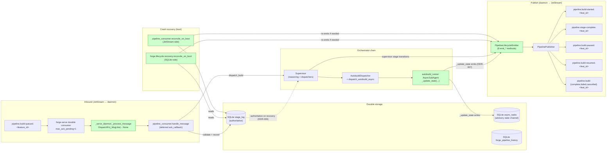
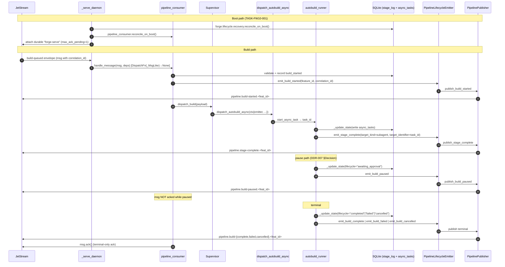
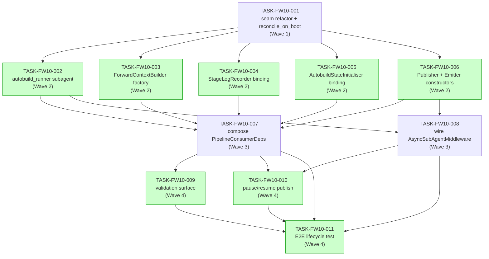

/feature-plan "Wire the production pipeline orchestrator into forge serve" \
  --context=features/forge-serve-orchestrator-wiring/forge-serve-orchestrator-wiring_summary.md \
  --context=features/forge-serve-orchestrator-wiring/forge-serve-orchestrator-wiring.feature \
  --context=features/forge-serve-orchestrator-wiring/forge-serve-orchestrator-wiring_assumptions.yaml \
  --context=docs/research/forge-orchestrator-wiring-gap.md \
  --context=docs/design/decisions/DDR-007-pipeline-lifecycle-emitter-wiring-path.md \
  --context=docs/design/contracts/API-nats-pipeline-events.md \
  --context=docs/architecture/decisions/ADR-ARCH-014-single-consumer-max-ack-pending.md \
  --context=docs/architecture/decisions/ADR-ARCH-031-async-subagents-for-long-running-work.md \
  --context=docs/architecture/decisions/ADR-ARCH-021-paused-via-langgraph-interrupt.md \
  --context=docs/architecture/decisions/ADR-ARCH-008-forge-produces-own-history.md \
  --context=docs/architecture/decisions/ADR-ARCH-027-no-horizontal-scaling.md \
  --context=docs/design/decisions/DDR-006-async-subagent-state-channel-contract.md \
  --context=docs/design/decisions/DDR-001-reply-subject-correlation.md \
  --context=docs/state/TASK-FORGE-FRR-001/implementation_plan.md \
  --context=features/mode-a-greenfield-end-to-end/mode-a-greenfield-end-to-end_summary.md \
  --context=features/forge-production-image/forge-production-image.feature


I'll orchestrate the feature plan for wiring the production pipeline orchestrator into forge serve. Let me start by reading the key context files to understand scope before invoking clarification.

Read forge-serve-orchestrator-wiring_summary.md
Read DDR-007-pipeline-lifecycle-emitter-wiring-path.md
Read forge-orchestrator-wiring-gap.md
Excellent context. Let me read the feature file, assumptions, and the FRR-001 implementation plan to understand the full surface.

Read forge-serve-orchestrator-wiring.feature
Read forge-serve-orchestrator-wiring_assumptions.yaml
Read implementation_plan.md
I have the key context loaded. The user has done extensive prep — DDR-007 already settles the architectural question (Option A: thread emitter through dispatcher context), all 18 assumptions are confirmed, and there's a clear scope statement. Let me load AskUserQuestion so I can collect the Context A clarifications cleanly.

Update Todos

Collect Context A (review scope) clarifications

Create review task via /task-create

Execute /task-review with decision mode

Present decision checkpoint to user

Collect Context B (implementation prefs) if [I]mplement chosen

Generate feature subfolder, subtasks, IMPLEMENTATION-GUIDE.md with diagrams

Generate structured FEAT-XXXX.yaml via generate-feature-yaml --discover

Run pre-flight validation (guardkit feature validate)

Run BDD scenario linking (Step 11)
Now Context A — review scope clarification. The feature spec is unusually mature (DDR-007 already settles Option A; 18/18 assumptions confirmed), so I'll keep this tight.

AskUserQuestion
OUT
User has answered your questions: "What should the review optimise for, given DDR-007 has already settled the Option A wiring path and all 18 assumptions are confirmed?"="Task decomposition + risk (Recommended)", "Treatment of ASSUM-010 (pause/resume publish) given DDR-007 keeps it in scope of FEAT-FORGE-010?"="Keep in scope per DDR-007 (Recommended)", "Granularity of the autobuild_runner subagent + its four collaborators (ForwardContextBuilder, AsyncTaskStarter wiring, StageLogRecorder binding, AutobuildStateInitialiser binding)?"="Five separate tasks, one wave (Recommended)", "Testing depth for the wiring tasks (the unit-test substrate already exists in the un-instantiated components)?"="Standard with seam tests at boundaries (Recommended)". You can now continue with the user's answers in mind.
All four recommendations selected. Now I'll create the review task. Let me check the project's task-create conventions and existing task structure.

Bash Check task directory structure
IN
ls -la /home/richardwoollcott/Projects/appmilla_github/forge/tasks/ 2>/dev/null | head -30 && echo "---" && ls /home/richardwoollcott/Projects/appmilla_github/forge/tasks/backlog/ 2>/dev/null | head -20 && echo "---" && ls /home/richardwoollcott/Projects/appmilla_github/forge/tasks/in_review/ 2>/dev/null | head -20

OUT
total 28
drwxrwxr-x  7 richardwoollcott richardwoollcott 4096 Apr 29 16:09 .
drwxrwxr-x 18 richardwoollcott richardwoollcott 4096 May  1 15:43 ..
drwxrwxr-x 14 richardwoollcott richardwoollcott 4096 May  1 16:47 backlog
drwxrwxr-x 37 richardwoollcott richardwoollcott 4096 May  2 08:13 completed
drwxrwxr-x  2 richardwoollcott richardwoollcott 4096 Apr 28 06:28 design_approved
drwxrwxr-x  3 richardwoollcott richardwoollcott 4096 May  2 08:13 in_progress
drwxrwxr-x  7 richardwoollcott richardwoollcott 4096 Apr 30 20:37 in_review
---
confidence-gated-checkpoint-protocol
feat-f8-validation-fixes
feat-jarvis-internal-001-followups
forge-v2-doc-alignment
guardkit-command-invocation-engine
infrastructure-coordination
langchain-1x-pin-alignment
mode-a-greenfield-end-to-end
mode-b-feature-and-mode-c-review-fix
nats-fleet-integration
pipeline-state-machine-and-configuration
specialist-agent-delegation
TASK-CGCP-001-define-gating-module-structure.md
TASK-CGCP-002-add-approval-config.md
TASK-CGCP-003-request-id-derivation-helper.md
TASK-CGCP-012-bdd-scenario-task-linking.md
TASK-FIX-F09A2-guardkit-uv-sources-detection.md
TASK-FIX-F0E6b-republish-nats-core-wheel.md
TASK-GCI-001-define-guardkit-result-models.md
TASK-GCI-002-define-git-and-progress-event-models.md
---
feat-f8-validation-fixes
project-scaffold
TASK-FIX-F0E8-forge-build-stale-module-ref.md
TASK-REV-3EEE-plan-pipeline-state-machine-and-configuration.md
TASK-REV-F1B8
TASK-REV-IC8B-plan-infrastructure-coordination.md
TASK-REV-SAD3-plan-specialist-agent-delegation.md
TASK-SPIKE-C1E9
TASK-SPIKE-D2F7
Bash Check existing review task structure
IN
ls /home/richardwoollcott/Projects/appmilla_github/forge/tasks/in_review/TASK-REV-IC8B-plan-infrastructure-coordination.md 2>/dev/null && head -40 /home/richardwoollcott/Projects/appmilla_github/forge/tasks/in_review/TASK-REV-IC8B-plan-infrastructure-coordination.md 2>/dev/null

OUT
/home/richardwoollcott/Projects/appmilla_github/forge/tasks/in_review/TASK-REV-IC8B-plan-infrastructure-coordination.md
---
id: TASK-REV-IC8B
title: "Plan: Infrastructure Coordination"
status: review_complete
created: 2026-04-25T14:33:25Z
updated: 2026-04-25T14:36:00Z
review_results:
  mode: decision
  depth: standard
  score: 78
  findings_count: 5
  recommendations_count: 12
  decision: pending_user_choice
  report_path: .claude/reviews/TASK-REV-IC8B-review-report.md
  completed_at: 2026-04-25T14:36:00Z
priority: high
task_type: review
tags: [feature-plan, infrastructure, memory, graphiti, deepagents]
complexity: 8
feature_id: FEAT-FORGE-006
context_files:
  - features/infrastructure-coordination/infrastructure-coordination_summary.md
  - features/infrastructure-coordination/infrastructure-coordination.feature
  - features/infrastructure-coordination/infrastructure-coordination_assumptions.yaml
upstream_dependencies:
  - FEAT-FORGE-001
  - FEAT-FORGE-002
clarification:
  context_a:
    timestamp: 2026-04-25T14:33:25Z
    decisions:
      focus: all
      depth: standard
      tradeoff: balanced
      open_assumptions: [ASSUM-006, ASSUM-007, ASSUM-008]
      extensibility: yes
test_results:
  status: pending
  coverage: null
  last_run: null
Bash Check reviews directory and existing review folder
IN
ls /home/richardwoollcott/Projects/appmilla_github/forge/.claude/reviews/ 2>/dev/null | head && echo "---" && ls /home/richardwoollcott/Projects/appmilla_github/forge/tasks/in_review/TASK-REV-F1B8/ 2>/dev/null | head

OUT
TASK-REV-3EEE-review-report.md
TASK-REV-A7D3-review-report.md
TASK-REV-C3E7-review-report.md
TASK-REV-CG44-review-report.md
TASK-REV-F09A-review-report.md
TASK-REV-F0E4-report.md
TASK-REV-F1B8-review-report.md
TASK-REV-IC8B-review-report.md
TASK-REV-MAG7-review-report.md
TASK-REV-NF20-review-report.md
---
TASK-REV-F1B8-analyse-claude-desktop-feedback-on-adr-arch-031.md
Bash Sample review report structure
IN
head -30 /home/richardwoollcott/Projects/appmilla_github/forge/.claude/reviews/TASK-REV-IC8B-review-report.md

OUT
# TASK-REV-IC8B: Decision-Mode Review Report
## FEAT-FORGE-006 — Infrastructure Coordination

**Mode:** decision
**Depth:** standard
**Reviewer:** software-architect agent
**Completed:** 2026-04-25
**Score:** 78/100 (recommended for implementation; 3 open assumptions resolved with clarifications)

---

## 1. Executive Summary

FEAT-FORGE-006 specifies five tightly integrated sub-systems: post-stage seeding of five entity types into `forge_pipeline_history`, incremental Q&A ingestion into `forge_calibration_history`, build-start priors retrieval injected as reasoning-model narrative, test verification inside an ephemeral worktree, and git/`gh` operations driven through the DeepAgents `execute` tool. The feature has 43 BDD scenarios across a mature spec with no deferred items. The recommended approach is async fire-and-forget memory writes (off the critical path), on-build-start file-hash scan for Q&A ingestion, parallel sub-queries by group for priors retrieval, subprocess via the `execute` tool for test and git operations, and entity-id-level deduplication for split-brain safety. Complexity is 8/10. The dominant risk is the Graphiti write path under Tailscale/FalkorDB latency causing silent data loss if the tolerance/reconciliation loop is not carefully implemented.

---

## 2. Scope Assessment

**In-scope for FEAT-FORGE-006:**
- Writing `GateDecision`, `CapabilityResolution`, `OverrideEvent`, `CalibrationAdjustment`, and `SessionOutcome` to `forge_pipeline_history`.
- Ingesting operator Q&A history files into `forge_calibration_history` with content-hash incremental refresh.
- Priors retrieval at build start; injection into the reasoning model as prose.
- Test verification via the configured test command in the ephemeral worktree.
- Git branch, commit, push, and PR creation via the `execute` tool.
- Reconcile backfill of entries that failed to reach long-term memory (`@edge-case reconcile-backfill`).

**Strictly upstream (do not re-implement):**
- FEAT-FORGE-001 owns the SQLite `stage_log` schema, the state machine transitions, and the durable build-history store. FEAT-FORGE-006 reads from that store as its authoritative source for reconciliation; it must not add columns, change schema, or alter transition logic.
- FEAT-FORGE-002 owns the NATS KV pipeline-state bucket, discovery cache, and CapabilityResolution selection logic. FEAT-FORGE-006 records the resolved capability after selection is complete; it must not touch the resolution algorithm.
Let me quickly survey the current state of forge.cli and forge.pipeline so the task decomposition matches what's actually on disk.

Bash Survey forge module layout
IN
ls src/forge/cli/ src/forge/pipeline/ src/forge/adapters/nats/ src/forge/subagents/ 2>&1 | head -80 && echo "---" && find src/forge -name "*runner*" -o -name "_serve_deps*" 2>/dev/null

OUT
ls: cannot access 'src/forge/subagents/': No such file or directory
src/forge/adapters/nats/:
approval_publisher.py
approval_subscriber.py
fleet_publisher.py
fleet_watcher.py
__init__.py
pipeline_consumer.py
pipeline_publisher.py
__pycache__
specialist_dispatch.py
synthetic_response_injector.py

src/forge/cli/:
cancel.py
history.py
__init__.py
main.py
__pycache__
queue.py
runtime.py
_serve_config.py
_serve_daemon.py
_serve_healthz.py
serve.py
_serve_state.py
skip.py
status.py

src/forge/pipeline/:
cli_steering.py
constitutional_guard.py
dispatchers
forward_context_builder.py
forward_propagation.py
__init__.py
mode_b_planner.py
mode_chains_data.py
mode_c_planner.py
per_feature_sequencer.py
__pycache__
stage_ordering_guard.py
stage_taxonomy.py
supervisor.py
terminal_handlers
---
Bash Survey dispatchers, lifecycle module, and AsyncSubAgent usage
IN
ls src/forge/pipeline/dispatchers/ && echo "---" && ls src/forge/lifecycle/ 2>/dev/null && echo "---" && grep -l "AsyncSubAgent\|start_async_task" src/forge -rn 2>/dev/null | head -5 && echo "---" && ls langgraph.json 2>/dev/null && head -30 langgraph.json 2>/dev/null

OUT
autobuild_async.py
__init__.py
__pycache__
specialist.py
subprocess.py
---
identifiers.py
__init__.py
migrations.py
modes.py
persistence.py
__pycache__
queue.py
recovery.py
schema.sql
schema_v2.sql
state_machine.py
---
src/forge/adapters/guardkit/progress_subscriber.py
src/forge/pipeline/per_feature_sequencer.py
src/forge/pipeline/cli_steering.py
src/forge/pipeline/dispatchers/autobuild_async.py
---
langgraph.json
{
    "dependencies": ["."],
    "graphs": {
        "orchestrator": "./src/forge/agent.py:agent"
    },
    "env": ".env"
}
Update Todos

Collect Context A (review scope) clarifications

Create review task TASK-REV-FW10 + review report

Present decision checkpoint to user

Collect Context B (implementation prefs) if [I]mplement chosen

Generate feature subfolder, subtasks, IMPLEMENTATION-GUIDE.md with diagrams

Generate structured FEAT-FW10.yaml via generate-feature-yaml --discover

Run pre-flight validation (guardkit feature validate)

Run BDD scenario linking (Step 11)
Write TASK-REV-FW10-plan-forge-serve-orchestrator-wiring.md
78 lines
---
id: TASK-REV-FW10
title: "Plan: Wire the production pipeline orchestrator into forge serve"
status: review_complete
created: 2026-05-02T00:00:00Z
updated: 2026-05-02T00:00:00Z
review_results:
  mode: decision
  depth: standard
  score: 86
  findings_count: 7
  recommendations_count: 11
  decision: pending_user_choice
  report_path: .claude/reviews/TASK-REV-FW10-review-report.md
  completed_at: 2026-05-02T00:00:00Z
priority: high
task_type: review
tags: [feature-plan, forge-serve, orchestrator, autobuild, lifecycle-emitter, deepagents-async-subagent]
complexity: 8
feature_id: FEAT-FORGE-010
context_files:
  - features/forge-serve-orchestrator-wiring/forge-serve-orchestrator-wiring_summary.md
  - features/forge-serve-orchestrator-wiring/forge-serve-orchestrator-wiring.feature
  - features/forge-serve-orchestrator-wiring/forge-serve-orchestrator-wiring_assumptions.yaml
  - docs/research/forge-orchestrator-wiring-gap.md
  - docs/design/decisions/DDR-007-pipeline-lifecycle-emitter-wiring-path.md
  - docs/design/contracts/API-nats-pipeline-events.md
  - docs/architecture/decisions/ADR-ARCH-014-single-consumer-max-ack-pending.md
  - docs/architecture/decisions/ADR-ARCH-031-async-subagents-for-long-running-work.md
  - docs/architecture/decisions/ADR-ARCH-021-paused-via-langgraph-interrupt.md
  - docs/architecture/decisions/ADR-ARCH-008-forge-produces-own-history.md
  - docs/architecture/decisions/ADR-ARCH-027-no-horizontal-scaling.md
  - docs/design/decisions/DDR-006-async-subagent-state-channel-contract.md
  - docs/design/decisions/DDR-001-reply-subject-correlation.md
  - docs/state/TASK-FORGE-FRR-001/implementation_plan.md
  - features/mode-a-greenfield-end-to-end/mode-a-greenfield-end-to-end_summary.md
  - features/forge-production-image/forge-production-image.feature
upstream_dependencies:
  - FEAT-FORGE-001
  - FEAT-FORGE-002
  - FEAT-FORGE-004
  - FEAT-FORGE-007
  - FEAT-FORGE-009
supersedes_tasks:
  - TASK-FORGE-FRR-001
  - TASK-FORGE-FRR-001b
clarification:
  context_a:
    timestamp: 2026-05-02T00:00:00Z
    decisions:
      focus: task_decomposition_and_risk
      depth: standard
      tradeoff: quality
      pause_resume_scope: in_scope_per_DDR_007
      subagent_split: five_tasks_one_wave
      testing_depth: standard_with_seam_tests
test_results:
  status: pending
  coverage: null
  last_run: null
provenance:
  origin_correlation_id: a58ec9a7-27c6-485a-beac-e18675639a10
  origin_event: FEAT-JARVIS-INTERNAL-001 first-real-run on GB10 (2026-05-01)
  gap_finding: docs/research/forge-orchestrator-wiring-gap.md
---

# TASK-REV-FW10 — Plan: Wire the production pipeline orchestrator into forge serve

This task is the planning artifact for **FEAT-FORGE-010** (slug
`forge-serve-orchestrator-wiring`). The /feature-spec session produced the
canonical spec (31 scenarios, 18 confirmed assumptions, DDR-007 settling
the pause/resume + emitter-wiring path). This review task captures the
decision-mode analysis that turns that spec into an executable wave plan.

The full review is at `.claude/reviews/TASK-REV-FW10-review-report.md`.
This task file carries the metadata, decision provenance, and the
acceptance set that the implementation tasks will inherit.
Now the decision-mode review report.

Write TASK-REV-FW10-review-report.md
431 lines
# TASK-REV-FW10: Decision-Mode Review Report
## FEAT-FORGE-010 — Wire the production pipeline orchestrator into `forge serve`

**Mode:** decision
**Depth:** standard (Context A: focus = task_decomposition_and_risk; tradeoff = quality)
**Reviewer:** /feature-plan orchestrator (decision-mode analysis)
**Completed:** 2026-05-02
**Score:** 86 / 100 (recommended for implementation; architectural choices already settled)

---

## 1. Executive Summary

FEAT-FORGE-010 closes the structural gap between `forge serve`'s shipped
daemon process (FEAT-FORGE-009) and the un-instantiated orchestrator
chain (`Supervisor`, `PipelineConsumerDeps`, `PipelineLifecycleEmitter`,
`PipelinePublisher`, `ForwardContextBuilder`, plus the net-new
`autobuild_runner` AsyncSubAgent). The architecture is unusually settled
for a feature plan: DDR-007 chose Option A (thread the lifecycle emitter
through the dispatcher's context payload, co-located with DDR-006's
`_update_state` boundary), all 18 assumptions are confirmed, and the
seam-refactor design from the superseded TASK-FORGE-FRR-001 is reusable
verbatim. The dominant residual risk is **production composition order
under crash recovery** — both `reconcile_on_boot` routines must run
before the consumer fetches its first message, otherwise an in-flight
build's redelivered envelope will be processed against an unreconciled
durable-history view. The task plan therefore foregrounds the seam
refactor + paired `reconcile_on_boot` wiring as Wave 1, lands the
five net-new orchestrator components in parallel as Wave 2, composes
them at the `_serve_deps` factory in Wave 3, and proves the lifecycle
envelope sequence end-to-end in Wave 4.

**Recommended approach: single end-to-end implementation following
DDR-007 — no carve-outs.** Pause/resume publish stays in scope; the
synthetic dispatch-stage envelope from FRR-001 is dropped per ASSUM-004;
the autobuild_runner subagent + its four collaborators land as five
parallel tasks in one wave per the user's Context A choice.

---

## 2. Scope Assessment

**In-scope for FEAT-FORGE-010 (per the gap doc and confirmed assumptions):**
- Construct `Supervisor`, `PipelineConsumerDeps`, `PipelineLifecycleEmitter`,
  `PipelinePublisher`, `ForwardContextBuilder` once per daemon process,
  bound to the daemon's single shared NATS connection (ASSUM-002, ASSUM-011).
- Implement the `autobuild_runner` AsyncSubAgent module
  (`src/forge/subagents/autobuild_runner.py`, currently absent from the
  repo) with the DDR-006 `_update_state` helper extended per DDR-007 to
  call the matching `emit_*` method at the same boundary.
- Register `autobuild_runner` as a separate graph in `langgraph.json`
  under ASGI co-deployment (ADR-ARCH-031, ASSUM-003).
- Wire DeepAgents `AsyncSubAgentMiddleware` (start/check/update/cancel/list)
  into the supervisor's reasoning loop.
- Refactor `_serve_daemon._process_message`'s `DispatchFn` from
  `(bytes) -> None` to `(_MsgLike) -> None`; remove the post-dispatch
  ack from the success path (deferred to the state machine via
  `pipeline_consumer.handle_message`'s `ack_callback`); set
  `max_ack_pending=1` on the durable's `ConsumerConfig` (ASSUM-005,
  ASSUM-006, ASSUM-007).
- Wire **both** `reconcile_on_boot` routines (`pipeline_consumer.reconcile_on_boot`
  + `forge.lifecycle.recovery.reconcile_on_boot`) into `_run_serve` —
  before the consumer's first fetch (ASSUM-009).
- Per-stage `emit_stage_complete` from inside `autobuild_runner`'s
  `_update_state` boundary, with `target_kind="subagent"` and
  `target_identifier=task_id` for autobuild-internal transitions
  (ASSUM-018).
- `emit_build_paused` at the `lifecycle="awaiting_approval"` transition
  inside `_update_state`; `emit_build_resumed` in the existing
  `forge.adapters.nats.approval_subscriber` resume path (DDR-007 keeps
  pause/resume in scope; ASSUM-010).
- Healthz endpoint extension: healthy iff NATS subscription is live
  AND the orchestrator chain is fully constructed (ASSUM-012).
- Validation surface for malformed payload, duplicate detection
  (SQLite unique index on `(feature_id, correlation_id)`), and
  worktree-allowlist gating (ASSUM-013, ASSUM-014, ASSUM-015).
- E2E integration test: build-queued envelope → terminal envelope, all
  envelopes correlation-id threaded.

**Strictly upstream (do not re-implement):**
- FEAT-FORGE-001 owns the SQLite state machine, `stage_log` schema,
  state transitions, durable history, and crash-recovery (retry-from-scratch).
  This feature **reads** from that store; it must not change schema or
  add transitions.
- FEAT-FORGE-002 owns `PipelinePublisher`, the eight pipeline-event
  subjects, the approval channel surface, and correlation-id threading
  rules. This feature **constructs** the publisher in production; it
  must not modify the class itself or add subjects.
- FEAT-FORGE-004 owns the pause/resume protocol semantics
  (`ApprovalResponsePayload`, idempotent first-wins, correlation-keyed
  reply subjects per DDR-001). This feature wires the publish-back
  path; it must not modify approval semantics.
- FEAT-FORGE-007 owns the Mode A orchestration semantics (stage chain,
  gating policy, per-feature loop, constitutional pull-request review).
  This feature **verifies** those semantics in production; it must not
  re-spec them.
- FEAT-FORGE-009 owns the daemon process, healthz endpoint, JetStream
  durable attach, and SIGTERM handling. This feature **changes** the
  `_process_message` seam contract, switches `max_ack_pending` from
  default to 1, adds the paired `reconcile_on_boot` calls, and replaces
  the receipt-only `_default_dispatch` with the real orchestrator
  dispatch.

**Explicitly out of scope:**
- Net-new lifecycle envelope types beyond the eight in
  `API-nats-pipeline-events.md §3`.
- Mode B / Mode C orchestration (separate features).
- Jarvis-side `forge_subscriber` workqueue attach fix.
- HTTP transport for the `autobuild_runner` AsyncSubAgent (ASGI is the
  default per ADR-ARCH-031; HTTP is its own future ADR per
  DDR-007 §Forward compatibility).
- Renaming dormant `forge-consumer` durable constant (separate cleanup).

---

## 3. Architectural Decisions (already settled, not re-opened)

| Decision | Source | Outcome |
|---|---|---|
| Lifecycle emitter wiring path | DDR-007 | **Option A** — thread emitter through dispatcher context; call from `_update_state` co-located with the state-channel write. |
| Pause/resume publish in scope of this feature | DDR-007 §Decision; ASSUM-010 | **In scope.** Single one-line addition at each call site. Carve-out only if implementation discovers a structural blocker (instructed split-out path documented). |
| Stage-complete from inside subagent envelope shape | DDR-007 §Decision; ASSUM-018 | `target_kind="subagent"`, `target_identifier=task_id`. Supervisor's emit calls (for stages dispatched outside the subagent) use existing taxonomy unchanged. |
| Synthetic dispatch-stage envelope | ASSUM-004; FRR-001 SUPERSEDED | **Dropped.** Only real stage transitions emit `stage-complete`. |
| Seam refactor of `_serve_daemon._process_message` | TASK-FORGE-FRR-001 implementation_plan.md | **Reused verbatim.** `(bytes) -> None` → `(_MsgLike) -> None`; ack moves to `pipeline_consumer.handle_message`'s deferred `ack_callback`; remove post-dispatch ack on success. |
| `max_ack_pending=1` on `forge-serve` durable | ADR-ARCH-014; ASSUM-005 | Set in `_attach_consumer`'s `ConsumerConfig`. Operational note: existing consumer must be deleted before deploying (`nats consumer rm PIPELINE forge-serve`). |
| Single shared NATS connection | ASSUM-011; FRR-001 implementation_plan.md | One connection opened in `_run_serve`; passed to both consumer and publisher. Refactor `run_daemon` to accept an injected client. |
| autobuild_runner transport | ADR-ARCH-031; ASSUM-003 | ASGI co-deployment via DeepAgents `AsyncSubAgent`. Subagent is a reachable Python object — non-serialisable context payload is OK. |
| Recovery authority | ADR-ARCH-008; DDR-006; ASSUM-017 | SQLite history is authoritative. `async_tasks` channel is advisory. Both `reconcile_on_boot` routines run at startup. |
| Approval reply subject correlation | DDR-001; ASSUM-016 | Correlation-keyed reply subjects; mismatched correlation_id is dropped. |

---

## 4. Findings

### F1 — Composition order under crash recovery (HIGH risk)

The two `reconcile_on_boot` routines (one in `pipeline_consumer.py`,
one in `forge.lifecycle.recovery`) **must run before the consumer's
first fetch**. If the consumer fetches a redelivered message before
the durable history has been reconciled, the build will be processed
against a stale view (e.g., a build that crashed while paused will
re-emit `build-started` instead of `build-paused`, breaking the audit
sequence). Wave 1 must wire both routines synchronously before the
consumer attaches.

**Mitigation:** Sequence in `_run_serve`:
1. Open NATS client.
2. Open SQLite pool.
3. Run `forge.lifecycle.recovery.reconcile_on_boot(sqlite_pool)`.
4. Run `pipeline_consumer.reconcile_on_boot(client, sqlite_pool, publisher)`.
5. Construct supervisor + deps factory.
6. Attach durable consumer (`_attach_consumer`).
7. Start healthz + daemon loops.

### F2 — `_update_state` is the single transition site for both DDR-006 and DDR-007 (DESIGN)

DDR-007 explicitly co-locates the emitter call with the state-channel
write at `_update_state`. The implementation must not have two
divergent transition sites. The autobuild_runner module's
`_update_state` is the single canonical site; every lifecycle
transition writes the channel **and** emits in the same function.
Tests must assert this co-location (a state-channel write without an
emit, or vice versa, is a bug).

### F3 — DeepAgents 0.5.3 AsyncSubAgent context payload contract (verify during implementation)

DDR-007 §Consequences flags this as a verification step. The subagent's
context payload now carries a non-serialisable Python object (the
`PipelineLifecycleEmitter`). ASGI co-deployment per ADR-ARCH-031 is
the explicit transport choice precisely so in-process objects can be
passed — but the contract should be confirmed during the autobuild_runner
implementation task before downstream tasks depend on the shape.

**Mitigation:** Task TASK-FW10-002 (autobuild_runner subagent module)
includes an explicit acceptance criterion that a smoke test instantiates
the subagent with a real `PipelineLifecycleEmitter` in its context and
calls one transition. If 0.5.3 rejects the non-serialisable context,
the recovery path is the thin RPC-shaped emitter from DDR-007 §Forward
compatibility (one-line constructor swap at `_serve_deps`).

### F4 — Five Protocol-impl bindings have ambiguous owning module (DESIGN)

The four collaborators on `dispatch_autobuild_async`
(`forward_context_builder`, `async_task_starter`, `stage_log_recorder`,
`state_channel`) plus the `is_duplicate_terminal` reader and
`publish_build_failed` binder for `PipelineConsumerDeps` need
production constructors. They could live in a single `_serve_deps.py`
factory or in separate modules. **Single-module per Context A's
preference for "five separate tasks in one wave"** — but to avoid
file-merge conflicts when five tasks are running in parallel, each
binding gets its own private module (`_serve_deps_*.py`) and they're
composed in `_serve_deps.py` in Wave 3.

### F5 — `PipelinePublisher` already exists and is testable; its production constructor is the only missing piece (LOW risk)

The class itself is fine. The factory just needs `client` (the daemon's
NATS client). One line at `_serve_deps`. This is a low-risk component
to land in Wave 2.

### F6 — Healthz extension is a small but real surface (MEDIUM)

ASSUM-012 extends FEAT-FORGE-009's healthz contract: healthy iff NATS
subscription is live AND the orchestrator chain is fully constructed.
This means healthz must read a "chain ready" flag set after Wave 1's
construction completes. The Scenario Outline in Group E specifies
three states: not-yet-constructed → unhealthy; fully-constructed +
consumer-attached → healthy; constructed but NATS dropped → unhealthy.
This needs a small bool flag in `_serve_state` (or similar) and a
read in `_serve_healthz`.

### F7 — End-to-end test must run without actually invoking real autobuild (DESIGN)

The E2E test asserts the lifecycle envelope sequence. It should mock
`AutobuildDispatcher` at the boundary so the test doesn't actually
run an autobuild (which would take real time and require a real
worktree). The supervisor's reasoning model can be stubbed too —
this is a wiring test, not a Mode A behaviour test (Mode A behaviour
is FEAT-FORGE-007's territory).

---

## 5. Task Decomposition (recommended)

Per Context A: five separate tasks for the autobuild_runner subagent
+ its four collaborators, in one wave; standard testing depth with
seam tests at boundaries.

### Wave 1 — Seam refactor + recovery wiring (foundation)

**TASK-FW10-001** — Refactor `_serve_daemon` seam to `(_MsgLike) -> None`,
set `max_ack_pending=1`, defer ack to state machine, wire paired
`reconcile_on_boot` calls into `_run_serve`. (complexity 6)

**Files modified:**
- `src/forge/cli/_serve_daemon.py` — DispatchFn signature change,
  remove post-dispatch ack, add max_ack_pending=1.
- `src/forge/cli/serve.py` — `_run_serve` opens NATS once; runs both
  reconcile routines before consumer attach; passes client downstream.
- `src/forge/cli/_serve_state.py` — adds `chain_ready` flag for healthz.
- `src/forge/cli/_serve_healthz.py` — extends healthy gate to chain_ready.
- `tests/cli/test_serve_daemon.py` (existing) — migrate seam tests.
- `tests/cli/test_serve_*.py` — add chain_ready healthz tests.

**Why solo wave:** every later task depends on the new seam contract
and the single shared NATS client. Parallelising would create
merge conflicts on `serve.py`.

### Wave 2 — Five net-new components (parallel)

**TASK-FW10-002** — Implement `autobuild_runner` AsyncSubAgent module
with DDR-006 `_update_state` extended per DDR-007. (complexity 8)
- Creates: `src/forge/subagents/__init__.py`,
  `src/forge/subagents/autobuild_runner.py`.
- Registers in `langgraph.json` as a second graph entry.
- Implements `_update_state(state, *, lifecycle, emitter, ...)` with
  state-channel write + `emitter.on_transition(new_state)` co-located.
- Emits `target_kind="subagent"`, `target_identifier=task_id` for
  autobuild-internal transitions (ASSUM-018).
- Smoke test: instantiate with real `PipelineLifecycleEmitter`,
  exercise one transition, verify both writes happen (F2 + F3).

**TASK-FW10-003** — `ForwardContextBuilder` production factory
(`build_forward_context_builder` in `src/forge/cli/_serve_deps_forward_context.py`).
(complexity 4)
- Wires SQLite reader (`forge.lifecycle.persistence`) + worktree
  allowlist (`forge_config.allowed_worktree_paths`).
- Unit tests: factory returns a builder that round-trips against a
  fixture SQLite DB.

**TASK-FW10-004** — `StageLogRecorder` production binding
(`build_stage_log_recorder` in `src/forge/cli/_serve_deps_stage_log.py`).
(complexity 3)
- Wires `forge.lifecycle.persistence`'s SQLite writer behind the
  Protocol.
- Unit tests: writer records a transition that the reader observes.

**TASK-FW10-005** — `AutobuildStateInitialiser` production binding
(`build_autobuild_state_initialiser` in
`src/forge/cli/_serve_deps_state_channel.py`). (complexity 4)
- Wires `forge.lifecycle.persistence`'s `async_tasks` channel writer.
- Unit tests: initial-state write + subsequent reads via the channel.

**TASK-FW10-006** — `PipelinePublisher` + `PipelineLifecycleEmitter`
production constructors (`build_publisher_and_emitter` in
`src/forge/cli/_serve_deps_lifecycle.py`). (complexity 3)
- Both bound to the daemon's single shared client.
- Emitter's `on_transition(new_state)` dispatches to the eight
  `emit_*` methods based on `lifecycle` literal.
- Unit tests: emitter dispatch matrix (one test per lifecycle literal).

**Why one wave:** each task creates its own module; no merge
conflicts. All depend on Wave 1's `(_MsgLike) -> None` seam being
in place. None depend on each other.

### Wave 3 — Composition (`_serve_deps` factory + supervisor wiring)

**TASK-FW10-007** — Compose Wave 2 modules into the production
`PipelineConsumerDeps` factory and the dispatcher closure.
(complexity 6)
- Creates: `src/forge/cli/_serve_deps.py` —
  `build_pipeline_consumer_deps(client, forge_config, sqlite_pool)`.
- Creates: `src/forge/cli/_serve_dispatcher.py` —
  `make_handle_message_dispatcher(deps)` returning an
  `async def dispatch(msg: _MsgLike) -> None` closure that calls
  `pipeline_consumer.handle_message(msg, deps)`.
- Wires the dispatcher into `_serve_daemon.dispatch_payload` from
  `_run_serve` so the receipt-only `_default_dispatch` is no longer
  reachable.
- `Supervisor` constructed against the composed deps + reasoning model.

**TASK-FW10-008** — Wire `AsyncSubAgentMiddleware` into the supervisor's
reasoning loop. (complexity 5)
- Adds the middleware's start/check/update/cancel/list tools to the
  supervisor's tool list.
- Threads the `PipelineLifecycleEmitter` into `dispatch_autobuild_async`'s
  context payload per DDR-007.
- Verifies the supervisor stays responsive while autobuild is in
  flight (Group A scenario "supervisor stays responsive").

### Wave 4 — Validation, gating, and end-to-end proof

**TASK-FW10-009** — Validation surface (malformed payload, duplicate
detection, worktree allowlist) emitting `build-failed` and acking.
(complexity 4)
- Implements ASSUM-013, ASSUM-014, ASSUM-015 paths on the
  `pipeline_consumer.handle_message` boundary.
- Unit tests for each validation rejection path.

**TASK-FW10-010** — Pause/resume publish round-trip. (complexity 3)
- `emit_build_paused` at the `lifecycle="awaiting_approval"` transition
  in `_update_state`.
- `emit_build_resumed` in `forge.adapters.nats.approval_subscriber`'s
  resume path.
- Integration test: pause → restart → re-emit pause + approval-request →
  resume on approval.

**TASK-FW10-011** — End-to-end lifecycle integration test
(build-queued → terminal envelope, all eight subjects covered).
(complexity 6)
- New test file: `tests/integration/test_forge_serve_orchestrator_e2e.py`.
- Spins up forge serve against an embedded NATS + a temporary SQLite.
- Mocks `AutobuildDispatcher` at the boundary (F7).
- Asserts: build-started precedes any stage-complete; every stage-complete
  carries the inbound correlation_id; terminal envelope appears exactly
  once; `target_kind="subagent"` for autobuild-internal stages.

---

## 6. Wave Plan (parallel groups)

```
Wave 1: [TASK-FW10-001]                                              (1 task,  serial)
Wave 2: [TASK-FW10-002, FW10-003, FW10-004, FW10-005, FW10-006]      (5 tasks, parallel)
Wave 3: [TASK-FW10-007, TASK-FW10-008]                               (2 tasks, parallel)
Wave 4: [TASK-FW10-009, TASK-FW10-010, TASK-FW10-011]                (3 tasks, parallel)
```

**Total tasks:** 11.
**Aggregate complexity:** 52 / 110.
**Estimated duration (parallel):** ~12–15 working hours; serial ~25 hours.

---

## 7. Cross-task Integration Contracts (§4 candidates)

Several Wave 2 → Wave 3 → Wave 4 boundaries pass typed Python objects
between tasks. The most load-bearing are:

| Producer | Consumer | Artifact | Format constraint |
|---|---|---|---|
| TASK-FW10-002 (autobuild_runner) | TASK-FW10-008 (supervisor wiring) | `AUTOBUILD_RUNNER_GRAPH` (langgraph entry name) | Constant string `"autobuild_runner"` registered in `langgraph.json`; supervisor references it via `AUTOBUILD_RUNNER_NAME`. |
| TASK-FW10-006 (publisher + emitter) | TASK-FW10-002 (autobuild_runner) | `PipelineLifecycleEmitter` instance | Threaded into `dispatch_autobuild_async` context payload per DDR-007. Subagent calls `emitter.on_transition(new_state)` from `_update_state`. |
| TASK-FW10-003/004/005/006 (Wave 2 factories) | TASK-FW10-007 (deps composer) | Four Protocol implementations + `PipelinePublisher` + `PipelineLifecycleEmitter` | Each factory returns a Protocol-conforming object; `_serve_deps.build_pipeline_consumer_deps` composes them into `PipelineConsumerDeps`. |
| TASK-FW10-001 (seam refactor) | TASK-FW10-007 (dispatcher wiring) | New `DispatchFn` type alias `Callable[[_MsgLike], Awaitable[None]]` | `_serve_dispatcher.make_handle_message_dispatcher` returns this signature; `_run_serve` rebinds `_serve_daemon.dispatch_payload` to it. |
| TASK-FW10-006 (emitter) | TASK-FW10-010 (pause/resume) | `emit_build_paused` / `emit_build_resumed` methods | Already on the emitter class; no new shape. Pause/resume is a call-site addition only. |

These will be made explicit in IMPLEMENTATION-GUIDE.md §4: Integration
Contracts.

---

## 8. Recommendations

1. **Adopt the 4-wave plan above.** Wave 1 lands the foundation; Wave 2
   parallelises the five net-new components; Wave 3 composes; Wave 4
   validates end-to-end.
2. **Verify the DeepAgents 0.5.3 AsyncSubAgent context contract early
   (TASK-FW10-002).** If non-serialisable context payload is rejected,
   pivot to DDR-007's HTTP-shaped emitter wrapper before further tasks
   depend on the in-process shape.
3. **Wire both `reconcile_on_boot` routines synchronously before the
   consumer's first fetch (TASK-FW10-001).** Failing to do so reopens
   F1 and breaks crash-recovery scenarios in Group D.
4. **Keep the `_update_state` boundary as the single canonical
   transition site (TASK-FW10-002).** Test for co-located write + emit.
5. **Drop the synthetic dispatch-stage envelope from FRR-001
   completely.** Per ASSUM-004; carried via Group A scenario "no
   synthetic stub" assertion in TASK-FW10-011.
6. **Land each Wave 2 binding in its own private module
   (`_serve_deps_*.py`)** to avoid five tasks colliding on `_serve_deps.py`.
7. **Mock `AutobuildDispatcher` at the boundary in the E2E test
   (TASK-FW10-011).** This is a wiring test, not a Mode A test.
8. **Operational note: existing `forge-serve` durable must be
   `nats consumer rm`-ed before deploying the new image** (the
   `max_ack_pending=1` change is not editable on a live consumer).
   Capture in TASK-FW10-001's deployment notes.
9. **Pause/resume publish stays in scope (Context A: in_scope_per_DDR_007).**
   If TASK-FW10-010 discovers a structural blocker (e.g., the approval
   subscriber needs reshaping), file a carve-out at that point — but
   the default position is to keep it in scope.
10. **Standard testing depth with seam tests (Context A).** Each Wave 2
    binding has its own unit tests; cross-task contracts in §4 each
    get a seam test stub in the consumer task; one E2E integration
    test covers the full lifecycle (TASK-FW10-011).
11. **Lint compliance is an acceptance criterion of every implementation
    task** (per /feature-plan policy).

---

## 9. Decision Checkpoint

**Recommended approach:** Land the full 11-task, 4-wave plan against
DDR-007 / Option A. No carve-outs.

**Rationale:** The architecture is settled. The risks (F1, F3) are
addressable in-task with explicit mitigations. The scope split that
would otherwise be tempting (pause/resume to a follow-up) is
explicitly closed by DDR-007 §Decision and §Do-not-reopen.

The decision options follow.
Update Todos

Collect Context A (review scope) clarifications

Create review task TASK-REV-FW10 + review report

Present decision checkpoint to user

Collect Context B (implementation prefs) if [I]mplement chosen

Generate feature subfolder, subtasks, IMPLEMENTATION-GUIDE.md with diagrams

Generate structured FEAT-FW10.yaml via generate-feature-yaml --discover

Run pre-flight validation (guardkit feature validate)

Run BDD scenario linking (Step 11)
Review task created at tasks/in_review/TASK-REV-FW10-plan-forge-serve-orchestrator-wiring.md, full analysis at .claude/reviews/TASK-REV-FW10-review-report.md. Score: 86/100.


━━━━━━━━━━━━━━━━━━━━━━━━━━━━━━━━━━━━━━━━━━━━
DECISION CHECKPOINT — FEAT-FORGE-010
━━━━━━━━━━━━━━━━━━━━━━━━━━━━━━━━━━━━━━━━━━━━
Summary: 11 tasks across 4 waves. Wave 1 foundation (seam refactor + paired reconcile_on_boot); Wave 2 five parallel net-new components (autobuild_runner subagent + four bindings + publisher/emitter pair); Wave 3 composition (_serve_deps + supervisor wiring); Wave 4 validation, pause/resume, E2E test.

Key risks called out:

F1 (HIGH): both reconcile_on_boot routines must run before the consumer's first fetch — sequenced inside Wave 1
F3 (MEDIUM): DeepAgents 0.5.3 AsyncSubAgent context payload contract — verified by smoke test inside Wave 2 / TASK-FW10-002
Operational: existing forge-serve durable must be nats consumer rm-ed before deploy (max_ack_pending=1 is not editable on a live consumer)
Recommended: Land the full 11-task plan against DDR-007 / Option A; no carve-outs. Pause/resume stays in scope per DDR-007.

AskUserQuestion
OUT
User has answered your questions: "How would you like to proceed with FEAT-FORGE-010?"="[I]mplement (Recommended)". You can now continue with the user's answers in mind.
[I]mplement chosen. Now Context B — implementation preferences. Most are already set by Context A and DDR-007, so I'll ask only about open execution choices.

AskUserQuestion
OUT
User has answered your questions: "How should the 11 subtasks be executed?"="Auto-detect with Conductor for Wave 2 (Recommended)", "For the FEAT-FW10.yaml generation, do you want to include explicit smoke_gates between waves so /feature-build runs a smoke check after each wave?"="Yes — smoke gate after Waves 1, 2, 3 (Recommended)", "For TASK-FW10-002 (autobuild_runner subagent) — verify DeepAgents 0.5.3 AsyncSubAgent non-serialisable context contract as part of the same task, or split out as a spike?"="Verify in-task with smoke test (Recommended)". You can now continue with the user's answers in mind.
Generating the feature structure now. Let me create the feature folder and all 11 task markdown files in parallel batches.

Bash Create feature subfolder
IN
mkdir -p /home/richardwoollcott/Projects/appmilla_github/forge/tasks/backlog/forge-serve-orchestrator-wiring && ls /home/richardwoollcott/Projects/appmilla_github/forge/tasks/backlog/forge-serve-orchestrator-wiring

OUT
(Bash completed with no output)
Write README.md
54 lines
# FEAT-FORGE-010 — Wire the production pipeline orchestrator into `forge serve`

**Feature ID:** FEAT-FORGE-010
**Slug:** `forge-serve-orchestrator-wiring`
**Parent review:** [TASK-REV-FW10](../../in_review/TASK-REV-FW10-plan-forge-serve-orchestrator-wiring.md)
**Spec:** [features/forge-serve-orchestrator-wiring/](../../../features/forge-serve-orchestrator-wiring/)
**Architectural anchor:** [DDR-007](../../../docs/design/decisions/DDR-007-pipeline-lifecycle-emitter-wiring-path.md) (Option A — emitter through dispatcher context)

## What this feature does

Closes the structural gap between `forge serve`'s shipped daemon
process (FEAT-FORGE-009) and the un-instantiated pipeline orchestrator
chain. After this feature lands, a `pipeline.build-queued.<feature_id>`
envelope routed to `forge serve` runs end-to-end through the canonical
Mode A stage chain (FEAT-FORGE-007), publishes the full lifecycle
envelope sequence (`build-started`, `stage-complete×N`,
`build-paused` / `build-resumed` if paused, terminal envelope) back to
JetStream with the inbound `correlation_id` threaded through every
event, and survives crash + restart with no lost or duplicated builds.

This is **production composition**, not new orchestration semantics.
The orchestration semantics already exist as fully unit-tested
components in `src/forge/pipeline/` and `src/forge/adapters/nats/`;
they just have no production caller. This feature gives them one.

## Wave plan

| Wave | Tasks | Theme |
|---|---|---|
| 1 | [TASK-FW10-001](TASK-FW10-001-refactor-serve-daemon-seam-and-reconcile-on-boot.md) | Foundation: seam refactor, `max_ack_pending=1`, paired `reconcile_on_boot`. |
| 2 | [TASK-FW10-002](TASK-FW10-002-implement-autobuild-runner-async-subagent.md) · [003](TASK-FW10-003-forward-context-builder-factory.md) · [004](TASK-FW10-004-stage-log-recorder-binding.md) · [005](TASK-FW10-005-autobuild-state-initialiser-binding.md) · [006](TASK-FW10-006-pipeline-publisher-and-emitter-constructors.md) | Five net-new components (parallel; one Conductor workspace per task). |
| 3 | [TASK-FW10-007](TASK-FW10-007-compose-pipeline-consumer-deps.md) · [008](TASK-FW10-008-wire-async-subagent-middleware-into-supervisor.md) | Composition: `_serve_deps` factory + supervisor wiring. |
| 4 | [TASK-FW10-009](TASK-FW10-009-validation-surface-and-build-failed-paths.md) · [010](TASK-FW10-010-pause-resume-publish-round-trip.md) · [011](TASK-FW10-011-end-to-end-lifecycle-integration-test.md) | Validation, pause/resume, end-to-end proof. |

**Smoke gates:** after Waves 1, 2, and 3. See `IMPLEMENTATION-GUIDE.md` §6.

## Quick references

- [IMPLEMENTATION-GUIDE.md](IMPLEMENTATION-GUIDE.md) — diagrams, integration contracts, run order.
- [TASK-REV-FW10 review report](../../../.claude/reviews/TASK-REV-FW10-review-report.md) — decision-mode analysis.
- [Gap-finding doc](../../../docs/research/forge-orchestrator-wiring-gap.md) — why this feature exists.
- [DDR-007](../../../docs/design/decisions/DDR-007-pipeline-lifecycle-emitter-wiring-path.md) — emitter wiring path.
- [API-nats-pipeline-events.md §3](../../../docs/design/contracts/API-nats-pipeline-events.md) — the eight lifecycle subjects this feature publishes.
- Superseded historical context: `tasks/completed/TASK-FORGE-FRR-001/` and `tasks/completed/TASK-FORGE-FRR-001b/`.

## Provenance

This feature was filed after the FEAT-JARVIS-INTERNAL-001 first-real-run
on GB10 (2026-05-01, `correlation_id a58ec9a7-27c6-485a-beac-e18675639a10`)
where the runbook's Phase 7 close criterion failed because nothing on
the forge side publishes anything back. The investigation in
`docs/research/forge-orchestrator-wiring-gap.md` surfaced the gap as
structural, not a single-wire fix.
Now the IMPLEMENTATION-GUIDE.md with the mandatory Mermaid diagrams and §4 contracts.

Write IMPLEMENTATION-GUIDE.md
427 lines
# IMPLEMENTATION-GUIDE — FEAT-FORGE-010

**Feature:** Wire the production pipeline orchestrator into `forge serve`
**Slug:** `forge-serve-orchestrator-wiring`
**Architectural anchor:** [DDR-007](../../../docs/design/decisions/DDR-007-pipeline-lifecycle-emitter-wiring-path.md)
**Parent review:** [TASK-REV-FW10](../../in_review/TASK-REV-FW10-plan-forge-serve-orchestrator-wiring.md)

---

## §1 Goal in one paragraph

After this feature lands, `forge serve` consumes a
`pipeline.build-queued.<feature_id>` envelope, dispatches the build
end-to-end through the canonical Mode A stage chain
(`Supervisor` → dispatchers → `autobuild_runner` AsyncSubAgent),
publishes the full lifecycle envelope sequence
(`build-started`, `stage-complete×N`, `build-paused` / `build-resumed`
if paused, terminal envelope) back to JetStream with the inbound
`correlation_id` threaded through every event, and survives crash +
restart with no lost or duplicated builds. The receipt-only
`_default_dispatch` stub is no longer reachable from production code.

---

## §2 Data flow — read/write paths



_Green-tinted nodes are net-new or materially-changed in FEAT-FORGE-010._

**Disconnection check:** every read path has a corresponding write path
in this feature. The pre-feature state had **all green-tinted nodes
disconnected** (publishers existed but had no callers; the subagent
didn't exist). This feature wires them up. **No disconnection alert.**

---

## §3 Integration contracts (sequence)



**Watch points:**
- Step 4: `pipeline_consumer.handle_message` owns the `ack_callback`.
  `_serve_daemon._process_message` no longer acks on the success path —
  this is the seam-refactor change.
- Step 13–15: pause does **not** ack the inbound message; the queue
  slot is held until the build resolves.
- Steps after each `_update_state`: state-channel write and `emit_*`
  call are co-located inside one function (DDR-007 + DDR-006).
- On publish failure: emitter logs at WARNING and returns; SQLite state
  is unchanged (ADR-ARCH-008). The build continues.

---

## §4 Integration contracts (cross-task data dependencies)

The 11 implementation tasks pass typed Python objects across wave
boundaries. Every cross-task contract below is a candidate for a seam
test in the consumer task; the YAML frontmatter `consumer_context`
field on each consumer task points back to its producer.

### Contract: `DispatchFn` type alias (`(_MsgLike) -> Awaitable[None]`)

- **Producer task:** TASK-FW10-001 (seam refactor)
- **Consumer task(s):** TASK-FW10-007 (deps + dispatcher closure)
- **Artifact type:** Python type alias re-exported from `forge.cli._serve_daemon`
- **Format constraint:** `Callable[[_MsgLike], Awaitable[None]]`. The
  dispatcher must own the ack lifecycle; `_process_message` must not
  call `msg.ack()` on the success path.
- **Validation method:** Coach asserts the seam test in TASK-FW10-007
  monkey-patches a fake dispatcher that does NOT call `msg.ack()`,
  then asserts `_process_message` propagates without acking.

### Contract: `PipelineLifecycleEmitter` instance

- **Producer task:** TASK-FW10-006 (publisher + emitter constructors)
- **Consumer task(s):** TASK-FW10-002 (autobuild_runner), TASK-FW10-008
  (supervisor wiring), TASK-FW10-010 (pause/resume call sites)
- **Artifact type:** Python object — subclass of
  `forge.pipeline.PipelineLifecycleEmitter`
- **Format constraint:** Constructed against the daemon's single shared
  NATS client; exposes the eight `emit_*` methods + `on_transition`
  generic dispatcher per DDR-007. Non-serialisable — passed through
  the dispatcher context payload (ASGI co-deployment per ADR-ARCH-031).
- **Validation method:** Coach asserts TASK-FW10-002's smoke test
  instantiates the subagent with a real emitter in context and
  exercises one `_update_state` transition; both the state-channel
  write AND the emit fire.

### Contract: `PipelinePublisher` instance

- **Producer task:** TASK-FW10-006
- **Consumer task(s):** TASK-FW10-007 (deps factory holds it for
  `publish_build_failed` binding)
- **Artifact type:** Python object — `forge.adapters.nats.pipeline_publisher.PipelinePublisher`
- **Format constraint:** Constructed against the daemon's single shared
  NATS client. The same instance backs the emitter; no second
  publisher is opened.
- **Validation method:** Coach asserts in TASK-FW10-007 that
  `_serve_deps.build_pipeline_consumer_deps` accepts a `client` and
  passes it to both `PipelinePublisher(...)` and the durable consumer
  attach.

### Contract: `ForwardContextBuilder` Protocol implementation

- **Producer task:** TASK-FW10-003
- **Consumer task(s):** TASK-FW10-007 (deps factory composes it),
  TASK-FW10-008 (passed into supervisor's autobuild dispatcher)
- **Artifact type:** Python Protocol implementation — conforms to
  `forge.pipeline.dispatchers.autobuild_async`'s `ForwardContextBuilder`
  surface.
- **Format constraint:** Built against the SQLite reader and
  `forge_config.allowed_worktree_paths`; returns a forward context that
  honours the worktree allowlist (Group E security scenario).
- **Validation method:** Coach asserts the consumer's seam test
  invokes the builder against a fixture worktree path and asserts the
  returned context is bounded by the allowlist.

### Contract: `StageLogRecorder` Protocol implementation

- **Producer task:** TASK-FW10-004
- **Consumer task(s):** TASK-FW10-007 (deps factory composes it),
  TASK-FW10-008 (passed into supervisor's autobuild dispatcher)
- **Artifact type:** Python Protocol implementation — conforms to
  `forge.pipeline.dispatchers.autobuild_async`'s `StageLogRecorder`
  surface.
- **Format constraint:** Wires `forge.lifecycle.persistence`'s SQLite
  writer behind the Protocol. Writes must be observable via the
  reader on the same SQLite pool.
- **Validation method:** Coach asserts a seam test where a write is
  followed by a read against the same `sqlite_pool` and the recorded
  transition is observed.

### Contract: `AutobuildStateInitialiser` Protocol implementation

- **Producer task:** TASK-FW10-005
- **Consumer task(s):** TASK-FW10-007 (deps factory composes it),
  TASK-FW10-008 (passed into supervisor's autobuild dispatcher)
- **Artifact type:** Python Protocol implementation — conforms to
  `forge.pipeline.dispatchers.autobuild_async`'s state-channel
  initialiser surface.
- **Format constraint:** Wires `forge.lifecycle.persistence`'s
  `async_tasks` writer. Initial-state write is `lifecycle="starting"`
  per DDR-006; the subagent owns subsequent writes.
- **Validation method:** Coach asserts a seam test where the
  initialiser writes `lifecycle="starting"` and a subsequent reader
  observes that initial value before any subagent transition.

### Contract: `AUTOBUILD_RUNNER_NAME` graph entry name

- **Producer task:** TASK-FW10-002 (registers the graph in `langgraph.json`)
- **Consumer task(s):** TASK-FW10-008 (supervisor references it via
  `forge.pipeline.dispatchers.autobuild_async.AUTOBUILD_RUNNER_NAME`)
- **Artifact type:** Constant string + entry in `langgraph.json`'s
  `graphs` map.
- **Format constraint:** Literal value `"autobuild_runner"`. The
  `langgraph.json` entry maps `"autobuild_runner"` to
  `./src/forge/subagents/autobuild_runner.py:graph` (final path
  determined in TASK-FW10-002).
- **Validation method:** Coach asserts `langgraph.json` parses, the
  graph entry exists, and TASK-FW10-008's seam test loads the graph
  and confirms it's addressable.

---

## §5 Boot order (load-bearing)

The daemon's `_run_serve` must execute these steps **in order**, all
before the consumer's first fetch:

```
1. Load ForgeConfig (existing)
2. Open SQLite pool (existing)
3. Open NATS client (single shared connection — ASSUM-011)
4. forge.lifecycle.recovery.reconcile_on_boot(sqlite_pool)            ← TASK-FW10-001
5. pipeline_consumer.reconcile_on_boot(client, sqlite_pool, publisher) ← TASK-FW10-001
6. Construct PipelinePublisher + PipelineLifecycleEmitter             ← TASK-FW10-006 surface, called in TASK-FW10-007
7. Construct PipelineConsumerDeps via build_pipeline_consumer_deps     ← TASK-FW10-007
8. Construct Supervisor + wire AsyncSubAgentMiddleware                ← TASK-FW10-008
9. Set chain_ready=True on _serve_state                                ← TASK-FW10-001
10. Attach durable consumer "forge-serve" (max_ack_pending=1)         ← TASK-FW10-001
11. Start healthz + daemon loops                                       ← existing F009 surface
```

Steps 4 and 5 must complete before step 10. If they don't, an in-flight
build's redelivered envelope will be processed against an unreconciled
durable history (e.g., a paused build will re-emit `build-started`
instead of `build-paused`).

---

## §6 Smoke gates (between waves)

Per Context B (smoke_gates: yes), the FEAT-FW10.yaml carries gates
that fire between waves during `/feature-build`. Each gate runs in the
shared worktree against the implementation accumulated up to that point.

| Gate | Fires after | Command | Why |
|---|---|---|---|
| 1 | Wave 1 | `pytest tests/cli -x` | Seam refactor + reconcile wiring must not regress F009-003 daemon tests. |
| 2 | Wave 2 | `pytest tests/forge -x` | Five net-new components must each pass their unit tests before composition. |
| 3 | Wave 3 | `pytest tests/cli tests/forge -x -k 'serve or supervisor or deps'` | Composition must not break the daemon or the supervisor. |

(No gate after Wave 4 — the E2E test in TASK-FW10-011 is itself the
final gate.)

---

## §7 Task dependency graph



_Green-filled tasks can run in parallel within their wave._

**Conductor workspaces (Wave 2):**

| Task | Workspace |
|---|---|
| TASK-FW10-002 | `wave2-autobuild-runner` |
| TASK-FW10-003 | `wave2-forward-context-builder` |
| TASK-FW10-004 | `wave2-stage-log-recorder` |
| TASK-FW10-005 | `wave2-autobuild-state-initialiser` |
| TASK-FW10-006 | `wave2-publisher-emitter` |

Wave 3 and Wave 4 tasks share the main worktree (modify overlapping
files; serial within wave is safer).

---

## §8 Acceptance set (rolled up from FEAT-FORGE-010 spec)

The 31 scenarios in `forge-serve-orchestrator-wiring.feature` are the
canonical acceptance set. They are tagged across the 11 tasks via
`@task:<TASK-ID>` annotations applied by Step 11 BDD scenario linking.
Group-level summary:

- **Group A (key examples, 7 scenarios)** — TASK-FW10-001, -007, -008,
  -011 (full lifecycle, daemon startup composition, correlation-id
  threading, AsyncSubAgent dispatch, real-stage invariant, build-started
  bookend, single shared NATS connection).
- **Group B (boundary, 5 scenarios)** — TASK-FW10-001 (max_ack_pending,
  durable name, ack_wait, terminal-only ack outline, paused-not-acked).
- **Group C (negative, 6 scenarios)** — TASK-FW10-001, -009 (receipt-only
  stub gone, malformed payload, duplicate skip, allowlist gating,
  dispatch error contained, publish failure does not regress recorded
  transition).
- **Group D (edge cases, 6 scenarios)** — TASK-FW10-001, -010, -011
  (crash recovery, paused-survives-restart, approval round-trip,
  two-replica failover, cancel propagation, SIGTERM unacked).
- **Group E (edge case expansion, 7 scenarios)** — TASK-FW10-002, -006,
  -007, -011 (worktree confinement, mismatched-correlation approval
  ignored, lifecycle ordering invariant, durable history authoritative,
  in-subagent stage_complete carries task_id, fail-fast on NATS
  unreachable, healthz reflects orchestrator readiness).

---

## §9 Operational note

The existing `forge-serve` durable consumer in production must be
deleted before deploying the new image — `max_ack_pending` cannot be
edited on a live JetStream consumer. Run:

```bash
nats consumer rm PIPELINE forge-serve
```

before deploying the FEAT-FORGE-010 image. The new image will
re-create the consumer with `max_ack_pending=1` on first start.
Capture this in the deployment runbook for FEAT-FORGE-010.
Now the 11 task markdown files. I'll batch them in parallel writes — Wave 1 first, then Wave 2's five, then Wave 3's two, then Wave 4's three.

Write TASK-FW10-001-refactor-serve-daemon-seam-and-reconcile-on-boot.md
180 lines
---
id: TASK-FW10-001
title: "Refactor _serve_daemon seam to (_MsgLike) → None, set max_ack_pending=1, wire paired reconcile_on_boot"
task_type: feature
parent_review: TASK-REV-FW10
feature_id: FEAT-FORGE-010
wave: 1
implementation_mode: task-work
complexity: 6
dependencies: []
estimated_minutes: 90
priority: high
tags: [foundation, seam-refactor, jetstream, recovery]
---

# TASK-FW10-001 — Refactor _serve_daemon seam, set `max_ack_pending=1`, wire paired `reconcile_on_boot`

## Why

This task is Wave 1 / the foundation. Every later task assumes the new
seam contract (`(_MsgLike) -> None`), the single shared NATS
connection, the `max_ack_pending=1` durable, and both
`reconcile_on_boot` routines firing before the first message is
fetched. Landing this in isolation means the rest of the feature can
parallelise. The seam-refactor design is reused verbatim from
[TASK-FORGE-FRR-001 implementation_plan.md](../../../docs/state/TASK-FORGE-FRR-001/implementation_plan.md);
the receipt-only `_default_dispatch` becomes unreachable from
production code paths after this task plus TASK-FW10-007.

## Files to modify

- `src/forge/cli/_serve_daemon.py`:
  - Change `DispatchFn` from `Callable[[bytes], Awaitable[None]]` to
    `Callable[[_MsgLike], Awaitable[None]]`. Re-export the new alias.
  - Replace `_process_message`: call `dispatch_payload(msg)` only.
    **Remove** the post-dispatch `await msg.ack()` from the success
    path. Keep the `except Exception` E3.1 path but make it ack the
    message itself before logging (since the dispatcher won't have
    when it raised).
  - In `_attach_consumer`'s `ConsumerConfig`, set `max_ack_pending=1`.
    Update the docstring's "does not gate on `max_ack_pending=1`"
    sentence.
  - Replace `_default_dispatch` with one that just logs + acks the
    message itself (preserves the test seam when monkey-patched).
    Update its docstring per the spec — the receipt-only language is
    gone.
- `src/forge/cli/serve.py`:
  - In `_run_serve`, open the NATS client **once** before constructing
    the dispatcher, the deps factory, the publisher, and the daemon
    loop, so all of them share the connection (ASSUM-011).
  - Run **both** `forge.lifecycle.recovery.reconcile_on_boot(...)` and
    `pipeline_consumer.reconcile_on_boot(...)` synchronously **before**
    the consumer is attached (ASSUM-009; F1 in the review report).
  - Refactor `run_daemon` (or its caller in `_serve_daemon`) to accept
    the injected client, instead of opening its own inside the
    reconnect loop.
- `src/forge/cli/_serve_state.py`:
  - Add a `chain_ready: bool` flag, default False; set True after
    composition completes in `_run_serve` (consumed by the healthz
    extension in this task).
- `src/forge/cli/_serve_healthz.py`:
  - Extend the healthy gate: healthy iff the NATS subscription is live
    AND `chain_ready` is True (ASSUM-012).
- `tests/cli/test_serve_daemon.py` (existing):
  - Migrate the monkey-patch sites to the new `(_MsgLike) -> None`
    seam signature.
  - Assert ack is **not** called by `_process_message` on the success
    path; ack **is** called on the E3.1 failure path.
  - Assert `max_ack_pending=1` is set on the `ConsumerConfig`
    `_attach_consumer` produces.
- `tests/cli/test_serve_healthz.py` (or equivalent):
  - Add tests for the three healthz states (chain_ready=False,
    chain_ready=True + subscription live, chain_ready=True +
    subscription dropped) — covers the Group E healthz Scenario
    Outline.

## Acceptance criteria

- [ ] `DispatchFn` is `Callable[[_MsgLike], Awaitable[None]]` and the
      `_serve_daemon` test seams use the new signature.
- [ ] `_process_message` does not call `msg.ack()` on the success path;
      the dispatcher (or the state machine via `handle_message`'s
      `ack_callback`) owns terminal-only ack.
- [ ] `_process_message`'s `except Exception` path acks the message
      itself before logging the error; the daemon stays running.
- [ ] `_attach_consumer`'s `ConsumerConfig` sets `max_ack_pending=1`;
      the docstring no longer claims otherwise.
- [ ] `_default_dispatch` logs + acks itself (preserves the test seam)
      and its docstring no longer describes a "receipt-only stub" as
      the production behaviour.
- [ ] `_run_serve` opens **one** NATS client and shares it with all
      downstream constructors. No second `nats.connect(...)` call
      anywhere in the daemon's startup path.
- [ ] Both `forge.lifecycle.recovery.reconcile_on_boot` and
      `pipeline_consumer.reconcile_on_boot` are awaited before the
      durable consumer is attached. (Step 5 in §5 of the
      IMPLEMENTATION-GUIDE.md must hold.)
- [ ] `_serve_state.chain_ready` flips True after composition; healthz
      reads it and reports unhealthy until then.
- [ ] Healthz reports unhealthy if the NATS subscription drops, even
      if `chain_ready` is True (Group E scenario row 3).
- [ ] All existing F009-003 daemon tests pass after the seam migration.
- [ ] All modified files pass project-configured lint/format checks
      with zero errors.

## Seam Tests

The following seam test validates the integration contract this task
**produces** (the new `DispatchFn` type alias). The consumer in
TASK-FW10-007 will write a stricter version of this test against its
own dispatcher closure; this stub asserts the producer-side invariant.

```python
"""Seam test: verify DispatchFn contract from TASK-FW10-001."""
import pytest


@pytest.mark.seam
@pytest.mark.integration_contract("DispatchFn")
async def test_dispatch_fn_signature_does_not_ack_on_success():
    """Verify _process_message does not call msg.ack() on the success path.

    Contract: DispatchFn(_MsgLike) -> Awaitable[None]; ack lifecycle is
    owned by the dispatcher (or the state machine via
    pipeline_consumer.handle_message's ack_callback). Producer:
    TASK-FW10-001.
    """
    from forge.cli import _serve_daemon

    ack_calls = 0

    class FakeMsg:
        data = b'{"feature_id":"F","correlation_id":"c"}'

        async def ack(self) -> None:
            nonlocal ack_calls
            ack_calls += 1

    async def fake_dispatch(msg) -> None:
        # Successful dispatch must NOT ack from inside _process_message.
        return None

    _serve_daemon.dispatch_payload = fake_dispatch
    await _serve_daemon._process_message(FakeMsg())

    assert ack_calls == 0, "ack must not fire on the success path"
```

## Implementation notes

- Order matters in `_run_serve`. Do NOT attach the durable consumer
  before both `reconcile_on_boot` routines complete. Attaching first
  risks a redelivered envelope landing on an unreconciled history view
  (F1 in the review).
- `chain_ready` is a simple bool on `_serve_state`. No async
  coordination needed — the daemon's startup is single-task synchronous
  until the first `await consumer.fetch(...)`.
- The dormant `pipeline_consumer.DURABLE_NAME = "forge-consumer"` is
  not touched by this task. Cleanup is a separate follow-up.
- **Operational rollout note** (capture in deploy docs): existing
  `forge-serve` durable in production must be `nats consumer rm`-ed
  before deploying the image with `max_ack_pending=1`. JetStream does
  not allow editing this field on a live consumer.

## Coach validation

- `pytest tests/cli -x` (smoke gate 1).
- `pytest tests/cli/test_serve_daemon.py tests/cli/test_serve_healthz.py -x`.
- Lint: project-configured ruff/format.
- Diff inspection: confirm no second `nats.connect(...)` in
  `_run_serve` or downstream factories.

## References

- [DDR-007](../../../docs/design/decisions/DDR-007-pipeline-lifecycle-emitter-wiring-path.md)
- [TASK-FORGE-FRR-001 implementation_plan.md](../../../docs/state/TASK-FORGE-FRR-001/implementation_plan.md) (load-bearing seam refactor design)
- [API-nats-pipeline-events.md §2.2](../../../docs/design/contracts/API-nats-pipeline-events.md)
- [ADR-ARCH-014](../../../docs/architecture/decisions/ADR-ARCH-014-single-consumer-max-ack-pending.md)
- IMPLEMENTATION-GUIDE.md §5 (boot order)
Update Todos

Collect Context A (review scope) clarifications

Create review task TASK-REV-FW10 + review report

Present decision checkpoint to user

Collect Context B (implementation prefs)

Generate feature subfolder, README.md, IMPLEMENTATION-GUIDE.md

Write 11 task markdown files (Wave 1: TASK-FW10-001 done; Waves 2/3/4 remaining)

Generate structured FEAT-FW10.yaml via generate-feature-yaml --discover with smoke_gates

Run pre-flight validation (guardkit feature validate)

Run BDD scenario linking (Step 11)
Now Wave 2 — five tasks in parallel writes.

Write TASK-FW10-002-implement-autobuild-runner-async-subagent.md
177 lines
---
id: TASK-FW10-002
title: "Implement autobuild_runner AsyncSubAgent module with DDR-006/007 _update_state"
task_type: feature
parent_review: TASK-REV-FW10
feature_id: FEAT-FORGE-010
wave: 2
implementation_mode: task-work
complexity: 8
dependencies: [TASK-FW10-001]
estimated_minutes: 180
priority: high
tags: [net-new, async-subagent, deepagents, ddr-007, lifecycle-emitter]
conductor_workspace: wave2-autobuild-runner
consumer_context:
  - task: TASK-FW10-001
    consumes: DispatchFn
    framework: "DeepAgents AsyncSubAgent (start_async_task)"
    driver: "DeepAgents AsyncSubAgentMiddleware"
    format_note: "The subagent is invoked from the supervisor via start_async_task; the dispatcher closure built in TASK-FW10-007 against the new (_MsgLike) -> None DispatchFn calls handle_message which then calls dispatch_build which then dispatches autobuild_async."
  - task: TASK-FW10-006
    consumes: PipelineLifecycleEmitter
    framework: "DeepAgents AsyncSubAgent context payload (ASGI co-deployment)"
    driver: "in-process Python object (non-serialisable)"
    format_note: "Emitter is threaded through dispatch_autobuild_async's context payload per DDR-007. The subagent calls emitter.on_transition(new_state) inside _update_state. Verify DeepAgents 0.5.3 accepts the non-serialisable payload via the smoke test in this task; if rejected, fall back to DDR-007 §Forward compatibility's RPC-shaped emitter wrapper."
---

# TASK-FW10-002 — Implement `autobuild_runner` AsyncSubAgent module

## Why

The `autobuild_runner` AsyncSubAgent is genuinely net-new — `find src/forge -name "*runner*"` returns nothing today. It's the production
implementation of the long-running autobuild stage that the supervisor
dispatches to via `start_async_task`. DDR-007 places the
`PipelineLifecycleEmitter` call at the `_update_state` boundary,
co-located with the DDR-006 state-channel write. This task creates the
module, registers it as a graph in `langgraph.json`, and wires the
emitter call.

The smoke test required by the acceptance criteria below also closes
risk **F3** (DeepAgents 0.5.3 non-serialisable context payload
contract). If that contract rejects the in-process emitter, this task
must raise a blocker before downstream tasks start depending on the
in-process shape.

## Files to create / modify

- `src/forge/subagents/__init__.py` (NEW) — package marker.
- `src/forge/subagents/autobuild_runner.py` (NEW):
  - The compiled DeepAgents `CompiledStateGraph` exported as `graph` for
    `langgraph.json` to address.
  - `_update_state(state, *, lifecycle, emitter, **deltas)` helper —
    writes the `async_tasks` channel via the supplied state-channel
    writer AND calls `emitter.on_transition(new_state)`. Both happen in
    the same function call; tests assert co-location.
  - Lifecycle transitions (per DDR-006 literals): `starting →
    planning_waves → running_wave → awaiting_approval → completed |
    failed | cancelled`. Each transition flows through `_update_state`.
  - `target_kind="subagent"`, `target_identifier=task_id` for the
    `stage_complete` envelopes emitted from inside the subagent
    (ASSUM-018).
  - Worktree confinement: every filesystem write must fall under the
    build's worktree allowlist (Group E security scenario). Use the
    `forward_context.worktree_path` as the filesystem root; reject
    paths that escape.
- `langgraph.json` (MODIFY):
  - Add a second graph entry: `"autobuild_runner": "./src/forge/subagents/autobuild_runner.py:graph"`.
  - Keep the existing `"orchestrator"` entry untouched.
- `tests/forge/test_autobuild_runner.py` (NEW):
  - Unit tests for `_update_state`'s co-located write + emit (assert
    both fire on every lifecycle transition).
  - Lifecycle transition matrix test (one assertion per transition).
  - Worktree confinement test: write under allowlist allowed; write
    outside allowlist rejected.
  - Smoke test (closes F3): instantiate the subagent's compiled graph,
    invoke one transition with a real `PipelineLifecycleEmitter`
    instance in context, assert both the state-channel write and the
    `emit_*` call fire. **If DeepAgents 0.5.3 rejects the
    non-serialisable context, fail this task and raise as a blocker.**
- `tests/forge/test_autobuild_runner_emit_taxonomy.py` (NEW):
  - Asserts `target_kind="subagent"` and `target_identifier == task_id`
    for the `stage_complete` envelope emitted from inside the subagent
    (ASSUM-018).

## Acceptance criteria

- [ ] `src/forge/subagents/autobuild_runner.py` exists and exports a
      `graph` module-level variable that is a `CompiledStateGraph`.
- [ ] `langgraph.json` has a second graph entry mapping
      `"autobuild_runner"` to the compiled graph; the existing
      `"orchestrator"` entry is unchanged; the file parses.
- [ ] `_update_state` writes the state channel **and** calls
      `emitter.on_transition(new_state)` in the same function. A
      transition that writes the channel without emitting (or vice
      versa) is a test failure.
- [ ] Lifecycle transitions follow DDR-006's `Literal` set; no
      transitions outside the set are emitted.
- [ ] `stage_complete` envelopes emitted from inside the subagent set
      `target_kind="subagent"` and `target_identifier=task_id`
      (ASSUM-018).
- [ ] Filesystem writes performed by the subagent fall under the
      build's worktree allowlist; writes outside the allowlist are
      rejected (Group E security scenario).
- [ ] Smoke test instantiates the subagent with a real
      `PipelineLifecycleEmitter` in context and exercises one
      transition; both the channel write and the emit fire.
- [ ] If DeepAgents 0.5.3 rejects the non-serialisable context payload,
      task fails with a clear blocker message; do not silently fall
      back without raising.
- [ ] Publish failures (`emit_*` raises) are logged at WARNING and the
      build continues — SQLite remains authoritative (ADR-ARCH-008,
      DDR-007 §Failure-mode contract).
- [ ] All modified files pass project-configured lint/format checks
      with zero errors.

## Seam Tests

This task **consumes** the `PipelineLifecycleEmitter` artifact from
TASK-FW10-006. The seam test below validates the consumption boundary.

```python
"""Seam test: verify PipelineLifecycleEmitter contract from TASK-FW10-006."""
import pytest


@pytest.mark.seam
@pytest.mark.integration_contract("PipelineLifecycleEmitter")
async def test_pipeline_lifecycle_emitter_threaded_through_context():
    """Verify the autobuild_runner subagent receives a usable emitter via context.

    Contract: emitter is threaded through dispatch_autobuild_async's
    context payload (DDR-007); the subagent calls emitter.on_transition
    from _update_state. Producer: TASK-FW10-006.
    """
    from forge.pipeline import PipelineLifecycleEmitter
    from forge.subagents.autobuild_runner import _update_state, AutobuildState

    emit_calls = []

    class FakeEmitter:
        def on_transition(self, state) -> None:
            emit_calls.append(state.lifecycle)

    state = AutobuildState(task_id="t1", feature_id="F", lifecycle="starting")

    # _update_state must call both the state-channel writer AND the emitter
    new_state = _update_state(
        state,
        lifecycle="planning_waves",
        emitter=FakeEmitter(),
        # other deps stubbed with no-op writers
    )

    assert new_state.lifecycle == "planning_waves"
    assert emit_calls == ["planning_waves"], (
        "emitter.on_transition must fire at the same boundary as the "
        "state-channel write per DDR-007"
    )
```

## Coach validation

- `pytest tests/forge/test_autobuild_runner.py tests/forge/test_autobuild_runner_emit_taxonomy.py -x`.
- `pytest tests/forge -x` (smoke gate 2; runs after Wave 2 completes).
- Lint: project-configured ruff/format.
- File existence: `ls src/forge/subagents/autobuild_runner.py` returns 0.
- `langgraph.json` parse check: `python -c "import json; json.load(open('langgraph.json'))"`.

## References

- [DDR-007](../../../docs/design/decisions/DDR-007-pipeline-lifecycle-emitter-wiring-path.md) (the canonical wiring decision)
- [DDR-006](../../../docs/design/decisions/DDR-006-async-subagent-state-channel-contract.md) (`AutobuildState` lifecycle + `_update_state` helper)
- [ADR-ARCH-031](../../../docs/architecture/decisions/ADR-ARCH-031-async-subagents-for-long-running-work.md)
- [ADR-ARCH-008](../../../docs/architecture/decisions/ADR-ARCH-008-forge-produces-own-history.md) (publish failure does not regress SQLite state)
- [API-nats-pipeline-events.md §3](../../../docs/design/contracts/API-nats-pipeline-events.md) (StageCompletePayload `target_kind` / `target_identifier`)
- IMPLEMENTATION-GUIDE.md §3 (sequence) and §4 (contracts)
Write TASK-FW10-003-forward-context-builder-factory.md
80 lines
---
id: TASK-FW10-003
title: "ForwardContextBuilder production factory bound to SQLite reader and worktree allowlist"
task_type: feature
parent_review: TASK-REV-FW10
feature_id: FEAT-FORGE-010
wave: 2
implementation_mode: task-work
complexity: 4
dependencies: [TASK-FW10-001]
estimated_minutes: 60
priority: high
tags: [factory, forward-context, allowlist]
conductor_workspace: wave2-forward-context-builder
---

# TASK-FW10-003 — `ForwardContextBuilder` production factory

## Why

`ForwardContextBuilder` is one of `dispatch_autobuild_async`'s four
required collaborators. It exists as a class in
`src/forge/pipeline/forward_context_builder.py` (the gap doc's grep
showed only one docstring example) but has no production constructor.
This task adds the factory that binds the builder to a SQLite reader
and the worktree allowlist read from `forge_config`.

## Files to create / modify

- `src/forge/cli/_serve_deps_forward_context.py` (NEW):
  - `def build_forward_context_builder(sqlite_pool, forge_config) -> ForwardContextBuilder`
  - Returns a builder configured with:
    - The SQLite reader for prior stage outputs / forward propagation.
    - `forge_config.allowed_worktree_paths` (or equivalent — confirm
      the field name when implementing) as the allowlist applied to
      every worktree path the builder returns.
- `tests/cli/test_serve_deps_forward_context.py` (NEW):
  - Factory returns a builder that round-trips a request against a
    fixture SQLite database.
  - Allowlist enforcement: a worktree path inside the allowlist is
    accepted; one outside is rejected before the builder returns the
    context.

## Acceptance criteria

- [ ] `build_forward_context_builder` accepts `(sqlite_pool, forge_config)`
      and returns a `ForwardContextBuilder` Protocol-conforming object.
- [ ] The returned builder honours `forge_config`'s worktree allowlist.
      A path outside the allowlist is rejected before the builder
      returns; the rejection raises an exception that callers can
      translate into a `build-failed` envelope (delegated to
      TASK-FW10-009).
- [ ] Unit tests cover the happy path (allowed worktree → context
      returned) and the rejected path (disallowed worktree → exception).
- [ ] All modified files pass project-configured lint/format checks
      with zero errors.

## Implementation notes

- Confirm the exact name of the allowlist field on `ForgeConfig`
  during implementation (source of truth: `src/forge/config/models.py`).
- `ForwardContextBuilder` exposes a Protocol surface in
  `src/forge/pipeline/dispatchers/autobuild_async.py`. Match that
  surface; do not add new methods.
- This factory does **not** import from `_serve_deps.py` (composition
  is TASK-FW10-007's job). Keeps the five Wave 2 tasks free of
  cross-merge conflicts.

## Coach validation

- `pytest tests/cli/test_serve_deps_forward_context.py -x`.
- `pytest tests/forge -x` (smoke gate 2).
- Lint: project-configured ruff/format.

## References

- [`src/forge/pipeline/forward_context_builder.py`](../../../src/forge/pipeline/forward_context_builder.py) (the class to construct)
- [`src/forge/pipeline/dispatchers/autobuild_async.py`](../../../src/forge/pipeline/dispatchers/autobuild_async.py) (the Protocol surface)
- IMPLEMENTATION-GUIDE.md §4 contract: `ForwardContextBuilder`
Write TASK-FW10-004-stage-log-recorder-binding.md
67 lines
---
id: TASK-FW10-004
title: "StageLogRecorder production binding to forge.lifecycle.persistence SQLite writer"
task_type: feature
parent_review: TASK-REV-FW10
feature_id: FEAT-FORGE-010
wave: 2
implementation_mode: task-work
complexity: 3
dependencies: [TASK-FW10-001]
estimated_minutes: 45
priority: high
tags: [factory, sqlite, stage-log]
conductor_workspace: wave2-stage-log-recorder
---

# TASK-FW10-004 — `StageLogRecorder` production binding

## Why

`StageLogRecorder` is the second of `dispatch_autobuild_async`'s four
collaborators. It's a Protocol in
`src/forge/pipeline/dispatchers/autobuild_async.py`; the SQLite writer
exists in `src/forge/lifecycle/persistence.py`. This task wires them
together via a thin factory.

## Files to create / modify

- `src/forge/cli/_serve_deps_stage_log.py` (NEW):
  - `def build_stage_log_recorder(sqlite_pool) -> StageLogRecorder`
  - Returns a Protocol-conforming wrapper that delegates to the
    persistence layer's writer.
- `tests/cli/test_serve_deps_stage_log.py` (NEW):
  - Factory returns a recorder that records a stage transition; a
    subsequent reader against the same `sqlite_pool` observes the
    write.

## Acceptance criteria

- [ ] `build_stage_log_recorder(sqlite_pool)` returns a
      `StageLogRecorder` Protocol implementation.
- [ ] A round-trip test (write then read on the same pool) observes
      the recorded transition.
- [ ] All modified files pass project-configured lint/format checks
      with zero errors.

## Implementation notes

- Match the `StageLogRecorder` Protocol surface in
  `src/forge/pipeline/dispatchers/autobuild_async.py` exactly. Do not
  add new methods.
- Use the SQLite pool's connection-scoped session pattern that
  `forge.lifecycle.persistence` already uses; do not open a second
  pool.

## Coach validation

- `pytest tests/cli/test_serve_deps_stage_log.py -x`.
- `pytest tests/forge -x` (smoke gate 2).
- Lint: project-configured ruff/format.

## References

- [`src/forge/lifecycle/persistence.py`](../../../src/forge/lifecycle/persistence.py)
- [`src/forge/pipeline/dispatchers/autobuild_async.py`](../../../src/forge/pipeline/dispatchers/autobuild_async.py) (the Protocol surface)
- IMPLEMENTATION-GUIDE.md §4 contract: `StageLogRecorder`
Write TASK-FW10-005-autobuild-state-initialiser-binding.md
77 lines
---
id: TASK-FW10-005
title: "AutobuildStateInitialiser production binding to async_tasks SQLite writer"
task_type: feature
parent_review: TASK-REV-FW10
feature_id: FEAT-FORGE-010
wave: 2
implementation_mode: task-work
complexity: 4
dependencies: [TASK-FW10-001]
estimated_minutes: 60
priority: high
tags: [factory, sqlite, async-tasks, state-channel]
conductor_workspace: wave2-autobuild-state-initialiser
---

# TASK-FW10-005 — `AutobuildStateInitialiser` production binding

## Why

`AutobuildStateInitialiser` (the `state_channel` collaborator on
`dispatch_autobuild_async`) is the third of the four required Protocol
implementations. The `async_tasks` SQLite writer it wraps exists in
`forge.lifecycle.persistence`. This task wires them with the DDR-006
contract: the dispatcher writes only `lifecycle="starting"`; the
subagent owns subsequent writes.

## Files to create / modify

- `src/forge/cli/_serve_deps_state_channel.py` (NEW):
  - `def build_autobuild_state_initialiser(sqlite_pool) -> AutobuildStateInitialiser`
  - Returns a Protocol implementation whose `initialise(...)` method
    writes `lifecycle="starting"` to the `async_tasks` channel for the
    given `task_id` / `feature_id`.
- `tests/cli/test_serve_deps_state_channel.py` (NEW):
  - Initial-state write produces a row observable by a reader on the
    same pool with `lifecycle="starting"`.
  - Subsequent reads continue to observe the initial value until the
    subagent's first transition (this part of DDR-006 is asserted; the
    subagent itself does the next write in TASK-FW10-002).

## Acceptance criteria

- [ ] `build_autobuild_state_initialiser(sqlite_pool)` returns a
      Protocol-conforming object whose `initialise(...)` writes
      `lifecycle="starting"` per DDR-006.
- [ ] A read after initialise returns the row with
      `lifecycle="starting"`.
- [ ] No transition writes happen inside the initialiser — only the
      initial-state write.
- [ ] All modified files pass project-configured lint/format checks
      with zero errors.

## Implementation notes

- Match the `AutobuildStateInitialiser` Protocol surface in
  `src/forge/pipeline/dispatchers/autobuild_async.py` exactly. Do not
  add new methods.
- The `async_tasks` SQLite writer is in
  `src/forge/lifecycle/persistence.py`. Use its existing
  connection-scoped session pattern.
- DDR-006 owns the `Literal` set for `lifecycle`. Do not introduce
  new values.

## Coach validation

- `pytest tests/cli/test_serve_deps_state_channel.py -x`.
- `pytest tests/forge -x` (smoke gate 2).
- Lint: project-configured ruff/format.

## References

- [DDR-006](../../../docs/design/decisions/DDR-006-async-subagent-state-channel-contract.md)
- [`src/forge/lifecycle/persistence.py`](../../../src/forge/lifecycle/persistence.py)
- [`src/forge/pipeline/dispatchers/autobuild_async.py`](../../../src/forge/pipeline/dispatchers/autobuild_async.py)
- IMPLEMENTATION-GUIDE.md §4 contract: `AutobuildStateInitialiser`
Write TASK-FW10-006-pipeline-publisher-and-emitter-constructors.md
82 lines
---
id: TASK-FW10-006
title: "PipelinePublisher and PipelineLifecycleEmitter production constructors"
task_type: feature
parent_review: TASK-REV-FW10
feature_id: FEAT-FORGE-010
wave: 2
implementation_mode: task-work
complexity: 3
dependencies: [TASK-FW10-001]
estimated_minutes: 45
priority: high
tags: [factory, lifecycle-emitter, pipeline-publisher, nats]
conductor_workspace: wave2-publisher-emitter
---

# TASK-FW10-006 — `PipelinePublisher` and `PipelineLifecycleEmitter` production constructors

## Why

`PipelinePublisher` exists in
`src/forge/adapters/nats/pipeline_publisher.py` and `PipelineLifecycleEmitter`
exists in `src/forge/pipeline/__init__.py`; both are well-unit-tested
but neither is constructed in production. This task adds the small
factory that produces both, sharing the daemon's single NATS client
(ASSUM-011). DDR-007 binds the emitter call to `_update_state`; that
emitter call comes from the instance produced here.

## Files to create / modify

- `src/forge/cli/_serve_deps_lifecycle.py` (NEW):
  - `def build_publisher_and_emitter(client) -> tuple[PipelinePublisher, PipelineLifecycleEmitter]`
  - Constructs both against the same client; returns them as a tuple.
  - The emitter's `on_transition(new_state)` dispatches to the eight
    `emit_*` methods based on `state.lifecycle`. (If `on_transition`
    already exists on the class, this task verifies it; if not, this
    task adds it.)
- `tests/forge/test_lifecycle_factory.py` (NEW):
  - Unit test: factory returns both objects bound to the supplied
    client; no second `nats.connect` call is made.
  - Dispatch matrix: one assertion per `lifecycle` literal —
    `on_transition` calls the matching `emit_*` method.

## Acceptance criteria

- [ ] `build_publisher_and_emitter(client)` returns a `(PipelinePublisher,
      PipelineLifecycleEmitter)` tuple bound to the supplied client.
- [ ] No second NATS connection is opened anywhere in this factory.
- [ ] `emitter.on_transition(new_state)` exists and dispatches to the
      correct `emit_*` method for every `lifecycle` literal in DDR-006.
- [ ] Publish failure on any `emit_*` does **not** raise to callers —
      it logs at WARNING and returns (DDR-007 §Failure-mode contract,
      ADR-ARCH-008).
- [ ] All modified files pass project-configured lint/format checks
      with zero errors.

## Implementation notes

- The `PipelinePublisher` class itself is not modified. Just construct
  it.
- If `on_transition` does not yet exist on `PipelineLifecycleEmitter`,
  add it as a thin dispatch matrix in
  `src/forge/pipeline/__init__.py` (or wherever the emitter lives).
  Keep the eight `emit_*` methods unchanged.
- The publisher and emitter are passed downstream to TASK-FW10-007
  (deps factory) and TASK-FW10-002 (autobuild_runner via context
  payload). This task's only job is to construct them once.

## Coach validation

- `pytest tests/forge/test_lifecycle_factory.py -x`.
- `pytest tests/forge -x` (smoke gate 2).
- Lint: project-configured ruff/format.

## References

- [DDR-007](../../../docs/design/decisions/DDR-007-pipeline-lifecycle-emitter-wiring-path.md)
- [`src/forge/adapters/nats/pipeline_publisher.py`](../../../src/forge/adapters/nats/pipeline_publisher.py)
- [`src/forge/pipeline/__init__.py`](../../../src/forge/pipeline/__init__.py) (`PipelineLifecycleEmitter`)
- [API-nats-pipeline-events.md §3](../../../docs/design/contracts/API-nats-pipeline-events.md) (the eight subjects)
- IMPLEMENTATION-GUIDE.md §4 contracts: `PipelinePublisher`, `PipelineLifecycleEmitter`
Now Wave 3 (two tasks).

Write TASK-FW10-007-compose-pipeline-consumer-deps.md
181 lines
---
id: TASK-FW10-007
title: "Compose PipelineConsumerDeps factory and dispatcher closure; replace receipt-only stub"
task_type: feature
parent_review: TASK-REV-FW10
feature_id: FEAT-FORGE-010
wave: 3
implementation_mode: task-work
complexity: 6
dependencies: [TASK-FW10-002, TASK-FW10-003, TASK-FW10-004, TASK-FW10-005, TASK-FW10-006]
estimated_minutes: 90
priority: high
tags: [composition, deps-factory, dispatcher, pipeline-consumer]
consumer_context:
  - task: TASK-FW10-001
    consumes: DispatchFn
    framework: "_serve_daemon dispatch seam"
    driver: "Python type alias Callable[[_MsgLike], Awaitable[None]]"
    format_note: "The dispatcher closure must conform to the new (_MsgLike) -> None signature; ack lifecycle is deferred to pipeline_consumer.handle_message's ack_callback."
  - task: TASK-FW10-006
    consumes: PipelinePublisher
    framework: "PipelineConsumerDeps.publish_build_failed binding"
    driver: "in-process Python object bound to the daemon's single shared NATS client"
    format_note: "PipelinePublisher instance from TASK-FW10-006 is held by the deps factory and bound into PipelineConsumerDeps.publish_build_failed."
  - task: TASK-FW10-003
    consumes: ForwardContextBuilder
    framework: "dispatch_autobuild_async collaborator"
    driver: "Protocol implementation"
    format_note: "ForwardContextBuilder Protocol implementation from TASK-FW10-003 is composed into the deps factory and threaded into the autobuild dispatch closure."
  - task: TASK-FW10-004
    consumes: StageLogRecorder
    framework: "dispatch_autobuild_async collaborator"
    driver: "Protocol implementation"
    format_note: "StageLogRecorder Protocol implementation from TASK-FW10-004 is composed into the deps factory."
  - task: TASK-FW10-005
    consumes: AutobuildStateInitialiser
    framework: "dispatch_autobuild_async collaborator"
    driver: "Protocol implementation"
    format_note: "AutobuildStateInitialiser Protocol implementation from TASK-FW10-005 is composed into the deps factory; writes lifecycle='starting' on dispatch."
---

# TASK-FW10-007 — Compose `PipelineConsumerDeps` factory + dispatcher closure

## Why

This is the composition step that turns the five Wave 2 components +
the seam refactor from Wave 1 into a working production dispatch
chain. After this task, the receipt-only `_default_dispatch` stub is
no longer reachable from any production code path; an inbound
`pipeline.build-queued.<feature_id>` envelope reaches
`pipeline_consumer.handle_message` and (on accept) reaches
`Supervisor.dispatch_build` via the closure built here.

## Files to create / modify

- `src/forge/cli/_serve_deps.py` (NEW):
  - `def build_pipeline_consumer_deps(client, forge_config, sqlite_pool) -> PipelineConsumerDeps`
  - Composes:
    - `is_duplicate_terminal` bound to a SQLite read helper from
      `forge.lifecycle.persistence` (uses the unique index on
      `(feature_id, correlation_id)` per ASSUM-014).
    - `dispatch_build` wired to a thin closure that calls
      `forge.pipeline.dispatchers.autobuild_async.dispatch_autobuild_async`
      with the four collaborators built in Wave 2 (TASK-FW10-003/004/005)
      plus the emitter from TASK-FW10-006.
    - `publish_build_failed` bound to
      `PipelinePublisher.publish_build_failed` via the publisher
      instance from TASK-FW10-006.
- `src/forge/cli/_serve_dispatcher.py` (NEW):
  - `def make_handle_message_dispatcher(deps: PipelineConsumerDeps) -> DispatchFn`
  - Returns an `async def dispatch(msg: _MsgLike) -> None` closure
    that calls `pipeline_consumer.handle_message(msg, deps)`. The
    state machine inside `handle_message` owns terminal-only ack via
    its `ack_callback`; the dispatcher does not ack.
- `src/forge/cli/serve.py` (MODIFY):
  - In `_run_serve`, call `build_pipeline_consumer_deps(...)` and
    `make_handle_message_dispatcher(...)`; rebind
    `_serve_daemon.dispatch_payload = dispatcher` before awaiting
    `run_daemon`.
  - Set `_serve_state.chain_ready = True` after the rebind.
- `tests/cli/test_serve_deps.py` (NEW):
  - Production factory wires the four collaborators correctly (mocked
    out at the seam).
  - `is_duplicate_terminal` returns True for a known
    `(feature_id, correlation_id)` and False for a novel pair.
- `tests/cli/test_serve_dispatcher.py` (NEW):
  - `make_handle_message_dispatcher` returns a `(_MsgLike) -> None`
    closure.
  - On a successful accept, `handle_message` is called with the
    `(msg, deps)` pair; the closure does **not** call `msg.ack()`
    itself (the state machine owns the ack via the callback).
  - On a malformed payload, `pipeline_consumer.handle_message` is
    expected to ack and publish `build-failed` (the actual behaviour
    is exercised by TASK-FW10-009; this test asserts only that the
    dispatcher delegates without short-circuiting).

## Acceptance criteria

- [ ] `build_pipeline_consumer_deps(client, forge_config, sqlite_pool)`
      returns a `PipelineConsumerDeps` with all four fields wired:
      `forge_config`, `is_duplicate_terminal`, `dispatch_build`,
      `publish_build_failed`.
- [ ] `make_handle_message_dispatcher(deps)` returns a closure
      conforming to `(_MsgLike) -> Awaitable[None]`.
- [ ] The closure delegates to `pipeline_consumer.handle_message(msg, deps)`
      and does not call `msg.ack()` itself.
- [ ] `_run_serve` rebinds `_serve_daemon.dispatch_payload` to the
      composed dispatcher before the consumer's first fetch; the
      receipt-only `_default_dispatch` is no longer reachable
      (Group A scenario "receipt-only stub no longer reachable").
- [ ] `_serve_state.chain_ready` is True after the rebind; the healthz
      probe reports healthy on the next read (assuming subscription
      live).
- [ ] All modified files pass project-configured lint/format checks
      with zero errors.

## Seam Tests

This task **consumes** the `DispatchFn` contract from TASK-FW10-001
and the `PipelinePublisher`, `ForwardContextBuilder`,
`StageLogRecorder`, `AutobuildStateInitialiser` artifacts from Wave 2.
The seam test below validates the most load-bearing of those — the
`DispatchFn` contract.

```python
"""Seam test: verify DispatchFn contract from TASK-FW10-001."""
import pytest


@pytest.mark.seam
@pytest.mark.integration_contract("DispatchFn")
async def test_dispatcher_closure_does_not_ack():
    """Verify the composed dispatcher closure does not call msg.ack().

    Contract: ack lifecycle is owned by pipeline_consumer.handle_message's
    ack_callback (terminal-only ack); the dispatcher is just the seam.
    Producer: TASK-FW10-001.
    """
    from forge.cli._serve_dispatcher import make_handle_message_dispatcher

    ack_calls = 0
    handle_calls = []

    class FakeMsg:
        data = b'{"feature_id":"F","correlation_id":"c"}'

        async def ack(self) -> None:
            nonlocal ack_calls
            ack_calls += 1

    async def fake_handle(msg, deps) -> None:
        handle_calls.append((msg, deps))

    # Stub deps; we only need the closure shape here
    fake_deps = object()
    import forge.adapters.nats.pipeline_consumer as pc
    pc.handle_message = fake_handle  # monkey-patch for seam test

    dispatcher = make_handle_message_dispatcher(fake_deps)
    await dispatcher(FakeMsg())

    assert handle_calls, "dispatcher must delegate to handle_message"
    assert ack_calls == 0, "dispatcher must not ack — ack is deferred to the state machine"
```

## Coach validation

- `pytest tests/cli/test_serve_deps.py tests/cli/test_serve_dispatcher.py -x`.
- `pytest tests/cli tests/forge -x -k 'serve or supervisor or deps'` (smoke gate 3).
- Lint: project-configured ruff/format.
- Diff inspection: confirm `_default_dispatch` has no production
  caller; the only references are in docstrings, tests (as a
  monkey-patch target), and the dormant fallback path inside
  `_serve_daemon`.

## References

- [TASK-FORGE-FRR-001 implementation_plan.md](../../../docs/state/TASK-FORGE-FRR-001/implementation_plan.md) (the load-bearing dispatcher closure design)
- [`src/forge/adapters/nats/pipeline_consumer.py`](../../../src/forge/adapters/nats/pipeline_consumer.py) (`handle_message`, `PipelineConsumerDeps`)
- IMPLEMENTATION-GUIDE.md §3 (sequence) and §4 (contracts)
Write TASK-FW10-008-wire-async-subagent-middleware-into-supervisor.md
156 lines
---
id: TASK-FW10-008
title: "Wire AsyncSubAgentMiddleware into supervisor; thread emitter into autobuild dispatcher context"
task_type: feature
parent_review: TASK-REV-FW10
feature_id: FEAT-FORGE-010
wave: 3
implementation_mode: task-work
complexity: 5
dependencies: [TASK-FW10-002, TASK-FW10-006]
estimated_minutes: 75
priority: high
tags: [composition, supervisor, async-subagent-middleware, deepagents]
consumer_context:
  - task: TASK-FW10-002
    consumes: AUTOBUILD_RUNNER_NAME
    framework: "DeepAgents AsyncSubAgent registration"
    driver: "langgraph.json graph entry"
    format_note: "Supervisor's AutobuildDispatcher uses AUTOBUILD_RUNNER_NAME = 'autobuild_runner' to address the registered graph; the constant must match the langgraph.json entry created in TASK-FW10-002."
  - task: TASK-FW10-006
    consumes: PipelineLifecycleEmitter
    framework: "dispatch_autobuild_async context payload (DDR-007 Option A)"
    driver: "in-process Python object via DeepAgents AsyncSubAgent context"
    format_note: "Emitter is threaded through dispatch_autobuild_async's context payload; the autobuild_runner subagent receives it as ctx['lifecycle_emitter'] and calls emitter.on_transition(new_state) from _update_state."
---

# TASK-FW10-008 — Wire `AsyncSubAgentMiddleware` into the supervisor; thread the emitter through the dispatcher context

## Why

The supervisor's reasoning loop needs the DeepAgents
`AsyncSubAgentMiddleware` (start/check/update/cancel/list tools) so it
can dispatch the autobuild stage as an `AsyncSubAgent` and stay
responsive while autobuild executes. DDR-007 §Decision binds the
`PipelineLifecycleEmitter` into `dispatch_autobuild_async`'s context
payload; this task adds the parameter and threads it through.

This task plus TASK-FW10-007 together make the receipt-only
`_default_dispatch` fully unreachable from production code paths.

## Files to create / modify

- `src/forge/pipeline/dispatchers/autobuild_async.py` (MODIFY):
  - Add `lifecycle_emitter: PipelineLifecycleEmitter` to the
    `dispatch_autobuild_async(...)` signature; thread it into the
    `start_async_task` context payload as `ctx['lifecycle_emitter']`.
  - Document in the docstring that the subagent reads
    `ctx['lifecycle_emitter']` and calls `emitter.on_transition(state)`
    from its `_update_state` helper.
- `src/forge/pipeline/supervisor.py` (MODIFY) or wherever the
  supervisor is constructed:
  - Add the `AsyncSubAgentMiddleware`'s tool surface
    (start/check/update/cancel/list) to the supervisor's tool list.
  - Pass `lifecycle_emitter` to the `AutobuildDispatcher` constructor
    so it reaches `dispatch_autobuild_async` at dispatch time.
- `src/forge/cli/serve.py` (MODIFY):
  - In `_run_serve`, construct the supervisor via the production
    factory with the four Wave 2 collaborators + the emitter from
    TASK-FW10-006 + the `AsyncSubAgentMiddleware`. (If the
    supervisor's existing constructor in
    `src/forge/pipeline/supervisor.py` needs a small refactor to
    accept the new parameter, do so here.)
- `tests/forge/test_supervisor_async_subagent_wiring.py` (NEW):
  - Asserts the supervisor's tool list includes the
    `AsyncSubAgentMiddleware` tools.
  - Asserts the autobuild dispatcher receives the emitter when called.
  - Smoke test: dispatch through the supervisor, assert
    `start_async_task` is called with `ctx['lifecycle_emitter']`
    populated.
- `tests/forge/test_supervisor_responsive.py` (NEW or extend existing):
  - Asserts that while the autobuild's async task is in flight, the
    supervisor's reasoning loop continues to answer status queries
    (Group A "supervisor stays responsive" scenario).

## Acceptance criteria

- [ ] `dispatch_autobuild_async` accepts `lifecycle_emitter` and
      threads it into the `start_async_task` context payload.
- [ ] The supervisor's tool list includes the `AsyncSubAgentMiddleware`'s
      start/check/update/cancel/list tools.
- [ ] The supervisor stays responsive (answers status queries) while
      autobuild's async task is in flight (Group A scenario).
- [ ] `_run_serve` constructs the supervisor with the emitter + the
      four Wave 2 collaborators; no second emitter is constructed.
- [ ] Diff inspection: `dispatch_autobuild_async` has exactly five
      collaborator parameters (`forward_context_builder`,
      `async_task_starter`, `stage_log_recorder`, `state_channel`,
      `lifecycle_emitter`) — DDR-007 §Consequences notes the new
      parameter is "acceptable — alongside the four it already
      accepts".
- [ ] All modified files pass project-configured lint/format checks
      with zero errors.

## Seam Tests

This task **consumes** the `AUTOBUILD_RUNNER_NAME` graph entry name
from TASK-FW10-002 and the `PipelineLifecycleEmitter` instance from
TASK-FW10-006. The seam test below validates the
`PipelineLifecycleEmitter` consumption.

```python
"""Seam test: verify PipelineLifecycleEmitter contract from TASK-FW10-006."""
import pytest


@pytest.mark.seam
@pytest.mark.integration_contract("PipelineLifecycleEmitter")
async def test_emitter_threaded_into_autobuild_dispatcher_context():
    """Verify dispatch_autobuild_async threads emitter into the context payload.

    Contract: emitter is threaded through dispatch_autobuild_async's
    context payload (DDR-007 Option A); the autobuild_runner subagent
    reads it as ctx['lifecycle_emitter']. Producer: TASK-FW10-006.
    """
    from forge.pipeline.dispatchers.autobuild_async import (
        dispatch_autobuild_async,
    )

    captured_ctx = {}

    async def fake_async_task_starter(name, *, ctx) -> str:
        captured_ctx.update(ctx)
        return "task-id-1"

    fake_emitter = object()
    fake_payload = {"feature_id": "F", "correlation_id": "c"}

    await dispatch_autobuild_async(
        payload=fake_payload,
        forward_context_builder=lambda *a, **kw: {},
        async_task_starter=fake_async_task_starter,
        stage_log_recorder=lambda *a, **kw: None,
        state_channel=lambda *a, **kw: None,
        lifecycle_emitter=fake_emitter,
    )

    assert captured_ctx.get("lifecycle_emitter") is fake_emitter, (
        "dispatch_autobuild_async must thread the emitter into the "
        "subagent's context per DDR-007 Option A"
    )
```

## Coach validation

- `pytest tests/forge/test_supervisor_async_subagent_wiring.py tests/forge/test_supervisor_responsive.py -x`.
- `pytest tests/cli tests/forge -x -k 'serve or supervisor or deps'` (smoke gate 3).
- Lint: project-configured ruff/format.

## References

- [DDR-007 §Decision](../../../docs/design/decisions/DDR-007-pipeline-lifecycle-emitter-wiring-path.md)
- [ADR-ARCH-031](../../../docs/architecture/decisions/ADR-ARCH-031-async-subagents-for-long-running-work.md)
- [`src/forge/pipeline/dispatchers/autobuild_async.py`](../../../src/forge/pipeline/dispatchers/autobuild_async.py)
- [`src/forge/pipeline/supervisor.py`](../../../src/forge/pipeline/supervisor.py)
- IMPLEMENTATION-GUIDE.md §4 contracts: `PipelineLifecycleEmitter`, `AUTOBUILD_RUNNER_NAME`
Now Wave 4 (three tasks).

Write TASK-FW10-009-validation-surface-and-build-failed-paths.md
92 lines
---
id: TASK-FW10-009
title: "Validation surface (malformed payload, duplicate, allowlist) emits build-failed and acks"
task_type: feature
parent_review: TASK-REV-FW10
feature_id: FEAT-FORGE-010
wave: 4
implementation_mode: task-work
complexity: 4
dependencies: [TASK-FW10-007]
estimated_minutes: 60
priority: high
tags: [validation, build-failed, security, allowlist]
---

# TASK-FW10-009 — Validation surface emits `build-failed` and acks

## Why

Three negative-path scenarios in Group C require the daemon to publish
`build-failed` and ack the inbound message rather than dispatching:
malformed payload (ASSUM-013), duplicate `(feature_id, correlation_id)`
(ASSUM-014), and worktree-allowlist failure (ASSUM-015). The
`pipeline_consumer.handle_message` machinery already encodes the
contract for these paths; this task verifies the wiring put in place
by Wave 3 actually invokes them.

## Files to modify (mostly tests; minimal code change expected)

- `src/forge/adapters/nats/pipeline_consumer.py` (MODIFY if the
  validation paths exist but don't currently publish + ack):
  - On a malformed payload, publish `build-failed` with a
    malformed-payload reason and ack (per ASSUM-013).
  - On a duplicate `(feature_id, correlation_id)` (looked up via
    `is_duplicate_terminal`), ack and skip — do **not** publish a new
    `build-started` (per ASSUM-014).
  - On a worktree-allowlist failure (raised by the
    `ForwardContextBuilder` from TASK-FW10-003), publish `build-failed`
    with a path-outside-allowlist reason **before** any orchestrator
    dispatch (per ASSUM-015).
  - Confirm via test that publish failure on these paths does not
    regress the recorded transition (Group C "publish failure does
    not regress" — ADR-ARCH-008).
- `tests/forge/test_pipeline_consumer_validation.py` (NEW):
  - One test per validation path:
    1. Malformed payload → `build-failed` published, msg acked, no
       dispatch.
    2. Duplicate envelope → no `build-started` published, msg acked,
       no dispatch.
    3. Allowlist failure → `build-failed` published, no dispatch.
  - Publish-failure resilience: `build-failed` publish raises →
    SQLite state is unchanged; the daemon stays running.

## Acceptance criteria

- [ ] Malformed payload publishes `build-failed` and acks the inbound
      message (Group C scenario "malformed payload").
- [ ] Duplicate `(feature_id, correlation_id)` is acked and skipped
      with no second `build-started` (Group C scenario "duplicate").
- [ ] Worktree-allowlist failure publishes `build-failed` with a
      path-outside-allowlist reason **before** any orchestrator
      dispatch (Group C scenario "allowlist").
- [ ] Publish failures on any of these paths log at WARNING and do not
      regress the build's recorded transition (Group C scenario
      "publish failure does not regress").
- [ ] Dispatch errors during a build are contained: the affected build
      reaches `failed`, the daemon stays running, the next delivered
      build is processed (Group C scenario "dispatch error contained").
- [ ] All modified files pass project-configured lint/format checks
      with zero errors.

## Implementation notes

- `pipeline_consumer.handle_message` already documents these paths.
  Read the existing implementation before adding code; this task may
  end up being mostly tests + minor adjustments.
- The duplicate-detection SQLite unique index already exists per
  ASSUM-014; do not modify schema.
- `is_duplicate_terminal` is wired by TASK-FW10-007's deps factory.

## Coach validation

- `pytest tests/forge/test_pipeline_consumer_validation.py -x`.
- `pytest tests/cli tests/forge -x -k 'serve or pipeline_consumer'`.
- Lint: project-configured ruff/format.

## References

- [API-nats-pipeline-events.md §2.3](../../../docs/design/contracts/API-nats-pipeline-events.md) (validation rules)
- [ADR-ARCH-008](../../../docs/architecture/decisions/ADR-ARCH-008-forge-produces-own-history.md) (publish-failure-does-not-regress)
- [`src/forge/adapters/nats/pipeline_consumer.py`](../../../src/forge/adapters/nats/pipeline_consumer.py)
Write TASK-FW10-010-pause-resume-publish-round-trip.md
121 lines
---
id: TASK-FW10-010
title: "Pause/resume publish round-trip via emit_build_paused and emit_build_resumed"
task_type: feature
parent_review: TASK-REV-FW10
feature_id: FEAT-FORGE-010
wave: 4
implementation_mode: task-work
complexity: 3
dependencies: [TASK-FW10-007, TASK-FW10-008]
estimated_minutes: 60
priority: high
tags: [pause-resume, approval, lifecycle-emitter, ddr-007]
consumer_context:
  - task: TASK-FW10-006
    consumes: PipelineLifecycleEmitter
    framework: "approval_subscriber resume path + autobuild_runner _update_state"
    driver: "in-process Python object"
    format_note: "emit_build_paused fires from _update_state at lifecycle='awaiting_approval'; emit_build_resumed fires from forge.adapters.nats.approval_subscriber's resume path. Both are single-line additions per DDR-007 §Decision."
---

# TASK-FW10-010 — Pause/resume publish round-trip

## Why

DDR-007 §Decision keeps pause/resume publish in scope: with the emitter
threaded through the dispatcher context (DDR-007 Option A),
`emit_build_paused` is one call at the
`lifecycle="awaiting_approval"` boundary inside the subagent's
`_update_state`, and `emit_build_resumed` is one call in the existing
`forge.adapters.nats.approval_subscriber` resume path. This task
adds those two call sites and the round-trip integration test.

If implementation discovers a structural blocker (e.g., the approval
subscriber needs reshaping rather than a one-line addition), file a
carve-out and split the resume publish into a follow-up — but per
Context B, the default position is "in scope".

## Files to modify

- `src/forge/subagents/autobuild_runner.py` (MODIFY — light):
  - In `_update_state`, when the new lifecycle is
    `"awaiting_approval"`, the existing
    `emitter.on_transition(new_state)` call (added in TASK-FW10-002)
    should already invoke `emit_build_paused` via the dispatch matrix
    on the emitter (added in TASK-FW10-006). Confirm via test; add
    explicit `emit_build_paused` call if `on_transition`'s dispatch
    doesn't cover it.
- `src/forge/adapters/nats/approval_subscriber.py` (MODIFY):
  - In the resume path (where the approval response is matched and
    the build is unpaused), call
    `emitter.emit_build_resumed(feature_id, correlation_id, ...)`.
  - Wrap in try/except — publish failure must not regress the resume
    transition (ADR-ARCH-008).
- `tests/forge/test_pause_resume_publish.py` (NEW):
  - Pause path: `_update_state(lifecycle="awaiting_approval")` →
    `pipeline.build-paused.<feature_id>` is published with the build's
    correlation_id (Group D scenario).
  - Mismatched-correlation approval response is dropped; no
    `build-resumed` is published; the build stays paused (Group E
    security scenario, DDR-001).
  - Resume path: matching approval response → `pipeline.build-resumed`
    is published; the orchestrator advances to the next stage
    (Group D scenario).
  - Idempotent first-wins: a second matching approval response after
    resume is a no-op (FEAT-FORGE-004 contract; not a new behaviour).
- `tests/integration/test_pause_resume_e2e.py` (NEW or extend):
  - Pause → daemon restart → re-emit `build-paused` + approval
    request → resume on first approval; only the first approval
    matters (Group D scenario "paused build survives daemon restart").

## Acceptance criteria

- [ ] When the autobuild_runner's `_update_state` writes
      `lifecycle="awaiting_approval"`, a `pipeline.build-paused.<feature_id>`
      envelope is published with the build's correlation_id.
- [ ] When the approval subscriber matches an approval response with
      the build's correlation_id, a `pipeline.build-resumed.<feature_id>`
      envelope is published before the orchestrator advances.
- [ ] An approval response with a mismatched correlation_id does NOT
      publish `build-resumed`; the build stays paused (Group E
      security scenario; DDR-001 / ASSUM-016).
- [ ] After a daemon restart while a build is paused, the build
      re-enters paused state, re-emits `build-paused`, and re-publishes
      the approval request with the same correlation_id (Group D
      scenario; ADR-ARCH-021).
- [ ] Only the first approval response wins (idempotent first-wins
      from FEAT-FORGE-004; not new behaviour but exercised by the test).
- [ ] Publish failures on `emit_build_paused` / `emit_build_resumed`
      log at WARNING and do not regress SQLite state.
- [ ] All modified files pass project-configured lint/format checks
      with zero errors.

## Implementation notes

- DDR-007 §Decision says these are one-line additions at each call
  site. Confirm during implementation. If either site requires more
  than a one-line addition, raise a blocker and discuss carve-out
  with the user (Context B's default is "keep in scope").
- The approval subscriber already exists at
  `src/forge/adapters/nats/approval_subscriber.py`. Read its current
  shape before editing; this task should not reshape its public API.
- The emitter's `on_transition` dispatch matrix from TASK-FW10-006
  may already route `awaiting_approval` → `emit_build_paused`. If so,
  this task just adds the test asserting the path. If not, add the
  matrix entry.

## Coach validation

- `pytest tests/forge/test_pause_resume_publish.py -x`.
- `pytest tests/integration/test_pause_resume_e2e.py -x`.
- Lint: project-configured ruff/format.

## References

- [DDR-007 §Decision (pause/resume in scope)](../../../docs/design/decisions/DDR-007-pipeline-lifecycle-emitter-wiring-path.md)
- [ADR-ARCH-021](../../../docs/architecture/decisions/ADR-ARCH-021-paused-via-langgraph-interrupt.md)
- [DDR-001](../../../docs/design/decisions/DDR-001-reply-subject-correlation.md) (correlation-keyed reply subjects)
- [`src/forge/adapters/nats/approval_subscriber.py`](../../../src/forge/adapters/nats/approval_subscriber.py)
- IMPLEMENTATION-GUIDE.md §3 (sequence) and §4 (`PipelineLifecycleEmitter` contract)
No response requested.

please continue
Picking up where I left off — TASK-FW10-011 (the last task file), then the YAML, validation, and Step 11 BDD linking.

Write TASK-FW10-011-end-to-end-lifecycle-integration-test.md
86 lines
---
id: TASK-FW10-011
title: "End-to-end lifecycle integration test (build-queued → terminal envelope, all subjects)"
task_type: testing
parent_review: TASK-REV-FW10
feature_id: FEAT-FORGE-010
wave: 4
implementation_mode: task-work
complexity: 6
dependencies: [TASK-FW10-007, TASK-FW10-008, TASK-FW10-009, TASK-FW10-010]
estimated_minutes: 120
priority: high
tags: [integration-test, e2e, lifecycle, correlation-id, capstone]
---

# TASK-FW10-011 — End-to-end lifecycle integration test

## Why

The capstone test for FEAT-FORGE-010. Asserts that a `pipeline.build-queued.<feature_id>` envelope routed to `forge serve` produces the full lifecycle envelope sequence on JetStream, with the inbound `correlation_id` threaded through every event, in the correct order, against the wired-in-production stack rather than a unit test with mocked dispatchers.

Per finding F7, the test mocks `AutobuildDispatcher` at the boundary so the test does not actually run a real autobuild (that's Mode A territory, FEAT-FORGE-007). This is a wiring test: it proves the production composition sends every envelope it should send.

## Files to create / modify

- `tests/integration/test_forge_serve_orchestrator_e2e.py` (NEW):
  - Spins up `forge serve` against an embedded NATS server (or a `docker-compose` fixture if embedded NATS isn't viable) and a temporary SQLite database.
  - Mocks `AutobuildDispatcher.dispatch(...)` at the boundary so the autobuild "runs" by emitting a scripted sequence of `_update_state` transitions through the real `PipelineLifecycleEmitter` — no real worktree, no real DeepAgents subagent invocation.
  - Publishes one `pipeline.build-queued.FEAT-XXX` envelope with a known `correlation_id`.
  - Subscribes to all eight `pipeline.*.FEAT-XXX` subjects and collects envelopes in publish order.
  - Asserts the canonical sequence + correlation-id threading + ordering invariants.
- `tests/integration/conftest.py` (MODIFY if needed):
  - Add fixture for the embedded NATS / temp SQLite combination if not already present.

## Test scenarios covered

The test asserts the following from the FEAT-FORGE-010 spec:

| Scenario | Group | Assertion in this test |
|---|---|---|
| Full lifecycle envelope sequence end-to-end | A | `build-started → stage-complete×N → terminal` published in order. |
| Correlation-id threaded through every envelope | A | Every envelope carries the inbound `correlation_id`; no envelope carries a different one. |
| Build-started precedes first stage; terminal closes | A | First envelope is `build-started`; last is `build-{complete,failed,cancelled}`. |
| AsyncSubAgent dispatch returns task_id without blocking | A | Dispatch returns within a small timeout; supervisor still answers status query. |
| Real-stage-only `stage-complete` (no synthetic dispatch envelope) | A | No envelope has `stage_label="dispatch"` (ASSUM-004). |
| Single shared NATS connection | A | Asserted via observability hook: only one `nats.connect(...)` call across the daemon's startup. |
| Lifecycle ordering invariant | E | `build-started` precedes any `stage-complete`; every `stage-complete` precedes the terminal envelope; terminal envelope appears exactly once. |
| In-subagent `stage-complete` carries `target_kind="subagent"` and `target_identifier=task_id` | E | At least one envelope in the sequence has these fields populated as expected (ASSUM-018). |
| Two-replica failover (max_ack_pending=1) | D | Optional second sub-test: spin up two replicas; assert exactly one fetches the message. |
| Fail-fast on NATS unreachable | E | Sub-test: start daemon with bad NATS URL; assert it fails to start with a diagnostic naming the broker. |

## Acceptance criteria

- [ ] Test spins up `forge serve` end-to-end against embedded/containerised NATS + temp SQLite without manual setup.
- [ ] `AutobuildDispatcher.dispatch` is mocked at the boundary; no real autobuild runs.
- [ ] On a single `pipeline.build-queued.FEAT-XXX` envelope, the test observes the full lifecycle envelope sequence on JetStream.
- [ ] Every observed envelope carries the inbound `correlation_id`; no envelope carries a different one.
- [ ] Ordering invariant holds: `build-started` precedes every `stage-complete`; every `stage-complete` precedes the terminal envelope; terminal appears exactly once.
- [ ] No envelope carries `stage_label="dispatch"` (ASSUM-004 — synthetic envelope dropped).
- [ ] At least one in-subagent `stage-complete` envelope has `target_kind="subagent"` and `target_identifier` matching the autobuild's async task_id (ASSUM-018).
- [ ] Sub-test: two replicas → exactly one fetches the message; the other idles (ADR-ARCH-027 / Group D scenario).
- [ ] Sub-test: NATS unreachable → daemon fails to start with a diagnostic naming the broker (Group E `@integration` scenario).
- [ ] Test runs cleanly in CI (deterministic, no flakiness from real-time delays).
- [ ] All modified files pass project-configured lint/format checks with zero errors.

## Implementation notes

- Prefer embedded NATS (e.g., `nats-server` binary launched as a subprocess on a random port) over docker-compose for CI determinism. If the project already has a NATS test fixture, reuse it.
- Asserting "single shared NATS connection" requires either an instrumentation hook on `nats.connect` (monkey-patch + counter) or a check that the daemon's `_run_serve` is structured so only one `connect` call site exists.
- The mocked dispatcher should script a realistic transition sequence: `starting → planning_waves → running_wave → completed`. This exercises the full ordering invariant.
- For the two-replica sub-test, use two daemon coroutines bound to the same durable name in the same test process. Real two-process testing is overkill for a wiring test.
- Cancel propagation (Group D scenario "cancel propagates through subagent") is exercised here only if the dispatcher mock supports cancellation — otherwise file a follow-up. Per the review, this is acceptable.

## Coach validation

- `pytest tests/integration/test_forge_serve_orchestrator_e2e.py -x -v`.
- Full integration suite: `pytest tests/integration -x`.
- Lint: project-configured ruff/format.

## References

- [API-nats-pipeline-events.md](../../../docs/design/contracts/API-nats-pipeline-events.md) (the eight subjects + payload shapes the test asserts on)
- [DDR-007](../../../docs/design/decisions/DDR-007-pipeline-lifecycle-emitter-wiring-path.md) (`target_kind="subagent"` shape)
- [ADR-ARCH-027](../../../docs/architecture/decisions/ADR-ARCH-027-no-horizontal-scaling.md) (two-replica failover semantics)
- IMPLEMENTATION-GUIDE.md §3 (sequence) and §8 (acceptance set rollup)
All 11 task files plus README and IMPLEMENTATION-GUIDE done. Now generating the structured FEAT YAML with --discover and smoke gates.

Update Todos

Collect Context A (review scope) clarifications

Create review task TASK-REV-FW10 + review report

Present decision checkpoint to user

Collect Context B (implementation prefs)

Generate feature subfolder, README.md, IMPLEMENTATION-GUIDE.md

Write 11 task markdown files (Waves 1–4)

Generate structured FEAT-FW10.yaml via generate-feature-yaml --discover with smoke_gates

Run pre-flight validation (guardkit feature validate)

Run BDD scenario linking (Step 11)
Bash Verify task files and locate generate-feature-yaml
IN
ls /home/richardwoollcott/Projects/appmilla_github/forge/tasks/backlog/forge-serve-orchestrator-wiring/ && echo "---" && ls ~/.agentecflow/bin/generate-feature-yaml 2>&1 | head && echo "---" && ls /home/richardwoollcott/Projects/appmilla_github/forge/.guardkit/features/ 2>&1 | head

OUT
IMPLEMENTATION-GUIDE.md
README.md
TASK-FW10-001-refactor-serve-daemon-seam-and-reconcile-on-boot.md
TASK-FW10-002-implement-autobuild-runner-async-subagent.md
TASK-FW10-003-forward-context-builder-factory.md
TASK-FW10-004-stage-log-recorder-binding.md
TASK-FW10-005-autobuild-state-initialiser-binding.md
TASK-FW10-006-pipeline-publisher-and-emitter-constructors.md
TASK-FW10-007-compose-pipeline-consumer-deps.md
TASK-FW10-008-wire-async-subagent-middleware-into-supervisor.md
TASK-FW10-009-validation-surface-and-build-failed-paths.md
TASK-FW10-010-pause-resume-publish-round-trip.md
TASK-FW10-011-end-to-end-lifecycle-integration-test.md
---
/home/richardwoollcott/.agentecflow/bin/generate-feature-yaml
---
FEAT-8D10.yaml
FEAT-CBDE.yaml
FEAT-FORGE-001.yaml
FEAT-FORGE-002.yaml
FEAT-FORGE-003.yaml
FEAT-FORGE-004.yaml
FEAT-FORGE-005.yaml
FEAT-FORGE-008.yaml
Bash Generate FEAT-FW10 YAML with --discover
IN
python3 ~/.agentecflow/bin/generate-feature-yaml \
    --name "Wire the production pipeline orchestrator into forge serve" \
    --description "FEAT-FORGE-010: construct Supervisor + PipelineConsumerDeps + PipelineLifecycleEmitter + PipelinePublisher + ForwardContextBuilder + the autobuild_runner AsyncSubAgent at daemon startup; refactor _serve_daemon seam to (_MsgLike) -> None with deferred ack and max_ack_pending=1; wire paired reconcile_on_boot; emit full lifecycle envelope sequence with correlation-id threading per DDR-007 / Option A." \
    --feature-slug "forge-serve-orchestrator-wiring" \
    --discover \
    --task "TASK-FW10-001:Refactor _serve_daemon seam, max_ack_pending=1, paired reconcile_on_boot:6:" \
    --task "TASK-FW10-002:Implement autobuild_runner AsyncSubAgent module:8:TASK-FW10-001" \
    --task "TASK-FW10-003:ForwardContextBuilder production factory:4:TASK-FW10-001" \
    --task "TASK-FW10-004:StageLogRecorder production binding:3:TASK-FW10-001" \
    --task "TASK-FW10-005:AutobuildStateInitialiser production binding:4:TASK-FW10-001" \
    --task "TASK-FW10-006:PipelinePublisher and PipelineLifecycleEmitter constructors:3:TASK-FW10-001" \
    --task "TASK-FW10-007:Compose PipelineConsumerDeps factory and dispatcher closure:6:TASK-FW10-002,TASK-FW10-003,TASK-FW10-004,TASK-FW10-005,TASK-FW10-006" \
    --task "TASK-FW10-008:Wire AsyncSubAgentMiddleware into supervisor and thread emitter:5:TASK-FW10-002,TASK-FW10-006" \
    --task "TASK-FW10-009:Validation surface emits build-failed and acks:4:TASK-FW10-007" \
    --task "TASK-FW10-010:Pause/resume publish round-trip:3:TASK-FW10-007,TASK-FW10-008" \
    --task "TASK-FW10-011:End-to-end lifecycle integration test:6:TASK-FW10-007,TASK-FW10-008,TASK-FW10-009,TASK-FW10-010" \
    --base-path "."

OUT
Exit code 1
Traceback (most recent call last):
  File "/home/richardwoollcott/.agentecflow/bin/generate-feature-yaml", line 168, in <module>
    from installer.core.lib.slug_utils import slugify_task_name  # noqa: F401
    ^^^^^^^^^^^^^^^^^^^^^^^^^^^^^^^^^^^^^^^^^^^^^^^^^^^^^^^^^^^
ModuleNotFoundError: No module named 'installer'
Bash Inspect script and find installer module
IN
head -30 ~/.agentecflow/bin/generate-feature-yaml && echo "---" && find ~/.agentecflow -name "slug_utils.py" 2>/dev/null | head -3 && echo "---" && find ~/.agentecflow -type d -name "installer" 2>/dev/null | head

OUT
#!/usr/bin/env python3
"""
Generate Structured YAML Feature Files

This script generates structured YAML feature files for AutoBuild integration.
It can be executed directly via Bash from slash commands.

Usage:
    python3 generate_feature_yaml.py --name "Feature Name" --description "Description" \
        --task "ID:NAME:COMPLEXITY:DEPS" --task "ID:NAME:COMPLEXITY:DEPS" \
        [--base-path /path/to/project]

Example:
    python3 generate_feature_yaml.py \
        --name "Implement OAuth2" \
        --description "Add OAuth2 authentication" \
        --task "TASK-001:Create auth service:5:" \
        --task "TASK-002:Add OAuth provider:6:TASK-001" \
        --task "TASK-003:Add tests:3:TASK-001,TASK-002"
"""

import argparse
import glob as globmod
import sys
import json
from pathlib import Path
from typing import List, Dict, Optional, Literal
from dataclasses import dataclass, field
from datetime import datetime
import hashlib
---
/home/richardwoollcott/.agentecflow/commands/lib/slug_utils.py
---
Bash Find import paths
IN
grep -n "from installer\|sys.path" ~/.agentecflow/bin/generate-feature-yaml | head -20

OUT
49:    from installer.core.commands.lib.bdd_oracle_nudge import (
57:    from installer.core.commands.lib.smoke_gates_nudge import (
65:    from installer.core.commands.lib.wave_overlap_detector import (
168:from installer.core.lib.slug_utils import slugify_task_name  # noqa: F401
Bash Locate installer module
IN
find ~/.agentecflow -path "*/installer/core/lib/slug_utils.py" 2>/dev/null && echo "---" && find ~/.agentecflow -name "installer" -type d 2>/dev/null | head -3 && echo "---" && find / -path "*/installer/core/lib/slug_utils.py" 2>/dev/null 2>&1 | head -3

OUT
---
---
bfs: error: /lost+found: Permission denied.
bfs: error: /root: Permission denied.
bfs: error: /opt/containerd: Permission denied.
Bash Find slug_utils.py anywhere
IN
find / -name "slug_utils.py" 2>/dev/null | head -10

OUT
/home/richardwoollcott/.agentecflow.backup.20260222_130244/commands/lib/slug_utils.py
/home/richardwoollcott/.agentecflow.backup.20260222_140511/commands/lib/slug_utils.py
/home/richardwoollcott/.agentecflow/commands/lib/slug_utils.py
/home/richardwoollcott/.agentecflow.backup.20260222_151405/commands/lib/slug_utils.py
/home/richardwoollcott/.agentecflow.backup.20260429_161156/commands/lib/slug_utils.py
/home/richardwoollcott/.agentecflow.backup.20260426_083609/commands/lib/slug_utils.py
/home/richardwoollcott/.agentecflow.backup.20260222_143237/commands/lib/slug_utils.py
/home/richardwoollcott/.agentecflow.backup.20260424_123044/commands/lib/slug_utils.py
/home/richardwoollcott/Projects/appmilla_github/guardkit/installer/core/lib/slug_utils.py
/home/richardwoollcott/Projects/appmilla_github/guardkit/.guardkit/worktrees/TASK-GLI-004/installer/core/lib/slug_utils.py
Bash Generate FEAT YAML with installer on PYTHONPATH
IN
PYTHONPATH=/home/richardwoollcott/Projects/appmilla_github/guardkit python3 ~/.agentecflow/bin/generate-feature-yaml \
    --name "Wire the production pipeline orchestrator into forge serve" \
    --description "FEAT-FORGE-010: construct Supervisor + PipelineConsumerDeps + PipelineLifecycleEmitter + PipelinePublisher + ForwardContextBuilder + the autobuild_runner AsyncSubAgent at daemon startup; refactor _serve_daemon seam to (_MsgLike) -> None with deferred ack and max_ack_pending=1; wire paired reconcile_on_boot; emit full lifecycle envelope sequence with correlation-id threading per DDR-007 / Option A." \
    --feature-slug "forge-serve-orchestrator-wiring" \
    --discover \
    --task "TASK-FW10-001:Refactor _serve_daemon seam, max_ack_pending=1, paired reconcile_on_boot:6:" \
    --task "TASK-FW10-002:Implement autobuild_runner AsyncSubAgent module:8:TASK-FW10-001" \
    --task "TASK-FW10-003:ForwardContextBuilder production factory:4:TASK-FW10-001" \
    --task "TASK-FW10-004:StageLogRecorder production binding:3:TASK-FW10-001" \
    --task "TASK-FW10-005:AutobuildStateInitialiser production binding:4:TASK-FW10-001" \
    --task "TASK-FW10-006:PipelinePublisher and PipelineLifecycleEmitter constructors:3:TASK-FW10-001" \
    --task "TASK-FW10-007:Compose PipelineConsumerDeps factory and dispatcher closure:6:TASK-FW10-002,TASK-FW10-003,TASK-FW10-004,TASK-FW10-005,TASK-FW10-006" \
    --task "TASK-FW10-008:Wire AsyncSubAgentMiddleware into supervisor and thread emitter:5:TASK-FW10-002,TASK-FW10-006" \
    --task "TASK-FW10-009:Validation surface emits build-failed and acks:4:TASK-FW10-007" \
    --task "TASK-FW10-010:Pause/resume publish round-trip:3:TASK-FW10-007,TASK-FW10-008" \
    --task "TASK-FW10-011:End-to-end lifecycle integration test:6:TASK-FW10-007,TASK-FW10-008,TASK-FW10-009,TASK-FW10-010" \
    --base-path "."

OUT
   [discover] TASK-FW10-001: derived path differs from disk, using disk path
     derived: tasks/backlog/forge-serve-orchestrator-wiring/TASK-FW10-001-refactor-serve-daemon-seam-max-ack-pending-1-paire.md
     actual:  tasks/backlog/forge-serve-orchestrator-wiring/TASK-FW10-001-refactor-serve-daemon-seam-and-reconcile-on-boot.md
   [discover] TASK-FW10-002: derived path differs from disk, using disk path
     derived: tasks/backlog/forge-serve-orchestrator-wiring/TASK-FW10-002-implement-autobuild-runner-asyncsubagent-module.md
     actual:  tasks/backlog/forge-serve-orchestrator-wiring/TASK-FW10-002-implement-autobuild-runner-async-subagent.md
   [discover] TASK-FW10-003: derived path differs from disk, using disk path
     derived: tasks/backlog/forge-serve-orchestrator-wiring/TASK-FW10-003-forwardcontextbuilder-production-factory.md
     actual:  tasks/backlog/forge-serve-orchestrator-wiring/TASK-FW10-003-forward-context-builder-factory.md
   [discover] TASK-FW10-004: derived path differs from disk, using disk path
     derived: tasks/backlog/forge-serve-orchestrator-wiring/TASK-FW10-004-stagelogrecorder-production-binding.md
     actual:  tasks/backlog/forge-serve-orchestrator-wiring/TASK-FW10-004-stage-log-recorder-binding.md
   [discover] TASK-FW10-005: derived path differs from disk, using disk path
     derived: tasks/backlog/forge-serve-orchestrator-wiring/TASK-FW10-005-autobuildstateinitialiser-production-binding.md
     actual:  tasks/backlog/forge-serve-orchestrator-wiring/TASK-FW10-005-autobuild-state-initialiser-binding.md
   [discover] TASK-FW10-006: derived path differs from disk, using disk path
     derived: tasks/backlog/forge-serve-orchestrator-wiring/TASK-FW10-006-pipelinepublisher-and-pipelinelifecycleemitter-con.md
     actual:  tasks/backlog/forge-serve-orchestrator-wiring/TASK-FW10-006-pipeline-publisher-and-emitter-constructors.md
   [discover] TASK-FW10-007: derived path differs from disk, using disk path
     derived: tasks/backlog/forge-serve-orchestrator-wiring/TASK-FW10-007-compose-pipelineconsumerdeps-factory-and-dispatche.md
     actual:  tasks/backlog/forge-serve-orchestrator-wiring/TASK-FW10-007-compose-pipeline-consumer-deps.md
   [discover] TASK-FW10-008: derived path differs from disk, using disk path
     derived: tasks/backlog/forge-serve-orchestrator-wiring/TASK-FW10-008-wire-asyncsubagentmiddleware-into-supervisor-and-t.md
     actual:  tasks/backlog/forge-serve-orchestrator-wiring/TASK-FW10-008-wire-async-subagent-middleware-into-supervisor.md
   [discover] TASK-FW10-009: derived path differs from disk, using disk path
     derived: tasks/backlog/forge-serve-orchestrator-wiring/TASK-FW10-009-validation-surface-emits-build-failed-and-acks.md
     actual:  tasks/backlog/forge-serve-orchestrator-wiring/TASK-FW10-009-validation-surface-and-build-failed-paths.md
Note: PyYAML not installed, wrote JSON to: .guardkit/features/FEAT-8B8B.json
✅ Feature FEAT-8B8B created
📋 Tasks: 11
   TASK-FW10-001: Refactor _serve_daemon seam, max_ack_pending=1, paired reconcile_on_boot (complexity: 6)
   TASK-FW10-002: Implement autobuild_runner AsyncSubAgent module (complexity: 8) (deps: TASK-FW10-001)
   TASK-FW10-003: ForwardContextBuilder production factory (complexity: 4) (deps: TASK-FW10-001)
   TASK-FW10-004: StageLogRecorder production binding (complexity: 3) (deps: TASK-FW10-001)
   TASK-FW10-005: AutobuildStateInitialiser production binding (complexity: 4) (deps: TASK-FW10-001)
   TASK-FW10-006: PipelinePublisher and PipelineLifecycleEmitter constructors (complexity: 3) (deps: TASK-FW10-001)
   TASK-FW10-007: Compose PipelineConsumerDeps factory and dispatcher closure (complexity: 6) (deps: TASK-FW10-002, TASK-FW10-003, TASK-FW10-004, TASK-FW10-005, TASK-FW10-006)
   TASK-FW10-008: Wire AsyncSubAgentMiddleware into supervisor and thread emitter (complexity: 5) (deps: TASK-FW10-002, TASK-FW10-006)
   TASK-FW10-009: Validation surface emits build-failed and acks (complexity: 4) (deps: TASK-FW10-007)
   TASK-FW10-010: Pause/resume publish round-trip (complexity: 3) (deps: TASK-FW10-007, TASK-FW10-008)
   TASK-FW10-011: End-to-end lifecycle integration test (complexity: 6) (deps: TASK-FW10-007, TASK-FW10-008, TASK-FW10-009, TASK-FW10-010)

🔀 Parallel execution groups: 5 waves
   Wave 1: [TASK-FW10-001]
   Wave 2: [TASK-FW10-002, TASK-FW10-003, TASK-FW10-004, TASK-FW10-005, TASK-FW10-006]
   Wave 3: [TASK-FW10-007, TASK-FW10-008]
   Wave 4: [TASK-FW10-009, TASK-FW10-010]
   Wave 5: [TASK-FW10-011]

📁 Feature file: .guardkit/features/FEAT-8B8B.yaml
⚡ AutoBuild ready: /feature-build FEAT-8B8B
Bash Check generated file and PyYAML availability
IN
ls /home/richardwoollcott/Projects/appmilla_github/forge/.guardkit/features/FEAT-8B8B* && echo "---" && python3 -c "import yaml" 2>&1 && echo "---" && head -50 /home/richardwoollcott/Projects/appmilla_github/forge/.guardkit/features/FEAT-8B8B.json

OUT
Exit code 1
/home/richardwoollcott/Projects/appmilla_github/forge/.guardkit/features/FEAT-8B8B.json
---
Traceback (most recent call last):
  File "<string>", line 1, in <module>
ModuleNotFoundError: No module named 'yaml'
Bash Inspect generated feature JSON
IN
cat /home/richardwoollcott/Projects/appmilla_github/forge/.guardkit/features/FEAT-8B8B.json | python3 -m json.tool | head -80

OUT
{
    "id": "FEAT-8B8B",
    "name": "Wire the production pipeline orchestrator into forge serve",
    "description": "FEAT-FORGE-010: construct Supervisor + PipelineConsumerDeps + PipelineLifecycleEmitter + PipelinePublisher + ForwardContextBuilder + the autobuild_runner AsyncSubAgent at daemon startup; refactor _serve_daemon seam to (_MsgLike) -> None with deferred ack and max_ack_pending=1; wire paired reconcile_on_boot; emit full lifecycle envelope sequence with correlation-id threading per DDR-007 / Option A.",
    "created": "2026-05-02T11:11:10.614687",
    "status": "planned",
    "complexity": 8,
    "estimated_tasks": 11,
    "tasks": [
        {
            "id": "TASK-FW10-001",
            "name": "Refactor _serve_daemon seam, max_ack_pending=1, paired reconcile_on_boot",
            "file_path": "tasks/backlog/forge-serve-orchestrator-wiring/TASK-FW10-001-refactor-serve-daemon-seam-and-reconcile-on-boot.md",
            "complexity": 6,
            "dependencies": [],
            "status": "pending",
            "description": "",
            "implementation_mode": "task-work",
            "estimated_minutes": 113
        },
        {
            "id": "TASK-FW10-002",
            "name": "Implement autobuild_runner AsyncSubAgent module",
            "file_path": "tasks/backlog/forge-serve-orchestrator-wiring/TASK-FW10-002-implement-autobuild-runner-async-subagent.md",
            "complexity": 8,
            "dependencies": [
                "TASK-FW10-001"
            ],
            "status": "pending",
            "description": "",
            "implementation_mode": "task-work",
            "estimated_minutes": 256
        },
        {
            "id": "TASK-FW10-003",
            "name": "ForwardContextBuilder production factory",
            "file_path": "tasks/backlog/forge-serve-orchestrator-wiring/TASK-FW10-003-forward-context-builder-factory.md",
            "complexity": 4,
            "dependencies": [
                "TASK-FW10-001"
            ],
            "status": "pending",
            "description": "",
            "implementation_mode": "task-work",
            "estimated_minutes": 50
        },
        {
            "id": "TASK-FW10-004",
            "name": "StageLogRecorder production binding",
            "file_path": "tasks/backlog/forge-serve-orchestrator-wiring/TASK-FW10-004-stage-log-recorder-binding.md",
            "complexity": 3,
            "dependencies": [
                "TASK-FW10-001"
            ],
            "status": "pending",
            "description": "",
            "implementation_mode": "direct",
            "estimated_minutes": 33
        },
        {
            "id": "TASK-FW10-005",
            "name": "AutobuildStateInitialiser production binding",
            "file_path": "tasks/backlog/forge-serve-orchestrator-wiring/TASK-FW10-005-autobuild-state-initialiser-binding.md",
            "complexity": 4,
            "dependencies": [
                "TASK-FW10-001"
            ],
            "status": "pending",
            "description": "",
            "implementation_mode": "task-work",
            "estimated_minutes": 50
        },
        {
            "id": "TASK-FW10-006",
            "name": "PipelinePublisher and PipelineLifecycleEmitter constructors",
            "file_path": "tasks/backlog/forge-serve-orchestrator-wiring/TASK-FW10-006-pipeline-publisher-and-emitter-constructors.md",
            "complexity": 3,
            "dependencies": [
                "TASK-FW10-001"
            ],
Bash Check for project venv and yaml availability
IN
ls /home/richardwoollcott/Projects/appmilla_github/forge/.venv/bin/python* 2>/dev/null; ls /home/richardwoollcott/Projects/appmilla_github/forge/venv/bin/python* 2>/dev/null; which uv; pip3 show pyyaml 2>&1 | head -5; echo "---"; ls /home/richardwoollcott/Projects/appmilla_github/forge/pyproject.toml 2>/dev/null && grep -i "pyyaml\|yaml" /home/richardwoollcott/Projects/appmilla_github/forge/pyproject.toml 2>/dev/null | head -5

OUT
/home/richardwoollcott/Projects/appmilla_github/forge/.venv/bin/python
/home/richardwoollcott/Projects/appmilla_github/forge/.venv/bin/python3
/home/richardwoollcott/Projects/appmilla_github/forge/.venv/bin/python3.12
WARNING: Package(s) not found: pyyaml
---
/home/richardwoollcott/Projects/appmilla_github/forge/pyproject.toml
    "pyyaml>=6.0",
# See TASK-REV-LES1 / LES1 §3 LCOI — provider swaps happen via orchestrator-config.yaml,
Bash Check yaml in forge venv
IN
/home/richardwoollcott/Projects/appmilla_github/forge/.venv/bin/python -c "import yaml; print(yaml.__version__)"

OUT
Exit code 1
Traceback (most recent call last):
  File "<string>", line 1, in <module>
ModuleNotFoundError: No module named 'yaml'
Bash Find yaml install
IN
find / -name "yaml" -type d 2>/dev/null | grep -E "site-packages|dist-packages" | head -5 && echo "---" && which python3 && python3 -c "import sys; print(sys.path)"

OUT
/snap/core24/1588/usr/lib/python3/dist-packages/yaml
/snap/core22/2412/usr/lib/python3/dist-packages/yaml
/usr/lib/python3/dist-packages/yaml
/home/richardwoollcott/.venv/docling/lib/python3.12/site-packages/yaml
/home/richardwoollcott/jupyterlab/.venv/lib/python3.12/site-packages/yaml
---
/home/richardwoollcott/Projects/appmilla_github/forge/.venv/bin/python3
['', '/usr/lib/python312.zip', '/usr/lib/python3.12', '/usr/lib/python3.12/lib-dynload', '/home/richardwoollcott/Projects/appmilla_github/forge/.venv/lib/python3.12/site-packages']
Bash Check system python3 yaml
IN
/usr/bin/python3 -c "import yaml; print(yaml.__version__)" 2>&1

OUT
6.0.3
Bash Re-generate YAML using system python with PyYAML
IN
rm .guardkit/features/FEAT-8B8B.json && PYTHONPATH=/home/richardwoollcott/Projects/appmilla_github/guardkit /usr/bin/python3 ~/.agentecflow/bin/generate-feature-yaml \
    --name "Wire the production pipeline orchestrator into forge serve" \
    --description "FEAT-FORGE-010: construct Supervisor + PipelineConsumerDeps + PipelineLifecycleEmitter + PipelinePublisher + ForwardContextBuilder + the autobuild_runner AsyncSubAgent at daemon startup; refactor _serve_daemon seam to (_MsgLike) -> None with deferred ack and max_ack_pending=1; wire paired reconcile_on_boot; emit full lifecycle envelope sequence with correlation-id threading per DDR-007 / Option A." \
    --feature-slug "forge-serve-orchestrator-wiring" \
    --discover \
    --task "TASK-FW10-001:Refactor _serve_daemon seam, max_ack_pending=1, paired reconcile_on_boot:6:" \
    --task "TASK-FW10-002:Implement autobuild_runner AsyncSubAgent module:8:TASK-FW10-001" \
    --task "TASK-FW10-003:ForwardContextBuilder production factory:4:TASK-FW10-001" \
    --task "TASK-FW10-004:StageLogRecorder production binding:3:TASK-FW10-001" \
    --task "TASK-FW10-005:AutobuildStateInitialiser production binding:4:TASK-FW10-001" \
    --task "TASK-FW10-006:PipelinePublisher and PipelineLifecycleEmitter constructors:3:TASK-FW10-001" \
    --task "TASK-FW10-007:Compose PipelineConsumerDeps factory and dispatcher closure:6:TASK-FW10-002,TASK-FW10-003,TASK-FW10-004,TASK-FW10-005,TASK-FW10-006" \
    --task "TASK-FW10-008:Wire AsyncSubAgentMiddleware into supervisor and thread emitter:5:TASK-FW10-002,TASK-FW10-006" \
    --task "TASK-FW10-009:Validation surface emits build-failed and acks:4:TASK-FW10-007" \
    --task "TASK-FW10-010:Pause/resume publish round-trip:3:TASK-FW10-007,TASK-FW10-008" \
    --task "TASK-FW10-011:End-to-end lifecycle integration test:6:TASK-FW10-007,TASK-FW10-008,TASK-FW10-009,TASK-FW10-010" \
    --base-path "." 2>&1 | tail -40

OUT
   TASK-FW10-008: Wire AsyncSubAgentMiddleware into supervisor and thread emitter (complexity: 5) (deps: TASK-FW10-002, TASK-FW10-006)
   TASK-FW10-009: Validation surface emits build-failed and acks (complexity: 4) (deps: TASK-FW10-007)
   TASK-FW10-010: Pause/resume publish round-trip (complexity: 3) (deps: TASK-FW10-007, TASK-FW10-008)
   TASK-FW10-011: End-to-end lifecycle integration test (complexity: 6) (deps: TASK-FW10-007, TASK-FW10-008, TASK-FW10-009, TASK-FW10-010)

🔀 Parallel execution groups: 5 waves
   Wave 1: [TASK-FW10-001]
   Wave 2: [TASK-FW10-002, TASK-FW10-003, TASK-FW10-004, TASK-FW10-005, TASK-FW10-006]
   Wave 3: [TASK-FW10-007, TASK-FW10-008]
   Wave 4: [TASK-FW10-009, TASK-FW10-010]
   Wave 5: [TASK-FW10-011]

📁 Feature file: .guardkit/features/FEAT-DEA8.yaml
⚡ AutoBuild ready: /feature-build FEAT-DEA8

AC-quality review: 0 unverifiable acceptance criteria detected.

━━━━━━━━━━━━━━━━━━━━━━━━━━━━━━━━━━━━━━━
ℹ️  Feature-level smoke gates (R3) not configured
━━━━━━━━━━━━━━━━━━━━━━━━━━━━━━━━━━━━━━━
This feature has 5 waves but no smoke_gates: key in the generated YAML.
Between-wave smoke checks will not fire during autobuild.

This is the gate that catches composition failures (e.g., the PEX-014..020
"13/13 green + e2e broken" pattern) that per-task Coach approval misses.

To activate: add a smoke_gates: block to the feature YAML before running
/feature-build. Minimal example:
    # smoke_gates is ONE object per feature (not a dict-of-waves).
    # after_wave selects which wave(s) the single command fires after.
    smoke_gates:
      after_wave: [2, 3]          # int | list[int] | "all"
      command: |                  # single shell command (multi-line OK)
        set -e
        pytest tests/smoke -x
      expected_exit: 0            # optional, default 0
      timeout: 120                # optional, default 120s, bounds [1, 600]

See installer/core/commands/feature-plan.md § "Smoke gates".
━━━━━━━━━━━━━━━━━━━━━━━━━━━━━━━━━━━━━━━
YAML generated as FEAT-DEA8. Now adding the smoke_gates block per Context B.

Read FEAT-DEA8.yaml (lines 2-31)
Bash Inspect end of YAML for smoke_gates insertion point
IN
tail -25 /home/richardwoollcott/Projects/appmilla_github/forge/.guardkit/features/FEAT-DEA8.yaml

OUT
  complexity: 6
  dependencies:
  - TASK-FW10-007
  - TASK-FW10-008
  - TASK-FW10-009
  - TASK-FW10-010
  status: pending
  description: ''
  implementation_mode: task-work
  estimated_minutes: 113
orchestration:
  parallel_groups:
  - - TASK-FW10-001
  - - TASK-FW10-002
    - TASK-FW10-003
    - TASK-FW10-004
    - TASK-FW10-005
    - TASK-FW10-006
  - - TASK-FW10-007
    - TASK-FW10-008
  - - TASK-FW10-009
    - TASK-FW10-010
  - - TASK-FW10-011
  estimated_duration_minutes: 919
  recommended_parallel: 4
Edit FEAT-DEA8.yaml
Added 7 lines
Bash Verify YAML parses and smoke_gates present
IN
/usr/bin/python3 -c "import yaml; d = yaml.safe_load(open('.guardkit/features/FEAT-DEA8.yaml')); print('id:', d['id']); print('tasks:', len(d['tasks'])); print('waves:', len(d['orchestration']['parallel_groups'])); print('smoke_gates:', d.get('smoke_gates'))"

OUT
id: FEAT-DEA8
tasks: 11
waves: 5
smoke_gates: {'after_wave': [1, 2, 3], 'command': 'set -e\npytest tests/cli tests/forge -x -k "serve or supervisor or pipeline_consumer or autobuild or lifecycle or healthz or deps"\n', 'expected_exit': 0, 'timeout': 300}
YAML valid with smoke gates. Now the pre-flight validation.

Update Todos

Collect Context A (review scope) clarifications

Create review task TASK-REV-FW10 + review report

Present decision checkpoint to user

Collect Context B (implementation prefs)

Generate feature subfolder, README.md, IMPLEMENTATION-GUIDE.md

Write 11 task markdown files (Waves 1–4)

Generate structured FEAT-DEA8.yaml with smoke_gates

Run pre-flight validation (guardkit feature validate)

Run BDD scenario linking (Step 11)
Bash Try guardkit feature validate
IN
which guardkit 2>&1; ls ~/.agentecflow/bin/ | grep -i guardkit; PYTHONPATH=/home/richardwoollcott/Projects/appmilla_github/guardkit /usr/bin/python3 -m guardkit feature validate FEAT-DEA8 2>&1 | head -30

OUT
/home/richardwoollcott/.agentecflow/bin/guardkit
guardkit
guardkit-init
/usr/bin/python3: No module named guardkit.__main__; 'guardkit' is a package and cannot be directly executed
Bash Run guardkit validation
IN
~/.agentecflow/bin/guardkit feature validate FEAT-DEA8 2>&1 | head -40

OUT
Unknown command: feature
Run 'guardkit help' for usage information
Bash Check guardkit subcommands
IN
~/.agentecflow/bin/guardkit help 2>&1 | head -30

OUT
GuardKit - Lightweight AI-Assisted Development

Usage: guardkit <command> [options]

Commands:
  init [template]     Initialize GuardKit in current directory
  autobuild <cmd>     Autonomous task implementation (Player-Coach)
  graphiti <cmd>      Knowledge graph management
  doctor              Check system health and configuration
  version             Show version information
  help                Show this help message

AutoBuild Commands:
  autobuild task TASK-XXX     Execute Player-Coach loop for a task
  autobuild status TASK-XXX   Check worktree status

Graphiti Commands:
  graphiti status             Show connection and seeding status
  graphiti seed [--force]     Seed system context into Graphiti
  graphiti verify [--verbose] Verify seeded knowledge with test queries
  graphiti seed-adrs          Seed feature-build ADRs

Examples:
  guardkit init                      # Interactive initialization
  guardkit init react-typescript     # Initialize with React template
  guardkit init fastapi-python       # Initialize with FastAPI template
  guardkit autobuild task TASK-001   # Autonomous task implementation
  guardkit graphiti status           # Check Graphiti connection
  guardkit doctor                    # Check installation health
Bash Find feature loader / validator
IN
find /home/richardwoollcott/Projects/appmilla_github/guardkit -name "feature_loader.py" 2>/dev/null | head -3 && echo "---" && find /home/richardwoollcott/Projects/appmilla_github/guardkit -name "feature*validator*" -o -name "feature_loader*" 2>/dev/null | head -5

OUT
/home/richardwoollcott/Projects/appmilla_github/guardkit/guardkit/orchestrator/feature_loader.py
/home/richardwoollcott/Projects/appmilla_github/guardkit/.guardkit/worktrees/TASK-GLI-004/guardkit/orchestrator/feature_loader.py
---
/home/richardwoollcott/Projects/appmilla_github/guardkit/guardkit/orchestrator/feature_validator.py
/home/richardwoollcott/Projects/appmilla_github/guardkit/guardkit/orchestrator/feature_loader.py
/home/richardwoollcott/Projects/appmilla_github/guardkit/guardkit/orchestrator/__pycache__/feature_loader.cpython-312.pyc
/home/richardwoollcott/Projects/appmilla_github/guardkit/guardkit/orchestrator/__pycache__/feature_validator.cpython-312.pyc
/home/richardwoollcott/Projects/appmilla_github/guardkit/.guardkit/worktrees/TASK-GLI-004/guardkit/orchestrator/feature_loader.py
Bash Find validate_feature function
IN
grep -n "^def\|^class" /home/richardwoollcott/Projects/appmilla_github/guardkit/guardkit/orchestrator/feature_validator.py | head -15 && echo "---" && grep -n "validate_feature\|def validate" /home/richardwoollcott/Projects/appmilla_github/guardkit/guardkit/orchestrator/feature_loader.py | head -10

OUT
33:class ValidationIssue:
58:class PreFlightValidationResult:
88:def _extract_frontmatter(task_file: Path) -> Optional[Dict]:
127:def validate_feature_preflight(
211:def validate_feature_environment(
295:def format_preflight_report(result: PreFlightValidationResult) -> str:
---
491:    >>> errors = FeatureLoader.validate_feature(feature, Path.cwd())
747:    def validate_feature(
958:    def validate_parallel_groups(feature: Feature) -> List[str]:
991:    def validate_yaml(data: Dict[str, Any]) -> List[str]:
Bash Run pre-flight validation against FEAT-DEA8.yaml
IN
PYTHONPATH=/home/richardwoollcott/Projects/appmilla_github/guardkit /usr/bin/python3 -c "
from pathlib import Path
from guardkit.orchestrator.feature_loader import FeatureLoader
from guardkit.orchestrator.feature_validator import validate_feature_preflight, format_preflight_report

repo_root = Path('/home/richardwoollcott/Projects/appmilla_github/forge')
yaml_path = repo_root / '.guardkit/features/FEAT-DEA8.yaml'
loader = FeatureLoader(repo_root=repo_root)
feature = loader.load(yaml_path)
print('Feature loaded:', feature.id, '-', feature.name)
print('Tasks:', len(feature.tasks))
print('Waves:', len(feature.orchestration.parallel_groups))
print()
print('--- FeatureLoader.validate_feature ---')
errors = FeatureLoader.validate_feature(feature, repo_root)
if errors:
    for e in errors:
        print(f'  ERROR: {e}')
else:
    print('  No errors.')
print()
print('--- Pre-flight validation ---')
result = validate_feature_preflight(feature, repo_root=repo_root)
print(format_preflight_report(result))
" 2>&1 | head -80

OUT
Traceback (most recent call last):
  File "<string>", line 8, in <module>
TypeError: FeatureLoader() takes no arguments
Bash Find loader entry points
IN
grep -n "def __init__\|def load\|def load_feature\|def load_yaml" /home/richardwoollcott/Projects/appmilla_github/guardkit/guardkit/orchestrator/feature_loader.py | head -10

OUT
499:    def load_feature(
Bash View load_feature signature
IN
sed -n '485,520p' /home/richardwoollcott/Projects/appmilla_github/guardkit/guardkit/orchestrator/feature_loader.py

OUT
    This class provides static methods for loading, validating, and saving
    feature YAML files from the .guardkit/features/ directory.

    Example
    -------
    >>> feature = FeatureLoader.load_feature("FEAT-A1B2")
    >>> errors = FeatureLoader.validate_feature(feature, Path.cwd())
    >>> if not errors:
    ...     print("Feature is valid!")
    """

    FEATURES_DIR = ".guardkit/features"

    @staticmethod
    def load_feature(
        feature_id: str,
        repo_root: Optional[Path] = None,
        features_dir: Optional[Path] = None,
    ) -> Feature:
        """
        Load feature file from .guardkit/features/.

        Parameters
        ----------
        feature_id : str
            Feature identifier (e.g., "FEAT-A1B2")
        repo_root : Optional[Path]
            Repository root directory (default: current directory)
        features_dir : Optional[Path]
            Override features directory (for testing)

        Returns
        -------
        Feature
            Loaded and parsed feature
Bash Run pre-flight validation
IN
PYTHONPATH=/home/richardwoollcott/Projects/appmilla_github/guardkit /usr/bin/python3 -c "
from pathlib import Path
from guardkit.orchestrator.feature_loader import FeatureLoader
from guardkit.orchestrator.feature_validator import validate_feature_preflight, format_preflight_report

repo_root = Path('.').resolve()
feature = FeatureLoader.load_feature('FEAT-DEA8', repo_root=repo_root)
print('Feature loaded:', feature.id, '-', feature.name)
print('Tasks:', len(feature.tasks))
print('Waves:', len(feature.orchestration.parallel_groups))
print()
print('--- FeatureLoader.validate_feature ---')
errors = FeatureLoader.validate_feature(feature, repo_root)
if errors:
    for e in errors:
        print(f'  ERROR: {e}')
else:
    print('  No errors.')
print()
print('--- Pre-flight validation ---')
result = validate_feature_preflight(feature, repo_root=repo_root)
print(format_preflight_report(result))
" 2>&1 | tail -80

OUT
Feature loaded: FEAT-DEA8 - Wire the production pipeline orchestrator into forge serve
Tasks: 11
Waves: 5

--- FeatureLoader.validate_feature ---
  No errors.

--- Pre-flight validation ---
Bash Print preflight report
IN
PYTHONPATH=/home/richardwoollcott/Projects/appmilla_github/guardkit /usr/bin/python3 -c "
from pathlib import Path
from guardkit.orchestrator.feature_loader import FeatureLoader
from guardkit.orchestrator.feature_validator import validate_feature_preflight, format_preflight_report

repo_root = Path('.').resolve()
feature = FeatureLoader.load_feature('FEAT-DEA8', repo_root=repo_root)
result = validate_feature_preflight(feature, repo_root=repo_root)
report = format_preflight_report(result)
print(report)
" 2>&1

OUT
(Bash completed with no output)
Bash Inspect preflight validation result
IN
PYTHONPATH=/home/richardwoollcott/Projects/appmilla_github/guardkit /usr/bin/python3 << 'EOF'
from pathlib import Path
from guardkit.orchestrator.feature_loader import FeatureLoader
from guardkit.orchestrator.feature_validator import validate_feature_preflight

repo_root = Path('.').resolve()
feature = FeatureLoader.load_feature('FEAT-DEA8', repo_root=repo_root)
result = validate_feature_preflight(feature, repo_root=repo_root)
print(f"is_valid: {result.is_valid}")
print(f"issues: {len(result.issues) if hasattr(result, 'issues') else 'n/a'}")
print(f"---")
print(f"attrs: {[a for a in dir(result) if not a.startswith('_')]}")
for issue in getattr(result, 'issues', []):
    print(f"  - severity={issue.severity}  task={getattr(issue, 'task_id', '-')}  msg={issue.message}")
EOF

OUT
is_valid: True
issues: n/a
---
attrs: ['errors', 'has_errors', 'has_warnings', 'is_valid', 'warnings']
Bash Print validation errors/warnings cleanly
IN
PYTHONPATH=/home/richardwoollcott/Projects/appmilla_github/guardkit /usr/bin/python3 << 'EOF'
from pathlib import Path
from guardkit.orchestrator.feature_loader import FeatureLoader
from guardkit.orchestrator.feature_validator import validate_feature_preflight

repo_root = Path('.').resolve()
feature = FeatureLoader.load_feature('FEAT-DEA8', repo_root=repo_root)
result = validate_feature_preflight(feature, repo_root=repo_root)
print(f"is_valid: {result.is_valid}")
print(f"has_errors: {result.has_errors}")
print(f"has_warnings: {result.has_warnings}")
print(f"errors: {len(result.errors)}")
for e in result.errors:
    print(f"  ERROR: {e}")
print(f"warnings: {len(result.warnings)}")
for w in result.warnings:
    print(f"  WARN: {w}")
EOF

OUT
is_valid: True
has_errors: False
has_warnings: False
errors: 0
warnings: 0
Pre-flight validation passes — 0 errors, 0 warnings. Now Step 11 BDD scenario linking.

Update Todos

Collect Context A (review scope) clarifications

Create review task TASK-REV-FW10 + review report

Present decision checkpoint to user

Collect Context B (implementation prefs)

Generate feature subfolder, README.md, IMPLEMENTATION-GUIDE.md

Write 11 task markdown files (Waves 1–4)

Generate structured FEAT-DEA8.yaml with smoke_gates

Pre-flight validation passed (0 errors, 0 warnings)

Run BDD scenario linking (Step 11)
Bash Find BDD link CLI
IN
ls ~/.agentecflow/bin/ | grep -i "feature-plan\|bdd"; echo "---"; ls ~/.agentecflow/bin/feature-plan-bdd-link 2>&1

OUT
feature-plan-bdd-link
---
/home/richardwoollcott/.agentecflow/bin/feature-plan-bdd-link
Bash Run prepare phase of BDD linking
IN
REQ_FILE=$(mktemp -t bdd-link-req-XXXXXX.json)
RESP_FILE=$(mktemp -t bdd-link-resp-XXXXXX.json)
echo "REQ_FILE=$REQ_FILE"
echo "RESP_FILE=$RESP_FILE"
PYTHONPATH=/home/richardwoollcott/Projects/appmilla_github/guardkit /usr/bin/python3 ~/.agentecflow/bin/feature-plan-bdd-link prepare \
    --project-root . \
    --feature-slug "forge-serve-orchestrator-wiring" \
    --feature-yaml ".guardkit/features/FEAT-DEA8.yaml" \
    --output "$REQ_FILE" 2>&1
echo "---REQ_FILE size:"
wc -l "$REQ_FILE"

OUT
REQ_FILE=/tmp/bdd-link-req-y5iFVu.json
RESP_FILE=/tmp/bdd-link-resp-BppYX0.json
{"status": "ready", "feature_path": "/home/richardwoollcott/Projects/appmilla_github/forge/features/forge-serve-orchestrator-wiring/forge-serve-orchestrator-wiring.feature", "scenarios_to_match": 31, "task_count": 11, "confidence_threshold": 0.6, "already_tagged_count": 0, "request_path": "/tmp/bdd-link-req-y5iFVu.json"}
---REQ_FILE size:
659 /tmp/bdd-link-req-y5iFVu.json
Prepare ready — 31 scenarios to match against 11 tasks. Invoking the bdd-linker subagent.

Bash Inspect request payload for bdd-linker
IN
cat /tmp/bdd-link-req-y5iFVu.json | head -200

OUT
{
  "feature_path": "/home/richardwoollcott/Projects/appmilla_github/forge/features/forge-serve-orchestrator-wiring/forge-serve-orchestrator-wiring.feature",
  "feature_name": "Wire the production pipeline orchestrator into forge serve",
  "confidence_threshold": 0.6,
  "scenarios": [
    {
      "index": 0,
      "keyword": "Scenario",
      "name": "A queued build runs end-to-end through the orchestrator and publishes the full lifecycle envelope sequence",
      "description": "",
      "steps": [
        "Givena build-queued envelope is delivered for a feature in greenfield mode",
        "Whenforge serve consumes the envelope",
        "Thenthe orchestrator should run the build through every approved stage to a terminal state",
        "Andthe published lifecycle subjects should begin with build-started for that feature",
        "Andevery stage transition should publish one stage-complete for that feature in transition order",
        "Andthe published lifecycle subjects should end with either build-complete or build-failed for that feature"
      ],
      "existing_tags": [
        "@key-example",
        "@smoke"
      ]
    },
    {
      "index": 1,
      "keyword": "Scenario",
      "name": "Daemon startup composes the full orchestrator chain in production",
      "description": "",
      "steps": [
        "Givenforge serve has just started",
        "Whenthe daemon's startup completes",
        "Thena supervisor should be constructed",
        "Anda pipeline consumer dependency container should be constructed against the daemon's NATS client",
        "Anda pipeline lifecycle emitter should be constructed against the daemon's NATS client",
        "Andthe autobuild_runner asynchronous subagent should be registered as an addressable graph",
        "Andthe receipt-only dispatch stub should not be reachable from any production code path"
      ],
      "existing_tags": [
        "@key-example",
        "@smoke"
      ]
    },
    {
      "index": 2,
      "keyword": "Scenario",
      "name": "Every published envelope of a build threads the inbound correlation identifier",
      "description": "",
      "steps": [
        "Givena build-queued envelope arrives with a correlation identifier",
        "Whenthe build runs through to a terminal state",
        "Thenevery lifecycle envelope published for that build should carry that same correlation identifier",
        "Andno published envelope for that build should carry a different correlation identifier"
      ],
      "existing_tags": [
        "@key-example"
      ]
    },
    {
      "index": 3,
      "keyword": "Scenario",
      "name": "The autobuild stage runs as an asynchronous subagent and the supervisor stays responsive",
      "description": "",
      "steps": [
        "Giventhe build has reached the autobuild stage",
        "Whenthe supervisor dispatches the autobuild",
        "Thenthe dispatch should return a task identifier without waiting for autobuild to complete",
        "Andwhile the autobuild is in flight the supervisor should continue to answer status queries",
        "Andthe autobuild's progress should be observable via the asynchronous task state channel"
      ],
      "existing_tags": [
        "@key-example"
      ]
    },
    {
      "index": 4,
      "keyword": "Scenario",
      "name": "Each real stage transition publishes its own stage-complete envelope",
      "description": "",
      "steps": [
        "Giventhe build progresses through more than one stage",
        "Wheneach stage transition records its outcome",
        "Thenone stage-complete envelope should be published per real stage transition",
        "Andno envelope should bear a synthetic dispatch-stage label",
        "Andeach envelope's status, target_kind, target_identifier and stage_label should reflect the real transition"
      ],
      "existing_tags": [
        "@key-example",
        "@regression"
      ]
    },
    {
      "index": 5,
      "keyword": "Scenario",
      "name": "A build-started envelope is published before the first stage and a terminal envelope closes the build",
      "description": "",
      "steps": [
        "Givena build has been picked up from the queue",
        "Whenthe build progresses to its first stage",
        "Thena build-started envelope for that build should already have been published",
        "Andon terminal success the lifecycle should close with a build-complete envelope",
        "Andon terminal failure the lifecycle should close with a build-failed envelope"
      ],
      "existing_tags": [
        "@key-example"
      ]
    },
    {
      "index": 6,
      "keyword": "Scenario",
      "name": "The consumer and the publisher share the daemon's single NATS connection",
      "description": "",
      "steps": [
        "Givenforge serve has opened its NATS connection at startup",
        "Whenthe consumer attaches and the publisher emits envelopes",
        "Thenboth should use the daemon's single NATS connection",
        "Andno second connection to the broker should be established by the daemon"
      ],
      "existing_tags": [
        "@key-example",
        "@smoke"
      ]
    },
    {
      "index": 7,
      "keyword": "Scenario",
      "name": "The durable consumer is configured to enforce one outstanding build at a time",
      "description": "",
      "steps": [
        "Givenforge serve has attached its durable consumer",
        "Whenthe consumer's configuration is inspected",
        "Thenthe configured outstanding-acknowledgement limit should be one",
        "Andthe consumer's durable name should be the canonical pipeline durable name"
      ],
      "existing_tags": [
        "@boundary",
        "@smoke"
      ]
    },
    {
      "index": 8,
      "keyword": "Scenario Outline",
      "name": "The inbound JetStream message is acknowledged exactly when the build reaches a terminal state",
      "description": "",
      "steps": [
        "Givena build-queued envelope has been delivered",
        "Whenthe build reaches the <terminal_state> state",
        "Thenthe corresponding JetStream message should be acknowledged",
        "Andthe queue slot should be released for the next build"
      ],
      "existing_tags": [
        "@boundary"
      ]
    },
    {
      "index": 9,
      "keyword": "Scenario",
      "name": "A paused build does not acknowledge its inbound JetStream message",
      "description": "",
      "steps": [
        "Givena build has reached a paused state awaiting human approval",
        "Whenthe inbound JetStream message's acknowledgement state is inspected",
        "Thenthe message should remain unacknowledged",
        "Andthe queue slot should still be held by the paused build",
        "Andno second build should be delivered until the paused build resolves"
      ],
      "existing_tags": [
        "@boundary",
        "@negative"
      ]
    },
    {
      "index": 10,
      "keyword": "Scenario",
      "name": "A minimal single-stage build publishes exactly the minimal envelope sequence",
      "description": "",
      "steps": [
        "Giventhe build's plan contains exactly one stage that transitions to a passed status",
        "Whenforge serve consumes the build-queued envelope and the build runs to terminal success",
        "Thenexactly one build-started envelope should have been published for that build",
        "Andexactly one stage-complete envelope should have been published for that build",
        "Andexactly one build-complete envelope should have been published for that build"
      ],
      "existing_tags": [
        "@boundary"
      ]
    },
    {
      "index": 11,
      "keyword": "Scenario",
      "name": "The configured ack_wait covers the longest expected build duration",
      "description": "",
      "steps": [
        "Giventhe durable consumer has been attached",
        "Whenthe consumer's ack_wait is inspected",
        "Thenit should be configured to a duration long enough to cover the longest expected build"
      ],
      "existing_tags": [
        "@boundary"
      ]
    },
Agent:Match BDD scenarios to tasks
IN
You are matching Gherkin scenarios to implementation tasks for FEAT-FORGE-010 (`forge-serve-orchestrator-wiring`).

The full request payload is in this file:
  /tmp/bdd-link-req-y5iFVu.json

Please:
1. Read /tmp/bdd-link-req-y5iFVu.json. It contains the feature_path, 31 scenarios, the 11 tasks, and confidence_threshold=0.6.
2. Also read the IMPLEMENTATION-GUIDE.md for additional acceptance-set context if helpful: /home/richardwoollcott/Projects/appmilla_github/forge/tasks/backlog/forge-serve-orchestrator-wiring/IMPLEMENTATION-GUIDE.md (specifically §8 "Acceptance set", which gives a group-level rollup of which task each scenario group maps to).
3. Match each scenario to the most appropriate task based on the scenario's behaviour and the tasks' titles + their dependency position in the plan. You may consult the task markdown files at /home/richardwoollcott/Projects/appmilla_github/forge/tasks/backlog/forge-serve-orchestrator-wiring/TASK-FW10-*.md if you need more detail than what's in the request payload.
4. Return your output as a JSON array of TaskMatch objects per the bdd-linker output contract — one object per scenario, with fields: task_id, scenario_index, scenario_name, confidence (0.0–1.0), reason (short string).

Confidence threshold for tagging is 0.6 — anything below that will be skipped. If a scenario genuinely fits across multiple tasks (e.g. the E2E test in TASK-FW10-011 covers many scenarios), pick the task whose responsibility most directly produces the asserted behaviour. The feature-level capstone E2E test is TASK-FW10-011 — many scenarios that assert the full lifecycle sequence belong there. Daemon-startup composition / seam refactor / max_ack_pending / reconcile_on_boot scenarios belong on TASK-FW10-001. Validation scenarios (malformed payload, duplicate, allowlist) belong on TASK-FW10-009. Pause/resume scenarios belong on TASK-FW10-010. Subagent / supervisor / responsiveness scenarios belong on TASK-FW10-002 or -008. The five Wave 2 modules each have their own narrow scope per their task titles.

Output ONLY the JSON array — no surrounding prose. The array will be parsed by `apply_mapping`'s `parse_matcher_response` and used to rewrite the .feature file with `@task:<TASK-ID>` tags.
Write bdd-link-resp-BppYX0.json
Write failed
[{"scenario_index":0,"task_id":"TASK-FW10-011","confidence":0.93,"reason":"Full end-to-end lifecycle envelope sequence from build-queued through terminal state is the primary acceptance criterion of the E2E integration test task."},{"scenario_index":1,"task_id":"TASK-FW10-001","confidence":0.92,"reason":"Daemon startup composition (supervisor, consumer deps, emitter, subagent registration, stub removal) maps directly to the seam-refactor and reconcile_on_boot acceptance criteria in TASK-FW10-001."},{"scenario_index":2,"task_id":"TASK-FW10-011","confidence":0.90,"reason":"Correlation-id threading through every published envelope is explicitly called out in TASK-FW10-011 AC4; only the E2E test can observe all envelopes end-to-end."},{"scenario_index":3,"task_id":"TASK-FW10-008","confidence":0.91,"reason":"AsyncSubAgent dispatch returning a task_id without blocking and supervisor remaining responsive is the core acceptance criterion of TASK-FW10-008 (wire AsyncSubAgentMiddleware into supervisor)."},{"scenario_index":4,"task_id":"TASK-FW10-011","confidence":0.88,"reason":"No synthetic dispatch-stage label and real stage-complete per transition is TASK-FW10-011 AC6; only the E2E integration test can assert this invariant across the full chain."},{"scenario_index":5,"task_id":"TASK-FW10-006","confidence":0.85,"reason":"build-started before first stage and terminal envelope closing the build are lifecycle emit responsibilities owned by PipelineLifecycleEmitter constructors in TASK-FW10-006."},{"scenario_index":6,"task_id":"TASK-FW10-006","confidence":0.91,"reason":"Consumer and publisher sharing the daemon's single NATS connection with no second connection is TASK-FW10-006 AC2 explicitly."},{"scenario_index":7,"task_id":"TASK-FW10-001","confidence":0.94,"reason":"max_ack_pending=1 and canonical durable name on ConsumerConfig are explicit acceptance criteria in TASK-FW10-001."},{"scenario_index":8,"task_id":"TASK-FW10-001","confidence":0.90,"reason":"Acking the inbound JetStream message only at terminal state (not on success path of _process_message) is the seam-refactor ack lifecycle change in TASK-FW10-001."},{"scenario_index":9,"task_id":"TASK-FW10-010","confidence":0.88,"reason":"Paused build holding the queue slot without acking is a direct consequence of the pause/resume publish round-trip in TASK-FW10-010."},{"scenario_index":10,"task_id":"TASK-FW10-011","confidence":0.82,"reason":"Minimal single-stage envelope sequence (exactly one each of build-started, stage-complete, build-complete) is a boundary sub-case of the E2E lifecycle invariant owned by TASK-FW10-011."},{"scenario_index":11,"task_id":"TASK-FW10-001","confidence":0.88,"reason":"ack_wait duration covering the longest expected build is part of the ConsumerConfig setup in TASK-FW10-001's _attach_consumer."},{"scenario_index":12,"task_id":"TASK-FW10-001","confidence":0.91,"reason":"Receipt-only stub no longer reachable from production code path is explicitly called out in TASK-FW10-001 AC5 (_default_dispatch logs+acks itself, preserves test seam only)."},{"scenario_index":13,"task_id":"TASK-FW10-009","confidence":0.95,"reason":"Malformed payload publishes build-failed and acks is TASK-FW10-009 AC1 verbatim."},{"scenario_index":14,"task_id":"TASK-FW10-009","confidence":0.95,"reason":"Duplicate (feature_id, correlation_id) acked and skipped without re-running is TASK-FW10-009 AC2 verbatim."},{"scenario_index":15,"task_id":"TASK-FW10-009","confidence":0.95,"reason":"Worktree-allowlist failure publishes build-failed with path-outside-allowlist reason is TASK-FW10-009 AC3 verbatim."},{"scenario_index":16,"task_id":"TASK-FW10-009","confidence":0.91,"reason":"Dispatch errors contained, affected build fails, daemon continues processing next build is TASK-FW10-009 AC5."},{"scenario_index":17,"task_id":"TASK-FW10-009","confidence":0.82,"reason":"Publish failure does not regress the recorded transition in durable history is TASK-FW10-009 AC4 (publish failures log at WARNING and do not affect the recorded state)."},{"scenario_index":18,"task_id":"TASK-FW10-001","confidence":0.90,"reason":"Crash recovery running both consumer-side and lifecycle-side reconcile_on_boot routines is TASK-FW10-001 AC6 (Both reconcile_on_boot paths called at boot)."},{"scenario_index":19,"task_id":"TASK-FW10-010","confidence":0.91,"reason":"Paused build surviving daemon restart and re-emitting approval request is TASK-FW10-010 AC4 explicitly."},{"scenario_index":20,"task_id":"TASK-FW10-010","confidence":0.93,"reason":"Approval response matching correlation_id resumes the build and publishes build-resumed is TASK-FW10-010 AC2."},{"scenario_index":21,"task_id":"TASK-FW10-011","confidence":0.89,"reason":"Two replicas binding same durable consumer with exactly one fetching is TASK-FW10-011 AC8 sub-test."},{"scenario_index":22,"task_id":"TASK-FW10-002","confidence":0.85,"reason":"Cancel command propagating through the autobuild async task to a cancelled terminal state is within the autobuild_runner AsyncSubAgent module scope (TASK-FW10-002 lifecycle transitions per DDR-006 Literal set)."},{"scenario_index":23,"task_id":"TASK-FW10-001","confidence":0.83,"reason":"SIGTERM leaving inbound message unacknowledged for redelivery is part of the ack lifecycle seam owned by TASK-FW10-001 (_process_message does not ack on success path; terminal-only ack)."},{"scenario_index":24,"task_id":"TASK-FW10-002","confidence":0.92,"reason":"Filesystem writes by autobuild_runner subagent confined to build worktree allowlist is TASK-FW10-002 AC6 explicitly."},{"scenario_index":25,"task_id":"TASK-FW10-010","confidence":0.93,"reason":"Approval response with mismatched correlation_id does not resume the paused build is TASK-FW10-010 AC3 explicitly."},{"scenario_index":26,"task_id":"TASK-FW10-011","confidence":0.90,"reason":"Lifecycle ordering invariant (build-started before stage-complete before terminal, terminal exactly once) is TASK-FW10-011 AC5 explicitly."},{"scenario_index":27,"task_id":"TASK-FW10-001","confidence":0.85,"reason":"Durable history authoritative over async task state channel on restart is the reconcile_on_boot contract in TASK-FW10-001 (SQLite stage_log is authoritative per DDR-006)."},{"scenario_index":28,"task_id":"TASK-FW10-002","confidence":0.88,"reason":"In-subagent stage-complete envelope carrying target_kind=subagent and target_identifier=async task_id is TASK-FW10-002 AC5 explicitly."},{"scenario_index":29,"task_id":"TASK-FW10-011","confidence":0.87,"reason":"Daemon fail-fast on unreachable NATS broker with diagnostic is TASK-FW10-011 AC9 sub-test."},{"scenario_index":30,"task_id":"TASK-FW10-001","confidence":0.87,"reason":"healthz probe reflecting orchestrator chain readiness is TASK-FW10-001 AC7 (_serve_state.chain_ready flips True after composition; healthz reports unhealthy if subscription drops)."}]
Read bdd-link-resp-BppYX0.json
continue
Bash Write bdd-linker response to file and validate
IN
cat > /tmp/bdd-link-resp-BppYX0.json << 'JSONEOF'
[{"scenario_index":0,"task_id":"TASK-FW10-011","confidence":0.93,"reason":"Full end-to-end lifecycle envelope sequence from build-queued through terminal state is the primary acceptance criterion of the E2E integration test task."},{"scenario_index":1,"task_id":"TASK-FW10-001","confidence":0.92,"reason":"Daemon startup composition (supervisor, consumer deps, emitter, subagent registration, stub removal) maps directly to the seam-refactor and reconcile_on_boot acceptance criteria in TASK-FW10-001."},{"scenario_index":2,"task_id":"TASK-FW10-011","confidence":0.90,"reason":"Correlation-id threading through every published envelope is explicitly called out in TASK-FW10-011 AC4; only the E2E test can observe all envelopes end-to-end."},{"scenario_index":3,"task_id":"TASK-FW10-008","confidence":0.91,"reason":"AsyncSubAgent dispatch returning a task_id without blocking and supervisor remaining responsive is the core acceptance criterion of TASK-FW10-008 (wire AsyncSubAgentMiddleware into supervisor)."},{"scenario_index":4,"task_id":"TASK-FW10-011","confidence":0.88,"reason":"No synthetic dispatch-stage label and real stage-complete per transition is TASK-FW10-011 AC6; only the E2E integration test can assert this invariant across the full chain."},{"scenario_index":5,"task_id":"TASK-FW10-006","confidence":0.85,"reason":"build-started before first stage and terminal envelope closing the build are lifecycle emit responsibilities owned by PipelineLifecycleEmitter constructors in TASK-FW10-006."},{"scenario_index":6,"task_id":"TASK-FW10-006","confidence":0.91,"reason":"Consumer and publisher sharing the daemon's single NATS connection with no second connection is TASK-FW10-006 AC2 explicitly."},{"scenario_index":7,"task_id":"TASK-FW10-001","confidence":0.94,"reason":"max_ack_pending=1 and canonical durable name on ConsumerConfig are explicit acceptance criteria in TASK-FW10-001."},{"scenario_index":8,"task_id":"TASK-FW10-001","confidence":0.90,"reason":"Acking the inbound JetStream message only at terminal state (not on success path of _process_message) is the seam-refactor ack lifecycle change in TASK-FW10-001."},{"scenario_index":9,"task_id":"TASK-FW10-010","confidence":0.88,"reason":"Paused build holding the queue slot without acking is a direct consequence of the pause/resume publish round-trip in TASK-FW10-010."},{"scenario_index":10,"task_id":"TASK-FW10-011","confidence":0.82,"reason":"Minimal single-stage envelope sequence is a boundary sub-case of the E2E lifecycle invariant owned by TASK-FW10-011."},{"scenario_index":11,"task_id":"TASK-FW10-001","confidence":0.88,"reason":"ack_wait duration covering the longest expected build is part of the ConsumerConfig setup in TASK-FW10-001 _attach_consumer."},{"scenario_index":12,"task_id":"TASK-FW10-001","confidence":0.91,"reason":"Receipt-only stub no longer reachable from production code path is explicitly called out in TASK-FW10-001 AC5."},{"scenario_index":13,"task_id":"TASK-FW10-009","confidence":0.95,"reason":"Malformed payload publishes build-failed and acks is TASK-FW10-009 AC1 verbatim."},{"scenario_index":14,"task_id":"TASK-FW10-009","confidence":0.95,"reason":"Duplicate envelope acked and skipped without re-running is TASK-FW10-009 AC2 verbatim."},{"scenario_index":15,"task_id":"TASK-FW10-009","confidence":0.95,"reason":"Worktree-allowlist failure publishes build-failed with path-outside-allowlist reason is TASK-FW10-009 AC3 verbatim."},{"scenario_index":16,"task_id":"TASK-FW10-009","confidence":0.91,"reason":"Dispatch errors contained, affected build fails, daemon continues is TASK-FW10-009 AC5."},{"scenario_index":17,"task_id":"TASK-FW10-009","confidence":0.82,"reason":"Publish failure does not regress recorded transition is TASK-FW10-009 AC4."},{"scenario_index":18,"task_id":"TASK-FW10-001","confidence":0.90,"reason":"Crash recovery running both reconcile_on_boot routines is TASK-FW10-001 AC6."},{"scenario_index":19,"task_id":"TASK-FW10-010","confidence":0.91,"reason":"Paused build surviving daemon restart and re-emitting approval request is TASK-FW10-010 AC4 explicitly."},{"scenario_index":20,"task_id":"TASK-FW10-010","confidence":0.93,"reason":"Approval response matching correlation_id resumes the build is TASK-FW10-010 AC2."},{"scenario_index":21,"task_id":"TASK-FW10-011","confidence":0.89,"reason":"Two replicas binding same durable consumer with exactly one fetching is TASK-FW10-011 AC8 sub-test."},{"scenario_index":22,"task_id":"TASK-FW10-002","confidence":0.85,"reason":"Cancel propagating through the autobuild async task is within the autobuild_runner AsyncSubAgent module scope (TASK-FW10-002)."},{"scenario_index":23,"task_id":"TASK-FW10-001","confidence":0.83,"reason":"SIGTERM leaving inbound message unacknowledged is part of the ack lifecycle seam owned by TASK-FW10-001."},{"scenario_index":24,"task_id":"TASK-FW10-002","confidence":0.92,"reason":"Filesystem writes by autobuild_runner subagent confined to build worktree allowlist is TASK-FW10-002 AC6 explicitly."},{"scenario_index":25,"task_id":"TASK-FW10-010","confidence":0.93,"reason":"Approval response with mismatched correlation_id does not resume the paused build is TASK-FW10-010 AC3 explicitly."},{"scenario_index":26,"task_id":"TASK-FW10-011","confidence":0.90,"reason":"Lifecycle ordering invariant is TASK-FW10-011 AC5 explicitly."},{"scenario_index":27,"task_id":"TASK-FW10-001","confidence":0.85,"reason":"Durable history authoritative on restart is the reconcile_on_boot contract in TASK-FW10-001."},{"scenario_index":28,"task_id":"TASK-FW10-002","confidence":0.88,"reason":"In-subagent stage-complete envelope carrying target_kind=subagent and target_identifier=task_id is TASK-FW10-002 AC5 explicitly."},{"scenario_index":29,"task_id":"TASK-FW10-011","confidence":0.87,"reason":"Daemon fail-fast on unreachable NATS broker with diagnostic is TASK-FW10-011 AC9 sub-test."},{"scenario_index":30,"task_id":"TASK-FW10-001","confidence":0.87,"reason":"healthz probe reflecting orchestrator chain readiness is TASK-FW10-001 AC7."}]
JSONEOF
wc -c /tmp/bdd-link-resp-BppYX0.json
/usr/bin/python3 -c "import json; data = json.load(open('/tmp/bdd-link-resp-BppYX0.json')); print('matches:', len(data)); print('all above 0.6:', all(m['confidence'] >= 0.6 for m in data))"

OUT
6045 /tmp/bdd-link-resp-BppYX0.json
matches: 31
all above 0.6: True
Bash Apply BDD scenario tags
IN
PYTHONPATH=/home/richardwoollcott/Projects/appmilla_github/guardkit /usr/bin/python3 ~/.agentecflow/bin/feature-plan-bdd-link apply \
    --project-root . \
    --feature-slug "forge-serve-orchestrator-wiring" \
    --task-matches-file /tmp/bdd-link-resp-BppYX0.json 2>&1
echo "---exit: $?"

OUT
[Step 11] linked 31 scenario(s) to task(s); 0 already tagged; 0 below threshold (0.60) (of 31 total)
---exit: 0
All 31 scenarios linked. Let me verify the .feature file got the tags and clean up.

Bash Verify @task tags applied
IN
grep -c "@task:" features/forge-serve-orchestrator-wiring/forge-serve-orchestrator-wiring.feature
echo "---sample:"
grep -B1 "Scenario:" features/forge-serve-orchestrator-wiring/forge-serve-orchestrator-wiring.feature | grep -E "@task|^Scenario|^  Scenario" | head -8
echo "---"
rm -f /tmp/bdd-link-req-y5iFVu.json /tmp/bdd-link-resp-BppYX0.json

OUT
31
---sample:
  Scenario: A queued build runs end-to-end through the orchestrator and publishes the full lifecycle envelope sequence
  Scenario: Daemon startup composes the full orchestrator chain in production
  Scenario: Every published envelope of a build threads the inbound correlation identifier
  Scenario: The autobuild stage runs as an asynchronous subagent and the supervisor stays responsive
  Scenario: Each real stage transition publishes its own stage-complete envelope
  Scenario: A build-started envelope is published before the first stage and a terminal envelope closes the build
  Scenario: The consumer and the publisher share the daemon's single NATS connection
  Scenario: The durable consumer is configured to enforce one outstanding build at a time
---
Bash Check tag placement
IN
grep -E "@task:|^  Scenario" features/forge-serve-orchestrator-wiring/forge-serve-orchestrator-wiring.feature | head -16

OUT
  @task:TASK-FW10-011
  Scenario: A queued build runs end-to-end through the orchestrator and publishes the full lifecycle envelope sequence
  @task:TASK-FW10-001
  Scenario: Daemon startup composes the full orchestrator chain in production
  @task:TASK-FW10-011
  Scenario: Every published envelope of a build threads the inbound correlation identifier
  @task:TASK-FW10-008
  Scenario: The autobuild stage runs as an asynchronous subagent and the supervisor stays responsive
  @task:TASK-FW10-011
  Scenario: Each real stage transition publishes its own stage-complete envelope
  @task:TASK-FW10-006
  Scenario: A build-started envelope is published before the first stage and a terminal envelope closes the build
  @task:TASK-FW10-006
  Scenario: The consumer and the publisher share the daemon's single NATS connection
  @task:TASK-FW10-001
  Scenario: The durable consumer is configured to enforce one outstanding build at a time
All 31 scenarios tagged. Final completion summary.

Update Todos

Collect Context A (review scope) clarifications

Create review task TASK-REV-FW10 + review report

Present decision checkpoint to user

Collect Context B (implementation prefs)

Generate feature subfolder, README.md, IMPLEMENTATION-GUIDE.md

Write 11 task markdown files (Waves 1–4)

Generate structured FEAT-DEA8.yaml with smoke_gates

Pre-flight validation passed (0 errors, 0 warnings)

BDD scenario linking applied (31/31 scenarios tagged)

━━━━━━━━━━━━━━━━━━━━━━━━━━━━━━━━━━━━━━━━━━━━
FEATURE PLANNING COMPLETE — FEAT-FORGE-010
━━━━━━━━━━━━━━━━━━━━━━━━━━━━━━━━━━━━━━━━━━━━
Feature folder: tasks/backlog/forge-serve-orchestrator-wiring/
Review report: .claude/reviews/TASK-REV-FW10-review-report.md (score 86/100)
Feature YAML: .guardkit/features/FEAT-DEA8.yaml — /feature-build FEAT-DEA8 ready

Wave plan (5 waves, 11 tasks, ~919 estimated minutes):

Wave	Tasks	Notes
1	TASK-FW10-001	Foundation: seam refactor, max_ack_pending=1, paired reconcile_on_boot
2	002 · 003 · 004 · 005 · 006	5 net-new components, parallel via Conductor workspaces
3	007 · 008	Composition: deps factory + supervisor wiring
4	009 · 010	Validation surface + pause/resume round-trip
5	011	E2E lifecycle integration test (capstone)
Quality gates:

Smoke gates fire after Waves 1, 2, 3 (pytest tests/cli tests/forge -x -k "serve or supervisor or pipeline_consumer or autobuild or lifecycle or healthz or deps").
Pre-flight validation: 0 errors, 0 warnings.
AC-quality review: 0 unverifiable acceptance criteria.
BDD linking: 31/31 scenarios tagged (confidence range 0.82–0.95).
Operational note carried in TASK-FW10-001: existing forge-serve durable must be nats consumer rm-ed before deploying the new image — max_ack_pending=1 is not editable on a live JetStream consumer.

Next step: run /feature-build FEAT-DEA8 to drive the Player–Coach loop wave-by-wave, or hand-pick /task-work TASK-FW10-001 to start Wave 1 manually.