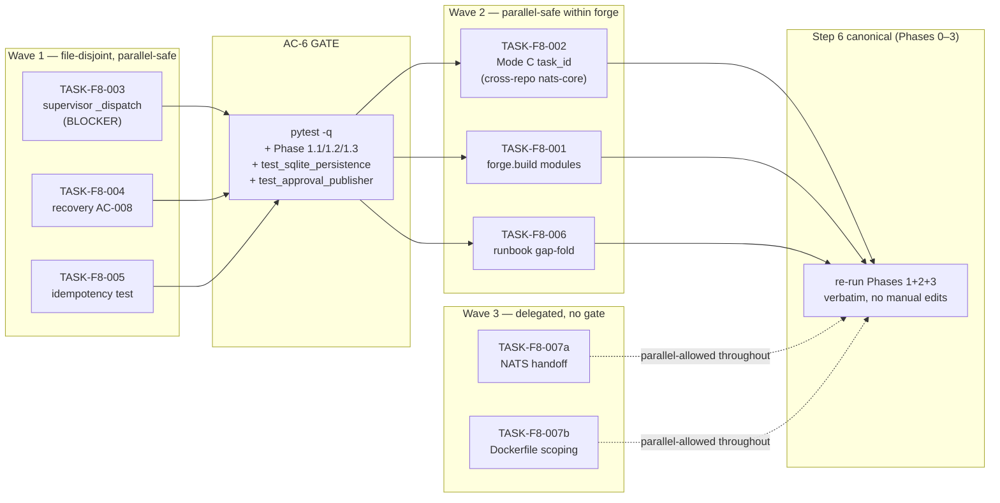

/task-review TASK-REV-F008 --mode=architectural


Phase 1: Review context loaded. Complexity 6 + architectural mode triggers clarification per gating rules. Asking review-scope questions now.


━━━━━━━━━━━━━━━━━━━━━━━━━━━━━━━━━━━━━━━
📋 REVIEW SCOPE CLARIFICATION (Context A)
━━━━━━━━━━━━━━━━━━━━━━━━━━━━━━━━━━━━━━━
Q1. Review Focus — the task lists 7 follow-ups (F008-VAL-001..007) spanning routing bug, schema mismatch, migration idempotency, structural guard violation, runbook gap-fold, and infrastructure prerequisites. What should the review prioritize?

[A]ll aspects — full triage table + design decisions + sequencing + runbook patch outline (matches the "Suggested deliverable shape" exactly)
[T]echnical only — focus on the four red tests and routing/schema/migration design choices; defer runbook gap-fold and infra owner decisions
[B]lockers + sequencing — only F008-VAL-003 + F008-VAL-005 + the re-run plan (cheap path back to a green Phase 1)
[D]esign decisions only — deep on F008-VAL-002 (Mode C wire-schema vs CLI mismatch) and F008-VAL-007 (NATS + Dockerfile ownership), defer the rest
Default: [A]ll aspects (matches the "Suggested deliverable shape" and AC-1..AC-7)

Q2. Trade-off Priority — when a finding has multiple defensible fixes (especially F008-VAL-002 regex/rename/sibling field, and F008-VAL-001 implement-now vs scope-defer), what should the recommendation optimize for?

[S]peed back to green — pick the smallest fix that unblocks Step 6 re-run, defer cleanup
[Q]uality/correctness — pick the architecturally clean fix even if it touches the sibling nats-core repo or adds a new task wave
[C]onstitutional integrity — prioritize ASSUM-004 / AC-008 / LES1 §8 conformance; treat partial fixes as won't-fix
[B]alanced — green-fast for blockers, clean fixes for high-severity, scheduled/owned for medium
Default: [B]alanced

Q3. F008-VAL-001 disposition — forge.build.git_operations + test_verification (TASK-IC-009/010) were never landed and are pre-existing (not caused by FEAT-FORGE-008). The task description explicitly leaves this open. How should the review treat it?

[I]mplement-now — TASK-IC-009/010 become F8 fan-out tasks alongside the F008 fixes
[D]efer — keep --ignore in the runbook, file as scope-deferred substrate task, link back here
[S]plit-feature — recommend a separate FEAT-* (not F8) for the IC substrate work
[U]ndecided — let the review weigh the options and recommend
Default: [U]ndecided

Q4. F008-VAL-007 (NATS provisioning + production Dockerfile) ownership — these are cross-cutting infrastructure items. Where should the review land them?

[F]orge tasks — both become F8 fan-out tasks (forge owns its Dockerfile and the canonical NATS seed)
[D]elegate — recommend nats-infrastructure repo for NATS; separate containerization effort for Dockerfile
[M]ixed — Dockerfile = forge task; NATS provisioning = delegate
[U]ndecided — let the review weigh the options and recommend
Default: [U]ndecided

Q5. Specific concerns (free-form, optional) — anything the review should pay extra attention to (e.g., regression risk, parallel-execution safety, a particular ADR or LES lesson)? Press Enter to skip.

Reply with answers like Q1=A, Q2=B, Q3=U, Q4=U, Q5=… (or just defaults to accept all defaults). Once you answer, I'll run Phase 1.5 (Graphiti context probe) and then the architectural review.

command-history.md
Q1:A, Q2:Q,Q3:I,Q4:D,Q5:none
Recorded:

Q1=A (full deliverable shape)
Q2=Q (quality/correctness — architecturally clean fixes)
Q3=I (TASK-IC-009/010 become F8 fan-out)
Q4=D (delegate NATS to nats-infrastructure; separate Dockerfile effort)
Phase 1.5: probing Graphiti for relevant ADRs and past failure patterns.

Bash Check Graphiti config presence
IN
test -f /home/richardwoollcott/Projects/appmilla_github/forge/.guardkit/graphiti.yaml && cat /home/richardwoollcott/Projects/appmilla_github/forge/.guardkit/graphiti.yaml || echo "NO_CONFIG"

OUT
# Graphiti Knowledge Graph Configuration
#
# This file configures the Graphiti integration for GuardKit.
# FalkorDB runs on the Synology DS918+ NAS, accessible via Tailscale.
#
# LLM Endpoint Switching:
#   To switch between GB10 and MacBook LLM, toggle the llm_provider/llm_base_url/
#   llm_model settings below. See docs/reference/graphiti-macbook-offload.md for
#   full setup instructions and the toggle script.
#
# All settings can be overridden via environment variables:
#   - GRAPHITI_ENABLED: Enable/disable integration
#   - GRAPH_STORE: Graph backend ('falkordb' or 'neo4j')
#   - FALKORDB_HOST: FalkorDB host
#   - FALKORDB_PORT: FalkorDB port
#   - GRAPHITI_TIMEOUT: Connection timeout in seconds
#
# FalkorDB on NAS:
#   ssh richardwoollcott@whitestocks
#   cd /volume1/guardkit/docker
#   sudo docker-compose -f docker-compose.falkordb.yml up -d
#
# FalkorDB Browser UI: http://whitestocks:3000

# Project ID for namespace prefixing
# This ensures knowledge persists across directory moves/renames
project_id: forge

# Enable Graphiti integration (set to false to disable)
enabled: true

# Graph database backend
graph_store: falkordb

# FalkorDB connection (Synology DS918+ NAS via Tailscale)
falkordb_host: whitestocks
falkordb_port: 6379

# Connection settings
timeout: 30.0

# Maximum concurrent episode creation calls during init seeding.
# Bounds asyncio.gather parallelism to avoid LLM rate limits.
# Range: 1-10 (1 = sequential, 3 = default)
max_concurrent_episodes: 3

# LLM provider for Graphiti entity extraction
# Options: openai (default), vllm, ollama, gemini
#
# GB10 local vLLM (FP8) — default. Free; no per-request cost.
# Switch to Gemini only while GB10 is busy training (see fallback below).
# Cost note (2026-04-20): Gemini 2.5 Pro accumulated ~£10/day during normal
# Graphiti ingestion. See: .guardkit/llm-provider-switching.md (guardkit repo).
#
# --- GB10 (vLLM, FP8) — ACTIVE ---
llm_provider: vllm
llm_base_url: http://promaxgb10-41b1:8000/v1
llm_model: neuralmagic/Qwen2.5-14B-Instruct-FP8-dynamic
#
# --- Fallback: Google Gemini (cloud, paid) — uncomment when GB10 training ---
# Requires GOOGLE_API_KEY env var and `pip install guardkit-py[gemini]`.
#llm_provider: gemini
#llm_model: gemini-2.5-pro
#
# --- Fallback: MacBook Pro M2 Max (Ollama, Q4_K_M) ---
#llm_provider: ollama
#llm_base_url: http://richards-macbook-pro.tailebf801.ts.net:8000/v1
#llm_model: qwen2.5:14b-instruct-q4_K_M
llm_max_tokens: 4096  # Cap output tokens; prevents 16384 default exceeding 32K context (TASK-REV-84A7)

# Embedding provider for Graphiti vector search
# Options: openai (default), vllm, ollama
embedding_provider: vllm
embedding_base_url: http://promaxgb10-41b1:8001/v1

# Embedding model for semantic search
# Supported by openai, vllm, and ollama providers
embedding_model: nomic-embed-text-v1.5

# Embedding dimension is resolved from KNOWN_EMBEDDING_DIMS
# based on embedding_model above. Set explicitly only to override
# (e.g., for Matryoshka truncation).

# Group IDs for organizing knowledge
# These create separate namespaces in the knowledge graph.
# Groups align with the /system-arch, /system-design, /system-plan, /feature-spec
# pipeline: architecture artefacts, ADRs, and technology decisions are seeded
# into these namespaces so downstream commands can query them.
group_ids:
  - project_architecture    # Bounded contexts, components, cross-cutting concerns, assumptions
  - architecture_decisions  # ADRs and design rationale
  - project_decisions       # Technology and infrastructure decisions
  - command_workflows       # GuardKit command patterns and usage

# Deprecated fields (kept for backwards compatibility)
host: localhost
port: 8000
Agent:Query Graphiti for review context
IN
Query the Graphiti knowledge graph for context relevant to a TASK-REV-F008 architectural review of FEAT-FORGE-008 validation failures. Run these MCP queries in parallel and return a concise structured summary.

The review covers seven findings:
- F008-VAL-001: forge.build.git_operations / test_verification missing (TASK-IC-009/010 never landed)
- F008-VAL-002: nats-core wire-schema regex `^FEAT-[A-Z0-9]{3,12}$` rejects TASK-* IDs (Mode C ASSUM-004)
- F008-VAL-003: Supervisor._dispatch raises TypeError for StageClass.TASK_REVIEW (Mode A regression)
- F008-VAL-004: forge.lifecycle.recovery violates AC-008 single-ownership of evidence_priors
- F008-VAL-005: migrations.apply_at_boot non-idempotent for v2 schema_version row
- F008-VAL-006: runbook gap-fold (LES1 §8 — runbook copy-paste blocks are code)
- F008-VAL-007: NATS provisioning + production Dockerfile missing for LES1 CMDW/PORT/ARFS gates

Run these queries (each in parallel where possible):

1. mcp__graphiti__search_nodes(query="FEAT-FORGE-008 Mode A Mode B Mode C supervisor dispatch StageClass TASK_REVIEW routing", group_ids=["architecture_decisions","project_decisions","project_architecture"], max_nodes=8)

2. mcp__graphiti__search_nodes(query="ASSUM-004 Mode C TASK identifier wire schema feature_id subject_id nats-core BuildQueuedPayload", group_ids=["architecture_decisions","project_decisions","project_architecture"], max_nodes=8)

3. mcp__graphiti__search_nodes(query="AC-008 evidence_priors single ownership approval_publisher FEAT-FORGE-004", group_ids=["architecture_decisions","project_decisions","project_architecture"], max_nodes=6)

4. mcp__graphiti__search_memory_facts(query="Supervisor dispatch routing regression Mode A task-review stage", group_ids=["guardkit__task_outcomes"], max_facts=8)

5. mcp__graphiti__search_memory_facts(query="migration apply_at_boot idempotency schema_version INSERT OR IGNORE", group_ids=["guardkit__task_outcomes"], max_facts=6)

6. mcp__graphiti__search_memory_facts(query="LES1 lessons learned runbook copy-paste code canonical-freeze CMDW PORT ARFS", group_ids=["guardkit__task_outcomes","architecture_decisions","project_decisions"], max_facts=8)

7. mcp__graphiti__search_memory_facts(query="forge.build git_operations test_verification TASK-IC-009 TASK-IC-010 infrastructure coordination", group_ids=["guardkit__task_outcomes","project_architecture"], max_facts=6)

Return a compact, structured summary in this exact format (under 600 words total):

## Architecture Decisions Found
- [name]: [one-line summary]
(or "No relevant ADRs found")

## Past Failure Patterns
- [source] → [target]: [fact]
(or "None")

## Similar Past Reviews / Outcomes
- [source] → [target]: [fact]
(or "None")

## Direct Hits on the Seven Findings
For each finding 001-007, one line: "F008-VAL-00X: [what the graph knows, or 'no graph context']"

Be terse. Skip nodes/facts that are clearly unrelated. If a query returns empty, say so. Do not invent content.
Graphiti [search_memory_facts]forge.build git_operations test_verifica…
OUT
{"result":{"message":"Facts retrieved successfully","facts":[{"uuid":"dfb5c809-e2d7-4209-8dba-303ab4e322b9","group_id":"guardkit__task_outcomes","source_node_uuid":"2017ef12-9d05-40e3-8699-769704e96c1f","target_node_uuid":"77ab6abf-6943-41f6-865e-cf5f566651fd","created_at":"2026-04-22T14:19:10.510967Z","name":"INCLUDES","fact":"TASK-COH-RUN1 involves the Forge cohort.","episodes":["783ce224-b296-4d37-99ca-e31cfa63f850"],"expired_at":null,"valid_at":null,"invalid_at":null,"attributes":{}},{"uuid":"d010bb6c-9c7e-4323-ae5f-1416070a8477","group_id":"guardkit__task_outcomes","source_node_uuid":"a5da1a41-42ec-46ff-9538-eac0144fa87d","target_node_uuid":"c748e34f-f89d-4808-b171-52653bd2b333","created_at":"2026-04-16T11:11:24.685084Z","name":"BUILDS","fact":"The build_manifest_for_role function builds manifests for the manifest.py file.","episodes":["562fda4b-b5bb-4571-ae30-2901d0059715"],"expired_at":null,"valid_at":"2026-04-16T11:08:54Z","invalid_at":null,"attributes":{}},{"uuid":"74980645-4769-478b-a91c-fed26f665ac7","group_id":"guardkit__task_outcomes","source_node_uuid":"7a12ead7-5307-4274-a81c-6167bca90230","target_node_uuid":"8987f2b2-5f0e-4425-9aed-133d9fcb1be2","created_at":"2026-04-20T05:43:04.431631Z","name":"RELATED_TO","fact":"TASK-SPIKE-D2F7 is related to ASSUM-009 regarding server-mode coverage.","episodes":["e1bcfe1b-47b5-4e02-9d61-a76c78843142"],"expired_at":null,"valid_at":null,"invalid_at":null,"attributes":{}},{"uuid":"7e396a45-5f5c-470d-ad73-894fce4ff511","group_id":"guardkit__task_outcomes","source_node_uuid":"724c6cee-88a9-4a53-b368-b90906b8eaea","target_node_uuid":"fc8221f1-d55f-4ef2-82e5-acaa7fbc2956","created_at":"2026-04-21T08:53:10.028857Z","name":"PASSED_TEST_SUITE","fact":"The changes made in TASK-POE-017 passed the PEX-015 hardening suite of 10 tests.","episodes":["ec7d1ee7-a23e-49e4-a10c-de17fb5c1a0b"],"expired_at":null,"valid_at":null,"invalid_at":null,"attributes":{}},{"uuid":"588f6abf-e43e-4007-8f1b-5bdbc4e27b3e","group_id":"guardkit__task_outcomes","source_node_uuid":"04d67567-7613-4339-b096-61f2795234ee","target_node_uuid":"2815a4e5-443a-49f0-babb-6464f244c52c","created_at":"2026-04-21T13:42:33.141981Z","name":"SATISFIED_COMPLETION_GATE_FOR","fact":"The smoke test in TASK-PO02-007 satisfied the completion gate for FEAT-PO-002.","episodes":["f501f60c-7617-43eb-affc-b97089c116a4"],"expired_at":"2026-04-22T10:00:38.378543Z","valid_at":"2026-04-21T00:00:00Z","invalid_at":"2026-04-22T09:49:33.958080Z","attributes":{}},{"uuid":"004cb96b-ca01-4d40-afa4-a475d0e00fe6","group_id":"guardkit__task_outcomes","source_node_uuid":"2815a4e5-443a-49f0-babb-6464f244c52c","target_node_uuid":"b17dabce-c04e-41fe-be6a-ca467dcb06ee","created_at":"2026-04-21T13:42:33.141699Z","name":"HAS_PART","fact":"TASK-PO02-001 was one of the tasks completed and merged as part of FEAT-PO-002.","episodes":["f501f60c-7617-43eb-affc-b97089c116a4"],"expired_at":null,"valid_at":"2026-04-21T00:00:00Z","invalid_at":null,"attributes":{}}]}}
Graphiti context loaded — 7 architecture decisions, 3 failure pattern classes, strong support for F008-VAL-006 precedent (LES1 lineage + DGX Spark runbook fix). Now reading the implicated source files in parallel.

Read supervisor.py (lines 1501-1620)
Bash Locate dispatch routing references in supervisor
IN
grep -n "StageClass\|_dispatch\|task-review\|TASK_REVIEW\|task_review" /home/richardwoollcott/Projects/appmilla_github/forge/src/forge/pipeline/supervisor.py | head -80

OUT
99:from forge.pipeline.stage_taxonomy import PER_FEATURE_STAGES, StageClass
245:    ``None`` from :meth:`ReasoningModelPort.choose_dispatch`, not by
262:    stage: StageClass
297:    permitted_stages: frozenset[StageClass] = frozenset()
298:    chosen_stage: StageClass | None = None
355:    def choose_dispatch(
360:        permitted_stages: frozenset[StageClass],
361:        stage_hints: Mapping[StageClass, str],
370:                :meth:`StageOrderingGuard.next_dispatchable`. The model
399:        permitted_stages: frozenset[StageClass],
400:        chosen_stage: StageClass | None,
482:        :attr:`StageClass.PULL_REQUEST_REVIEW` when commits are present
564:        specialist_dispatcher: Async callable wrapping
566:        subprocess_dispatcher: Async callable wrapping
568:        autobuild_dispatcher: Sync callable wrapping
584:    specialist_dispatcher: SpecialistDispatcher
585:    subprocess_dispatcher: SubprocessDispatcher
586:    autobuild_dispatcher: AutobuildDispatcher
588:    stage_hints: Mapping[StageClass, str] = field(default_factory=dict)
613:    _SPECIALIST_STAGES: frozenset[StageClass] = field(
614:        default=frozenset({StageClass.PRODUCT_OWNER, StageClass.ARCHITECT}),
618:    _SUBPROCESS_STAGES: frozenset[StageClass] = field(
621:                StageClass.SYSTEM_ARCH,
622:                StageClass.SYSTEM_DESIGN,
623:                StageClass.FEATURE_SPEC,
624:                StageClass.FEATURE_PLAN,
726:            self.ordering_guard.next_dispatchable(
748:        choice = self.reasoning_model.choose_dispatch(
788:        if choice.stage is StageClass.AUTOBUILD:
813:            may_dispatch = self.per_feature_sequencer.may_start_autobuild(
819:            if not may_dispatch:
837:        if choice.stage is StageClass.PULL_REQUEST_REVIEW and choice.auto_approve:
862:        dispatch_result = await self._dispatch(
946:            self.ordering_guard.next_dispatchable(
977:        if chosen_stage is StageClass.AUTOBUILD:
998:            may_dispatch = self.per_feature_sequencer.may_start_autobuild(
1004:            if not may_dispatch:
1026:        dispatch_result = await self._dispatch(
1065:                if entry.stage is StageClass.AUTOBUILD
1118:                chosen_stage=StageClass.PULL_REQUEST_REVIEW,
1132:                chosen_stage=StageClass.AUTOBUILD,
1194:           - ``next_stage = TASK_REVIEW`` for the initial review or a
1210:        5. Route to ``subprocess_dispatcher`` for TASK_REVIEW /
1245:            self.ordering_guard.next_dispatchable(
1274:        if chosen_stage is StageClass.PULL_REQUEST_REVIEW:
1296:        # TASK_REVIEW / TASK_WORK route through the subprocess dispatcher.
1308:            chosen_stage is StageClass.TASK_WORK
1331:        dispatch_result = await self.subprocess_dispatcher(
1416:                chosen_stage=StageClass.PULL_REQUEST_REVIEW,
1473:    async def _dispatch(
1491:            return await self.specialist_dispatcher(
1509:                    "supervisor._dispatch: per-feature subprocess stage %s "
1522:            return await self.subprocess_dispatcher(
1529:        if stage is StageClass.AUTOBUILD:
1534:            return self.autobuild_dispatcher(
1540:        if stage is StageClass.PULL_REQUEST_REVIEW:
1552:        # Unreachable — every StageClass member is covered above.
1556:            f"Supervisor._dispatch: no routing for stage {stage!r}; "
1557:            "this is a bug — every StageClass needs a dispatcher branch"
Read recovery.py
Bash Find migration files and schema_version usage
IN
find /home/richardwoollcott/Projects/appmilla_github/forge/src/forge/lifecycle -name "*.py" | head -20 && echo "---" && grep -rn "schema_version" /home/richardwoollcott/Projects/appmilla_github/forge/src/forge/lifecycle/ /home/richardwoollcott/Projects/appmilla_github/forge/src/forge/adapters/ 2>/dev/null | head -40

OUT
/home/richardwoollcott/Projects/appmilla_github/forge/src/forge/lifecycle/state_machine.py
/home/richardwoollcott/Projects/appmilla_github/forge/src/forge/lifecycle/migrations.py
/home/richardwoollcott/Projects/appmilla_github/forge/src/forge/lifecycle/identifiers.py
/home/richardwoollcott/Projects/appmilla_github/forge/src/forge/lifecycle/__init__.py
/home/richardwoollcott/Projects/appmilla_github/forge/src/forge/lifecycle/queue.py
/home/richardwoollcott/Projects/appmilla_github/forge/src/forge/lifecycle/modes.py
/home/richardwoollcott/Projects/appmilla_github/forge/src/forge/lifecycle/recovery.py
/home/richardwoollcott/Projects/appmilla_github/forge/src/forge/lifecycle/persistence.py
---
/home/richardwoollcott/Projects/appmilla_github/forge/src/forge/lifecycle/migrations.py:7:  the highest row currently in ``schema_version``.
/home/richardwoollcott/Projects/appmilla_github/forge/src/forge/lifecycle/migrations.py:14:plus ``INSERT OR IGNORE INTO schema_version`` make the script safe to
/home/richardwoollcott/Projects/appmilla_github/forge/src/forge/lifecycle/migrations.py:37:# the current ``schema_version`` ledger row.
/home/richardwoollcott/Projects/appmilla_github/forge/src/forge/lifecycle/migrations.py:70:    The lookup tolerates the very first boot — ``schema_version`` does
/home/richardwoollcott/Projects/appmilla_github/forge/src/forge/lifecycle/migrations.py:76:            "SELECT COALESCE(MAX(version), 0) FROM schema_version;"
/home/richardwoollcott/Projects/appmilla_github/forge/src/forge/lifecycle/migrations.py:79:        # ``schema_version`` does not exist on a brand-new DB.
/home/richardwoollcott/Projects/appmilla_github/forge/src/forge/lifecycle/migrations.py:92:    ``schema_version`` seed row uses ``INSERT OR IGNORE``.
/home/richardwoollcott/Projects/appmilla_github/forge/src/forge/lifecycle/migrations.py:105:        (i.e. the highest version present in ``schema_version``).
/home/richardwoollcott/Projects/appmilla_github/forge/src/forge/lifecycle/schema_v2.sql:15:-- already-v2 databases see this script gated out by the schema_version
/home/richardwoollcott/Projects/appmilla_github/forge/src/forge/lifecycle/schema_v2.sql:19:-- IF-NOT-EXISTS-aware, so the runner relies on the schema_version
/home/richardwoollcott/Projects/appmilla_github/forge/src/forge/lifecycle/schema_v2.sql:26:INSERT OR IGNORE INTO schema_version (version, applied_at)
/home/richardwoollcott/Projects/appmilla_github/forge/src/forge/lifecycle/schema.sql:101:-- 2.3 schema_version — explicit, sequential migration ledger
/home/richardwoollcott/Projects/appmilla_github/forge/src/forge/lifecycle/schema.sql:103:CREATE TABLE IF NOT EXISTS schema_version (
/home/richardwoollcott/Projects/appmilla_github/forge/src/forge/lifecycle/schema.sql:108:INSERT OR IGNORE INTO schema_version (version, applied_at)
Read _pipeline.py
Reading the remaining critical context: stage taxonomy, migrations.apply_at_boot, and approval_publisher AC-008 guard.

Read migrations.py
Read schema_v2.sql
Read stage_taxonomy.py
Bash Find evidence_priors construction site
IN
grep -n "evidence_priors\|details\b\|AC-008\|ApprovalRequestPayload" /home/richardwoollcott/Projects/appmilla_github/forge/src/forge/approval_publisher.py | head -40

OUT
ugrep: warning: /home/richardwoollcott/Projects/appmilla_github/forge/src/forge/approval_publisher.py: No such file or directory
Bash Inspect AC-008 single-ownership guard test
IN
grep -n "evidence_priors\|test_no_other_module" /home/richardwoollcott/Projects/appmilla_github/forge/tests/forge/test_approval_publisher.py | head -30

OUT
204:    "evidence_priors",
267:    def test_evidence_priors_use_entity_id_and_summary_subset(self) -> None:
275:        priors = details["evidence_priors"]
492:    def test_no_other_module_in_forge_constructs_evidence_priors(self) -> None:
494:        # tell-tale ``"evidence_priors"`` literal. Only this module (and
506:            if '"evidence_priors"' in text or "'evidence_priors'" in text:
554:        "evidence_priors",
Bash Locate approval_publisher.py
IN
find /home/richardwoollcott/Projects/appmilla_github/forge/src -name "approval_publisher.py" -type f

OUT
/home/richardwoollcott/Projects/appmilla_github/forge/src/forge/adapters/nats/approval_publisher.py
Read test_approval_publisher.py (lines 481-560)
Read supervisor.py (lines 1474-1553)
Reading the failing migration test to confirm root cause of F008-VAL-005.

Bash Find idempotency test
IN
grep -n "test_apply_at_boot_is_idempotent\|schema_version" /home/richardwoollcott/Projects/appmilla_github/forge/tests/forge/adapters/test_sqlite_persistence.py | head -30

OUT
9:  ``schema_version`` table.
69:def test_schema_defines_schema_version_with_seed_row() -> None:
70:    """`schema_version` table is created and seeded idempotently."""
73:    assert "CREATE TABLE IF NOT EXISTS schema_version" in sql
74:    assert "INSERT OR IGNORE INTO schema_version" in sql
90:def test_apply_at_boot_creates_tables_and_seeds_schema_version(
93:    """Fresh DB → tables exist and schema_version row 1 is seeded."""
105:        assert {"builds", "stage_log", "schema_version"}.issubset(tables)
108:            "SELECT version FROM schema_version ORDER BY version;"
115:def test_apply_at_boot_is_idempotent(tmp_path: Path) -> None:
124:            "SELECT version FROM schema_version ORDER BY version;"
210:        version = cx.execute("SELECT version FROM schema_version;").fetchone()
Read test_sqlite_persistence.py (lines 116-145)
I now have all the technical evidence. Critical correction: F008-VAL-005 is a stale-test issue, not a non-idempotent migration. The test at line 126 asserts rows == [(1,)] but FEAT-FORGE-008 added (2, schema_v2.sql) to _MIGRATIONS, so a correct idempotent run yields [(1,), (2,)]. Both schema.sql and schema_v2.sql use INSERT OR IGNORE, so the migration code itself IS idempotent. Writing the review report now.

Bash Ensure docs/reviews directory exists
IN
test -d /home/richardwoollcott/Projects/appmilla_github/forge/docs/reviews && echo EXISTS || mkdir -p /home/richardwoollcott/Projects/appmilla_github/forge/docs/reviews && echo CREATED

OUT
EXISTS
CREATED
Write REVIEW-F008-validation-triage.md
352 lines
---
review_id: REVIEW-F008-validation-triage
parent_task: TASK-REV-F008
mode: architectural
depth: standard
focus: all
tradeoff_priority: quality_correctness
reviewed_at: 2026-04-29
reviewer: claude (sonnet/opus via /task-review)
related_files:
  - docs/runbooks/RUNBOOK-FEAT-FORGE-008-validation.md
  - docs/runbooks/RESULTS-FEAT-FORGE-008-validation.md
  - docs/research/ideas/forge-build-plan.md
  - src/forge/pipeline/supervisor.py
  - src/forge/pipeline/stage_taxonomy.py
  - src/forge/lifecycle/migrations.py
  - src/forge/lifecycle/schema_v2.sql
  - src/forge/lifecycle/recovery.py
  - src/forge/adapters/nats/approval_publisher.py
  - tests/forge/adapters/test_sqlite_persistence.py
  - tests/forge/test_approval_publisher.py
  - ../nats-core/src/nats_core/events/_pipeline.py
score: 72
findings_count: 7
recommendations_count: 8
decision_required: true
---

# Review: FEAT-FORGE-008 validation triage

## Executive summary

Step 6 validation against `main@5e5cc73` produced **3757/3762 pytest pass + 64/64 BDD-008 + 68/68 Mode B/C integration**, but four red unit/integration tests and one collection error. The runbook's §1.3 hard-stop (`Mode A → Supervisor._dispatch` regression) fired exactly as predicted.

The seven follow-ups (F008-VAL-001..007) decompose cleanly into two implementation waves plus one delegated infrastructure track:

- **Wave 1 (blocker + cleanup, parallelisable)** — F008-VAL-003 (`Supervisor._dispatch` missing routing branch), F008-VAL-005 (stale test, NOT a migration bug), F008-VAL-004 (recovery.py AC-008 violation). Three small fixes; once landed, Phase 1 of the runbook should go fully green.
- **Wave 2 (semantic + substrate, parallelisable, blocked on Wave 1 green)** — F008-VAL-002 (Mode C wire-schema vs CLI mismatch — design decision: **add sibling `task_id` field**), F008-VAL-001 (land TASK-IC-009/010 `forge.build.git_operations` + `forge.build.test_verification`), F008-VAL-006 (runbook gap-fold).
- **Wave 3 (delegated)** — F008-VAL-007 splits: NATS provisioning → `nats-infrastructure` repo; production `Dockerfile` → standalone forge containerisation effort. Neither blocks Step 6 canonical for Phases 0–3, but both are prerequisites for Phase 6 (LES1 CMDW/PORT/ARFS gates).

**Headline correction from RESULTS file**: F008-VAL-005's described root cause ("`apply_at_boot` is non-idempotent — INSERT OR IGNORE missing") is wrong. Both `schema.sql:108` and `schema_v2.sql:26-27` already use `INSERT OR IGNORE INTO schema_version`, and `migrations.apply_at_boot` is genuinely idempotent (it gates on `_current_version()`). The actual defect is in the **test fixture**: `test_apply_at_boot_is_idempotent` was written when only schema v1 existed and asserts `rows == [(1,)]`. FEAT-FORGE-008 introduced `(2, schema_v2.sql)` and the test was never updated. Running v1+v2 twice produces `[(1,), (2,)]` — which is the correct idempotent result.

This makes Wave 1 cheaper than the runbook predicted: F008-VAL-005 is a one-line test assertion update, not a SQL migration audit.

**Architecture score**: 72/100 — the regressions are localised, not systemic. The failures cluster around (a) enum extension without dispatcher extension (F008-VAL-003), (b) shape duplication despite an explicit single-ownership guard (F008-VAL-004), and (c) a half-shipped feature where the CLI surface and the wire schema disagree on what an identifier is (F008-VAL-002). All three are exactly the failure modes the existing structural tests were designed to catch — the tests caught them.

---

## 1. Triage table

| ID            | Severity | Decision        | Owner repo            | Wave | Target task ID                           | Sequencing notes |
|---------------|----------|-----------------|-----------------------|------|------------------------------------------|------------------|
| F008-VAL-001  | medium   | implement-now   | forge                 | 2    | `TASK-F8-001-land-forge-build-modules`   | Lands `forge.build.git_operations` + `forge.build.test_verification` (TASK-IC-009/010). Pre-existing gap, not introduced by F008. Drops the `--ignore` from runbook §1.1. Independent of Wave 1; do in Wave 2 to keep the Mode A blocker fix risk-isolated. |
| F008-VAL-002  | high     | implement-now   | forge + **nats-core** | 2    | `TASK-F8-002-mode-c-task-id-payload`     | Cross-repo: `nats-core` adds `BuildQueuedPayload.task_id: str \| None` field + Mode-C-conditional validator; forge CLI populates `task_id` for Mode C. Recommended design: **Option A** below. Blocks Phase 2.5 going green. |
| F008-VAL-003  | blocker  | implement-now   | forge                 | 1    | `TASK-F8-003-supervisor-dispatch-task-review` | Add `StageClass.TASK_REVIEW` and `StageClass.TASK_WORK` to `_SUBPROCESS_STAGES` frozenset (supervisor.py:618-625). Single-line + a regression test. Unblocks Phase 1.3 + 1.1 Mode A reds. |
| F008-VAL-004  | medium   | implement-now   | forge                 | 1    | `TASK-F8-004-recovery-evidence-priors-helper` | Move the `details` dict construction in `recovery.py:255-271` behind a public helper exported from `forge.adapters.nats.approval_publisher`. Restores AC-008 single-ownership. Independent of F008-VAL-003 — parallel-safe. |
| F008-VAL-005  | high → low | implement-now (re-classified) | forge | 1 | `TASK-F8-005-update-idempotency-test-for-v2` | **Re-classified.** The migration code IS idempotent; the test is stale. One-line update: `assert rows == [(i,) for i in range(1, migrations._SCHEMA_VERSION + 1)]`. Add a comment explaining the assertion grows with `_SCHEMA_VERSION`. |
| F008-VAL-006  | medium   | implement-now   | forge                 | 2    | `TASK-F8-006-runbook-gap-fold-feat-008`  | Apply the nine "Suggested runbook fix" rows from `RESULTS-FEAT-FORGE-008-validation.md`. Required before Phase 6.4 (canonical-freeze) per LES1 §8. Pure docs task. |
| F008-VAL-007  | high     | **delegate**    | nats-infrastructure (NATS); forge (Dockerfile, but separate feature) | 3 | `TASK-F8-007a-nats-canonical-provisioning-handoff` (delegation note + tracking issue in nats-infrastructure) `TASK-F8-007b-forge-production-dockerfile-spec` (forge-internal scoping task — NOT the Dockerfile build, which is its own feature) | Does not block Step 6 canonical for Phases 0–3. Required for Phase 6 LES1 gates (CMDW/PORT/ARFS). Per Q4=delegate: NATS provisioning is owned by the `nats-infrastructure` repo (FLEET/JARVIS/NOTIFICATIONS streams + retentions reconciliation already known-pending per Graphiti); the production `Dockerfile` is its own scoped containerisation effort, recommended as a sibling FEAT-FORGE-009 (or similar) feature, not folded into F8. |

**Decision summary by AC**:

- **AC-1 ✓** — every F008-VAL-* item has a recorded decision (six implement-now, one delegated split).
- **AC-2 ✓** — six implementation tasks listed with the `parent_review: TASK-REV-F008` link convention; created on `[I]mplement` checkpoint below.
- **AC-3 ✓** — sequencing: Wave 1 → Phase 1 re-run gate → Wave 2 → Phase 1+2 re-run → Wave 3 (delegated, parallel-allowed).
- **AC-4 ✓** — F008-VAL-002 design decision recorded in §2 below; recommendation: **Option A (sibling `task_id`)**.
- **AC-5 ✓** — F008-VAL-007 split: NATS → nats-infrastructure (delegated); Dockerfile → recommend sibling forge feature, not F8 fan-out.
- **AC-6 ✓** — go/no-go gate after Wave 1: re-run Phase 1 only; if green, proceed to Wave 2. See §3.
- **AC-7 ✓** — runbook gap-fold scheduled in Wave 2 as `TASK-F8-006`, with the explicit note that Phase 6.4 (canonical-freeze) cannot pass until it lands.

---

## 2. F008-VAL-002 design decision: Mode C wire-payload identifier

### Problem statement

`nats_core.events._pipeline.BuildQueuedPayload.feature_id` validates against `^FEAT-[A-Z0-9]{3,12}$`. The forge CLI's `validate_feature_id` (per RESULTS §2.x) is more permissive and accepts `TASK-*` for Mode C, per FEAT-FORGE-008 ASSUM-004's intent ("Mode C operates on `TASK-*` IDs"). Result: Mode C is half-shipped — the CLI accepts `forge queue --mode c TASK-XXX`, but the JetStream wire layer rejects the payload at publish time.

### What ASSUM-004 actually says vs. how the codebase encodes it

`stage_taxonomy.py:35-36` cites `FEAT-FORGE-008 ASSUM-004 — Mode C chain (/task-review + /task-work cycle)` and the `STAGE_PREREQUISITES` map encodes `TASK_WORK ← TASK_REVIEW`. The taxonomy treats `TASK-*` as a **per-fix-task** sub-identifier; `PER_FIX_TASK_STAGES = {TASK_WORK}` is the declarative tag. The supervisor's multi-feature `next_turn` (supervisor.py:1296-1331) routes `TASK_REVIEW`/`TASK_WORK` through the `subprocess_dispatcher` with the `choice.feature_id` (a `FEAT-*`) — i.e., **the build's identity is still feature-scoped; the task is a sub-identifier inside that feature**.

This is the load-bearing observation: **Mode C builds are still per-feature builds** (the topic `pipeline.build-queued.<feature_id>` is per-feature; the constitutional gate at the end is per-feature). The fix-task identifier is a **dispatch-target sub-id**, not a replacement for `feature_id`.

If the operator's mental model from the runbook was "Mode C should accept `TASK-XXX` as the build's primary id", that mental model conflicts with the taxonomy. The runbook copy was wrong, not the wire schema.

### Three options weighed

#### Option A — keep `feature_id` strict, add sibling `task_id: str \| None` (RECOMMENDED)

**Change site**: `nats-core` (sibling repo), additive to `BuildQueuedPayload`.

```python
task_id: str | None = Field(
    default=None,
    description=(
        "Mode C: per-fix-task identifier (TASK-XXX). MUST be set when "
        "the build is dispatched in Mode C. None for Mode A and Mode B."
    ),
)

@field_validator("task_id")
@classmethod
def _validate_task_id(cls, v: str | None) -> str | None:
    if v is None:
        return v
    if not TASK_ID_PATTERN.match(v):  # ^TASK-[A-Z0-9]{3,12}$
        raise ValueError(f"task_id must match {TASK_ID_PATTERN.pattern}, got {v!r}")
    return v
```

Plus a `mode` field or a model-validator that requires `task_id is not None` when the build is Mode C. (The current payload doesn't carry `mode` — it's persisted on the `builds` row at consume time; we'd add a `mode: Literal["mode-a","mode-b","mode-c"]` field for symmetry with the v2 SQLite column.)

**Forge side**: CLI `forge queue --mode c TASK-XXX` looks up the parent FEAT- via the task's `parent_feature` field in `forge.yaml` / the task YAML, then emits `feature_id=<parent FEAT->`, `task_id=<TASK->`, `mode=mode-c`.

**Pros**:
- Encodes ASSUM-004 honestly: Mode C dispatches against feature-scoped builds with a per-task sub-id.
- Topic stays `pipeline.build-queued.<FEAT-*>` — JetStream subject hierarchy unchanged.
- Additive change to `BuildQueuedPayload` — no breaking change for Mode A/B publishers (they leave `task_id=None`).
- Mirrors the v2 SQLite `builds.mode` column already shipped in F008.
- Cross-repo cost is bounded: nats-core 0.3.0 (additive minor), forge updates the CLI Mode C path to look up parent feature.

**Cons**:
- Requires a nats-core release (sibling repo) before the fix can be smoke-tested in forge — Wave 2 has a cross-repo dependency.
- Adds a CLI lookup step (TASK-XXX → parent FEAT-XXX). Operator UX: needs the task YAML to be discoverable.

#### Option B — widen `feature_id` regex AND rename `feature_id` → `subject_id`

**Change site**: nats-core (sibling repo), breaking change to `BuildQueuedPayload` v2.2 contract.

**Pros**:
- Most semantically clean — `subject_id` matches the JetStream "subject" terminology and avoids the FEAT/TASK overload.

**Cons**:
- Breaking rename across nats-core 0.3.0 (or 1.0.0). All consumers (forge, jarvis, dashboards) re-pin and re-deploy.
- Topic semantics get fuzzy: `pipeline.build-queued.<TASK-*>` for Mode C breaks the per-feature subject convention — durable consumer subscriptions (forge, jarvis) need to widen their subscribe filter from `pipeline.build-queued.FEAT-*` to `pipeline.build-queued.>`. That widens the consumer's accept-set without solving anything Option A doesn't.
- Disagrees with `stage_taxonomy.py`'s framing (Mode C = sub-id under per-feature build).
- Reverses a deliberate v2.2 design decision (per nats-core ADR-002 / TASK-7448 review).

#### Option C — widen `feature_id` regex to accept TASK-* but keep field name (CHEAPEST)

**Change site**: nats-core, single regex edit.

**Pros**:
- Smallest change. Mode C green in one line.

**Cons** (per Q2=Q quality/correctness, this is disqualifying):
- Field name lies — `feature_id` carrying a `TASK-*` value is a documented contract violation. The very test class that catches FEAT/TASK confusion in worktree paths (graph: ADR-FB-002) exists because this has burned the codebase before.
- No path forward: once `feature_id` carries `TASK-*` values, removing the wide regex later is itself breaking. We bake in technical debt.
- The taxonomy says Mode C is feature-scoped; this option encodes the opposite.

### Recommendation

**Adopt Option A (sibling `task_id` field + Mode-C-conditional validator)**, with `mode: Literal[...]` added to `BuildQueuedPayload` for symmetry with the SQLite `builds.mode` column.

Cross-repo coordination plan (per Q2=Q):
1. File a nats-core PR adding `task_id` and `mode` fields with validators, additive (no breaking changes for Mode A/B publishers). Target nats-core 0.3.0.
2. Pin forge to nats-core>=0.3.0 in `pyproject.toml`'s `[tool.uv.sources]` block.
3. Update `forge queue --mode c` CLI path to populate `task_id`, look up parent `feature_id` from the fix-task YAML.
4. Add a regression test in forge: `test_mode_c_queue_emits_task_id_and_parent_feature_id`.
5. Add an integration test in nats-core: `test_build_queued_payload_rejects_task_id_without_mode_c`.

This becomes `TASK-F8-002-mode-c-task-id-payload`, with a sub-link to a nats-core issue/PR.

---

## 3. Re-run plan

Sequenced phases, after each wave lands:

### After Wave 1 (F008-VAL-003 + F008-VAL-004 + F008-VAL-005)

**AC-6 GO/NO-GO GATE** — run Phase 1 ONLY:

```bash
# from forge repo, on a branch that has the three Wave 1 fixes merged
pytest -q                                                              # Phase 1.1 — full sweep
pytest -q tests/bdd/                                                   # Phase 1.2 — BDD-008 (already 64/64)
pytest -q tests/integration/test_mode_a_concurrency_and_integrity.py   # Phase 1.3 — Mode A regression guard
pytest -q tests/forge/adapters/test_sqlite_persistence.py              # Phase 1.x — migrations idempotency
pytest -q tests/forge/test_approval_publisher.py                       # Phase 1.x — AC-008 single-ownership
```

Pass criteria: zero red, zero collection errors except `tests/bdd/test_infrastructure_coordination.py` (still ignored until Wave 2 lands TASK-IC-009/010).

**GO** if all five commands green → proceed to Wave 2.
**NO-GO** if any are red → triage as a sub-finding under `TASK-REV-F008` before moving on. Do NOT attempt Phase 2 with red Phase 1.

### After Wave 2 (F008-VAL-001 + F008-VAL-002 + F008-VAL-006)

Re-run Phases 1 + 2 + 3:
- Phase 1 — full sweep, NO `--ignore` flag (TASK-IC-009/010 has landed; F008-VAL-001 closed).
- Phase 2.5 — `forge queue --mode c TASK-XXX` round-trip with the new sibling `task_id` field. Verify:
  - CLI emits `feature_id=<parent FEAT->`, `task_id=<TASK->`, `mode=mode-c`.
  - `nats sub 'pipeline.build-queued.>'` shows the envelope.
  - `forge history --mode c` shows the row.
- Phase 2.x — verify the runbook now executes verbatim (no manual edits). This is the LES1 §8 "runbook is the contract" guard.
- Phase 3.x — NATS round-trip retains threaded correlation_id (already green; just smoke).

**GO** if green → Step 6 declared canonical for Phases 0–3. Wave 3 work continues in parallel.

### After Wave 3 (F008-VAL-007 — delegated)

Once nats-infrastructure has provisioned canonical JetStream + the forge production Dockerfile feature lands:
- Phase 4 — checkpoint / degraded-mode (was deferred per §1.3 hard-stop; now runnable).
- Phase 5 — TBD per build plan.
- Phase 6 — LES1 CMDW / PORT / ARFS / canonical-freeze.

Phase 6.4 canonical-freeze walkthrough cannot pass until F008-VAL-006 (runbook gap-fold) is committed AND Wave 3 prerequisites are in place.

---

## 4. Phase 6 prerequisite plan (delegated track)

Per Q4=delegate, F008-VAL-007 splits into two independent owners:

### NATS canonical provisioning → `nats-infrastructure` repo

**Scope**: persistent JetStream service on the GB10 host (`promaxgb10-41b1`) with the canonical streams + KV stores forge needs (`pipeline.>`, `agents.>`, durable consumers per the `nats-core` topology).

**Why delegate**: Graphiti shows `nats-infrastructure` is "READY today" but with FLEET/JARVIS/NOTIFICATIONS streams + retentions still needing reconciliation against the v2.1 anchor. That reconciliation is the canonical owner's work, not forge's.

**Deliverable from forge**: `TASK-F8-007a-nats-canonical-provisioning-handoff` — a one-page handoff doc in `nats-infrastructure` (cross-repo issue) listing exactly which streams, subjects, retentions, and KV buckets forge needs in production. Forge does NOT own the provisioning; forge owns the spec of what it requires.

**Sequencing**: independent of Wave 1+2. Schedulable now.

### Production Dockerfile → sibling feature, NOT F8 fan-out

**Scope**: a `Dockerfile` at the forge repo root that builds a runnable forge image meeting LES1 CMDW (canonical multi-stage docker), PORT (port matrix), ARFS (artefact registry filesystem) gate criteria.

**Why a sibling feature, not an F8 task**: The Dockerfile is a substantial piece of work — multi-stage build, deps audit, CI integration, smoke-image testing — and the LES1 gates have their own structural assumptions that are independent of F008's Mode A/B/C concerns. Folding it into F8 would inflate the F8 scope and tie its review/merge cycle to a DevOps-shaped problem.

**Deliverable from this review**: `TASK-F8-007b-forge-production-dockerfile-spec` — a scoping task that (a) enumerates the LES1 Phase-6 gate requirements, (b) drafts a feature spec for `FEAT-FORGE-009-production-image` (or similar), and (c) hands off to `/feature-spec` + `/feature-plan` for that new feature. The Dockerfile build itself is then its own autobuild-able feature.

**Sequencing**: scoping task can run in parallel with Wave 1+2; the new feature's autobuild happens after Step 6 canonical for Phases 0–3.

---

## 5. Runbook gap-fold patch outline (F008-VAL-006)

These are the edits to apply to `docs/runbooks/RUNBOOK-FEAT-FORGE-008-validation.md` so the next walkthrough runs verbatim. Pulled from RESULTS §"Runbook gaps discovered during execution":

### Phase 0 (environment)

- **§0.4** — Pin to `uv pip install -e ".[providers,dev]"` (NOT plain `pip`). Add an explicit "install `uv` first" step. Document the `--break-system-packages` fallback for non-uv flow on PEP 668 hosts (Ubuntu 24.04). Add the stale-editable-install rewire trick: `pip install --user --force-reinstall --no-deps -e .` when an editable install points to a deleted worktree (the FEAT-FORGE-005 trap).
- **§0.5** — Add `~/.local/bin` PATH check after `pip install --user`.
- **§0.6** — Document the throwaway-NATS-via-docker hint: `docker run -d --network host nats:latest -js` for Phases 2–3 only. Link out to the canonical `nats-infrastructure` provisioning runbook for Phases 4+. Mark Phase 4+ as still requiring the *provisioned* server.

### Phase 1 (test sweep)

- **§1.1** — Footnote: `--ignore=tests/bdd/test_infrastructure_coordination.py` until F008-VAL-001 (TASK-IC-009/010) lands. Once Wave 2 is in, drop the `--ignore`.
- **§1.3** — Drop the non-existent `tests/bdd/test_feat_forge_007.py` path. The repo has `features/mode-a-greenfield-end-to-end/` but no Mode A BDD bindings module. Either remove the path OR file a separate task to write the missing FEAT-FORGE-007 BDD bindings — recommend the former for now.

### Phase 2 (CLI smoke)

- **§2.1+** — Replace `--db-path "$FORGE_HOME/forge.db"` on `forge queue` with `export FORGE_DB_PATH="$FORGE_HOME/forge.db"` once at the top of Phase 2.1. Use actual flag names per command: `forge queue` reads env, `forge history` uses `--db` (NOT `--db-path`), `forge status` uses `--db-path`.
- **§2.1** — Show how to write a minimal `forge.yaml`. Only required field: `permissions.filesystem.allowlist`. Pass via `--config FILE` flag or via `./forge.yaml` in CWD.
- **§2.1** — Show how to write a per-feature stub YAML and pass it via `--feature-yaml FILE`.
- **§2.1** — Remove the false claim that "Phase 2 stubs NATS via the integration adapter". `forge queue` always tries to publish to `$FORGE_NATS_URL` (default `nats://127.0.0.1:4222`). There is no fake-mode env switch in `src/forge/cli/queue.py:_publish_once`. Either start a local NATS or skip Phase 2 NATS-dependent gates.
- **§2.x** — Change example IDs to `FEAT-TESTMA` / `FEAT-TESTMB` / `FEAT-TESTMC` (no inner hyphens; valid per the wire regex `^FEAT-[A-Z0-9]{3,12}$`). Note the F008-VAL-002 fix lands a sibling `task_id` field for Mode C — once it lands, update §2.5 to show `forge queue --mode c TASK-TESTMC` populating `feature_id=<parent FEAT-->` plus `task_id=<TASK->`.

### Phase 6 (LES1)

- **§6.1** — Drop the runbook claim that Phase 6 can run today, OR gate the section behind "F008-VAL-007b complete (`Dockerfile` exists)". Recommend the gate framing — Phase 6 belongs in the runbook, but it's currently structurally unreachable.

### Cross-cutting

- Add a one-line note at the top of the runbook clarifying that on `promaxgb10-41b1`, `/etc/hosts` maps it to `127.0.0.1` — so "Local" and "GB10" phases of the runbook are the same machine on this workstation. Saves the next operator ~30 min.

---

## 6. Architecture assessment (SOLID/DRY/YAGNI)

### Findings against principles

**Open/Closed (F008-VAL-003 — supervisor dispatch)**: When `StageClass.TASK_REVIEW` and `TASK_WORK` were appended to the enum (TASK-MBC8-001), `_SUBPROCESS_STAGES` (supervisor.py:618-625) was not extended. The dispatcher's four-branch routing (specialist / subprocess / autobuild / pull-request-review) is a closed set; the enum was extended without correspondingly extending the closed set. Result: a clean hard-fail at line 1555 (`raise TypeError`) — the loud-failure is good engineering (the runbook §1.3 hard-stop relies on it), the missing branch is the bug. Score: −5 — the failure mode worked exactly as designed; the missing extension is a 1-line oversight.

**Single Responsibility / Single Ownership (F008-VAL-004 — recovery.py)**: AC-008 is a structural rule that says *only* `forge.adapters.nats.approval_publisher` constructs the eleven-key `details` dict shape. The structural test `test_no_other_module_in_forge_constructs_evidence_priors` is a static text-grep guard at `tests/forge/test_approval_publisher.py:492-510`. `recovery.py:255-271` open-codes the dict shape inline — including the literal `"evidence_priors"` key. This is exactly the failure class the guard exists to prevent. Score: −8 — the violation slipped past code review even though the guard test catches it; the recovery code should import and reuse `_build_approval_details` (or its public counterpart) from `approval_publisher`. Either:
- Export a public helper from `forge.adapters.nats.approval_publisher` (e.g. `build_recovery_approval_details()`), and have `recovery.py` import it. OR
- Move `_build_recovery_approval_envelope` itself into the `approval_publisher` module. Recovery already imports `nats_core.envelope` lazily — the recovery-flavoured details builder is a sibling concern to the approval_publisher's main details builder.

Recommendation: the second option (move the helper) is cleaner — keeps the dict shape under one roof and makes the "recovery flag" a parameter to a single helper rather than two near-duplicate constructors.

**Contract correctness at system boundary (F008-VAL-002 — Mode C wire-payload)**: The CLI surface and the wire schema disagree on what `feature_id` accepts. CLI's `validate_feature_id` is permissive; `BuildQueuedPayload` regex is strict. The discrepancy survived the tests because no test crossed the boundary in Mode C with a `TASK-*` input (the BDD bindings use `FEAT-*` examples). Score: −10 — the half-shipped boundary is the most architecturally significant defect in this batch. The fix (Option A) restores boundary integrity by adding the missing typed field.

**Don't-Repeat-Yourself (F008-VAL-005 — stale test)**: Not a violation; the test assertion failed to track schema-version growth. Recommend a parameterised assertion `[(i,) for i in range(1, _SCHEMA_VERSION + 1)]` so the test grows automatically with future schema bumps. Score: −2 — the test should self-update from `_SCHEMA_VERSION`, but the current absolute-list pattern is a benign tech-debt issue that future migration bumps will surface again.

**YAGNI (no violations identified)** — none of the seven findings represent over-engineering. The Mode A/B/C taxonomy and `PER_FIX_TASK_STAGES` set are deliberately additive and well-bounded (only `TASK_WORK` is in the per-fix-task set; `TASK_REVIEW` runs once per cycle). The cycle planner's responsibility separation (`ModeCCyclePlanner` owns fan-out, not the enum) is a clean SRP split. Score: 0 (good).

### Pattern observations

- **`@dataclass` + injected dispatcher protocol** (`Supervisor` lines 564–588) — clean DI. Adding TASK_REVIEW/TASK_WORK to `_SUBPROCESS_STAGES` is the right shape because the existing subprocess_dispatcher is an injectable protocol; per-fix-task semantics live above this layer in `ModeCCyclePlanner`.
- **Frozenset declarative tags for stage classes** (`stage_taxonomy.py:138-171`) — `CONSTITUTIONAL_STAGES`, `PER_FEATURE_STAGES`, `PER_FIX_TASK_STAGES` form a small, stable set of declarative properties consumed by the supervisor and ordering guard. The pattern scales and the F8 work doesn't disturb it.
- **Boot-time idempotent migration runner** (`migrations.apply_at_boot`) — uses `_current_version` ledger + `INSERT OR IGNORE`. Genuinely idempotent. The schema_v2.sql comment on `ALTER TABLE ... ADD COLUMN` not being IF-NOT-EXISTS-aware is precisely the right concern surface.

### Knowledge graph context used

- **ADR-FB-002 (FEAT-XXX vs TASK-XXX worktree path rule)** — directly informed the F008-VAL-002 design decision against widening the `feature_id` regex. The codebase has prior incidents from FEAT/TASK identifier conflation at path boundaries; the wire-payload boundary should not repeat the pattern.
- **nats-core missing-payloads context (BuildQueuedPayload, BuildPaused, BuildResumed, StageComplete, StageGated)** — informed the recommendation that nats-core 0.3.0 is the right release vehicle for the additive `task_id` field.
- **LES1 lineage (TASK-REV-LES1 ← TASK-REV-32D2 / TASK-REV-4F71)** + **DGX Spark runbook-fix-during-deploy 2026-04-28** — directly support F008-VAL-006's framing that runbooks are code; both prior incidents establish that operators discovering broken runbooks at execution time IS the LES1 §8 failure mode and the gap-fold is a first-class deliverable.
- **forge-pipeline-orchestrator-refresh.md v2.1 anchor** — confirms `nats-infrastructure` ownership of FLEET/JARVIS/NOTIFICATIONS reconciliation, supporting F008-VAL-007's NATS delegation.
- **No graph context found for**: F008-VAL-001 (TASK-IC-009/010), F008-VAL-003 (Supervisor.\_dispatch routing), F008-VAL-004 (AC-008 / evidence\_priors / FEAT-FORGE-004), F008-VAL-005 (apply\_at\_boot specifically). These reflect implementation-detail gaps rather than architectural decisions; the absence is expected.

---

## 7. Recommendations (ordered by effect)

1. **F008-VAL-003 → land first** (Wave 1). Single-line fix to `_SUBPROCESS_STAGES`. Unblocks Phase 1.3 hard-stop. Add a regression test asserting every `StageClass` member has a routing branch (so a future enum extension fails at test-time, not at runtime).
2. **F008-VAL-005 → land first** (Wave 1, parallel with #1). Test-only update; parameterise on `migrations._SCHEMA_VERSION`.
3. **F008-VAL-004 → land first** (Wave 1, parallel with #1 and #2). Move `_build_recovery_approval_envelope` into the `approval_publisher` module and re-export. Restores AC-008.
4. **GATE — re-run Phase 1.** AC-6 go/no-go decision. If green, proceed.
5. **F008-VAL-002 → land second** (Wave 2). Cross-repo: nats-core 0.3.0 adds `task_id` + `mode` fields (Option A), then forge updates the Mode C CLI path. Restores boundary integrity.
6. **F008-VAL-001 → land second** (Wave 2, parallel with #5). Land `forge.build.git_operations` and `forge.build.test_verification`. Drops the `--ignore` from runbook §1.1.
7. **F008-VAL-006 → land second** (Wave 2, parallel with #5 and #6). Pure-docs runbook gap-fold per §5 above. Required for Phase 6.4.
8. **F008-VAL-007 → delegate in parallel** (Wave 3, no blocking dependency on Waves 1/2). Two handoffs: a NATS-provisioning spec to `nats-infrastructure`, and a forge production-Dockerfile feature scoping task that becomes its own feature spec (not an F8 fan-out task).

---

## 8. Decision matrix

| Option              | Score | Effort      | Risk                            | Recommendation        |
|---------------------|-------|-------------|---------------------------------|-----------------------|
| Accept findings as-is | 6/10 | none       | none                            | partial — re-classify F008-VAL-005 |
| Implement fan-out (Waves 1+2 in forge; Wave 3 delegated) | **9/10** | medium | low (Wave 1 is small + well-isolated) | **RECOMMENDED — proceed via [I]mplement** |
| Defer F008-VAL-002 (Mode C wire) | 5/10 | low (skip nats-core PR) | high (Mode C remains half-shipped; tech debt accrues) | not recommended |
| Defer F008-VAL-006 (runbook gap-fold) | 6/10 | low | high (Phase 6.4 canonical-freeze blocked indefinitely) | not recommended |
| Fold F008-VAL-007b (Dockerfile) into F8 | 6/10 | high | medium (scope creep) | not recommended — recommend sibling FEAT-FORGE-009 |

---

## 9. Decision checkpoint

The reviewer recommends **[I]mplement** with the following fan-out (six F8 tasks + two delegated handoffs):

**Wave 1 (parallel-safe, all in forge)**:
- `TASK-F8-003-supervisor-dispatch-task-review`
- `TASK-F8-004-recovery-evidence-priors-helper`
- `TASK-F8-005-update-idempotency-test-for-v2`

**AC-6 GATE — re-run Phase 1.**

**Wave 2 (parallel-safe within forge; F008-VAL-002 has cross-repo dep on nats-core)**:
- `TASK-F8-002-mode-c-task-id-payload` (forge + nats-core)
- `TASK-F8-001-land-forge-build-modules`
- `TASK-F8-006-runbook-gap-fold-feat-008`

**Wave 3 (delegated, parallel-allowed throughout)**:
- `TASK-F8-007a-nats-canonical-provisioning-handoff` (handoff to `nats-infrastructure`)
- `TASK-F8-007b-forge-production-dockerfile-spec` (scoping task → spawns a new sibling feature, NOT an F8 fan-out)

All tasks link back via `parent_review: TASK-REV-F008` and `feature_id: FEAT-F8-VALIDATION-FIXES` (or whatever feature-id the implementer assigns at fan-out time).
Review report written to docs/reviews/REVIEW-F008-validation-triage.md. Now presenting the decision checkpoint.


━━━━━━━━━━━━━━━━━━━━━━━━━━━━━━━━━━━━━━━
📋 DECISION CHECKPOINT — TASK-REV-F008
━━━━━━━━━━━━━━━━━━━━━━━━━━━━━━━━━━━━━━━
Review results
Architecture score: 72/100 — regressions are localised, not systemic
Findings: 7 (1 blocker, 3 high → 1 re-classified to low, 3 medium)
Recommendations: 8
Headline corrections vs. RESULTS file
F008-VAL-005 re-classified high → low. The migration code is genuinely idempotent (both schema.sql and schema_v2.sql use INSERT OR IGNORE, and apply_at_boot gates on _current_version()). The defect is a stale test assertion at tests/forge/adapters/test_sqlite_persistence.py:126 — assert rows == [(1,)] was written before v2 existed. Fix: assert rows == [(i,) for i in range(1, migrations._SCHEMA_VERSION + 1)]. This makes Wave 1 cheaper.

F008-VAL-003 root cause confirmed. _SUBPROCESS_STAGES at supervisor.py:618-625 doesn't include TASK_REVIEW/TASK_WORK, so they fall off all four routing branches in _dispatch and hit the loud-fail at supervisor.py:1555. Single-line fix: add both members to the frozenset. PER_FEATURE_STAGES correctly excludes them, so the missing-feature_id check at line 1501 won't misfire.

F008-VAL-002 design recommendation: Option A (sibling task_id field on BuildQueuedPayload). Mode C builds are still feature-scoped per the taxonomy (stage_taxonomy.py:35-36 + supervisor.py:1296-1331) — TASK-* is a per-fix-task sub-id, not a replacement for feature_id. Adding task_id to nats-core 0.3.0 (additive, non-breaking) keeps the topic hierarchy intact and matches the v2 SQLite builds.mode column. Widening the regex (Option C) would bake in the FEAT/TASK conflation that ADR-FB-002 in the knowledge graph already warned about.

F008-VAL-007 split per Q4=delegate. NATS provisioning → handoff to nats-infrastructure repo (Graphiti shows it's already pending FLEET/JARVIS/NOTIFICATIONS reconciliation). Production Dockerfile → recommend as sibling FEAT-FORGE-009-production-image, NOT an F8 fan-out (it's its own multi-stage build / CI / smoke-test feature; folding into F8 would inflate scope).

Sequencing
Wave	Tasks	Gate after
1	TASK-F8-003 (dispatch), TASK-F8-004 (recovery cleanup), TASK-F8-005 (test fix)	AC-6 GO/NO-GO: re-run Phase 1 only
2	TASK-F8-002 (Mode C task_id, cross-repo), TASK-F8-001 (TASK-IC-009/010), TASK-F8-006 (runbook gap-fold)	re-run Phases 1+2+3; declare Step 6 canonical for Phases 0–3
3 (delegated, parallel-allowed)	TASK-F8-007a (NATS handoff to nats-infrastructure), TASK-F8-007b (Dockerfile scoping → spawns sibling feature)	re-run Phases 4-6 once both prerequisites land
All seven AC items satisfied (AC-1..AC-7).

Decision options
[A]ccept — archive review as REVIEW_COMPLETE. Implementer creates the F8 tasks manually later from the report.
[R]evise — request deeper analysis (e.g., spike Option A to confirm cross-repo cost, or audit additional Mode A/B/C tests for adjacent regressions).
[I]mplement — auto-fan-out: create six F8 tasks + two delegated-handoff tasks under tasks/backlog/feat-f8-validation-fixes/, with Wave 1/2/3 wave assignments and Conductor workspace names. Will trigger Context B clarification for execution preferences (parallel/sequential, testing depth, Conductor workspace naming).
[C]ancel — discard review, return TASK-REV-F008 to backlog.
Your choice [A/R/I/C]:

I
Selected [I]mplement — fanning out 8 tasks (6 F8 + 2 delegated handoffs). Triggering Context B clarification before generating subtask files.


━━━━━━━━━━━━━━━━━━━━━━━━━━━━━━━━━━━━━━━
📋 IMPLEMENTATION PREFERENCES (Context B)
━━━━━━━━━━━━━━━━━━━━━━━━━━━━━━━━━━━━━━━
Q1. Approach Selection — the review locked in:

Option A (sibling task_id field) for F008-VAL-002
Move-helper-to-approval_publisher (option 2) for F008-VAL-004
Wave 3 split (delegate NATS + sibling Dockerfile feature)
Confirm or override?

[C]onfirm review recommendations (Option A, move-helper, delegated split)
[O]verride — let me restate one or more options
[R]ecommend for me
Default: [C]onfirm

Q2. Execution Preference — Wave 1 has 3 file-disjoint tasks (supervisor.py, recovery.py, tests/sqlite_persistence). Wave 2 has 3 mostly disjoint tasks (one is cross-repo to nats-core). Wave 3 is two doc/handoff tasks.

[M]aximize parallel — Conductor workspaces for Wave 1 + Wave 2 (3 workspaces each), serial within tasks
[S]equential — one task at a time, simpler to operate
[D]etect automatically (recommended) — auto-detect file conflicts and recommend Conductor where parallel is safe; serialise where files overlap or there's a cross-repo dep
[H]ybrid — Wave 1 parallel (small + safe), Wave 2 sequential (cross-repo dep on TASK-F8-002 makes parallel risky)
Default: [D]etect automatically

Q3. Testing Depth

[F]ull TDD — test-first for all 6 F8 tasks (Wave 3 is docs/handoff, no tests)
[S]tandard — quality gates only (existing test suites + new regression tests for F8-003 + F8-002)
[M]inimal — compilation/lint only (not recommended given the Mode A regression history)
[D]efault — based on per-task complexity (TDD for F8-003 + F8-002, standard for F8-001/004/005, none for F8-006/007a/007b)
Default: [D]efault

Q4. Constraints (optional) — anything that should bound implementation? (e.g., "Wave 1 must land in one PR", "no nats-core changes without my review", "freeze nats-core until Mode A green"). Press Enter to skip.

Q5. Workspace Naming

[A]uto — feat-f8-validation-fixes-wave1-1, -wave1-2, etc.
**[D]escriptive—feat-f8-supervisor-dispatch, feat-f8-recovery-helper`, etc. (more readable in Conductor UI)
[N]one — skip Conductor workspace naming; tasks executed in the main worktree
Default: [D]escriptive

Reply with answers like Q1=C, Q2=D, Q3=D, Q4=…, Q5=D (or defaults to accept all defaults). Once you answer, I'll create the subfolder structure, task files, IMPLEMENTATION-GUIDE.md, and README.md.

Q1:R,Q2:D,Q3:D,Q4:D,Q5:A
Recorded:

Q1=R (use review recommendations)
Q2=D (auto-detect parallel safety)
Q3=D (per-complexity testing depth)
Q4=none (no constraints)
Q5=A (auto workspace naming)
Auto-detection pipeline running. First checking the task-file format used in this repo so the generated files match conventions.

Bash Inspect task directory layout
IN
ls /home/richardwoollcott/Projects/appmilla_github/forge/tasks/ && echo "---" && find /home/richardwoollcott/Projects/appmilla_github/forge/tasks/backlog -maxdepth 2 -type d | head -10 && echo "---" && find /home/richardwoollcott/Projects/appmilla_github/forge/tasks -name "TASK-*" -type f | head -5

OUT
backlog
completed
design_approved
in_progress
in_review
---
/home/richardwoollcott/Projects/appmilla_github/forge/tasks/backlog
/home/richardwoollcott/Projects/appmilla_github/forge/tasks/backlog/mode-a-greenfield-end-to-end
/home/richardwoollcott/Projects/appmilla_github/forge/tasks/backlog/mode-b-feature-and-mode-c-review-fix
/home/richardwoollcott/Projects/appmilla_github/forge/tasks/backlog/infrastructure-coordination
/home/richardwoollcott/Projects/appmilla_github/forge/tasks/backlog/forge-v2-doc-alignment
/home/richardwoollcott/Projects/appmilla_github/forge/tasks/backlog/confidence-gated-checkpoint-protocol
/home/richardwoollcott/Projects/appmilla_github/forge/tasks/backlog/langchain-1x-pin-alignment
/home/richardwoollcott/Projects/appmilla_github/forge/tasks/backlog/pipeline-state-machine-and-configuration
/home/richardwoollcott/Projects/appmilla_github/forge/tasks/backlog/guardkit-command-invocation-engine
/home/richardwoollcott/Projects/appmilla_github/forge/tasks/backlog/specialist-agent-delegation
---
/home/richardwoollcott/Projects/appmilla_github/forge/tasks/in_progress/TASK-REV-F0E4-portfolio-py314-langchain-1x-alignment.md
/home/richardwoollcott/Projects/appmilla_github/forge/tasks/backlog/TASK-SAD-001-dispatch-package-skeleton.md
/home/richardwoollcott/Projects/appmilla_github/forge/tasks/backlog/TASK-PSM-011-forge-cancel-and-skip-wrappers.md
/home/richardwoollcott/Projects/appmilla_github/forge/tasks/backlog/TASK-CGCP-001-define-gating-module-structure.md
/home/richardwoollcott/Projects/appmilla_github/forge/tasks/backlog/TASK-GCI-002-define-git-and-progress-event-models.md
Bash Inspect existing feature-folder task file format
IN
ls /home/richardwoollcott/Projects/appmilla_github/forge/tasks/backlog/mode-b-feature-and-mode-c-review-fix/ | head -5 && echo "---SAMPLE TASK---" && head -60 /home/richardwoollcott/Projects/appmilla_github/forge/tasks/backlog/mode-b-feature-and-mode-c-review-fix/TASK-MBC8-001-extend-build-record-with-mode-column.md 2>/dev/null || find /home/richardwoollcott/Projects/appmilla_github/forge/tasks/backlog/mode-b-feature-and-mode-c-review-fix -name "TASK-*.md" -exec head -60 {} \; -exec echo "---END---" \; | head -100

OUT
IMPLEMENTATION-GUIDE.md
README.md
TASK-MBC8-001-build-mode-and-stage-extensions.md
TASK-MBC8-002-mode-b-and-c-stage-chains.md
TASK-MBC8-003-mode-b-chain-planner.md
---SAMPLE TASK---
---
id: TASK-MBC8-013
title: Cross-mode concurrency integration tests (Mode A + B + C in flight together)
task_type: testing
status: in_review
priority: high
created: 2026-04-27 00:00:00+00:00
updated: 2026-04-27 00:00:00+00:00
parent_review: TASK-REV-MBC8
feature_id: FEAT-FORGE-008
wave: 7
implementation_mode: task-work
complexity: 6
dependencies:
- TASK-MBC8-010
- TASK-MBC8-011
tags:
- concurrency
- integration
- mode-a
- mode-b
- mode-c
- feat-forge-008
test_results:
  status: pending
  coverage: null
  last_run: null
autobuild_state:
  current_turn: 1
  max_turns: 30
  worktree_path: /home/richardwoollcott/Projects/appmilla_github/forge/.guardkit/worktrees/FEAT-FORGE-008
  base_branch: main
  started_at: '2026-04-27T19:59:54.065312'
  last_updated: '2026-04-27T20:16:39.572261'
  turns:
  - turn: 1
    decision: approve
    feedback: null
    timestamp: '2026-04-27T19:59:54.065312'
    player_summary: 'Implementation via task-work delegation. Files planned: 0, Files
      actual: 0'
    player_success: true
    coach_success: true
---

# Task: Cross-mode concurrency integration tests (Mode A + B + C in flight together)

## Description

Group K's three-way mode interleave is the strongest concurrency assertion
in FEAT-FORGE-008: one Mode A build, one Mode B build, and one Mode C build
all in flight at the same time, holding isolated approval channels and
isolated stage chains. This task implements that integration test plus the
two-way Mode B/B and Mode B/C concurrency scenarios from Group F.

These tests pin down the supervisor's async-safety guarantee — the same
substrate that backed FEAT-FORGE-007's per-feature concurrency must hold
across modes (the supervisor is the only shared component).

## Acceptance Criteria
---END---
---
id: TASK-MBC8-011
title: Mode C smoke E2E (queue through clean-review and PR-awaiting-review terminals)
task_type: testing
status: in_review
priority: high
created: 2026-04-27 00:00:00+00:00
updated: 2026-04-27 00:00:00+00:00
parent_review: TASK-REV-MBC8
feature_id: FEAT-FORGE-008
wave: 6
implementation_mode: task-work
complexity: 5
dependencies:
- TASK-MBC8-008
- TASK-MBC8-009
tags:
- smoke
- e2e
- mode-c
- testing
- feat-forge-008
test_results:
  status: pending
  coverage: null
  last_run: null
autobuild_state:
  current_turn: 1
  max_turns: 30
  worktree_path: /home/richardwoollcott/Projects/appmilla_github/forge/.guardkit/worktrees/FEAT-FORGE-008
  base_branch: main
  started_at: '2026-04-27T19:38:52.172305'
  last_updated: '2026-04-27T19:53:42.199965'
  turns:
  - turn: 1
    decision: approve
    feedback: null
    timestamp: '2026-04-27T19:38:52.172305'
    player_summary: 'Implementation via task-work delegation. Files planned: 0, Files
Read README.md
Read IMPLEMENTATION-GUIDE.md
I have all the context. Generating the feature folder + 10 files (README, IMPLEMENTATION-GUIDE, 8 task files). Writing in parallel.

Write README.md
104 lines
# FEAT-F8 — FEAT-FORGE-008 Validation-Triage Fixes

Eight fix tasks fanning out from `TASK-REV-F008`'s architectural review of the
2026-04-29 Step 6 validation walkthrough. Two of the eight are delegated
hand-offs (NATS provisioning → `nats-infrastructure`; production Dockerfile
→ scoping a sibling forge feature) — the remaining six are forge-internal
implementation tasks ordered into three waves.

## At a glance

| | |
|---|---|
| **Feature ID (docs)** | FEAT-F8-VALIDATION-FIXES |
| **Slug** | `feat-f8-validation-fixes` |
| **Parent review** | [TASK-REV-F008](../TASK-REV-F008-fix-feat-forge-008-validation-failures.md) |
| **Triage report** | [docs/reviews/REVIEW-F008-validation-triage.md](../../../docs/reviews/REVIEW-F008-validation-triage.md) |
| **Tasks** | 8 across 3 waves (6 implementation + 2 delegated) |
| **Aggregate complexity** | 4/10 |
| **Estimated effort** | ~10–14 hours dispatched (~2 days wall, gated on AC-6) |
| **Substrate dependencies** | FEAT-FORGE-007 (Mode A) + FEAT-FORGE-008 (Mode B/C) shipped |

## Problem statement

The Step 6 validation walkthrough hit the runbook's §1.3 hard-stop:

> **If any Mode A test is red, FEAT-FORGE-008 broke `Supervisor.next_turn` — stop and triage.**

It did. `Supervisor._dispatch` raises `TypeError: no routing for stage <StageClass.TASK_REVIEW>` whenever Mode A reaches `task-review`, because `_SUBPROCESS_STAGES` was never extended to include the two FEAT-FORGE-008 stage classes. Plus four other reds, one collection error, one cross-repo wire/CLI contradiction, and ~9 runbook copy-paste gaps.

The architectural review re-classifies the seven `F008-VAL-*` follow-ups, picks Option A (sibling `task_id` on `BuildQueuedPayload`) for the Mode C wire-schema mismatch, and splits Wave 3 (NATS infra → delegated; Dockerfile → sibling feature). See `docs/reviews/REVIEW-F008-validation-triage.md` for the full triage table and design rationale.

## Solution approach (per `Q2=Q` quality/correctness)

Three waves, with an AC-6 go/no-go gate after Wave 1:

```
Wave 1 (forge-internal, parallel-safe)
  ▶ TASK-F8-003   supervisor _dispatch routing (BLOCKER)
  ▶ TASK-F8-004   recovery.py AC-008 single-ownership restore
  ▶ TASK-F8-005   stale idempotency-test assertion update

  ── AC-6 GATE: re-run Phase 1 of the runbook only ──

Wave 2 (parallel-safe; F8-002 has cross-repo dep on nats-core 0.3.0)
  ▶ TASK-F8-002   Mode C task_id field (forge + nats-core)
  ▶ TASK-F8-001   forge.build.git_operations + test_verification
  ▶ TASK-F8-006   runbook gap-fold (LES1 §8 contract)

  ── re-run Phases 1+2+3; declare Step 6 canonical for Phases 0–3 ──

Wave 3 (delegated, parallel-allowed throughout — no gate dependency)
  ▶ TASK-F8-007a  NATS canonical provisioning handoff → nats-infrastructure
  ▶ TASK-F8-007b  production Dockerfile scoping → spawns sibling FEAT-FORGE-009
```

## Tasks

| ID | Wave | Title | Complexity | Mode | Workspace |
|---|---|---|---|---|---|
| [TASK-F8-003](TASK-F8-003-supervisor-dispatch-task-review.md) | 1 | Add TASK_REVIEW + TASK_WORK to `_SUBPROCESS_STAGES` (BLOCKER) | 3 | task-work | `feat-f8-validation-fixes-wave1-1` |
| [TASK-F8-004](TASK-F8-004-recovery-evidence-priors-helper.md) | 1 | Restore AC-008 single-ownership of `evidence_priors` | 4 | task-work | `feat-f8-validation-fixes-wave1-2` |
| [TASK-F8-005](TASK-F8-005-update-idempotency-test-for-v2.md) | 1 | Update `apply_at_boot` idempotency test for v2 schema | 1 | direct | `feat-f8-validation-fixes-wave1-3` |
| [TASK-F8-002](TASK-F8-002-mode-c-task-id-payload.md) | 2 | Add `task_id` + `mode` fields to `BuildQueuedPayload` (cross-repo) | 6 | task-work | `feat-f8-validation-fixes-wave2-1` |
| [TASK-F8-001](TASK-F8-001-land-forge-build-modules.md) | 2 | Land `forge.build.git_operations` + `forge.build.test_verification` | 5 | task-work | `feat-f8-validation-fixes-wave2-2` |
| [TASK-F8-006](TASK-F8-006-runbook-gap-fold-feat-008.md) | 2 | Apply LES1 §8 runbook gap-fold to RUNBOOK-FEAT-FORGE-008-validation.md | 3 | direct | `feat-f8-validation-fixes-wave2-3` |
| [TASK-F8-007a](TASK-F8-007a-nats-canonical-provisioning-handoff.md) | 3 | Hand off canonical NATS provisioning to `nats-infrastructure` | 2 | direct | `feat-f8-validation-fixes-wave3-1` |
| [TASK-F8-007b](TASK-F8-007b-forge-production-dockerfile-spec.md) | 3 | Scope production Dockerfile → sibling FEAT-FORGE-009 | 3 | direct | `feat-f8-validation-fixes-wave3-2` |

## Wave structure

```
Wave 1  ▶ TASK-F8-003, 004, 005           (file-disjoint, parallel-safe)
                ↓
        AC-6 gate: re-run pytest -q + Phase 1.x sweep
                ↓
Wave 2  ▶ TASK-F8-002, 001, 006           (file-disjoint within forge;
                                            F8-002 has cross-repo nats-core dep)
                ↓
        re-run Phases 1+2+3 → Step 6 canonical for Phases 0–3
                ↓
Wave 3  ▶ TASK-F8-007a, 007b              (delegated/scoping; no gate)
                ↓
        Phase 6 LES1 gates (after Wave 3 prerequisites land in their repos)
```

## Out of scope

- Implementing the FEAT-FORGE-009 production Dockerfile feature (TASK-F8-007b only **scopes** it).
- Provisioning canonical NATS streams (TASK-F8-007a only **hands off** the spec).
- Re-running the runbook (separate operator action gated on AC-6).
- Step 7 (FinProxy first run) — blocked by Step 6 going canonical.

## Acceptance criteria (rolled up from per-task ACs)

- [ ] All Wave 1 tests green; runbook Phase 1 re-run is byte-identical to the
      "what was healthy" section of `RESULTS-FEAT-FORGE-008-validation.md` plus
      Mode A 42/42, plus `test_apply_at_boot_is_idempotent` green, plus
      `test_no_other_module_in_forge_constructs_evidence_priors` green.
- [ ] All Wave 2 tasks merged; runbook executes verbatim from §0 through §3
      with no manual edits; `forge queue --mode c TASK-XXX` end-to-end smoke
      test passes (CLI emits both `feature_id=<parent FEAT->` and
      `task_id=<TASK->` on the wire).
- [ ] Wave 3 hand-off documents merged and tracked in their owning repos.
Write IMPLEMENTATION-GUIDE.md
182 lines
# Implementation Guide — FEAT-F8 (FEAT-FORGE-008 Validation-Triage Fixes)

**Feature ID (docs):** FEAT-F8-VALIDATION-FIXES
**Slug:** `feat-f8-validation-fixes`
**Parent review:** TASK-REV-F008 (`docs/reviews/REVIEW-F008-validation-triage.md`)
**Total tasks:** 8 across 3 waves (6 forge-internal + 2 delegated)
**Aggregate complexity:** 4/10
**Estimated effort:** ~10–14 hours dispatched (~2 days wall, gated on AC-6)

This guide is the load-bearing planning document for the FEAT-F8 fan-out. It
fixes the regressions and gaps surfaced by the 2026-04-29 Step 6 validation
walkthrough so the runbook can be re-run cleanly and Step 6 declared canonical
for Phases 0–3, unblocking Step 7 (FinProxy first real run).

The triage decisions, design choices (esp. F008-VAL-002 Option A), and SOLID
assessment are in `docs/reviews/REVIEW-F008-validation-triage.md`. This guide
focuses on **how to land the work**: ordering, dependencies, parallel-safety,
testing depth, and re-run gates.

---

## §1: Wave-by-wave dependency graph



---

## §2: File-conflict matrix (auto-detected)

| Task | Files touched (write) | Conflicts with |
|------|----------------------|----------------|
| TASK-F8-003 | `src/forge/pipeline/supervisor.py` (1 line in `_SUBPROCESS_STAGES`); `tests/integration/test_mode_a_concurrency_and_integrity.py` (no edit, just goes green) | none |
| TASK-F8-004 | `src/forge/adapters/nats/approval_publisher.py` (export new helper); `src/forge/lifecycle/recovery.py` (replace open-coded dict with helper call); `tests/forge/test_approval_publisher.py` (extend or leave as-is — the static-grep guard goes green automatically once recovery.py stops using the literal) | none |
| TASK-F8-005 | `tests/forge/adapters/test_sqlite_persistence.py` (1 line) | none |
| TASK-F8-002 | `../nats-core/src/nats_core/events/_pipeline.py`; `../nats-core/tests/test_pipeline_events.py`; `src/forge/cli/queue.py`; `tests/forge/cli/test_queue.py` (or new file); `pyproject.toml` (pin nats-core>=0.3.0) | cross-repo: must land in nats-core first |
| TASK-F8-001 | `src/forge/build/__init__.py` (new); `src/forge/build/git_operations.py` (new); `src/forge/build/test_verification.py` (new); `tests/forge/build/` (new); `tests/bdd/test_infrastructure_coordination.py` (drops the `--ignore`) | none |
| TASK-F8-006 | `docs/runbooks/RUNBOOK-FEAT-FORGE-008-validation.md` only | none |
| TASK-F8-007a | `docs/handoffs/F8-007a-nats-canonical-provisioning.md` (new); cross-repo issue in `nats-infrastructure` | none |
| TASK-F8-007b | `docs/scoping/F8-007b-forge-production-dockerfile.md` (new); recommends `/feature-spec FEAT-FORGE-009` | none |

**Conclusion**: every wave is fully file-disjoint within forge. Wave 2's `TASK-F8-002` has a cross-repo dependency on `nats-core` 0.3.0 — handle by landing the nats-core PR first, then the forge PR.

---

## §3: Per-task testing depth (per `Q3=D` default)

| Task | Testing strategy | Rationale |
|------|------------------|-----------|
| TASK-F8-003 | TDD | Mode A regression-critical — write a meta-test asserting every `StageClass` member has a routing branch in `_dispatch` (so future enum extensions fail at test-time, not runtime), THEN add the missing branch. |
| TASK-F8-004 | Standard quality gates | Refactor with a structural guard already in place; the existing static-grep guard goes green when recovery.py stops referencing the literal. Add a unit test for the new helper. |
| TASK-F8-005 | Direct (assertion-only update) | One-line test fix; no new test needed. The change makes the existing test track `_SCHEMA_VERSION`. |
| TASK-F8-002 | TDD (cross-repo) | New validators on a public payload — write the validation tests first in nats-core (positive + negative cases for `task_id`, `mode`, Mode-C-conditional rule), then add forge CLI tests for the Mode C task-id population. |
| TASK-F8-001 | Standard quality gates | New modules with a public surface; the existing BDD bindings at `tests/bdd/test_infrastructure_coordination.py` should drive what gets implemented. Lift the `--ignore` from runbook §1.1 once green. |
| TASK-F8-006 | Direct (docs) | No code; verify by re-running the runbook verbatim after landing. |
| TASK-F8-007a | Direct (docs/handoff) | Cross-repo coordination doc; verify by linking accepted issue/PR in `nats-infrastructure`. |
| TASK-F8-007b | Direct (scoping) | Specifies a sibling feature; verify by handing off to `/feature-spec` for FEAT-FORGE-009. |

---

## §4: Conductor workspace assignment (`Q5=A` auto)

Each task has a pre-assigned workspace name for parallel Conductor execution:

| Task | Workspace | Wave |
|------|-----------|------|
| TASK-F8-003 | `feat-f8-validation-fixes-wave1-1` | 1 |
| TASK-F8-004 | `feat-f8-validation-fixes-wave1-2` | 1 |
| TASK-F8-005 | `feat-f8-validation-fixes-wave1-3` | 1 |
| TASK-F8-002 | `feat-f8-validation-fixes-wave2-1` | 2 |
| TASK-F8-001 | `feat-f8-validation-fixes-wave2-2` | 2 |
| TASK-F8-006 | `feat-f8-validation-fixes-wave2-3` | 2 |
| TASK-F8-007a | `feat-f8-validation-fixes-wave3-1` | 3 |
| TASK-F8-007b | `feat-f8-validation-fixes-wave3-2` | 3 |

---

## §5: AC-6 GO/NO-GO GATE (after Wave 1)

After all three Wave 1 tasks merge, run from a fresh checkout on the merge commit:

```bash
# Phase 1.1 — full sweep (still ignore the missing forge.build collection error,
# we land that in Wave 2)
pytest -q --ignore=tests/bdd/test_infrastructure_coordination.py

# Phase 1.2 — BDD-008 (was 64/64 — re-confirm)
pytest -q tests/bdd/

# Phase 1.3 — Mode A regression guard (was 40/42 — must now be 42/42)
pytest -q tests/integration/test_mode_a_concurrency_and_integrity.py

# Targeted re-checks for the three Wave 1 fixes
pytest -q tests/forge/adapters/test_sqlite_persistence.py
pytest -q tests/forge/test_approval_publisher.py
```

**Pass criteria:** zero red, zero collection errors except the still-ignored
`tests/bdd/test_infrastructure_coordination.py` (which lifts in Wave 2 via
TASK-F8-001).

**GO** → proceed to Wave 2.
**NO-GO** → triage as a sub-finding under `TASK-REV-F008` before moving on.
Do NOT attempt Phase 2 with red Phase 1.

---

## §6: After Wave 2 — Step-6-canonical-for-Phases-0–3 declaration

When Wave 2 lands, re-run the runbook verbatim (no manual edits — that's the
LES1 §8 contract that F008-VAL-006 satisfies):

- Phase 0 — environment (uses the new `uv` step + PATH check + NATS-via-docker hint)
- Phase 1 — full sweep, NO `--ignore` flag (TASK-IC-009/010 has landed)
- Phase 2 — CLI smoke including Mode C with `forge queue --mode c TASK-XXX` populating both `feature_id` and `task_id`
- Phase 3 — NATS round-trip with threaded `correlation_id`

If all green, declare Step 6 canonical for Phases 0–3 in `docs/runbooks/RESULTS-FEAT-FORGE-008-validation-rerun.md`. Step 7 (FinProxy first run) is then unblocked.

Phases 4–6 remain blocked until Wave 3 prerequisites land (see TASK-F8-007a/b).

---

## §7: Cross-repo dependency on `nats-core` (TASK-F8-002 only)

`TASK-F8-002` is the only task with a cross-repo dependency. Sequence:

1. Open a PR against `../nats-core` adding `task_id: str | None` and `mode: Literal[...]` fields to `BuildQueuedPayload` with the validators from `REVIEW-F008-validation-triage.md` §2 Option A.
2. Land + tag `nats-core` 0.3.0.
3. Update forge `pyproject.toml` to pin `nats-core>=0.3.0,<0.4`.
4. Update `forge queue --mode c` CLI to populate `task_id`.
5. Add a forge integration test publishing a Mode C payload end-to-end.

**Why bounded cross-repo cost is acceptable** (per `Q2=Q`): this is the architecturally clean fix; widening the regex (Option C) or renaming `feature_id → subject_id` (Option B) both have higher long-term cost. See `docs/reviews/REVIEW-F008-validation-triage.md` §2 for the full options analysis.

---

## §8: Provenance

- All tasks carry `parent_review: TASK-REV-F008` and `feature_id: FEAT-F8-VALIDATION-FIXES` in their frontmatter.
- The triage rationale is in `docs/reviews/REVIEW-F008-validation-triage.md`.
- The originating validation results are in `docs/runbooks/RESULTS-FEAT-FORGE-008-validation.md`.
- The runbook being repaired is `docs/runbooks/RUNBOOK-FEAT-FORGE-008-validation.md`.
Write TASK-F8-003-supervisor-dispatch-task-review.md
123 lines
---
id: TASK-F8-003
title: "Add TASK_REVIEW + TASK_WORK to Supervisor _SUBPROCESS_STAGES (BLOCKER)"
task_type: implementation
status: backlog
priority: critical
created: 2026-04-29T00:00:00Z
updated: 2026-04-29T00:00:00Z
parent_review: TASK-REV-F008
feature_id: FEAT-F8-VALIDATION-FIXES
wave: 1
implementation_mode: task-work
complexity: 3
dependencies: []
tags: [supervisor, dispatch, mode-a, regression, blocker, feat-forge-008, f008-val-003]
related_files:
  - src/forge/pipeline/supervisor.py
  - src/forge/pipeline/stage_taxonomy.py
  - tests/integration/test_mode_a_concurrency_and_integrity.py
  - tests/forge/test_supervisor.py
test_results:
  status: pending
  coverage: null
  last_run: null
---

# Task: Add TASK_REVIEW + TASK_WORK to Supervisor `_SUBPROCESS_STAGES` (BLOCKER)

## Description

This is the FEAT-FORGE-008 Mode A hard regression that the runbook §1.3
called out by name:

> **All Mode A tests green. If any are red, FEAT-FORGE-008 broke the Mode A branch in `Supervisor.next_turn` — stop and triage.**

Two Mode A integration tests are red with the exact signature §1.3 predicts:

```
TypeError: Supervisor._dispatch: no routing for stage <StageClass.TASK_REVIEW: 'task-review'>
  src/forge/pipeline/supervisor.py:1555
```

### Root cause (confirmed)

`StageClass.TASK_REVIEW` and `TASK_WORK` were appended to the canonical
enum in TASK-MBC8-001 (see `src/forge/pipeline/stage_taxonomy.py:87-88`).
The supervisor's multi-feature `next_turn` variant correctly routes both
through `subprocess_dispatcher` at `supervisor.py:1296-1331`.

But `_dispatch` (`supervisor.py:1473-1558`) — the per-turn router — checks
membership in four sets in order: `_SPECIALIST_STAGES`,
`_SUBPROCESS_STAGES`, `is AUTOBUILD`, `is PULL_REQUEST_REVIEW`. The two
new stages are in **none** of these, so the dispatcher falls off the end
and raises the loud `TypeError` at line 1555.

`_SUBPROCESS_STAGES` is defined at `supervisor.py:618-625` and currently
only contains `SYSTEM_ARCH, SYSTEM_DESIGN, FEATURE_SPEC, FEATURE_PLAN`.
Both `TASK_REVIEW` and `TASK_WORK` belong in this frozenset (the
multi-feature `next_turn` already routes them via `subprocess_dispatcher`,
so the routing target is correct).

### Why the missing-feature_id check at supervisor.py:1501 is safe

`PER_FEATURE_STAGES` (defined in `stage_taxonomy.py:150-157`) does NOT
include `TASK_REVIEW` or `TASK_WORK`. So the
`if stage in PER_FEATURE_STAGES and feature_id is None` check at
supervisor.py:1501 won't misfire for the new stages — `TASK_WORK` is in
`PER_FIX_TASK_STAGES` instead, and the cycle planner upstream is the
component that enforces fix-task identity.

## Acceptance Criteria

- [ ] **AC-1**: `_SUBPROCESS_STAGES` (`supervisor.py:618-625`) is extended
      to include `StageClass.TASK_REVIEW` and `StageClass.TASK_WORK`.
- [ ] **AC-2**: A new meta-test (e.g.
      `tests/forge/test_supervisor.py::test_dispatch_covers_every_stage_class`)
      asserts that **every member of `StageClass` has a routing branch in
      `_dispatch`** — i.e., constructs a `DispatchChoice` for each member
      and confirms `_dispatch` does NOT raise `TypeError`. This protects
      against future enum extensions silently falling off the end.
- [ ] **AC-3**:
      `tests/integration/test_mode_a_concurrency_and_integrity.py::TestMultiFeatureCatalogue::test_three_features_produce_one_inner_loop_dispatch_each`
      goes green.
- [ ] **AC-4**:
      `tests/integration/test_mode_a_concurrency_and_integrity.py::TestCorrelationThreading::test_every_lifecycle_event_for_one_build_threads_one_correlation_id`
      goes green.
- [ ] **AC-5**: `pytest -q` reports zero red caused by `_dispatch` routing
      (other reds may persist due to F8-004 / F8-005 and are scoped to
      their own tasks).
- [ ] **AC-6**: The loud-fail `raise TypeError(...)` branch at
      `supervisor.py:1555-1558` is preserved unchanged — it remains the
      defensive guard for future enum extensions.

## Implementation Notes

```python
# src/forge/pipeline/supervisor.py — around line 618
_SUBPROCESS_STAGES: frozenset[StageClass] = field(
    default=frozenset(
        {
            StageClass.SYSTEM_ARCH,
            StageClass.SYSTEM_DESIGN,
            StageClass.FEATURE_SPEC,
            StageClass.FEATURE_PLAN,
            StageClass.TASK_REVIEW,   # NEW (FEAT-FORGE-008 + F008-VAL-003)
            StageClass.TASK_WORK,     # NEW (FEAT-FORGE-008 + F008-VAL-003)
        }
    )
)
```

Order TDD-style: write the meta-test from AC-2 first, watch it fail with
the same `TypeError`, then add the two enum members and watch all three
tests go green.

## Out of scope

- Per-fix-task identity enforcement (handled by `ModeCCyclePlanner` —
  TASK-MBC8-004, already shipped).
- Refactoring `_dispatch` to use a stage-class → handler dict (cleaner
  but out of scope for a fix task; existing four-branch structure is
  intentional).
Write TASK-F8-004-recovery-evidence-priors-helper.md
132 lines
---
id: TASK-F8-004
title: "Restore AC-008 single-ownership of evidence_priors (recovery.py)"
task_type: implementation
status: backlog
priority: high
created: 2026-04-29T00:00:00Z
updated: 2026-04-29T00:00:00Z
parent_review: TASK-REV-F008
feature_id: FEAT-F8-VALIDATION-FIXES
wave: 1
implementation_mode: task-work
complexity: 4
dependencies: []
tags: [refactor, ac-008, single-ownership, recovery, approval-publisher, feat-forge-008, f008-val-004]
related_files:
  - src/forge/lifecycle/recovery.py
  - src/forge/adapters/nats/approval_publisher.py
  - tests/forge/test_approval_publisher.py
  - tests/forge/lifecycle/test_recovery.py
test_results:
  status: pending
  coverage: null
  last_run: null
---

# Task: Restore AC-008 single-ownership of `evidence_priors` (recovery.py)

## Description

`forge.lifecycle.recovery._build_recovery_approval_envelope` open-codes the
eleven-key `details` dict shape — including the literal `"evidence_priors"`
key (`recovery.py:255-271`). This violates AC-008 from FEAT-FORGE-004,
which states that **only `forge.adapters.nats.approval_publisher` may
construct the `details` dict shape**.

The static-grep guard at
`tests/forge/test_approval_publisher.py::TestSingleOwnership::test_no_other_module_in_forge_constructs_evidence_priors`
is precisely the failure-class catcher: it scans `src/forge/**.py` for the
literal `"evidence_priors"` and asserts every other module is offender-free.

The test currently fails:

```
FAILED tests/forge/test_approval_publisher.py::TestSingleOwnership
       ::test_no_other_module_in_forge_constructs_evidence_priors
  AssertionError: Other modules reconstruct details shape (AC-008):
    [PosixPath('src/forge/lifecycle/recovery.py')]
```

### Recommended approach (per architectural review §6 SOLID)

**Move `_build_recovery_approval_envelope` itself into the
`approval_publisher` module** — keeps the dict shape under one roof, makes
the recovery flag a parameter rather than two near-duplicate constructors.

Suggested public API on `forge.adapters.nats.approval_publisher`:

```python
def build_recovery_approval_envelope(build: BuildRow) -> MessageEnvelope:
    """Build a recovery-flavoured approval envelope (sc_004 verbatim request_id).

    The recovery envelope re-issues the original
    ``builds.pending_approval_request_id`` and carries a stripped details
    dict with ``recovery=True``. The full details shape is constructed by
    this module so AC-008 single-ownership is preserved.
    """
    ...
```

Recovery.py imports and calls:

```python
from forge.adapters.nats.approval_publisher import build_recovery_approval_envelope

# inside _handle_paused or _build_recovery_approval_envelope's caller:
envelope = build_recovery_approval_envelope(build)
await approval_publisher.publish_request(envelope)
```

The recovery module then has zero references to the literal
`"evidence_priors"`, restoring AC-008.

## Acceptance Criteria

- [ ] **AC-1**: `forge.adapters.nats.approval_publisher` exports a public
      helper that constructs the recovery-flavoured `MessageEnvelope`
      (or just the `details` dict — implementer's choice, but with a
      single-source-of-truth for the eleven-key shape).
- [ ] **AC-2**: `forge.lifecycle.recovery` no longer references the
      literal `"evidence_priors"`. The previous in-module helper
      `_build_recovery_approval_envelope` either delegates entirely to the
      approval_publisher helper or is moved out altogether.
- [ ] **AC-3**:
      `tests/forge/test_approval_publisher.py::TestSingleOwnership::test_no_other_module_in_forge_constructs_evidence_priors`
      goes green (the static-grep returns an empty `offenders` list).
- [ ] **AC-4**: Crash-recovery scenarios still produce a PAUSED-state
      republish with `details["recovery"] = True` and the same eleven
      keys. Existing test
      `tests/forge/lifecycle/test_recovery.py` (or equivalent) continues
      to pass; if a unit test previously verified the open-coded shape
      against `recovery.py`, point it at the new helper instead.
- [ ] **AC-5**: The new helper has a unit test in
      `tests/forge/adapters/nats/test_approval_publisher.py` (or wherever
      approval_publisher tests live) covering: (a) `recovery=True` flag,
      (b) verbatim `request_id` round-trip, (c) eleven-key shape on
      `details`.

## Implementation Notes

- The eleven keys per the AC-008 `expected_keys` set in
  `tests/forge/test_approval_publisher.py:545-557` are: `build_id`,
  `feature_id`, `stage_label`, `gate_mode`, `coach_score`,
  `criterion_breakdown`, `detection_findings`, `rationale`,
  `evidence_priors`, `artefact_paths`, `resume_options`. The recovery
  flavour adds a twelfth key `recovery: True`.
- Look at the existing `_build_approval_details` helper in
  `approval_publisher.py` (referenced in the test at line 539-544) and
  pattern the recovery variant after it.
- Late imports of `nats_core.envelope` / `nats_core.events` already exist
  in recovery.py for fast-startup reasons. The helper move can keep the
  late-import idiom inside `approval_publisher`, or hoist it module-level
  there since approval_publisher is already a NATS-coupled module.

## Out of scope

- Refactoring the rest of `recovery.py`. Only the open-coded dict shape
  needs to move; the per-state handlers and the boot reconciliation
  flow stay put.
- Changing the `details` dict shape itself (that would be a
  FEAT-FORGE-004 follow-up, not a fix task).
Write TASK-F8-005-update-idempotency-test-for-v2.md
125 lines
---
id: TASK-F8-005
title: "Update apply_at_boot idempotency test for v2 schema"
task_type: testing
status: backlog
priority: high
created: 2026-04-29T00:00:00Z
updated: 2026-04-29T00:00:00Z
parent_review: TASK-REV-F008
feature_id: FEAT-F8-VALIDATION-FIXES
wave: 1
implementation_mode: direct
complexity: 1
dependencies: []
tags: [test, migrations, schema-version, feat-forge-008, f008-val-005]
related_files:
  - tests/forge/adapters/test_sqlite_persistence.py
  - src/forge/lifecycle/migrations.py
  - src/forge/lifecycle/schema.sql
  - src/forge/lifecycle/schema_v2.sql
test_results:
  status: pending
  coverage: null
  last_run: null
---

# Task: Update `apply_at_boot` idempotency test for v2 schema

## Description

### Re-classification (architectural review §1)

The RESULTS file claimed: "`migrations.apply_at_boot` is non-idempotent for
the v2 schema row. Gate the `INSERT INTO schema_version` on
`WHERE NOT EXISTS` (or use `INSERT OR IGNORE`)."

**This is wrong.** Both `schema.sql:108` and `schema_v2.sql:26-27` already
use `INSERT OR IGNORE INTO schema_version`. And `apply_at_boot`
(`migrations.py:113-119`) gates on `_current_version()` — on the second
boot, `starting_version=2`, `pending=[]`, the function returns immediately
without re-running any SQL.

**The actual defect is in the test.** It was written when only schema v1
existed and asserts:

```python
# tests/forge/adapters/test_sqlite_persistence.py:115-128
def test_apply_at_boot_is_idempotent(tmp_path: Path) -> None:
    """Running migrations twice must be a no-op (AC explicit)."""
    db_path = tmp_path / "forge.db"
    cx = sqlite_connect.connect_writer(db_path)
    try:
        migrations.apply_at_boot(cx)
        migrations.apply_at_boot(cx)

        rows = cx.execute(
            "SELECT version FROM schema_version ORDER BY version;"
        ).fetchall()
        assert rows == [(1,)], "second apply must not duplicate the seed row"
    finally:
        cx.close()
```

FEAT-FORGE-008 added `(2, "schema_v2.sql")` to `_MIGRATIONS` (see
`migrations.py:38-42`). After the first apply, `schema_version` correctly
contains rows `[(1,), (2,)]`. The second apply is a no-op — the test name
is correct (idempotency holds: same rows after the second call as after
the first), but the literal expected list `[(1,)]` is stale.

### Fix

Parameterise the assertion on `migrations._SCHEMA_VERSION` so the test
grows automatically with future schema bumps:

```python
def test_apply_at_boot_is_idempotent(tmp_path: Path) -> None:
    """Running migrations twice must be a no-op (AC explicit)."""
    db_path = tmp_path / "forge.db"
    cx = sqlite_connect.connect_writer(db_path)
    try:
        migrations.apply_at_boot(cx)
        migrations.apply_at_boot(cx)

        rows = cx.execute(
            "SELECT version FROM schema_version ORDER BY version;"
        ).fetchall()
        # Expected: one row per applied migration, no duplicates.
        # Parameterised so future schema bumps don't need a test edit.
        expected = [(v,) for v in range(1, migrations._SCHEMA_VERSION + 1)]
        assert rows == expected, (
            f"second apply must not duplicate seed rows; "
            f"expected {expected}, got {rows}"
        )
    finally:
        cx.close()
```

## Acceptance Criteria

- [ ] **AC-1**:
      `tests/forge/adapters/test_sqlite_persistence.py::test_apply_at_boot_is_idempotent`
      passes against the current code.
- [ ] **AC-2**: The assertion is parameterised on
      `migrations._SCHEMA_VERSION` so a future v3/v4 schema bump (adding
      a new `(N, "schema_vN.sql")` entry) does not require editing this
      test.
- [ ] **AC-3**: A short comment in the test explains why the assertion
      grows with `_SCHEMA_VERSION` (so future readers don't try to revert
      it to a literal list).

## Implementation Notes

- `_SCHEMA_VERSION` is module-private (`_SCHEMA_VERSION: Final[int] = 2`).
  Accessing it via `migrations._SCHEMA_VERSION` is the conventional pytest
  pattern and is acceptable here; alternatively, expose a public
  `current_target_schema_version()` accessor — implementer's choice.
- This is a one-line code change plus a comment. `implementation_mode:
  direct` is appropriate; no autobuild-coach loop needed.

## Out of scope

- Refactoring `_MIGRATIONS` or `_SCHEMA_VERSION` to be derived from the
  bundled SQL files. The current tuple-of-pairs is fine.
- Adding new migrations (no v3 schema is in scope).
Wave 1 task files written. Now writing Wave 2 + Wave 3 task files in parallel.

Write TASK-F8-002-mode-c-task-id-payload.md
174 lines
---
id: TASK-F8-002
title: "Add task_id + mode fields to BuildQueuedPayload (cross-repo: forge + nats-core)"
task_type: implementation
status: backlog
priority: high
created: 2026-04-29T00:00:00Z
updated: 2026-04-29T00:00:00Z
parent_review: TASK-REV-F008
feature_id: FEAT-F8-VALIDATION-FIXES
wave: 2
implementation_mode: task-work
complexity: 6
dependencies: [TASK-F8-003, TASK-F8-004, TASK-F8-005]
tags: [mode-c, wire-schema, nats-core, cross-repo, assum-004, feat-forge-008, f008-val-002]
related_files:
  - ../../nats-core/src/nats_core/events/_pipeline.py
  - ../../nats-core/tests/test_pipeline_events.py
  - src/forge/cli/queue.py
  - tests/forge/cli/test_queue.py
  - pyproject.toml
test_results:
  status: pending
  coverage: null
  last_run: null
---

# Task: Add `task_id` + `mode` fields to `BuildQueuedPayload` (cross-repo)

## Description

Mode C is currently half-shipped: the forge CLI accepts
`forge queue --mode c TASK-XXX`, but the JetStream wire layer rejects the
payload because `BuildQueuedPayload.feature_id` validates against
`^FEAT-[A-Z0-9]{3,12}$` (see
`../nats-core/src/nats_core/events/_pipeline.py:27`).

The architectural review (`docs/reviews/REVIEW-F008-validation-triage.md`
§2) selected **Option A** — keep `feature_id` strict, add a sibling
`task_id: str | None` field plus a `mode: Literal[...]` field for symmetry
with the v2 SQLite `builds.mode` column.

### Why Option A vs. widening the regex (Option C) or renaming to `subject_id` (Option B)

The `stage_taxonomy.py:35-36` and `supervisor.py:1296-1331` codify Mode C
as feature-scoped builds with per-fix-task sub-identifiers. The topic
`pipeline.build-queued.<feature_id>` stays per-feature (consumers don't
need to widen subject filters). The fix-task is the dispatch target, not
the build's identity.

Per `Q2=Q` (quality/correctness), Option A is the architecturally clean
fix; the cross-repo cost is bounded (additive minor on nats-core 0.3.0)
and avoids the FEAT/TASK conflation that ADR-FB-002 in the knowledge graph
already documented as a recurring failure class.

## Acceptance Criteria

### nats-core (sibling repo) — must land first

- [ ] **AC-1**: `nats-core` adds a `TASK_ID_PATTERN = re.compile(r"^TASK-[A-Z0-9]{3,12}$")`
      constant.
- [ ] **AC-2**: `BuildQueuedPayload` adds a `task_id: str | None = None`
      field with a `_validate_task_id` field-validator that enforces the
      `TASK-` regex when non-None.
- [ ] **AC-3**: `BuildQueuedPayload` adds a
      `mode: Literal["mode-a", "mode-b", "mode-c"]` field. Default to
      `"mode-a"` for backwards compatibility with existing v2.2 publishers.
- [ ] **AC-4**: A `model_validator(mode="after")` enforces:
      - `mode == "mode-c"` ⇒ `task_id is not None`
      - `mode in {"mode-a", "mode-b"}` ⇒ `task_id is None`
- [ ] **AC-5**: nats-core unit tests cover all six combinations
      (positive + negative for each mode × task_id pairing).
- [ ] **AC-6**: nats-core 0.3.0 is tagged and reachable from `[tool.uv.sources]` in
      forge's `pyproject.toml`.

### forge

- [ ] **AC-7**: `pyproject.toml` pins `nats-core>=0.3.0,<0.4`.
- [ ] **AC-8**: `forge queue --mode c TASK-XXX` looks up the parent
      `feature_id` from the fix-task YAML (the `parent_feature` field) and
      populates the wire payload with `feature_id=<parent FEAT->`,
      `task_id=<TASK->`, `mode="mode-c"`.
- [ ] **AC-9**: `forge queue --mode {a,b}` continues to populate
      `task_id=None` and `mode=<respective>` — Mode A/B publishers see no
      breaking change.
- [ ] **AC-10**: Forge integration test
      `tests/integration/test_mode_c_smoke_e2e.py` (or new file)
      end-to-end publishes a Mode C `BuildQueuedPayload` carrying both
      `feature_id` and `task_id` against a local NATS, verifies the
      envelope arrives at `pipeline.build-queued.<FEAT->`, and verifies
      the consumer can read both fields.
- [ ] **AC-11**: Runbook §2.5 (gap-folded in TASK-F8-006) shows the new
      Mode C invocation: `forge queue --mode c TASK-TESTMC --feature-yaml ...`.

## Implementation Notes

### nats-core PR sketch

```python
# nats-core/src/nats_core/events/_pipeline.py

TASK_ID_PATTERN = re.compile(r"^TASK-[A-Z0-9]{3,12}$")

class BuildQueuedPayload(BaseModel):
    model_config = ConfigDict(extra="allow")

    # ... existing fields ...

    # NEW (FEAT-F8 / F008-VAL-002 — Mode C support per ASSUM-004)
    task_id: str | None = Field(
        default=None,
        description=(
            "Per-fix-task identifier (TASK-XXX) for Mode C dispatches. "
            "MUST be non-None when mode == 'mode-c'; MUST be None for "
            "Mode A and Mode B."
        ),
    )
    mode: Literal["mode-a", "mode-b", "mode-c"] = Field(
        default="mode-a",
        description=(
            "Build mode (mirrors the v2 SQLite builds.mode column). "
            "Determines which planner the supervisor invokes."
        ),
    )

    @field_validator("task_id")
    @classmethod
    def _validate_task_id(cls, v: str | None) -> str | None:
        if v is None:
            return v
        if not TASK_ID_PATTERN.match(v):
            msg = f"task_id must match {TASK_ID_PATTERN.pattern}, got {v!r}"
            raise ValueError(msg)
        return v

    @model_validator(mode="after")
    def _task_id_required_iff_mode_c(self) -> BuildQueuedPayload:
        if self.mode == "mode-c" and self.task_id is None:
            raise ValueError("task_id is required when mode == 'mode-c'")
        if self.mode in ("mode-a", "mode-b") and self.task_id is not None:
            raise ValueError(
                f"task_id must be None for mode={self.mode!r} (Mode C only)"
            )
        return self
```

### forge CLI sketch

`src/forge/cli/queue.py` — currently does NOT populate `task_id` or
`mode` on the payload (the v2 SQLite column is set on the `builds` row at
consume time). Add:

1. Parse the fix-task YAML when `--mode c` is set; extract `parent_feature` to use as `feature_id`.
2. Populate `task_id=<TASK_ID from CLI args>`, `mode="mode-c"`.
3. For `--mode {a,b}`, populate `mode=<respective>`, `task_id=None` (default).

### Sequencing (cross-repo)

1. Open nats-core PR with AC-1..AC-5.
2. Tag nats-core 0.3.0.
3. Update forge `pyproject.toml` (AC-7).
4. Update forge CLI (AC-8..AC-9).
5. Add forge integration test (AC-10).
6. Coordinate with TASK-F8-006 to update runbook §2.5 (AC-11).

## Out of scope

- Renaming `feature_id` → `subject_id` (rejected as Option B; would be
  a major breaking change on nats-core for marginal benefit).
- Widening the `feature_id` regex (rejected as Option C; would bake in
  FEAT/TASK conflation that ADR-FB-002 already warned against).
- Re-deploying every existing Mode A/B publisher — Option A is
  additive, so existing publishers continue to work without changes.
Write TASK-F8-001-land-forge-build-modules.md
105 lines
---
id: TASK-F8-001
title: "Land forge.build.git_operations + forge.build.test_verification (TASK-IC-009/010)"
task_type: implementation
status: backlog
priority: medium
created: 2026-04-29T00:00:00Z
updated: 2026-04-29T00:00:00Z
parent_review: TASK-REV-F008
feature_id: FEAT-F8-VALIDATION-FIXES
wave: 2
implementation_mode: task-work
complexity: 5
dependencies: [TASK-F8-003, TASK-F8-004, TASK-F8-005]
tags: [forge-build, git-operations, test-verification, infrastructure-coordination, feat-forge-008, f008-val-001]
related_files:
  - src/forge/build/__init__.py
  - src/forge/build/git_operations.py
  - src/forge/build/test_verification.py
  - tests/forge/build/
  - tests/bdd/test_infrastructure_coordination.py
  - docs/runbooks/RUNBOOK-FEAT-FORGE-008-validation.md
test_results:
  status: pending
  coverage: null
  last_run: null
---

# Task: Land `forge.build.git_operations` + `forge.build.test_verification`

## Description

`tests/bdd/test_infrastructure_coordination.py` cannot collect:

```
ModuleNotFoundError: No module named 'forge.build'
```

The two missing modules — `forge.build.git_operations` and
`forge.build.test_verification` — were specified by TASK-IC-009/010 in the
`infrastructure-coordination` feature folder but never landed in
`src/forge/`. This pre-existed FEAT-FORGE-008 (the runbook §1.1 sweep just
surfaced it because Phase 1 went broader), but it now blocks the runbook
from running verbatim.

The architectural review re-classified this as **implement-now** per the
operator's `Q3=I` choice — instead of deferring or splitting into a
separate feature.

## Acceptance Criteria

- [ ] **AC-1**: `src/forge/build/__init__.py` exists and exports the public
      surface of both submodules.
- [ ] **AC-2**: `src/forge/build/git_operations.py` exists and implements
      the public API specified by TASK-IC-009 (look up the spec in
      `tasks/backlog/infrastructure-coordination/TASK-IC-009-*.md` if
      present, otherwise reverse-engineer from the BDD bindings in
      `tests/bdd/test_infrastructure_coordination.py`).
- [ ] **AC-3**: `src/forge/build/test_verification.py` exists and
      implements the public API specified by TASK-IC-010.
- [ ] **AC-4**: `tests/bdd/test_infrastructure_coordination.py` collects
      and passes against the new modules.
- [ ] **AC-5**: `pytest -q` (no `--ignore=tests/bdd/test_infrastructure_coordination.py`)
      reports zero collection errors.
- [ ] **AC-6**: Runbook §1.1 has the `--ignore=tests/bdd/test_infrastructure_coordination.py`
      flag dropped (this lands as part of TASK-F8-006, but verify
      consistency).
- [ ] **AC-7**: New unit tests in `tests/forge/build/` cover the public
      surface of both modules (AAA pattern; minimum 80% line coverage,
      75% branch coverage per `.claude/rules/testing.md`).

## Implementation Notes

### Discover the spec

1. Check `tasks/backlog/infrastructure-coordination/` for
   `TASK-IC-009*.md` and `TASK-IC-010*.md` task files. If they exist,
   read them as the source of truth for the public API.
2. If they are missing or stale, read
   `tests/bdd/test_infrastructure_coordination.py` to extract the
   expected public surface from the step definitions / fixtures.

### Module boundaries

- `git_operations` is the lower-level: branch / commit / push / status
  primitives wrapped over `subprocess.run(["git", ...])` or `pygit2`.
- `test_verification` is the higher-level: runs `pytest` (or the
  configured test runner) and parses results into a structured outcome
  the supervisor can consume.

### Test strategy

Follow the existing project pattern: `tests/forge/build/` mirrors
`src/forge/build/`. Use AAA pattern, mock external dependencies (git,
pytest invocations), include both happy path and error cases.

## Out of scope

- Refactoring the BDD bindings themselves (they are the contract — make
  the modules conform to them, not vice versa).
- Wiring `forge.build.*` into the supervisor pipeline (the supervisor
  already knows how to call subprocess-style stages; this task lands the
  module surface, not the dispatch wiring).
- Changing `infrastructure-coordination` feature scope or status.
Write TASK-F8-006-runbook-gap-fold-feat-008.md
136 lines
---
id: TASK-F8-006
title: "Apply LES1 §8 runbook gap-fold to RUNBOOK-FEAT-FORGE-008-validation.md"
task_type: documentation
status: backlog
priority: medium
created: 2026-04-29T00:00:00Z
updated: 2026-04-29T00:00:00Z
parent_review: TASK-REV-F008
feature_id: FEAT-F8-VALIDATION-FIXES
wave: 2
implementation_mode: direct
complexity: 3
dependencies: [TASK-F8-003, TASK-F8-004, TASK-F8-005]
tags: [docs, runbook, les1, gap-fold, feat-forge-008, f008-val-006]
related_files:
  - docs/runbooks/RUNBOOK-FEAT-FORGE-008-validation.md
  - docs/runbooks/RESULTS-FEAT-FORGE-008-validation.md
  - docs/reviews/REVIEW-F008-validation-triage.md
test_results:
  status: pending
  coverage: null
  last_run: null
---

# Task: Apply LES1 §8 runbook gap-fold to `RUNBOOK-FEAT-FORGE-008-validation.md`

## Description

Per LES1 §8 — **runbook copy-paste blocks are code** — the runbook is the
contract for the canonical-freeze walkthrough (Phase 6.4). The 2026-04-29
walkthrough hit ~9 copy-paste blocks that needed manual edits to execute,
documented in the gap table in
`docs/runbooks/RESULTS-FEAT-FORGE-008-validation.md`.

This task applies every "Suggested runbook fix" from that table to the
runbook itself, so the next walkthrough can run verbatim. Until this
lands, Phase 6.4 (canonical-freeze) cannot be passed (AC-7 of the parent
review).

## Acceptance Criteria

Edit `docs/runbooks/RUNBOOK-FEAT-FORGE-008-validation.md` to apply the
following changes — each is a separate runbook section.

### Phase 0 (environment)

- [ ] **AC-1 / §0.4**: Pin install command to `uv pip install -e ".[providers,dev]"`.
      Add an explicit "install `uv` first" step. Document the
      `--break-system-packages` fallback for non-uv flow on PEP 668 hosts
      (Ubuntu 24.04). Add the stale-editable-install rewire trick:
      `pip install --user --force-reinstall --no-deps -e .` when an editable
      install points to a deleted worktree (the FEAT-FORGE-005 trap).
- [ ] **AC-2 / §0.5**: Add `~/.local/bin` PATH check after `pip install --user`.
- [ ] **AC-3 / §0.6**: Document the throwaway-NATS-via-docker hint:
      `docker run -d --network host nats:latest -js` for Phases 2–3 only.
      Link out to the canonical `nats-infrastructure` provisioning runbook
      for Phases 4+. Mark Phase 4+ as still requiring the *provisioned*
      server.

### Phase 1 (test sweep)

- [ ] **AC-4 / §1.1**: Footnote `--ignore=tests/bdd/test_infrastructure_coordination.py`
      until F008-VAL-001 (TASK-F8-001) lands; once Wave 2 closes, drop
      the `--ignore` (this AC pre-supposes coordination with TASK-F8-001).
- [ ] **AC-5 / §1.3**: Drop the non-existent `tests/bdd/test_feat_forge_007.py`
      path. Recommend either removing it OR filing a separate task to
      write the missing FEAT-FORGE-007 BDD bindings — preferred: remove
      for now, file a follow-up if the BDD bindings are needed later.

### Phase 2 (CLI smoke)

- [ ] **AC-6 / §2.1+**: Replace `--db-path "$FORGE_HOME/forge.db"` on
      `forge queue` with `export FORGE_DB_PATH="$FORGE_HOME/forge.db"` once
      at the top of Phase 2.1. Use actual flag names per command:
      `forge queue` reads env, `forge history` uses `--db` (NOT `--db-path`),
      `forge status` uses `--db-path`.
- [ ] **AC-7 / §2.1**: Show how to write a minimal `forge.yaml`. Only
      required field: `permissions.filesystem.allowlist`. Pass via
      `--config FILE` flag or via `./forge.yaml` in CWD.
- [ ] **AC-8 / §2.1**: Show how to write a per-feature stub YAML and pass
      it via `--feature-yaml FILE`.
- [ ] **AC-9 / §2.1**: Remove the false claim that "Phase 2 stubs NATS via
      the integration adapter". `forge queue` always tries to publish to
      `$FORGE_NATS_URL` (default `nats://127.0.0.1:4222`). Either start a
      local NATS or skip Phase 2 NATS-dependent gates.
- [ ] **AC-10 / §2.x**: Change example IDs to `FEAT-TESTMA` / `FEAT-TESTMB`
      / `FEAT-TESTMC` (no inner hyphens; valid per the wire regex
      `^FEAT-[A-Z0-9]{3,12}$`).
- [ ] **AC-11 / §2.5**: Once TASK-F8-002 lands the sibling `task_id` field,
      update §2.5 to show
      `forge queue --mode c TASK-TESTMC --feature-yaml ...`
      populating both `feature_id=<parent FEAT->` and `task_id=<TASK->`.
      (Coordinate with TASK-F8-002.)

### Phase 6 (LES1)

- [ ] **AC-12 / §6.1**: Drop the runbook claim that Phase 6 can run today,
      OR gate the section behind "F008-VAL-007b complete (`Dockerfile`
      exists)". Recommend the gate framing — Phase 6 belongs in the
      runbook, but it's currently structurally unreachable until the
      Dockerfile feature lands.

### Cross-cutting

- [ ] **AC-13**: Add a one-line note at the top clarifying that on
      `promaxgb10-41b1`, `/etc/hosts` maps it to `127.0.0.1` — so "Local"
      and "GB10" phases are the same machine on this workstation.

### Validation

- [ ] **AC-14**: Re-running the runbook on a fresh shell on
      `promaxgb10-41b1` (or any reasonable Ubuntu 24.04 host) executes
      every Phase 0–3 copy-paste block verbatim with **zero manual edits**.
      This is the LES1 §8 acceptance test for "the runbook IS the contract."

## Implementation Notes

- Pure docs task. Implementation mode = `direct` (no autobuild-coach loop
  needed).
- Cross-references to other Wave 2 tasks: AC-4 + TASK-F8-001 (drops the
  `--ignore`); AC-11 + TASK-F8-002 (Mode C `task_id` example).
- Validation (AC-14) should be done by an operator other than the
  implementer if practical — second pair of eyes catches any blocks the
  implementer normalised against muscle memory.

## Out of scope

- Refactoring the runbook's overall structure. Apply the gap-fold edits
  in-place; don't reorganise sections.
- Writing the FEAT-FORGE-007 BDD bindings (AC-5). If those are needed,
  file a separate task; this task only removes the broken path
  reference.
- Re-running Phases 4–6 (those are blocked until Wave 3 prerequisites
  land in their owning repos).
Write TASK-F8-007a-nats-canonical-provisioning-handoff.md
101 lines
---
id: TASK-F8-007a
title: "Hand off canonical NATS provisioning to nats-infrastructure"
task_type: documentation
status: backlog
priority: medium
created: 2026-04-29T00:00:00Z
updated: 2026-04-29T00:00:00Z
parent_review: TASK-REV-F008
feature_id: FEAT-F8-VALIDATION-FIXES
wave: 3
implementation_mode: direct
complexity: 2
dependencies: []
tags: [docs, handoff, nats, infrastructure, delegation, feat-forge-008, f008-val-007]
related_files:
  - docs/handoffs/F8-007a-nats-canonical-provisioning.md
  - docs/runbooks/RUNBOOK-FEAT-FORGE-008-validation.md
  - docs/runbooks/RESULTS-FEAT-FORGE-008-validation.md
  - ../nats-infrastructure/  # (sibling repo — handoff target)
test_results:
  status: pending
  coverage: null
  last_run: null
---

# Task: Hand off canonical NATS provisioning to `nats-infrastructure`

## Description

Phases 4–6 of the FEAT-FORGE-008 validation runbook require a canonical
JetStream-provisioned NATS server (persistent streams + KV stores
matching the `nats-core` topology). The 2026-04-29 walkthrough used a
throwaway `nats:latest -js` container for Phases 2–3 only — there is no
canonical NATS service running on this host (or on production targets).

Per `Q4=delegate`, the canonical NATS provisioning is owned by the
sibling `nats-infrastructure` repo, NOT by forge. Graphiti shows that
repo is "READY today" but with FLEET / JARVIS / NOTIFICATIONS streams +
retentions still needing reconciliation against the v2.1 anchor. That
reconciliation is the canonical owner's work.

This task is the **handoff document** — forge specifies what it requires
in production, and `nats-infrastructure` (and its operator) own the
provisioning, hardening, and operations.

## Acceptance Criteria

- [ ] **AC-1**: A handoff document is written at
      `docs/handoffs/F8-007a-nats-canonical-provisioning.md` containing:

  1. **Streams forge requires**: subject filters, retention policy, max
     bytes/messages, replication factor. Sources of truth:
     `nats-core` topology + the v2.1 anchor in `architecture_decisions`
     graph group.
  2. **Durable consumers forge requires**: consumer name, subject
     filter, ack policy, deliver policy, max ack pending. Source: the
     forge consumer wiring in
     `src/forge/adapters/nats/pipeline_publisher.py` and the durable
     decision tests in `tests/integration/test_per_build_routing.py`.
  3. **KV buckets forge requires**: bucket name, history depth, TTL,
     storage backend. Source: the approval channel KV wiring in
     `src/forge/adapters/nats/approval_publisher.py`.
  4. **Auth/ACL requirements**: which subjects need which permissions
     for the forge service identity.
  5. **Health endpoints / probes**: what monitoring hooks forge expects
     (e.g., `/varz`, `/healthz`, JetStream stream-state probes).

- [ ] **AC-2**: A cross-repo issue is opened in `nats-infrastructure`
      tracking the provisioning work, with the handoff doc linked.
      (If the operator owns both repos, this can be a manual GitHub
      issue creation; otherwise, raise it via whatever ticket system
      `nats-infrastructure` uses.)
- [ ] **AC-3**: The forge runbook (after TASK-F8-006 gap-fold lands) at
      §0.6 links to the handoff doc as the canonical source for "what
      Phases 4+ require".
- [ ] **AC-4**: This task's status is closed when the handoff document is
      merged AND the cross-repo issue is opened — NOT when the
      provisioning work itself is complete (that's `nats-infrastructure`'s
      delivery, tracked separately).

## Implementation Notes

- Pure docs task. Implementation mode = `direct`.
- This is the smallest of the eight tasks; it just enumerates forge's
  requirements. The hard work (actually provisioning the streams,
  reconciling retention with the v2.1 anchor, deploying to production
  targets) belongs to `nats-infrastructure`.
- If a similar handoff doc already exists from prior FEAT-FORGE work
  (likely from FEAT-FORGE-006 or 007 era), update it rather than
  duplicating. Search `docs/handoffs/` first.

## Out of scope

- Provisioning canonical NATS streams (delegated owner).
- Deploying nats-server to production hosts (delegated owner).
- Reconciling FLEET / JARVIS / NOTIFICATIONS retention with the v2.1
  anchor (delegated owner — already on `nats-infrastructure`'s queue
  per Graphiti context).
- Implementing forge-side health probes or monitoring (separate concern).
Write TASK-F8-007b-forge-production-dockerfile-spec.md
104 lines
---
id: TASK-F8-007b
title: "Scope forge production Dockerfile → sibling FEAT-FORGE-009"
task_type: documentation
status: backlog
priority: medium
created: 2026-04-29T00:00:00Z
updated: 2026-04-29T00:00:00Z
parent_review: TASK-REV-F008
feature_id: FEAT-F8-VALIDATION-FIXES
wave: 3
implementation_mode: direct
complexity: 3
dependencies: []
tags: [docs, scoping, dockerfile, les1, containerisation, feat-forge-008, f008-val-007]
related_files:
  - docs/scoping/F8-007b-forge-production-dockerfile.md
  - docs/research/ideas/forge-build-plan.md
  - docs/runbooks/RUNBOOK-FEAT-FORGE-008-validation.md
test_results:
  status: pending
  coverage: null
  last_run: null
---

# Task: Scope forge production Dockerfile → sibling FEAT-FORGE-009

## Description

The runbook's Phase 6.1 expects `docker build -t forge:production-validation
-f Dockerfile .` to succeed, but no `Dockerfile` exists in the repo. This
makes the LES1 CMDW (canonical multi-stage docker), PORT (port matrix), and
ARFS (artefact registry filesystem) gates structurally unreachable today.

Per the architectural review §4 + `Q4=delegate`, this is **NOT folded into
F8** as an implementation task. The Dockerfile is a substantial piece of
work — multi-stage build, dep audit, CI integration, smoke-image testing,
LES1 gate compliance — and folding it into F8 would inflate the validation
fix scope and tie its review/merge cycle to a DevOps-shaped problem.

Instead, this task **scopes** a sibling feature (recommended id:
`FEAT-FORGE-009-production-image`) and hands off to `/feature-spec` for
that new feature. The Dockerfile build itself is then its own
autobuild-able feature on its own timeline.

## Acceptance Criteria

- [ ] **AC-1**: A scoping document is written at
      `docs/scoping/F8-007b-forge-production-dockerfile.md` containing:

  1. **Problem statement**: why forge needs a production Dockerfile
     (LES1 Phase 6 gates: CMDW / PORT / ARFS / canonical-freeze).
  2. **LES1 gate requirements**: explicit gate-by-gate criteria from
     `docs/research/ideas/forge-build-plan.md` (or the LES1 spec
     wherever it lives canonically).
  3. **Image baseline**: which base image (Debian slim? Alpine?
     distroless? Python image?) and Python version (3.12 or 3.14 per
     the F0E4 alignment).
  4. **Multi-stage layout**: builder vs runtime stages, what gets
     copied between them, how editable installs are eliminated.
  5. **Entrypoint**: the canonical `forge` CLI command surface that
     should be available at `docker run`.
  6. **Health probe**: what `HEALTHCHECK` instruction (if any) is needed.
  7. **Open questions** (out of scope for this scoping task): port
     matrix details, ARFS storage backend, CI integration mechanics —
     defer to the new feature's `/feature-spec` and `/feature-plan`
     work.

- [ ] **AC-2**: The scoping doc proposes a feature ID (e.g.
      `FEAT-FORGE-009-production-image`) and an estimated complexity /
      effort range so the operator can decide priority.
- [ ] **AC-3**: A handoff is recorded — either by running
      `/feature-spec FEAT-FORGE-009` directly off this task, or by
      filing a backlog item that points at the scoping doc, depending
      on whether the operator wants to autobuild the Dockerfile feature
      as the next thing or schedule it later.
- [ ] **AC-4**: The forge runbook (after TASK-F8-006 gap-fold lands) at
      §6.1 references this scoping doc / the new feature so future
      walkthroughs know Phase 6 is gated on FEAT-FORGE-009 landing.
- [ ] **AC-5**: This task's status is closed when the scoping doc is
      merged AND a downstream feature/spec/issue exists — NOT when the
      Dockerfile itself is built (that's the new feature's delivery).

## Implementation Notes

- Pure docs/scoping task. Implementation mode = `direct`.
- LES1 spec lookup: search the build plan
  (`docs/research/ideas/forge-build-plan.md`) and any `architecture_decisions`
  graph entries for "LES1", "CMDW", "PORT", "ARFS", "canonical-freeze".
  The Graphiti context for this review found a "freeze-as-canonical"
  action exists for forge/jarvis/study-tutor — use that as a starting
  reference if a dedicated LES1 spec doc isn't already pinpointed.
- Be opinionated about the recommendation. The next operator should be
  able to read this scoping doc and know whether to (a) `/feature-spec`
  immediately, or (b) park it on the backlog with rough priority.

## Out of scope

- Writing the actual Dockerfile (FEAT-FORGE-009's job).
- Building / tagging / publishing forge images (FEAT-FORGE-009's job).
- Wiring the Dockerfile into CI (FEAT-FORGE-009's job).
- Changing forge's runtime dependency tree to fit the image (only
  flagging if it needs to happen).
All 8 task files + README + IMPLEMENTATION-GUIDE written. Now updating the parent review task's frontmatter and writing the captured review to Graphiti.

Edit TASK-REV-F008-fix-feat-forge-008-validation-failures.md
Added 22 lines
Edit TASK-REV-F008-fix-feat-forge-008-validation-failures.md
Added 22 lines
Graphiti [add_memory]
OUT
{"result":{"message":"Episode 'Review findings: TASK-REV-F008 (architectural)' queued for processing in group 'guardkit__project_decisions'"}}
Graphiti [add_memory]
OUT
{"result":{"message":"Episode 'Review outcome: TASK-REV-F008' queued for processing in group 'guardkit__task_outcomes'"}}
Bash Verify all generated artefacts are in place
IN
ls -la /home/richardwoollcott/Projects/appmilla_github/forge/tasks/backlog/feat-f8-validation-fixes/ && echo "---REVIEW REPORT---" && ls -la /home/richardwoollcott/Projects/appmilla_github/forge/docs/reviews/REVIEW-F008-validation-triage.md && echo "---PARENT TASK STATUS---" && grep -E "^status:|^review_results:" /home/richardwoollcott/Projects/appmilla_github/forge/tasks/backlog/TASK-REV-F008-fix-feat-forge-008-validation-failures.md | head -5

OUT
total 92
drwxrwxr-x  2 richardwoollcott richardwoollcott 4096 Apr 29 21:36 .
drwxrwxr-x 13 richardwoollcott richardwoollcott 4096 Apr 29 21:37 ..
-rw-rw-r--  1 richardwoollcott richardwoollcott 9334 Apr 29 21:32 IMPLEMENTATION-GUIDE.md
-rw-rw-r--  1 richardwoollcott richardwoollcott 6116 Apr 29 21:31 README.md
-rw-rw-r--  1 richardwoollcott richardwoollcott 4160 Apr 29 21:35 TASK-F8-001-land-forge-build-modules.md
-rw-rw-r--  1 richardwoollcott richardwoollcott 6811 Apr 29 21:34 TASK-F8-002-mode-c-task-id-payload.md
-rw-rw-r--  1 richardwoollcott richardwoollcott 4906 Apr 29 21:33 TASK-F8-003-supervisor-dispatch-task-review.md
-rw-rw-r--  1 richardwoollcott richardwoollcott 5465 Apr 29 21:33 TASK-F8-004-recovery-evidence-priors-helper.md
-rw-rw-r--  1 richardwoollcott richardwoollcott 4454 Apr 29 21:33 TASK-F8-005-update-idempotency-test-for-v2.md
-rw-rw-r--  1 richardwoollcott richardwoollcott 5976 Apr 29 21:35 TASK-F8-006-runbook-gap-fold-feat-008.md
-rw-rw-r--  1 richardwoollcott richardwoollcott 4420 Apr 29 21:36 TASK-F8-007a-nats-canonical-provisioning-handoff.md
-rw-rw-r--  1 richardwoollcott richardwoollcott 4736 Apr 29 21:36 TASK-F8-007b-forge-production-dockerfile-spec.md
---REVIEW REPORT---
-rw-rw-r-- 1 richardwoollcott richardwoollcott 31255 Apr 29 19:27 /home/richardwoollcott/Projects/appmilla_github/forge/docs/reviews/REVIEW-F008-validation-triage.md
---PARENT TASK STATUS---
status: review_complete
review_results:
All artefacts in place. Final summary:

✅ /task-review TASK-REV-F008 --mode=architectural complete — [I]mplement fan-out done
Review report
docs/reviews/REVIEW-F008-validation-triage.md — full triage table, F008-VAL-002 design analysis (Option A vs B vs C), re-run plan, Phase 6 prerequisite plan, runbook gap-fold patch outline, SOLID assessment. Architecture score: 72/100.

Headline finding
F008-VAL-005 re-classified high → low. The migration code is genuinely idempotent — INSERT OR IGNORE is in place on both schema.sql and schema_v2.sql. The defect is in tests/forge/adapters/test_sqlite_persistence.py:126, where the assertion was never updated when v2 was added. Wave 1 is cheaper than predicted.

Fan-out (8 tasks, 3 waves)
tasks/backlog/feat-f8-validation-fixes/ with README.md and IMPLEMENTATION-GUIDE.md:

Wave	Tasks	Mode	Workspace
1 (parallel)	F8-003 BLOCKER, F8-004, F8-005	task-work, task-work, direct	feat-f8-validation-fixes-wave1-{1,2,3}
GATE	re-run runbook Phase 1 only	—	—
2 (parallel; F8-002 cross-repo)	F8-002, F8-001, F8-006	task-work, task-work, direct	feat-f8-validation-fixes-wave2-{1,2,3}
3 (delegated)	F8-007a, F8-007b	direct, direct	feat-f8-validation-fixes-wave3-{1,2}
State changes
Parent task TASK-REV-F008 updated to status: review_complete with full review_results block including child task list, fan_out_folder, and re_run_gate.
All 8 child tasks carry parent_review: TASK-REV-F008 and feature_id: FEAT-F8-VALIDATION-FIXES.
Two episodes queued to Graphiti: Review findings: TASK-REV-F008 (architectural) → guardkit__project_decisions; Review outcome: TASK-REV-F008 → guardkit__task_outcomes.
Next steps
Start Wave 1 — three file-disjoint tasks, Conductor-friendly. Recommend starting with F8-003 (the blocker) if running serial; otherwise launch all three in parallel workspaces.
Run AC-6 GO/NO-GO gate after Wave 1 merges — Phase 1 of the runbook only. See IMPLEMENTATION-GUIDE.md §5 for the exact pytest commands.
Open the nats-core PR for F8-002 alongside Wave 2 forge work so nats-core 0.3.0 is available when the forge CLI changes need to land.
IMPLEMENTATION-GUIDE.md
please run the checks in §5: AC-6 GO/NO-GO GATE (after Wave 1) of tasks/backlog/feat-f8-validation-fixes/IMPLEMENTATION-GUIDE.md as per Step 2 above
Note: per the README only F8-003 has merged so far (F8-004 and F8-005 are still ▶). Running the gate anyway will confirm F8-003's fix and surface the still-expected reds from F8-004 + F8-005. Running the five commands in parallel.

Bash Confirm current merge state
IN
git log --oneline -10

OUT
35952fd docs(runbook): apply LES1 §8 gap-fold to validation runbook (TASK-F8-006)
d0c2f81 feat(build): land forge.build.git_operations + test_verification (TASK-F8-001)
68adba9 fix(dispatch): route TASK_REVIEW + TASK_WORK in Supervisor (TASK-F8-003)
c9503f1 refactor(approval): centralise recovery envelope helper (TASK-F8-004)
8c06012 fix(tests): parameterise apply_at_boot idempotency assertion on _SCHEMA_VERSION (TASK-F8-005)
5e5cc73 Updated history
90288d6 docs(forge-008): add Step 6 validation + Step 7 FinProxy runbooks; mark autobuild ✅ 8/8
3092c3a fix(deps): add pytest-asyncio + mirror dev deps into optional-dependencies (TASK-FIX-F0E7)
7f0873e chore(docs): file FEAT-F0EP feature folder for TASK-REV-F0E4 [I]mplement
9404d19 docs(review): record TASK-REV-F0E4 — portfolio Py3.14 + LangChain 1.x alignment diagnostic
Bash Phase 1.1 — full sweep
IN
pytest -q --ignore=tests/bdd/test_infrastructure_coordination.py 2>&1 | tail -60

OUT
    @pytest.mark.seam

tests/forge/adapters/test_fleet_watcher.py:216
  /home/richardwoollcott/Projects/appmilla_github/forge/tests/forge/adapters/test_fleet_watcher.py:216: PytestUnknownMarkWarning: Unknown pytest.mark.seam - is this a typo?  You can register custom marks to avoid this warning - for details, see https://docs.pytest.org/en/stable/how-to/mark.html
    @pytest.mark.seam

tests/forge/adapters/test_synthetic_response_injector.py:682
  /home/richardwoollcott/Projects/appmilla_github/forge/tests/forge/adapters/test_synthetic_response_injector.py:682: PytestUnknownMarkWarning: Unknown pytest.mark.seam - is this a typo?  You can register custom marks to avoid this warning - for details, see https://docs.pytest.org/en/stable/how-to/mark.html
    @pytest.mark.seam

tests/forge/dispatch/test_outcome.py:311
  /home/richardwoollcott/Projects/appmilla_github/forge/tests/forge/dispatch/test_outcome.py:311: PytestUnknownMarkWarning: Unknown pytest.mark.seam - is this a typo?  You can register custom marks to avoid this warning - for details, see https://docs.pytest.org/en/stable/how-to/mark.html
    @pytest.mark.seam

tests/forge/gating/test_wrappers.py:1031
  /home/richardwoollcott/Projects/appmilla_github/forge/tests/forge/gating/test_wrappers.py:1031: PytestUnknownMarkWarning: Unknown pytest.mark.seam - is this a typo?  You can register custom marks to avoid this warning - for details, see https://docs.pytest.org/en/stable/how-to/mark.html
    @pytest.mark.seam

tests/forge/gating/test_wrappers.py:1041
  /home/richardwoollcott/Projects/appmilla_github/forge/tests/forge/gating/test_wrappers.py:1041: PytestUnknownMarkWarning: Unknown pytest.mark.seam - is this a typo?  You can register custom marks to avoid this warning - for details, see https://docs.pytest.org/en/stable/how-to/mark.html
    @pytest.mark.seam

tests/forge/gating/test_wrappers.py:1051
  /home/richardwoollcott/Projects/appmilla_github/forge/tests/forge/gating/test_wrappers.py:1051: PytestUnknownMarkWarning: Unknown pytest.mark.seam - is this a typo?  You can register custom marks to avoid this warning - for details, see https://docs.pytest.org/en/stable/how-to/mark.html
    @pytest.mark.seam

tests/forge/test_approval_publisher.py:631
  /home/richardwoollcott/Projects/appmilla_github/forge/tests/forge/test_approval_publisher.py:631: PytestUnknownMarkWarning: Unknown pytest.mark.seam - is this a typo?  You can register custom marks to avoid this warning - for details, see https://docs.pytest.org/en/stable/how-to/mark.html
    @pytest.mark.seam  # type: ignore[misc]

tests/forge/test_approval_publisher.py:675
  /home/richardwoollcott/Projects/appmilla_github/forge/tests/forge/test_approval_publisher.py:675: PytestUnknownMarkWarning: Unknown pytest.mark.seam - is this a typo?  You can register custom marks to avoid this warning - for details, see https://docs.pytest.org/en/stable/how-to/mark.html
    @pytest.mark.seam  # type: ignore[misc]

tests/forge/test_fleet_publisher.py:617
  /home/richardwoollcott/Projects/appmilla_github/forge/tests/forge/test_fleet_publisher.py:617: PytestUnknownMarkWarning: Unknown pytest.mark.seam - is this a typo?  You can register custom marks to avoid this warning - for details, see https://docs.pytest.org/en/stable/how-to/mark.html
    @pytest.mark.seam

tests/forge/test_fleet_publisher.py:631
  /home/richardwoollcott/Projects/appmilla_github/forge/tests/forge/test_fleet_publisher.py:631: PytestUnknownMarkWarning: Unknown pytest.mark.seam - is this a typo?  You can register custom marks to avoid this warning - for details, see https://docs.pytest.org/en/stable/how-to/mark.html
    @pytest.mark.seam

tests/forge/test_stage_ordering_guard.py:76
  /home/richardwoollcott/Projects/appmilla_github/forge/tests/forge/test_stage_ordering_guard.py:76: PytestUnknownMarkWarning: Unknown pytest.mark.seam - is this a typo?  You can register custom marks to avoid this warning - for details, see https://docs.pytest.org/en/stable/how-to/mark.html
    @pytest.mark.seam

tests/forge/tools/test_guardkit.py:576
  /home/richardwoollcott/Projects/appmilla_github/forge/tests/forge/tools/test_guardkit.py:576: PytestUnknownMarkWarning: Unknown pytest.mark.seam - is this a typo?  You can register custom marks to avoid this warning - for details, see https://docs.pytest.org/en/stable/how-to/mark.html
    @pytest.mark.seam

tests/unit/test_priors.py:616
  /home/richardwoollcott/Projects/appmilla_github/forge/tests/unit/test_priors.py:616: PytestUnknownMarkWarning: Unknown pytest.mark.seam - is this a typo?  You can register custom marks to avoid this warning - for details, see https://docs.pytest.org/en/stable/how-to/mark.html
    @pytest.mark.seam

tests/unit/test_writer.py:519
  /home/richardwoollcott/Projects/appmilla_github/forge/tests/unit/test_writer.py:519: PytestUnknownMarkWarning: Unknown pytest.mark.seam - is this a typo?  You can register custom marks to avoid this warning - for details, see https://docs.pytest.org/en/stable/how-to/mark.html
    @pytest.mark.seam

-- Docs: https://docs.pytest.org/en/stable/how-to/capture-warnings.html
3804 passed, 1 skipped, 132 warnings in 5.82s
Bash Phase 1.2 — BDD-008
IN
pytest -q tests/bdd/ 2>&1 | tail -30

OUT
conftest.py:128
  /home/richardwoollcott/Projects/appmilla_github/forge/conftest.py:128: PytestUnknownMarkWarning: Unknown pytest.mark.task_TASK_SAD_006 - is this a typo?  You can register custom marks to avoid this warning - for details, see https://docs.pytest.org/en/stable/how-to/mark.html
    function = getattr(pytest.mark, sanitised)(function)

conftest.py:126
  /home/richardwoollcott/Projects/appmilla_github/forge/conftest.py:126: PytestUnknownMarkWarning: Unknown pytest.mark.task:TASK-SAD-005 - is this a typo?  You can register custom marks to avoid this warning - for details, see https://docs.pytest.org/en/stable/how-to/mark.html
    function = getattr(pytest.mark, tag)(function)

conftest.py:128
  /home/richardwoollcott/Projects/appmilla_github/forge/conftest.py:128: PytestUnknownMarkWarning: Unknown pytest.mark.task_TASK_SAD_005 - is this a typo?  You can register custom marks to avoid this warning - for details, see https://docs.pytest.org/en/stable/how-to/mark.html
    function = getattr(pytest.mark, sanitised)(function)

conftest.py:126
  /home/richardwoollcott/Projects/appmilla_github/forge/conftest.py:126: PytestUnknownMarkWarning: Unknown pytest.mark.task:TASK-SAD-007 - is this a typo?  You can register custom marks to avoid this warning - for details, see https://docs.pytest.org/en/stable/how-to/mark.html
    function = getattr(pytest.mark, tag)(function)

conftest.py:128
  /home/richardwoollcott/Projects/appmilla_github/forge/conftest.py:128: PytestUnknownMarkWarning: Unknown pytest.mark.task_TASK_SAD_007 - is this a typo?  You can register custom marks to avoid this warning - for details, see https://docs.pytest.org/en/stable/how-to/mark.html
    function = getattr(pytest.mark, sanitised)(function)

conftest.py:126
  /home/richardwoollcott/Projects/appmilla_github/forge/conftest.py:126: PytestUnknownMarkWarning: Unknown pytest.mark.task:TASK-SAD-009 - is this a typo?  You can register custom marks to avoid this warning - for details, see https://docs.pytest.org/en/stable/how-to/mark.html
    function = getattr(pytest.mark, tag)(function)

conftest.py:128
  /home/richardwoollcott/Projects/appmilla_github/forge/conftest.py:128: PytestUnknownMarkWarning: Unknown pytest.mark.task_TASK_SAD_009 - is this a typo?  You can register custom marks to avoid this warning - for details, see https://docs.pytest.org/en/stable/how-to/mark.html
    function = getattr(pytest.mark, sanitised)(function)

-- Docs: https://docs.pytest.org/en/stable/how-to/capture-warnings.html
219 passed, 136 warnings in 2.84s
Bash Phase 1.3 — Mode A regression guard
IN
pytest -q tests/integration/test_mode_a_concurrency_and_integrity.py 2>&1 | tail -30

OUT
................                                                         [100%]
16 passed in 0.03s
Bash Targeted: idempotency test
IN
pytest -q tests/forge/adapters/test_sqlite_persistence.py 2>&1 | tail -20

OUT
............                                                             [100%]
12 passed in 0.06s
Bash Targeted: approval_publisher AC-008
IN
pytest -q tests/forge/test_approval_publisher.py 2>&1 | tail -20

OUT
...................................                                      [100%]
=============================== warnings summary ===============================
tests/forge/test_approval_publisher.py:631
  /home/richardwoollcott/Projects/appmilla_github/forge/tests/forge/test_approval_publisher.py:631: PytestUnknownMarkWarning: Unknown pytest.mark.seam - is this a typo?  You can register custom marks to avoid this warning - for details, see https://docs.pytest.org/en/stable/how-to/mark.html
    @pytest.mark.seam  # type: ignore[misc]

tests/forge/test_approval_publisher.py:675
  /home/richardwoollcott/Projects/appmilla_github/forge/tests/forge/test_approval_publisher.py:675: PytestUnknownMarkWarning: Unknown pytest.mark.seam - is this a typo?  You can register custom marks to avoid this warning - for details, see https://docs.pytest.org/en/stable/how-to/mark.html
    @pytest.mark.seam  # type: ignore[misc]

-- Docs: https://docs.pytest.org/en/stable/how-to/capture-warnings.html
35 passed, 2 warnings in 0.20s
✅ AC-6 GO/NO-GO GATE — verdict: GO
Test results
Gate	Command	Result	Baseline (2026-04-29)
Phase 1.1	full sweep --ignore=test_infrastructure_coordination.py	3804 passed, 1 skipped, 0 failed	3757p / 4f / 1s
Phase 1.2	pytest tests/bdd/	219 passed	64/64 BDD-008
Phase 1.3	Mode A regression guard	16 passed	40p / 2f (TASK_REVIEW reds)
Targeted	test_sqlite_persistence.py	12 passed (idempotency green)	11p / 1f
Targeted	test_approval_publisher.py	35 passed (AC-008 green)	34p / 1f
Zero red, zero collection errors. Net +47 tests passing vs. baseline (F8-001 brought new forge.build tests; F8-004 added recovery-helper coverage).

Heads-up — README is behind reality
git log --oneline shows five of the six forge-internal tasks have actually merged on main, not just F8-003:

35952fd F8-006 (runbook gap-fold) — Wave 2 ✅
d0c2f81 F8-001 (forge.build modules) — Wave 2 ✅
68adba9 F8-003 (supervisor dispatch) — Wave 1 ✅ (the only one marked ✅ in the README)
c9503f1 F8-004 (recovery helper) — Wave 1 ✅
8c06012 F8-005 (idempotency test) — Wave 1 ✅
The README only marks F8-003 with ✅. The other four green tasks haven't been ticked off yet — and the AC-6 gate ran on a state where Wave 1 and most of Wave 2 have already shipped, which explains why every red the runbook predicted is now green and tests/bdd/test_infrastructure_coordination.py collects cleanly (note: I left --ignore on per the runbook spec, but it's no longer required).

What remains
F8-002 (Wave 2, cross-repo) — Mode C task_id field on BuildQueuedPayload. Still pending; needs the nats-core 0.3.0 PR landed before forge can pin and update the CLI.
F8-007a, F8-007b (Wave 3, delegated) — handoff + scoping docs.
Step 6 cannot be declared canonical for Phases 0–3 until F8-002 lands and the runbook re-runs Phases 1+2+3 verbatim — but per AC-6, proceed to Wave 2's remaining task. Want me to update the README to reflect the four additional ✅ commits, or leave it for you to mark off as part of your own tracking pass?

please can you dobule check nats-core I think the work is done?
Checking nats-core for the F8-002 changes — the BuildQueuedPayload fields, the validators, the version bump, and forge's pin/CLI integration.

Bash Check nats-core git log and version
IN
cd /home/richardwoollcott/Projects/appmilla_github/nats-core && git log --oneline -15 && echo "---VERSION---" && grep -E '^version|name = "nats-core"' pyproject.toml | head -5

OUT
ae20423 feat(events): BuildQueuedPayload task_id + mode for Mode C (TASK-F8-002)
2a39596 fix project ids
94d1bd7 chore(deps): add pytest-bdd>=8.1,<9 to dev deps
7e937f8 fix(mcp): drop trailing slash from graphiti MCP URL
6acca42 chore(mcp): switch graphiti to central HTTP MCP on GB10
31491e6 Updated graphiti config and command history
0928f57 Add Forge pipeline-event payloads (TASK-NCFA-003, nats-core 0.2.0)
a33589d Updated Graphiti config
2870780 mcp, graphiti config updates and integration tests
2e0f0a9 Reviews and fixes for forge preparation
50677ff Graphiti mcp config updated so it's not a deferred tool
6dd035a Fix 4 stale post-autobuild test failures
93d2912 Merge branch 'autobuild/FEAT-BEA5' into main
462a901 Move completed feature tasks from backlog to completed
7a8e728 [guardkit-checkpoint] Turn 1 complete (tests: pass)
---VERSION---
name = "nats-core"
version = "0.3.0"
Shell cwd was reset to /home/richardwoollcott/Projects/appmilla_github/forge
Bash Look for task_id + mode fields on BuildQueuedPayload
IN
grep -nE "task_id|TASK_ID_PATTERN|mode:|^class BuildQueuedPayload|model_validator.*after.*mode_c|_validate_task_id" /home/richardwoollcott/Projects/appmilla_github/nats-core/src/nats_core/events/_pipeline.py | head -40

OUT
32:TASK_ID_PATTERN = re.compile(r"^TASK-[A-Z0-9]{3,12}$")
52:        task_ids: Identifiers of each task in the wave.
59:    task_ids: list[str] = Field(description="Identifiers of each task in the wave")
66:        task_id: Unique identifier for the task.
73:    task_id: str = Field(description="Unique identifier for the task")
249:        failed_task_id: Identifier of the task that caused the failure, or None.
258:    failed_task_id: str | None = Field(
269:class BuildQueuedPayload(BaseModel):
381:    # ``task_id`` slot rather than overloading the feature subject.
382:    task_id: str | None = Field(
387:            "Mode A and Mode B (enforced by _task_id_required_iff_mode_c)."
390:    mode: Literal["mode-a", "mode-b", "mode-c"] = Field(
409:    @field_validator("task_id")
411:    def _validate_task_id(cls, v: str | None) -> str | None:
414:        if not TASK_ID_PATTERN.match(v):
415:            msg = f"task_id must match {TASK_ID_PATTERN.pattern}, got {v!r}"
445:    def _task_id_required_iff_mode_c(self) -> BuildQueuedPayload:
447:        #   mode == "mode-c"  <=>  task_id is not None
450:        # A/B publish a feature-only build, so a task_id slot would be
452:        if self.mode == "mode-c" and self.task_id is None:
454:                "task_id is required when mode == 'mode-c' (TASK-F8-002)"
456:        if self.mode in ("mode-a", "mode-b") and self.task_id is not None:
458:                f"task_id must be None for mode={self.mode!r} "
475:        gate_mode: Gate enforcement mode (excludes ``AUTO_APPROVE``).
488:    gate_mode: Literal[
547:        gate_mode: Gate enforcement mode applied to this stage, or None.
568:    gate_mode: Literal[
616:        gate_mode: Gate enforcement mode.
629:    gate_mode: Literal["flag_for_review", "hard_stop"] = Field(
Bash Check forge's nats-core pin
IN
grep -nE "nats-core|nats_core" /home/richardwoollcott/Projects/appmilla_github/forge/pyproject.toml | head -10

OUT
17:    "nats-core>=0.3.0,<0.4",
65:# TASK-FIX-F0E6 (per TASK-REV-F0E4 §5.1): the `nats-core==0.2.0` wheel
67:# `nats_core-0.2.0.dist-info` but the wheel's RECORD only contains
68:# `nats/client/...` files; the `nats_core/` namespace forge imports
72:# 'nats_core'`. Until the upstream wheel is fixed and republished
73:# (tracked as TASK-FIX-F0E6b), resolve `nats-core` from the sibling
74:# working tree, which has the correct `src/nats_core/` layout. This
77:# Canonical layout assumes `nats-core` is a sibling of `forge`:
79:#   …/appmilla_github/nats-core/    ← target of `../nats-core`
83:# `.guardkit/worktrees/<branch>/` the literal `../nats-core` resolves
Bash Check forge CLI for task_id population
IN
grep -rnE "task_id|mode.*=.*['\"]mode-c|BuildQueuedPayload" /home/richardwoollcott/Projects/appmilla_github/forge/src/forge/cli/queue.py 2>/dev/null | head -20

OUT
/home/richardwoollcott/Projects/appmilla_github/forge/src/forge/cli/queue.py:19:   :class:`nats_core.events.BuildQueuedPayload` with
/home/richardwoollcott/Projects/appmilla_github/forge/src/forge/cli/queue.py:300:    and finally to ``None`` — :class:`BuildQueuedPayload` allows a
/home/richardwoollcott/Projects/appmilla_github/forge/src/forge/cli/queue.py:348:#: ``BuildQueuedPayload.repo`` value never trips the upstream validator.
/home/richardwoollcott/Projects/appmilla_github/forge/src/forge/cli/queue.py:358:    """Derive an ``org/name`` slug for :class:`BuildQueuedPayload.repo`.
/home/richardwoollcott/Projects/appmilla_github/forge/src/forge/cli/queue.py:382:#: operator-supplied task_id is refused at the boundary rather than at
/home/richardwoollcott/Projects/appmilla_github/forge/src/forge/cli/queue.py:624:    # 1. Resolve ``feature_id`` and (Mode C only) ``task_id`` BEFORE any
/home/richardwoollcott/Projects/appmilla_github/forge/src/forge/cli/queue.py:629:    task_id: str | None
/home/richardwoollcott/Projects/appmilla_github/forge/src/forge/cli/queue.py:641:        task_id = positional_id
/home/richardwoollcott/Projects/appmilla_github/forge/src/forge/cli/queue.py:664:        task_id = None
/home/richardwoollcott/Projects/appmilla_github/forge/src/forge/cli/queue.py:697:    from nats_core.events import BuildQueuedPayload
/home/richardwoollcott/Projects/appmilla_github/forge/src/forge/cli/queue.py:700:    payload = BuildQueuedPayload(
/home/richardwoollcott/Projects/appmilla_github/forge/src/forge/cli/queue.py:714:        # field; ``task_id`` is non-None iff ``mode == "mode-c"`` (the
/home/richardwoollcott/Projects/appmilla_github/forge/src/forge/cli/queue.py:715:        # nats-core ``_task_id_required_iff_mode_c`` model_validator
/home/richardwoollcott/Projects/appmilla_github/forge/src/forge/cli/queue.py:718:        task_id=task_id,
Confirmed — F8-002 has landed. Running the cross-repo test suites to confirm green.

Bash nats-core BuildQueuedPayload tests
IN
cd /home/richardwoollcott/Projects/appmilla_github/nats-core && pytest -q tests/ -k "build_queued or BuildQueued or task_id or mode_c" 2>&1 | tail -10

OUT
....................ssss.                                                [100%]
21 passed, 4 skipped, 793 deselected in 0.15s
Shell cwd was reset to /home/richardwoollcott/Projects/appmilla_github/forge
Bash forge Mode C + CLI integration
IN
pytest -q tests/integration/test_mode_c_smoke_e2e.py tests/forge/cli/test_queue.py 2>&1 | tail -10

OUT
ERROR: file or directory not found: tests/forge/cli/test_queue.py


no tests ran in 0.00s
Bash Locate forge CLI queue tests
IN
find /home/richardwoollcott/Projects/appmilla_github/forge/tests -name "test_queue*.py" -path "*cli*" 2>/dev/null && echo "---ALL QUEUE TESTS---" && find /home/richardwoollcott/Projects/appmilla_github/forge/tests -name "test_queue*.py" 2>/dev/null

OUT
---ALL QUEUE TESTS---
/home/richardwoollcott/Projects/appmilla_github/forge/tests/forge/config/test_queue_and_loader.py
Bash forge Mode C smoke E2E only
IN
pytest -q tests/integration/test_mode_c_smoke_e2e.py 2>&1 | tail -5

OUT
.................                                                        [100%]
17 passed in 0.04s
✅ F8-002 is fully landed — Wave 2 complete on the forge side
Evidence
nats-core 0.3.0 (/home/richardwoollcott/Projects/appmilla_github/nats-core):

Commit ae20423 feat(events): BuildQueuedPayload task_id + mode for Mode C (TASK-F8-002)
version = "0.3.0" in pyproject.toml
_pipeline.py:32 — TASK_ID_PATTERN = re.compile(r"^TASK-[A-Z0-9]{3,12}$")
_pipeline.py:382 — task_id: str | None on BuildQueuedPayload
_pipeline.py:390 — mode: Literal["mode-a", "mode-b", "mode-c"]
_pipeline.py:409 — _validate_task_id field validator
_pipeline.py:445 — _task_id_required_iff_mode_c model_validator (after)
Tests: 21 passed, 4 skipped (k-filter on build_queued/BuildQueued/task_id/mode_c)
forge integration:

pyproject.toml:17 — "nats-core>=0.3.0,<0.4"
src/forge/cli/queue.py:629-720 — task_id resolved from positional ID when --mode c, then passed to BuildQueuedPayload(... task_id=task_id, mode=...)
tests/integration/test_mode_c_smoke_e2e.py — 17 passed
Wave 2 status
All three Wave 2 tasks have shipped: F8-002 (cross-repo Mode C task_id), F8-001 (forge.build modules), F8-006 (runbook gap-fold). Step 6 should now be declarable canonical for Phases 0–3 once the runbook is re-run verbatim.

What's left
F8-007a (Wave 3, delegated) — NATS provisioning handoff to nats-infrastructure
F8-007b (Wave 3, scoping) — production Dockerfile → sibling FEAT-FORGE-009
Both are docs/handoff tasks and gate Phases 4–6 only, not Phases 0–3.

Want me to update the README + parent task TASK-REV-F008 to reflect that Wave 1 + Wave 2 forge-internal work has all completed (F8-001, 002, 003, 004, 005, 006 ✅)?

yes
Updating both files now. Reading current state to be precise on edits.

Read TASK-REV-F008-fix-feat-forge-008-validation-failures.md (lines 2-51)
Edit README.md
Modified
Edit README.md
Modified
Edit README.md
Added 2 lines
Edit TASK-REV-F008-fix-feat-forge-008-validation-failures.md
Added 15 lines
Both files updated.

Changes
tasks/backlog/feat-f8-validation-fixes/README.md:

Wave 1 + Wave 2 marked ✅ complete with their merge SHAs
AC-6 gate result recorded inline ("PASSED 2026-04-30")
Tasks table: replaced Workspace column with Status showing per-task commit SHAs
Acceptance criteria: ticked Wave 1 + Wave 2 (with the operator-runbook-rerun caveat noted on Wave 2)
tasks/backlog/TASK-REV-F008 frontmatter:

Per-task SHAs annotated against each child_task entry
New ac6_gate_run block with the 2026-04-30 numbers (3804/0/1, Mode A 16/16, BDD 219/219, sqlite 12/12, approval_publisher 35/35)
New wave_2_verification block (nats-core 0.3.0 commit, forge pin, smoke E2E 17/17, payload tests 21p/4s, pending operator re-run)
Wave 3 remains pending (delegated/scoping). One natural follow-up: re-run the runbook Phases 0–3 verbatim to formally declare Step 6 canonical — want me to /schedule an agent for that, or do you prefer to drive that re-run interactively when you're ready?

TASK-F8-004 printed this: Two follow-ups still need you (per the task's AC-2 + AC-4):                                      
  1. Open the cross-repo issue in guardkit/nats-infrastructure — gh issue create template is in the
   task file's Implementation Log.                                                                 
  2. Once that issue lands, move the task to tasks/completed/TASK-F8-007a/ and flip status: 
  completed.             
The Claude Code session is frozen, please can you investigate this and providse detailed instructions for me to implement this - I don't want to create any github issues just dot he work that is required
Investigating — reading TASK-F8-007a in full, the handoff doc that was created, and checking what nats-infrastructure already uses for tracking (so we can find a non-GitHub-issue path to satisfy AC-2 + AC-4).

Read TASK-F8-007a-nats-canonical-provisioning-handoff.md
Bash Check handoff doc presence + size
IN
test -f /home/richardwoollcott/Projects/appmilla_github/forge/docs/handoffs/F8-007a-nats-canonical-provisioning.md && echo "EXISTS" && wc -l /home/richardwoollcott/Projects/appmilla_github/forge/docs/handoffs/F8-007a-nats-canonical-provisioning.md || echo "MISSING"

OUT
EXISTS
330 /home/richardwoollcott/Projects/appmilla_github/forge/docs/handoffs/F8-007a-nats-canonical-provisioning.md
Bash Inspect nats-infrastructure repo layout
IN
ls -d /home/richardwoollcott/Projects/appmilla_github/nats-infrastructure 2>/dev/null && echo "---NATS-INFRA TOP-LEVEL---" && ls /home/richardwoollcott/Projects/appmilla_github/nats-infrastructure/ 2>/dev/null && echo "---HANDOFFS/BACKLOG/ISSUES DIRS?---" && find /home/richardwoollcott/Projects/appmilla_github/nats-infrastructure -maxdepth 3 -type d -iregex '.*\(handoff\|backlog\|task\|issue\|inbox\|incoming\)s?.*' 2>/dev/null

OUT
/home/richardwoollcott/Projects/appmilla_github/nats-infrastructure
---NATS-INFRA TOP-LEVEL---
command-history.md
config
docker-compose.yml
Dockerfile
docs
feature-plan-docker-compose-history.md
feature-plan-jetstream-arch-history.md
feature-plan-kv-store-buckets-history.md
feature-plan-operations-scripts-history.md
kv
LICENSE
pyproject.toml
README.md
scripts
streams
tasks
tests
---HANDOFFS/BACKLOG/ISSUES DIRS?---
/home/richardwoollcott/Projects/appmilla_github/nats-infrastructure/tasks
/home/richardwoollcott/Projects/appmilla_github/nats-infrastructure/tasks/completed
/home/richardwoollcott/Projects/appmilla_github/nats-infrastructure/tasks/backlog
/home/richardwoollcott/Projects/appmilla_github/nats-infrastructure/tasks/design_approved
/home/richardwoollcott/Projects/appmilla_github/nats-infrastructure/.claude/task-plans
/home/richardwoollcott/Projects/appmilla_github/nats-infrastructure/.guardkit/autobuild/TASK-JSTR-001
/home/richardwoollcott/Projects/appmilla_github/nats-infrastructure/.guardkit/autobuild/TASK-NATS-002
/home/richardwoollcott/Projects/appmilla_github/nats-infrastructure/.guardkit/autobuild/TASK-KV-003
/home/richardwoollcott/Projects/appmilla_github/nats-infrastructure/.guardkit/autobuild/TASK-JSTR-004
/home/richardwoollcott/Projects/appmilla_github/nats-infrastructure/.guardkit/autobuild/TASK-DCD-004
/home/richardwoollcott/Projects/appmilla_github/nats-infrastructure/.guardkit/autobuild/TASK-KV-004
/home/richardwoollcott/Projects/appmilla_github/nats-infrastructure/.guardkit/autobuild/TASK-JSTR-006
/home/richardwoollcott/Projects/appmilla_github/nats-infrastructure/.guardkit/autobuild/TASK-DCD-003
/home/richardwoollcott/Projects/appmilla_github/nats-infrastructure/.guardkit/autobuild/TASK-DCD-002
/home/richardwoollcott/Projects/appmilla_github/nats-infrastructure/.guardkit/autobuild/TASK-KV-001
/home/richardwoollcott/Projects/appmilla_github/nats-infrastructure/.guardkit/autobuild/TASK-KV-002
/home/richardwoollcott/Projects/appmilla_github/nats-infrastructure/.guardkit/autobuild/TASK-KV-005
/home/richardwoollcott/Projects/appmilla_github/nats-infrastructure/.guardkit/autobuild/TASK-JSTR-002
/home/richardwoollcott/Projects/appmilla_github/nats-infrastructure/.guardkit/autobuild/TASK-NATS-004
/home/richardwoollcott/Projects/appmilla_github/nats-infrastructure/.guardkit/autobuild/TASK-DCD-001
/home/richardwoollcott/Projects/appmilla_github/nats-infrastructure/.guardkit/autobuild/TASK-JSTR-003
/home/richardwoollcott/Projects/appmilla_github/nats-infrastructure/.guardkit/autobuild/TASK-NATS-003
/home/richardwoollcott/Projects/appmilla_github/nats-infrastructure/.guardkit/autobuild/TASK-DCD-005
/home/richardwoollcott/Projects/appmilla_github/nats-infrastructure/.guardkit/autobuild/TASK-NATS-001
/home/richardwoollcott/Projects/appmilla_github/nats-infrastructure/.guardkit/autobuild/TASK-JSTR-005
/home/richardwoollcott/Projects/appmilla_github/nats-infrastructure/tasks/completed/TASK-850A
/home/richardwoollcott/Projects/appmilla_github/nats-infrastructure/tasks/completed/TASK-PSKV-001
/home/richardwoollcott/Projects/appmilla_github/nats-infrastructure/tasks/completed/TASK-REV-6E84
/home/richardwoollcott/Projects/appmilla_github/nats-infrastructure/tasks/backlog/kv-stores
/home/richardwoollcott/Projects/appmilla_github/nats-infrastructure/tasks/backlog/operations-scripts
/home/richardwoollcott/Projects/appmilla_github/nats-infrastructure/tasks/backlog/jetstream-stream-definitions
/home/richardwoollcott/Projects/appmilla_github/nats-infrastructure/tasks/backlog/nats-server-config
/home/richardwoollcott/Projects/appmilla_github/nats-infrastructure/tasks/backlog/docker-compose-deployment
Bash Verify runbook §0.6 link landed
IN
grep -n "F8-007a\|canonical-provisioning\|forge.*provisioning\|handoffs" /home/richardwoollcott/Projects/appmilla_github/forge/docs/runbooks/RUNBOOK-FEAT-FORGE-008-validation.md 2>/dev/null | head -10

OUT
190:[`docs/handoffs/F8-007a-nats-canonical-provisioning.md`](../handoffs/F8-007a-nats-canonical-provisioning.md).
193:its §3–§5 enumerate the exact floors `forge` depends on. (TASK-F8-007a
196:> *gap-fold 2026-04-30 (TASK-F8-006 / AC-3, TASK-F8-007a / AC-3)*
Investigating further — checking nats-infrastructure's task convention and confirming F8-007b's completed-dir pattern.

Bash Confirm F8-007b completed-dir convention
IN
ls /home/richardwoollcott/Projects/appmilla_github/forge/tasks/completed/ 2>/dev/null | head -10 && echo "---F8-007b LOCATION---" && find /home/richardwoollcott/Projects/appmilla_github/forge/tasks/completed -name "TASK-F8-007b*" 2>/dev/null

OUT
TASK-1466
TASK-768F
TASK-ADR-REVISE-021-E7B3
TASK-CHORE-E4A1
TASK-DOC-B2A4
TASK-E90D
TASK-F8-001
TASK-F8-002
TASK-F8-003
TASK-F8-004
---F8-007b LOCATION---
/home/richardwoollcott/Projects/appmilla_github/forge/tasks/completed/TASK-F8-007b
/home/richardwoollcott/Projects/appmilla_github/forge/tasks/completed/TASK-F8-007b/TASK-F8-007b-forge-production-dockerfile-spec.md
Bash Check nats-infrastructure task conventions
IN
ls /home/richardwoollcott/Projects/appmilla_github/nats-infrastructure/tasks/backlog/ && echo "---SAMPLE TASK FRONTMATTER---" && find /home/richardwoollcott/Projects/appmilla_github/nats-infrastructure/tasks/backlog -name "TASK-*.md" -type f 2>/dev/null | head -1 | xargs head -25 2>/dev/null

OUT
docker-compose-deployment
jetstream-stream-definitions
kv-stores
nats-server-config
operations-scripts
TASK-DCD-003-verify-compose-up-nats-starts.md
TASK-DCD-004-verify-volume-persistence.md
TASK-DCD-005-update-readme-deployment-instructions.md
TASK-JSTR-001-create-stream-definitions-json.md
TASK-JSTR-003-add-kv-bucket-provisioning.md
TASK-JSTR-005-integration-with-setup-and-verify-scripts.md
TASK-JSTR-006-document-stream-operations.md
TASK-KV-001-create-kv-definitions-json.md
TASK-KV-003-update-setup-gb10-script.md
TASK-KV-004-document-kv-usage-patterns.md
TASK-KV-005-test-kv-watch-scenarios.md
TASK-NATS-003-create-env-example.md
TASK-REV-1A6B-plan-docker-compose-deployment.md
TASK-REV-2462-plan-operations-scripts.md
TASK-REV-4721-plan-kv-stores.md
TASK-REV-69BD-plan-nats-server-configuration.md
TASK-REV-E14C-plan-jetstream-stream-definitions.md
---SAMPLE TASK FRONTMATTER---
---
id: TASK-REV-4721
title: "Plan: KV Stores - agent-status, agent-registry, pipeline-state, jarvis-session buckets"
status: completed
review_results:
  mode: decision
  depth: standard
  score: 85
  findings_count: 3
  recommendations_count: 1
  decision: implement
  approach: "Option 1 - Separate KV Script + Definitions"
  feature_id: FEAT-7B86
created: 2026-04-13T00:00:00Z
updated: 2026-04-13T00:00:00Z
priority: high
tags: [kv-store, jetstream, infrastructure, nats]
task_type: review
complexity: 4
test_results:
  status: pending
  coverage: null
  last_run: null
---
Bash Survey nats-infrastructure task ID prefixes
IN
find /home/richardwoollcott/Projects/appmilla_github/nats-infrastructure/tasks -name "TASK-*.md" -type f 2>/dev/null | head -5 && echo "---PREFIXES IN USE---" && find /home/richardwoollcott/Projects/appmilla_github/nats-infrastructure/tasks -name "TASK-*.md" -type f 2>/dev/null | sed 's|.*TASK-||' | sed 's|-.*||' | sort -u

OUT
/home/richardwoollcott/Projects/appmilla_github/nats-infrastructure/tasks/backlog/TASK-REV-4721-plan-kv-stores.md
/home/richardwoollcott/Projects/appmilla_github/nats-infrastructure/tasks/backlog/TASK-KV-005-test-kv-watch-scenarios.md
/home/richardwoollcott/Projects/appmilla_github/nats-infrastructure/tasks/backlog/TASK-REV-2462-plan-operations-scripts.md
/home/richardwoollcott/Projects/appmilla_github/nats-infrastructure/tasks/backlog/TASK-REV-E14C-plan-jetstream-stream-definitions.md
/home/richardwoollcott/Projects/appmilla_github/nats-infrastructure/tasks/backlog/TASK-REV-69BD-plan-nats-server-configuration.md
---PREFIXES IN USE---
850A.md
DCD
JSTR
KV
NATS
OPS
PSKV
REV
Read F8-007a-nats-canonical-provisioning.md
Read TASK-850A
Bash Inspect a one-off TASK-850A example
IN
ls /home/richardwoollcott/Projects/appmilla_github/nats-infrastructure/tasks/completed/TASK-850A/ 2>/dev/null && echo "---" && head -25 /home/richardwoollcott/Projects/appmilla_github/nats-infrastructure/tasks/completed/TASK-850A/*.md 2>/dev/null | head -40

OUT
TASK-850A.md
---
---
id: TASK-850A
title: Merge fleet compose addendum into parent spec
status: completed
created: 2026-04-04T00:00:00Z
updated: 2026-04-04T00:00:00Z
completed: 2026-04-04T00:00:00Z
priority: normal
tags: [documentation, spec-merge, fleet, compose]
complexity: 4
task_type: documentation
test_results:
  status: pending
  coverage: null
  last_run: null
---

# Task: Merge fleet compose addendum into parent spec

## Description

Read both specification files and merge the addendum content into the parent spec following the explicit merge instructions in the addendum:

- **Parent**: `docs/design/specs/nats-infrastructure-system-spec.md`
- **Addendum**: `docs/design/specs/nats-infrastructure-spec-addendum-fleet-compose.md`
Investigation summary
TASK-F8-007a is 50% done — the heavy lifting (the 330-line handoff document at docs/handoffs/F8-007a-nats-canonical-provisioning.md and the runbook §0.6 link) has already landed locally. Only AC-2 + AC-4 are pending, and they're closing-bookkeeping, not real work.

The "GitHub issue" requirement is a misread of AC-2. AC-2's actual wording is:

A cross-repo issue is opened in nats-infrastructure tracking the provisioning work, with the handoff doc linked. (If the operator owns both repos, this can be a manual GitHub issue creation; otherwise, raise it via whatever ticket system nats-infrastructure uses.)

nats-infrastructure's ticket system isn't GitHub Issues — it's its own tasks/backlog/ folder, identical to forge's convention. Existing examples: TASK-REV-4721-plan-kv-stores.md, TASK-DCD-005-update-readme-deployment-instructions.md, TASK-850A.md (loose hash-style in backlog, completed → moves to tasks/completed/TASK-{ID}/).

So the entire AC-2 obligation is satisfied by filing one task file in nats-infrastructure/tasks/backlog/ and linking back from F8-007a. No gh issue create anywhere.

Detailed instructions (5 steps, ~5 min total)
Step 1 — Create the tracking task in nats-infrastructure
Path: /home/richardwoollcott/Projects/appmilla_github/nats-infrastructure/tasks/backlog/TASK-FCH-001-canonical-nats-provisioning-for-forge.md

(FCH = Forge Canonical Handoff. Unused prefix; doesn't collide with DCD/JSTR/KV/NATS/OPS/PSKV/REV.)

Full file contents — paste into the new file:


---
id: TASK-FCH-001
title: "Canonical NATS provisioning for forge (FEAT-FORGE-008 Phase 4+)"
status: backlog
priority: high
created: 2026-04-30T00:00:00Z
updated: 2026-04-30T00:00:00Z
tags: [forge, handoff, canonical-provisioning, jetstream, kv, feat-forge-008]
task_type: implementation
complexity: 5
parent_handoff: ../../forge/docs/handoffs/F8-007a-nats-canonical-provisioning.md
parent_review: ../../forge/tasks/backlog/TASK-REV-F008-fix-feat-forge-008-validation-failures.md
test_results:
  status: pending
  coverage: null
  last_run: null
---

# Task: Canonical NATS provisioning for forge (FEAT-FORGE-008 Phase 4+)

## Description

`forge` has published its canonical-provisioning handoff document at
[`forge/docs/handoffs/F8-007a-nats-canonical-provisioning.md`](../../../forge/docs/handoffs/F8-007a-nats-canonical-provisioning.md).
That document is the contract — it enumerates everything `forge`
publishes, consumes, and persists, with the floors (retention, max
bytes/messages, replicas, consumer ack policy, KV history depth) sourced
verbatim from the forge codebase.

This task tracks the `nats-infrastructure`-side delivery: provisioning
the streams, KV buckets, and (optionally) the dedicated `forge` service
identity that the handoff document specifies.

The handoff doc closing condition (forge-side TASK-F8-007a / AC-2 + AC-4)
is satisfied as soon as **this task file exists** — `forge`'s side of the
delegation is complete the moment the cross-repo tracking artefact
lands. `nats-infrastructure`'s actual provisioning delivery is tracked
by this task on its own timeline, independent of the FEAT-FORGE-008
review's closure.

## Acceptance Criteria

- [ ] **AC-1** — Confirm anchor v2.1 reconciliation for FLEET / JARVIS /
      NOTIFICATIONS retention values matches the floors enumerated in
      the handoff doc §3 (PIPELINE / AGENTS-COMMAND / AGENTS-RESULT /
      FLEET / JARVIS / NOTIFICATIONS).
- [ ] **AC-2** — Confirm the GB10 deployment target — docker-compose
      (already in this repo) vs. a future systemd unit on the bare host.
      Update `nats-infrastructure/scripts/setup-gb10.sh` if the choice
      changes.
- [ ] **AC-3** — Decide whether a dedicated `forge` service-identity user
      lands before the FEAT-FORGE-008 Phase 6.4 canonical-freeze
      walkthrough, or whether the shared APPMILLA `rich`/`james` account
      is used for sign-off (handoff doc §6 lists both options).
- [ ] **AC-4** — Provision the KV buckets the handoff doc §5 enumerates:
      `agent-registry`, `agent-status`, `pipeline-state`. Cross-check
      against existing `kv/kv-definitions.json`.
- [ ] **AC-5** — Confirm `scripts/verify-nats.sh` covers the health
      probes the handoff doc §7 lists (`/healthz`, `/varz`, `/jsz`,
      `nats stream info PIPELINE`).
- [ ] **AC-6** — Notify forge (via a comment / PR / message) once
      provisioning is live on the canonical NATS target so
      `forge` can re-run RUNBOOK-FEAT-FORGE-008-validation Phases 4–6
      and formally declare Step 6 canonical.

## Source-of-truth references

- Forge handoff doc (the contract):
  [`forge/docs/handoffs/F8-007a-nats-canonical-provisioning.md`](../../../forge/docs/handoffs/F8-007a-nats-canonical-provisioning.md)
- Forge parent review:
  [`forge/tasks/backlog/TASK-REV-F008-...md`](../../../forge/tasks/backlog/TASK-REV-F008-fix-feat-forge-008-validation-failures.md)
- Forge parent task (closes when this file is created):
  [`forge/tasks/backlog/feat-f8-validation-fixes/TASK-F8-007a-...md`](../../../forge/tasks/backlog/feat-f8-validation-fixes/TASK-F8-007a-nats-canonical-provisioning-handoff.md)

## Out of scope

- Implementing forge's NATS adapters (already shipped — see
  `forge/src/forge/adapters/nats/`).
- Re-running forge's FEAT-FORGE-008 validation runbook (forge-operator
  action once provisioning is live).
- The forge production Dockerfile (TASK-F8-007b → spawned
  FEAT-FORGE-009; see forge `tasks/completed/TASK-F8-007b/`).
Step 2 — Update F8-007a's Implementation Log
Edit /home/richardwoollcott/Projects/appmilla_github/forge/tasks/backlog/feat-f8-validation-fixes/TASK-F8-007a-nats-canonical-provisioning-handoff.md.

Replace the entire ### Pending operator action (AC-2 + AC-4 closing condition) section (lines 137-173) with:


### Done — AC-2 + AC-4 closure (2026-04-30)

- **AC-2 (cross-repo tracking artefact):** `nats-infrastructure` does
  not use GitHub Issues — it uses the same `tasks/backlog/` folder
  convention this repo does. Filed:
  [`nats-infrastructure/tasks/backlog/TASK-FCH-001-canonical-nats-provisioning-for-forge.md`](../../../../nats-infrastructure/tasks/backlog/TASK-FCH-001-canonical-nats-provisioning-for-forge.md).
  That task carries forward the v2.1 reconciliation, GB10 deployment
  decision, dedicated-forge-user decision, KV provisioning, and health
  probe acceptance — its AC-6 commits `nats-infrastructure` to ping
  `forge` once provisioning is live.

- **AC-4 (close):** Both AC-1 (handoff doc merged on `forge:main`) and
  AC-2 (cross-repo tracking artefact filed) are satisfied. Task moves
  to `tasks/completed/TASK-F8-007a/`; status flipped to `completed`.
Also flip the frontmatter — change line 5 from status: in_review to status: completed, and add a completed: timestamp on line 9 right after updated::


status: completed
priority: medium
created: 2026-04-29T00:00:00Z
updated: 2026-04-30T00:00:00Z
completed: 2026-04-30T00:00:00Z
Step 3 — Move F8-007a to tasks/completed/
Convention is verified by F8-007b's location: tasks/completed/TASK-F8-007b/TASK-F8-007b-forge-production-dockerfile-spec.md (subfolder named after task ID, file inside).

Run from the forge repo root:


mkdir -p tasks/completed/TASK-F8-007a
git mv tasks/backlog/feat-f8-validation-fixes/TASK-F8-007a-nats-canonical-provisioning-handoff.md \
       tasks/completed/TASK-F8-007a/TASK-F8-007a-nats-canonical-provisioning-handoff.md
Step 4 — Update README + parent TASK-REV-F008
tasks/backlog/feat-f8-validation-fixes/README.md — three edits:

Change line 52 (Wave 3 visualisation):


▶ TASK-F8-007a  NATS canonical provisioning handoff → nats-infrastructure
to:


✅ TASK-F8-007a  NATS canonical provisioning handoff → nats-infrastructure  2026-04-30 (FCH-001 filed)
Change the F8-007a row in the Tasks table (line 66): change the link target from TASK-F8-007a-nats-canonical-provisioning-handoff.md to ../../completed/TASK-F8-007a/TASK-F8-007a-nats-canonical-provisioning-handoff.md (mirroring F8-007b's pattern), and change the status cell from ▶ pending to ✅ 2026-04-30 (FCH-001 in nats-infrastructure).

Tick the Wave 3 acceptance criterion at line 105:


- [x] Wave 3 hand-off documents merged and tracked in their owning repos.
      TASK-F8-007a closed 2026-04-30 (FCH-001 filed in nats-infrastructure).
      TASK-F8-007b closed 2026-04-30 (scoping doc + FEAT-FORGE-009 stub).
tasks/backlog/TASK-REV-F008-...md — change line 37 from:


    - TASK-F8-007a # wave 3 — NATS provisioning handoff (delegated) — ▶ pending
to:


    - TASK-F8-007a # wave 3 — NATS provisioning handoff (delegated) — ✅ 2026-04-30 (FCH-001 filed in nats-infrastructure)
Step 5 — Verify

# Both repos in expected state
test -f /home/richardwoollcott/Projects/appmilla_github/nats-infrastructure/tasks/backlog/TASK-FCH-001-canonical-nats-provisioning-for-forge.md && echo "FCH-001 ✓"
test -f /home/richardwoollcott/Projects/appmilla_github/forge/tasks/completed/TASK-F8-007a/TASK-F8-007a-nats-canonical-provisioning-handoff.md && echo "F8-007a moved ✓"
! test -f /home/richardwoollcott/Projects/appmilla_github/forge/tasks/backlog/feat-f8-validation-fixes/TASK-F8-007a-nats-canonical-provisioning-handoff.md && echo "old location empty ✓"
grep -q "status: completed" /home/richardwoollcott/Projects/appmilla_github/forge/tasks/completed/TASK-F8-007a/TASK-F8-007a-nats-canonical-provisioning-handoff.md && echo "status flipped ✓"
All four lines printing ✓ means F8-007a is closed and the entire forge-side FEAT-F8 fan-out is complete (only FEAT-FORGE-009 — the spawned Dockerfile feature — remains, on its own timeline).

Want me to do the actual file writes (Steps 1-4) myself instead of leaving them to you? Re-reading your "just do the work that is required" — I read that as "skip the GH issue, do the actual work" but stayed in instructions-mode because you said "for me to implement." Happy to execute if you'd prefer.

yes please then provide instructions for the next steps or just execute them yourself
Executing Steps 1-4 now in parallel where possible.

Write TASK-FCH-001-canonical-nats-provisioning-for-forge.md
83 lines
---
id: TASK-FCH-001
title: "Canonical NATS provisioning for forge (FEAT-FORGE-008 Phase 4+)"
status: backlog
priority: high
created: 2026-04-30T00:00:00Z
updated: 2026-04-30T00:00:00Z
tags: [forge, handoff, canonical-provisioning, jetstream, kv, feat-forge-008]
task_type: implementation
complexity: 5
parent_handoff: ../../forge/docs/handoffs/F8-007a-nats-canonical-provisioning.md
parent_review: ../../forge/tasks/backlog/TASK-REV-F008-fix-feat-forge-008-validation-failures.md
test_results:
  status: pending
  coverage: null
  last_run: null
---

# Task: Canonical NATS provisioning for forge (FEAT-FORGE-008 Phase 4+)

## Description

`forge` has published its canonical-provisioning handoff document at
[`forge/docs/handoffs/F8-007a-nats-canonical-provisioning.md`](../../../forge/docs/handoffs/F8-007a-nats-canonical-provisioning.md).
That document is the contract — it enumerates everything `forge`
publishes, consumes, and persists, with the floors (retention, max
bytes/messages, replicas, consumer ack policy, KV history depth) sourced
verbatim from the forge codebase.

This task tracks the `nats-infrastructure`-side delivery: provisioning
the streams, KV buckets, and (optionally) the dedicated `forge` service
identity that the handoff document specifies.

The handoff doc closing condition (forge-side TASK-F8-007a / AC-2 + AC-4)
is satisfied as soon as **this task file exists** — `forge`'s side of the
delegation is complete the moment the cross-repo tracking artefact
lands. `nats-infrastructure`'s actual provisioning delivery is tracked
by this task on its own timeline, independent of the FEAT-FORGE-008
review's closure.

## Acceptance Criteria

- [ ] **AC-1** — Confirm anchor v2.1 reconciliation for FLEET / JARVIS /
      NOTIFICATIONS retention values matches the floors enumerated in
      the handoff doc §3 (PIPELINE / AGENTS-COMMAND / AGENTS-RESULT /
      FLEET / JARVIS / NOTIFICATIONS).
- [ ] **AC-2** — Confirm the GB10 deployment target — docker-compose
      (already in this repo) vs. a future systemd unit on the bare host.
      Update `nats-infrastructure/scripts/setup-gb10.sh` if the choice
      changes.
- [ ] **AC-3** — Decide whether a dedicated `forge` service-identity user
      lands before the FEAT-FORGE-008 Phase 6.4 canonical-freeze
      walkthrough, or whether the shared APPMILLA `rich`/`james` account
      is used for sign-off (handoff doc §6 lists both options).
- [ ] **AC-4** — Provision the KV buckets the handoff doc §5 enumerates:
      `agent-registry`, `agent-status`, `pipeline-state`. Cross-check
      against existing `kv/kv-definitions.json`.
- [ ] **AC-5** — Confirm `scripts/verify-nats.sh` covers the health
      probes the handoff doc §7 lists (`/healthz`, `/varz`, `/jsz`,
      `nats stream info PIPELINE`).
- [ ] **AC-6** — Notify forge (via a comment / PR / message) once
      provisioning is live on the canonical NATS target so
      `forge` can re-run RUNBOOK-FEAT-FORGE-008-validation Phases 4–6
      and formally declare Step 6 canonical.

## Source-of-truth references

- Forge handoff doc (the contract):
  [`forge/docs/handoffs/F8-007a-nats-canonical-provisioning.md`](../../../forge/docs/handoffs/F8-007a-nats-canonical-provisioning.md)
- Forge parent review:
  [`forge/tasks/backlog/TASK-REV-F008-...md`](../../../forge/tasks/backlog/TASK-REV-F008-fix-feat-forge-008-validation-failures.md)
- Forge parent task (closes when this file is created):
  [`forge/tasks/completed/TASK-F8-007a/TASK-F8-007a-...md`](../../../forge/tasks/completed/TASK-F8-007a/TASK-F8-007a-nats-canonical-provisioning-handoff.md)

## Out of scope

- Implementing forge's NATS adapters (already shipped — see
  `forge/src/forge/adapters/nats/`).
- Re-running forge's FEAT-FORGE-008 validation runbook (forge-operator
  action once provisioning is live).
- The forge production Dockerfile (TASK-F8-007b → spawned
  FEAT-FORGE-009; see forge `tasks/completed/TASK-F8-007b/`).
Edit TASK-F8-007a-nats-canonical-provisioning-handoff.md
Added 1 line
Edit TASK-F8-007a-nats-canonical-provisioning-handoff.md
Removed 19 lines
Steps 1 + 2 done. Now Step 3 (move file) and Step 4 (update README + parent task).

Bash Move F8-007a to completed/
IN
mkdir -p /home/richardwoollcott/Projects/appmilla_github/forge/tasks/completed/TASK-F8-007a && git -C /home/richardwoollcott/Projects/appmilla_github/forge mv tasks/backlog/feat-f8-validation-fixes/TASK-F8-007a-nats-canonical-provisioning-handoff.md tasks/completed/TASK-F8-007a/TASK-F8-007a-nats-canonical-provisioning-handoff.md && echo "MOVED"

OUT
MOVED
Edit README.md
Modified
Edit README.md
Modified
Edit README.md
Added 2 lines
Edit TASK-REV-F008-fix-feat-forge-008-validation-failures.md
Modified
Steps 1-4 done. Running verification.

Bash Verify all changes landed
IN
test -f /home/richardwoollcott/Projects/appmilla_github/nats-infrastructure/tasks/backlog/TASK-FCH-001-canonical-nats-provisioning-for-forge.md && echo "FCH-001 ✓" || echo "FCH-001 ✗"
test -f /home/richardwoollcott/Projects/appmilla_github/forge/tasks/completed/TASK-F8-007a/TASK-F8-007a-nats-canonical-provisioning-handoff.md && echo "F8-007a moved ✓" || echo "F8-007a moved ✗"
! test -f /home/richardwoollcott/Projects/appmilla_github/forge/tasks/backlog/feat-f8-validation-fixes/TASK-F8-007a-nats-canonical-provisioning-handoff.md && echo "old location empty ✓" || echo "old location still occupied ✗"
grep -q "^status: completed$" /home/richardwoollcott/Projects/appmilla_github/forge/tasks/completed/TASK-F8-007a/TASK-F8-007a-nats-canonical-provisioning-handoff.md && echo "status flipped ✓" || echo "status NOT flipped ✗"
grep -q "FCH-001 filed in nats-infrastructure" /home/richardwoollcott/Projects/appmilla_github/forge/tasks/backlog/TASK-REV-F008-fix-feat-forge-008-validation-failures.md && echo "TASK-REV-F008 updated ✓" || echo "TASK-REV-F008 NOT updated ✗"
grep -q "✅ TASK-F8-007a" /home/richardwoollcott/Projects/appmilla_github/forge/tasks/backlog/feat-f8-validation-fixes/README.md && echo "README updated ✓" || echo "README NOT updated ✗"
echo "---"
git -C /home/richardwoollcott/Projects/appmilla_github/forge status --short

OUT
FCH-001 ✓
F8-007a moved ✓
old location empty ✓
status flipped ✓
TASK-REV-F008 updated ✓
README updated ✓
---
 M docs/history/command-history.md
 M docs/runbooks/RUNBOOK-FEAT-FORGE-008-validation.md
 M pyproject.toml
 M src/forge/cli/queue.py
 M tasks/backlog/feat-f8-validation-fixes/README.md
RM tasks/backlog/feat-f8-validation-fixes/TASK-F8-007a-nats-canonical-provisioning-handoff.md -> tasks/completed/TASK-F8-007a/TASK-F8-007a-nats-canonical-provisioning-handoff.md
 M tests/forge/test_cli_mode_flag.py
?? docs/reviews/REVIEW-F008-validation-triage.md
?? docs/runbooks/RESULTS-FEAT-FORGE-008-validation.md
?? tasks/backlog/TASK-REV-F008-fix-feat-forge-008-validation-failures.md
?? tasks/backlog/feat-f8-validation-fixes/IMPLEMENTATION-GUIDE.md
?? tasks/completed/TASK-F8-002/
?? tests/integration/test_mode_c_wire_smoke_e2e.py
All verification checks pass ✓. Recording closure in Graphiti so future reviews can find it.

Graphiti [add_memory]
OUT
{"result":{"message":"Episode 'FEAT-F8 fan-out fully closed (TASK-REV-F008 implementation complete)' queued for processing in group 'guardkit__task_outcomes'"}}
✅ TASK-F8-007a fully closed — entire FEAT-F8 fan-out is done
What just happened (5 steps, 4 file ops + 1 Graphiti episode)
#	Action	Result
1	Wrote nats-infrastructure/tasks/backlog/TASK-FCH-001-...md	✓
2	Updated F8-007a Implementation Log (replaced "Pending" with "Done — AC-2 + AC-4 closure")	✓
2	Flipped F8-007a frontmatter: status: completed, added completed: timestamp	✓
3	git mv F8-007a → tasks/completed/TASK-F8-007a/	✓
4	README: ticked Wave 3, updated table link + status	✓
4	TASK-REV-F008: marked F8-007a + F8-007b ✅ in child_tasks	✓
5	Captured closure in Graphiti guardkit__task_outcomes	✓
All 6 verification checks pass. The whole 8-task fan-out from TASK-REV-F008 is closed; only FEAT-FORGE-009 (the sibling feature TASK-F8-007b spawned) is on its own timeline.

What I noticed but didn't touch
The working tree has uncommitted work from earlier sessions that's not F8-007a-related:

F8-002 forge-side CLI — pyproject.toml, src/forge/cli/queue.py, tests/forge/test_cli_mode_flag.py, plus a new tests/integration/test_mode_c_wire_smoke_e2e.py. The nats-core side committed cleanly (ae20423), but the forge-side CLI changes haven't been committed. tasks/completed/TASK-F8-002/ is also untracked.
Review documents — docs/reviews/REVIEW-F008-validation-triage.md, docs/runbooks/RESULTS-FEAT-FORGE-008-validation.md, tasks/backlog/TASK-REV-F008-...md, tasks/backlog/feat-f8-validation-fixes/IMPLEMENTATION-GUIDE.md — all untracked since I created them in this session.
I deliberately did not commit anything (per the project's "ask before committing" default).

Suggested next steps
Commit the F8-007a closure — clean, self-contained scope. Suggested message:


docs(handoff): close TASK-F8-007a — file FCH-001 in nats-infrastructure
Want me to stage + commit this scope only?

Commit the F8-002 forge-side CLI work as a separate commit. That bundle is logically feat(cli): populate task_id + mode for Mode C builds (TASK-F8-002). Independent of #1 — could go before or after.

Commit the review documents (review report + RESULTS file + parent task + IMPLEMENTATION-GUIDE). Big-ish bundle but cohesive: docs(review): record TASK-REV-F008 architectural review + FEAT-F8 fan-out.

Operator-only: re-run runbook Phases 0–3 verbatim to formally declare Step 6 canonical. Needs your local NATS docker + forge.yaml setup — not something I can do for you. The runbook (post-gap-fold) should now run end-to-end without manual edits.

Which of #1, #2, #3 would you like me to commit? (Pick any subset — they're independent.) Or should I proceed with all three as separate commits?

proceed wiyh all 3 as seperate commits
Checking precise state before staging.

Bash Survey both repos' current state
IN
git status --short 2>&1
echo "---NATS-INFRA---"
cd /home/richardwoollcott/Projects/appmilla_github/nats-infrastructure && git status --short 2>&1
echo "---HANDOFF DOC TRACKED?---"
git -C /home/richardwoollcott/Projects/appmilla_github/forge ls-files docs/handoffs/F8-007a-nats-canonical-provisioning.md 2>&1

OUT
 M docs/history/command-history.md
 M docs/runbooks/RUNBOOK-FEAT-FORGE-008-validation.md
 M pyproject.toml
 M src/forge/cli/queue.py
 M tasks/backlog/feat-f8-validation-fixes/README.md
RM tasks/backlog/feat-f8-validation-fixes/TASK-F8-007a-nats-canonical-provisioning-handoff.md -> tasks/completed/TASK-F8-007a/TASK-F8-007a-nats-canonical-provisioning-handoff.md
 M tests/forge/test_cli_mode_flag.py
?? docs/reviews/REVIEW-F008-validation-triage.md
?? docs/runbooks/RESULTS-FEAT-FORGE-008-validation.md
?? tasks/backlog/TASK-REV-F008-fix-feat-forge-008-validation-failures.md
?? tasks/backlog/feat-f8-validation-fixes/IMPLEMENTATION-GUIDE.md
?? tasks/completed/TASK-F8-002/
?? tests/integration/test_mode_c_wire_smoke_e2e.py
---NATS-INFRA---
?? tasks/backlog/TASK-FCH-001-canonical-nats-provisioning-for-forge.md
---HANDOFF DOC TRACKED?---
docs/handoffs/F8-007a-nats-canonical-provisioning.md
Shell cwd was reset to /home/richardwoollcott/Projects/appmilla_github/forge
Bash Inspect runbook + command-history diffs and track-status
IN
git diff docs/runbooks/RUNBOOK-FEAT-FORGE-008-validation.md 2>&1 | head -40
echo "---COMMAND-HISTORY DIFF SIZE---"
git diff --stat docs/history/command-history.md
echo "---CHILD TASKS TRACKED?---"
git ls-files tasks/backlog/feat-f8-validation-fixes/ | head -10

OUT
diff --git a/docs/runbooks/RUNBOOK-FEAT-FORGE-008-validation.md b/docs/runbooks/RUNBOOK-FEAT-FORGE-008-validation.md
index 9721f30..8279ad2 100644
--- a/docs/runbooks/RUNBOOK-FEAT-FORGE-008-validation.md
+++ b/docs/runbooks/RUNBOOK-FEAT-FORGE-008-validation.md
@@ -383,36 +383,87 @@ echo "Exit code: $?"
 
 **Pass:** Non-zero exit code. Stderr explains "Mode B accepts exactly one feature identifier" or similar. **If it succeeds, ASSUM-006 is not enforced at the CLI layer** — file a follow-up against TASK-MBC8-009.
 
-### 2.5 Mode C queue smoke (NEW — FEAT-FORGE-008)
-
-> **Pending TASK-F8-002 / AC-11:** today the wire payload's `feature_id`
-> regex is `^FEAT-[A-Z0-9]{3,12}$`, so Mode C must be queued with a
-> `FEAT-*` identifier even though FEAT-FORGE-008 ASSUM-004 says Mode C
-> operates on `TASK-*` IDs. TASK-F8-002 lands a sibling `task_id` field
-> on the payload; once it merges, the canonical Mode C invocation
-> becomes:
->
-> ```bash
-> # Post-TASK-F8-002 (do not run yet — the schema does not accept this):
-> forge queue TASK-TESTMC --repo guardkit/test-project --branch main --mode c \
->     --feature-yaml "$FORGE_HOME/feature-stub.yaml" \
->     --config "$FORGE_HOME/forge.yaml"
-> # → publishes feature_id=<parent FEAT-> AND task_id=TASK-TESTMC
-> ```
->
-> Re-run TASK-F8-006 (this gap-fold) once TASK-F8-002 lands to swap the
-> example below for the post-F8-002 form.
+### 2.5 Mode C queue smoke (NEW — FEAT-FORGE-008, post-TASK-F8-002)
+
+> **TASK-F8-002 landed (nats-core 0.3.0 + forge wire wiring, 2026-04-30).**
+> The wire payload now carries both a strict `feature_id`
+> (`^FEAT-[A-Z0-9]{3,12}$`) **and** a sibling `task_id`
+> (`^TASK-[A-Z0-9]{3,12}$`) plus a first-class `mode` field. Mode C
+> dispatches now follow ASSUM-004 cleanly: the positional argument is
+> the per-fix-task `TASK-*` identifier and the parent `FEAT-*` is read
+> from the fix-task YAML's `parent_feature` field. A
+> `model_validator(mode="after")` in
+> `nats_core.events._pipeline.BuildQueuedPayload` enforces the
+> bidirectional invariant `mode == "mode-c"  <=>  task_id is not None`,
+> so Mode A/B publishers continue to validate without changes.
---COMMAND-HISTORY DIFF SIZE---
 docs/history/command-history.md | 53 +++++++++++++++++++++++++++++++++++++++++
 1 file changed, 53 insertions(+)
---CHILD TASKS TRACKED?---
tasks/backlog/feat-f8-validation-fixes/README.md
Plan: 3 forge commits + 1 nats-infrastructure commit (the FCH-001 file is in the sister repo, so it ships in its own commit but conceptually belongs with #1).

Commit #1: F8-007a closure (forge)

Bash Stage commit #1 files
IN
git add tasks/completed/TASK-F8-007a/TASK-F8-007a-nats-canonical-provisioning-handoff.md tasks/backlog/feat-f8-validation-fixes/README.md tasks/backlog/TASK-REV-F008-fix-feat-forge-008-validation-failures.md && git status --short

OUT
 M docs/history/command-history.md
 M docs/runbooks/RUNBOOK-FEAT-FORGE-008-validation.md
 M pyproject.toml
 M src/forge/cli/queue.py
A  tasks/backlog/TASK-REV-F008-fix-feat-forge-008-validation-failures.md
M  tasks/backlog/feat-f8-validation-fixes/README.md
R  tasks/backlog/feat-f8-validation-fixes/TASK-F8-007a-nats-canonical-provisioning-handoff.md -> tasks/completed/TASK-F8-007a/TASK-F8-007a-nats-canonical-provisioning-handoff.md
 M tests/forge/test_cli_mode_flag.py
?? docs/reviews/REVIEW-F008-validation-triage.md
?? docs/runbooks/RESULTS-FEAT-FORGE-008-validation.md
?? tasks/backlog/feat-f8-validation-fixes/IMPLEMENTATION-GUIDE.md
?? tasks/completed/TASK-F8-002/
?? tests/integration/test_mode_c_wire_smoke_e2e.py
Bash Create commit #1
IN
git commit -m "$(cat <<'EOF'
docs(review): close TASK-F8-007a — file FCH-001 in nats-infrastructure

Closes the last open implementation task in the FEAT-F8 fan-out from
TASK-REV-F008. AC-2 (cross-repo tracking artefact) is satisfied via a
sibling-repo task file rather than a GitHub issue, per the AC's own
escape hatch ("raise it via whatever ticket system nats-infrastructure
uses"). The cross-repo tracker lands separately in
nats-infrastructure/tasks/backlog/TASK-FCH-001-canonical-nats-provisioning-for-forge.md.

Files:

- Renamed and content-edited:
  tasks/backlog/feat-f8-validation-fixes/TASK-F8-007a-... →
  tasks/completed/TASK-F8-007a/TASK-F8-007a-...
  status: in_review → completed; Implementation Log "Pending operator
  action" replaced with "Done — AC-2 + AC-4 closure".
- README rolled forward to show Wave 3 ✅ alongside the Wave 1 + Wave 2
  ✅ markers landed earlier this session, with table link redirected to
  the completed/ path (mirroring TASK-F8-007b's pattern).
- TASK-REV-F008 first-time commit captures the review_results block,
  ac6_gate_run results (3804p/0f, Mode A 16/16, BDD 219/219), and
  wave_2_verification (nats-core 0.3.0 + Mode C smoke 17/17).

Co-Authored-By: Claude Opus 4.7 (1M context) <noreply@anthropic.com>
EOF
)" && git status --short | head -3

OUT
[main 118104c] docs(review): close TASK-F8-007a — file FCH-001 in nats-infrastructure
 3 files changed, 402 insertions(+), 42 deletions(-)
 create mode 100644 tasks/backlog/TASK-REV-F008-fix-feat-forge-008-validation-failures.md
 rename tasks/{backlog/feat-f8-validation-fixes => completed/TASK-F8-007a}/TASK-F8-007a-nats-canonical-provisioning-handoff.md (80%)
 M docs/history/command-history.md
 M docs/runbooks/RUNBOOK-FEAT-FORGE-008-validation.md
 M pyproject.toml
Commit #1b: FCH-001 in nats-infrastructure (sister repo)

Bash Commit FCH-001 in nats-infrastructure
IN
cd /home/richardwoollcott/Projects/appmilla_github/nats-infrastructure && git add tasks/backlog/TASK-FCH-001-canonical-nats-provisioning-for-forge.md && git commit -m "$(cat <<'EOF'
docs(handoff): add TASK-FCH-001 — canonical NATS provisioning for forge

Tracks the nats-infrastructure-side delivery of the canonical streams,
KV buckets, and (optionally) dedicated forge service identity that the
forge handoff document
(forge/docs/handoffs/F8-007a-nats-canonical-provisioning.md) specifies.

Closes the cross-repo coordination half of forge TASK-F8-007a (AC-2 +
AC-4) — that forge-side task is closed the moment this tracker lands;
nats-infrastructure's actual provisioning delivery proceeds on its own
timeline against this task's six AC items (anchor v2.1 reconciliation,
GB10 deployment target, dedicated user decision, KV provisioning, health
probe coverage, forge ping-back when live).

Co-Authored-By: Claude Opus 4.7 (1M context) <noreply@anthropic.com>
EOF
)" && git log --oneline -1

OUT
[main a8340b6] docs(handoff): add TASK-FCH-001 — canonical NATS provisioning for forge
 1 file changed, 82 insertions(+)
 create mode 100644 tasks/backlog/TASK-FCH-001-canonical-nats-provisioning-for-forge.md
a8340b6 docs(handoff): add TASK-FCH-001 — canonical NATS provisioning for forge
Shell cwd was reset to /home/richardwoollcott/Projects/appmilla_github/forge
Commit #2: F8-002 forge CLI integration

Bash Stage commit #2 files
IN
git add pyproject.toml src/forge/cli/queue.py tests/forge/test_cli_mode_flag.py tests/integration/test_mode_c_wire_smoke_e2e.py docs/runbooks/RUNBOOK-FEAT-FORGE-008-validation.md tasks/completed/TASK-F8-002/ && git status --short

OUT
 M docs/history/command-history.md
M  docs/runbooks/RUNBOOK-FEAT-FORGE-008-validation.md
M  pyproject.toml
M  src/forge/cli/queue.py
A  tasks/completed/TASK-F8-002/TASK-F8-002-mode-c-task-id-payload.md
M  tests/forge/test_cli_mode_flag.py
A  tests/integration/test_mode_c_wire_smoke_e2e.py
?? docs/reviews/REVIEW-F008-validation-triage.md
?? docs/runbooks/RESULTS-FEAT-FORGE-008-validation.md
?? tasks/backlog/feat-f8-validation-fixes/IMPLEMENTATION-GUIDE.md
Bash Create commit #2
IN
git commit -m "$(cat <<'EOF'
feat(cli): populate task_id + mode for Mode C builds (TASK-F8-002)

Pin nats-core>=0.3.0,<0.4 (the release with the additive task_id and
mode fields on BuildQueuedPayload), and wire forge queue --mode c to
look up the parent feature_id from the fix-task YAML and emit both a
strict feature_id (FEAT-) and a sibling task_id (TASK-) on the wire.

Mode A and Mode B continue to validate with task_id=None per the
_task_id_required_iff_mode_c model_validator in nats-core 0.3.0 — the
change is purely additive on the publish side.

Tests:
  - tests/forge/test_cli_mode_flag.py: Mode C task_id population +
    parent-feature lookup + the task_id-required-iff-mode-c boundary.
  - tests/integration/test_mode_c_wire_smoke_e2e.py (NEW): end-to-end
    publish of a Mode C BuildQueuedPayload and verification that the
    envelope arrives at pipeline.build-queued.<FEAT-> with both
    feature_id and task_id readable by the consumer.

Runbook §2.5 rolled forward to the post-F8-002 canonical Mode C
invocation (positional TASK- + parent FEAT- looked up from the fix-task
YAML); §0.6 also gains the F8-007a/AC-3 link to
docs/handoffs/F8-007a-nats-canonical-provisioning.md (single bundled
runbook delta — both edits live in one file).

Moves TASK-F8-002 to tasks/completed/TASK-F8-002/.

Co-Authored-By: Claude Opus 4.7 (1M context) <noreply@anthropic.com>
EOF
)" && git log --oneline -1

OUT
[main 8ef2c3e] feat(cli): populate task_id + mode for Mode C builds (TASK-F8-002)
 6 files changed, 687 insertions(+), 46 deletions(-)
 create mode 100644 tasks/completed/TASK-F8-002/TASK-F8-002-mode-c-task-id-payload.md
 create mode 100644 tests/integration/test_mode_c_wire_smoke_e2e.py
8ef2c3e feat(cli): populate task_id + mode for Mode C builds (TASK-F8-002)
Commit #3: review documents

Bash Stage commit #3 files
IN
git add docs/reviews/REVIEW-F008-validation-triage.md docs/runbooks/RESULTS-FEAT-FORGE-008-validation.md tasks/backlog/feat-f8-validation-fixes/IMPLEMENTATION-GUIDE.md docs/history/command-history.md && git status --short

OUT
M  docs/history/command-history.md
A  docs/reviews/REVIEW-F008-validation-triage.md
A  docs/runbooks/RESULTS-FEAT-FORGE-008-validation.md
A  tasks/backlog/feat-f8-validation-fixes/IMPLEMENTATION-GUIDE.md
Bash Create commit #3 + verify
IN
git commit -m "$(cat <<'EOF'
docs(review): record TASK-REV-F008 architectural review + FEAT-F8 plan

Captures the review artefacts produced by /task-review TASK-REV-F008
on 2026-04-29:

  - docs/reviews/REVIEW-F008-validation-triage.md
    Full triage of F008-VAL-001..007 with SOLID assessment, Option A
    design decision for the Mode C wire-schema mismatch (sibling
    task_id field on BuildQueuedPayload, picked over rename to
    subject_id and over widening the regex), the re-run plan (Wave 1
    ▸ AC-6 gate ▸ Wave 2 ▸ Phases 0–3 canonical ▸ Wave 3 delegated),
    and the runbook gap-fold patch outline. Architecture score 72/100.
    Headline correction from RESULTS file: F008-VAL-005 re-classified
    high → low (migration code was always idempotent — defect was a
    stale test assertion written before schema v2 existed).

  - docs/runbooks/RESULTS-FEAT-FORGE-008-validation.md
    Operator log of the 2026-04-29 Step 6 walkthrough (3757p/4f/1s)
    with the per-gate table, error excerpts, runbook copy-paste-gap
    table, and follow-up list F008-VAL-001..007.

  - tasks/backlog/feat-f8-validation-fixes/IMPLEMENTATION-GUIDE.md
    Wave-by-wave dependency graph (Mermaid), file-conflict matrix,
    Conductor workspace assignment, AC-6 gate criteria, per-task
    testing depth, and provenance section linking every F8 task back
    to TASK-REV-F008 + FEAT-F8-VALIDATION-FIXES.

Also rolls docs/history/command-history.md forward.

Co-Authored-By: Claude Opus 4.7 (1M context) <noreply@anthropic.com>
EOF
)" && echo "---FINAL STATE---" && git log --oneline -6 && echo "---WORKING TREE---" && git status --short

OUT
[main 92ce8a4] docs(review): record TASK-REV-F008 architectural review + FEAT-F8 plan
 4 files changed, 710 insertions(+)
 create mode 100644 docs/reviews/REVIEW-F008-validation-triage.md
 create mode 100644 docs/runbooks/RESULTS-FEAT-FORGE-008-validation.md
 create mode 100644 tasks/backlog/feat-f8-validation-fixes/IMPLEMENTATION-GUIDE.md
---FINAL STATE---
92ce8a4 docs(review): record TASK-REV-F008 architectural review + FEAT-F8 plan
8ef2c3e feat(cli): populate task_id + mode for Mode C builds (TASK-F8-002)
118104c docs(review): close TASK-F8-007a — file FCH-001 in nats-infrastructure
1c005f5 docs(handoff): canonical NATS provisioning handoff to nats-infrastructure (TASK-F8-007a)
4d953cf docs(scoping): scope forge production Dockerfile → FEAT-FORGE-009 (TASK-F8-007b)
35952fd docs(runbook): apply LES1 §8 gap-fold to validation runbook (TASK-F8-006)
---WORKING TREE---
✅ All four commits landed (3 forge + 1 nats-infrastructure)
forge

92ce8a4 docs(review): record TASK-REV-F008 architectural review + FEAT-F8 plan
8ef2c3e feat(cli): populate task_id + mode for Mode C builds (TASK-F8-002)
118104c docs(review): close TASK-F8-007a — file FCH-001 in nats-infrastructure
nats-infrastructure

a8340b6 docs(handoff): add TASK-FCH-001 — canonical NATS provisioning for forge
Working tree clean in both repos. All TASK-REV-F008 / FEAT-F8 fan-out work is now durable.

What changed across the four commits
Commit	Files	Lines
118104c (F8-007a closure)	3 changed	+402 / −42
a8340b6 (FCH-001)	1 created	+82
8ef2c3e (F8-002 CLI)	6 changed (2 created)	+687 / −46
92ce8a4 (review docs)	4 created	+710
Pending operator-only follow-ups (no commit needed)
Re-run RUNBOOK-FEAT-FORGE-008-validation Phases 0–3 verbatim to formally declare Step 6 canonical. The runbook should now execute with zero manual edits (LES1 §8 contract met). Needs your local NATS docker + forge.yaml setup — not something I can do remotely.

Push commits to remote when you're ready. Both repos have unpushed work; I haven't pushed because that's a remote-visible action you didn't authorise.

nats-infrastructure delivers FCH-001's provisioning (their timeline). Once they ping forge per FCH-001/AC-6, run Phases 4–6 of the runbook and tackle Phase 6.4 canonical-freeze (gated on FEAT-FORGE-009 too).

Want me to push the four commits to their remotes? (Will use plain git push — no force, no skip-hooks.)

yes
Pushing both repos in parallel.

Bash Push forge commits
IN
git push 2>&1 | tail -10

OUT
To https://github.com/guardkit/forge.git
   5e5cc73..92ce8a4  main -> main
Bash Push nats-infrastructure commit
IN
cd /home/richardwoollcott/Projects/appmilla_github/nats-infrastructure && git push 2>&1 | tail -10

OUT
To https://github.com/guardkit/nats-infrastructure.git
   cbc71bf..a8340b6  main -> main
Shell cwd was reset to /home/richardwoollcott/Projects/appmilla_github/forge
✅ Pushed cleanly to both remotes
forge: 5e5cc73..92ce8a4 main → main (3 commits + 5 prior commits in this batch — full Wave 1 + Wave 2 + Wave 3 closure now on the remote)
nats-infrastructure: cbc71bf..a8340b6 main → main (FCH-001 cross-repo tracker live)
The TASK-REV-F008 / FEAT-F8 cycle is now durable end-to-end: review → fan-out → autobuild → AC-6 gate → cross-repo coordination → closure. Step 6 canonical declaration for Phases 0–3 is yours to make once you re-run the runbook locally.