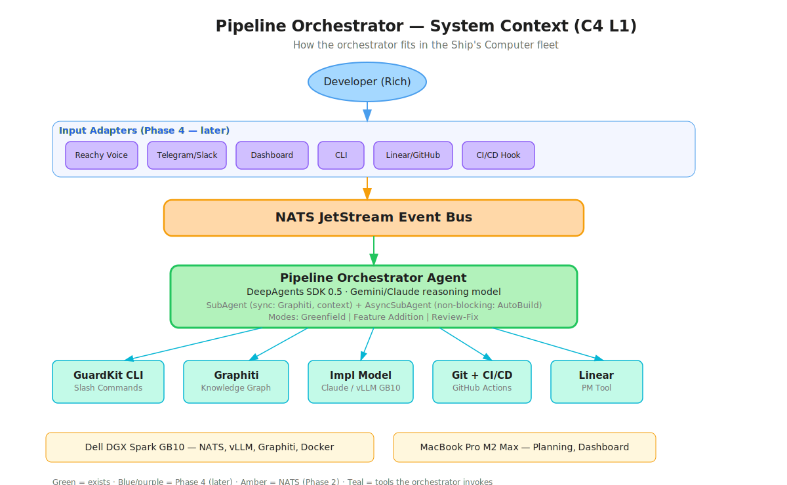
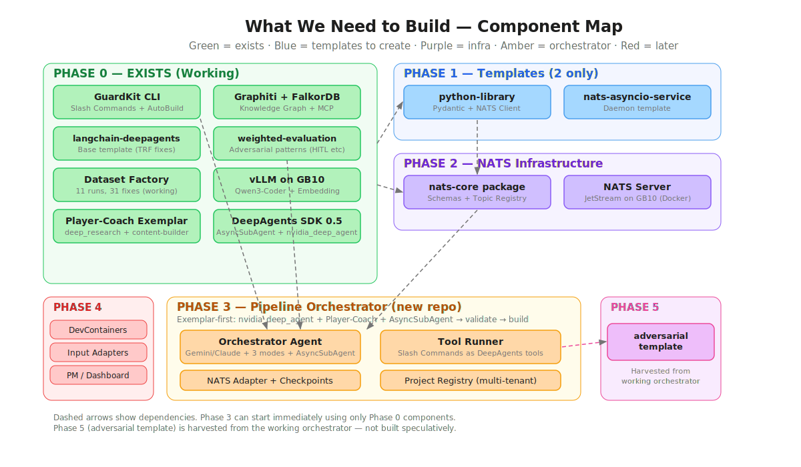
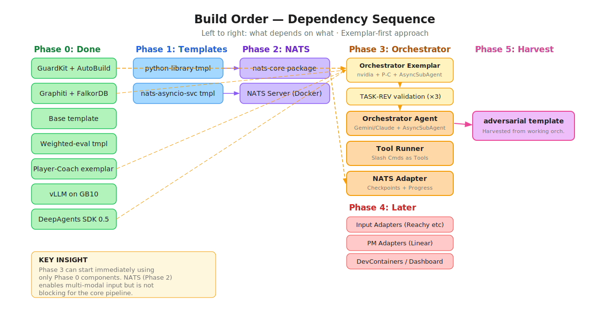

# Pipeline Orchestrator — Consolidated Build Plan

## What We Have, What We Need, and How It All Fits Together

**Date:** March 2026
**Status:** Current thinking — consolidates Ship's Computer, Dev Pipeline, and Pipeline Orchestrator architectures

---

## System Context

The Pipeline Orchestrator is a first-class agent in the Ship's Computer fleet. It drives the GuardKit slash command lifecycle autonomously — from architecture through to verified, deployable code — using a two-model architecture where a reasoning model orchestrates and validates, while an implementation model executes.

All input adapters (voice, messaging, dashboard, CLI, PM webhooks) connect through NATS JetStream, not directly to the orchestrator. Human-in-the-loop checkpoints use the existing `agents.approval.*` NATS topics from the Ship's Computer architecture.



---



## Phase 0: What Already Exists (Working)

These components are built, tested, and proven. They form the foundation everything else builds on.

| Component | Status | Evidence |
|-----------|--------|----------|
| **GuardKit CLI** | Production | Slash commands: `/system-arch`, `/system-design`, `/arch-refine`, `/feature-spec`, `/feature-plan`, `autobuild`, `/task-review`. AutoBuild Player-Coach adversarial loop with 100% task completion (TASK-REV-CFE0). |
| **Graphiti Knowledge Graph** | Production | FalkorDB-backed, MCP integration. Persistent architectural memory across sessions. Solved the "stochastic development problem" (TASK-REV-7549). |
| **`langchain-deepagents` template** | Proven | Base GuardKit template for DeepAgents SDK projects. **Already includes**: `JsonExtractor` (5-strategy cascade), `factory_guards.py` (tool allowlisting), `domain_validator.py` (type-aware validation), `observability.py`, `preflight.py`, `content_pipeline.py`, `checkpoint_hooks.py`, `sprint_contract.py`, Player/Coach agent templates, orchestrator pattern scaffold, model compatibility docs, 7 specialist guidance files, 5 pattern docs. All TRF-12 universal fixes already encoded. |
| **`langchain-deepagents-weighted-evaluation` template** | Built | Extends base template with adversarial-specific patterns. **Already includes**: `IntensityRouter` (full/light/solo modes), weighted evaluation criteria config, HITL checkpoint hooks (approve/reject/override/adjust_weights/halt), sprint contract negotiation, three-role orchestrator wiring (Jinja2 scaffolds), weighted Coach prompt with scepticism tuning, goal schema from GOAL.md, 4 test files. |
| **Agentic Dataset Factory** | Working | 11 runs, 31 fixes. Player-Coach adversarial loop generating GCSE English training data. Bug taxonomy captured in TASK-REV-TRF12 (84% template-preventable). |
| **vLLM on GB10** | Running | Three simultaneous EngineCore processes: embedding model (port 8001), Qwen3-Coder-Next (port 8002), Graphiti LLM / Qwen2.5-14B (port 8000). Awaiting NVIDIA driver 590 for NVFP4 gains. |
| **Ship's Computer Architecture** | Designed (v1.0) | NATS topic structure, message envelope format, approval workflow, dashboard concept, Reachy integration. Not yet implemented as running services. |
| **Dev Pipeline Architecture** | Designed (v1.0) | Build Agent concept, PM adapter interface, NATS JetStream streams, multi-tenancy model. The orchestrator replaces and extends the Build Agent. |

---

## Phase 1: Templates to Create

Two new GuardKit templates that provide scaffolding for the NATS infrastructure. These can be built using `/template-create`.

**Important: What about the adversarial template?**

The `langchain-deepagents-adversarial` template — an Orchestrator + Implementer + Evaluator pattern with a reasoning model driving tool selection — is a solid reusable pattern. However, it should be **harvested from the working Pipeline Orchestrator** rather than built speculatively upfront. This follows the proven approach: the base `langchain-deepagents` template was extracted from the agentic-dataset-factory experience, not designed beforehand. The `weighted-evaluation` template was then built on top of that proven base.

The existing `langchain-deepagents` and `langchain-deepagents-weighted-evaluation` templates already contain the universal fixes (JsonExtractor, factory guards, domain validator, observability, preflight) and the adversarial patterns (intensity routing, HITL, weighted Coach, sprint contracts). What's genuinely NEW in the orchestrator — the reasoning model layer, slash commands as tools, NATS integration, multi-project pipeline management — should be proven in production first, then extracted as a template.

**Build order:** Pipeline Orchestrator (Phase 3) → extract `langchain-deepagents-adversarial` template (Phase 5).

A conversation starter for the adversarial template is already placed at `guardkit/docs/research/dark_factory/langchain-deepagents-adversarial-conversation-starter.md` for when we're ready to harvest.

### 1A. `python-library`

**Purpose:** Pure Python installable package with Pydantic schemas and optional NATS client. This becomes the template for building `nats-core`.

**Key components:**
- `pyproject.toml` with proper packaging (setuptools or hatch)
- Pydantic v2 model scaffolding
- Type-safe API with `__all__` exports
- pytest configuration with coverage
- Optional NATS client dependency
- `pip install git+ssh://` distribution pattern

**Status:** Rules already exist at `guardkit/.claude/rules/python-library.md`. May need minimal work to formalise as a full template.

**Approach:** Bootstrap from relevant cookiecutter then run `/template-create`

### 1B. `nats-asyncio-service`

**Purpose:** Asyncio daemon template communicating via NATS subjects and JetStream. This becomes the template for the orchestrator's NATS adapter, input adapters, and PM adapters.

**Key components:**
- asyncio event loop with graceful shutdown
- NATS connection management (connect, reconnect, disconnect)
- JetStream consumer/publisher patterns
- Pydantic message envelope validation
- Structured JSON logging
- Docker Compose service definition
- Health check endpoint

**Approach:** Bootstrap from relevant patterns then run `/template-create`

---

## Phase 2: NATS Core Infrastructure

The messaging backbone that enables multi-modal interaction and multi-project orchestration.

### 2A. `nats-core` Package

**Purpose:** Single source of truth for message schemas, topic hierarchy, and client abstractions. Every participant in the event bus depends on this package.

**Built using:** `python-library` template (Phase 1B)

**Contains:**
- Pydantic message models (MessageEnvelope, pipeline events, agent events, approval events)
- Topic registry with typed constants — no magic strings:
  ```
  pipeline.{project}.orchestrator.commands
  pipeline.{project}.orchestrator.status
  pipeline.{project}.orchestrator.progress
  pipeline.{project}.build.started / complete / failed
  pipeline.{project}.verify.started / complete / failed
  pipeline.{project}.ci.triggered / result
  agents.approval.requests / responses
  agents.status.{agent_id}
  system.health
  ```
- Thin Python client wrapping nats-py with typed publish/subscribe
- Adapter interface definitions (PMAdapter base class)
- NATS account/permission configuration templates

**Schema specification:** Already fully defined in `dev-pipeline-system-spec.md` — MessageEnvelope, EventType, FeaturePlannedPayload, BuildStartedPayload, BuildProgressPayload, BuildCompletePayload, BuildFailedPayload. Needs extending with orchestrator-specific events (stage transitions, checkpoint requests).

**Packaging:** `pip install git+ssh://git@github.com/appmilla/nats-core.git` initially. Private PyPI on NAS later if needed.

### 2B. NATS Server on GB10

**Purpose:** Docker Compose deployment of NATS server with JetStream, multi-tenant accounts, and monitoring.

**Configuration** (from dev-pipeline architecture):
- Listen: `0.0.0.0:4222` (client), `0.0.0.0:8222` (monitoring)
- JetStream: `store_dir: /data/nats/jetstream`, 1GB memory, 10GB file
- Accounts: APPMILLA (Rich, wildcard access), FINPROXY (James, scoped to `finproxy.>`), SYS (admin)
- Streams: PIPELINE (30-day retention), AGENTS (7-day), SYSTEM (24-hour in-memory)
- Accessible via Tailscale at `nats://100.x.y.z:4222` from all devices

**Ports on GB10:**
| Port | Service |
|------|---------|
| 4222 | NATS server |
| 8000 | Graphiti LLM (Qwen2.5-14B) |
| 8001 | Embedding model (nomic-embed) |
| 8002 | AutoBuild LLM (Qwen3-Coder-Next) |
| 8222 | NATS monitoring |

---

## Phase 3: The Orchestrator

The core deliverable — an autonomous pipeline agent that drives the GuardKit slash command lifecycle.

**Repository:** New repo `guardkit/guardkitfactory` (separate from GuardKit). Conversation starters already placed at `guardkit/docs/research/dark_factory/`.

### Approach: Exemplar-First (Proven Methodology)

The orchestrator follows the same approach that produced the original templates:

1. **Combine exemplar sources** from the DeepAgents `examples/` directory into a new `deepagents-orchestrator-exemplar` repo
2. **Validate** the exemplar with TASK-REV (structural soundness, runs correctly, genuine best-practice patterns)
3. **Build** the pipeline-orchestrator from the validated exemplar using `/system-arch` → `/system-design` → AutoBuild
4. **Update templates** with production findings (as was done with TRF-001 through TRF-031)
5. **Harvest** the `langchain-deepagents-adversarial` template from the working orchestrator (Phase 5)

This is exactly how the original template was created: `deep_research` + `content-builder-agent` → `deepagents-player-coach-exemplar` → TASK-REV validation → `/template-create` → `langchain-deepagents` template → agentic-dataset-factory → 31 fixes → template updated.

### Exemplar Sources (from `appmilla_github/deepagents/examples/`)

| Source | Pattern It Provides | Key Elements |
|--------|-------------------|--------------|
| **`nvidia_deep_agent`** | Multi-model architecture, subagent delegation | Frontier model as orchestrator, Nemotron Super for research. `init_chat_model()` for provider-agnostic model resolution. `context_schema` for runtime config. Skills integration. |
| **`deep_research`** | Orchestrator with subagent delegation via `task` tool | Multi-step planning with reflection. Research subagent pattern. Used for original Player-Coach exemplar. |
| **`content-builder-agent`** | Config-driven agent (`AGENTS.md`, `skills/`, `subagents.yaml`) | Memory + skills + subagents wired through filesystem config. `load_subagents()` from YAML. Used for original Player-Coach exemplar. |
| **Existing `deepagents-player-coach-exemplar`** | Player-Coach adversarial pattern | `coach-config.yaml` provider switching (local/API), `domains/` directory pattern, Player creates + Coach evaluates. |

### New SDK Feature: AsyncSubAgent (SDK 0.5.0a2)

The latest DeepAgents SDK (pulled March 2026) introduces `AsyncSubAgent` — remote background subagents running on LangGraph servers. This is directly relevant:

- **`SubAgent`** (synchronous) — for quick operations: Graphiti queries, context assembly, schema validation
- **`AsyncSubAgent`** (non-blocking) — for long-running operations: AutoBuild feature builds (15+ turns, hours of execution), parallel project builds

The `AsyncSubAgent` middleware provides: `start_async_task`, `check_async_task`, `update_async_task`, `cancel_async_task`, `list_async_tasks`. Tasks persist in agent state and survive context compaction.

**Impact on orchestrator design:** Instead of the orchestrator blocking while AutoBuild runs a 35-turn feature build, it launches it as an `AsyncSubAgent`, continues orchestrating other work (parallel project builds, Graphiti seeding, status reporting), and checks back when it completes. The multi-project parallel execution pattern maps cleanly onto this.

### Existing Templates as Foundation

The existing `langchain-deepagents` and `langchain-deepagents-weighted-evaluation` templates already provide the three-role scaffold, weighted evaluation, intensity routing, HITL checkpoints, sprint contracts, and all the universal fixes (JsonExtractor, factory guards, domain validator, observability, preflight). The orchestrator adds the reasoning model layer, slash commands as tools, AsyncSubAgent integration, NATS integration, and multi-project management ON TOP of this proven foundation.

### 3A. Orchestrator Agent

**Purpose:** Reasoning loop that selects tools, validates outputs, and manages pipeline state across three entry modes.

**Key design:**
- DeepAgents SDK agent with Gemini 3.1 Pro API (primary) or Claude API for reasoning
- Three modes: Greenfield (architecture → everything), Feature Addition (spec → build), Review-Fix (review → diagnose → fix)
- Synchronous `SubAgent` for quick operations + `AsyncSubAgent` for long-running builds
- Pipeline state persistence (SQLite or JSON) for resume after crash
- Project registry for multi-project parallel execution
- GPU sequential queue constraint for local inference

**Provider-agnostic execution:**
- Cloud mode: Gemini 3.1 Pro / Claude API for reasoning + Claude Code SDK for implementation
- Local mode: Local model for reasoning + vLLM (Qwen3-Coder-Next) for implementation
- Runtime switchability via `orchestrator-config.yaml`

**Conversation starter ready:** `pipeline-orchestrator-conversation-starter.md`

### 3B. Tool Runner

**Purpose:** Executes GuardKit slash commands as DeepAgents tools.

**Phase 1 implementation:** Each tool wraps a call to Claude Code SDK (the existing AgentInvoker pattern from `guardkit/orchestrator/agent_invoker.py`). The tool sends the slash command prompt to Claude Code, waits for completion, and returns structured output.

**Phase 2 implementation (future):** Replace Claude Code SDK invocations with native DeepAgents subagents. Each slash command becomes a DeepAgents subagent with its own tools (file read/write, Graphiti context, template rendering).

**Critical constraint:** Tool interface signatures are identical across Phase 1 and Phase 2. The orchestrator calls the same tools with the same signatures — only the implementation behind the tool changes.

**Tool inventory:**

| Tool | Input | Output |
|------|-------|--------|
| `system_arch` | conversation_starter path, context files | ARCHITECTURE.md, ADRs, C4 diagrams |
| `system_design` | architecture path, context files | DESIGN.md, API contracts, data models |
| `arch_refine` | architecture + design paths | Updated docs, new ADRs |
| `feature_spec` | architecture path, module context | BDD feature file, assumptions, summary |
| `feature_plan` | feature spec path, context | Task breakdown, wave structure |
| `autobuild` | feature ID, max_turns | Build result, completion status |
| `task_review` | subject path/description | Review report with findings |
| `graphiti_seed` | document paths | Seed confirmation |
| `graphiti_query` | query string | Retrieved context |
| `verify` | project path, test command | Test results, pass/fail |
| `nats_publish` | topic, payload | Delivery confirmation |

### 3C. NATS Adapter

**Purpose:** Bridges the orchestrator to the NATS event bus for commands, progress, and human-in-the-loop checkpoints.

**Built using:** `nats-asyncio-service` template (Phase 1B) + `nats-core` dependency (Phase 2A)

**Responsibilities:**
- Subscribe to `pipeline.{project}.orchestrator.commands` for incoming commands
- Publish to `pipeline.{project}.orchestrator.progress` at each stage transition
- Publish to `agents.approval.requests` at checkpoint gates
- Subscribe to `agents.approval.responses` for human approval/rejection
- Configurable checkpoint levels: minimal (post-build only), standard (spec review + post-build), full (every stage)

### 3D. Project Registry

**Purpose:** Multi-project configuration, active pipeline tracking, and resource allocation.

**Key design:**
- Per-project configuration in YAML (provider mode, checkpoint level, Graphiti endpoint, Git remote)
- Active pipeline tracking (which projects are running, at which stage)
- GPU queue scheduling: cloud API calls run in parallel across projects; local GB10 inference is sequential (FIFO queue)
- NATS topic prefix isolation (James sees only `pipeline.finproxy.*`)

---

## Phase 4: Later (Designed For, Not Built Yet)

These are designed into the architecture from the start but implemented in future phases.

| Component | Purpose | Depends On |
|-----------|---------|-----------|
| **Input Adapters** | Reachy voice, Telegram/WhatsApp, Slack/Discord bridges to NATS | Phase 2 (NATS), `nats-asyncio-service` template |
| **PM Adapters** | Linear/GitHub webhooks → NATS, NATS → ticket status updates | Phase 2 (NATS), `nats-core` PMAdapter base class |
| **DevContainers** | Each AutoBuild run executes inside a devcontainer with project dependencies | Phase 3 (Orchestrator `execution_environment` config) |
| **Testcontainers** | Post-build verification spins up application in containers, runs integration tests | Phase 3 (Orchestrator `verify` tool) |
| **Dashboard UX** | Web UI with orchestrator card showing pipeline stage progress per project | Phase 2 (NATS WebSocket subscription), Ship's Computer dashboard design |
| **CI/CD Self-Healing** | CI failure triggers Mode C (review-fix) automatically | Phase 3 (Orchestrator), CI webhook adapter |
| **DeepAgents Sandboxes** | Native sandbox support for full code execution isolation | Phase 3 (Orchestrator), DeepAgents SDK sandbox API |

---

## Phase 5: Template Harvesting (After Orchestrator Proven)

Once the Pipeline Orchestrator is working in production, extract the Orchestrator + Implementer + Evaluator pattern as a reusable template. This follows the proven methodology: exemplar → template → project → update template.

### 5A. `langchain-deepagents-adversarial`

**Purpose:** Encodes the three-role pattern with a reasoning model driving tool selection as a reusable scaffold.

**What's genuinely new** (not already in base or weighted-evaluation templates):
- Reasoning model orchestration layer (Gemini/Claude API choosing which tools to invoke)
- `AsyncSubAgent` integration for non-blocking long-running subagent execution
- Slash commands / external tools as DeepAgents tools (the tool wrapper pattern)
- NATS integration hooks (progress publishing, command subscription, approval protocol)
- Multi-project pipeline management (project registry, GPU queue scheduling)
- Provider-agnostic execution (cloud/local mode switchability)

**Harvested from:** Working `guardkitfactory` repo (Phase 3)

**Conversation starter ready:** `guardkit/docs/research/dark_factory/langchain-deepagents-adversarial-conversation-starter.md` (to be updated with lessons learned from Phase 3)

---

## Build Order and Dependencies



<details>
<summary>Text version (for non-graphical rendering)</summary>

```
Phase 0 (Done)          Phase 1 (Templates)      Phase 2 (NATS)         Phase 3 (Orchestrator)    Phase 5
─────────────          ─────────────────          ──────────────         ──────────────────────    ───────
GuardKit CLI    ─────────────────────────────────────────────────────▶  Orchestrator Agent
                                                                       (invokes as tools)

Graphiti       ──────────────────────────────────────────────────────▶  Orchestrator Agent
                                                                       (queries context)

deepagents          ┐                                                  
base tmpl           ├─ ALREADY ──────────────────────────────────────▶  Orchestrator Agent
weighted-eval tmpl  ┘  BUILT                                           (uses as base)

Dataset Factory ─── patterns already in templates ──────────────────▶  (learnings applied)

                       python-library tmpl ──▶  nats-core pkg    ───▶  NATS Adapter
                                                                       (depends on schemas)

                       nats-asyncio-svc   ──▶  NATS Server       ───▶  NATS Adapter
                       tmpl                     (Docker on GB10)

vLLM on GB10   ──────────────────────────────────────────────────────▶  Tool Runner
                                                                       (local impl model)

Ship's Computer ─────────────────────────▶  NATS topic design   ───▶  NATS Adapter
(architecture)                              (reuse existing)

                                                                       Pipeline Orchestrator
                                                                       (working, proven) ────▶  adversarial
                                                                                                template
                                                                                                (harvested)
```
</details>

**Key insight:** The Phase 3 orchestrator can be built and tested using ONLY Phase 0 components (GuardKit + Graphiti + existing templates). It doesn't need NATS to work — NATS enables multi-modal input and Ship's Computer fleet membership, but the core pipeline works without it.

**Exemplar-first approach (proven methodology):**

1. **Create orchestrator exemplar** — Combine `nvidia_deep_agent` (multi-model, subagent delegation) + existing `deepagents-player-coach-exemplar` (Player-Coach) + `AsyncSubAgent` pattern (SDK 0.5.0a2) into a new `deepagents-orchestrator-exemplar` repo
2. **Validate** the exemplar with TASK-REV (3 reviews, as was done for the original exemplar)
3. **Build the orchestrator** from the validated exemplar using `/system-arch` → `/system-design` → AutoBuild in a **new `guardkitfactory` repo**
4. Build remaining templates (Phase 1) in parallel — just `python-library` and `nats-asyncio-service`
5. Build NATS infrastructure (Phase 2) when templates are ready
6. Add NATS Adapter (Phase 3C) to connect the orchestrator to the event bus
7. Phase 4 components arrive when the integration points exist
8. **Phase 5:** Once the orchestrator is proven, harvest the `langchain-deepagents-adversarial` template from it

---

## Hardware Topology

| Machine | Role |
|---------|------|
| **MacBook Pro M2 Max** | Planning/research with Claude Desktop. Dashboard client. NATS client via Tailscale. Orchestrator reasoning (cloud mode — Gemini/Claude API calls originate here). |
| **Dell DGX Spark GB10 (128GB)** | NATS server. vLLM inference (3 models). Graphiti (FalkorDB). AutoBuild execution. Docker host for devcontainers/testcontainers. Build workspace. |
| **Synology DS918+ NAS (32TB)** | FalkorDB persistence. Private PyPI (future). Shared storage. Backup. |

Connected via Tailscale mesh VPN. NATS accessible at `nats://100.x.y.z:4222` from any device.

---

## Resolved Decisions (Do Not Reopen)

| # | Decision | Resolution | Evidence |
|---|----------|-----------|----------|
| D1 | Agent framework | LangChain DeepAgents SDK | Proven in agentic-dataset-factory. TASK-REV-F5F5 validated. |
| D2 | Reasoning model | Gemini 3.1 Pro API or Claude API (configurable) | Two-model separation prevents self-confirmation bias. |
| D3 | Implementation model | Claude Code SDK (cloud) or vLLM on GB10 (local) | Provider-agnostic via `agent-config.yaml`. |
| D4 | Event bus | NATS JetStream | Ship's Computer infrastructure. Sub-ms latency. Single binary. |
| D5 | Two-model separation | Orchestration model MUST differ from implementation model | Block paper + Anthropic validation. Self-evaluation fails. |
| D6 | NemoClaw | Rejected | GB10 forum evidence: sandbox errors, provider config broken, NIM fails locally. |
| D7 | Tool interface stability | Signatures identical across Phase 1 (Claude SDK) and Phase 2 (native DeepAgents) | Hard constraint for migration path. |
| D8 | Multi-project | Concurrent pipelines with NATS topic prefix isolation | GPU inference sequential queue; API calls parallel. |
| D9 | Template strategy | Exemplar-first, then build-first-harvest-later. Create orchestrator exemplar from DeepAgents examples, validate with TASK-REV, build orchestrator from exemplar, harvest template after proven. Base and weighted-eval templates already contain all TRF-12 fixes and adversarial patterns. | Same methodology that produced the base template: `deep_research` + `content-builder-agent` → exemplar → TASK-REV → template → project → update template. |
| D10 | ChromaDB over NVIDIA RAG | ChromaDB PersistentClient (embedded) | Full NVIDIA RAG stack is enterprise overkill for single-student small-corpus use case. |
| D11 | AsyncSubAgent for long-running builds | Use SDK 0.5.0a2 `AsyncSubAgent` for AutoBuild feature builds; synchronous `SubAgent` for quick operations (Graphiti queries, context assembly) | AutoBuild runs can take 15+ turns over hours. Non-blocking execution enables multi-project parallel builds and orchestrator responsiveness. |
| D12 | Orchestrator exemplar sources | `nvidia_deep_agent` (multi-model, subagent delegation, context_schema) + `deepagents-player-coach-exemplar` (Player-Coach adversarial, provider switching) + `AsyncSubAgent` middleware (non-blocking long-running tasks) | Maps directly to orchestrator pattern. Same combination approach used for original template. |
| D13 | DeepAgents SDK version | Pin to 0.5.x (alpha) for `AsyncSubAgent` support | Required for non-blocking subagent execution. Monitor for stable release. |

---

## Related Documents

| Document | Location | Purpose |
|----------|----------|---------|
| Pipeline Orchestrator Motivation | `pipeline-orchestrator-motivation.md` (output) | Why we're building this (the observation) |
| Pipeline Orchestrator Conversation Starter | `guardkit/docs/research/dark_factory/pipeline-orchestrator-conversation-starter.md` | For `/system-arch` + `/system-design` session (already in guardkit) |
| Adversarial Template Conversation Starter | `guardkit/docs/research/dark_factory/langchain-deepagents-adversarial-conversation-starter.md` | For future `/template-create` after orchestrator proven (already in guardkit) |
| DDD Southwest Talk Material | `ddd-southwest-adversarial-cooperation-talk.md` (output) | Talk narrative and evidence |
| Business Domain Applications | `adversarial-cooperation-business-domains.md` (output) | Beyond code: content, legal, financial, support |
| YouTube Journey Conversation Starter | `youtube-adversarial-cooperation-journey-conversation-starter.md` (output) | 5-act content strategy |
| **Exemplar Sources** | | |
| DeepAgents repo (forked) | `appmilla_github/deepagents/` | SDK 0.5.0a2, CLI 0.0.34. Contains `nvidia_deep_agent`, `deep_research`, `content-builder-agent` examples. `AsyncSubAgent` middleware. |
| Player-Coach exemplar | `appmilla_github/deepagents-player-coach-exemplar/` | Combined from `deep_research` + `content-builder-agent`. 3 TASK-REV reviews. Source for original `langchain-deepagents` template. |
| Exemplar build spec | `agentic-dataset-factory/docs/research/FEAT-deepagents-exemplar-build.md` | 9 decisions, component design, architecture for exemplar creation. |
| Exemplar validation | `agentic-dataset-factory/docs/research/TASK-REV-deepagents-exemplar-validation.md` | TASK-REV checklist for exemplar validation before `/template-create`. |
| **Existing Templates** | | |
| `langchain-deepagents` template | `guardkit/installer/core/templates/langchain-deepagents/` | Base template with ALL TRF-12 universal fixes (JsonExtractor, factory guards, domain validator, observability, preflight, content pipeline, checkpoint hooks, sprint contract) |
| `langchain-deepagents-weighted-evaluation` template | `guardkit/installer/core/templates/langchain-deepagents-weighted-evaluation/` | Adversarial patterns (IntensityRouter, HITL, weighted Coach, sprint contracts, three-role orchestrator scaffold) |
| **Architecture Documents** | | |
| Ship's Computer Architecture | `distributed_agent_orchestration_architecture.md` | NATS, agents, Reachy, dashboard (v1.0) |
| Dev Pipeline Architecture | `dev-pipeline-architecture.md` | Build Agent, PM adapters, NATS topics (v1.0) |
| Dev Pipeline System Spec | `dev-pipeline-system-spec.md` | Message schemas, JetStream config, components |
| **Review Evidence** | | |
| TASK-REV-7549 (Lessons Learned) | `guardkit/.claude/reviews/TASK-REV-7549-review-report.md` | 180+ reviews, 13 patterns, stochastic dev problem |
| TASK-REV-TRF12 (Bug Taxonomy) | `agentic-dataset-factory/.claude/reviews/TASK-REV-TRF12-review-report.md` | 11 runs, 31 fixes, template recommendations |
| TASK-REV-F5F5 (Process Documentation) | `agentic-dataset-factory/.claude/reviews/TASK-REV-F5F5-review-report.md` | Manual pipeline: 43 tasks, 3 human decisions |
| **External References** | | |
| Block Paper | https://block.xyz/documents/adversarial-cooperation-in-code-synthesis.pdf | Research stimulus (Dec 2025) |
| Anthropic Harness Design | https://www.anthropic.com/engineering/harness-design-long-running-apps | Independent validation (Mar 2026) |

---

*Prepared: March 2026 | Consolidated build plan for Pipeline Orchestrator and supporting infrastructure*
*Updated to reflect: existing templates (base + weighted-evaluation already built), exemplar-first approach (proven methodology), AsyncSubAgent (SDK 0.5.0a2), build-first-harvest-later for adversarial template (Phase 5)*
*Pipeline orchestrator to be created as new repo: `guardkit/guardkitfactory`*
*Orchestrator exemplar to be created first: `guardkit/deepagents-orchestrator-exemplar`*
