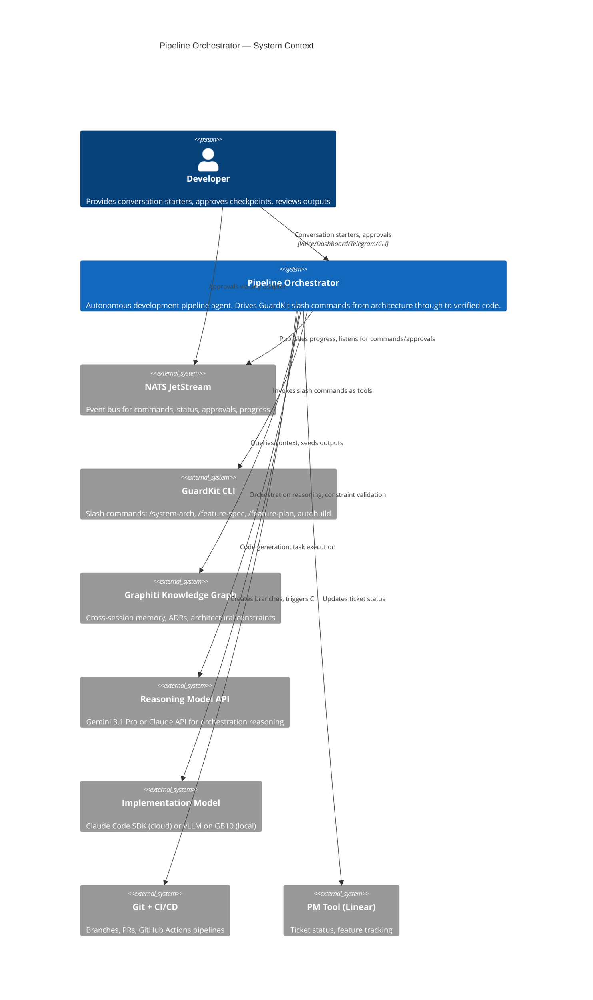
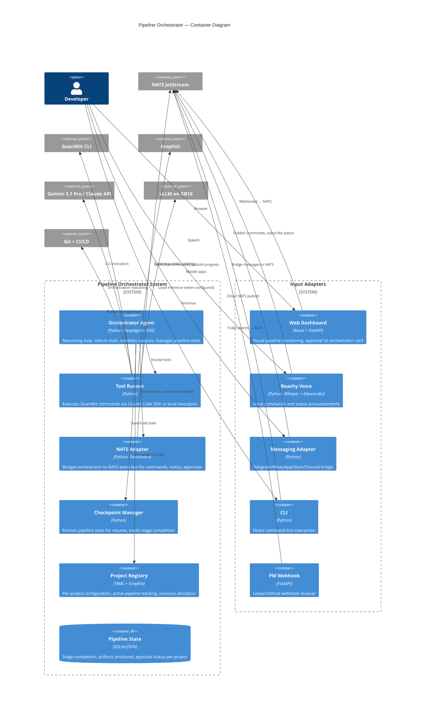
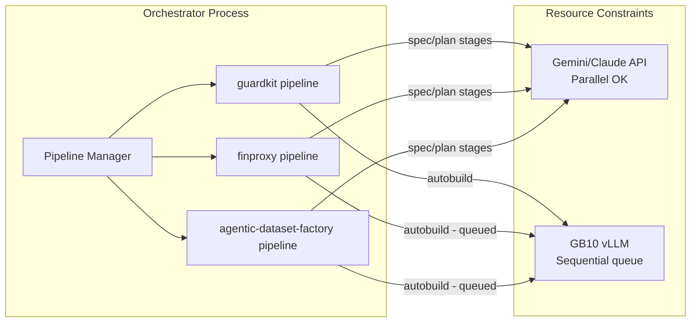
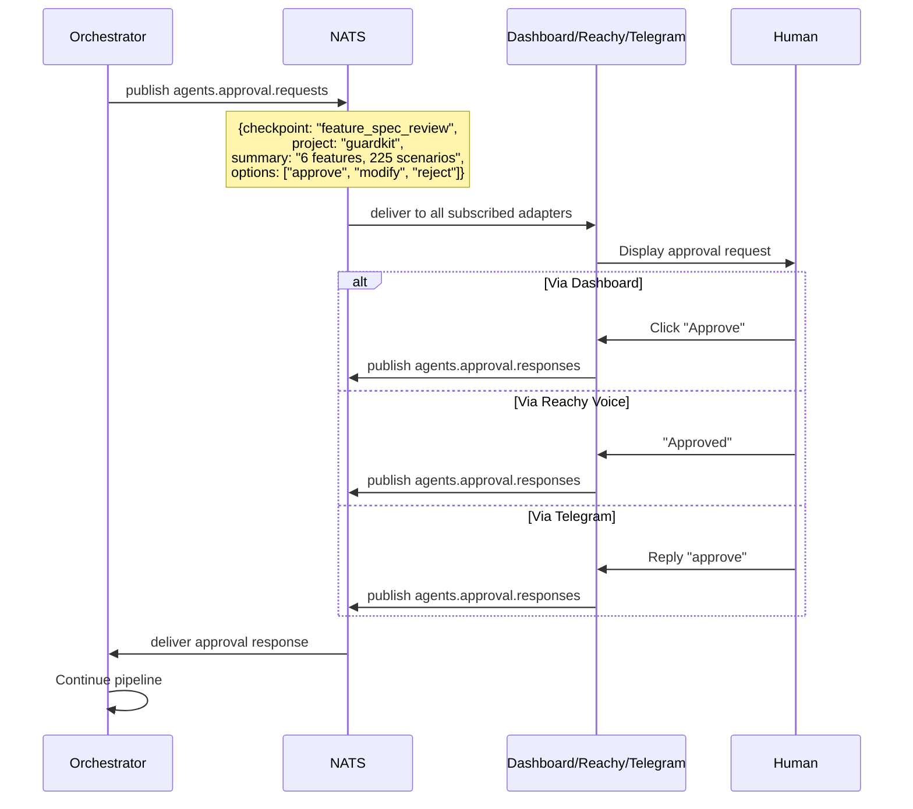
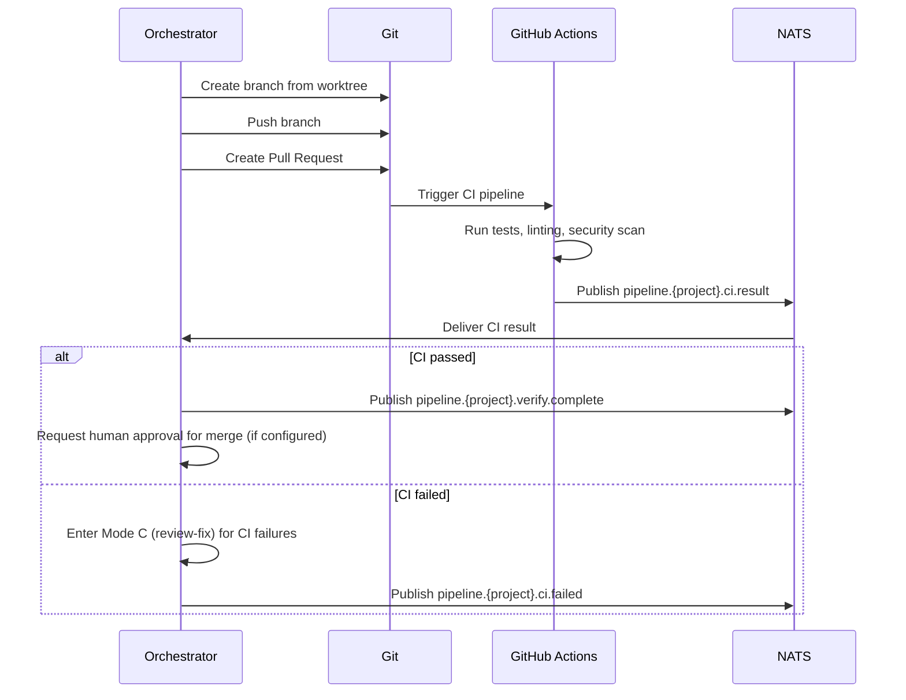

# Pipeline Orchestrator — Conversation Starter

## For: `/system-arch` + `/system-design` session · New capability within GuardKit · March 2026

---

## Purpose of this document

This is the context brief for starting a new conversation that will produce two architecture documents:

1. **`/system-arch`** — architecture intent, C4 diagrams, component boundaries, ADRs, open questions
2. **`/system-design`** — detailed design: tool contracts, orchestration protocol, NATS integration, execution model, deployment topology

Paste this document at the start of that conversation, then generate the two documents sequentially.

---

## What is the Pipeline Orchestrator?

An autonomous development pipeline agent that drives the full GuardKit slash command lifecycle — from architecture through to verified, deployable code — using a two-model architecture where a reasoning model (Gemini 3.1 Pro API or Anthropic Claude API) orchestrates and validates, while an implementation model (local vLLM on GB10 or Claude via subscription) executes.

The orchestrator replaces the human operator role in the GuardKit pipeline. The human moves from operator to approver at defined checkpoints.

**Evidence this works:** The TASK-REV-F5F5 review documented 43 tasks across 6 features built with only 3 high-impact human decisions. 93% of outputs were accepted as defaults. The orchestrator automates the operator workflow; the engineering rigour (BDD specs, Player-Coach adversarial loop, Graphiti context) stays identical.

**This is NOT vibe coding with orchestration.** The slash command pipeline IS the rigour layer. The orchestrator drives the human's side of that pipeline, not an unstructured "build me a thing" agent.

---

## Key architectural principle: Provider-agnostic execution

The orchestrator MUST support two execution modes with runtime switchability:

1. **Cloud mode**: Reasoning via Gemini 3.1 Pro API or Claude API. Implementation via Claude Code SDK (Anthropic subscription). This is the primary mode for production use — fast, reliable, proven.

2. **Local mode**: Reasoning via local model on GB10 (e.g., future capable model). Implementation via local vLLM (Qwen3-Coder-Next on port 8002). This is the cost-free, privacy-preserving mode — slower but zero marginal cost.

Both modes use the same tool interfaces, same NATS integration, same checkpoint protocol. The `orchestrator-config.yaml` selects the mode. This mirrors the existing `agent-config.yaml` pattern in the agentic-dataset-factory where Player and Coach models are independently configurable as `local` or `anthropic` providers.

**Current reality**: Local GB10 execution with Qwen3-Coder-Next works but is slow (~30-43 tok/s). The DGX Spark software ecosystem is behind the hardware capability (driver 590 pending, NVFP4 still community-patched). Cloud execution via Claude subscription is faster and more reliable today. The architecture must not force either path.

---

## Relationship to existing architecture

This orchestrator is a **first-class agent in the Ship's Computer fleet**, not a standalone system.

### Existing systems it builds on

| System | Relationship |
|--------|-------------|
| **Ship's Computer** (v1.0, Jan 2026) | Orchestrator uses the same NATS JetStream infrastructure, message envelope format, topic conventions, and approval workflow. It's another agent alongside LinkedIn, Twitter, Research, GCSE Tutor agents. |
| **Dev Pipeline** (v1.0, Feb 2026) | Orchestrator replaces and extends the Build Agent concept. The dev-pipeline defined `pipeline.*` topics and PM tool adapters — the orchestrator uses these but adds upstream stages (arch → design → spec → plan). |
| **GuardKit** (existing) | Orchestrator invokes GuardKit slash commands as tools. AutoBuild's `AgentInvoker` (Claude Code SDK integration) and `WorktreeManager` (isolated workspace) are reused directly. |
| **Graphiti** | Orchestrator uses Graphiti for cross-session context, ADR retrieval, and constraint validation. Graphiti seeding happens automatically after each pipeline stage. |
| **NATS JetStream** | All orchestrator events, commands, approvals, and progress updates flow through NATS. Multi-project isolation via topic prefixes (`pipeline.{project}.*`). |

---

## C4 Level 1: System Context



---

## C4 Level 2: Container Diagram



---

## Three orchestration modes

The orchestrator supports three entry points into the same tool pipeline:

### Mode A: Greenfield (Architecture → Everything)

Input: Conversation starter document.
Pipeline: `/system-arch` → `/system-design` → `/arch-refine` → Graphiti seed → `/feature-spec` × N → `/feature-plan` × N → `autobuild` × N → verify → CI/CD

Human checkpoints: Feature breakdown approval, feature-spec constraint review, post-build verification.

This is what was done manually for the agentic-dataset-factory (TASK-REV-F5F5).

### Mode B: Feature Addition (Feature → Build)

Input: Feature description + existing project with architecture in Graphiti.
Pipeline: `/feature-spec` → `/feature-plan` → `autobuild` → verify → CI/CD

Human checkpoints: Feature-spec review, post-build verification.

### Mode C: Review-Fix (Problem → Resolution)

Input: Review report (e.g., TASK-REV-PRE-RUN document) or bug description.
Pipeline: `/task-review` → task creation → `autobuild` per task → verify → CI/CD

Human checkpoints: Review findings approval, post-fix verification.

```mermaid
flowchart TB
    subgraph "Mode A: Greenfield"
        A1[Conversation Starter] --> A2[/system-arch/]
        A2 --> A3[/system-design/]
        A3 --> A4[/arch-refine/]
        A4 --> A5[Graphiti Seed]
        A5 --> A6[/feature-spec/ × N]
        A6 -->|"🔴 CHECKPOINT"| A7{Human Approval}
        A7 -->|approved| A8[/feature-plan/ × N]
        A8 -->|"🔴 CHECKPOINT"| A9{Constraint Check}
        A9 -->|passed| A10[autobuild × N]
        A10 --> A11[Verify]
        A11 --> A12[CI/CD]
    end

    subgraph "Mode B: Feature"
        B1[Feature Description] --> B2[/feature-spec/]
        B2 -->|"🔴 CHECKPOINT"| B3{Human Approval}
        B3 -->|approved| B4[/feature-plan/]
        B4 --> B5[autobuild]
        B5 --> B6[Verify]
        B6 --> B7[CI/CD]
    end

    subgraph "Mode C: Review-Fix"
        C1[Review Report / Bug] --> C2[/task-review/]
        C2 -->|"🔴 CHECKPOINT"| C3{Findings Approval}
        C3 -->|approved| C4[Task Creation]
        C4 --> C5[autobuild per task]
        C5 --> C6[Verify]
        C6 --> C7[CI/CD]
    end
```

---

## Tool inventory

Each GuardKit slash command becomes a DeepAgents tool. The tool interface is stable across execution modes — only the implementation behind the tool changes.

### Phase 1 tools (via Claude Code SDK — uses Anthropic subscription)

| Tool | Input | Output | Notes |
|------|-------|--------|-------|
| `system_arch` | conversation_starter path, context files | ARCHITECTURE.md, ADRs, C4 diagrams | Invokes Claude Code with `/system-arch` prompt |
| `system_design` | architecture path, context files | DESIGN.md, API contracts, data models, DDRs | Invokes `/system-design` |
| `arch_refine` | architecture + design paths | Updated docs, new ADRs | Invokes `/arch-refine` |
| `feature_spec` | architecture path, module context | BDD feature file, assumptions, summary | Invokes `/feature-spec` |
| `feature_plan` | feature spec path, context | Task breakdown, wave structure | Invokes `/feature-plan` |
| `autobuild` | feature ID, max_turns | Build result, completion status | Invokes `guardkit autobuild feature` |
| `task_review` | subject path/description | Review report with findings | Invokes `/task-review` |
| `graphiti_seed` | document paths | Seed confirmation | Invokes `guardkit graphiti add-context` |
| `graphiti_query` | query string | Retrieved context | Queries Graphiti for constraint validation |
| `verify` | project path, test command | Test results, pass/fail | Runs test suite (pytest, container-based) |
| `nats_publish` | topic, payload | Delivery confirmation | Publishes events to NATS |

### Phase 2 tools (native DeepAgents — no Claude subscription required)

Same tool signatures, but implementation uses DeepAgents subagents with local models instead of Claude Code SDK. Each slash command becomes a DeepAgents subagent with its own tools (file read/write, Graphiti, template rendering).

**The tool interface doesn't change between phases.** The orchestrator calls the same tools with the same signatures. This is the key design constraint.

---

## NATS topic structure

Extends the existing Ship's Computer (`agents.*`) and dev-pipeline (`pipeline.*`) namespaces:

```
pipeline/
├── {project}/
│   ├── orchestrator/
│   │   ├── commands          # Commands to start/stop/configure pipeline
│   │   ├── status            # Current orchestrator state
│   │   └── progress          # Stage-by-stage progress events
│   ├── build/
│   │   ├── started           # AutoBuild started for feature
│   │   ├── progress          # Per-task build progress
│   │   ├── complete          # Build finished successfully
│   │   └── failed            # Build failed
│   ├── verify/
│   │   ├── started           # Verification running
│   │   ├── complete          # Tests passed
│   │   └── failed            # Tests failed
│   └── ci/
│       ├── triggered         # CI pipeline triggered
│       └── result            # CI pass/fail
│
agents/
├── approval/
│   ├── requests              # Orchestrator checkpoint approvals (shared with all agents)
│   └── responses             # Human approval/rejection responses
```

---

## Multi-project parallel execution

The orchestrator manages multiple concurrent pipelines, each scoped to a project:



**Key constraint**: Cloud API calls (reasoning, spec generation) can run in parallel across projects. Local GB10 inference (AutoBuild implementation) is sequential — one build at a time, others queued. The pipeline manager handles this scheduling.

**NATS isolation**: Each project has its own topic prefix. James sees only `pipeline.finproxy.*`. Rich sees everything. This uses the existing NATS account/permission model from the dev-pipeline architecture.

---

## Human-in-the-loop checkpoint protocol

Uses the existing Ship's Computer approval workflow via NATS:



Configurable checkpoint levels:
- **Minimal**: Only post-build verification (for trusted, well-understood projects)
- **Standard**: Feature-spec review + post-build verification (default)
- **Full**: Every stage transition requires approval (for new/critical projects)

---

## Execution environment strategy

Designed for incremental adoption — start with worktrees, add containers later:

### Phase 1: Git worktrees (current — already working)

AutoBuild's `WorktreeManager` creates isolated workspaces per task. No container overhead. Proven across 43/43 tasks in the agentic-dataset-factory build.

### Phase 2: Dev containers

Each AutoBuild run optionally executes inside a devcontainer with project-specific dependencies. The orchestrator's `autobuild` tool accepts an `execution_environment` parameter:

```yaml
execution_environment:
  type: worktree          # Phase 1 (default)
  # type: devcontainer    # Phase 2
  # type: sandbox         # Phase 3 (DeepAgents sandboxes)
```

### Phase 3: Testcontainers for verification

The `verify` tool spins up the built application in containers (docker compose), runs integration tests, and tears down. This is the verification layer that closes the "does it actually work?" gap.

### Phase 4: DeepAgents sandboxes

Native sandbox support (Modal, Daytona, or custom Docker backend) for full isolation. Each pipeline stage runs in its own sandbox with defined file/network permissions.

**Design constraint**: The orchestrator's tool interface abstracts the execution environment. Tools don't know whether they're running in a worktree, devcontainer, or sandbox. The `execution_environment` config drives the runtime — tools just produce outputs.

---

## CI/CD integration

The orchestrator's pipeline extends into the delivery pipeline:



**Self-healing**: If CI fails, the orchestrator can automatically enter Mode C (review-fix), analyse the failure, create fix tasks, and re-run AutoBuild — turning CI failures into automated repair cycles.

---

## Dashboard UX: Orchestrator card

The dashboard (from Ship's Computer architecture) gains an orchestrator card per active project:

```
┌─────────────────────────────────────────────────────┐
│  guardkit pipeline                        ● RUNNING  │
│                                                       │
│  ██████████████████████░░░░░░░░  Stage 5/8           │
│                                                       │
│  ✓ system-arch    ✓ system-design   ✓ arch-refine   │
│  ✓ feature-spec   ● feature-plan    ○ autobuild     │
│  ○ verify         ○ ci/cd                            │
│                                                       │
│  Current: feature-plan (3/6 features planned)        │
│  Elapsed: 2h 14m  │  Est. remaining: 4h 30m         │
│                                                       │
│  [View Details]  [Pause]  [Approve Pending (1)]      │
└─────────────────────────────────────────────────────┘
```

Clicking "View Details" expands to show per-stage artifacts, per-feature status, and build logs.

---

## Hardware topology

| Machine | Role in Orchestrator |
|---------|---------------------|
| MacBook Pro M2 Max | Planning/research with Claude Desktop. Runs dashboard. NATS client. |
| Dell Pro Max GB10 (DGX Spark, 128GB) | vLLM inference (port 8002: Qwen3-Coder-Next, port 8000: Graphiti LLM). AutoBuild execution. NATS server. Graphiti (FalkorDB). Docker host for devcontainers/testcontainers. |

**NATS server runs on GB10** (existing config from dev-pipeline architecture). Accessible via Tailscale from all devices.

**Port allocation on GB10**:

| Port | Service | Used By |
|------|---------|---------|
| 4222 | NATS server | All components |
| 8000 | Graphiti LLM (Qwen2.5-14B) | Graphiti entity extraction |
| 8001 | Embedding model (nomic-embed) | Graphiti + ChromaDB |
| 8002 | AutoBuild LLM (Qwen3-Coder-Next) | Implementation model (local mode) |
| 8222 | NATS monitoring | Dashboard |

---

## Key decisions (resolved — do not reopen)

| # | Decision | Resolution |
|---|---|---|
| D1 | Agent framework | LangChain DeepAgents SDK — same framework used in agentic-dataset-factory |
| D2 | Reasoning model | Gemini 3.1 Pro API (primary) or Claude API — configurable, not hardcoded |
| D3 | Implementation model | Claude Code SDK (primary/cloud) or vLLM local (GB10) — configurable |
| D4 | Event bus | NATS JetStream — existing Ship's Computer infrastructure |
| D5 | Two-model separation | Orchestration/reasoning model MUST differ from implementation model to avoid self-confirmation bias |
| D6 | NemoClaw | Rejected for now — GB10 forum evidence shows NemoClaw is not production-ready (sandbox errors, provider config broken, NIM fails to install locally). Revisit when mature. |
| D7 | Tool interface stability | Tool signatures identical across Phase 1 (Claude SDK) and Phase 2 (native DeepAgents). This is a hard constraint. |
| D8 | Multi-project | Orchestrator manages concurrent pipelines with NATS topic prefix isolation. GPU inference is sequential queue; API calls parallel. |

---

## Open questions for /system-arch to resolve

1. **Orchestrator agent structure** — single DeepAgent with all tools, or parent agent with subagent delegation per stage? The DeepAgents SDK supports both patterns via the `task` tool.

2. **Pipeline state persistence** — SQLite, JSON files, or NATS KV store? Need durability for resume after crash, but also queryability for dashboard.

3. **Checkpoint escalation** — if a checkpoint times out (human doesn't respond), what happens? Pause indefinitely, auto-reject, or escalate to a different channel?

4. **Parallel AutoBuild scheduling** — when multiple features are ready for build and GPU is the constraint, what's the scheduling policy? FIFO? Priority by project? Smallest-first?

5. **Verification scope** — what does "verify" mean for each mode? Mode A (greenfield) might just run pytest. Mode B (feature) needs integration tests. Mode C (fix) needs regression tests.

6. **Graphiti context window** — how much Graphiti context does the orchestrator load before each stage? All project ADRs? Just the relevant module's design docs? There's a token budget trade-off.

7. **Error recovery** — if AutoBuild fails on a feature, does the orchestrator retry, skip and continue to other features, or stop the entire pipeline?

---

## Open questions for /system-design to resolve

1. **`orchestrator-config.yaml` full schema** — all configurable parameters including provider selection, checkpoint levels, parallel limits, timeout values.

2. **Tool contract specifications** — exact input/output schemas for each tool, error cases, timeout behaviour.

3. **NATS message schemas** — extend existing envelope format for orchestrator-specific events (stage transitions, checkpoint requests, progress updates).

4. **Dashboard API contract** — WebSocket subscription topics, REST endpoints for pipeline control (pause/resume/abort).

5. **Claude Code SDK integration pattern** — how exactly does the `tool_runner` invoke Claude Code? Direct SDK call? Subprocess? The existing `AgentInvoker` in `guardkit/orchestrator/agent_invoker.py` is the reference implementation.

6. **Containerised execution interface** — how does the `execution_environment` config translate to actual container lifecycle management? Docker SDK? devcontainer CLI?

7. **CI/CD adapter contract** — what's the interface between the orchestrator and different CI systems (GitHub Actions, GitLab CI)?

---

## What each command should produce

### /system-arch produces:
- System context (what this is, who uses it, where it fits in Ship's Computer)
- C4 Level 1 and Level 2 diagrams (Mermaid)
- Pre-resolved decisions treated as constraints
- Three-mode pipeline model (greenfield, feature, review-fix)
- NATS integration architecture
- Multi-project execution model
- Execution environment abstraction
- Human-in-the-loop protocol
- Hardware topology
- Resolved open questions from the arch list above
- ADRs for key decisions
- Out of scope for v1

### /system-design produces:
- Full `orchestrator-config.yaml` schema specification
- Complete tool contracts (inputs, outputs, error cases)
- NATS message schemas (orchestrator-specific events)
- Pipeline state persistence design
- Checkpoint protocol detail
- Dashboard API contract
- Claude Code SDK integration detail
- Containerised execution interface
- CI/CD adapter contract
- Resolved open questions from the design list above
- Target file tree with all files specified

---

## Related documents

- `distributed_agent_orchestration_architecture.md` — Ship's Computer v1.0 (NATS, agents, Reachy, dashboard)
- `dev-pipeline-architecture.md` — Dev Pipeline v1.0 (Build Agent, PM adapters, NATS topics)
- `dev-pipeline-system-spec.md` — Dev Pipeline system spec (message schemas, JetStream config)
- `TASK-REV-F5F5-review-report.md` — Process documentation of the manual pipeline run that this orchestrator automates
- `TASK-REV-CFE0-review-report.md` — AutoBuild validation (100% success rate post-fix)
- `agentic-dataset-factory-conversation-starter.md` — Reference for conversation starter document pattern
- DeepAgents SDK docs: https://docs.langchain.com/oss/python/deepagents/overview
- DeepAgents SDK models: https://docs.langchain.com/oss/python/deepagents/models
- DeepAgents GitHub: https://github.com/langchain-ai/deepagents

---

## Key insight to carry forward

From the agentic-dataset-factory Phase 2 build process (TASK-REV-F5F5):

**The slash command pipeline already chains naturally.** Each command's output is the next command's input. The human's role was almost entirely: selecting context files (inferrable), confirming defaults (automatable), and catching one architectural misalignment (detectable by constraint validation against Graphiti).

The orchestrator doesn't invent a new process. It automates the existing one — with the same engineering rigour, the same quality gates, and the same adversarial verification. The factory builds itself.

---

## Diagrammatic validation technique

When reviewing architecture with `/task-review`, use this prompt pattern to force deep validation:

> [R]evise — please dig deeper to ensure you are totally confident in the root cause of the issue. Use C4 diagramming and trace the flows across system and technology boundaries to create sequence diagrams that validate your thinking.

This technique changes the root cause analysis in approximately 9 out of 10 cases. The act of constructing the diagram forces examination of assumptions that verbal analysis misses. It should be used by the orchestrator's reasoning model when validating outputs between stages.

---

*Prepared: 22 March 2026 | Pipeline Orchestrator planning session*
*Use as context for /system-arch and /system-design commands*
