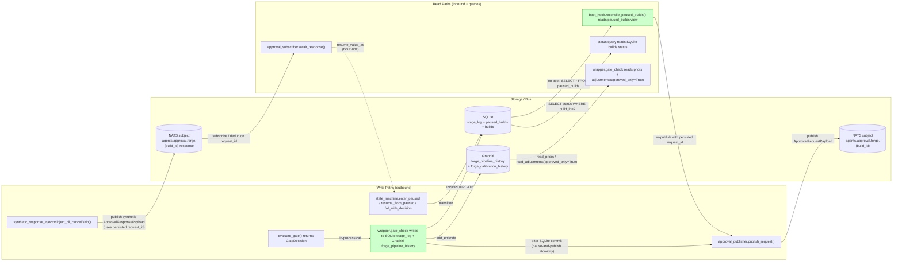
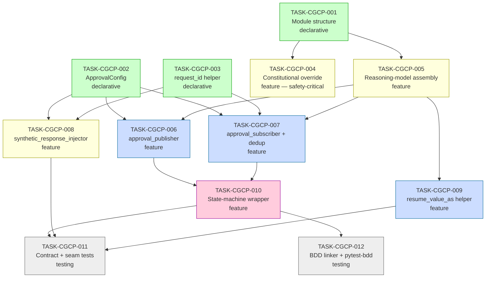

# Implementation Guide — FEAT-FORGE-004 Confidence-Gated Checkpoint Protocol

**Parent review**: [TASK-REV-CG44](../../../tasks/backlog/TASK-REV-CG44-plan-confidence-gated-checkpoint-protocol.md)
**Feature spec**: [confidence-gated-checkpoint-protocol.feature](../../../features/confidence-gated-checkpoint-protocol/confidence-gated-checkpoint-protocol.feature)
**Review report**: [.claude/reviews/TASK-REV-CG44-review-report.md](../../../.claude/reviews/TASK-REV-CG44-review-report.md)

---

## §1 Scope

Implement Forge's confidence-gated checkpoint protocol per
`DM-gating.md` and `API-nats-approval-protocol.md`:

- Domain-pure `forge.gating` package with the four `GateMode` outcomes
  and a pure `evaluate_gate()` function (ADR-ARCH-019: no static
  thresholds; reasoning-model emergent gating).
- Two-layer constitutional override (ADR-ARCH-026 belt-and-braces) for
  PR-review and PR-create stages.
- NATS approval round-trip on `agents.approval.forge.{build_id}` and
  `.response`, with first-response-wins idempotency keyed on a
  deterministic `request_id`.
- `forge cancel` / `forge skip` CLI steering via synthetic
  `ApprovalResponsePayload` injection through the same dedup queue.
- DDR-002 resume-value rehydration helper + CI grep guard.
- SQLite-first / publish-second durable recording (publish failure does
  not roll back recorded decisions).
- Crash-recovery re-emission with persisted `request_id` (responder
  dedup invariant preserved across restarts).
- 32 BDD scenarios tagged onto the 12 implementation tasks for R2 oracle
  activation.

**Out of scope**: behaviour at the `max_wait_seconds` ceiling
(ASSUM-003) — deferred to `forge-pipeline-config`. The wrapper publishes
a final `ApprovalRequestPayload` carrying a fallback marker and lets the
state machine consume it; concrete fallback semantics land in a later
feature.

## §2 Module Layout

```
src/forge/
  gating/
    __init__.py                       # TASK-CGCP-001 — re-export shim
    models.py                         # TASK-CGCP-001 — GateMode, GateDecision, PriorReference, etc.
    constitutional.py                 # TASK-CGCP-004 — _check_constitutional_override
    reasoning.py                      # TASK-CGCP-005 — _assemble_reasoning_prompt, _parse_model_response, _enforce_post_conditions, ReasoningModelCall Protocol
    identity.py                       # TASK-CGCP-003 — derive_request_id (pure)
    wrappers.py                       # TASK-CGCP-010 — gate_check coordinator
  config/
    models.py                         # TASK-CGCP-002 adds ApprovalConfig
  adapters/
    nats/
      approval_publisher.py           # TASK-CGCP-006
      approval_subscriber.py          # TASK-CGCP-007
      synthetic_response_injector.py  # TASK-CGCP-008
      approval_state_hooks.py         # TASK-CGCP-010 — bridges state machine to approval adapter
    langgraph/
      __init__.py                     # TASK-CGCP-009 — re-export resume_value_as
      resume_value.py                 # TASK-CGCP-009 — DDR-002 helper

tests/
  unit/                               # per-module unit tests from each subtask
  integration/                        # TASK-CGCP-011 — contract + seam + safety tests
  bdd/                                # TASK-CGCP-012 — pytest-bdd scenario runner
```

## §3 Architectural Boundaries

- `forge.gating` is **pure domain** — zero imports from `nats_core`,
  `nats-py`, or `langgraph`. Only `pydantic`, stdlib, and other
  domain-pure modules are permitted. (`forge.gating.wrappers` is the one
  file allowed to import the **Protocol** surfaces of adapters, but
  binds them via dependency injection — no concrete adapter imports.)
- `forge.adapters.nats.approval_*` is the **only** layer allowed to
  import the NATS client surface.
- `forge.adapters.langgraph.resume_value_as` is the **only** legal way
  to read a value returned by `interrupt()`. A CI grep guard
  (TASK-CGCP-009 + TASK-CGCP-011) catches violations.
- The reasoning-model invocation is **dependency-injected** into
  `evaluate_gate()` — production code binds the orchestrator's reasoning
  model; tests bind a deterministic double.
- The constitutional override (TASK-CGCP-004) is the **first branch** of
  `evaluate_gate()` and lives in two independent layers; loss of either
  is a constitutional regression (ADR-ARCH-026).

## §4 Integration Contracts

Five cross-task data dependencies. Every consumer includes a seam test.

### Contract: GateDecision

- **Producer task**: TASK-CGCP-005 (the pure `evaluate_gate()` returns it)
- **Consumer task(s)**: TASK-CGCP-006 (publisher emits as `details` dict),
  TASK-CGCP-010 (wrapper writes to SQLite + Graphiti)
- **Artifact type**: Pydantic v2 model (`forge.gating.models.GateDecision`)
- **Format constraint**: All fields per `DM-gating.md §1`; invariants
  per §6 (mode/override coupling, degraded-mode mode-restriction,
  criterion-range). SQLite write **precedes** any bus publish (F10 / R6).
- **Validation method**: Seam test in TASK-CGCP-006 asserts the eleven-key
  `details` dict is fully populated; TASK-CGCP-010 integration test
  asserts SQLite row is present when publish raises.

### Contract: ApprovalConfig.default_wait_seconds / max_wait_seconds

- **Producer task**: TASK-CGCP-002
- **Consumer task(s)**: TASK-CGCP-006 (default_wait → ApprovalRequestPayload.timeout_seconds),
  TASK-CGCP-007 (max_wait → refresh-loop ceiling)
- **Artifact type**: Pydantic v2 model field
- **Format constraint**: `ApprovalConfig.default_wait_seconds: int = 300`,
  `ApprovalConfig.max_wait_seconds: int = 3600`; both non-negative;
  `default_wait_seconds <= max_wait_seconds` invariant enforced by validator
- **Validation method**: Seam tests in TASK-CGCP-006 and TASK-CGCP-007
  assert default values and reject negative inputs at construction

### Contract: derive_request_id

- **Producer task**: TASK-CGCP-003 (`forge.gating.identity.derive_request_id`)
- **Consumer task(s)**: TASK-CGCP-006 (publisher first-emission),
  TASK-CGCP-007 (subscriber dedup), TASK-CGCP-008 (synthetic injector
  reuses persisted id), TASK-CGCP-010 (re-emission reads from SQLite)
- **Artifact type**: Pure function `(*, build_id, stage_label, attempt_count) -> str`
- **Format constraint**: Deterministic — same inputs always produce the
  same output; URL-safe; documented stable format (e.g.
  `f"{build_id}:{stage_label}:{attempt_count}"`). Re-emission **must**
  use the persisted `request_id`, not a re-derivation, so responder-side
  dedup holds (closes risk **R5**).
- **Validation method**: Seam tests in TASK-CGCP-007 and TASK-CGCP-008
  assert determinism; property test in TASK-CGCP-003

### Contract: ApprovalPublisher.publish_request / ApprovalSubscriber.await_response

- **Producer tasks**: TASK-CGCP-006 (publisher), TASK-CGCP-007 (subscriber)
- **Consumer task**: TASK-CGCP-010 (state-machine wrapper)
- **Artifact type**: Async methods on adapter classes
- **Format constraint**: `publish_request(envelope: MessageEnvelope) -> None`
  raises `ApprovalPublishError` on failure (caller catches and surfaces);
  `await_response(build_id, *, timeout_seconds) -> ApprovalResponsePayload | None`
  returns `None` for timeout/duplicate/refused
- **Validation method**: Seam tests in TASK-CGCP-010 import and assert
  method presence + async signature

### Contract: resume_value_as helper

- **Producer task**: TASK-CGCP-009
- **Consumer task(s)**: TASK-CGCP-010 (every `interrupt()` resume read)
- **Artifact type**: Generic function
  `resume_value_as[T](typ: type[T], raw) -> T`
- **Format constraint**: `isinstance(raw, typ)` short-circuits and
  returns `raw` unchanged (no-op in direct-invoke mode); otherwise
  `typ.model_validate(raw)` (server-mode `dict` rehydration). Direct
  attribute access on the resume value without going through this
  helper is a regression — verified by CI grep guard.
- **Validation method**: Parametrised contract test in TASK-CGCP-009
  covers typed + dict shapes; TASK-CGCP-011 runs the grep guard as a
  regular test

---

## §5 Data Flow — Read/Write Paths



*Every write path has a corresponding read path. SQLite is the source of
truth (W2 → R3, R4). Graphiti carries history but is not source of
truth. The bus carries notifications and resume signals but never
authoritative state. No disconnected paths.*

## §6 Integration Contract Diagram (sequence)

The flag-for-review → resume sequence is the most load-bearing path,
and exposes the SQLite-first / publish-second / `resume_value_as`
chain.

```mermaid
sequenceDiagram
    autonumber
    participant SM as state machine
    participant W as gate_check wrapper
    participant E as evaluate_gate (pure)
    participant DB as SQLite
    participant G as Graphiti
    participant P as approval_publisher
    participant S as approval_subscriber
    participant Q as agents.approval.forge.{build_id}
    participant R as Rich (via .response)

    SM->>W: gate_check(stage, target, ...)
    W->>G: read_priors() + read_adjustments(approved_only=True)
    G-->>W: priors, approved adjustments
    W->>E: evaluate_gate(coach_score, findings, priors, adj, reasoning_model)
    E-->>W: GateDecision(mode=FLAG_FOR_REVIEW, request_id_seed=...)
    W->>DB: INSERT stage_log + UPDATE builds.status=PAUSED + INSERT paused_builds(request_id)
    Note over W,DB: SQLite commit BEFORE any bus publish (F10)
    W->>G: add_episode(GateDecision)
    Note over W,G: Graphiti write is best-effort; failure surfaces but does not block
    W->>P: publish_request(envelope) — single async call
    P->>Q: ApprovalRequestPayload(request_id, details, timeout=300)
    Note over W: pause-and-publish atomicity (E4):\nstatus query never sees PAUSED without\na corresponding publish having been issued
    Note over P,Q: If publish raises, control returns to caller;\ndecision row in SQLite remains intact (F10/R6)

    par Refresh loop (within max_wait)
        W->>S: await_response(build_id, timeout=300)
    and Real Rich response
        R->>Q: ApprovalResponsePayload(request_id, decision="approve", responder="rich")
    end
    S->>S: dedup on request_id (first-response-wins)
    S-->>W: raw response (dict in server-mode, typed in direct-invoke)
    W->>W: resume_value_as(ApprovalResponsePayload, raw) [DDR-002]
    Note over W: every read of resume value goes through helper (CI grep guard)

    alt response.decision == "approve"
        W->>SM: resume_from_paused(build_id, response)
        SM->>DB: UPDATE builds.status=RUNNING
    else response.decision == "reject"
        W->>SM: fail_with_decision(build_id, response, outcome=CANCELLED)
        SM->>DB: UPDATE builds.status=CANCELLED
    else response.decision == "override"
        W->>SM: mark_stage_overridden + resume_from_paused
        SM->>DB: UPDATE stage_log.overridden=true + builds.status=RUNNING
    end

    Note over R,Q: forge cancel/skip injects synthetic\nApprovalResponsePayload with persisted\nrequest_id — same dedup, same path,\ndistinguishable via reason="cli cancel"/"cli skip"
```

## §7 Task Dependency Graph



_Green = Wave 1 (parallel-safe foundation), yellow = Wave 2
(parallel-safe pure evaluator), blue = Wave 3 (parallel-safe adapter),
pink = Wave 4 (state-machine integration), grey = Wave 5 (parallel-safe
tests + linker)._

---

## §8 Execution Strategy — Auto-Detect (from Context B)

| Wave | Tasks | Mode | Rationale |
|---|---|---|---|
| 1 | TASK-CGCP-001, TASK-CGCP-002, TASK-CGCP-003 | Parallel (Conductor) | All declarative, zero cross-deps |
| 2 | TASK-CGCP-004, TASK-CGCP-005, TASK-CGCP-008 | Parallel (Conductor) | 004/005 depend only on TASK-CGCP-001 (separate helper files: `constitutional.py` vs `reasoning.py`); 008 depends only on TASK-CGCP-002 + TASK-CGCP-003 (Wave 1) and publishes onto NATS — no in-process dep on the subscriber, so parallel-safe |
| 3 | TASK-CGCP-006, TASK-CGCP-007, TASK-CGCP-009 | Parallel (Conductor) | All three adapters depend on TASK-CGCP-005 (Wave 2); touch separate files; no cross-deps within wave |
| 4 | TASK-CGCP-010 | Single | The wrapper is the integration seam — owns its own file; depends on TASK-CGCP-006 + TASK-CGCP-007 |
| 5 | TASK-CGCP-011, TASK-CGCP-012 | Parallel (Conductor) | Tests file (`tests/integration/`) and `.feature` file rewrite are independent |

**Execution mode**: Auto-detect (Conductor decides per dependency graph). Per
Context B: parallel waves use Conductor workspaces. Total estimated
22–28 focused hours; with Conductor parallelism in Waves 1, 2, 3, 5
realistic end-to-end ≈ 4–5 developer-days.

## §9 Testing Posture — TDD (from Context B)

Per Context B (Quality trade-off, TDD testing depth):

- **Test-first ordering** for safety-critical surfaces — the two-layer
  constitutional regression test (E2) and the durable-decision-on-publish-failure
  test (Group E `@data-integrity`) are written before their target
  implementations
- Unit tests per module owned by each subtask; coverage target 80% line
  coverage for `forge.gating.*` and `forge.adapters.nats.approval_*`
- Contract + seam tests consolidated in TASK-CGCP-011 at integration
  level; in-memory NATS double + temp SQLite — no real network I/O
- BDD scenario coverage owned by TASK-CGCP-012; all 32 scenarios tagged
  via `bdd-linker` subagent
- Clock injection mandatory — no wall-clock sleeps, no `datetime.now()`
  in production paths (enforced by grep-based hygiene test in
  TASK-CGCP-011)
- Reasoning-model nondeterminism (R9) handled by deterministic test
  double; one contract-test invokes the real reasoning model and
  asserts on response **shape**, not content

## §10 Upstream Dependency Gate

**FEAT-FORGE-004 must not start Wave 4 (TASK-CGCP-010) until the upstream
features provide**:

- **FEAT-FORGE-001** — paused-state transition methods on the state
  machine (`enter_paused`, `resume_from_paused`, `fail_with_decision`),
  the `paused_builds` SQLite view used by crash-recovery, and the
  `stage_log.details_json["gate"]` mirror column
- **FEAT-FORGE-002** — fleet bus connectivity used by approval
  publisher and subscriber; `Topics.for_project(...)` helper for
  project-scoped subjects; `nats_core` ApprovalRequestPayload /
  ApprovalResponsePayload schemas (already shipped post TASK-NCFA-003)
- **FEAT-FORGE-003** — Coach scoring entry points and detection-finding
  schemas consumed by `evaluate_gate()`. In degraded mode (FEAT-FORGE-003
  unavailable or returning no Coach score), the post-condition in F8
  takes over: `mode in {FLAG_FOR_REVIEW, HARD_STOP, MANDATORY_HUMAN_APPROVAL}`

If any upstream gate is not yet met when Wave 4 is reached, pause this
feature's autobuild and surface the missing seam.

## §11 Risks (cross-reference)

| Risk | Owning task(s) | Test coverage |
|---|---|---|
| R1 — Constitutional regression | TASK-CGCP-004 + TASK-CGCP-011 (E2 two-layer test) | Highest priority |
| R2 — Rehydration drift | TASK-CGCP-009 (helper) + TASK-CGCP-011 (CI grep guard) | Catch silently-passing direct-invoke regressions |
| R3 — Degraded-mode silent coerce | TASK-CGCP-005 (post-condition) | Pydantic validator + post-condition raise |
| R4 — Idempotency race | TASK-CGCP-007 (asyncio-lock dedup) + TASK-CGCP-011 (concurrency test) | E `@concurrency` |
| R5 — `request_id` re-emission diverges | TASK-CGCP-003 + TASK-CGCP-010 (persisted not re-derived) | Group D `@regression` |
| R6 — SQLite write rolled back on bus failure | TASK-CGCP-010 (ordering) + TASK-CGCP-011 (durable-on-publish-failure) | Group E `@data-integrity` |
| R7 — Pause-and-publish observed inconsistently | TASK-CGCP-010 (single async function) + TASK-CGCP-011 (atomicity test) | Group E `@concurrency @data-integrity` |
| R8 — Calibration adjustment leak | TASK-CGCP-010 (`approved_only=True` filter at read seam) | Group C `@negative` |
| R9 — Reasoning-model nondeterminism | TASK-CGCP-005 (test double) | Unit-test stability |
| R10 — Wait-ceiling fallback overspecified | TASK-CGCP-010 (publishes marker, defers semantics) | ASSUM-003 documented as deferred |

## §12 BDD Scenario Coverage (R2 oracle activation)

The 32 Gherkin scenarios in
[`confidence-gated-checkpoint-protocol.feature`](../../../features/confidence-gated-checkpoint-protocol/confidence-gated-checkpoint-protocol.feature)
were tagged in TASK-CGCP-012 via the `bdd-linker` subagent. Tag
distribution:

| Task | Scenarios tagged |
|---|---|
| TASK-CGCP-001 (gating models) | 2 (criterion-breakdown extremes + out-of-range refusal) |
| TASK-CGCP-002 (ApprovalConfig) | 0 — see justification below |
| TASK-CGCP-003 (request_id helper) | 0 — see justification below |
| TASK-CGCP-004 (constitutional override) | 3 (PR-review, PR-create, two-layer) |
| TASK-CGCP-005 (reasoning-model assembly) | 8 (auto-approve, hard-stop, decision completeness, degraded, critical-finding, mandatory-vs-threshold, calibration filter, degraded-marker) |
| TASK-CGCP-006 (approval_publisher) | 4 (flag-for-review publish, default wait, refresh, payload context) |
| TASK-CGCP-007 (approval_subscriber dedup) | 5 (invalid decision value, dedup, routing, unrecognised responder, concurrent resolve) |
| TASK-CGCP-008 (synthetic_response_injector) | 2 (cancel CLI, skip CLI) |
| TASK-CGCP-009 (resume_value_as helper) | 1 (typed-vs-mapping rehydration) |
| TASK-CGCP-010 (state-machine integration) | 7 (resume, reject, override, crash recovery, max-wait fallback, atomic pause+publish, durable-on-publish-failure) |
| TASK-CGCP-011 (contract & seam tests) | 0 — see justification below |
| TASK-CGCP-012 (BDD linking + pytest-bdd) | 0 — see justification below |

### Untagged-task justifications

The R2 oracle treats a missing `@task:` tag as *not required*. The four
tasks below have no behaviour scenario of their own because they are
purely structural / cross-cutting:

- **TASK-CGCP-002 — ApprovalConfig settings**: pure configuration
  surface. The default-wait-time and max-wait-seconds *behaviours*
  surface through scenarios already tagged onto TASK-CGCP-006 (default
  wait, refresh) and TASK-CGCP-010 (max-wait fallback). A scenario
  describing "config can be loaded from `forge.yaml`" would be
  redundant with the existing FEAT-FORGE-002 config tests.
- **TASK-CGCP-003 — request_id derivation helper**: pure deterministic
  helper. Its observable effects (idempotency-key stability across
  refresh and crash-recovery) appear in scenarios tagged onto
  TASK-CGCP-006 (#10 prior request id valid for dedup) and
  TASK-CGCP-007 (#18 duplicate-response dedup) where the helper is
  consumed; covered by R5 in §11.
- **TASK-CGCP-011 — contract & seam tests for approval round-trip**:
  this task *is* the integration-test layer rather than a behaviour
  carrier. The contract scenarios it exercises (concurrent
  resolution #28, atomic pause+publish #29, durable-on-publish-failure
  #30, two-layer constitutional #27) are already tagged onto the tasks
  that *implement* the behaviour (TASK-CGCP-007, TASK-CGCP-010,
  TASK-CGCP-004). R2 runs the same scenarios through the BDD oracle;
  the seam tests in TASK-CGCP-011 are an additional pytest layer
  using the §4 integration contracts directly.
- **TASK-CGCP-012 — BDD scenario linking + pytest-bdd wiring**: this
  task delivers the tagging itself plus the pytest-bdd glue. There is
  no domain behaviour to tag onto it. The /task-work Phase 4 oracle
  consumes the tags it produces; tagging this task onto a scenario
  would create a circular dependency.
