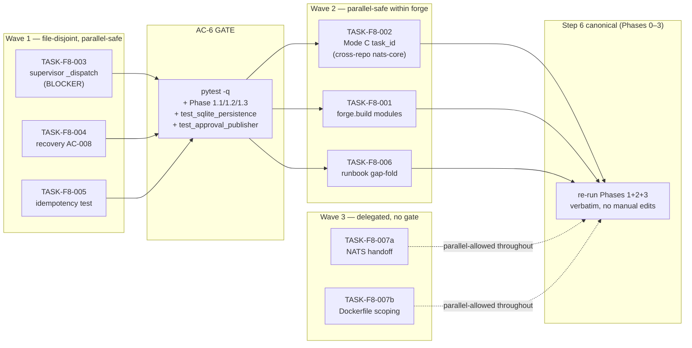

# Implementation Guide — FEAT-F8 (FEAT-FORGE-008 Validation-Triage Fixes)

**Feature ID (docs):** FEAT-F8-VALIDATION-FIXES
**Slug:** `feat-f8-validation-fixes`
**Parent review:** TASK-REV-F008 (`docs/reviews/REVIEW-F008-validation-triage.md`)
**Total tasks:** 8 across 3 waves (6 forge-internal + 2 delegated)
**Aggregate complexity:** 4/10
**Estimated effort:** ~10–14 hours dispatched (~2 days wall, gated on AC-6)

This guide is the load-bearing planning document for the FEAT-F8 fan-out. It
fixes the regressions and gaps surfaced by the 2026-04-29 Step 6 validation
walkthrough so the runbook can be re-run cleanly and Step 6 declared canonical
for Phases 0–3, unblocking Step 7 (FinProxy first real run).

The triage decisions, design choices (esp. F008-VAL-002 Option A), and SOLID
assessment are in `docs/reviews/REVIEW-F008-validation-triage.md`. This guide
focuses on **how to land the work**: ordering, dependencies, parallel-safety,
testing depth, and re-run gates.

---

## §1: Wave-by-wave dependency graph



---

## §2: File-conflict matrix (auto-detected)

| Task | Files touched (write) | Conflicts with |
|------|----------------------|----------------|
| TASK-F8-003 | `src/forge/pipeline/supervisor.py` (1 line in `_SUBPROCESS_STAGES`); `tests/integration/test_mode_a_concurrency_and_integrity.py` (no edit, just goes green) | none |
| TASK-F8-004 | `src/forge/adapters/nats/approval_publisher.py` (export new helper); `src/forge/lifecycle/recovery.py` (replace open-coded dict with helper call); `tests/forge/test_approval_publisher.py` (extend or leave as-is — the static-grep guard goes green automatically once recovery.py stops using the literal) | none |
| TASK-F8-005 | `tests/forge/adapters/test_sqlite_persistence.py` (1 line) | none |
| TASK-F8-002 | `../nats-core/src/nats_core/events/_pipeline.py`; `../nats-core/tests/test_pipeline_events.py`; `src/forge/cli/queue.py`; `tests/forge/cli/test_queue.py` (or new file); `pyproject.toml` (pin nats-core>=0.3.0) | cross-repo: must land in nats-core first |
| TASK-F8-001 | `src/forge/build/__init__.py` (new); `src/forge/build/git_operations.py` (new); `src/forge/build/test_verification.py` (new); `tests/forge/build/` (new); `tests/bdd/test_infrastructure_coordination.py` (drops the `--ignore`) | none |
| TASK-F8-006 | `docs/runbooks/RUNBOOK-FEAT-FORGE-008-validation.md` only | none |
| TASK-F8-007a | `docs/handoffs/F8-007a-nats-canonical-provisioning.md` (new); cross-repo issue in `nats-infrastructure` | none |
| TASK-F8-007b | `docs/scoping/F8-007b-forge-production-dockerfile.md` (new); recommends `/feature-spec FEAT-FORGE-009` | none |

**Conclusion**: every wave is fully file-disjoint within forge. Wave 2's `TASK-F8-002` has a cross-repo dependency on `nats-core` 0.3.0 — handle by landing the nats-core PR first, then the forge PR.

---

## §3: Per-task testing depth (per `Q3=D` default)

| Task | Testing strategy | Rationale |
|------|------------------|-----------|
| TASK-F8-003 | TDD | Mode A regression-critical — write a meta-test asserting every `StageClass` member has a routing branch in `_dispatch` (so future enum extensions fail at test-time, not runtime), THEN add the missing branch. |
| TASK-F8-004 | Standard quality gates | Refactor with a structural guard already in place; the existing static-grep guard goes green when recovery.py stops referencing the literal. Add a unit test for the new helper. |
| TASK-F8-005 | Direct (assertion-only update) | One-line test fix; no new test needed. The change makes the existing test track `_SCHEMA_VERSION`. |
| TASK-F8-002 | TDD (cross-repo) | New validators on a public payload — write the validation tests first in nats-core (positive + negative cases for `task_id`, `mode`, Mode-C-conditional rule), then add forge CLI tests for the Mode C task-id population. |
| TASK-F8-001 | Standard quality gates | New modules with a public surface; the existing BDD bindings at `tests/bdd/test_infrastructure_coordination.py` should drive what gets implemented. Lift the `--ignore` from runbook §1.1 once green. |
| TASK-F8-006 | Direct (docs) | No code; verify by re-running the runbook verbatim after landing. |
| TASK-F8-007a | Direct (docs/handoff) | Cross-repo coordination doc; verify by linking accepted issue/PR in `nats-infrastructure`. |
| TASK-F8-007b | Direct (scoping) | Specifies a sibling feature; verify by handing off to `/feature-spec` for FEAT-FORGE-009. |

---

## §4: Conductor workspace assignment (`Q5=A` auto)

Each task has a pre-assigned workspace name for parallel Conductor execution:

| Task | Workspace | Wave |
|------|-----------|------|
| TASK-F8-003 | `feat-f8-validation-fixes-wave1-1` | 1 |
| TASK-F8-004 | `feat-f8-validation-fixes-wave1-2` | 1 |
| TASK-F8-005 | `feat-f8-validation-fixes-wave1-3` | 1 |
| TASK-F8-002 | `feat-f8-validation-fixes-wave2-1` | 2 |
| TASK-F8-001 | `feat-f8-validation-fixes-wave2-2` | 2 |
| TASK-F8-006 | `feat-f8-validation-fixes-wave2-3` | 2 |
| TASK-F8-007a | `feat-f8-validation-fixes-wave3-1` | 3 |
| TASK-F8-007b | `feat-f8-validation-fixes-wave3-2` | 3 |

---

## §5: AC-6 GO/NO-GO GATE (after Wave 1)

After all three Wave 1 tasks merge, run from a fresh checkout on the merge commit:

```bash
# Phase 1.1 — full sweep (still ignore the missing forge.build collection error,
# we land that in Wave 2)
pytest -q --ignore=tests/bdd/test_infrastructure_coordination.py

# Phase 1.2 — BDD-008 (was 64/64 — re-confirm)
pytest -q tests/bdd/

# Phase 1.3 — Mode A regression guard (was 40/42 — must now be 42/42)
pytest -q tests/integration/test_mode_a_concurrency_and_integrity.py

# Targeted re-checks for the three Wave 1 fixes
pytest -q tests/forge/adapters/test_sqlite_persistence.py
pytest -q tests/forge/test_approval_publisher.py
```

**Pass criteria:** zero red, zero collection errors except the still-ignored
`tests/bdd/test_infrastructure_coordination.py` (which lifts in Wave 2 via
TASK-F8-001).

**GO** → proceed to Wave 2.
**NO-GO** → triage as a sub-finding under `TASK-REV-F008` before moving on.
Do NOT attempt Phase 2 with red Phase 1.

---

## §6: After Wave 2 — Step-6-canonical-for-Phases-0–3 declaration

When Wave 2 lands, re-run the runbook verbatim (no manual edits — that's the
LES1 §8 contract that F008-VAL-006 satisfies):

- Phase 0 — environment (uses the new `uv` step + PATH check + NATS-via-docker hint)
- Phase 1 — full sweep, NO `--ignore` flag (TASK-IC-009/010 has landed)
- Phase 2 — CLI smoke including Mode C with `forge queue --mode c TASK-XXX` populating both `feature_id` and `task_id`
- Phase 3 — NATS round-trip with threaded `correlation_id`

If all green, declare Step 6 canonical for Phases 0–3 in `docs/runbooks/RESULTS-FEAT-FORGE-008-validation-rerun.md`. Step 7 (FinProxy first run) is then unblocked.

Phases 4–6 remain blocked until Wave 3 prerequisites land (see TASK-F8-007a/b).

---

## §7: Cross-repo dependency on `nats-core` (TASK-F8-002 only)

`TASK-F8-002` is the only task with a cross-repo dependency. Sequence:

1. Open a PR against `../nats-core` adding `task_id: str | None` and `mode: Literal[...]` fields to `BuildQueuedPayload` with the validators from `REVIEW-F008-validation-triage.md` §2 Option A.
2. Land + tag `nats-core` 0.3.0.
3. Update forge `pyproject.toml` to pin `nats-core>=0.3.0,<0.4`.
4. Update `forge queue --mode c` CLI to populate `task_id`.
5. Add a forge integration test publishing a Mode C payload end-to-end.

**Why bounded cross-repo cost is acceptable** (per `Q2=Q`): this is the architecturally clean fix; widening the regex (Option C) or renaming `feature_id → subject_id` (Option B) both have higher long-term cost. See `docs/reviews/REVIEW-F008-validation-triage.md` §2 for the full options analysis.

---

## §8: Provenance

- All tasks carry `parent_review: TASK-REV-F008` and `feature_id: FEAT-F8-VALIDATION-FIXES` in their frontmatter.
- The triage rationale is in `docs/reviews/REVIEW-F008-validation-triage.md`.
- The originating validation results are in `docs/runbooks/RESULTS-FEAT-FORGE-008-validation.md`.
- The runbook being repaired is `docs/runbooks/RUNBOOK-FEAT-FORGE-008-validation.md`.
