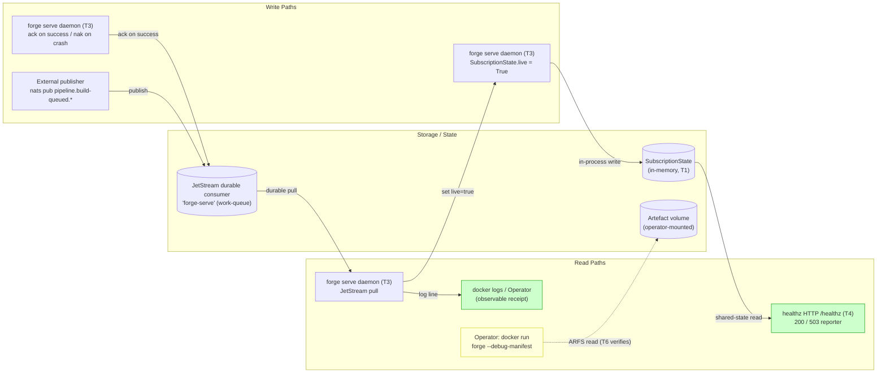
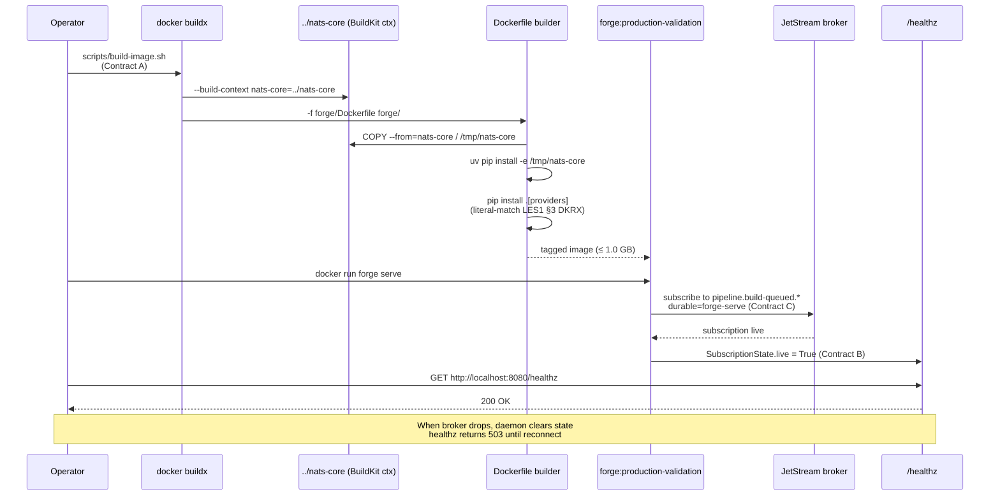
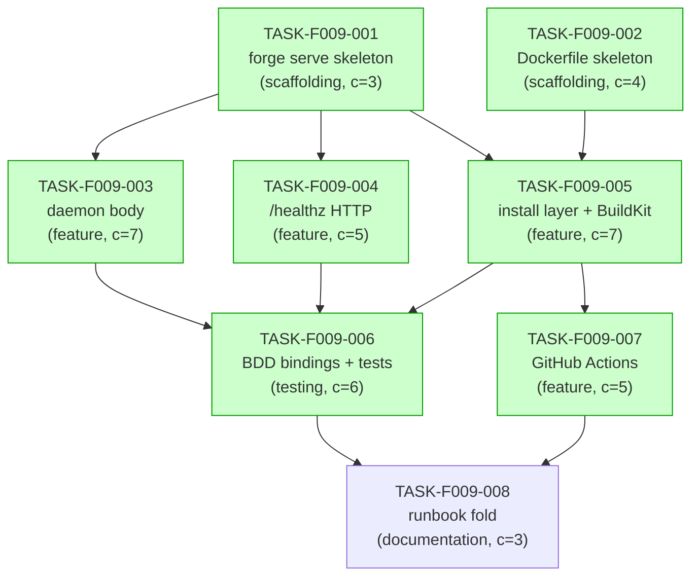

# Implementation Guide: FEAT-FORGE-009 — Forge Production Image

> Generated by `/feature-plan` from `TASK-REV-F009`. Multi-stage Dockerfile,
> `forge serve` daemon, BuildKit `nats-core` context wiring, HEALTHCHECK,
> CI workflow, and runbook §6 fold to unblock LES1 parity gates (CMDW,
> PORT, ARFS, canonical-freeze).

## Feature Summary

| Field | Value |
|---|---|
| Feature ID | FEAT-FORGE-009 |
| Slug | forge-production-image |
| Total tasks | 8 |
| Waves | 4 |
| Aggregate complexity | 7/10 |
| Estimated effort | 2–3 sessions (~10–11 h) |
| Parent review | TASK-REV-F009 |
| Feature spec | [`features/forge-production-image/forge-production-image.feature`](../../../features/forge-production-image/forge-production-image.feature) (27 scenarios) |
| Scoping doc | [`docs/scoping/F8-007b-forge-production-dockerfile.md`](../../../docs/scoping/F8-007b-forge-production-dockerfile.md) |
| Unblocks | Phase 6 of `RUNBOOK-FEAT-FORGE-008-validation.md` (CMDW / PORT / ARFS / canonical-freeze) |

---

## Data Flow: Read/Write Paths



_All write paths have corresponding read paths. R4 (ARFS observability)
is shown dotted/yellow because it's a structural assertion exercised by
T6 rather than a runtime read path — but T6 closes the loop on it._

**Disconnection check**: ✅ No disconnected write paths. Every write
in the diagram has a corresponding read.

---

## Integration Contracts (cross-task data dependencies)

> Three contracts cross task boundaries. Contract A (`BUILDKIT_INVOCATION`)
> is the highest-risk because it appears verbatim in three consumer files.

### Contract A: `BUILDKIT_INVOCATION`

- **Producer**: TASK-F009-005 (Dockerfile + `scripts/build-image.sh`)
- **Consumers**: TASK-F009-006 (drift detector), TASK-F009-007 (CI workflow), TASK-F009-008 (runbook §6.1 fold)
- **Artifact type**: shell command string
- **Format constraint**:
  ```
  docker buildx build --build-context nats-core=../nats-core -t forge:production-validation -f forge/Dockerfile forge/
  ```
  Must be invoked from forge's **parent directory**. No host-side
  `pyproject.toml` mutation. No symlinks. Per scoping §11.4.
- **Validation method**: T6's drift detector (`tests/integration/test_buildkit_invocation_drift.py`) greps all three consumer files for the literal string and fails CI on divergence.

### Contract B: `HEALTHZ_PORT`

- **Producer**: TASK-F009-001 (`forge.cli.serve.DEFAULT_HEALTHZ_PORT`)
- **Consumers**: TASK-F009-004 (HTTP server bind), TASK-F009-005 (Dockerfile HEALTHCHECK + `ENV FORGE_HEALTHZ_PORT`), TASK-F009-006 (test client probe)
- **Artifact type**: integer constant
- **Format constraint**: `8080` exposed as `forge.cli.serve.DEFAULT_HEALTHZ_PORT`; mirrored in Dockerfile as `ENV FORGE_HEALTHZ_PORT=8080`. Overridable via env var; defaults must agree.
- **Validation method**: T5 seam test imports the Python constant and greps the Dockerfile for the matching `ENV`/`HEALTHCHECK` lines.

### Contract C: `JETSTREAM_DURABLE_NAME`

- **Producer**: TASK-F009-001 (`forge.cli.serve.DEFAULT_DURABLE_NAME`)
- **Consumers**: TASK-F009-003 (subscription wiring), TASK-F009-006 (D2 multi-replica test)
- **Artifact type**: string constant
- **Format constraint**: `"forge-serve"` exactly — case-sensitive. JetStream durable names are case-sensitive, and a typo silently creates a second consumer (the ASSUM-006 failure mode this contract exists to prevent).
- **Validation method**: T6 D2 scenario reads the constant and asserts JetStream `consumer_info()` reports the exact same name.

---

## Integration Sequence (build → run → probe)



---

## Task Dependency Graph



_Tasks shaded green can run in parallel within their wave. T8 is
explicitly sequential — Wave 4 only starts when T6 and T7 are both green
on `main`._

---

## Wave Plan

### Wave 1 — Foundation (parallel, ~1 h)

| Task | Files | Why parallel-safe |
|---|---|---|
| **T1** `forge serve` skeleton | new `src/forge/cli/{serve,_serve_state,_serve_daemon,_serve_healthz,_serve_config}.py`, edit `main.py` | Distinct file set from T2 |
| **T2** Dockerfile skeleton | new `Dockerfile`, `.dockerignore` | Distinct file set from T1 |

T1 and T2 do not share any files. They run in two parallel Conductor
workspaces.

### Wave 2 — Feature (parallel, ~6–8 h)

| Task | Files | Why parallel-safe |
|---|---|---|
| **T3** daemon body | edit `src/forge/cli/_serve_daemon.py` only | T1's boundary-file split means daemon and healthz never co-edit `serve.py` |
| **T4** /healthz HTTP | edit `src/forge/cli/_serve_healthz.py` only | Same — boundary file is dedicated |
| **T5** Dockerfile install layer | edit `Dockerfile`, new `scripts/build-image.sh` | No Python-side overlap |

T3, T4, T5 run in three parallel Conductor workspaces. The shared
`SubscriptionState` (T1) is the only inter-task dependency, and it's
purely read/write through a typed dataclass — no protocol contention.

### Wave 3 — Gates (parallel, ~3–4 h)

| Task | Files | Why parallel-safe |
|---|---|---|
| **T6** BDD bindings + integration tests | new `tests/bdd/`, `tests/integration/` files | Tests-only |
| **T7** GitHub Actions workflow | new `.github/workflows/forge-image.yml` | Workflow-only |

Two parallel Conductor workspaces.

### Wave 4 — Governance (sequential, ~30 min)

| Task | Files | Sequencing |
|---|---|---|
| **T8** runbook fold + history append | edit `docs/runbooks/...md`, append `docs/history/command-history.md`, move backlog stub | **Must wait for T6 + T7 to be green on `main`** before this PR can merge — otherwise the AC-J fold is a false signal |

---

## LES1 Gate Coverage

Each LES1 parity gate is structurally reachable once Waves 2–3 land:

| Gate | Closed by | How |
|---|---|---|
| **CMDW** (production-image subscription round-trip) | T3 + T5 + T6 | T3's daemon attaches to JetStream; T5's image is what gets `docker run`; T6 A3 scenario publishes a payload and asserts receipt |
| **PORT** (`(specialist_role, forge_stage)` dispatch matrix) | T1 + T5 + T6 | T1 adds `forge serve` to the CLI surface; T5's install layer ensures `forge --help` works; T6 A2 asserts all 6 subcommands present |
| **ARFS** (per-tool handler-completeness matrix) | T5 + T6 | T5's install ensures `forge.fleet.manifest` ships intact; T6 A4 scenario runs the manifest-build code path inside the image and asserts all 5 tools |
| **canonical-freeze** (verbatim runbook execution) | T5 + T8 | T5's `scripts/build-image.sh` is the canonical entry point; T8 folds the runbook to use the same invocation; A5 scenario asserts copy-paste works on a clean machine |

---

## Risk Register

| # | Risk | Mitigation | Task |
|---|---|---|---|
| R1 | BuildKit `--build-context` resolved differently in CI vs dev host | `scripts/build-image.sh` cd's to parent dir itself; runbook §6.1 fold uses the script | T5, T7, T8 |
| R2 | `forge serve` hangs on shutdown | T3 acceptance: SIGTERM in 10 s; T6 regression test | T3, T6 |
| R3 | `nats-core` sibling layout drifts | T5 builder stage `RUN test -d /tmp/nats-core/src/nats_core` early-fail | T5 |
| R4 | `python:3.14-slim-bookworm` digest gets retagged | Pin both stages by sha256; T7 flags digest age >90 days | T2, T7 |
| R5 | Image size exceeds 1.0 GB budget | T7 size check fails CI | T5, T7 |
| R6 | `forge_feature` / `forge_review_fix` missing from manifest at build | T6 A4 scenario runs manifest inside image | T6 |
| R7 | HEALTHCHECK port 8080 collides with operator service | Override via `FORGE_HEALTHZ_PORT` env (Contract B) | T1, T4, T5 |
| R8 | T8 merges before T6/T7 green — premature canonical signal | T8 acceptance gate: T6 + T7 green on `main` first | T8 |
| R9 | `[tool.uv.sources]` editable shim diverges between dev and image | T5 uses `uv pip install -e /tmp/nats-core` to match dev semantics; T6 import-check inside image | T5, T6 |

---

## Acceptance Criteria Coverage

Sketched ACs from scoping §10 (AC-A through AC-J), mapped to delivering tasks:

| Scoping AC | Delivering tasks | Feature scenarios |
|---|---|---|
| **AC-A** image builds from fresh clone | T2, T5 | A1, B3, C3 |
| **AC-B** `forge --help` shows full surface | T1, T5 | A2 |
| **AC-C** `forge serve` subscribes & receives | T3, T5 | A3, B1, B2 |
| **AC-D** manifest lists every fleet tool | T5, T6 | A4 |
| **AC-E** `pip install .[providers]` literal-match | T5 | B3 |
| **AC-F** no real provider keys | T5, T7 | C1 |
| **AC-G** non-root runtime | T2 | C2 |
| **AC-H** HEALTHCHECK declared & green | T4, T5 | B5, E1.3 |
| **AC-I** CI builds + smoke-tests on PR | T7 | D5 |
| **AC-J** runbook §6 callout removed | T8 | (governance) |

---

## Execution

To run with AutoBuild:

```bash
/feature-build FEAT-FORGE-009
```

To work tasks individually:

```bash
# Wave 1 (parallel)
/task-work TASK-F009-001
/task-work TASK-F009-002

# Wave 2 (parallel) — only after Wave 1 lands
/task-work TASK-F009-003
/task-work TASK-F009-004
/task-work TASK-F009-005

# Wave 3 (parallel)
/task-work TASK-F009-006
/task-work TASK-F009-007

# Wave 4 (sequential, must wait for T6 + T7 green)
/task-work TASK-F009-008
```

---

## Cross-References

- [Feature spec](../../../features/forge-production-image/forge-production-image.feature) — 27 scenarios, all assumptions confirmed
- [Feature summary](../../../features/forge-production-image/forge-production-image_summary.md)
- [Assumptions manifest](../../../features/forge-production-image/forge-production-image_assumptions.yaml)
- [Scoping doc](../../../docs/scoping/F8-007b-forge-production-dockerfile.md) — gate-by-gate requirements, Q4 resolution
- [Validation runbook](../../../docs/runbooks/RUNBOOK-FEAT-FORGE-008-validation.md) — the runbook this feature unblocks
- [ADR-ARCH-032](../../../docs/architecture/decisions/ADR-ARCH-032-langchain-1x-portfolio-alignment.md) — Python 3.14 + LangChain 1.x baseline
- [Backlog stub](../FEAT-FORGE-009-production-image.md) — original 8-item binding shape; T8 closes this stub
