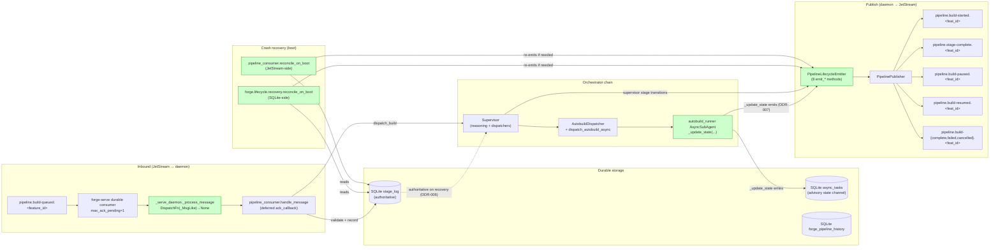
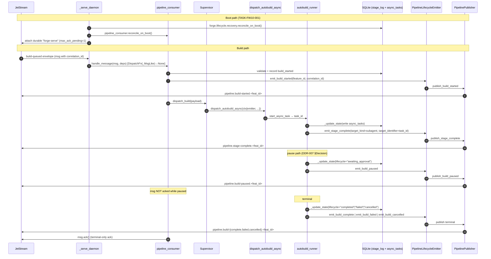
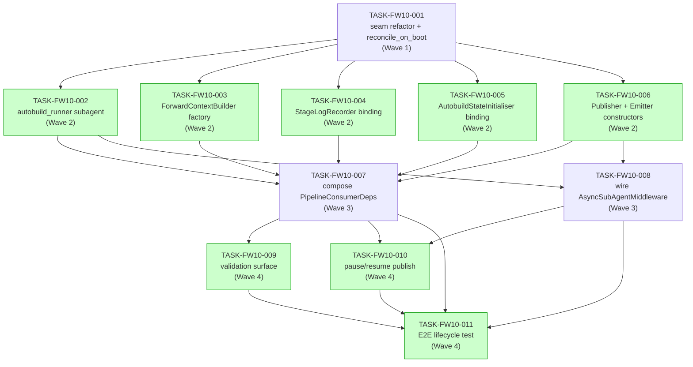

# IMPLEMENTATION-GUIDE — FEAT-FORGE-010

**Feature:** Wire the production pipeline orchestrator into `forge serve`
**Slug:** `forge-serve-orchestrator-wiring`
**Architectural anchor:** [DDR-007](../../../docs/design/decisions/DDR-007-pipeline-lifecycle-emitter-wiring-path.md)
**Parent review:** [TASK-REV-FW10](../../in_review/TASK-REV-FW10-plan-forge-serve-orchestrator-wiring.md)

---

## §1 Goal in one paragraph

After this feature lands, `forge serve` consumes a
`pipeline.build-queued.<feature_id>` envelope, dispatches the build
end-to-end through the canonical Mode A stage chain
(`Supervisor` → dispatchers → `autobuild_runner` AsyncSubAgent),
publishes the full lifecycle envelope sequence
(`build-started`, `stage-complete×N`, `build-paused` / `build-resumed`
if paused, terminal envelope) back to JetStream with the inbound
`correlation_id` threaded through every event, and survives crash +
restart with no lost or duplicated builds. The receipt-only
`_default_dispatch` stub is no longer reachable from production code.

---

## §2 Data flow — read/write paths



_Green-tinted nodes are net-new or materially-changed in FEAT-FORGE-010._

**Disconnection check:** every read path has a corresponding write path
in this feature. The pre-feature state had **all green-tinted nodes
disconnected** (publishers existed but had no callers; the subagent
didn't exist). This feature wires them up. **No disconnection alert.**

---

## §3 Integration contracts (sequence)



**Watch points:**
- Step 4: `pipeline_consumer.handle_message` owns the `ack_callback`.
  `_serve_daemon._process_message` no longer acks on the success path —
  this is the seam-refactor change.
- Step 13–15: pause does **not** ack the inbound message; the queue
  slot is held until the build resolves.
- Steps after each `_update_state`: state-channel write and `emit_*`
  call are co-located inside one function (DDR-007 + DDR-006).
- On publish failure: emitter logs at WARNING and returns; SQLite state
  is unchanged (ADR-ARCH-008). The build continues.

---

## §4 Integration contracts (cross-task data dependencies)

The 11 implementation tasks pass typed Python objects across wave
boundaries. Every cross-task contract below is a candidate for a seam
test in the consumer task; the YAML frontmatter `consumer_context`
field on each consumer task points back to its producer.

### Contract: `DispatchFn` type alias (`(_MsgLike) -> Awaitable[None]`)

- **Producer task:** TASK-FW10-001 (seam refactor)
- **Consumer task(s):** TASK-FW10-007 (deps + dispatcher closure)
- **Artifact type:** Python type alias re-exported from `forge.cli._serve_daemon`
- **Format constraint:** `Callable[[_MsgLike], Awaitable[None]]`. The
  dispatcher must own the ack lifecycle; `_process_message` must not
  call `msg.ack()` on the success path.
- **Validation method:** Coach asserts the seam test in TASK-FW10-007
  monkey-patches a fake dispatcher that does NOT call `msg.ack()`,
  then asserts `_process_message` propagates without acking.

### Contract: `PipelineLifecycleEmitter` instance

- **Producer task:** TASK-FW10-006 (publisher + emitter constructors)
- **Consumer task(s):** TASK-FW10-002 (autobuild_runner), TASK-FW10-008
  (supervisor wiring), TASK-FW10-010 (pause/resume call sites)
- **Artifact type:** Python object — subclass of
  `forge.pipeline.PipelineLifecycleEmitter`
- **Format constraint:** Constructed against the daemon's single shared
  NATS client; exposes the eight `emit_*` methods + `on_transition`
  generic dispatcher per DDR-007. Non-serialisable — passed through
  the dispatcher context payload (ASGI co-deployment per ADR-ARCH-031).
- **Validation method:** Coach asserts TASK-FW10-002's smoke test
  instantiates the subagent with a real emitter in context and
  exercises one `_update_state` transition; both the state-channel
  write AND the emit fire.

### Contract: `PipelinePublisher` instance

- **Producer task:** TASK-FW10-006
- **Consumer task(s):** TASK-FW10-007 (deps factory holds it for
  `publish_build_failed` binding)
- **Artifact type:** Python object — `forge.adapters.nats.pipeline_publisher.PipelinePublisher`
- **Format constraint:** Constructed against the daemon's single shared
  NATS client. The same instance backs the emitter; no second
  publisher is opened.
- **Validation method:** Coach asserts in TASK-FW10-007 that
  `_serve_deps.build_pipeline_consumer_deps` accepts a `client` and
  passes it to both `PipelinePublisher(...)` and the durable consumer
  attach.

### Contract: `ForwardContextBuilder` Protocol implementation

- **Producer task:** TASK-FW10-003
- **Consumer task(s):** TASK-FW10-007 (deps factory composes it),
  TASK-FW10-008 (passed into supervisor's autobuild dispatcher)
- **Artifact type:** Python Protocol implementation — conforms to
  `forge.pipeline.dispatchers.autobuild_async`'s `ForwardContextBuilder`
  surface.
- **Format constraint:** Built against the SQLite reader and
  `forge_config.allowed_worktree_paths`; returns a forward context that
  honours the worktree allowlist (Group E security scenario).
- **Validation method:** Coach asserts the consumer's seam test
  invokes the builder against a fixture worktree path and asserts the
  returned context is bounded by the allowlist.

### Contract: `StageLogRecorder` Protocol implementation

- **Producer task:** TASK-FW10-004
- **Consumer task(s):** TASK-FW10-007 (deps factory composes it),
  TASK-FW10-008 (passed into supervisor's autobuild dispatcher)
- **Artifact type:** Python Protocol implementation — conforms to
  `forge.pipeline.dispatchers.autobuild_async`'s `StageLogRecorder`
  surface.
- **Format constraint:** Wires `forge.lifecycle.persistence`'s SQLite
  writer behind the Protocol. Writes must be observable via the
  reader on the same SQLite pool.
- **Validation method:** Coach asserts a seam test where a write is
  followed by a read against the same `sqlite_pool` and the recorded
  transition is observed.

### Contract: `AutobuildStateInitialiser` Protocol implementation

- **Producer task:** TASK-FW10-005
- **Consumer task(s):** TASK-FW10-007 (deps factory composes it),
  TASK-FW10-008 (passed into supervisor's autobuild dispatcher)
- **Artifact type:** Python Protocol implementation — conforms to
  `forge.pipeline.dispatchers.autobuild_async`'s state-channel
  initialiser surface.
- **Format constraint:** Wires `forge.lifecycle.persistence`'s
  `async_tasks` writer. Initial-state write is `lifecycle="starting"`
  per DDR-006; the subagent owns subsequent writes.
- **Validation method:** Coach asserts a seam test where the
  initialiser writes `lifecycle="starting"` and a subsequent reader
  observes that initial value before any subagent transition.

### Contract: `AUTOBUILD_RUNNER_NAME` graph entry name

- **Producer task:** TASK-FW10-002 (registers the graph in `langgraph.json`)
- **Consumer task(s):** TASK-FW10-008 (supervisor references it via
  `forge.pipeline.dispatchers.autobuild_async.AUTOBUILD_RUNNER_NAME`)
- **Artifact type:** Constant string + entry in `langgraph.json`'s
  `graphs` map.
- **Format constraint:** Literal value `"autobuild_runner"`. The
  `langgraph.json` entry maps `"autobuild_runner"` to
  `./src/forge/subagents/autobuild_runner.py:graph` (final path
  determined in TASK-FW10-002).
- **Validation method:** Coach asserts `langgraph.json` parses, the
  graph entry exists, and TASK-FW10-008's seam test loads the graph
  and confirms it's addressable.

---

## §5 Boot order (load-bearing)

The daemon's `_run_serve` must execute these steps **in order**, all
before the consumer's first fetch:

```
1. Load ForgeConfig (existing)
2. Open SQLite pool (existing)
3. Open NATS client (single shared connection — ASSUM-011)
4. forge.lifecycle.recovery.reconcile_on_boot(sqlite_pool)            ← TASK-FW10-001
5. pipeline_consumer.reconcile_on_boot(client, sqlite_pool, publisher) ← TASK-FW10-001
6. Construct PipelinePublisher + PipelineLifecycleEmitter             ← TASK-FW10-006 surface, called in TASK-FW10-007
7. Construct PipelineConsumerDeps via build_pipeline_consumer_deps     ← TASK-FW10-007
8. Construct Supervisor + wire AsyncSubAgentMiddleware                ← TASK-FW10-008
9. Set chain_ready=True on _serve_state                                ← TASK-FW10-001
10. Attach durable consumer "forge-serve" (max_ack_pending=1)         ← TASK-FW10-001
11. Start healthz + daemon loops                                       ← existing F009 surface
```

Steps 4 and 5 must complete before step 10. If they don't, an in-flight
build's redelivered envelope will be processed against an unreconciled
durable history (e.g., a paused build will re-emit `build-started`
instead of `build-paused`).

---

## §6 Smoke gates (between waves)

Per Context B (smoke_gates: yes), the FEAT-FW10.yaml carries gates
that fire between waves during `/feature-build`. Each gate runs in the
shared worktree against the implementation accumulated up to that point.

| Gate | Fires after | Command | Why |
|---|---|---|---|
| 1 | Wave 1 | `pytest tests/cli -x` | Seam refactor + reconcile wiring must not regress F009-003 daemon tests. |
| 2 | Wave 2 | `pytest tests/forge -x` | Five net-new components must each pass their unit tests before composition. |
| 3 | Wave 3 | `pytest tests/cli tests/forge -x -k 'serve or supervisor or deps'` | Composition must not break the daemon or the supervisor. |

(No gate after Wave 4 — the E2E test in TASK-FW10-011 is itself the
final gate.)

---

## §7 Task dependency graph



_Green-filled tasks can run in parallel within their wave._

**Conductor workspaces (Wave 2):**

| Task | Workspace |
|---|---|
| TASK-FW10-002 | `wave2-autobuild-runner` |
| TASK-FW10-003 | `wave2-forward-context-builder` |
| TASK-FW10-004 | `wave2-stage-log-recorder` |
| TASK-FW10-005 | `wave2-autobuild-state-initialiser` |
| TASK-FW10-006 | `wave2-publisher-emitter` |

Wave 3 and Wave 4 tasks share the main worktree (modify overlapping
files; serial within wave is safer).

---

## §8 Acceptance set (rolled up from FEAT-FORGE-010 spec)

The 31 scenarios in `forge-serve-orchestrator-wiring.feature` are the
canonical acceptance set. They are tagged across the 11 tasks via
`@task:<TASK-ID>` annotations applied by Step 11 BDD scenario linking.
Group-level summary:

- **Group A (key examples, 7 scenarios)** — TASK-FW10-001, -007, -008,
  -011 (full lifecycle, daemon startup composition, correlation-id
  threading, AsyncSubAgent dispatch, real-stage invariant, build-started
  bookend, single shared NATS connection).
- **Group B (boundary, 5 scenarios)** — TASK-FW10-001 (max_ack_pending,
  durable name, ack_wait, terminal-only ack outline, paused-not-acked).
- **Group C (negative, 6 scenarios)** — TASK-FW10-001, -009 (receipt-only
  stub gone, malformed payload, duplicate skip, allowlist gating,
  dispatch error contained, publish failure does not regress recorded
  transition).
- **Group D (edge cases, 6 scenarios)** — TASK-FW10-001, -010, -011
  (crash recovery, paused-survives-restart, approval round-trip,
  two-replica failover, cancel propagation, SIGTERM unacked).
- **Group E (edge case expansion, 7 scenarios)** — TASK-FW10-002, -006,
  -007, -011 (worktree confinement, mismatched-correlation approval
  ignored, lifecycle ordering invariant, durable history authoritative,
  in-subagent stage_complete carries task_id, fail-fast on NATS
  unreachable, healthz reflects orchestrator readiness).

---

## §9 Operational note

The existing `forge-serve` durable consumer in production must be
deleted before deploying the new image — `max_ack_pending` cannot be
edited on a live JetStream consumer. Run:

```bash
nats consumer rm PIPELINE forge-serve
```

before deploying the FEAT-FORGE-010 image. The new image will
re-create the consumer with `max_ack_pending=1` on first start.
Capture this in the deployment runbook for FEAT-FORGE-010.
