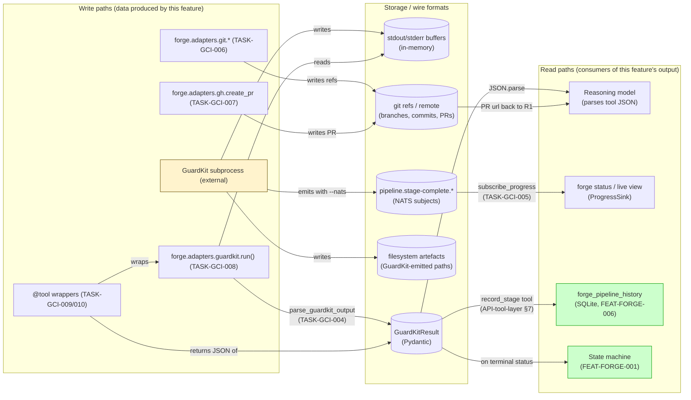
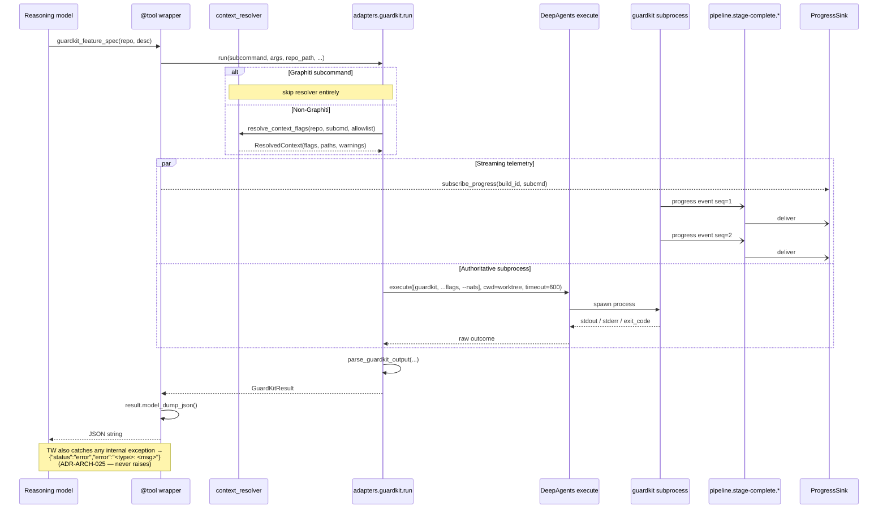
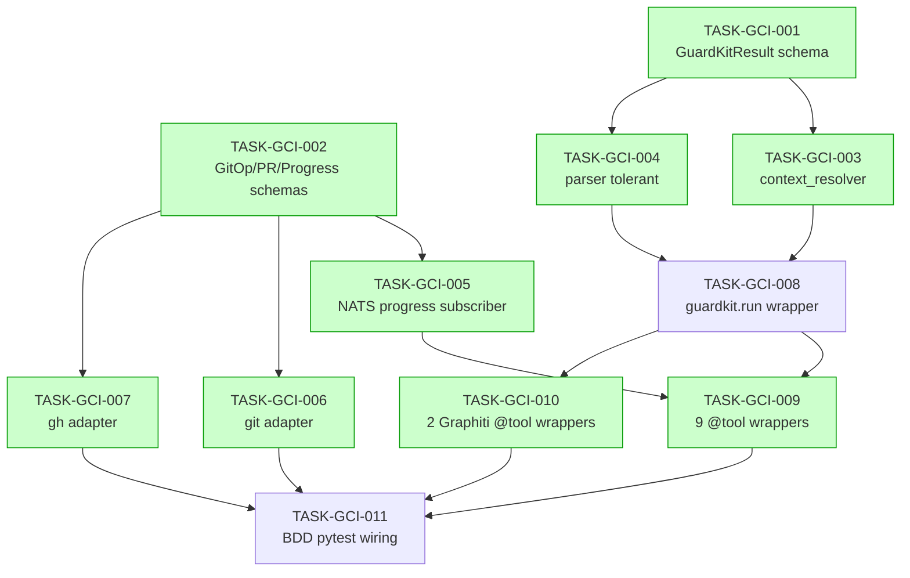

# IMPLEMENTATION GUIDE — FEAT-FORGE-005: GuardKit Command Invocation Engine

**Feature ID:** FEAT-FORGE-005
**Review:** TASK-REV-GCI0
**Folder:** `tasks/backlog/guardkit-command-invocation-engine/`
**Tasks:** 11 (5 waves)
**Aggregate complexity:** 6 (medium)

---

## §1: Scope

This feature is the **subprocess surface** Forge uses to drive every
GuardKit subcommand and the git/gh operations that bracket a build. It
spans:

- the central subprocess wrapper `forge.adapters.guardkit.run()`
- the `.guardkit/context-manifest.yaml` resolver (DDR-005)
- the tolerant GuardKit output parser
- the NATS progress-stream subscriber for `forge status` telemetry
- the git adapter (worktree / commit / push / cleanup)
- the gh adapter (PR creation, missing-credential structured error)
- 11 `@tool(parse_docstring=True)` async wrappers — one per GuardKit
  subcommand
- 32 BDD scenarios wired as Coach-blocking oracles via the R2 task-level
  BDD runner

Inputs:
- `features/guardkit-command-invocation-engine/*.feature` + assumptions
- `docs/design/contracts/API-subprocess.md` §1–6
- `docs/design/contracts/API-tool-layer.md` §2 + §6
- `docs/design/decisions/DDR-005-cli-context-manifest-resolution.md`

---

## §2: Data Flow — Read/Write Paths



**Disconnection check.** Every write path has a corresponding read path:

- subprocess stdout → parser → `GuardKitResult` → reasoning model **(connected)**
- progress NATS subjects → `subscribe_progress` → `ProgressSink` → `forge status` **(connected)**
- filesystem artefacts → `GuardKitResult.artefacts` → reasoning model **(connected)**
- git refs / PR URL → `GitOpResult` / `PRResult` → reasoning model **(connected)**

No disconnection alert — all read paths have callers within the immediate
feature scope or in adjacent FEAT-FORGE-001 / FEAT-FORGE-006 features that
already exist.

---

## §3: Integration Contract — Subprocess Sequence



The progress stream and the synchronous `run()` execute **in parallel** —
the stream is telemetry, the synchronous result is authoritative
(API-subprocess.md §3.2). If the stream is unavailable, the synchronous
result still returns (Scenario "The authoritative result still returns when
progress streaming is unavailable").

---

## §4: Integration Contracts (cross-task data flow)

The cross-task data dependencies in this feature are all in-process Python
types (Pydantic models, function signatures). There are **no
infrastructure↔framework format-constraint pairs** (no DSN-style URLs,
queue names, or external wire formats produced by one task and consumed by
another). Section omitted by design — the §4 contract pattern is for
infrastructure boundaries, not in-process imports.

---

## §5: Task Dependency Graph



_Tasks shaded green can run in parallel within their wave._

---

## §6: Wave Plan

| Wave | Tasks | Parallel? | Why this grouping |
|---|---|---|---|
| 1 | TASK-GCI-001, TASK-GCI-002 | Yes (no shared files) | Schemas first — every other task imports them |
| 2 | TASK-GCI-003, TASK-GCI-004, TASK-GCI-005, TASK-GCI-006, TASK-GCI-007 | Yes (different modules) | Resolver, parser, NATS subscriber, git, gh — all independent of each other |
| 3 | TASK-GCI-008 | Single | Joins resolver + parser into the central subprocess wrapper |
| 4 | TASK-GCI-009, TASK-GCI-010 | Yes (different modules) | 9 GuardKit tool wrappers + 2 Graphiti tool wrappers, separate files |
| 5 | TASK-GCI-011 | Single | BDD pytest wiring exercises the entire stack |

Wave 2 contains five parallel tasks — Conductor (or equivalent parallel
runner) is recommended. Tasks 6 and 7 share a `forge.adapters.git.models`
import surface but no mutable state.

---

## §7: Cross-cutting invariants (apply to every task)

These are not separate tasks but every implementation task must respect
them:

1. **Universal error contract (ADR-ARCH-025).** Every adapter and tool
   function wraps its body in `try/except Exception as exc:` and returns a
   structured failure / error string. Never raises past the boundary.
   Cancellation (`asyncio.CancelledError`) is the **one** documented
   exception — propagate it for correct asyncio shutdown.
2. **Worktree confinement (ADR-ARCH-028).** Every subprocess runs with
   `cwd` inside the build's allowlisted worktree. DeepAgents enforces;
   `run()` adds a defence-in-depth check.
3. **Permissions are constitutional (ADR-ARCH-023).** No reasoning model
   can adjust `forge.yaml.permissions.shell.allowlist` /
   `working_directory_allowlist` / `filesystem.read_allowlist`. Adapter
   layer relies on DeepAgents enforcement, does not re-check.
4. **Resolver and runner are stateless (ASSUM-007).** No module-level
   caches keyed on `repo_path`. Two concurrent builds against the same
   repo resolve independently.
5. **Tolerant parsing.** Unknown GuardKit output shapes degrade to
   `status="success"` with empty `artefacts`, never raise.
6. **Telemetry is non-authoritative.** A missing/slow NATS progress
   stream must not affect the synchronous `GuardKitResult`.

---

## §8: BDD scenario coverage map

The 32 scenarios from
`features/guardkit-command-invocation-engine/guardkit-command-invocation-engine.feature`
are exercised by TASK-GCI-011 against the integrated stack. The
`bdd-linker` subagent runs in Step 11 of `/feature-plan` and writes the
authoritative `@task:<TASK-ID>` tags into the feature file based on
similarity scores. The mapping below is the planner's intended home for
each scenario group — Step 11 either confirms it or proposes a different
fit.

| Group | Scenarios | Intended primary owner |
|---|---|---|
| A (key-examples) | success path, context flags, streaming, error contract, worktree confinement, PR creation, Graphiti bypass | 008, 003, 005, 008, 008, 007, 010 |
| B (boundary) | timeout 1/300/599s, timeout exceeded, depth-2 chase, depth-cap warn, stdout < 4 KB, stdout >> 4 KB | 008, 008, 003, 003, 004, 004 |
| C (negative) | missing manifest, allowlist refusal, cwd refusal, non-zero exit, unknown shape, omitted docs, missing creds | 003, 008, 008, 008, 004, 003, 007 |
| D (edge-case) | cycle, cleanup failure, progress unavailable, retry-with-context, internal error, parallel | 003, 006, 005, 008, 008, 008 |
| E (security/concurrency/integration) | path traversal, shell-meta, concurrent builds, cancellation, back-pressure, stalled | 003, 008, 003, 008, 005, 008 |

---

## §9: How to start

```
Wave 1 → run TASK-GCI-001 + TASK-GCI-002 in parallel (declarative, ~30 min each)
Wave 2 → run TASK-GCI-003, 004, 005, 006, 007 in parallel  (Conductor recommended)
Wave 3 → run TASK-GCI-008 (depends on 003 + 004)
Wave 4 → run TASK-GCI-009 + TASK-GCI-010 in parallel
Wave 5 → run TASK-GCI-011 (BDD test wiring)
```

Total estimated effort: 2–3 days (matches build plan FEAT-FORGE-005 row).
