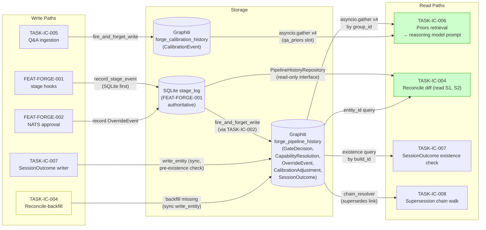
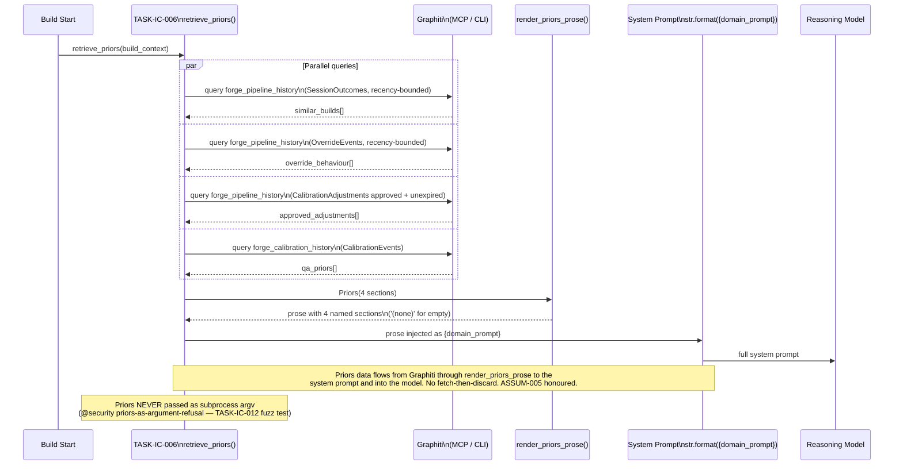
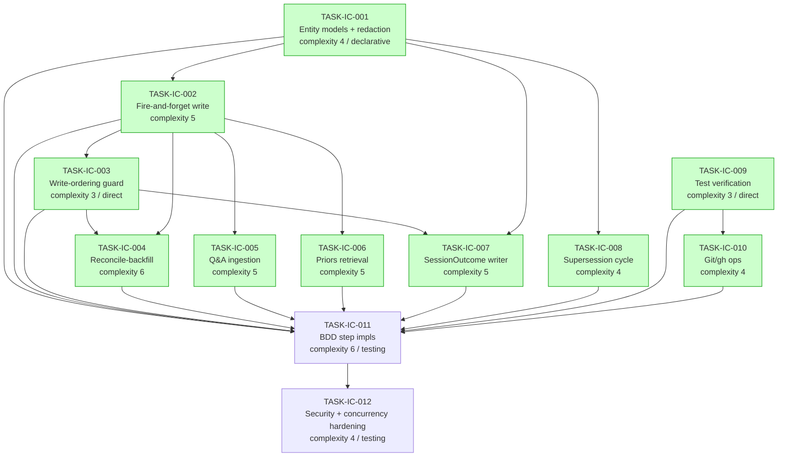

# IMPLEMENTATION-GUIDE.md — FEAT-FORGE-006 Infrastructure Coordination

**Source review:** [TASK-REV-IC8B](../../../.claude/reviews/TASK-REV-IC8B-review-report.md)
**Feature ID:** FEAT-FORGE-006
**Aggregate complexity:** 8/10
**Estimated effort:** 40-60 hours
**Tasks:** 12 across 6 waves

This guide is the single source of execution truth for FEAT-FORGE-006. Every
diagram below is required reading before starting Wave 1. The Data Flow
diagram (§1) is the primary architectural artefact — a reviewer who reads
nothing else should read that.

---

## §1: Data Flow — Read/Write Paths

This diagram shows every write path and every read path for the two Graphiti
groups this feature manages.

**What to look for:**
- Every write to `forge_pipeline_history` (S2) is anchored by a SQLite write
  to S1 first — this is the write-ordering invariant from `@edge-case
  write-ordering`.
- Reconcile-backfill (yellow) is the safety net that closes any gap caused
  by a fire-and-forget failure. It reads from BOTH S1 (authoritative) and
  S2 (current Graphiti state), diffs, and replays missing entries through
  the same write path.
- All four read paths (green) have at least one corresponding write path —
  no disconnected reads.

**Disconnection check:** ✅ No disconnected paths. Every write has a
corresponding read; every read has a corresponding write.

---

## §2: Integration Contract — fetch-then-discard check

Complexity is 8 (≥5), so this diagram is required. It shows the priors
retrieval sequence to confirm data fetched from Graphiti reaches the
reasoning model and is not silently discarded.

**What to look for:** the priors data has a single straight-line path from
Graphiti to the model. No silent drops, no transforms that lose information,
no places where priors are computed and discarded.

---

## §3: Task Dependency Graph

Twelve tasks across six waves. Tasks within a wave are parallel-safe (no
file conflicts or data dependencies between them).

_Tasks with green background can run in parallel within their wave._

### Wave plan

| Wave | Tasks | Parallel-safe? | Conductor recommended? |
|------|-------|---------------|------------------------|
| 1 | TASK-IC-001, TASK-IC-009 | ✅ disjoint modules | ✅ |
| 2 | TASK-IC-002, TASK-IC-008, TASK-IC-010 | ✅ disjoint modules | ✅ |
| 3 | TASK-IC-003, TASK-IC-005, TASK-IC-006 | ✅ disjoint modules | ✅ |
| 4 | TASK-IC-004, TASK-IC-007 | ✅ disjoint modules | ✅ |
| 5 | TASK-IC-011 | n/a (single) | n/a |
| 6 | TASK-IC-012 | n/a (single) | n/a |

---

## §4: Integration Contracts

Cross-task data dependencies that span module boundaries within this
feature. Each contract MUST be honoured by both producer and consumer; the
seam tests in the consumer task files validate the boundary.

### Contract: pipeline_history_entity_id_contract
- **Producer task:** TASK-IC-001
- **Consumer task(s):** TASK-IC-002, TASK-IC-004, TASK-IC-007
- **Artifact type:** Pydantic model field convention
- **Format constraint:** For `GateDecision`, `CapabilityResolution`,
  `OverrideEvent`, `CalibrationAdjustment`, `SessionOutcome`: `entity_id`
  field MUST be a `UUID` sourced from the SQLite row UUID — never generated
  at write time. For `CalibrationEvent`: `entity_id` is a `str` deterministic
  hash from `(source_file, line_range_hash)`.
- **Validation method:** Seam test in TASK-IC-002 asserts the field types
  and the UUID-sourcing convention. Code review checks every write site.

### Contract: priors_prose_injection_schema
- **Producer task:** TASK-IC-002 (data path) + TASK-IC-006 (renderer)
- **Consumer task(s):** TASK-IC-006 (renderer) + reasoning-model system prompt
- **Artifact type:** prose block with four named sections, injected via
  `str.format({domain_prompt})` placeholder
- **Format constraint:** Section names: `recent_similar_builds`,
  `recent_override_behaviour`, `approved_calibration_adjustments`,
  `qa_priors`. Empty sections render as the literal `(none)` marker —
  NEVER omitted. Section order is stable.
- **Validation method:** Seam test in TASK-IC-006 asserts all four section
  names appear and `(none)` appears exactly once per empty section.

### Contract: execute_command_allowlist
- **Producer task:** TASK-IC-010 (constant lives in `forge/build/git_operations.py`)
- **Consumer task(s):** TASK-IC-009 (test verification imports it)
- **Artifact type:** named Python constant `ALLOWED_BINARIES = frozenset({"git", "gh", "pytest"})`
- **Format constraint:** Single source of truth; both modules MUST import
  the same constant — no duplication. Adding a binary requires ADR +
  allowlist-change review.
- **Validation method:** Seam test in TASK-IC-010 asserts identity (`is`)
  between the import in TASK-IC-009 and the canonical constant.

### Contract: test_verification_result_schema
- **Producer task:** TASK-IC-009
- **Consumer task(s):** TASK-IC-011 (BDD steps), Coach (during /task-work)
- **Artifact type:** TypedDict `TestVerificationResult`
- **Format constraint:** Required keys `passed: bool`, `pass_count: int`,
  `fail_count: int`, `failing_tests: list[str]`, `output_tail: str`,
  `duration_seconds: float`. Counts may be `-1` to signal "exit code
  authoritative, parsing failed" (documented fallback).
- **Validation method:** TypedDict typing validates statically; BDD steps
  in TASK-IC-011 assert key presence and types at runtime.

---

## Cross-cutting reminders for every wave

- **Failure tolerance is non-negotiable.** Graphiti writes off the critical
  path. The lesson from prior incidents (`guardkit__task_outcomes` group)
  is that post-acceptance write failures cost LLM token spend by
  discarding correct work. Mirror the `_write_to_graphiti()` success-path
  pattern from `run_greenfield()`.

- **No subprocess outside the execute tool.** AGENTS.md is binding. Even
  for "just a quick test" — route through DeepAgents `execute`. The
  rejected-alternative facts in `architecture_decisions` confirm this.

- **No SQLite schema coupling.** TASK-IC-004 (reconcile-backfill)
  specifically must access SQLite via the FEAT-FORGE-001 repository
  interface, not direct SQL. Treat any SQLite-schema-knowledge in this
  feature's code as an integration contract violation.

- **Allowlist drift is silent.** TASK-IC-010 owns the constant; every PR
  touching it triggers an ADR-level review. The `@negative
  negative-disallowed-binary-refused` test enumerates the allowlist and
  catches accidental additions.

- **Mind the planned async-write shared library.** A "Async Graphiti
  write" feature is on the roadmap (per `guardkit__project_decisions`).
  TASK-IC-002 should stub its internal call behind a thin abstraction so
  the swap is mechanical when/if that library lands.

---

## Recommended execution order

1. **Wave 1 (parallel):** TASK-IC-001 (entity models), TASK-IC-009 (test
   verification).
2. **Wave 2 (parallel):** TASK-IC-002 (fire-and-forget write), TASK-IC-008
   (supersession cycle), TASK-IC-010 (git/gh).
3. **Wave 3 (parallel):** TASK-IC-003 (ordering guard), TASK-IC-005 (Q&A
   ingestion), TASK-IC-006 (priors).
4. **Wave 4 (parallel):** TASK-IC-004 (reconcile-backfill), TASK-IC-007
   (SessionOutcome writer).
5. **Wave 5 (single):** TASK-IC-011 (BDD step impls — start with the 6
   `@smoke` scenarios; iterate by tag group).
6. **Wave 6 (single):** TASK-IC-012 (security + concurrency hardening).

After Wave 6, the feature is feature-complete. Run `/feature-complete
FEAT-FORGE-006` to merge and archive results.
