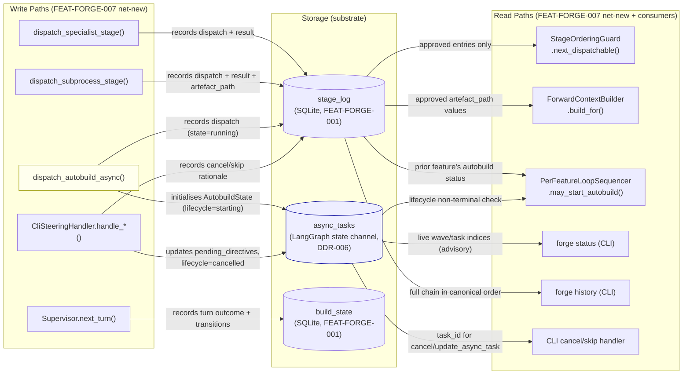
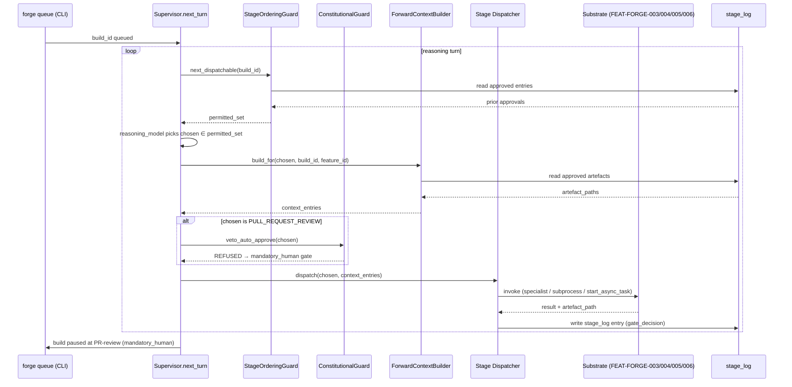
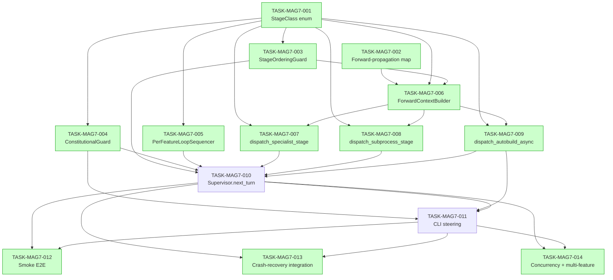

# Implementation Guide — FEAT-FORGE-007 Mode A Greenfield End-to-End

**Generated**: 2026-04-25
**Source review**: [TASK-REV-MAG7](../../../tasks/backlog/TASK-REV-MAG7-plan-mode-a-greenfield-end-to-end.md)
**Review report**: [.claude/reviews/TASK-REV-MAG7-review-report.md](../../../.claude/reviews/TASK-REV-MAG7-review-report.md)
**Approach**: Option 1 — Reasoning-loop-driven dispatch with deterministic StageOrderingGuard
**Total tasks**: 14 across 5 waves
**Estimated effort**: 12–16 hours focused implementation

---

## §1: Approach Summary

FEAT-FORGE-007 is a **composition feature**. It introduces no new transitions,
transports, or gate modes. Every primitive it relies on is already specified in
FEAT-FORGE-001 through FEAT-FORGE-006. The work is *purely orchestration* — wiring
the supervisor's reasoning loop to dispatch the eight Mode A stage classes in
order, threading each stage's approved output forward, launching autobuild as
an `AsyncSubAgent`, and ensuring constitutional invariants and crash-recovery
contracts hold.

The recommended approach pairs:

- A **deterministic `StageOrderingGuard`** (pure function over `stage_log`) that
  refuses any dispatch whose prerequisites aren't approved
- A **`ConstitutionalGuard`** that refuses auto-approve and skip on PR-review
  (executor-layer half of ADR-ARCH-026 belt-and-braces)
- A **`PerFeatureLoopSequencer`** that refuses a second autobuild while the
  prior feature's autobuild is non-terminal (ASSUM-006)
- A **`ForwardContextBuilder`** that assembles `--context` flags from approved
  prior stage artefacts only (mitigates Risk R-5)
- The **LangGraph supervisor's reasoning loop** that selects which permitted
  dispatch to execute on each turn

The reasoning model selects *what* to dispatch; the guards enforce *what is
permitted*. The asymmetry preserves ADR-ARCH-026 (prompt drift cannot bypass
executor invariants).

---

## §2: Data Flow — Read/Write Paths

_Every write path has a corresponding read path. No disconnected flows.
`async_tasks` is advisory on recovery; `stage_log` is authoritative._

---

## §3: Integration Contract (Stage Dispatch Sequence)

_Every dispatch is gated by `StageOrderingGuard`; PR-review is additionally
gated by `ConstitutionalGuard`. The reasoning model only chooses **within**
the permitted set._

---

## §4: Integration Contracts

### Contract: stage_taxonomy

- **Producer task**: TASK-MAG7-001
- **Consumer task(s)**: TASK-MAG7-003, TASK-MAG7-004, TASK-MAG7-005, TASK-MAG7-007, TASK-MAG7-008
- **Artefact type**: Python module (importable symbols)
- **Format constraint**: `forge.pipeline.stage_taxonomy` must export
  `StageClass(StrEnum)` with eight members in canonical order, plus
  `STAGE_PREREQUISITES: dict[StageClass, list[StageClass]]` with exactly
  seven entries matching the Group B Scenario Outline verbatim
- **Validation method**: Coach asserts
  `len(StageClass) == 8 and len(STAGE_PREREQUISITES) == 7` and that the
  prerequisite map keys equal the seven downstream stages from the Scenario
  Outline. Seam test in TASK-MAG7-003 validates at runtime.

### Contract: forward_propagation_map

- **Producer task**: TASK-MAG7-002
- **Consumer task(s)**: TASK-MAG7-006
- **Artefact type**: Python module (importable symbols)
- **Format constraint**: `forge.pipeline.forward_propagation` must export
  `PROPAGATION_CONTRACT: dict[StageClass, ContextRecipe]` with exactly
  seven entries (one per non-product-owner stage). Each recipe must reference
  the producer-stage artefact kind (`text` / `path` / `path-list`) consumed
  by the next stage.
- **Validation method**: At import time, the module self-checks that every
  key is reachable from `PRODUCT_OWNER` via the `STAGE_PREREQUISITES` chain
  from TASK-MAG7-001. Coach asserts that `len(PROPAGATION_CONTRACT) == 7`.

### Contract: forward_context

- **Producer task**: TASK-MAG7-006
- **Consumer task(s)**: TASK-MAG7-007, TASK-MAG7-008, TASK-MAG7-009
- **Artefact type**: in-process Python return value
  (`list[ContextEntry]`)
- **Format constraint**: Each `ContextEntry` carries a kind (`path` /
  `text`) and a value. Path entries must satisfy the worktree allowlist
  (FEAT-FORGE-005); the builder filters disallowed paths before returning.
  The list reflects only entries with `gate_decision='approved'`.
- **Validation method**: Seam tests in each consumer dispatcher assert that
  passing an in-memory fixture with `flagged-for-review` entries yields
  empty context, and that an out-of-allowlist path is filtered out.

### Contract: constitutional_decision

- **Producer task**: TASK-MAG7-004
- **Consumer task(s)**: TASK-MAG7-010 (Supervisor), TASK-MAG7-011 (CliSteeringHandler)
- **Artefact type**: in-process Python return value (Pydantic model)
- **Format constraint**: `AutoApproveDecision` and `SkipDecision` values
  carry an `is_refused: bool` flag and a structured rationale. For any
  `stage in CONSTITUTIONAL_STAGES`, `is_refused` MUST be `True` regardless
  of arguments — this is the executor half of ADR-ARCH-026.
- **Validation method**: Seam test in TASK-MAG7-004 asserts that
  `veto_auto_approve(PULL_REQUEST_REVIEW).is_refused == True`. Group E
  integration test (TASK-MAG7-014) deliberately misconfigures the prompt
  and asserts that the executor still refuses.

### Contract: per_feature_sequencing_decision

- **Producer task**: TASK-MAG7-005
- **Consumer task(s)**: TASK-MAG7-010 (Supervisor)
- **Artefact type**: in-process Python return value (`bool`)
- **Format constraint**: `may_start_autobuild(build_id, feature_id, ...)`
  returns `True` only when no prior feature's autobuild is in a
  non-terminal lifecycle on the same `build_id`. Non-terminal lifecycle
  states are defined per DDR-006: `starting`, `planning_waves`,
  `running_wave`, `awaiting_approval`, `pushing_pr`.
- **Validation method**: Unit test asserts the False branch when prior
  autobuild is `running_wave`; integration test in TASK-MAG7-014 asserts
  the cross-feature sequencing under a 3-feature catalogue.

### Contract: autobuild_async_task_id

- **Producer task**: TASK-MAG7-009
- **Consumer task(s)**: TASK-MAG7-010 (Supervisor), TASK-MAG7-011 (CliSteeringHandler)
- **Artefact type**: `task_id: str` returned from `start_async_task`,
  also persisted in `stage_log.details_json["task_id"]` and on the
  `async_tasks` state channel via `AutobuildState.task_id`
- **Format constraint**: `task_id` must be unique per autobuild dispatch
  within a build (DDR-006). Two concurrent builds dispatching autobuild
  must receive distinct `task_id` values (Group F @concurrency).
- **Validation method**: Seam test in TASK-MAG7-009 asserts that the
  returned `task_id` matches the value reported by `list_async_tasks`.
  Integration test in TASK-MAG7-014 asserts cross-build distinctness.

### Contract: stage_ordering_decision

- **Producer task**: TASK-MAG7-003
- **Consumer task(s)**: TASK-MAG7-010 (Supervisor)
- **Artefact type**: in-process Python return value (`set[StageClass]`)
- **Format constraint**: `next_dispatchable(build_id, ...)` returns the
  exact set of stages whose prerequisites are all approved. Empty set
  when nothing is dispatchable (e.g. build is awaiting approval response).
- **Validation method**: Unit tests cover all seven prerequisite rows
  from the Group B Scenario Outline verbatim. Supervisor integration test
  (TASK-MAG7-014) asserts the supervisor refuses to act on any choice
  outside this set even if the reasoning model picks one.

---

## §5: Task Dependency Graph

_Tasks shaded green can run in parallel within their wave. Wave 4
(TASK-MAG7-010 → TASK-MAG7-011) is sequential; Wave 5 tests are parallel
once Wave 4 lands._

---

## §6: Execution Strategy — 5 Waves

### Wave 1 — Foundations (parallel, 2 tasks, ~1h)

| Task | Complexity | Mode | Estimated |
|------|-----------:|------|----------:|
| TASK-MAG7-001 — StageClass enum + STAGE_PREREQUISITES | 2 | direct | 30m |
| TASK-MAG7-002 — Forward-propagation contract map | 2 | direct | 30m |

**Parallel-safe**: Yes. Both files are net-new in
`src/forge/pipeline/` with no overlap.

### Wave 2 — Core Guards (parallel, 3 tasks, ~3.5h)

| Task | Complexity | Mode | Estimated |
|------|-----------:|------|----------:|
| TASK-MAG7-003 — StageOrderingGuard | 5 | task-work | 90m |
| TASK-MAG7-004 — ConstitutionalGuard | 4 | task-work | 60m |
| TASK-MAG7-005 — PerFeatureLoopSequencer | 4 | task-work | 60m |

**Parallel-safe**: Yes. Each file is independent. All three depend only on
TASK-MAG7-001.

### Wave 3 — Stage Dispatchers + Context Builder (parallel, 4 tasks, ~6h)

| Task | Complexity | Mode | Estimated |
|------|-----------:|------|----------:|
| TASK-MAG7-006 — ForwardContextBuilder | 5 | task-work | 90m |
| TASK-MAG7-007 — dispatch_specialist_stage | 4 | task-work | 75m |
| TASK-MAG7-008 — dispatch_subprocess_stage | 5 | task-work | 90m |
| TASK-MAG7-009 — dispatch_autobuild_async | 6 | task-work | 120m |

**Parallel-safe**: Yes once TASK-MAG7-006 lands first (it's a dependency
of 007/008/009). Within Wave 3, run TASK-MAG7-006 first then the three
dispatchers in parallel.

### Wave 4 — Supervisor + CLI Steering (sequential, 2 tasks, ~4h)

| Task | Complexity | Mode | Estimated |
|------|-----------:|------|----------:|
| TASK-MAG7-010 — Supervisor.next_turn | 7 | task-work | 150m |
| TASK-MAG7-011 — CLI steering injection | 5 | task-work | 90m |

**Parallel-safe**: No. TASK-MAG7-011 depends on TASK-MAG7-010's supervisor
surface. Run sequentially.

### Wave 5 — Integration Tests (parallel, 3 tasks, ~6h)

| Task | Complexity | Mode | Estimated |
|------|-----------:|------|----------:|
| TASK-MAG7-012 — Smoke greenfield E2E | 5 | task-work | 90m |
| TASK-MAG7-013 — Crash-recovery integration | 6 | task-work | 120m |
| TASK-MAG7-014 — Concurrency + multi-feature | 7 | task-work | 150m |

**Parallel-safe**: Yes. All three test modules are independent; all share
the same `greenfield_brief_pipeline` fixture but each parameterises
independently.

---

## §7: Risk Register & Mitigations

| ID | Risk | Severity | Addressed by |
|----|------|----------|--------------|
| R-1 | Reasoning model dispatches stage out of order | High | TASK-MAG7-003 (executor refuses non-permitted choices) + TASK-MAG7-014 integration test |
| R-2 | Autobuild crash leaves SQLite ↔ state-channel divergent | High | DDR-006 SQLite-as-authoritative + TASK-MAG7-013 |
| R-3 | Per-feature loop dispatches second autobuild prematurely | Medium | TASK-MAG7-005 + TASK-MAG7-014 |
| R-4 | Constitutional belt-and-braces drift (prompt vs executor) | Medium | TASK-MAG7-004 + TASK-MAG7-014 misconfigured-prompt test |
| R-5 | Forward-propagation leaks unapproved/stale artefacts | High | TASK-MAG7-006 (approved-only filter + allowlist check) |
| R-6 | Concurrent builds collide on supervisor or approval channel | Medium | FEAT-FORGE-002/004 build-keyed channels + TASK-MAG7-014 |
| R-7 | First-wins idempotency violation | Medium | FEAT-FORGE-004 idempotency + TASK-MAG7-014 |
| R-8 | Calibration-priors snapshot drift | Low | Snapshot at build start (FEAT-FORGE-006) + TASK-MAG7-014 |
| R-9 | Notification publish failure regresses approval | Low | Existing `PipelineLifecycleEmitter` + TASK-MAG7-013 |
| R-10 | Worktree confinement bypass | High (inherited) | FEAT-FORGE-005 permissions + TASK-MAG7-014 |

---

## §8: Quality Gates Checklist

Before marking the feature complete:

- [ ] All 14 tasks pass their unit/integration tests
- [ ] Smoke test (TASK-MAG7-012) drives a one-line brief to PR-awaiting-review
- [ ] All seven crash-recovery stage variants pass (TASK-MAG7-013)
- [ ] Two-concurrent-builds isolation test passes (TASK-MAG7-014)
- [ ] Multi-feature 3-feature catalogue produces 3 PR-review pauses
- [ ] Constitutional misconfigured-prompt test passes (canary for ADR-ARCH-026)
- [ ] Specialist override-claim ignored at gating (TASK-MAG7-014)
- [ ] Worktree confinement test passes (TASK-MAG7-014)
- [ ] All 47 BDD scenarios from
      `features/mode-a-greenfield-end-to-end/mode-a-greenfield-end-to-end.feature`
      have `@task:` tags applied (Step 11 BDD linking)
- [ ] All modified files pass project-configured lint/format checks

---

## §9: Substrate Reference (do NOT re-implement)

Every primitive below is owned by an upstream feature and must be consumed
through its existing Protocol / contract surface, not re-implemented in
FEAT-FORGE-007:

| Primitive | Owner | Surface |
|-----------|-------|---------|
| Build state machine, SQLite history, crash recovery | FEAT-FORGE-001 | `forge.adapters.sqlite` |
| Pipeline event publish, build queue subscribe | FEAT-FORGE-002 | `forge.adapters.nats.PipelinePublisher` (already implemented in `src/forge/pipeline.py`) |
| Discovery cache, capability resolution | FEAT-FORGE-002/003 | `forge.discovery` |
| Specialist dispatch, retry-with-context | FEAT-FORGE-003 | `forge.adapters.nats.AgentDispatch` (per API-nats-agent-dispatch.md) |
| Confidence-gated checkpoint protocol, build-keyed approval channel | FEAT-FORGE-004 | `forge.gating` (per API-nats-approval-protocol.md) |
| GuardKit subprocess engine + git/gh adapter | FEAT-FORGE-005 | `forge.adapters.subprocess` (per API-subprocess.md) |
| Worktree allowlist, DeepAgents permissions | FEAT-FORGE-005 | constitutional subprocess permissions |
| Long-term memory seeding, priors retrieval, calibration snapshot | FEAT-FORGE-006 | `forge.memory` |
| `autobuild_runner` AsyncSubAgent body | FEAT-FORGE-005 + ADR-ARCH-031 | `forge.subagents.autobuild_runner` |
| `start_async_task` / `update_async_task` / `cancel_async_task` middleware | DeepAgents | `AsyncSubAgentMiddleware` (per DDR-006) |

If FEAT-FORGE-007 ever needs to *extend* one of these primitives, that is an
upstream change request — file it as a separate spec, do not absorb it into
FEAT-FORGE-007's scope.

---

## §10: Next Steps

1. Review this guide and the per-task acceptance criteria
2. Optionally run pre-flight validation: `guardkit feature validate FEAT-FORGE-007`
3. Begin implementation with Wave 1 in parallel:
   - `/task-work TASK-MAG7-001`
   - `/task-work TASK-MAG7-002`
4. Or run autonomously: `/feature-build FEAT-FORGE-007`
5. After Wave 4 lands, run BDD scenario binding via Step 11 of `/feature-plan`
   (already attempted as part of this command — re-run with
   `--bdd-link-threshold=0.6` if needed)
