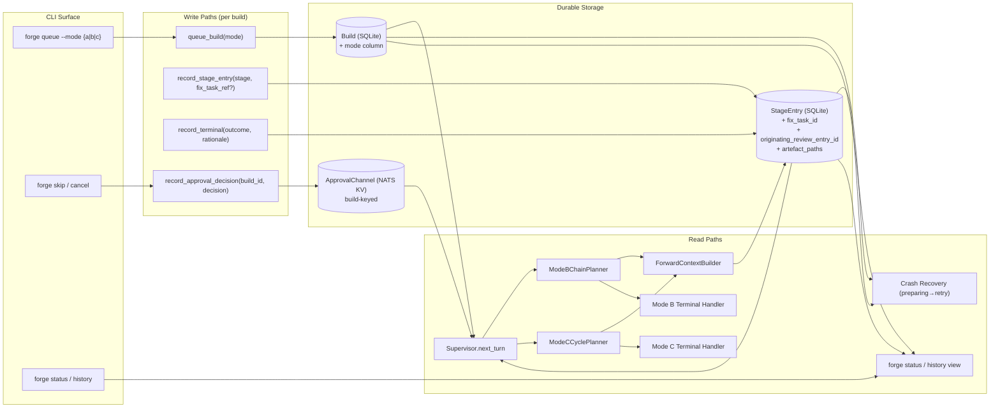
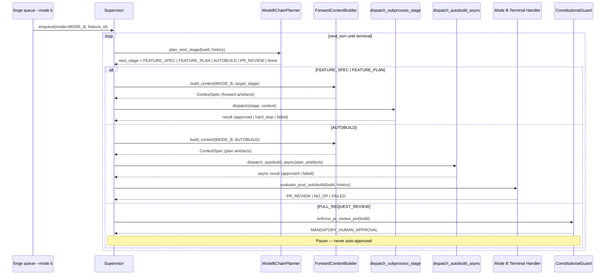
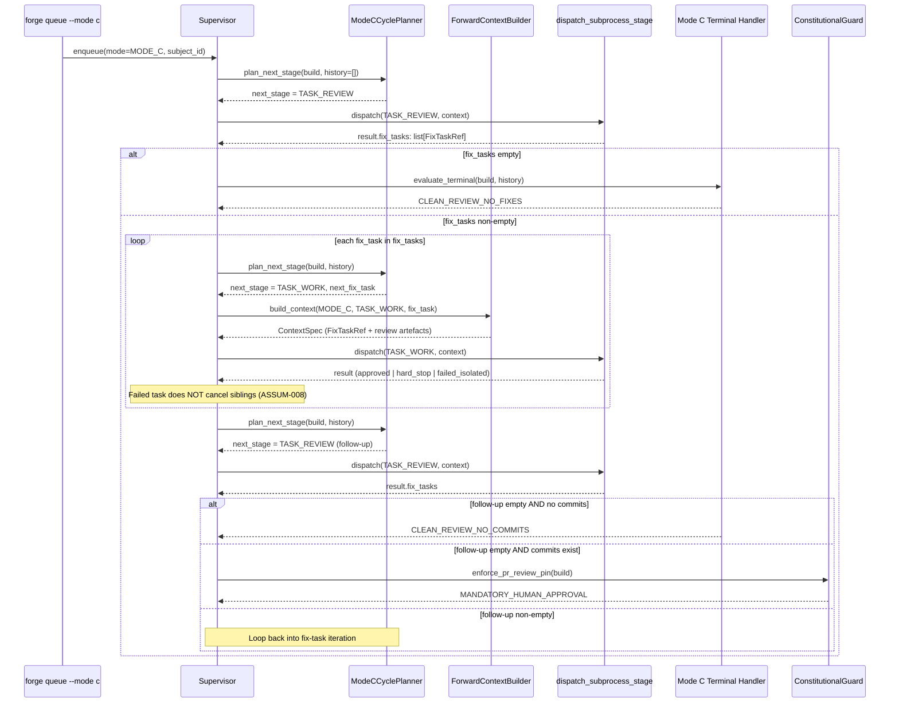
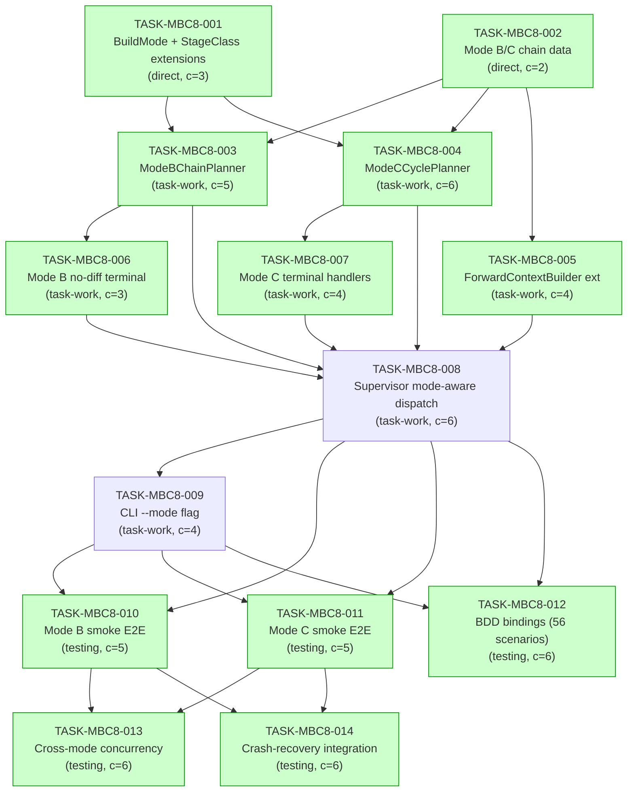

# Implementation Guide — FEAT-FORGE-008 (Mode B Feature & Mode C Review-Fix)

**Feature ID:** FEAT-FORGE-008
**Slug:** `mode-b-feature-and-mode-c-review-fix`
**Total tasks:** 14 across 7 waves
**Aggregate complexity:** 6/10
**Estimated effort:** ~16–20 hours dispatched (~2–3 days wall)

This guide is the load-bearing planning document for FEAT-FORGE-008. It
adds two non-greenfield orchestration modes — **Mode B** (Feature) and
**Mode C** (Review-Fix) — on top of the FEAT-FORGE-001..007 substrate. The
substrate is shipped; this feature is composition-only. No new state-machine
transitions, no new dispatchers, no new gating layer.

The diagrams below are the primary review artefacts. The data flow diagram
is the most important: it shows that every Mode B / Mode C write path has a
matching read path (no disconnections).

---

## §1: Data Flow — Read/Write Paths

_What to look for: every write (left) has a matching read (right). No
dotted "NOT WIRED" arrows — no disconnections._

**Disconnection check: NONE.** Every persisted artefact is read by at least
one downstream consumer. Mode-aware columns (`mode`, `fix_task_id`,
`originating_review_entry_id`, `artefact_paths`) are read by the supervisor,
forward-context builder, terminal handlers, and the status/history view.

---

## §2: Integration Contract Diagram (complexity ≥ 5)

The Mode B and Mode C dispatch sequences below pin the call shape between
the supervisor, the planners, and the existing dispatchers. The Mode C
sequence shows the cyclic re-entry that distinguishes it from Mode B.

### 2.1 Mode B dispatch sequence

### 2.2 Mode C dispatch sequence (cyclic)

_What to look for: no "fetch then discard" — every `result.fix_tasks` is
either consumed by `ModeCCyclePlanner` (drives next iteration) or by the
terminal handler (drives clean-review terminal). The constitutional gate
fires only when commits exist._

---

## §3: Task Dependency Graph

_Tasks with green background can run in parallel within their wave._

**Wave structure:**

| Wave | Tasks (parallel within wave) | Theme |
|------|-----------------------------|-------|
| 1    | TASK-MBC8-001, TASK-MBC8-002 | Declarative foundations |
| 2    | TASK-MBC8-003, TASK-MBC8-004, TASK-MBC8-005 | Planners + context |
| 3    | TASK-MBC8-006, TASK-MBC8-007 | Terminal handlers |
| 4    | TASK-MBC8-008 | Supervisor wiring (single integration seam) |
| 5    | TASK-MBC8-009 | CLI surface |
| 6    | TASK-MBC8-010, TASK-MBC8-011, TASK-MBC8-012 | Smoke + BDD |
| 7    | TASK-MBC8-013, TASK-MBC8-014 | Cross-mode concurrency + crash recovery |

---

## §4: Integration Contracts

The cross-task data dependencies in this feature are runtime contracts
between subprocess outputs and downstream Python consumers. They are
documented here so the consumer-side parsing can be pinned by the producer's
shape — and so the Coach can verify the boundary holds.

### Contract: FixTaskList (Mode C)

- **Producer task:** TASK-MBC8-008 (`Supervisor.next_turn` consuming the
  result of `dispatch_subprocess_stage` for `TASK_REVIEW`)
- **Consumer task(s):** TASK-MBC8-004 (`ModeCCyclePlanner`), TASK-MBC8-005
  (`ForwardContextBuilder` for `TASK_WORK`), TASK-MBC8-007 (Mode C terminal
  handler), TASK-MBC8-011 (smoke E2E)
- **Artefact type:** Python typed object (`list[FixTaskRef]`) parsed from
  the `/task-review` subprocess result payload
- **Format constraint:** Each `FixTaskRef` carries:
  - `fix_task_id: str` — globally unique across the build (used by
    `originating_review_entry_id` to thread lineage)
  - `definition_path: Path` — pointer to the markdown file that
    `/task-work` will receive as context
  - `originating_review_entry_id: str` — back-reference to the
    `StageEntry.id` that produced this fix task (Group L lineage)
- **Validation method:** TASK-MBC8-011 asserts that every `TASK_WORK`
  stage entry's `fix_task_id` matches a fix task referenced by an earlier
  `TASK_REVIEW` entry's `result.fix_tasks`. Coach verifies this assertion
  exists in the smoke test.

### Contract: AutobuildResult.changed_files_count (Mode B)

- **Producer task:** TASK-MBC8-008 (`Supervisor.next_turn` consuming the
  result of `dispatch_autobuild_async`)
- **Consumer task(s):** TASK-MBC8-006 (Mode B no-diff terminal handler)
- **Artefact type:** integer field on the autobuild result payload
- **Format constraint:** `changed_files_count: int >= 0` — zero means the
  no-diff branch fires and no PR creation is attempted (Group M scenario)
- **Validation method:** TASK-MBC8-010 asserts both branches: a stub
  autobuild result with `changed_files_count = 0` reaches the no-op
  terminal; `changed_files_count > 0` reaches the PR-review pause.

### Contract: ModeAwareStageEntry (cross-cutting)

- **Producer task:** TASK-MBC8-001 (schema migration adds the columns)
- **Consumer task(s):** TASK-MBC8-007 (artefact attribution), TASK-MBC8-011
  (smoke + lineage assertions), TASK-MBC8-014 (crash recovery)
- **Artefact type:** SQLite columns on the `stage_entries` table:
  `fix_task_id TEXT`, `originating_review_entry_id TEXT`,
  `artefact_paths TEXT` (JSON array)
- **Format constraint:** All three columns nullable; populated only on
  `TASK_WORK` rows in Mode C builds. Mode A and Mode B builds leave them
  NULL.
- **Validation method:** TASK-MBC8-011 (Mode C smoke) asserts the columns
  are populated; TASK-MBC8-010 (Mode B smoke) asserts they are NULL on
  Mode B builds.

---

## §5: Substrate Reuse Map

| Concern | FEAT-FORGE source | Reuse status in FEAT-FORGE-008 |
|---------|-------------------|-------------------------------|
| Build queue + lifecycle persistence | FEAT-FORGE-001 | ✅ unchanged; new `mode` column added (TASK-MBC8-001) |
| Crash recovery (`preparing` re-entry) | FEAT-FORGE-001 §5 | ✅ unchanged; exercised by TASK-MBC8-014 |
| NATS pipeline events + correlation threading | FEAT-FORGE-002 | ✅ unchanged; Group H integration assertion in TASK-MBC8-013 |
| Confidence-gated checkpoint protocol | FEAT-FORGE-004 | ✅ unchanged; Mode B/C inherit gate modes |
| Constitutional PR-review pin | FEAT-FORGE-004 + TASK-MAG7-004 | ✅ mode-agnostic by ASSUM-011; reused as-is |
| Subprocess command invocation + worktree allowlist | FEAT-FORGE-005 | ✅ unchanged; reused for `/feature-spec`, `/feature-plan`, `/task-review`, `/task-work` |
| Long-term memory seeding | FEAT-FORGE-006 | ✅ unchanged; Group I "seeding failure does not regress approval" asserted in TASK-MBC8-013 |
| Calibration-priors snapshot stability | FEAT-FORGE-006 | ✅ unchanged; ASSUM-012 asserted in TASK-MBC8-013 |
| `StageOrderingGuard` | TASK-MAG7-003 | 🟡 invoked with per-mode prerequisite map (TASK-MBC8-008) |
| `ConstitutionalGuard` | TASK-MAG7-004 | ✅ unchanged |
| `PerFeatureLoopSequencer` | TASK-MAG7-005 | ✅ unchanged for Mode A; Mode B/C use new planners |
| `ForwardContextBuilder` | TASK-MAG7-006 | 🟡 extended with `mode` parameter (TASK-MBC8-005) |
| `dispatch_specialist_stage` | TASK-MAG7-007 | ⛔ NOT invoked in Mode B or Mode C (specialist dispatch is Mode A only) |
| `dispatch_subprocess_stage` | TASK-MAG7-008 | ✅ unchanged; reused for all Mode B/C subprocess stages |
| `dispatch_autobuild_async` | TASK-MAG7-009 | ✅ unchanged; reused for Mode B autobuild |
| `Supervisor.next_turn` | TASK-MAG7-010 | 🟡 mode-aware switch added (TASK-MBC8-008) |
| CLI steering injection | TASK-MAG7-011 | ✅ unchanged; Mode B/C inherit cancel/skip semantics |

**Net new code surface:** `mode_chains_data`, `mode_b_planner`,
`mode_c_planner`, two terminal-handler modules, the `BuildMode` enum,
`fix_task_id` / `originating_review_entry_id` / `artefact_paths` columns,
and the `--mode` CLI flag. Everything else is composition.

---

## §6: Risk Register

| Risk | Likelihood | Impact | Mitigation |
|------|-----------|--------|-----------|
| MAG7 wiring regression on Mode A | Low | High | TASK-MBC8-008 keeps Mode A branch byte-identical; FEAT-FORGE-007 regression suite must stay green |
| Mode C iteration runaway (no numeric cap) | Low | Medium | ASSUM-010 — terminate on clean follow-up review; observable budget risk to log |
| Subprocess result schema drift (FixTaskList) | Medium | Medium | Pinned in §4 contract; Coach asserts shape in TASK-MBC8-011 |
| Cross-mode concurrency race in shared Supervisor | Low | High | TASK-MBC8-013 explicitly tests three-way interleave |
| Crash-recovery loses fix-task progress | Low | High | TASK-MBC8-014 asserts third-of-five fix task reattempt preserves prior approvals |
| Mode-aware planning bypassed by misconfigured manifest | Medium | High (security) | TASK-MBC8-003 raises `ModeBoundaryViolation` at the planner; only secure layer (executor-side guards run later) |

---

## §7: Acceptance — Feature-Level

The feature is complete when:

1. All 14 tasks reach `approved` Coach status
2. `pytest tests/integration/test_mode_b_smoke_e2e.py` and
   `tests/integration/test_mode_c_smoke_e2e.py` pass green
3. `pytest tests/bdd/test_feat_forge_008.py` runs all 56 scenarios green
4. `pytest tests/integration/test_cross_mode_concurrency.py` and
   `tests/integration/test_mode_b_c_crash_recovery.py` pass green
5. The full FEAT-FORGE-007 regression suite is still green (Mode A
   unchanged)
6. `forge queue --mode b <FEAT-ID>` and `forge queue --mode c <SUBJECT-ID>`
   are documented in `forge --help` output
7. No files outside `src/forge/pipeline/`, `src/forge/lifecycle/`,
   `src/forge/cli/`, and the corresponding test directories were modified
   (the substrate boundary is respected)

---

## §8: References

- **Feature spec:**
  `features/mode-b-feature-and-mode-c-review-fix/mode-b-feature-and-mode-c-review-fix.feature`
- **Assumptions:**
  `features/mode-b-feature-and-mode-c-review-fix/mode-b-feature-and-mode-c-review-fix_assumptions.yaml`
- **Spec summary:**
  `features/mode-b-feature-and-mode-c-review-fix/mode-b-feature-and-mode-c-review-fix_summary.md`
- **Build plan row:** `docs/research/ideas/forge-build-plan.md` —
  FEAT-FORGE-008 row
- **Mode A reference:** `tasks/backlog/mode-a-greenfield-end-to-end/` (TASK-MAG7-001..014)
- **Constitutional rule:** `docs/design/contracts/API-nats-approval-protocol.md` §8
- **ADRs:** ARCH-021 (crash recovery), ARCH-026 (constitutional rules),
  ARCH-031 (async subagents)
