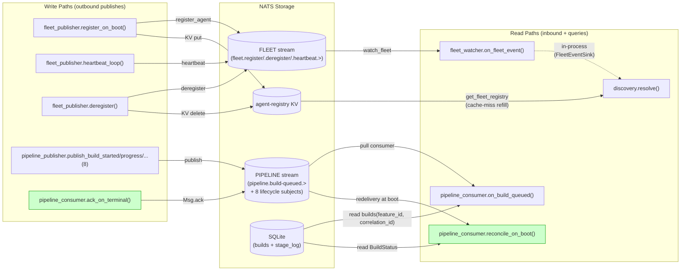
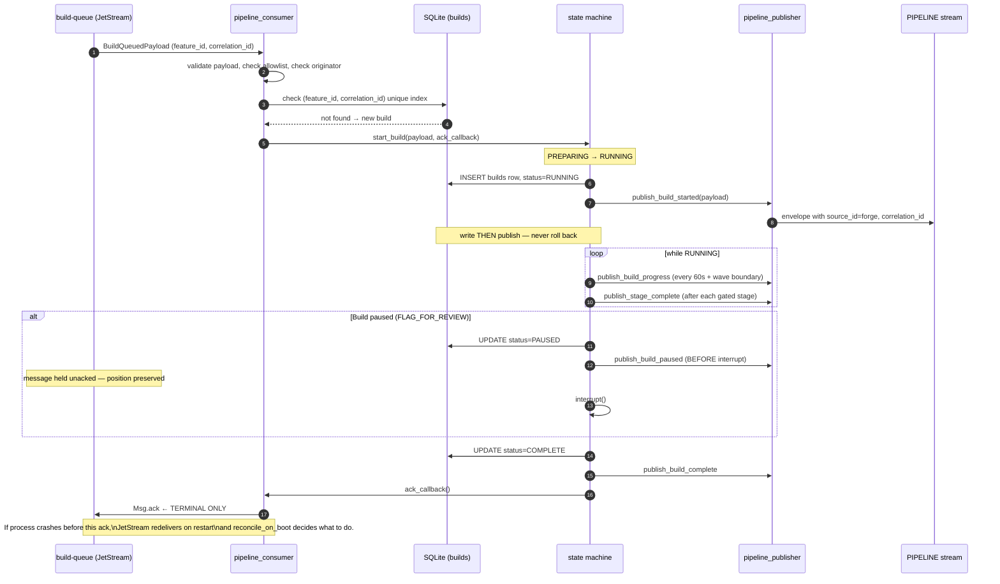
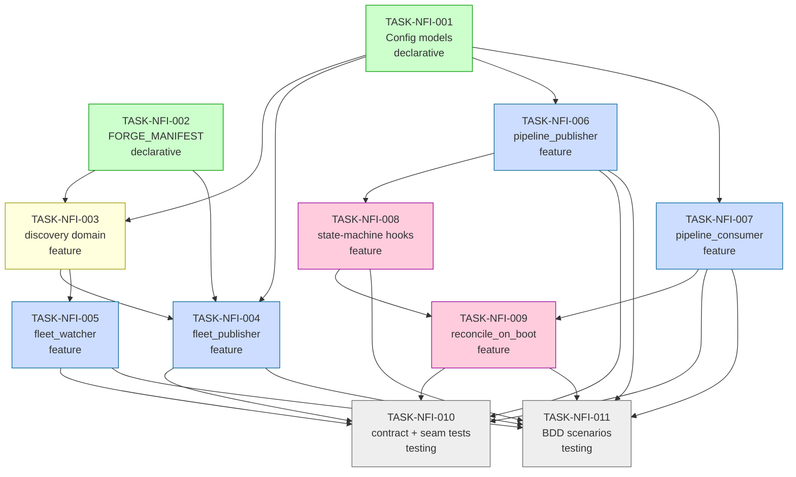

# Implementation Guide — FEAT-FORGE-002 NATS Fleet Integration

**Parent review**: [TASK-REV-NF20](../../../tasks/backlog/TASK-REV-NF20-plan-nats-fleet-integration.md)
**Feature spec**: [nats-fleet-integration.feature](../../../features/nats-fleet-integration/nats-fleet-integration.feature)
**Review report**: [.claude/reviews/TASK-REV-NF20-review-report.md](../../../.claude/reviews/TASK-REV-NF20-review-report.md)

---

## §1 Scope

Implement Forge's participation on the shared NATS fleet:

- Self-registration (with `FORGE_MANIFEST`), periodic heartbeats (30s),
  graceful deregistration.
- Live watching of fleet lifecycle events with a 30-second-TTL cache.
- Capability resolution (tool-exact → intent-fallback, tie-break by trust
  tier / confidence / queue depth).
- Outbound pipeline lifecycle event stream (8 subjects).
- Inbound build-queue subscription with terminal-only ack, duplicate
  detection, and path-allowlist refusal.
- Crash-recovery reconciliation including paused-build re-announcement.

**Out of scope**: the LangChain `@tool(dispatch_by_capability)` wrapper
(deferred to a future feature); Graphiti write-back for
`CapabilityResolution` (deferred).

## §2 Module Layout

```
src/forge/
  config/
    loader.py                         # (FEAT-FORGE-001 existing)
    models.py                         # TASK-NFI-001 adds FleetConfig / PipelineConfig / PermissionsConfig
  fleet/
    __init__.py
    manifest.py                       # TASK-NFI-002 — FORGE_MANIFEST constant
  discovery/
    __init__.py                       # TASK-NFI-003
    cache.py                          # TASK-NFI-003 — DiscoveryCache (FleetEventSink impl)
    resolve.py                        # TASK-NFI-003 — resolve() algorithm
    protocol.py                       # TASK-NFI-003 — Clock, FleetEventSink protocols
    models.py                         # TASK-NFI-003 — DiscoveryCacheEntry, CapabilityResolution
  adapters/
    nats/
      fleet_publisher.py              # TASK-NFI-004
      fleet_watcher.py                # TASK-NFI-005
      pipeline_publisher.py           # TASK-NFI-006
      pipeline_consumer.py            # TASK-NFI-007, TASK-NFI-009 (reconcile_on_boot)
      state_machine_hooks.py          # TASK-NFI-008 — wiring layer
tests/
  unit/ ...                           # per-module unit tests from each subtask
  integration/                        # TASK-NFI-010 — contract + seam tests
  bdd/                                # TASK-NFI-011 — pytest-bdd scenario runner
```

## §3 Architectural Boundaries

- `forge.discovery` is **pure domain** — no imports from `nats_core.aio`,
  `nats_core.client`, or any transport. It imports only `AgentManifest` /
  `AgentHeartbeatPayload` schema types from `nats_core.events` and
  `nats_core.manifest`.
- `forge.adapters.nats.*` is the **only** layer allowed to import the
  NATS client surface.
- `PipelinePublisher` and `PipelineConsumer` talk to the state machine
  via an interface layer (`state_machine_hooks.py`) so FEAT-FORGE-001 owns
  the state transitions and this feature only hooks into them.

## §4 Integration Contracts

Five cross-task data dependencies. Every consumer includes a seam test.

### Contract: ForgeConfig.fleet
- **Producer task**: TASK-NFI-001
- **Consumer task(s)**: TASK-NFI-004 (heartbeat cadence), TASK-NFI-005 (stale sweeper)
- **Artifact type**: Pydantic v2 model field
- **Format constraint**: `FleetConfig.heartbeat_interval_seconds: int = 30`,
  `FleetConfig.stale_heartbeat_seconds: int = 90`, both non-negative integers
- **Validation method**: seam tests in TASK-NFI-004 and TASK-NFI-005 assert default values
  and types; Pydantic validation rejects negative values at config load

### Contract: ForgeConfig.permissions.filesystem.allowlist
- **Producer task**: TASK-NFI-001
- **Consumer task(s)**: TASK-NFI-007 (path-allowlist gate)
- **Artifact type**: Pydantic v2 model field
- **Format constraint**: `list[Path]` where every `Path.is_absolute()` is True;
  relative paths rejected by Pydantic validator at config load time
- **Validation method**: seam test in TASK-NFI-007 asserts absolute-only and
  that relative paths raise `ValueError`

### Contract: ForgeConfig.pipeline.approved_originators
- **Producer task**: TASK-NFI-001
- **Consumer task(s)**: TASK-NFI-007 (originator allowlist gate)
- **Artifact type**: Pydantic v2 model field
- **Format constraint**: `list[str]`, non-empty, default
  `["terminal", "voice-reachy", "telegram", "slack", "dashboard", "cli-wrapper"]`
- **Validation method**: seam test in TASK-NFI-007 asserts list type and
  default contents; TASK-NFI-007 rejects `build-queued` payloads whose
  `originating_adapter` is not in this list

### Contract: FORGE_MANIFEST
- **Producer task**: TASK-NFI-002
- **Consumer task(s)**: TASK-NFI-004 (passed to `nats_client.register_agent`)
- **Artifact type**: Python module-level constant
- **Format constraint**: `nats_core.manifest.AgentManifest` with
  `agent_id="forge"`, `trust_tier="core"`, `max_concurrent=1`; contains zero
  secret-like substrings in the JSON dump (`api_key`, `token`, `password`,
  `secret`, `credential`)
- **Validation method**: seam test in TASK-NFI-004 imports the constant and
  asserts `agent_id == "forge"`; secret-free invariant asserted in TASK-NFI-002
  unit test and re-asserted at integration level in TASK-NFI-010

### Contract: FleetEventSink Protocol
- **Producer task**: TASK-NFI-003
- **Consumer task(s)**: TASK-NFI-005 (fleet_watcher dispatches events through the sink)
- **Artifact type**: Python `Protocol` (PEP 544)
- **Format constraint**: Three async methods:
  `upsert_agent(manifest: AgentManifest) -> None`,
  `remove_agent(agent_id: str) -> None`,
  `update_heartbeat(agent_id: str, hb: AgentHeartbeatPayload, status_changed: bool) -> None`.
  All mutations must be serialised behind the sink's internal asyncio.Lock.
- **Validation method**: seam test in TASK-NFI-005 verifies all three methods
  exist on the Protocol at import time; contract test in TASK-NFI-010 exercises
  the racing `asyncio.gather(register, deregister)` scenario

### Contract: PipelinePublisher methods
- **Producer task**: TASK-NFI-006
- **Consumer task(s)**: TASK-NFI-008 (state machine hooks)
- **Artifact type**: Python class with eight async methods
- **Format constraint**: Eight methods named `publish_build_started`,
  `publish_build_progress`, `publish_stage_complete`, `publish_build_paused`,
  `publish_build_resumed`, `publish_build_complete`, `publish_build_failed`,
  `publish_build_cancelled`; each takes the corresponding payload type from
  `nats_core.events.pipeline` and returns `None`
- **Validation method**: seam test in TASK-NFI-008 asserts all eight methods
  exist on `PipelinePublisher` at import time

---

## §5 Data Flow — Read/Write Paths



*Every write path has a corresponding read path. No disconnected paths.*

## §6 Integration Contract Diagram (sequence)

Build-queued → terminal-ack is the most load-bearing sequence. Correlation
is threaded end-to-end.



## §7 Task Dependency Graph



_Green = Wave 1 (parallel), yellow = Wave 2, blue = Wave 3 (parallel),
pink = Wave 4, grey = Wave 5 (parallel)._

---

## §8 Execution Strategy — Auto-Detect (from Context B)

| Wave | Tasks | Mode | Estimated wall-time |
|---|---|---|---|
| 1 | TASK-NFI-001, TASK-NFI-002 | Parallel (Conductor) | ~2–3 h |
| 2 | TASK-NFI-003 | Single | ~4–5 h |
| 3 | TASK-NFI-004, TASK-NFI-005, TASK-NFI-006, TASK-NFI-007 | Parallel (Conductor) | ~5–6 h |
| 4 | TASK-NFI-008 → TASK-NFI-009 | Sequential (009 depends on 008) | ~4–5 h |
| 5 | TASK-NFI-010, TASK-NFI-011 | Parallel (Conductor) | ~3–4 h |

**Total critical path**: 16–20 h. With Conductor parallelism in Waves 1, 3, 5
and assuming typical handover latency, realistic end-to-end ≈ 3 developer-days.

## §9 Testing Posture — Standard Quality Gates (from Context B)

- Unit tests per module owned by each subtask.
- Contract + seam tests consolidated in TASK-NFI-010 at integration level.
- BDD scenario coverage owned by TASK-NFI-011, prioritising `@smoke` and
  `@key-example` for green-must.
- Clock injection mandatory — no wall-clock sleeps, no `datetime.now()` in
  production code paths (enforced by grep-based hygiene test in TASK-NFI-010).
- Coverage target: 80% line coverage for `forge.adapters.nats.*` and
  `forge.discovery.*`.

## §10 Upstream Dependency Gate

**FEAT-FORGE-002 must not start Wave 3 until FEAT-FORGE-001 provides**:

- `builds` SQLite table with `uq_builds_feature_correlation` unique index.
- `BuildStatus` enum with the state values documented in DM-build-lifecycle.
- A state-machine module exposing transition hooks (`on_transition(from_state, to_state, build)`).
- `ForgeConfig` loader that walks `forge.yaml` into the Pydantic tree TASK-NFI-001 extends.

Waves 1 and 2 can start earlier (config model additions + pure-domain discovery
package are self-contained).

## §11 Non-Goals (explicit)

- `dispatch_by_capability` LangChain tool — separate feature.
- Graphiti write-back for `CapabilityResolution` — separate feature.
- Retry/backoff strategy for transient publish failures — log-only for now;
  structured-log consumer is ops concern.
- Multi-tenant project-scoped subjects — deferred until we have a second project.
