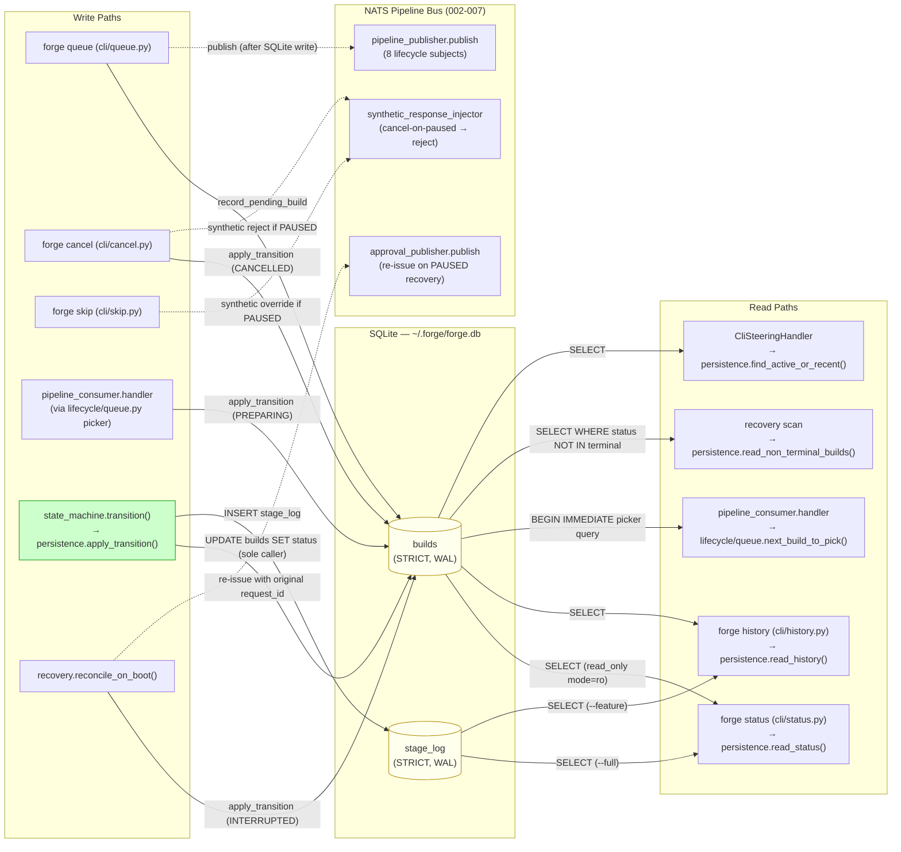
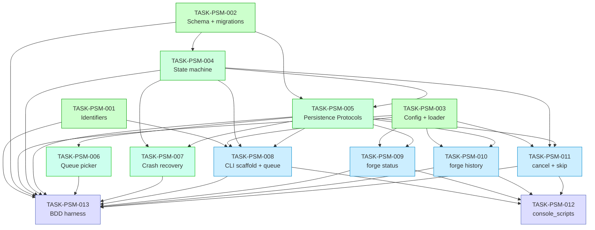

# Implementation Guide — FEAT-FORGE-001 Pipeline State Machine and Configuration

> **Generated by**: `/feature-plan` from review TASK-REV-3EEE
> **Feature spec**: [pipeline-state-machine-and-configuration_summary.md](../../../features/pipeline-state-machine-and-configuration/pipeline-state-machine-and-configuration_summary.md)
> **Review report**: [.claude/reviews/TASK-REV-3EEE-review-report.md](../../../.claude/reviews/TASK-REV-3EEE-review-report.md)
> **Aggregate complexity**: 8/10
> **Subtasks**: 13 across 5 waves
> **Estimated effort**: 55–60 hours single-developer linear; 35–40 hours with 2-wide parallelism per wave

## Overview

FEAT-FORGE-001 builds the **across-build lifecycle** for Forge: state machine
transitions, SQLite-backed history, crash-recovery reconciliation, sequential
per-project queue discipline, configuration loading, and the user-facing CLI
(`forge queue`, `forge status`, `forge history`, `forge cancel`, `forge skip`).

Sibling features 002–007 ship the *upstream-of-CLI* surface (NATS adapters,
config models, stage-ordering guards, executor-layer cancel/skip handler) and
must be **reused unchanged**. The proposed module layout under
`src/forge/lifecycle/` and `src/forge/cli/` is the only net-new code surface.

The four user-supplied review concerns are first-class architectural
invariants:

- **sc_001** — `state_machine.py` is the SOLE caller of writes that mutate
  `builds.state`
- **sc_002** — write-then-publish: SQLite row survives NATS failure
- **sc_003** — identifier validation rejects URL-encoded `%2F`/`%2E%2E`
  variants and null bytes
- **sc_004** — PAUSED-recovery preserves the original `request_id`

## Data Flow: Read/Write Paths

This is the most important diagram in the guide. Every write path on the left
must have a corresponding read path on the right, and vice versa.



**What to look for in this diagram:**

- All status mutations route through W5 (`state_machine.transition()` →
  `persistence.apply_transition()`). W1, W2, W3, W4, W6 each invoke W5
  rather than writing status directly. **This is the sc_001 invariant
  rendered as architecture.**
- W1 (queue) writes SQLite BEFORE publishing to NATS. The dotted line on
  the publish arrow is the write-then-publish ordering — if the publish
  fails, the SQLite row remains as QUEUED for reconciliation. **This is
  the sc_002 invariant.**
- W6 (recovery) has a dotted "re-issue with original request_id" arrow to
  N2. The original request_id is read from `builds.pending_approval_request_id`
  (a column added by TASK-PSM-002). **This is the sc_004 invariant.**
- All read paths (R1–R5) bypass the bus entirely — `forge status` and
  `forge history` work even when NATS is unreachable. **This is the
  Group H integration-boundary scenario.**

**Disconnection check**: Every write path has a corresponding read path. No
read path is unused. No data is orphaned. ✅

## Integration Contracts (Sequence Diagram)

Complexity 8/10 ≥ 5 — this diagram is required. It shows the data flow
between modules across a single `forge queue` invocation, exposing the
write-then-publish ordering that sc_002 depends on.

```mermaid
sequenceDiagram
    participant U as User (forge queue CLI)
    participant Q as cli/queue.py
    participant I as lifecycle/identifiers.py
    participant C as config/loader.py
    participant P as lifecycle/persistence.py
    participant S as SQLite (builds table)
    participant N as adapters/nats/pipeline_publisher.py

    U->>Q: forge queue FEAT-X --repo /r --max-turns 5
    Q->>I: validate_feature_id("FEAT-X")
    I-->>Q: "FEAT-X" (decoded, allowlisted)
    Q->>C: load_config("forge.yaml")
    C-->>Q: ForgeConfig(queue=QueueConfig(...))
    Q->>P: exists_active_build("FEAT-X")
    P->>S: SELECT count WHERE status NOT IN (terminal)
    S-->>P: 0
    P-->>Q: False (not duplicate)
    Q->>P: record_pending_build(payload)
    P->>S: BEGIN IMMEDIATE; INSERT INTO builds; COMMIT
    S-->>P: ok
    P-->>Q: ok
    Note over Q,N: SQLite row is now durable. NATS publish is the second step.
    Q->>N: publish(BuildQueuedEnvelope)

    alt NATS publish succeeds
        N-->>Q: ok
        Q-->>U: "Queued FEAT-X correlation_id=..."<br/>exit 0
    else NATS publish fails
        N--xQ: nats.errors.TimeoutError
        Note over Q: SQLite row remains QUEUED — operator can reconcile
        Q-->>U: stderr: "Queued FEAT-X but pipeline NOT NOTIFIED: timeout"<br/>exit 1
    end
```

**Anti-pattern to watch for**: any branch that ROLLS BACK the SQLite row on
NATS failure would violate sc_002 — the build would silently disappear, and
operators would have no record. The diagram makes the "row remains" branch
explicit.

## Task Dependency Graph

13 tasks ≥ 3 — this diagram is required.



_Tasks coloured by wave; tasks within the same wave can run in parallel._

## Wave Schedule

### Wave 1 — Foundation (3 tasks, all parallel-safe)

| Task | Title | Mode | Complexity | Min |
|---|---|---|---|---|
| TASK-PSM-001 | Identifiers + path-traversal validation | direct | 3 | 45 |
| TASK-PSM-002 | SQLite schema + migrations + connection helpers | task-work | 5 | 75 |
| TASK-PSM-003 | Config extension — QueueConfig + load_config | direct | 3 | 45 |

⚡ **Conductor recommended** — all three modules touch disjoint files.

### Wave 2 — State Machine + Persistence (2 tasks, parallel)

| Task | Title | Mode | Complexity | Min | Depends on |
|---|---|---|---|---|---|
| TASK-PSM-004 | State machine — transition table | task-work | 6 | 90 | PSM-002 |
| TASK-PSM-005 | Persistence — concrete cli_steering Protocols | task-work | 7 | 105 | PSM-002, PSM-004 |

⚠️ PSM-005 strictly depends on PSM-004 (state machine produces the
`Transition` value object PSM-005 consumes). PSM-005 cannot start before
PSM-004 has at least the `Transition` model defined; in practice PSM-005
follows PSM-004 closely or runs slightly behind it. If a strict parallel
build is desired, ship a stub `Transition` model first as part of PSM-004's
first commit so PSM-005 can begin.

### Wave 3 — Queue + Recovery (2 tasks, parallel)

| Task | Title | Mode | Complexity | Min | Depends on |
|---|---|---|---|---|---|
| TASK-PSM-006 | Sequential per-project queue picker | direct | 4 | 60 | PSM-005 |
| TASK-PSM-007 | Crash-recovery reconciliation | task-work | 7 | 105 | PSM-004, PSM-005 |

⚡ **Conductor recommended** — these touch different lifecycle modules and
can build independently.

### Wave 4 — CLI Surface (4 tasks, all parallel-safe)

| Task | Title | Mode | Complexity | Min | Depends on |
|---|---|---|---|---|---|
| TASK-PSM-008 | CLI scaffold + `forge queue` | task-work | 6 | 90 | PSM-001, PSM-003, PSM-005 |
| TASK-PSM-009 | `forge status` (--watch, --full, --json) | task-work | 5 | 75 | PSM-005 |
| TASK-PSM-010 | `forge history` (--feature, --limit, --since, --format) | direct | 4 | 60 | PSM-005 |
| TASK-PSM-011 | `forge cancel` + `forge skip` thin wrappers | direct | 3 | 45 | PSM-005 |

⚡ **Conductor recommended** — four CLI subcommand modules touching disjoint
files; PSM-008 owns the `cli/main.py` scaffold which the others register
against.

### Wave 5 — Integration (2 tasks)

| Task | Title | Mode | Complexity | Min | Depends on |
|---|---|---|---|---|---|
| TASK-PSM-012 | pyproject.toml `console_scripts` entry | direct | 2 | 30 | PSM-008..PSM-011 |
| TASK-PSM-013 | BDD harness wiring all 34 scenarios | task-work | 5 | 75 | All Wave 1–4 |

PSM-012 is a one-line addition to `pyproject.toml`; PSM-013 is the
acceptance test surface and validates the entire feature end-to-end.

## §4: Integration Contracts

Six cross-task data dependencies. Every consumer task carries a
`consumer_context` block in its frontmatter and a `## Seam Tests` section
with a pytest stub validating the contract at the boundary.

### Contract: SCHEMA_INITIALIZED

- **Producer task**: TASK-PSM-002 (Create SQLite schema)
- **Consumer task(s)**: TASK-PSM-004 (state machine), TASK-PSM-005
  (persistence), TASK-PSM-006 (queue picker), TASK-PSM-007 (recovery)
- **Artifact type**: SQLite schema + `schema_version` row + connection
  helpers with WAL/STRICT pragmas applied
- **Format constraint**: `PRAGMA journal_mode = WAL`,
  `PRAGMA synchronous = NORMAL`, `PRAGMA foreign_keys = ON`,
  `PRAGMA busy_timeout = 5000` MUST be applied on every connection open.
  STRICT tables. `schema_version=1` row seeded. `builds.pending_approval_request_id TEXT`
  column present (additive vs. API-sqlite-schema.md §2.1 — required for
  sc_004).
- **Validation method**: Coach asserts `migrations.apply_at_boot()` is
  idempotent and verifiable; integration test opens a fresh DB, applies
  migrations, asserts `PRAGMA journal_mode == "wal"` and
  `SELECT version FROM schema_version` returns `1`

### Contract: STATE_TRANSITION_API

- **Producer task**: TASK-PSM-004 (State machine)
- **Consumer task(s)**: TASK-PSM-005 (persistence), TASK-PSM-007
  (recovery), TASK-PSM-008 (queue command), TASK-PSM-011 (cancel/skip
  wrappers)
- **Artifact type**: Python module `lifecycle.state_machine` exporting
  `transition(build, to_state, **fields) -> Transition` and
  `InvalidTransitionError`
- **Format constraint**: `Transition` is a Pydantic value object carrying
  `(build_id, from_state, to_state, occurred_at, completed_at?, error?,
  pr_url?, pending_approval_request_id?)`. Terminal transitions MUST set
  `completed_at`. Out-of-table transitions MUST raise
  `InvalidTransitionError`.
- **Validation method**: Coach asserts `state_machine.transition()` is
  the only producer of `Transition` instances; `persistence.apply_transition()`
  signature accepts only `Transition`, never raw kwargs; static-grep
  `UPDATE builds SET status` returns exactly one location across the src
  tree (inside `apply_transition`)

### Contract: PERSISTENCE_PROTOCOLS

- **Producer task**: TASK-PSM-005 (Persistence Protocols)
- **Consumer task(s)**: TASK-PSM-008 (queue command), TASK-PSM-009
  (status), TASK-PSM-010 (history), TASK-PSM-011 (cancel/skip)
- **Artifact type**: Python classes implementing the Protocols defined in
  `pipeline/cli_steering.py` — `BuildSnapshotReader`, `BuildCanceller`,
  `BuildResumer`, `StageLogReader`, `StageSkipRecorder`,
  `PauseRejectResolver`, `AsyncTaskCanceller`, `AsyncTaskUpdater`
- **Format constraint**: All concrete classes live in
  `lifecycle/persistence.py` as `SqliteBuildSnapshotReader`,
  `SqliteBuildCanceller`, etc. Each implements the `runtime_checkable`
  Protocol from cli_steering. CLI commands receive instances via
  dependency injection, not direct construction.
- **Validation method**: `isinstance(impl, BuildSnapshotReader)` returns
  True for every Sqlite* class; pytest fixture wires concrete impls into
  `CliSteeringHandler` and exercises Group D edge-case scenarios

### Contract: CONFIG_LOADER

- **Producer task**: TASK-PSM-003 (Config extension)
- **Consumer task(s)**: TASK-PSM-008 (queue command), TASK-PSM-009
  (status), TASK-PSM-010 (history), TASK-PSM-011 (cancel/skip)
- **Artifact type**: `forge.config.loader.load_config(path: Path) -> ForgeConfig`
  returning a Pydantic v2 model with `QueueConfig` sub-tree
- **Format constraint**: `ForgeConfig.queue.default_max_turns: int >= 1`;
  `ForgeConfig.queue.default_history_limit: int = 50`;
  `ForgeConfig.queue.repo_allowlist: list[Path]`. Pydantic validation
  happens at load time. Missing `queue:` block in YAML → `QueueConfig`
  defaults applied (default_factory).
- **Validation method**: Boundary test loads a fixture YAML, asserts the
  parsed model matches expectations; another boundary test loads a
  malformed YAML and asserts a `pydantic.ValidationError` with a clear
  error message

### Contract: IDENTIFIER_VALIDATION

- **Producer task**: TASK-PSM-001 (Identifiers)
- **Consumer task(s)**: TASK-PSM-008 (queue command — single consumer)
- **Artifact type**: `forge.lifecycle.identifiers.validate_feature_id(s: str) -> str`
  (returns the validated string, raises `InvalidIdentifierError` on
  rejection)
- **Format constraint**: After URL-decode (twice — to catch
  double-encoded variants), the string MUST match `r"[A-Za-z0-9_-]+"`,
  MUST NOT contain `\x00`, and MUST be 1–64 characters long
- **Validation method**: Property test: every input from a curated list
  of attack vectors (`../`, `%2F`, `%252F`, `\x00FEAT`, `..%2F`,
  `%2E%2E%2F`, etc.) raises `InvalidIdentifierError`; every input from a
  curated list of valid identifiers passes through unchanged

### Contract: PENDING_APPROVAL_REQUEST_ID

- **Producer task**: TASK-PSM-005 (writes the value on PAUSED transition
  via `mark_paused(build_id, request_id)`)
- **Consumer task(s)**: TASK-PSM-007 (recovery reads the value on boot)
- **Artifact type**: SQLite column `builds.pending_approval_request_id TEXT`
  (nullable; populated only when state == PAUSED; cleared on resume)
- **Format constraint**: UUID string matching the original
  `ApprovalRequestPayload.request_id`. NULL when state is not PAUSED.
  Recovery MUST reuse it verbatim — generating a fresh UUID breaks
  responder correlation (sc_004 violation).
- **Validation method**: Group D PAUSED-recovery scenario: pause a build,
  snapshot its `request_id`, simulate crash, run
  `recovery.reconcile_on_boot()`, assert the published approval request
  carries the same `request_id`

## Architectural Invariants (sc_001 → sc_004 enforcement)

| ID | Invariant | Enforcement |
|---|---|---|
| **sc_001** | `state_machine.py` is the SOLE caller that mutates `builds.state` | `persistence.apply_transition(t: Transition)` is the only public method that issues `UPDATE builds SET status = ?`. Static-grep test in CI: `grep -r "UPDATE builds SET status" src/` returns exactly one match (in `apply_transition`) |
| **sc_002** | Write-then-publish: SQLite row survives NATS publish failure | `cli/queue.py` writes SQLite row inside `BEGIN IMMEDIATE` transaction (committed), THEN attempts NATS publish. On publish failure: SQLite row remains, exit code 1, stderr identifies messaging-layer error. NEVER roll back the SQLite row |
| **sc_003** | Identifier validation rejects URL-encoded traversal + null bytes | `lifecycle/identifiers.validate_feature_id()` decodes input twice (`urllib.parse.unquote(unquote(s))`), rejects null bytes, fullmatches `[A-Za-z0-9_-]+`. Length cap 64. Property test exhausts known attack vectors |
| **sc_004** | PAUSED-recovery preserves original `request_id` | New SQLite column `builds.pending_approval_request_id TEXT` written on PAUSED transition by `persistence.mark_paused(build_id, request_id)`. `recovery.reconcile_on_boot()` reads it and passes verbatim to `approval_publisher.publish(request_id=...)`. Group D BDD scenario asserts published request_id matches the persisted one |

## Risk Mitigation Cross-References

The 10 risks from the review report map to specific tasks:

| Risk | Severity | Mitigated by |
|---|---|---|
| R1 — State-mutation exclusivity violated | HIGH | TASK-PSM-005 (apply_transition is sole writer); CI grep test |
| R2 — Write-then-publish race | HIGH | TASK-PSM-008 (write before publish; row remains on publish failure) |
| R3 — PAUSED-recovery duplicates request_id | HIGH | TASK-PSM-002 (schema column), TASK-PSM-005 (write at pause time), TASK-PSM-007 (read verbatim) |
| R4 — Path-traversal bypass via decoded variants | HIGH | TASK-PSM-001 (decode-then-allowlist) |
| R5 — Crash during INTERRUPTED transition | MEDIUM | TASK-PSM-007 (idempotent) |
| R6 — Sequential-queue picker race | MEDIUM | TASK-PSM-006 (BEGIN IMMEDIATE) |
| R7 — Watch-mode polling overload | MEDIUM | TASK-PSM-009 (2s default cadence) |
| R8 — Schema migration during running build | MEDIUM | TASK-PSM-002 (apply_at_boot before runtime) |
| R9 — STRICT type drift | LOW | TASK-PSM-013 (round-trip BDD coverage) |
| R10 — SQLite WAL files lost during backup | LOW | Out of scope (DDR-003 consequences) |

## Execution Strategy

```
Wave 1 (parallel × 3) ──── 75 min wall-clock with parallelism
   │
   ▼
Wave 2 (parallel × 2) ──── 105 min wall-clock (PSM-005 is the long pole)
   │
   ▼
Wave 3 (parallel × 2) ──── 105 min wall-clock (PSM-007 is the long pole)
   │
   ▼
Wave 4 (parallel × 4) ──── 90 min wall-clock (PSM-008 is the long pole)
   │
   ▼
Wave 5 (parallel × 2) ──── 75 min wall-clock (PSM-013 is the long pole)
   │
   ▼ Total wall-clock: ~7.5 hours of work, plus per-task quality gates
```

With autobuild Player→Coach iteration and quality gates, multiply by ~5×
for end-to-end including review and revisions. Final estimate: ~35–40
hours wall-clock with 2-wide parallelism per wave.

## Next Steps

```bash
# Run autobuild end-to-end on the feature:
guardkit autobuild feature FEAT-FORGE-001

# Or run individual tasks via /task-work:
/task-work TASK-PSM-001
/task-work TASK-PSM-002
# ... etc.

# Or run a single wave at a time:
guardkit autobuild wave FEAT-FORGE-001 --wave 1
```
