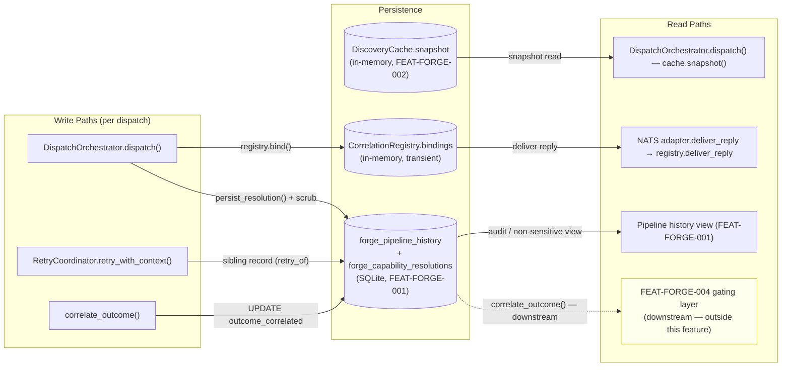
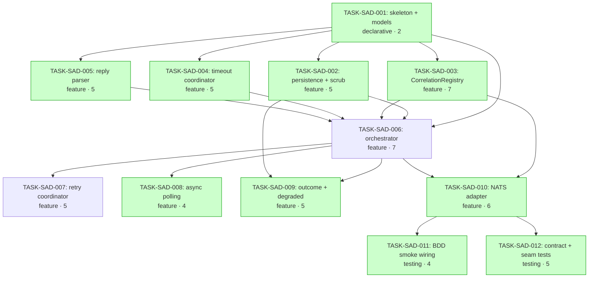

# Implementation Guide — FEAT-FORGE-003 Specialist Agent Delegation

**Source review**: [TASK-REV-SAD3](../../in_review/TASK-REV-SAD3-plan-specialist-agent-delegation.md)
**Report**: [.claude/reviews/TASK-REV-SAD3-review-report.md](../../../.claude/reviews/TASK-REV-SAD3-review-report.md)
**Recommended option**: Option 1 — Pure-domain `forge.dispatch` package + thin NATS adapter
**Aggregate complexity**: 8/10 · **Effort**: 26–34h · **Tasks**: 12 · **Waves**: 5

---

## §1: Architecture Summary

The feature lands a new pure-domain package `src/forge/dispatch/` mirroring
the proven `src/forge/discovery/` (domain) + `src/forge/adapters/nats/`
(transport) split. The dispatch callback seam already exists at
[pipeline_consumer.py](../../../src/forge/adapters/nats/pipeline_consumer.py)
(`DispatchBuild` callable type alias) — this feature provides the missing
callable.

```
src/forge/
├── discovery/             # FEAT-FORGE-002 (unchanged — read-only consumer)
│   ├── resolve.py
│   ├── cache.py
│   └── models.py          # CapabilityResolution — append `retry_of` field
└── dispatch/              # NEW — this feature
    ├── __init__.py
    ├── models.py          # SAD-001
    ├── persistence.py     # SAD-002
    ├── correlation.py     # SAD-003
    ├── timeout.py         # SAD-004
    ├── reply_parser.py    # SAD-005
    ├── orchestrator.py    # SAD-006
    ├── retry.py           # SAD-007
    ├── async_polling.py   # SAD-008
    └── outcome.py         # SAD-009 — correlate_outcome() + degraded synthesis

src/forge/adapters/nats/
├── pipeline_consumer.py   # FEAT-FORGE-002 (unchanged — supplies dispatch callback seam)
└── specialist_dispatch.py # SAD-010 — sole NATS import site for this feature
```

---

## §2: Data Flow — Read/Write Paths



**Caption**: All three write paths are connected to read paths. R4 (gating
layer consumption) is intentionally cross-feature — `correlate_outcome()`
exposes the seam; FEAT-FORGE-004 will land the consumer. No
disconnections.

**Disconnection check**: ✅ No write path lacks a read path. R4 is yellow
to flag the cross-feature seam, not a disconnection.

---

## §3: Integration Contract — Dispatch Sequence

```mermaid
sequenceDiagram
    participant PC as pipeline_consumer (FEAT-FORGE-002)
    participant DO as DispatchOrchestrator
    participant DC as DiscoveryCache
    participant DB as Persistence
    participant CR as CorrelationRegistry
    participant NA as NATS adapter
    participant SP as Specialist (external)

    PC->>DO: dispatch(capability, parameters)
    DO->>DC: snapshot()
    DC-->>DO: immutable view

    DO->>DO: resolve(snapshot, capability)

    alt unresolved
        DO-->>PC: Degraded(no_specialist_resolvable)
    else matched
        DO->>DB: persist_resolution + scrub sensitive
        Note over DO,DB: WRITE-BEFORE-SEND invariant

        DO->>CR: bind(correlation_key, matched_agent_id)
        CR->>NA: subscribe_reply(matched_id, key)
        NA-->>CR: subscription active
        CR-->>DO: binding (ready)
        Note over DO,CR: SUBSCRIBE-BEFORE-PUBLISH invariant (LES1)

        DO->>NA: publish_dispatch(attempt, parameters)
        NA->>SP: agents.command.{matched_id}
        Note over NA,SP: PubAck on audit stream ≠ success

        SP->>NA: agents.result.{matched_id}.{key}
        NA->>CR: deliver_reply(key, source_id, payload)

        alt source_id != matched_id
            CR->>CR: drop (E.reply-source-authenticity)
        else binding.accepted
            CR->>CR: drop (E.duplicate-reply-idempotency)
        else
            CR->>CR: accept; binding.future.set_result(payload)
        end

        CR-->>DO: payload (or None on timeout)
        DO->>DO: parse_reply(payload)
        DO-->>PC: SyncResult / AsyncPending / Degraded / DispatchError
    end
```

**Caption**: The two LES1-derived invariants
(write-before-send, subscribe-before-publish) are explicitly noted at the
sequence points where they apply. The "fetch then discard" anti-pattern
this guards against is impossible because every read of `payload` flows
through the registry's authentication/idempotency gate.

---

## §4: Integration Contracts (cross-task data dependencies)

### Contract: `CapabilityResolution` record schema

- **Producer task**: TASK-SAD-001
- **Consumer task(s)**: TASK-SAD-002 (persistence), TASK-SAD-006
  (orchestrator), TASK-SAD-007 (retry sibling), TASK-SAD-009
  (outcome correlation)
- **Artifact type**: Pydantic v2 model, persisted via SQLite
- **Format constraint**: Reuses `forge.discovery.models.CapabilityResolution`
  unchanged except for the **append-only** field
  `retry_of: Optional[str] = None`. **All existing FEAT-FORGE-002 callers
  must continue to work without modification.** No field is removed or
  renamed.
- **Validation method**: Coach verifies a Pydantic model schema test that
  asserts the union of FEAT-FORGE-002 and FEAT-FORGE-003 fields is
  preserved; a regression test against
  `tests/forge/discovery/test_discovery.py` confirms no breakage.

### Contract: `CorrelationKey` (per-dispatch correlation identifier)

- **Producer task**: TASK-SAD-003 (`CorrelationRegistry.fresh_correlation_key()`)
- **Consumer task(s)**: TASK-SAD-006 (orchestrator threads it into the
  publish payload), TASK-SAD-010 (NATS adapter uses it as the reply-channel
  suffix)
- **Artifact type**: opaque string
- **Format constraint**: 32 lowercase hex characters, generated via
  `secrets.token_hex(16)`. **No embedded agent IDs, timestamps, or other
  PII** — the correlation key MUST NOT be guessable from external
  knowledge of the request (security invariant supporting
  E.reply-source-authenticity).
- **Validation method**: Coach verifies `re.fullmatch(r"[0-9a-f]{32}",
  correlation_key)` in registry, orchestrator, and adapter tests. The
  contract test in TASK-SAD-012 asserts distinctness across 1000 generated
  keys.

### Contract: `DispatchOutcome` (discriminated sum type)

- **Producer task**: TASK-SAD-006 (orchestrator emits all four variants),
  TASK-SAD-008 (polling flips `AsyncPending → SyncResult`),
  TASK-SAD-009 (degraded synthesis)
- **Consumer task(s)**: external (FEAT-FORGE-004 gating layer) and the
  reasoning loop. **No internal consumer in this feature.**
- **Artifact type**: discriminated union `Literal["sync_result",
  "async_pending", "degraded", "error"]`
- **Format constraint**: every variant carries `resolution_id` and
  `attempt_no`. `sync_result` carries `coach_score: float | None`,
  `criterion_breakdown: dict`, `detection_findings: list`. `degraded`
  carries `reason: str`. `error` carries `error_explanation: str`. **No
  undocumented fields.** New fields require a documentation update in
  this section.
- **Validation method**: Coach verifies each variant has the documented
  fields via the contract test in TASK-SAD-012. CI rejects new fields
  without a corresponding doc update.

### Contract: dispatch-command envelope on `agents.command.{agent_id}`

- **Producer task**: TASK-SAD-010 (NATS adapter) using the
  `DispatchAttempt` and parameters from TASK-SAD-006
- **Consumer task(s)**: external specialist agents (out of scope) and
  FEAT-FORGE-002 test doubles (`FakeNatsClient`)
- **Artifact type**: NATS message
- **Format constraint**:
  - Command subject: `agents.command.{matched_agent_id}` (singular per
    Graphiti `architecture_decisions` ADR — adopted fleet-wide)
  - Reply subject: `agents.result.{matched_agent_id}.{correlation_key}`
  - Headers: `correlation_key` (32-hex), `requesting_agent_id` (`"forge"`),
    `dispatched_at` (ISO 8601 UTC)
- **Validation method**: Coach verifies subject regex
  `^agents\.command\.[a-z0-9-]+$` and reply subject regex
  `^agents\.result\.[a-z0-9-]+\.[0-9a-f]{32}$` in TASK-SAD-010 and
  TASK-SAD-012 tests.

### Contract: `correlate_outcome()` signature

- **Producer task**: TASK-SAD-009
- **Consumer task(s)**: external (FEAT-FORGE-004 gating layer). **No
  internal consumer in this feature.**
- **Artifact type**: pure synchronous function
- **Format constraint**: `correlate_outcome(resolution_id: str,
  gate_decision_id: str, *, db_writer) -> CapabilityResolution`.
  **Idempotent**: calling twice with the same args is a no-op (issues
  exactly one UPDATE). Sets `outcome_correlated=True`.
- **Validation method**: Coach verifies idempotency via TASK-SAD-009 unit
  test (mocks db_writer; asserts UPDATE count == 1 across two calls)
  and TASK-SAD-012 contract test (verifies signature stability across
  the FEAT-FORGE-004 boundary).

---

## §5: Task Dependency Graph



_Tasks with green background can run in parallel within their wave._

---

## §6: Wave Plan

| Wave | Tasks | Parallel? | Notes |
|---|---|---|---|
| 1 | SAD-001, SAD-002 | Yes | Foundations: models + persistence skeleton. SAD-002 declares `consumer_context` for SAD-001 but the contract is documented enough that they can be developed in parallel against the agreed schema. |
| 2 | SAD-003, SAD-004, SAD-005 | Yes | All three only depend on SAD-001 models. SAD-003 owns the canonical LES1 invariants and is the highest-complexity domain primitive in the feature. |
| 3 | SAD-006, SAD-007 | No (sequential) | SAD-006 (orchestrator) integrates everything from waves 1–2. SAD-007 (retry) builds on SAD-006. |
| 4 | SAD-008, SAD-009, SAD-010 | Yes | Specialist edges (polling, outcome correlation, NATS adapter). All three depend on SAD-006 but on different surfaces of it. |
| 5 | SAD-011, SAD-012 | Yes | Verification: BDD wiring + contract/seam tests. Both depend on SAD-010. |

**Recommended max parallel**: 3 (matching FEAT-FORGE-002's
`recommended_parallel: 3`).

**Total estimated duration (sequential)**: ~32 hours.
**With parallel execution (3 lanes)**: ~14–16 hours wall-clock.

---

## §7: Scenario Coverage Map (33/33)

The full per-scenario mapping is left to Step 11 (BDD scenario linking via
`feature-plan-bdd-link`), which writes `@task:` tags directly into
`features/specialist-agent-delegation/specialist-agent-delegation.feature`.

Group-level mapping (advisory — Step 11's matcher decides per-scenario):

| Scenario | Primary task |
|---|---|
| A.exact-tool-dispatch (smoke) | TASK-SAD-006 + TASK-SAD-011 |
| A.intent-pattern-fallback | TASK-SAD-006 (relies on existing resolver) |
| A.coach-output-top-vs-nested (smoke) | TASK-SAD-005 + TASK-SAD-011 |
| A.retry-with-additional-context | TASK-SAD-007 + TASK-SAD-011 |
| A.outcome-correlation | TASK-SAD-009 + TASK-SAD-011 |
| B.intent-min-confidence (in/out) | TASK-SAD-006 (boundary inherits resolver) |
| B.local-timeout (in/out) | TASK-SAD-004 |
| B.trust-tier-tie-break | TASK-SAD-006 (resolver behaviour) |
| B.queue-depth-tie-break | TASK-SAD-006 (resolver behaviour) |
| C.unresolved-capability | TASK-SAD-009 (degraded synthesis) |
| C.degraded-status-exclusion | TASK-SAD-006 (resolver behaviour) |
| C.specialist-error | TASK-SAD-005 |
| C.pubAck-not-success | TASK-SAD-003 + TASK-SAD-010 |
| C.wrong-correlation-reply | TASK-SAD-003 |
| C.missing-coach-score | TASK-SAD-005 |
| C.malformed-reply-envelope | TASK-SAD-005 |
| D.write-before-send-invariant | TASK-SAD-006 |
| D.subscribe-before-publish-invariant | TASK-SAD-003 + TASK-SAD-006 |
| D.unsubscribe-on-timeout | TASK-SAD-003 + TASK-SAD-004 |
| D.cache-freshness-on-join | TASK-SAD-006 (uses live cache) |
| D.cache-invalidation-on-deregister | TASK-SAD-006 (uses live cache) |
| D.async-mode-polling | TASK-SAD-008 |
| D.concurrent-dispatches-same-agent | TASK-SAD-003 + TASK-SAD-006 |
| E.reply-source-authenticity | TASK-SAD-003 |
| E.sensitive-parameter-hygiene | TASK-SAD-002 |
| E.trust-tier-supremacy | TASK-SAD-006 (resolver behaviour) |
| E.snapshot-stability | TASK-SAD-006 |
| E.concurrent-resolution-determinism | TASK-SAD-006 (uses snapshot read once) |
| E.duplicate-reply-idempotency | TASK-SAD-003 |
| E.bus-disconnect | TASK-SAD-009 + TASK-SAD-010 |
| E.registry-outage-stale-snapshot | TASK-SAD-009 |

**Coverage**: 33/33. All scenarios have at least one primary task.

---

## §8: Risk Register (lifted from review report)

See [.claude/reviews/TASK-REV-SAD3-review-report.md §4](../../../.claude/reviews/TASK-REV-SAD3-review-report.md)
for the full risk analysis. Top-severity items:

- **R1** Subscribe-before-publish ordering (LES1) — owned by TASK-SAD-003,
  asserted in TASK-SAD-011 step definition.
- **R3** Reply-source authenticity bypass — owned by TASK-SAD-003.
- **R4** Sensitive-parameter leak — owned by TASK-SAD-002 (schema-driven
  scrub at the persistence boundary, not orchestrator-driven).
- **R10** PubAck-not-success regression — owned by TASK-SAD-003 (registry
  ignores PubAck), asserted by dedicated test in TASK-SAD-012.

---

## §9: Pre-implementation Checklist

Before starting Wave 1:

- [ ] Confirm FEAT-FORGE-001 SQLite history table accepts the
      `forge_capability_resolutions` extension (or sibling table) without
      schema changes to the upstream feature.
- [ ] Confirm `nats_client` from FEAT-FORGE-002 bootstrap is reusable —
      do NOT open a new connection.
- [ ] Confirm `tests/bdd/conftest.py:FakeNatsClient` is the only test
      transport in use; do NOT introduce a parallel double.
- [ ] Confirm Step 11 (`feature-plan-bdd-link`) tagged the smoke and
      key-example scenarios with `@task:TASK-SAD-XXX` — this enables R2
      BDD oracle activation for `/task-work` Phase 4.

---

## §10: Downstream Surface (FEAT-FORGE-004)

This feature deliberately exposes the following stable contracts to
FEAT-FORGE-004 (Confidence-Gated Checkpoint Protocol):

- `DispatchOutcome` sum type — feeds the gate evaluator
- `correlate_outcome(resolution_id, gate_decision_id, *, db_writer)` —
  idempotent post-gate writeback
- `CapabilityResolution.outcome_correlated` boolean flag — observable from
  the gating layer

Do NOT change these signatures without coordinating with FEAT-FORGE-004's
plan.
